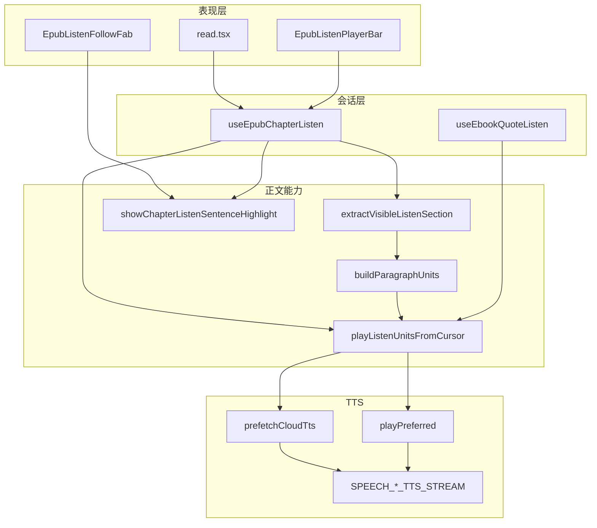
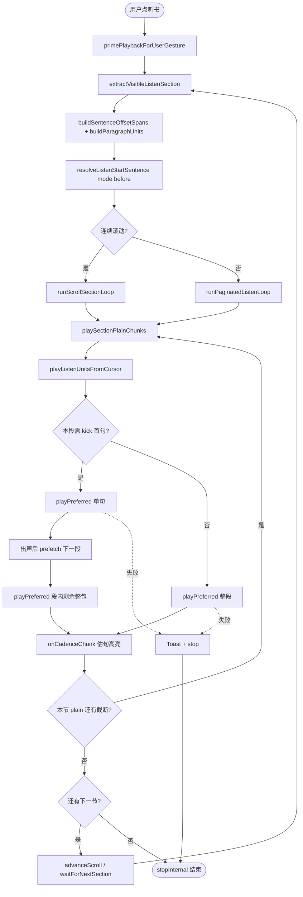
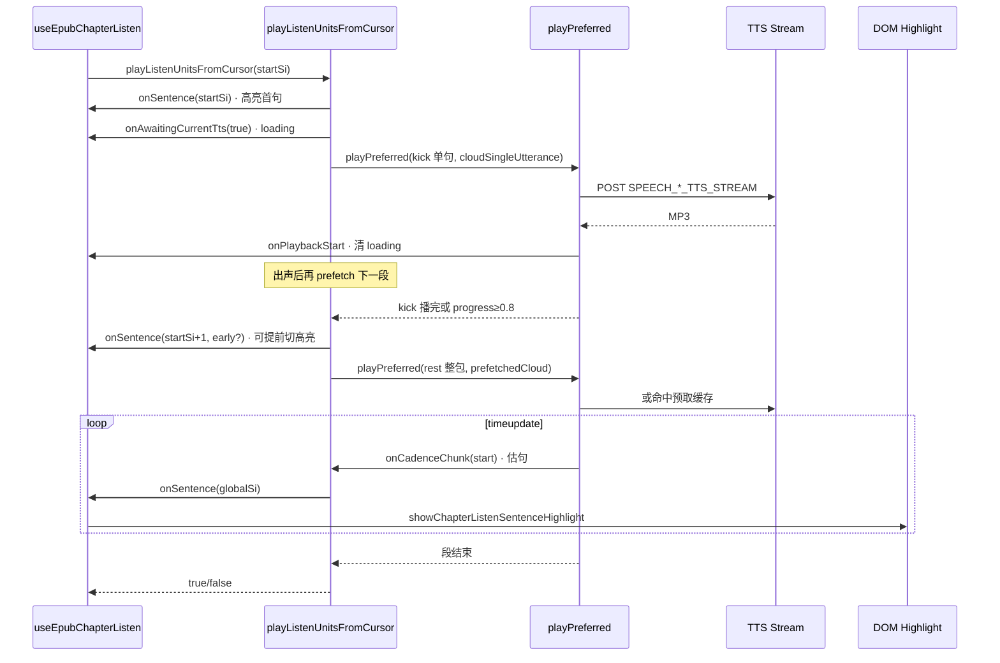
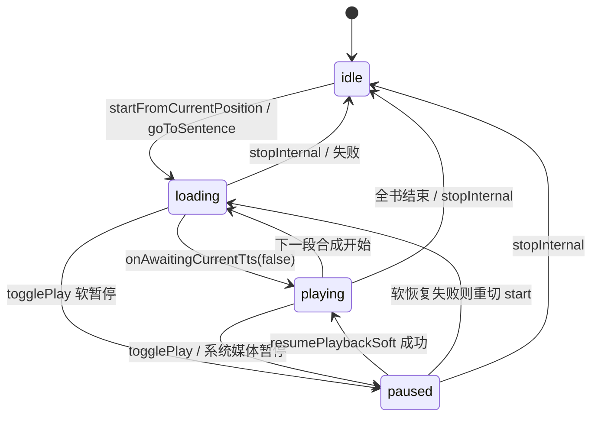

# EPUB 听书核心实现逻辑 — 梳理

> **状态**：核心能力已上线（本文为**现状梳理**，非从零规划）  
> **日期**：2026-08-13  
> **需求摘要**：把 Web/桌面 EPUB「听书」从入口到出声、切句高亮、跨节续播的整条链路讲清楚，并附上相关实现**完整源码**（含 `speech.ts` 听书必读节选）。

## 延伸阅读

- **开发者复刻手册**：[ebook/developer/EPUB听书开发.md](../../ebook/developer/EPUB听书开发.md)（功能点 F1–F25 全表）
- **按段 TTS 归档**：[ebook/EPUB听书段落朗读.md](../../ebook/EPUB听书段落朗读.md) · 规划脉络 [EPUB听书段落朗读.md](../epub/EPUB听书段落朗读.md)
- **切句提前量**：[ebook/EPUB听书节奏引导影响.md](../../ebook/EPUB听书节奏引导影响.md)
- **云端预取**：[ebook/EPUB听书云端预取影响.md](../../ebook/EPUB听书云端预取影响.md) · [ebook/EPUB听书启动后预取.md](../../ebook/EPUB听书启动后预取.md)
- **软暂停**：[ebook/EPUB听书软暂停.md](../../ebook/EPUB听书软暂停.md)
- **播放修复总览**：[ebook/EPUB听书播放修复2026-07.md](../../ebook/EPUB听书播放修复2026-07.md)

---

## 0. 读本文你将得到什么

- **听书做什么**：从当前阅读位置连续朗读 EPUB 正文，底栏控制播放/暂停/倍速/分句，当前句淡黄高亮并可选自动跟随。
- **一句话方案**：章节会话 Hook 抽「节 plain + 句表 + 段表」→ `playListenUnitsFromCursor` 首句快出声、余下按段整包 TTS → `onCadenceChunk` / kick 进度驱动句高亮 → 节末再进下一 iframe / spine。
- **分层**：UI（`read.tsx` + 底栏）→ 会话（`useEpubChapterListen`）→ 编排（`epubListenPlayUnits`）→ 出声（`speech.playPreferred`）→ 正文叠层（overlay / highlight）。
- **和「听当前」关系**：共用同一套按段播放与底栏；会话互斥（开一边停另一边）。
- **最大坑**：云端整段 MP3 **没有真句界时间戳**，切句靠「字符比例 + 0.35s lead」估算；高亮故意略提前，别和「悬浮条跟出声对齐」混用同一套回调语义。
- **完整源码**：§14 粘贴听书相关实现文件全文 + `speech.ts` 关键符号节选（以仓库当前文件为准）。

---

## 1. 需求与边界（现状）

### 1.1 用户故事

| 角色 | 场景 | 行为 | 期望结果 |
|------|------|------|----------|
| 读者 | EPUB 阅读 | 点顶栏耳机 | 从附近句子起连播；底栏出现；当前句淡黄底 |
| 读者 | 听书中 | 暂停 / 倍速 / 点分句 | 软暂停可续；倍速立即生效；从目标句重切段播 |
| 读者 | 连续滚动 / 分页 | 播到节末 | 自动进下一可视节或下一 spine |
| 读者 | 选区「听当前」 | PopBar / 想法引用听 | 只读该段；与听书互斥；同一底栏 |

### 1.2 范围

| 在范围内（本文梳理） | 不在范围内 |
|----------------------|------------|
| Web/Tauri EPUB 听书主链路与按段 TTS | PDF 听书；微信小程序听书 |
| 听当前与听书共用的 `playListenUnitsFromCursor` | 英语学习页单词喇叭 |
| 句高亮、预取、软暂停、cadence lead | TTS 服务端内部实现 |

### 1.3 约束与依赖

- 云端 TTS：MiniMax / Edge / 讯飞；本机 Web Speech；失败可降级。
- 单次合成有字节上限（约 8KB）→ 必须按段打包，超限回退 cadence 分包。
- 听书高亮需要「略提前」，与选区朗读悬浮条「跟出声对齐」目标不同。

---

## 2. 方案总览（一句话 + 要点）

**一句话方案**：会话层维护节上下文与世代号；播放层把句打包成段，首句单独合成快出声，同段剩余与后续段整包合成，用音频进度估算句界驱动高亮；预取错开到出声之后。

| # | 设计要点 | 理由 |
|---|----------|------|
| 1 | **合成单位 = 段**；**高亮单位 = 句** | 少 HTTP、韵律顺；UI 仍按句 |
| 2 | **首句 kick** 单独一路合成 | 首包快出声，不与整段预取抢带宽 |
| 3 | **`cloudSingleUtterance` + 字符比例估句** | 三源无统一 WordBoundary |
| 4 | **`CLOUD_CADENCE_LEAD_SEC = 0.35` + kick ≥0.8 提前切句** | 高亮略超前听感，盖住 timeupdate 滞后 |
| 5 | **世代号 `gen` + `isActive`** | 停播/重开不串旧回调 |
| 6 | **软暂停** | `Audio.pause` 不断会话，续播不重合成当前包 |

---

## 3. 现状与复用

| 能力 | 仓库中已有 | 用法 |
|------|------------|------|
| 章节听书会话 | `apps/frontend/src/views/ebook/hooks/useEpubChapterListen.ts` | 入口、状态、跨节循环 |
| 听当前会话 | `useEbookQuoteListen` | 复用同一播放编排 |
| 抽节 / 句 Range | `utils/epub/listen/epubListenChapter.ts` | plain + DOM Range |
| 段表 | `epubListenParagraphs.ts` → `buildParagraphUnits` | 软换行 + ~420 字打包 |
| 按段播放 | `epubListenPlayUnits.ts` → `playListenUnitsFromCursor` | 听书 / 听当前 / 选区朗读入口 |
| 纯文本入口 | `playListenPlainText.ts` | 无 EPUB 高亮（选区朗读） |
| TTS | `utils/speech.ts` → `playPreferred` / `prefetchCloudTts` | 出声与预取 |
| 底栏 UI | `EpubListenPlayerBar.tsx` | 进度、分句、倍速 |
| 叠层高亮 | `epubListenSegmentOverlay.ts` | 淡黄句背景、跟随 |

**调研结论**：听书「怎么播」的核心不在 `read.tsx`，而在 **Hook 会话循环 + `playListenUnitsFromCursor` + `speech` 估句**。UI 只消费 `status / sentenceIndex / rate`。

---

## 4. 架构图



**图内方法说明**：

| 方法 / 模块入口 | 功能 |
|-----------------|------|
| `useEpubChapterListen(...)` | 听书会话：持 status/句光标/倍速；暴露 start/stop/togglePlay/goToSentence |
| `useEbookQuoteListen(...)` | 听当前会话；与听书互斥，共用底栏与 `playListenUnitsFromCursor` |
| `extractVisibleListenSection(rend)` | 从当前可视/文档抽 plain + outerRange，供建句表 |
| `buildParagraphUnits(plain, sentences)` | 按换行软段 + 字数/字节上限打包成合成单元 |
| `playListenUnitsFromCursor(args)` | 从 startSi 起：kick 首句 → 段尾整包 → 下一段；回调 onSentence / onAwaiting |
| `prefetchCloudTts(raw, { whole })` | 预取下一段整包 MP3；不触发播放 loading |
| `playPreferred(raw, opts)` | 选路本机/云端；`cloudSingleUtterance` 时整段一次合成并用进度估句 |
| `showChapterListenSentenceHighlight(rend, range)` | 在句 DOM Range 上画淡黄播放背景 |

**读图要点**：

- 数据下行：UI → Hook → 抽节/打包 → 播放编排 → TTS。
- 高亮上行：`onSentence` → Hook 更新光标 → overlay。
- 选区朗读只复用 `playListenPlainText` → `playListenUnitsFromCursor`，不经过章节 Hook。

---

## 5. 主流程图



**图内方法说明**：

| 方法 | 功能 |
|------|------|
| `primePlaybackForUserGesture()` | 用户手势内解锁 Audio/Speech，降低 autoplay 拦截 |
| `extractVisibleListenSection(...)` | 取当前节纯文本与外层 Range |
| `buildSentenceOffsetSpans(plain)` | 按标点切句，得到 plain 内 [start,end) |
| `resolveListenStartSentence(..., 'before')` | 从阅读位置落到「当前或之前」最近句 |
| `runScrollSectionLoop(gen)` | 连续滚动：播完一节后 `advanceScrollListenSection` 进下一 iframe |
| `runPaginatedListenLoop(gen)` | 分页：节末 `waitForNextSection` 翻 spine 再播 |
| `playSectionPlainChunks(rend, ctx, gen)` | 超长节按 MAX_PLAIN 切片循环调用按段播放 |
| `playListenUnitsFromCursor(...)` | 见 §4；返回 false 表示中断/暂停 |
| `advanceScrollListenSection(...)` | 滚动模式下定位下一听书节并重建上下文 |

**读图要点**：

- 入口永远先抽节再定 startSi，再进「节循环」。
- 每一节内部是「plain 切片 → 按段播放」；跨节才分滚动/分页两岔。
- 失败路径统一 Toast + `stopInternal`，避免僵尸会话。

---

## 6. 核心时序图（一段内：kick + 整包）



**图内方法说明**：

| 方法 | 功能 |
|------|------|
| `playListenUnitsFromCursor(args)` | 编排 kick / rest / 后续 unit；统一 `isActive` / `getRate` |
| `onSentence(si, info)` | Hook 更新 `sentenceIndex` 并刷新淡黄底；`early` 表示 kick 尾声抢跑 |
| `onAwaitingCurrentTts(waiting)` | 仅阻塞播放的合成/下载为 true；预取不触发 |
| `playPreferred(raw, opts)` | 实际出声；云端单段时用 currentTime 比例估句并发 cadence |
| `onCadenceChunk({ phase, sentenceIndex })` | 段内句开始/结束；听书只消费 `phase==='start'` |
| `showChapterListenSentenceHighlight(rend, range)` | 把全局句下标映射到 DOM Range 后绘制 |

**读图要点**：

- **loading** 跟「当前要播的包」绑定，不是整本书一条 loading。
- **预取**故意晚于首包出声，避免和首句 HTTP 抢带宽。
- 高亮可以早于听感（lead / kick 0.8）；这是听书产品选择，不是 bug。

---

## 7. 状态机



**图内方法说明**：

| 方法 | 功能 |
|------|------|
| `startFromCurrentPosition()` | 建会话、抽节、起 gen、进滚动或分页循环 |
| `togglePlay()` | playing/loading → 软暂停；paused → 软恢复或重播 |
| `pausePlaybackSoft()` / `resumePlaybackSoft()` | 暂停/恢复底层 Audio，不断 TTS 世代语义上的「包」 |
| `stopInternal()` | 升世代、停媒体、清高亮、status→idle |
| `onAwaitingCurrentTts(waiting)` | 驱动 loading ↔ playing，勿在 cadence 里写 playing |

---

## 8. 模块职责与关键算法

### 8.1 模块一览

| 模块 | 职责 | 路径 |
|------|------|------|
| 阅读页接线 | 耳机、底栏、FAB、互斥 stop | `views/ebook/read.tsx` |
| 章节会话 | 状态、跨节、分句跳转 | `hooks/useEpubChapterListen.ts` |
| 段打包 | 合成单元边界 | `utils/epub/listen/epubListenParagraphs.ts` |
| 播放编排 | kick / 整包 / 预取时机 | `utils/epub/listen/epubListenPlayUnits.ts` |
| TTS | 选路、缓存、估句 lead | `utils/speech.ts` |
| 叠层 | 句背景、跟随、DOM remount | `utils/epub/listen/epubListenSegmentOverlay.ts` |

### 8.2 段打包（`buildParagraphUnits`）

1. `buildSentenceOffsetSpans` 得全局句表。  
2. 按 `\n+` 切软段，把句中点归属到软段。  
3. `packSpeakUnits`：从句下标前进，优先在软段末切开；凑约 **420 字**；UTF-8 不超过约 **7500 字节**（给 Edge/讯飞留余量）。

产出 `ParagraphUnit { start, end, siStart, siEnd }`。

### 8.3 按段播放（`playListenUnitsFromCursor`）伪代码

```typescript
// 签名级草图 ≤30 行
async function playListenUnitsFromCursor(args) {
  let kickSentence = true;
  for (pi of units from startSi) {
    if (kickSentence) {
      onSentence(startSi);
      await playCurrent(单句, { onPlaybackProgress: ≥0.8 → onSentence(next, { early: true }) });
      // 出声后 prefetch 同段剩余或下一段
      await playCurrent(段内剩余, { onCadenceChunk: start → onSentence(globalSi) });
      kickSentence = false;
    } else {
      onSentence(startSi);
      await playCurrent(整段, { onCadenceChunk: ... });
    }
  }
}
```

### 8.4 云端估句（`playCloudTtsSingleUtterance`）

- 整段一次 HTTP → `HTMLAudioElement` 播放。  
- `leadTime = currentTime + 0.35`，再 `ratio * plain.length` 映射字符偏移 → `sentenceIndex`。  
- **故意提前**：补偿 timeupdate 稀疏与听感滞后；高亮可早于真实出声。  
- 听书 Hook **不要**在 cadence 里写 `status: playing`（注释已写明，以免盖掉 loading）。

### 8.5 数据模型（会话内）

| 字段 | 来源 | 存储 | 说明 |
|------|------|------|------|
| `status` | Hook state | 内存 | idle/loading/playing/paused |
| `sentenceIndex` | onSentence | 内存 | 全局句下标 |
| `sentenceLabels` | plain 切片 | 内存 | 底栏分句列表 |
| `rate` | 用户/落库 | 内存 + 可选持久化 | 每次 `getRate()` 读取 |
| `gen` / `seqRef` | ref | 内存 | 停播作废旧异步 |
| `SectionCtx` | 抽节 | ref | plain、句表、段表、Ranges |

---

## 9. 分阶段理解路径（读代码建议）

| 阶段 | 目标 | 建议阅读顺序 |
|------|------|--------------|
| M1 | 搞清会话状态 | `useEpubChapterListen`：`startFromCurrentPosition` → `stopInternal` → `togglePlay` |
| M2 | 搞清一节怎么播 | `playSectionPlainChunks` → `playListenUnitsFromCursor` |
| M3 | 搞清出声与估句 | `playPreferred` → `playCloudTtsSingleUtterance`（lead） |
| M4 | 搞清跨节 | `runScrollSectionLoop` / `runPaginatedListenLoop` |
| M5 | 搞清高亮 | `onSentence` → `showChapterListenSentenceHighlight` |

每阶段自检：

- [ ] 能说出 loading 何时亮、何时灭  
- [ ] 能说出首句为何单独合成  
- [ ] 能说出高亮为何可能早于听感  
- [ ] 能说出暂停是软暂停还是 stop  

---

## 10. 关键决策与备选

| 决策 | 选用 | 备选 | 为何不选备选 |
|------|------|------|--------------|
| 段内切句 | 字符比例 + lead | Edge WordBoundary / 厂商字幕 | 三源不一致；小程序可另走 timed |
| 首句策略 | 单句 kick | 整段一次合成 | 首包延迟大、与预取抢带宽 |
| 暂停 | 软暂停 Audio | 每次 stop 重合成 | 续播体验差、费流量 |
| 高亮时机 | 略提前 | 严格跟 currentTime | 听书要「眼先于耳」；悬浮条对齐另做 |

---

## 11. 风险、边界与易混点

| 项 | 等级 | 说明 | 缓解 |
|----|------|------|------|
| 估句漂移 | 中 | 中英混排、句间长停顿时字符比例不准 | lead 掩盖听书高亮；精确跟读需另方案 |
| 预取与首包 | 中 | 并行会拖慢首句 | 出声后再 `prefetchCloudTts` |
| 世代串台 | 高 | 旧 await 回调改新会话 UI | `gen` / `isActive` / `seqRef` |
| 选区朗读复用 | 中 | 同一 `onSentence` 提前语义不适合悬浮条 | 选区侧忽略 `early` + 自建进度映射 |
| DOM remount | 中 | 滚动后 Range 失效 | `rebindSectionDomRanges` / remount 注册 |

**易混点**：

- `onAwaitingCurrentTts` ≠ 预取中；预取静默。  
- `onSentence(..., { early: true })` 只来自 kick 进度 ≥0.8，表示「下一句高亮可抢跑」。  
- `playListenPlainText` 仍走同一编排；要「跟出声对齐」不能指望听书 lead。

---

## 12. 验收清单（对照行为）

| # | 用例 | 步骤 | 期望 |
|---|------|------|------|
| AC1 | 起播 | 打开 EPUB → 听书 | 首句较快出声；底栏 loading→playing |
| AC2 | 句高亮 | 连播多句 | 淡黄底随句移动，可略早于听感 |
| AC3 | 暂停续播 | 播放中暂停再开 | 从断点附近续，不整章重来 |
| AC4 | 分句跳转 | 底栏点第 N 句 | 停旧包，从 N 重切段播 |
| AC5 | 跨节 | 滚到节末继续听 | 自动进下一节，无永久卡死 |
| AC6 | 互斥 | 听书中点听当前 | 听书停，听当前起 |

---

## 13. 源码地图（实现对照）

| 类型 | 路径 |
|------|------|
| 会话 | `apps/frontend/src/views/ebook/hooks/useEpubChapterListen.ts` |
| 编排 | `apps/frontend/src/views/ebook/utils/epub/listen/epubListenPlayUnits.ts` |
| 段表 | `apps/frontend/src/views/ebook/utils/epub/listen/epubListenParagraphs.ts` |
| 抽节 | `apps/frontend/src/views/ebook/utils/epub/listen/epubListenChapter.ts` |
| TTS | `apps/frontend/src/utils/speech.ts` |
| 底栏 | `apps/frontend/src/views/ebook/components/listen/EpubListenPlayerBar.tsx` |
| 接线 | `apps/frontend/src/views/ebook/read.tsx` |

---

## 14. 相关实现完整源码
> 以下摘录以仓库当前文件为准；听书相关业务文件为**完整文件**粘贴；`speech.ts` 贴听书链路**完整函数体**（§14.10），其余 TTS 基建见源文件。

### 14.0 文件清单

| 模块 | 路径 | 行数 |
|------|------|------|
| playListenPlainText.ts | `apps/frontend/src/views/ebook/utils/epub/listen/playListenPlainText.ts` | 41 |
| epubListenParagraphs.ts | `apps/frontend/src/views/ebook/utils/epub/listen/epubListenParagraphs.ts` | 186 |
| epubListenPlayUnits.ts | `apps/frontend/src/views/ebook/utils/epub/listen/epubListenPlayUnits.ts` | 307 |
| epubScrollListenAdvance.ts | `apps/frontend/src/views/ebook/utils/epub/listen/epubScrollListenAdvance.ts` | 207 |
| epubListenChapter.ts | `apps/frontend/src/views/ebook/utils/epub/listen/epubListenChapter.ts` | 811 |
| epubListenMarkHighlight.ts | `apps/frontend/src/views/ebook/utils/epub/listen/epubListenMarkHighlight.ts` | 462 |
| epubListenSegmentOverlay.ts | `apps/frontend/src/views/ebook/utils/epub/listen/epubListenSegmentOverlay.ts` | 860 |
| useEpubChapterListen.ts | `apps/frontend/src/views/ebook/hooks/useEpubChapterListen.ts` | 1086 |
| EpubListenPlayerBar.tsx | `apps/frontend/src/views/ebook/components/listen/EpubListenPlayerBar.tsx` | 849 |
| useEbookQuoteListen.ts | `apps/frontend/src/views/ebook/hooks/useEbookQuoteListen.ts` | 181 |
| speech.ts（听书相关完整函数） | `apps/frontend/src/utils/speech.ts` | 见 §14.10（stop/软暂停、句界、prefetch、cadence/single/packed、playPreferred） |

---

### 14.1 playListenPlainText.ts — 纯文本入口（选区朗读也走这里）

**来源**：`apps/frontend/src/views/ebook/utils/epub/listen/playListenPlainText.ts` · 约 L1–L41（完整文件）

```ts
/**
 * 无 EPUB 高亮的听当前同款播法：首句快出声，其后按段整包 TTS（cloudSingleUtterance）。
 */
import { buildSentenceOffsetSpans, stripMarkdownForTts } from '@/utils/speech';
import { buildParagraphUnits } from './epubListenParagraphs';
import { playListenUnitsFromCursor } from './epubListenPlayUnits';

export async function playListenPlainText(
	rawText: string,
	options?: {
		isActive?: () => boolean;
		getRate?: () => number;
		onAwaitingCurrentTts?: (waiting: boolean) => void;
		onSentence?: (si: number, info: { forceCenter?: boolean; early?: boolean }) => void;
		onAudioTime?: (info: {
			text: string;
			baseSi: number;
			currentTime: number;
			duration: number;
		}) => void;
	},
): Promise<boolean> {
	const plain = stripMarkdownForTts(rawText).trim();
	if (!plain) return false;
	const sentences = buildSentenceOffsetSpans(plain);
	if (sentences.length === 0) return false;
	const units = buildParagraphUnits(plain, sentences);
	if (units.length === 0) return false;

	return playListenUnitsFromCursor({
		plain,
		sentences,
		units,
		startSi: 0,
		getRate: options?.getRate ?? (() => 1),
		isActive: options?.isActive ?? (() => true),
		onSentence: options?.onSentence ?? (() => {}),
		onAwaitingCurrentTts: options?.onAwaitingCurrentTts,
		onAudioTime: options?.onAudioTime,
	});
}
```

**读完应掌握**：见上文架构/流程；本文件路径 `apps/frontend/src/views/ebook/utils/epub/listen/playListenPlainText.ts`。

---

### 14.2 epubListenParagraphs.ts — 段打包

**来源**：`apps/frontend/src/views/ebook/utils/epub/listen/epubListenParagraphs.ts` · 约 L1–L186（完整文件）

```ts
/**
 * 听书/听当前：把节/选区 plain 切成「合成单元」（多句打包），供按段 TTS + 逐句高亮。
 * ponytail: 不盲信 \n——网文常一句一 <p>；也不整节一次（易超 Edge/讯飞 8KB 回退逐句）。
 */
import { buildSentenceOffsetSpans, stripMarkdownForTts } from '@/utils/speech';

export type ParagraphUnit = {
	/** 段在 plain 内 [start, end) */
	start: number;
	end: number;
	/** 覆盖的全局句下标 [siStart, siEnd) */
	siStart: number;
	siEnd: number;
};

type SentenceSpan = { start: number; end: number };

/** 软目标：凑够约这么多字再在段落边界切开 */
const SPEAK_TARGET_CHARS = 420;
/** 硬上限：略低于 Edge/讯飞 8000 字节 */
const SPEAK_MAX_BYTES = 7500;

function utf8Bytes(text: string): number {
	return new TextEncoder().encode(text).length;
}

/** 按换行切出 plain 内软段落 [start, end) */
function splitPlainParagraphSpans(
	plain: string,
): Array<{ start: number; end: number }> {
	const spans: Array<{ start: number; end: number }> = [];
	const re = /\n+/gu;
	let last = 0;
	let m = re.exec(plain);
	while (m !== null) {
		if (m.index > last) spans.push({ start: last, end: m.index });
		last = m.index + m[0].length;
		m = re.exec(plain);
	}
	if (last < plain.length) spans.push({ start: last, end: plain.length });
	return spans.filter((s) => plain.slice(s.start, s.end).trim().length > 0);
}

function assignSentencesToParagraphs(
	paraSpans: Array<{ start: number; end: number }>,
	sentences: SentenceSpan[],
): ParagraphUnit[] {
	if (paraSpans.length === 0 || sentences.length === 0) return [];

	const units: ParagraphUnit[] = paraSpans.map((p) => ({
		start: p.start,
		end: p.end,
		siStart: -1,
		siEnd: -1,
	}));

	for (let si = 0; si < sentences.length; si += 1) {
		const sent = sentences[si]!;
		const mid = (sent.start + sent.end) / 2;
		let pi = paraSpans.findIndex((p) => mid >= p.start && mid < p.end);
		if (pi < 0) {
			pi = paraSpans.findIndex((p) => sent.start < p.end && sent.end > p.start);
		}
		if (pi < 0) pi = units.length - 1;
		const unit = units[pi]!;
		if (unit.siStart < 0) unit.siStart = si;
		unit.siEnd = si + 1;
	}

	return units.filter((u) => u.siStart >= 0 && u.siEnd > u.siStart);
}

/**
 * 按句打包合成单元：优先在软段落下刀，凑够 targetChars；永不超 maxBytes。
 */
function packSpeakUnits(
	plain: string,
	sentences: SentenceSpan[],
	softUnits: ParagraphUnit[],
	targetChars: number,
	maxBytes: number,
): ParagraphUnit[] {
	if (sentences.length === 0) return [];

	const softEndSi = new Set(softUnits.map((u) => u.siEnd));
	const out: ParagraphUnit[] = [];
	let startSi = 0;

	while (startSi < sentences.length) {
		let endSi = startSi;
		while (endSi < sentences.length) {
			const nextEnd = endSi + 1;
			const slice = plain.slice(
				sentences[startSi]!.start,
				sentences[nextEnd - 1]!.end,
			);
			if (utf8Bytes(slice) > maxBytes) break;
			endSi = nextEnd;
			if (slice.length >= targetChars && softEndSi.has(endSi)) break;
			if (slice.length >= targetChars * 2) break;
		}
		if (endSi <= startSi) endSi = startSi + 1;

		out.push({
			start: sentences[startSi]!.start,
			end: sentences[endSi - 1]!.end,
			siStart: startSi,
			siEnd: endSi,
		});
		startSi = endSi;
	}

	return out;
}

/**
 * 由 plain + 句表构建合成单元（多句一段，受字节上限约束）。
 */
export function buildParagraphUnits(
	plain: string,
	sentences?: SentenceSpan[],
): ParagraphUnit[] {
	const trimmed = plain.trim();
	if (!trimmed) return [];
	const spans = sentences ?? buildSentenceOffsetSpans(trimmed);
	if (spans.length === 0) return [];

	const paraSpans = splitPlainParagraphSpans(trimmed);
	const softUnits =
		paraSpans.length <= 1
			? [
					{
						start: 0,
						end: trimmed.length,
						siStart: 0,
						siEnd: spans.length,
					},
				]
			: assignSentencesToParagraphs(paraSpans, spans);

	const soft =
		softUnits.length > 0
			? softUnits
			: [
					{
						start: 0,
						end: trimmed.length,
						siStart: 0,
						siEnd: spans.length,
					},
				];

	return packSpeakUnits(
		trimmed,
		spans,
		soft,
		SPEAK_TARGET_CHARS,
		SPEAK_MAX_BYTES,
	);
}

export function paragraphIndexForSentence(
	units: ParagraphUnit[],
	sentenceIndex: number,
): number {
	if (units.length === 0) return -1;
	for (let i = 0; i < units.length; i += 1) {
		const u = units[i]!;
		if (sentenceIndex >= u.siStart && sentenceIndex < u.siEnd) return i;
	}
	if (sentenceIndex < units[0]!.siStart) return 0;
	return units.length - 1;
}

/** 从句 si 截到该合成单元末的 TTS 文本 */
export function sliceParagraphFromSentence(
	plain: string,
	unit: ParagraphUnit,
	sentences: SentenceSpan[],
	si: number,
): string {
	const clamped = Math.min(unit.siEnd - 1, Math.max(unit.siStart, si));
	const sent = sentences[clamped];
	if (!sent) return '';
	return stripMarkdownForTts(plain.slice(sent.start, unit.end)).trim();
}
```

**读完应掌握**：见上文架构/流程；本文件路径 `apps/frontend/src/views/ebook/utils/epub/listen/epubListenParagraphs.ts`。

---

### 14.3 epubListenPlayUnits.ts — kick + 按段播放编排（听书心脏）

**来源**：`apps/frontend/src/views/ebook/utils/epub/listen/epubListenPlayUnits.ts` · 约 L1–L307（完整文件）

```ts
/**
 * 听书/听当前：首句（及切句后首包）逐句合成快出声；
 * 同段剩余与后续单元按段合成。
 * 预取错开到「当前段真正出声之后」，避免与首包 HTTP 并行抢带宽。
 */
import {
	playPreferred,
	prefetchCloudTts,
	stripMarkdownForTts,
} from '@/utils/speech';
import {
	type ParagraphUnit,
	paragraphIndexForSentence,
	sliceParagraphFromSentence,
} from './epubListenParagraphs';

type SentenceSpan = { start: number; end: number };

export type PlayListenUnitsArgs = {
	plain: string;
	sentences: SentenceSpan[];
	units: ParagraphUnit[];
	startSi: number;
	/** 每次起播时取当前倍速（勿在段循环外快照，否则中途调速会丢） */
	getRate: () => number;
	isActive: () => boolean;
	onSentence: (si: number, info: { forceCenter?: boolean; early?: boolean }) => void;
	onUnitIdle?: () => void;
	scrollCenterOnFirst?: boolean;
	/**
	 * 当前正要播放的单元 TTS 等待中（true）/ 已出声或结束（false）。
	 * 仅阻塞播放的请求；prefetchCloudTts 不触发。
	 */
	onAwaitingCurrentTts?: (waiting: boolean) => void;
	/** 当前这段音频的真实进度（选区朗读预览用；听书勿接） */
	onAudioTime?: (info: {
		text: string;
		baseSi: number;
		currentTime: number;
		duration: number;
	}) => void;
};

function sentenceRaw(
	plain: string,
	sentences: SentenceSpan[],
	si: number,
): string {
	const sent = sentences[si];
	if (!sent) return '';
	return stripMarkdownForTts(plain.slice(sent.start, sent.end)).trim();
}

/** 只触发一次的预取调度（出声回调 + await 后兜底） */
function oncePrefetch(run: () => void): () => void {
	let done = false;
	return () => {
		if (done) return;
		done = true;
		run();
	};
}

/**
 * @returns true = 播完且仍 active；false = 中断/暂停
 * @throws playPreferred 失败时原样抛出
 */
export async function playListenUnitsFromCursor(
	args: PlayListenUnitsArgs,
): Promise<boolean> {
	const {
		plain,
		sentences,
		units,
		getRate,
		isActive,
		onSentence,
		onUnitIdle,
		scrollCenterOnFirst,
		onAwaitingCurrentTts,
		onAudioTime,
	} = args;
	const loopStartSi = args.startSi;

	if (units.length === 0 || sentences.length === 0) return false;

	const prefetchedByText = new Map<
		string,
		ReturnType<typeof prefetchCloudTts>
	>();

	const schedulePrefetch = (paraIndex: number, fromSi: number) => {
		if (!isActive()) return;
		if (paraIndex >= units.length) return;
		const unit = units[paraIndex]!;
		const raw = sliceParagraphFromSentence(plain, unit, sentences, fromSi);
		if (!raw || prefetchedByText.has(raw)) return;
		prefetchedByText.set(raw, prefetchCloudTts(raw, { whole: true }));
	};

	/** 当前播放路径的 TTS 等待；预取勿走这里 */
	const playCurrent = async (
		raw: string,
		opts: Parameters<typeof playPreferred>[1],
	) => {
		onAwaitingCurrentTts?.(true);
		try {
			const notifyStart = opts?.onPlaybackStart;
			await playPreferred(raw, {
				...opts,
				onAwaitingPlayback: onAwaitingCurrentTts,
				onPlaybackStart: () => {
					onAwaitingCurrentTts?.(false);
					notifyStart?.();
				},
			});
		} finally {
			onAwaitingCurrentTts?.(false);
		}
	};

	let si = Math.max(0, Math.min(args.startSi, sentences.length - 1));
	let pi = paragraphIndexForSentence(units, si);
	if (pi < 0) return false;

	/** 本轮需逐句首包；单句段（章标题等）不消耗，留给下一段正文 */
	let kickSentence = true;

	for (; pi < units.length; pi += 1) {
		if (!isActive()) return false;

		const unit = units[pi]!;
		const startSi = Math.max(si, unit.siStart);
		if (startSi >= unit.siEnd) continue;

		// —— 首包：只合成当前句（1 路 HTTP）；出声后再预取，避免与首包抢带宽 ——
		if (kickSentence) {
			const kickRaw = sentenceRaw(plain, sentences, startSi);
			if (!kickRaw) {
				si = startSi + 1;
				continue;
			}

			onSentence(startSi, {
				forceCenter: !!scrollCenterOnFirst && startSi === loopStartSi,
			});

			const prefetchAfterKickStart = oncePrefetch(() => {
				if (startSi + 1 < unit.siEnd) {
					schedulePrefetch(pi, startSi + 1);
				} else if (pi + 1 < units.length) {
					schedulePrefetch(pi + 1, units[pi + 1]!.siStart);
				}
			});

			/** 首包尾声提前切到下一句，避免等 kick 整段 ended 才改预览 */
			let kickAdvanced = false;
			await playCurrent(kickRaw, {
				speak: { rate: getRate() },
				cloudSingleUtterance: true,
				onPlaybackStart: () => {
					prefetchAfterKickStart();
					onAudioTime?.({
						text: kickRaw,
						baseSi: startSi,
						currentTime: 0,
						duration: 0,
					});
				},
				onPlaybackProgress: (event) => {
					onAudioTime?.({
						text: kickRaw,
						baseSi: startSi,
						currentTime: event.currentTime,
						duration: event.duration,
					});
					if (!isActive() || kickAdvanced) return;
					if (event.progress < 0.8) return;
					if (startSi + 1 >= unit.siEnd) return;
					kickAdvanced = true;
					onSentence(startSi + 1, { early: true });
				},
			});
			// 本机无 onPlaybackStart 时仍兜底预取，保证后续等待不被拉长
			prefetchAfterKickStart();

			if (!isActive()) return false;
			onUnitIdle?.();
			si = startSi + 1;

			// 单句合成单元（目录切章后常见标题）：不消耗 kick，下一段正文仍逐句首包
			if (si >= unit.siEnd) {
				continue;
			}

			kickSentence = false;

			const restRaw = sliceParagraphFromSentence(plain, unit, sentences, si);
			if (!restRaw) {
				si = unit.siEnd;
				continue;
			}

			const restStartSi = si;
			if (!kickAdvanced) onSentence(restStartSi, {});

			const prefetchAfterRestStart = oncePrefetch(() => {
				if (pi + 1 < units.length) {
					schedulePrefetch(pi + 1, units[pi + 1]!.siStart);
				}
			});

			await playCurrent(restRaw, {
				speak: { rate: getRate() },
				prefetchedCloud: prefetchedByText.get(restRaw) ?? null,
				cloudSingleUtterance: true,
				onPlaybackStart: () => {
					prefetchAfterRestStart();
					onAudioTime?.({
						text: restRaw,
						baseSi: restStartSi,
						currentTime: 0,
						duration: 0,
					});
				},
				onPlaybackProgress: (event) => {
					onAudioTime?.({
						text: restRaw,
						baseSi: restStartSi,
						currentTime: event.currentTime,
						duration: event.duration,
					});
				},
				onCadenceChunk: (event) => {
					if (event.phase !== 'start') return;
					if (!isActive()) return;
					const globalSi = restStartSi + event.sentenceIndex;
					if (globalSi < unit.siStart || globalSi >= unit.siEnd) return;
					onSentence(globalSi, {});
				},
			});
			prefetchAfterRestStart();

			if (!isActive()) return false;
			onUnitIdle?.();
			si = unit.siEnd;
			continue;
		}

		// —— 后续单元：整段合成；出声后再预取下一段 ——
		const spokenRaw = sliceParagraphFromSentence(
			plain,
			unit,
			sentences,
			startSi,
		);
		if (!spokenRaw) {
			si = unit.siEnd;
			continue;
		}

		onSentence(startSi, {});

		const prefetchAfterUnitStart = oncePrefetch(() => {
			if (pi + 1 < units.length) {
				schedulePrefetch(pi + 1, units[pi + 1]!.siStart);
			}
		});

		await playCurrent(spokenRaw, {
			speak: { rate: getRate() },
			prefetchedCloud: prefetchedByText.get(spokenRaw) ?? null,
			cloudSingleUtterance: true,
			onPlaybackStart: () => {
				prefetchAfterUnitStart();
				onAudioTime?.({
					text: spokenRaw,
					baseSi: startSi,
					currentTime: 0,
					duration: 0,
				});
			},
			onPlaybackProgress: (event) => {
				onAudioTime?.({
					text: spokenRaw,
					baseSi: startSi,
					currentTime: event.currentTime,
					duration: event.duration,
				});
			},
			onCadenceChunk: (event) => {
				if (event.phase !== 'start') return;
				if (!isActive()) return;
				const globalSi = startSi + event.sentenceIndex;
				if (globalSi < unit.siStart || globalSi >= unit.siEnd) return;
				onSentence(globalSi, {});
			},
		});
		prefetchAfterUnitStart();

		if (!isActive()) return false;
		onUnitIdle?.();
		si = unit.siEnd;
	}

	return isActive();
}
```

**读完应掌握**：见上文架构/流程；本文件路径 `apps/frontend/src/views/ebook/utils/epub/listen/epubListenPlayUnits.ts`。

---

### 14.4 epubScrollListenAdvance.ts — 连续滚动跨节

**来源**：`apps/frontend/src/views/ebook/utils/epub/listen/epubScrollListenAdvance.ts` · 约 L1–L207（完整文件）

```ts
/**
 * 连续滚动听书：当前 iframe 播完后，按 .epub-view 槽位加载下一 iframe。
 * 不合并句流、不 rend.display、不 rend.next。
 */
import type { Rendition } from 'epubjs';
import { stripMarkdownForTts } from '@/utils/speech';
import { getEpubScrollContainer } from '../reader/epubScrolledNav';

// 滚动边缘间距（像素），用于滚动定位向前腾出视野
const SCROLL_EDGE_PX = 16;
// 检查 slot 文档的最大尝试次数
const SLOT_TRIES = 8;
// 尝试推进 scroll listen 章节的最大轮次（每轮可能提前滚动并触发加载）
const ADVANCE_ROUNDS = 5;

// epub 滚动槽的类型，包含视图元素和可挂载的文档对象（可为空表示未加载或跨域）
type EpubViewSlot = {
	viewEl: HTMLElement; // .epub-view 容器元素
	doc: Document | null; // 内嵌 iframe 上的 Document（或 null）
};

// 等待浏览器完成两帧后再继续，用于确保 DOM 更新和布局稳定
function pauseForLayout(): Promise<void> {
	return new Promise((resolve) => {
		requestAnimationFrame(() => requestAnimationFrame(() => resolve()));
	});
}

// 检查指定文档正文是否包含有效文本（去除 Markdown 标记后非空）
function sectionHasText(doc: Document): boolean {
	return (
		stripMarkdownForTts(
			doc.body?.innerText ?? doc.body?.textContent ?? '',
		).trim().length > 0
	);
}

// 尝试获得章节文档的“唯一标识符”，优先 canonical 链接，否则使用 location.href
function docKey(doc: Document): string {
	const canonical = doc
		.querySelector('link[rel="canonical"]')
		?.getAttribute('href');
	if (canonical) return canonical;
	try {
		return doc.defaultView?.location?.href ?? '';
	} catch {
		return '';
	}
}

// 判断两个文档是否互为同一个章节（通过引用或 key 做等价判定）
function sameDoc(a: Document, b: Document): boolean {
	if (a === b) return true;
	const ka = docKey(a);
	const kb = docKey(b);
	return !!ka && ka === kb;
}

// 遍历 epub 滚动容器下所有 .epub-view 槽，收集其挂载的 Document
function listEpubViewSlots(rend: Rendition): EpubViewSlot[] {
	const host = getEpubScrollContainer(rend);
	if (!host) return [];

	const slots: EpubViewSlot[] = [];
	host.querySelectorAll('.epub-view').forEach((viewEl) => {
		const el = viewEl as HTMLElement;
		let doc: Document | null = null;
		try {
			doc = el.querySelector('iframe')?.contentDocument ?? null;
			// 如果存在文档但内容为空，则视为未加载
			if (doc && !sectionHasText(doc)) doc = null;
		} catch {
			// 跨域 iframe，doc 取 null
		}
		slots.push({ viewEl: el, doc });
	});
	return slots;
}

// 调用 epubjs manager.check 力促章节 layout、渲染、定位，最多等待 2 秒
async function invokeManagerCheck(rend: Rendition): Promise<void> {
	const manager = (
		rend as unknown as { manager?: { check?: () => Promise<unknown> } }
	).manager;
	if (!manager?.check) return;
	await Promise.race([
		Promise.resolve(manager.check()).then(() => undefined),
		new Promise<void>((r) => {
			window.setTimeout(r, 2000);
		}),
	]).catch(() => undefined);
}

// 尝试确保指定 slot 可用文档已挂载，若 doc 已挂载直接返回，否则主动尝试加载
async function ensureSlotDocument(
	rend: Rendition,
	slot: EpubViewSlot,
): Promise<Document | null> {
	// 已有文档直接复用
	if (slot.doc) return slot.doc;

	const host = getEpubScrollContainer(rend);
	// 滚动定位到目标 slot
	if (host) {
		host.scrollTo({
			top: Math.max(0, slot.viewEl.offsetTop - SCROLL_EDGE_PX),
			behavior: 'instant',
		});
	}

	// 多次尝试（每次调用 manager.check 并等待浏览器响应）
	for (let i = 0; i < SLOT_TRIES; i += 1) {
		await invokeManagerCheck(rend);
		await pauseForLayout();
		try {
			const doc = slot.viewEl.querySelector('iframe')?.contentDocument ?? null;
			// 只有当文档有正文内容时才返回
			if (doc?.body && sectionHasText(doc)) return doc;
		} catch {
			// 跨域 iframe，忽略
		}
		// 小延迟后重试
		await new Promise<void>((r) => {
			window.setTimeout(r, 80);
		});
	}
	// 多次尝试仍失败，返回 null
	return null;
}

// 在 slots 列表查找当前文档所在槽索引（按引用及 docKey 双重比对）
function findSlotIndex(slots: EpubViewSlot[], currentDoc: Document): number {
	const key = docKey(currentDoc);
	const byRef = slots.findIndex((s) => s.doc === currentDoc);
	if (byRef >= 0) return byRef;
	if (key) {
		return slots.findIndex((s) => s.doc && docKey(s.doc) === key);
	}
	return -1;
}

// 从 slots 列表中顺序查找当前文档后的第一个 loaded 文档（非当前文档且内容有效）
function nextLoadedDoc(
	slots: EpubViewSlot[],
	currentDoc: Document,
): Document | null {
	const idx = findSlotIndex(slots, currentDoc);
	if (idx < 0) return null;
	for (let i = idx + 1; i < slots.length; i += 1) {
		const doc = slots[i]!.doc;
		if (doc && !sameDoc(doc, currentDoc)) return doc;
	}
	return null;
}

// 判断当前是否为 scroll listen 模式（是否启用自定义 epub 容器）
export function isScrollListenMode(rend: Rendition): boolean {
	return getEpubScrollContainer(rend) != null;
}

/**
 * 连续朗读时，查找当前“听书”页面元素之后的下一个已挂载章节文档。
 * 若无可直接用的文档，则尝试主动推进滚动容器加载并挂载新文档。
 */
export async function advanceScrollListenSection(
	rend: Rendition,
	currentDoc: Document,
): Promise<Document | null> {
	// 获取所有槽位及文档
	let slots = listEpubViewSlots(rend);
	// 尝试找到当前文档之后的下一个“可用”文档（已加载、非自身）
	const ready = nextLoadedDoc(slots, currentDoc);
	if (ready) return ready;

	// 若找不到当前文档的索引，则从末尾 slot 往前找最近的已加载 doc 作为基准
	let slotIdx = findSlotIndex(slots, currentDoc);
	if (slotIdx < 0) {
		for (let i = slots.length - 1; i >= 0; i -= 1) {
			if (slots[i]!.doc) {
				slotIdx = i;
				break;
			}
		}
	}

	// 多轮尝试：每轮触发滚动推进加载，看能否获取新的章节文档
	for (let round = 0; round < ADVANCE_ROUNDS; round += 1) {
		// 每次都重列最新的槽和文档
		slots = listEpubViewSlots(rend);
		// 从下一个 slot 开始迭代尝试挂载文档
		for (let i = slotIdx + 1; i < slots.length; i += 1) {
			const doc = await ensureSlotDocument(rend, slots[i]!);
			if (doc && !sameDoc(doc, currentDoc)) return doc;
		}

		// 激进推进滚动（如有 host 则滚动几乎一整屏促使 epub.js 加载下一个章节 iframe）
		const host = getEpubScrollContainer(rend);
		if (host) {
			host.scrollTop += Math.max(200, Math.floor(host.clientHeight * 0.9));
			await invokeManagerCheck(rend);
			await pauseForLayout();
		}
	}

	// 全部尝试失败，返回 null
	return null;
}
```

**读完应掌握**：见上文架构/流程；本文件路径 `apps/frontend/src/views/ebook/utils/epub/listen/epubScrollListenAdvance.ts`。

---

### 14.5 epubListenChapter.ts — 抽节 / 句 Range / 起播句

**来源**：`apps/frontend/src/views/ebook/utils/epub/listen/epubListenChapter.ts` · 约 L1–L811（完整文件）

```ts
/**
 * 听书：可见节 innerText 抽取、节级句 DOM Range 索引、章节衔接等待。
 * 播放背景绘制与 autoFollow 见 epubListenSegmentOverlay + epubListenMarkHighlight。
 */
import type { Rendition } from 'epubjs';
import { buildSentenceOffsetSpans, stripMarkdownForTts } from '@/utils/speech';
import {
	getRenditionViewsList,
	resolveCfiDomRange,
} from '../mark/epubRangeGeometry';
import { getEpubScrollContainer } from '../reader/epubScrolledNav';
import { resolveSpineIndexForHref } from '../reader/epubSpineIndex';
import { clearListenMarkHighlight } from './epubListenMarkHighlight';
import { showEpubListenDomRange } from './epubListenSegmentOverlay';

// 单次听书文本上限（超长章 HTML 分段续听，勿一次塞爆句索引）
const MAX_PLAIN_CHARS = 50_000;
// 节跳转自动等待时长（ms），播放下一节时的超时时间
const SECTION_ADVANCE_MS = 4000;
// 章节 relocation 等待超时时间（ms），如分屏切换等
const RELOCATE_WAIT_MS = 900;

/**
 * 用于表示当前可见的待听节（听书章节段落）。
 */
export type VisibleListenSection = {
	plain: string; // 该节可读纯文本（可能是长章中的一段）
	outerRange: Range; // 该节在文档中的整体 DOM Range
	spineIndex: number; // EPUB spine 索引
	/** 本段在全文 plain 中的起点 */
	plainFrom: number;
	/** 下一段起点；hasMorePlain 时用于同文档续听 */
	nextPlainFrom: number;
	/** 同文档全文在本段之后还有未听正文 */
	hasMorePlain: boolean;
};

/**
 * 代表文本节点及其在节点内的偏移，用于字符级映射。
 */
type TextPos = { node: Text; offset: number };

/**
 * 对整个文档抽取纯文本，供 TTS / 分句用。
 * 必须与 indexChapterSentenceRanges 的 buildNormStream 同源，否则短句会误匹配、高亮整段错位。
 */
function sectionPlain(doc: Document): string {
	const body = doc.body;
	if (!body) return '';
	const { norm } = buildNormStream(listBodyTextPositions(body));
	return norm.trim();
}

/** 从全文 offset 切一段听书 plain；尽量在句末断开 */
export function sliceListenPlainChunk(
	fullPlain: string,
	from = 0,
): { plain: string; nextFrom: number; hasMore: boolean } {
	const start = Math.max(0, Math.min(from, fullPlain.length));
	const rest = fullPlain.slice(start);
	if (!rest) {
		return { plain: '', nextFrom: start, hasMore: false };
	}
	if (rest.length <= MAX_PLAIN_CHARS) {
		return {
			plain: rest,
			nextFrom: start + rest.length,
			hasMore: false,
		};
	}
	let end = MAX_PLAIN_CHARS;
	const window = rest.slice(0, MAX_PLAIN_CHARS);
	// 在窗口后半段找句末，避免拦腰切断
	const minBreak = Math.floor(MAX_PLAIN_CHARS * 0.5);
	let breakAt = -1;
	for (const mark of ['。', '！', '？', '；', '\n'] as const) {
		const i = window.lastIndexOf(mark);
		if (i >= minBreak && i > breakAt) breakAt = i;
	}
	if (breakAt >= 0) end = breakAt + 1;
	const plain = rest.slice(0, end);
	return {
		plain,
		nextFrom: start + end,
		hasMore: start + end < fullPlain.length,
	};
}

function buildVisibleFromDoc(
	doc: Document,
	spineIndex: number,
	plainFrom = 0,
): VisibleListenSection | null {
	const full = sectionPlain(doc);
	if (!full) return null;
	const { plain, nextFrom, hasMore } = sliceListenPlainChunk(full, plainFrom);
	if (!plain.trim()) return null;

	const outerRange = doc.createRange();
	try {
		outerRange.selectNodeContents(doc.body!);
	} catch {
		return null;
	}

	return {
		plain,
		outerRange,
		spineIndex,
		plainFrom,
		nextPlainFrom: nextFrom,
		hasMorePlain: hasMore,
	};
}

/**
 * 枚举所有当前活跃的 iframe Document（包括主渲染视图与特殊/嵌套视图）。
 * - 兼容 epub.js 不同管理器/模式（单页、分页、连续滚动等）下的多种可能性。
 * - 适配所有在浏览器中以 iframe 挂载的 epub 文档实例，便于后续 DOM 操作与抽取。
 *
 * 具体收集步骤如下：
 * 1. 通过 rend.getContents() 获取 epub.js 当前内部分配的内容实例，适配分页/单页/多页等多情况。
 *    - 注意 getContents() 可能返回单个对象或对象数组，不同模式下类型不一致；
 *    - 只提取含有效 document.body 的文档，防止占位符/空页面混入。
 * 2. 通过 getRenditionViewsList(rend) 获取 epub.js 内部维护的所有视图（view）对象，进一步兼容各种页面切分和异步加载的情况。
 *    - 每个 view 的 contents?.document 才是真正挂载的 iframe Document；
 *    - 同样只提取具有 body 节点的文档。
 * 3. 直接遍历 scrollContainer 下所有 iframe 元素（SSR/preload/动态切槽时用于兜底）。
 *    - getEpubScrollContainer(rend) 获取 epub.js 渲染的顶层容器，可包含多个真正的 iframe（章节槽位）；
 *    - 通过 querySelectorAll('iframe') 拿到所有当前插入 DOM 的 iframe；
 *    - 尝试从每个 HTMLIFrameElement 拉取 contentDocument（注意可能因跨域被阻塞，需 try-catch 容错）；
 *    - 只收录含 body 的有效 iframe 文档。
 *
 * 所有收集到的 Document 会以 Set 集合去重，最后转为数组返回，确保无重复且顺序不重要。
 *
 * @param rend epub.js Rendition 渲染实例
 * @returns 所有当前可用 epub iframe Document 实例（无重复，已过滤无效）
 */
function listIframeDocuments(rend: Rendition): Document[] {
	// 用于去重，避免多路径收集到同一个文档
	const docs = new Set<Document>();

	// Step 1: 收集 getContents() 返回的内容对象
	const raw = rend.getContents();
	// 可能返回数组或单对象，需规范为数组使用
	const items: unknown[] = Array.isArray(raw) ? raw : raw ? [raw] : [];
	for (const item of items) {
		// 类型宽松但只关心 .document 字段
		const doc = (item as { document?: Document }).document;
		// 仅收集有 body 节点的有效文档
		if (doc?.body) docs.add(doc);
	}

	// Step 2: 调用内部工具收集所有视图的 contents?.document
	for (const view of getRenditionViewsList(rend)) {
		const doc = view.contents?.document;
		if (doc?.body) docs.add(doc);
	}

	// Step 3: 兜底遍历 DOM 内所有 iframe 并取 contentDocument
	getEpubScrollContainer(rend)
		?.querySelectorAll('iframe')
		.forEach((frame) => {
			try {
				// 尝试获取每个 iframe 的 contentDocument
				const doc = (frame as HTMLIFrameElement).contentDocument;
				if (doc?.body) docs.add(doc);
			} catch {
				// 捕获跨域等访问异常，防止影响后续流程
			}
		});

	// 转化为数组返回所有有效、唯一 Document
	return [...docs];
}

/**
 * 选择当前应当用于“听书”朗读的 Document，优先跟 spineHint 匹配，否则基于可视优先策略。
 * @param rend          epub 渲染器
 * @param spineHint     指定应朗读的 spine 索引，优先使用
 * @returns             匹配到的文档或 null
 */
function pickDocumentForListen(
	rend: Rendition,
	spineHint?: number,
): Document | null {
	// 只选取包含正文内容的文档
	const docs = listIframeDocuments(rend).filter(
		(d) => sectionPlain(d).length > 0,
	);
	if (!docs.length) return null;

	// 若 spineHint 有效，优先查找该 spine index
	if (spineHint != null && Number.isFinite(spineHint) && spineHint >= 0) {
		for (const view of getRenditionViewsList(rend)) {
			if (view.index !== spineHint) continue;
			const doc = view.contents?.document;
			if (doc?.body && sectionPlain(doc)) return doc;
		}
		// continuous 下 views() 可能尚未带上目标章：继续走可视兜底
	}

	// 只有一个文档，直接返回
	if (docs.length === 1) return docs[0]!;

	// 多文档时，优先选择屏幕正中处的 iframe（目录跳转后目标章应在视口）
	const host = getEpubScrollContainer(rend);
	const centerY = host
		? host.getBoundingClientRect().top + host.getBoundingClientRect().height / 2
		: window.innerHeight / 2;

	for (const doc of docs) {
		const frame = doc.defaultView?.frameElement as HTMLElement | undefined;
		if (!frame) continue;
		const rect = frame.getBoundingClientRect();
		if (rect.height <= 0) continue;
		if (rect.top <= centerY && rect.bottom >= centerY) return doc;
	}

	return docs[0]!;
}

/**
 * 获取当前文档的 spine index（优先用传入 hint，否则兼容 epubjs 的 location/start/index）
 */
export function listenSpineIndexFromRendition(
	rend: Rendition,
	hint?: number,
): number {
	if (hint != null && Number.isFinite(hint) && hint >= 0) return hint;
	const loc = (
		rend as Rendition & { location?: { start?: { index?: number } } }
	).location;
	const idx = loc?.start?.index;
	return idx != null && Number.isFinite(idx) ? idx : 0;
}

function spineIndexFromRendition(rend: Rendition, hint?: number): number {
	return listenSpineIndexFromRendition(rend, hint);
}

/**
 * 抽取当前可见文档的朗读文本片段（用于听书的节级文本、以及 DOM Range）。
 * 超长章按 MAX_PLAIN_CHARS 分段；同文档续听传 plainFrom。
 */
export function extractVisibleListenSection(
	rend: Rendition,
	spineHint?: number,
	plainFrom = 0,
): VisibleListenSection | null {
	const doc = pickDocumentForListen(rend, spineHint);
	if (!doc?.body) return null;
	return buildVisibleFromDoc(
		doc,
		spineIndexFromRendition(rend, spineHint),
		plainFrom,
	);
}

/**
 * 更精确地为指定 document（通常用于多 iframe 或合并）定位其 spine index。
 * 1. 若在已加载的视图 match，则直接用 view.index
 * 2. 若存在 <link rel="canonical">，则尝试用 resolveSpineIndexForHref 查 spine
 * 3. 否则 fallback 通常法
 */
function spineIndexForDocument(rend: Rendition, doc: Document): number {
	for (const view of getRenditionViewsList(rend)) {
		if (view.contents?.document === doc && view.index != null) {
			return view.index;
		}
	}
	const canonical = doc
		.querySelector('link[rel="canonical"]')
		?.getAttribute('href');
	if (canonical) {
		const book = (rend as Rendition & { book?: { spine?: unknown } }).book;
		if (book) {
			const idx = resolveSpineIndexForHref(
				book as Parameters<typeof resolveSpineIndexForHref>[0],
				canonical,
			);
			if (idx != null) return idx;
		}
	}
	return spineIndexFromRendition(rend);
}

/**
 * 针对指定 document 抽取朗读节信息。主要用于连续滚动场景中节间衔接或跨文档定位。
 * @param rend      渲染器
 * @param doc       指定待抽取的 Document
 * @param plainFrom 同文档分段续听起点（strip 后全文偏移）
 */
export function extractListenSectionForDocument(
	rend: Rendition,
	doc: Document,
	plainFrom = 0,
): VisibleListenSection | null {
	if (!doc.body) return null;
	return buildVisibleFromDoc(doc, spineIndexForDocument(rend, doc), plainFrom);
}

/**
 * 从 outerRange 反取到当前可见文档的 <body> 元素。
 */
function bodyFromOuter(outerRange: Range): HTMLElement | null {
	const doc = outerRange.startContainer.ownerDocument;
	return doc?.body ?? null;
}

/**
 * 对 <body> 递归展开，列举所有文本节点及其每个 offset 的物理位置（字符索引）。
 * 用于后续字符级映射到 DOM。
 */
function listBodyTextPositions(body: HTMLElement): TextPos[] {
	// 存储所有文本节点及其 offset（字符级位置）的数组
	const positions: TextPos[] = [];
	// 创建 TreeWalker，仅遍历文本节点
	const walker = body.ownerDocument.createTreeWalker(
		body,
		NodeFilter.SHOW_TEXT,
	);
	// 取第一个文本节点
	let node = walker.nextNode() as Text | null;
	// 遍历所有文本节点
	while (node) {
		// 对该文本节点的每一个字符 offset 均加入到 positions
		for (let offset = 0; offset < node.length; offset += 1) {
			positions.push({ node, offset });
		}
		// 移动到下一个文本节点
		node = walker.nextNode() as Text | null;
	}
	// 返回所有文本节点的字符级位置信息
	return positions;
}

/**
 * 对比匹配用：只压空白。勿再 stripMarkdown——plain 已与 DOM norm 同源，再删 *** 会对不齐。
 */
function normForMatch(text: string): string {
	return text.replace(/\s+/g, ' ').trim();
}

/**
 * 生成标准化文本流，以及字符与 DOM 物理位置映射表。
 * - norm: 标准化纯文本串，合并/归一多余空白，仅用于后续语句/词定位（纯文本、可一一对应 DOM）。
 * - map:  norm[i] 的字符，对应 positions[map[i]]，即映射 norm 每个字符到原始 DOM 文本节点具体的字符 offset，便于后续高亮等。
 * @param positions 输入的 TextPos 数组，表示全书 body 中依序枚举出的每个文本节点和 offset
 * @returns
 *   norm: string          // 合并、压缩空格、去除多余后的纯文本流
 *   map:  number[]        // norm 每个字符在 positions 的下标，norm[i] 对应 positions[map[i]]
 */
function buildNormStream(positions: TextPos[]): {
	norm: string;
	map: number[];
} {
	let norm = ''; // 存放合成后的标准纯文本流
	const map: number[] = []; // 存放 norm 每个字符映射的原始 positions 索引

	// 遍历所有枚举到的字符位置
	for (let pi = 0; pi < positions.length; pi += 1) {
		// 拿到当前字符（确保每个 TextPos 都能安全读取字符）
		const ch = positions[pi]!.node.data[positions[pi]!.offset]!;
		// 判断是否为空白字符（包括空格、制表符、回车等）
		if (/\s/u.test(ch)) {
			// 对连续多个空白，仅在 norm 当前末尾不是空格时追加一个全局空格，完成归一
			if (norm.length > 0 && norm.at(-1) !== ' ') {
				norm += ' '; // 只保留一个空格
				map.push(pi); // 记录此标准化空格属于当前位置
			}
			// 跳过多余的空白字符
			continue;
		}
		// 普通可见字符均加入 norm 串
		norm += ch;
		map.push(pi); // 记录其在 positions 的下标，后续可反查
	}
	// 返回标准化文本流与映射表
	return { norm, map };
}

/**
 * 根据字符级 TextPos 起止索引生成实际 DOM Range
 * @param positions   全部 TextPos
 * @param startPi     起始字符 pos index
 * @param endPi       结束字符 pos index
 * @returns           实际高亮用 DOM Range
 */
function rangeFromPosSpan(
	positions: TextPos[],
	startPi: number,
	endPi: number,
): Range | null {
	const first = positions[startPi];
	const last = positions[endPi];
	if (!first || !last) return null;
	const doc = first.node.ownerDocument;
	if (!doc) return null;
	const range = doc.createRange();
	range.setStart(first.node, first.offset);
	range.setEnd(last.node, last.offset + 1);
	return range;
}

/**
 * 将本段 plainNorm 对齐到 DOM norm：优先整段连续匹配，避免短句 indexOf 误命中前文重复台词。
 */
function alignPlainChunkToNorm(
	plainNorm: string,
	norm: string,
	from: number,
): { start: number; end: number } | null {
	if (!plainNorm) return { start: from, end: from };
	const startAt = Math.max(0, Math.min(from, norm.length));
	if (norm.slice(startAt, startAt + plainNorm.length) === plainNorm) {
		return { start: startAt, end: startAt + plainNorm.length };
	}
	const probeLen = Math.min(64, plainNorm.length);
	const probe = plainNorm.slice(0, probeLen);
	let start = norm.indexOf(probe, startAt);
	if (start < 0 && startAt > 0) {
		// 续听游标偶发偏差：允许在附近重锚定
		start = norm.indexOf(probe, Math.max(0, startAt - probeLen));
	}
	if (start < 0) return null;
	if (norm.slice(start, start + plainNorm.length) !== plainNorm) return null;
	return { start, end: start + plainNorm.length };
}

/**
 * 句级语音跟随：对全节文本，预建立每个句子的 DOM Range。
 * 利用顺序映射方式，确保每一 TTS 句可唯一对应实际 DOM 片段（高亮、滚动）。
 * @param outerRange  整节对应 DOM Range
 * @param plain       本节净文本（可为长章中的一段）
 * @param opts.normCursor  同文档上一段索引结束后的 norm 游标，避免续听段误匹配前文
 * @returns ranges + 本段结束后的 normCursor
 */
export function indexChapterSentenceRanges(
	outerRange: Range,
	plain: string,
	opts?: { normCursor?: number },
): { ranges: Array<Range | null>; normCursor: number } {
	const trimmed = plain.trim();
	const sentences = buildSentenceOffsetSpans(trimmed);
	if (!sentences.length)
		return { ranges: [], normCursor: opts?.normCursor ?? 0 };

	const body = bodyFromOuter(outerRange);
	if (!body) {
		return {
			ranges: sentences.map(() => null),
			normCursor: opts?.normCursor ?? 0,
		};
	}

	const positions = listBodyTextPositions(body);
	if (!positions.length) {
		return {
			ranges: sentences.map(() => null),
			normCursor: opts?.normCursor ?? 0,
		};
	}

	const { norm, map } = buildNormStream(positions);
	if (!norm) {
		return {
			ranges: sentences.map(() => null),
			normCursor: opts?.normCursor ?? 0,
		};
	}

	let cursor = Math.max(0, Math.min(opts?.normCursor ?? 0, norm.length));
	const plainNorm = normForMatch(trimmed);
	const aligned = alignPlainChunkToNorm(plainNorm, norm, cursor);
	if (aligned) {
		let localCursor = 0;
		const ranges = sentences.map((sent) => {
			const needle = normForMatch(trimmed.slice(sent.start, sent.end));
			if (!needle) return null;
			const local = plainNorm.indexOf(needle, localCursor);
			if (local < 0) return null;
			const idx = aligned.start + local;
			if (idx + needle.length > aligned.end) return null;
			const startPi = map[idx];
			const endPi = map[idx + needle.length - 1];
			if (startPi == null || endPi == null) return null;
			const range = rangeFromPosSpan(positions, startPi, endPi);
			if (range) localCursor = local + needle.length;
			return range;
		});
		return { ranges, normCursor: aligned.end };
	}

	// fallback：逐句顺序 indexOf（短句易误匹配，仅整段对齐失败时用）
	const ranges = sentences.map((sent) => {
		const needle = normForMatch(trimmed.slice(sent.start, sent.end));
		if (!needle) return null;

		let idx = norm.indexOf(needle, cursor);
		if (idx < 0 && needle.length >= 8) {
			const head = needle.slice(0, Math.min(24, needle.length));
			idx = norm.indexOf(head, cursor);
			if (idx >= 0 && norm.slice(idx, idx + needle.length) !== needle) {
				idx = -1;
			}
		}
		if (idx < 0) return null;

		const startPi = map[idx];
		const endPi = map[idx + needle.length - 1];
		if (startPi == null || endPi == null) return null;

		const range = rangeFromPosSpan(positions, startPi, endPi);
		if (range) cursor = idx + needle.length;
		return range;
	});
	return { ranges, normCursor: cursor };
}

/**
 * 高亮显示当前句的 DOM 区间（外部调用）。
 * @param rend    epub 渲染实例
 * @param range   对应句子的 DOM Range
 * @param opts    滚动对齐方式等
 */
export function showChapterListenSentenceHighlight(
	rend: Rendition,
	range: Range,
	opts?: { forceScroll?: boolean; align?: 'center' | 'nearest' },
): void {
	showEpubListenDomRange(rend, range, opts);
}

/**
 * 清除 TTS 句子的高亮标记
 */
export function clearChapterListenSentenceHighlight(rend?: Rendition): void {
	clearListenMarkHighlight(rend);
}

/**
 * 清除节级的所有高亮
 */
export function teardownChapterListenHighlight(rend?: Rendition): void {
	clearListenMarkHighlight(rend);
}

/**
 * 用活 DOM 点定位起播句下标。
 * @param mode `before`：锚点左侧最后一句；`after`：含锚点或锚点之后第一句
 */
export function resolveListenStartAtDomRange(
	at: Range,
	sentenceRanges: Array<Range | null>,
	mode: 'before' | 'after' = 'after',
): number {
	if (mode === 'after') {
		// 先找「包含锚点」的句；勿与「起点在锚点之后」混在同一条件——
		// 中间句 Range 为 null 时后者会直接跳到下一句。
		for (let i = 0; i < sentenceRanges.length; i += 1) {
			const r = sentenceRanges[i];
			if (!r) continue;
			try {
				const startVs = r.compareBoundaryPoints(Range.START_TO_START, at);
				const endVs = r.compareBoundaryPoints(Range.END_TO_START, at);
				if (startVs <= 0 && endVs >= 0) return i;
			} catch {
				// 跨 document 等
			}
		}
		for (let i = 0; i < sentenceRanges.length; i += 1) {
			const r = sentenceRanges[i];
			if (!r) continue;
			try {
				if (r.compareBoundaryPoints(Range.START_TO_START, at) >= 0) return i;
			} catch {
				// 跨 document 等
			}
		}
		return 0;
	}

	for (let i = sentenceRanges.length - 1; i >= 0; i -= 1) {
		const r = sentenceRanges[i];
		if (!r) continue;
		try {
			if (r.compareBoundaryPoints(Range.END_TO_START, at) <= 0) return i;
		} catch {
			// 跨 document 等
		}
	}
	return 0;
}

/**
 * 听当前：取与选区重叠的第一句（选哪句就从哪句起，勿塌缩到句界后漂到下一句）。
 * @returns 命中下标；无重叠时 -1（由调用方再走 plain / 点定位）
 */
export function resolveListenStartOverlappingSelection(
	selection: Range,
	sentenceRanges: Array<Range | null>,
): number {
	for (let i = 0; i < sentenceRanges.length; i += 1) {
		const r = sentenceRanges[i];
		if (!r) continue;
		try {
			// 重叠：sel.start < sent.end && sel.end > sent.start
			const startBeforeSentEnd =
				selection.compareBoundaryPoints(Range.START_TO_END, r) < 0;
			const endAfterSentStart =
				selection.compareBoundaryPoints(Range.END_TO_START, r) > 0;
			if (startBeforeSentEnd && endAfterSentStart) return i;
		} catch {
			// 跨 document 等
		}
	}
	return -1;
}

/**
 * 听当前主路径：用选区纯文在节 plain 里找所在句（不依赖句级 DOM Range 是否 index 成功）。
 */
export function resolveListenStartBySelectionPlain(
	sectionPlain: string,
	selectionPlain: string,
	preferSi?: number,
): number | null {
	const trimmed = sectionPlain.trim();
	const needle = stripMarkdownForTts(selectionPlain).trim();
	if (!trimmed || !needle) return null;

	const sentences = buildSentenceOffsetSpans(trimmed);
	if (!sentences.length) return null;

	const hits: number[] = [];
	for (let i = 0; i < sentences.length; i += 1) {
		const sent = trimmed.slice(sentences[i]!.start, sentences[i]!.end);
		if (sent.includes(needle)) hits.push(i);
	}
	if (hits.length === 1) return hits[0]!;
	if (hits.length > 1) {
		if (preferSi != null && hits.includes(preferSi)) return preferSi;
		if (preferSi != null) {
			let best = hits[0]!;
			let bestDist = Math.abs(best - preferSi);
			for (const h of hits) {
				const d = Math.abs(h - preferSi);
				if (d < bestDist) {
					best = h;
					bestDist = d;
				}
			}
			return best;
		}
		return hits[0]!;
	}

	// 选区可能跨句或空白不一致：用 needle 在 plain 中的起点映射句下标
	const idx = trimmed.indexOf(needle);
	if (idx >= 0) {
		for (let i = sentences.length - 1; i >= 0; i -= 1) {
			if (idx >= sentences[i]!.start) return i;
		}
	}

	const compactNeedle = needle.replace(/\s+/g, '');
	if (compactNeedle.length < 2) return null;
	for (let i = 0; i < sentences.length; i += 1) {
		const sent = trimmed
			.slice(sentences[i]!.start, sentences[i]!.end)
			.replace(/\s+/g, '');
		if (sent.includes(compactNeedle) || compactNeedle.includes(sent)) {
			return i;
		}
	}
	return null;
}

/**
 * 根据 startCfi / 选区找起播句下标（找不到回退 0）。
 * @param mode `before`：CFI 左侧最后一句；`after`：CFI 处或之后第一句
 */
export function resolveListenStartSentence(
	rend: Rendition,
	section: VisibleListenSection,
	startCfi: string,
	opts?: {
		sentenceRanges?: Array<Range | null>;
		mode?: 'before' | 'after';
		/** 听当前完整选区（勿先 collapse） */
		anchorRange?: Range | null;
		/** 听当前选区纯文：优先于 DOM（句 Range 常 index 失败导致偏下一句） */
		selectionPlain?: string | null;
	},
): number {
	const trimmed = section.plain.trim();
	const sentences = buildSentenceOffsetSpans(trimmed);
	if (!sentences.length) return 0;

	const indexed =
		opts?.sentenceRanges != null
			? {
					ranges: opts.sentenceRanges,
					normCursor: 0,
				}
			: indexChapterSentenceRanges(section.outerRange, trimmed);
	const ranges = indexed.ranges;
	const startMode = opts?.mode ?? 'before';
	const sectionDoc = section.outerRange.startContainer.ownerDocument;

	let domHint = -1;
	const anchor = opts?.anchorRange;
	if (anchor && anchor.startContainer.ownerDocument === sectionDoc) {
		if (!anchor.collapsed) {
			domHint = resolveListenStartOverlappingSelection(anchor, ranges);
		} else {
			domHint = resolveListenStartAtDomRange(anchor, ranges, startMode);
		}
	}

	const byPlain = resolveListenStartBySelectionPlain(
		trimmed,
		opts?.selectionPlain ?? '',
		domHint >= 0 ? domHint : undefined,
	);
	if (byPlain != null) return byPlain;
	if (domHint >= 0) return domHint;

	if (anchor && anchor.startContainer.ownerDocument === sectionDoc) {
		const point = anchor.cloneRange();
		point.collapse(true);
		return resolveListenStartAtDomRange(point, ranges, startMode);
	}

	const cfi = startCfi.trim();
	if (!cfi) return 0;

	const at = resolveCfiDomRange(rend, cfi);
	if (!at) return 0;
	if (at.startContainer.ownerDocument !== sectionDoc) return 0;

	if (!at.collapsed) {
		const overlap = resolveListenStartOverlappingSelection(at, ranges);
		if (overlap >= 0) return overlap;
		const point = at.cloneRange();
		point.collapse(true);
		return resolveListenStartAtDomRange(point, ranges, startMode);
	}
	return resolveListenStartAtDomRange(at, ranges, startMode);
}

/**
 * 等待 epubjs rendition 触发 relocated 事件或超时（用于切换章节定位后再继续后续操作）
 * @param rend      epub 渲染器
 * @param timeoutMs 超时时长
 * @returns         relocated 后 resolve
 */
export function waitForRelocated(
	rend: Rendition,
	timeoutMs = RELOCATE_WAIT_MS,
): Promise<void> {
	return new Promise((resolve) => {
		let settled = false;
		const done = () => {
			if (settled) return;
			settled = true;
			try {
				rend.off('relocated', done);
			} catch {
				// rendition 已销毁
			}
			window.clearTimeout(timer);
			resolve();
		};
		rend.on('relocated', done);
		const timer = window.setTimeout(done, timeoutMs);
	});
}

/**
 * 章节内自动跳转下一节（通过 epubjs.next()，监听 relocated 事件）
 * isActive 返回 false 可提前中断。若 relocated 发生则 resolve true，否则超时 false
 */
export function waitForNextSection(
	rend: Rendition,
	isActive: () => boolean,
): Promise<boolean> {
	if (!isActive()) return Promise.resolve(false);

	return new Promise((resolve) => {
		let settled = false;
		const finish = (ok: boolean) => {
			if (settled) return;
			settled = true;
			try {
				rend.off('relocated', onRelocated);
			} catch {
				// rendition 已销毁
			}
			window.clearTimeout(timer);
			resolve(ok);
		};

		const onRelocated = () => finish(true);
		const timer = window.setTimeout(() => finish(false), SECTION_ADVANCE_MS);

		rend.on('relocated', onRelocated);
		void rend.next().catch(() => finish(false));
	});
}
```

**读完应掌握**：见上文架构/流程；本文件路径 `apps/frontend/src/views/ebook/utils/epub/listen/epubListenChapter.ts`。

---

### 14.6 epubListenMarkHighlight.ts — 句淡黄底绘制

**来源**：`apps/frontend/src/views/ebook/utils/epub/listen/epubListenMarkHighlight.ts` · 约 L1–L462（完整文件）

```ts
/**
 * 听书播放背景：单例浮层（marks-pane SVG 或 iframe 绝对定位），换句先清空再绘制。
 * 不用 CSS Highlight / epub annotation（二者在 …… 等字符上易残留堆叠）。
 * 导致换句时高亮残留问题。
 */
import type { Rendition } from 'epubjs';
import {
	findMarksPaneSvgInDocument,
	getRenditionContentsList,
	setSvgAttrIfChanged,
} from '../mark/epubMarkShared';
import {
	clientRectToSvgLocalSegment,
	findMarksPaneContainer,
	findMarksPaneSvgFromGroup,
	getAccurateRangeLineClientRects,
	getRenditionViewsList,
	normalizeSelectionRangeForEpub,
	type SvgLineSegment,
} from '../mark/epubRangeGeometry';
import { getEpubScrollContainer } from '../reader/epubScrolledNav';

// 听书高亮区域的填充色，带透明度，用于突出正在朗读的文本区块
export const EPUB_LISTEN_SEGMENT_FILL = 'rgba(135, 207, 92, 0.15)';
// export const EPUB_LISTEN_SEGMENT_FILL = 'rgba(220, 255, 151, 0.15)';
// export const EPUB_LISTEN_SEGMENT_FILL = 'rgba(251, 231, 128, 0.25)';

// 标记 SVG 或 iframe 层的高亮 class，方便样式和 DOM 查询
export const EPUB_LISTEN_HIGHLIGHT_CLASS = 'moke-epub-listen-bg';

// 匹配所有"听书高亮"相关分组的选择器（兼容老 class 写法，可查找所有高亮 SVG g 分组节点）
const LISTEN_MARK_SELECTOR = `g.${EPUB_LISTEN_HIGHLIGHT_CLASS}, g[class*="${EPUB_LISTEN_HIGHLIGHT_CLASS}"]`;

// 用于听书 SVG/iframe 高亮的绝对定位浮层 ID
const IFRAME_LAYER_ID = 'moke-epub-listen-iframe-layer';

// legacy 旧版 CSS 高亮 class 名，主要用于清理旧会话的高亮残留
const LEGACY_CSS_HIGHLIGHT = 'moke-epub-listen-seg';

type PaintMode = 'svg' | 'iframe';

type ActiveListenMark = {
	rend: Rendition;
	range: Range;
	doc: Document;
	mode: PaintMode;
	group: SVGElement | null;
};

let active: ActiveListenMark | null = null;
let detachRelayout: (() => void) | null = null;
let relayoutRaf = 0;
const paintedDocs = new Set<Document>();

function isRangeConnected(range: Range | null): range is Range {
	if (!range) return false;
	try {
		void range.startContainer.nodeName;
		return true;
	} catch {
		return false;
	}
}

function listListenDocuments(rend: Rendition): Document[] {
	const docs = new Set<Document>();
	for (const item of getRenditionContentsList(rend)) {
		if (item.document) docs.add(item.document);
	}
	getEpubScrollContainer(rend)
		?.querySelectorAll('iframe')
		.forEach((frame) => {
			try {
				const doc = (frame as HTMLIFrameElement).contentDocument;
				if (doc) docs.add(doc);
			} catch {
				// 跨域 iframe
			}
		});
	return [...docs];
}

function isListenAnnotationClass(className: string | undefined): boolean {
	if (!className) return false;
	return (
		className === EPUB_LISTEN_HIGHLIGHT_CLASS ||
		className.includes('moke-epub-listen')
	);
}

/** 清除 epub.js 听书 annotation + DOM mark（换句必须全量扫） */
function purgeListenAnnotations(rend: Rendition): void {
	const annApi = rend.annotations as Rendition['annotations'] & {
		_annotations?: Record<
			string,
			{
				className?: string;
				sectionIndex: number;
				detach: (v: { index: number }) => void;
			}
		>;
		_annotationsBySectionIndex?: Record<string, string[]>;
	};
	const store = annApi._annotations;
	const views = getRenditionViewsList(rend);

	if (store) {
		for (const hash of Object.keys({ ...store })) {
			const ann = store[hash];
			if (!isListenAnnotationClass(ann?.className)) continue;
			try {
				rend.annotations.remove(hash, 'highlight');
			} catch {
				// ignore
			}
			for (const view of views) {
				const idx = view.index;
				if (idx !== undefined && ann.sectionIndex === idx) {
					ann.detach({ index: idx });
				}
			}
			delete store[hash];
			const bySection = annApi._annotationsBySectionIndex;
			if (bySection?.[ann.sectionIndex]) {
				bySection[ann.sectionIndex] = bySection[ann.sectionIndex]!.filter(
					(h) => h !== hash,
				);
			}
		}
	}

	for (const doc of listListenDocuments(rend)) {
		doc.querySelectorAll(LISTEN_MARK_SELECTOR).forEach((g) => {
			g.remove();
		});
	}
}

function purgeLegacyCssHighlight(doc: Document): void {
	try {
		doc.defaultView?.CSS?.highlights?.delete(LEGACY_CSS_HIGHLIGHT);
	} catch {
		// ignore
	}
	doc.getElementById('moke-epub-listen-css-hl-style')?.remove();
}

function purgeDocListenLayers(doc: Document): void {
	purgeLegacyCssHighlight(doc);
	doc.querySelectorAll(LISTEN_MARK_SELECTOR).forEach((g) => {
		g.remove();
	});
	doc.getElementById(IFRAME_LAYER_ID)?.remove();
}

function collectPurgeDocs(rend?: Rendition): Set<Document> {
	const docs = new Set<Document>(paintedDocs);
	if (active?.doc) docs.add(active.doc);
	if (rend) {
		for (const doc of listListenDocuments(rend)) docs.add(doc);
	}
	return docs;
}

/**
 * 听书专用行盒：段首（如 …… 后）getAccurateRangeLineClientRects 可能带上一条误检行，
 * 将首行 top 对齐句首 caret，避免背景整体上移一行。
 */
function listenLineRects(range: Range): DOMRect[] {
	const rects = getAccurateRangeLineClientRects(range);
	if (!rects.length) return rects;

	const caret = range.cloneRange();
	caret.collapse(true);
	const caretRect =
		[...caret.getClientRects()].find((r) => r.height > 0.5) ??
		caret.getBoundingClientRect();
	if (caretRect.height < 0.5) return rects;

	let lines = rects.filter((r) => r.bottom > caretRect.top + 0.5);
	if (!lines.length) lines = rects;

	const first = lines[0]!;
	const shiftUp = caretRect.top - first.top;
	const lineH = first.height > 0.5 ? first.height : caretRect.height;
	if (shiftUp > 0.5 && shiftUp <= lineH * 1.15) {
		lines = [
			new DOMRect(first.left, caretRect.top, first.width, first.height),
			...lines.slice(1),
		];
	}
	return lines;
}

function listenRangeToSvgSegments(
	group: SVGElement,
	range: Range,
): SvgLineSegment[] {
	const normalized = normalizeSelectionRangeForEpub(range) ?? range;
	const svg = findMarksPaneSvgFromGroup(group);
	const container = svg ? findMarksPaneContainer(svg) : null;
	if (!svg || !container) return [];
	return listenLineRects(normalized).map((rect) =>
		clientRectToSvgLocalSegment(rect, svg, container),
	);
}

function syncMarkRects(group: SVGElement, segments: SvgLineSegment[]): void {
	const ownerDoc = group.ownerDocument;
	group.replaceChildren();
	for (const seg of segments) {
		const rect = ownerDoc.createElementNS('http://www.w3.org/2000/svg', 'rect');
		setSvgAttrIfChanged(rect, 'x', String(seg.x));
		setSvgAttrIfChanged(rect, 'y', String(seg.y));
		setSvgAttrIfChanged(rect, 'width', String(seg.width));
		setSvgAttrIfChanged(rect, 'height', String(seg.height));
		setSvgAttrIfChanged(rect, 'fill', EPUB_LISTEN_SEGMENT_FILL);
		setSvgAttrIfChanged(rect, 'fill-opacity', '1');
		setSvgAttrIfChanged(rect, 'stroke', 'transparent');
		setSvgAttrIfChanged(rect, 'stroke-width', '0');
		group.appendChild(rect);
	}
	group.style.pointerEvents = 'none';
}

function ensureListenMarkGroup(doc: Document): SVGElement | null {
	const svg = findMarksPaneSvgInDocument(doc);
	if (!svg) return null;

	let group = svg.querySelector(LISTEN_MARK_SELECTOR);
	if (!(group instanceof SVGElement)) {
		const created = doc.createElementNS('http://www.w3.org/2000/svg', 'g');
		created.setAttribute('class', EPUB_LISTEN_HIGHLIGHT_CLASS);
		svg.appendChild(created);
		group = created;
	}
	return group instanceof SVGElement ? group : null;
}

function paintDirectSvg(group: SVGElement, range: Range): boolean {
	const segments = listenRangeToSvgSegments(group, range);
	if (!segments.length) return false;
	syncMarkRects(group, segments);
	return true;
}

function paintIframeOverlay(doc: Document, range: Range): boolean {
	const rects = listenLineRects(range);
	if (!rects.length) return false;

	const root = doc.documentElement;
	const scrollX = doc.defaultView?.pageXOffset ?? 0;
	const scrollY = doc.defaultView?.pageYOffset ?? 0;

	let layer = doc.getElementById(IFRAME_LAYER_ID);
	if (!layer) {
		layer = doc.createElement('div');
		layer.id = IFRAME_LAYER_ID;
		Object.assign(layer.style, {
			position: 'absolute',
			left: '0',
			top: '0',
			width: '100%',
			height: '100%',
			pointerEvents: 'none',
			zIndex: '2',
			overflow: 'visible',
		});
		root.appendChild(layer);
	}

	layer.replaceChildren();
	for (const rect of rects) {
		const div = doc.createElement('div');
		Object.assign(div.style, {
			position: 'absolute',
			left: `${rect.left + scrollX}px`,
			top: `${rect.top + scrollY}px`,
			width: `${rect.width}px`,
			height: `${rect.height}px`,
			background: EPUB_LISTEN_SEGMENT_FILL,
			pointerEvents: 'none',
		});
		layer.appendChild(div);
	}
	return true;
}

/**
 * 重绘当前激活的“听书高亮”标记
 * 场景：包括听书激活/换句/resize等（需保证mark层或SVG重建后能重新绘制）
 * 优先SVG方式绘制背景；SVG不可用时兜底用iframe内div overlay绘制
 */
function repaintActive(): void {
	// 若无激活高亮或高亮Range已失效（被移除），直接返回
	if (!active || !isRangeConnected(active.range)) return;

	// 标准化选区Range（消除跨iframe等异常情况）
	const normalized =
		normalizeSelectionRangeForEpub(active.range) ?? active.range;

	// 获取Range所属的Document（用于后续节点操作）
	const doc = normalized.startContainer.ownerDocument;
	if (!doc) return;

	// resize后 marks-pane SVG 可能被重建，不能复用上次的group，需重新查找/挂载SVG <g>
	const group = ensureListenMarkGroup(doc);

	// 若能找到SVG group且能正常画高亮，则采用SVG方案
	if (group && paintDirectSvg(group, normalized)) {
		active.mode = 'svg'; // 标记当前模式为svg
		active.group = group; // 存储本次使用的group
		active.doc = doc; // 记录doc，方便后续复用判断
		return;
	}
	// 若SVG失败（group挂载失败或paint失败），则 fallback 到iframe内div绘制 overlay
	if (paintIframeOverlay(doc, normalized)) {
		active.mode = 'iframe'; // 标记当前模式为iframe
		active.group = null; // 本次不用group
		active.doc = doc;
	}
}

// 安排高亮重绘的调度任务（带防抖，防止重复执行），每次只有一个动画帧回调在队列中
function schedulePatch(rend: Rendition): void {
	// 若当前无激活高亮或 rend 对象不符，则直接返回
	if (!active || active.rend !== rend) return;
	// 取消之前已挂起的动画帧，以防止积压
	cancelAnimationFrame(relayoutRaf);
	// 新建一个动画帧用于高亮重绘
	relayoutRaf = requestAnimationFrame(() => {
		// 回调进入后先重置标记，表示当前无 pending 动画帧
		relayoutRaf = 0;
		// 若激活状态有变（如已解绑或更换页面），终止重绘
		if (!active || active.rend !== rend) return;
		// 实际执行高亮重绘
		repaintActive();
	});
}

/**
 * 监听并自动重绘高亮背景（窗口尺寸/EPUB重排/容器滚动/渲染事件时）
 * @param rend EPUB.js 的 Rendition 实例
 */
function attachRelayout(rend: Rendition): void {
	// 清理前一次监听，避免重复监听或内存泄露
	detachRelayout?.();

	// 定义重排回调，统一调度 schedulePatch
	const onRelayout = () => schedulePatch(rend);

	// 绑定 EPUB 渲染相关事件，重排要求
	rend.on('relocated', onRelayout);
	rend.on('rendered', onRelayout);

	// 存储需要后续清理的回调（如 ResizeObserver）
	const resizeCleanups: (() => void)[] = [];
	// 获取滚动容器（区分不同渲染布局模式）
	const scrollContainer = getEpubScrollContainer(rend);
	if (scrollContainer) {
		// 监听页面尺寸变化，自动重绘高亮
		const ro = new ResizeObserver(() => onRelayout());
		ro.observe(scrollContainer);
		resizeCleanups.push(() => ro.disconnect());
		// 若容器的父级节点存在，额外监听父容器尺寸变化，处理分栏/窗口变更
		const host = scrollContainer.parentElement;
		if (host) {
			const roHost = new ResizeObserver(() => onRelayout());
			roHost.observe(host);
			resizeCleanups.push(() => roHost.disconnect());
		}
	}

	// 定义 detachRelayout，用于后续解绑监听与清理 observer
	detachRelayout = () => {
		// 取消帧动画回调
		cancelAnimationFrame(relayoutRaf);
		relayoutRaf = 0;
		// 依次执行所有 observer 清理函数
		for (const cleanup of resizeCleanups) cleanup();
		try {
			// 解绑 EPUB 渲染事件
			rend.off('relocated', onRelayout);
			rend.off('rendered', onRelayout);
		} catch {
			// rendition 已销毁，无需额外处理
		}
	};
}

/** 阅读区宽度变化后重绘当前句播放背景（分栏拖拽、侧栏开关等） */
export function relayoutListenMarkHighlight(rend: Rendition): void {
	schedulePatch(rend);
	// soft resize 后 marks-pane 偶发晚一帧就绪
	requestAnimationFrame(() => schedulePatch(rend));
}

/** 绘制当前句背景（内部先全量清除） */
export function showListenMarkHighlight(rend: Rendition, range: Range): void {
	if (!isRangeConnected(range)) return;
	const normalized = normalizeSelectionRangeForEpub(range) ?? range;
	const doc = normalized.startContainer.ownerDocument;
	if (!doc) return;

	clearListenMarkHighlight(rend);

	const group = ensureListenMarkGroup(doc);
	let mode: PaintMode = 'iframe';
	let painted = false;

	if (group && paintDirectSvg(group, normalized)) {
		mode = 'svg';
		painted = true;
		active = {
			rend,
			range: normalized.cloneRange(),
			doc,
			mode,
			group,
		};
	} else if (paintIframeOverlay(doc, normalized)) {
		painted = true;
		active = {
			rend,
			range: normalized.cloneRange(),
			doc,
			mode: 'iframe',
			group: null,
		};
	}

	if (!painted) return;

	paintedDocs.add(doc);
	attachRelayout(rend);
	schedulePatch(rend);
}

/** 句播完 / 换节 / 停止：清除所有听书层（与 …… / —— 无关，全量扫） */
export function clearListenMarkHighlight(rend?: Rendition): void {
	cancelAnimationFrame(relayoutRaf);
	relayoutRaf = 0;
	detachRelayout?.();
	detachRelayout = null;

	const target = rend ?? active?.rend;
	if (target) purgeListenAnnotations(target);

	for (const doc of collectPurgeDocs(target)) {
		purgeDocListenLayers(doc);
	}
	paintedDocs.clear();
	active = null;

	if (target) {
		getEpubScrollContainer(target)
			?.querySelectorAll('#moke-epub-listen-host-overlay')
			.forEach((root) => {
				root.replaceChildren();
			});
	}
}
```

**读完应掌握**：见上文架构/流程；本文件路径 `apps/frontend/src/views/ebook/utils/epub/listen/epubListenMarkHighlight.ts`。

---

### 14.7 epubListenSegmentOverlay.ts — 叠层 / 跟随 / 互斥 stop

**来源**：`apps/frontend/src/views/ebook/utils/epub/listen/epubListenSegmentOverlay.ts` · 约 L1–L860（完整文件）

```ts
/**
 * 听当前/听书 session：句表索引、autoFollow 滚入视口、PopBar 选区记忆、互斥 stop。
 * 视觉高亮由 epubListenMarkHighlight 负责。
 */
import type { Rendition } from 'epubjs';
import { buildSentenceOffsetSpans, stripMarkdownForTts } from '@/utils/speech';
import {
	cfiFromDomRange,
	forEachTextNodeInRange,
	normalizeSelectionRangeForEpub,
	resolveCfiDomRange,
} from '../mark/epubRangeGeometry';
import {
	getEpubScrollContainer,
	isEpubRangeInReaderView,
	scrollEpubRangeIntoView,
	scrollEpubRangeToViewCenter,
} from '../reader/epubScrolledNav';
import {
	clearListenMarkHighlight,
	showListenMarkHighlight,
} from './epubListenMarkHighlight';

export {
	EPUB_LISTEN_HIGHLIGHT_CLASS,
	EPUB_LISTEN_SEGMENT_FILL,
} from './epubListenMarkHighlight';

// --- 听当前：选区 DOM 字符流 → 句锚点（原 epubListenSentenceIndex）---

export type DomTextAnchor = {
	startNode: Text;
	startOffset: number;
	endNode: Text;
	endOffset: number;
};

export type DomListenSentence = {
	spokenRaw: string;
	anchor: DomTextAnchor | null;
};

type TextPoint = { node: Text; offset: number };

function isVisibleTextNode(node: Text): boolean {
	const el = node.parentElement;
	if (!el) return false;
	return !el.closest('script, style, noscript, [hidden], svg');
}

/**
 * 提取 Range 区间内的纯文本流及字符到 DOM Text 节点的映射点列表
 * - 跳过不可见文本节点
 * - 合并所有空白字符为单一空格
 * - points 中的每项与 plain 的每个字符一一对应
 * - 空白合并保证 TTS（语音合成）所需的 plain、位置与原 DOM 匹配
 *
 * @param outer - 要遍历的 DOM Range 区间
 * @returns 纯文本流 plain 及其每一字符对应的 DOM Text 节点与 offset（points）
 */
function collectPlainStream(outer: Range): {
	plain: string;
	points: TextPoint[];
} {
	// points: 纯文本每一字符对应的 { node, offset } 映射
	const points: TextPoint[] = [];
	// plain: 去除多余空白后的纯文本
	let plain = '';
	// pendingSpace: 标记上一次遇到空白，等待下个非空字符合并为 1 个空格
	let pendingSpace = false;

	// 遍历 outer Range 内的所有文本节点 (每次传入节点及本节点区间范围)
	forEachTextNodeInRange(outer, (node, start, end) => {
		// 跳过 script/style/svg/隐藏节点等不可见 text
		if (!isVisibleTextNode(node)) return;
		// 遍历该文本节点的每个字符索引
		for (let offset = start; offset < end; offset += 1) {
			const ch = node.data[offset];
			if (!ch) continue; // 防御
			// 如遇 unicode 空白字符则等待合并
			if (/\s/u.test(ch)) {
				if (plain.length > 0) pendingSpace = true;
				continue;
			}
			// 若之前遇到空白，遇到第一个非空白字符时合并为 1 个空格，并记录其点
			if (pendingSpace) {
				plain += ' ';
				points.push({ node, offset });
				pendingSpace = false;
			}
			// 添加当前字符及其位置
			plain += ch;
			points.push({ node, offset });
		}
	});

	// 末尾多余空格与点剔除，保证纯文本尾部无多余空间
	while (plain.endsWith(' ')) {
		plain = plain.slice(0, -1);
		points.pop();
	}

	// 返回合并空白后的纯文本及其对应字符点映射
	return { plain, points };
}

function anchorFromPoints(
	points: TextPoint[],
	plain: string,
	spanStart: number,
	spanEnd: number,
): DomTextAnchor | null {
	if (points.length !== plain.length) return null;
	if (spanStart < 0 || spanEnd > plain.length || spanStart >= spanEnd)
		return null;

	const first = points[spanStart]!;
	const last = points[spanEnd - 1]!;
	return {
		startNode: first.node,
		startOffset: first.offset,
		endNode: last.node,
		endOffset: last.offset + 1,
	};
}

function anchorToRange(anchor: DomTextAnchor): Range | null {
	try {
		if (!anchor.startNode.isConnected || !anchor.endNode.isConnected) {
			return null;
		}
		const doc = anchor.startNode.ownerDocument;
		if (!doc) return null;
		const range = doc.createRange();
		range.setStart(anchor.startNode, anchor.startOffset);
		range.setEnd(anchor.endNode, anchor.endOffset);
		return range;
	} catch {
		return null;
	}
}

function sentenceToRange(sentence: DomListenSentence): Range | null {
	if (!sentence.anchor) return null;
	return anchorToRange(sentence.anchor);
}

function sentencesWithoutAnchors(trimmed: string): DomListenSentence[] {
	return buildSentenceOffsetSpans(trimmed)
		.map(({ start, end }) => ({
			spokenRaw: trimmed.slice(start, end).trim(),
			anchor: null,
		}))
		.filter((s) => s.spokenRaw);
}

/**
 * 根据传入的 Range，提取纯文本和每句话（带锚点）的列表
 * @param outer - DOM Range，待分句的文本区间
 * @returns 包含去空白的纯文本以及按句切分的数组，含每句在原 DOM 的锚点信息
 */
function buildDomSentenceIndex(outer: Range): {
	plain: string;
	sentences: DomListenSentence[];
} {
	// 从 Range 中提取所有文本及其对应 DOM 位置点
	const { plain, points } = collectPlainStream(outer);
	// 去除前后空白，获得 trimmed 纯文本
	const trimmed = plain.trim();
	// 若去空白后文本为空，直接返回空结构
	if (!trimmed) return { plain: '', sentences: [] };

	// 计算前导空白字符数量
	const lead = plain.length - plain.trimStart().length;
	// 修剪 points，使其只覆盖 trimmed 部分（去除前后空白对应的点）
	const trimmedPoints = points.slice(lead, lead + trimmed.length);
	// 如果修正后 points 长度与 trimmed 不符，放弃锚点，仅返回纯文本分句
	if (trimmedPoints.length !== trimmed.length) {
		return { plain: trimmed, sentences: sentencesWithoutAnchors(trimmed) };
	}

	// 存储分句及其锚点
	const sentences: DomListenSentence[] = [];
	// 对 trimmed 进行分句，遍历每个句子的起止 offset
	for (const { start, end } of buildSentenceOffsetSpans(trimmed)) {
		// 提取该句的原始文本并去除前后空白
		const spokenRaw = trimmed.slice(start, end).trim();
		// 如果句子内容为空，跳过
		if (!spokenRaw) continue;
		// 尝试根据 points 计算该句的锚点
		const anchor = anchorFromPoints(trimmedPoints, trimmed, start, end);
		// 将结果加入 sentences 数组
		sentences.push({ spokenRaw, anchor });
	}

	// 返回最终的纯文本和分句数组
	return { plain: trimmed, sentences };
}

// --- session / autoFollow ---
export type EpubListenAutoFollowState = {
	active: boolean;
	autoFollow: boolean;
};

type ListenSession = {
	rend: Rendition;
	plain: string;
	cfi: string;
	outerRange: Range | null;
	sentences: DomListenSentence[];
	epoch: number;
	autoFollow: boolean;
	lastSentenceIndex: number;
	/** 听书等无句表 session：直接存当前句 DOM Range 供滚入视口 */
	activeDomRange: Range | null;
};

let session: ListenSession | null = null;
let overlayEpoch = 0;
let detachScrollGuard: (() => void) | null = null;
let rememberedPopBarRange: Range | null = null;
let programmaticScroll = 0;
let userScrolling = false;
let scrollSettleTimer = 0;
let pendingFollowScroll = false;
const followListeners = new Set<(state: EpubListenAutoFollowState) => void>();

/**
 * 通知所有订阅者自动跟随状态
 * 该函数会根据当前 session 状态构造 autoFollow 状态对象，并逐一调用监听队列中的回调函数
 */
function emitAutoFollowState(): void {
	// 构造当前自动跟随状态
	const state: EpubListenAutoFollowState = {
		// active 表示当前 session 是否存在
		active: session != null,
		// autoFollow 表示当前自动跟随状态，若 session 为空则默认为 true
		autoFollow: session?.autoFollow ?? true,
	};
	// 依次将状态对象传递给所有订阅的监听器
	for (const fn of followListeners) fn(state);
}

// 订阅听书自动跟随状态变化：传入回调函数，每当自动跟随状态更新时会调用该函数
export function subscribeEpubListenAutoFollow(
	listener: (state: EpubListenAutoFollowState) => void, // 订阅者回调，参数为当前的跟随状态对象
): () => void {
	// 将传入的回调加入监听队列
	followListeners.add(listener);
	// 立即触发一次回调，通知最新状态
	emitAutoFollowState();
	// 返回取消订阅的方法，外部可用于移除监听
	return () => followListeners.delete(listener);
}

/**
 * 判断传入的 Range 是否仍然连接到当前 DOM 树
 * 若 range 为 null 或其节点已经被移除（失去连接），则返回 false
 * 机制：尝试访问 range.startContainer.nodeName，
 * 若节点已被移除会抛出异常，此时捕获并返回 false
 * 否则返回 true，表示该 Range 仍然与当前文档结构关联
 * @param range 需要校验的 DOM Range
 * @returns 布尔值，true 表示已连接，false 表示无效或断开
 */
function isRangeConnected(range: Range | null): range is Range {
	// 若 range 为 null，则立即返回 false
	if (!range) return false;
	try {
		// 尝试访问 startContainer 的 nodeName 属性
		// 若节点已断开，这里会异常
		void range.startContainer.nodeName;
		// 未抛出异常，说明 Range 有效且连接
		return true;
	} catch {
		// 捕获异常，Range 已与 DOM 脱离
		return false;
	}
}

/**
 * 获取 EPUB Rendition 实例下所有的内容窗口（contents）
 * 若返回为数组，直接返回数组；若为单个对象则封装为数组；若为空则返回空数组
 * 常用于多 iframe 场景下遍历所有内容窗口（如多页面分页或多 chapter）
 *
 * @param rend - EPUB.js 的 Rendition 实例（代表 reader 渲染器）
 * @returns 一个对象数组，每个对象包含 document（文档对象）和 window（窗口对象）
 */
function getContents(
	rend: Rendition,
): Array<{ document: Document; window: Window }> {
	// 调用 rendition 的 getContents 获取内容窗口。可能是数组、单个对象或 undefined
	const raw = rend.getContents();
	// 若 getContents 返回数组，则直接返回
	return Array.isArray(raw)
		? raw
		: // 若返回为对象（单 iframe），则封装为数组返回
			raw
			? [raw as { document: Document; window: Window }]
			: // 若返回为空，则返回空数组
				[];
}

/**
 * 克隆当前 EPUB 选区（Range），用于后续定位或操作
 * 遍历所有 EPUB Rendition 的内容窗口（iframe），找到第一个有效的 Selection
 * - 若 Selection 为空、已折叠、无 Range，则跳过
 * - 若选中内容仅为空白字符串，也跳过
 * - 优先尝试用 normalizeSelectionRangeForEpub 标准化选区
 * - 若无法标准化，则直接克隆原始 Range
 * - 若所有窗口均无有效选区，则返回 null
 *
 * @param rend EPUB.js 的 Rendition（阅读器渲染实例）
 * @returns 标准化后的选区 Range 对象或 null
 */
export function cloneActiveEpubSelection(rend: Rendition): Range | null {
	// 遍历所有内容 iframe/window
	for (const { window: w } of getContents(rend)) {
		// 获取当前窗口 selection
		const sel = w.getSelection();
		// 若无 selection 或为折叠状态（即无选区）或 range 数为 0，跳过
		if (!sel || sel.isCollapsed || !sel.rangeCount) continue;
		// 取第一个 Range（一般 EPUB 只允许单 range 选中）
		const raw = sel.getRangeAt(0);
		// 若选中内容全是空白，跳过
		if (!raw.toString().trim()) continue;
		// 优先用标准化工具处理（不同环境、跨 iframe、兼容性场景）
		// 若不可用就直接 clone
		return normalizeSelectionRangeForEpub(raw) ?? raw.cloneRange();
	}
	// 所有内容窗口均无有效选区
	return null;
}

export function rememberEpubPopBarSelectionRange(range: Range | null): void {
	rememberedPopBarRange =
		range && isRangeConnected(range) ? range.cloneRange() : null;
}

export function getRememberedEpubPopBarSelectionRange(): Range | null {
	if (!isRangeConnected(rememberedPopBarRange)) {
		rememberedPopBarRange = null;
		return null;
	}
	return rememberedPopBarRange.cloneRange();
}

function rebuildSessionSentences(active: ListenSession): void {
	if (!active.outerRange?.startContainer.isConnected) return;
	const stale = active.sentences.some(
		(s) => s.anchor && !anchorToRange(s.anchor),
	);
	if (!stale && active.sentences.length > 0) return;
	const index = buildDomSentenceIndex(active.outerRange);
	active.sentences = index.sentences;
	if (index.plain) active.plain = index.plain;
}

function resolveSentenceRange(
	active: ListenSession,
	sentenceIndex: number,
): Range | null {
	if (!active.outerRange?.startContainer.isConnected) return null;

	rebuildSessionSentences(active);

	const sent = active.sentences[sentenceIndex];
	if (!sent) return null;
	return sentenceToRange(sent);
}

function rangesEqual(a: Range, b: Range): boolean {
	try {
		return (
			a.startContainer === b.startContainer &&
			a.startOffset === b.startOffset &&
			a.endContainer === b.endContainer &&
			a.endOffset === b.endOffset
		);
	} catch {
		return false;
	}
}

function resolveActiveListenDomRange(): Range | null {
	if (!session) return null;
	if (session.lastSentenceIndex >= 0) {
		return resolveSentenceRange(session, session.lastSentenceIndex);
	}
	if (isRangeConnected(session.activeDomRange)) {
		return session.activeDomRange.cloneRange();
	}
	return null;
}

async function withProgrammaticScroll<T>(run: () => Promise<T>): Promise<T> {
	programmaticScroll += 1;
	try {
		return await run();
	} finally {
		requestAnimationFrame(() => {
			programmaticScroll = Math.max(0, programmaticScroll - 1);
		});
	}
}

function scrollActiveListenIntoView(): void {
	if (!session) return;
	const range = resolveActiveListenDomRange();
	if (!range) return;
	const { rend, cfi, epoch } = session;
	void withProgrammaticScroll(async () => {
		await scrollEpubRangeToViewCenter(rend, range, cfi);
		if (!session || session.epoch !== epoch) return;
	});
}

function pauseListenAutoFollow(): void {
	if (!session?.autoFollow) return;
	session.autoFollow = false;
	emitAutoFollowState();
}

function rangeNeedsChapterRemount(range: Range | null): boolean {
	if (!range || !isRangeConnected(range)) return true;
	try {
		const node = range.startContainer;
		if (!node.isConnected) return true;
		const iframe = node.ownerDocument?.defaultView
			?.frameElement as HTMLElement | null;
		if (!iframe?.isConnected) return true;
		const rect = iframe.getBoundingClientRect();
		return rect.width <= 0 && rect.height <= 0;
	} catch {
		return true;
	}
}

export function resumeEpubListenAutoFollow(): void {
	if (!session) return;
	session.autoFollow = true;
	pendingFollowScroll = false;
	emitAutoFollowState();

	const { rend, cfi, epoch } = session;
	const key = cfi.trim();
	const range = resolveActiveListenDomRange();

	void withProgrammaticScroll(async () => {
		// 远章 trim 后须先 display 挂回播放章；高亮/跟随由 hook 重建句 Range，勿按旧 CFI 钉死一帧
		if (rangeNeedsChapterRemount(range) && key) {
			try {
				await rend.display(key);
				await new Promise<void>((resolve) => {
					requestAnimationFrame(() => {
						requestAnimationFrame(() => resolve());
					});
				});
			} catch {
				// ignore
			}
		} else if (range) {
			await scrollEpubRangeToViewCenter(rend, range, key);
		}

		if (!session || session.epoch !== epoch) return;
		if (chapterListenDomRemount) {
			chapterListenDomRemount();
			return;
		}
		scrollActiveListenIntoView();
	});
}

/**
 * 延迟触发：用于检测用户主动滚动结束后的“scroll settle”逻辑
 * 防抖处理，150ms 未发生新的滚动事件则认为用户滚动已结束。
 * 若期间 pendingFollowScroll 置为 true 且 session 仍在自动跟随，则自动滚动到当前语句
 */
function scheduleScrollSettle(): void {
	// 先清除上一次的 settle 计时器，确保只有最新计时有效
	clearTimeout(scrollSettleTimer);
	// 启动新计时，150ms 后检查滚动状态
	scrollSettleTimer = window.setTimeout(() => {
		// 认为已无用户滚动，重置 userScrolling 标记
		userScrolling = false;
		// 若没有待处理的自动跟随滚动或 session 已不在自动跟随状态，则直接重置 pendingFollowScroll
		if (!pendingFollowScroll || !session?.autoFollow) {
			pendingFollowScroll = false;
			return;
		}
		// 处理自动跟随滚动：先清除待滚动标记，再实际调用滚动逻辑
		pendingFollowScroll = false;
		scrollActiveListenIntoView();
	}, 150);
}

function attachListenScrollGuard(rend: Rendition): () => void {
	const cleanups: (() => void)[] = [];
	const onUserScrollIntent = () => {
		if (programmaticScroll > 0) return;
		userScrolling = true;
		pauseListenAutoFollow();
		scheduleScrollSettle();
	};
	/** 划选正文：与手动滚动一致，停 autoFollow 并露出「回到播放」FAB */
	const onUserSelectIntent = (doc: Document) => {
		if (programmaticScroll > 0) return;
		if (!session) return;
		const text = doc.getSelection()?.toString().trim() ?? '';
		if (!text) return; // 清空选区（含听当前后 clear）不打断
		pauseListenAutoFollow();
	};
	const bind = (target: EventTarget | null | undefined) => {
		if (!target) return;
		target.addEventListener('scroll', onUserScrollIntent, { passive: true });
		cleanups.push(() =>
			target.removeEventListener('scroll', onUserScrollIntent),
		);
	};
	const container = getEpubScrollContainer(rend);
	if (container) {
		bind(container);
		container.addEventListener('wheel', onUserScrollIntent, { passive: true });
		cleanups.push(() =>
			container.removeEventListener('wheel', onUserScrollIntent),
		);
	}
	const bindContents = (contents: { document: Document }) => {
		const doc = contents.document;
		bind(doc.scrollingElement ?? doc.documentElement);
		const onSel = () => onUserSelectIntent(doc);
		doc.addEventListener('selectionchange', onSel);
		cleanups.push(() => doc.removeEventListener('selectionchange', onSel));
	};
	rend.hooks.content.register(bindContents);
	for (const item of getContents(rend)) bindContents(item);
	return () => {
		for (const fn of cleanups) fn();
	};
}

function requestListenAutoFollowScroll(): void {
	if (!session?.autoFollow) return;
	if (userScrolling) {
		pendingFollowScroll = true;
		scheduleScrollSettle();
		return;
	}
	scrollActiveListenIntoView();
}

function resolveListenSessionSelectionRange(
	rend: Rendition,
	opts?: { cfi?: string; selectionRange?: Range | null },
): Range | null {
	if (opts?.selectionRange && isRangeConnected(opts.selectionRange)) {
		return opts.selectionRange.cloneRange();
	}
	const cfi = opts?.cfi?.trim() ?? '';
	if (!cfi) return null;
	const fromCfi = resolveCfiDomRange(rend, cfi);
	return fromCfi ? fromCfi.cloneRange() : null;
}

function paintSentence(sentenceIndex: number): void {
	if (!session || sentenceIndex < 0) return;

	const range = resolveSentenceRange(session, sentenceIndex);
	if (!range) return;

	const isNew = session.lastSentenceIndex !== sentenceIndex;
	session.lastSentenceIndex = sentenceIndex;
	// 换句先清再画，避免 …… 句与中间句叠层
	if (isNew) clearListenMarkHighlight(session.rend);
	showListenMarkHighlight(session.rend, range);
	if (isNew && session.autoFollow) requestListenAutoFollowScroll();
}

export function beginEpubListenOverlaySession(
	rend: Rendition,
	plainText: string,
	opts?: { cfi?: string; selectionRange?: Range | null },
): void {
	const preserveAutoFollow = session?.autoFollow ?? true;
	clearEpubListenSegmentOverlay();

	const outerRange = resolveListenSessionSelectionRange(rend, opts);
	let plain = plainText.trim();
	let sentences: DomListenSentence[] = [];
	if (outerRange) {
		const index = buildDomSentenceIndex(outerRange);
		sentences = index.sentences;
		if (index.plain) plain = index.plain;
	}
	if (!plain) return;

	overlayEpoch += 1;
	session = {
		rend,
		plain,
		cfi:
			opts?.cfi?.trim() ??
			(outerRange ? (cfiFromDomRange(rend, outerRange) ?? '') : ''),
		outerRange,
		sentences,
		epoch: overlayEpoch,
		autoFollow: preserveAutoFollow,
		lastSentenceIndex: -1,
		activeDomRange: null,
	};
	detachScrollGuard = attachListenScrollGuard(rend);
	emitAutoFollowState();
}

/** 阅读区布局变化后：当前播放句不在视口内则暂停 autoFollow，展示右下角回到播放 FAB */
export function checkEpubListenFollowAfterLayout(rend: Rendition): void {
	// 使用双层 requestAnimationFrame，确保页面动画和重排完成后再进行可见性检测，避免因布局抖动导致判断不准
	requestAnimationFrame(() => {
		// 在第一个动画帧后继续排队第二次动画帧，确保所有异步 DOM 变更（如 softResize、批注面板收起/展开）落稳
		requestAnimationFrame(() => {
			// 若未激活 session 或 session 所绑定的 rendition 与当前传入不符则直接返回
			if (!session || session.rend !== rend) return;
			// 获取当前播放句所在的有效 DOM Range
			const range = resolveActiveListenDomRange();
			// 如果当前没有有效 Range（如段落尚未加载/切换章节），不做任何处理
			if (!range) return;
			try {
				// 若该 Range 已在阅读器可见区域内，则无需处理，正常维持 autoFollow
				if (isEpubRangeInReaderView(rend, range)) return;
			} catch {
				// 若可见性判断过程中发生异常（如 Range 非法），直接返回
				return;
			}
			// 若 Range 不在可视区，则暂停自动跟随并触发 UI 提示
			pauseListenAutoFollow();
		});
	});
}

function ensureChapterDomListenSession(rend: Rendition): ListenSession {
	if (
		session?.rend === rend &&
		!session.plain &&
		!session.outerRange &&
		!session.sentences.length
	) {
		return session;
	}
	const preserveAutoFollow = session?.autoFollow ?? true;
	clearEpubListenSegmentOverlay();
	overlayEpoch += 1;
	session = {
		rend,
		plain: '',
		cfi: '',
		outerRange: null,
		sentences: [],
		epoch: overlayEpoch,
		autoFollow: preserveAutoFollow,
		lastSentenceIndex: -1,
		activeDomRange: null,
	};
	detachScrollGuard = attachListenScrollGuard(rend);
	emitAutoFollowState();
	return session;
}

export function showEpubListenDomRange(
	rend: Rendition,
	range: Range,
	opts?: { forceScroll?: boolean; align?: 'center' | 'nearest' },
): void {
	if (!isRangeConnected(range)) return;
	const snapped =
		normalizeSelectionRangeForEpub(range.cloneRange()) ?? range.cloneRange();

	const active = ensureChapterDomListenSession(rend);
	const prev = active.activeDomRange;
	const isNew = !prev || !rangesEqual(prev, snapped);
	active.lastSentenceIndex = -1;
	active.activeDomRange = snapped.cloneRange();
	const rangeCfi = cfiFromDomRange(rend, snapped)?.trim();
	if (rangeCfi) active.cfi = rangeCfi;
	if (isNew) clearListenMarkHighlight(rend);
	showListenMarkHighlight(rend, snapped);

	if (opts?.forceScroll) {
		void withProgrammaticScroll(async () => {
			if (opts.align === 'center') {
				await scrollEpubRangeToViewCenter(rend, snapped, active.cfi);
				return;
			}
			await scrollEpubRangeIntoView(rend, snapped, active.cfi);
		});
		return;
	}

	if (isNew && active.autoFollow) requestListenAutoFollowScroll();
}

/** 听书启动：注册滚动监听，首句高亮前即可响应用户打断与 FAB */
export function beginChapterListenAutoFollow(rend: Rendition): void {
	const active = ensureChapterDomListenSession(rend);
	active.autoFollow = true;
	emitAutoFollowState();
}

export function syncChapterListenScrollSession(
	rend: Rendition,
	range: Range,
): void {
	showEpubListenDomRange(rend, range);
}

export function resolveEpubListenPlain(
	rend: Rendition | null,
	fallbackText: string,
	frozenRange?: Range | null,
): { plain: string; selectionRange: Range | null; spokenRaw: string } {
	// 先对传入 fallbackText 去掉首尾空白
	const trimmed = fallbackText.trim();

	// 尝试获取优先级最高的 Range：已连接的 frozenRange > 记忆的 PopBar 选区 > 当前 rendition 的选区 > null
	const selectionRange =
		frozenRange && isRangeConnected(frozenRange)
			? // 如果 frozenRange 存在且已接入 DOM，则克隆此 Range
				frozenRange.cloneRange()
			: // 否则尝试回退
				(getRememberedEpubPopBarSelectionRange() ?? // 优先取记忆中的 PopBar 选区
				(rend ? cloneActiveEpubSelection(rend) : null)); // 再看是否能从当前 Rendition 得到活跃选区

	// 用选区 Range 提取原始文本（若无 Range 或选区内容为空，则使用 fallbackText.trim()）
	const spokenRaw = selectionRange?.toString().trim() || trimmed;

	// 去掉 Markdown 标记等杂质，得到最终用于 TTS 的纯文本 plain
	const plain = stripMarkdownForTts(spokenRaw);

	// 返回最终提取结果
	return { plain, selectionRange, spokenRaw };
}

export function showEpubListenPlainSpan(
	_plainStart: number,
	_plainEnd: number,
	sentenceIndex = 0,
): void {
	void _plainStart;
	void _plainEnd;
	if (!session) return;
	paintSentence(sentenceIndex);
}

export function showEpubListenSentence(
	sentenceIndex: number,
	_chunkText?: string,
): void {
	void sentenceIndex;
	void _chunkText;
}

export function getEpubListenSessionPlain(): string | null {
	return session?.plain ?? null;
}

/** 听当前播放条：句数与预览文案 */
export function getEpubListenSessionMeta(): {
	plain: string;
	sentenceCount: number;
	sentenceLabels: string[];
} | null {
	// 如果当前没有 session，则返回 null，表示没有正在播放的内容
	if (!session) return null;
	// 对每个句子，去除 Markdown 标记后作为标签；如为空则显示为省略号
	const sentenceLabels = session.sentences.map((s) => {
		// 用 stripMarkdownForTts 去除句子的 Markdown 标记，并去除首尾空白
		const label = stripMarkdownForTts(s.spokenRaw).trim();
		// 若清理后为空字符串，则使用 '…' 代替
		return label || '…';
	});
	// 返回包括纯文本、句子数、预览标签等 meta 信息
	return {
		plain: session.plain, // 当前播放的纯文本内容
		sentenceCount: session.sentences.length, // 句子的总数量
		sentenceLabels, // 每一句的清理后预览标签
	};
}

/** 获取指定句子的 TTS 原始文本（去除 Markdown 标记）
 * @param index - 句子的索引（从 0 开始）
 * @returns 经 stripMarkdownForTts 处理、已去空白的字符串；若无该句则返回 null
 */
export function getEpubListenSentenceSpokenRaw(index: number): string | null {
	// 从 session 中获取第 index 个句子
	const sent = session?.sentences[index];
	// 如果不存在该句，返回 null
	if (!sent) return null;
	// 去除 Markdown 标记并去除首尾空白
	const raw = stripMarkdownForTts(sent.spokenRaw).trim();
	// 若清理后为空字符串，返回 null，否则返回处理后的文本
	return raw || null;
}

export function clearActiveListenHighlight(rend?: Rendition): void {
	const target = rend ?? session?.rend;
	if (!target) return;
	clearListenMarkHighlight(target);
	if (session) {
		session.lastSentenceIndex = -1;
		session.activeDomRange = null;
	}
}

export function clearEpubListenSentenceOverlay(): void {
	clearActiveListenHighlight();
}

export function clearEpubListenSegmentOverlay(): void {
	const rend = session?.rend ?? null;
	clearListenMarkHighlight(rend ?? undefined);
	overlayEpoch += 1;
	session = null;
	detachScrollGuard?.();
	detachScrollGuard = null;
	clearTimeout(scrollSettleTimer);
	scrollSettleTimer = 0;
	userScrolling = false;
	pendingFollowScroll = false;
	emitAutoFollowState();
}

// --- 听当前 / 听书互斥 ---

type StopFn = () => void;
type DomRemountFn = () => void;

let stopQuoteListen: StopFn | null = null;
let stopChapterListen: StopFn | null = null;
let chapterListenDomRemount: DomRemountFn | null = null;

export function registerQuoteListenStop(fn: StopFn | null): void {
	stopQuoteListen = fn;
}

export function registerChapterListenStop(fn: StopFn | null): void {
	stopChapterListen = fn;
}

/** 跨章回跳 display 后：听书 hook 重建句 Range，避免钉死旧 iframe 高亮 */
export function registerChapterListenDomRemount(fn: DomRemountFn | null): void {
	chapterListenDomRemount = fn;
}

export function invokeStopQuoteListen(): void {
	stopQuoteListen?.();
}

export function invokeStopChapterListen(): void {
	stopChapterListen?.();
}
```

**读完应掌握**：见上文架构/流程；本文件路径 `apps/frontend/src/views/ebook/utils/epub/listen/epubListenSegmentOverlay.ts`。

---

### 14.8 useEpubChapterListen.ts — 章节听书会话 Hook

**来源**：`apps/frontend/src/views/ebook/hooks/useEpubChapterListen.ts` · 约 L1–L1086（完整文件）

```ts
import { Toast } from '@ui/sonner';
import type { Rendition } from 'epubjs';
import { useCallback, useEffect, useRef, useState } from 'react';
import {
	applyActivePlaybackRate,
	buildSentenceOffsetSpans,
	isPlaybackAvailable,
	pausePlaybackSoft,
	primePlaybackForUserGesture,
	registerPlaybackMediaHandlers,
	resumePlaybackSoft,
	stopAllPlayback,
	stripMarkdownForTts,
	warmupSpeechVoices,
} from '@/utils/speech';
import {
	clearChapterListenSentenceHighlight,
	extractListenSectionForDocument,
	extractVisibleListenSection,
	indexChapterSentenceRanges,
	listenSpineIndexFromRendition,
	resolveListenStartSentence,
	showChapterListenSentenceHighlight,
	teardownChapterListenHighlight,
	type VisibleListenSection,
	waitForNextSection,
} from '../utils/epub/listen/epubListenChapter';
import {
	buildParagraphUnits,
	type ParagraphUnit,
} from '../utils/epub/listen/epubListenParagraphs';
import { playListenUnitsFromCursor } from '../utils/epub/listen/epubListenPlayUnits';
import {
	beginChapterListenAutoFollow,
	clearEpubListenSegmentOverlay,
	invokeStopQuoteListen,
	registerChapterListenDomRemount,
	registerChapterListenStop,
} from '../utils/epub/listen/epubListenSegmentOverlay';
import {
	advanceScrollListenSection,
	isScrollListenMode,
} from '../utils/epub/listen/epubScrollListenAdvance';
import { cfiFromDomRange } from '../utils/epub/mark/epubRangeGeometry';

export type ChapterListenStatus = 'idle' | 'loading' | 'playing' | 'paused';

export const CHAPTER_LISTEN_RATES = [
	0.75, 1, 1.25, 1.5, 1.8, 2, 2.25, 2.5, 2.8, 3,
] as const;

type ChapterListenState = {
	status: ChapterListenStatus;
	spineIndex: number;
	sentenceIndex: number;
	sentenceCount: number;
	sentenceLabels: string[];
	rate: number;
};

const IDLE_STATE: ChapterListenState = {
	status: 'idle',
	spineIndex: -1,
	sentenceIndex: 0,
	sentenceCount: 0,
	sentenceLabels: [],
	rate: 1,
};

type SectionCtx = {
	plain: string;
	sentences: Array<{ start: number; end: number }>;
	paragraphs: ParagraphUnit[];
	sentenceRanges: Array<Range | null>;
	spineIndex: number;
	plainFrom: number;
	nextPlainFrom: number;
	hasMorePlain: boolean;
	/** 本段句 Range 索引起始 norm 游标 */
	normCursorStart: number;
	/** 本段索引结束后的 norm 游标（下一段起点） */
	normCursor: number;
};

function buildSentenceLabels(
	plain: string,
	sentences: Array<{ start: number; end: number }>,
): string[] {
	return sentences.map((sent) =>
		stripMarkdownForTts(plain.slice(sent.start, sent.end)).trim(),
	);
}

function isLiveDomRange(range: Range | null | undefined): range is Range {
	if (!range) return false;
	try {
		const node = range.startContainer;
		if (!node.isConnected) return false;
		const iframe = node.ownerDocument?.defaultView
			?.frameElement as HTMLElement | null;
		return !!iframe?.isConnected;
	} catch {
		return false;
	}
}

function ctxFromVisible(
	visible: VisibleListenSection,
	normCursorStart = 0,
): SectionCtx {
	const plain = visible.plain.trim();
	const sentences = buildSentenceOffsetSpans(plain);
	const { ranges, normCursor } = indexChapterSentenceRanges(
		visible.outerRange,
		plain,
		{ normCursor: normCursorStart },
	);
	return {
		plain,
		sentences,
		paragraphs: buildParagraphUnits(plain, sentences),
		sentenceRanges: ranges,
		spineIndex: visible.spineIndex,
		plainFrom: visible.plainFrom,
		nextPlainFrom: visible.nextPlainFrom,
		hasMorePlain: visible.hasMorePlain,
		normCursorStart,
		normCursor,
	};
}

/**
 * EPUB 从当前可见位置连续听书（innerText 抽正文 + playPreferred）
 */
export function useEpubChapterListen(
	t: (key: string) => string,
	getRendition: () => Rendition | null,
	getCurrentCfi: () => string | undefined,
	onSessionEnd?: () => void,
	getCurrentSpineIndex?: () => number | undefined,
) {
	const [state, setState] = useState<ChapterListenState>(IDLE_STATE);
	const stateRef = useRef(state);
	stateRef.current = state;

	const tRef = useRef(t);
	tRef.current = t;
	const getRenditionRef = useRef(getRendition);
	getRenditionRef.current = getRendition;
	const getCurrentCfiRef = useRef(getCurrentCfi);
	getCurrentCfiRef.current = getCurrentCfi;
	const onSessionEndRef = useRef(onSessionEnd);
	onSessionEndRef.current = onSessionEnd;
	const getCurrentSpineIndexRef = useRef(getCurrentSpineIndex);
	getCurrentSpineIndexRef.current = getCurrentSpineIndex;

	const loopGenRef = useRef(0);
	const pausedRef = useRef(false);
	const rateRef = useRef(1);
	const sentenceCursorRef = useRef(0);
	const sectionRef = useRef<SectionCtx | null>(null);
	const sectionDocRef = useRef<Document | null>(null);
	const resolveStartCfiRef = useRef(false);
	/** 目录切章用 after，避免起播落在上一节末句；从当前位置听用 before */
	const resolveStartCfiModeRef = useRef<'before' | 'after'>('before');
	/** 听当前等：一次性覆盖 getCurrentCfi，供 applySection 定位起播句 */
	const startCfiOverrideRef = useRef<string | null>(null);
	/** 听当前：完整选区 Range（供 DOM 重叠提示） */
	const startRangeOverrideRef = useRef<Range | null>(null);
	/** 听当前：选区纯文（主定位，不依赖句级 DOM Range） */
	const startPlainOverrideRef = useRef<string | null>(null);
	const scrollSeekRef = useRef(false);

	const syncState = useCallback((patch: Partial<ChapterListenState>) => {
		setState((prev) => {
			const next = { ...prev, ...patch };
			stateRef.current = next;
			return next;
		});
	}, []);

	const stopInternal = useCallback((opts?: { notify?: boolean }) => {
		loopGenRef.current += 1;
		pausedRef.current = false;
		resolveStartCfiRef.current = false;
		resolveStartCfiModeRef.current = 'before';
		startCfiOverrideRef.current = null;
		startRangeOverrideRef.current = null;
		startPlainOverrideRef.current = null;
		sectionRef.current = null;
		sectionDocRef.current = null;
		stopAllPlayback();
		// 同步卸 Media Session，勿等 isActive effect：否则 macOS 仍残留进度条/控件
		registerPlaybackMediaHandlers(null);
		teardownChapterListenHighlight(getRenditionRef.current() ?? undefined);
		clearEpubListenSegmentOverlay();
		// 保留倍速：IDLE_STATE.rate=1 会把用户调速清掉
		const idle = { ...IDLE_STATE, rate: rateRef.current };
		setState(idle);
		stateRef.current = idle;
		if (opts?.notify !== false) onSessionEndRef.current?.();
	}, []);

	useEffect(() => {
		warmupSpeechVoices();
		registerChapterListenStop(() => stopInternal());
		return () => {
			registerChapterListenStop(null);
			stopInternal({ notify: false });
		};
	}, [stopInternal]);

	/** continuous trim 后重建当前章句 Range，供高亮/跟随继续跟着播放句走 */
	const rebindSectionDomRanges = useCallback((rend: Rendition): boolean => {
		const ctx = sectionRef.current;
		if (!ctx) return false;
		const visible =
			extractVisibleListenSection(rend, ctx.spineIndex, ctx.plainFrom) ??
			extractVisibleListenSection(rend, undefined, ctx.plainFrom);
		if (!visible?.outerRange) return false;
		const { ranges } = indexChapterSentenceRanges(
			visible.outerRange,
			ctx.plain,
			{ normCursor: ctx.normCursorStart },
		);
		sectionRef.current = { ...ctx, sentenceRanges: ranges };
		sectionDocRef.current = visible.outerRange.startContainer.ownerDocument;
		return ranges.some(isLiveDomRange);
	}, []);

	const remountListenDomAfterFollow = useCallback(() => {
		const rend = getRenditionRef.current();
		const ctx = sectionRef.current;
		if (!rend || !ctx) return;
		if (!rebindSectionDomRanges(rend)) return;
		const si = sentenceCursorRef.current;
		const range = sectionRef.current?.sentenceRanges[si];
		if (!range) return;
		showChapterListenSentenceHighlight(rend, range, {
			forceScroll: true,
			align: 'center',
		});
	}, [rebindSectionDomRanges]);

	useEffect(() => {
		registerChapterListenDomRemount(remountListenDomAfterFollow);
		return () => registerChapterListenDomRemount(null);
	}, [remountListenDomAfterFollow]);

	const isGenActive = (gen: number) => gen === loopGenRef.current;

	const applySection = useCallback(
		(
			rend: Rendition,
			visible: VisibleListenSection,
			normCursorStart = 0,
		): SectionCtx | null => {
			const ctx = ctxFromVisible(visible, normCursorStart);
			if (!ctx.sentences.length) return null;

			if (resolveStartCfiRef.current) {
				const cfi =
					startCfiOverrideRef.current?.trim() ||
					getCurrentCfiRef.current()?.trim() ||
					'';
				const anchorRange = startRangeOverrideRef.current;
				const selectionPlain = startPlainOverrideRef.current;
				startCfiOverrideRef.current = null;
				startRangeOverrideRef.current = null;
				startPlainOverrideRef.current = null;
				sentenceCursorRef.current = resolveListenStartSentence(
					rend,
					visible,
					cfi,
					{
						sentenceRanges: ctx.sentenceRanges,
						mode: resolveStartCfiModeRef.current,
						anchorRange,
						selectionPlain,
					},
				);
				resolveStartCfiRef.current = false;
				resolveStartCfiModeRef.current = 'before';
			}

			sectionRef.current = ctx;
			sectionDocRef.current = visible.outerRange.startContainer.ownerDocument;

			// 勿在此写 status:playing——随后 playCurrent 才会进 TTS 等待；由 onAwaitingCurrentTts 驱动 loading/playing
			syncState({
				spineIndex: visible.spineIndex,
				sentenceIndex: sentenceCursorRef.current,
				sentenceCount: ctx.sentences.length,
				sentenceLabels: buildSentenceLabels(ctx.plain, ctx.sentences),
				rate: rateRef.current,
			});

			return ctx;
		},
		[syncState],
	);

	const prepareSection = useCallback(
		(rend: Rendition): SectionCtx | null => {
			const spineHint =
				getCurrentSpineIndexRef.current?.() ??
				listenSpineIndexFromRendition(rend);
			const prev = sectionRef.current;
			// 同 spine 续听/切句：保留 plain 分段，勿每次从 0 重切（否则分句列表在两段间循环）
			const reuse =
				prev && prev.spineIndex === spineHint && !resolveStartCfiRef.current
					? prev
					: null;
			const visible = extractVisibleListenSection(
				rend,
				spineHint,
				reuse?.plainFrom ?? 0,
			);
			if (!visible) return null;
			return applySection(rend, visible, reuse?.normCursorStart ?? 0);
		},
		[applySection],
	);

	/** 从当前句起播：首句逐句快出声，同段剩余与后续按段预取/合成 */
	const playSentencesFromCursor = useCallback(
		async (
			ctx: SectionCtx,
			gen: number,
			opts?: { scrollCenterOnFirst?: boolean },
		): Promise<boolean> => {
			const { plain, sentences, paragraphs } = ctx;
			const units =
				paragraphs.length > 0
					? paragraphs
					: buildParagraphUnits(plain, sentences);
			const rend = getRenditionRef.current();
			const loopStartSi = sentenceCursorRef.current;

			try {
				return await playListenUnitsFromCursor({
					plain,
					sentences,
					units,
					startSi: loopStartSi,
					getRate: () => rateRef.current,
					isActive: () => isGenActive(gen) && !pausedRef.current,
					scrollCenterOnFirst: opts?.scrollCenterOnFirst,
					onSentence: (globalSi, info) => {
						if (!isGenActive(gen) || pausedRef.current) return;
						sentenceCursorRef.current = globalSi;
						// 勿写 status:playing——cadence 常在 TTS 就绪前触发，会盖掉 loading
						syncState({
							sentenceIndex: globalSi,
							sentenceCount: sentences.length,
						});
						if (!rend) return;
						// 勿闭包钉死旧 sentenceRanges：跨章 trim 后须读 sectionRef 并按需重建
						let liveCtx = sectionRef.current;
						let domRange = liveCtx?.sentenceRanges[globalSi];
						if (!isLiveDomRange(domRange)) {
							if (!rebindSectionDomRanges(rend)) {
								clearChapterListenSentenceHighlight(rend);
								return;
							}
							liveCtx = sectionRef.current;
							domRange = liveCtx?.sentenceRanges[globalSi];
						}
						if (!isLiveDomRange(domRange)) {
							clearChapterListenSentenceHighlight(rend);
							return;
						}
						const jumpScroll = info.forceCenter
							? ({ forceScroll: true, align: 'center' as const } as const)
							: undefined;
						showChapterListenSentenceHighlight(rend, domRange, jumpScroll);
					},
					onUnitIdle: () => {
						if (rend) clearChapterListenSentenceHighlight(rend);
					},
					onAwaitingCurrentTts: (waiting) => {
						if (!isGenActive(gen) || pausedRef.current) return;
						syncState({ status: waiting ? 'loading' : 'playing' });
					},
				});
			} catch (err) {
				if (
					isGenActive(gen) &&
					!(err as { cloudTtsNotified?: boolean }).cloudTtsNotified
				) {
					Toast({
						type: 'warning',
						title: tRef.current('englishLearning.tts.unsupported'),
					});
				}
				return false;
			}
		},
		[rebindSectionDomRanges, syncState],
	);

	/**
	 * 播完当前 plain 段后，若同文档还有截断剩余（MAX_PLAIN_CHARS），续切下一段再播，
	 * 避免误判「本书已播完」。
	 */
	const playSectionPlainChunks = useCallback(
		async (
			rend: Rendition,
			startCtx: SectionCtx,
			gen: number,
			opts?: { scrollCenterOnFirst?: boolean },
		): Promise<boolean> => {
			let ctx = startCtx;
			let scrollCenter = opts?.scrollCenterOnFirst;
			for (;;) {
				const finished = await playSentencesFromCursor(ctx, gen, {
					scrollCenterOnFirst: scrollCenter,
				});
				if (!finished) return false;
				if (!isGenActive(gen)) return false;
				if (!ctx.hasMorePlain) return true;

				const doc = sectionDocRef.current;
				if (!doc) return true;

				sentenceCursorRef.current = 0;
				resolveStartCfiRef.current = false;
				scrollSeekRef.current = true;
				syncState({ status: 'loading' });

				const visible = extractListenSectionForDocument(
					rend,
					doc,
					ctx.nextPlainFrom,
				);
				if (!visible) return true;
				const next = applySection(rend, visible, ctx.normCursor);
				if (!next) return true;
				ctx = next;
				scrollCenter = true;
			}
		},
		[applySection, playSentencesFromCursor, syncState],
	);

	/**
	 * 连续滚动：逐 iframe 播放，节末按槽位加载下一节
	 * 该函数负责在 scroll listen 模式下，逐 Section（通常对应每一个章节 iframe）依次朗读每个段落。
	 * 到达节末时会尝试加载下一个章节的文档，自动接续朗读，直到所有可用章节播放完毕、被用户中断或暂停。
	 */
	const runScrollSectionLoop = useCallback(
		async (gen: number) => {
			// 获取当前 epub.js 渲染器实例
			const rend = getRenditionRef.current();
			if (!rend) {
				// 若渲染器不存在，直接停止朗读过程
				stopInternal();
				return;
			}

			// 章节 iframe 的 document 对象（用于定位当前朗读的 Section）
			let sectionDoc = sectionDocRef.current;
			// 首次 / CFI：需要 prepare
			let usePrepare = resolveStartCfiRef.current || !sectionDoc;

			// 循环进入每个 section，直至全部朗读完成/中断
			for (;;) {
				// 若已经不是当前激活代次（如被用户终止），直接退出循环
				if (!isGenActive(gen)) return;

				let ctx: SectionCtx | null;
				if (usePrepare) {
					// 需要准备新的 Section：如首次进入或 CFI 跳转
					ctx = prepareSection(rend);
					usePrepare = false;
					// 准备后刷新最新的 sectionDocRef（Section 定位可能已变化）
					sectionDoc = sectionDocRef.current;
				} else {
					// 否则根据当前 sectionDoc 构建 listen 节上下文
					if (!sectionDoc) {
						// 若 document 尚未可用，则停止朗读（理论不应发生）
						stopInternal();
						return;
					}
					const prev = sectionRef.current;
					const reuse =
						prev && sectionDocRef.current === sectionDoc ? prev : null;
					// 提取该文档下的可朗读 Section（同文档保留 plainFrom）
					const visible = extractListenSectionForDocument(
						rend,
						sectionDoc,
						reuse?.plainFrom ?? 0,
					);
					if (!visible) {
						// 若当前 section 不可朗读（为空），弹 toast 提示，并停止
						Toast({
							type: 'warning',
							title: tRef.current('ebook.read.listenBook.emptySection'),
						});
						stopInternal();
						return;
					}
					// 构建朗读上下文（如分句、文本定位等）
					ctx = applySection(rend, visible, reuse?.normCursorStart ?? 0);
				}

				// 再次检测 SectionCtx 是否可用
				if (!ctx) {
					// 若上下文生成失败，可能当前节为空，再次处理异常退出
					if (!isGenActive(gen)) return;
					Toast({
						type: 'warning',
						title: tRef.current('ebook.read.listenBook.emptySection'),
					});
					stopInternal();
					return;
				}

				// 判断本次播放前是否需要将第一句滚动居中（如人为拖动或首次进入节）
				const scrollCenter =
					scrollSeekRef.current || sentenceCursorRef.current === 0;
				// 将 scrollSeek 标志置为 false，避免下次误触发
				scrollSeekRef.current = false;

				// 本节（含超长 plain 分段续听）播完
				const finished = await playSectionPlainChunks(rend, ctx, gen, {
					scrollCenterOnFirst: scrollCenter,
				});
				if (!finished) {
					// 世代已换新（切句/重开）或用户暂停：勿 stopInternal，以免误杀新会话
					if (!isGenActive(gen) || pausedRef.current) return;
					stopInternal();
					return;
				}

				// 朗读本节结束后再次确认是否为当前有效请求
				if (!isGenActive(gen)) return;

				// 更新 sectionDoc，优先使用最新 ref，若未变则沿用当前
				sectionDoc = sectionDocRef.current ?? sectionDoc;
				if (!sectionDoc) {
					// 若 sectionDoc 已丢失，则终止
					stopInternal();
					return;
				}

				// 节内句子重置为 0，准备下一节（新节仍走逐句 kick）
				sentenceCursorRef.current = 0;
				resolveStartCfiRef.current = false;
				scrollSeekRef.current = true;

				// 同步设置界面 loading 状态，提示正在加载下一节
				syncState({ status: 'loading' });

				// 查找下一个可朗读的文档：按 scroll listen 模式推进章节 iframe
				const nextDoc = await advanceScrollListenSection(rend, sectionDoc);
				if (!nextDoc || !isGenActive(gen)) {
					// 若找不到新章，说明全部内容播放完毕，弹提示并终止朗读
					Toast({
						type: 'info',
						title: tRef.current('ebook.read.listenBook.finished'),
					});
					stopInternal();
					return;
				}

				// 成功推进后进入下一个章节文档，准备下轮播放
				sectionRef.current = null;
				sectionDoc = nextDoc;
				sectionDocRef.current = nextDoc;
			}
		},
		[
			applySection,
			playSectionPlainChunks,
			prepareSection,
			stopInternal,
			syncState,
		],
	);

	const runPaginatedListenLoop = useCallback(
		async (gen: number, opts?: { continueSections?: boolean }) => {
			const rend = getRenditionRef.current();
			if (!rend) {
				stopInternal();
				return;
			}

			const continueSections = opts?.continueSections ?? true;

			for (;;) {
				if (!isGenActive(gen)) return;

				const ctx = prepareSection(rend);
				if (!ctx) {
					Toast({
						type: 'warning',
						title: tRef.current('ebook.read.listenBook.emptySection'),
					});
					stopInternal();
					return;
				}

				const finished = await playSectionPlainChunks(rend, ctx, gen);
				if (!finished) {
					if (!isGenActive(gen) || pausedRef.current) return;
					stopInternal();
					return;
				}

				if (!continueSections || !isGenActive(gen)) {
					stopInternal();
					return;
				}

				sentenceCursorRef.current = 0;
				resolveStartCfiRef.current = false;
				scrollSeekRef.current = true;
				sectionRef.current = null;
				sectionDocRef.current = null;

				const advanced = await waitForNextSection(rend, () => isGenActive(gen));
				if (!advanced || !isGenActive(gen)) {
					Toast({
						type: 'info',
						title: tRef.current('ebook.read.listenBook.finished'),
					});
					stopInternal();
					return;
				}
			}
		},
		[playSectionPlainChunks, prepareSection, stopInternal],
	);

	const runListenLoop = useCallback(
		async (gen: number, opts?: { continueSections?: boolean }) => {
			const rend = getRenditionRef.current();
			if (!rend) {
				stopInternal();
				return;
			}
			if (isScrollListenMode(rend)) {
				await runScrollSectionLoop(gen);
				return;
			}
			await runPaginatedListenLoop(gen, opts);
		},
		[runPaginatedListenLoop, runScrollSectionLoop, stopInternal],
	);

	// 从当前阅读位置开始 TTS 朗读章节
	const startFromCurrentPosition = useCallback(() => {
		// 触发用户手势相关的英文朗读准备
		primePlaybackForUserGesture();

		// 检查英文TTS能力是否可用（如浏览器支持等）
		if (!isPlaybackAvailable()) {
			// 弹出警告：当前环境不支持英文TTS
			Toast({
				type: 'warning',
				title: tRef.current('englishLearning.tts.unsupported'),
			});
			return;
		}

		// 获取epub页面渲染器，如果未就绪则弹出警告
		const rend = getRenditionRef.current();
		if (!rend) {
			Toast({
				type: 'warning',
				title: tRef.current('ebook.read.listenBook.notReady'),
			});
			return;
		}

		// 停止引用听写、终止所有英文TTS播报、清除UI高亮、开启章节自动跟随
		invokeStopQuoteListen();
		stopAllPlayback();
		clearEpubListenSegmentOverlay();
		beginChapterListenAutoFollow(rend);

		// 获取当前spine索引（当前文档片段位置）
		const spineHint = getCurrentSpineIndexRef.current?.();
		// 提取可听的当前可见章节内容
		const preview = extractVisibleListenSection(rend, spineHint);
		// 若当前可见片段为空，提示“该章为空”，并退出
		if (!preview?.plain.trim()) {
			Toast({
				type: 'warning',
				title: tRef.current('ebook.read.listenBook.emptySection'),
			});
			return;
		}

		// 递增循环代数，确保本次朗读标识唯一
		const gen = ++loopGenRef.current;
		// 标记：未暂停、句子光标重置、起始Cfi解析、章节/文档引用空（倍速沿用 rateRef）
		pausedRef.current = false;
		sentenceCursorRef.current = 0;
		resolveStartCfiRef.current = true;
		resolveStartCfiModeRef.current = 'before';
		sectionRef.current = null;
		// 记录本次朗读关联的文档节点
		sectionDocRef.current = preview.outerRange.startContainer.ownerDocument;

		// 构建该片段的句子偏移信息
		const sentences = buildSentenceOffsetSpans(preview.plain.trim());
		const plain = preview.plain.trim();

		// 同步状态为 loading，初始化句子/章节等信息
		syncState({
			status: 'loading',
			spineIndex: preview.spineIndex,
			sentenceIndex: 0,
			sentenceCount: sentences.length,
			sentenceLabels: buildSentenceLabels(plain, sentences),
			rate: rateRef.current,
		});

		// 启动章节朗读主循环
		void runListenLoop(gen);
	}, [runListenLoop, syncState]);

	const toggleChapterListen = useCallback(() => {
		if (stateRef.current.status !== 'idle') {
			stopInternal();
			return;
		}
		startFromCurrentPosition();
	}, [startFromCurrentPosition, stopInternal]);

	/**
	 * 从指定 CFI / 选区起听书并续读（微信读书「听当前」）。
	 * selectionPlain 为主定位；anchorRange 仅作并列歧义时的 DOM 提示。
	 */
	const startFromCfi = useCallback(
		(
			cfi: string,
			mode: 'before' | 'after' = 'after',
			anchorRange?: Range | null,
			selectionPlain?: string | null,
		) => {
			const trimmed = cfi.trim();
			const plain = selectionPlain?.trim() || '';
			if (!trimmed && !anchorRange && !plain) {
				startFromCurrentPosition();
				return;
			}

			primePlaybackForUserGesture();
			if (!isPlaybackAvailable()) {
				Toast({
					type: 'warning',
					title: tRef.current('englishLearning.tts.unsupported'),
				});
				return;
			}

			const rend = getRenditionRef.current();
			if (!rend) {
				Toast({
					type: 'warning',
					title: tRef.current('ebook.read.listenBook.notReady'),
				});
				return;
			}

			invokeStopQuoteListen();
			stopAllPlayback();
			clearEpubListenSegmentOverlay();
			beginChapterListenAutoFollow(rend);

			let anchor: Range | null = null;
			if (anchorRange) {
				try {
					anchor = anchorRange.cloneRange();
				} catch {
					anchor = null;
				}
			}

			const armStart = () => {
				startCfiOverrideRef.current = trimmed || null;
				startRangeOverrideRef.current = anchor;
				startPlainOverrideRef.current = plain || null;
				resolveStartCfiRef.current = true;
				resolveStartCfiModeRef.current = mode;
			};

			const beginWithPreview = (preview: VisibleListenSection): boolean => {
				if (!preview.plain.trim()) return false;
				armStart();
				const gen = ++loopGenRef.current;
				pausedRef.current = false;
				sentenceCursorRef.current = 0;
				sectionRef.current = null;
				sectionDocRef.current = preview.outerRange.startContainer.ownerDocument;
				const plain = preview.plain.trim();
				const sentences = buildSentenceOffsetSpans(plain);
				syncState({
					status: 'loading',
					spineIndex: preview.spineIndex,
					sentenceIndex: 0,
					sentenceCount: sentences.length,
					sentenceLabels: buildSentenceLabels(plain, sentences),
					rate: rateRef.current,
				});
				void runListenLoop(gen);
				return true;
			};

			const spineHint =
				getCurrentSpineIndexRef.current?.() ??
				listenSpineIndexFromRendition(rend);
			const visible = extractVisibleListenSection(rend, spineHint);
			if (visible && beginWithPreview(visible)) return;

			void (async () => {
				try {
					if (trimmed) await rend.display(trimmed);
				} catch {
					// display 失败仍尝试抽当前可见节
				}
				for (let attempt = 0; attempt < 25; attempt += 1) {
					if (attempt > 0) {
						await new Promise<void>((r) => {
							window.setTimeout(r, 80);
						});
					} else {
						await new Promise<void>((r) => {
							requestAnimationFrame(() => requestAnimationFrame(() => r()));
						});
					}
					const hint =
						getCurrentSpineIndexRef.current?.() ??
						listenSpineIndexFromRendition(rend);
					const preview =
						extractVisibleListenSection(rend, hint) ??
						extractVisibleListenSection(rend);
					if (preview && beginWithPreview(preview)) return;
				}
				startCfiOverrideRef.current = null;
				startRangeOverrideRef.current = null;
				startPlainOverrideRef.current = null;
				Toast({
					type: 'warning',
					title: tRef.current('ebook.read.listenBook.emptySection'),
				});
			})();
		},
		[runListenLoop, startFromCurrentPosition, syncState],
	);

	/**
	 * 目录/切章完成后重开听书：按跳转后 CFI 定位起播句（同 HTML 多节时非文件第 0 句）。
	 */
	const restartFromChapterStart = useCallback(() => {
		if (!isPlaybackAvailable()) {
			Toast({
				type: 'warning',
				title: tRef.current('englishLearning.tts.unsupported'),
			});
			return;
		}

		const rend = getRenditionRef.current();
		if (!rend) {
			Toast({
				type: 'warning',
				title: tRef.current('ebook.read.listenBook.notReady'),
			});
			return;
		}

		primePlaybackForUserGesture();
		const keepRate = rateRef.current;

		invokeStopQuoteListen();
		stopAllPlayback();
		clearEpubListenSegmentOverlay();
		beginChapterListenAutoFollow(rend);

		void (async () => {
			// 等跳转后的章文档可读（go 已 settle，再补几帧 + 重试）
			let preview: VisibleListenSection | null = null;
			for (let attempt = 0; attempt < 25; attempt += 1) {
				if (attempt > 0) {
					await new Promise<void>((r) => {
						window.setTimeout(r, 80);
					});
				} else {
					await new Promise<void>((r) => {
						requestAnimationFrame(() => requestAnimationFrame(() => r()));
					});
				}
				const spineHint =
					getCurrentSpineIndexRef.current?.() ??
					listenSpineIndexFromRendition(rend);
				preview =
					extractVisibleListenSection(rend, spineHint) ??
					extractVisibleListenSection(rend);
				if (preview?.plain.trim()) break;
				preview = null;
			}

			if (!preview?.plain.trim()) {
				Toast({
					type: 'warning',
					title: tRef.current('ebook.read.listenBook.emptySection'),
				});
				return;
			}

			const gen = ++loopGenRef.current;
			pausedRef.current = false;
			rateRef.current = keepRate;
			sentenceCursorRef.current = 0;
			// 目录 / 底栏切章：按目标 CFI「处或之后」第一句起播（勿取上一节末句）
			resolveStartCfiRef.current = true;
			resolveStartCfiModeRef.current = 'after';
			scrollSeekRef.current = true;
			sectionRef.current = null;
			// 置空 → usePrepare=true，与正常听书首段同一路径（勿钉死旧 sectionDoc）
			sectionDocRef.current = null;

			const plain = preview.plain.trim();
			const sentences = buildSentenceOffsetSpans(plain);
			syncState({
				status: 'loading',
				spineIndex: preview.spineIndex,
				sentenceIndex: 0,
				sentenceCount: sentences.length,
				sentenceLabels: buildSentenceLabels(plain, sentences),
				rate: keepRate,
			});

			void runListenLoop(gen);
		})();
	}, [runListenLoop, syncState]);

	const pause = useCallback(() => {
		const status = stateRef.current.status;
		if (status !== 'playing' && status !== 'loading') return;
		pausedRef.current = true;
		// 软暂停：不杀 loopGen / 不 abort TTS wait，续播从 currentTime 继续
		pausePlaybackSoft();
		syncState({ status: 'paused' });
	}, [syncState]);

	const resume = useCallback(() => {
		if (stateRef.current.status !== 'paused') return;
		pausedRef.current = false;
		if (resumePlaybackSoft()) {
			syncState({ status: 'playing' });
			return;
		}
		// 无已挂起音频（如暂停发生在合成返回前）：从当前句重开循环
		const gen = ++loopGenRef.current;
		syncState({ status: 'loading' });
		void runListenLoop(gen, { continueSections: true });
	}, [runListenLoop, syncState]);

	const pauseRef = useRef(pause);
	pauseRef.current = pause;
	const resumeRef = useRef(resume);
	resumeRef.current = resume;

	const stop = useCallback(
		(opts?: { notify?: boolean }) => {
			stopInternal(opts);
		},
		[stopInternal],
	);

	const goToSentence = useCallback(
		(index: number) => {
			const ctx = sectionRef.current;
			if (!ctx?.sentences.length) return;

			const next = Math.min(ctx.sentences.length - 1, Math.max(0, index));
			sentenceCursorRef.current = next;
			scrollSeekRef.current = true;
			stopAllPlayback();
			pausedRef.current = false;

			const gen = ++loopGenRef.current;
			syncState({
				sentenceIndex: next,
				sentenceCount: ctx.sentences.length,
				sentenceLabels: buildSentenceLabels(ctx.plain, ctx.sentences),
				status: 'loading',
			});

			// 先高亮目标句，避免 Range 未就绪时残留上一句大块背景
			const rend = getRenditionRef.current();
			const jumpRange = ctx.sentenceRanges[next];
			if (rend && isLiveDomRange(jumpRange)) {
				showChapterListenSentenceHighlight(rend, jumpRange, {
					forceScroll: true,
					align: 'center',
				});
			} else if (rend) {
				clearChapterListenSentenceHighlight(rend);
			}

			void runListenLoop(gen);
		},
		[runListenLoop, syncState],
	);

	const seekSentence = useCallback(
		(delta: -1 | 1) => {
			goToSentence(sentenceCursorRef.current + delta);
		},
		[goToSentence],
	);

	const setRate = useCallback(
		(rate: number) => {
			rateRef.current = rate;
			applyActivePlaybackRate(rate);
			syncState({ rate });
		},
		[syncState],
	);

	const togglePlay = useCallback(() => {
		const status = stateRef.current.status;
		// loading = 当前句 TTS 等待中，允许点暂停取消等待
		if (status === 'playing' || status === 'loading') {
			pause();
			return;
		}
		if (status === 'paused') {
			resume();
		}
	}, [pause, resume]);

	const isActive =
		state.status === 'loading' ||
		state.status === 'playing' ||
		state.status === 'paused';

	useEffect(() => {
		if (!isActive) return;
		registerPlaybackMediaHandlers({
			play: () => resumeRef.current(),
			pause: () => pauseRef.current(),
		});
		return () => registerPlaybackMediaHandlers(null);
	}, [isActive]);

	/** 当前分句播头 CFI：底栏上下章定位目录用（勿用阅读 relocated CFI，会滞后） */
	const getPlayheadCfi = useCallback((): string | undefined => {
		const rend = getRenditionRef.current();
		const ctx = sectionRef.current;
		const fallback = getCurrentCfiRef.current()?.trim() || undefined;
		if (!rend || !ctx) return fallback;
		const range = ctx.sentenceRanges[sentenceCursorRef.current];
		if (!range) return fallback;
		try {
			return cfiFromDomRange(rend, range)?.trim() || fallback;
		} catch {
			return fallback;
		}
	}, []);

	return {
		...state,
		isActive,
		toggleChapterListen,
		togglePlay,
		pause,
		resume,
		stop,
		restartFromChapterStart,
		startFromCfi,
		prevSentence: () => seekSentence(-1),
		nextSentence: () => seekSentence(1),
		goToSentence,
		setRate,
		getPlayheadCfi,
	};
}
```

**读完应掌握**：见上文架构/流程；本文件路径 `apps/frontend/src/views/ebook/hooks/useEpubChapterListen.ts`。

---

### 14.9 EpubListenPlayerBar.tsx — 底栏 UI

**来源**：`apps/frontend/src/views/ebook/components/listen/EpubListenPlayerBar.tsx` · 约 L1–L849（完整文件）

```tsx
import Tooltip from '@design/Tooltip';
import {
	DropdownMenu,
	DropdownMenuContent,
	DropdownMenuItem,
	DropdownMenuLabel,
	DropdownMenuTrigger,
} from '@ui/dropdown-menu';
import { Button, ScrollArea, Spinner, Switch } from '@ui/index';
import {
	ChevronDown,
	ChevronLeft,
	ChevronRight,
	ChevronUp,
	ListOrdered,
	LocateFixed,
	Pause,
	Play,
	Square,
} from 'lucide-react';
import type { CSSProperties } from 'react';
import { useCallback, useEffect, useRef, useState } from 'react';
import { useI18n } from '@/hooks';
import { cn } from '@/lib/utils';
import { type ChapterListenStatus } from '../../hooks/useEpubChapterListen';
import {
	epubReaderChromeBorderColorClass,
	epubReaderChromeListItemActiveClass,
	epubReaderChromeListItemIdleClass,
	epubReaderChromeMenuContentClass,
} from '../../utils/epub/reader/epubReaderSettings';

/** 分句列表滚动：同一按钮循环 底 → 顶 → 当前 */
type SentenceScrollMode = 'bottom' | 'top' | 'current';

type Props = {
	status: ChapterListenStatus;
	spineIndex: number;
	sentenceIndex: number;
	sentenceCount: number;
	sentenceLabels: string[];
	rate: number;
	onTogglePlay: () => void;
	onStop: () => void;
	onPrevChapter: () => void;
	onNextChapter: () => void;
	canPrevChapter?: boolean;
	canNextChapter?: boolean;
	onGoToSentence: (index: number) => void;
	onRateChange: (rate: number) => void;
	/** 倍速仅对本书生效 */
	rateBookOnly?: boolean;
	onRateBookOnlyChange?: (bookOnly: boolean) => void;
	/** 受控：分句下拉是否展开（便于阅读区 pointer 关闭） */
	sentenceMenuOpen?: boolean;
	onSentenceMenuOpenChange?: (open: boolean) => void;
	/** 受控：倍速下拉是否展开（便于阅读区 pointer 关闭） */
	rateMenuOpen?: boolean;
	onRateMenuOpenChange?: (open: boolean) => void;
	/** Portal 下拉菜单需单独挂阅读 chrome 字色变量 */
	menuChromeStyle?: CSSProperties;
};

type RateRulerTick = { index: number; major: boolean };

const SCROLL_EDGE_PX = 16;

function formatListenRate(value: number): string {
	return `${value.toFixed(1)} X`;
}

const RATE_RULER_MIN = 0.5;
const RATE_RULER_MAX = 3;
/** 参考刻度：短刻度 0.1x，相邻长刻度 0.5x（5 格 / 4 根短线） */
const RATE_RULER_STEP = 0.1;
const RATE_RULER_MAJOR_STEP = 0.5;
const RATE_RULER_SPACES = RATE_RULER_MAJOR_STEP / RATE_RULER_STEP;
const RATE_RULER_STEP_COUNT = Math.round(
	(RATE_RULER_MAX - RATE_RULER_MIN) / RATE_RULER_STEP,
);
const RATE_RULER_LABELS = Array.from(
	{ length: RATE_RULER_STEP_COUNT / RATE_RULER_SPACES + 1 },
	(_, i) => Number((RATE_RULER_MIN + i * RATE_RULER_MAJOR_STEP).toFixed(1)),
);
/** 刻度区左右留白，使 0 / max 刻度与指示器均按中心对齐且可贴边选中 */
const RULER_INSET_PX = 6;
/** 分句行高（含 gap），与 VirtualSentenceMenuList 布局一致 */
const SENTENCE_ROW_STRIDE_PX = 40;
const SENTENCE_LIST_VIEWPORT_MAX_PX = 260;
const SENTENCE_LIST_OVERSCAN = 5;
/** 刻度尺下方快捷倍速（参考 UI 圆形按钮） */
const RATE_PRESETS = [1, 1.5, 2, 2.5, 3] as const;

function buildRateRulerTicks(stepCount: number): RateRulerTick[] {
	const ticks: RateRulerTick[] = [];
	for (let base = 0; base <= stepCount; base += RATE_RULER_SPACES) {
		ticks.push({ index: base, major: true });
		for (let j = 1; j < RATE_RULER_SPACES; j += 1) {
			const idx = base + j;
			if (idx <= stepCount) ticks.push({ index: idx, major: false });
		}
	}
	return ticks;
}

function clampListenRate(rate: number, max = RATE_RULER_MAX): number {
	return Math.min(max, Math.max(RATE_RULER_MIN, rate));
}

function listenRateToTickIndex(rate: number): number {
	return Math.round((clampListenRate(rate) - RATE_RULER_MIN) / RATE_RULER_STEP);
}

function rulerPositionStyle(index: number): CSSProperties {
	const t =
		Math.min(RATE_RULER_STEP_COUNT, Math.max(0, index)) / RATE_RULER_STEP_COUNT;
	return {
		left: `calc(${RULER_INSET_PX}px + (100% - ${RULER_INSET_PX * 2}px) * ${t})`,
		transform: 'translateX(-50%)',
	};
}

function indexFromTrackClientX(track: HTMLDivElement, clientX: number): number {
	const rect = track.getBoundingClientRect();
	const travel = rect.width - RULER_INSET_PX * 2;
	if (travel <= 0) return 0;
	if (clientX <= rect.left + RULER_INSET_PX) return 0;
	if (clientX >= rect.right - RULER_INSET_PX) return RATE_RULER_STEP_COUNT;
	const ratio = (clientX - rect.left - RULER_INSET_PX) / travel;
	return Math.round(Math.min(1, Math.max(0, ratio)) * RATE_RULER_STEP_COUNT);
}

function snapRateToRuler(rate: number): number {
	const index = listenRateToTickIndex(rate);
	return Number((RATE_RULER_MIN + index * RATE_RULER_STEP).toFixed(1));
}

function rateFromTrackClientX(track: HTMLDivElement, clientX: number): number {
	const index = indexFromTrackClientX(track, clientX);
	return Number((RATE_RULER_MIN + index * RATE_RULER_STEP).toFixed(1));
}

function truncateSentenceLabel(text: string, maxLen = 56): string {
	const normalized = text.replace(/\s+/g, ' ').trim();
	if (!normalized) return '…';
	if (normalized.length <= maxLen) return normalized;
	return `${normalized.slice(0, maxLen)}…`;
}

function scrollSentenceIndexIntoView(
	viewport: HTMLDivElement,
	index: number,
	total: number,
): void {
	if (total <= 0) return;
	const totalHeight = total * SENTENCE_ROW_STRIDE_PX;
	const maxScroll = Math.max(0, totalHeight - viewport.clientHeight);
	const centered =
		index * SENTENCE_ROW_STRIDE_PX -
		(viewport.clientHeight - SENTENCE_ROW_STRIDE_PX) / 2;
	viewport.scrollTop = Math.min(maxScroll, Math.max(0, centered));
}

function EpubListenRatePanel({
	rate,
	onRateChange,
	bookOnly,
	onBookOnlyChange,
}: {
	rate: number;
	onRateChange: (rate: number) => void;
	bookOnly: boolean;
	onBookOnlyChange: (bookOnly: boolean) => void;
}) {
	const { t } = useI18n();
	const trackRef = useRef<HTMLDivElement>(null);
	const draggingRef = useRef(false);
	const indicatorIndex = listenRateToTickIndex(rate);
	const indicatorStyle = rulerPositionStyle(indicatorIndex);

	const setRateFromPointer = useCallback(
		(clientX: number) => {
			const track = trackRef.current;
			if (!track) return;
			onRateChange(rateFromTrackClientX(track, clientX));
		},
		[onRateChange],
	);

	const handleTrackPointerDown = useCallback(
		(e: React.PointerEvent<HTMLDivElement>) => {
			e.preventDefault();
			e.stopPropagation();
			draggingRef.current = true;
			e.currentTarget.setPointerCapture(e.pointerId);
			setRateFromPointer(e.clientX);
		},
		[setRateFromPointer],
	);

	const handleTrackPointerMove = useCallback(
		(e: React.PointerEvent<HTMLDivElement>) => {
			if (!draggingRef.current) return;
			setRateFromPointer(e.clientX);
		},
		[setRateFromPointer],
	);

	const handleTrackPointerUp = useCallback(
		(e: React.PointerEvent<HTMLDivElement>) => {
			draggingRef.current = false;
			if (e.currentTarget.hasPointerCapture(e.pointerId)) {
				e.currentTarget.releasePointerCapture(e.pointerId);
			}
		},
		[],
	);

	const handleTrackKeyDown = useCallback(
		(e: React.KeyboardEvent<HTMLDivElement>) => {
			let delta = 0;
			if (e.key === 'ArrowRight' || e.key === 'ArrowUp')
				delta = RATE_RULER_STEP;
			else if (e.key === 'ArrowLeft' || e.key === 'ArrowDown')
				delta = -RATE_RULER_STEP;
			if (!delta) return;
			e.preventDefault();
			onRateChange(
				clampListenRate(Number(snapRateToRuler(rate + delta).toFixed(1))),
			);
		},
		[onRateChange, rate],
	);

	return (
		<div className="px-3 pt-2 pb-3" onPointerDown={(e) => e.stopPropagation()}>
			<div className="text-textcolor/45 text-sm font-normal mb-2.5">
				{t('ebook.read.listenBook.speed')}
			</div>
			<div className="bg-theme/5 pt-2 pb-3.5 rounded-md">
				<p className="text-textcolor text-center text-3xl font-semibold tabular-nums">
					{formatListenRate(snapRateToRuler(rate))}
				</p>

				<div className="relative mt-5 px-5">
					<div
						ref={trackRef}
						role="slider"
						tabIndex={0}
						aria-label={t('ebook.read.listenBook.speed')}
						aria-valuemin={RATE_RULER_MIN}
						aria-valuemax={RATE_RULER_MAX}
						aria-valuenow={clampListenRate(rate)}
						aria-valuetext={formatListenRate(rate)}
						className="relative cursor-pointer touch-none outline-none focus-visible:ring-teal-500/40 rounded-sm focus-visible:ring-2"
						onPointerDown={handleTrackPointerDown}
						onPointerMove={handleTrackPointerMove}
						onPointerUp={handleTrackPointerUp}
						onPointerCancel={handleTrackPointerUp}
						onKeyDown={handleTrackKeyDown}
					>
						<div className="pointer-events-none relative h-7">
							<div className="absolute inset-x-0 bottom-0 h-5">
								{buildRateRulerTicks(RATE_RULER_STEP_COUNT).map(
									({ index, major }) => (
										<span
											key={index}
											className={cn(
												'absolute bottom-0 w-px bg-textcolor/25',
												major ? 'h-5' : 'h-2.5',
											)}
											style={rulerPositionStyle(index)}
										/>
									),
								)}
							</div>
							<div
								className="absolute bottom-0 z-10 flex flex-col items-center gap-0 leading-none"
								style={indicatorStyle}
								aria-hidden
							>
								<span className="block size-0 shrink-0 border-x-[5px] border-x-transparent border-t-[6px] border-t-teal-500" />
								<span className="block h-5 w-0.5 shrink-0 bg-teal-500 -mt-px" />
							</div>
						</div>

						<div className="relative mt-1 h-4">
							{RATE_RULER_LABELS.map((label) => (
								<span
									key={label}
									className="text-textcolor/45 absolute whitespace-nowrap text-[10px] tabular-nums"
									style={rulerPositionStyle(listenRateToTickIndex(label))}
								>
									{formatListenRate(label)}
								</span>
							))}
						</div>
					</div>
				</div>

				<div className="mt-5 px-3 flex items-center justify-between gap-1">
					{RATE_PRESETS.map((preset) => {
						const selected = Math.abs(rate - preset) < 0.001;
						return (
							<button
								key={preset}
								type="button"
								className={cn(
									'cursor-pointer text-textcolor/70 size-9 shrink-0 rounded-full border text-xs tabular-nums transition-colors',
									selected
										? 'border-teal-500 text-textcolor font-medium'
										: 'border-textcolor/15 hover:border-textcolor/30 hover:text-textcolor',
								)}
								aria-label={formatListenRate(preset)}
								aria-pressed={selected}
								onClick={() => onRateChange(preset)}
							>
								{preset.toFixed(1)}
							</button>
						);
					})}
				</div>
			</div>

			<label
				htmlFor="epub-listen-rate-book-only"
				className="bg-theme/5 mt-2 flex cursor-pointer items-center justify-between gap-3 rounded-md px-3.5 py-3"
			>
				<span className="text-textcolor text-sm">
					{t('ebook.read.listenBook.speedBookOnly')}
				</span>
				<Switch
					id="epub-listen-rate-book-only"
					checked={bookOnly}
					onCheckedChange={(v) => onBookOnlyChange(v === true)}
					aria-label={t('ebook.read.listenBook.speedBookOnly')}
				/>
			</label>
		</div>
	);
}

/** ponytail: 长章数百句，只渲染视口附近行，避免 600+ DropdownMenuItem 卡 scroll */
function VirtualSentenceMenuList({
	labels,
	activeIndex,
	menuOpen,
	onSelect,
}: {
	labels: string[];
	activeIndex: number;
	menuOpen: boolean;
	onSelect: (index: number) => void;
}) {
	const viewportRef = useRef<HTMLDivElement>(null);
	const userScrolledRef = useRef(false);
	const programmaticScrollRef = useRef(false);
	const scrollRafRef = useRef(0);
	const activeIndexRef = useRef(activeIndex);
	activeIndexRef.current = activeIndex;
	const [scrollTop, setScrollTop] = useState(0);
	const [scrollMode, setScrollMode] = useState<SentenceScrollMode>('bottom');
	const [scrollEdge, setScrollEdge] = useState<'top' | 'bottom' | null>(null);
	const { t } = useI18n();
	const total = labels.length;
	const hasActive = total > 0 && activeIndex >= 0;
	const listHeight = total * SENTENCE_ROW_STRIDE_PX;

	const syncScrollEdge = useCallback((el?: HTMLDivElement | null) => {
		const viewport = el ?? viewportRef.current;
		if (!viewport) return;
		const { scrollTop: top, scrollHeight, clientHeight } = viewport;
		let edge: 'top' | 'bottom' | null = null;
		if (top <= SCROLL_EDGE_PX) edge = 'top';
		else if (top + clientHeight >= scrollHeight - SCROLL_EDGE_PX)
			edge = 'bottom';
		setScrollEdge((prev) => (prev === edge ? prev : edge));
	}, []);

	const markProgrammaticScroll = useCallback(() => {
		programmaticScrollRef.current = true;
		requestAnimationFrame(() => {
			requestAnimationFrame(() => {
				programmaticScrollRef.current = false;
			});
		});
	}, []);

	const scrollToIndex = useCallback(
		(index: number, opts?: { force?: boolean }) => {
			if (!opts?.force && userScrolledRef.current) return;
			const viewport = viewportRef.current;
			if (!viewport) return;
			markProgrammaticScroll();
			scrollSentenceIndexIntoView(viewport, index, total);
			setScrollTop(viewport.scrollTop);
			syncScrollEdge(viewport);
		},
		[markProgrammaticScroll, syncScrollEdge, total],
	);

	const scrollToEdge = useCallback(
		(edge: 'top' | 'bottom') => {
			const viewport = viewportRef.current;
			if (!viewport) return;
			userScrolledRef.current = true;
			markProgrammaticScroll();
			const maxScroll = Math.max(0, listHeight - viewport.clientHeight);
			viewport.scrollTop = edge === 'top' ? 0 : maxScroll;
			setScrollTop(viewport.scrollTop);
			syncScrollEdge(viewport);
		},
		[listHeight, markProgrammaticScroll, syncScrollEdge],
	);

	const scrollToCurrent = useCallback(() => {
		userScrolledRef.current = false;
		scrollToIndex(activeIndexRef.current, { force: true });
	}, [scrollToIndex]);

	const displayMode: SentenceScrollMode =
		scrollMode === 'bottom' && scrollEdge === 'bottom'
			? 'top'
			: scrollMode === 'top' && scrollEdge === 'top'
				? 'bottom'
				: scrollMode;

	const scrollLabel =
		displayMode === 'bottom'
			? t('ebook.read.tocScrollToBottom')
			: displayMode === 'top'
				? t('ebook.read.tocScrollToTop')
				: t('ebook.read.listenBook.scrollToCurrentSentence');

	const onScrollFabClick = useCallback(() => {
		const vp = viewportRef.current;
		if (!vp) return;

		const { scrollTop: top, scrollHeight, clientHeight } = vp;
		const atTop = top <= SCROLL_EDGE_PX;
		const atBottom = top + clientHeight >= scrollHeight - SCROLL_EDGE_PX;
		let mode = scrollMode;
		if (mode === 'bottom' && atBottom) mode = 'top';
		else if (mode === 'top' && atTop) mode = 'bottom';

		if (mode === 'bottom') scrollToEdge('bottom');
		else if (mode === 'top') scrollToEdge('top');
		else scrollToCurrent();

		if (mode === 'bottom') setScrollMode('top');
		else if (mode === 'top') setScrollMode(hasActive ? 'current' : 'bottom');
		else setScrollMode('bottom');
	}, [hasActive, scrollMode, scrollToCurrent, scrollToEdge]);

	// 仅菜单打开时滚到当前句（勿依赖 activeIndex，避免切句时重复触发）
	useEffect(() => {
		if (!menuOpen) {
			userScrolledRef.current = false;
			return;
		}
		setScrollMode('bottom');
		if (total <= 0) return;
		userScrolledRef.current = false;
		const index = activeIndexRef.current;
		let cancelled = false;
		let attempts = 0;
		const tryScroll = () => {
			if (cancelled) return;
			scrollToIndex(index, { force: true });
			const viewport = viewportRef.current;
			if (viewport && viewport.clientHeight > 0) return;
			attempts += 1;
			if (attempts < 24) requestAnimationFrame(tryScroll);
		};
		requestAnimationFrame(tryScroll);
		const t1 = window.setTimeout(() => {
			if (!cancelled) scrollToIndex(index, { force: true });
		}, 80);
		const t2 = window.setTimeout(() => {
			if (!cancelled) scrollToIndex(index, { force: true });
		}, 160);
		return () => {
			cancelled = true;
			window.clearTimeout(t1);
			window.clearTimeout(t2);
			if (scrollRafRef.current) cancelAnimationFrame(scrollRafRef.current);
		};
	}, [menuOpen, total, scrollToIndex]);

	useEffect(() => {
		if (!hasActive && scrollMode === 'current') {
			setScrollMode('bottom');
		}
	}, [hasActive, scrollMode]);

	// 听书切句：用户未手动滚列表时才跟随
	useEffect(() => {
		if (!menuOpen || total <= 0 || userScrolledRef.current) return;
		scrollToIndex(activeIndex);
	}, [menuOpen, activeIndex, total, scrollToIndex]);

	const handleScroll = useCallback(
		(e: React.UIEvent<HTMLDivElement>) => {
			const el = e.currentTarget;
			setScrollTop(el.scrollTop);
			if (!scrollRafRef.current) {
				scrollRafRef.current = requestAnimationFrame(() => {
					scrollRafRef.current = 0;
					syncScrollEdge(el);
				});
			}
			if (programmaticScrollRef.current) return;
			userScrolledRef.current = true;
		},
		[syncScrollEdge],
	);

	const first = Math.max(
		0,
		Math.floor(scrollTop / SENTENCE_ROW_STRIDE_PX) - SENTENCE_LIST_OVERSCAN,
	);
	const last = Math.min(
		total,
		Math.ceil(
			(scrollTop + SENTENCE_LIST_VIEWPORT_MAX_PX) / SENTENCE_ROW_STRIDE_PX,
		) + SENTENCE_LIST_OVERSCAN,
	);

	return (
		<div className="-mx-1 w-[calc(100%+0.5rem)]">
			<DropdownMenuLabel className="pt-0 text-textcolor/45 px-3.5 pb-1.5 text-xs font-normal">
				<div className="h-9 flex items-center justify-between gap-2">
					<div className="min-w-0 truncate text-left">
						{t('ebook.read.listenBook.sentenceMenu')} （{activeIndex + 1}/
						{total}）
					</div>
					{total > 0 ? (
						<Tooltip content={scrollLabel}>
							<Button
								type="button"
								variant="ghost"
								size="icon-sm"
								className="text-textcolor/55 size-7 shrink-0 bg-theme/5 hover:bg-theme/15 hover:text-textcolor/70 border border-theme/5 rounded-full"
								aria-label={scrollLabel}
								onPointerDown={(e) => e.stopPropagation()}
								onClick={(e) => {
									e.preventDefault();
									e.stopPropagation();
									onScrollFabClick();
								}}
							>
								{displayMode === 'bottom' ? (
									<ChevronDown className="size-3.5" aria-hidden />
								) : displayMode === 'top' ? (
									<ChevronUp className="size-3.5" aria-hidden />
								) : (
									<LocateFixed className="size-3.5" aria-hidden />
								)}
							</Button>
						</Tooltip>
					) : null}
				</div>
			</DropdownMenuLabel>
			<ScrollArea
				ref={viewportRef}
				className="max-h-55.5 w-full"
				viewportClassName="max-h-55.5 overscroll-y-contain px-1 [&>div]:!block [&>div]:!min-h-0"
				scrollbarClassName="right-0"
				onScroll={handleScroll}
			>
				<div className="relative w-full pb-1" style={{ height: listHeight }}>
					{labels.slice(first, last).map((label, offset) => {
						const index = first + offset;
						const selected = index === activeIndex;
						const preview = truncateSentenceLabel(label);
						return (
							<DropdownMenuItem
								key={index}
								data-active-sentence={selected ? 'true' : undefined}
								aria-current={selected ? 'true' : undefined}
								className={cn(
									'absolute right-0 left-0 flex min-w-0 items-center gap-2 rounded-md px-2 py-2 text-xs leading-snug',
									selected
										? epubReaderChromeListItemActiveClass
										: epubReaderChromeListItemIdleClass,
								)}
								style={{
									top: index * SENTENCE_ROW_STRIDE_PX,
									height: SENTENCE_ROW_STRIDE_PX - 4,
								}}
								onSelect={() => onSelect(index)}
							>
								<span
									className={cn(
										'shrink-0 tabular-nums',
										!selected && 'text-textcolor/45',
									)}
								>
									{index + 1}.
								</span>
								<span className="min-w-0 truncate">{preview}</span>
							</DropdownMenuItem>
						);
					})}
				</div>
			</ScrollArea>
		</div>
	);
}

/** 听书底部播放条 */
export function EpubListenPlayerBar({
	status,
	spineIndex,
	sentenceIndex,
	sentenceCount,
	sentenceLabels,
	rate,
	onTogglePlay,
	onStop,
	onPrevChapter,
	onNextChapter,
	canPrevChapter = false,
	canNextChapter = false,
	onGoToSentence,
	onRateChange,
	rateBookOnly = false,
	onRateBookOnlyChange,
	sentenceMenuOpen: sentenceMenuOpenProp,
	onSentenceMenuOpenChange,
	rateMenuOpen: rateMenuOpenProp,
	onRateMenuOpenChange,
	menuChromeStyle,
}: Props) {
	const { t } = useI18n();
	const [sentenceOpenUncontrolled, setSentenceOpenUncontrolled] =
		useState(false);
	const [rateOpenUncontrolled, setRateOpenUncontrolled] = useState(false);
	const sentenceOpen = sentenceMenuOpenProp ?? sentenceOpenUncontrolled;
	const rateOpen = rateMenuOpenProp ?? rateOpenUncontrolled;

	const handleRateOpenChange = useCallback(
		(open: boolean) => {
			if (onRateMenuOpenChange) onRateMenuOpenChange(open);
			else setRateOpenUncontrolled(open);
		},
		[onRateMenuOpenChange],
	);

	const handleSentenceOpenChange = useCallback(
		(open: boolean) => {
			if (onSentenceMenuOpenChange) onSentenceMenuOpenChange(open);
			else setSentenceOpenUncontrolled(open);
		},
		[onSentenceMenuOpenChange],
	);

	if (status === 'idle') return null;

	const playing = status === 'playing';
	const loading = status === 'loading';
	const progressLabel =
		sentenceCount > 0
			? t('ebook.read.listenBook.progress', {
					chapter: spineIndex + 1,
					current: sentenceIndex + 1,
					total: sentenceCount,
				})
			: t('ebook.read.listenBook.loading');

	return (
		<div
			className={cn(
				'flex shrink-0 items-center gap-2 overflow-x-hidden border-t px-3 h-12',
				epubReaderChromeBorderColorClass,
				'backdrop-blur-[2px]',
			)}
			role="region"
			aria-label={t('ebook.read.listenBook.barAria')}
		>
			<Tooltip
				content={
					loading
						? t('ebook.read.listenBook.loading')
						: playing
							? t('ebook.read.listenBook.pause')
							: t('ebook.read.listenBook.resume')
				}
			>
				<Button
					type="button"
					variant="ghost"
					size="icon-sm"
					className="text-teal-500 shrink-0"
					aria-busy={loading}
					aria-label={
						loading
							? t('ebook.read.listenBook.loading')
							: playing
								? t('ebook.read.listenBook.pause')
								: t('ebook.read.listenBook.resume')
					}
					onClick={onTogglePlay}
				>
					{loading ? (
						<Spinner className="size-4 text-teal-500" aria-hidden />
					) : playing ? (
						<Pause className="size-4" aria-hidden />
					) : (
						<Play className="size-4" aria-hidden />
					)}
				</Button>
			</Tooltip>

			<Tooltip content={t('ebook.read.listenBook.stop')}>
				<Button
					type="button"
					variant="ghost"
					size="icon-sm"
					className="text-teal-500 shrink-0"
					aria-label={t('ebook.read.listenBook.stop')}
					onClick={onStop}
				>
					<Square className="size-3.5 fill-current" aria-hidden />
				</Button>
			</Tooltip>

			<span className="text-textcolor/70 min-w-0 flex-1 truncate text-xs">
				{progressLabel}
			</span>

			<div className="flex shrink-0 items-center gap-2">
				<DropdownMenu
					modal={false}
					open={sentenceOpen}
					onOpenChange={handleSentenceOpenChange}
				>
					<DropdownMenuTrigger asChild disabled={sentenceCount <= 0}>
						<Button
							type="button"
							variant="ghost"
							size="icon-sm"
							disabled={sentenceCount <= 0}
							className="text-textcolor/80 shrink-0"
							aria-label={t('ebook.read.listenBook.sentenceMenu')}
							onPointerDown={(e) => e.stopPropagation()}
						>
							<ListOrdered className="size-4" aria-hidden />
						</Button>
					</DropdownMenuTrigger>
					<DropdownMenuContent
						side="top"
						align="end"
						className={cn(
							'z-50 w-90 overflow-hidden p-1 pb-4',
							epubReaderChromeMenuContentClass,
						)}
						style={menuChromeStyle}
					>
						{sentenceLabels.length === 0 ? (
							<>
								<DropdownMenuLabel className="text-textcolor/45 px-3 pt-2 pb-3 text-center text-xs font-normal">
									{t('ebook.read.listenBook.sentenceMenu')}
								</DropdownMenuLabel>
								<p className="text-textcolor/45 px-2 py-2 text-xs">
									{t('ebook.read.listenBook.sentenceMenuEmpty')}
								</p>
							</>
						) : (
							<VirtualSentenceMenuList
								labels={sentenceLabels}
								activeIndex={sentenceIndex}
								menuOpen={sentenceOpen}
								onSelect={onGoToSentence}
							/>
						)}
					</DropdownMenuContent>
				</DropdownMenu>

				<Tooltip content={t('ebook.read.listenBook.prevChapter')}>
					<Button
						type="button"
						variant="ghost"
						size="icon-sm"
						className="text-textcolor/80 shrink-0"
						disabled={!canPrevChapter}
						aria-label={t('ebook.read.listenBook.prevChapter')}
						onClick={onPrevChapter}
					>
						<ChevronLeft className="size-4" aria-hidden />
					</Button>
				</Tooltip>

				<Tooltip content={t('ebook.read.listenBook.nextChapter')}>
					<Button
						type="button"
						variant="ghost"
						size="icon-sm"
						className="text-textcolor/80 shrink-0"
						disabled={!canNextChapter}
						aria-label={t('ebook.read.listenBook.nextChapter')}
						onClick={onNextChapter}
					>
						<ChevronRight className="size-4" aria-hidden />
					</Button>
				</Tooltip>

				<DropdownMenu
					modal={false}
					open={rateOpen}
					onOpenChange={handleRateOpenChange}
				>
					<DropdownMenuTrigger asChild>
						<Button
							type="button"
							variant="ghost"
							size="sm"
							className={cn(
								'text-textcolor/80 border-theme/5 bg-textcolor/8 hover:bg-textcolor/12',
								'h-6 w-15 shrink-0 gap-0.5 rounded-md border px-2.5 text-xs font-medium tabular-nums',
							)}
							aria-label={t('ebook.read.listenBook.speed')}
							title={t('ebook.read.listenBook.speed')}
							onPointerDown={(e) => e.stopPropagation()}
						>
							{formatListenRate(rate)}
						</Button>
					</DropdownMenuTrigger>
					<DropdownMenuContent
						side="top"
						align="end"
						className={cn(
							'z-50 w-90 overflow-hidden p-0',
							epubReaderChromeMenuContentClass,
						)}
						style={menuChromeStyle}
					>
						<EpubListenRatePanel
							rate={rate}
							onRateChange={onRateChange}
							bookOnly={rateBookOnly}
							onBookOnlyChange={onRateBookOnlyChange ?? (() => {})}
						/>
					</DropdownMenuContent>
				</DropdownMenu>
			</div>
		</div>
	);
}
```

**读完应掌握**：见上文架构/流程；本文件路径 `apps/frontend/src/views/ebook/components/listen/EpubListenPlayerBar.tsx`。

---

### 14.10 `speech.ts` 听书相关符号（完整函数体）

#### 14.10.1 stopAllPlayback / 软暂停 / 软恢复

**来源**：`apps/frontend/src/utils/speech.ts` · L1270–L1344

```ts
export function stopAllPlayback(): void {
	playbackGeneration += 1;
	// 新听书/试听会话开始时会先 stop；重置冷却以便云端报错立即 Toast
	lastCloudTtsErrorToastAt = 0;
	sessionCloudSourceOverride = null;
	stopPlaybackMediaOnly();
	// 仅 pause/清 src 时 Chromium/macOS 仍可能按旧 <audio> 外推 Touch Bar / 控制中心进度条
	releaseCloudAudioEl();
	silenceCloudAudioUnlock();
	clearPlaybackMediaSession({ clearHandlers: !englishPlaybackMediaHandlers });
	requestAnimationFrame(() => {
		clearPlaybackMediaSession({
			clearHandlers: !englishPlaybackMediaHandlers,
		});
	});
}

/**
 * 听书底栏软暂停：只 pause 介质，不递增世代、不 abort wait。
 * 续播走 resumePlaybackSoft，从 currentTime 继续。
 */
export function pausePlaybackSoft(): void {
	playbackSoftPaused = true;
	if (isSpeechSupported()) {
		try {
			window.speechSynthesis.pause();
		} catch {
			// ignore
		}
	}
	if (cloudAudio && !cloudAudio.paused) {
		withSuppressedAudioPauseEvent(() => {
			cloudAudio?.pause();
		});
	}
	setPlaybackMediaState('paused');
}

/** @returns 是否已从暂停的 Audio / speechSynthesis 续上（含合成已就绪待播） */
export function resumePlaybackSoft(): boolean {
	const audio = cloudAudio;
	const hasSrc = Boolean(audio?.currentSrc || audio?.getAttribute('src'));
	const canResumeAudio = !!(audio && hasSrc && !audio.ended);

	playbackSoftPaused = false;
	const waiters = softResumeWaiters;
	softResumeWaiters = [];
	for (const w of waiters) w();

	let resumed = false;
	if (canResumeAudio && audio) {
		if (audio.paused) {
			void audio
				.play()
				.then(() => {
					if (playbackSoftPaused) return;
					setPlaybackMediaState('playing');
				})
				.catch(() => {});
		}
		resumed = true;
	}
	if (isSpeechSupported()) {
		try {
			if (window.speechSynthesis.paused) {
				window.speechSynthesis.resume();
				resumed = true;
			}
		} catch {
			// ignore
		}
	}
	if (resumed) setPlaybackMediaState('playing');
	return resumed;
}
```

#### 14.10.2 buildSentenceOffsetSpans + sentenceIndexAtOffset

**来源**：`apps/frontend/src/utils/speech.ts` · L795–L857

```ts
/** 与 DOM 锚点 / TTS sentenceIndex 对齐的句界（plain 内 start/end 偏移） */
export function buildSentenceOffsetSpans(
	plain: string,
): Array<{ start: number; end: number }> {
	const trimmed = plain.trim();
	if (!trimmed) return [];

	const spans: Array<{ start: number; end: number }> = [];
	let rawStart = 0;

	for (let i = 0; i < trimmed.length; i += 1) {
		const boundary = sentenceBoundaryEnd(trimmed, i, rawStart);
		if (boundary < 0) continue;

		const slice = trimmed.slice(rawStart, boundary);
		const content = slice.trim();
		if (content) {
			const lead = slice.length - slice.trimStart().length;
			const trail = slice.length - slice.trimEnd().length;
			const start = computeSentenceSpanStart(
				trimmed,
				rawStart,
				rawStart + lead,
			);
			spans.push({ start, end: boundary - trail });
		}

		rawStart = boundary;
		while (rawStart < trimmed.length && /\s/u.test(trimmed[rawStart]!)) {
			rawStart += 1;
		}
		i = boundary - 1;
	}

	if (rawStart < trimmed.length) {
		const tail = trimmed.slice(rawStart).trim();
		if (tail) {
			const lead =
				trimmed.slice(rawStart).length -
				trimmed.slice(rawStart).trimStart().length;
			const start = computeSentenceSpanStart(
				trimmed,
				rawStart,
				rawStart + lead,
			);
			spans.push({ start, end: trimmed.length });
		}
	}

	return spans.length > 0 ? spans : [{ start: 0, end: trimmed.length }];
}

function sentenceIndexAtOffset(
	spans: Array<{ start: number; end: number }>,
	offset: number,
): number {
	if (spans.length === 0) return 0;
	for (let i = spans.length - 1; i >= 0; i -= 1) {
		const span = spans[i]!;
		if (offset >= span.start) return i;
	}
	return 0;
}
```

#### 14.10.3 prefetchCloudTts

**来源**：`apps/frontend/src/utils/speech.ts` · L1432–L1453

```ts
/**
 * 听书/听当前：预取云端 MP3。
 * `whole: true` 时预取整段文本（与 cloudSingleUtterance 对齐）；否则预取首个 cadence chunk。
 */
export function prefetchCloudTts(
	rawText: string,
	options?: Pick<PlayPreferredOptions, 'preferLocal'> & {
		whole?: boolean;
	},
): Promise<TtsSentencePrefetch> | null {
	if (!shouldUseCloudTts(options)) return null;
	const plain = stripMarkdownForTts(rawText);
	if (!plain) return null;
	const chunkPlain =
		options?.whole && cloudPlainWithinSingleLimit(plain)
			? plain
			: firstCloudTtsChunkPlain(plain);
	return startCloudTts(chunkPlain).then((ready) => ({
		plain: chunkPlain,
		ready,
	}));
}
```

#### 14.10.4 playCloudTtsCadenceSegments（云端分段入口）

**来源**：`apps/frontend/src/utils/speech.ts` · L1643–L1752  
听书 `cloudSingleUtterance: true` 时走本函数 → `playCloudTtsSingleUtterance`（或超长时 packed）。

```ts
async function playCloudTtsCadenceSegments(
	plain: string,
	generation: number,
	opts?: CloudTtsPlaybackOptions,
): Promise<void> {
	let playbackStartNotified = false;
	const notifyPlaybackStart = () => {
		if (playbackStartNotified) return;
		playbackStartNotified = true;
		opts?.onPlaybackStart?.();
	};

	if (opts?.singleUtterance) {
		if (cloudPlainWithinSingleLimit(plain)) {
			await playCloudTtsSingleUtterance(plain, generation, {
				...opts,
				onPlaybackStart: notifyPlaybackStart,
			});
			return;
		}
		// 超长：按句打包成多段「整段合成」，禁止回退到逐句/子句 HTTP
		await playCloudTtsPackedSingleUtterances(plain, generation, {
			...opts,
			onPlaybackStart: notifyPlaybackStart,
		});
		return;
	}

	// 将文本按节奏规则切分为块（句、短语等），每块单独生成 TTS
	const chunks = splitTextForTtsCadence(plain);

	// 如果无可用块，直接返回
	if (chunks.length === 0) return;

	// 获取播放速率，兜底为 1
	const rate = clampPlaybackRate(opts?.rate);

	// 若文本仅有一个块，且不超过单次云 TTS 最大长度，直接整段播（省去分段机制）
	if (
		chunks.length === 1 &&
		chunks[0].text.length <= MAX_SINGLE_CLOUD_TTS_CHARS
	) {
		// 告知外部“本段开始”
		emitCadenceChunk(opts, plain, chunks, 0, 'start');
		// 请求云端 TTS 资源（可能复用 Prefetch）
		const ready = await resolveCloudTtsReady(
			chunks[0].text,
			opts?.prefetchedCloud,
		);
		// 检查播放世代是否仍有效，用户可能已终止
		if (!isPlaybackGenerationActive(generation)) return;
		// 播放 MP3（Blob）
		await playCloudTtsReady(
			ready,
			generation,
			rate,
			undefined,
			notifyPlaybackStart,
		);
		// 再次校验世代，避免用户在播放间 stop
		if (!isPlaybackGenerationActive(generation)) return;
		// 播放结束，通知外部“本段结束”
		emitCadenceChunk(opts, plain, chunks, 0, 'end');
		return;
	}

	// 多段场景：准备首段的 TTS Promise，后续循环中依次推进
	let pendingReady: Promise<CloudTtsReady> | null = resolveCloudTtsReady(
		chunks[0].text,
		opts?.prefetchedCloud,
	);

	// 逐段播放 TTS，支持逐句暂停与准备下一段
	for (let i = 0; i < chunks.length; i += 1) {
		// 中途停止世代播放则直接返回终止流程
		if (!isPlaybackGenerationActive(generation)) return;

		if (i > 0) {
			// 为每一段（首段除外）播放前等待上段定义的停顿时长，单位 ms，速率控制
			const prevPause = chunks[i - 1]?.pauseAfterMs ?? PAUSE_AFTER_CLAUSE_MS;
			await pauseMs(Math.max(0, Math.round(prevPause / rate)));
			// 校验暂停期间世代是否仍然有效
			if (!isPlaybackGenerationActive(generation)) return;
			// 下一段 TTS 可能仍在飞：恢复等待态
			opts?.onAwaitingPlayback?.(true);
		}

		// 发出“本块开始”事件（供 UI/外部响应）
		emitCadenceChunk(opts, plain, chunks, i, 'start');

		// 等待本段的 TTS（云端 MP3）就绪
		const ready = await pendingReady!;
		// 校验世代合法性，避免用户终止后继续播
		if (!isPlaybackGenerationActive(generation)) return;

		// 并行尝试准备下一个 chunk 的 TTS（浏览器端潜在并行请求），如到最后一段则置 null
		pendingReady =
			i + 1 < chunks.length ? startCloudTts(chunks[i + 1].text) : null;

		// 播放当前段 MP3
		await playCloudTtsReady(ready, generation, rate, undefined, () => {
			opts?.onAwaitingPlayback?.(false);
			if (i === 0) notifyPlaybackStart();
		});
		// 校验播放后世代有效性
		if (!isPlaybackGenerationActive(generation)) return;
		// 段播放完，发出“本块结束”事件
		emitCadenceChunk(opts, plain, chunks, i, 'end');
	}
}
```

#### 14.10.5 CLOUD_CADENCE_LEAD_SEC + playCloudTtsSingleUtterance

**来源**：`apps/frontend/src/utils/speech.ts` · L1754–L1830  
听书切句提前量 `0.35s` 与整段估句逻辑（**勿与悬浮条跟读混用同一语义**）。

```ts
/** 整段一次合成；按 currentTime 比例估算当前句并回调 onCadenceChunk。
 * ponytail: TTS 非匀速 + timeupdate 稀疏，纯比例切句常落后听感；媒体时间略提前。 */
const CLOUD_CADENCE_LEAD_SEC = 0.35;

async function playCloudTtsSingleUtterance(
	plain: string,
	generation: number,
	opts?: CloudTtsPlaybackOptions,
): Promise<void> {
	const rate = clampPlaybackRate(opts?.rate);
	const sentences = buildSentenceOffsetSpans(plain);
	const onCadence = opts?.onCadenceChunk;

	const emitSentence = (
		si: number,
		phase: TtsCadenceChunkEvent['phase'],
	): void => {
		if (!onCadence) return;
		const span = sentences[si];
		if (!span) return;
		onCadence({
			phase,
			index: si,
			text: plain.slice(span.start, span.end),
			sentenceIndex: si,
			isLastInSentence: true,
			plainStart: span.start,
			plainEnd: span.end,
			sentencePlainStart: span.start,
			sentencePlainEnd: span.end,
		});
	};

	let lastSi = -1;
	if (sentences.length > 0) {
		lastSi = 0;
		emitSentence(0, 'start');
	}

	const ready = await resolveCloudTtsReady(plain, opts?.prefetchedCloud);
	if (!isPlaybackGenerationActive(generation)) return;

	await playCloudTtsReady(
		ready,
		generation,
		rate,
		(currentTime, duration) => {
			if (sentences.length === 0) return;
			if (!(duration > 0) || !Number.isFinite(duration)) return;
			const leadTime = Math.min(duration, currentTime + CLOUD_CADENCE_LEAD_SEC);
			const ratio = Math.min(1, Math.max(0, leadTime / duration));
			const offset = Math.min(
				Math.max(0, plain.length - 1),
				Math.floor(ratio * plain.length),
			);
			const si = sentenceIndexAtOffset(sentences, offset);
			if (onCadence && si !== lastSi) {
				if (lastSi >= 0) emitSentence(lastSi, 'end');
				emitSentence(si, 'start');
				lastSi = si;
			}
			const span = sentences[si];
			if (!span || !opts?.onPlaybackProgress) return;
			const len = Math.max(1, span.end - span.start);
			opts.onPlaybackProgress({
				sentenceIndex: si,
				progress: Math.min(1, Math.max(0, (offset - span.start) / len)),
				currentTime,
				duration,
			});
		},
		opts?.onPlaybackStart,
	);

	if (!isPlaybackGenerationActive(generation)) return;
	if (lastSi >= 0) emitSentence(lastSi, 'end');
}
```

#### 14.10.6 playCloudTtsPackedSingleUtterances（超长整段打包）

**来源**：`apps/frontend/src/utils/speech.ts` · L1832–L1907

```ts
/** singleUtterance 超长时：按句切成 ≤上限 的包，每包仍一次 HTTP（句索引相对整段 plain） */
async function playCloudTtsPackedSingleUtterances(
	plain: string,
	generation: number,
	opts?: CloudTtsPlaybackOptions,
): Promise<void> {
	const sentences = buildSentenceOffsetSpans(plain);
	if (sentences.length === 0) return;

	const packs: Array<{ start: number; end: number; text: string }> = [];
	let startSi = 0;
	while (startSi < sentences.length) {
		let endSi = startSi;
		while (endSi < sentences.length) {
			const next = endSi + 1;
			const text = plain.slice(
				sentences[startSi]!.start,
				sentences[next - 1]!.end,
			);
			if (!cloudPlainWithinSingleLimit(text) && next > startSi + 1) break;
			if (!cloudPlainWithinSingleLimit(text) && next === startSi + 1) {
				// 单句仍超限：硬切该句（极端）
				endSi = next;
				break;
			}
			endSi = next;
			if (text.length >= 420 * 2) break;
		}
		if (endSi <= startSi) endSi = startSi + 1;
		const text = plain
			.slice(sentences[startSi]!.start, sentences[endSi - 1]!.end)
			.trim();
		if (text) {
			packs.push({
				start: sentences[startSi]!.start,
				end: sentences[endSi - 1]!.end,
				text,
			});
		}
		startSi = endSi;
	}

	const parentOnCadence = opts?.onCadenceChunk;
	for (let i = 0; i < packs.length; i += 1) {
		if (!isPlaybackGenerationActive(generation)) return;
		// 第二包起再次进入等待：首包出声后 loading 已清，后续 HTTP 需重新点亮
		if (i > 0) opts?.onAwaitingPlayback?.(true);
		const pack = packs[i]!;
		const baseSi = sentenceIndexAtOffset(sentences, pack.start);
		await playCloudTtsSingleUtterance(pack.text, generation, {
			...opts,
			// 仅首包可吃预取
			prefetchedCloud: i === 0 ? opts?.prefetchedCloud : null,
			onPlaybackStart: () => {
				opts?.onAwaitingPlayback?.(false);
				if (i === 0) opts?.onPlaybackStart?.();
			},
			onCadenceChunk: parentOnCadence
				? (event) => {
						parentOnCadence({
							...event,
							sentenceIndex: baseSi + event.sentenceIndex,
						});
					}
				: undefined,
			onPlaybackProgress: opts?.onPlaybackProgress
				? (event) => {
						opts.onPlaybackProgress!({
							...event,
							sentenceIndex: baseSi + event.sentenceIndex,
						});
					}
				: undefined,
		});
	}
}
```

#### 14.10.7 playPreferred（听书出声总入口）

**来源**：`apps/frontend/src/utils/speech.ts` · L2223–L2319

```ts
export async function playPreferred(
	rawText: string,
	options?: PlayPreferredOptions,
): Promise<void> {
	// 去除 markdown 语法，获得纯文本
	const plain = stripMarkdownForTts(rawText);
	// 空文本直接返回，不进行朗读
	if (!plain) return;

	const speakOpts = options?.speak;
	const useCloud = shouldUseCloudTts(options);

	// 用户明确选本机时清掉会话内 Edge 粘滞，避免设置已改仍走云端残态
	if (options?.preferLocal === true || !useCloud) {
		sessionCloudSourceOverride = null;
	}

	/**
	 * 必须先 begin（cancel 旧 utterance）再 prime。
	 * 若先 prime 再 begin，cancel 会干掉解锁用的静音片，本机 Web Speech 后续常无声。
	 * 云端走 Audio，受影响较小，但本机试听/降级依赖此顺序。
	 */
	const generation = beginPlaybackSession();
	primePlaybackForUserGesture();

	const cadenceHooks: CadencePlaybackHooks = {
		onCadenceChunk: options?.onCadenceChunk,
		onPlaybackProgress: options?.onPlaybackProgress,
		prefetchedCloud: options?.prefetchedCloud,
		onPlaybackStart: options?.onPlaybackStart,
		onAwaitingPlayback: options?.onAwaitingPlayback,
	};

	// 优先分支：本地 TTS
	if (!useCloud) {
		if (!isPlaybackGenerationActive(generation)) return;
		if (!isSpeechSupported()) {
			throwNoTts();
		}
		await speakTextWithGeneration(rawText, generation, {
			...speakOpts,
			...cadenceHooks,
		});
		return;
	}

	// 云端优先：失败时 MiniMax/讯飞 → Edge → 本机 Web Speech
	const cloudPlayOpts = {
		onCadenceChunk: options?.onCadenceChunk,
		onPlaybackProgress: options?.onPlaybackProgress,
		prefetchedCloud: options?.prefetchedCloud,
		onPlaybackStart: options?.onPlaybackStart,
		onAwaitingPlayback: options?.onAwaitingPlayback,
		rate: speakOpts?.rate,
		singleUtterance: options?.cloudSingleUtterance === true,
	};

	try {
		await playCloudTtsCadenceSegments(plain, generation, cloudPlayOpts);
		return;
	} catch {
		if (!isPlaybackGenerationActive(generation)) return;

		const preferred = loadMinimaxTtsUserPrefs().playbackSource;
		const failedSource = effectiveCloudPlaybackSource();
		// MiniMax / 讯飞挂了：同会话改走 Edge（勿复用已失败源的 prefetch）
		if (
			(preferred === 'cloud' || preferred === 'xfyun') &&
			sessionCloudSourceOverride !== 'edge'
		) {
			try {
				sessionCloudSourceOverride = 'edge';
				notifyCloudFallbackToEdge(failedSource);
				await playCloudTtsCadenceSegments(plain, generation, {
					...cloudPlayOpts,
					prefetchedCloud: null,
				});
				return;
			} catch {
				if (!isPlaybackGenerationActive(generation)) return;
				lastCloudTtsErrorToastAt = 0;
			}
		}

		const canFallbackLocal = isSpeechSupported();
		notifyCloudTtsFallback(canFallbackLocal, failedSource);
		if (!canFallbackLocal) {
			throwNoTts({ cloudTtsNotified: true });
		}
		await prepareLocalSpeechAfterCloud(generation);
		if (!isPlaybackGenerationActive(generation)) return;
		await speakTextWithGeneration(rawText, generation, {
			...speakOpts,
			onCadenceChunk: options?.onCadenceChunk,
		});
	}
}
```

### 14.11 useEbookQuoteListen.ts — 「听当前」入口（桥到章节听书）

**来源**：`apps/frontend/src/views/ebook/hooks/useEbookQuoteListen.ts` · 约 L1–L181（完整文件）

```ts
import { Toast } from '@ui/sonner';
import type { Rendition } from 'epubjs';
import { useCallback, useEffect, useRef } from 'react';
import {
	isPlaybackAvailable,
	primePlaybackForUserGesture,
	warmupSpeechVoices,
} from '@/utils/speech';
import { resolveEpubListenPlain } from '../utils/epub/listen/epubListenSegmentOverlay';
import {
	cfiFromDomRange,
	resolveCfiDomRange,
} from '../utils/epub/mark/epubRangeGeometry';
import type { ChapterListenStatus } from './useEpubChapterListen';

type QuoteListenState = {
	status: ChapterListenStatus;
	spineIndex: number;
	sentenceIndex: number;
	sentenceCount: number;
	sentenceLabels: string[];
	rate: number;
};

const IDLE_STATE: QuoteListenState = {
	status: 'idle',
	spineIndex: -1,
	sentenceIndex: 0,
	sentenceCount: 0,
	sentenceLabels: [],
	rate: 1,
};

export type QuoteListenChapterBridge = {
	startFromCfi: (
		cfi: string,
		mode?: 'before' | 'after',
		anchorRange?: Range | null,
		selectionPlain?: string | null,
	) => void;
};

/**
 * 选区/CFI → 完整选区 Range（供重叠定位起播句）+ 起点 CFI（供 display）。
 * 注意：anchor 不要 collapse，否则句末选区会偏到下一句。
 */
function resolveListenAnchor(
	rend: Rendition | null,
	text: string,
	cfiRange?: string,
	frozenRange?: Range | null,
): { cfi: string; anchor: Range | null } {
	const { selectionRange } = resolveEpubListenPlain(rend, text, frozenRange);

	let anchor: Range | null = null;
	if (selectionRange) {
		try {
			anchor = selectionRange.cloneRange();
		} catch {
			anchor = null;
		}
	}

	if (!anchor && rend && cfiRange?.trim()) {
		const resolved = resolveCfiDomRange(rend, cfiRange.trim());
		if (resolved) {
			try {
				anchor = resolved.cloneRange();
			} catch {
				anchor = null;
			}
		}
	}

	let cfi = '';
	if (rend && anchor) {
		try {
			const start = anchor.cloneRange();
			start.collapse(true);
			cfi = cfiFromDomRange(rend, start)?.trim() ?? '';
		} catch {
			cfi = '';
		}
	}
	if (!cfi) cfi = cfiRange?.trim() ?? '';

	return { cfi, anchor };
}

/**
 * 听当前入口：每次点击都从选区切入听书并续读（微信读书：无暂停/继续态，暂停用底栏）。
 */
export function useEbookQuoteListen(
	t: (key: string) => string,
	getRendition?: () => Rendition | null,
	_onListenSessionEnd?: () => void,
	_getSpineIndex?: () => number | undefined,
	chapterBridge?: QuoteListenChapterBridge,
) {
	const tRef = useRef(t);
	tRef.current = t;
	const getRenditionRef = useRef(getRendition);
	getRenditionRef.current = getRendition;
	const bridgeRef = useRef(chapterBridge);
	bridgeRef.current = chapterBridge;

	useEffect(() => {
		warmupSpeechVoices();
	}, []);

	const startFromSelection = useCallback(
		(
			text: string,
			_key: string,
			cfiRange?: string,
			frozenRange?: Range | null,
		) => {
			const trimmed = text.trim();
			if (!trimmed) return;

			const bridge = bridgeRef.current;
			if (!bridge) {
				Toast({
					type: 'warning',
					title: tRef.current('ebook.read.listenBook.notReady'),
				});
				return;
			}

			if (!isPlaybackAvailable()) {
				Toast({
					type: 'warning',
					title: tRef.current('englishLearning.tts.unsupported'),
				});
				return;
			}

			primePlaybackForUserGesture();
			const rend = getRenditionRef.current?.() ?? null;
			const { cfi, anchor } = resolveListenAnchor(
				rend,
				trimmed,
				cfiRange,
				frozenRange,
			);
			if (!cfi && !anchor) {
				Toast({
					type: 'warning',
					title: tRef.current('ebook.read.listenBook.notReady'),
				});
				return;
			}

			bridge.startFromCfi(cfi, 'after', anchor, trimmed);
		},
		[],
	);

	/** 固定文案，无播放态（暂停/继续只在底栏） */
	const listenLabel = useCallback(
		(_key: string, defaultLabel: string) => defaultLabel,
		[],
	);

	return {
		...IDLE_STATE,
		status: 'idle' as ChapterListenStatus,
		isActive: false,
		toggleListen: startFromSelection,
		playingKey: null as string | null,
		listenLabel,
		togglePlay: () => {},
		pause: () => {},
		resume: () => {},
		stop: () => {},
		prevSentence: () => {},
		nextSentence: () => {},
		goToSentence: (_index: number) => {},
		setRate: (_rate: number) => {},
	};
}
```


（本文档为听书**现状逻辑梳理 + 完整源码附录**；符号级复刻步骤仍见 `docs/ebook/developer/EPUB听书开发.md`，增量修复见 `docs/ebook/epub-listen-*.md`。源码以仓库文件为准，附录与磁盘不一致时以磁盘为准。）