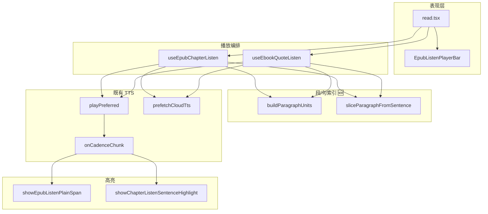
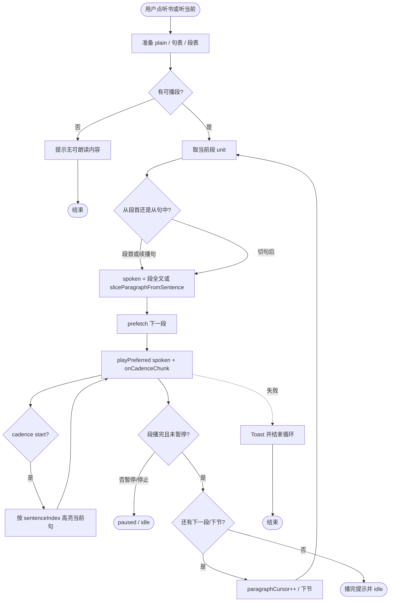
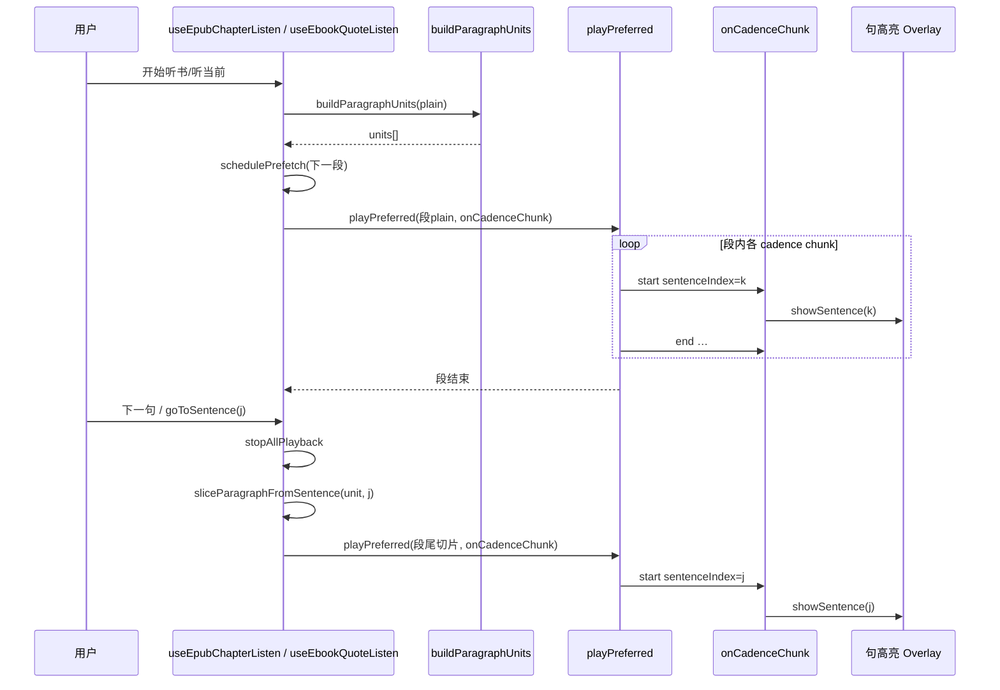
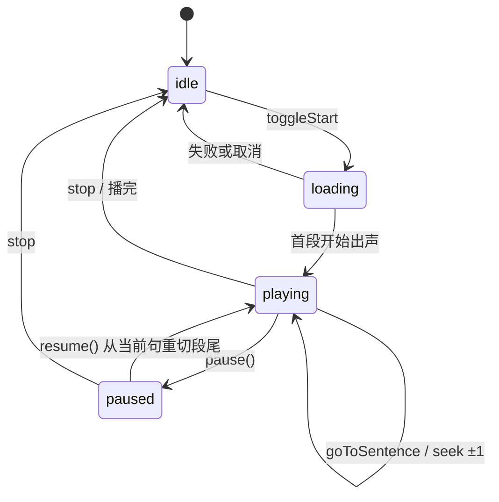

# EPUB 听书 / 听当前：按段 TTS + 逐句高亮 — 实现思路

> **状态**：核心已落地 → 实现归档 [EPUB听书段落朗读.md](../../ebook/EPUB听书段落朗读.md)；本篇保留规划脉络  
> **日期**：2026-07-15  
> **需求摘要**：**仅 Web / 桌面（Tauri）** 听书与听当前改为 **按段落合成与播放**，UI 仍 **逐句淡黄高亮**；**小程序保持现状、本需求零改动**。

## 延伸阅读

- **实现归档**：[EPUB听书段落朗读.md](../../ebook/EPUB听书段落朗读.md)
- **本轮播放修复总索引**：[EPUB听书播放修复2026-07.md](../../ebook/EPUB听书播放修复2026-07.md)
- [EPUB 听当前共用底部播放条](../../ebook/EPUB引用听书播放器栏影响.md) — 听当前曾「整段 TTS + cadence」后改为按句循环的原因
- [EPUB 听书句间云端预取](../../ebook/EPUB听书云端预取影响.md) — `prefetchCloudTts` 与句级预取
- [云端长文分段流水线](../../english/云端TTS分段管线.md) — `playCloudTtsCadenceSegments` / `onCadenceChunk`
- [EPUB 听当前逐句播放背景](../../ebook/EPUB听书句背景.md) — plain 偏移与句高亮
- 开发者手册：[EPUB听书开发.md](../../ebook/developer/EPUB听书开发.md)

---

## 0. 读本文你将得到什么

- **问题**：Web 按句 HTTP 合成请求多、韵律碎；希望按段播、仍逐句高亮。
- **方案**：外层循环改 **段落**；段内一次 `playPreferred(段 plain)`，用已有 `onCadenceChunk.sentenceIndex` 驱动句高亮；切句则停播并从目标句 **重切段尾** 再播。
- **改动层**：仅 `apps/frontend` 听书 Hook + listen util；**不改**后端 TTS、**不改**小程序。
- **云端三源**：Edge / MiniMax / 讯飞与本机均走同一 cadence 路径（不依赖 Edge `speech/timed` WordBoundary）。
- **阶段**：M1 共享段表 → M2 听当前 → M3 听书 → M4 seek/预取 polish。
- **最大风险**：段内无音频时间戳时，上一句/下一句只能「停 + 从该句重合成」。

---

## 1. 需求与边界

### 1.1 用户故事

| 角色 | 场景 | 行为 | 期望结果 |
|------|------|------|----------|
| 读者 | Web/桌面 EPUB 听书 | 点顶栏听书 | 按段出声更顺；当前句淡黄底随读移动 |
| 读者 | Web/桌面听当前 | 点听当前 | 同上；播放条仍可暂停、切句、倍速 |
| 读者 | 长段连播 | 播到段末 | 自动接下一段 / 下一节；段间可预取 |
| 小程序用户 | 小程序听书 | 任意操作 | **行为与接口完全不变**（本需求不触达） |

### 1.2 范围

| 在范围内 | 不在范围内（非目标） |
|----------|----------------------|
| Web + Tauri：`useEpubChapterListen` + `useEbookQuoteListen` | **微信小程序**任意代码 / 配置 / 文档改动 |
| 段切分 + 句高亮 + 暂停/续播/切句/分句菜单 | 后端新增 timed / 整章 MP3；改 `edge/speech/timed` |
| Edge / MiniMax / 讯飞 / 本机均走既有 `playPreferred` | 用 WordBoundary / MiniMax subtitle 做整段一条音频精确跟句（留给日后，非本需求） |
| | 英语学习页单词喇叭；词级/字级高亮 |

### 1.3 约束与依赖

- **平台锁**：只改 `apps/frontend` 电子书听读链路；小程序仓库/目录 **禁止** 出现在本需求 diff。
- 听书 ↔ 听当前 **互斥** 不变。
- 复用：`buildSentenceOffsetSpans`、`onCadenceChunk`、`showEpubListenPlainSpan` / `showChapterListenSentenceHighlight`、`prefetchCloudTts`。
- 播放条 API 表面尽量不变（`sentenceIndex` / `goToSentence` 等仍按 **句** 对外）。
- Ponytail：不引入新依赖；不做「整段 MP3 内精确 seek」。

### 1.4 云端三源（Web 路径 A）

| 来源 | 按段合成 | 逐句高亮方式 | 本需求是否要改后端 |
|------|----------|--------------|-------------------|
| Edge | ✅ `playPreferred` | `onCadenceChunk`（**不用** `edge/speech/timed`） | 否 |
| MiniMax | ✅ 同上 | 同上 | 否 |
| 讯飞 | ✅ 同上 | 同上 | 否 |
| 本机 | ✅ 同上 | 同上 | 否 |

> 小程序若继续用 Edge timed + WordBoundary，与 Web 本方案 **并行存在、互不影响**。

---

## 2. 方案总览（一句话 + 要点）

**一句话方案**：仅在 Web/桌面把听书/听当前外层循环从「句」提升为「段」，段内一次 `playPreferred` + `onCadenceChunk` 驱动逐句高亮；切句/续播从目标句截取「段内剩余文本」再合成；小程序零改动。

| # | 设计要点 | 理由 |
|---|----------|------|
| 1 | **合成单位 = 段落**；**高亮单位 = 句子** | 减少请求、韵律更顺；高亮已有句表与 overlay |
| 2 | 段内用 `onCadenceChunk.sentenceIndex` | 三源共用、无需 timed API；与小程序 Edge 时间轴方案解耦 |
| 3 | 切句 = `stopAll` + 从该句播到段末 | 无句界时间戳时最短可用路径 |
| 4 | 双 hook 共用 `buildParagraphUnits` | 听书 / 听当前行为一致 |
| 5 | 预取下一段（非整句） | 请求次数从 O(句) 降到 O(段) |
| 6 | **不碰小程序 / 不碰 `edge/speech/timed`** | 明确平台边界，避免回归小程序听书 |

---

## 3. 现状与复用

| 能力 | 仓库中已有 | 本需求中的用法 |
|------|------------|----------------|
| 按句播放循环 | `useEpubChapterListen.playSentencesFromCursor`、`useEbookQuoteListen.playFromCursor` | **改为** `playParagraphsFromCursor`（扩展） |
| 句偏移表 | `buildSentenceOffsetSpans`（`speech.ts`） | 段内映射句索引；高亮与分句菜单仍用 |
| Cadence 回调 | `onCadenceChunk` / `emitCadenceChunk` | 段播放时驱动 `show*Sentence`（扩展用法） |
| 听当前句 overlay | `epubListenSegmentOverlay` | 直接复用 `showEpubListenPlainSpan(si)` |
| 听书句 DOM Range | `indexChapterSentenceRanges` + `showChapterListenSentenceHighlight` | 直接复用 |
| 句间云端预取 | `prefetchCloudTts` | **改为**预取下一段 plain（扩展） |
| 长文段内切分 | `playCloudTtsCadenceSegments`（≤120 字 chunk） | 长段内部仍自动切 chunk；与「产品段」正交 |
| 暂停 / 切句 | `pause` / `goToSentence` 停播后重入循环 | 保留；循环入口改为按段定位（扩展） |

**调研结论**：高亮与 cadence 已具备「整段文本 + 逐句回调」能力；听当前历史上正是整段 TTS，后为播放条切句改成按句。缺的是 **段落切分结构** 与 **双 hook 统一的段循环 + 段内从句重切**。后端与设置页无需改。

---

## 4. 架构图



**图内方法说明**：

| 方法 / 模块入口 | 功能 |
|-----------------|------|
| `useEpubChapterListen` | 听书会话：节抽取 → 段循环 → 播放条状态；互斥停听当前 |
| `useEbookQuoteListen` | 听当前会话：选区 plain → 段循环 → 同款播放条 API |
| `buildParagraphUnits(plain, outerRange?)` 🆕 | 把节/选区切成段落列表；每段含 plain 切片与句索引区间 `[siStart, siEnd)` |
| `sliceParagraphFromSentence(unit, si)` 🆕 | 从段内目标句起截取剩余 spoken 文本，供切句/续播重合成 |
| `playPreferred(text, opts)` | 本机/云端选路播放；段级调用时传入整段或段尾切片 |
| `onCadenceChunk(event)` | 段内每个 cadence chunk 起止回调；用 `sentenceIndex` 换句高亮 |
| `prefetchCloudTts(plain)` | 预取下一段（或段尾切片）云端首包，缩短段间等待 |
| `showEpubListenPlainSpan(..., si)` | 听当前：按句索引画淡黄底 |
| `showChapterListenSentenceHighlight(rend, range)` | 听书：按句 DOM Range 画淡黄底并可选滚入视口 |

**读图要点**：

- UI / 播放条不变；变化集中在两个 Hook 的循环单位。
- 新增仅「段表构建 + 段内从句切片」两个纯函数，TTS 与高亮层复用。
- 云端长段仍会在 `playPreferred` 内再按 cadence 切 chunk，与产品「段落」是两层切分。

---

## 5. 主流程图



**图内方法说明**：

| 方法 | 功能 |
|------|------|
| `buildParagraphUnits` / 准备段表 | 启动时一次性建段；失败则无可播 |
| `sliceParagraphFromSentence` | 切句或 pause 后续播时生成「从该句到段末」文本 |
| `prefetchCloudTts` | 当前段播放期间预取下一段 plain |
| `playPreferred` | 合成并播放当前 spoken；失败抛错由 hook Toast |
| `onCadenceChunk` → 高亮 | `phase==='start'` 且句索引变化时更新淡黄底 |

**读图要点**：

- 入口仍是听书 / 听当前；失败与空文本走 Toast。
- 关键分支是「段内从哪一句起切 spoken」——决定韵律连续还是切句重合成。
- 终止：用户停、暂停、TTS 失败、全书/选区播完。

---

## 6. 核心时序图



**图内方法说明**：

| 方法 | 功能 |
|------|------|
| `buildParagraphUnits(plain)` | 产出段落单位列表供外层循环 |
| `playPreferred(...)` | 播当前段或段尾切片；内部可再 cadence 切 chunk |
| `onCadenceChunk` | 把 TTS 节奏映射到全局 `sentenceIndex` |
| `showSentence` / `showEpubListenPlainSpan` / `showChapterListenSentenceHighlight` | 只亮当前句，换句先清再画 |
| `stopAllPlayback` | 切句/暂停时作废当前世代音频 |
| `sliceParagraphFromSentence` | 从句 j 截到段末，作为新的合成文本 |

**读图要点**：

- Happy path：一段一次合成请求（长段内部仍可能多 chunk）。
- 切句不 seek 音频文件，而是停掉后重合成「剩余段」——实现成本最低。
- 听书与听当前时序同构，仅 overlay 实现不同。

---

## 7. 状态机



**图内方法说明**：

| 方法 | 功能 |
|------|------|
| `toggleChapterListen` / `toggleListen` | idle↔启动；同 key 再点则 stop |
| `pause()` | 增世代、`stopAllPlayback`，保留 `sentenceCursor` / `paragraphCursor` |
| `resume()` | 从当前句 `sliceParagraphFromSentence` 后继续段循环 |
| `goToSentence(i)` / `seekSentence` | 更新句游标，映射到所属段，停播后从该句重进循环 |

---

## 8. 模块职责与接口草图

### 8.1 模块一览

| 模块 | 职责 | 新增/改动 | 预估路径 |
|------|------|-----------|----------|
| 段索引 util | 段切分、句→段映射、段尾切片 | 新增 | `apps/frontend/src/views/ebook/utils/epub/listen/epubListenParagraphs.ts` |
| 听书 hook | 外层段循环 + cadence 高亮 + 段预取 | 改动 | `.../hooks/useEpubChapterListen.ts` |
| 听当前 hook | 同上 | 改动 | `.../hooks/useEbookQuoteListen.ts` |
| Overlay / 章句 Range | 高亮 API | 基本不改 | `epubListenSegmentOverlay.ts` 等 |
| `speech.ts` | 可选：段级 prefetch 辅助 | 小改或不动 | 优先不动 |

### 8.2 关键接口（草图）

```typescript
type ParagraphUnit = {
  /** 段在节/选区 plain 内 [start, end) */
  start: number;
  end: number;
  /** 覆盖的全局句下标 [siStart, siEnd) */
  siStart: number;
  siEnd: number;
};

function buildParagraphUnits(
  plain: string,
  opts?: { outerRange?: Range },
): ParagraphUnit[];

function paragraphIndexForSentence(
  units: ParagraphUnit[],
  sentenceIndex: number,
): number;

/** 从句 si 截到该段末的 TTS 文本（已 strip） */
function sliceParagraphFromSentence(
  plain: string,
  unit: ParagraphUnit,
  sentences: { start: number; end: number }[],
  si: number,
): string;
```

**段切分策略（推荐）**：

1. 若有 `outerRange`：按块级节点（`p` / `li` / `h1–h6` / `div` 含直接文本等）收集 plain 子区间 → 段。
2. 否则（纯选区字符串）：按 `\n+` 切；无换行则 **整段为一单元**（听当前短选区常见）。
3. 空段丢弃；超长段不在本层再拆（交给既有 `MAX_UTTERANCE` / cadence）。

### 8.3 数据模型（会话内存）

| 字段 | 来源 | 存储 | 说明 |
|------|------|------|------|
| `paragraphs: ParagraphUnit[]` | `buildParagraphUnits` | hook ref | 当前节/选区段表 |
| `paragraphCursor` | 播放推进 | ref | 当前段下标 |
| `sentenceCursor` | cadence / 切句 | ref | 对外进度仍按句 |
| `prefetchedByPara` | prefetch | Map | 键为段下标（或段尾切片 key） |

---

## 9. 分阶段实现步骤

| 阶段 | 目标 | 交付物 | 依赖 |
|------|------|--------|------|
| M1 | 段表纯函数 + 自检 | `epubListenParagraphs.ts` + 小 assert | — |
| M2 | 听当前改段循环 | `useEbookQuoteListen` | M1 |
| M3 | 听书改段循环 | `useEpubChapterListen` | M1 |
| M4 | 预取/切句体验 | 段预取、resume 从当前句、滚动听书续段 | M2+M3 |

### M1

- [ ] 实现 `buildParagraphUnits`（DOM 优先，fallback 换行）
- [ ] 实现 `paragraphIndexForSentence` / `sliceParagraphFromSentence`
- [ ] 模块内 assert：多段样例句索引不重叠、切片非空

### M2

- [ ] `playFromCursor` → 按 `paragraphCursor` 循环；段内 `playPreferred` + `onCadenceChunk` 高亮
- [ ] `goToSentence` / pause / resume 走段尾切片
- [ ] 分句菜单与 `sentenceIndex` 行为回归

### M3

- [ ] `playSentencesFromCursor` 改为段循环；节末 / 滚动多 iframe 续播仍按节，节内按段
- [ ] 听书句 DOM 高亮仍用 `sentenceRanges[si]`
- [ ] 与听当前互斥回归

### M4

- [ ] 预取下一段（替代按句 prefetch）
- [ ] 同段内连续切句不重复建段表
- [ ] 超长单段（无块边界）体验抽检；必要时文档标明「单段=整节」

---

## 10. 关键决策与备选方案

| 决策 | 选用 | 备选 | 为何不选备选 |
|------|------|------|--------------|
| 段内切句 | 停播 + 从该句重合成到段末 | 整段 MP3 + `currentTime` 估算 | 无可靠句界时间戳，估算易漂 |
| 高亮驱动 | `onCadenceChunk.sentenceIndex` | 按播放进度比例估句 | cadence 已与句界对齐，更准 |
| 段定义 | DOM 块级 + `\n+` fallback | 固定「每 N 句一段」 | DOM 更贴近排版段落 |
| 落地顺序 | 先听当前再听书 | 先听书 | 听当前无节切换，回归面更小 |
| 对外进度 | 仍暴露句索引 | 播放条改「段」 | 产品与分句菜单已是句模型 |
| 平台 | **仅 Web/Tauri** | 连同小程序改造 | 用户明确小程序保持现状 |
| 跟句方案 | cadence（路径 A） | Edge timed / MiniMax subtitle | 三源一致且不改后端；小程序 timed 继续独立 |

---

## 11. 风险、边界与待确认

| 项 | 等级 | 说明 | 缓解 |
|----|------|------|------|
| 切句重合成延迟 | 中 | 段后半重请求有等待 | 切句时立即 prefetch 该切片；UI 保持 loading |
| 无块结构的章 | 中 | `innerText` 整节一段 → 首包变慢 | cadence 内仍分段；可选硬上限字符拆段 |
| 本机 Web Speech | 低 | 长段本机会再切 utterance | 与现网一致；高亮仍靠 cadence |
| 句高亮与 cadence 不同步 | 中 | 逗号子句不换句底（预期） | 仅 `sentenceIndex` 变化时重绘 |
| 滚动听书跨 iframe | 中 | 节切换时要重建段表 | 保持现有 `continueSections`，节内换段 |
| 误改小程序 / timed API | 低 | 范围漂移 | Diff 仅 `apps/frontend` 听读路径；验收含「小程序未改」 |

**待确认**：

- [ ] 超长无换行段是否要在前端再按字符硬切「产品段」（验证：抽 1 本无 `<p>` 的 EPUB 在 Web 听书首包耗时）。

---

## 12. 验收清单

| # | 用例 | 步骤 | 期望 |
|---|------|------|------|
| AC1 | 听当前多句选区 | 选跨句文本 → 听当前 | 一段（或按换行多段）合成；高亮逐句移动 |
| AC2 | 听书跨段 | 听书播过多个 `<p>` | 段间衔接；每句淡黄底正确 |
| AC3 | 上一句 / 下一句 | 播放中点下一句 | 停当前音频，从目标句高亮并续播到段末/后续段 |
| AC4 | 暂停续播 | 播到某句中暂停再继续 | 从该句起重新出声（允许轻微从头感），句底正确 |
| AC5 | 分句菜单 | 点列表第 k 句 | 滚到该句并从此播放 |
| AC6 | 互斥 | 听书中点听当前 | 听书停，听当前按段播 |
| AC7 | 云端来源 | Edge / MiniMax / 讯飞 | 均按段请求减少；失败 Toast / 回退行为不变 |
| AC8 | 本机朗读 | 来源=本机 | 段循环 + 逐句高亮仍可用 |
| AC9 | 小程序隔离 | 本需求合并后 diff / 小程序听书冒烟 | **无小程序文件变更**；小程序听书行为与改前一致 |

---

## 13. 预估改动面（实现阶段参考）

| 类型 | 路径（预估） |
|------|--------------|
| 前端新增 | `apps/frontend/src/views/ebook/utils/epub/listen/epubListenParagraphs.ts` |
| 前端改动 | `hooks/useEpubChapterListen.ts`、`hooks/useEbookQuoteListen.ts` |
| 前端可选小改 | `utils/speech.ts`（仅当段预取要抽 helper） |
| 后端 | **无**（含不改 `edge/speech/timed`） |
| 小程序 | **无** |
| 文档（实现后） | `docs/ebook/EPUB听书段落朗读.md` + Influence-point + developer 听书手册补丁 |

---

（本文档为规划态实现思路；落地后以源码与 `docs/ebook/` 专题为准）
