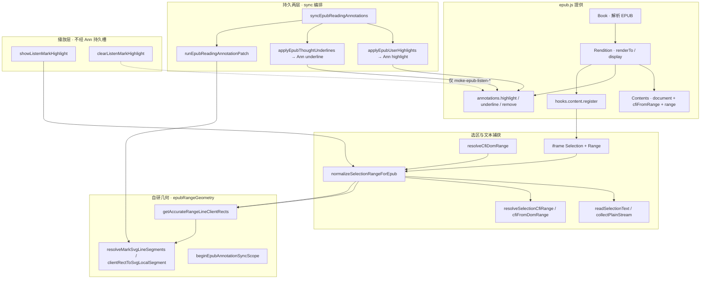
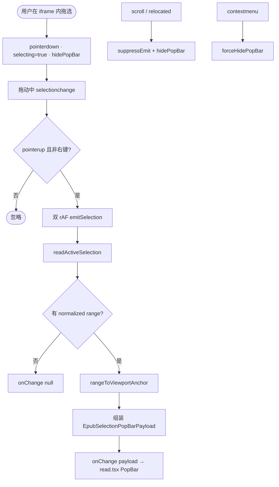
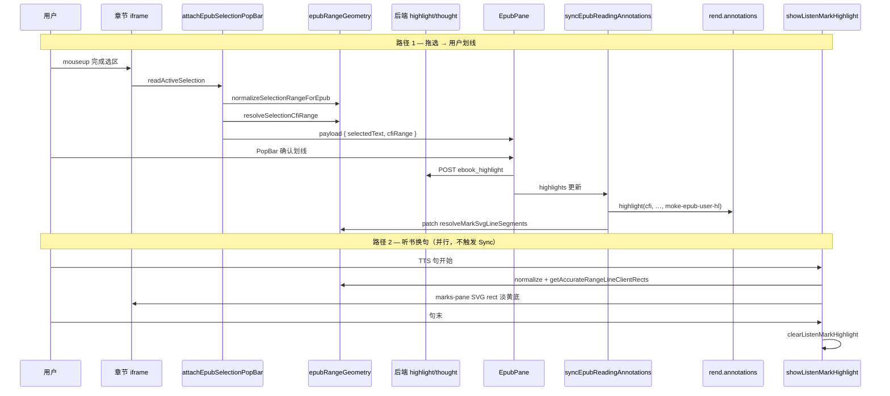

# EPUB 用户划线 / 想法虚线 / 播放背景 — epub.js 实现详解

> **状态**：规划（**核心能力已上线**；本文从 epub.js 原语出发，逐环拆解三层标注如何落地）  
> **日期**：2026-06-27  
> **需求摘要**：说明本项目如何利用 **epub.js** 在章节 iframe 内完成 **选区捕获 → 文本提取 → CFI 持久化 → marks-pane 绘制**，并区分 **用户划线**、**想法虚线**、**播放背景** 三条路径。

## 延伸阅读

- [EPUB标注分层.md](../epub/EPUB标注分层.md) — 三层架构、sync 编排、分阶段验收（偏「做什么」）
- [developer/EPUB标注分层共享.md](../../ebook/developer/EPUB标注分层共享.md) — 符号级维护定位表
- [impact/EPUB听书背景与注释影响.md](../../impact/EPUB听书背景与注释影响.md) — 播放层 vs 划线层隔离

---

## 0. 读本文你将得到什么

- **epub.js 在本项目中的运行模型**：`Book` → `Rendition` → 章节 `iframe` → `Contents.cfiFromRange` / `range`
- **五种「取文本」路径**：浏览器选区、`collectPlainStream` 字符流、持久化 `quote` 字段、TTS 分句、`extractQuoteSegmentsFromRange` 富文本片段
- **选区 → CFI → 再绘制的完整闭环**：从 `mouseup` 到 `rend.annotations.highlight/underline`，以及播放层为何 **不走** annotations
- **marks-pane SVG 三层 DOM 约定**：class、槽位、清除 selector、patch 精修
- **按细节点从零复刻的检查清单**（M1→M5，与 [EPUB标注分层.md](../epub/EPUB标注分层.md) §9 对齐）

**一句话方案**：epub.js 负责 **章节渲染 + CFI 编解码 + annotations 粗 mark**；本项目在 **iframe 内读 Selection/Range**，用 **自研几何管道** 精修 SVG，持久层走 **`syncEpubReadingAnnotations`**，播放层走 **`showListenMarkHighlight`** 且 **不写库、不占用户槽位**。

---

## 1. epub.js 在本项目中的运行模型

### 1.1 对象层级

| 对象 | 创建位置 | 职责 |
|------|----------|------|
| `Book` | `EpubPane`：`ePub(open, { openAs: 'binary', replacements: 'blobUrl' })` | 解析 EPUB 包、spine、章节 HTML |
| `Rendition` | `book.renderTo(el, { flow, manager, spread, … })` | 把章节 HTML 渲染进宿主 DOM；提供 `display(cfi)`、`getContents()`、`annotations` |
| `Contents` | 每个章节 **iframe** 内一份；`rend.getContents()` 返回单对象或数组 | 暴露 `document`、`window`、**`cfiFromRange(range)`**、**`range(cfi)`** |
| `Location` | `rend.currentLocation()` | 当前阅读位置 CFI、spine 索引、百分比 |

**排版模式**（影响滚动与视口）：

| `flow` | `manager` | 行为 |
|--------|-----------|------|
| `paginated` | `default` | 分页；一屏一章或部分章；翻页用 `display(cfi)` |
| `scrolled` | `continuous` | 连续滚动；多章 iframe 纵向排列；滚动容器为 `rend.manager.container` |

### 1.2 DOM 结构（理解 marks-pane 的前提）

```text
EpubPane 宿主 div
└── .epub-container（scroll 模式下的滚动根）
    └── iframe（每章一节）
        ├── body（章节 XHTML 正文 — Selection 发生在这里）
        └── .marks-pane（epub.js 插入的 SVG  overlay 容器）
            └── svg
                └── g[data-epubcfi="…"]  ← annotations.highlight/underline 创建的 mark 组
                    └── rect / path …    ← epub.js 粗矩形；本项目 patch 后替换/追加
```

**关键事实**：

1. **用户拖选发生在 iframe 内的 `document`**，事件 **不会冒泡** 到 React 宿主，必须用 `rend.hooks.content.register` 或 `getContents()` 逐 iframe 挂载监听。
2. **视觉标注画在 `.marks-pane` 的 SVG 上**，与正文 DOM **兄弟关系**，不修改章节 HTML 文本节点（播放层同样优先 SVG）。
3. **`EPUB_ANNOTATION_IGNORE_CLASS = 'epubjs-hl'`**：调用 `cfiFromRange` / `getRange` 时传入，避免 CFI 计算把已有 mark 节点算进路径。

### 1.3 生命周期与挂载时机（`EpubPane.tsx`）

```text
ePub(open) → book.opened
  → book.renderTo(host) → rend
  → applyEpubReaderAppearance(rend)
  → rend.on('relocated' | 'keydown')
  → attachEpubIframeContextMenu(rend)      // 可选：右键菜单
  → attachEpubSelectionPopBar(rend)        // 选区 PopBar
  → rend.display(initialCfi)
  → book.ready → setRendReady(true)
  → effect: syncEpubReadingAnnotations     // highlights/thoughts 就绪后
```

**`rend.hooks.content.register(fn)`**：每章 iframe **首次注入** 时调用 `fn(contents)`；须在 `display` 之后对 **已存在** 的 contents 再手动 `bindContents` 一遍（见 `attachEpubSelectionPopBar` 末尾）。

---

## 2. 架构图 — epub.js 原语与三层标注



**图内方法说明**：

| 方法 / 模块 | 功能 |
|-------------|------|
| `Contents.cfiFromRange(range, ignoreClass?)` | epub.js 将 iframe 内 DOM Range 编码为 **CFI 范围字符串**（如 `epubcfi(/6/4[chap01ref]!/4/2/1:0,/4/2/1:10)`） |
| `Contents.range(cfi)` / `rend.getRange(cfi)` | CFI → 仍连接 DOM 的 **Range**；换章后需重新解析 |
| `rend.annotations.highlight(cfi, data, handler, className, styles)` | 在 marks-pane 创建 **`highlight` 槽** mark；class `moke-epub-user-hl` |
| `rend.annotations.underline(cfi, data, handler, className, styles)` | 创建 **`underline` 槽** mark；class `moke-epub-thought-ul` |
| `rend.annotations.remove(cfi, 'highlight' \| 'underline')` | 按 CFI + **槽位类型** 删除；用户/想法 **必须分槽**，防误删 |
| `normalizeSelectionRangeForEpub(range)` | 贴文本边界 + trim 空白；**所有** CFI 生成与绘制前必经 |
| `resolveSelectionCfiRange(rend, win, range)` | 找对应 iframe 的 Contents，调 `cfiFromRange` |
| `resolveCfiDomRange(rend, cfi)` | 反向解析；sync 批处理内带 Map 缓存 |
| `getAccurateRangeLineClientRects(range)` | Range → 逐行 **DOMRect**（caret 裁切行尾空白） |
| `syncEpubReadingAnnotations(...)` | 用户+想法 **唯一联合 apply+patch** 入口 |
| `showListenMarkHighlight(rend, range)` | 淡黄播放背景；**不调用** `annotations.highlight` 存用户线 |

**读图要点**：epub.js 只保证 **CFI ↔ 粗 mark**；精修样式、虚线、blocker、播放淡黄底均在 **geo + 各层 utils** 完成。播放清除走 **class 过滤**，不可对全量 `annotations` 无差别 `remove`。

---

## 3. 文本内容：五种获取路径

### 3.1 路径对照表

| # | 场景 | API / 函数 | 输入 | 输出 | 模块 |
|---|------|------------|------|------|------|
| A | 用户拖选 PopBar | `win.getSelection()?.toString()` | iframe Selection | 可见选区纯文本（trim） | `epubSelectionToolbarAttach` |
| B | 保存划线/想法入库 | PopBar `selectedText` → API `quote` | 同 A | 持久化 **quote** 字符串 | `read.tsx` + 后端 |
| C | CFI 还原后展示 | DB `quote` 或 `resolveCfiDomRange` + `range.toString()` | cfiRange | 侧栏/PopBar 引用文案 | `buildEpubPopBarPayloadFromCfiRange` |
| D | 听当前/TTS 分句 | `collectPlainStream` → `buildDomSentenceIndex` | DOM Range | `plain` + 每句 `spokenRaw` + **Dom 锚点** | `epubListenSegmentOverlay` |
| E | 分享卡片保真 | `extractQuoteSegmentsFromRange` | Range + win | 带字号/字重的 **QuoteShareRun[]** | `epubQuoteShareStyled` |

### 3.2 路径 A — 浏览器选区文本

```text
用户 mouseup（iframe 内）
  → readActiveSelection(rend)
      遍历 rend.getContents() 各 iframe
      → win.getSelection(); range = sel.getRangeAt(0)
      → 跳过 collapsed / 空 toString()
      → normalizeSelectionRangeForEpub(range)
  → readSelectionText(win)  // getSelection().toString().trim()
```

**细节**：

- **多 iframe**：连续滚动模式下同一时刻通常只有一个 iframe 有非空选区；循环 **第一个命中** 即返回。
- **规范化后再取 CFI**：`emitSelection` 里 `cfiRange` 用 **normalized range**，保证与视觉一致。

### 3.3 路径 D — `collectPlainStream`（TTS / 听当前高亮核心）

**目的**：从 DOM Range 得到与 **TTS 分句算法** 对齐的 plain 文本，且 **每个 plain 字符** 可映射回 `Text` 节点 offset（用于句级 Range → 播放背景）。

**算法逐步**：

1. `forEachTextNodeInRange(outer, visit)` — 按文档序 walk Range 内 Text 节点（**不用**章级 TreeWalker  intersectsNode，避免 O(章)）。
2. 跳过 `script/style/svg/[hidden]` 父链上的节点（`isVisibleTextNode`）。
3. 连续空白 **合并为一个空格**（`pendingSpace`）；plain 与 `points[]` **等长**。
4. 去掉 plain 尾部空格及对应 points。
5. `buildSentenceOffsetSpans(trimmed)`（来自 `speech`）得句界 `[start,end)`。
6. `anchorFromPoints(points, trimmed, start, end)` → `{ startNode, startOffset, endNode, endOffset }`。
7. `anchorToRange(anchor)` → 该句 **DOM Range** → `showListenMarkHighlight(rend, range)`。

**降级**：points 长度与 trimmed 不一致（极端 DOM）→ 仍分句 TTS，但 `anchor: null`，**无句级背景**、仅音频。

### 3.4 路径 E — 富文本 quote 片段

PopBar payload 除 `selectedText` 外带 `quoteSegments`，用于分享图保留原书 **加粗/斜体/字号**；与 CFI 独立，CFI 仍决定 **定位**。

---

## 4. 选区捕获：从 mouseup 到 PopBar

### 4.1 主流程图



**图内方法说明**：

| 方法 | 功能 |
|------|------|
| `attachEpubSelectionPopBar(rend, onChange)` | 注册 hooks + scroll/relocated 监听；返回 detach |
| `readActiveSelection(rend)` | 找当前有效 iframe 选区 + normalize |
| `rangeToViewportAnchor(win, range)` | iframe 局部坐标 + 行盒 → **视口** `{ centerX, top }` 供 PopBar 定位 |
| `resolveSelectionCfiRange(rend, win, range)` | normalize 后 `contents.cfiFromRange(..., epubjs-hl)` |
| `rememberEpubPopBarSelectionRange(range)` | 记忆 Range；听当前/恢复选区用 |
| `clearEpubTextSelection(rend)` | 清空所有 iframe + 顶层 Selection |

### 4.2 PopBar Payload 字段

| 字段 | 含义 | 后续用途 |
|------|------|----------|
| `x`, `y` | 视口坐标锚点 | 浮动 PopBar 定位 |
| `selectedText` | 纯文本 | API `quote`、写想法 |
| `cfiRange` | EPUB CFI 范围 | API `cfiRange`、apply mark |
| `quoteSegments` | 样式片段 | 分享、富文本展示 |

### 4.3 反向打开 PopBar（点击已有 mark）

| 入口 | 函数 | 文本来源 |
|------|------|----------|
| 点击用户划线 | `buildPopBarPayloadForHighlightHit` | DB `highlight.quote` + `resolveCfiDomRange` 锚点 |
| 点击想法虚线 | 想法 cluster 流程 | DB `thought.quote` |
| 侧栏引用块 | `buildPopBarAnchorFromElement` | 仅锚点，文本来自侧栏 |

### 4.4 选区规范化细节（`normalizeSelectionRangeForEpub`）

```text
snapSelectionRangeToTextContent(range)
  → forEachTextNodeInRange 找首尾非空白字符
  → 重写 Range 起止到 Text 节点 offset
trimSelectionRange(range)
  → 从两端收缩，跳过 \s（最多 8192 步）
  → 空则返回 null
```

**为何必须做**：浏览器选区常含 **段首空行、块边界**；直接 `cfiFromRange` 会导致 CFI 比视觉选区 **更宽**，换章后 mark 错位。

---

## 5. CFI：定位符编解码

### 5.1 CFI 是什么

**Canonical Fragment Identifier**：EPUB 标准的位置字符串，可指向 **spine 项 + 章节内 DOM 路径 + 字符偏移**。本项目持久化 **`cfiRange`**（范围：起点 CFI + 终点 CFI）。

### 5.2 编码（Range → CFI）

```text
resolveSelectionCfiRange(rend, win, range):
  normalized = normalizeSelectionRangeForEpub(range)
  matching = getContents() 中 window === win 的 Contents
  return contents.cfiFromRange(normalized, 'epubjs-hl')

cfiFromDomRange(rend, range):
  按 range.startContainer.ownerDocument 匹配 Contents
  return contents.cfiFromRange(range, 'epubjs-hl')
```

**`epubjs-hl` ignoreClass**：生成 CFI 时 **忽略** 带该 class 的 mark 节点，避免「在已有高亮上再选」时 CFI 漂移。

### 5.3 解码（CFI → Range）

```text
resolveCfiDomRange(rend, cfi):
  sync 批处理内 → Map 缓存
  否则 resolveCfiDomRangeUncached:
    1) rend.getRange?.(cfi, 'epubjs-hl')
    2) 遍历 Contents: contents.range(cfi, 'epubjs-hl')
    返回仍 isConnected 的 Range 或 null
```

**换章/重排**：旧 Range 可能失效；sync 前 `invalidateAppliedUserHighlightsMissingDom` 清理 appliedRef 中 DOM 已失的 CFI。

### 5.4 辅助：spine hint

`extractCfiSpineHint(cfi)` — 取 `!` 前 spine 路径，用于 **同章嵌套判定**（想法 cluster、划线包含关系），避免跨 iframe 误匹配。

---

## 6. 几何管道：从 Range 到 SVG 行盒

### 6.1 逐步分解

| 步骤 | 函数 | 说明 |
|------|------|------|
| 1 | `normalizeSelectionRangeForEpub` | 统一选区边界 |
| 2 | `getAccurateRangeLineClientRects` | 逐 Text 节点 `getClientRects`；`preferLeafLineRects` 去大行块；首尾 caret 裁切 |
| 3 | `clientRectToSvgLocalSegment(rect, svg, container)` | 视口 DOMRect − svg/container 的 `getBoundingClientRect` → SVG 局部 x,y,w,h |
| 4 | `resolveMarkSvgLineSegments(rend, group, cfi)` | patch：**先读** mark 已有 rect（快路径）；与 CFI 精确行盒不一致则 **替换** |

**播放层额外**：`listenLineRects` 在步骤 2 后用 **句首 caret** 校正首行 top，避免段首 `……` 导致背景 **上移一行**。

### 6.2 sync 批处理缓存

```text
syncEpubReadingAnnotations 开头:
  beginEpubAnnotationSyncScope()
    → syncCfiRangeCache: Map<cfi, Range|null>
    → syncAccurateClientRectCache: Map<cfiKey, DOMRect[]>
finally:
  endEpubAnnotationSyncScope()
```

同一 CFI 在 apply + patch + 重叠判定中 **多次解析** 时避免重复 layout。

---

## 7. 用户划线 — epub.js + 自研 patch

### 7.1 数据流

```text
PopBar「划线」
  → API 保存 EbookUserHighlight { cfiRange, quote, style, color }
  → EpubPane highlights state 更新
  → syncEpubReadingAnnotations
      buildHighlightRenderPlan（嵌套 CFI 只绘外层 visibleCfis）
      applyEpubUserHighlights
        rend.annotations.highlight(cfi, data, clickHandler, 'moke-epub-user-hl', styles)
      applyEpubThoughtUnderlines（想法同 sync）
      collectUserHighlightBlockerSources
      runEpubReadingAnnotationPatch
        patchAllUserHighlightMarks → 三色/五色 rect、underline、wavy path
        restackUserHighlightMarkGroups（用户 g 在最上）
```

### 7.2 `rend.annotations.highlight` 五参数

| 参数 | 用户划线取值 |
|------|--------------|
| cfi | `item.cfiRange` |
| data | `{ id, style, color, … }` 存 mark dataset |
| handler | `markClicked` 回调；实际点击以 **iframe click + CFI 命中** 为主 |
| className | `moke-epub-user-hl` |
| styles | epub.js 注入的 CSS 规则（粗矩形） |

### 7.3 删除与槽位隔离

```typescript
rend.annotations.remove(cfiRange, 'highlight');  // 仅用户槽
// 禁止对用户 CFI 调 remove(..., 'underline') — 会误删想法虚线
```

DOM 清理：`removeUserHighlightMarkGroupsByCfi` 扫描 `USER_HIGHLIGHT_SELECTOR`（含 `g[ref*="moke-epub-user-hl"]` 兼容 epub.js 版本差异）。

### 7.4 点击命中（不用 SVG 行高）

```text
iframe click
  → findThoughtsAtClickPoint（优先想法）
  → else findUserHighlightAtClickPoint
      resolveCfiDomRange → highlightRange
      isPointInRangeTextBand（精确行盒 + slop）
      caretRangeFromPoint + isClickRangeInsideHighlight
```

---

## 8. 想法虚线 — underline 槽 + blocker

### 8.1 与用户划线的 epub.js 差异

| 维度 | 用户划线 | 想法虚线 |
|------|----------|----------|
| annotations API | `.highlight(...)` | `.underline(...)` |
| DOM class | `moke-epub-user-hl` | `moke-epub-thought-ul` |
| 持久化 | `ebook_highlight` | `ebook_thought` |
| 视觉 patch | 色块 / 实线 / 波浪 | **琥珀虚线** path（按行） |
| 分组 | 一条 highlight 一 CFI | **同 cfiRange 多 thought** 共一 mark |

### 8.2 apply 流程

```text
applyEpubThoughtUnderlines(rend, thoughts, appliedRef):
  groupThoughtsByCfi(thoughts)
  删除 appliedRef 中已不存在的 cfi → remove(cfi, 'underline')
  sortCfiGroupsForUnderlineStack（短 CFI 后绘制 → 上层优先点击）
  对每个 cfi:
    rend.annotations.underline(cfi, { thoughtIds, showLine }, undefined, 'moke-epub-thought-ul', styles)
```

### 8.3 patch：blocker 裁切

```text
collectUserHighlightBlockerSources(rend)
  → 扫描用户 g 内 SVG rect（+ wavy path BBox）
setUserHighlightBlockerSourcesForThoughtPatch(sources)
patchEpubThoughtUnderlineMarks
  → 逐行画虚线，与用户 rect **重叠部分扣减**
restackThoughtMarkGroups → restackUserHighlightMarkGroups
```

**业务规则**：想法虚线 **不画进** 用户色块；用户 mark **restack 在最上**，保证色块可点。

---

## 9. 播放背景 — 不经 annotations 持久槽

### 9.1 设计约束

| 项 | 播放背景 | 用户/想法 |
|----|----------|-----------|
| 持久化 | **无** | DB + CFI |
| epub.js 槽位 | **不写入** highlight/underline | highlight / underline |
| DOM class | `moke-epub-listen-bg` / `#moke-epub-listen-iframe-layer` | `moke-epub-user-hl` / `moke-epub-thought-ul` |
| sync | **不调用** `syncEpubReadingAnnotations` | 数据变/听结束 resync |
| pointer-events | `none` | 用户/想法可点 |

### 9.2 绘制流程

```text
听当前 paintSentence(i) / 听书 showChapterListenSentenceHighlight
  → sentenceToRange(sentences[i]) 或 chapter 句 Range
  → showListenMarkHighlight(rend, range)
      normalizeSelectionRangeForEpub
      clearListenMarkHighlight(rend)   // 仅 listen 层
      ensureListenMarkGroup(doc)       // marks-pane 下 g.moke-epub-listen-bg
      paintDirectSvg → syncMarkRects（淡黄 EPUB_LISTEN_SEGMENT_FILL）
      或 paintIframeOverlay（SVG 未就绪兜底）
      attachRelayout → relocated/rendered/ResizeObserver → repaintActive
```

### 9.3 清除：`purgeListenAnnotations`

**必须** 同时满足：

1. `ann.className` 匹配 `moke-epub-listen-*`（`isListenAnnotationClass`）
2. `doc.querySelectorAll(LISTEN_MARK_SELECTOR).remove()`
3. **禁止** 无 class 过滤地 `annotations.remove` — 历史曾误删用户 mark

### 9.4 文本与句界来源

| 模式 | Range 来源 | plain / 分句 |
|------|------------|--------------|
| 听当前 | PopBar 选区 / `rememberEpubPopBarSelectionRange` | `beginEpubListenOverlaySession` → `buildDomSentenceIndex` |
| 听书 | 章级 iframe 文本索引 | 章 hook 预建句表；换句直接 `Range` |

---

## 10. 核心时序：选区划线 vs 听书换句



**图内方法说明**：

| 方法 | 功能 |
|------|------|
| `attachEpubSelectionPopBar` | iframe 选区 → PopBar payload；含 CFI 编码 |
| `resolveSelectionCfiRange` | Selection Range → 持久化 cfiRange |
| `syncEpubReadingAnnotations` | API 数据 → marks-pane 用户+想法最终样式 |
| `showListenMarkHighlight` | 临时句背景；句末 clear |
| `clearListenMarkHighlight` | 仅清除 listen selector |

---

## 11. 三层对照总表

| 维度 | 用户划线 | 想法虚线 | 播放背景 |
|------|----------|----------|----------|
| **主模块** | `epubUserHighlights.ts` | `epubThoughtAnnotations.ts` | `epubListenMarkHighlight.ts` |
| **epub.js API** | `annotations.highlight` | `annotations.underline` | 可选 legacy highlight + **自管 SVG** |
| **DOM class** | `moke-epub-user-hl` | `moke-epub-thought-ul` | `moke-epub-listen-bg` |
| **文本来源** | Selection.toString → quote | 同左 | collectPlainStream + 分句 |
| **定位键** | cfiRange | cfiRange | DOM Range（session 内） |
| **持久化** | ebook_highlight | ebook_thought | 无 |
| **sync 入口** | `syncEpubReadingAnnotations` | 同上 | **不进入** sync |
| **清除** | remove(cfi,'highlight') | remove(cfi,'underline') | clearListenMarkHighlight |
| **patch** | 色块/线/波浪 | 虚线 + blocker | listenLineRects + repaint |

---

## 12. 从零实现：细节检查清单

与 [EPUB标注分层.md §9](../epub/EPUB标注分层.md) 对齐；下列为 **epub.js 相关** 必验细节。

### M1 — Rendition + 几何

- [ ] `ePub` → `renderTo` → `display(cfi)` 能打开书
- [ ] `rend.getContents()` 单章/多章数组均正确处理
- [ ] `hooks.content.register` + 已存在 contents 补 bind
- [ ] `normalizeSelectionRangeForEpub` 空选区返回 null
- [ ] `resolveSelectionCfiRange` ↔ `resolveCfiDomRange` 往返同一 visual 选区
- [ ] `cfiFromRange` 传 `epubjs-hl` ignoreClass

### M2 — 选区 PopBar

- [ ] iframe 内 mouseup 后 PopBar 锚点 `x,y` 正确（多行选区 focus 行顶）
- [ ] scroll/relocated 关闭 PopBar；右键不闪 PopBar
- [ ] `selectedText` / `cfiRange` / `quoteSegments` 均非空（有效选区）
- [ ] `clearEpubTextSelection` 清全部 iframe

### M3 — 用户划线

- [ ] 仅 `remove(cfi,'highlight')`
- [ ] `applyEpubUserHighlights` 写 `moke-epub-user-hl`
- [ ] patch 三色 + 五色；嵌套 CFI 只绘外层
- [ ] 点击命中走 **正文 Range**，非 SVG 行高

### M4 — 想法虚线

- [ ] 仅 `remove(cfi,'underline')`
- [ ] 同 CFI 多 thought 共一 underline mark
- [ ] blocker：虚线不进入用户色块
- [ ] restack：短 CFI 虚线在上、用户 g 最上

### M5 — 播放背景

- [ ] `showListenMarkHighlight` 不触发 sync
- [ ] clear 仅 `moke-epub-listen-*`
- [ ] `collectPlainStream` 句锚点 → 句级 Range → 淡黄底
- [ ] resize/relocated → `repaintActive`
- [ ] 听结束 `onSessionEnd` → `syncEpubReadingAnnotations` 兜底

---

## 13. 关键文件索引

| 职责 | 路径 |
|------|------|
| Rendition 生命周期、PopBar 接线 | `apps/frontend/src/views/ebook/components/EpubPane.tsx` |
| 选区监听、PopBar payload | `apps/frontend/src/views/ebook/utils/epubSelectionToolbarAttach.ts` |
| CFI / Range / 行盒几何 | `apps/frontend/src/views/ebook/utils/epubRangeGeometry.ts` |
| CFI 嵌套、contents 列表 | `apps/frontend/src/views/ebook/utils/epubMarkShared.ts` |
| 用户划线 apply/patch/sync | `apps/frontend/src/views/ebook/utils/epubUserHighlights.ts` |
| 想法虚线 apply/patch | `apps/frontend/src/views/ebook/utils/epubThoughtAnnotations.ts` |
| 播放背景 draw/clear | `apps/frontend/src/views/ebook/utils/epubListenMarkHighlight.ts` |
| 听当前 plain/分句/session | `apps/frontend/src/views/ebook/utils/epubListenSegmentOverlay.ts` |
| 滚动进视口 | `apps/frontend/src/views/ebook/utils/epubScrolledNav.ts` |
| 右键选区 | `apps/frontend/src/views/ebook/utils/epubContextMenuAttach.ts` |
| 数据类型 | `apps/frontend/src/views/ebook/types.ts` |

---

## 14. 常见坑与对策

| 坑 | 原因 | 对策 |
|----|------|------|
| CFI 比视觉选区宽 | 未 normalize / 含空白节点 | 始终 `normalizeSelectionRangeForEpub` 后再编码 |
| 换章 mark 消失 | CFI 仍存但 DOM 未 apply | `sync` on relocated；`appliedRef` 签名 + DOM 校验 |
| 播放 stop 后用户线没了 | clear 误删全量 annotations | **class 过滤** listen selector |
| iframe 无 PopBar | 事件未挂载 | `hooks.content.register` + 初始 contents 补绑 |
| 虚线画进色块 | 未 patch blocker | sync 内先 patch 用户 → collect blocker → patch 想法 |
| TTS 与背景句不对齐 | plain 与 DOM 锚点不一致 | `collectPlainStream` points 等长校验；降级无锚点 |

---

（本文档为规划态实现思路；落地细节以 [EPUB标注分层共享.md](../../ebook/developer/EPUB标注分层共享.md) 与源码为准）
