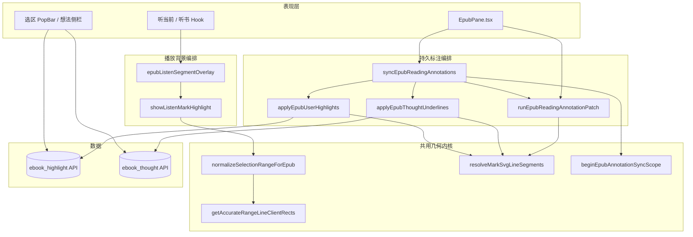
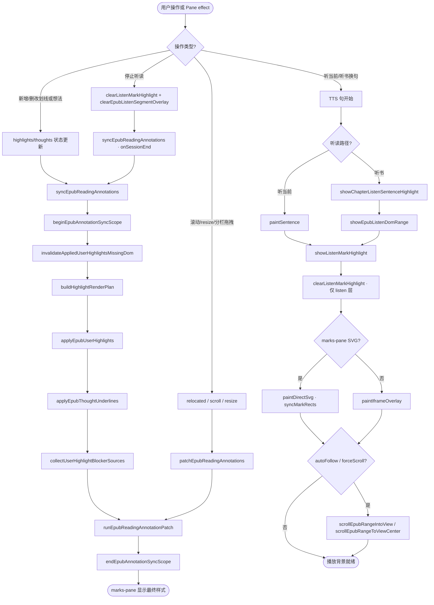
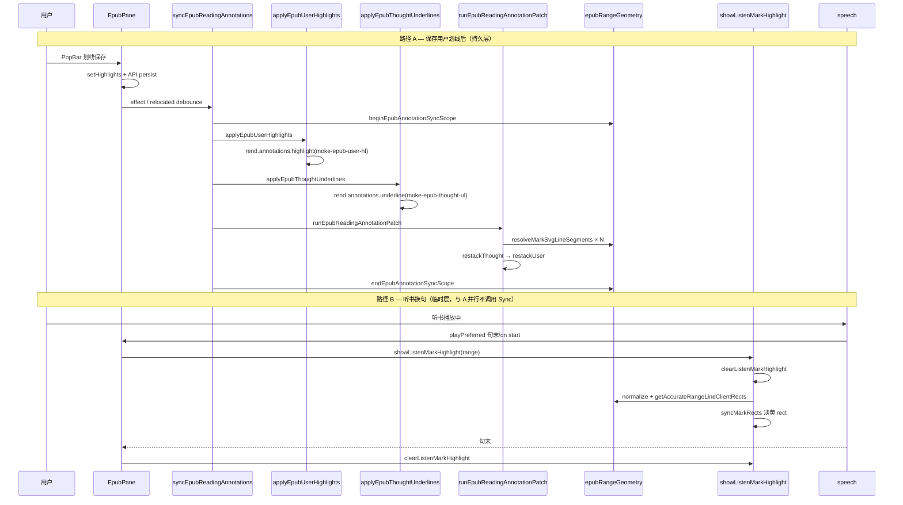
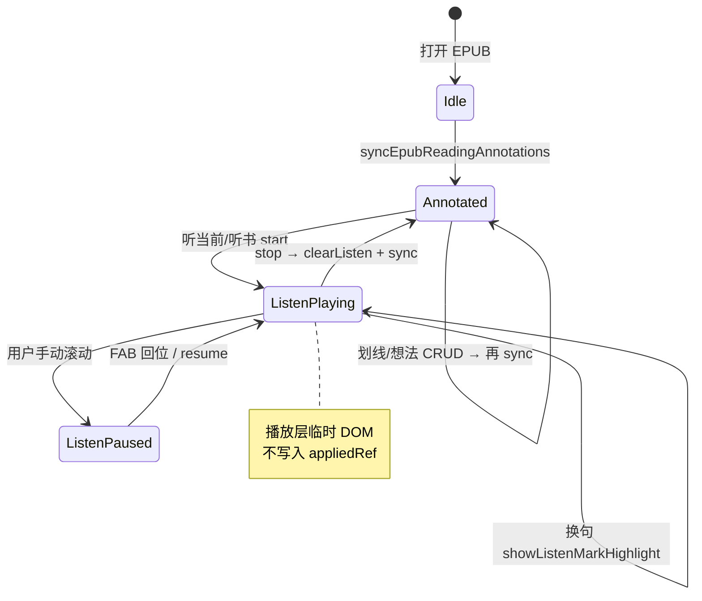

# EPUB 用户划线 / 想法虚线 / 播放背景 — 实现思路

> **状态**：规划（**核心能力已上线**；本文供从零复刻、扩展样式或新人 onboarding）  
> **日期**：2026-06-27  
> **需求摘要**：在 EPUB 阅读 iframe 上同时支持 **持久化用户划线**、**持久化想法虚线** 与 **临时播放背景**，共用几何内核、**槽位与 selector 隔离**，互不误删。

## 延伸阅读

- [EPUB标注epubjs基础.md](../epub/EPUB标注epubjs基础.md) — **epub.js 原语详解**：选区、文本提取、CFI、annotations、marks-pane（本文偏架构编排）
- [developer/EPUB标注分层共享.md](../../ebook/developer/EPUB标注分层共享.md) — 已实现符号级对照表（维护定位）
- [impact/EPUB听书背景与注释影响.md](../../impact/EPUB听书背景与注释影响.md) — 播放层 vs 划线层影响面
- [EPUB用户划线开发.md](../../ebook/developer/EPUB用户划线开发.md) / [EPUB想法添加下划线开发.md](../../ebook/developer/EPUB想法添加下划线开发.md) / [EPUB听书开发.md](../../ebook/developer/EPUB听书开发.md) — 各层开发者手册

---

## 0. 读本文你将得到什么

- **三层各自画什么、存不存库、用什么 DOM class** 的一眼对照
- **一句话方案**：共用 `epubRangeGeometry` 行盒管道；用户/想法走 `syncEpubReadingAnnotations` 联合 sync；播放走独立 `showListenMarkHighlight`，清除 selector 互不重叠
- **改哪些层**：Utils（几何 + 三层绘制）← Hook/Pane（数据与时机）← 后端 API（highlight/thought 表）
- **分 5 阶段落地**：M1 几何 → M2 用户线 → M3 想法线 + blocker → M4 播放层 → M5 Pane 编排与回归
- **最大风险**：清除播放层时误用无 class 过滤的 `annotations.remove`；想法虚线与用户色块重叠时的视觉与点击

---

## 1. 需求与边界

### 1.1 用户故事

| 角色 | 场景 | 行为 | 期望结果 |
|------|------|------|----------|
| 读者 | 选中 EPUB 正文 | PopBar **划线**（高亮/直线/波浪 + 五色） | 按 CFI 持久化；切章仍可见；可改色/删除 |
| 读者 | 选中正文写想法 | 保存后段落出现 **琥珀虚线** | 点击虚线打开想法侧栏；与用户划线可叠加 |
| 读者 | 听当前 / 听书 | TTS 逐句播放 | **当前句淡黄底**；句末清除；**不写入** highlight/thought |
| 读者 | 播放中继续划线 | 划线 + 听并存 | 播放结束或 sync 后用户线/想法线 **DOM 仍在**；播放层 `pointer-events: none` |

### 1.2 范围

| 在范围内 | 不在范围内（非目标） |
|----------|----------------------|
| EPUB marks-pane SVG + iframe 浮层绘制 | PDF 划线/想法/听读 |
| CFI 存取、重叠合并、patch 精修 | 词级卡拉 OK、Whispersync |
| 用户/想法 **联合 sync** + 播放 **独立 session** | 把播放层并入 `annotations.highlight` |
| resize/scroll 后 patch 或 relayout | 服务端渲染截图分享中的 mark |

### 1.3 约束与依赖

- **登录**：划线/想法须账号；播放层无持久化
- **epub.js**：用户 → `annotations.highlight`；想法 → `annotations.underline`；播放 **不占用** 用户槽位
- **互斥**：听书 vs 听当前（同一 overlay session）；与划线 **不互斥**（仅视觉叠层）
- **Ponytail**：播放清除 **必须** class 过滤；sync 批处理用 `beginEpubAnnotationSyncScope` 缓存 CFI/行盒

---

## 2. 方案总览（一句话 + 要点）

**一句话方案**：**一条几何管道**（Range → normalize → 行盒 → SVG 局部坐标）服务三层；**两条编排管道**——持久层由 `syncEpubReadingAnnotations` 统一 apply+patch+restack，临时层由 `showListenMarkHighlight` 自管 draw/clear/repaint。

| # | 设计要点 | 理由 |
|---|----------|------|
| 1 | 用户/想法 **分 epub.js 槽位**（highlight vs underline） | `remove(cfi,'highlight')` 不会误删想法虚线 |
| 2 | 播放层 **独立 class** `moke-epub-listen-*` | `purgeListenAnnotations` 只删 listen，不扫 user/thought |
| 3 | patch 阶段 **用户先于想法**，用户 rect 作 **blocker** | 虚线不画进用户色块；用户 g **restack 最上** |
| 4 | 播放 **不调用** sync 流水线 | 避免每句 TTS 触发全量 apply 划线 |
| 5 | 共用 `getAccurateRangeLineClientRects` | 三层行高一致；播放 `listenLineRects` 仅多加段首 caret 校正 |

---

## 3. 现状与复用

| 能力 | 仓库中已有 | 本需求中的用法 |
|------|------------|----------------|
| Range/CFI 几何 | `epubRangeGeometry.ts` | **直接复用** normalize、行盒、patch 入口 |
| 滚动进视口 | `epubScrolledNav.ts` | **直接复用** 侧栏引用定位；播放 autoFollow / 居中 |
| 用户划线 sync | `epubUserHighlights.ts` | **直接复用** apply/patch/restock；扩展新 style 时改 patch |
| 想法虚线 | `epubThoughtAnnotations.ts` | **直接复用** apply + blocker patch |
| 播放背景 | `epubListenMarkHighlight.ts` | **直接复用** show/clear/repaint |
| 听读 session | `epubListenSegmentOverlay.ts` | **直接复用** paintSentence / showEpubListenDomRange |
| Pane 编排 | `EpubPane.tsx` | **扩展** highlights/thoughts effect、relocated、resize patch |
| 后端 | `ebook_highlight` / `ebook_thought` API | **直接复用**；播放无表 |

**调研结论**：三层 **已实现**，不必重写几何或 sync 顺序。新增能力（如第六种用户色、播放层 resize relayout）应 **扩展** 对应模块，禁止把播放层并入 `syncEpubReadingAnnotations`。

---

## 4. 架构图



**图内方法说明**：

| 方法 / 模块入口 | 功能 |
|-----------------|------|
| `syncEpubReadingAnnotations(rend, thoughts, highlights, …)` | 用户+想法 **唯一联合入口**：invalidate → apply 用户 → apply 想法 → collect blocker → patch → restack |
| `runEpubReadingAnnotationPatch(rend)` | 串行 patch 用户 mark、想法虚线、两层 restack；scroll/resize 可单独 `patchEpubReadingAnnotations` 调此路径 |
| `applyEpubUserHighlights(rend, highlights, appliedRef, plan?)` | `rend.annotations.highlight(…, moke-epub-user-hl)` 写用户 g；purge 不可见 CFI |
| `applyEpubThoughtUnderlines(rend, thoughts, appliedRef)` | `rend.annotations.underline(…, moke-epub-thought-ul)` 写想法 g 骨架 |
| `showListenMarkHighlight(rend, range)` | 播放层 **唯一绘制入口**：normalize → clear listen → SVG rect 或 iframe 层 |
| `normalizeSelectionRangeForEpub(range)` | 选区贴文本、trim 空白；三层绘制前共用 |
| `getAccurateRangeLineClientRects(range)` | Range → 逐行 DOMRect；caret 裁切；去大行块误检 |
| `resolveMarkSvgLineSegments(rend, group, cfi)` | patch 统一入口：读已有 rect 或 CFI→Range 精确几何 |
| `beginEpubAnnotationSyncScope()` / `endEpubAnnotationSyncScope()` | sync 批处理内 CFI/行盒 Map 缓存，避免 O(n²) |

**读图要点**：

- **Persist** 与 **ListenDraw** 是平行子系统，仅共享 **Geo**；Listen 不连 Store。
- **Apply** 写 epub.js 粗 mark；**PatchRun** 精修 SVG 样式与叠层顺序。
- Pane 是持久层与轻量 patch 的 **触发源**（数据变更、relocated、scroll）。

---

## 5. 主流程图



**图内方法说明**：

| 方法 | 功能 |
|------|------|
| `syncEpubReadingAnnotations(...)` | 数据变更或听读结束后的 **全量** 用户+想法同步 |
| `buildHighlightRenderPlan(rend, highlights)` | 算当前 spine 可见 CFI、keepCfis、渲染顺序 |
| `collectUserHighlightBlockerSources(rend)` | 扫描用户 mark SVG rect，供想法 patch **裁切** |
| `patchEpubReadingAnnotations(rend, opts?)` | RAF 合并的 **仅 patch** 路径，scroll/resize 不 re-apply |
| `paintSentence(sentenceIndex)` | 听当前：Dom 句锚点 → Range → `showListenMarkHighlight` |
| `showChapterListenSentenceHighlight(rend, range, opts?)` | 听书：包装 `showEpubListenDomRange`，可 forceScroll 居中 |
| `showEpubListenDomRange(rend, range, opts?)` | 写 session `activeDomRange`、调 showBg、按需滚动 |
| `clearListenMarkHighlight(rend?)` | **仅** 删除 `moke-epub-listen-*`；不碰 user/thought |
| `paintDirectSvg` / `syncMarkRects` | 行盒 → 黄色 SVG rect；`pointer-events: none` |
| `scrollEpubRangeIntoView` / `scrollEpubRangeToViewCenter` | 播放句滚入视口；居中用于分句跳转 |

**读图要点**：

- **三条入口**（数据 sync / 滚动 patch / 听读绘制）在 **Geo** 汇合，但听读 **不走** apply 用户/想法。
- 停止听读后 **Resync** 是修复 DOM 偶发不一致的 **安全网**。
- 失败分支（rend 销毁、空 Range）在各函数内 try/catch 短路，流程图未逐条展开。

---

## 6. 核心时序图



**图内方法说明**：

| 方法 | 功能 |
|------|------|
| `applyEpubUserHighlights` | 按 visibleCfis 写入/更新用户 g；签名未变且 DOM 在则 skip |
| `applyEpubThoughtUnderlines` | 按 CFI 分组想法；remove 已删 CFI 的 underline 批注 |
| `runEpubReadingAnnotationPatch` | patch 用户样式 → 刷新 blocker → patch 想法虚线 → 双层 restack |
| `resolveMarkSvgLineSegments` | 单 mark 的 CFI/rect → `SvgLineSegment[]` |
| `showListenMarkHighlight` | 换句前清 listen 层；绘制；注册 relocated 重绘 |
| `clearListenMarkHighlight` | 句末/停止：仅 purge listen selector |

**读图要点**：

- **路径 A** 与 **路径 B** 在运行时 **可交错**（边听边划线），但 B **不触发** A，除非 `onSessionEnd` 或数据变更。
- Patch 阶段 **异步无关**（同步 DOM 写）；TTS 与 Listen 为 **async 句循环**。
- Geo 的 sync scope **仅包路径 A**，Listen 路径不 nest 进 scope（避免缓存污染）。

---

## 7. 状态机（听读 session vs 持久标注）



**图内方法说明**：

| 方法 | 功能 |
|------|------|
| `syncEpubReadingAnnotations` | 进入/回到 **Annotated**；写 appliedHighlightsRef / appliedThoughtsRef |
| `beginChapterListenAutoFollow` / `paintSentence` | 进入 **ListenPlaying**；挂 scroll guard |
| `clearListenMarkHighlight` | 离开 Listen* 时清临时层 |
| `pauseListenAutoFollow` | 手动滚动 → **ListenPaused**；显示 FAB |

**读图要点**：**Annotated** 与 **ListenPlaying** 可共存（叠加视觉）；状态指 **session**，不是互斥卸载 Pane。

---

## 8. 模块职责与接口草图

### 8.1 模块一览

| 模块 | 职责 | 新增/改动 | 预估路径 |
|------|------|-----------|----------|
| 几何内核 | CFI↔Range、行盒、SVG 局部坐标 | 已有 | `utils/epubRangeGeometry.ts` |
| 用户划线 | apply/patch/click/blocker | 已有 | `utils/epubUserHighlights.ts` |
| 想法虚线 | apply/patch/blocker 消费 | 已有 | `utils/epubThoughtAnnotations.ts` |
| 播放背景 | draw/clear/repaint listen | 已有 | `utils/epubListenMarkHighlight.ts` |
| 听读 session | autoFollow、paintSentence | 已有 | `utils/epubListenSegmentOverlay.ts` |
| Pane 编排 | effect、relocated、patch 监听 | 扩展 | `components/EpubPane.tsx` |

### 8.2 关键接口（草图）

```typescript
// 持久层 — 联合 sync（已实现）
function syncEpubReadingAnnotations(
  rend: Rendition,
  thoughts: EbookThought[],
  highlights: EbookUserHighlight[],
  appliedThoughtsRef: Map<string, string>,
  appliedHighlightsRef: Map<string, string>,
): void;

// 播放层 — 与 sync 无关（已实现）
function showListenMarkHighlight(rend: Rendition, range: Range): void;
function clearListenMarkHighlight(rend?: Rendition): void;

// 几何 — 三层共用（已实现）
function normalizeSelectionRangeForEpub(range: Range): Range | null;
function getAccurateRangeLineClientRects(range: Range): DOMRect[];
function resolveMarkSvgLineSegments(
  rend: Rendition,
  group: SVGGElement,
  cfi: string,
): SvgLineSegment[];
```

### 8.3 数据模型

| 字段/实体 | 来源 | 存储 | 说明 |
|-----------|------|------|------|
| `EbookUserHighlight` | PopBar / API | DB `ebook_highlight` | `cfiRange`, `style`, `color` |
| `EbookThought` | 写想法 / API | DB `ebook_thought` | `cfiRange`, `quote`, `content` |
| `appliedHighlightsRef` | Pane ref | 内存 Map | cfi → apply 签名，防重复 highlight |
| `appliedThoughtsRef` | Pane ref | 内存 Map | cfi → thoughtIds 签名 |
| 播放 `activeDomRange` | overlay session | 内存 | **不持久化**；句末 clear |

---

## 9. 分阶段实现步骤

| 阶段 | 目标 | 交付物 | 依赖 |
|------|------|--------|------|
| M1 | 几何管道可用 | normalize + 行盒 + SVG 局部坐标 + sync scope | epub.js Rendition |
| M2 | 用户划线 MVP | CFI 保存、highlight apply、patch 三色样式 | M1 |
| M3 | 想法虚线 + 叠加 | underline apply、blocker、双层 restack | M2 |
| M4 | 播放背景 | listen draw/clear、class 隔离、repaint | M1 |
| M5 | Pane 编排与听读 | sync 触发点、onSessionEnd resync、scroll patch | M2–M4 |

**M1 — 几何**

- [ ] `normalizeSelectionRangeForEpub` + `getAccurateRangeLineClientRects` 单测或 demo
- [ ] `resolveMarkSvgLineSegments` 快路径（读 rect）与 CFI 校正分支
- [ ] `beginEpubAnnotationSyncScope` / `end` 在 sync 外不泄漏 Map

**M2 — 用户划线**

- [ ] PopBar → API → Pane state → `applyEpubUserHighlights`
- [ ] `removeUserHighlightAnnotation` **仅** `remove(cfi,'highlight')`
- [ ] `patchUserHighlightMarks`：highlight / underline / wavy

**M3 — 想法虚线**

- [ ] `applyEpubThoughtUnderlines` 用 **underline** 槽
- [ ] `collectUserHighlightBlockerSources` → `patchEpubThoughtUnderlineMarks`
- [ ] `restackThoughtMarkGroups` 先于 `restackUserHighlightMarkGroups`

**M4 — 播放背景**

- [ ] `showListenMarkHighlight` / `clearListenMarkHighlight` selector 仅 `moke-epub-listen-*`
- [ ] `listenLineRects` 段首 caret 校正
- [ ] `relocated`/`rendered` → `repaintActive`

**M5 — 编排**

- [ ] `EpubPane` highlights/thoughts effect → `syncEpubReadingAnnotations`
- [ ] scroll/resize → `patchEpubReadingAnnotations`
- [ ] 听读 `onSessionEnd` → 再 sync；回归 Influence-point 清单

---

## 10. 关键决策与备选方案

| 决策 | 选用 | 备选 | 为何不选备选 |
|------|------|------|--------------|
| 用户/想法槽位 | highlight + underline 分离 | 都用 highlight | remove 会误删另一层 |
| 播放层存储 | 独立 SVG/iframe，不写 annotations | 写入 highlight 临时 CFI | sync/purge 会与用户线冲突 |
| 想法与用户重叠 | blocker 裁切虚线 + 用户 restack 在上 | 想法 always on top | 用户色块须可见、可点 |
| 行盒算法 | TreeWalker + caret 裁切 | epub.js 默认 rect | 空行/大行块误检 |
| scroll 后更新 | patch only（RAF） | 全量 sync | 闪烁与性能 |

---

## 11. 风险、边界与待确认

| 项 | 等级 | 说明 | 缓解 |
|----|------|------|------|
| 播放 purge 误删用户 mark | 高 | 历史上无 class 的 remove 曾伤 DOM | **禁止**改 `purgeListenAnnotations` 过滤条件 |
| 淡黄底盖住用户色 | 中 | 仅视觉；DOM 仍在 | 句末 clear；stop 后 sync |
| 分栏 resize 播放层错位 | 中 | iframe/layout 变 | `repaintActive` / resize relayout（见 `epub-listen-bg-resize-relayout` 专题） |
| 嵌套想法点击 | 中 | 短 CFI restack 顺序 | `compareThoughtMarksForLineDrawOrder` |
| 长章 sync 耗时 | 低 | 可见 CFI 过滤 + patch 快路径 | sync scope 缓存 |

**待确认**：

- [ ] 是否在播放层之上再叠一层「只读高亮」而不挡用户线（当前：接受短暂视觉覆盖）

---

## 12. 验收清单

| # | 用例 | 步骤 | 期望 |
|---|------|------|------|
| AC1 | 用户划线持久 | 划线 → 切章 → 返回 | mark 仍在；样式正确 |
| AC2 | 想法虚线 + 用户色块 | 同段划线再写想法 | 虚线 **不画进** 色块；未重叠处虚线可见 |
| AC3 | 听读不删线 | 划线 → 听书 10 句 → 停止 | 用户线/想法线 DOM 完整 |
| AC4 | 播放层隔离 | 听书换句 | 仅 **一句** 淡黄底；句末清除 |
| AC5 | 边听边划 | 听书中 PopBar 新增划线 | 不 crash；停止后 sync 一致 |
| AC6 | scroll patch | 连续滚动长章 | 线不漂、不闪；patch 不 re-apply 全量 |

---

## 13. 预估改动面（实现阶段参考）

| 类型 | 路径（预估） |
|------|--------------|
| 几何 | `apps/frontend/src/views/ebook/utils/epubRangeGeometry.ts` |
| 用户 | `apps/frontend/src/views/ebook/utils/epubUserHighlights.ts` |
| 想法 | `apps/frontend/src/views/ebook/utils/epubThoughtAnnotations.ts` |
| 播放 | `apps/frontend/src/views/ebook/utils/epubListenMarkHighlight.ts`、`epubListenSegmentOverlay.ts` |
| 编排 | `apps/frontend/src/views/ebook/components/EpubPane.tsx`、`read.tsx` |
| 后端 | `apps/backend/.../ebook` highlight/thought 路由 |
| 文档（实现后） | `docs/ebook/EPUB用户划线实现.md`、`EPUB想法下划线实现.md`、`epub-listen-*.md` |

---

（本文档为规划态实现思路；落地细节以 [EPUB标注分层共享.md](../../ebook/developer/EPUB标注分层共享.md) 与源码为准）
