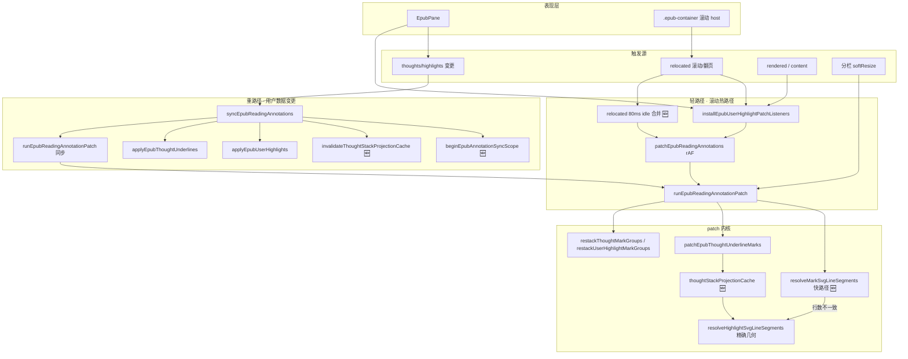
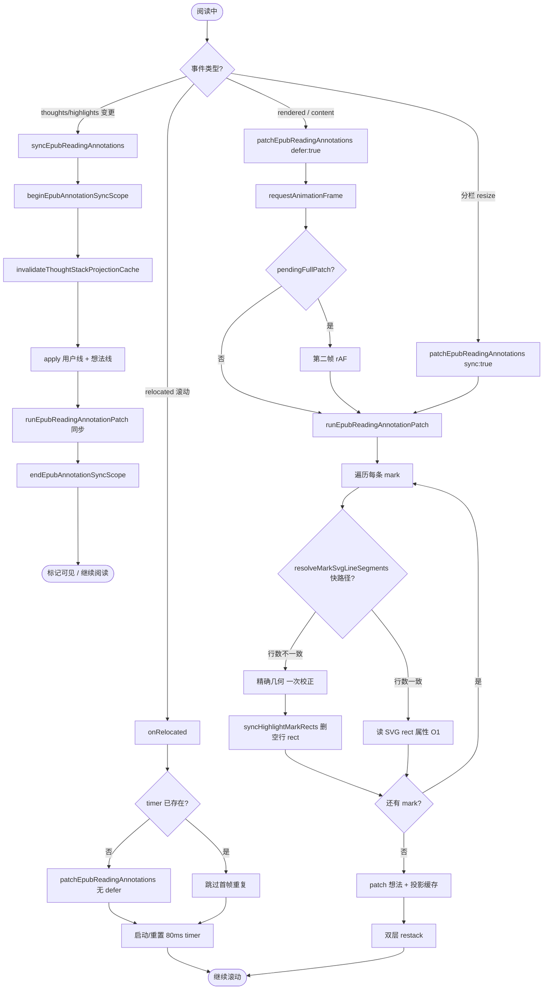
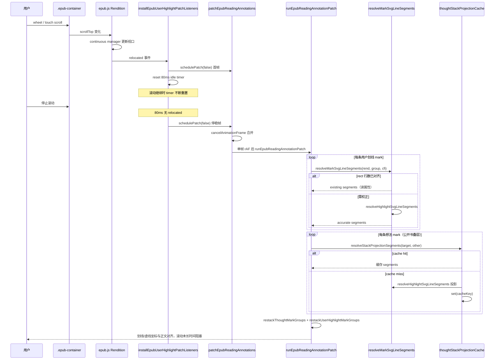
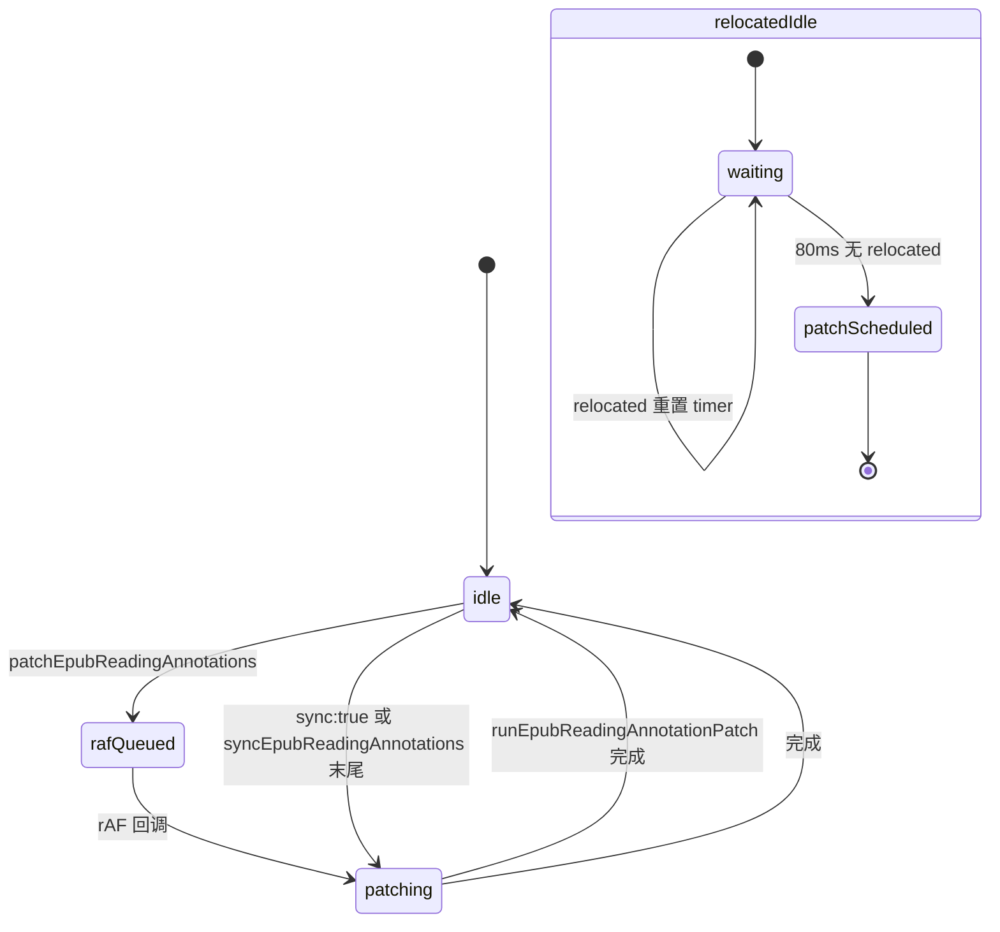

# EPUB 连续滚动卡顿 — 实现思路与解决方案

> **状态**：核心能力已上线（2026-06～07）｜本文从已落地代码反推 **滚动热路径** 的解题套路  
> **日期**：2026-07-02  
> **需求摘要**：连续滚动阅读时，用户划线/想法 mark 较多的情况下，滚动帧率下降、主线程长时间占用；保存划线/想法时同步链路与滚动争抢，表现为「划不动 / 卡数秒」。

## 延伸阅读

- [EPUB注释同步性能.md](../../ebook/EPUB注释同步性能.md) — **实现归档**：patch 快路径、sync 缓存、想法 restack、选区卡死等完整 diff 与代码注释
- [EPUB标注分层.md](../epub/EPUB标注分层.md) — 用户线 / 想法线 / 播放层三层编排与 `syncEpubReadingAnnotations` 总览
- [EPUB公开想法下划线修复.md](../epub/EPUB公开想法下划线修复.md) — 公开书叠层投影（`thoughtStackProjectionCache` 与滚动 patch 共用）
- [EPUB阅读器设置滚动.md](../../ebook/EPUB阅读器设置滚动.md) — 连续滚动 `flow: scrolled` + `manager: continuous` 与 **已放弃** 的外层 ScrollArea 方案

---

## 0. 读本文你将得到什么

- **问题本质**：卡顿不是 epub.js 滚动容器本身慢，而是 **滚动每帧触发的 mark patch 链**（CFI→DOM→布局测量 × N 条 mark，公开书还有 O(n²) 叠层投影）占满主线程。
- **一句话方案**：**双轨调度** — 用户保存/划线走 **同步 patch**；滚动/翻页/relocated 走 **rAF 合并 + 80ms 停稳 debounce**；patch 内 **读 SVG rect 快路径 + 叠层投影缓存**，把滚动热路径从 O(N×布局) 降到 O(N×读属性)。
- **改动分层**：几何快路径（`epubRangeGeometry`）→ patch 调度（`epubUserHighlights`）→ 想法叠层缓存（`epubThoughtAnnotations`）→ EpubPane 接线。
- **落地顺序**：先 patch 快路径 → 再 sync 减负（缓存 + restack）→ 再 relocated 合并 → 最后叠层投影缓存。
- **最大风险**：跨段落新划线首帧仍走精确几何；sync 与用户滚动并发时仍可能短暂掉帧（可接受，用户操作后需即时可见）。

---

## 1. 需求与边界

### 1.1 用户故事

| 角色 | 场景 | 行为 | 期望结果 |
|------|------|------|----------|
| 读者 | 连续滚动模式，书中已有数十～上百条划线/想法 | 快速滚轮/触控板滑动 | **60fps 级流畅**，无明显粘滞 |
| 读者 | 同上 | PopBar 保存新划线或想法 | 标记 **亚秒内可见**，且不长时间阻塞滚动 |
| 读者 | 连续滚动 + 公开书多人想法 | 滚过含叠层虚线的段落 | 虚线样式正确，**不因叠层计算每帧卡死** |
| 读者 | 分栏拖拽改变阅读区宽度 | 拖动过程中 resize | softResize + **同步 patch**，不等到滚动停稳 |

### 1.2 范围

| 在范围内 | 不在范围内（非目标） |
|----------|----------------------|
| 滚动/relocated/rendered 触发的 **轻量 patch** 调度 | 重写 epub.js continuous manager |
| patch 阶段 **读 rect 快路径**、行数对齐校正 | 外层 `ScrollArea` 包裹阅读区（已证明更卡） |
| sync 作用域 CFI/clientRect **缓存** | 后端想法/划线数据分页 |
| 想法 **DOM restack** 替代全书 reapply | 听书节间 iframe 续播（见 [EPUB滚动多iframe听书.md](../epub/EPUB滚动多iframe听书.md)） |
| `relocated` **80ms idle 合并** | 选区落空行 PopBar 卡死（同仓库 §4.6，不同链路） |
| 公开书叠层 **CFI 投影缓存** | PDF 阅读滚动 |

### 1.3 约束与依赖

- **epub.js 连续滚动**：`.epub-container` 为滚动 host；滚动时 **`relocated` 高频**（视口 CFI 变化）。
- **mark 模型**：用户线 `annotations.highlight`、想法 `annotations.underline`；可见样式在 **patch 阶段** 写 SVG `<line>` / rect。
- **功能不变**：重叠合并、嵌套去重、PopBar 命中、叠层 spec、点击行为均保持。
- **Ponytail 刻意不做**：滚动时 full sync（remove+readd）；每条 mark 每帧 CFI 精确几何；合并多 iframe 句流。

---

## 2. 方案总览（一句话 + 要点）

**一句话方案**：把 mark 维护拆成 **重 sync**（用户改数据，可缓存、可 restack）与 **轻 patch**（滚动只改样式坐标）；轻 patch 用 **rAF/idle 合并** 限频，且 **优先读 marks-pane 已有 rect**，公开书叠层投影结果 **跨帧缓存**。

| # | 设计要点 | 理由 |
|---|----------|------|
| 1 | **双轨 patch 调度** | 用户操作要即时可见 → `runEpubReadingAnnotationPatch` 同步；滚动要避让主线程 → `patchEpubReadingAnnotations` rAF + relocated 80ms debounce |
| 2 | **`resolveMarkSvgLineSegments` 快路径** | epub.js 滚动时已更新 rect 坐标；行数与精确几何一致则 **只读属性**，避免 N×getClientRects |
| 3 | **行数对齐校正（v2）** | 跨段落选区 rect 含空行 → 首帧精确几何 + `syncHighlightMarkRects` 删多余 rect → 后续滚动仍走快路径 |
| 4 | **sync 作用域缓存** | 一次 sync 内 coalesce/suppression 不再重复解析同一 CFI → 缩短 **与用户滚动并发** 时的阻塞窗口 |
| 5 | **restack 替代全书想法 reapply** | 新增划线不再触发全部想法 remove+underline → 减少 sync 体积，间接降低滚动被 sync 打断的概率 |
| 6 | **`thoughtStackProjectionCache`** | 公开书 patch 叠层 blocker 的 CFI 投影 O(n²) → 同 `(targetCfi, otherCfi)` 滚动 patch **命中缓存** |
| 7 | **sync 时 `invalidateThoughtStackProjectionCache`** | 数据变更后投影几何可能变；滚动 patch 复用缓存，sync 开头清空 |

---

## 3. 现状与复用

| 能力 | 仓库中已有 | 本需求中的用法 |
|------|------------|----------------|
| 联合 sync | `syncEpubReadingAnnotations` · `epubUserHighlights.ts` | 用户改 thoughts/highlights 时触发；末尾 **同步** patch |
| 滚动 patch 入口 | `installEpubUserHighlightPatchListeners` | 挂 `relocated` / `rendered` / `content` → **defer rAF** |
| patch 执行体 | `runEpubReadingAnnotationPatch` | patch 用户线 + 想法线 + 双层 restack |
| 线段快路径 | `resolveMarkSvgLineSegments` · `epubRangeGeometry.ts` | 用户线/想法线 patch **统一入口** |
| sync 缓存 | `beginEpubAnnotationSyncScope` / `endEpubAnnotationSyncScope` | 仅包裹 sync，**不**包裹滚动 patch |
| 想法 restack | `restackThoughtMarkGroups` · `epubThoughtAnnotations.ts` | 替代 `invalidateAllThoughtMarksForRestack` |
| 叠层投影缓存 | `thoughtStackProjectionCache` · `epubThoughtAnnotations.ts` | `resolveStackProjectionSegments` 滚动复用 |
| EpubPane 接线 | `EpubPane.tsx` | `installEpubUserHighlightPatchListeners`；分栏 resize `{ sync: true }` |
| 连续滚动容器 | `getEpubScrollContainer` · `epubScrolledNav.ts` | 判定 scrolled 模式；**不用**外层 ScrollArea |

**调研结论**：滚动卡顿的主因是 **patch 链路与 relocated 同频**，不是阅读区 CSS 或 iframe 数量 alone。已有 epub.js rect 与 marks-pane DOM，不必在滚动时重算 CFI 几何；公开书叠层需投影，但 **同一对 CFI 在滚动 patch 间稳定**，适合模块级 Map 缓存。

### 3.1 问题根因（为何改前会卡）

```text
连续滚动时 epub.js:
  用户 scroll → manager 移动视口 → relocated 事件（高频，接近每帧）

改前 patch 监听:
  relocated → patchEpubReadingAnnotations → 双 rAF → runEpubReadingAnnotationPatch
  对每条 mark: resolveHighlightSvgLineSegments
    = CFI → resolveCfiDomRange → TreeWalker/forEachTextNode → getClientRects

书中 N 条 mark + 公开书 M 条想法叠层:
  每帧 O(N) 布局 + O(M²) CFI 投影（无缓存）
  → 主线程占满 → 滚动掉帧 / 「划不动」

用户保存划线/想法时（并行问题）:
  EpubPane useEffect → syncEpubReadingAnnotations（无缓存、全书想法 reapply）
  + 末尾双 rAF patch
  → 同步阻塞 3～8s + 滚动不可用
```

---

## 4. 架构图



**图内方法说明**：

| 方法 / 模块入口 | 功能 |
|-----------------|------|
| `syncEpubReadingAnnotations(...)` | 用户划线/想法变更唯一 **重** 入口：invalidate → apply → **同步** `runEpubReadingAnnotationPatch` |
| `beginEpubAnnotationSyncScope()` | sync 开头启用 CFI Range / clientRect Map 缓存，避免 coalesce/suppression O(n²) 重复解析 |
| `endEpubAnnotationSyncScope()` | sync 结束释放缓存，防止 stale |
| `invalidateThoughtStackProjectionCache()` | sync 开头清空叠层投影缓存；滚动 patch 期间保留命中 |
| `installEpubUserHighlightPatchListeners(rend)` | 注册 relocated/rendered/content 监听，统一走 defer patch |
| `patchEpubReadingAnnotations(rend, opts?)` | 滚动/渲染 **调度器**：`defer`→双 rAF；`sync`→取消排队立即 patch |
| `onRelocated`（闭包） | relocated 首帧立即 schedule + **80ms 停稳后再 patch 一次**，合并连续滚动帧 |
| `runEpubReadingAnnotationPatch(rend)` | 实际 patch：用户线 → 收集 blocker → 想法线 → 双层 restack |
| `resolveMarkSvgLineSegments(rend, group, cfi?)` | **快路径核心**：读 rect；行数+宽度与精确几何一致则返回 existing |
| `resolveHighlightSvgLineSegments(...)` | CFI→DOM→文本行 clientRect→SVG 局部坐标；首帧校正 / sync 内使用 |
| `patchEpubThoughtUnderlineMarks(rend?)` | 想法虚线 patch；公开书调用 `collectHigherStackOverlayBlockers` |
| `resolveStackProjectionSegments(...)` | 叠层 blocker：按 `(targetCfi, otherCfi)` 查/写 `thoughtStackProjectionCache` |
| `restackThoughtMarkGroups(rend)` | DOM `appendChild` 重排想法 mark，替代全书 reapply |
| `restackUserHighlightMarkGroups(rend)` | 用户线 z-order 重排 |

**读图要点**：

- **分叉点在触发源**：用户改数据走 SyncPath（可阻塞但须短）；滚动走 ScrollPath（必须轻）。
- 🆕 四处增量：**缓存作用域**、**idle 合并**、**rect 快路径**、**投影缓存** — 均不改 epub.js API。
- `runEpubReadingAnnotationPatch` 是两条路径的 **汇合点**，但进入频率与内部快路径命中率不同。

---

## 5. 主流程图（滚动 vs 用户操作）



**图内方法说明**：

| 方法 | 功能 |
|------|------|
| `syncEpubReadingAnnotations(...)` | 重路径；**不**经 rAF，保证用户操作后即时 patch |
| `patchEpubReadingAnnotations(rend, { defer: true })` | content/rendered：`pendingReadingAnnotationFullPatch=true`，双 rAF 等 epub.js 写完 SVG |
| `patchEpubReadingAnnotations(rend, { sync: true })` | 取消排队 rAF，立即 patch；分栏 softResize 用 |
| `onRelocated` | 连续滚动：**首帧 + 停稳 80ms** 各 patch 一次，避免每帧 O(N) |
| `resolveMarkSvgLineSegments(...)` | 决定读 rect 还是走精确几何 |
| `syncHighlightMarkRects(group, segments)` | 精确校正后删除多余空行 rect，使下次滚动可走快路径 |
| `patchEpubThoughtUnderlineMarks(rend?)` | 想法虚线；叠层 blocker 经投影缓存 |
| `resolveStackProjectionSegments(...)` | 缓存键 `targetCfi\0otherCfi`；miss 时 `resolveHighlightSvgLineSegments` |

**读图要点**：

- **滚动路径** 的关键是 `onRelocated` **不等于每帧 patch**；80ms idle 把数十次 relocated **合并为 1～2 次**。
- **快路径判定** 在 `resolveMarkSvgLineSegments` 内完成，用户线与想法线 patch **共用**。
- 用户 sync 与滚动 patch **可能并发**；sync 有 scope 缓存缩短阻塞，滚动 patch 靠快路径降低单次成本。

---

## 6. 核心时序图（连续滚动一帧内）



**图内方法说明**：

| 方法 | 功能 |
|------|------|
| `schedulePatch(defer?)` | `installEpubUserHighlightPatchListeners` 内部闭包，转调 `patchEpubReadingAnnotations` |
| `patchEpubReadingAnnotations(rend)` | 取消未执行的 rAF，排队新一帧 patch |
| `runEpubReadingAnnotationPatch(rend)` | 遍历所有 iframe document 的 marks-pane |
| `resolveMarkSvgLineSegments(...)` | 滚动热路径：多数 mark **不触发布局** |
| `resolveStackProjectionSegments(...)` | 同段叠层投影 **跨 relocated 复用** |
| `restackThoughtMarkGroups(rend)` | 仅 DOM 顺序，无 remove+readd |

**读图要点**：

- epub.js 在滚动中 **已更新 rect 坐标**；patch 职责是 **同步 line 样式与叠层扣减**，不是重新 apply annotation。
- **idle 合并** 发生在 `onRelocated` 闭包，与 rAF 合并 **叠加** — 双保险限频。
- 投影缓存在 **一次停稳 patch 内** 也可命中（同文档多条 mark 互投影）。

---

## 7. （可选）patch 调度状态



**图内方法说明**：

| 方法 | 功能 |
|------|------|
| `patchEpubReadingAnnotations(..., { sync: true })` | 取消 `readingAnnotationPatchRaf`，**打断**排队，立即 patch |
| `pendingReadingAnnotationFullPatch` | defer 路径标记，触发 **双 rAF** 等 SVG 就绪 |
| `RELOCATED_PATCH_IDLE_MS = 80` | relocated 停稳阈值；滚动中 timer 不断重置 |

---

## 8. 模块职责与关键算法

### 8.1 模块一览

| 模块 | 职责 | 新增/改动 | 路径 |
|------|------|-----------|------|
| 线段快路径 | rect 读属性 + 行数对齐 | 扩展 v2 | `utils/epub/mark/epubRangeGeometry.ts` |
| sync 缓存 | CFI/clientRect 批处理缓存 | 新增 | 同上 |
| patch 调度 | 双轨 rAF / idle / sync | 扩展 | `utils/epub/mark/epubUserHighlights.ts` |
| 想法 patch | 叠层投影缓存 | 新增 | `utils/epub/mark/epubThoughtAnnotations.ts` |
| 阅读页接线 | 挂 listener、resize sync patch | 小改 | `components/reader/EpubPane.tsx` |

### 8.2 快路径判定（伪代码）

```typescript
function resolveMarkSvgLineSegments(rend, group, cfi?): SvgLineSegment[] {
  const existing = readMarkSvgLineSegmentsFromRects(group);
  if (rend && cfi?.trim()) {
    const accurate = resolveHighlightSvgLineSegments(rend, group, cfi);
    if (accurate.length > 0) {
      // 行数 + 总宽度 ≈ 一致 → 滚动热路径
      if (existing.length === accurate.length && segmentsRoughlyMatch(existing, accurate))
        return existing;
      return accurate; // 首帧跨段校正
    }
  }
  return existing.length > 0 ? existing : resolveHighlightSvgLineSegments(...);
}
```

### 8.3 复杂度对比

| 场景 | 优化前 | 优化后 |
|------|--------|--------|
| 滚动停稳 patch，N 条已校正 mark | O(N × CFI 布局) | **O(N × 读 rect)** |
| 连续滚动 1s，relocated ~60 次 | ~60 × O(N 布局) | **1～2 × O(N 读 rect)** + idle |
| 公开书 M 条想法叠层 patch | O(M² × 投影布局) | O(M² × **缓存命中**)； miss 才布局 |
| 用户 sync（100 条想法 + 50 划线） | O(n²) 无缓存 + 全书想法 reapply | scope 缓存 + restack，**无全书 reapply** |

### 8.4 数据：缓存与 ref

| 字段 | 存储 | 生命周期 | 说明 |
|------|------|----------|------|
| `syncCfiRangeCache` | 模块 Map | `begin`～`end` sync scope | 仅 sync，不用于滚动 patch |
| `thoughtStackProjectionCache` | 模块 Map | sync 开头 clear；滚动 patch 写入 | 键：`targetCfi\0otherCfi` |
| `readingAnnotationPatchRaf` | 模块 number | 下次 rAF 前 | 合并 patch 请求 |
| `relocatedPatchTimer` | listener 闭包 | rendition 生命周期 | 80ms idle |

---

## 9. 分阶段实现步骤（复现指南）

| 阶段 | 目标 | 任务 |
|------|------|------|
| **M1** | 证明 patch 是瓶颈 | - [ ] Performance 录制 scroll + relocated<br>- [ ] 统计 `resolveHighlightSvgLineSegments` 调用次数 |
| **M2** | 快路径 v1 | - [ ] `readMarkSvgLineSegmentsFromRects`<br>- [ ] `resolveMarkSvgLineSegments` 有 rect 则返回 |
| **M3** | 空行回归修复 v2 | - [ ] 行数 + `segmentsRoughlyMatch` 校验<br>- [ ] `syncHighlightMarkRects` 删多余 rect |
| **M4** | sync 减负 | - [ ] `beginEpubAnnotationSyncScope`<br>- [ ] `restackThoughtMarkGroups` 替代全书 reapply<br>- [ ] sync 末尾 **同步** patch |
| **M5** | 滚动限频 | - [ ] `patchEpubReadingAnnotations` rAF 合并<br>- [ ] `onRelocated` 80ms idle<br>- [ ] `installEpubUserHighlightPatchListeners` |
| **M6** | 公开书叠层 | - [ ] `thoughtStackProjectionCache`<br>- [ ] sync 开头 `invalidateThoughtStackProjectionCache` |
| **M7** | 回归 | - [ ] 100+ mark 长章滚动<br>- [ ] 跨段新划线首帧<br>- [ ] 分栏 resize `{ sync: true }` |

---

## 10. 关键决策与备选方案

| 决策 | 选用 | 备选 | 为何不选备选 |
|------|------|------|--------------|
| 滚动 patch 频率 | rAF + 80ms idle | 每 relocated 同步 patch | 连续滚动 relocated ≈ 每帧，必卡 |
| 几何来源 | 读 marks-pane rect | 每帧 CFI→getClientRects | epub.js 已维护 rect 坐标 |
| 跨段空行 | 行数对齐 + 一次校正 | 永远读 rect | 跨 `<p>` 空行整宽彩色线回归 |
| 用户 sync patch | 同步 `runEpubReadingAnnotationPatch` | 仍双 rAF | 用户体感 3～8s 延迟 |
| 想法叠层 | 投影缓存 + rank 扣减 | 每帧全量投影 | 公开书 M>20 时 O(M²) 不可接受 |
| 外层 ScrollArea | **不做** | 包裹阅读区统一滚动 | 正文错位 + 更卡（见 reader-settings-scroll） |
| 滚动时 full sync | **不做** | relocated 触发 sync | remove+readd 闪烁且更慢 |

---

## 11. 风险、边界与待确认

| 项 | 等级 | 说明 | 缓解 |
|----|------|------|------|
| 首帧跨段划线 | 低 | 一次精确几何，略慢 | 校正后 permanent 快路径 |
| sync 与 scroll 并发 | 中 | 用户保存时仍可能短卡 | scope 缓存 + restack 已缩短 |
| 投影缓存 stale | 低 | 仅 sync 开头 clear | 改 CFI 必走 sync |
| 80ms 停稳延迟 | 低 | 停滚后虚线坐标最多 80ms 才精修 | 可接受；首帧 relocated 仍 schedule 一次 |
| 极大 mark 数 | 中 | O(N) 读属性仍线性 | 后续可按视口 cull（待确认） |

**待确认**：

- [ ] 单章 500+ mark 时 idle patch 是否仍 <16ms（验证：Performance → `runEpubReadingAnnotationPatch` 单次耗时）

---

## 12. 验收清单

| # | 用例 | 步骤 | 期望 |
|---|------|------|------|
| AC1 | 多 mark 连续滚动 | 100+ 划线/想法，快速滚动 10s | 无明显粘滞；CPU 无长期 100% |
| AC2 | 停滚后对齐 | 停滚后等待 100ms | 划线/虚线与正文对齐，无错位 |
| AC3 | 新 save 划线 | PopBar 保存 | **1s 内**可见；不卡死 3～8s |
| AC4 | 跨段划线 | 跨两段 + 段间空行 | 空行 **无** 整行彩色线；再次滚动仍流畅 |
| AC5 | 公开书叠层 | 多人同段想法 | 叠层正确；滚动不停顿 |
| AC6 | 分栏拖拽 | 拖窄/拖宽阅读区 | softResize 过程中 mark 不闪没； `{ sync: true }` 即时 patch |
| AC7 | 翻页模式 | 分页 + relocated | 仍走 idle/rAF，行为不退化 |

---

## 13. 预估改动面（已实现）

| 类型 | 路径 |
|------|------|
| 几何 / 快路径 | `apps/frontend/src/views/ebook/utils/epub/mark/epubRangeGeometry.ts` |
| sync / 调度 | `apps/frontend/src/views/ebook/utils/epub/mark/epubUserHighlights.ts` |
| 想法 / 投影缓存 | `apps/frontend/src/views/ebook/utils/epub/mark/epubThoughtAnnotations.ts` |
| 阅读页 | `apps/frontend/src/views/ebook/components/reader/EpubPane.tsx` |
| 实现归档 | `docs/ebook/EPUB注释同步性能.md` |

---

## 14. 调试手册（滚动仍卡时）

1. **Performance 录制** → 滚动 5s → 看 Main thread 是否被 `runEpubReadingAnnotationPatch` / `getClientRects` 占满。  
2. **若每帧都 patch** → 查 `installEpubUserHighlightPatchListeners` 是否 `onRelocated` 80ms 合并生效。  
3. **若单次 patch 仍慢** → 断点 `resolveMarkSvgLineSegments`：是否走了 `accurate` 分支（行数不一致或未校正）。  
4. **公开书** → 看 `thoughtStackProjectionCache` size；若每帧 clear，查 sync 是否过于频繁触发。  
5. **保存时卡** → 查是否误走 `patchEpubReadingAnnotations` 双 rAF；sync 末尾应直接 `runEpubReadingAnnotationPatch`。  
6. **分栏拖不动** → 查 ResizeObserver 是否每次 `sync` 而非 `{ sync: true }` patch only。

---

（本文档为规划态实现思路，核心能力已上线；落地细节以 `EPUB注释同步性能.md` 与源码为准。）
