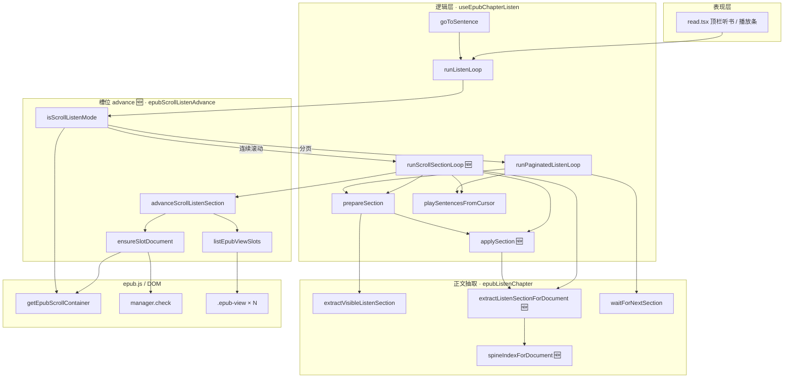
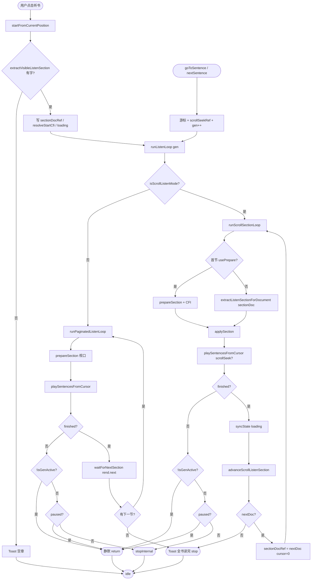
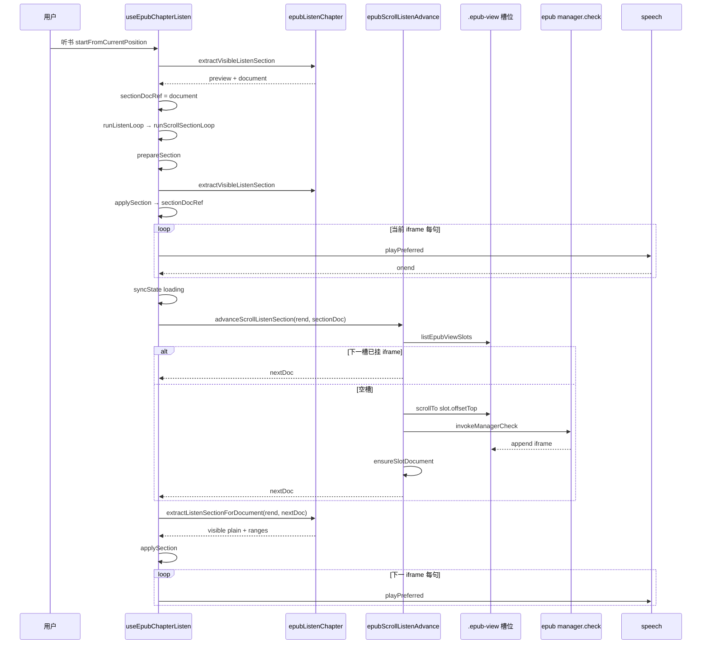
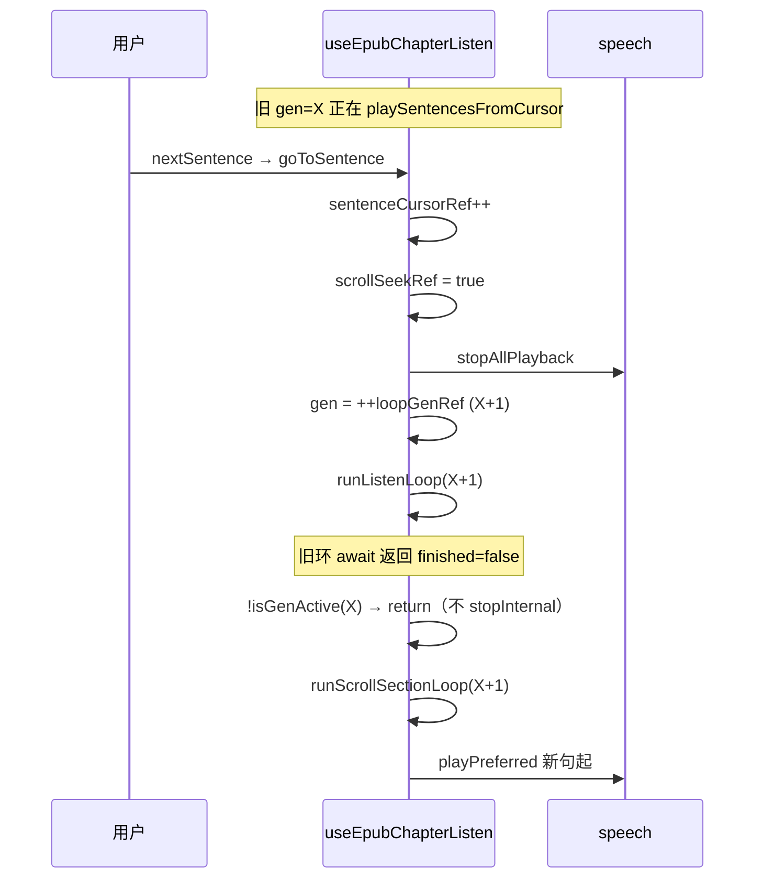
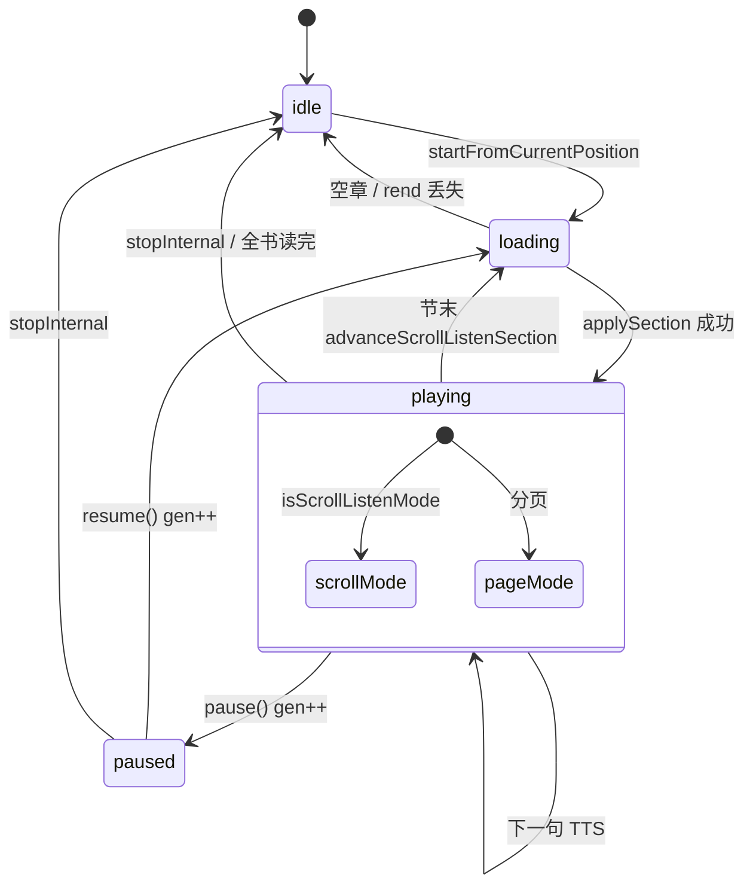

# EPUB 连续滚动 — 多 iframe 听书节间续播 — 实现思路

> **状态**：核心能力已上线（2026-06）｜本文从已落地代码反推**可复用的解题套路**  
> **日期**：2026-06-27  
> **需求摘要**：连续滚动模式下 epub.js 同时挂载多个 `.epub-view` / iframe，听书须 **逐 iframe 播完再衔接下一 iframe**，且播放条切句/暂停不能误退出。

## 延伸阅读

- [EPUB滚动听书章节前进影响.md](../../ebook/EPUB滚动听书章节前进影响.md) — 改动前后代码对比与注释
- [EPUB滚动听书章节前进影响.md](../../impact/EPUB滚动听书章节前进影响.md) — 影响面与回归清单
- [EPUB阅读器设置滚动.md](../../ebook/EPUB阅读器设置滚动.md) — 连续滚动阅读与 `continuous` manager
- [EPUB章节听书.md](../../ebook/EPUB章节听书.md) — 听书 MVP 总览

---

## 0. 读本文你将得到什么

- **问题本质**：连续滚动不是「一个 spine 一章」，而是 **DOM 里同时存在多个 iframe 槽位**；听书不能把分页模式的 `rend.next()` / 视口抽取原样套用。
- **一句话方案**：**按 `document` 切节** — 当前 iframe 播完 → 在 `.epub-view` 列表里找/加载下一槽 → 对该 `document` 抽正文再播；分页模式仍走原 `waitForNextSection`。
- **改动分层**：Hook 状态机（`useEpubChapterListen`）+ 正文抽取扩展（`epubListenChapter`）+ 槽位 advance 工具（`epubScrollListenAdvance` 🆕）。
- **落地顺序**：先分叉循环 → 再 `sectionDocRef` → 再 advance 工具 → 最后修 gen/切句竞态。
- **最大风险**：空槽加载失败仍可能误报「全书读完」；节间 scroll 可能引起视口跳动（见 §11）。

---

## 1. 需求与边界

### 1.1 用户故事

| 角色 | 场景 | 行为 | 期望结果 |
|------|------|------|----------|
| 读者 | EPUB **连续滚动** + 顶栏听书 | 播完当前屏 iframe 内最后一句 | **自动**朗读下方下一 iframe，播放条句数更新 |
| 读者 | 听书中 | 点播放条「下一句」 | 从下一句继续播，**不退出**听书 |
| 读者 | EPUB **分页翻页** + 听书 | 节末 | 仍用 `rend.next()` 衔接（行为与改前一致） |

### 1.2 范围

| 在范围内 | 不在范围内（非目标） |
|----------|----------------------|
| 连续滚动听书节间 iframe 衔接 | 合并多 iframe 为一条「超级句流」 |
| 播放条切句 / 暂停 gen 竞态修复 | 跨 iframe **跳句**（仍只在本 iframe 内切句） |
| 指定 `document` 抽正文 + spineIndex | `rend.display(spineIndex)` 强刷 spine |
| 分页模式原 `waitForNextSection` 保留 | PDF 听书、听当前（无 diff） |

### 1.3 约束与依赖

- **epub.js**：`flow: 'scrolled'` + `manager: 'continuous'`（见 `EPUB阅读器设置滚动.md`）。
- **正文/TTS 同源**：`innerText` + `stripMarkdownForTts` + `buildSentenceOffsetSpans`（听书定稿，不另建 DOM 句表）。
- **互斥**：听书 vs 听当前不变；`loopGenRef` 代际取消模式不变。
- **Ponytail 刻意不做**：播放中频繁 `rend.display`、统一句流 merge、每句 `rend.next()`。

---

## 2. 方案总览（一句话 + 要点）

**一句话方案**：把听书的「一节」从 **视口可见 section** 重新定义为 **一个 iframe 的 `contentDocument`**，节末用 **DOM 槽位顺序 + scroll + `manager.check()`** 解析下一 `document`，而不是 `rend.next()`。

| # | 设计要点 | 理由 |
|---|----------|------|
| 1 | **`runListenLoop` 按模式分叉** | 分页与连续滚动节间机制完全不同，混在一个 `for(;;)` 里必踩坑 |
| 2 | **`sectionDocRef` 跟踪当前 iframe** | 后续节抽取必须绑定 **已知 document**，不能每轮 `extractVisibleListenSection`（视口会变） |
| 3 | **首节 `prepareSection`，后续节 `extractListenSectionForDocument`** | 首节要 CFI 起始句 + 视口；后续节 document 已确定 |
| 4 | **`advanceScrollListenSection` 只做槽位加载** | 先查已加载下一 doc；空槽再 scroll + check；不用 `rend.next` |
| 5 | **`applySection` 去掉 `isGenActive` 门禁** | gen 失效应在循环层处理；在 apply 层 return null 会卡 loading |
| 6 | **切句 `goToSentence` → `runListenLoop(gen)`** | 单独 `playSentencesFromCursor` 脱离主循环，旧 gen 误 `stopInternal` |
| 7 | **`!finished` 先判 `!isGenActive(gen)`** | seek/pause 递增 gen 后，旧循环须静默退出 |

---

## 3. 现状与复用

| 能力 | 仓库中已有 | 本需求中的用法 |
|------|------------|----------------|
| 视口抽正文 | `extractVisibleListenSection` · `epubListenChapter.ts` | **首节** `prepareSection` 复用 |
| 逐句 TTS + 预取 | `playSentencesFromCursor` · `useEpubChapterListen.ts` | **两模式共用**，逻辑未改 |
| 分页节间 | `waitForNextSection` · `epubListenChapter.ts` | **仅** `runPaginatedListenLoop` |
| 滚动容器 | `getEpubScrollContainer` · `epubScrolledNav.ts` | `isScrollListenMode` 判定 |
| 播放条 / 互斥 | `EpubListenPlayerBar` · `read.tsx` | 无改动，API 不变 |
| spine 索引 | `getRenditionViewsList` · `resolveSpineIndexForHref` | **扩展** `spineIndexForDocument` |

**调研结论**：不必重写 TTS/高亮/播放条；缺的是 **「当前 iframe → 下一 iframe」的 DOM 级导航** 与 **Hook 里 document 粒度的节循环**。曾尝试的「合并句流」「rend.display 预加载」回归更大，已废弃。

### 3.1 问题根因（为何改前会失败）

```text
改前 runListenLoop（分页 + 滚动共用）:
  prepareSection → extractVisibleListenSection（谁在最视口？）
  playSentencesFromCursor
  waitForNextSection → rend.next()（换 spine，不是换槽位 iframe）

连续滚动真实 DOM:
  .epub-container
    .epub-view [空槽 | iframe visibility:hidden | iframe 当前章]
    .epub-view ...
    .epub-view ...

失败模式:
  A. 视口抽取 → 句数随 scroll 跳变
  B. rend.next() → 整章替换，与 continuous 语义冲突
  C. 合并多 iframe plain → 句 Range 跨 document，高亮错位
  D. 播放中 rend.display → 页面跳动、loading 卡住
```

---

## 4. 架构图



**图内方法说明**：

| 方法 / 模块入口 | 功能 |
|-----------------|------|
| `runListenLoop(gen, opts?)` | 听书总入口：取 Rendition → `isScrollListenMode` 分叉滚动/分页子循环 |
| `runScrollSectionLoop(gen)` 🆕 | 连续滚动主环：逐 iframe document 备节 → 逐句播 → `advanceScrollListenSection` |
| `runPaginatedListenLoop(gen, opts?)` | 改前 `runListenLoop` 体：每轮视口 `prepareSection` + `waitForNextSection` |
| `prepareSection(rend)` | 视口 `extractVisibleListenSection` → `applySection`；首节 / CFI 解析 |
| `applySection(rend, visible)` 🆕 | 写 `sectionRef` / `sectionDocRef` / 播放条；可选 CFI 起始句；**不**做 gen 门禁 |
| `playSentencesFromCursor(ctx, gen, opts?)` | 从 `sentenceCursorRef` 逐句 TTS + 高亮 + 预取下一句 |
| `goToSentence(index)` | 设游标 + `scrollSeekRef` + `++loopGenRef` → **`runListenLoop(gen)`** 重入完整环 |
| `extractVisibleListenSection(rend, spineHint?)` | 从视口/ views 找**有字** document，抽 plain + outerRange |
| `extractListenSectionForDocument(rend, doc)` 🆕 | 对**指定** iframe document 抽节；节间续播用 |
| `spineIndexForDocument(rend, doc)` 🆕 | 播放条章号：view.index → canonical href → fallback |
| `waitForNextSection(rend, isActive)` | 分页：`rend.next()` + relocated 等待 |
| `isScrollListenMode(rend)` 🆕 | `getEpubScrollContainer(rend) != null` |
| `advanceScrollListenSection(rend, currentDoc)` 🆕 | 节末：槽位枚举 → 已加载下一 doc 或 `ensureSlotDocument` + nudge |
| `listEpubViewSlots(rend)` 🆕 | 扫描 `.epub-view`，读各槽 iframe `contentDocument`（空正文视为未加载） |
| `ensureSlotDocument(rend, slot)` 🆕 | scroll 到槽位 + 最多 8 次 `manager.check` 等待 iframe 挂载 |
| `getEpubScrollContainer(rend)` | 返回 `.epub-container` 滚动 host（连续滚动专用） |
| `manager.check()` | epub.js continuous：按需 append/prepend spine 章节到 DOM |

**读图要点**：

- **分叉点**在 `runListenLoop`：同一播放条 UI，两套节间引擎。
- 🆕 模块集中在 **document 粒度**（`sectionDocRef` + advance 工具），不碰 TTS 层。
- Advance 层 **只读 DOM + 调 check**，不调用 `rend.next` / `rend.display`。

---

## 5. 主流程图



**图内方法说明**：

| 方法 | 功能 |
|------|------|
| `startFromCurrentPosition()` | 互斥清理、preview 抽节、预写 `sectionDocRef`、`runListenLoop` |
| `isScrollListenMode(rend)` | 决定是否进入 `runScrollSectionLoop` |
| `prepareSection(rend)` | 首节视口备节 + CFI 起始句 |
| `extractListenSectionForDocument(rend, doc)` | 后续节对固定 document 抽 plain |
| `applySection(rend, visible)` | 同步 Hook 状态与 `sectionDocRef` |
| `playSentencesFromCursor(...)` | 逐句播放；`scrollCenterOnFirst` 来自 `scrollSeekRef` 或句索引 0 |
| `advanceScrollListenSection(rend, sectionDoc)` | 节末解析下一 iframe document |
| `waitForNextSection(rend, isActive)` | 分页节间唯一路径 |
| `goToSentence(index)` | 切句后 **重入** `runListenLoop`，不单独播半环 |
| `stopInternal()` | 递增 gen、清 ref、idle、可选 `onSessionEnd` |

**读图要点**：

- 滚动与分页在 **节间** 分道扬镳：`advanceScrollListenSection` vs `waitForNextSection`。
- **`!finished` 三分支**（gen 失效 / paused / 真失败）是切句不退出的关键，两模式共用。
- 切句从侧枝 **重新汇入** `runListenLoop`，保证节末仍能 advance。

---

## 6. 核心时序图

### 6.1 Happy path：连续滚动播完当前 iframe → 下一 iframe



**图内方法说明**：

| 方法 | 功能 |
|------|------|
| `extractVisibleListenSection(rend, spineHint?)` | 开播 preview + 首节备节：找视口内有字 document |
| `prepareSection(rend)` | 首节进入循环时再次视口备节（含 CFI 句索引） |
| `applySection(rend, visible)` | 写入 `sectionRef` / `sectionDocRef` / 播放条句数 |
| `advanceScrollListenSection(rend, currentDoc)` | 节末返回下一 `Document` 或 null |
| `listEpubViewSlots(rend)` | 枚举槽位及已加载 doc |
| `ensureSlotDocument(rend, slot)` | 对空槽 scroll + 轮询 check 直到 iframe 有正文 |
| `invokeManagerCheck(rend)` | 包装 `manager.check()`，2s 超时 |
| `extractListenSectionForDocument(rend, doc)` | 对 nextDoc 抽 plain，供第二段起每轮使用 |
| `playPreferred(text, opts)` | 单句 TTS（本机/云端） |

**读图要点**：

- **两阶段抽正文**：首节视口、后续 **固定 doc** — 时序上表现为第二次起跳过 `extractVisibleListenSection`。
- Advance 与 TTS **串行**：必须当前 iframe 全部句播完才 advance，避免跨 doc 游标错乱。

### 6.2 切句：gen 取代与静默退出



**图内方法说明**：

| 方法 | 功能 |
|------|------|
| `goToSentence(index)` | 切句唯一入口；必须 `runListenLoop` 而非孤立 `playSentencesFromCursor` |
| `stopAllPlayback()` | 停当前 TTS；不调用 `stopInternal`（保留播放条） |
| `isGenActive(gen)` | `gen === loopGenRef.current` |
| `runListenLoop(gen)` | 新 gen 重入；滚动模式从 `sectionDocRef` 续 |

**读图要点**：

- **一次** `++loopGenRef` 即可（改前曾 `+=1` 再取 gen，易双 increment）。
- 旧环 responsibility 仅是 **不要** 在 gen 失效时 `stopInternal`。

---

## 7. 状态机（听书循环 gen / 模式）



**图内方法说明**：

| 方法 | 功能 |
|------|------|
| `pause()` | `pausedRef=true`；`loopGenRef++`；停 TTS；不清 `sectionDocRef` |
| `resume()` | `pausedRef=false`；新 gen；`runListenLoop(..., { continueSections: true })` |
| `stopInternal()` | 清 `sectionDocRef` / `sectionRef`；gen++；idle |

**读图要点**：

- `sectionDocRef` 在 **paused** 时保留，resume 从当前 iframe 续播。
- **loading** 在节间 advance 时出现，UX 上介于两 iframe 之间。

---

## 8. 模块职责与改动清单（逐点对照）

本节对应 **当前改动的每一个点**，便于逐项审计或迁移到类似项目。

### 8.1 文件级改动

| 文件 | 变更类型 | 职责 |
|------|----------|------|
| `hooks/useEpubChapterListen.ts` | 重构 | 分叉循环、ref、切句、gen 竞态 |
| `utils/epubScrollListenAdvance.ts` | 🆕 | 槽位枚举 + 节间 advance |
| `utils/epubListenChapter.ts` | 扩展 | `extractListenSectionForDocument` + `spineIndexForDocument` |

### 8.2 Hook 内逐点说明

| # | 符号 / ref | 改什么 | 为什么 |
|---|------------|--------|--------|
| H1 | `sectionDocRef` | 当前 iframe 的 `Document` | 节间衔接的身份标识，比 spineIndex 更贴近 DOM 真实结构 |
| H2 | `scrollSeekRef` | 切句后首句居中滚动 | 改前 `goToSentence` 传 `scrollCenterOnFirst: true`；重入循环后需 ref 传递 |
| H3 | `ctxFromVisible` | 从 `VisibleListenSection` 建 `SectionCtx` | 抽离重复，供 `applySection` 使用 |
| H4 | `applySection` | 从原 `prepareSection` 拆出 | 滚动后续节可直接 `extractListenSectionForDocument` → `applySection` |
| H5 | `applySection` 去掉 `isGenActive` | 始终 return ctx | 避免 gen 在 prepare 末尾失效 → null → loading 卡死 |
| H6 | `prepareSection(rend)` | 去掉 gen 参数 | 只负责视口路径 |
| H7 | `runScrollSectionLoop` | 🆕 滚动主环 | `usePrepare` 首节；否则 `extractListenSectionForDocument` |
| H8 | `runPaginatedListenLoop` | 原 `runListenLoop` 体 | 分页零语义变化（除 H9） |
| H9 | `!finished` 三分支 | 先 `!isGenActive` → `paused` → `stopInternal` | 切句/暂停不误杀 |
| H10 | `runListenLoop` | 变分发器 | `isScrollListenMode ? scroll : paginated` |
| H11 | `startFromCurrentPosition` | 预写 `sectionDocRef` | 循环首轮 `usePrepare` 与 doc 一致 |
| H12 | `syncToCurrentView` | 清/写 `sectionDocRef` | TOC 跳转后 document 对齐 |
| H13 | `goToSentence` | `runListenLoop(gen)` | 切句后节末仍能 advance |
| H14 | `stopInternal` | 清 `sectionDocRef` | 停止时会话完全重置 |

### 8.3 `epubListenChapter.ts` 逐点

| # | 符号 | 做什么 |
|---|------|--------|
| C1 | `spineIndexForDocument` | view.index 命中 → canonical href → `spineIndexFromRendition` fallback |
| C2 | `extractListenSectionForDocument` | 对给定 `doc.body` innerText 抽 plain + `selectNodeContents` outerRange |
| C3 | 与 `extractVisibleListenSection` 关系 | **同源算法、不同 document 来源** — 不要写第三套抽正文 |

### 8.4 `epubScrollListenAdvance.ts` 逐点

| # | 符号 / 常量 | 做什么 |
|---|-------------|--------|
| A1 | `SCROLL_EDGE_PX = 16` | scrollTo 槽位时顶部留白 |
| A2 | `SLOT_TRIES = 8` | 单槽 `ensureSlotDocument` 最大 check 次数 |
| A3 | `ADVANCE_ROUNDS = 5` | 全局 nudge scroll 轮数（仍失败 → null） |
| A4 | `sectionHasText(doc)` | 空 iframe 不算已加载 |
| A5 | `docKey` / `sameDoc` | 同一章节 document 等价（ref 或 canonical） |
| A6 | `listEpubViewSlots` | **DOM 顺序**即播放顺序，不 sort by spine |
| A7 | `nextLoadedDoc` | 快路径：当前槽之后第一个已有 doc |
| A8 | `findSlotIndex` | 当前 doc 在列表中的位置；找不到则 fallback 最后有 doc 槽 |
| A9 | `ensureSlotDocument` | scrollTo + `invokeManagerCheck` × N + 80ms 间隔 |
| A10 | `invokeManagerCheck` | `Promise.race(check, 2s)` 防 hang |
| A11 | `advanceScrollListenSection` | 快路径 → 逐槽 ensure → nudge 0.9 视口高 scroll |
| A12 | **不做** | `rend.next()`、`rend.display()`、合并 plain |

### 8.5 关键接口草图

```typescript
// 模式判定 — 有滚动容器即连续滚动听书
function isScrollListenMode(rend: Rendition): boolean;

// 节末：当前 document → 下一 document | null
async function advanceScrollListenSection(
  rend: Rendition,
  currentDoc: Document,
): Promise<Document | null>;

// 对指定 iframe 抽听书节（与视口抽取输出同型）
function extractListenSectionForDocument(
  rend: Rendition,
  doc: Document,
): VisibleListenSection | null;
```

### 8.6 数据：ref 与 state 谁存什么

| 字段 | 存储 | 生命周期 | 说明 |
|------|------|----------|------|
| `sectionDocRef` | ref | 听到 stop / 分页节末清 | 当前 iframe document |
| `sectionRef` | ref | 同上 | plain + sentences + ranges |
| `sentenceCursorRef` | ref | 切句/节末 reset | 当前句索引 |
| `loopGenRef` | ref | 每次 stop/seek/pause++ | 异步环取消令牌 |
| `resolveStartCfiRef` | ref | 首节解析后 false | CFI 起始句仅一次 |
| `scrollSeekRef` | ref | 一次 play 前消费 | 切句居中 |
| `state.spineIndex` | React state | 每节 applySection 更新 | 播放条章号 |

---

## 9. 分阶段实现步骤（复现指南）

若你在 **另一个项目** 复刻同类能力，建议严格按序 — 与本次落地顺序一致。

| 阶段 | 目标 | 任务 |
|------|------|------|
| **M1** | 证明能播第一节 | - [ ] `isScrollListenMode` 判定<br>- [ ] `sectionDocRef` 开播预写<br>- [ ] 首节仍 `prepareSection` + CFI |
| **M2** | 单 iframe 内稳定 | - [ ] `applySection` 去 gen 门禁<br>- [ ] `!finished` gen 三分支 |
| **M3** | 节间 advance | - [ ] `listEpubViewSlots` + `nextLoadedDoc`<br>- [ ] `ensureSlotDocument` + check<br>- [ ] `runScrollSectionLoop` 接 advance |
| **M4** | 指定 doc 抽节 | - [ ] `extractListenSectionForDocument`<br>- [ ] `spineIndexForDocument` |
| **M5** | 播放条切句 | - [ ] `goToSentence` → `runListenLoop`<br>- [ ] `scrollSeekRef` |
| **M6** | 分页回归 | - [ ] `runPaginatedListenLoop` 与改前对齐<br>- [ ] 滚动/分页互测 |

---

## 10. 关键决策与备选方案

| 决策 | 选用 | 备选 | 为何不选备选 |
|------|------|------|--------------|
| 节的单位 | 一个 iframe `document` | 一个 spine | continuous 下一章可能已在 DOM 下一槽，无需 next spine |
| 节间导航 | DOM 槽位 + scroll + check | `rend.next()` | next 换整章，破坏滚动语义 |
| 预加载 | 节末 passive scroll | 播放中 `rend.display` | 用户反馈页面跳动、loading 卡 |
| 正文范围 | 每 doc 独立 plain | 合并多 doc 句流 | 句 Range 跨 iframe，高亮/sync 爆炸 |
| 切句 | 重入 `runListenLoop` | 孤立 `playSentencesFromCursor` | 旧 gen 误 stop；节末无法 advance |
| gen 失效 | 循环层 silent return | `applySection` return null | 后者卡 loading、无 Toast |

---

## 11. 风险、边界与待确认

| 项 | 等级 | 说明 | 缓解 |
|----|------|------|------|
| 空槽 5 轮仍失败 | 中 | 误 Toast「全书读完」 | 后续可加 **仅加载** 用 `rend.display`（不打断 TTS 时） |
| 节间 scroll 跳 | 中 | ensure / nudge 改 scrollTop | 听书时降低 nudge 幅度；或 advance 前 Toast loading |
| 章号不准 | 低 | canonical 解析失败 | 监控 `spineIndexForDocument` fallback |
| 跨 iframe 跳句 | 低 | 产品未要求 | 若要做：advance 后再 goToSentence，或合并句流（慎用） |
| 跨域 iframe | 低 | doc null | 与改前一致，跳过无 doc 槽 |

**待确认**：

- [ ] 极长书连续滚动内存：槽位过多时 `listEpubViewSlots` 扫描成本（验证：Performance 面板 + 人工滚 20 章）

---

## 12. 验收清单

| # | 用例 | 步骤 | 期望 |
|---|------|------|------|
| AC1 | 连续滚动开播 | 连续滚动 + 听书 | 有声、句数对应当前 iframe |
| AC2 | iframe 末续播 | 播到 7/7 | 自动下一 iframe，非「全书读完」 |
| AC3 | 分页听书 | 分页模式听多节 | `rend.next` 正常 |
| AC4 | 切句 | 播放中连点下一句 | 不退出播放条 |
| AC5 | 分句菜单 | 点选第 N 句 | 从 N 播，句居中 |
| AC6 | 暂停恢复 | 暂停 → 继续 | 当前 iframe 续播，节末 advance |
| AC7 | 互斥 | 听书中听当前 | 互斥停止 |

---

## 13. 遇到类似问题时的通用套路（Checklist）

当你在任何 **多 iframe / 连续滚动 / 虚拟列表** 场景做 **跨块连续播放** 时，可按此清单自检：

1. **先画 DOM 真相**  
   列出容器内块级单元（此处是 `.epub-view`）。**播放单元**必须与 **DOM 单元** 对齐，不要用 API 层的「下一章」代替。

2. **双路径：首块 vs 后续块**  
   - 首块：用户入口位置（视口 / CFI / 光标）决定起点。  
   - 后续块：**保存块 ID**（此处 `contentDocument` + `docKey`），不要用视口 re-detect。

3. **节间只做「加载下一块」**  
   快路径：下一块已挂载 → 直接返回。  
   慢路径：scroll 到块边界 + 触发框架的 lazy load（此处 `manager.check()`）。

4. **异步环 + 用户 seek**  
   统一用 **generation token**；旧环退出时 **不得** 调用「全量 stop」；seek 应 **重入主环** 而非子任务。

5. **显式列出「不做清单」**  
   写清为何不 merge 流、为何不 force display — 避免后人「优化」回退。

6. **分页 / 滚动分叉**  
   若产品两种阅读模式并存，**早期**在入口分叉，不要在一个 loop 里堆 `if (scrolled)`。

---

## 14. 预估改动面（已实现）

| 类型 | 路径 |
|------|------|
| Hook | `apps/frontend/src/views/ebook/hooks/useEpubChapterListen.ts` |
| Advance | `apps/frontend/src/views/ebook/utils/epubScrollListenAdvance.ts` |
| 抽取 | `apps/frontend/src/views/ebook/utils/epubListenChapter.ts` |
| 滚动容器 | `apps/frontend/src/views/ebook/utils/epubScrolledNav.ts`（只读依赖） |
| 文档 | `docs/ebook/EPUB滚动听书章节前进影响.md`、`docs/impact/EPUB滚动听书章节前进影响.md` |

---

（本文档为规划态实现思路，核心能力已上线；落地细节以源码与 `docs/ebook/` 专题为准）
