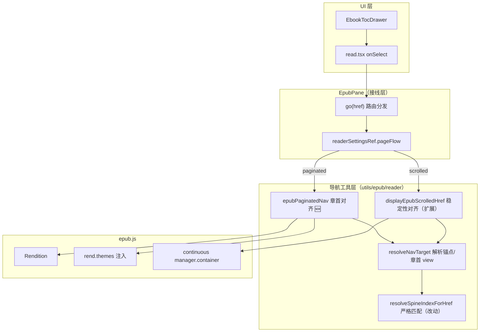
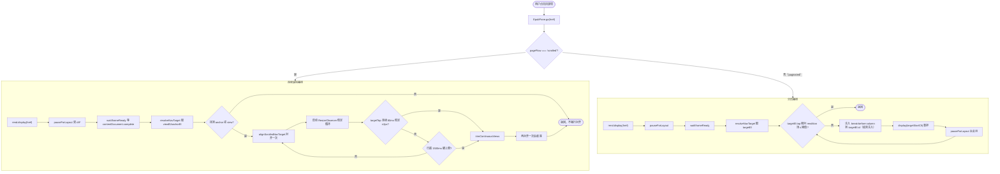
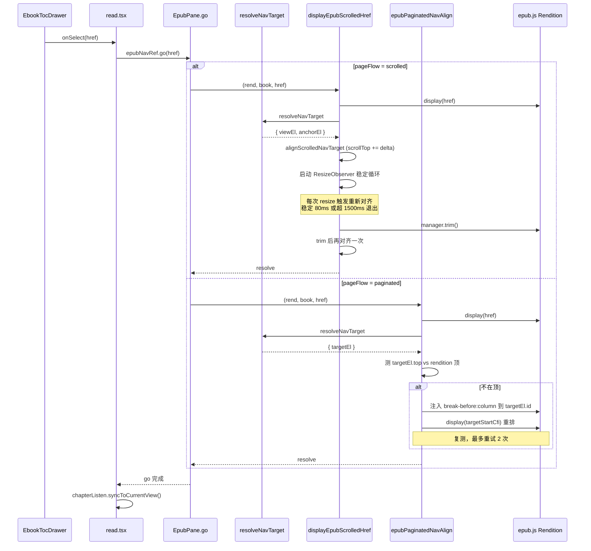
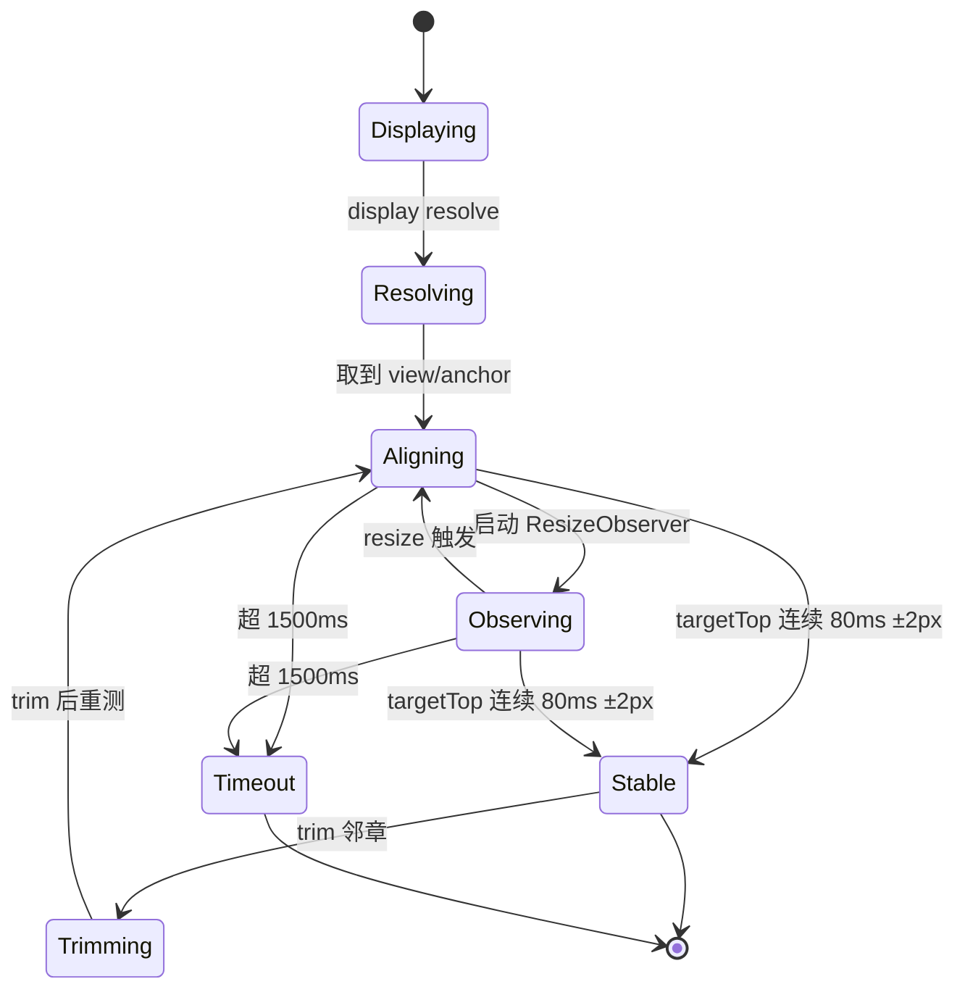

# EPUB 点击目录章首对齐 — 实现思路

> **状态**：规划（连续滚动已有初版、分页模式为新增能力）  
> **日期**：2026-07-03  
> **需求摘要**：用户在 EPUB 阅读页点击目录项后，目标章标题/锚点稳定对齐阅读容器顶边，连续滚动不再被邻章末尾顶入、分页模式不再停在章中段。

## 延伸阅读

- 既有实现专题：[EPUB滚动目录导航对齐.md](../../ebook/EPUB滚动目录导航对齐.md)（连续滚动 `displayEpubScrolledHref` 初版，固定 0/100/220ms 轮询）
- 滚动模式边界：[EPUB阅读器设置滚动.md](../../ebook/EPUB阅读器设置滚动.md)
- 目录高亮：[电子书目录激活高亮.md](../../ebook/电子书目录激活高亮.md)
- 滚动卡顿（relocated patch 时序）：[EPUB滚动卡顿性能.md](../../ebook/EPUB滚动卡顿性能.md)

---

## 0. 读本文你将得到什么

- **问题**：现网仍复现「点目录 → 该章不在顶部」。两大场景：① 连续滚动下 220ms 后仍有邻章末尾被 prepend 顶入视口；② 分页模式 `go()` 直接 `rend.display(href)`，多章同 xhtml 或 fragment 偏中段时章标题停在中下方。
- **一句话方案**：连续滚动把「固定时间轮询对齐」升级为「ResizeObserver 稳定性对齐 + iframe 就绪等待 + 严格 spine 匹配」；分页模式新增「display 后探测章首是否在顶，否则以章首 CFI 重排 + 注入 `break-before: column`」分支。
- **改动层**：仅前端 `apps/frontend/src/views/ebook/`，集中在 `utils/epub/reader/epubScrolledNav.ts`（扩展）、新增 `epubPaginatedNav.ts`、`EpubPane.tsx` 的 `go` 接线、阅读器主题注入。
- **分阶段**：M1 连续滚动稳定性升级（已有基线，风险低）→ M2 分页模式章首对齐（新能力）→ M3 边界与回归。
- **最大风险**：分页模式注入 `break-before: column` 会改变全书分页（章节总从新页开始），需做开关与回归；epub.js 分页 `display(cfi)` 的「元素落顶」行为依赖其内部 `moveTo` 实现，存在 **待确认** 项。

---

## 1. 需求与边界

### 1.1 用户故事

| 角色 | 场景 | 行为 | 期望结果 |
|------|------|------|----------|
| 读者 | 连续滚动阅读 | 点目录某章 | 章标题贴容器顶边（留 `SCROLL_EDGE_PX` 边距），上一章末尾不顶入 |
| 读者 | 分页翻页阅读 | 点目录某章 | 当前页顶部即章标题，无上一章末尾残留 |
| 读者 | 目录 href 带 `#fragment` | 点子节点 | 锚点元素对齐顶边（连续滚动）或锚点所在页且锚点在顶（分页） |

### 1.2 范围

| 在范围内 | 不在范围内（非目标） |
|----------|----------------------|
| 连续滚动目录跳转章首/锚点稳定对齐 | 听书 `syncToCurrentView`（独立路径，不改） |
| 分页模式目录跳转章首对齐 | PDF 目录（`PdfPane` 独立） |
| 同 xhtml 多章（href 带 `#`） | 引用 `scrollEpubCfiIntoView`（独立） |
| Web / Tauri 桌面端 | 边缘 wheel 衔接 `attachEpubScrolledEdgeNav`（不改） |

### 1.3 约束与依赖

- 平台：Web 浏览器 + Tauri 桌面端，共用 `EpubPane` 源码。
- 须复用：`getEpubScrollContainer`、`resolveSpineIndexForHref`、`EpubReaderPageFlow`、`rend.themes`（主题注入）。
- 体验底线：目录跳转 ≤ 1.5s 完成最终对齐；对齐过程不出现可见「跳一下又弹回」。
- 不引入新依赖；最小 diff 落在 `epubScrolledNav.ts` + 新增 `epubPaginatedNav.ts` + `EpubPane.tsx` 接线。

---

## 2. 方案总览（一句话 + 要点）

**一句话方案**：把 `go(href)` 拆成「连续滚动 = display + 稳定性对齐」「分页 = display + 章首探测 + 必要时 CFI 重排/列断」，两条路径共用目标解析与 iframe 就绪等待。

| # | 设计要点 | 理由 |
|---|----------|------|
| 1 | 连续滚动对齐从「固定 0/100/220ms」升级为「ResizeObserver 监听容器/目标 view 直到 `targetTop` 连续 80ms 稳定在 ±2px，硬上限 1500ms」 | 图片/字体后回流、批注 relocated patch、邻章 prepend 都晚于 220ms，固定轮询必然漏 |
| 2 | 首次解析锚点前等待 iframe `contentDocument.readyState === 'complete'` | 当前 `pauseForLayout`（双 rAF）早于 iframe 解析，`findNavAnchor` 返回 null → 误走 view 顶对齐或返回 false |
| 3 | 严格化 `resolveSpineIndexForHref`：去掉 `includes`/`endsWith` 模糊回退，仅保留「路径全等」+「basename 全等」 | `chapter1.xhtml` 会误匹配 `chapter10.xhtml`，导致 `findViewElForSpineIndex` 取到错章 view |
| 4 | `trim()` 后必须重新解析 view 再对齐（已部分有，需明确） | trim 可能移除目标 view 的相邻 view，造成 `targetTop` 突变 |
| 5 | 分页模式新增分支：`display(href)` 后探测目标元素相对 rendition 容器顶的位置；不在顶 → 用章首 CFI 重排 + 注入 `break-before: column` | 当前分页 `go()` 直接 `display(href)`，fragment 落中段或多章同 xhtml 时章标题停中下方 |
| 6 | 分页 `break-before: column` 注入做成「按需 + 可关」主题规则，默认只对目录命中过的锚点注入 | 全局注入会改变全书分页，影响翻页计数与既有 UX |

---

## 3. 现状与复用

| 能力 | 仓库中已有 | 本需求中的用法 |
|------|------------|----------------|
| 连续滚动目录跳转 | `apps/frontend/src/views/ebook/utils/epub/reader/epubScrolledNav.ts` 的 `displayEpubScrolledHref` | **扩展**：替换 `settleScrolledNavAlign` 为稳定性循环 |
| 滚动容器获取 | `epubScrolledNav.ts` 的 `getEpubScrollContainer` | 直接复用 |
| spine 索引解析 | `apps/frontend/src/views/ebook/utils/epub/reader/epubSpineIndex.ts` 的 `resolveSpineIndexForHref` | **改动**：去掉模糊回退 |
| 锚点解析 | `epubScrolledNav.ts` 的 `resolveNavAnchor` / `findNavAnchor` | 直接复用，前置 iframe 就绪等待 |
| view 顶对齐 | `epubScrolledNav.ts` 的 `alignViewTopToContainer` / `alignElementTopToContainer` | 直接复用 |
| ResizeObserver 模式 | `EpubPane.tsx` L599、`PdfPane.tsx` L101、`epubListenMarkHighlight.ts` L362 | 复用模式（observe → 回调 → disconnect） |
| NavApi 接线 | `apps/frontend/src/views/ebook/components/reader/EpubPane.tsx` 的 `onReady.go` | **改动**：增加分页分支 |
| 主题/样式注入 | epub.js `rend.themes.register/override` | **扩展**：注入 `break-before: column` |
| 目录抽屉 | `apps/frontend/src/views/ebook/components/layout/EbookTocDrawer.tsx` | 不改（仅触发 `onSelect`） |
| `pageFlow` 设置 | `apps/frontend/src/views/ebook/utils/epub/reader/epubReaderSettings.ts` | 复用 `'paginated' | 'scrolled'` 类型 |

**调研结论**：连续滚动路径已有 80% 基线，主要补「稳定性循环 + iframe 就绪 + 严格 spine」；分页路径目前完全空白（`go()` 直接 `display`），需新增 `epubPaginatedNav.ts` 模块。无需改后端、无需改 Store。

---

## 4. 架构图



**图内方法说明**：

| 方法 / 模块入口 | 功能 |
|-----------------|------|
| `EbookTocDrawer.onSelect(href)` | 目录点击入口，把 href 透传 `read.tsx`；不改 |
| `read.tsx onSelect` | 区分 PDF/EPUB，EPUB 调 `epubNavRef.go(href)` 后触发 `chapterListen.syncToCurrentView()`；不改 |
| `EpubPane.onReady.go(href)` | 路由分发：按 `pageFlow` 分到 scrolled/paginated 两条路径；**改动**：增加 paginated 分支 |
| `resolveNavTarget(rend, book, href)` | 🆕 统一目标解析：等 iframe ready → 返回 `{ viewEl, anchorEl, spineIndex }`；连续滚动与分页共用 |
| `displayEpubScrolledHref(rend, book, href)` | 连续滚动：`display` → `pauseForLayout` → 稳定性循环对齐；**扩展** settle 逻辑 |
| `epubPaginatedNavAlign(rend, book, href)` | 🆕 分页：`display` → 探测章首位置 → 不在顶则 CFI 重排 + `break-before: column` |
| `resolveSpineIndexForHref(book, href)` | spine 索引解析；**改动**：去掉 `includes/endsWith` 模糊回退 |
| `rend.themes` | epub.js 主题注入；**扩展**：按需注入 `break-before: column` |

**读图要点**：

- 分层：UI → 接线（EpubPane）→ 导航工具 → epub.js，单向依赖，无回环。
- 新增模块（🆕）：`epubPaginatedNav.ts`、`resolveNavTarget` 统一解析器；其余为已有模块的扩展/改动。
- 与现有边界：听书 `syncToCurrentView`、引用 `scrollEpubCfiIntoView`、边缘 wheel 衔接均不进入本链路。

---

## 5. 主流程图



**图内方法说明**：

| 方法 | 功能 |
|------|------|
| `EpubPane.go(href)` | 入口分发；按 pageFlow 选路径 |
| `rend.display(href/cfi)` | epub.js 原生渲染；连续滚动后触发 `fill/check` 可能 prepend 邻章 |
| `pauseForLayout()` | 双 `requestAnimationFrame`，等首轮 layout 落地 |
| `waitIframeReady(rend, href)` | 🆕 轮询目标 view 的 iframe `contentDocument.readyState` 至 `complete`，超时 600ms 放弃 |
| `resolveNavTarget(rend, book, href)` | 🆕 返回 `{ viewEl, anchorEl, spineIndex }`；优先锚点，其次 view 顶 |
| `alignScrolledNavTarget(rend, href, viewEl)` | 单次对齐决策：锚点 → view 顶 → 拒绝 fallback |
| `alignElementTopToContainer/alignViewTopToContainer` | 计算 `scrolledNavAlignDelta` 并写 `container.scrollTop += delta` |
| ResizeObserver 稳定循环 | 🆕 监听 `manager.container` 与目标 view，每次 resize 触发重新对齐，直到稳定 |
| `trimContinuousViews(rend)` | 调 `manager.trim()` 移除视口外邻章 view |
| `epubPaginatedNavAlign(rend, book, href)` | 🆕 分页路径入口 |
| `injectColumnBreak(rend, anchorId)` | 🆕 向 iframe 文档注入 `[id="anchorId"]{break-before:column}` 样式 |
| `display(targetStartCfi)` | 用章首 CFI 重排，使目标元素落在新列/页顶 |

**读图要点**：

- 入口：`EpubPane.go`，两条路径共享 `resolveNavTarget` + `waitIframeReady`。
- 关键分支：连续滚动靠「稳定性循环」收敛；分页靠「探测 + CFI 重排 + 列断」收敛。
- 终止条件：连续滚动 = 稳定 80ms 或硬超时 1500ms；分页 = targetEl 落顶或重排次数上限（建议 ≤2 次，防死循环）。

---

## 6. 核心时序图



**图内方法说明**：

| 方法 | 功能 |
|------|------|
| `EbookTocDrawer.onSelect` | 触发点，传 href |
| `epubNavRef.go(href)` | 异步入口，await 完成才触发听书同步 |
| `displayEpubScrolledHref` | 连续滚动主流程，await `display` + 稳定循环 |
| `resolveNavTarget` | 共享解析器，返回 view/anchor |
| `alignScrolledNavTarget` | 单次对齐决策 |
| ResizeObserver 稳定循环 | 监听容器/view resize，触发重新对齐直至稳定 |
| `manager.trim()` | 移除视口外邻章，trim 后 targetTop 可能突变需重对齐 |
| `epubPaginatedNavAlign` | 分页主流程 |
| `injectColumnBreak` | 注入列断样式 |
| `display(targetStartCfi)` | 用章首 CFI 重排 |
| `chapterListen.syncToCurrentView` | 听书章节同步，独立路径 |

**读图要点**：

- 谁发起：UI → read → EpubPane.go；两条路径各自异步收敛后回 resolve。
- 异步点：`display` resolve、`pauseForLayout`、`waitIframeReady`、ResizeObserver 稳定循环、`trim()` 均为异步，全链路最长 ~1.5s。
- 听书 `syncToCurrentView` 在 `go` resolve 后触发，依赖对齐完成才同步当前章。

---

## 7. （可选）状态机

连续滚动对齐稳定性循环的状态切换：



**图内方法说明**：

| 方法 / guard | 功能 |
|--------------|------|
| `Displaying → Resolving` guard `display resolve` | epub.js display 完成 |
| `Resolving → Aligning` guard `取到 view/anchor` | resolveNavTarget 成功 |
| `Observing → Aligning` 由 ResizeObserver 回调触发 | 容器/view resize → 重新对齐 |
| guard `targetTop 连续 80ms ±2px` | 稳定性判据，满足进 Stable |
| guard `超 1500ms` | 硬超时，强制收尾 |

**读图要点**：

- 核心是 `Aligning ↔ Observing` 在 resize 驱动下反复对齐，直到稳定或超时。
- `Stable → Trimming → Aligning` 保证 trim 后再校一次，避免 trim 引入的 targetTop 突变漏检。

---

## 8. 模块职责与接口草图

### 8.1 模块一览

| 模块 | 职责 | 新增/改动 | 预估路径 |
|------|------|-----------|----------|
| `epubScrolledNav.ts` | 连续滚动目录对齐；升级为稳定性循环 | 改动（扩展） | `apps/frontend/src/views/ebook/utils/epub/reader/epubScrolledNav.ts` |
| `epubPaginatedNav.ts` | 分页模式章首对齐 | 新增 | `apps/frontend/src/views/ebook/utils/epub/reader/epubPaginatedNav.ts` |
| `epubNavTarget.ts` | 共享目标解析 + iframe 就绪等待 | 新增 | `apps/frontend/src/views/ebook/utils/epub/reader/epubNavTarget.ts` |
| `epubSpineIndex.ts` | spine 索引解析；严格化匹配 | 改动 | `apps/frontend/src/views/ebook/utils/epub/reader/epubSpineIndex.ts` |
| `EpubPane.tsx` | `onReady.go` 接线分页分支 | 改动 | `apps/frontend/src/views/ebook/components/reader/EpubPane.tsx` |

### 8.2 关键接口（伪代码或 TypeScript 草图）

```typescript
// epubNavTarget.ts —— 共享目标解析（≤30 行草图）
type NavTarget = {
  viewEl: HTMLElement | null;      // 目标 spine 的 .epub-view
  anchorEl: HTMLElement | null;    // #fragment 对应锚点（无 fragment 则 null）
  spineIndex: number | undefined;
};

// 等目标 iframe contentDocument ready，超时放弃
export async function waitIframeReady(
  rend: Rendition, href: string, timeoutMs = 600,
): Promise<void>;

// 解析目标；连续滚动与分页共用
export async function resolveNavTarget(
  rend: Rendition, book: Book, href: string,
): Promise<NavTarget>;
```

```typescript
// epubScrolledNav.ts —— 稳定性对齐循环（替换 settleScrolledNavAlign）
const STABLE_WINDOW_MS = 80;   // targetTop 连续稳定窗口
const STABLE_TOL_PX = 2;      // 容差
const SETTLE_HARD_MS = 1500;   // 硬上限

async function settleScrolledNavAlignStable(
  rend: Rendition, book: Book, href: string,
): Promise<void> {
  // 用 ResizeObserver(observe container + 目标 view) + 计时，
  // 每次 resize → alignScrolledNavTarget；连续 STABLE_WINDOW_MS 不变 → 退出；
  // 超 SETTLE_HARD_MS → 强制 trim + 再对齐一次后退出。
}
```

```typescript
// epubPaginatedNav.ts —— 分页章首对齐（≤30 行草图）
const PAG_RETRY_MAX = 2;
const TOP_TOL_PX = 8;

export async function epubPaginatedNavAlign(
  rend: Rendition, book: Book, href: string,
): Promise<void> {
  await rend.display(href);
  await pauseForLayout();
  await waitIframeReady(rend, href);
  for (let i = 0; i <= PAG_RETRY_MAX; i++) {
    const { anchorEl } = await resolveNavTarget(rend, book, href);
    if (!anchorEl || isAtRenditionTop(rend, anchorEl, TOP_TOL_PX)) return;
    injectColumnBreak(rend, anchorEl.id);          // 幂等注入
    await rend.display(cfiFromElement(rend, anchorEl));
    await pauseForLayout();
  }
}
```

### 8.3 数据模型

| 字段/实体 | 来源 | 存储 | 说明 |
|-----------|------|------|------|
| `pageFlow` | `EpubReaderSettings` | localStorage | 决定走哪条路径 |
| 目录 `href` | `book.loaded.navigation.toc` | 内存 | 可能含 `#fragment` |
| 已注入 `break-before` 的 anchorId 集合 | 运行时 | 内存（`Set` on rendition） | 防重复注入 |

---

## 9. 分阶段实现步骤

| 阶段 | 目标 | 交付物 | 依赖 |
|------|------|--------|------|
| M1 | 连续滚动稳定性升级 | `settleScrolledNavAlignStable` + `waitIframeReady` + 严格 spine | 既有 `displayEpubScrolledHref` |
| M2 | 分页模式章首对齐 | `epubPaginatedNav.ts` + `EpubPane.go` 分页分支 + `epubNavTarget.ts` | M1 的 `resolveNavTarget` |
| M3 | 边界、回归与开关 | `break-before` 注入开关、回归用例、桌面端验证 | M2 |

**M1 任务**：
- [ ] 新增 `waitIframeReady`，在 `resolveViewElAfterDisplay` 前调用
- [ ] `settleScrolledNavAlign` 替换为 `settleScrolledNavAlignStable`（ResizeObserver + 稳定窗口 + 硬超时）
- [ ] `resolveSpineIndexForHref` 去掉 `includes/endsWith`，仅保留「路径全等 + basename 全等」
- [ ] trim 后强制再走一轮稳定判定

**M2 任务**：
- [ ] 新增 `epubNavTarget.ts` 导出 `resolveNavTarget` / `waitIframeReady`
- [ ] 新增 `epubPaginatedNav.ts`：`epubPaginatedNavAlign` + `injectColumnBreak` + `isAtRenditionTop`
- [ ] `EpubPane.go` 增加 `pageFlow === 'paginated'` 分支调 `epubPaginatedNavAlign`
- [ ] 注入样式幂等（用 rendition 上的 `Set` 记录已注入 id）

**M3 任务**：
- [ ] 阅读设置加「分页每章新页」开关（默认开），关时跳过 `injectColumnBreak`
- [ ] Web + Tauri 双端回归（连续滚动 + 分页 + 同 xhtml 多章 + 带 fragment）
- [ ] 听书进行中目录跳转 + `syncToCurrentView` 回归

---

## 10. 关键决策与备选方案

| 决策 | 选用 | 备选 | 为何不选备选 |
|------|------|------|--------------|
| 连续滚动对齐收敛策略 | ResizeObserver 稳定性循环 | 维持固定 0/100/220ms 轮询 | 固定窗口漏掉图片/字体晚回流与晚 prepend，正是当前残留 bug 根因 |
| iframe 就绪判据 | `contentDocument.readyState === 'complete'` | 仅双 rAF | 双 rAF 早于 iframe 解析，导致 `findNavAnchor` 误判 null |
| spine 匹配 | 路径全等 + basename 全等 | `includes/endsWith` 模糊回退 | `chapter1` ↔ `chapter10` 误匹配，对齐到错章 |
| 分页章首对齐手段 | `break-before: column` + 章首 CFI 重排 | 仅 `display(href)` | fragment 落中段时章标题停中下方，无法保证落顶 |
| `break-before` 注入粒度 | 仅对命中的 anchorId 注入（幂等） | 全局对所有 h1/h2 注入 | 全局注入改变全书分页，影响翻页计数与既有 UX |
| 分页重排上限 | ≤2 次 | 无限重试 | 防异常 xhtml 导致死循环 |

---

## 11. 风险、边界与待确认

| 项 | 等级 | 说明 | 缓解 |
|----|------|------|------|
| `break-before: column` 改变全书分页 | 高 | 注入后所有命中章节总从新页开始，翻页计数/进度 CFI 可能偏移 | 做成阅读设置开关，默认开；关闭后回退到仅 `display` |
| epub.js `display(cfi)` 元素落顶行为不确定 | 中 | 分页 `display(targetStartCfi)` 是否真把元素放新列顶，依赖其 `moveTo` 内部实现 | 实现 M2 时先单测验证；不达预期则强制走 `break-before` 注入 |
| ResizeObserver 在 iframe 内文档观察 | 中 | `manager.container` 是外层 div 可直接 observe；目标元素在 iframe 内，需 observe iframe body | observe `manager.container` + 目标 view 的 iframe `contentDocument.body` |
| Tauri 桌面端时序差异 | 中 | 桌面端 iframe 创建/渲染时序与 Web 不同 | 稳定性循环本身抗时序差异；M3 桌面端回归 |
| 同 xhtml 多章（fragment 命中） | 中 | anchor 在某个 view 的 iframe 内，需遍历 `.epub-view` | 已有 `findNavAnchor` 遍历逻辑，复用 |
| 硬超时 1500ms 仍不对齐 | 低 | 极端慢机/超大书 | 超时后 trim + 最后一次对齐，保证有结果，不卡死 |

**待确认**：

- [ ] epub.js paginated 模式 `display(cfi)` 是否将 cfi 元素置于可见列顶（验证方式：M2 实现时在 demo 书打断点测 `getBoundingClientRect`）
- [ ] `rend.themes` 是否支持向 iframe 文档注入 `[id="..."]` 选择器规则（验证方式：查 epub.js themes 源码或 demo 注入后看 computed style；不支持则改用直接向 iframe `contentDocument.head` 插 `<style>`）
- [ ] 阅读「分页每章新页」开关默认值（产品确认；建议默认开，对齐真实阅读体验）

---

## 12. 验收清单

| # | 用例 | 步骤 | 期望 |
|---|------|------|------|
| AC1 | 连续滚动 + 无 fragment | 点目录某章 | 章标题贴容器顶（留 `SCROLL_EDGE_PX`），上一章末尾不顶入 |
| AC2 | 连续滚动 + 带 `#fragment` | 点子节点 | 锚点元素对齐顶边，不滚到错章 |
| AC3 | 连续滚动 + 同 xhtml 多章 | 点后一章节 | 对齐到该章 anchor，而非文件中第一个「第×章」 |
| AC4 | 连续滚动 + 慢图/字体回流 | 章内有大图 | ResizeObserver 在回流后重对齐，最终仍贴顶 |
| AC5 | 分页 + 章首在中段 | 点目录某章 | 章标题在当前页顶部，无上一章末尾残留 |
| AC6 | 分页 + 同 xhtml 多章 | 点后一章节 | 显示该章所在页且章标题在顶 |
| AC7 | 分页 + 「每章新页」开关关 | 关闭设置后点目录 | 回退到仅 `display(href)`，不注入 `break-before` |
| AC8 | 听书进行中点目录 | 听书激活时跳章 | `go` resolve 后 `syncToCurrentView` 正常 |
| AC9 | Tauri 桌面端 | 双模式点目录各章 | 与 Web 一致，无可见「跳一下又弹回」 |

---

## 13. 预估改动面（实现阶段参考）

| 类型 | 路径（预估） |
|------|--------------|
| 前端（扩展） | `apps/frontend/src/views/ebook/utils/epub/reader/epubScrolledNav.ts`、`epubSpineIndex.ts` |
| 前端（新增） | `apps/frontend/src/views/ebook/utils/epub/reader/epubNavTarget.ts`、`epubPaginatedNav.ts` |
| 前端（接线） | `apps/frontend/src/views/ebook/components/reader/EpubPane.tsx`（`onReady.go`） |
| 前端（设置，可选） | `apps/frontend/src/views/ebook/utils/epub/reader/epubReaderSettings.ts`（「每章新页」开关） |
| 后端 | 无 |
| 文档（实现后） | 更新 `docs/ebook/EPUB滚动目录导航对齐.md`（标注升级为稳定性循环）；新增 `docs/ebook/epub-paginated-toc-top-align.md` |

---

（本文档为规划态实现思路；落地后以源码与 `docs/ebook/` 专题为准）
