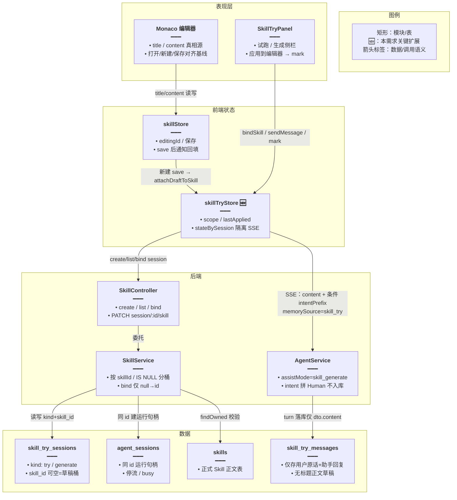
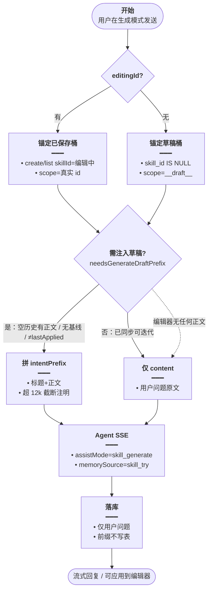
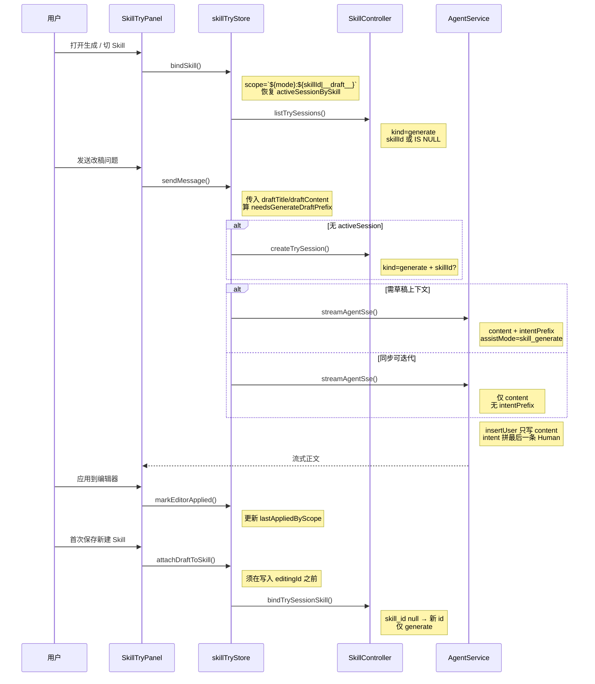
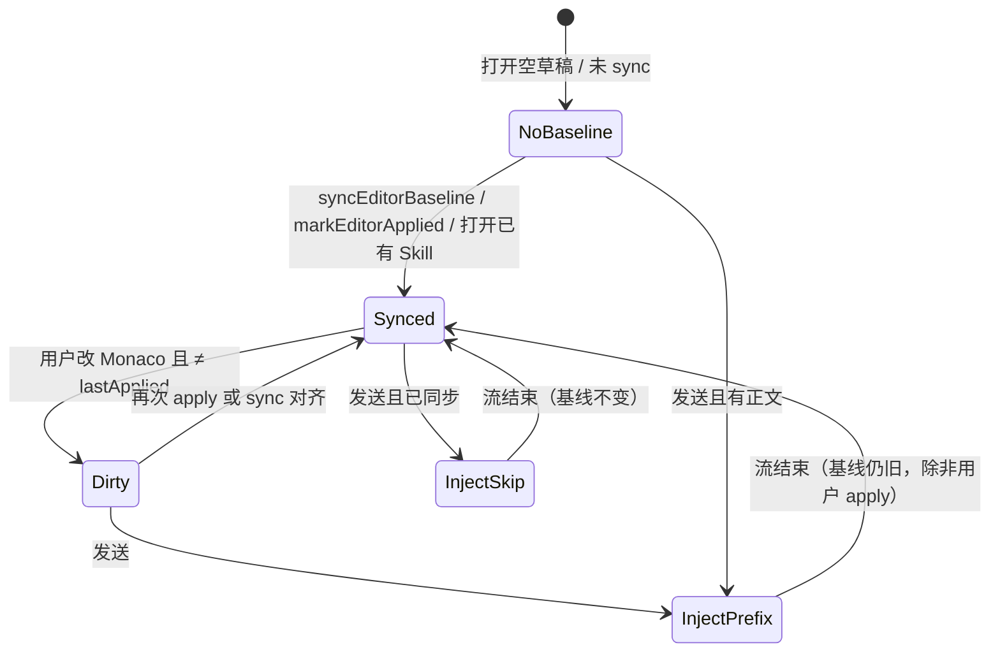

# Skill 生成工件锚定 — 实现思路

> **状态**：核心已落地（M1–M4），待验收  
> **日期**：2026-09-17  
> **需求摘要**：Skill 页「生成」按编辑器 identity（已保存 `skillId` / 新建 `__draft__`）隔离会话；**试跑 / 生成用 `mode:` 前缀分桶**；库内只存用户原话；正文经条件 `intentPrefix` ephemeral 注入控 token；首次保存后草稿会话回填到新 Skill。

## 延伸阅读

- [知识库Skill编辑与Agent接入.md](./知识库Skill编辑与Agent接入.md) — Skill 页与 Agent 总览
- [docs/knowledge/Skill编辑试跑.md](../../knowledge/Skill编辑试跑.md) — 试跑 / 生成侧栏已落地基线
- [docs/knowledge/Skill侧栏朗读与会话切换.md](../../knowledge/Skill侧栏朗读与会话切换.md) — 朗读条生命周期 + `mode:skillId` 分桶修复归档
- [Agent业务消息分表.md](../agent/Agent业务消息分表.md) — `memorySource=skill_try` 分表

---

## 0. 读本文你将得到什么

- **问题**：生成模式曾全局共用会话，切 Skill / 新建草稿仍接着上一段；偶发 `skillIds` 把「正在写的 Skill」当试跑强制加载。
- **一句话方案**：生成会话按编辑器 identity 锚定；落库仅用户原话；仅「空历史有正文」或「编辑器 ≠ lastApplied」时用 `intentPrefix` 临时注入。
- **改动层**：后端 `SkillService` create/list/bind；前端 `skillTryStore` / `SkillTryPanel` / `skillStore.save` 回填；Agent `assistMode=skill_generate` + ephemeral 拼 Human。
- **阶段**：M1 会话锚定 → M2 条件 intentPrefix → M3 新建保存回填 → **M4 `mode:skillId` 分桶**（均已落地）。
- **最大风险**：旧全局 generate 历史 `skill_id=null`，一律归入草稿桶（可接受，不迁数据）。

---

## 1. 需求与边界

### 1.1 用户故事

| 角色 | 场景 | 行为 | 期望结果 |
|------|------|------|----------|
| 作者 | 新建未保存 Skill | 打开生成、多轮改稿 | 会话挂在草稿桶；历史不串到其它 Skill |
| 作者 | 已保存 Skill | 打开该 Skill 再生成/改稿 | 会话按 `skillId` 隔离；可继续该 Skill 下历史 |
| 作者 | 首轮或编辑器已改 | 发「再短一点」 | 本轮 ephemeral 带当前标题/正文；**不落库** |
| 作者 | 已「应用到编辑器」后未改 Monaco | 继续追问 | **不**再带全文，靠会话内助手正文迭代，省 token |
| 作者 | 新建草稿生成后首次保存 | 保存成功 | 草稿桶会话 `skill_id` 回填为新 id，再打开仍见该会话 |

### 1.2 范围

| 在范围内 | 不在范围内（非目标） |
|----------|----------------------|
| generate 会话按 skillId / 草稿桶隔离 | 把 title/content 写入 `skill_try_messages` |
| 条件 `intentPrefix` + 正文截断（12k） | 生成模式使用 `skillIds` / `apply_skill` |
| 首次保存后 bind 会话 skillId | 迁移清洗历史全局 generate 数据 |
| 对齐试跑的 `bindSkill` 切换 + 多会话 `stateBySession` | 提前插入空 Skill 行（方案 B） |

### 1.3 约束与依赖

- 须登录；复用现有 `intentPrefix`（DTO 已声明不入库）。
- 生成 ≠ 试跑：试跑继续 `skillIds`；生成走 `assistMode=skill_generate`，禁止 `skillIds`。
- Ponytail：不改表结构（`skill_try_sessions.skill_id` 已可空）；仅改查询/绑定语义。
- 同 id：`skill_try_sessions.id` = `agent_sessions.id`（运行句柄）。

---

## 2. 方案总览（一句话 + 要点）

**一句话方案**：把 generate 从「用户级全局聊天」改为「跟编辑器当前 Skill/草稿绑定的改稿 Agent」；正文 ephemeral 条件注入；保存时草稿会话归户。

| # | 设计要点 | 理由 |
|---|----------|------|
| 1 | generate 创建/列表支持 `skillId`；无 id → `skill_id IS NULL` | 与试跑同一索引列，零迁移 |
| 2 | 前端 scope = `` `${mode}:${editingId ?? '__draft__'}` `` | try / generate **分桶**记会话指针，切模式不串台 |
| 3 | 仅当空历史有正文 / 无基线 / 编辑器≠lastApplied 才带 `intentPrefix` | 控 token |
| 4 | 落库仅 `dto.content`；前缀拼 LC 最后一条 Human | 已有 Agent 机制 |
| 5 | 首次 save 后 `PATCH` bind + `attachDraftToSkill` 迁指针 | 草稿历史跟到正式 Skill |
| 6 | `stateBySession` 隔离运行态 | 切 Skill/模式不中断其它 SSE |

---

## 3. 现状与复用

| 能力 | 仓库中已有 | 本需求中的用法 |
|------|------------|----------------|
| `intentPrefix` 不入库 | `agent-chat.dto.ts` / `agent.service.ts` | **直接复用**：生成草稿 ephemeral 通道 |
| `skill_try_sessions.skill_id` | entity 可空 | **扩展**：generate 可选绑定 / IS NULL 草稿桶 |
| 试跑按 skill 隔离 | `skillTryStore.bindSkill` | **扩展**：generate 对齐同一套指针 |
| 应用到编辑器 | `SkillTryPanel.onApplyToEditor` + `parseSkillDraft` | **扩展**：写入 `lastApplied` 基线 |
| Agent 分表记忆 | `memorySource=skill_try` | **直接复用**：消息进业务表 |
| 全局 generate 列表 | 旧 `listTrySessions` 忽略 skillId | **扩展**：按桶过滤（已改） |

**调研结论**：不必新表；落地物是 generate 列表过滤、创建传 skillId、条件注入、保存回填，以及 `assistMode=skill_generate` 系统提示。

---

## 4. 架构图



**图内方法说明**：

| 方法 / 模块入口 | 功能 |
|-----------------|------|
| `skillTryStore.bindSkill(id)` | 记住/恢复 `activeSessionBySkill[scope]`；try/generate 均切列表；不中止其它会话 SSE |
| `skillTryStore.sendMessage(...)` | 无会话则 create 锚定；generate 条件拼 `intentPrefix`，不传 `skillIds` |
| `skillTryStore.syncEditorBaseline` / `markEditorApplied` | 打开/保存/「应用到编辑器」后更新 lastApplied，避免无谓全文注入 |
| `skillTryStore.attachDraftToSkill(id)` | 草稿桶会话 bind 到新 skillId，并迁移本地指针与基线（须在写入 editingId 前） |
| `SkillService.createTrySession` | generate 可带 skillId；try 仍强制 skillId；同 id 写 agent_sessions |
| `SkillService.listTrySessions` | generate+skillId / generate 无 id（`IS NULL`）分桶查询 |
| `SkillService.bindTrySessionSkill` | 仅 generate 且 `skill_id null → 新 id` |
| `AgentService` intent 拼装 | 只改内存最后一条 HumanMessage；`insertUser` 仍为用户原话 |

**读图要点**：

- 编辑器 identity 经 Store 决定会话桶；Agent 只多收 ephemeral 前缀与 `skill_generate` 系统提示。
- 消息表与 Skill 正文表分离：改稿素材不进对话行。

---

## 5. 主流程图



**图内方法说明**：

| 方法 | 功能 |
|------|------|
| `needsGenerateDraftPrefix(...)` | `hasDraft` 为假则否；`messageCount===0` 或无 lastApplied 或 title/content 与基线不等则为真 |
| `buildGenerateIntentPrefix(title, content)` | 组装 ephemeral 文案；正文超 `INTENT_DRAFT_BODY_CAP`(12000) 截断并注明 |
| `createTrySession` / `streamAgentSse` | 锚定会话 + 发起生成 SSE |
| `parseSkillDraft(raw)` | 从助手回复解析标题+正文，供「应用到编辑器」 |

**读图要点**：默认路径尽量不带全文；仅不同步时付 token。应用后未改 Monaco 再追问走 Plain。

---

## 6. 核心时序图



**图内方法说明**：

| 方法 | 功能 |
|------|------|
| `bindSkill` | 切换 scope 与历史列表，恢复该桶上次会话指针 |
| `listTrySessions` | 按 kind + skillId / IS NULL 拉侧栏历史 |
| `createTrySession` | 新建锚定会话（双表同 id） |
| `sendMessage` / `streamAgentSse` | 条件前缀 + 生成；试跑分支仍传 `skillIds` |
| `markEditorApplied` | 更新 lastApplied 基线 |
| `attachDraftToSkill` / `bindTrySessionSkill` | 保存后草稿会话归户并迁本地指针 |

**读图要点**：保存回填发生在首次 `saveSkill` 成功之后、写入 `editingId` 之前，不阻塞流式生成。

---

## 7.（可选）状态：编辑器基线与注入



**图内方法说明**：

| 方法 | 功能 |
|------|------|
| `syncEditorBaseline` | 打开 Skill / 新建 / 保存后对齐基线 |
| `markEditorApplied` | 「应用到编辑器」后对齐基线（内部调 sync） |
| `needsGenerateDraftPrefix` | Dirty / NoBaseline+有正文 / 空历史 → 注入 |

**读图要点**：基线是控 token 的开关；apply 把编辑器与「已交付稿」对齐，后续追问可只靠会话历史。

---

## 8. 模块职责与接口草图

### 8.1 模块一览

| 模块 | 职责 | 新增/改动 | 路径 |
|------|------|-----------|------|
| `SkillService` | create/list 按 skill 过滤；bind skill_id | 扩展 | `apps/backend/src/services/skill/skill.service.ts` |
| `SkillController` | `PATCH session/:id/skill` | 新增 | `.../skill.controller.ts` |
| `skillTryStore` | scope、lastApplied、条件前缀、回填、stateBySession | 扩展 | `apps/frontend/src/store/skillTry.ts` |
| `SkillTryPanel` | apply 时 mark；send 传 draft | 扩展 | `apps/frontend/src/views/skills/SkillTryPanel.tsx` |
| `skillStore.save` | 新建成功后 `attachDraftToSkill` | 扩展 | `apps/frontend/src/store/skill.ts` |
| `AgentService` | `skill_generate` 系统提示 + intent 拼装 | 扩展 | `apps/backend/src/services/agent/agent.service.ts` |

### 8.2 关键接口（草图）

```typescript
// 创建：generate 可无 skillId → 草稿桶
createTrySession({ kind: 'generate', skillId?: string, title?: string });

// 列表：无 skillId 且 kind=generate → skill_id IS NULL
listTrySessions({ kind: 'generate', skillId?: string, pageNo?, pageSize? });

// 绑定：仅 generate 且 null → id
bindTrySessionSkill(sessionId: string, skillId: string);

// SSE：生成禁 skillIds
streamAgentSse({
  sessionId, content, memorySource: 'skill_try',
  assistMode: 'skill_generate', intentPrefix?: string,
});
```

### 8.3 数据与前端状态

| 字段/实体 | 来源 | 存储 | 说明 |
|-----------|------|------|------|
| `skill_try_sessions.skill_id` | create/bind | DB 可空 | null = 草稿桶 |
| `skill_try_sessions.kind` | create | DB | `try` / `generate` |
| `scopeKey(skillId)` | `editingId ?? '__draft__'` | 内存工具函数 | Skill / 草稿身份 |
| `currentScopeKey()` | `` `${mode}:${scopeKey(boundSkillId)}` `` | 内存 | **试跑与生成分桶**的会话指针 key |
| `activeSessionBySkill[scope]` | bind/setMode/newChat | 内存 | 各 `mode:skill` 桶上次展示会话 |
| `lastAppliedByScope[scope]` | sync/mark/attach | 内存 | generate 基线；key 用 `generate:…` |
| `stateBySession[sid]` | send/switch | 内存 | messages / isSending / abort |

**为何 key 必须带 `mode`**：`setMode` / `bindSkill` 会先 `rememberActiveForCurrentScope` 再改 mode/skill 再 `restore`。若 key 只有 skillId，试跑与生成会读写同一指针，切模式后消息不跟着换（见 [Skill侧栏朗读与会话切换.md](../../knowledge/Skill侧栏朗读与会话切换.md)）。

**注入条件（与代码一致）**：

1. 编辑器有标题或正文（`hasDraft`），否则不注入；
2. 本轮发送前 `messageCount === 0` → 注入；
3. 无 `lastApplied` → 注入；
4. 否则 `title/content` 与 lastApplied 任一不等 → 注入。

**截断**：正文超过 12000 字符截断并注明「正文已截断」。

---

## 9. 分阶段落地

### M1 — 会话锚定（已落地）

- [x] generate create 接受 skillId；list 按 skillId / IS NULL
- [x] 前端 bind/refresh/create 与 try 对齐；`stateBySession` 多会话
- [x] 去掉 generate 的 `skillIds`，改用 `assistMode=skill_generate`

**验收**：A Skill 与 B Skill 生成历史互不串；新建草稿历史独立。

### M2 — 条件 intentPrefix（已落地）

- [x] lastApplied + `needsGenerateDraftPrefix`；12k 截断
- [x] 库内用户行无标题正文

**验收**：应用后追问无大前缀；改 Monaco 后再问可见前缀；刷新历史仅见短问题。

### M3 — 保存回填（已落地）

- [x] bind API；新建 save 后 `attachDraftToSkill`（active + 草稿桶指针）

**验收**：新建生成 → 保存 → 再打开该 Skill，仍能看到刚才生成会话。

### M4 — `mode:skillId` 分桶（已落地）

- [x] `currentScopeKey()` = `` `${mode}:${scopeKey(boundSkillId)}` ``
- [x] `attachDraftToSkill` / `sendMessage` 的 lastApplied 读写统一用 `generate:…` 前缀
- [x] `setMode` / `bindSkill` 经 remember→改 mode/skill→restore，试跑与生成指针互不覆盖

**验收**：同一 Skill 下试跑多轮后切生成再切回试跑，消息与历史抽屉仍是试跑那一套；反之亦然。细节与朗读条修复见 [Skill侧栏朗读与会话切换.md](../../knowledge/Skill侧栏朗读与会话切换.md)。

---

## 10. 关键决策与备选方案

| 决策 | 选用 | 备选 | 为何不选备选 |
|------|------|------|--------------|
| 草稿隔离 | `skill_id IS NULL` 桶 | 预建空 Skill 行 | 脏数据多 |
| 正文进模型 | 条件 `intentPrefix` | 每轮强制全文 / 写入消息表 | token 高 / 违反落库约束 |
| 生成加载 Skill | 禁止 `skillIds` | 把编辑中 Skill 当试跑加载 | 语义混淆、误强制 |
| 会话指针 key | `` `${mode}:${skillId}` `` | 仅 skillId | 切 try/generate 会串台 |

---

## 11. 风险、边界与待确认

| 项 | 等级 | 说明 | 缓解 |
|----|------|------|------|
| 旧全局 generate | 中 | 全部进草稿桶 | 接受；不迁数据 |
| bind 竞态 | 低 | save 后若先 `bindSkill(新 id)` 会清指针 | `attachDraftToSkill` 须在写 editingId 前 |
| 超长草稿 | 低 | 截断可能丢尾部约束 | 文案注明已截断；可再改编辑器追问 |

**待确认**：

- [ ] 生产环境验收清单全绿（验证方式：Skill 页手测 §12）

---

## 12. 验收清单

| # | 用例 | 步骤 | 期望 |
|---|------|------|------|
| AC1 | 已保存隔离 | Skill A/B 各生成若干轮后切换 | 历史互不串 |
| AC2 | 草稿独立 | 新建草稿生成后再打开已保存 Skill | 互不串台 |
| AC3 | 无 skillIds | 抓生成 SSE body | 无 `skillIds`；无「已应用 Skill」条 |
| AC4 | 落库原文 | 查 `skill_try_messages` 用户行 | 仅为提问原文 |
| AC5 | 应用后省 token | apply 后未改编辑器再追问 | 请求无大段 `intentPrefix` |
| AC6 | 改稿再注入 | 改 Monaco 后再问 | 带标题/正文前缀 |
| AC7 | 保存归户 | 新建生成→保存→再进该 Skill | 仍见刚才会话 |
| AC8 | 模式分桶 | 同一 Skill 试跑若干轮→切生成→再回试跑 | 试跑消息仍在；生成桶独立 |

---

## 13. 预估改动面（实现参考）

| 类型 | 路径 |
|------|------|
| 后端 | `apps/backend/src/services/skill/**`、`agent.service.ts`、`agent-chat.dto.ts` |
| 前端 | `store/skillTry.ts`、`store/skill.ts`、`views/skills/SkillTryPanel.tsx`、`service/index.ts` + `api.ts` |
| 文档（实现后归档） | `docs/knowledge/`（可用 `implementation-doc-from-diff`） |

---

（本文档为规划态实现思路，已对照 2026-09-17 仓库落地代码修订；验收与归档专题以源码及 `docs/knowledge/` 为准）
