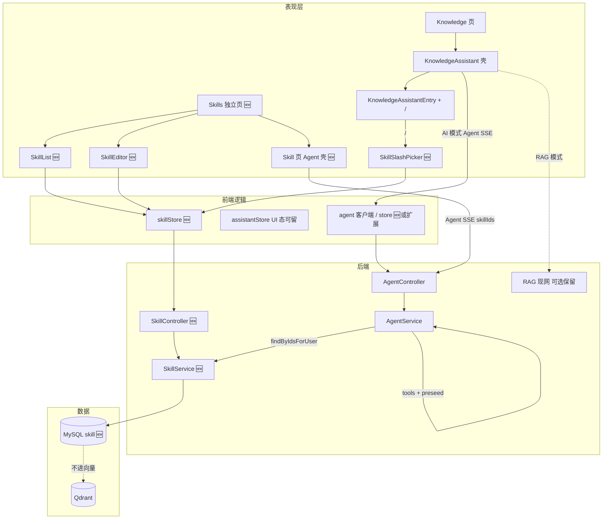
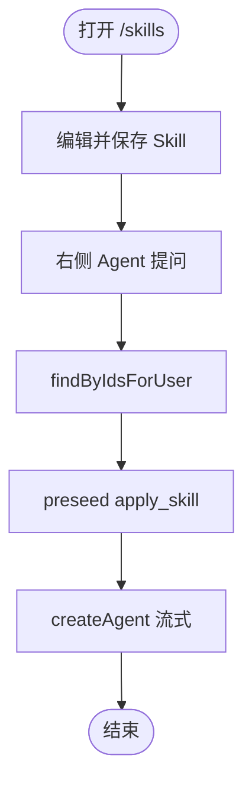
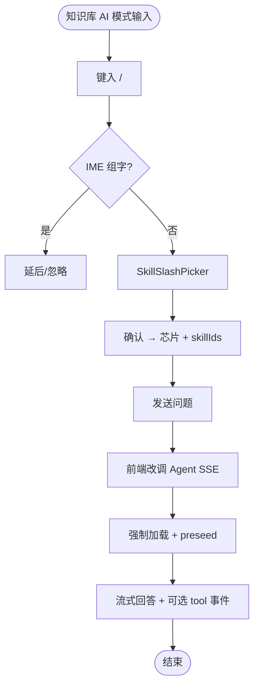
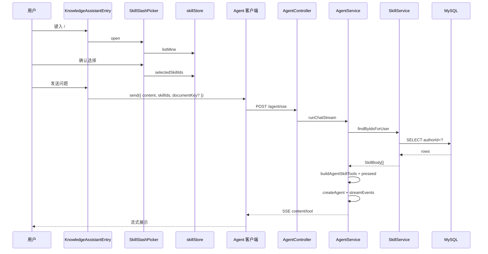
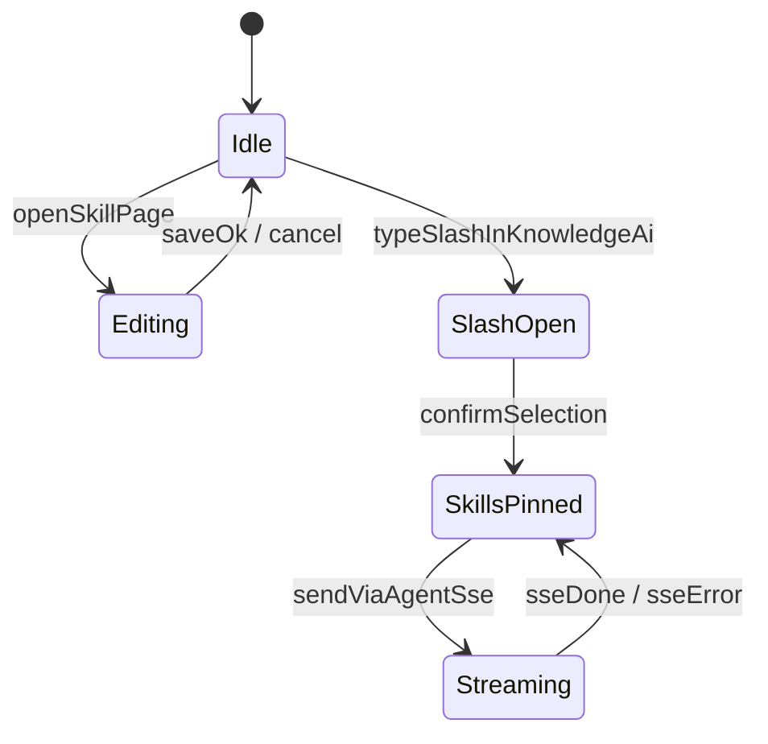

# 知识库 Skill 编辑与 Agent 接入 — 实现思路

> **状态**：部分已落地（M1–M3 主路径：Skill CRUD、Agent skillIds/预置、`/skills` 页、知识库 `/` 选 Skill；未选 Skill 时 AI 仍走原 Assistant 以保兼容）  
> **日期**：2026-09-11（实现中）  
> **需求摘要**：独立 Skill/Prompt 页；知识库 AI 与 Skill 页共用 Agent SSE + `/` 选 Skill；指定必加载（`apply_skill` 预置）。**改动须兼容现网知识库需求**（列表/编辑/RAG/助手壳/会话等行为对外不变或可证明等价）。

## 延伸阅读

- [Agent业务消息分表.md](../agent/Agent业务消息分表.md) — Agent 通用调用层 + 业务消息分表（知识库 Skill→`assistant_*`；影响点与分阶段）
- [Skill生成工件锚定.md](./Skill生成工件锚定.md) — 生成模式会话锚定与 `mode:` 分桶
- [docs/knowledge/Skill侧栏朗读与会话切换.md](../../knowledge/Skill侧栏朗读与会话切换.md) — Skill 页朗读条 / 试跑·生成切换修复
- [guide/05-知识库与RAG.md](../../../guide/05-知识库与RAG.md) — 知识库 / RAG / Assistant 现架构（AI 模式将迁 Agent）
- [apps/backend/specs/deepagents-research-report-agent.md](../../../apps/backend/specs/deepagents-research-report-agent.md) §8 — DeepAgents Skills（**未落地**，字段参考）
- [docs/knowledge/知识列表在访达中显示.md](../../knowledge/知识列表在访达中显示.md) — 本地条目挂接
- [docs/ideas/knowledge/知识预览助手性能.md](./知识预览助手性能.md) — 知识页右侧助手壳

---

## 0. 读本文你将得到什么

- 产品内尚无 Skill 实体；`/` 选 Skill 交互对齐 Cursor；Cursor 磁盘 skills **不进**运行时。
- **一句话方案**：独立 Skills 页 + 知识库 AI 改 Agent SSE 接 Skill；`/` → `skillIds` → 强制加载 + 预置。
- **硬约束**：**不得影响知识库已实现功能需求**（见 §1.5）；Skill 为增量能力，未选 Skill 时用户可感知行为与现网等价。
- **不是**：为接 Skill 砍掉/改坏 RAG、列表、编辑、会话、快捷卡等；不是 Assistant 分块当主路径；不是全库按需挑。
- 阶段：M1 页+CRUD → M2 Agent Skill → M3 知识库 AI 切 Agent（**含完整回归**）→ M4 打磨。
- 最大风险：迁协议时破坏「按文档会话 / 带正文问答 / 流式 UI」；须用适配层保住契约。

---

## 1. 需求与边界

### 1.1 用户故事

| 角色 | 场景 | 行为 | 期望结果 |
|------|------|------|----------|
| 作者 | **Skill/Prompt 编辑页** | 三栏：列表 / Monaco / 右 Agent | 云端持久化；公共 Agent 试跑 Skill |
| 作者 | Skill 页右侧 Agent | 提问并启用当前/已选 Skill | `/agent/sse`；指定 **必加载**（tools+预置） |
| 作者 | **知识库**右侧 **AI 模式** | 输入 `/` 打开 Skill 弹窗，点选 1～N | 芯片；发送走 **Agent SSE** + `skillIds` |
| 作者 | 知识库 AI 提问（已选 Skill） | 发送 | 与 Skill 页同一套强制加载 / `apply_skill` |
| 作者 | 知识库 **RAG 模式** | 检索问答 | **默认保持现网**（见待确认）；Skill `/` 以 AI 模式为主 |
| 作者 | 误选 / 过长 / 无权 | 超限或非本人 | 报错或丢弃无权项，不泄正文 |

### 1.2 范围

| 在范围内 | 不在范围内（非目标） |
|----------|----------------------|
| 独立路由 Skills 页（布局镜像知识库） | 同步 Cursor `.cursor/skills` 文件 |
| Skill CRUD（`authorId` 隔离） | DeepAgents 真并行子 Agent |
| Skill 页 + **知识库 AI** 共用 **Agent SSE** | 用 Skill 需求顺手重写知识库列表/编辑/RAG |
| 知识库输入 **`/` → SkillSlashPicker**（增量） | 全库按需 `load`；合并 system 为主路径 |
| `skillIds[]` → 强制加载 + tool 预置 | Skill 进 Qdrant（默认禁止） |
| **兼容门禁**：§1.5 / §12.2 全部通过 | 牺牲现网助手体验换 Skill 演示 |

### 1.3 约束与依赖

- 须登录；Skill 默认私有；公开分享 **待确认**。
- **兼容性（最高优先级）**：落地后知识库**已上线能力**不得回退；见 **§1.5**。协议可换（AI→Agent SSE），**产品契约不可丢**。
- **UI**：Skills 页镜像知识库三栏；知识库 **保留** `KnowledgeAssistant` 壳（AI/RAG 切换、消息区、输入、快捷卡、会话工具条）；仅 AI **传输层**改为 Agent。
- **协议**：AI 模式 → `AgentController` / `runChatStream`（可带 `skillIds`）；与 Skill 页同一 Skill 管道。
- **RAG 模式**：**默认完全不动**现网 `knowledgeRagQaStore` / QA SSE。
- **输入**：`KnowledgeAssistantEntry` 增量 `/`；无 `/`、未选 Skill 时与现网一致。
- **加载保证**：有 `skillIds` 时强制加载 + preseed；无 `skillIds` 时不注入 Skill，且须覆盖原「带当前文档问答」体验。
- Ponytail：独立表；知识库改动走 **适配层**，禁止大爆炸重写助手壳。

### 1.4 语义对照

| 说法 | 本文含义 |
|------|----------|
| 用户指定 | `/` 或页内选用 → `skillIds[]` |
| 强制加载 | 服务端按 ID **必定**读库 |
| 分 Skill 调用 | 独立 `apply_skill`（含预置） |
| 知识库 AI 统一 Agent | AI 模式传输改 `/agent/sse`，**UX 契约保持** |
| 不影响已实现需求 | §1.5 基线全部仍可通过验收 |
| `/` 唤起 | 输入框浮层，非路由 |
| Assistant 分块主路径（否决） | 表达不了 Skill 调用 |
| 按需加载（否决） | 模型自由挑 Skill |

### 1.5 知识库已实现能力 — 兼容基线（不可回退）

> 迁移 AI→Agent 时，下列能力须 **行为等价**（允许换 SSE，不允许用户可感知功能缺失/变坏）。以源码与 `guide/05-知识库与RAG.md` 为准。

| # | 既有能力 | 现网锚点（示意） | 迁移后要求 |
|---|----------|------------------|------------|
| K1 | 知识 CRUD / 列表 / 分类 / 搜索 / 回收站 | `KnowledgeList`、knowledge API | **零改动或无关**；Skill 不得进 embedding |
| K2 | Monaco 编辑、保存、本地文件夹、访达中显示等 | `views/knowledge/*`、Tauri | **不改**业务路径 |
| K3 | 右侧 AI/RAG 模式切换与草稿隔离 | `KNOWLEDGE_ASSISTANT_MODES` | 切换仍在；草稿不串 |
| K4 | AI 多会话：按文档激活、历史、新会话、停止 | `activateForDocument`、工具条、`stopGenerating` | **对外仍可用**；旧会话至少只读 |
| K5 | AI 带当前文档问答 / 快捷卡 | `extraUserContentForModel`、prompt 卡 | 等价注入；快捷卡仍可用 |
| K6 | AI 流式、贴底、发送中/停止态 | 消息列表 + footer | UI 态一致 |
| K7 | RAG 问答与「新对话」条带 | `knowledgeRagQaStore` | **默认不迁、不回归** |
| K8 | 复制选区写入、`appendInput` | `KnowledgeAssistant` handle | API 仍可用 |
| K9 | 登录门控、持久化允许位 | `knowledgeAssistantPersistenceAllowed` | 语义保留 |
| K10 | 未选 Skill 的纯 AI 对话 | 现 Assistant SSE | **体验不低于现网** |

**工程策略（兼容优先）**：

1. **壳不动、管线换**：保留 `KnowledgeAssistant*` 渲染，只换 AI 发送/收流适配器。  
2. **无 Skill 先绿**：M3 先通过 §1.5 回归，再打开 `/`。  
3. **RAG 隔离**：禁止顺手改 RAG 发送路径。  
4. **会话**：旧 Assistant 历史至少只读；新对话可写；禁止「历史全丢且无法聊」。  
5. **回归门禁**：§12.2 未通过不得宣称 M3 完成。

---

## 2. 方案总览（一句话 + 要点）

**一句话方案**：Skills 独立页 CRUD；知识库 **AI 模式与 Skill 页统一走公共 Agent SSE**；`/` 指定 `skillIds` 后服务端强制加载并以 `apply_skill` 预置注入。

| # | 设计要点 | 理由 |
|---|----------|------|
| 1 | 独立 `/skills` 三栏页 | 编辑与文档知识分离 |
| 2 | 独立 `skill` 表 | 不污染 RAG 向量 |
| 3 | **知识库 AI → Agent SSE** | 才能挂 Skill tools / 预置 / tool 轨迹 |
| 4 | UI 壳保留 + **发送适配层** | 满足「不影响已实现需求」；避免重写助手 |
| 5 | `/` → SkillSlashPicker（增量） | 未触发时输入行为不变 |
| 6 | 强制加载 + tool **预置** | 指定必达 |

**指定必加载（统一）**：

1. `findByIdsForUser(skillIds, userId)` → `SkillBody[]`
2. `buildAgentSkillTools`（仅本轮 ID）
3. **`preseedApplySkillMessages`**（默认开）
4. system 仅短清单，不抄全文

---

## 3. 现状与复用

| 能力 | 仓库中已有 | 本需求中的用法 |
|------|------------|----------------|
| 知识三栏 | `views/knowledge/index.tsx` | 镜像 `views/skills/` |
| 助手 UI | `KnowledgeAssistant*`、`assistantStore` | **壳保留**；AI 模式发送改 Agent |
| 助手输入 | `KnowledgeAssistantEntry` | `/` + 芯片 |
| Assistant SSE | `assistant.service.ts` | AI 模式 **迁出**；RAG 暂留 |
| Agent SSE | `agent.service.ts`、`/agent/sse` | **知识库 AI + Skill 页**共用 |
| Agent tools | `buildAgentLangChainTools` | 追加 Skill tools |
| 文档绑定 / 会话 | `activateForDocument`、session 列表 | 迁 Agent 时需对齐「按文档会话」或接受 Agent 会话模型（**待确认**） |
| 快捷提示卡 | `KNOWLEDGE_ASSISTANT_PROMPTS` | 可并存；发送也走 Agent |
| 路由 | `/knowledge` | 新增 `/skills` |

**调研结论**：现网知识库 AI 经 `assistantStore.sendMessage` → Assistant；**无 tools**，无法做真正的 Skill 调用。故 AI 模式必须切 Agent SSE。仓库尚无 `/` slash，在 Entry 扩展。

---

## 4. 架构图



**图内方法说明**：

| 方法 / 模块入口 | 功能 |
|-----------------|------|
| `skillStore` | CRUD、`selectedSkillIds` |
| Skills 页 Agent 壳 | 直接 Agent SSE 试跑 |
| `KnowledgeAssistant` | 保留布局/模式切换；**AI 发送改 Agent** |
| `KnowledgeAssistantEntry` / `SkillSlashPicker` | `/` 指定 Skill |
| `findByIdsForUser` | 强制加载 |
| `buildAgentSkillTools` / `preseedApplySkillMessages` | Skill 调用能力 + 指定必达 |
| `AgentService.runChatStream` | 统一执行入口 |
| RAG 现网 | 默认不改；与 Skill tools 解耦 |

**读图要点**：Skill 调用只挂在 Agent；知识库 AI 与 Skill 页汇合到 `AgentController`。

---

## 5. 主流程图

### 5.1 Skills 页编辑与试跑



**图内方法说明**：见 §2 统一加载三步；`createAgent` 为既有 Agent 执行。

### 5.2 知识库 AI：`/` 指定 + Agent SSE



**图内方法说明**：

| 方法 | 功能 |
|------|------|
| `shouldOpenSkillSlash` | 触发检测 |
| `applySkillSlashSelection` | 写芯片与 store |
| AI 发送（改造） | 原 `assistantStore.sendMessage`（AI）→ Agent 客户端 |
| `runChatStream` | 加载 Skill 并预置后流式 |

---

## 6. 核心时序图（知识库 AI + Skill）



**图内方法说明**：

| 方法 | 功能 |
|------|------|
| `SkillSlashPicker` | 只传 ID |
| `findByIdsForUser` | 强制加载 |
| `preseedApplySkillMessages` | 指定必达 |
| `createAgent` / `streamEvents` | Skill 调用可见于 tool 事件 |

**读图要点**：与 Skill 页试跑同一后端；差异仅在前端入口与文档上下文如何塞进 Agent DTO。

---

## 7. 状态机



**图内方法说明**：`sendViaAgentSse` = 知识库 AI 已切 Agent 后的发送。

---

## 8. 模块职责与接口草图

### 8.1 模块一览

| 模块 | 职责 | 新增/改动 | 预估路径 |
|------|------|-----------|----------|
| Skills 页 | 三栏 CRUD + Agent | 新增 | `views/skills/` |
| 路由 | `/skills` | 扩展 | `router/routes.ts` |
| Skill API | CRUD + `findByIdsForUser` | 新增 | `services/skill/` |
| skillStore | 列表、选中 ID | 新增 | `store/skill.ts` |
| SkillSlashPicker | `/` 弹层 | 新增 | `components/design/` 等 |
| KnowledgeAssistantEntry | `/` + 芯片 | 扩展 | `KnowledgeAssistantEntry.tsx` |
| 知识库 AI 发送 | **Assistant → Agent SSE** | 扩展 | `assistantStore` / 新 `knowledgeAgent` 适配 |
| Agent DTO/Service | `skillIds` + tools + preseed | 扩展 | `services/agent/` |
| 文档上下文 | 当前知识正文如何进 Agent | 扩展 | 对齐现 `extraUserContent` / intent 范式 |
| i18n | 文案 | 扩展 | `i18n/locales/*` |

### 8.2 关键接口（草图）

```typescript
// 知识库 AI 与 Skill 页共用
class AgentChatDto {
  skillIds?: string[]; // 有序；@ArrayMaxSize(8)
  // 可选：documentKey / 当前正文片段，对齐原助手「带文档问答」
}

function buildAgentSkillTools(skills: SkillBody[]): DynamicTool[];
function preseedApplySkillMessages(skills: SkillBody[]): BaseMessage[];

function shouldOpenSkillSlash(textBeforeCursor: string, composing: boolean): boolean;
function applySkillSlashSelection(ids: string[]): void;
```

**芯片**：标题 + 可移除；发送序列化为 `skillIds`。

### 8.3 数据模型

| 字段 | 说明 |
|------|------|
| `skill.*` | MySQL；与 knowledge 平行 |
| `selectedSkillIds` | 前端本轮集合 |
| Agent 消息可选快照 `skillIds` | M4 审计 |

---

## 9. 分阶段实现步骤

| 阶段 | 目标 | 交付物 | 依赖 |
|------|------|--------|------|
| M1 | Skills 页 + CRUD | 路由、三栏、表、API | 无 |
| M2 | Agent Skill 链路 | tools、preseed；Skill 页试跑 | M1 |
| M3 | 知识库 AI → Agent + `/` | 发送改造、Picker、芯片、文档上下文 | M2 |
| M4 | 打磨 | 会话迁移、i18n、上限；RAG 是否迁（可选） | M3 |

### M1

- [ ] `skill` 实体与 API（不进 embedding）
- [ ] `/skills` 三栏 CRUD

### M2

- [ ] `AgentChatDto.skillIds` + `findByIdsForUser` + tools + preseed
- [ ] Skill 页右侧 Agent 试跑验收

### M3

- [ ] 知识库 AI 发送适配为 Agent SSE（**壳与交互保留**）
- [ ] **先**无 `skillIds` 跑通，并完成 §1.5 / §12 K* 回归
- [ ] 再上 `/` + Picker + 芯片
- [ ] 当前文档注入对齐原 `extraUserContentForModel` 体验
- [ ] 快捷卡仍走同一发送适配层
- [ ] RAG 路径 **确认零 diff 或仅无关触碰**
- [ ] Skill 验收：选中后遵守 + 预置/tool 轨迹

### M4

- [ ] 旧 Assistant 会话只读/迁移（不得导致无法使用新会话）
- [ ] i18n、上限、审计
- [ ] （可选）RAG 迁 Agent — **另开需求**，不绑本 M3
- [ ] 归档 `docs/knowledge/`

---

## 10. 关键决策与备选方案

| 决策 | 选用 | 备选 | 为何不选备选 |
|------|------|------|--------------|
| 编辑入口 | 独立 Skills 页 | 知识库 Tab | 需求要求独立页 |
| Skill 调用 | **Agent tools + 预置** | Assistant 分块注入 | 否则无真正调用能力 |
| 知识库 AI | **Agent SSE + 适配层保契约** | 裸换协议不管回归 | **硬约束：不影响已实现需求** |
| 知识库指定 | `/` 弹层（增量） | 重做输入区 | 降低对 Entry 破坏面 |
| RAG 模式 | **默认保持现网** | 一并改 Agent | 缩小回归面 |
| 落地顺序 | 无 Skill 先绿 → 再开 `/` | 一次上齐 | 兼容门禁 |
| 传参 | `skillIds[]` | 客户端传全文 | 安全与日志 |

---

## 11. 风险、边界与待确认

| 项 | 等级 | 说明 | 缓解 |
|----|------|------|------|
| AI 迁 Agent 破坏现网 | **高** | 会话/正文/快捷卡/流式回退 | §1.5 门禁；适配层；无 Skill 先绿 |
| 误改 RAG/列表/编辑 | 高 | 顺手重构 | CR：知识非助手文件默认不动 |
| 历史会话不可用 | 中 | 存储模型切换 | 只读旧会话 + 新会话可写 |
| 指定未加载 | 高 | 无 preseed | 默认预置 |
| `/` 与 IME | 中 | 误开影响输入 | composition 守卫 |
| Token / 冲突 | 中 | 多 Skill | 上限 + 靠前优先 |

**已拍板**：

- [x] 知识库 AI → Agent SSE（接 Skill 调用）
- [x] **不得影响知识库已实现功能需求**（§1.5 / §12.2 为门禁）
- [x] Skill = 强制加载 + `apply_skill` 预置
- [x] Skills 独立页 + 知识库 `/` 选 Skill
- [x] RAG 默认不迁

**待确认**：

- [ ] 路由名 `/skills` vs `/prompts`？
- [ ] `/` 多选？发送后是否清芯片？
- [ ] 文档正文进 Agent 的字段/截断（须对齐现助手体感）？
- [ ] 按文档会话映射方案（须满足 K4）？
- [ ] 旧 Assistant 历史：只读多久 / 是否迁移？
- [ ] Skill 公开/共享？非法 ID 策略？

---

## 12. 验收清单

### 12.1 Skill 增量

| # | 用例 | 期望 |
|---|------|------|
| AC1 | Skills CRUD | 保存一致；不进知识检索 |
| AC2 | Skill 页试跑 | Agent SSE；预置/tool 可见 |
| AC3 | 知识库 AI 协议 | AI 模式走 Agent SSE（或等价入口） |
| AC4 | `/` 选 Skill 发送 | 遵守 Skill；指定必加载 |
| AC5 | 隔离 / 上限 / IME | 不泄文、有提示、不误开 |

### 12.2 知识库既有能力回归（门禁，对应 §1.5）

| # | 用例 | 期望 |
|---|------|------|
| AK1 | 列表/分类/搜索/回收站/本地树/访达 | 与改前一致 |
| AK2 | 编辑保存云端/本地 | 与改前一致 |
| AK3 | AI ↔ RAG 切换与草稿 | 不串稿；模式记忆仍可用 |
| AK4 | 按文档会话 / 历史 / 新会话 / 停止 | 均可完成；旧历史至少可看 |
| AK5 | 未选 Skill 的 AI 问答（含当前正文） | 体验不低于现网 |
| AK6 | 快捷卡四类 | 可发送且结果合理 |
| AK7 | 流式 UI / 发送中 / 停止 | 态正确、可停 |
| AK8 | RAG 问答 | **与改前一致** |
| AK9 | `appendInput` / 复制选区写入 | 仍写入对应模式输入框 |

**说明**：§12.2 任一项失败 ⇒ M3 未完成，不得靠 Skill 演示「顶替」回归。

---

## 13. 预估改动面

| 类型 | 路径（预估） |
|------|--------------|
| 后端新增 | `services/skill/**`；agent Skill tools / preseed |
| 后端扩展 | `agent-chat.dto.ts`、`agent-tools.ts`、`agent.service.ts` |
| 前端新增 | `views/skills/**`、`store/skill.ts`、`SkillSlashPicker` |
| 前端扩展 | 路由、导航、`KnowledgeAssistant*` **AI 发送→Agent**、Entry `/`、i18n |
| 可能收敛 | AI 模式对 `assistantStore.sendMessage` 的依赖；会话列表数据源 |
| 规划本文 | `docs/ideas/knowledge/知识库Skill编辑与Agent接入.md` |

---

（本文档为规划态实现思路；落地后以源码与 `docs/knowledge/` 专题为准）
