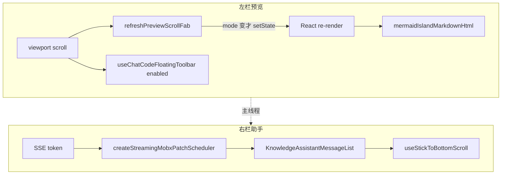
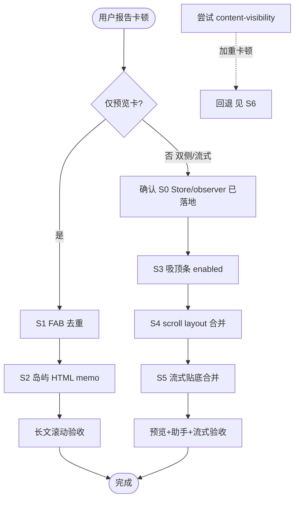
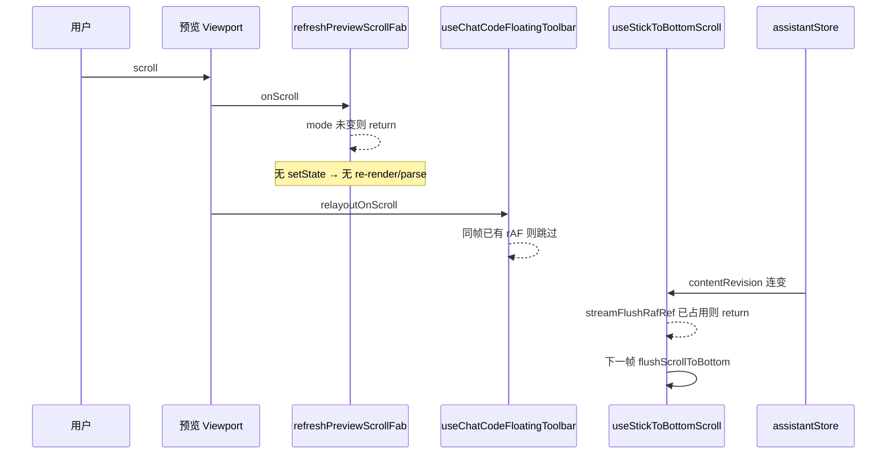

# 知识库预览 / 助手滚动卡顿 — 详细解决步骤

> **状态**：已落地（2026-07；**2026-07-28** 增补 S7 吸顶栏热路径）  
> **日期**：2026-07-26 / 2026-07-28  
> **需求摘要**：知识库左栏长/复杂 Markdown 预览滚动卡顿，以及预览 + 右侧助手同开（尤其流式）时双侧滚动与整页卡顿，在不改业务语义与 UI 的前提下收敛主线程争用。**补充**：长文多代码块时「一直滚都卡」→ 优化 `layoutChatCodeToolbars` 滚动热路径。

## 延伸阅读

| 文档 | 角色 |
|------|------|
| [知识预览滚动卡顿.md](../../knowledge/知识预览滚动卡顿.md) | **滚动层正式归档**（改动前后 + 逐行注释） |
| [知识预览代码工具条滚动.md](../../knowledge/知识预览代码工具条滚动.md) | **S7 正式归档**：长文多代码块吸顶栏热路径 |
| [知识预览助手性能.md](./知识预览助手性能.md) | Store / observer / busy latch 正式归档 |
| [知识预览助手性能.md](./知识预览助手性能.md) | 首轮「写路径合并 + 读路径隔离」规划思路 |
| [知识编辑器长文本性能.md](../../knowledge/知识编辑器长文本性能.md) | 长文 edit 停喂隐藏预览 |
| [Markdown预览编辑滚动恢复.md](../../monaco/Markdown预览编辑滚动恢复.md) | 预览↔编辑滚动位置恢复（体验，非本篇主路径） |

---

## 0. 读本文你将得到什么

- **问题拆解**：卡顿不是单一 bug，而是「预览 scroll 热路径重渲染 / 重 parse」+「助手流式贴底 / 吸顶条 layout」+「双侧同开主线程争用」叠加。
- **一句话方案**：先切断滚动触发的 React/parse，再关掉助手同开时左栏无用 layout，再把流式贴底从「每 token」降到「每帧」。
- **怎么落地**：按下方 **S0→S6** 顺序做；每一步含 **问题 → 代码 → 意图 → 为何有效**。
- **禁止项**：不要对 `.markdown-body` 子节点开 `content-visibility:auto`（实测加重卡顿）；不要用预览 DOM 窗口化 / 纯预览一律卸 Monaco 当作本问题的默认解（2026-07-28 实测失败已回退）。
- **验收**：仅预览长文滚动、预览+助手双侧滚动、流式时双侧滚动，功能与 UI 与改前一致；**长文多代码块持续滚动**对照 S7。

---

## 1. 需求与边界

### 1.1 用户故事

| 角色 | 场景 | 行为 | 期望 |
|------|------|------|------|
| 知识库用户 | 长文 / 含大量 Mermaid·代码块的预览 | 持续滚动预览 | 跟手，无明显掉帧 |
| 知识库用户 | 左预览 + 右助手 | 双侧分别滚动 | 互不「拖死」对方 |
| 知识库用户 | 同上 + 助手流式 | 一边看输出一边滚预览或历史上滑 | 贴底可打断；不因每 token 贴底抢帧 |

### 1.2 范围

| 在范围内 | 不在范围内 |
|----------|------------|
| 预览 FAB、岛屿 HTML memo、代码吸顶条 `enabled`、流式贴底 rAF | 后端 SSE 降频、换协议 |
| 既有 busy latch / 卸 Monaco / Store rAF（作前置依赖说明） | 全文虚拟列表重写、markdown-kit 算法重写 |
| 否决 `content-visibility` 方案的记录 | 预览↔编辑滚动位置（另文） |

### 1.3 约束

- 不改按钮布局、FAB 语义、贴底打断规则、代码栏外观。
- Ponytail：优先 ref 去重、`useMemo`、rAF 合并、hook 门禁；不加新依赖。

---

## 2. 方案总览

**一句话方案**：把 scroll / stream 热路径上的 **setState、同步 parse、双通道 layout、每 token 贴底** 全部降频或短路，让主线程把帧留给合成滚动。

| # | 步骤 | 解决什么 | 所在文件 |
|---|------|----------|----------|
| S0 | 前置隔离（已有） | Store/observer 不拖左栏 | Store / Knowledge 页 |
| S1 | FAB mode 去重 | scroll 不触发无意义 re-render | `Markdown/index.tsx` |
| S2 | 岛屿 HTML `useMemo` | re-render 时不再整篇 `parser.render` | `Markdown/index.tsx` |
| S3 | 吸顶条 `enabled` 硬关 | 助手同开时左栏零 layout 测量 | `useChatCodeFloatingToolbar` + Monaco |
| S4 | scroll layout 单帧合并 | React + passive 双通道不双倍测 | `useChatCodeFloatingToolbar` |
| S5 | 流式贴底 rAF 合并 | token 频率 → 帧频率 | `useStickToBottomScroll` |
| S6 | **禁止** content-visibility | 避免布局抖动加重卡顿 | （回退记录） |
| S7 | 吸顶栏热路径减负 | 长文多代码块持续滚动不卡 | `chatCodeToolbar` + `chatCodeFencePinSearch` + hook |

---

## 3. 现状与复用

| 能力 | 已有位置 | 本方案用法 |
|------|----------|------------|
| SSE 写路径 rAF | `utils/scheduleStreamingMobxPatch.ts` | S0 前置，降低 MobX 通知频率 |
| busy 布尔 | `hooks/useAssistantPaneBusy.ts` | S0：忙时冻结左栏预览正文 |
| 消息列 observer | `KnowledgeAssistantMessageList.tsx` | S0：流式只重渲消息列 |
| 预览 Pane | `components/design/Markdown/index.tsx` | S1/S2 主战场 |
| 吸顶条 | `hooks/useChatCodeFloatingToolbar.tsx` + `utils/chatCodeToolbar.ts` | S3/S4；**S7** 缓存/二分 |
| 二分定位 | `utils/chatCodeFencePinSearch.ts` | S7 |
| 贴底 | `hooks/useStickToBottomScroll.ts` | S5 |
| 助手侧 FAB 去重 | `hooks/useAssistantScroll.ts` | 对照模式：预览侧对齐 |

**调研结论**：仅优化 Markdown 解析不够；必须同时处理「滚动 → setState → parse」与「流式 → layout」两条热路径。助手侧 FAB 早已用 ref 去重，预览侧此前缺失。

---

## 4. 架构图



**图内方法说明**

| 符号 | 做什么 | 输入 / 输出要点 |
|------|--------|-----------------|
| `refreshPreviewScrollFab` | 根据 scrollTop 决定置顶/置底 FAB | 读 viewport 度量；仅 mode 变化时 `setState` |
| `mermaidIslandMarkdownHtml` | 预计算岛屿内 markdown 段 HTML | deps：`fenceParts`/`parser`；render 只读缓存 |
| `useChatCodeFloatingToolbar` | 代码块吸顶条几何 | `enabled=false` 时不挂监听、不测 layout |
| `createStreamingMobxPatchScheduler` | 合并 SSE 对 MobX 的写入 | `schedule` → 每帧最多一次 `flush` |
| `useStickToBottomScroll` | 流式内容增高时贴底 | `contentRevision` 变化 → 合并后的 `flushScrollToBottom` |

---

## 5. 主流程图（排查 → 落地顺序）



**图内方法说明**

| 步骤节点 | 对应动作 |
|----------|----------|
| S1 FAB 去重 | 改 `refreshPreviewScrollFab` |
| S2 岛屿 HTML memo | 增 `mermaidIslandMarkdownHtml`，map 内改读缓存 |
| S3 吸顶条 enabled | hook 加 `enabled`；Monaco 传 `!assistantRightPaneActive` |
| S4 scroll layout 合并 | `relayoutOnScroll` + 对外返回该函数 |
| S5 流式贴底合并 | `streamFlushRafRef` 门闩 |

---

## 6. 时序图（预览滚动 + 助手流式同帧）



**图内方法说明**

| 调用 | 做什么 |
|------|--------|
| `refreshPreviewScrollFab` | 热路径短路无 UI 变化 |
| `relayoutOnScroll` | 每帧最多一次 `layoutChatCodeToolbars` |
| `streamFlushRafRef` 占用判断 | 同帧多次 revision 只贴底一次 |

---

## 7. 分步解决（问题 → 代码 → 意图 → 为何有效）

### S0. 前置：流式写路径与读路径隔离（已有，须先确认）

**问题**：每个 SSE token 触发 MobX → 父级 observer 重渲 → 左栏预览跟着 reconcile。

**解决方式（摘要）**

1. `createStreamingMobxPatchScheduler`：写 Store 每帧最多一次。  
2. `KnowledgeAssistantMessageList` 单独 `observer`：流式只重渲消息列。  
3. `useAssistantPaneBusy` + Monaco latch / deferred：忙时冻结或低优先级更新左栏预览。  
4. `unmountEditorInPreviewWithAssistant`：纯预览+助手时卸掉隐藏 Monaco。

**意图**：先保证「流式 token ≠ 左栏每帧全量工作」，否则只优化预览 scroll 仍会被 Store 通知淹没。

**为何有效**：主线程争用从「双侧每 token 全量 reconcile」降为「右栏消息列 + 左栏可冻结」。

**对照文档**：[知识预览助手性能.md](./知识预览助手性能.md)、正式归档 [../knowledge/知识预览助手性能.md](./知识预览助手性能.md)。

```typescript
// apps/frontend/src/utils/scheduleStreamingMobxPatch.ts（摘录）
// 意图：把高频 schedule 合并成每帧一次 flush，避免每 token 一次 MobX 通知
export function createStreamingMobxPatchScheduler(flush: () => void) {
  let rafId = 0;
  let dirty = false;
  return {
    schedule: () => {
      if (dirty) return; // 本帧已挂过 rAF，直接丢弃后续 schedule
      dirty = true;
      rafId = requestAnimationFrame(() => {
        dirty = false;
        rafId = 0;
        flush(); // 真正写 observable
      });
    },
    // ... flush / cancel
  };
}
```

```typescript
// apps/frontend/src/components/design/Monaco/index.tsx（约 L691–710）
// 意图：助手忙时左栏预览冻结或 deferred，避免与流式 Markdown 解析抢主线程
const unmountEditorInPreviewWithAssistant =
  assistantRightPaneActive && viewMode === 'preview';
const leftPreviewMarkdown = unmountEditorInPreviewWithAssistant
  ? assistantPaneBusy
    ? latchedLeftPreviewRef.current // busy：冻结快照
    : leftPreviewMarkdownDeferred // 非 busy：低优先级追平
  : leftPreviewMarkdownRaw;
```

---

### S1. 预览 FAB：mode 不变不 `setState`

**问题**：`handleViewportScroll` → `refreshPreviewScrollFab` **每次 scroll** 都 `setPreviewScrollFabMode(...)`，即使仍是 `toBottom`。React 重渲 `ParserMarkdownPreviewPane`；若有 Mermaid 岛屿，旧代码还会在 map 里同步 `parser.render`（见 S2）。

**解决代码**（`apps/frontend/src/components/design/Markdown/index.tsx`）

```typescript
const previewScrollFabModeRef = useRef<PreviewScrollCornerFabMode>('hidden');

const refreshPreviewScrollFab = useCallback(() => {
  if (!showPreviewScrollCornerFab) {
    if (previewScrollFabModeRef.current !== 'hidden') {
      previewScrollFabModeRef.current = 'hidden';
      setPreviewScrollFabMode('hidden');
    }
    return;
  }
  const vp = effectiveScrollViewportRef.current;
  if (!vp) return;
  const { scrollTop, scrollHeight, clientHeight } = vp;
  const maxScroll = scrollHeight - clientHeight;
  let next: PreviewScrollCornerFabMode = 'hidden';
  if (maxScroll > 4) {
    next = scrollTop >= maxScroll - 8 ? 'toTop' : 'toBottom';
  }
  // 关键：与上次相同则直接 return，不触发 React
  if (previewScrollFabModeRef.current === next) return;
  previewScrollFabModeRef.current = next;
  setPreviewScrollFabMode(next);
}, [showPreviewScrollCornerFab, effectiveScrollViewportRef]);
```

| 项 | 说明 |
|----|------|
| **意图** | 用 ref 镜像 FAB 模式；只在「可滚 / 触底」边界变化时更新 UI。 |
| **为何有效** | 滚动 99% 帧 mode 不变 → **零 re-render** → 不进入下游 parse/layout。对齐助手侧 `useAssistantScroll.updateScrollFab` 已有模式。 |
| **验收** | 中部长文滚动时 React Profiler 上 `ParserMarkdownPreviewPane` 不应每帧亮起；触底/离底时 FAB 图标仍切换。 |

---

### S2. Mermaid 岛屿：HTML 预计算，render 只读缓存

**问题**：即使 S1 减少了 setState，其它原因（主题、父级、偶发 FAB）仍可能 re-render。旧实现在 `fenceParts.map` **内部**对每个 markdown 段调用 `parser.render`，长文 + 多岛时一次 re-render = 整篇重 parse。

**解决代码**

```typescript
// 预计算（仅 markdown / fenceParts / parser 变时重跑）
const mermaidIslandMarkdownHtml = useMemo(() => {
  if (!hasMermaidIslandLayout) return null;
  return fenceParts.map((part) => {
    if (part.type !== 'markdown') return null;
    const rawHtml = parser.render(part.text, { enableMermaid: false });
    return shiftMarkdownPreviewHeadingLineAttrs(rawHtml, part.lineBase0);
  });
}, [hasMermaidIslandLayout, fenceParts, parser]);

// 渲染：读缓存，禁止在 JSX 里再 parser.render
fenceParts.map((part, i) => {
  if (part.type === 'markdown') {
    const segmentHtml = mermaidIslandMarkdownHtml?.[i];
    if (!segmentHtml) return null;
    return (
      <div key={`pv-${i}`} dangerouslySetInnerHTML={{ __html: segmentHtml }} />
    );
  }
  return renderMermaidPreviewPart(part, i);
});
```

| 项 | 说明 |
|----|------|
| **意图** | 把 O(正文) 的同步 parse 挪到 `useMemo`；render 阶段只做 DOM 对齐。 |
| **为何有效** | S1 偶发的一次 re-render 不再付出「整篇 parse」代价；正文不变时 scroll / FAB 相关更新近乎免费。 |
| **验收** | 含多个 ` ```mermaid ` 的长文：改无关 state 时 Performance 中不应再出现成片 `MarkdownParser.render`。 |

---

### S3. 助手同开：真正关掉左栏代码吸顶条 layout

**问题**：Monaco 已传 `enableCodeFloatingToolbar={!assistantRightPaneActive}`，但 hook **没有 `enabled` 门禁**时，仍挂 `resize` / `ResizeObserver` / `useLayoutEffect` 测 `layoutChatCodeToolbars`，与助手侧吸顶条争用主线程。

**解决代码**

```typescript
// Monaco：助手右栏打开时关闭左栏吸顶条能力
enableCodeFloatingToolbar={!assistantRightPaneActive}

// Markdown：把门禁传进 hook
useChatCodeFloatingToolbar(effectiveScrollViewportRef, {
  enabled: enableCodeFloatingToolbar,
  layoutDeps: [markdown],
});

// useChatCodeFloatingToolbar.tsx
const enabled = options?.enabled ?? true;

const relayout = useCallback(() => {
  if (!enabled) return;
  layoutChatCodeToolbars(viewportRef.current);
}, [viewportRef, enabled]);

useEffect(() => {
  if (!enabled) return; // 不挂 RO / resize / layout
  // ...
}, [enabled, relayout, ...layoutDeps]);
```

| 项 | 说明 |
|----|------|
| **意图** | `enabled=false` 时整条测量链路空转；助手开着时左预览不做代码栏几何。 |
| **为何有效** | `layoutChatCodeToolbars` 会扫全部代码块并 `getBoundingClientRect`，scroll/resize 时极贵；硬关后左栏滚动只剩 viewport 合成。 |
| **验收** | 助手打开 + 预览滚动：不应再因左栏触发全局吸顶条重算；关助手后代码栏吸顶仍正常。 |

---

### S4. 吸顶条：scroll 热路径单帧合并

**问题**：助手消息区同时有 React `onScroll` 与 hook 内 **passive** `scroll`，同帧可能各调一次 `layoutChatCodeToolbars`。

**解决代码**

```typescript
const scrollLayoutRafRef = useRef(0);

const relayoutOnScroll = useCallback(() => {
  if (!enabled) return;
  if (scrollLayoutRafRef.current) return; // 本帧已调度
  scrollLayoutRafRef.current = requestAnimationFrame(() => {
    scrollLayoutRafRef.current = 0;
    layoutChatCodeToolbars(viewportRef.current);
  });
}, [viewportRef, enabled]);

// passive 与对外 relayout 都走合并版
vp.addEventListener('scroll', () => relayoutOnScroll(), { passive: true });
return { relayout: relayoutOnScroll };
```

| 项 | 说明 |
|----|------|
| **意图** | 无论几个 scroll 监听器，每帧最多一次几何测量。 |
| **为何有效** | 测量成本从「每事件」变为「每帧」，与浏览器绘制节奏对齐。 |
| **注意** | 内容变化 / resize 仍可用同步 `relayout`（hook 内部 RO）；对外返回的是 scroll 合并版，业务 `onScroll` 调它即可。 |

---

### S5. 流式贴底：`contentRevision` 合并到每帧一次

**问题**：流式每个 chunk 变 `streamTick` / `contentRevision` → `useLayoutEffect` 立即 `flushScrollToBottom` + 双 rAF。与用户滚预览、滚助手历史 **同帧争用**。

**解决代码**（`apps/frontend/src/hooks/useStickToBottomScroll.ts`）

```typescript
const streamFlushRafRef = useRef(0);

useLayoutEffect(() => {
  if (!isStreaming) return;
  if (!stickToBottomRef.current) return;
  // 同帧已有贴底任务则丢弃后续 revision
  if (streamFlushRafRef.current) return;
  streamFlushRafRef.current = requestAnimationFrame(() => {
    streamFlushRafRef.current = 0;
    if (!stickToBottomRef.current) return;
    suppressStickFromViewportScrollRef.current = true;
    flushScrollToBottom();
    requestAnimationFrame(() => {
      if (stickToBottomRef.current) flushScrollToBottom();
      requestAnimationFrame(() => {
        suppressStickFromViewportScrollRef.current = false;
      });
    });
  });
}, [contentRevision, isStreaming, flushScrollToBottom]);
```

| 项 | 说明 |
|----|------|
| **意图** | 贴底节奏从「token 频率」降到「显示刷新频率」；保留双 rAF 以覆盖异步撑高。 |
| **为何有效** | 流式高峰每秒数十次 revision 时，贴底从 N 次降到约 60 次/秒上限，把帧让给用户滚动。 |
| **验收** | 跟底开启时仍贴最新输出；上滑打断后不强制贴底；主动滚回底部可恢复跟随。 |

---

### S6. 明确否决：`content-visibility: auto`（已回退）

**曾尝试**：给 `.markdown-body > *` 或岛屿分段加 `content-visibility: auto` + `contain-intrinsic-size`，期望跳过离屏绘制。

**结果**：长文滚动时浏览器不断用占位高度替换真实高度 → **布局抖动 / 强制回流**，卡顿**加重**。

**结论**：本场景 **禁止** 作为默认手段；离屏优化应走「少 setState / 少 parse / 少 layout」（S1–S5），而不是改滚动度量坐标系。

---

## 8. 模块职责一览

| 模块 | 职责 | 本方案角色 |
|------|------|------------|
| `ParserMarkdownPreviewPane` | 渲染预览、FAB、可选吸顶条 | S1/S2/S3 调用方 |
| `useChatCodeFloatingToolbar` | 代码块吸顶几何 | S3/S4 |
| `useStickToBottomScroll` | 流式/idle 贴底 | S5 |
| `useAssistantScroll` | 助手滚动 + FAB + 吸顶 | 复用 S4/S5 能力 |
| `MarkdownEditor` | 左栏预览挂载、busy、卸 Monaco | S0 + 传 `enableCodeFloatingToolbar` |
| `assistantStore` / RAG Store | SSE 写路径 | S0 scheduler |

---

## 9. 分阶段落地清单（复刻顺序）

| 阶段 | 工作 | 完成标准 |
|------|------|----------|
| M0 | 确认 S0（scheduler / MessageList / busy）已在 | 流式时左栏不随每个 token 全量闪 |
| M1 | S1 FAB 去重 | 长文预览滚动 Profiler 安静 |
| M2 | S2 岛屿 memo | 含 Mermaid 长文 re-render 不再整篇 parse |
| M3 | S3+S4 吸顶条 | 助手开时左栏无 layout；助手关时吸顶正常 |
| M4 | S5 贴底合并 | 流式 + 双侧滚动可接受 |
| M5 | 回归与文档 | 对照正式归档文；勿启用 content-visibility |
| M6 | S7 吸顶热路径 | 长文多代码块仅预览滚动 Profiler 无全文 querySelectorAll 尖峰 |

---

## 9.1 S7 详细步骤（2026-07-28）

**问题**：仅预览、文档很长且大量代码块时，**一直滚都卡**。S3 只在助手同开时关掉左栏吸顶；仅预览仍每帧对 **全部** 代码块 `querySelectorAll` + `getBoundingClientRect`，并全文清 pinned、隐藏态仍 `emit`。

**做法**：

1. WeakMap 缓存代码块根列表；滚动不 refresh，正文 `layoutDeps` 才 `invalidate` + `refreshBlocks`。
2. `findFirstBlockNotAboveViewportTop` 二分跳过视口顶上方块。
3. 自 start 向下扫至 `br.top >= topY` 停止。
4. `clearLastPinnedMarkers` O(1)；`hideToolbar` / 几何相等短路避免无意义 emit。

**正式归档（改动前后 + 逐行注释）**：[../knowledge/知识预览代码工具条滚动.md](../../knowledge/知识预览代码工具条滚动.md)。

**否决**：窗口化预览 DOM、纯预览一律卸 Monaco（同轮实测失败）。

## 10. 风险与验收

### 10.1 风险

| 风险 | 缓解 |
|------|------|
| FAB 去重导致触底图标不翻 | threshold 与助手侧一致（约 8px）；换篇 reset ref |
| `enabled=false` 忘了关助手后恢复 | Monaco 用 `!assistantRightPaneActive` 派生，关助手自动 true |
| 贴底合并导致跟底略钝 | 保留双 rAF；仅合并同帧 revision |
| 误上 content-visibility | S6 明确禁止；CR 时拒绝 |

### 10.2 验收清单

- [ ] 仅预览：超长 Markdown（含代码块）快速滚动跟手  
- [ ] 含多个 Mermaid 岛：滚动与偶发 UI 更新不卡死  
- [ ] 开助手：左预览滚动不拖死右栏；右栏滚动 FAB/吸顶正常  
- [ ] 流式中：可上滑打断贴底；滚回底部恢复跟随  
- [ ] 关助手后：预览代码吸顶条恢复  
- [ ] 预览 FAB 触底/离底切换正确  
- [ ] 无 `content-visibility` 相关样式留在预览正文上  

---

## 11. 相关代码索引

| 主题 | 路径 |
|------|------|
| FAB 去重 / 岛屿 memo | `apps/frontend/src/components/design/Markdown/index.tsx` |
| 吸顶条 enabled / rAF / **S7 缓存分流** | `apps/frontend/src/hooks/useChatCodeFloatingToolbar.tsx` |
| 吸顶布局 / **S7 二分** | `apps/frontend/src/utils/chatCodeToolbar.ts`、`chatCodeFencePinSearch.ts` |
| 流式贴底合并 | `apps/frontend/src/hooks/useStickToBottomScroll.ts` |
| 助手开时关左栏吸顶 | `apps/frontend/src/components/design/Monaco/index.tsx`（`enableCodeFloatingToolbar`） |
| SSE 写合并 | `apps/frontend/src/utils/scheduleStreamingMobxPatch.ts` |
| busy | `apps/frontend/src/hooks/useAssistantPaneBusy.ts` |
| 正式归档（滚动层） | `docs/knowledge/知识预览滚动卡顿.md` |
| 正式归档（Store/observer） | `docs/knowledge/知识预览助手性能.md` |

---

若与仓库最新源码不一致，以源码为准。
