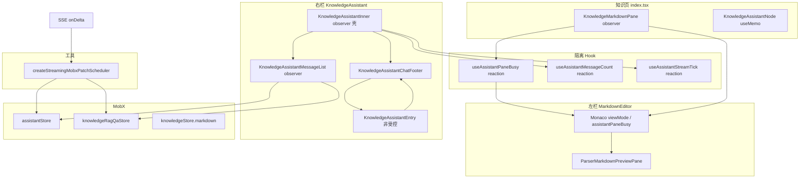
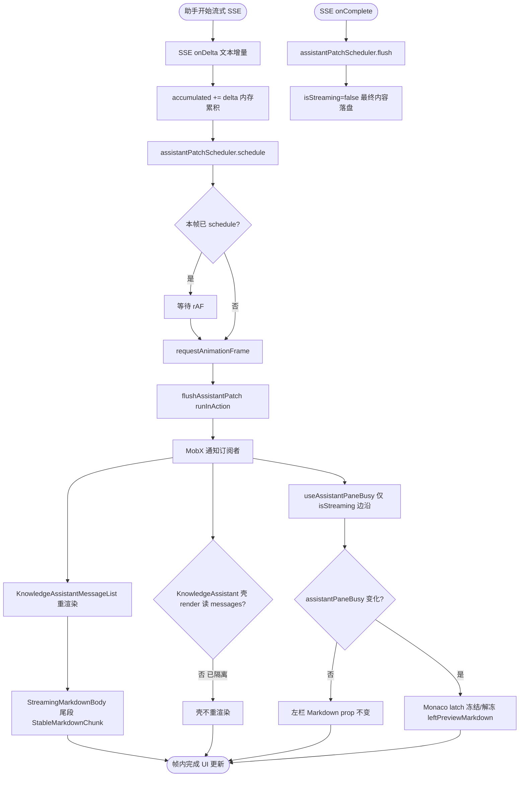
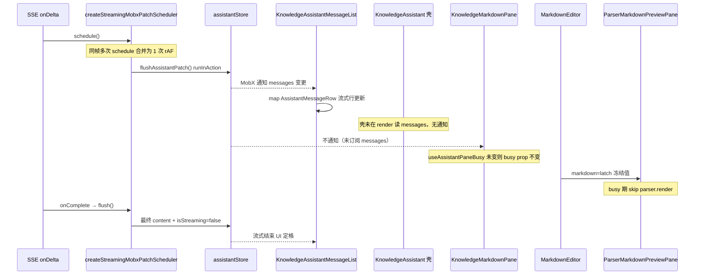
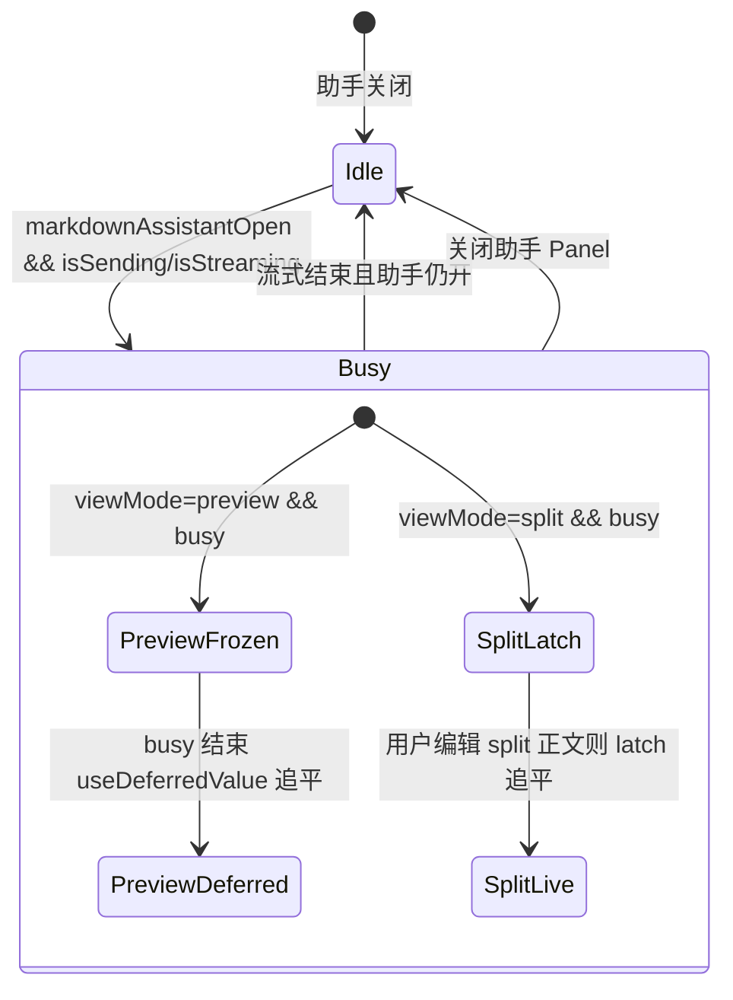

# 知识库预览 + 助手同开卡顿优化 — 实现思路

> **状态**：已落地（2026-07 工作区改动；可与源码对照验收）  
> **正式实现文档**：[知识预览助手性能.md](./知识预览助手性能.md)（改动前后对比 + 逐行注释）  
> **日期**：2026-07-01  
> **需求摘要**：知识库左栏 Markdown 预览与右栏 AI/RAG 助手同时开启、且助手流式输出时，消除输入/滚动/打字机卡顿，且不改变既有业务语义。

## 延伸阅读

- [知识库预览助手面板性能影响.md](../../impact/知识库预览助手面板性能影响.md) — 影响面与回归清单
- [知识库滚动卡顿修复.md](./知识库滚动卡顿修复.md) — **滚动层详细解决步骤**（FAB/memo/吸顶条/贴底；S0–S6）
- [知识编辑器长文本性能.md](../../knowledge/知识编辑器长文本性能.md) — 第一轮：长文 edit 停喂隐藏预览、Store 派生 boolean
- [知识编辑器长文本性能.md](../../impact/知识编辑器长文本性能.md) — 第一轮影响点
- [知识库助手完成.md](../../knowledge/知识库助手完成.md) — 助手会话、`documentKey`、持久化
- [Monaco Markdown视图面板影响.md](../../impact/Monaco Markdown视图面板影响.md) — 预览/编辑与助手 Panel co-mount

---

## 0. 读本文你将得到什么

- **问题**：SSE 每个 token 触发 MobX → `KnowledgeAssistant` observer 重渲染 → 左栏 `MarkdownEditor` / `ParserMarkdownPreviewPane` 被连带 reconcile，与右侧 `StreamingMarkdownBody` 解析抢主线程。
- **一句话方案**：**写路径合并（rAF）+ 读路径隔离（reaction / 子 observer）+ 左栏预览降载（busy 冻结 / 关浮动 code toolbar）+ 输入非受控**。
- **主要改动层**：MobX Store（SSE patch）、知识页子树（`KnowledgeMarkdownPane`）、Monaco、`ParserMarkdownPreviewPane`、助手壳（`KnowledgeAssistantMessageList` + `KnowledgeAssistantEntry`）。
- **分阶段**：M1 长文 edit 隔离（已完成）→ M2 预览+助手争用（Monaco/Markdown）→ M3 流式 observer 解耦（Store rAF + 消息列表拆分）→ M4 输入轻量条（可选 polish）。
- **最大风险**：预览+助手 busy 期间左栏预览 **短暂冻结**；纯 preview 下 Monaco 卸载后保存须走 TextModel 回退。

---

## 1. 需求与边界

### 1.1 用户故事

| 角色       | 场景                | 行为                   | 期望结果                                   |
| ---------- | ------------------- | ---------------------- | ------------------------------------------ |
| 知识库用户 | 左预览 + 右助手同开 | 助手流式回复           | 右侧打字机流畅；左侧滚动/标题/助手输入不卡 |
| 知识库用户 | 分屏 edit + 助手    | 编辑正文同时看助手输出 | 编辑跟滚可用；助手 busy 时预览可适度滞后   |
| 知识库用户 | 仅助手 / 仅预览     | 单栏使用               | 与改前一致，无功能回退                     |

### 1.2 范围

| 在范围内                                              | 不在范围内（非目标）                                       |
| ----------------------------------------------------- | ---------------------------------------------------------- |
| 知识页 `KnowledgeMarkdownPane` + `KnowledgeAssistant` | 聊天页 `ChatBotView` 全面改造（可复用 util，非本次主路径） |
| `assistantStore` / `knowledgeRagQaStore` SSE 写入节流 | 后端 SSE 降频、换 WebSocket 协议                           |
| `ParserMarkdownPreviewPane` 助手同开降载              | markdown-kit 解析算法重写                                  |
| 轻量 `KnowledgeAssistantEntry` 替代 `ChatEntry`       | ChatEntry 组件本身删除                                     |

### 1.3 约束与依赖

- **功能不变**：发送/停止/AI↔RAG 草稿、选区写入、分享、保存、`documentKey` 会话绑定。
- **Ponytail**：优先 reaction / memo / 已有 `StreamingMarkdownBody` 分块模式，不新增重型依赖。
- **互斥**：左栏 `viewMode`（edit / preview / split / splitDiff）与右栏助手 Panel 布局规则不变（见 monaco-markdown-view-panel 影响点）。

---

## 2. 方案总览（一句话 + 要点）

**一句话方案**：把「流式写 Store」从 **每 token 一次** 降到 **每帧最多一次**，并把「读 messages」从 **父 observer render** 挪到 **专用子树 + reaction**，左栏预览在 `assistantPaneBusy` 时 **停止无意义重解析**。

| #   | 设计要点                                                                       | 理由                                                     |
| --- | ------------------------------------------------------------------------------ | -------------------------------------------------------- |
| 1   | `createStreamingMobxPatchScheduler` + rAF 合并 SSE patch                       | 根因：MobX 通知频率 ≈ token 频率，拖垮整页 observer      |
| 2   | `KnowledgeAssistantMessageList` 单独 observer                                  | 流式只重渲染消息列，不带动 `KnowledgeAssistant` 壳与左栏 |
| 3   | `useAssistantPaneBusy` / `useAssistantMessageCount` / `useAssistantStreamTick` | render 不订阅 `messages` 数组元素替换                    |
| 4   | Monaco：`assistantPaneBusy` + latch + `useDeferredValue`                       | 左栏预览不在 busy 期全量 `MarkdownParser.render`         |
| 5   | `enableCodeFloatingToolbar={false}` 助手同开                                   | 避免预览侧 `layoutChatCodeToolbars` 与助手侧争用         |
| 6   | `KnowledgeAssistantEntry` 非受控 textarea                                      | 按键不触发 `KnowledgeAssistantInner` 全树 reconcile      |

---

## 3. 现状与复用

| 能力                 | 仓库中已有                                       | 本需求中的用法                                                       |
| -------------------- | ------------------------------------------------ | -------------------------------------------------------------------- |
| 流式 Markdown 分块   | `StreamingMarkdownBody` + `StableMarkdownChunk`  | 助手消息侧已用；左栏预览仍用 `ParserMarkdownPreviewPane` 整段 render |
| 流式贴底 revision    | `buildStreamTick` + `useStickToBottomScroll`     | 改为经 `useAssistantStreamTick` 注入，父组件不读 `messages`          |
| 纯 edit 停喂隐藏预览 | `Monaco/index.tsx` `leftPreviewMarkdownRaw` 条件 | 保留；preview/split 仍喂 value                                       |
| Store 派生 boolean   | `knowledgeStore.markdownNonempty`                | 助手空态/禁用输入判定，避免订阅全文                                  |
| 代码浮动 toolbar     | `useChatCodeFloatingToolbar`                     | 助手同开时预览侧关闭                                                 |
| Chat 通用输入        | `ChatEntry`                                      | 知识助手改用专用 `KnowledgeAssistantEntry`                           |

**调研结论**：卡顿主因是 **MobX 订阅粒度过粗**（父组件 render 读 `messages`），其次才是 **左栏预览每帧重解析**；仅优化 `ParserMarkdownPreviewPane` 无法根治。SSE patch 合并与 observer 拆分是必要组合。

---

## 4. 架构图



**图内方法说明**：

| 方法 / 模块入口                            | 功能                                                                                         |
| ------------------------------------------ | -------------------------------------------------------------------------------------------- |
| `createStreamingMobxPatchScheduler(flush)` | 将多次 SSE delta 合并为每帧最多一次 `runInAction` 写 `messages[idx]`                         |
| `useAssistantPaneBusy(active)`             | `reaction` 读 `isStreaming/isSending`，busy 变 false 时才驱动 `KnowledgeMarkdownPane` 重渲染 |
| `useAssistantMessageCount(isRagMode)`      | 仅 `messages.length` 变化时更新 React state，供壳层 `hasMessages` / 条带展示                 |
| `useAssistantStreamTick(isRagMode)`        | 包装 `buildStreamTick`，供 `useAssistantScroll` 贴底而不在 render 读 messages                |
| `KnowledgeAssistantMessageList`            | 单独 observer 订阅 messages，流式 chunk 只 reconcile 消息行                                  |
| `ParserMarkdownPreviewPane`                | `markdown-kit` 整段/分岛 render；busy 期 markdown prop 冻结则跳过                            |
| `KnowledgeAssistantEntry`                  | ref 读 textarea，`onChange` 仅在空↔非空切 state                                              |

**读图要点**：

- **写路径**（SSE → Store）与 **读路径**（React 树）分层；合并写在 Store 边界，隔离读在 Hook/子 observer。
- 左栏 `KnowledgeMarkdownPane` 只订阅 `knowledgeStore.markdown`，**不**直接读 `assistantStore.messages`。
- 右栏消息更新不应冒泡到左栏 ResizablePanel。

---

## 5. 主流程图



**图内方法说明**：

| 方法                              | 功能                                                           |
| --------------------------------- | -------------------------------------------------------------- |
| `applyAssistantPatch(delta)`      | SSE 回调：只写内存 buffer + `schedule()`，不直接 `runInAction` |
| `flushAssistantPatch()`           | rAF 或 complete 时一次性替换 `messages[idx]` 对象              |
| `assistantPatchScheduler.flush()` | 流式结束/错误时立即刷最后一帧，避免丢尾字                      |
| `buildStreamTick(messages)`       | 生成贴底 revision 字符串（末条 content 长度等）                |
| `useStickToBottomScroll`          | `contentRevision` 变化且跟底开启时滚到底                       |

**读图要点**：

- 决策菱形 **「壳 render 读 messages?」** 是优化前后差异点：优化后应为 **否**。
- `onComplete` 必须 **flush**，否则最后一帧 delta 可能留在 buffer。
- 左栏只在 `assistantPaneBusy` **边沿** 或用户编辑 `markdown` 时更新。

---

## 6. 核心时序图



**图内方法说明**：

| 方法                             | 功能                                                                     |
| -------------------------------- | ------------------------------------------------------------------------ |
| `schedule()`                     | 标记 dirty 并注册单帧 rAF；同帧重复调用 no-op                            |
| `flush()`                        | 取消 pending rAF 并同步执行 flush 函数                                   |
| `useAssistantPaneBusy(active)`   | active=false 时 busy 恒 false；active 时 reaction 跟踪 sending/streaming |
| `ParserMarkdownPreviewPane` memo | props.markdown 不变则跳过 reconcile                                      |

**读图要点**：

- Happy path 强调 **KML 收到通知、KP 不应收到**（除非 busy 边沿或正文编辑）。
- 时序省略 `StreamingMarkdownBody` 内部 `StableMarkdownChunk`：仅尾段 memo 比较失败时重渲染。

---

## 7. 状态：`assistantPaneBusy` 与左栏预览



**图内方法说明**：

| 方法                          | 功能                                             |
| ----------------------------- | ------------------------------------------------ |
| `useAssistantPaneBusy`        | 输出 `active && (AI/RAG sending \|\| streaming)` |
| `latchedLeftPreviewRef`       | busy 期 hold 左 preview markdown 字符串          |
| `leftPreviewMarkdownDeferred` | busy 结束后低优先级追平 preview                  |

**读图要点**：

- **PreviewFrozen**：纯预览 + 助手同开时还可 **卸载隐藏 Monaco**（`unmountEditorInPreviewWithAssistant`）。
- **SplitLatch**：分屏仍 mount 编辑器；用户改正文时 latch 仍追平，避免编辑丢失预览。

---

## 8. 模块职责与接口草图

### 8.1 模块一览

| 模块                                  | 职责                                  | 新增/改动 | 路径                                                                  |
| ------------------------------------- | ------------------------------------- | --------- | --------------------------------------------------------------------- |
| SSE patch 调度器                      | rAF 合并 MobX 写                      | 新增      | `apps/frontend/src/utils/scheduleStreamingMobxPatch.ts`               |
| assistantStore 流式 patch             | 用 scheduler 包 `flushAssistantPatch` | 改动      | `apps/frontend/src/store/assistant.ts`                                |
| knowledgeRagQaStore                   | 同上                                  | 改动      | `apps/frontend/src/store/knowledgeRagQa.ts`                           |
| useAssistantPaneBusy                  | busy 信号 reaction                    | 新增      | `apps/frontend/src/hooks/useAssistantPaneBusy.ts`                     |
| useAssistantMessageCount / StreamTick | 壳层读 messages 隔离                  | 新增      | `apps/frontend/src/hooks/useAssistantMessageCount.ts`                 |
| KnowledgeMarkdownPane                 | 只订阅 knowledgeStore                 | 改动      | `apps/frontend/src/views/knowledge/index.tsx`                         |
| MarkdownEditor                        | assistantPaneBusy、预览 latch         | 改动      | `apps/frontend/src/components/design/Monaco/index.tsx`                |
| ParserMarkdownPreviewPane             | enableCodeFloatingToolbar             | 改动      | `apps/frontend/src/components/design/Markdown/index.tsx`              |
| KnowledgeAssistantMessageList         | 消息列 observer                       | 新增      | `apps/frontend/src/views/knowledge/KnowledgeAssistantMessageList.tsx` |
| KnowledgeAssistantEntry               | 非受控输入                            | 新增      | `apps/frontend/src/views/knowledge/KnowledgeAssistantEntry.tsx`       |
| KnowledgeAssistantChatFooter          | footer + 草稿 ref                     | 新增      | `apps/frontend/src/views/knowledge/KnowledgeAssistantChatFooter.tsx`  |

### 8.2 关键接口（草图）

```typescript
// scheduleStreamingMobxPatch.ts
export function createStreamingMobxPatchScheduler(
  flush: () => void,
): { schedule: () => void; flush: () => void; cancel: () => void };

// assistant.ts 发送流内
const scheduler = createStreamingMobxPatchScheduler(flushAssistantPatch);
const applyAssistantPatch = (delta: string, thinkDelta?: string) => {
  if (delta) accumulated += delta;
  if (thinkDelta) thinkBuf += thinkDelta;
  scheduler.schedule();
};
// onComplete / catch: scheduler.flush();

// Monaco props
assistantPaneBusy?: boolean; // 来自 useAssistantPaneBusy(markdownAssistantOpen)

// ParserMarkdownPreviewPane props
enableCodeFloatingToolbar?: boolean; // 助手同开传 false
```

### 8.3 数据模型

| 字段/信号                    | 来源           | 存储                                 | 说明                       |
| ---------------------------- | -------------- | ------------------------------------ | -------------------------- |
| `messages[idx].content`      | SSE delta      | MobX `assistantStore`                | 流式期每帧最多替换一次对象 |
| `assistantPaneBusy`          | reaction       | React state（KnowledgeMarkdownPane） | 驱动 Monaco 预览冻结       |
| `aiDraftRef` / `ragDraftRef` | 用户输入       | footer ref                           | AI/RAG 切换不丢草稿        |
| `latchedLeftPreviewRef`      | markdown value | Monaco ref                           | busy 期预览 HTML 输入不变  |

---

## 9. 分阶段实现步骤

| 阶段 | 目标               | 交付物                                             | 依赖         |
| ---- | ------------------ | -------------------------------------------------- | ------------ |
| M1   | 长文纯 edit 不卡   | Store 派生 boolean、edit 不喂隐藏预览              | 已有         |
| M2   | 预览+助手不争用    | `assistantPaneBusy`、Monaco latch、关 code toolbar | M1           |
| M3   | 流式 observer 解耦 | SSE rAF scheduler、MessageList 拆分、busy hooks    | M2           |
| M4   | 助手输入不卡       | `KnowledgeAssistantEntry` 非受控 + footer 拆分     | 可与 M3 并行 |

### M2 任务

- [ ] `KnowledgeMarkdownPane` 从 `Knowledge` observer 抽出，只订阅 `knowledgeStore.markdown`
- [ ] `useAssistantPaneBusy` 传入 `MarkdownEditor`
- [ ] preview+助手：`unmountEditorInPreviewWithAssistant` + TextModel sync
- [ ] `enableCodeFloatingToolbar={!assistantRightPaneActive}`

### M3 任务

- [ ] `createStreamingMobxPatchScheduler` 接入 `assistantStore` / `knowledgeRagQaStore`
- [ ] `KnowledgeAssistantMessageList` 承担 `messages.map`
- [ ] `useAssistantMessageCount` + `useAssistantStreamTick` 替换壳层直接读 messages
- [ ] `useAssistantScroll({ contentRevision, messageCount })` 不再要求 messages prop

### M4 任务

- [ ] `KnowledgeAssistantChatFooter` + `KnowledgeAssistantEntry`
- [ ] `KnowledgeAssistantFooterControls` 只订阅 sending/streaming
- [ ] 移除壳层 `ChatEntry` 受控 input

---

## 10. 关键决策与备选方案

| 决策            | 选用                   | 备选                                     | 为何不选备选                                    |
| --------------- | ---------------------- | ---------------------------------------- | ----------------------------------------------- |
| Store 更新频率  | rAF 合并               | 每 token 直接写                          | 通知次数与 token 数线性相关，observer 树过大    |
| 壳层读 messages | reaction + 子 observer | `memo(KnowledgeAssistant)` 全 props 比较 | share/scroll 等 props 易击穿 memo               |
| 左栏 busy 策略  | latch + deferred       | 流式时卸载整个左栏预览                   | 用户仍需看文档预览；仅降载                      |
| 输入组件        | 专用非受控 Entry       | 继续 ChatEntry + 细粒度 memo             | ChatEntry 1100+ 行，受控 value 必重渲染         |
| 预览解析        | 冻结 prop 跳过 render  | 左栏改用 StreamingMarkdownBody           | 预览非流式、需 heading 行号与分屏跟滚，改动面大 |

---

## 11. 风险、边界与待确认

| 项                  | 等级 | 说明                                                 | 缓解                                     |
| ------------------- | ---- | ---------------------------------------------------- | ---------------------------------------- |
| busy 期左栏预览滞后 | 中   | 流式中「写入当前文档」后预览可能晚追平               | 流式结束 flush + latch 更新；回归 AC3    |
| preview+助手保存    | 中   | Monaco 卸载，`getMarkdownFromEditorRef` 走 TextModel | 已有 effect 同步 value；回归 AC4         |
| rAF 合并丢最后一帧  | 低   | complete 未 flush                                    | onComplete/onError/catch 均 `flush()`    |
| 打字机上限 60fps    | 低   | 视觉几乎无差                                         | 可接受；必要时 busy 期再 throttle layout |
| 分屏编辑+流式       | 低   | latch 在用户改正文时追平                             | 见 Monaco split 分支注释                 |

**待确认**：

- [ ] 极长会话（>50 条）历史消息是否需虚拟列表（当前仍全量 DOM，流式只优化 **更新频率**）

---

## 12. 验收清单

| #   | 用例          | 步骤                               | 期望                            |
| --- | ------------- | ---------------------------------- | ------------------------------- |
| AC1 | 预览+助手流式 | 长文、左 preview、右 AI 流式长回复 | 输入/滚动可接受；右栏打字机流畅 |
| AC2 | 纯 edit+助手  | 左 edit、右流式                    | 正文编辑与标题输入不卡          |
| AC3 | 流式结束追平  | 流式中改 store markdown 或等结束   | 左栏预览内容与 store 一致       |
| AC4 | preview 保存  | 助手开、preview 模式保存           | 文件内容与 TextModel 一致       |
| AC5 | AI/RAG 草稿   | 切换模式、输入、发送               | 草稿互不覆盖，规则与改前一致    |
| AC6 | 选区写入      | 右键复制到助手                     | append + focus 正常             |
| AC7 | 分屏跟滚      | split + 助手 busy                  | 跟滚可用；编辑后预览可追平      |

---

## 13. 预估改动面（已实现对照）

| 类型                   | 路径                                                                                                                                                          |
| ---------------------- | ------------------------------------------------------------------------------------------------------------------------------------------------------------- |
| 前端 Store             | `apps/frontend/src/store/assistant.ts`, `knowledgeRagQa.ts`                                                                                                   |
| 前端工具               | `apps/frontend/src/utils/scheduleStreamingMobxPatch.ts`                                                                                                       |
| 前端 Hook              | `useAssistantPaneBusy.ts`, `useAssistantMessageCount.ts`, `useAssistantScroll.ts`                                                                             |
| 知识页                 | `views/knowledge/index.tsx`, `KnowledgeAssistant.tsx`, `KnowledgeAssistantMessageList.tsx`, `KnowledgeAssistantEntry.tsx`, `KnowledgeAssistantChatFooter.tsx` |
| 设计组件               | `components/design/Monaco/index.tsx`, `components/design/Markdown/index.tsx`                                                                                  |
| 文档（影响面）         | `docs/impact/知识库预览助手面板性能影响.md`                                                                                               |
| 文档（实现归档，可选） | `docs/knowledge/知识预览助手性能.md`（`implementation-doc-from-diff`）                                                                        |

---

（本文档描述已落地实现思路；细节以仓库最新源码为准，影响面见 Influence-point 专题。）
