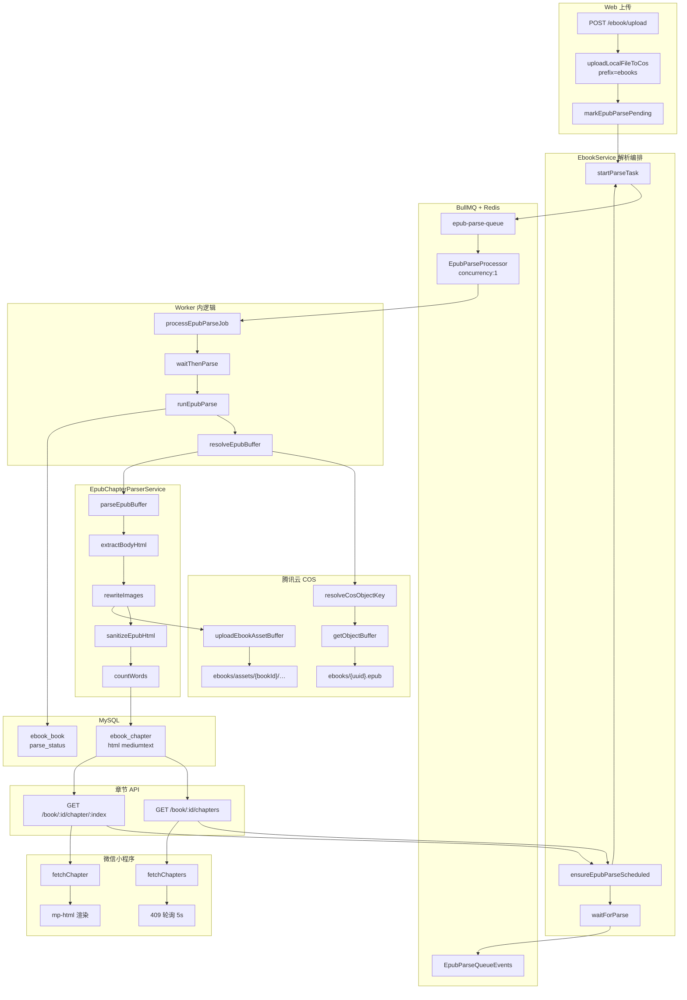
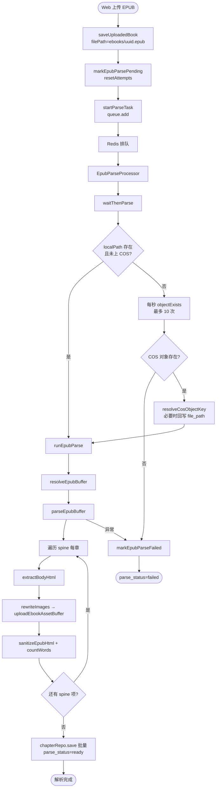
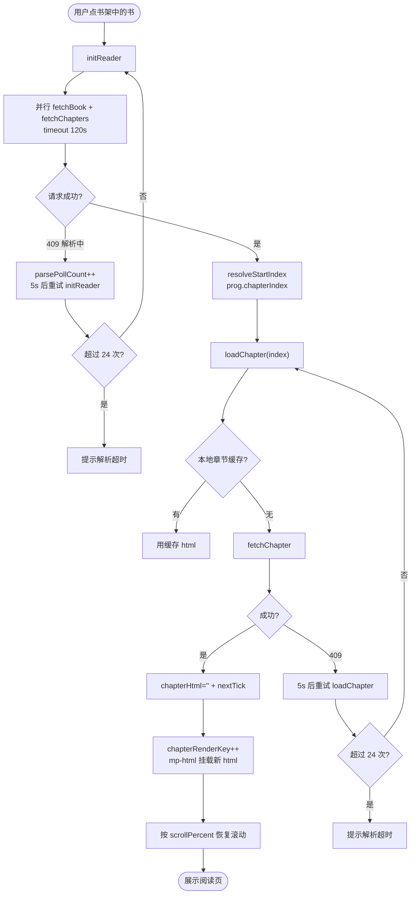
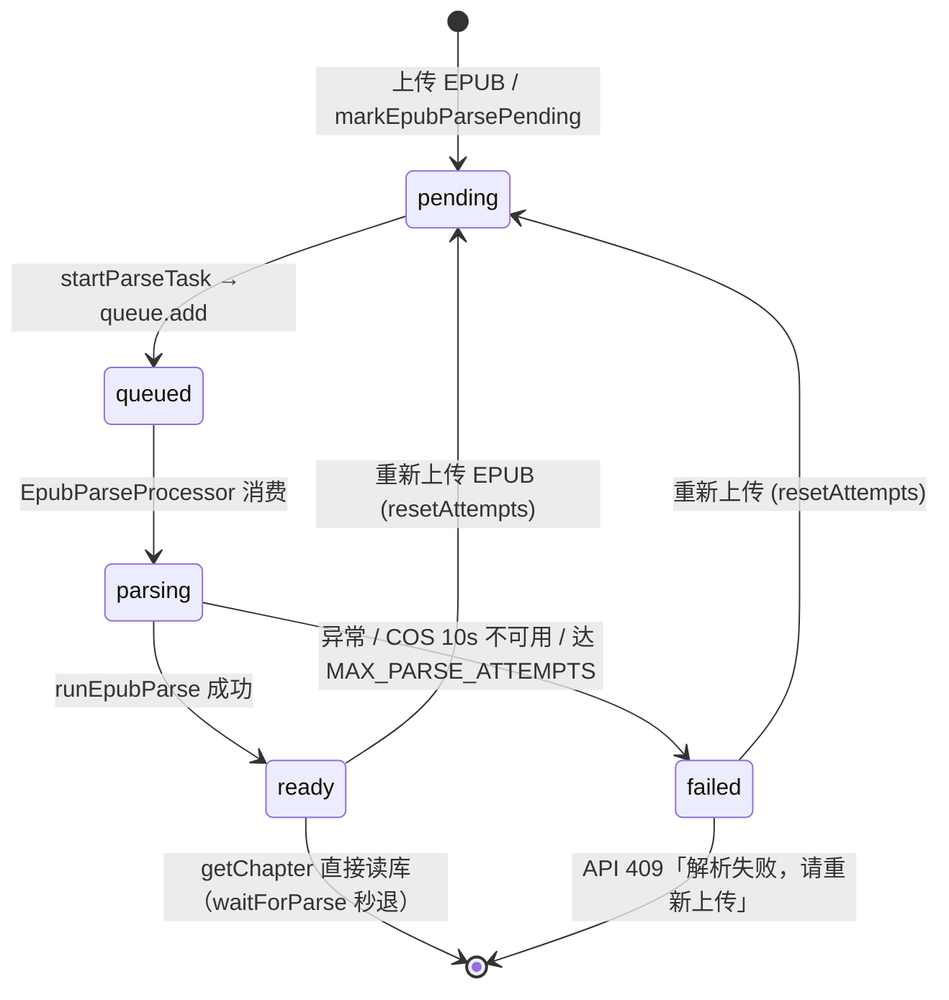

# 小程序 EPUB 解析逻辑 — 实现思路

> **状态**：部分已落地（后端解析 + BullMQ 队列 + 章节 API + 小程序 M1–M2） | **日期**：2026-07-13 | **需求摘要**：个人小程序无法使用 web-view，后端将 EPUB 懒解析为章节 HTML 入库，小程序用 `mp-html` 消费已有 API 原生渲染。

## 延伸阅读

- [电子书COS对象键解析.md](../../ebook/电子书COS对象键解析.md) — COS 键兼容、`resolveCosObjectKey`、章节图片 `uploadEbookAssetBuffer`
- [小程序EPUB服务端解析.md](../../ebook/小程序EPUB服务端解析.md) — **实现归档**（改动前后对比 + BullMQ/`waitForParse` 逐行注释）
- [EPUB小程序服务端解析影响.md](../../impact/EPUB小程序服务端解析影响.md) — 本次改动对 Web epub.js、进度、下载、部署的回归影响面
- [微信小程序EPUB阅读器.md](../miniprogram/微信小程序EPUB阅读器.md) — 微信小程序阅读器整体方案（含 web-view 备选）
- [电子书阅读进度保存.md](../ebook/电子书阅读进度保存.md) — 阅读进度保存（Web CFI；小程序用 `chapterIndex + scrollPercent`）
- [微信小程序绑定影响.md](../../impact/微信小程序绑定影响.md) — 微信登录与账号关联

---

## 0. 读本文你将得到什么

- **当前改动全链路**：Web 上传 EPUB → COS → BullMQ 排队解析 → `ebook_chapter` 入库 → 小程序 `mp-html` 渲染
- **解析编排细节**：`ensureEpubParseScheduled` → `startParseTask`（`epub-parse-queue`）→ `EpubParseProcessor` → `waitForParse`（`ready` 秒退 / `pending` 最多等 120s）
- **COS 兼容层**：`resolveCosObjectKey` 如何修复历史中文键名，图片如何改写为 `ebooks/assets/{bookId}/` 外链
- **小程序消费方式**：`fetchChapters` / `fetchChapter` 超时 120s、409 轮询、`mp-html` 换章卸载再挂载；`ready` 后换章走 DB 直读 + 本地 `getChapterCache`
- **最大风险**：大 EPUB 首次解析耗时、409 与 `failed` 区分、M3 段落偏移与 Web CFI 互操作

**一句话方案**：上传后 `markEpubParsePending` 入队 `epub-parse-queue`（`concurrency:1`）；Worker 执行 `parseEpubBuffer` 全书入库；小程序 `GET /chapter/:index` 在 `ready` 后只读库返回 HTML，解析中 409 + 5s 轮询。

---

## 1. 需求与边界

### 1.1 用户故事

| 角色 | 场景 | 行为 | 期望结果 |
|------|------|------|----------|
| Web 用户 | 桌面端上传 EPUB | `POST /ebook/upload` 至 COS | 后台自动排队解析，键名为 `ebooks/{uuid}.epub` |
| 小程序用户 | 书架点书进入阅读 | 拉章节目录 + 单章 HTML | 正文与图片可显示，无需 web-view |
| 小程序用户 | 首次打开未解析完的书 | 等待 loading | 后端解析完成后自动出正文，或提示失败 |
| 双端用户 | 换设备继续读 | 保存/恢复进度 | 共用 `ebook_progress.chapter_index + scroll_percent` |

### 1.2 范围

| 在范围内 | 不在范围内（非目标） |
|----------|----------------------|
| 后端 EPUB → 章节 HTML 解析与入库 | 小程序端本地解析 EPUB |
| COS 键兼容、章节内图片上传 COS | 听书 TTS（另规划） |
| `GET /ebook/book/:id/chapters` 与 `chapter/:index` | 小程序上传书籍（MVP 从 Web 上传） |
| 小程序 `mp-html` 渲染 + 409 轮询 | epub.js / web-view（个人号不可用） |
| 进度 `chapterIndex + scrollPercent` 双写 | M3 段落级划线 / 想法（规划） |

### 1.3 约束与依赖

- 个人小程序主包 ≤ 2MB；`mp-html` 不支持文本选区 API
- 解析依赖 COS 可读（`getObjectBuffer`）或本地 `localPath`（桌面端未上云场景）
- `sanitizeEpubHtml` 白名单与 `mp-html` 标签集对齐
- 微信业务域名须配置 COS 公网域（章节 `` 为外链）

---

## 2. 方案总览（一句话 + 要点）

**一句话方案**：解析放在后端、渲染放在小程序；数据经 `ebook_chapter.html` 与 Web 互通，进度字段扩展而非另建表。

| # | 设计要点 | 理由 |
|---|----------|------|
| 1 | **懒解析 + 上传入队**：`getChapters`/`getChapter` 兜底调度；上传即 `markEpubParsePending` | 避免无人打开的书占 CPU；上传后后台先跑 |
| 2 | **BullMQ `epub-parse-queue`**（`concurrency:1`） | 多本大 EPUB 串行，减轻 API 进程 CPU 争抢；任务持久化在 Redis |
| 3 | **请求内等待 120s**（`waitForParse`） | 仅 `pending` 时阻塞；`ready` 直接 return，换章不等队列 |
| 4 | **图片 COS 化**（`rewriteImages`） | EPUB 内相对路径小程序无法解析 |
| 5 | **键名兼容**（`resolveCosObjectKey`） | 历史 `ebooks/{uuid}_中文名.epub` 仍可读 |
| 6 | **jobId** `epub-parse-${bookId}` | BullMQ 自定义 id **禁止含 `:`**；同书去重 |

---

## 3. 现状与复用

### 3.1 本次改动（后端 · 已落地）

| 能力 | 已有位置 | 本需求用法 |
|------|----------|------------|
| EPUB 解压与 OPF/spine 解析 | `apps/backend/src/services/ebook/epub-chapter-parser.service.ts` → `parseEpubBuffer()` | **新增**，解析主入口 |
| body 抽取 / HTML 白名单 / 字数 | `apps/backend/src/services/ebook/epub-html.util.ts` | **新增**，`mp-html` 友好 |
| 图片上传 + src 改写 | 同上 → `rewriteImages()` + `UploadService.uploadEbookAssetBuffer()` | **扩展** upload |
| COS 键存在性 / 兼容解析 | `apps/backend/src/services/upload/upload.service.ts` → `objectExists` / `resolveCosObjectKey` | **扩展**，读 EPUB 前必经 |
| 电子书主文件键规则 | 同上 → `buildCosObjectKey(..., 'ebooks')` → `ebooks/{uuid}.epub` | **扩展**，新上传无中文键 |
| 章节表 | `apps/backend/src/services/ebook/ebook-chapter.entity.ts` → `ebook_chapter` | **新增** |
| 解析状态字段 | `ebook-book.entity.ts` → `parse_status` / `total_word_count` / `parse_attempt` | **扩展** |
| 解析编排 | `ebook.service.ts` → `ensureEpubParseScheduled` / `startParseTask` / `waitForParse` / `processEpubParseJob` | **扩展** |
| **BullMQ 队列** | `epub-parse.constants.ts` / `epub-parse.processor.ts` / `epub-parse-queue-events.ts` | **新增**，`concurrency:1` |
| 章节 API | `ebook.controller.ts` → `GET book/:id/chapters` / `chapter/:index` | **新增** |
| 进度字段 | `save-ebook-progress.dto.ts` + `ebook-progress.entity.ts` | **扩展** `chapterIndex` / `chapterHref` / `scrollPercent` |
| 上传后触发解析 | `saveUploadedBook` → `markEpubParsePending` | **扩展** |

### 3.2 小程序（仓库外 · 已落地）

| 能力 | 位置 | 用法 |
|------|------|------|
| 章节 API 封装 | `dnhyxc-ebook-miniprogram/src/services/ebook.ts` | `fetchChapters` / `fetchChapter`，timeout 120000 |
| 阅读页渲染 | `src/pages/reader/index.vue` | `mp-html` + 409 轮询 + 换章 `chapterRenderKey` |
| 解析中判定 | 同上 → `isChapterParsePending` | HTTP 409 且消息不含「失败」「不存在」「重新上传」 |

### 3.3 仍待扩展（规划）

| 能力 | 说明 |
|------|------|
| `splitIntoParagraphs` / 段落划线 | M3；`getChapter` 尚未返回 `paragraphs` |
| Web 端 offset 格式划线降级 | M3 互操作 |
| 章节 HTML 离线缓存策略 | 小程序已有 `setChapterCache`，未写正式归档 |

**调研结论**：解析与 API 已在 `dnhyxc-ai` 落地；小程序阅读页已对接。不必在小程序内重复解析 EPUB。

---

## 4. 架构图



**图内方法说明**：

| 方法 / 模块入口 | 功能 |
|-----------------|------|
| `uploadLocalFileToCos()` | 流式上传 EPUB 到 COS，`prefix='ebooks'` 时键为 `ebooks/{uuid}.epub` |
| `markEpubParsePending()` | 上传或重传后：`parse_status=pending`、清旧章节、`await startParseTask` |
| `startParseTask()` | `epubParseQueue.add`，`jobId=epub-parse-${bookId}`，`attempts:1`；占坑 job 先 remove |
| `ensureEpubParseScheduled()` | `getChapters`/`getChapter`：`ready`+有章节则跳过；否则 `await startParseTask` 或 `markEpubParsePending` |
| `waitForParse()` | `ready` 秒退；`pending` 时 `job.waitUntilFinished` 最多 120s |
| `processEpubParseJob()` | `EpubParseProcessor` 入口 → `waitThenParse` |
| `EpubParseProcessor` | BullMQ Worker，`concurrency:1`，消费 `epub-parse-queue` |
| `EpubParseQueueEvents` | 供 `waitUntilFinished` 的 `QueueEvents` 连接（非 chat 的 `QueueEventsListener`） |
| `runEpubParse()` | 读 buffer → `parseEpubBuffer` → 批量 `chapterRepo.save` → `parse_status=ready` |
| `resolveEpubBuffer()` | COS 书：`resolveCosObjectKey` + `getObjectBuffer`；否则读 `localPath` |
| `parseEpubBuffer()` | JSZip 解包 → OPF spine 遍历 → 每章 HTML 管线 |
| `extractBodyHtml()` | 从章节 XHTML 抽 `<body>` 内联 HTML |
| `rewriteImages()` | `` 相对路径 → `uploadEbookAssetBuffer` → COS 公网 URL |
| `sanitizeEpubHtml()` | 白名单标签、去 script/iframe/on*，保留 `mp-html` 可渲结构 |
| `countWords()` | 中英数字计数，写入 `word_count` / `total_word_count` |
| `resolveCosObjectKey()` | DB 键 404 时按 UUID 列举 `ebooks/{uuid}` 找回真实键；解析成功可回写 DB |
| `getObjectBuffer()` | 读 COS 对象字节；内部先 `resolveCosObjectKey` |
| `uploadEbookAssetBuffer()` | 章节内图片写入 `ebooks/assets/{bookId}/{uuid}_{文件名}` |
| `getChapters()` | 鉴权 → 懒调度 → `waitForParse` → 查 `ebook_chapter` 列表 |
| `getChapter()` | 同上 → 按 `chapterIndex` 返回 `html` + 上下章索引 |
| `fetchChapters()` / `fetchChapter()` | 小程序 HTTP 封装，timeout 120s |
| `isChapterParsePending()` | 识别 409「解析中」以触发轮询，排除 `failed` 文案 |

**读图要点**：

- **解析与渲染分离**：重计算在后端 Nest；小程序只消费 HTML 与 COS 图片 URL
- **COS 两层对象**：主 EPUB 在 `ebooks/`；章节图片在 `ebooks/assets/{bookId}/`
- **双触发**：上传时 `markEpubParsePending` 入队；阅读 API `ensureEpubParseScheduled` 兜底
- **队列与 API 同进程**：`EpubParseProcessor` 当前跑在 Nest API 进程内；可后续拆独立 worker 进程

---

## 5. 主流程图

### 5.1 后端：从上传到章节入库



**图内方法说明**：

| 方法 | 功能 |
|------|------|
| `saveUploadedBook()` | 写入 `ebook_book`；EPUB 则 `void markEpubParsePending`（上传响应不阻塞） |
| `markEpubParsePending()` | 递增 `parse_attempt`（≤3）、删旧章节、`await startParseTask` |
| `startParseTask()` | `epub-parse-queue.add`；`jobId` 不可含 `:`；去重 / 清理 stale job |
| `EpubParseProcessor.process()` | 打日志并调用 `processEpubParseJob` |
| `waitThenParse()` | 等 COS 就绪或读本地；失败则 `markEpubParseFailed` |
| `objectExists()` | COS `headObject`，判断 EPUB 是否已上传完成 |
| `resolveCosObjectKey()` | 修复历史键名；`waitThenParse` 与 `runEpubParse` 成功后可回写 |
| `runEpubParse()` | 编排读文件 → 解析 → 入库 → 更新 `total_word_count` |
| `parseEpubBuffer()` | 见 §4；空 spine 或零章节抛错 |
| `markEpubParseFailed()` | `parse_status='failed'`，后续 API 返回 409「解析失败」 |

**读图要点**：

- **上传与解析异步**：`saveUploadedBook` 不等待 Worker；`getChapters` 在 `pending` 时可同步等最多 120s
- **全书解析**：`GET /chapter/:index` 首次仍等全书 `ready`，非只解析单章
- **COS 竞态**：桌面先登记 `file_path`、COS 稍晚可见时，`waitThenParse` 轮询 10s
- **失败封顶**：`MAX_PARSE_ATTEMPTS=3`，超限不再自动重试

### 5.2 小程序：打开书籍 → 渲染章节



**图内方法说明**：

| 方法 | 功能 |
|------|------|
| `initReader()` | 拉书详情 + 目录，算起始章，调 `loadChapter` |
| `fetchChapters()` | `GET /ebook/book/:id/chapters`；后端侧可能阻塞至 `waitForParse` 120s |
| `fetchChapter()` | `GET /chapter/:index`；`ready` 后仅 DB 读 html；首次 pending 可阻塞至解析完成 |
| `resolveStartIndex()` | 优先 `prog.chapterIndex`，否则按 `percent * total` 估算 |
| `isChapterParsePending()` | `ApiError.status===409` 且消息为「解析中」类 |
| `loadChapter()` | 换章时先清空 `chapterHtml` 再 `chapterRenderKey++`，规避 mp-html 节点变短崩溃 |
| `persistProgress()` | 防抖 `PUT /ebook/progress`：`chapterIndex` / `chapterHref` / `scrollPercent` |

**读图要点**：

- **ready 后换章**：后端 `waitForParse` 秒退；小程序未命中缓存时才请求 API
- **mp-html 换章技巧**：必须卸载再挂载，不可原地缩短 `content`
- **缓存**：`getChapterCache` 减少重复拉取；`forceRefresh` 可绕过

---

## 6. 核心时序图

```mermaid
sequenceDiagram
  participant U as 用户
  participant MP as 小程序 reader
  participant API as EbookController
  participant Svc as EbookService
  participant Redis as Redis/BullMQ
  participant Worker as EpubParseProcessor
  participant Parser as EpubChapterParserService
  participant Up as UploadService
  participant COS as 腾讯云 COS
  participant DB as MySQL

  Note over U,DB: 阶段 A — Web 上传（可先于小程序阅读）
  U->>API: POST /ebook/upload (epub)
  API->>Svc: saveUploadedBook
  Svc->>Up: uploadLocalFileToCos(prefix=ebooks)
  Up->>COS: putObject ebooks/{uuid}.epub
  Svc->>Svc: markEpubParsePending
  Svc->>Redis: startParseTask → queue.add(jobId=epub-parse-{bookId})
  Redis->>Worker: 消费 parse job
  Worker->>Svc: processEpubParseJob → waitThenParse

  Note over U,DB: 阶段 B — 小程序打开（全书已 ready 或等待中）
  U->>MP: 进入阅读页
  MP->>API: GET /ebook/book/:id/chapters
  API->>Svc: getChapters
  Svc->>Svc: ensureEpubParseScheduled → 必要时 startParseTask
  alt parse_status === pending
    Svc->>Svc: waitForParse（最多 120s，监听 QueueEvents）
    Worker->>Svc: waitThenParse → runEpubParse
    Svc->>Up: resolveCosObjectKey + getObjectBuffer
    Up->>COS: getObject
    COS-->>Svc: EPUB Buffer
    Svc->>Parser: parseEpubBuffer(buffer, bookId)
    loop spine 每章
      Parser->>Parser: extractBodyHtml
      Parser->>Up: uploadEbookAssetBuffer (图片)
      Up->>COS: putObject ebooks/assets/…
      Parser->>Parser: sanitizeEpubHtml
    end
    Parser-->>Svc: ParsedEpubChapter[]
    Svc->>DB: DELETE + INSERT ebook_chapter
    Svc->>DB: UPDATE parse_status=ready
  else parse_status === ready
    Svc->>Svc: waitForParse 秒退
  end
  Svc->>DB: SELECT ebook_chapter ORDER BY chapter_index
  DB-->>Svc: 目录列表
  Svc-->>MP: EbookChaptersDto

  MP->>API: GET /ebook/book/:id/chapter/:index
  API->>Svc: getChapter
  Svc->>DB: SELECT html WHERE chapter_index
  DB-->>Svc: 章节 HTML
  Svc-->>MP: { html, title, prevIndex, nextIndex }
  MP->>MP: chapterRenderKey++ ; mp-html 渲染
  MP-->>U: 显示正文
```

**图内方法说明**：

| 方法 | 功能 |
|------|------|
| `resolveContentBook()` | 公开书架副本 `sourceBookId` 时，解析与章节读 **源书** 记录 |
| `assertEpubSourceAvailable()` | 非 EPUB 或 COS/本地均不可用 → 400 |
| `waitForParse()` | `ready` 直接 return；`pending` 时 `job.waitUntilFinished(EpubParseQueueEvents)`，上限 120s |
| `processEpubParseJob()` | Worker 调用；内部 `waitThenParse` → `runEpubParse` |
| `assertEpubChaptersReady()` | `failed` → 409「解析失败」；非 `ready` 或零章节 → 409「正在解析中」 |
| `parseEpubBuffer()` | 完整 OPF/spine/NCX 管线，见 `epub-chapter-parser.service.ts` |
| `uploadEbookAssetBuffer()` | 返回 `buildCosPublicUrl(key)` 供 `` 使用 |

**读图要点**：

- **Happy path 跨三仓库**：`dnhyxc-ai` 后端 + COS + `dnhyxc-ebook-miniprogram` 阅读页
- **公开书**：小程序读用户书架副本 `bookId`，章节数据来自 `sourceBookId` 指向的源书
- **同步边界**：仅 `pending` 时 API 阻塞等待 Worker；`ready` 后章节 API 为 DB 直读

---

## 7. 解析状态机



**图内方法说明**：

| 方法 | 功能 |
|------|------|
| `markEpubParsePending()` | 进入 `pending`；`resetAttempts:true` 时 `parse_attempt=1` |
| `startParseTask()` | 入队 BullMQ；`queued` 为 Redis 中 waiting/active |
| `EpubParseProcessor` | Worker 执行中 → `parsing` |
| `markEpubParseFailed()` | 置 `failed`；`isParseAttemptExhausted` 时不再自动调度 |
| `assertEpubChaptersReady()` | 按 `parse_status` 决定 409 文案 |

**读图要点**：

- DB 仅存 `pending | ready | failed`；队列中 waiting/active 表示「解析中」
- 与 chat 的 `QueueEventsListener` 不同：epub 用 `EpubParseQueueEvents` 仅服务 `waitUntilFinished`

---

## 8. 模块职责与接口草图

### 8.1 模块一览

| 模块 | 职责 | 状态 | 路径 |
|------|------|------|------|
| `EpubChapterParserService` | EPUB → 章节 HTML | 新增 | `apps/backend/.../epub-chapter-parser.service.ts` |
| `epub-html.util` | body 抽取 / 清洗 / 字数 | 新增 | `apps/backend/.../epub-html.util.ts` |
| `EbookChapter` | 章节持久化 | 新增 | `apps/backend/.../ebook-chapter.entity.ts` |
| `EbookService` 解析段 | 调度 / 等待 / 入库 | 扩展 | `ebook.service.ts` |
| `EpubParseProcessor` | BullMQ Worker | 新增 | `epub-parse.processor.ts` |
| `EpubParseQueueEvents` | `waitUntilFinished` | 新增 | `epub-parse-queue-events.ts` |
| `EPUB_PARSE_QUEUE` | 队列名常量 | 新增 | `epub-parse.constants.ts` |
| `UploadService` COS 扩展 | 键解析 / 资产上传 / 存在性 | 扩展 | `apps/backend/.../upload.service.ts` |
| 章节 API | 目录 + 正文 | 新增 | `apps/backend/.../ebook.controller.ts` |
| 小程序 `ebook.ts` | API 客户端 | 已对接 | `dnhyxc-ebook-miniprogram/src/services/ebook.ts` |
| 小程序 `reader` | mp-html 阅读 | 已对接 | `dnhyxc-ebook-miniprogram/src/pages/reader/index.vue` |

### 8.2 关键 API 响应草图

```typescript
// GET /ebook/book/:id/chapters
type EbookChaptersDto = {
  bookId: string;
  title: string;
  total: number;
  totalWordCount?: number;
  chapters: { index: number; href: string; title: string; level: number; wordCount?: number }[];
};

// GET /ebook/book/:id/chapter/:index
type EbookChapterContentDto = {
  bookId: string;
  index: number;
  title: string;
  html: string;           // 已 sanitize + 图片 COS 外链
  wordCount?: number;
  totalWordCount?: number;
  prevIndex: number | null;
  nextIndex: number | null;
  total: number;
};

// PUT /ebook/progress（小程序字段）
type SaveEbookProgressDto = {
  bookId: string;
  chapterIndex?: number;
  chapterHref?: string;
  scrollPercent?: number; // 0–1
  percent?: number;
};
```

### 8.3 数据模型

| 字段/实体 | 来源 | 存储 | 说明 |
|-----------|------|------|------|
| `ebook_book.file_path` | 上传 | DB | COS 键；可被 `resolveCosObjectKey` 回写 |
| `ebook_book.parse_status` | 解析任务 | DB | `pending` / `ready` / `failed` |
| `ebook_book.total_word_count` | 解析汇总 | DB | 全书字数 |
| `ebook_chapter.html` | `parseEpubBuffer` | DB `mediumtext` | 小程序直接渲染 |
| `ebook_progress.chapter_index` | 小程序滚动 | DB | 与 Web CFI 并存 |
| COS `ebooks/assets/{bookId}/` | `rewriteImages` | COS | 章节图片公网 URL |

---

## 9. 分阶段实现步骤

| 阶段 | 目标 | 状态 |
|------|------|------|
| M1 | 后端解析 + 章节 API + 小程序 mp-html 直渲 | **已落地** |
| M2 | 目录 / 翻章 / `chapterIndex+scrollPercent` 进度 | **已落地** |
| M3 | 段落级划线 + offset 与 CFI 互操作 | 规划 |
| M4 | 想法 / 长章性能 / 离线缓存完善 | 规划 |

### M1 任务（已完成）

- [x] `EpubChapterParserService.parseEpubBuffer`
- [x] `ebook_chapter` 表与实体
- [x] `GET /chapters` / `GET /chapter/:index`
- [x] `resolveCosObjectKey` + `uploadEbookAssetBuffer`
- [x] 小程序 `mp-html` 渲染章节 HTML

### M2 任务（已完成）

- [x] 目录面板 `toc` + 章节跳转
- [x] `prevIndex` / `nextIndex` 翻章
- [x] `PUT /progress` 扩展字段
- [x] BullMQ `epub-parse-queue` + `EpubParseProcessor`（`concurrency:1`）
- [x] `waitForParse`：`ready` 秒退，修复换章误等 1s

### M3 任务（待做）

- [ ] `splitIntoParagraphs()` 工具
- [ ] `getChapter` 可选返回 `paragraphs`
- [ ] 小程序段落点击划线
- [ ] Web 端 offset 格式降级高亮

---

## 10. 关键决策与备选方案

| 决策 | 选用 | 备选 | 为何不选备选 |
|------|------|------|--------------|
| 解析位置 | 后端 spine 解析入库 | 小程序本地 JSZip | 包体积、性能、密钥与 COS 访问 |
| 渲染 | `mp-html` | `rich-text` | 标签少、无图片预览与链接 |
| 图片 | 解析时上传 COS 改 src | 小程序打包 zip 内资源 | 无法实现；外链需业务域名 |
| COS 键 | 新上传 `ebooks/{uuid}.epub` + `resolveCosObjectKey` | 全量迁移 DB 键 | 迁移成本高；列举前缀可渐进修复 |
| 解析调度 | 进程内 `parseTasks` Map | **BullMQ `epub-parse-queue`** | 多本串行、Redis 持久化、API 重启不丢队 |
| 等待策略 | API `waitForParse` 120s + 小程序 409 轮询 | 不变 | `ready` 后改为秒退 |
| jobId | — | `epub-parse-${bookId}` | BullMQ 禁止 `:` |
| 划线定位 | 规划用 `offset:章:起-止` | 强行移植 CFI | 小程序无 epub.js 选区 |

---

## 11. 风险、边界与待确认

| 项 | 等级 | 说明 | 缓解 |
|----|------|------|------|
| 多用户同时解析 CPU | 低 | BullMQ `concurrency:1` 全书串行 | 观察 Worker 日志耗时 |
| 大 EPUB 首次解析超时 | 中 | 全书解析 >120s 时 API 返回 409 | 小程序 24×5s 轮询 |
| 历史 COS 键 404 | 中 | DB 键与 COS 不一致 | `resolveCosObjectKey` + 解析成功回写 |
| `mp-html` 标签边界 | 低 | 极少数标签不支持 | `sanitizeEpubHtml` 白名单 |
| 409 文案耦合 | 低 | 小程序靠中文消息判断 | 后续可改 `errorCode`（待确认） |
| 公开书源书删除 | 中 | 副本仍指向 `sourceBookId` | `assertEpubSourceAvailable` 400 |
| 微信下载域名 | 中 | COS 图片须配业务域名 | 运维配置公网域 |
| **已修复（历史）** | — | `void startParseTask` 竞态致秒 409；`jobId` 含 `:` 入队失败；`ready` 后 `waitForParse` 空轮询 1s | 现行代码已 `await startParseTask`、连字符 jobId、`ready` 早退 |

**待确认**：

- [ ] 解析超过 120s 的书籍占比（验证：生产日志 `EPUB 解析完成` 耗时）
- [ ] 是否在 `getChapters` 响应中显式返回 `parseStatus` 供小程序免 409 轮询（验证：改 DTO 后对比请求次数）

---

## 12. 验收清单

| # | 用例 | 步骤 | 期望 |
|---|------|------|------|
| AC1 | 新上传 EPUB 首次小程序阅读 | Web 上传 → 小程序打开 | 120s 内出目录与正文；图片为 COS 外链 |
| AC2 | 历史中文键 EPUB | 用旧 `file_path` 的书打开 | `resolveCosObjectKey` 找到对象；解析 `ready` |
| AC3 | 解析失败 | 故意损坏 EPUB | `parse_status=failed`；小程序提示含「失败」不无限轮询 |
| AC4 | 翻章与进度 | 阅读后退出再进 | 恢复 `chapterIndex` + `scrollPercent`；Web 可见进度 |
| AC5 | 公开书 | 从公开架添加后阅读 | 章节来自源书；副本 `bookId` 可读 |
| AC6 | mp-html 换章 | 连续上一章/下一章 | 无 `n.attrs.id` 崩溃；内容正确切换 |
| AC7 | ready 后换章 API | 上传解析完成后 `GET /chapter/N` | TTFB 显著低于首次（无 `waitForParse` 阻塞）；小程序缓存命中更快 |

---

## 13. 预估改动面（归档参考）

| 类型 | 路径 |
|------|------|
| 后端解析 | `epub-chapter-parser.service.ts`、`epub-html.util.ts`、`ebook-chapter.entity.ts` |
| 后端编排 | `ebook.service.ts`、`epub-parse.processor.ts`、`epub-parse-queue-events.ts`、`epub-parse.constants.ts`、`ebook.module.ts` |
| COS | `upload.service.ts`（`objectExists`、`resolveCosObjectKey`、`uploadEbookAssetBuffer`） |
| API / DTO | `ebook.controller.ts`、`save-ebook-progress.dto.ts`、实体字段迁移 |
| 小程序 | `dnhyxc-ebook-miniprogram` — `services/ebook.ts`、`pages/reader/index.vue` |
| 实现归档（建议） | `docs/ebook/EPUB小程序服务端解析影响.md`（`implementation-doc-from-diff`） |

---

（本文档描述当前已落地改动与后续 M3–M4 规划；与源码不一致时以 `apps/backend` 与 `dnhyxc-ebook-miniprogram` 为准）
