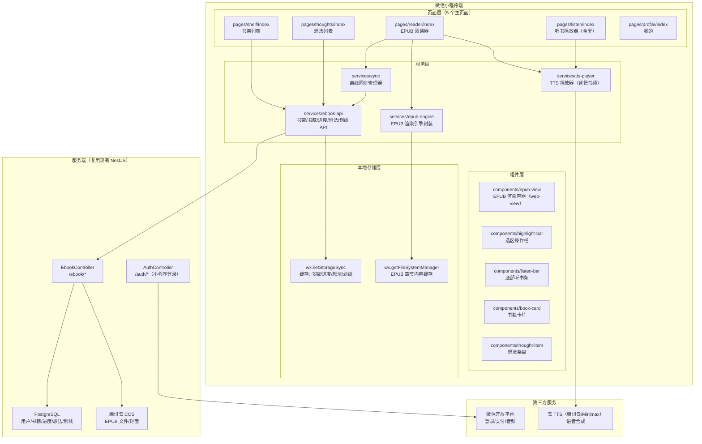
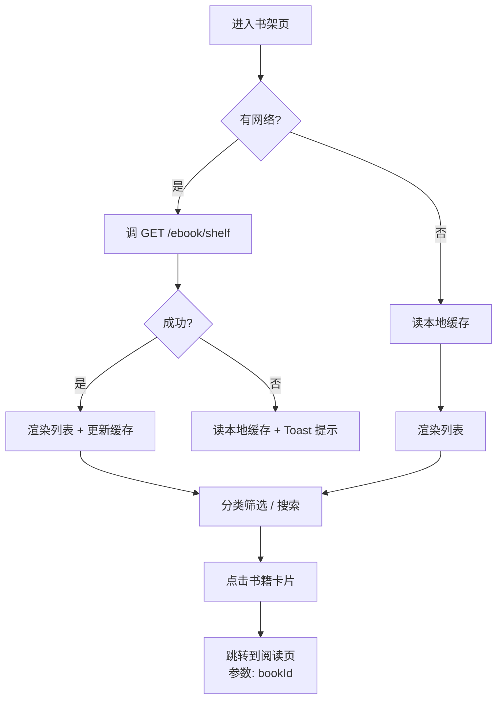
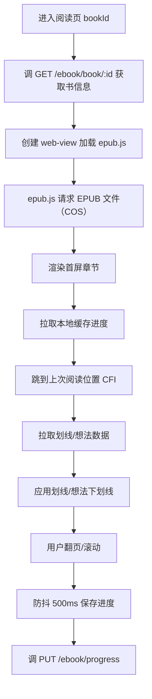
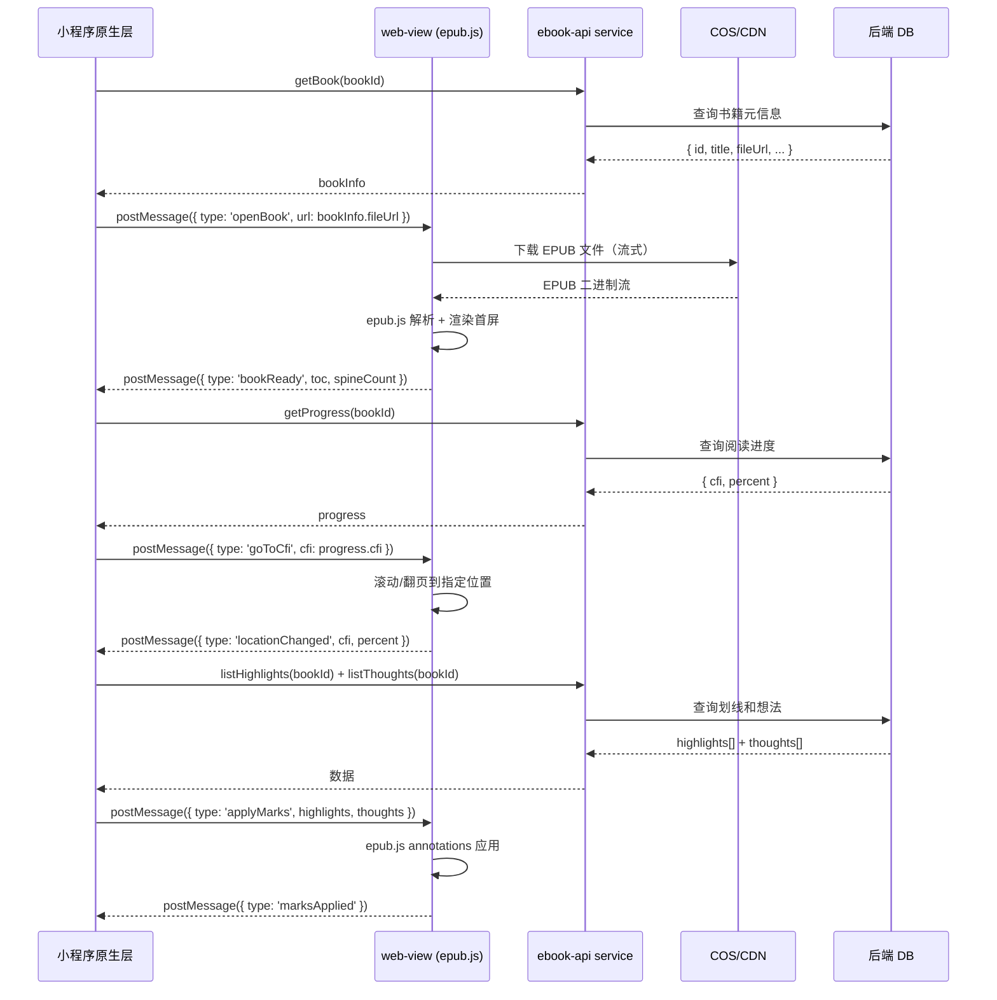
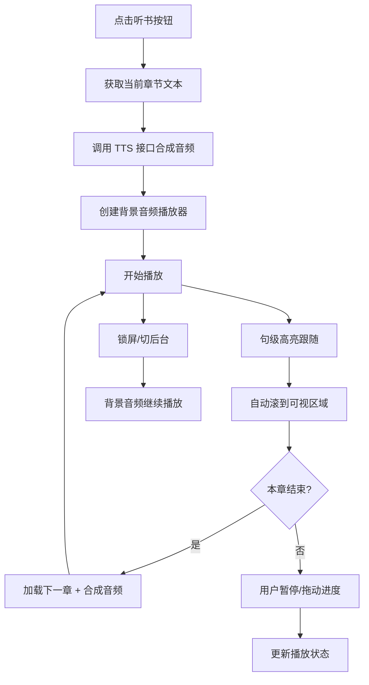
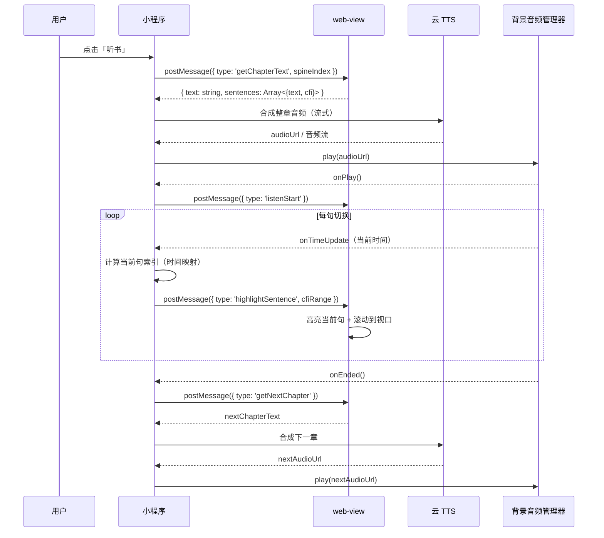
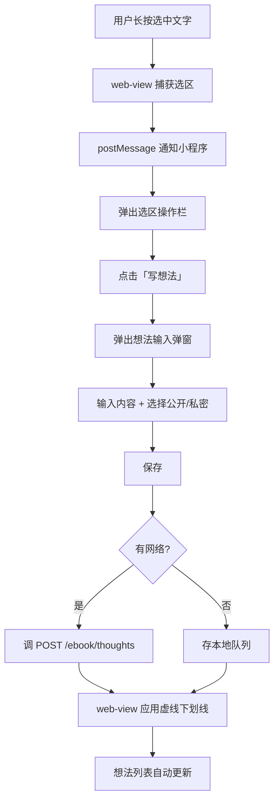
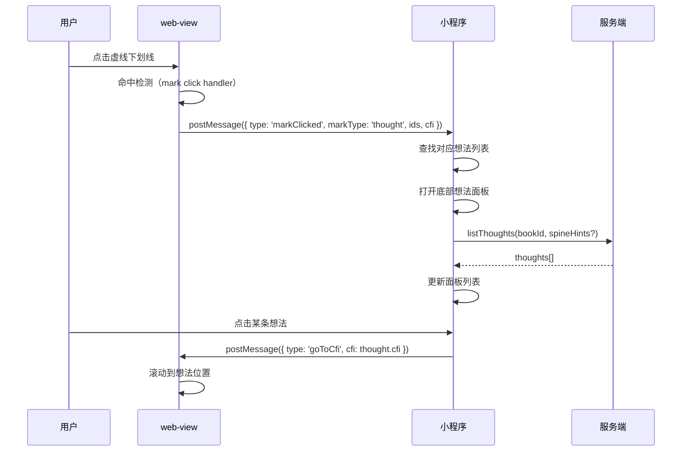
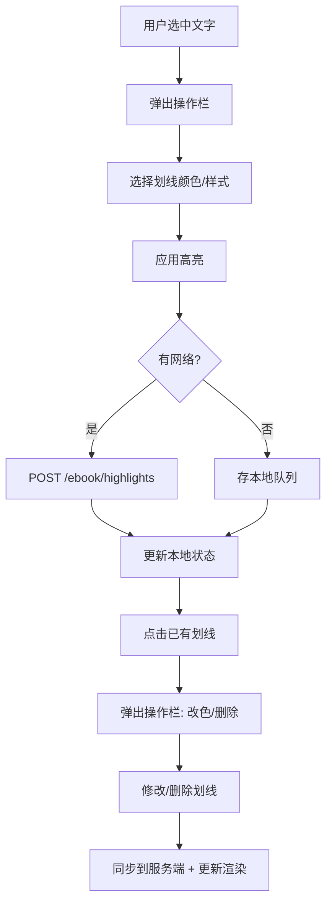

# 微信小程序 EPUB 电子书阅读器 — 实现思路

> **状态**：规划 | **日期**：2026-07-04 | **需求摘要**：基于现有 Web 端 EPUB 电子书阅读能力，独立实现微信小程序版，包含书架列表、EPUB 阅读、听书、读书想法、划线五大核心功能

## 0. 读本文你将得到什么

- 微信小程序电子书阅读器的**整体架构图**（小程序端 / 服务端 / 存储三层）
- 五大功能模块的**主流程图**与**核心时序图**
- **M1–M6 分阶段落地路径**，每阶段有明确交付物与验收标准
- 与现有 Web 端**数据模型、API 接口的复用对照**表
- 小程序特有问题（EPUB 渲染、包体大小、离线存储、音频后台播放）的**解决方案与权衡**

---

## 1. 需求与范围

### 1.1 功能一句话

> 登录用户在微信小程序内浏览自己的电子书书架，阅读 EPUB 格式书籍（分页/滚动），支持 TTS 听书、在正文上划线高亮、写读书想法，数据与 Web 端云端互通。

### 1.2 必须做（MVP+）

| 模块 | 功能点 |
|------|--------|
| 书架列表 | 书籍卡片、分类筛选、搜索、最近阅读排序、未分类兜底 |
| EPUB 阅读 | 翻页/章节跳转、字号/主题/行距设置、阅读进度保存与同步 |
| 听书功能 | TTS 朗读当前章节、暂停/续播/倍速、句级高亮跟随、锁屏播放 |
| 读书想法 | 选区写想法、想法列表、按章节查看、公开/私密 |
| 用户划线 | 选区划线、多色高亮/下划线/波浪线、删除、合并 |

### 1.3 不做（一期）

| 项 | 原因 |
|----|------|
| 上传电子书到书架 | 小程序包体 + 微信上传限制 + 审核风险；一期仅读取 Web 端已上传的书 |
| PDF 阅读 | 小程序 PDF 渲染方案不成熟，优先级低 |
| 知识助手 / MOKE AI | AI 对话审核 + 包体成本高；二期考虑 |
| 电子书分享 / 公开笔记 | 涉及内容安全审核，一期做私域阅读 |
| 本地文件夹导入 | 小程序无文件系统访问权限 |
| 自定义字体 | 小程序字体加载复杂且占包体；用系统字体即可 |

### 1.4 关键约束

| 约束 | 说明 |
|------|------|
| 包体大小 | 小程序主包 ≤ 2MB，总包 ≤ 20MB；EPUB 渲染核心需分包或动态下载 |
| 渲染性能 | 低端 Android 机 60fps 翻页；首屏打开 ≤ 2s（10MB 以内 EPUB） |
| 数据同步 | 与 Web 端共用后端 NestJS API；进度/想法/划线实时双向同步 |
| 音频后台播放 | 听书需支持小程序后台音频播放（`wx.getBackgroundAudioManager`） |
| 离线能力 | 已打开的书可离线阅读；想法/划线离线缓存，联网后同步 |

---

## 2. 现状与复用

### 2.1 可复用的后端能力

| 能力 | 已有位置 | 小程序用法 |
|------|----------|------------|
| 书架列表 API | `GET /ebook/shelf` | 直接调用，返回结构不变 |
| 书籍详情 API | `GET /ebook/book/:id` | 直接调用 |
| 分类管理 API | `GET /ebook/categories/summary` 等 | 直接调用 |
| 阅读进度保存 | `PUT /ebook/progress` | 防抖调用，结构一致 |
| 读书想法 CRUD | `/ebook/thoughts/*` | 直接调用，CFI 格式兼容 |
| 用户划线 CRUD | `/ebook/highlights/*` | 直接调用，CFI 格式兼容 |
| 想法同步（增量） | `GET /ebook/thoughts/:bookId/sync` | 进入阅读页增量拉取 |
| JWT 鉴权 | `JwtGuard` | 小程序登录换 token 后复用 |

### 2.2 可参考的前端实现（思路复用，代码不可直接搬）

| Web 端能力 | 文件 | 小程序端如何借鉴 |
|------------|------|------------------|
| EPUB 渲染管线 | `views/ebook/components/reader/EpubPane.tsx` | 思路：epub.js 实例管理、生命周期、resize；小程序需换渲染方案 |
| 选区与 PopBar | `utils/epub/mark/epubSelectionToolbarAttach.ts` | 思路：选区 → CFI → 操作栏；小程序用原生组件模拟 |
| 用户划线渲染 | `utils/epub/mark/epubUserHighlights.ts` | 思路：CFI → DOM mark → SVG；小程序用 cover-view 或 canvas |
| 想法下划线与聚合 | `utils/epub/mark/epubThoughtAnnotations.ts` + `epubThoughtCluster.ts` | 思路完全复用：视口懒渲染、簇合并、点击命中 |
| 听书 TTS 与句高亮 | `hooks/useEpubChapterListen.ts` + `utils/epub/listen/` | 思路复用：分句 → 播放 → 高亮 → 滚到视口；小程序用背景音频管理器 |
| 阅读进度去抖 | `utils/common/io.ts`（debounce） | 思路复用：滚动停止 500ms 后保存 |

### 2.3 小程序端需要从零做的

| 项 | 原因 |
|----|------|
| EPUB 渲染引擎适配 | Web 端用 epub.js（依赖浏览器 DOM/iframe）；小程序用 web-view 或自研渲染 |
| 选区交互 | Web 端用原生 Selection API；小程序 web-view 内可用，但与原生组件通信复杂 |
| 音频播放 | Web 端用 SpeechSynthesis / audio；小程序用 `BackgroundAudioManager` |
| 页面路由与导航 | Web 端用 react-router；小程序用原生页面栈 + tabBar |
| 状态管理 | Web 端用 MobX；小程序用 `globalData` + 小程序订阅模式或 MobX-miniapp |
| 本地存储 | Web 端用 localStorage；小程序用 `wx.setStorageSync`（上限 10MB） |

---

## 3. 整体架构

### 3.1 架构图



### 3.2 图内方法说明

| 符号 | 做什么 | 输入/输出要点 |
|------|--------|---------------|
| `services/ebook-api` | 封装所有电子书相关 HTTP 请求，统一加 token、统一错误处理、统一缓存 | 输入：path + params；输出：Promise\<data\> |
| `services/epub-engine` | EPUB 渲染引擎封装，对外暴露「打开书 / 跳到 CFI / 注册选区回调 / 应用划线」等方法 | 内部用 web-view + epub.js，通过 postMessage 与小程序通信 |
| `services/tts-player` | TTS 播放器封装，管理播放/暂停/倍速/进度，对接微信背景音频管理器 | 输入：文本章节数组；输出：播放事件（onSentenceChange / onEnd 等） |
| `services/sync` | 离线同步管理器，维护本地操作队列，联网后批量同步到服务端 | 输入：本地变更；输出：同步状态（pending / synced / error） |

### 3.3 核心技术选型

| 选型 | 方案 | 理由 |
|------|------|------|
| 框架 | **原生小程序 + TypeScript** | 包体最小、性能最优、审核风险低；不选 Taro/uni-app 避免编译层问题 |
| EPUB 渲染 | **web-view + epub.js** | 复用成熟的 epub.js，web-view 内跑完整 Web 渲染；通过 postMessage 双向通信 |
| 状态管理 | **MobX-miniapp** 或 原生 `globalData` + 事件总线 | 轻量、学习成本低；阅读页复杂度高时用 MobX |
| 网络请求 | **wx.request 封装** | 统一拦截器、token 注入、错误重试 |
| TTS | **云端 TTS（腾讯云/Minimax）+ 背景音频管理器** | 支持后台播放、锁屏控制；比微信同声传译更稳定、音色更多 |
| 本地存储 | **wx.setStorage + 文件系统** | 结构化数据存 storage，EPUB 章节内容存临时文件 |

---

## 4. 书架列表模块

### 4.1 主流程图



### 4.2 数据结构（书架项）

```typescript
interface EbookShelfItem {
  id: string;             // UUID
  title: string;
  author?: string;
  coverUrl?: string;      // COS 地址，走 CDN
  categoryId?: string;    // 分类 ID
  lastReadAt?: string;    // 最近阅读时间 ISO
  progressPercent?: number; // 阅读进度 0-100
  sourceBookId?: string;  // 来源书 ID（公开书副本）
  isPublic?: boolean;     // 是否公开
}
```

### 4.3 页面结构

```
pages/shelf/
  ├── index.wxml        # 顶栏搜索 + 分类 tab + 书籍网格 + 下拉刷新
  ├── index.wxss        # 卡片样式、网格布局
  ├── index.ts          # 页面逻辑：加载/搜索/分类/跳转
  └── index.json        # 页面配置：下拉刷新、标题
```

### 4.4 关键实现点

| 点 | 方案 |
|----|------|
| 分类筛选 | 顶部横向滚动 tab，与 Web 端分类数据一致 |
| 最近阅读排序 | 复用 Web 端后端排序逻辑（`CASE WHEN p.updated_at IS NOT NULL THEN p.updated_at ELSE b.created_at END DESC`） |
| 搜索 | 前端本地搜索（书架数据量小）；量大再加服务端搜索 |
| 下拉刷新 | `onPullDownRefresh` + 重新拉取接口 |
| 无限滚动 | 书架一般 ≤ 100 本，不分页；数据量大时加分页 |

---

## 5. EPUB 阅读模块

### 5.1 主流程图



### 5.2 阅读器核心时序图



### 5.3 web-view 与原生通信协议

```typescript
// 小程序 → web-view 消息
type ToWebViewMessage =
  | { type: 'openBook'; url: string }
  | { type: 'goToCfi'; cfi: string }
  | { type: 'goToChapter'; spineIndex: number }
  | { type: 'applyMarks'; highlights: Highlight[]; thoughts: Thought[] }
  | { type: 'setTheme'; theme: 'light' | 'dark' | 'sepia' }
  | { type: 'setFontSize'; fontSize: number }
  | { type: 'setLineHeight'; lineHeight: number };

// web-view → 小程序消息
type FromWebViewMessage =
  | { type: 'bookReady'; toc: TocItem[]; spineCount: number }
  | { type: 'locationChanged'; cfi: string; percent: number; spineIndex: number }
  | { type: 'selection'; cfiRange: string; text: string; rect: { x: number; y: number; w: number; h: number } }
  | { type: 'markClicked'; cfi: string; markType: 'highlight' | 'thought'; ids: string[] };
```

### 5.4 web-view 内的 HTML 模板

web-view 内运行一个精简的 HTML 页面，只做 EPUB 渲染：

```html
<!-- 存放在小程序包内的本地 HTML，或动态注入 -->
<!DOCTYPE html>
<html>
<head>
  <meta name="viewport" content="width=device-width, initial-scale=1.0, user-scalable=no">
  <script src="epub.min.js"></script>
  <style>
    * { margin: 0; padding: 0; }
    body { width: 100vw; height: 100vh; overflow: hidden; }
    #viewer { width: 100%; height: 100%; }
  </style>
</head>
<body>
  <div id="viewer"></div>
  <script>
    // epub.js 实例化 + postMessage 桥接
    // ... 完整实现约 300 行
  </script>
</body>
</html>
```

### 5.5 关键实现点

| 点 | 方案 | 注意事项 |
|----|------|----------|
| EPUB 文件加载 | 直接传 COS URL 给 epub.js，走 CDN | 需配置 CORS；大文件分片加载 |
| 翻页 vs 滚动 | 一期做**分页模式**（`rendition.display`），更符合手机阅读习惯 | 连续滚动模式二期加 |
| 字号/主题设置 | 小程序原生组件做设置面板，设置值通过 postMessage 传给 web-view | web-view 内用 `rendition.themes` |
| 目录导航 | 原生 drawer 组件展示目录，点击传 spineIndex + href | 与 Web 端 TOC 数据结构一致 |
| 阅读进度保存 | web-view 每次 `relocated` 事件通知小程序；小程序端 debounce 500ms 后调 API | 同时存本地 storage 做离线兜底 |
| 左滑右滑翻页 | web-view 内监听 touch 事件，调用 `rendition.prev()/next()` | 与小程序侧滑返回手势冲突处理 |

---

## 6. 听书功能模块

### 6.1 主流程图



### 6.2 听书时序图



### 6.3 关键实现点

| 点 | 方案 | 注意事项 |
|----|------|----------|
| TTS 引擎 | 腾讯云 TTS 或 Minimax 语音合成 | 复用 Web 端的 TTS 配置；小程序端通过服务端代理调用 |
| 背景播放 | `wx.getBackgroundAudioManager()` | 支持锁屏显示、控制中心操作；需配置合法域名 |
| 句级高亮 | 提前分句（服务端或本地），每句记录起止时间偏移 | 用 Web 端 `buildSentenceOffsetSpans` 思路 |
| 滚动跟随 | 播放到哪句，web-view 内滚动到哪句 | 与 Web 端 `requestListenAutoFollowScroll` 思路一致 |
| 倍速播放 | `backgroundAudioManager.playbackRate` | 支持 0.5x / 0.75x / 1x / 1.25x / 1.5x / 2x |
| 音频预加载 | 播放当前章时，预下载下一章音频 | 减少章节间等待 |
| 听书进度 | 记录 bookId + spineIndex + sentenceIndex，下次打开恢复 | 与阅读进度分开存储 |

### 6.4 数据模型（听书进度）

```typescript
interface ListenProgress {
  bookId: string;
  spineIndex: number;        // 当前章节索引
  sentenceIndex: number;     // 当前句索引
  audioTime: number;         // 音频播放位置（秒）
  speed: number;             // 播放倍速
  updatedAt: string;
}
```

---

## 7. 读书想法模块

### 7.1 主流程图



### 7.2 点击想法下划线查看列表时序



### 7.3 关键实现点

| 点 | 方案 | 注意事项 |
|----|------|----------|
| 选区触发 | web-view 内 `mouseup` + `selectionchange` | 长按选中与 web-view 滚动手势冲突需处理 |
| 操作栏位置 | web-view 传 rect 坐标，小程序用 `cover-view` 画在对应位置 | 注意 web-view 与原生坐标转换 |
| 想法数据模型 | 复用 Web 端：id / bookId / cfiRange / quote / content / isPublic / createdAt | CFI 格式完全一致，保证跨端同步 |
| 下划线渲染 | epub.js annotation（`underline` 类型），想法用虚线 | 与 Web 端 `epubThoughtAnnotations` 思路一致 |
| 簇聚合 | 同一位置多条想法聚合成一条线，点击展开列表 | 复用 Web 端 `epubThoughtCluster.ts` 算法 |
| 离线同步 | 新建想法先写入本地队列 + 本地渲染，联网后批量 POST | 用 `services/sync` 统一管理 |
| 想法列表页 | 独立页面，按章节分组，支持筛选（我的/公开） | 与 Web 端想法侧栏功能对齐 |

---

## 8. 用户划线模块

### 8.1 主流程图



### 8.2 关键实现点

| 点 | 方案 | 注意事项 |
|----|------|----------|
| 划线样式 | 5 种颜色 × 3 种样式（高亮色块/下划线/波浪线） | 与 Web 端样式完全一致 |
| 重叠合并 | 新建划线与已有划线重叠时，服务端合并为一条 | 复用 Web 端 `resolveMergedOverlappingHighlight` 逻辑 |
| 渲染方式 | epub.js annotations API | 与 Web 端 `epubUserHighlights.ts` 思路一致 |
| 点击修改 | 点击划线 → 弹出 PopBar → 改色/删除 | 与想法共用点击检测机制 |
| 数据模型 | id / bookId / cfiRange / color / style / text | 与 Web 端完全一致 |
| 性能 | 视口内渲染，滚动出视口回收 | 与 Web 端视口优化思路一致 |

---

## 9. 目录结构建议

```
miniprogram/
├── app.ts                    # 小程序入口：登录、全局状态
├── app.json                  # 全局配置：页面、tabBar、窗口
├── app.wxss                  # 全局样式
├── project.config.json       # 项目配置
├── sitemap.json
├── pages/
│   ├── shelf/                # 书架列表
│   ├── reader/               # EPUB 阅读器（核心页面）
│   ├── listen/               # 全屏听书
│   ├── thoughts/             # 想法列表
│   └── profile/              # 我的
├── components/
│   ├── book-card/            # 书籍卡片
│   ├── highlight-bar/        # 选区操作栏
│   ├── listen-bar/           # 底部听书条
│   ├── thought-item/         # 想法条目
│   ├── theme-panel/          # 阅读设置面板
│   └── toc-drawer/           # 目录抽屉
├── services/
│   ├── ebook-api.ts          # 电子书 API 封装
│   ├── epub-engine.ts        # EPUB 引擎封装（web-view 桥接）
│   ├── tts-player.ts         # TTS 播放器
│   ├── sync-manager.ts       # 离线同步管理器
│   └── request.ts            # 网络请求封装
├── utils/
│   ├── cfi.ts                # CFI 工具函数
│   ├── debounce.ts           # 防抖
│   ├── storage.ts            # 本地存储封装
│   └── date.ts               # 日期格式化
├── store/
│   ├── index.ts              # MobX store（或 globalData）
│   ├── ebook.ts              # 阅读页状态
│   ├── shelf.ts              # 书架状态
│   └── user.ts               # 用户状态
└── webview-resources/        # web-view 内的资源
    ├── epub-viewer.html      # EPUB 渲染页面
    ├── epub.min.js           # epub.js 库
    └── epub-viewer.js        # 渲染逻辑 + postMessage 桥接
```

---

## 10. 分阶段落地（M1–M6）

### M1：项目脚手架 + 书架列表（1 周）

**目标**：小程序能跑起来，登录后看到书架列表。

| 步骤 | 内容 | 交付物 |
|------|------|--------|
| 1.1 | 初始化小程序项目，配置 TypeScript、eslint、目录结构 | 可运行的空项目 |
| 1.2 | 小程序登录（微信授权 → 后端换 token → 存本地） | 登录态持久化 |
| 1.3 | 封装 `request` 工具（token 注入、错误处理、loading） | `services/request.ts` |
| 1.4 | 书架列表页：调用 `GET /ebook/shelf`、渲染卡片、下拉刷新 | `pages/shelf/` |
| 1.5 | 分类筛选 tab + 搜索框 | 分类/搜索功能 |
| 1.6 | 本地缓存书架数据（离线可见） | storage 封装 |

**验收**：登录后看到书架，可分类筛选，下拉刷新，无网络时显示缓存数据。

---

### M2：EPUB 阅读器基础（2 周）

**目标**：能打开一本书，正常翻页，显示目录。

| 步骤 | 内容 | 交付物 |
|------|------|--------|
| 2.1 | web-view 内集成 epub.js，实现 `openBook` 基本渲染 | `webview-resources/epub-viewer.html` |
| 2.2 | postMessage 通信桥：打开书、目录、位置变更 | `services/epub-engine.ts` |
| 2.3 | 阅读页布局：顶部栏（返回/目录/更多） + web-view + 底部进度 | `pages/reader/` |
| 2.4 | 目录抽屉：解析 TOC，点击跳转 | `components/toc-drawer/` |
| 2.5 | 左右滑动翻页 + 点击两侧翻页 | web-view 内手势处理 |
| 2.6 | 阅读进度保存与恢复（debounce + storage + API） | 进度同步 |

**验收**：从书架点进一本书，能翻页、看目录、跳章节、退出再进回到上次位置。

---

### M3：阅读设置 + 用户划线（2 周）

**目标**：字号/主题可调，支持划线高亮。

| 步骤 | 内容 | 交付物 |
|------|------|--------|
| 3.1 | 阅读设置面板：字号、行距、主题（浅色/深色/护眼） | `components/theme-panel/` |
| 3.2 | 选区检测 + 操作栏弹出（高亮/下划线/波浪线 × 5 色） | `components/highlight-bar/` |
| 3.3 | 划线渲染：epub.js annotations | web-view 内高亮/下划线/波浪线 |
| 3.4 | 划线保存：`POST /ebook/highlights` + 离线队列 | 划线持久化 |
| 3.5 | 划线管理：点击已有划线 → 改色/删除 | PopBar 操作 |
| 3.6 | 重叠合并（服务端逻辑复用） | 合并算法 |

**验收**：可选字划线、改色、删除；退出重进划线仍在；颜色/样式与 Web 端一致。

---

### M4：读书想法（1.5 周）

**目标**：可写想法、看想法列表、想法下划线。

| 步骤 | 内容 | 交付物 |
|------|------|--------|
| 4.1 | 选区操作栏增加「写想法」入口 | PopBar 扩展 |
| 4.2 | 想法输入弹窗：内容输入 + 公开/私密开关 | 想法创建 UI |
| 4.3 | 想法保存：`POST /ebook/thoughts` + 离线队列 | 想法持久化 |
| 4.4 | 想法虚线下划线渲染 | epub.js underline annotation |
| 4.5 | 点击想法下划线 → 底部面板展示列表 | 想法点击交互 |
| 4.6 | 簇聚合：同一位置多条想法合并显示 | 聚合算法 |
| 4.7 | 想法列表页：按章节分组、筛选 | `pages/thoughts/` |

**验收**：可选区写想法、正文出现虚线、点击看列表、想法列表页可浏览。

---

### M5：听书功能（2 周）

**目标**：支持 TTS 听书、句高亮、后台播放。

| 步骤 | 内容 | 交付物 |
|------|------|--------|
| 5.1 | TTS 接口对接（服务端代理，小程序不直连第三方 Key） | TTS 服务封装 |
| 5.2 | 分句 + 时间映射 | 句级对齐 |
| 5.3 | 背景音频播放器封装：播放/暂停/倍速/进度 | `services/tts-player.ts` |
| 5.4 | 句级高亮跟随：当前句高亮 + 自动滚动到视口 | 高亮 + 滚动 |
| 5.5 | 底部听书条：显示书名/章节/播放按钮/进度 | `components/listen-bar/` |
| 5.6 | 全屏听书页：封面、大播放按钮、倍速选择 | `pages/listen/` |
| 5.7 | 跨章续播：本章结束自动加载下一章 | 章节衔接 |
| 5.8 | 听书进度保存与恢复 | 听书进度同步 |

**验收**：点击听书能播放、句高亮跟随、可后台播放、跨章自动续播。

---

### M6：性能优化 + 离线增强 + 测试（1.5 周）

**目标**：稳定、流畅、可上线。

| 步骤 | 内容 | 交付物 |
|------|------|--------|
| 6.1 | 包体优化：web-view 资源分包、图片压缩 | 主包 ≤ 2MB |
| 6.2 | 大书加载优化：流式解析、首屏预渲染 | 首屏 ≤ 2s |
| 6.3 | 离线阅读：已打开的书缓存章节内容，断网可看 | 离线可用 |
| 6.4 | 离线同步完善：冲突解决、重试机制 | 数据一致性 |
| 6.5 | 低端机性能优化：减少重绘、虚拟列表 | 60fps 翻页 |
| 6.6 | 完整测试：iOS/Android 多机型、不同大小 EPUB | 测试报告 |
| 6.7 | 微信审核准备：隐私协议、用户协议、内容安全说明 | 审核材料 |

**验收**：包体合规、性能达标、多机型稳定、可提交审核。

---

## 11. 风险与应对

| 风险 | 概率 | 影响 | 应对 |
|------|------|------|------|
| web-view 与原生通信延迟/不可靠 | 中 | 高 | 核心操作做 ACK 确认；关键数据本地兜底；考虑切换到原生渲染方案 |
| 小程序包体超限（2MB 主包） | 高 | 中 | web-view 资源放分包；epub.js 可从服务端动态加载 |
| EPUB 渲染性能问题（低端机） | 中 | 高 | 分页模式比连续滚动轻量；大书分片渲染；限制同时渲染的 DOM 量 |
| 微信审核不通过（内容类应用） | 中 | 高 | 一期做私域阅读（用户自己的书）；完善内容安全与举报机制；准备审核说明 |
| TTS 接口费用高 | 低 | 中 | 复用 Web 端 TTS 配置；做缓存（同一段文本不重复合成）；提供本地 TTS 降级 |
| 离线同步冲突 | 低 | 中 | 以服务端为准 + last-write-wins；冲突时提示用户选择 |
| 小程序音频后台播放被限制 | 低 | 高 | 使用微信官方背景音频接口；配置正确的音频类目 |

---

## 12. 与 Web 端数据互通验证

### 12.1 互通数据清单

| 数据 | 同步方向 | 验证方式 |
|------|----------|----------|
| 书架列表 | 双向一致 | 两端刷新后列表顺序、分类、进度一致 |
| 阅读进度 | 双向（后写为准） | Web 端读 50% → 小程序打开跳到 50% |
| 用户划线 | 双向实时 | Web 端划一条线 → 小程序刷新后可见，反之亦然 |
| 读书想法 | 双向实时 | 同上 |
| 听书进度 | 双向 | Web 端听到第三章 → 小程序听书从第三章继续 |

### 12.2 关键兼容性保证

- **CFI 格式一致**：两端都用 epub.js 生成的 CFI，保证定位一致
- **数据模型一致**：划线/想法的字段、枚举值、颜色编码完全对齐
- **时区处理**：服务端存 UTC，两端按本地时区展示

---

## 13. 验收清单（MVP 完成标准）

### 书架
- [ ] 登录后显示书籍列表，封面/标题/进度正确
- [ ] 分类筛选可用，未分类兜底文案正常
- [ ] 搜索功能可用
- [ ] 下拉刷新正常
- [ ] 最近阅读排序正确
- [ ] 无网络时显示缓存数据

### EPUB 阅读
- [ ] 点击书籍可打开并渲染
- [ ] 左右滑动翻页流畅（低端机 ≥ 30fps）
- [ ] 目录可展开、点击跳转准确
- [ ] 字号/主题/行距可调且实时生效
- [ ] 退出重进回到上次阅读位置
- [ ] 首屏打开时间 ≤ 3s（普通大小 EPUB）

### 用户划线
- [ ] 长按选中文字弹出操作栏
- [ ] 5 色 × 3 样式划线可用
- [ ] 划线保存后刷新不丢失
- [ ] 点击已有划线可改色/删除
- [ ] 与 Web 端划线数据互通
- [ ] 离线时划线可保存，联网后同步

### 读书想法
- [ ] 选区后可写想法，支持公开/私密
- [ ] 正文显示虚线下划线
- [ ] 点击虚线弹出想法列表
- [ ] 想法列表页可浏览、按章节分组
- [ ] 与 Web 端想法数据互通
- [ ] 离线时可写想法，联网后同步

### 听书
- [ ] 点击听书按钮开始播放
- [ ] 当前句子高亮跟随
- [ ] 播放/暂停/倍速/进度拖动可用
- [ ] 锁屏/后台可继续播放
- [ ] 本章结束自动播放下一章
- [ ] 听书进度保存与恢复

---

## 14. 延伸阅读

- [EPUB全特性开发.md](../../ebook/developer/EPUB全特性开发.md) — Web 端 EPUB 全功能开发者手册（实现思路主要参考）
- [EPUB听书开发.md](../../ebook/developer/EPUB听书开发.md) — 听书功能开发者手册
- [EPUB想法添加下划线开发.md](../../ebook/developer/EPUB想法添加下划线开发.md) — 读书想法开发者手册
- [EPUB用户划线开发.md](../../ebook/developer/EPUB用户划线开发.md) — 用户划线开发者手册
- [电子书书架排序最近阅读.md](../../ebook/电子书书架排序最近阅读.md) — 书架最近阅读排序实现
- [电子书进度远程防抖影响.md](../../ebook/电子书进度远程防抖影响.md) — 阅读进度去抖保存
