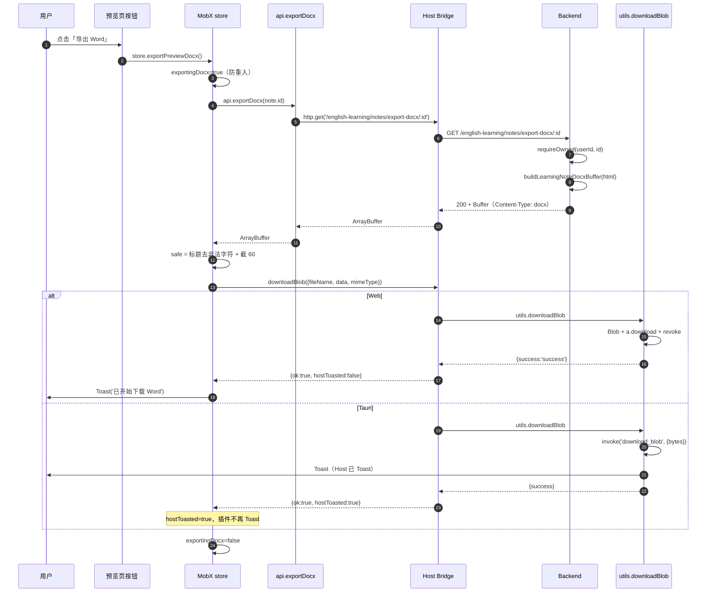

# 学习笔记富文本导出 Word（DOCX）— 端到端实现手册

> **状态**：已上线（从零复刻手册）| **日期**：2026-07-27 | **需求摘要**：把 TipTap 富文本笔记原样导出为带样式/图片/表格/列表的 Word（.docx）文件，并在长文场景下保证编辑/预览不卡。

## 0. 读本文你将得到什么

- 一份**从零到一**的端到端实现手册：数据库表 → 后端 HTML→DOCX 转换器 → Controller/Service → 响应拦截器短路 → Host 落盘能力 → 插件 HostBridge → iframe RPC → 插件按钮 + MobX action → 富文本编辑器（被导出内容来源）→ 长文性能优化（编辑/预览窗口化）。
- 每一步都包含 **原理 + 完整代码（带逐行中文注释） + 文件路径 + 验收要点**，照抄即可在另一个项目复刻同一功能。
- 所有代码段均来自当前仓库的真实实现，**未做伪代码化**；标注的文件路径可在仓库中直接定位。

> ⚠️ 本文目标为「教学手册」而非「规划态思路」，因此**包含完整源码**，与 `feature-implementation-idea` skill 默认的「伪代码 ≤30 行」规则不同。如仅需规划态方案，参见 [学习笔记列表导出.md](../notes/学习笔记列表导出.md)。

---

## 1. 总体架构

```mermaid
flowchart TB
    subgraph FE["前端（React + TipTap）"]
        UI["笔记预览页 + 导出按钮<br/>apps/remote-plugins/src/views/learning-notes/index.tsx"]
        Store["MobX store.exportPreviewDocx<br/>apps/remote-plugins/src/store/learningNotes.ts"]
        Api["api.exportDocx(id)<br/>apps/remote-plugins/src/views/learning-notes/api.ts"]
    end

    subgraph HOST["Host 主站（React + Tauri）"]
        Bridge["createHostBridge.downloadBlob<br/>apps/frontend/src/plugins/core/createHostBridge.ts"]
        Iframe["attachIframeBridge.dispatchRpc<br/>apps/frontend/src/plugins/core/attachIframeBridge.ts"]
        Util["utils.downloadBlob<br/>apps/frontend/src/utils/index.ts"]
        Tauri["Rust download_blob 命令"]
    end

    subgraph BE["后端（NestJS + TypeORM + docx）"]
        Ctl["LearningNotesController.exportDocx<br/>apps/backend/src/services/learning-notes/learning-notes.controller.ts"]
        Svc["LearningNotesService.exportDocxBuffer<br/>apps/backend/src/services/learning-notes/learning-notes.service.ts"]
        Builder["buildLearningNoteDocxBuffer<br/>apps/backend/src/services/learning-notes/learning-note-docx.builder.ts"]
        DB[("english_learning_note<br/>longtext content")]
    end

    UI -->|点击| Store
    Store --> Api
    Api -->|"http.get('/english-learning/notes/export-docx/:id')"| Bridge
    Bridge --> Iframe
    Bridge --> Util
    Util -->|Web: a.download| FS1[("浏览器落盘")]
    Util -->|Tauri: invoke| Tauri --> FS2[("系统落盘")]
    Api -.iframe 模式.-> Iframe
    Bridge -->|HTTP| Ctl
    Ctl --> Svc
    Svc --> Builder
    Svc --> DB
    Builder -->|res.end(Buffer)| Ctl
    Ctl -.二进制流.-> Api
```

### 图内方法说明

| 方法 | 文件位置 | 做什么 | 输入 / 输出 |
| --- | --- | --- | --- |
| `LearningNotesController.exportDocx` | `learning-notes.controller.ts` | 接收导出请求，写 Content-Type/Disposition/Length，`res.end(buf)` 直出二进制 | `id: UUID` → `void`（写 res） |
| `LearningNotesService.exportDocxBuffer` | `learning-notes.service.ts` | 归属校验 + 体积上限 + 调 builder + 异常转 `BadRequestException` | `userId, id` → `Buffer` |
| `buildLearningNoteDocxBuffer` | `learning-note-docx.builder.ts` | HTML → DOCX Buffer：剥标题 div、扫顶层块、行内样式、图片、表格、列表 | `{ title, html }` → `Buffer` |
| `createHostBridge.downloadBlob` | `createHostBridge.ts` | Host 把插件传入的字节包成 Blob，委托 `utils.downloadBlob` 落盘 | `{ fileName, data, mimeType }` → `{ ok, hostToasted, message }` |
| `attachIframeBridge.dispatchRpc` | `attachIframeBridge.ts` | iframe 经 `postMessage` 调 Host `ui.downloadBlob` | `method+args` → `Promise<unknown>` |
| `utils.downloadBlob` | `apps/frontend/src/utils/index.ts` | Web 走 `<a download>`，Tauri 走 `invoke('download_blob')` | `{ file_name, id, overwrite }, blobData` → `{ success, message, id }` |
| `store.exportPreviewDocx` | `learningNotes.ts` | MobX action：拉 ArrayBuffer → 生成安全文件名 → 调 `downloadBlob` → 据 `hostToasted` 决定是否 Toast | `void` → `Promise<void>` |
| `api.exportDocx` | `api.ts` | `http.get` 拉 ArrayBuffer，兼容被包一层 `{data}` 的情况 | `id` → `ArrayBuffer` |

### 读图要点

- 整条链路跨 **3 个进程边界**：插件 ↔ Host（postMessage RPC） ↔ 后端（HTTP）。其中 iframe 模式下插件拿不到 `fetch`，必须走 Host 透传的 `http.get`。
- 后端用 `@Res() res: Response` 直写二进制并 `res.end(buf)`，绕过 NestJS 默认 JSON 序列化；`ResponseInterceptor` 检测到 `headersSent/writableEnded` 时短路，不再包 `{data, code, message}`。
- 落盘分两路：Web 用 `URL.createObjectURL` + `<a download>`，Tauri 用 Rust 命令 `download_blob`。`hostToasted` 协议避免 Tauri 端 Host 与插件重复 Toast。

---

## 2. 主流程时序图



### 图内方法说明

| 方法 | 输入 | 输出 | 职责 |
| --- | --- | --- | --- |
| `requireOwned` | `userId, id` | `EnglishLearningNote` | 走 `noteRepo.findOne({where:{id,userId}})`；找不到抛 `NotFoundException('笔记不存在')` |
| `buildLearningNoteDocxBuffer` | `{title, html}` | `Buffer` | HTML → DOCX Buffer，详见 §5 |
| `exportDocx` (api) | `id` | `ArrayBuffer` | `http.get(`${BASE}/export-docx/${id}`)`；`unwrapData` 兼容 `{data}` 包裹 |
| `downloadBlob` (Host) | `{fileName, data, mimeType}` | `{ok, hostToasted, message}` | 把字节包 Blob 委托 `utils.downloadBlob`；`hostToasted = isTauriRuntime()` |

### 读图要点

- **防重入**：`store.exportingDocx` 在调接口前置 `true`，按钮 `disabled`；`finally` 中 `runInAction(() => this.exportingDocx = false)`。
- **Toast 责任划分**：Tauri 端 Host `downloadBlob` 内部已 Toast（成功/失败都 Toast），用 `hostToasted: true` 告知插件别再弹；Web 端 Host 不 Toast，由插件弹成功提示，失败两边都弹一次（Host 不弹，插件弹）。
- **文件名规则**：`${safe}-${Date.now()}.docx`，其中 `safe = note.title.replace(/[\\/:*?"<>|]+/g, '_').trim().slice(0, 60) || 'learning-note'`，避免 Windows 非法字符 + 时间戳防同名覆盖。

---

## 3. 现状与复用

| 能力 | 已有位置 | 本需求用法 |
| --- | --- | --- |
| 主站通用 `downloadBlob` | `apps/frontend/src/utils/index.ts` L367 | Host Bridge 内直接复用，统一 Web/Tauri 落盘 |
| 收藏导出 DOCX | `apps/frontend/src/service/index.ts` L1649 | 同源参考（文件名规则、Toast 协议） |
| TipTap 富文本 | `apps/remote-plugins/src/components/design/RichEditor/` | 笔记内容来源；HTML 即导出输入 |
| HostBridge 权限模型 | `apps/frontend/src/plugins/core/types.ts` | `downloadBlob` 复用 `ui:toast` 权限组 |
| iframe RPC 通道 | `apps/frontend/src/plugins/core/attachIframeBridge.ts` | 新增 `ui.downloadBlob` RPC 分支 |
| `docx` 库 | `apps/backend/package.json` `docx@^9.5.0` | 后端 HTML→DOCX 转换核心 |

---

## 4. M1 — 数据模型与 DTO

### 4.1 实体定义

**文件**：[apps/backend/src/services/learning-notes/english-learning-note.entity.ts](../../apps/backend/src/services/learning-notes/english-learning-note.entity.ts)

```typescript
import {
	Column,
	CreateDateColumn,
	Entity,
	Index,
	PrimaryGeneratedColumn,
	UpdateDateColumn,
} from 'typeorm';

/** 英语学习 · 学习笔记（富文本 HTML） */
@Entity({ name: 'english_learning_note' })
// 复合索引：列表分页按 (userId, updatedAt DESC) 查询
@Index('IDX_eln_user_updated', ['userId', 'updatedAt'])
export class EnglishLearningNote {
	// UUID 主键，前端接口直接用 id 字符串
	@PrimaryGeneratedColumn('uuid')
	id!: string;

	// 归属用户 ID（int，与 user.entity 关联；不建外键，靠应用层校验）
	@Column({ name: 'user_id', type: 'int' })
	userId!: number;

	// 标题可为空（前端兜底为「无标题笔记」），最长 200 字符
	@Column({ type: 'varchar', length: 200, nullable: true })
	title!: string | null;

	/**
	 * TipTap 编辑器产出的 HTML 字符串。
	 * 用 longtext 而非 text：text 仅 64KB，富文本带 base64 图片很容易超。
	 * longtext 最大约 4GB，DTO 限制 5,000,000 字符（约 5MB）。
	 */
	@Column({ type: 'longtext' })
	content!: string;

	@CreateDateColumn({ name: 'created_at', type: 'timestamp' })
	createdAt!: Date;

	@UpdateDateColumn({ name: 'updated_at', type: 'timestamp' })
	updatedAt!: Date;
}
```

### 4.2 DTO（保存/更新/查询）

```typescript
// dto/save-learning-note.dto.ts
import { IsOptional, IsString, MaxLength } from 'class-validator';
export class SaveLearningNoteDto {
	@IsOptional() @IsString() @MaxLength(200)
	title?: string;
	@IsString() @MaxLength(5_000_000)  // 与导出 NOTE_DOCX_HTML_MAX_CHARS 对齐
	content!: string;
}

// dto/update-learning-note.dto.ts
import { IsUUID, IsOptional, IsString, MaxLength } from 'class-validator';
export class UpdateLearningNoteDto {
	@IsUUID()
	id!: string;
	@IsOptional() @IsString() @MaxLength(200)
	title?: string;
	@IsOptional() @IsString() @MaxLength(5_000_000)
	content?: string;
}

// dto/query-learning-note.dto.ts
import { IsInt, IsOptional, IsString, Max, Min } from 'class-validator';
export class QueryLearningNoteDto {
	@IsOptional() @IsInt() @Min(1) pageNo?: number;
	@IsOptional() @IsInt() @Min(1) @Max(100) pageSize?: number;
	@IsOptional() @IsString() title?: string;
}
```

### 4.3 Module 装配

```typescript
// learning-notes.module.ts
@Module({
	imports: [TypeOrmModule.forFeature([EnglishLearningNote])],
	controllers: [LearningNotesController],
	providers: [LearningNotesService],
})
export class LearningNotesModule {}
```

### 4.4 验收要点

- 表已建：`english_learning_note`，索引 `IDX_eln_user_updated` 存在。
- `content` 字段类型为 `longtext`（用 `SHOW CREATE TABLE` 确认）。
- DTO 限制与 builder 常量 `NOTE_DOCX_HTML_MAX_CHARS = 5_000_000` 一致。

---

## 5. M2 — 后端 HTML→DOCX 转换器（核心）

**文件**：[apps/backend/src/services/learning-notes/learning-note-docx.builder.ts](../../apps/backend/src/services/learning-notes/learning-note-docx.builder.ts)（约 1700 行单文件）

### 5.1 选型与依赖

- 使用 `docx@^9.5.0`（`apps/backend/package.json`），**不使用** `officegen` / `html-docx-js`（前者维护停滞，后者只能套 HTML 模板不能精细控制样式）。
- 图片转码额外懒加载 `sharp`（仅 webp/avif/heic 等非原生格式），失败时回退 macOS `sips`。

### 5.2 常量定义

```typescript
/** 单篇 HTML 字符上限（与 Save DTO 同量级） */
export const NOTE_DOCX_HTML_MAX_CHARS = 5_000_000;
/** 最多嵌入图片数（防止 docx 文件爆炸） */
export const NOTE_DOCX_IMAGE_MAX_COUNT = 120;
/** 单张解码后建议上限（超过仍尝试嵌入，仅缩小显示尺寸） */
export const NOTE_DOCX_IMAGE_SOFT_MAX_BYTES = 6_000_000;
/** 全部图片解码字节合计软上限 */
export const NOTE_DOCX_IMAGES_TOTAL_SOFT_MAX_BYTES = 40_000_000;
/** 正文单段文本截断（防一段过长撑爆 Word） */
const PARA_TEXT_MAX = 50_000;
/** 导出图显示最大宽（px）；超过按比例缩放 */
const IMAGE_MAX_WIDTH_PX = 640;
/** 拉取外链图超时（毫秒） */
const FETCH_TIMEOUT_MS = 20_000;
/** 表格内容区宽度（DXA，约等于 A4 页边距内可用宽；1 inch = 1440 DXA） */
const TABLE_WIDTH_DXA = 9026;
/** 对齐页面正文约 11pt；Word size 单位为 half-points，所以 22 = 11pt */
const BODY_SIZE = 22;
/** 对齐页面 line-height: 1.9（240 = 单倍行距，456 ≈ 1.9 倍） */
const BODY_LINE = 456;
/** 列表每层缩进（twip）；约等于页面 padding-left 1.5em */
const LIST_INDENT = 480;
/** 表格边框：可见细线（size 单位为 1/8 pt，8 = 1pt） */
const TABLE_BORDER: IBorderOptions = {
	style: BorderStyle.SINGLE,
	size: 8,
	color: 'BFBFBF',
};
/** 代码块无可见边框（靠底色区分） */
const CODE_BORDER: IBorderOptions = {
	style: BorderStyle.NONE,
	size: 0,
	color: 'FFFFFF',
};
/**
 * 对齐页面 `.tiptap pre { padding: 0.75em 1em }`（约 14px 字号 → px×15≈twip）。
 * 水平用段落 indent（各端 Word/WPS 都认）；垂直用空段撑开。
 * ponytail: 不依赖 tcMar——部分客户端会忽略单元格边距，看起来贴左边。
 */
const CODE_PAD_H = 210;
const CODE_PAD_V_LINE = 200;
/** 代码块底色（浅灰，接近页面预览） */
const CODE_BG = 'F3F3F3';
```

### 5.3 工具函数：实体解码 / 属性解析 / 颜色 / 对齐

```typescript
/** 字符串截断加 …；用于标题、单段超长 */
function clip(s: string, max: number): string {
	if (!s) return '';
	return s.length <= max ? s : `${s.slice(0, max)}…`;
}

/** HTML 实体解码（不引 he/validator，零依赖） */
function decodeEntities(s: string): string {
	return s
		.replace(/&nbsp;/gi, ' ')
		.replace(/&amp;/gi, '&')
		.replace(/&lt;/gi, '<')
		.replace(/&gt;/gi, '>')
		.replace(/&quot;/gi, '"')
		.replace(/&#39;/gi, "'")
		.replace(/&#(\d+);/g, (_, n) => String.fromCharCode(Number(n)))
		.replace(/&#x([0-9a-f]+);/gi, (_, h) =>
			String.fromCharCode(Number.parseInt(h, 16)),
		);
}

/** 从标签原始字符串里抽属性（兼容单/双引号、无引号） */
function parseAttrs(raw: string): Record<string, string> {
	const attrs: Record<string, string> = {};
	const re = /([:@\w.-]+)\s*=\s*(?:"([^"]*)"|'([^']*)'|([^\s>]+))/g;
	let m: RegExpExecArray | null;
	while ((m = re.exec(raw)) !== null) {
		attrs[m[1].toLowerCase()] = decodeEntities(m[2] ?? m[3] ?? m[4] ?? '');
	}
	return attrs;
}

/** 把 style="a:b;c:d" 解析成 {a:'b', c:'d'} */
function styleMap(style: string | undefined): Record<string, string> {
	const out: Record<string, string> = {};
	if (!style) return out;
	for (const part of style.split(';')) {
		const i = part.indexOf(':');
		if (i < 0) continue;
		const k = part.slice(0, i).trim().toLowerCase();
		const v = part.slice(i + 1).trim();
		if (k) out[k] = v;
	}
	return out;
}

/** CSS 颜色字符串 → Word 6 位 HEX（无 #）；不支持返回 undefined */
function cssColorToHex(input: string | undefined): string | undefined {
	if (!input) return undefined;
	const s = input.trim().toLowerCase();
	// 支持 #RGB / #RRGGBB / #RRGGBBAA
	const hex = /^#([0-9a-f]{3}|[0-9a-f]{6}|[0-9a-f]{8})$/i.exec(s);
	if (hex) {
		const h = hex[1];
		if (h.length === 3)
			return `${h[0]}${h[0]}${h[1]}${h[1]}${h[2]}${h[2]}`.toUpperCase();
		return h.slice(0, 6).toUpperCase();
	}
	// 支持 rgb()/rgba()
	const rgb = /^rgba?\(\s*(\d+)\s*,\s*(\d+)\s*,\s*(\d+)/i.exec(s);
	if (rgb) {
		const to = (n: string) =>
			Math.max(0, Math.min(255, Number(n)))
				.toString(16)
				.padStart(2, '0');
		return `${to(rgb[1])}${to(rgb[2])}${to(rgb[3])}`.toUpperCase();
	}
	return undefined;
}

/**
 * 从 attrs.style 或 attrs.align 读 text-align → docx AlignmentType。
 * 兼容 logical（start/end）→ 物理（left/right）。
 */
function readAlign(
	attrs: Record<string, string>,
): (typeof AlignmentType)[keyof typeof AlignmentType] | undefined {
	const styles = styleMap(attrs.style);
	const align = (styles['text-align'] || attrs.align || '').toLowerCase();
	if (align === 'center') return AlignmentType.CENTER;
	if (align === 'right' || align === 'end') return AlignmentType.RIGHT;
	if (align === 'justify' || align === 'both') return AlignmentType.JUSTIFIED;
	if (align === 'left' || align === 'start') return AlignmentType.LEFT;
	return undefined;
}
```

### 5.4 图片字节加载（三级回退）

```typescript
/** data: URL → {mime, buf}；仅 base64 */
function parseDataUrl(src: string): { mime: string; buf: Buffer } | null {
	const m =
		/^data:(image\/[a-z0-9.+-]+)((?:;[\w.=+-]+)*)?(;base64),([\s\S]+)$/i.exec(
			src.trim(),
		);
	if (!m?.[3]) return null;
	try {
		const buf = Buffer.from(m[4].replace(/\s+/g, ''), 'base64');
		if (!buf.length) return null;
		return { mime: m[1].toLowerCase(), buf };
	} catch {
		return null;
	}
}

/** 外链图：fetch + AbortController 20s 超时 */
async function fetchRemoteImage(
	url: string,
): Promise<{ mime: string; buf: Buffer } | null> {
	let parsed: URL;
	try {
		parsed = new URL(url);
	} catch {
		return null;
	}
	if (parsed.protocol !== 'http:' && parsed.protocol !== 'https:') return null;
	const ac = new AbortController();
	const timer = setTimeout(() => ac.abort(), FETCH_TIMEOUT_MS);
	try {
		const res = await fetch(url, {
			signal: ac.signal,
			redirect: 'follow',
			headers: { Accept: 'image/*,*/*;q=0.8' },
		});
		if (!res.ok) return null;
		const mime =
			(res.headers.get('content-type') || '').split(';')[0].trim() ||
			'application/octet-stream';
		const buf = Buffer.from(await res.arrayBuffer());
		if (!buf.length) return null;
		return { mime, buf };
	} catch {
		return null;
	} finally {
		clearTimeout(timer);
	}
}

/**
 * 从绝对/相对 URL 抽出本机 uploads 公开路径（/images|files|remotes/...）。
 * 生产机自拉公网常因 hairpin/反代失败；优先读盘比 fetch 稳。
 */
function extractUploadPublicPath(src: string): string | null {
	const trimmed = src.trim();
	if (!trimmed) return null;
	try {
		const asUrl = /^https?:\/\//i.test(trimmed)
			? new URL(trimmed)
			: new URL(trimmed, 'http://local.invalid');
		// 兼容 /api/upload/serve?path=... 形式
		const servePath =
			/\/upload\/serve\/?$/i.test(asUrl.pathname) ||
			/\/api\/upload\/serve\/?$/i.test(asUrl.pathname)
				? asUrl.searchParams.get('path')
				: null;
		if (servePath?.trim()) {
			return decodeUploadPublicPath(servePath);
		}
		if (/^\/(images|files|remotes)\//.test(asUrl.pathname)) {
			return decodeUploadPublicPath(asUrl.pathname);
		}
	} catch {
		/* fall through */
	}
	if (/^\/(images|files|remotes)\//.test(trimmed.split('?')[0])) {
		return decodeUploadPublicPath(trimmed.split('?')[0]);
	}
	return null;
}

/** 直接读盘本机上传文件，避开 hairpin NAT */
async function tryReadLocalUpload(
	src: string,
): Promise<{ mime: string; buf: Buffer } | null> {
	const publicPath = extractUploadPublicPath(src);
	if (!publicPath) return null;
	try {
		const { existsSync } = await import('node:fs');
		const { readFile } = await import('node:fs/promises');
		const { extname } = await import('node:path');
		const abs = resolveUploadPublicPathToAbsolute(publicPath);
		if (!existsSync(abs)) return null;
		const buf = await readFile(abs);
		if (!buf.length) return null;
		const mime =
			MIME_BY_EXT[extname(abs).toLowerCase()] ?? 'application/octet-stream';
		return { mime, buf };
	} catch {
		return null;
	}
}

/** 统一入口：data URL → 本机读盘 → 外链 fetch */
async function loadImageBytes(
	src: string,
): Promise<{ mime: string; buf: Buffer } | null> {
	if (/^data:/i.test(src)) return parseDataUrl(src);
	const local = await tryReadLocalUpload(src);
	if (local) return local;
	if (/^https?:\/\//i.test(src)) return fetchRemoteImage(src);
	return null;
}
```

### 5.5 图片格式识别与转码

```typescript
type ImgType = 'jpg' | 'png' | 'gif' | 'bmp';

/** 通过 MIME 推断图片类型 */
function mimeToType(mime: string): ImgType | 'webp' | null {
	const m = mime.toLowerCase();
	if (m.includes('png')) return 'png';
	if (m.includes('jpeg') || m.includes('jpg')) return 'jpg';
	if (m.includes('gif')) return 'gif';
	if (m.includes('bmp')) return 'bmp';
	if (m.includes('webp')) return 'webp';
	return null;
}

/** 通过文件头魔数嗅探类型（防止 mime 撒谎） */
function sniffType(buf: Buffer): ImgType | 'webp' | null {
	if (buf.length >= 3 && buf[0] === 0xff && buf[1] === 0xd8 && buf[2] === 0xff)
		return 'jpg';
	if (buf.length >= 8 && buf[0] === 0x89 && buf[1] === 0x50) return 'png';
	if (buf.length >= 6 && buf[0] === 0x47 && buf[1] === 0x49) return 'gif';
	if (buf.length >= 2 && buf[0] === 0x42 && buf[1] === 0x4d) return 'bmp';
	if (
		buf.length >= 12 &&
		buf.toString('ascii', 0, 4) === 'RIFF' &&
		buf.toString('ascii', 8, 12) === 'WEBP'
	)
		return 'webp';
	return null;
}

// 各格式头尺寸解析：pngSize/jpegSize/gifSize/webpSize（按二进制头读宽高，省去 image-size 依赖）
function imageSize(
	buf: Buffer,
	kind: ImgType | 'webp',
): { w: number; h: number } {
	const dim =
		kind === 'png'
			? pngSize(buf)
			: kind === 'jpg'
				? jpegSize(buf)
				: kind === 'gif'
					? gifSize(buf)
					: kind === 'webp'
						? webpSize(buf)
						: null;
	// 读不出尺寸时给个 4:3 默认值，保证能嵌入
	return (
		dim ?? { w: IMAGE_MAX_WIDTH_PX, h: Math.round(IMAGE_MAX_WIDTH_PX * 0.75) }
	);
}

/** 按最大宽等比缩放 */
function scaleSize(w: number, h: number): { width: number; height: number } {
	if (w <= IMAGE_MAX_WIDTH_PX) return { width: w, height: Math.max(1, h) };
	const height = Math.max(1, Math.round((h * IMAGE_MAX_WIDTH_PX) / w));
	return { width: IMAGE_MAX_WIDTH_PX, height };
}

/**
 * Word 只稳吃 jpg/png/gif/bmp。webp/avif/heic 等经 sharp 转 JPEG。
 * 懒加载 sharp：不能顶层 require——生产 Node18 装错版本时会拖垮整个进程。
 * sharp 需 ≤0.33.x（支持 Node 18）；0.35+ 要求 Node ≥20.9。
 */
async function rasterToJpeg(buf: Buffer): Promise<Buffer | null> {
	try {
		// ponytail: 延迟 require，启动路径与 sharp 解耦
		const mod = require('sharp') as
			| ((input: Buffer) => {
					rotate: () => {
						jpeg: (o: { quality: number }) => {
							toBuffer: () => Promise<Buffer>;
						};
					};
			  })
			| {
					default: (input: Buffer) => {
						rotate: () => {
							jpeg: (o: { quality: number }) => {
								toBuffer: () => Promise<Buffer>;
							};
						};
					};
			  };
		const sharpFn = typeof mod === 'function' ? mod : mod.default;
		if (typeof sharpFn !== 'function') throw new Error('sharp unavailable');
		return await sharpFn(buf).rotate().jpeg({ quality: 90 }).toBuffer();
	} catch {
		/* fall through to sips（仅 macOS 本机开发兜底） */
	}
	// macOS 兜底：调系统自带 sips 命令转 JPEG
	try {
		const { mkdtemp, writeFile, readFile, rm } = await import(
			'node:fs/promises'
		);
		const { tmpdir } = await import('node:os');
		const { join } = await import('node:path');
		const { execFile } = await import('node:child_process');
		const { promisify } = await import('node:util');
		const execFileAsync = promisify(execFile);
		const dir = await mkdtemp(join(tmpdir(), 'note-img-'));
		const inPath = join(dir, 'in.bin');
		const outPath = join(dir, 'out.jpg');
		try {
			await writeFile(inPath, buf);
			await execFileAsync(
				'sips',
				['-s', 'format', 'jpeg', inPath, '--out', outPath],
				{ timeout: 15_000 },
			);
			return await readFile(outPath);
		} finally {
			await rm(dir, { recursive: true, force: true }).catch(() => undefined);
		}
	} catch {
		return null;
	}
}

/** 综合 mime + 嗅探决定 docx 嵌入类型；image/* 但 Word 不认 → 'foreign' 交 sharp */
function docxNativeKind(
	mime: string,
	buf: Buffer,
): ImgType | 'webp' | 'foreign' | null {
	const fromMime = mimeToType(mime);
	if (fromMime) return fromMime;
	const sniffed = sniffType(buf);
	if (sniffed) return sniffed;
	if (mime.startsWith('image/')) return 'foreign';
	return null;
}
```

### 5.6 图片预算与单图转换

```typescript
/** 全局图片预算：累计数量/字节/跳过原因，避免单次导出失控 */
type ImageBudget = {
	count: number;
	bytes: number;
	skipped: number;
	/** 跳过原因（最多记 6 条，写入页脚便于线上排查） */
	reasons: string[];
};

/** 跳过单张图：累加计数 + 记原因，返回 null 让外层写占位文字 */
function skipImage(budget: ImageBudget, reason: string): null {
	budget.skipped += 1;
	if (budget.reasons.length < 6) budget.reasons.push(reason);
	return null;
}

/** 单张图 → docx ImageRun；超限/读失败/转码失败 → null */
async function toDocxImage(
	src: string,
	budget: ImageBudget,
): Promise<ParagraphChild | null> {
	// 数量上限
	if (budget.count >= NOTE_DOCX_IMAGE_MAX_COUNT) {
		return skipImage(budget, '超过图片数量上限');
	}
	const preview = src.trim().slice(0, 48);
	const loaded = await loadImageBytes(src);
	if (!loaded) {
		return skipImage(
			budget,
			`无法读取(${preview}${src.length > 48 ? '…' : ''})`,
		);
	}
	let { mime, buf } = loaded;
	let kind = docxNativeKind(mime, buf);
	if (!kind) {
		return skipImage(budget, `无法识别格式(${mime || 'unknown'})`);
	}
	// webp/avif/heic → jpeg
	if (kind === 'webp' || kind === 'foreign') {
		const jpeg = await rasterToJpeg(buf);
		if (!jpeg) {
			return skipImage(budget, `转JPEG失败(${mime || kind})`);
		}
		buf = jpeg;
		kind = 'jpg';
	}
	// 单图硬上限（15MB），防止 docx 文件爆炸
	if (buf.length > 15_000_000) {
		return skipImage(budget, '单图过大');
	}
	const dim = imageSize(buf, kind);
	const transformation = scaleSize(dim.w, dim.h);
	budget.count += 1;
	budget.bytes += buf.length;
	return new ImageRun({ type: kind, data: buf, transformation });
}
```

### 5.7 行内样式状态机

```typescript
/** 行内样式合并结果（传给 TextRun） */
type InlineStyle = {
	bold?: boolean;
	italics?: boolean;
	underline?: boolean;
	strike?: boolean;
	code?: boolean;
	color?: string;
	highlight?: string;
	href?: string;
	/** Word half-points；未设则沿用正文默认 */
	size?: number;
};

/**
 * 把一段 HTML 转成带样式的 runs（遇 img 返回占位，由外层拆段）
 * - 维护 tagStack + InlineStyle 栈：开标签 push，闭标签 pop
 * - 支持 strong/b/em/i/u/s/del/strike/code/mark/a + span 的 style/color/...
 * - 遇  拆段返回 { type:'img', src }，让外层走图片段落
 */
function htmlToStyledRuns(
	html: string,
	baseStyle: InlineStyle = {},
): Array<
	{ type: 'runs'; children: ParagraphChild[] } | { type: 'img'; src: string }
> {
	const segments: Array<
		{ type: 'runs'; children: ParagraphChild[] } | { type: 'img'; src: string }
	> = [];
	let current: ParagraphChild[] = [];
	const stack: InlineStyle[] = [baseStyle];
	const tagStack: OpenTag[] = [];

	const flushRuns = () => {
		if (current.length) {
			segments.push({ type: 'runs', children: current });
			current = [];
		}
	};
	const styleNow = () => stack[stack.length - 1] ?? {};

	let i = 0;
	while (i < html.length) {
		// 文本节点
		if (html[i] !== '<') {
			const next = html.indexOf('<', i);
			const raw = next < 0 ? html.slice(i) : html.slice(i, next);
			pushText(current, decodeEntities(raw), styleNow());
			i = next < 0 ? html.length : next;
			continue;
		}
		// 标签
		const end = html.indexOf('>', i);
		if (end < 0) break;
		const rawTag = html.slice(i + 1, end);
		i = end + 1;
		if (rawTag.startsWith('!--')) continue;  // 注释
		const selfClosing = rawTag.endsWith('/');
		const body = selfClosing ? rawTag.slice(0, -1).trim() : rawTag.trim();
		if (!body) continue;

		// 闭标签：从 tagStack 顶往下找到匹配名，全部 pop（容错未闭合）
		if (body.startsWith('/')) {
			const name = body.slice(1).trim().toLowerCase().split(/\s+/)[0];
			while (tagStack.length) {
				const top = tagStack.pop()!;
				stack.pop();
				if (top.name === name) break;
			}
			continue;
		}

		const nameMatch = /^([a-z0-9-]+)/i.exec(body);
		if (!nameMatch) continue;
		const name = nameMatch[1].toLowerCase();
		const attrs = parseAttrs(body.slice(nameMatch[0].length));

		// <br> 当换行
		if (name === 'br') {
			pushText(current, '\n', styleNow());
			continue;
		}
		//  拆段
		if (name === 'img') {
			const src = attrs.src?.trim();
			if (src) {
				flushRuns();
				segments.push({ type: 'img', src });
			}
			continue;
		}
		// <hr> 忽略（外层 splitTopBlocks 已拆出）
		if (name === 'hr') continue;

		// HTML void 标签
		const voidTags = new Set([
			'area','base','col','embed','input','link','meta','param','source','track','wbr',
		]);
		if (selfClosing || voidTags.has(name)) continue;

		// 累加样式到 next
		const prev = styleNow();
		const next = { ...prev };
		const styles = styleMap(attrs.style);
		if (name === 'strong' || name === 'b') next.bold = true;
		if (name === 'em' || name === 'i') next.italics = true;
		if (name === 'u') next.underline = true;
		if (name === 's' || name === 'del' || name === 'strike') next.strike = true;
		if (name === 'code') next.code = true;
		if (name === 'mark') {
			next.highlight =
				cssColorToHex(attrs['data-color']) ||
				cssColorToHex(styles['background-color']) ||
				'FFEB3B';  // 默认黄色
		}
		if (name === 'a' && attrs.href) {
			next.href = attrs.href;
			next.underline = true;
		}
		if (styles.color) {
			const c = cssColorToHex(styles.color);
			if (c) next.color = c;
		}
		if (styles['background-color'] && name !== 'mark') {
			const h = cssColorToHex(styles['background-color']);
			if (h) next.highlight = h;
		}
		// span 上的 text-decoration / font-weight / font-style
		const deco = (styles['text-decoration'] || '').toLowerCase();
		if (deco.includes('underline')) next.underline = true;
		if (deco.includes('line-through')) next.strike = true;
		const weight = (styles['font-weight'] || '').toLowerCase();
		if (weight === 'bold' || Number(weight) >= 600) next.bold = true;
		const fs = (styles['font-style'] || '').toLowerCase();
		if (fs === 'italic') next.italics = true;

		tagStack.push({ name, attrs });
		stack.push(mergeStyle(prev, next));
	}

	flushRuns();
	return segments;
}
```

### 5.8 块级视觉映射（对齐 CSS）

```typescript
/**
 * 对齐 remote-plugins RichEditor/styles.css 的块级视觉。
 * 不用 Word 内置 Heading 样式，避免 Word 自动套蓝字主题。
 * 字号按 body 11pt × CSS em 估算（Word size = half-points）。
 */
type BlockVisual = {
	spacing?: ISpacingProperties;
	indent?: { left?: number };
	border?: IBordersOptions;
	baseRun?: InlineStyle;
};

function blockVisual(tag: string): BlockVisual {
	// 正文段：line 1.9（456），上下 40 twip ≈ 2px
	const bodySpacing: ISpacingProperties = {
		before: 40,
		after: 40,
		line: BODY_LINE,
		lineRule: LineRuleType.AUTO,
	};
	switch (tag) {
		case 'h1':
			return { spacing: { before: 160, after: 100, line: 312, lineRule: LineRuleType.AUTO }, baseRun: { bold: true, size: 40, color: '1A1A1A' } };
		case 'h2':
			return { spacing: { before: 140, after: 90, line: 324, lineRule: LineRuleType.AUTO }, baseRun: { bold: true, size: 37, color: '1A1A1A' } };
		case 'h3':
			return { spacing: { before: 120, after: 80, line: 336, lineRule: LineRuleType.AUTO }, baseRun: { bold: true, size: 33, color: '1A1A1A' } };
		case 'h4':
			return { spacing: { before: 100, after: 70, line: 336, lineRule: LineRuleType.AUTO }, baseRun: { bold: true, size: 30, color: '1A1A1A' } };
		case 'h5':
		case 'h6':
			return { spacing: { before: 90, after: 60, line: 348, lineRule: LineRuleType.AUTO }, baseRun: { bold: true, size: 26, color: '1A1A1A' } };
		case 'blockquote':
			// 引用块：左侧粗灰线 + 缩进 + 灰字
			return {
				spacing: bodySpacing,
				indent: { left: 120 },
				border: { left: { style: BorderStyle.SINGLE, size: 24, color: 'C8C8C8', space: 14 } },
				baseRun: { color: '666666' },
			};
		default:
			return { spacing: bodySpacing };
	}
}
```

### 5.9 TextRun 属性生成

```typescript
/** InlineStyle → docx IRunStylePropertiesOptions */
function runProps(style: InlineStyle): IRunStylePropertiesOptions {
	// 行内代码字号略小（×0.875，下限 16 = 8pt）
	const codeSize = style.size
		? Math.max(16, Math.round(style.size * 0.875))
		: 18;
	return {
		...(style.bold ? { bold: true } : {}),
		...(style.italics ? { italics: true } : {}),
		// 有 href 强制下划线（与浏览器默认一致）
		...(style.underline || style.href
			? { underline: { type: UnderlineType.SINGLE } }
			: {}),
		...(style.strike ? { strike: true } : {}),
		// 非 code 段才用 size；code 段统一用 codeSize
		...(style.size && !style.code ? { size: style.size } : {}),
		// 行内 code：Courier New + 浅灰底
		...(style.code
			? {
					font: 'Courier New',
					size: codeSize,
					shading: { type: ShadingType.CLEAR, fill: 'F0F0F0' },
				}
			: {}),
		// 链接色优先于自定义 color（与 Word 默认链接色一致）
		...(style.href
			? { color: '0563C1' }
			: style.color
				? { color: style.color }
				: {}),
		// 高亮底色（code 段已自带底色，不重复）
		...(style.highlight && !style.code
			? { shading: { type: ShadingType.CLEAR, fill: style.highlight } }
			: {}),
	};
}

function makeTextRun(text: string, style: InlineStyle): TextRun {
	return new TextRun({ text: clip(text, PARA_TEXT_MAX), ...runProps(style) });
}

/** 把文本包成 TextRun/ExternalHyperlink 推入段落 children */
function pushText(
	out: ParagraphChild[],
	text: string,
	style: InlineStyle,
): void {
	if (!text) return;
	const run = makeTextRun(text, style);
	if (style.href) {
		// 链接补协议
		let link = style.href.trim();
		if (link && !/^https?:\/\//i.test(link) && !/^mailto:/i.test(link)) {
			link = `https://${link}`;
		}
		out.push(new ExternalHyperlink({ link, children: [run] }));
		return;
	}
	out.push(run);
}
```

### 5.10 顶层块扫描器

```typescript
type Block =
	| { kind: 'el'; tag: string; attrs: Record<string, string>; inner: string }
	| { kind: 'img'; src: string }
	| { kind: 'hr' };

/**
 * 顶层块扫描（尊重 ul/ol/pre 嵌套，不把内部 p 提前拆出）。
 * 手写扫描器而非 DOM：node-html-parser 在 5MB 长文下内存爆炸。
 */
function splitTopBlocks(html: string): Block[] {
	const blocks: Block[] = [];
	let i = 0;
	const s = html;

	const skipWs = () => {
		while (i < s.length && /\s/.test(s[i])) i += 1;
	};

	while (i < s.length) {
		skipWs();
		if (i >= s.length) break;
		// 裸文本（无外层标签）→ 包成 <p>
		if (s[i] !== '<') {
			const next = s.indexOf('<', i);
			const text = (next < 0 ? s.slice(i) : s.slice(i, next)).trim();
			if (text) blocks.push({ kind: 'el', tag: 'p', attrs: {}, inner: text });
			i = next < 0 ? s.length : next;
			continue;
		}
		const end = s.indexOf('>', i);
		if (end < 0) break;
		const raw = s.slice(i + 1, end);
		i = end + 1;
		if (raw.startsWith('!--') || raw.startsWith('/')) continue;
		const selfClosing = raw.endsWith('/');
		const body = (selfClosing ? raw.slice(0, -1) : raw).trim();
		const nameMatch = /^([a-z0-9-]+)/i.exec(body);
		if (!nameMatch) continue;
		const tag = nameMatch[1].toLowerCase();
		const attrs = parseAttrs(body.slice(nameMatch[0].length));

		if (tag === 'img') {
			const src = attrs.src?.trim();
			if (src) blocks.push({ kind: 'img', src });
			continue;
		}
		if (tag === 'hr') {
			blocks.push({ kind: 'hr' });
			continue;
		}
		if (tag === 'br') {
			blocks.push({ kind: 'el', tag: 'p', attrs: {}, inner: '' });
			continue;
		}

		// 找匹配闭合标签（简单深度计数，支持嵌套同名标签）
		const openRe = new RegExp(`<${tag}\\b[^>]*>`, 'gi');
		const closeRe = new RegExp(`</${tag}\\s*>`, 'gi');
		let depth = 1;
		let cursor = i;
		let innerEnd = s.length;
		while (cursor < s.length && depth > 0) {
			openRe.lastIndex = cursor;
			closeRe.lastIndex = cursor;
			const openM = openRe.exec(s);
			const closeM = closeRe.exec(s);
			if (!closeM) break;
			if (openM && openM.index < closeM.index) {
				depth += 1;
				cursor = openM.index + openM[0].length;
			} else {
				depth -= 1;
				if (depth === 0) {
					innerEnd = closeM.index;
					i = closeM.index + closeM[0].length;
					break;
				}
				cursor = closeM.index + closeM[0].length;
			}
		}
		const inner = s.slice(end + 1, depth === 0 ? innerEnd : s.length);
		if (depth !== 0) i = s.length;

		// 已知块级标签整块吃；未知容器（tbody/tr/td 等）展开内部
		if (
			['p','h1','h2','h3','h4','h5','h6','blockquote','pre','ul','ol','div','li','table'].includes(tag)
		) {
			blocks.push({ kind: 'el', tag, attrs, inner });
		} else {
			blocks.push(...splitTopBlocks(inner));
		}
	}
	return blocks;
}
```

### 5.11 表格与代码块生成

```typescript
/** 按深度匹配提取指定标签（跳过其它开标签，便于扫 table 内的 tr/td） */
function extractClosedElements(
	html: string,
	tags: Set<string>,
): Array<{ tag: string; attrs: Record<string, string>; inner: string }> {
	// 实现与 splitTopBlocks 同思路的深度计数器，仅收集 tags 中的标签
	// ...（详见源文件 L997-L1057）
}

type HtmlTableCell = {
	tag: 'td' | 'th';
	attrs: Record<string, string>;
	inner: string;
};

/** 解析 HTML 表格 → 二维数组（支持 colspan/rowspan） */
function parseHtmlTable(inner: string): HtmlTableCell[][] {
	return extractClosedElements(inner, new Set(['tr']))
		.map((row) =>
			extractClosedElements(row.inner, new Set(['td', 'th'])).map((c) => ({
				tag: (c.tag === 'th' ? 'th' : 'td') as 'td' | 'th',
				attrs: c.attrs,
				inner: c.inner,
			})),
		)
		.filter((r) => r.length > 0);
}

/** HTML <table> → docx Table（含 colspan/rowspan、表头底色） */
async function tableFromHtml(
	inner: string,
	budget: ImageBudget,
): Promise<Table | null> {
	const rowDatas = parseHtmlTable(inner);
	if (rowDatas.length === 0) return null;

	// 列数 = 所有行 colspan 之和的最大值
	const colCount = Math.max(
		1,
		...rowDatas.map((r) =>
			r.reduce((n, c) => n + Math.max(1, Number(c.attrs.colspan) || 1), 0),
		),
	);
	const colW = Math.max(1, Math.floor(TABLE_WIDTH_DXA / colCount));

	const rows: TableRow[] = [];
	for (const row of rowDatas) {
		const cells: TableCell[] = [];
		for (const cell of row) {
			const isHeader = cell.tag === 'th';
			const colspan = Math.max(1, Number(cell.attrs.colspan) || 1);
			const rowspan = Math.max(1, Number(cell.attrs.rowspan) || 1);
			const blocks = splitTopBlocks(cell.inner);
			const children: DocxChild[] = [];
			if (blocks.length === 0) {
				children.push(new Paragraph({
					children: [new TextRun({ text: '', ...(isHeader ? { bold: true } : {}) })],
				}));
			} else {
				for (const b of blocks) {
					if (b.kind !== 'el') {
						children.push(...(await blocksToDocxChildren([b], budget)));
						continue;
					}
					if (['table','ul','ol','div'].includes(b.tag)) {
						children.push(...(await blocksToDocxChildren([b], budget)));
						continue;
					}
					// 表头单元格强制加粗（包一层 font-weight:700 span）
					children.push(...(await paragraphsFromStyledInner(
						{
							tag: b.tag,
							attrs: b.attrs,
							inner: isHeader
								? `<span style="font-weight:700">${b.inner}</span>`
								: b.inner,
						},
						budget,
					)));
				}
			}
			if (children.length === 0) {
				children.push(new Paragraph({ children: [new TextRun({ text: '' })] }));
			}
			cells.push(new TableCell({
				borders: { top: TABLE_BORDER, bottom: TABLE_BORDER, left: TABLE_BORDER, right: TABLE_BORDER },
				width: { type: WidthType.DXA, size: colW * colspan },
				...(colspan > 1 ? { columnSpan: colspan } : {}),
				...(rowspan > 1 ? { rowSpan: rowspan } : {}),
				...(isHeader ? { shading: { type: ShadingType.CLEAR, fill: 'EFEFEF' } } : {}),
				margins: { top: 60, bottom: 60, left: 80, right: 80 },
				children,
			}));
		}
		rows.push(new TableRow({
			children: cells,
			// ponytail: 不设 tableHeader。Word 的 w:tblHeader（跨页重复表头）会在部分客户端
			// 把表头再画成一张「只有表头」的表，看起来像导出重复。表头外观靠 th 底色/加粗即可。
		}));
	}

	return new Table({
		width: { type: WidthType.DXA, size: TABLE_WIDTH_DXA },
		columnWidths: Array.from({ length: colCount }, () => colW),
		borders: {
			top: TABLE_BORDER, bottom: TABLE_BORDER, left: TABLE_BORDER, right: TABLE_BORDER,
			insideHorizontal: TABLE_BORDER, insideVertical: TABLE_BORDER,
		},
		rows,
	});
}

/**
 * 代码块：单格表格底色 + 段落缩进/空段模拟 CSS padding。
 * 段落 shading 与 tcMar 在部分客户端不可靠，所以用 indent/空段。
 */
function preToDocxTable(
	inner: string,
	alignment: (typeof AlignmentType)[keyof typeof AlignmentType] | undefined,
): Table {
	// 去掉 <br> 转 \n，剥标签，截断
	const text = clip(
		decodeEntities(inner.replace(/<br\s*\/?>/gi, '\n').replace(/<[^>]+>/g, '')),
		PARA_TEXT_MAX,
	);
	const lines = text ? text.split('\n') : [' '];

	// 上下空段撑出 padding-top/bottom
	const spacer = () =>
		new Paragraph({
			alignment,
			spacing: { before: 0, after: 0, line: CODE_PAD_V_LINE, lineRule: LineRuleType.EXACT },
			children: [new TextRun({ text: ' ', font: 'Courier New', size: 18, color: '1A1A1A' })],
		});

	const children = [
		spacer(),
		...lines.map((line) =>
			new Paragraph({
				alignment,
				indent: { left: CODE_PAD_H, right: CODE_PAD_H },
				spacing: { before: 0, after: 0, line: 276, lineRule: LineRuleType.AUTO },
				children: [new TextRun({ text: line || ' ', font: 'Courier New', size: 18, color: '1A1A1A' })],
			}),
		),
		spacer(),
	];

	return new Table({
		width: { type: WidthType.DXA, size: TABLE_WIDTH_DXA },
		columnWidths: [TABLE_WIDTH_DXA],
		borders: { top: CODE_BORDER, bottom: CODE_BORDER, left: CODE_BORDER, right: CODE_BORDER, insideHorizontal: CODE_BORDER, insideVertical: CODE_BORDER },
		rows: [new TableRow({
			children: [new TableCell({
				borders: { top: CODE_BORDER, bottom: CODE_BORDER, left: CODE_BORDER, right: CODE_BORDER },
				width: { type: WidthType.DXA, size: TABLE_WIDTH_DXA },
				shading: { type: ShadingType.CLEAR, fill: CODE_BG },
				margins: { top: 0, bottom: 0, left: 0, right: 0 },
				children,
			})],
		})],
	});
}
```

### 5.12 段落生成（块 → docx Paragraph）

```typescript
async function paragraphsFromStyledInner(
	opts: {
		tag: string;
		attrs: Record<string, string>;
		inner: string;
		listPrefix?: string;       // 列表前缀（• / 1. / ☑ / ☐）
		listIndent?: number;       // 列表缩进（twip），与 listPrefix 独立
	},
	budget: ImageBudget,
): Promise<DocxChild[]> {
	const { tag, attrs, inner, listPrefix, listIndent } = opts;
	const alignment = readAlign(attrs);
	const visual = blockVisual(tag);
	const indentLeft = (listIndent ?? 0) + (visual.indent?.left ?? 0);
	const paraExtras = {
		alignment,
		spacing: visual.spacing,
		border: visual.border,
		...(indentLeft > 0 ? { indent: { left: indentLeft } } : {}),
	};
	const out: DocxChild[] = [];

	// pre 单独走表格
	if (tag === 'pre') {
		out.push(preToDocxTable(inner, alignment));
		return out;
	}

	const segments = htmlToStyledRuns(inner, visual.baseRun ?? {});
	// 空段：仍要画一个段落，保留 listPrefix 占位
	if (segments.length === 0) {
		out.push(new Paragraph({
			...paraExtras,
			children: listPrefix
				? [new TextRun({ text: listPrefix, ...runProps(visual.baseRun ?? {}) })]
				: [new TextRun({ text: '', ...runProps(visual.baseRun ?? {}) })],
		}));
		return out;
	}

	let pendingPrefix = listPrefix;
	for (const seg of segments) {
		// img 段：单独成段，前缀丢失
		if (seg.type === 'img') {
			const run = await toDocxImage(seg.src, budget);
			out.push(new Paragraph({
				alignment,
				spacing: visual.spacing,
				...(indentLeft > 0 ? { indent: { left: indentLeft } } : {}),
				children: run
					? [run]
					: [new TextRun({ text: '[图片无法嵌入]', italics: true, color: '888888' })],
			}));
			pendingPrefix = undefined;
			continue;
		}
		// runs 段：把 listPrefix 放第一个 run 前面
		const children = [...seg.children];
		if (pendingPrefix) {
			children.unshift(new TextRun({ text: pendingPrefix, ...runProps(visual.baseRun ?? {}) }));
			pendingPrefix = undefined;
		}
		if (children.length === 0) continue;
		out.push(new Paragraph({ ...paraExtras, children }));
	}
	return out;
}
```

### 5.13 列表递归生成

```typescript
async function listToDocxChildren(
	tag: 'ul' | 'ol',
	attrs: Record<string, string>,
	inner: string,
	budget: ImageBudget,
	depth: number,
): Promise<DocxChild[]> {
	const out: DocxChild[] = [];
	const inTaskList = isTaskListAttrs(attrs);
	const items = extractLis(inner);
	let index = 1;
	const indent = LIST_INDENT * (depth + 1);

	for (const item of items) {
		const isTask = isTaskItemAttrs(item.attrs, inTaskList);
		// taskItem 内层有 label/checkbox UI，剥掉只留内容
		const contentHtml = isTask ? unwrapTaskItemContent(item.inner) : item.inner;

		// 前缀：ul → •，ol → 1. 2. ...，task → ☑/☐
		let prefix = '• ';
		if (tag === 'ol') {
			prefix = `${index}. `;
			index += 1;
		}
		if (isTask) {
			prefix = taskItemChecked(item.attrs, item.inner) ? '☑ ' : '☐ ';
		}

		const innerBlocks = splitTopBlocks(contentHtml);
		if (innerBlocks.length === 0) {
			out.push(...(await paragraphsFromStyledInner(
				{ tag: 'p', attrs: item.attrs, inner: contentHtml, listPrefix: prefix, listIndent: indent },
				budget,
			)));
			continue;
		}

		// 多段项：第一段带 prefix，后续段不带；嵌套 ul/ol 递归
		let usedPrefix = false;
		for (const ib of innerBlocks) {
			if (ib.kind === 'el' && (ib.tag === 'ul' || ib.tag === 'ol')) {
				out.push(...(await listToDocxChildren(ib.tag, ib.attrs, ib.inner, budget, depth + 1)));
				continue;
			}
			if (ib.kind !== 'el') {
				out.push(...(await blocksToDocxChildren([ib], budget)));
				continue;
			}
			if (ib.tag === 'table') {
				out.push(...(await blocksToDocxChildren([ib], budget)));
				continue;
			}
			if (ib.tag === 'div') {
				// taskItem 残留 div：展开后继续按列表项渲染
				const nested = splitTopBlocks(ib.inner);
				for (const nb of nested) {
					if (nb.kind === 'el' && (nb.tag === 'ul' || nb.tag === 'ol')) {
						out.push(...(await listToDocxChildren(nb.tag, nb.attrs, nb.inner, budget, depth + 1)));
						continue;
					}
					if (nb.kind !== 'el') {
						out.push(...(await blocksToDocxChildren([nb], budget)));
						continue;
					}
					out.push(...(await paragraphsFromStyledInner(
						{ tag: nb.tag === 'li' ? 'p' : nb.tag, attrs: nb.attrs, inner: nb.inner, listPrefix: usedPrefix ? undefined : prefix, listIndent: indent },
						budget,
					)));
					usedPrefix = true;
				}
				continue;
			}
			out.push(...(await paragraphsFromStyledInner(
				{ tag: ib.tag, attrs: ib.attrs, inner: ib.inner, listPrefix: usedPrefix ? undefined : prefix, listIndent: indent },
				budget,
			)));
			usedPrefix = true;
		}
	}
	return out;
}
```

### 5.14 块分发器

```typescript
async function blocksToDocxChildren(
	blocks: Block[],
	budget: ImageBudget,
): Promise<DocxChild[]> {
	const out: DocxChild[] = [];

	for (const block of blocks) {
		// hr → 带底边框的空段
		if (block.kind === 'hr') {
			out.push(new Paragraph({
				border: { bottom: { style: BorderStyle.SINGLE, size: 12, color: 'CCCCCC', space: 1 } },
				spacing: { before: 120, after: 120 },
				children: [],
			}));
			continue;
		}
		// 顶层 img → 单段含 ImageRun
		if (block.kind === 'img') {
			const run = await toDocxImage(block.src, budget);
			out.push(new Paragraph({
				children: run
					? [run]
					: [new TextRun({ text: '[图片无法嵌入]', italics: true, color: '888888' })],
			}));
			continue;
		}

		const { tag, attrs, inner } = block;

		// table → Table + 空段（避免下个块贴住表格）
		if (tag === 'table') {
			const table = await tableFromHtml(inner, budget);
			if (table) {
				out.push(table);
				out.push(new Paragraph({ children: [] }));
			}
			continue;
		}

		// ul/ol → 递归列表
		if (tag === 'ul' || tag === 'ol') {
			out.push(...(await listToDocxChildren(tag, attrs, inner, budget, 0)));
			continue;
		}

		// blockquote → 按内部块分段，保留多段换行
		if (tag === 'blockquote') {
			const innerBlocks = splitTopBlocks(inner);
			if (innerBlocks.length === 0) {
				out.push(...(await paragraphsFromStyledInner({ tag: 'blockquote', attrs, inner }, budget)));
			} else {
				for (const ib of innerBlocks) {
					if (ib.kind !== 'el') {
						out.push(...(await blocksToDocxChildren([ib], budget)));
						continue;
					}
					if (ib.tag === 'blockquote') {
						out.push(...(await blocksToDocxChildren([ib], budget)));
						continue;
					}
					// 每段都套 blockquote 视觉（左边框 + 灰字）
					out.push(...(await paragraphsFromStyledInner(
						{ tag: 'blockquote', attrs: { ...attrs, ...ib.attrs }, inner: ib.inner },
						budget,
					)));
				}
			}
			continue;
		}

		// div → 展开（taskItem 内层 div 等）
		if (tag === 'div') {
			out.push(...(await blocksToDocxChildren(splitTopBlocks(inner), budget)));
			continue;
		}

		// 其它（p/h1-h6/pre）→ 段落
		out.push(...(await paragraphsFromStyledInner({ tag, attrs, inner }, budget)));
	}
	return out;
}
```

### 5.15 入口：buildLearningNoteDocxBuffer

```typescript
/**
 * 将 TipTap HTML 转为 DOCX Buffer（保留样式与图片）。
 */
export async function buildLearningNoteDocxBuffer(input: {
	title: string;
	html: string;
}): Promise<Buffer> {
	const html = input.html ?? '';
	// 二次校验（service 已校验过，builder 自保）
	if (html.length > NOTE_DOCX_HTML_MAX_CHARS) {
		throw new Error(
			`笔记内容过大（>${NOTE_DOCX_HTML_MAX_CHARS} 字符），请精简后再导出`,
		);
	}

	const budget: ImageBudget = { count: 0, bytes: 0, skipped: 0, reasons: [] };
	// 文档头：标题段（bold 22pt = 11pt×2，居中无）+ 空段
	const children: DocxChild[] = [
		new Paragraph({
			spacing: { before: 0, after: 200, line: 312, lineRule: LineRuleType.AUTO },
			children: [
				new TextRun({
					text: clip(input.title.trim() || '无标题笔记', 200),
					bold: true,
					size: 44,  // 22pt
					color: '1A1A1A',
				}),
			],
		}),
		new Paragraph({ text: '' }),  // 标题与正文间空一行
	];

	// 剥掉 TipTap 标题 div（data-type="note-title"），避免与文档头标题重复
	const body = html.replace(
		/<div[^>]*data-type=["']note-title["'][^>]*>[\s\S]*?<\/div>/gi,
		'',
	);

	// 顶层块扫描 → docx children
	const paras = await blocksToDocxChildren(splitTopBlocks(body), budget);
	children.push(...paras);

	// 跳过的图片在文末追加灰字提示（便于线上排查）
	if (budget.skipped > 0) {
		const detail = budget.reasons.length
			? budget.reasons.join('；')
			: '格式不支持或文件过大';
		children.push(new Paragraph({ text: '' }));
		children.push(new Paragraph({
			children: [
				new TextRun({
					text: `（有 ${budget.skipped} 张图片未能嵌入：${detail}）`,
					italics: true,
					color: '888888',
					size: 18,
				}),
			],
		}));
	}

	// 组装 Document：默认字体 Calibri 11pt，正文行距 1.9，页边距 720 twip = 0.5 inch
	const doc = new Document({
		styles: {
			default: {
				document: {
					run: { font: 'Calibri', size: BODY_SIZE, color: '1A1A1A' },
					paragraph: { spacing: { line: BODY_LINE, lineRule: LineRuleType.AUTO } },
				},
			},
		},
		sections: [{
			properties: { page: { margin: { top: 720, right: 720, bottom: 720, left: 720 } } },
			children,
		}],
	});
	return Buffer.from(await Packer.toBuffer(doc));
}
```

### 5.16 验收要点

- 单元测试覆盖：纯文本、加粗/斜体/删除线/下划线、行内 code、mark 高亮、链接、h1-h6、blockquote、ul/ol 嵌套、task list（☑/☐）、table（含 colspan/rowspan、th 底色）、pre（底色 + Courier New）、img（jpg/png/gif/webp/data URL/外链）、hr。
- 上限保护：HTML 5MB、图片 120 张、单图 15MB。
- 失败兜底：图片读不出/转码失败 → 灰字 `[图片无法嵌入]` + 文末统计。

---

## 6. M3 — Service 层

**文件**：[apps/backend/src/services/learning-notes/learning-notes.service.ts](../../apps/backend/src/services/learning-notes/learning-notes.service.ts)

```typescript
import {
	BadRequestException,
	Injectable,
	NotFoundException,
} from '@nestjs/common';
import { InjectRepository } from '@nestjs/typeorm';
import { Like, Repository } from 'typeorm';
import { QueryLearningNoteDto } from './dto/query-learning-note.dto';
import { SaveLearningNoteDto } from './dto/save-learning-note.dto';
import { UpdateLearningNoteDto } from './dto/update-learning-note.dto';
import { EnglishLearningNote } from './english-learning-note.entity';
import {
	buildLearningNoteDocxBuffer,
	NOTE_DOCX_HTML_MAX_CHARS,
} from './learning-note-docx.builder';

export type LearningNoteListItem = Pick<
	EnglishLearningNote,
	'id' | 'title' | 'userId' | 'createdAt' | 'updatedAt'
>;

@Injectable()
export class LearningNotesService {
	constructor(
		@InjectRepository(EnglishLearningNote)
		private readonly noteRepo: Repository<EnglishLearningNote>,
	) {}

	// ... save / update / remove / findOne / findPage 省略

	/**
	 * 导出单篇笔记为 DOCX（保留正文图片；超大图缩小显示，极端体积才跳过）。
	 */
	async exportDocxBuffer(userId: number, id: string): Promise<Buffer> {
		// 1. 归属校验：找不到/不归属当前用户 → 404
		const row = await this.requireOwned(userId, id);
		const html = row.content ?? '';
		// 2. 体积上限校验：HTML 超 5MB → 400
		if (html.length > NOTE_DOCX_HTML_MAX_CHARS) {
			throw new BadRequestException(
				`笔记内容过大（>${NOTE_DOCX_HTML_MAX_CHARS} 字符），请精简后再导出`,
			);
		}
		try {
			// 3. 调 builder 生成 Buffer
			return await buildLearningNoteDocxBuffer({
				title: row.title?.trim() || '无标题笔记',
				html,
			});
		} catch (e) {
			// 4. builder 内部异常转 400，避免 500 暴露堆栈
			const msg = e instanceof Error ? e.message : String(e);
			throw new BadRequestException(msg || '导出失败');
		}
	}

	/** 私有：归属校验 */
	private async requireOwned(
		userId: number,
		id: string,
	): Promise<EnglishLearningNote> {
		const row = await this.noteRepo.findOne({ where: { id, userId } });
		if (!row) throw new NotFoundException('笔记不存在');
		return row;
	}
}
```

### 验收要点

- 未登录 → `UnauthorizedException`（Controller 层 `userId(req)`）。
- 笔记不存在 / 不归属 → `NotFoundException('笔记不存在')`。
- HTML 超长 → `BadRequestException('笔记内容过大（>5000000 字符），请精简后再导出')`。
- builder 异常 → `BadRequestException(msg || '导出失败')`。

---

## 7. M4 — Controller 层

**文件**：[apps/backend/src/services/learning-notes/learning-notes.controller.ts](../../apps/backend/src/services/learning-notes/learning-notes.controller.ts)

```typescript
import {
	Body, ClassSerializerInterceptor, Controller, Delete, Get, Param,
	ParseUUIDPipe, Post, Put, Query, Req, Res, UnauthorizedException,
	UseGuards, UseInterceptors,
} from '@nestjs/common';
import type { Request, Response } from 'express';
import { JwtGuard } from 'src/guards/jwt.guard';
import { ResponseInterceptor } from '../../interceptors/response.interceptor';
import { QueryLearningNoteDto } from './dto/query-learning-note.dto';
import { SaveLearningNoteDto } from './dto/save-learning-note.dto';
import { UpdateLearningNoteDto } from './dto/update-learning-note.dto';
import { LearningNotesService } from './learning-notes.service';

// AuthedRequest：JWT 解析后挂到 req.user.userId
type AuthedRequest = Request & { user?: { userId?: number } };

@Controller('english-learning/notes')
@UseInterceptors(ClassSerializerInterceptor, ResponseInterceptor)
@UseGuards(JwtGuard)
export class LearningNotesController {
	constructor(private readonly notesService: LearningNotesService) {}

	/** 从 req.user 取 userId；未登录抛 401 */
	private userId(req: AuthedRequest): number {
		const userId = req.user?.userId;
		if (userId == null) throw new UnauthorizedException('未登录');
		return userId;
	}

	// ... save / list / detail / update / remove 省略

	/**
	 * 导出单篇笔记 DOCX（原始二进制；与列表分页无关）。
	 * 关键：用 @Res() res: Response 直写二进制，绕过 NestJS 默认 JSON 序列化。
	 */
	@Get('export-docx/:id')
	async exportDocx(
		@Req() req: AuthedRequest,
		@Param('id', ParseUUIDPipe) id: string,  // UUID 格式校验
		@Res() res: Response,
	): Promise<void> {
		const buf = await this.notesService.exportDocxBuffer(this.userId(req), id);
		// 1. Content-Type：DOCX 官方 MIME
		res.setHeader(
			'Content-Type',
			'application/vnd.openxmlformats-officedocument.wordprocessingml.document',
		);
		// 2. Content-Disposition：attachment + 文件名（前端可覆盖）
		res.setHeader(
			'Content-Disposition',
			'attachment; filename="learning-note.docx"',
		);
		// 3. Content-Length：让前端有进度条
		res.setHeader('Content-Length', String(buf.length));
		// 4. res.end(buf)：直接写二进制，不走 NestJS 返回值序列化
		res.end(buf);
	}
}
```

### 关键设计点

- `@Res() res: Response` 注入原生 Express Response；一旦用 `@Res()`，NestJS 不再处理返回值。
- `res.end(buf)` 把 Buffer 作为响应体写出，并标记 `writableEnded = true`。
- `ParseUUIDPipe` 自动校验 `id` 格式，非法 UUID 直接 400。

---

## 8. M5 — ResponseInterceptor 短路

**文件**：[apps/backend/src/interceptors/response.interceptor.ts](../../apps/backend/src/interceptors/response.interceptor.ts)

```typescript
import {
	CallHandler, ExecutionContext, HttpStatus, Injectable, NestInterceptor,
} from '@nestjs/common';
import { map, Observable } from 'rxjs';

interface Data<T> {
	data: T;
}

@Injectable()
export class ResponseInterceptor<T> implements NestInterceptor {
	constructor() {}
	intercept(context: ExecutionContext, next: CallHandler): Observable<Data<T>> {
		// 从 http context 拿 Response 对象，检查 headersSent / writableEnded
		const httpRes = context.switchToHttp().getResponse<{
			headersSent?: boolean;
			writableEnded?: boolean;
		}>();
		return next.handle().pipe(
			map((data) => {
				// @Res() 已写完二进制（如 DOCX）时勿再包一层 JSON
				// 否则前端拿到的是 { data: <binary>, code, message } 而非纯二进制
				if (httpRes?.headersSent || httpRes?.writableEnded) {
					return data as Data<T>;
				}
				// 普通 JSON 接口：统一包 { data, code, message, success }
				return {
					data,
					code: HttpStatus.OK,
					message: '请求成功',
					success: true,
				};
			}),
		);
	}
}
```

### 原理

- 原本 ResponseInterceptor 无条件包 `{ data, code, message, success }`，对二进制响应无效（会把 Buffer 当 data 字段）。
- 改造后从 `httpRes` 读 `headersSent` / `writableEnded`：DOCX 接口已 `res.end(buf)`，二者至少一者为 `true`，原样返回不再包裹。
- 这是 DOCX 导出能拿到纯二进制流的关键。

### 验收要点

- 普通 JSON 接口响应仍是 `{ data, code, message, success }`。
- DOCX 接口响应是纯二进制，`Content-Type` 为 docx MIME。

---

## 9. M6 — Host 通用 `downloadBlob` 工具

**文件**：[apps/frontend/src/utils/index.ts](../../apps/frontend/src/utils/index.ts) L329-L417

```typescript
/**
 * 将前端二进制数据转为 Tauri `download_blob` 所需的字节数组。
 * Blob/File 无法被 IPC JSON 正确序列化，必须先转为 number[]。
 */
async function toDownloadBlobBytes(blobData: unknown): Promise<{
	bytes: number[];
	contentType: string | null;
}> {
	if (blobData instanceof Blob) {
		const ab = await blobData.arrayBuffer();
		return { bytes: Array.from(new Uint8Array(ab)), contentType: blobData.type || null };
	}
	if (blobData instanceof ArrayBuffer) {
		return { bytes: Array.from(new Uint8Array(blobData)), contentType: null };
	}
	if (blobData instanceof Uint8Array) {
		return { bytes: Array.from(blobData), contentType: null };
	}
	if (Array.isArray(blobData)) {
		return { bytes: blobData as number[], contentType: null };
	}
	throw new Error('downloadBlob：仅支持 Blob、ArrayBuffer、Uint8Array 或字节数组');
}

/**
 * 下载 Blob 数据。
 * - Web：URL.createObjectURL + <a download> 触发浏览器下载，自动 revoke。
 * - Tauri：invoke('download_blob', { options, blobData, contentType }) 调 Rust 命令。
 *   Tauri 端成功/失败都由 Host Toast（这是 hostToasted 协议的基础）。
 */
export const downloadBlob = async (
	options: DownloadBlobOptions,
	blobData: unknown,
): Promise<DownloadResult> => {
	try {
		if (!isTauriRuntime()) {
			// === Web 端 ===
			const { bytes, contentType } = await toDownloadBlobBytes(blobData);
			const blob = new Blob([new Uint8Array(bytes)], {
				type: contentType || 'application/octet-stream',
			});
			const objectUrl = URL.createObjectURL(blob);
			const a = document.createElement('a');
			a.href = objectUrl;
			a.download = options.file_name || 'download';
			document.body.appendChild(a);
			a.click();
			document.body.removeChild(a);
			URL.revokeObjectURL(objectUrl);  // 释放内存
			return { success: 'success', message: '已开始下载', id: options.id } as DownloadResult;
		}
		// === Tauri 端 ===
		const { bytes, contentType } = await toDownloadBlobBytes(blobData);
		const { invoke } = await import('@tauri-apps/api/core');
		const result: DownloadResult = await invoke('download_blob', {
			options,
			blobData: bytes,  // Rust 侧: Vec<u8>
			contentType,
		});
		// Tauri 端 Host 已 Toast（无论成功失败）
		if (result.success) {
			Toast({ type: result.success as 'success' | 'error', title: result.message });
		} else {
			Toast({ type: result.success, title: result.message });
		}
		return result;
	} catch (error) {
		return {
			success: 'error',
			message: error instanceof Error ? error.message : '下载Blob失败',
			id: options.id,
		};
	}
};
```

### 关键设计点

- **统一入口**：Web/Tauri 两种运行时走同一函数，调用方无需判断。
- **Tauri IPC 序列化**：`Blob` 不能直接传给 Rust，必须转 `number[]`（Rust 侧 `Vec<u8>`）。
- **Toast 责任**：Tauri 端 Host 一定 Toast（成功/失败都 Toast），Web 端 Host 不 Toast，由调用方决定。

---

## 10. M7 — HostBridge 透传 `downloadBlob` 给插件

**文件**：[apps/frontend/src/plugins/core/createHostBridge.ts](../../apps/frontend/src/plugins/core/createHostBridge.ts)

```typescript
import { Toast } from '@ui/sonner';
import { getActiveLocale, type Locale } from '@/i18n';
import { downloadBlob, isTauriRuntime } from '@/utils';
import { http } from '@/utils/fetch';
import { deepFreeze } from '../host-api/deepFreeze';
import { eventBus } from '../host-api/EventBus';
import { createEbookModulesApi } from '../host-api/ebookHostApi';
import type { HostBridgeProps, PluginDescriptor } from './types';

const DOCX_MIME =
	'application/vnd.openxmlformats-officedocument.wordprocessingml.document';

// ... readTheme / readLocale 省略

/** 按 permissions 组装并密封；未授权能力不存在 */
export function createHostBridge(
	d: PluginDescriptor,
	navigate: (to: string) => void,
): HostBridgeProps {
	const allow = new Set(d.permissions);
	const api: Record<string, unknown> = {
		theme: readTheme(),
		locale: readLocale(),
		event: { /* ... */ },
	};

	// ui:toast 权限组同时管 showToast + downloadBlob（不升级权限即可下发下载能力）
	if (allow.has('ui:toast')) {
		api.ui = Object.freeze({
			showToast: (options: { message: string; type?: 'success' | 'error' | 'info' }) => {
				Toast({ type: options.type ?? 'info', title: options.message });
			},
			/** 与主站收藏导出同源：Web / Tauri2 统一落盘 */
			downloadBlob: async (options: {
				fileName: string;
				data: ArrayBuffer | Uint8Array;
				mimeType?: string;
			}) => {
				// 1. MIME 缺省用 DOCX MIME（导出场景最常见）
				const mime = options.mimeType?.trim() || DOCX_MIME;
				const raw = options.data;
				// 2. 统一转 Uint8Array（插件可能传 ArrayBuffer 或 Uint8Array）
				const bytes =
					raw instanceof ArrayBuffer ? new Uint8Array(raw) : new Uint8Array(raw);
				const blob = new Blob([bytes], { type: mime });
				// 3. 委托主站 downloadBlob 落盘
				const result = await downloadBlob(
					{
						file_name: options.fileName || 'download',
						id: `plugin-${d.id}-${Date.now()}`,  // 唯一 id，防覆盖
						overwrite: true,
					},
					blob,
				);
				// 4. hostToasted 协议：Tauri 端 Host 已 Toast，Web 端未 Toast
				const hostToasted = isTauriRuntime();
				if (result.success !== 'success') {
					return { ok: false as const, hostToasted, message: result.message || '下载失败' };
				}
				return { ok: true as const, hostToasted };
			},
		});
	}

	// ... nav / http / modules 省略

	return deepFreeze({ api, plugin: { id: d.id, version: d.version, routePath: d.routePath } }) as HostBridgeProps;
}
```

### 关键设计点

- **权限收口**：`downloadBlob` 与 `showToast` 同权（`ui:toast`），未升级权限即可下发；老插件 manifest 不需改。
- **`Object.freeze`**：插件侧无法篡改 `api.ui`。
- **`hostToasted` 协议**：Tauri 端 Host 一定 Toast（成功/失败），Web 端不 Toast。插件据 `hostToasted` 决定是否补 Toast，避免重复弹窗。

### 类型定义

**文件**：[apps/frontend/src/plugins/core/types.ts](../../apps/frontend/src/plugins/core/types.ts) L82-L100

```typescript
ui?: {
	showToast: (options: { message: string; type?: 'success' | 'error' | 'info' }) => void;
	/**
	 * 统一落盘（Web `<a download>` / Tauri `download_blob`）。
	 * Tauri 成功/失败时 Host 已 Toast，`hostToasted: true` 时插件勿再弹成功提示。
	 */
	downloadBlob?: (options: {
		fileName: string;
		data: ArrayBuffer | Uint8Array;
		mimeType?: string;
	}) => Promise<{
		ok: boolean;
		hostToasted: boolean;
		message?: string;
	}>;
};
```

---

## 11. M8 — iframe RPC 透传（untrusted iframe 模式）

**文件**：[apps/frontend/src/plugins/core/attachIframeBridge.ts](../../apps/frontend/src/plugins/core/attachIframeBridge.ts) L25-L95

```typescript
async function dispatchRpc(
	bridge: HostBridgeProps,
	method: string,
	args: unknown[],
): Promise<unknown> {
	const { api } = bridge;
	// ... 其它 case 省略
	switch (method) {
		case 'http.get':
			if (!api.http) throw new Error('HTTP_DENIED');
			return api.http.get(String(args[0] ?? ''));
		// ... http.post / put / delete
		case 'ui.showToast':
			if (!api.ui) throw new Error('UI_DENIED');
			api.ui.showToast(args[0] as { message: string; type?: 'success' | 'error' | 'info' });
			return null;
		case 'ui.downloadBlob': {
			if (!api.ui?.downloadBlob) throw new Error('UI_DENIED');
			const opt = args[0] as {
				fileName?: string;
				data?: ArrayBuffer | Uint8Array;
				mimeType?: string;
			};
			// 入参最小校验：fileName 与 data 必填
			if (!opt?.fileName || opt.data == null) {
				throw new Error('INVALID_DOWNLOAD_ARGS');
			}
			return api.ui.downloadBlob({
				fileName: String(opt.fileName),
				data: opt.data,
				mimeType: opt.mimeType,
			});
		}
		default:
			throw new Error(`UNKNOWN_RPC: ${method}`);
	}
}
```

### 协议要点

- iframe 内插件通过 `postMessage` 发 `{ channel: 'dnhyxc-mf-iframe', type: 'rpc', id, method, args }`。
- Host 收到后调 `dispatchRpc`，把结果用 `{ type: 'rpc-result', id, ok, value/error }` 回传。
- `ArrayBuffer` / `Uint8Array` 通过 `postMessage` 结构化克隆算法天然支持，无需手动序列化。

### 插件侧客户端

**文件**：[apps/remote-plugins/src/utils/iframeHostClient.ts](../../apps/remote-plugins/src/utils/iframeHostClient.ts) L131-L141

```typescript
ui: {
	showToast: (options) => { void rpc('ui.showToast', [options]); },
	downloadBlob: (options) =>
		rpc('ui.downloadBlob', [options]) as Promise<{
			ok: boolean;
			hostToasted: boolean;
			message?: string;
		}>,
},
```

### 验收要点

- iframe 模式下插件 `api.ui.downloadBlob` 调用 → Host `dispatchRpc('ui.downloadBlob', [opt])` → Host `api.ui.downloadBlob(opt)` → 落盘。
- 跨域 `postMessage` 用 `targetOrigin` 限制（生产环境具体域）。

---

## 12. M9 — 独立预览 `mockHost` 兜底

**文件**：[apps/remote-plugins/src/utils/mockHost.ts](../../apps/remote-plugins/src/utils/mockHost.ts)

```typescript
/** 独立预览用假 HostBridge；嵌入主站时由 Host 注入真 api */

const DOCX_MIME =
	'application/vnd.openxmlformats-officedocument.wordprocessingml.document';

/** 独立预览无 Tauri：用浏览器 `<a download>` 模拟 Host downloadBlob */
async function mockDownloadBlob(options: {
	fileName: string;
	data: ArrayBuffer | Uint8Array;
	mimeType?: string;
}): Promise<{ ok: boolean; hostToasted: boolean; message?: string }> {
	try {
		const bytes =
			options.data instanceof ArrayBuffer
				? new Uint8Array(options.data)
				: new Uint8Array(options.data);
		const blob = new Blob([bytes], {
			type: options.mimeType?.trim() || DOCX_MIME,
		});
		const url = URL.createObjectURL(blob);
		const a = document.createElement('a');
		a.href = url;
		a.download = options.fileName || 'download';
		document.body.appendChild(a);
		a.click();
		a.remove();
		URL.revokeObjectURL(url);
		// mock 模式 Host 未 Toast，让插件自己 Toast
		return { ok: true, hostToasted: false };
	} catch (e) {
		return {
			ok: false,
			hostToasted: false,
			message: e instanceof Error ? e.message : String(e),
		};
	}
}

export function mockApi(extra?: Record<string, unknown>) {
	return {
		theme: 'light' as const,
		event: { on: () => undefined, off: () => undefined, emit: () => undefined },
		ui: {
			showToast: (o: { message: string }) => console.info('[toast]', o.message),
			downloadBlob: mockDownloadBlob,
		},
		...extra,
	};
}
```

### 用途

- 插件单独预览（`vite dev` 起独立端口）时，无 Host 注入，用 `mockHost` 兜底。
- `hostToasted: false` 让插件自己 Toast，与生产 Tauri 行为对齐（避免预览态静默）。

---

## 13. M10 — 插件 API 客户端

**文件**：[apps/remote-plugins/src/views/learning-notes/api.ts](../../apps/remote-plugins/src/views/learning-notes/api.ts)

```typescript
/** 学习笔记：经 HostBridge 调用主站 `/english-learning/notes/*` */

import { translateSync } from '@/i18n';

export type HostHttp = {
	get: <T = unknown>(url: string) => Promise<T>;
	post: <T = unknown>(url: string, body?: unknown) => Promise<T>;
	put: <T = unknown>(url: string, body?: unknown) => Promise<T>;
	delete: <T = unknown>(url: string) => Promise<T>;
};

const BASE = '/english-learning/notes';

/** 列表默认每页条数 */
export const NOTES_PAGE_SIZE = 10;

export type NoteRecord = {
	id: string;
	title: string | null;
	content: string;
	userId?: number;
	createdAt?: string;
	updatedAt?: string;
};

export type NoteListItem = Omit<NoteRecord, 'content'>;

export type Note = {
	id: string;
	title: string;
	html: string;
	at: number;
};

export type NoteListPage = {
	list: Note[];
	total: number;
	pageNo: number;
	pageSize: number;
};

/** 兼容 ResponseInterceptor 万一被包一层 {data} 的情况 */
function unwrapData<T>(res: unknown): T {
	if (res && typeof res === 'object' && 'data' in res) {
		return (res as { data: T }).data;
	}
	return res as T;
}

function toNote(row: NoteListItem | NoteRecord): Note {
	const html =
		'content' in row && typeof row.content === 'string' ? row.content : '';
	const atRaw = row.updatedAt ?? row.createdAt;
	const at = atRaw ? new Date(atRaw).getTime() : Date.now();
	return {
		id: row.id,
		title: (row.title ?? '').trim() || translateSync('common.untitledNote'),
		html,
		at: Number.isFinite(at) ? at : Date.now(),
	};
}

export function createNotesApi(http: HostHttp) {
	return {
		// async list / detail / save / update / remove 省略

		/**
		 * 拉取单篇笔记 DOCX 二进制（服务端生成）。
		 * Host http.get 已配置 responseType: 'arraybuffer'。
		 */
		async exportDocx(id: string): Promise<ArrayBuffer> {
			const res = await http.get(`${BASE}/export-docx/${id}`);
			const data = unwrapData<unknown>(res);
			// 正常路径：ResponseInterceptor 短路，res 直接是 ArrayBuffer
			if (data instanceof ArrayBuffer) return data;
			// 兜底：万一被包成 TypedArray（Uint8Array），取底层 buffer
			if (ArrayBuffer.isView(data)) {
				const v = data as ArrayBufferView;
				return v.buffer.slice(v.byteOffset, v.byteOffset + v.byteLength) as ArrayBuffer;
			}
			throw new Error(translateSync('learningNotes.toast.exportInvalid'));
		},
	};
}

export type NotesApi = ReturnType<typeof createNotesApi>;
```

### 关键设计点

- `unwrapData` 兼容 `{data}` 包裹（虽然 ResponseInterceptor 已短路，仍兜底）。
- `ArrayBuffer.isView(data)` 处理 `Uint8Array` 情况（结构化克隆可能转成 TypedArray）。
- `HostHttp` 由 Host 注入（trusted MF 走 `createHostBridge`，iframe 走 `iframeHostClient`，独立预览走 mock）。

---

## 14. M11 — MobX Store 导出 action

**文件**：[apps/remote-plugins/src/store/learningNotes.ts](../../apps/remote-plugins/src/store/learningNotes.ts)

```typescript
import { EMPTY_NOTE_DOC } from '@design/RichEditor';
import { makeAutoObservable, runInAction } from 'mobx';
import { translateSync } from '@/i18n';
import { createNotesApi, type HostHttp, NOTES_PAGE_SIZE, type Note, type NotesApi } from '@/views/learning-notes/api';

type ToastFn = (message: string, type?: 'success' | 'error' | 'info') => void;
type TFn = (key: string, params?: Record<string, unknown>) => string;

/** Host downloadBlob 签名（与 HostBridge 类型一致） */
type HostDownloadBlob = (options: {
	fileName: string;
	data: ArrayBuffer | Uint8Array;
	mimeType?: string;
}) => Promise<{ ok: boolean; hostToasted: boolean; message?: string }>;

const DOCX_MIME =
	'application/vnd.openxmlformats-officedocument.wordprocessingml.document';

function errMsg(e: unknown, t: TFn): string {
	if (e instanceof Error && e.message) return e.message;
	if (e && typeof e === 'object' && 'message' in e) {
		const m = (e as { message?: unknown }).message;
		if (typeof m === 'string' && m.trim()) return m;
	}
	return t('common.requestFailed');
}

/**
 * 学习笔记域 store（对齐主站 MobX 单例模式）。
 * HTTP 由页面 bind(http, toast, t, downloadBlob) 注入。
 */
class LearningNotesStore {
	private api: NotesApi | null = null;
	private toast: ToastFn = () => {};
	private t: TFn = translateSync;
	/** Host 透传的 downloadBlob（Web / Tauri2）；独立预览可由 mock 注入 */
	private downloadBlob: HostDownloadBlob | null = null;

	// 列表/预览/编辑态省略

	/** 导出进行中（防重入 + 按钮 loading） */
	exportingDocx = false;

	constructor() {
		makeAutoObservable(this, {}, { autoBind: true });
	}

	/** 由页面注入 http/toast/t/downloadBlob */
	bind(
		http: HostHttp | undefined,
		toast: ToastFn,
		t?: TFn,
		downloadBlob?: HostDownloadBlob,
	) {
		this.api = http ? createNotesApi(http) : null;
		this.toast = toast;
		this.downloadBlob = downloadBlob ?? null;
		if (t) this.t = t;
	}

	// ... 列表/预览/编辑 action 省略

	/** 导出当前预览笔记为 DOCX（服务端生成 + Host downloadBlob 落盘） */
	async exportPreviewDocx(): Promise<void> {
		const note = this.preview;
		// 1. 前置校验：必须有预览笔记
		if (!note?.id) {
			this.toast(this.t('learningNotes.toast.exportEmpty'), 'info');
			return;
		}
		// 2. 必须有 http 能力
		if (!this.api) {
			this.toast(this.t('learningNotes.toast.httpDeniedExport'), 'error');
			return;
		}
		// 3. 必须有 downloadBlob 能力（独立预览态用 mock 兜底）
		if (!this.downloadBlob) {
			this.toast(this.t('learningNotes.toast.exportNoDownload'), 'error');
			return;
		}
		// 4. 防重入：导出中再次点击直接 return
		if (this.exportingDocx) return;
		this.exportingDocx = true;
		try {
			// 5. 拉二进制
			const buf = await this.api.exportDocx(note.id);
			// 6. 生成安全文件名：去 Windows 非法字符 + 截 60 字 + 时间戳
			const safe =
				note.title
					.replace(/[\\/:*?"<>|]+/g, '_')  // Windows 非法字符
					.trim()
					.slice(0, 60) || 'learning-note';  // 空标题兜底
			// 7. 调 Host downloadBlob 落盘
			const result = await this.downloadBlob({
				fileName: `${safe}-${Date.now()}.docx`,
				data: buf,
				mimeType: DOCX_MIME,
			});
			// 8. 失败处理：Tauri 端 Host 已 Toast，Web 端插件 Toast
			if (!result.ok) {
				if (!result.hostToasted) {
					this.toast(result.message || this.t('learningNotes.toast.exportFail'), 'error');
				}
				return;
			}
			// 9. 成功处理：Tauri 端 Host 已 Toast，Web 端插件 Toast
			if (!result.hostToasted) {
				this.toast(this.t('learningNotes.toast.exportOk'), 'success');
			}
		} catch (e) {
			this.toast(errMsg(e, this.t), 'error');
		} finally {
			// 10. 解除防重入（必须在 runInAction 里）
			runInAction(() => { this.exportingDocx = false; });
		}
	}
}

export default new LearningNotesStore();
```

### 关键设计点

- **防重入**：`exportingDocx` 状态 + `if (this.exportingDocx) return`。
- **三级前置校验**：预览态 / http / downloadBlob，缺任一弹 Toast 直接返回。
- **文件名规则**：`replace(/[\\/:*?"<>|]+/g, '_')` 去 Windows 非法字符；`slice(0, 60)` 防过长；`|| 'learning-note'` 兜底空标题；`-${Date.now()}` 防同名覆盖。
- **`hostToasted` 协议**：Tauri 端 Host 已 Toast，插件不重复；Web 端 Host 未 Toast，插件补成功/失败 Toast。
- **`runInAction`**：MobX 严格模式下，`finally` 里改 `exportingDocx` 必须包 `runInAction`。

---

## 15. M12 — 预览页导出按钮 UI

**文件**：[apps/remote-plugins/src/views/learning-notes/index.tsx](../../apps/remote-plugins/src/views/learning-notes/index.tsx) L165-L210

```tsx
const previewHeaderExtra = useMemo(
	() => (
		<>
			<Btn title={t('learningNotes.new')} onClick={() => store.openNew()}>
				<FilePenLine size={15} />
			</Btn>
			<Btn
				title={t('learningNotes.edit')}
				disabled={store.loadingDetail}
				onClick={() => { if (store.preview) store.openEdit(store.preview); }}
			>
				<SquarePen size={15} />
			</Btn>
			<Btn
				title={t('learningNotes.delete')}
				onClick={() => { if (store.preview) store.requestDelete(store.preview.id); }}
			>
				<Trash2 size={15} />
			</Btn>
			{/* 导出 Word 按钮：图标 FileDown，loading/disabled 双态 */}
			<Btn
				title={
					store.exportingDocx
						? t('learningNotes.exportingDocx')  // '导出中…'
						: t('learningNotes.exportDocx')      // '导出 Word'
				}
				disabled={store.exportingDocx || store.loadingDetail}
				onClick={() => void store.exportPreviewDocx()}
			>
				<FileDown size={15} />
			</Btn>
			{listToggleBtn()}
		</>
	),
	[listToggleBtn, store, store.exportingDocx, store.loadingDetail, store.preview, t],
);
```

### Store bind（页面 mount 时注入 downloadBlob）

```tsx
const toast = useCallback(
	(message: string, type: 'success' | 'error' | 'info' = 'info') => {
		api.ui?.showToast({ message, type });
	},
	[api.ui],
);

useEffect(() => {
	// 关键：把 api.ui?.downloadBlob 透传给 store
	store.bind(api.http, toast, t, api.ui?.downloadBlob);
	void store.refreshList();
}, [api.http, api.ui?.downloadBlob, store, toast, t]);
```

### i18n 文案

**文件**：[apps/remote-plugins/src/i18n/locales/zh-CN.ts](../../apps/remote-plugins/src/i18n/locales/zh-CN.ts) L37-L61

```typescript
'learningNotes.exportDocx': '导出 Word',
'learningNotes.exportingDocx': '导出中…',
'learningNotes.toast.exportEmpty': '请先打开一篇笔记再导出',
'learningNotes.toast.httpDeniedExport': '未授权 HTTP，无法导出',
'learningNotes.toast.exportOk': '已开始下载 Word',
'learningNotes.toast.exportFail': '导出失败',
'learningNotes.toast.exportNoDownload': '当前环境未提供下载能力',
'learningNotes.toast.exportInvalid': '导出文件无效',
```

### 关键设计点

- **按钮位置**：预览态头部右侧（与新建/编辑/删除同列），不在编辑态出现。
- **三态 title**：默认「导出 Word」，导出中「导出中…」。
- **disabled 条件**：`exportingDocx || loadingDetail`（防重入 + 详情加载中也禁用）。
- **图标**：`FileDown`（lucide-react）。
- **toast 通道**：`api.ui?.showToast` 由 Host 注入，统一走 Host Toast 组件。

### 验收要点

- 未在预览态点导出 → Toast「请先打开一篇笔记再导出」。
- 导出中再点 → 按钮 disabled，无重复请求。
- 导出成功（Web） → Toast「已开始下载 Word」+ 浏览器下载。
- 导出成功（Tauri） → Host Toast「已开始下载」+ 系统通知。
- 导出失败（Web） → Toast「导出失败」或后端 msg。
- 导出失败（Tauri） → Host Toast 失败原因。

---

## 16. M13 — 富文本编辑器（导出内容来源）

> 导出 DOCX 的内容来自 TipTap 编辑器产出的 HTML。本节介绍编辑器结构，是导出能保留样式的前提。

### 16.1 选型与存储格式

- **编辑器**：TipTap 3（基于 ProseMirror）
  - 入口：`apps/remote-plugins/src/components/design/RichEditor/index.tsx`
  - 扩展装配：`apps/remote-plugins/src/components/design/RichEditor/extensions/index.ts`
- **存储格式**：HTML 字符串（`english_learning_note.content` longtext）
  - 导出时直接把 HTML 传给后端 builder，前端不做转换。

### 16.2 自定义 Document 与 TitleNode

**文件**：[apps/remote-plugins/src/components/design/RichEditor/extensions/index.ts](../../apps/remote-plugins/src/components/design/RichEditor/extensions/index.ts) L43-L45

```typescript
/** 首位固定 title，其后至少一段正文（避免仅有 atom 时 GapCursor 无法输入） */
const CustomDocument = Document.extend({
	content: 'title block+',
});
```

**文件**：[apps/remote-plugins/src/components/design/RichEditor/title/TitleNode.ts](../../apps/remote-plugins/src/components/design/RichEditor/title/TitleNode.ts)

```typescript
import type { Editor, JSONContent } from '@tiptap/core';
import { mergeAttributes, Node } from '@tiptap/core';
import { GapCursor } from '@tiptap/pm/gapcursor';
import { Plugin, PluginKey, Selection, TextSelection } from '@tiptap/pm/state';
import { ReactNodeViewRenderer } from '@tiptap/react';
import TitleView from './Title';

/** 空笔记：必有 title + 一段正文，避免只有 atom 时光标落在 GapCursor 上无法输入 */
export const EMPTY_NOTE_DOC: JSONContent = {
	type: 'doc',
	content: [{ type: 'title', attrs: { value: '' } }, { type: 'paragraph' }],
};

/**
 * 笔记常驻标题：atom + 原生 input（attrs.value）。
 * group 不用 block，保证文档仅首位一个 title。
 */
export const TitleNode = Node.create({
	name: 'title',
	group: 'title',       // 不入 block 组，防止被插入正文
	atom: true,           // 不可编辑内容，靠 attrs.value + 原生 input
	draggable: false,
	selectable: false,

	addAttributes() {
		return {
			value: {
				default: '',
				parseHTML: (el) =>
					(el as HTMLElement).getAttribute('data-value') ??
					(el as HTMLElement).textContent ?? '',
				renderHTML: (attrs) =>
					attrs.value ? { 'data-value': attrs.value as string } : {},
			},
		};
	},

	parseHTML() {
		// 与后端 builder 剥标题正则一致：<div data-type="note-title">
		return [{ tag: 'div[data-type="note-title"]' }];
	},

	renderHTML({ HTMLAttributes, node }) {
		return [
			'div',
			mergeAttributes(HTMLAttributes, {
				'data-type': 'note-title',
				'data-value': node.attrs.value ?? '',
			}),
			node.attrs.value ?? '',
		];
	},

	addNodeView() {
		// stopEvent：标题内交互不交给 PM，避免和正文抢输入
		return ReactNodeViewRenderer(TitleView, { stopEvent: () => true });
	},

	addProseMirrorPlugins() {
		// 见 §17.1 appendTransaction 优化
		return [/* ... */];
	},

	addKeyboardShortcuts() {
		return {
			/** 全选只覆盖正文，避开 title NodeView */
			'Mod-a': ({ editor }) => {
				const { doc } = editor.state;
				const title = doc.firstChild;
				if (title?.type.name !== 'title') return false;
				const start = title.nodeSize + 1;
				if (start >= doc.content.size) return true;
				const from = TextSelection.near(doc.resolve(start), 1).from;
				const to = Selection.atEnd(doc).to;
				if (from < to) editor.commands.setTextSelection({ from, to });
				else editor.commands.setTextSelection(from);
				return true;
			},
		};
	},
});

/** 取文档首位 title 文本，供笔记列表展示 */
export function getDocTitleText(doc: {
	firstChild?: {
		type: { name: string };
		attrs: Record<string, unknown>;
		textContent: string;
	} | null;
}): string {
	const first = doc.firstChild;
	if (first?.type.name !== 'title') return '';
	const fromAttr = first.attrs.value;
	if (typeof fromAttr === 'string') return fromAttr.trim();
	return first.textContent.trim();
}
```

### 16.3 扩展装配

```typescript
export function createExtensions(
	options: CreateExtensionsOptions = {},
): Extensions {
	if (options.extensions) return options.extensions;

	const placeholder = options.placeholder ?? zhCN.placeholder;
	const resolveImageSrcRef = options.resolveImageSrcRef ?? { current: fileToDataUrl };
	const withCharCount = options.characterCount !== false;  // 默认开
	const withTitle = options.showTitle !== false;            // 默认显示标题

	const baseExtensions: Extensions = [
		// 1. 文档结构：title + block+
		...(withTitle ? [CustomDocument, TitleNode] : []),
		// 2. Tab 缩进扩展
		TabIndent,
		// 3. 删除空段落（防止 Backspace 留空段）
		EmptyParagraphDelete,
		// 4. StarterKit（含 heading/link/paragraph/list 等）
		StarterKit.configure({
			document: withTitle ? false : undefined,  // 用 CustomDocument 替换
			trailingNode: { node: 'paragraph' },
			heading: { levels: [1, 2, 3, 4, 5] },
			codeBlock: false,  // 用 CodeBlockLowlight 替换
			// TipTap 3：undoRedo（非 history）；长文降低深度，减轻内存与事务
			undoRedo: { depth: 50 },
			link: {
				openOnClick: false,
				autolink: true,
				defaultProtocol: 'https',
				HTMLAttributes: { rel: 'noopener noreferrer', target: '_blank' },
			},
		}),
		// 5. 代码块（带 lowlight 语法高亮）
		CodeBlockLowlight.configure({
			lowlight,
			defaultLanguage: 'javascript',
			enableTabIndentation: true,
			tabSize: 2,
			HTMLAttributes: { class: 'hljs' },
		}),
		// 6. 占位符
		Placeholder.configure({/* ... */}),
		// 7. 高亮（多色）
		Highlight.configure({ multicolor: true }),
		// 8. 文本对齐
		TextAlign.configure({
			types: ['heading', 'paragraph'],
			alignments: ['left', 'center', 'right', 'justify'],
		}),
		// 9. 图片（支持 base64；resize 默认关，长文场景才开）
		Image.configure({
			inline: false,
			allowBase64: true,
			HTMLAttributes: { class: 'rich-editor-image' },
			...(options.imageResize
				? { resize: { enabled: true, alwaysPreserveAspectRatio: true } }
				: {}),
		}),
		// 10. 图片上传扩展
		ImageUpload.configure({ resolveSrcRef: resolveImageSrcRef }),
		// 11. 表格 Kit（resizable 默认关）
		TableKit.configure({
			table: { resizable: options.tableResizable === true },
		}),
		// 12. 任务列表
		TaskList,
		TaskItem.configure({ nested: true }),
		// 13. 字数统计（默认开；长文场景关掉省 Segmenter 开销）
		...(withCharCount
			? [CharacterCount.configure({
					limit: options.maxLength ?? null,
					textCounter: (text) => [...new Intl.Segmenter('zh', { granularity: 'grapheme' }).segment(text)].length,
					wordCounter: (text) => {
						const cjk = text.match(/[\u4e00-\u9fff\u3400-\u4dbf\uf900-\ufaff]/g)?.length ?? 0;
						const latin = text.replace(/[\u4e00-\u9fff\u3400-\u4dbf\uf900-\ufaff]/g, ' ').split(/\s+/).filter(Boolean).length;
						return cjk + latin;
					},
				})]
			: []),
		// 14. 业务扩展追加
		...(options.extraExtensions ?? []),
	];

	return baseExtensions;
}
```

### 16.4 NoteTitleField（标题外观组件）

**文件**：[apps/remote-plugins/src/components/design/RichEditor/title/NoteTitleField.tsx](../../apps/remote-plugins/src/components/design/RichEditor/title/NoteTitleField.tsx)

```tsx
/**
 * 笔记标题外观（徽章 + 输入 + 字数）。
 * TipTap Title NodeView 与长文窗外标题共用，避免两套 UI。
 */
export function NoteTitleField({ value, onChange, onContinue, className }: Props) {
	const { locale, t } = useI18n();
	const editorLocale = richEditorLocaleOf(locale);
	const composing = useRef(false);  // IME 状态
	const [local, setLocal] = useState(value);

	// 外部 value 变更时同步本地（IME 期间不同步，防止打断输入）
	useEffect(() => {
		if (composing.current) return;
		setLocal(value);
	}, [value]);

	const commit = (next: string) => {
		setLocal(next);
		if (!composing.current) onChange(next);  // IME 期间不外发
	};

	return (
		<div className={cn('rich-editor-note-title flex flex-col gap-2 mb-2', className)}>
			<div className="relative flex flex-col gap-2 p-3 pr-0 pt-9 border border-theme/5 bg-theme/5 rounded-md">
				{/* 标题徽章 */}
				<div className="absolute -inset-0.5 bg-theme/20 border border-theme/5 text-theme/80 rounded-tl-md rounded-br-md pl-3 py-3.5 w-26 h-6 flex items-center gap-2">
					<NotebookPen className="size-4" />
					<span className="text-sm font-medium pb-0.5">{t('learningNotes.titleBadge')}</span>
				</div>
				<Input
					className="h-12 size-full px-0 py-0 text-xl md:text-xl rounded-none border-0 bg-transparent text-textcolor shadow-none placeholder:text-lg placeholder:text-textcolor/35 focus-visible:border-0 focus-visible:ring-0"
					value={local}
					placeholder={editorLocale.placeholderHeadingHint}
					maxLength={50}
					showCount
					tabIndex={-1}  // 不参与 Tab 焦点链
					onMouseDown={(e) => e.stopPropagation()}  // 阻止 PM 抢光标
					onCompositionStart={() => { composing.current = true; }}
					onCompositionEnd={(e) => {
						composing.current = false;
						commit(e.currentTarget.value);
					}}
					onChange={(e) => commit(e.target.value)}
					onKeyDown={(e) => {
						if (e.nativeEvent.isComposing) return;
						// Enter / Tab：跳到正文末尾
						if (e.key === 'Enter' || e.key === 'Tab') {
							e.preventDefault();
							onContinue?.();
						}
					}}
				/>
			</div>
		</div>
	);
}
```

### 16.5 Title.tsx（NodeView 壳）

**文件**：[apps/remote-plugins/src/components/design/RichEditor/title/Title.tsx](../../apps/remote-plugins/src/components/design/RichEditor/title/Title.tsx)

```tsx
import { type NodeViewProps, NodeViewWrapper } from '@tiptap/react';
import { NoteTitleField } from './NoteTitleField';
import { focusAfterTitle } from './TitleNode';

/**
 * TipTap 标题 NodeView：外观走 NoteTitleField，写入 attrs.value。
 * 退化为壳：所有 UI 逻辑下沉到 NoteTitleField，与 TipTap 解耦。
 */
export default function TitleView({ node, updateAttributes, editor }: NodeViewProps) {
	return (
		<NodeViewWrapper as="div" contentEditable={false}>
			<NoteTitleField
				value={String(node.attrs.value ?? '')}
				onChange={(next) => updateAttributes({ value: next })}
				onContinue={() => focusAfterTitle(editor)}
			/>
		</NodeViewWrapper>
	);
}
```

### 16.6 扩展选项类型

**文件**：[apps/remote-plugins/src/components/design/RichEditor/types.ts](../../apps/remote-plugins/src/components/design/RichEditor/types.ts) L19-L37

```typescript
export type CreateExtensionsOptions = {
	placeholder?: string;
	maxLength?: number;
	/** 为 false 时不挂 CharacterCount（无字数 UI 且无上限时关掉，避免每键 Segmenter） */
	characterCount?: boolean;
	resolveImageSrcRef?: { current: ResolveImageSrc };
	extraExtensions?: Extensions;
	extensions?: Extensions;
	showTitle?: boolean;
	/** 图片拖拽缩放（默认 false：长文下 NodeView/监听开销大） */
	imageResize?: boolean;
	/** 表格列宽拖拽（默认 false：同上） */
	tableResizable?: boolean;
};
```

---

## 17. M14 — 长文性能优化（导出场景的隐形前提）

> 导出大笔记时若编辑/预览卡死，用户体验极差。本节介绍 5 项关键优化，让长文也能流畅编辑/预览。

### 17.1 TitleNode.appendTransaction 条件执行

**文件**：[apps/remote-plugins/src/components/design/RichEditor/title/TitleNode.ts](../../apps/remote-plugins/src/components/design/RichEditor/title/TitleNode.ts) L75-L163

```typescript
addProseMirrorPlugins() {
	return [
		new Plugin({
			key: new PluginKey('singleNoteTitle'),
			appendTransaction(transactions, _old, state) {
				const docChanged = transactions.some((tr) => tr.docChanged);
				const selectionSet = transactions.some((tr) => tr.selectionSet);
				// 都没变 → 不产生新事务（避免无谓 re-render）
				if (!docChanged && !selectionSet) return null;

				let tr = state.tr;
				let changed = false;

				// 优化点 1：结构修复只在 doc 变化时做（选区变化不必扫多余 title）
				if (docChanged) {
					// 去重 title：扫顶层找第二个及以后的 title（粘贴/撤销可能出现）
					const extras: { pos: number; nodeSize: number }[] = [];
					let seen = 0;
					state.doc.forEach((node, offset) => {
						if (node.type.name !== 'title') return;
						seen += 1;
						if (seen > 1) extras.push({ pos: offset, nodeSize: node.nodeSize });
					});
					// 倒序删除（正序删除会移位）
					for (let i = extras.length - 1; i >= 0; i--) {
						const { pos, nodeSize } = extras[i];
						tr.replaceWith(pos, pos + nodeSize, state.schema.nodes.paragraph.create());
						changed = true;
					}

					// 没有正文块时补一段（atom 旁 GapCursor 看起来像有光标但输不进字）
					const doc = changed ? tr.doc : state.doc;
					const title = doc.firstChild;
					if (title?.type.name === 'title' && doc.childCount < 2) {
						tr = tr.insert(title.nodeSize, state.schema.nodes.paragraph.create());
						changed = true;
					}
				}

				// 优化点 2：bodyEmpty 用 childCount + child(1).content.size 判断（O(1)）
				// 替代原 textBetween(titleSize, end).length（O(n) 扫全文）
				const nextDoc = changed ? tr.doc : state.doc;
				const titleNode = nextDoc.firstChild;
				if (titleNode?.type.name === 'title') {
					const titleSize = titleNode.nodeSize;
					const sel = changed ? tr.selection : state.selection;
					const $from = sel.$from;
					const caretInBody =
						sel instanceof TextSelection &&
						sel.empty &&
						$from.parent.isTextblock &&
						$from.pos > titleSize;

					const bodyEmpty =
						nextDoc.childCount < 2 ||
						(nextDoc.childCount === 2 &&
							nextDoc.child(1).isTextblock &&
							nextDoc.child(1).content.size === 0);

					// 仅「空正文」或非法非文本选区才纠正。
					// 正文里的 GapCursor（如图片前）合法——旧逻辑一律 atEnd，导致无法在图前输入。
					let needsFix = false;
					if (bodyEmpty && sel.empty && !caretInBody) {
						needsFix = true;
					} else if (
						sel.empty &&
						!(sel instanceof GapCursor) &&
						!$from.parent.isTextblock
					) {
						needsFix = true;
					}

					if (needsFix && titleSize + 1 <= nextDoc.content.size) {
						const nextSel = bodyEmpty
							? TextSelection.create(nextDoc, titleSize + 1)
							: Selection.atEnd(nextDoc);
						tr = tr.setSelection(nextSel);
						changed = true;
					}
				}

				return changed ? tr : null;
			},
		}),
	];
}
```

#### 优化点详解

| 优化 | 原实现 | 新实现 | 收益 |
| --- | --- | --- | --- |
| 结构修复条件 | `docChanged \|\| selectionSet` 都跑 | 仅 `docChanged` 跑 | 选区变化不再扫全文找多余 title，长文省 O(n) |
| bodyEmpty 判断 | `textBetween(titleSize, end).length === 0`（O(n)） | `childCount < 2 \|\| (childCount===2 && child(1).content.size===0)`（O(1)） | 不扫文本节点，仅看结构 |
| GapCursor 容错 | 一律 `Selection.atEnd` | 仅 bodyEmpty 或非文本块才纠正 | 图片前的 GapCursor 合法，可在图前输入 |

### 17.2 组件抽取（Title.tsx → NoteTitleField）

**优化点**：原 `Title.tsx` 同时承担 NodeView 壳 + 徽章 + Input + 字数 UI + IME 处理。重构后：

- `Title.tsx` 退化为 22 行 NodeView 壳，只把 `node.attrs.value` 透传给 `NoteTitleField`。
- `NoteTitleField.tsx` 承载所有 UI 逻辑，与 TipTap 解耦，**可被长文窗外标题复用**（`LargeNoteEditor` 直接用 `NoteTitleField`，无需 TipTap NodeView）。

```tsx
// Title.tsx 退化为壳
export default function TitleView({ node, updateAttributes, editor }: NodeViewProps) {
	return (
		<NodeViewWrapper as="div" contentEditable={false}>
			<NoteTitleField
				value={String(node.attrs.value ?? '')}
				onChange={(next) => updateAttributes({ value: next })}
				onContinue={() => focusAfterTitle(editor)}
			/>
		</NodeViewWrapper>
	);
}
```

### 17.3 opt-in extensions（imageResize / tableResizable）

**优化点**：`Image.resize` 与 `TableKit.table.resizable` 默认 `false`，由调用方显式 opt-in。原因：

- 图片 resize 走 NodeView + 一堆鼠标事件监听，长文下数百张图同时挂监听会拖垮。
- 表格 resizable 走 `colgroup` 拖拽 + 多个 ResizeObserver，同样有开销。

```typescript
// types.ts 新增字段
export type CreateExtensionsOptions = {
	// ...
	/** 图片拖拽缩放（默认 false：长文下 NodeView/监听开销大） */
	imageResize?: boolean;
	/** 表格列宽拖拽（默认 false：同上） */
	tableResizable?: boolean;
};

// extensions/index.ts
Image.configure({
	inline: false,
	allowBase64: true,
	HTMLAttributes: { class: 'rich-editor-image' },
	// 仅显式 opt-in 时才开 resize
	...(options.imageResize
		? { resize: { enabled: true, alwaysPreserveAspectRatio: true } }
		: {}),
}),
TableKit.configure({
	table: { resizable: options.tableResizable === true },
}),
```

### 17.4 ResizeObserver deps 调整（工具栏溢出测量）

**文件**：[apps/remote-plugins/src/components/design/RichEditor/toolbar/Toolbar.tsx](../../apps/remote-plugins/src/components/design/RichEditor/toolbar/Toolbar.tsx) L885-L945

```typescript
const rootRef = useRef<HTMLDivElement>(null);
const extraRef = useRef<HTMLDivElement>(null);
const measureRef = useRef<HTMLDivElement>(null);
const [visibleCount, setVisibleCount] = useState(tools.length);

useLayoutEffect(() => {
	const root = rootRef.current;
	const measure = measureRef.current;
	if (!root || !measure) return;

	const recalc = () => {
		const cs = getComputedStyle(root);
		const padX =
			(parseFloat(cs.paddingLeft) || 0) + (parseFloat(cs.paddingRight) || 0);
		const gap = parseFloat(cs.columnGap || cs.gap) || 0;
		const contentW = root.clientWidth - padX;
		const extraW = extraRef.current?.offsetWidth ?? 0;

		/** [start=tools+more][+extra] 是否放得进 contentW */
		const fits = (toolsW: number, withMore: boolean) => {
			const startW = toolsW + (withMore ? MORE_W : 0);
			let used = startW;
			if (extraW > 0) used += extraW + gap;
			// 偏保守，避免亚像素导致多塞一项被裁切
			return used <= contentW - 0.5;
		};

		const nodes = [...measure.children] as HTMLElement[];
		if (nodes.length === 0) {
			setVisibleCount(0);
			return;
		}

		// 测量每个按钮宽度
		const widths = nodes.map((el) => el.getBoundingClientRect().width);
		const total = widths.reduce((a, b) => a + b, 0);

		// 全放下：不显示 More
		if (fits(total, false)) {
			setVisibleCount(widths.length);
			return;
		}

		// 逐项累加直到放不下
		let used = 0;
		let count = 0;
		for (const w of widths) {
			if (!fits(used + w, true)) break;
			used += w;
			count += 1;
		}
		setVisibleCount(count);
	};

	recalc();
	const ro = new ResizeObserver(recalc);
	ro.observe(root);
	if (extraRef.current) ro.observe(extraRef.current);
	return () => ro.disconnect();
	// ponytail: 勿依赖 tools 引用——每键 state 变都会新数组，触发全量 getBoundingClientRect
	// 按钮槽位数 / 文案 / 右侧插槽变化时才需要重测
	// eslint-disable-next-line react-hooks/exhaustive-deps -- tools.length 足够代表槽位变化
}, [tools.length, t, linkOpen]);  // 依赖从 [tools] 改为 [tools.length, t, linkOpen]
```

#### 优化点

| 优化 | 原依赖 | 新依赖 | 收益 |
| --- | --- | --- | --- |
| useLayoutEffect 依赖 | `[tools]`（每键 state 变都新数组） | `[tools.length, t, linkOpen]` | 只在槽位数 / 文案 / 链接开关变化时重测，避免每键 `getBoundingClientRect` |
| 初始测量 + RO | 两个 effect | 合并到一个 `useLayoutEffect`，共用 `recalc` | 减少一次初始测量延迟 |

### 17.5 乐观预览（optimistic preview）

**文件**：[apps/remote-plugins/src/store/learningNotes.ts](../../apps/remote-plugins/src/store/learningNotes.ts) L155-L186

```typescript
async openPreview(id: string): Promise<void> {
	if (!this.api) return;
	const listHit = this.list.find((n) => n.id === id);
	// 立刻进入预览壳：卸掉编辑器，避免与即将挂载的预览双实例并存
	runInAction(() => {
		this.loadingDetail = true;
		this.preview = {
			id,
			// 用列表命中数据立刻填标题/at，避免白屏
			title: listHit?.title ?? this.preview?.title ?? '',
			// 仅同 id 复用旧 html（切到另一篇时不复用，避免显示错位）
			html: this.preview?.id === id ? this.preview.html : '',
			at: listHit?.at ?? this.preview?.at ?? Date.now(),
		};
	});
	try {
		const note = await this.api.detail(id);
		runInAction(() => {
			// 慢网下用户可能已点开另一篇：仅当当前 preview 仍是这个 id 才替换
			if (this.preview?.id === id) this.preview = note;
		});
	} catch (e) {
		this.toast(errMsg(e, this.t), 'error');
		runInAction(() => {
			// 失败回滚：仅当当前 preview 还是这个 id 且 html 仍为空时清空
			// 避免清掉已加载的旧预览
			if (this.preview?.id === id && !this.preview.html) {
				this.preview = null;
			}
		});
	} finally {
		runInAction(() => { this.loadingDetail = false; });
	}
}
```

#### 关键设计

- **预览壳先入场**：用列表已有的 `title` / `at` 立刻填上，html 留空，用户不再盯白屏。
- **同 id 复用 html**：切到另一篇时不复用，避免显示错位。
- **失败回滚条件**：仅当 `preview.id === id && !preview.html` 时清空，避免清掉已加载的旧预览。
- **慢网竞态**：用户可能在 await 期间点开另一篇，替换前检查 `preview.id === id`。

### 17.6 窗口化渲染（长文虚拟滚动）

#### 17.6.1 判定阈值

**文件**：[apps/remote-plugins/src/views/learning-notes/utils/doc.ts](../../apps/remote-plugins/src/views/learning-notes/utils/doc.ts)

```typescript
/** 超过该块数启用长文滚动窗口 */
export const LARGE_MIN_BLOCKS = 80;
/** 编辑器内正文块数（一窗最多渲染多少块） */
export const WINDOW_SIZE = 100;
/** origin 变化至少这么多块才换窗，减少抖动 */
export const ORIGIN_HYSTERESIS = 24;
/** 块高估算（px），用于撑开滚动条高度 */
export const EST_BLOCK_H = 44;

/** 判定是否长文：HTML ≥ 80,000 字符 或 块数 ≥ 80 */
export function isLargeNoteHtml(content: unknown): content is string {
	if (typeof content !== 'string' || !content) return false;
	const body = stripNoteTitleHtml(content);
	if (content.length >= 80_000) return true;
	return splitPreviewBlocks(body).length >= LARGE_MIN_BLOCKS;
}
```

#### 17.6.2 长文文档结构

```typescript
export type LargeNoteDoc = {
	/** 全文按块切好的 HTML 数组 */
	blocks: string[];
	/** 当前窗口起点（blocks 索引） */
	origin: number;
	/** 当前窗口块数 */
	count: number;
};

/** 把 HTML 切成 LargeNoteDoc；初始挂第一窗（预览）或最后一窗（编辑） */
export function createLargeNoteDoc(html: string): {
	doc: LargeNoteDoc;
	title: string;
	editorHtml: string;
} {
	const title = extractTitleText(html);
	const body = stripNoteTitleHtml(html);
	const parts = splitPreviewBlocks(body);
	const blocks = parts.length ? parts : ['<p></p>'];
	const count = Math.min(WINDOW_SIZE, blocks.length);
	const doc: LargeNoteDoc = { blocks, origin: 0, count };
	return {
		doc,
		title,
		editorHtml: blocks.slice(0, count).join('') || '<p></p>',
	};
}

/** 写回当前窗口；拒绝空覆盖（避免误清空全文） */
export function flushWindow(doc: LargeNoteDoc, editorHtml: string): boolean {
	const bodyBlocks = splitPreviewBlocks(stripNoteTitleHtml(editorHtml));
	if (isEffectivelyEmptyBody(bodyBlocks) && doc.count > 3) return false;
	const next = bodyBlocks.length ? bodyBlocks : ['<p></p>'];
	doc.blocks.splice(doc.origin, doc.count, ...next);
	doc.count = next.length;
	return true;
}

/** 取指定 origin 的窗口 HTML */
export function windowBodyHtml(
	doc: LargeNoteDoc,
	origin: number,
): { html: string; count: number } {
	const count = Math.min(WINDOW_SIZE, Math.max(0, doc.blocks.length - origin));
	const html = count > 0 ? doc.blocks.slice(origin, origin + count).join('') : '<p></p>';
	return { html, count: count > 0 ? count : 1 };
}

/** 由滚动位置算窗口 origin（居中可视区） */
export function originForScroll(
	scrollTop: number,
	viewH: number,
	blockCount: number,
	estH: number,
): number {
	const center = scrollTop + viewH / 2;
	const centerIdx = Math.max(0, Math.min(blockCount - 1, Math.floor(center / estH)));
	const maxOrigin = Math.max(0, blockCount - WINDOW_SIZE);
	return Math.max(0, Math.min(maxOrigin, centerIdx - Math.floor(WINDOW_SIZE / 2)));
}

/** 拼接全文 HTML（保存/导出用） */
export function stitchFullHtml(
	doc: LargeNoteDoc,
	title: string,
	editorHtml: string,
): string {
	flushWindow(doc, editorHtml);  // 先把当前窗口写回 blocks
	return `${titleToHtml(title)}${doc.blocks.join('')}`;
}
```

#### 17.6.3 长文预览组件

**文件**：[apps/remote-plugins/src/views/learning-notes/components/PreviewBody.tsx](../../apps/remote-plugins/src/views/learning-notes/components/PreviewBody.tsx)

```tsx
/**
 * 长文只读预览：与 LargeNoteEditor 同一套滚动窗口，
 * 避免全文 DOM 拖垮左侧列表滚动。
 */
export function WindowedPreviewBody({ html, className }: Props) {
	const boot = useMemo(() => createLargeNoteDoc(html), [html]);
	const docRef = useRef<LargeNoteDoc>(boot.doc);
	const originRef = useRef(0);
	const shiftingRef = useRef(false);  // 换窗中标志，防抖
	const scrollRafRef = useRef(0);

	const [origin, setOrigin] = useState(0);
	const [offsetY, setOffsetY] = useState(0);
	const blockCount = boot.doc.blocks.length;
	// 用估算块高撑开滚动条总高度
	const bodyH = Math.max(blockCount, 1) * EST_BLOCK_H;
	// 块数不足一窗时不走虚拟滚动，避免文末巨空白
	const windowed = blockCount > WINDOW_SIZE;

	docRef.current = boot.doc;

	// 当前窗口的 HTML（origin 变化时重算）
	const windowHtml = useMemo(() => {
		const { html: slice } = windowBodyHtml(boot.doc, origin);
		return decoratePreviewHtml(preserveEmptyParagraphs(slice));
	}, [boot.doc, origin]);

	const applyOrigin = useCallback((nextOrigin: number) => {
		const doc = docRef.current;
		if (shiftingRef.current) return;
		if (nextOrigin === originRef.current) return;

		const maxOrigin = Math.max(0, doc.blocks.length - WINDOW_SIZE);
		// 边缘吸附：滚到顶/底时强制换到 0/maxOrigin
		const snapEdge =
			(nextOrigin === 0 && originRef.current !== 0) ||
			(nextOrigin === maxOrigin && originRef.current !== maxOrigin);
		// 滞回：origin 变化 < 24 块不换窗
		if (!snapEdge && Math.abs(nextOrigin - originRef.current) < ORIGIN_HYSTERESIS) {
			return;
		}

		shiftingRef.current = true;
		originRef.current = nextOrigin;
		doc.origin = nextOrigin;
		doc.count = Math.min(WINDOW_SIZE, Math.max(0, doc.blocks.length - nextOrigin));
		setOrigin(nextOrigin);
		setOffsetY(nextOrigin * EST_BLOCK_H);  // translateY 撑住滚动位置
		requestAnimationFrame(() => { shiftingRef.current = false; });
	}, []);

	const onScroll = useCallback(
		(e: UIEvent<HTMLDivElement>) => {
			if (shiftingRef.current) return;
			const vp = e.currentTarget;
			const top = Math.max(0, vp.scrollTop);
			const viewH = vp.clientHeight || 600;
			if (scrollRafRef.current) return;  // rAF 节流
			scrollRafRef.current = requestAnimationFrame(() => {
				scrollRafRef.current = 0;
				if (shiftingRef.current) return;
				applyOrigin(
					originForScroll(top, viewH, docRef.current.blocks.length, EST_BLOCK_H),
				);
			});
		},
		[applyOrigin],
	);

	useEffect(() => () => {
		if (scrollRafRef.current) cancelAnimationFrame(scrollRafRef.current);
	}, []);

	return (
		<ScrollArea
			className={cn('rich-editor-body note-preview-static text-textcolor min-h-0 flex-1', className)}
			onScroll={windowed ? onScroll : undefined}
		>
			{windowed ? (
				// 虚拟滚动：外层撑总高，内层绝对定位 + translateY
				<div className="relative w-full" style={{ height: bodyH }}>
					<div
						className="tiptap note-preview-tiptap ProseMirror absolute top-0 right-0 left-0"
						style={{ transform: `translateY(${offsetY}px)` }}
						dangerouslySetInnerHTML={{ __html: windowHtml }}
					/>
				</div>
			) : (
				// 短文全量渲染
				<div
					className="tiptap note-preview-tiptap ProseMirror relative w-full"
					dangerouslySetInnerHTML={{ __html: windowHtml }}
				/>
			)}
		</ScrollArea>
	);
}
```

#### 17.6.4 长文编辑组件

**文件**：[apps/remote-plugins/src/views/learning-notes/components/Editor.tsx](../../apps/remote-plugins/src/views/learning-notes/components/Editor.tsx)

```tsx
function bootLargeNote(defaultContent: string) {
	const created = createLargeNoteDoc(defaultContent);
	// 进编辑要对齐短文「光标在文末」：初始就挂最后一窗
	const maxOrigin = Math.max(0, created.doc.blocks.length - WINDOW_SIZE);
	if (maxOrigin > 0) {
		const { html, count } = windowBodyHtml(created.doc, maxOrigin);
		created.doc.origin = maxOrigin;
		created.doc.count = count;
		created.editorHtml = html;
	}
	return created;
}

/**
 * 长笔记连续滚动编辑。
 * 标题与短文共用 NoteTitleField，自然文档流紧贴正文（勿用固定 TITLE 槽高，否则会留大缝）。
 */
export function LargeNoteEditor({
	defaultContent,
	locale,
	placeholder,
	toolbarExtra,
	className,
	editorClassName,
	onReady,
}: Props) {
	// boot 仅一次：把 HTML 切成 blocks，初始挂最后一窗（对齐短文「光标在文末」）
	const boot = useRef(bootLargeNote(defaultContent));
	const docRef = useRef<LargeNoteDoc>(boot.current.doc);
	const editorRef = useRef<Editor | null>(null);
	const titleWrapRef = useRef<HTMLDivElement | null>(null);
	const titleHRef = useRef(0);  // 标题实测高度（用于滚动计算时扣减）
	const [title, setTitle] = useState(boot.current.title);
	const titleRef = useRef(title);
	titleRef.current = title;  // ref 同步，避免 saveApi 拿到旧 title
	const originRef = useRef(boot.current.doc.origin);
	const shiftingRef = useRef(false);  // 换窗中标志，防抖
	const scrollRafRef = useRef(0);  // rAF 节流 id
	const onReadyRef = useRef(onReady);
	onReadyRef.current = onReady;

	const [blockCount, setBlockCount] = useState(boot.current.doc.blocks.length);
	const [offsetY, setOffsetY] = useState(boot.current.doc.origin * EST_BLOCK_H);
	// 块数不足一窗时勿按 WINDOW_SIZE 垫高（大图笔记常因 base64 进长文路径，否则文末巨空白）
	const windowed = blockCount > WINDOW_SIZE;
	const bodyH = Math.max(blockCount, 1) * EST_BLOCK_H;

	// 测量标题高度：滚动计算时需要扣掉标题区，否则 origin 偏移
	useLayoutEffect(() => {
		const el = titleWrapRef.current;
		if (!el) return;
		const sync = () => { titleHRef.current = el.offsetHeight; };
		sync();
		const ro = new ResizeObserver(sync);
		ro.observe(el);
		return () => ro.disconnect();
	}, []);

	// 保存 API：把当前窗口 HTML 拼回 blocks，再 stitch 全文
	const saveApi = useCallback((): LargeNoteSaveApi => {
		return {
			getHTML: () => {
				const e = editorRef.current;
				const html = e && !e.isDestroyed ? e.getHTML() : '';
				return stitchFullHtml(docRef.current, titleRef.current, html);
			},
			getText: () => {
				const e = editorRef.current;
				const html = e && !e.isDestroyed ? e.getHTML() : '';
				return stitchFullText(docRef.current, titleRef.current, html);
			},
			getTitle: () => titleRef.current.trim(),
		};
	}, []);

	const focusBody = useCallback(() => {
		editorRef.current?.commands.focus('start');
	}, []);

	/**
	 * 换窗核心：
	 * 1. flushWindow 把当前窗口 HTML 写回 blocks
	 * 2. windowBodyHtml 取下一窗 HTML
	 * 3. editor.commands.setContent 切内容（emitUpdate:false 避免触发无谓 onUpdate）
	 * 4. 更新 origin / offsetY（translateY 撑住滚动位置）
	 * 5. rAF 后解除 shiftingRef，期间 onBodyScroll 直接 return
	 */
	const applyOrigin = useCallback((editor: Editor, nextOrigin: number) => {
		const doc = docRef.current;
		if (shiftingRef.current) return;
		if (nextOrigin === originRef.current) return;

		const maxOrigin = Math.max(0, doc.blocks.length - WINDOW_SIZE);
		// 边缘吸附：滚到顶/底时强制换到 0/maxOrigin
		const snapEdge =
			(nextOrigin === 0 && originRef.current !== 0) ||
			(nextOrigin === maxOrigin && originRef.current !== maxOrigin);
		// 滞回：origin 变化 < 24 块不换窗，减少抖动
		if (!snapEdge && Math.abs(nextOrigin - originRef.current) < ORIGIN_HYSTERESIS) {
			return;
		}

		shiftingRef.current = true;
		try {
			flushWindow(doc, editor.getHTML());
			const { html, count } = windowBodyHtml(doc, nextOrigin);
			const ok = editor.commands.setContent(html, { emitUpdate: false });
			if (ok === false) return;
			doc.origin = nextOrigin;
			doc.count = count;
			originRef.current = nextOrigin;
			setOffsetY(nextOrigin * EST_BLOCK_H);
			setBlockCount(doc.blocks.length);
		} finally {
			requestAnimationFrame(() => { shiftingRef.current = false; });
		}
	}, []);

	// 滚动事件：rAF 节流 + 扣标题高度
	const onBodyScroll = useCallback(
		(e: UIEvent<HTMLDivElement>) => {
			const editor = editorRef.current;
			if (!editor || editor.isDestroyed || shiftingRef.current) return;
			const vp = e.currentTarget;
			const titleH = titleHRef.current || titleWrapRef.current?.offsetHeight || 0;
			const top = Math.max(0, vp.scrollTop - titleH);  // 扣标题高度
			const viewH = vp.clientHeight || 600;
			if (scrollRafRef.current) return;  // rAF 节流
			scrollRafRef.current = requestAnimationFrame(() => {
				scrollRafRef.current = 0;
				if (shiftingRef.current) return;
				const next = originForScroll(top, viewH, docRef.current.blocks.length, EST_BLOCK_H);
				applyOrigin(editor, next);
			});
		},
		[applyOrigin],
	);

	// 渲染体：标题 + （虚拟滚动 / 全量）正文
	const renderBody = useCallback(
		(editorContent: ReactNode) => (
			<div className="relative w-full">
				{/* 文档流标题：与短文 TipTap node-title 同距，mb-2 即空隙 */}
				<div ref={titleWrapRef} className="relative z-1">
					<NoteTitleField
						value={title}
						onChange={setTitle}
						onContinue={focusBody}
					/>
				</div>
				{windowed ? (
					// 虚拟滚动：外层撑总高，内层绝对定位 + translateY
					<div className="relative w-full" style={{ height: bodyH }}>
						<div
							className="absolute top-0 right-0 left-0"
							style={{ transform: `translateY(${offsetY}px)` }}
						>
							{editorContent}
						</div>
					</div>
				) : (
					// 短文全量渲染
					<div className="relative w-full">{editorContent}</div>
				)}
			</div>
		),
		[bodyH, focusBody, offsetY, title, windowed],
	);

	return (
		<div className={cn('flex h-full min-h-0 min-w-0 flex-col', className)}>
			<RichEditor
				defaultContent={boot.current.editorHtml}
				showTitle={false}            // 长文窗外挂 NoteTitleField，关闭 TipTap 标题节点
				autofocus={false}            // onCreate 手动 focus('end')
				placeholder={placeholder}
				locale={locale}
				showCharCount={false}        // 长文关字数统计，省 Segmenter 开销
				showBubbleMenu={false}       // 长文关气泡菜单，省浮动层监听
				onBodyScroll={onBodyScroll}
				renderBody={renderBody}      // 自定义渲染体（标题 + 虚拟滚动）
				onCreate={(e) => {
					editorRef.current = e;
					docRef.current.origin = originRef.current;
					onReadyRef.current(e, saveApi());
					// 双 rAF：等绝对定位 offset 生效后再滚到底 + 焦点文末
					requestAnimationFrame(() => {
						scrollViewportToEnd(e);
						requestAnimationFrame(() => scrollViewportToEnd(e));
					});
				}}
				className="flex min-h-0 flex-1 flex-col overflow-hidden"
				editorClassName={editorClassName}
				toolbarExtra={toolbarExtra}
			/>
		</div>
	);
}
```

#### 关键设计点

- **bootLargeNote 仅一次**：`useRef(bootLargeNote(defaultContent))` 保证 blocks 切分只做一次，避免每次 re-render 重切。
- **初始挂最后一窗**：进编辑要对齐短文「光标在文末」，避免 `focus('end')` 停在全文中段。
- **flushWindow 拒绝空覆盖**：`isEffectivelyEmptyBody(bodyBlocks) && doc.count > 3` 时返回 `false`，避免误清空全文。
- **滞回换窗**：`ORIGIN_HYSTERESIS = 24` 块以内不换窗，避免小幅滚动频繁 `setContent`。
- **边缘吸附**：滚到顶/底强制换到 `0 / maxOrigin`，避免滞回导致首尾窗卡住。
- **rAF 节流**：`scrollRafRef` 保证一帧只算一次 origin，避免连续滚动触发多次 `setContent`。
- **shiftingRef 防抖**：换窗期间 `onBodyScroll` 直接 return，避免 `setContent` 触发的滚动事件再触发换窗。
- **双 rAF 滚到底**：绝对定位 offset 需要一帧生效，第二帧再 `scrollViewportToEnd` 才能滚到真正文末。
- **标题高度扣减**：`onBodyScroll` 用 `titleHRef` 扣掉标题区高度，否则 `originForScroll` 会偏移。

### 17.7 长文性能验收要点

- **80 块以下**：走短文路径（`RichEditor` 直接挂载），无虚拟滚动。
- **80 块以上**：走长文路径（`LargeNoteEditor` / `WindowedPreviewBody`），DOM 节点数 ≤ `WINDOW_SIZE = 100`。
- **滚动流畅**：连续滚动时不出现「跳窗抖动」「白屏闪烁」「光标错位」。
- **保存完整**：长文编辑后保存，重新打开内容完整（不丢段、不重复）。
- **导出完整**：长文笔记导出 DOCX，全文（含所有窗口的块）都进入 DOCX。

---

## 18. 验收总清单（端到端）

### 18.1 后端验收

| 项 | 预期 |
| --- | --- |
| 表结构 | `english_learning_note` 含 `longtext content`，索引 `IDX_eln_user_updated` |
| 未登录 | 401 `UnauthorizedException` |
| 非本人笔记 | 404 `NotFoundException('笔记不存在')` |
| HTML 超 5MB | 400 `BadRequestException('笔记内容过大（>5000000 字符）...')` |
| builder 异常 | 400 `BadRequestException(msg)` |
| 响应头 | `Content-Type: application/vnd.openxmlformats-officedocument.wordprocessingml.document` |
| 响应体 | 纯二进制（ResponseInterceptor 短路，不再包 `{data}`） |
| 图片上限 | 120 张，单图 15MB，超限跳过并文末灰字统计 |
| 格式兼容 | jpg/png/gif/bmp 原生嵌入；webp/avif/heic 经 sharp 转 JPEG |
| 图片读盘 | `/images/` `/files/` `/remotes/` 优先读盘，避开 hairpin NAT |

### 18.2 前端验收

| 项 | 预期 |
| --- | --- |
| 预览态按钮 | 头部右侧出现「导出 Word」按钮（FileDown 图标） |
| 编辑态按钮 | 不出现导出按钮 |
| 未在预览态点击 | Toast「请先打开一篇笔记再导出」 |
| 无 http 权限 | Toast「未授权 HTTP，无法导出」 |
| 无 downloadBlob 能力 | Toast「当前环境未提供下载能力」 |
| 导出中再点 | 按钮 disabled，无重复请求 |
| 文件名 | `${safe}-${Date.now()}.docx`，safe 去非法字符 + 截 60 字 |
| Web 成功 | Toast「已开始下载 Word」+ 浏览器下载 |
| Tauri 成功 | Host Toast「已开始下载」+ 系统通知 |
| Web 失败 | Toast「导出失败」或后端 msg |
| Tauri 失败 | Host Toast 失败原因 |

### 18.3 富文本样式验收（导出 DOCX 视觉对齐）

| 元素 | 预期 |
| --- | --- |
| 标题 | 文档头加粗 22pt，居中无；与正文空一行 |
| h1-h6 | 加粗，对应字号；不套 Word 蓝字主题 |
| 正文 | Calibri 11pt，行距 1.9，上下 40 twip |
| 加粗/斜体/删除线/下划线 | 保留 |
| 行内 code | Courier New + 浅灰底，字号略小 |
| mark 高亮 | 默认黄色 `FFEB3B`，支持 `data-color` 自定义 |
| 链接 | 蓝色 `0563C1` + 下划线，可点击 |
| blockquote | 左侧粗灰线 + 缩进 + 灰字 |
| ul/ol | `•` / `1. 2.` 前缀，每层缩进 480 twip |
| task list | `☑` / `☐` 前缀 |
| table | 含 colspan/rowspan，表头底色 `EFEFEF` + 加粗 |
| pre | 单格表格底色 `F3F3F3` + Courier New + 缩进 |
| img | 居中单段，最大宽 640px 等比缩放 |
| hr | 带底边框的空段 |

### 18.4 长文性能验收

| 项 | 预期 |
| --- | --- |
| 80 块以下 | 短文路径，无虚拟滚动 |
| 80 块以上 | 长文路径，DOM ≤ 100 节点 |
| 滚动 | 无跳窗抖动 / 白屏闪烁 / 光标错位 |
| 保存 | 长文编辑后保存，重开内容完整 |
| 导出 | 长文导出 DOCX，全文所有窗口块都进入 |

---

## 19. 落地顺序建议（在另一个项目复刻时）

| 阶段 | 模块 | 依赖 |
| --- | --- | --- |
| M1 | 数据模型 + DTO + Module | 无 |
| M2 | HTML→DOCX builder（核心） | M1 |
| M3 | Service 层 | M1, M2 |
| M4 | Controller 层 | M3 |
| M5 | ResponseInterceptor 短路 | M4 |
| M6 | Host `downloadBlob` 工具 | 无（主站已有则复用） |
| M7 | HostBridge 透传 `downloadBlob` | M6 |
| M8 | iframe RPC 透传 | M7 |
| M9 | 独立预览 mockHost 兜底 | M7 |
| M10 | 插件 API 客户端 | M5 |
| M11 | MobX Store `exportPreviewDocx` | M10, M9 |
| M12 | 预览页导出按钮 UI | M11 |
| M13 | 富文本编辑器（导出内容来源） | 无（已有则复用） |
| M14 | 长文性能优化（可选） | M13 |

> M1-M12 是导出功能的最小闭环；M13 是导出内容来源；M14 是长文场景的性能保障，可在导出功能上线后再做。

---

## 20. 常见坑与排查

### 20.1 后端

| 现象 | 原因 | 解决 |
| --- | --- | --- |
| 响应体是 `{data: <binary>}` | ResponseInterceptor 未短路 | 检查 `headersSent / writableEnded` 判断 |
| 图片显示不出来 | webp/avif 未转码 | 懒加载 sharp；macOS 兜底 sips |
| 外链图加载超时 | 生产机 hairpin NAT | 优先读盘 `/images/` 等本机路径 |
| docx 文件爆炸 | 单图过大 | 单图 15MB 上限 + 跳过 |
| Word 打开报错 | 表格 colspan/rowspan 未传 | 检查 `columnSpan / rowSpan` 字段 |

### 20.2 前端

| 现象 | 原因 | 解决 |
| --- | --- | --- |
| 下载后文件名乱码 | 文件名含特殊字符 | `replace(/[\\/:*?"<>|]+/g, '_')` |
| Tauri 端双 Toast | 插件未读 `hostToasted` | 检查 `if (!result.hostToasted)` 条件 |
| iframe 模式下载失败 | `ui.downloadBlob` 未注册 RPC | 检查 `dispatchRpc` 的 `case 'ui.downloadBlob'` |
| 导出按钮 disabled 不变 | `exportingDocx` 未在 `runInAction` 中复位 | `finally { runInAction(() => this.exportingDocx = false) }` |
| 长文导出丢段 | `flushWindow` 未在保存前调用 | `stitchFullHtml` 内部已调，检查是否绕过 |

### 20.3 富文本编辑器

| 现象 | 原因 | 解决 |
| --- | --- | --- |
| 标题重复出现 | 粘贴/撤销引入第二个 title | `appendTransaction` 去重逻辑 |
| 光标在图片前无法输入 | GapCursor 被错误纠正 | 仅 `bodyEmpty` 或非文本块才纠正 |
| 长文滚动白屏 | 换窗期间触发滚动 | `shiftingRef` 防抖 |
| 长文末尾巨空白 | 块数不足一窗仍按 WINDOW_SIZE 垫高 | `windowed = blockCount > WINDOW_SIZE` |
| 工具栏按钮每键重测 | `useLayoutEffect` 依赖 `tools` | 依赖改 `[tools.length, t, linkOpen]` |

---

## 21. 延伸阅读

- 规划态思路（含列表批量导出）：[学习笔记列表导出.md](../notes/学习笔记列表导出.md)
- 富文本编辑器实现归档：[../english/学习笔记富文本编辑.md](../../english/学习笔记富文本编辑.md)
- 编辑/预览卡顿优化归档：[学习笔记编辑器预览卡顿.md](../notes/学习笔记编辑器预览卡顿.md)
- DOCX 插图导出可靠化 + 长文打磨：[学习笔记导出与编辑打磨.md](../notes/学习笔记导出与编辑打磨.md)

---

**生成 Skill**：[`feature-implementation-idea`](../../../.cursor/skills/feature-implementation-idea/SKILL.md)（本文为目标「教学手册」，含完整源码，与 skill 默认「伪代码 ≤30 行」规则不同；如仅需规划态方案，参见上方延伸阅读第一条）