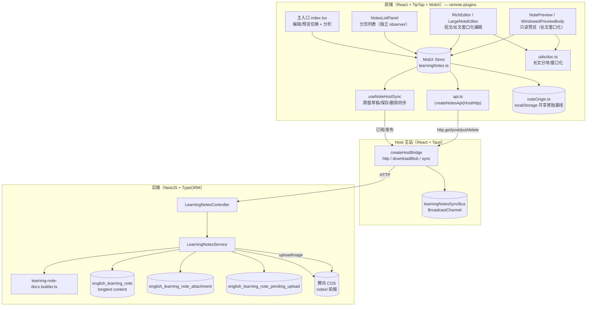
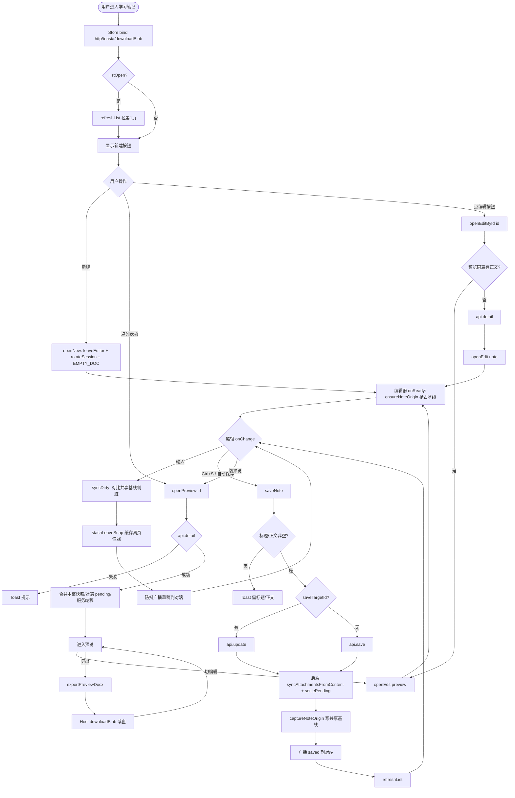
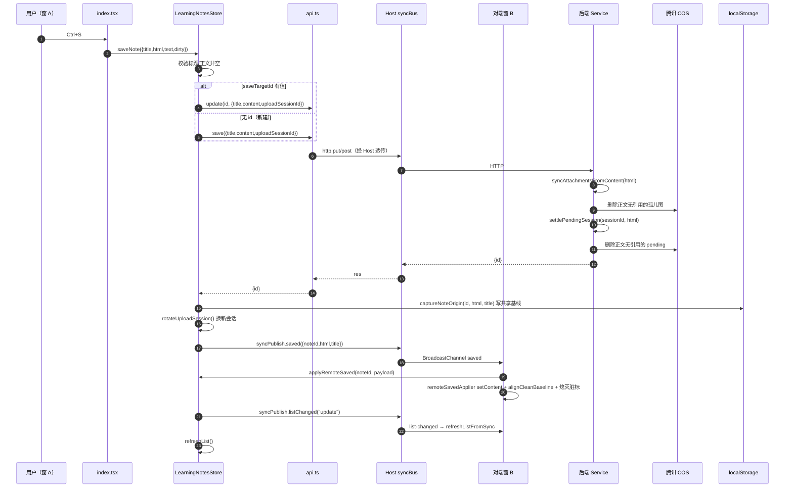
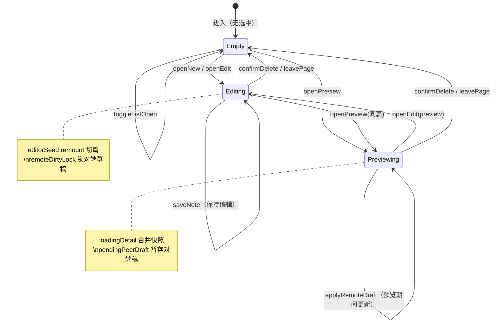

# 学习笔记 — 全面实现手册

> **状态**：已上线（从零复刻手册）| **日期**：2026-08-26 | **需求摘要**：英语学习模块的「学习笔记」功能，从纯 textarea 升级为基于 TipTap 的富文本笔记体系，覆盖 CRUD、分栏列表、编辑/预览切换、长文窗口化、图片上传会话、跨窗草稿同步、DOCX 导出端到端实现。

## 0. 读本文你将得到什么

- **一句话方案**：以 MobX 单例 Store 为中枢，前端 TipTap 富文本 + 后端 NestJS + TypeORM，经 Module Federation 远程插件接入英语学习宿主页；图片走 COS + 上传会话防孤儿；长文用滚动窗口化；多窗草稿用 BroadcastChannel + localStorage 共享原始基线仲裁脏标记；DOCX 服务端生成。
- **4 张核心图**：分层架构图、CRUD 主流程图、保存 + 跨窗同步时序图、编辑/预览状态机。
- **模块拆分**：后端 3 实体 + Service + Controller + DOCX Builder；前端 API 层 + Store + 跨窗同步 Hook + 主入口 + 列表 + 编辑器 + 预览 + 工具函数，共 13 个核心模块。
- **分阶段落地**：M1 后端骨架 → M2 富文本编辑 → M3 列表与分栏 → M4 图片会话 → M5 长文窗口化 → M6 跨窗同步 → M7 DOCX 导出。
- **最大风险**：跨窗脏标记仲裁（多窗同时编辑同篇时基线漂移）、长文 DOM 性能、图片孤儿回收。

> ⚠️ 本文为「教学手册」而非「规划态思路」，因此**包含完整源码**（与 `feature-implementation-idea` skill 默认「伪代码 ≤30 行」规则不同）。所有代码段均来自当前仓库真实实现，路径可在仓库中直接定位。DOCX 导出链路的逐行级讲解另见 [学习笔记DOCX导出手册.md](./学习笔记DOCX导出手册.md)，本文只摘其骨架，不重复展开。

## 延伸阅读

- [学习笔记富文本编辑.md](./学习笔记富文本编辑.md) — TipTap 3.x 编辑器封装与分栏布局（规划态）
- [学习笔记编辑器预览卡顿.md](./学习笔记编辑器预览卡顿.md) — 编辑/预览卡顿根因与窗口化方案
- [学习笔记独立弹窗.md](./学习笔记独立弹窗.md) — Tauri 托管关窗 + BroadcastChannel 跨窗总线
- [学习笔记DOCX导出手册.md](./学习笔记DOCX导出手册.md) — DOCX 端到端从零复刻手册
- [学习笔记导出与编辑打磨.md](./学习笔记导出与编辑打磨.md) — DOCX 插图可靠化 + 长文打磨
- [学习笔记列表导出.md](./学习笔记列表导出.md) — 列表批量导出 Word（规划态）

---

## 1. 需求与边界

### 1.1 用户故事

| 角色 | 场景 | 行为 | 期望结果 |
|------|------|------|----------|
| 学习者 | 复习英语知识点 | 新建笔记、富文本编辑、保存 | 标题/正文/高亮/列表/代码/图片均可，HTML 持久化 |
| 学习者 | 翻阅历史笔记 | 打开列表、点条目预览、切编辑 | 预览与编辑秒切，未保存稿不丢 |
| 学习者 | 长篇笔记（>80 块） | 连续滚动编辑/预览 | 不卡顿，文末光标对齐短文体验 |
| 学习者 | 插图 | 粘贴/拖放/选图上传 | 上传至 COS，正文 `` 引用；删除未保存时回收 |
| 学习者 | 多窗口同篇 | 主窗 + 独立弹窗编辑同篇 | 草稿实时同步，脏标记不串窗 |
| 学习者 | 导出 | 预览页点导出 → Word | 保留样式/图片/表格/列表，落盘 .docx |
| 学习者 | 公开/私有 | 列表项切换公开 | 本人可切；他人仅可读公开笔记 |

### 1.2 范围

| 在范围内 | 不在范围内（非目标） |
|----------|----------------------|
| 单用户富文本笔记 CRUD | 多人实时协作（OT/CRDT） |
| 图片上传 + 会话防孤儿 | 离线优先 / PWA |
| 长文窗口化编辑/预览 | Markdown 源码模式 |
| 跨窗草稿同步 + 脏仲裁 | 笔记标签/文件夹分类 |
| DOCX 导出 | 全文搜索 |
| 公开/私有可见性 | 音视频嵌入 |
| Tauri 独立弹窗 | |

### 1.3 约束与依赖

- **平台**：Web + Tauri 2 桌面端（macOS 优先）。
- **登录**：JwtGuard，所有接口需鉴权。
- **复用**：主站 `HostHttp`（iframe RPC 透传）、`HostDownloadBlob`（Tauri/Web 落盘）、`learningNotesSyncBus`（跨窗 BroadcastChannel）、`UploadService`（COS）。
- **性能底线**：长文（≥80 块或 ≥80k 字符）编辑/预览滚动不掉帧；列表与右侧编辑/预览隔离，列表滚动不牵动右侧重渲。
- **样式隔离**：MF 远程插件由 Host 侧 `@scope` 自动隔离，子项目零侵入。

---

## 2. 方案总览（一句话 + 要点）

**一句话方案**：MobX 单例 Store 集中管理列表/预览/编辑/上传会话/跨窗状态；前端 TipTap 出 HTML 存库，长文按块窗口化；图片走 COS + 上传会话（pending 表）防孤儿；跨窗用 BroadcastChannel 广播草稿/保存/删除，localStorage 共享原始基线仲裁脏标记；DOCX 服务端 `docx` 库生成。

| # | 设计要点 | 理由 |
|---|----------|------|
| 1 | MobX 单例 Store（`makeAutoObservable` + `autoBind`） | 与主站模式一致；跨组件共享编辑/预览/列表态，单例避免卸载丢稿 |
| 2 | `saveTargetId = editingId ?? boundNoteId` | 预览清空 editingId 后保存仍能 update，避免把已有笔记存成副本 |
| 3 | 上传会话 `uploadSessionId` + pending 表 | 新建笔记未落库时图片先记 pending，保存时认领；放弃/回到基线时回收 COS |
| 4 | 长文按块（`splitTopBlocks`）窗口化 | 全文 DOM 拖垮滚动；只渲染可视区 ~100 块，`translateY` 定位 |
| 5 | localStorage 共享原始基线 `noteOrigin` | 多窗 TipTap 本地基线会漂移；脏判断只对比共享基线 |
| 6 | BroadcastChannel 七类消息 + windowId 回声抑制 | 跨窗草稿/保存/删除/列表/选择/快照/请求态；`windowId` 防自回声 |
| 7 | keepalive 兜底保存 | 刷新/关页时 async Host http 会被浏览器掐断；`fetch(keepalive:true)` 兜底 |
| 8 | DOCX 服务端生成 + `@Res()` 直写二进制 | 绕过 NestJS JSON 序列化；`ResponseInterceptor` 检测 `writableEnded` 短路 |
| 9 | 列表面板独立 `observer` | 滚动/loadMore 只重渲左侧，不牵动右侧 TipTap/大 HTML |
| 10 | `editorSeed` remount + `editorEpoch` 对齐 | 切篇/远端草稿覆盖时强制重建编辑器，避免旧正文残留 |

---

## 3. 现状与复用

| 能力 | 仓库中已有 | 本需求中的用法 |
|------|------------|----------------|
| TipTap 3.x 富文本封装 | `micro-apps/dnhyxc-ai-plugins/src/components/design/RichEditor` | 直接复用；长文套 `LargeNoteEditor` 走窗口化 |
| Host HTTP 透传 | Host `createHostBridge.http` | 插件经 `HostHttp` 调后端，iframe 模式也能用 |
| Host 落盘 | `api.ui.downloadBlob` | DOCX 导出落盘（Web `<a download>` / Tauri `download_blob`） |
| 跨窗同步总线 | Host `learningNotesSyncBus`（BroadcastChannel） | 插件 `useNoteHostSync` 订阅/发布七类消息 |
| COS 上传 | `apps/backend/src/services/upload/upload.service.ts` | 笔记图片走 `notes/` 前缀，与头像隔离 |
| Module Federation | Host 动态加载 `remote-plugins` | 学习笔记作为远程插件接入，样式自动隔离 |
| ResponseInterceptor | `apps/backend/src/interceptors/response.interceptor.ts` | DOCX 二进制直写时短路 `{data,code,message}` 包装 |
| ResizablePanel | `@/components/ui/resizable` | 列表/编辑器分栏可拖拽 |

**调研结论**：后端 CRUD 骨架、TipTap 编辑器、COS 上传、MF 接入、跨窗总线均为已有能力，直接复用；需新增的是笔记域 3 张表、Service/Controller、DOCX Builder、Store、跨窗仲裁（noteOrigin + 草稿同步 Hook）、长文窗口化工具。

---

## 4. 架构图



**图内方法说明**：

| 方法 / 模块入口 | 功能 |
|-----------------|------|
| `LearningNotesStore`（Store） | 单例中枢：列表分页、预览/编辑态、保存、上传会话、跨窗仲裁、离页快照 |
| `createNotesApi(http)` | 工厂：基于 HostHttp 创建 list/detail/save/update/remove/uploadImage/settle/discard/exportDocx 类型安全 API |
| `useLearningNotesHostSync(api, store)` | 订阅 Host syncBus；分发 saved/deleted/draft/list-changed/state-snapshot 到 store；防抖广播本地草稿 |
| `writeSharedNoteOrigin` / `readSharedNoteOrigin` | localStorage 按 noteId 存/读共享原始基线；主子窗同一份，脏判断唯一真相源 |
| `acquireNoteOriginSession` / `releaseNoteOriginSession` | holders 引用计数；所有窗 release 后才清基线，避免子窗仍用却清掉 |
| `isLargeNoteHtml(content)` | 长文判定：≥80k 字符或 ≥80 块启用窗口化 |
| `createLargeNoteDoc(html)` | 长文拆块：剥标题、`splitTopBlocks`、初始挂最后一窗（光标文末） |
| `buildLearningNoteDocxBuffer({title,html})` | HTML→DOCX Buffer：剥标题 div、扫顶层块、行内样式、图片、表格、列表、代码块 |
| `LearningNotesService.save/update` | DTO 校验、写库、`syncAttachmentsFromContent` 按正文认领附件、结算上传会话 |
| `LearningNotesService.settlePendingSession` | 保存/回到干净态时：正文里没有的 pending 删 COS |
| `LearningNotesService.gcExpiredPending` | 清理 >1h 的过期 pending（崩溃未放弃的会话兜底） |
| `LearningNotesController.exportDocx` | `@Res()` 直写二进制 + `res.end(buf)`，绕过 JSON 序列化 |

**读图要点**：

- 三层边界：插件（React）↔ Host（postMessage RPC + BroadcastChannel）↔ 后端（HTTP）。iframe 模式下插件无 `fetch`，必须走 Host 透传的 `http.*`。
- 数据持久化分三处：DB（笔记正文 longtext + 附件表 + pending 表）、COS（图片对象 `notes/` 前缀）、localStorage（共享原始基线 + holders）。
- 长文编辑/预览共用 `utils/doc.ts` 的分块与窗口算法，编辑用 `LargeNoteEditor`（可写）、预览用 `WindowedPreviewBody`（只读）。

---

## 5. 主流程图（CRUD + 编辑/预览切换）



**图内方法说明**：

| 方法 | 功能 |
|------|------|
| `openNew()` | 离开当前编辑（自动保存 + discard 会话）→ 清 editingId/bound → rotateUploadSession → `editorInitial = EMPTY_NOTE_DOC` → `editorSeed++` 触发 remount |
| `openPreview(id)` | 同篇已在预览则不重拉；同篇编辑中优先取编辑器快照；`leaveEditor` 后立刻进预览壳（卸编辑器），再 `api.detail`，合并本地快照/对端 pending/服务端稿 |
| `openEdit(note)` / `openEditById(id)` | 预览同篇有正文直接进编辑；否则 `api.detail` 再 `openEdit`；`editorInitial` 有未保存草稿时先挂基线再套草稿，`queueMicrotask` 应用远端草稿 |
| `syncDirty()` | onChange：`editorHtmlEquals` 对比共享原始基线判脏；dirty→clean 时 `settleUploadSessionIfNeeded`；缓存 `stashLeaveSnap`；防抖 `scheduleLearningNotesDraftPublish` |
| `saveNote(input, opts)` | 校验 → `api.update`/`api.save` → `rotateUploadSession` → `captureNoteOrigin` → `syncPublish.saved` 广播 → `refreshList` |
| `exportPreviewDocx()` | `api.exportDocx(id)` 拉 ArrayBuffer → 安全文件名 → `downloadBlob` 落盘 → 按 `hostToasted` 决定是否 Toast |
| `leaveEditor()` | `waitForSaving` 或 `autoSaveIfDirty`（静默）→ `discardUploadSession`（仅本窗创建的会话可 discard） |
| `applyEditorReadyDirty(html)` | onReady：`ensureNoteOrigin` 首窗抢占基线；对比 `openBaseline`/共享基线判脏；`remoteDirtyLock` 锁对端未保存稿 |

**读图要点**：

- 入口有三路：新建、列表点预览、列表点编辑。预览/编辑切换的核心是「先取本地快照再卸编辑器」，避免服务端旧稿覆盖未保存正文。
- 脏判断唯一真相源是 localStorage 共享原始基线（`getNoteOrigin`），不是各窗 TipTap 本地基线——后者会因规范化漂移。
- 保存后立即 `captureNoteOrigin` 写共享基线 + 广播 `saved`，对端据此熄灭脏标记并 `rotateUploadSession`。

---

## 6. 核心时序图（保存 + 跨窗同步）



**图内方法说明**：

| 方法 | 功能 |
|------|------|
| `saveNote()` | 保存编排：校验 → update/save → `captureNoteOrigin` → `syncPublish.saved` → `refreshList`；`leaveSnap.dirty=false` 防离页重复保存 |
| `syncAttachmentsFromContent(noteId, html)` | 后端：以正文 HTML 为真相源同步附件行；对本篇移除的 key 引用计数后删 COS |
| `settlePendingSession(userId, sessionId, html)` | 后端：正文里没有的 pending 删 COS，已认领的只删 pending 行 |
| `captureNoteOrigin(noteId, html, title)` | 覆盖写 localStorage 共享基线 + 内存 `savedBaselineHtml`；主子窗同一份 |
| `rotateUploadSession()` | `uploadSessionId = crypto.randomUUID()`；保存后换新会话，旧 pending 已结算 |
| `applyRemoteSaved(noteId, payload)` | 对端：清 pendingPeerDraft → `captureNoteOrigin` → 预览/列表更新 → 若编辑同篇则 `remoteSavedApplier` setContent + 熄脏 |
| `remoteSavedApplier`（index.tsx 注册） | 编辑器 `setContent(html, {emitUpdate:false})` → `alignCleanBaseline` → `captureNoteOrigin` → 清 `remoteDirtyLock` |
| `refreshListFromSync()` | 跨窗：`fetchPage(1, false, {ignoreListOpen:true})`，列表未展开也刷新 |

**读图要点**：

- 保存链路跨 3 进程边界：插件 → Host（postMessage RPC）→ 后端（HTTP）。`syncPublish` 在 `await` 前先抓住，避免 unmount 后对端收不到 saved。
- 后端「正文为真相源」：`syncAttachmentsFromContent` 以 HTML 里的 `` 为准增删附件行，无引用的 COS 对象才删，避免误删多笔记共用图。
- 跨窗同步是乐观的：窗 A 保存后广播 saved，窗 B 立刻 `applyRemoteSaved` 熄灭脏标 + setContent，不等 HTTP 列表刷新。

---

## 7. 状态机（编辑/预览/列表模式）



**图内方法说明**：

| 方法 | 功能 |
|------|------|
| `openNew()` / `openEdit()` | 进入 Editing：`leaveEditor` → 清 preview → `editorSeed++` remount → `acquireOriginSession` |
| `openPreview(id)` | 进入 Previewing：卸编辑器 → 进预览壳 → `api.detail` → 合并本地快照/对端 pending/服务端稿 |
| `applyRemoteDraft(noteId, draft)` | 预览期间：更新 `preview.html` + 暂存 `pendingPeerDraft`；编辑期间：`remoteDraftApplier` setContent |
| `confirmDelete()` | 删库 → 清 preview/editing → `clearNoteOrigin` → 广播 deleted → refreshList |

**读图要点**：

- Editing 与 Previewing 互斥：进预览一律清 `editingId`（卸编辑器），避免同篇编辑器与预览双实例并存。
- `loadingDetail` 期间收到的对端草稿暂存 `pendingPeerDraft`，detail 回来后合并（本地快照 > 对端 pending > 服务端）。
- `remoteDirtyLock` 在对端 dirty 时锁定，直到本窗保存、对端 saved、或对端 dirty:false 才解除——防止 onReady 把草稿当基线熄灭脏标。

---

## 8. 模块职责与数据模型

### 8.1 模块一览

| 模块 | 职责 | 新增/改动 | 路径 |
|------|------|-----------|------|
| 笔记实体 | 笔记主表（HTML longtext） | 新增 | `apps/backend/src/services/learning-notes/english-learning-note.entity.ts` |
| 附件实体 | 笔记图片附件（引用计数回收） | 新增 | `english-learning-note-attachment.entity.ts` |
| pending 实体 | 未保存会话图片登记 | 新增 | `english-learning-note-pending-upload.entity.ts` |
| Service | CRUD + 图片 + 会话 + 导出 | 新增 | `learning-notes.service.ts` |
| Controller | REST + 图片上传 + DOCX 二进制直写 | 新增 | `learning-notes.controller.ts` |
| DOCX Builder | HTML→DOCX Buffer | 新增 | `learning-note-docx.builder.ts` |
| 前端 API | createNotesApi + keepalive 兜底 | 新增 | `micro-apps/.../views/learning-notes/api.ts` |
| 前端 Store | MobX 单例中枢 | 新增 | `micro-apps/.../store/learningNotes.ts` |
| noteOrigin | localStorage 共享原始基线 | 新增 | `micro-apps/.../store/noteOrigin.ts` |
| 跨窗同步 Hook | 订阅/发布 syncBus + 防抖草稿 | 新增 | `micro-apps/.../hooks/useNoteHostSync.ts` |
| 主入口 | 编辑/预览切换 + 分栏 + 快捷键 | 新增 | `views/learning-notes/index.tsx` |
| 列表面板 | 分页 + 滚动 + CRUD 操作 | 新增 | `components/NotesListPanel.tsx` |
| 长文编辑器 | 窗口化编辑 | 新增 | `components/Editor.tsx` |
| 长文预览 | 窗口化只读预览 | 新增 | `components/PreviewBody.tsx` |
| 长文工具 | 分块/窗口/拼接 | 新增 | `utils/doc.ts` |

### 8.2 数据模型

| 实体 | 字段 | 存储 | 说明 |
|------|------|------|------|
| `english_learning_note` | id(uuid), userId, title(varchar200), content(longtext), isPublic(bool), createdAt, updatedAt | DB | 笔记主表；content 存 TipTap HTML |
| `english_learning_note_attachment` | id, noteId, cosKey(varchar512), url(varchar1024), createdAt | DB | 已保存笔记的图片附件；按 cosKey 引用计数回收 |
| `english_learning_note_pending_upload` | id, userId, sessionId(varchar36), cosKey, url, createdAt | DB | 新建笔记未落库时的图片；保存时认领，TTL 1h |
| NoteOriginSnapshot | noteId, html, title, updatedAt | localStorage | 共享原始基线；主子窗同一份，脏判断真相源 |
| holders | noteId → windowId[] | localStorage | 引用计数；所有窗 release 后才清基线 |

---

## 9. 完整源码（按模块，带逐行注释）

> 以下代码均来自当前仓库真实实现。为保持篇幅可控，DOCX Builder 的完整源码（~1700 行）见 [学习笔记DOCX导出手册.md](./学习笔记DOCX导出手册.md) §14，本文只摘其入口签名。

### 9.1 后端实体（3 张表）

**`english-learning-note.entity.ts`** — 笔记主表：

```typescript
import {
	Column,
	CreateDateColumn,
	Entity,
	Index,
	PrimaryGeneratedColumn,
	UpdateDateColumn,
} from 'typeorm';

/** 英语学习 · 学习笔记（富文本 HTML） */
@Entity({ name: 'english_learning_note' })
// 按 userId + updatedAt 建复合索引：加速「本人笔记按更新时间倒序」分页
@Index('IDX_eln_user_updated', ['userId', 'updatedAt'])
// isPublic 索引：加速「他人公开笔记」查询
@Index('IDX_eln_public', ['isPublic'])
export class EnglishLearningNote {
	@PrimaryGeneratedColumn('uuid')
	id!: string;

	@Column({ name: 'user_id', type: 'int' })
	userId!: number;

	@Column({ type: 'varchar', length: 200, nullable: true })
	title!: string | null;

	/** TipTap HTML；longtext 避免超长正文截断 */
	@Column({ type: 'longtext' })
	content!: string;

	/** 为 true 时任意登录用户可读详情 / 公开列表 */
	@Column({ name: 'is_public', type: 'boolean', default: false })
	isPublic!: boolean;

	@CreateDateColumn({ name: 'created_at', type: 'timestamp' })
	createdAt!: Date;

	@UpdateDateColumn({ name: 'updated_at', type: 'timestamp' })
	updatedAt!: Date;
}
```

**`english-learning-note-attachment.entity.ts`** — 附件表（引用计数回收）：

```typescript
import {
	Column, CreateDateColumn, Entity, Index, PrimaryGeneratedColumn, Unique,
} from 'typeorm';

/**
 * 学习笔记正文附件（当前仅 COS 图片 notes/…）。
 * 按 note_id 关联；同 key 可出现在多篇笔记（多行），删文时按 key 引用计数回收 COS。
 */
@Entity({ name: 'english_learning_note_attachment' })
// noteId + cosKey 二元唯一：防重复登记
@Unique('UQ_elna_note_key', ['noteId', 'cosKey'])
@Index('IDX_elna_note', ['noteId'])   // 按笔记查附件
@Index('IDX_elna_cos_key', ['cosKey']) // 按 cosKey 查引用（回收时用）
export class EnglishLearningNoteAttachment {
	@PrimaryGeneratedColumn('uuid')
	id!: string;

	@Column({ name: 'note_id', type: 'varchar', length: 36 })
	noteId!: string;

	/** COS 对象键，如 notes/{uuid}_name.png */
	@Column({ name: 'cos_key', type: 'varchar', length: 512 })
	cosKey!: string;

	/** 持久化公网 URL（编辑器 img src） */
	@Column({ type: 'varchar', length: 1024 })
	url!: string;

	@CreateDateColumn({ name: 'created_at', type: 'timestamp' })
	createdAt!: Date;
}
```

**`english-learning-note-pending-upload.entity.ts`** — 未保存会话图片：

```typescript
import {
	Column, CreateDateColumn, Entity, Index, PrimaryGeneratedColumn, Unique,
} from 'typeorm';

/**
 * 新建笔记尚未落库时的图片上传登记。
 * 保存时按正文认领；放弃会话 / TTL 到期时删 COS，避免孤儿对象。
 */
@Entity({ name: 'english_learning_note_pending_upload' })
@Unique('UQ_elnpu_session_key', ['sessionId', 'cosKey'])
@Index('IDX_elnpu_user_session', ['userId', 'sessionId']) // 按会话查 pending
@Index('IDX_elnpu_created', ['createdAt'])               // 按时间清理过期
export class EnglishLearningNotePendingUpload {
	@PrimaryGeneratedColumn('uuid')
	id!: string;

	@Column({ name: 'user_id', type: 'int' })
	userId!: number;

	/** 客户端新建笔记会话 UUID */
	@Column({ name: 'session_id', type: 'varchar', length: 36 })
	sessionId!: string;

	@Column({ name: 'cos_key', type: 'varchar', length: 512 })
	cosKey!: string;

	@Column({ type: 'varchar', length: 1024 })
	url!: string;

	@CreateDateColumn({ name: 'created_at', type: 'timestamp' })
	createdAt!: Date;
}
```

### 9.2 后端 Service（CRUD + 图片会话 + 导出）

> 路径：`apps/backend/src/services/learning-notes/learning-notes.service.ts`

```typescript
import {
	BadRequestException, Inject, Injectable, type LoggerService, NotFoundException,
} from '@nestjs/common';
import { InjectRepository } from '@nestjs/typeorm';
import { WINSTON_MODULE_NEST_PROVIDER } from 'nest-winston';
import { In, LessThan, Repository } from 'typeorm';
import { UploadService } from '../upload/upload.service';
import { User } from '../user/user.entity';
import { QueryLearningNoteDto } from './dto/query-learning-note.dto';
import { SaveLearningNoteDto } from './dto/save-learning-note.dto';
import { UpdateLearningNoteDto } from './dto/update-learning-note.dto';
import { UpdateNoteVisibilityDto } from './dto/update-note-visibility.dto';
import { EnglishLearningNote } from './english-learning-note.entity';
import { EnglishLearningNoteAttachment } from './english-learning-note-attachment.entity';
import { EnglishLearningNotePendingUpload } from './english-learning-note-pending-upload.entity';
import {
	buildLearningNoteDocxBuffer,
	NOTE_DOCX_HTML_MAX_CHARS,
} from './learning-note-docx.builder';
import { extractNoteImageRefsFromHtml } from './note-image-refs';

export type LearningNoteListItem = Pick<
	EnglishLearningNote,
	'id' | 'title' | 'userId' | 'isPublic' | 'createdAt' | 'updatedAt'
> & { isOwned: boolean; author: string };

/** 未保存会话 pending 保留时长（keepalive 失败时的服务端兜底） */
const PENDING_TTL_MS = 60 * 60 * 1000;

@Injectable()
export class LearningNotesService {
	constructor(
		@InjectRepository(EnglishLearningNote)
		private readonly noteRepo: Repository<EnglishLearningNote>,
		@InjectRepository(EnglishLearningNoteAttachment)
		private readonly attachmentRepo: Repository<EnglishLearningNoteAttachment>,
		@InjectRepository(EnglishLearningNotePendingUpload)
		private readonly pendingRepo: Repository<EnglishLearningNotePendingUpload>,
		@InjectRepository(User)
		private readonly userRepo: Repository<User>,
		private readonly uploadService: UploadService,
		@Inject(WINSTON_MODULE_NEST_PROVIDER)
		private readonly logger: LoggerService,
	) {}

	/** 保存笔记：保存标题/正文/上传会话 */
	async save(userId: number, dto: SaveLearningNoteDto): Promise<{ id: string }> {
		const row = this.noteRepo.create({
			userId,
			title: dto.title?.trim() ? dto.title.trim() : null,
			content: dto.content ?? '',
			isPublic: false,
		});
		const saved = await this.noteRepo.save(row);
		// 以正文 HTML 为真相源同步附件行
		await this.syncAttachmentsFromContent(saved.id, saved.content ?? '');
		// 有上传会话则结算：正文里没有的 pending 删 COS
		if (dto.uploadSessionId?.trim()) {
			await this.settlePendingSession(
				userId, dto.uploadSessionId.trim(), saved.content ?? '',
			);
		}
		// 清理过期 pending（崩溃未放弃的会话兜底）
		void this.gcExpiredPending(userId);
		return { id: saved.id };
	}

	/** 更新笔记：更新标题/正文/上传会话 */
	async update(userId: number, dto: UpdateLearningNoteDto): Promise<{ id: string }> {
		if (
			dto.title === undefined &&
			dto.content === undefined &&
			!dto.uploadSessionId?.trim()
		) {
			throw new BadRequestException('请至少提供一项要更新的字段');
		}
		const row = await this.requireOwned(userId, dto.id);
		if (dto.title !== undefined) row.title = dto.title.trim() || null;
		if (dto.content !== undefined) row.content = dto.content;
		const saved =
			dto.title !== undefined || dto.content !== undefined
				? await this.noteRepo.save(row)
				: row;
		if (dto.content !== undefined) {
			await this.syncAttachmentsFromContent(saved.id, saved.content ?? '');
		}
		if (dto.uploadSessionId?.trim()) {
			await this.settlePendingSession(
				userId, dto.uploadSessionId.trim(), saved.content ?? '',
			);
		}
		void this.gcExpiredPending(userId);
		return { id: saved.id };
	}

	/** 所有者设置是否全站公开 */
	async setVisibility(
		userId: number, id: string, dto: UpdateNoteVisibilityDto,
	): Promise<LearningNoteListItem> {
		const row = await this.requireOwned(userId, id);
		row.isPublic = dto.isPublic;
		const saved = await this.noteRepo.save(row);
		const authors = await this.authorMap([saved.userId]);
		return this.toListItem(saved, userId, authors.get(saved.userId));
	}

	async remove(userId: number, id: string): Promise<void> {
		const row = await this.requireOwned(userId, id);
		const fromTable = await this.attachmentKeysForNote(row.id);
		// ponytail: 附件表无 FK CASCADE，须先删行再删 COS；旧笔记可能只有 HTML 无行
		const fromHtml = extractNoteImageRefsFromHtml(row.content ?? '').map((r) => r.key);
		const keys = [...new Set([...fromTable, ...fromHtml])];
		await this.attachmentRepo.delete({ noteId: row.id });
		await this.noteRepo.delete({ id: row.id, userId });
		await this.deleteOrphanCosKeys(keys);
	}

	/**
	 * 笔记图片上传（COS 前缀 notes/）。
	 * 有 uploadSessionId 时一律记 pending（含已保存笔记的本次编辑），
	 * 保存/回到干净态/放弃会话时再结算，避免「上传又删且未保存」孤儿。
	 */
	async uploadImage(
		userId: number, file: Express.Multer.File,
		noteId?: string, sessionId?: string,
	) {
		if (!file?.buffer?.length) {
			throw new BadRequestException('请上传图片文件');
		}
		if (!file.mimetype?.startsWith('image/')) {
			throw new BadRequestException('仅支持图片文件');
		}
		const uploaded = await this.uploadService.uploadObjectToCos(file, 'notes');
		const sid = sessionId?.trim();
		const nid = noteId?.trim();
		if (sid) {
			// 新建笔记：记 pending，保存时认领
			await this.ensurePendingRow(userId, sid, uploaded.key, uploaded.url);
		} else if (nid) {
			// 已保存笔记：记附件行
			await this.ensureAttachmentRow(userId, nid, uploaded.key, uploaded.url);
		}
		void this.gcExpiredPending(userId);
		return uploaded;
	}

	/** 放弃上传会话：删除该会话全部 pending + 无引用的 COS 对象 */
	async discardUploadSession(
		userId: number, sessionId: string,
	): Promise<{ ok: true }> {
		const sid = sessionId?.trim();
		if (!sid) throw new BadRequestException('缺少 uploadSessionId');
		await this.deletePendingSession(userId, sid);
		void this.gcExpiredPending(userId);
		return { ok: true };
	}

	/**
	 * 按当前正文结算会话（不写笔记）：正文里没有的 pending 删 COS。
	 * 用于「上传又删、内容回到基线无需保存」时立刻回收。
	 */
	async settleUploadSession(
		userId: number, sessionId: string, content: string,
	): Promise<{ ok: true }> {
		const sid = sessionId?.trim();
		if (!sid) throw new BadRequestException('缺少 uploadSessionId');
		await this.settlePendingSession(userId, sid, content ?? '');
		void this.gcExpiredPending(userId);
		return { ok: true };
	}

	/** 本人笔记，或已公开笔记（任意登录用户可读） */
	async findOne(
		userId: number, id: string,
	): Promise<EnglishLearningNote & { isOwned: boolean; author: string }> {
		void this.gcExpiredPending(userId);
		const owned = await this.noteRepo.findOne({ where: { id, userId } });
		if (owned) {
			const authors = await this.authorMap([owned.userId]);
			return Object.assign(owned, {
				isOwned: true,
				author: authors.get(owned.userId) ?? String(owned.userId),
			});
		}
		// 非本人：只读公开笔记
		const pub = await this.noteRepo.findOne({ where: { id, isPublic: true } });
		if (!pub) throw new NotFoundException('笔记不存在');
		const authors = await this.authorMap([pub.userId]);
		return Object.assign(pub, {
			isOwned: false,
			author: authors.get(pub.userId) ?? String(pub.userId),
		});
	}

	/** 分页：本人笔记 + 他人公开笔记（对齐词库可见范围） */
	async findPage(
		userId: number, query: QueryLearningNoteDto,
	): Promise<{ list: LearningNoteListItem[]; total: number }> {
		void this.gcExpiredPending(userId);
		const pageNo = query.pageNo ?? 1;
		const pageSize = query.pageSize ?? 20;
		const take = Math.min(pageSize, 100); // 单页上限 100
		const skip = (pageNo - 1) * take;
		const title = query.title?.trim();

		const qb = this.noteRepo
			.createQueryBuilder('n')
			.select([
				'n.id', 'n.title', 'n.userId', 'n.isPublic', 'n.createdAt', 'n.updatedAt',
			])
			// 本人 OR 公开
			.where('(n.userId = :userId OR n.isPublic = true)', { userId })
			.orderBy('n.updatedAt', 'DESC')
			.take(take)
			.skip(skip);

		if (title) {
			qb.andWhere('n.title LIKE :title', { title: `%${title}%` });
		}

		const [rows, total] = await qb.getManyAndCount();
		const authors = await this.authorMap(rows.map((r) => r.userId));
		return {
			list: rows.map((row) =>
				this.toListItem(row, userId, authors.get(row.userId)),
			),
			total,
		};
	}

	/**
	 * 导出单篇笔记为 DOCX（保留正文图片；超大图缩小显示，极端体积才跳过）。
	 */
	async exportDocxBuffer(userId: number, id: string): Promise<Buffer> {
		const row = await this.requireOwned(userId, id);
		const html = row.content ?? '';
		if (html.length > NOTE_DOCX_HTML_MAX_CHARS) {
			throw new BadRequestException(
				`笔记内容过大（>${NOTE_DOCX_HTML_MAX_CHARS} 字符），请精简后再导出`,
			);
		}
		try {
			return await buildLearningNoteDocxBuffer({
				title: row.title?.trim() || '无标题笔记',
				html,
			});
		} catch (e) {
			const msg = e instanceof Error ? e.message : String(e);
			throw new BadRequestException(msg || '导出失败');
		}
	}

	/** 确保附件行：仅 notes/ 前缀的 key */
	private async ensureAttachmentRow(
		userId: number, noteId: string, cosKey: string, url: string,
	): Promise<void> {
		if (!cosKey.startsWith('notes/')) return;
		await this.requireOwned(userId, noteId);
		const existing = await this.attachmentRepo.findOne({
			where: { noteId, cosKey }, select: { id: true },
		});
		if (existing) return; // 幂等
		await this.attachmentRepo.save(
			this.attachmentRepo.create({ noteId, cosKey, url }),
		);
	}

	/** 确保 pending 行：仅 notes/ 前缀的 key */
	private async ensurePendingRow(
		userId: number, sessionId: string, cosKey: string, url: string,
	): Promise<void> {
		if (!cosKey.startsWith('notes/')) return;
		const existing = await this.pendingRepo.findOne({
			where: { userId, sessionId, cosKey }, select: { id: true },
		});
		if (existing) return; // 幂等
		await this.pendingRepo.save(
			this.pendingRepo.create({ userId, sessionId, cosKey, url }),
		);
	}

	/**
	 * 保存后结算会话：正文里没有的 pending → 删 COS；已认领的只删 pending 行。
	 */
	private async settlePendingSession(
		userId: number, sessionId: string, html: string,
	): Promise<void> {
		// 正文里引用的 key 视为认领
		const kept = new Set(extractNoteImageRefsFromHtml(html).map((r) => r.key));
		const rows = await this.pendingRepo.find({
			where: { userId, sessionId }, select: { id: true, cosKey: true },
		});
		if (!rows.length) return;

		// 正文里没有的 → 孤儿，删 COS
		const orphanKeys = rows
			.filter((r) => !kept.has(r.cosKey))
			.map((r) => r.cosKey);
		// pending 行一律删（已认领的不再需要 pending 登记）
		await this.pendingRepo.delete({ id: In(rows.map((r) => r.id)) });
		await this.deleteOrphanCosKeys(orphanKeys);
	}

	/** 删除上传会话：仅删除 pending 行 + 无引用的 COS 对象 */
	private async deletePendingSession(
		userId: number, sessionId: string,
	): Promise<void> {
		const rows = await this.pendingRepo.find({
			where: { userId, sessionId }, select: { id: true, cosKey: true },
		});
		if (!rows.length) return;
		const keys = rows.map((r) => r.cosKey);
		await this.pendingRepo.delete({ id: In(rows.map((r) => r.id)) });
		await this.deleteOrphanCosKeys(keys);
	}

	/** 过期 pending（崩溃未放弃的会话） */
	private async gcExpiredPending(userId: number): Promise<void> {
		try {
			const cutoff = new Date(Date.now() - PENDING_TTL_MS);
			const rows = await this.pendingRepo.find({
				where: { userId, createdAt: LessThan(cutoff) },
				select: { id: true, cosKey: true }, take: 100,
			});
			if (!rows.length) return;
			const keys = rows.map((r) => r.cosKey);
			await this.pendingRepo.delete({ id: In(rows.map((r) => r.id)) });
			await this.deleteOrphanCosKeys(keys);
		} catch (e) {
			this.logger.error?.(
				`清理过期 pending 失败: ${e instanceof Error ? e.message : e}`,
			);
		}
	}

	/**
	 * 以正文 HTML 为真相源，同步本笔记附件行；对本篇移除的 key 做引用计数后删 COS。
	 */
	private async syncAttachmentsFromContent(
		noteId: string, html: string,
	): Promise<void> {
		const refs = extractNoteImageRefsFromHtml(html);
		const nextKeys = new Set(refs.map((r) => r.key));
		const existing = await this.attachmentRepo.find({
			where: { noteId }, select: { id: true, cosKey: true },
		});
		const existingKeys = new Set(existing.map((a) => a.cosKey));

		// 正文里没有的附件行 → 删行
		const toRemove = existing.filter((a) => !nextKeys.has(a.cosKey));
		if (toRemove.length) {
			await this.attachmentRepo.delete({ id: In(toRemove.map((a) => a.id)) });
		}

		// 新增的 → 建行
		const toAdd = refs.filter((r) => !existingKeys.has(r.key));
		if (toAdd.length) {
			await this.attachmentRepo.save(
				toAdd.map((r) =>
					this.attachmentRepo.create({
						noteId, cosKey: r.key,
						url: r.url || this.uploadService.buildCosPublicUrl(r.key),
					}),
				),
			);
		}

		// 移除的 key 引用计数后删 COS（无附件行且无 pending 才删）
		await this.deleteOrphanCosKeys(toRemove.map((a) => a.cosKey));
	}

	private async attachmentKeysForNote(noteId: string): Promise<string[]> {
		const rows = await this.attachmentRepo.find({
			where: { noteId }, select: { cosKey: true },
		});
		return [...new Set(rows.map((r) => r.cosKey))];
	}

	/** 回收笔记图片：仅无引用的 COS 对象（无 pending 且无附件行） */
	private async deleteOrphanCosKeys(keys: string[]): Promise<void> {
		// 仅 notes/ 前缀的 key（不误删头像等其他资源）
		const unique = [...new Set(keys.filter((k) => k.startsWith('notes/'))];
		await Promise.all(
			unique.map(async (key) => {
				try {
					// 引用计数：附件表 + pending 表都没用这个 key 才删
					const [inNote, inPending] = await Promise.all([
						this.attachmentRepo.count({ where: { cosKey: key } }),
						this.pendingRepo.count({ where: { cosKey: key } }),
					]);
					if (inNote > 0 || inPending > 0) return;
					await this.uploadService.deleteCosObject(key);
				} catch (e) {
					this.logger.error?.(
						`回收笔记图片失败 key=${key}: ${e instanceof Error ? e.message : e}`,
					);
				}
			}),
		);
	}

	private async authorMap(userIds: number[]): Promise<Map<number, string>> {
		const unique = [...new Set(userIds.filter((id) => id > 0))];
		const map = new Map<number, string>();
		if (unique.length === 0) return map;
		const users = await this.userRepo.find({
			where: { id: In(unique) }, select: { id: true, username: true },
		});
		for (const u of users) map.set(u.id, u.username);
		for (const id of unique) {
			if (!map.has(id)) map.set(id, String(id));
		}
		return map;
	}

	private toListItem(
		row: Pick<
			EnglishLearningNote,
			'id' | 'title' | 'userId' | 'isPublic' | 'createdAt' | 'updatedAt'
		>,
		viewerUserId: number, author?: string,
	): LearningNoteListItem {
		return {
			id: row.id, title: row.title, userId: row.userId, isPublic: row.isPublic,
			isOwned: row.userId === viewerUserId,
			author: author?.trim() || String(row.userId),
			createdAt: row.createdAt, updatedAt: row.updatedAt,
		};
	}

	/** 归属校验：仅本人可写 */
	private async requireOwned(
		userId: number, id: string,
	): Promise<EnglishLearningNote> {
		const row = await this.noteRepo.findOne({ where: { id, userId } });
		if (!row) throw new NotFoundException('笔记不存在');
		return row;
	}
}
```

### 9.3 后端 Controller（REST + 图片上传 + DOCX 二进制直写）

> 路径：`apps/backend/src/services/learning-notes/learning-notes.controller.ts`

```typescript
import {
	BadRequestException, Body, ClassSerializerInterceptor, Controller,
	Delete, Get, Param, ParseUUIDPipe, Post, Put, Query, Req, Res,
	UnauthorizedException, UploadedFile, UseGuards, UseInterceptors,
} from '@nestjs/common';
import { FileInterceptor } from '@nestjs/platform-express';
import type { Request, Response } from 'express';
import { memoryStorage } from 'multer';
import { JwtGuard } from 'src/guards/jwt.guard';
import { ResponseInterceptor } from '../../interceptors/response.interceptor';
import { QueryLearningNoteDto } from './dto/query-learning-note.dto';
import { SaveLearningNoteDto } from './dto/save-learning-note.dto';
import { SettleUploadSessionDto } from './dto/settle-upload-session.dto';
import { UpdateLearningNoteDto } from './dto/update-learning-note.dto';
import { UpdateNoteVisibilityDto } from './dto/update-note-visibility.dto';
import { LearningNotesService } from './learning-notes.service';

type AuthedRequest = Request & { user?: { userId?: number } };

// 图片上传：内存存储（不落盘），20MB 上限，仅 image/*
const noteImageUpload = {
	storage: memoryStorage(),
	limits: { fileSize: 1024 * 1024 * 20 },
	fileFilter: (
		_req: Request, file: Express.Multer.File,
		cb: (error: Error | null, acceptFile: boolean) => void,
	) => {
		if (file.mimetype?.startsWith('image/')) {
			cb(null, true);
			return;
		}
		cb(new BadRequestException('仅支持图片文件') as unknown as Error, false);
	},
};

@Controller('english-learning/notes')
// ClassSerializerInterceptor：序列化时按 DTO exclude 规则脱敏
// ResponseInterceptor：统一包 {data, code, message}（但 DOCX 二进制直写会短路）
@UseInterceptors(ClassSerializerInterceptor, ResponseInterceptor)
@UseGuards(JwtGuard)
export class LearningNotesController {
	constructor(private readonly notesService: LearningNotesService) {}

	private userId(req: AuthedRequest): number {
		const userId = req.user?.userId;
		if (userId == null) throw new UnauthorizedException('未登录');
		return userId;
	}

	/** 笔记正文图片 → COS notes/ 前缀（与头像隔离，删文可按引用回收） */
	@Post('upload-image')
	@UseInterceptors(FileInterceptor('file', noteImageUpload))
	async uploadImage(
		@Req() req: AuthedRequest,
		@UploadedFile() file: Express.Multer.File,
		@Body('noteId') noteId?: string,
		@Body('uploadSessionId') uploadSessionId?: string,
	) {
		return this.notesService.uploadImage(
			this.userId(req), file, noteId, uploadSessionId,
		);
	}

	/** 放弃上传会话（删 pending + 无引用 COS） */
	@Delete('upload-session/:sessionId')
	async discardUploadSession(
		@Req() req: AuthedRequest,
		@Param('sessionId', ParseUUIDPipe) sessionId: string,
	) {
		return this.notesService.discardUploadSession(this.userId(req), sessionId);
	}

	/** 按当前正文结算会话（上传又删、无需保存笔记时回收孤儿图） */
	@Post('upload-session/:sessionId/settle')
	async settleUploadSession(
		@Req() req: AuthedRequest,
		@Param('sessionId', ParseUUIDPipe) sessionId: string,
		@Body() dto: SettleUploadSessionDto,
	) {
		return this.notesService.settleUploadSession(
			this.userId(req), sessionId, dto.content ?? '',
		);
	}

	@Post('save')
	async save(@Req() req: AuthedRequest, @Body() dto: SaveLearningNoteDto) {
		return this.notesService.save(this.userId(req), dto);
	}

	/** 本人笔记 + 他人公开笔记 */
	@Get('list')
	async list(@Req() req: AuthedRequest, @Query() query: QueryLearningNoteDto) {
		return this.notesService.findPage(this.userId(req), query);
	}

	/**
	 * 导出单篇笔记 DOCX（原始二进制；与列表分页无关）。
	 * 用 @Res() 直写：绕过 NestJS JSON 序列化；
	 * ResponseInterceptor 检测到 writableEnded 时短路，不再包 {data,code,message}。
	 */
	@Get('export-docx/:id')
	async exportDocx(
		@Req() req: AuthedRequest,
		@Param('id', ParseUUIDPipe) id: string,
		@Res() res: Response,
	): Promise<void> {
		const buf = await this.notesService.exportDocxBuffer(this.userId(req), id);
		res.setHeader(
			'Content-Type',
			'application/vnd.openxmlformats-officedocument.wordprocessingml.document',
		);
		res.setHeader(
			'Content-Disposition',
			'attachment; filename="learning-note.docx"',
		);
		res.setHeader('Content-Length', String(buf.length));
		res.end(buf);
	}

	@Get('detail/:id')
	async detail(
		@Req() req: AuthedRequest,
		@Param('id', ParseUUIDPipe) id: string,
	) {
		return this.notesService.findOne(this.userId(req), id);
	}

	@Put('update/:id')
	async update(
		@Req() req: AuthedRequest,
		@Param('id', ParseUUIDPipe) id: string,
		@Body() dto: UpdateLearningNoteDto,
	) {
		return this.notesService.update(this.userId(req), { ...dto, id });
	}

	/** 所有者设置笔记是否公开 */
	@Put('visibility/:id')
	async setVisibility(
		@Req() req: AuthedRequest,
		@Param('id', ParseUUIDPipe) id: string,
		@Body() dto: UpdateNoteVisibilityDto,
	) {
		return this.notesService.setVisibility(this.userId(req), id, dto);
	}

	@Delete('delete/:id')
	async remove(
		@Req() req: AuthedRequest,
		@Param('id', ParseUUIDPipe) id: string,
	) {
		await this.notesService.remove(this.userId(req), id);
		return { id };
	}
}
```

### 9.4 DOCX Builder（入口签名，完整实现见 DOCX 手册）

> 路径：`apps/backend/src/services/learning-notes/learning-note-docx.builder.ts`
> 完整源码（~1700 行，含图片/表格/列表/代码块逐行注释）见 [学习笔记DOCX导出手册.md](./学习笔记DOCX导出手册.md) §14。

```typescript
/** 单篇 HTML 字符上限（与 Save DTO 同量级） */
export const NOTE_DOCX_HTML_MAX_CHARS = 5_000_000;
/** 最多嵌入图片数 */
export const NOTE_DOCX_IMAGE_MAX_COUNT = 120;
/** 单张解码后建议上限（超过仍尝试嵌入，仅缩小显示尺寸） */
export const NOTE_DOCX_IMAGE_SOFT_MAX_BYTES = 6_000_000;

/**
 * 将 TipTap HTML 转为 DOCX Buffer（保留样式与图片）。
 * 入口：Controller.exportDocx → Service.exportDocxBuffer → 本函数。
 * 流程：剥标题 div → splitTopBlocks 扫顶层块 → blocksToDocxChildren
 *       （段落/标题/引用/代码块/列表/表格/图片）→ Packer.toBuffer。
 */
export async function buildLearningNoteDocxBuffer(input: {
	title: string;
	html: string;
}): Promise<Buffer> {
	// ...完整实现见 DOCX 导出手册 §14
}
```

### 9.5 前端 API 层（createNotesApi + keepalive 兜底）

> 路径：`micro-apps/dnhyxc-ai-plugins/src/views/learning-notes/api.ts`

```typescript
/** 学习笔记：经 HostBridge 调用主站 `/english-learning/notes/*` */

import { translateSync } from '@/i18n';

// Host 透传的 HTTP 接口（iframe 模式下插件无 fetch，必须走 Host）
export type HostHttp = {
	get: <T = unknown>(url: string) => Promise<T>;
	post: <T = unknown>(url: string, body?: unknown) => Promise<T>;
	put: <T = unknown>(url: string, body?: unknown) => Promise<T>;
	delete: <T = unknown>(url: string) => Promise<T>;
};

const BASE = '/english-learning/notes';

// keepalive 兜底需要直连后端域名（插件 env 常无 API domain）
function notesApiBaseUrl(): string {
	const base = (
		import.meta.env.PROD
			? import.meta.env.VITE_PROD_API_DOMAIN
			: import.meta.env.VITE_DEV_API_DOMAIN
	)?.trim();
	return base || '';
}

/** 刷新/关页时 keepalive discard（async Host http 会被浏览器掐断） */
export function discardUploadSessionKeepalive(sessionId: string): void {
	if (typeof window === 'undefined') return;
	const sid = sessionId.trim();
	if (!sid) return;
	const token = localStorage.getItem('token')?.trim();
	const base = notesApiBaseUrl();
	if (!token || !base) return;
	void fetch(`${base}${BASE}/upload-session/${encodeURIComponent(sid)}`, {
		method: 'DELETE',
		headers: { Authorization: `Bearer ${token}` },
		keepalive: true, // 浏览器不会掐断
	});
}

/** 刷新/关页时 keepalive 结算 pending（无脏保存时） */
export function settleUploadSessionKeepalive(
	sessionId: string, content: string,
): void {
	if (typeof window === 'undefined') return;
	const sid = sessionId.trim();
	if (!sid) return;
	const token = localStorage.getItem('token')?.trim();
	const base = notesApiBaseUrl();
	if (!token || !base) return;
	void fetch(
		`${base}${BASE}/upload-session/${encodeURIComponent(sid)}/settle`,
		{
			method: 'POST',
			headers: {
				Authorization: `Bearer ${token}`,
				'Content-Type': 'application/json',
			},
			body: JSON.stringify({ content }),
			keepalive: true,
		},
	);
}

/** 刷新/关页时 keepalive 保存笔记 */
export function saveNoteKeepalive(input: {
	id?: string | null;
	title: string;
	html: string;
	uploadSessionId?: string | null;
}): void {
	if (typeof window === 'undefined') return;
	const token = localStorage.getItem('token')?.trim();
	const base = notesApiBaseUrl();
	if (!token || !base) return;
	const title = input.title.trim() || translateSync('common.untitledNote');
	const payload: Record<string, string> = { title, content: input.html };
	const sid = input.uploadSessionId?.trim();
	if (sid) payload.uploadSessionId = sid;
	const headers = {
		Authorization: `Bearer ${token}`,
		'Content-Type': 'application/json',
	};
	const id = input.id?.trim();
	if (id) {
		// 已有笔记：PUT update
		void fetch(`${base}${BASE}/update/${encodeURIComponent(id)}`, {
			method: 'PUT',
			headers,
			body: JSON.stringify({ id, ...payload }),
			keepalive: true,
		});
		return;
	}
	// 新建：POST save
	void fetch(`${base}${BASE}/save`, {
		method: 'POST',
		headers,
		body: JSON.stringify(payload),
		keepalive: true,
	});
}

/** 列表默认每页条数 */
export const NOTES_PAGE_SIZE = 20;

// —— 类型定义 ——

export type NoteRecord = {
	id: string;
	title: string | null;
	content: string;
	userId?: number;
	author?: string;      // 作者用户名
	isPublic?: boolean;
	isOwned?: boolean;    // 当前登录用户是否为作者；缺省按本人
	createdAt?: string;
	updatedAt?: string;
};

export type NoteListItem = Omit<NoteRecord, 'content'>;

export type Note = {
	id: string;
	title: string;
	html: string;
	at: number;
	author: string;
	isPublic: boolean;
	isOwned: boolean;
};

export type NoteListPage = {
	list: Note[];
	total: number;
	pageNo: number;
	pageSize: number;
};

// 后端 ResponseInterceptor 会包一层 {data: ...}，这里拆掉
function unwrapData<T>(res: unknown): T {
	if (res && typeof res === 'object' && 'data' in res) {
		return (res as { data: T }).data;
	}
	return res as T;
}

// DB 行 → 前端 Note（统一字段、时间戳、缺省值）
function toNote(row: NoteListItem | NoteRecord): Note {
	const html =
		'content' in row && typeof row.content === 'string' ? row.content : '';
	const atRaw = row.updatedAt ?? row.createdAt;
	const at = atRaw ? new Date(atRaw).getTime() : Date.now();
	return {
		id: row.id,
		title: (row.title ?? '').trim() || translateSync('common.untitledNote'),
		html,
		at: Number.isFinite(at) ? at : Date.now(),
		author: (row.author ?? '').trim() || String(row.userId ?? ''),
		isPublic: Boolean(row.isPublic),
		// 列表/详情带 isOwned；update 等本人写回包可不带，默认本人
		isOwned: row.isOwned !== false,
	};
}

/** 工厂：基于 HostHttp 创建笔记域全部 API */
export function createNotesApi(http: HostHttp) {
	return {
		async list(pageNo = 1, pageSize = NOTES_PAGE_SIZE): Promise<NoteListPage> {
			const res = await http.get(
				`${BASE}/list?pageNo=${pageNo}&pageSize=${pageSize}`,
			);
			const page = unwrapData<{ list: NoteListItem[]; total: number }>(res);
			const rows = Array.isArray(page?.list) ? page.list : [];
			return {
				list: rows.map(toNote),
				total: typeof page?.total === 'number' ? page.total : rows.length,
				pageNo, pageSize,
			};
		},

		async detail(id: string): Promise<Note> {
			const res = await http.get(`${BASE}/detail/${id}`);
			return toNote(unwrapData<NoteRecord>(res));
		},

		/** 拉取单篇笔记 DOCX 二进制（服务端生成） */
		async exportDocx(id: string): Promise<ArrayBuffer> {
			const res = await http.get(`${BASE}/export-docx/${id}`);
			const data = unwrapData<unknown>(res);
			if (data instanceof ArrayBuffer) return data;
			// 兼容 Uint8Array 等 TypedArray
			if (ArrayBuffer.isView(data)) {
				const v = data as ArrayBufferView;
				return v.buffer.slice(
					v.byteOffset, v.byteOffset + v.byteLength,
				) as ArrayBuffer;
			}
			throw new Error(translateSync('learningNotes.toast.exportInvalid'));
		},

		async save(input: {
			title: string;
			html: string;
			uploadSessionId?: string | null;
		}): Promise<{ id: string }> {
			const res = await http.post(`${BASE}/save`, {
				title: input.title.trim() || null,
				content: input.html,
				// 仅带非空 uploadSessionId
				...(input.uploadSessionId?.trim()
					? { uploadSessionId: input.uploadSessionId.trim() }
					: {}),
			});
			return unwrapData<{ id: string }>(res);
		},

		async update(
			id: string,
			input: { title: string; html: string; uploadSessionId?: string | null },
		): Promise<{ id: string }> {
			const res = await http.put(`${BASE}/update/${id}`, {
				id,
				title: input.title.trim() || null,
				content: input.html,
				...(input.uploadSessionId?.trim()
					? { uploadSessionId: input.uploadSessionId.trim() }
					: {}),
			});
			return unwrapData<{ id: string }>(res);
		},

		async remove(id: string): Promise<void> {
			await http.delete(`${BASE}/delete/${id}`);
		},

		/** 所有者设置是否公开 */
		async setVisibility(id: string, isPublic: boolean): Promise<Note> {
			const res = await http.put(`${BASE}/visibility/${id}`, { isPublic });
			return toNote(unwrapData<NoteListItem>(res));
		},

		/**
		 * 笔记图片上传至 COS notes/。
		 * 优先带 uploadSessionId 记 pending；保存或内容回干净时再结算。
		 */
		async uploadImage(
			file: File,
			opts?: { noteId?: string | null; uploadSessionId?: string | null },
		): Promise<string> {
			const fd = new FormData();
			fd.append('file', file);
			const sessionId = opts?.uploadSessionId?.trim();
			const noteId = opts?.noteId?.trim();
			// 优先带 sessionId（新建笔记）；否则带 noteId（已保存笔记）
			if (sessionId) fd.append('uploadSessionId', sessionId);
			else if (noteId) fd.append('noteId', noteId);
			const res = await http.post(`${BASE}/upload-image`, fd);
			const data = unwrapData<{ url?: string }>(res);
			const url = data?.url?.trim();
			if (!url) {
				throw new Error(translateSync('learningNotes.toast.uploadImageFailed'));
			}
			return url;
		},

		/** 放弃上传会话（回收该会话全部 pending） */
		async discardUploadSession(sessionId: string): Promise<void> {
			const sid = sessionId.trim();
			if (!sid) return;
			await http.delete(`${BASE}/upload-session/${encodeURIComponent(sid)}`);
		},

		/** 按正文结算会话（上传又删、无需保存时回收） */
		async settleUploadSession(
			sessionId: string, content: string,
		): Promise<void> {
			const sid = sessionId.trim();
			if (!sid) return;
			await http.post(
				`${BASE}/upload-session/${encodeURIComponent(sid)}/settle`,
				{ content },
			);
		},
	};
}

export type NotesApi = ReturnType<typeof createNotesApi>;
```

### 9.6 前端 Store（MobX 单例中枢）

> 路径：`micro-apps/dnhyxc-ai-plugins/src/store/learningNotes.ts`
> 完整源码 ~1270 行，以下为关键方法摘录（保存/预览/编辑/跨窗仲裁/离页快照）。

```typescript
import { EMPTY_NOTE_DOC } from "@design/RichEditor";
import { makeAutoObservable, runInAction } from "mobx";
import { translateSync } from "@/i18n";
import {
	createNotesApi, discardUploadSessionKeepalive,
	type HostHttp, NOTES_PAGE_SIZE, type Note, type NotesApi,
	saveNoteKeepalive, settleUploadSessionKeepalive,
} from "@/views/learning-notes/api";
import { hasNoteBodyContent } from "@/views/learning-notes/utils/doc";
import {
	acquireNoteOriginSession, ensureSharedNoteOrigin,
	getLocalNoteOriginWindowId, type NoteOriginSnapshot,
	readSharedNoteOrigin, releaseNoteOriginSession,
	removeNoteOriginSession, writeSharedNoteOrigin,
} from "./noteOrigin";

type ToastFn = (message: string, type?: "success" | "error" | "info") => void;
type TFn = (key: string, params?: Record<string, unknown>) => string;

type HostDownloadBlob = (options: {
	fileName: string;
	data: ArrayBuffer | Uint8Array;
	mimeType?: string;
}) => Promise<{ ok: boolean; hostToasted: boolean; message?: string }>;

/** 页面注入：读取当前编辑器快照（离页自动保存用） */
export type NoteEditorSnapshot = {
	title: string;
	html: string;
	text: string;
	dirty: boolean;
};

const DOCX_MIME =
	"application/vnd.openxmlformats-officedocument.wordprocessingml.document";

/** Host `http.*` 失败时 fetch 层已 Toast；仅本地 Error（如导出校验）再提示 */
function toastUnlessHostHttp(toast: ToastFn, e: unknown, t: TFn) {
	if (e instanceof Error)
		toast(e.message || t("common.requestFailed"), "error");
}

/**
 * 学习笔记域 store（对齐主站 MobX 单例模式）。
 * HTTP 由页面 bind(http, toast, t) 注入，列表分页与编辑态集中在此。
 */
class LearningNotesStore {
	private api: NotesApi | null = null;
	private toast: ToastFn = () => {};
	private t: TFn = translateSync;
	/** Host 透传的 downloadBlob（Web / Tauri2）；独立预览可由 mock 注入 */
	private downloadBlob: HostDownloadBlob | null = null;
	// 跨窗同步：保存/删除后由插件显式 publish（不再依赖 Host HTTP 包装）
	private syncPublish: {
		saved?: (payload: { noteId: string; html: string; title: string }) => void;
		deleted?: (noteId: string) => void;
		listChanged?: (reason?: string) => void;
	} | null = null;
	private editorSnapshotReader: (() => NoteEditorSnapshot | null) | null = null;
	/**
	 * 编辑过程中缓存的离页快照。SPA 路由离开时编辑器先卸载，
	 * takeEditorSnapshot 会读空，需靠此缓存才能自动保存。
	 */
	private leaveSnap: (NoteEditorSnapshot & { noteId: string | null }) | null = null;
	// 远端草稿应用器（编辑同篇时把对端草稿 setContent 进编辑器）
	private remoteDraftApplier:
		| ((noteId: string, draft: {
			html: string; title: string;
			uploadSessionId?: string | null; dirty?: boolean;
		}) => boolean) | null = null;
	// 远端 saved 应用器（对端保存后把服务端正文 setContent 进编辑器）
	private remoteSavedApplier:
		| ((noteId: string, payload: { html: string; title: string }) => boolean)
		| null = null;
	/** detail 返回前对端推送的未保存草稿，避免被服务端正文盖掉 */
	private pendingPeerDraft: {
		noteId: string;
		html: string;
		title: string;
		uploadSessionId?: string | null;
		dirty?: boolean;
		/** 服务端干净正文；预览→编辑时用作 dirty 基线 */
		baselineHtml?: string;
	} | null = null;
	/** 当前篇服务端干净正文（预览合并对端草稿后仍保留） */
	private savedBaselineHtml: string | null = null;
	/**
	 * 当前篇共享原始基线（主/子窗同一份，存 localStorage）。
	 * 脏判断只对比它，避免各窗本地 TipTap 基线漂移。
	 */
	private noteOrigin: NoteOriginSnapshot | null = null;
	/** 与 Host learningNotesSyncBus 一致的本窗 windowId */
	private localWindowId: string | null = null;
	/** 本窗已通过 acquire 登记的 noteId（切篇/离页时 release） */
	private heldOriginNoteId: string | null = null;

	// —— 列表（分页累积） ——
	list: Note[] = [];
	total = 0;
	pageNo = 1;
	pageSize = NOTES_PAGE_SIZE;
	loading = false;
	loadingMore = false;
	/** 列表已有数据时的刷新，不卸列表 */
	refreshing = false;

	// —— 编辑/预览态 ——
	listOpen = false;
	preview: Note | null = null;
	loadingDetail = false;
	editingId: string | null = null;
	/**
	 * 正文所属笔记 id。预览会清空 editingId，但保存必须仍能 update，
	 * 否则偶发 POST /save 把已有笔记存成副本。
	 */
	boundNoteId: string | null = null;
	/**
	 * 新建/编辑共用的上传会话：图片先记 pending，
	 * 保存时认领正文图；内容回到基线或放弃会话时回收。
	 */
	uploadSessionId: string | null = null;
	/** 本窗创建的会话才可 discard；对端 adopt 的会话丢弃时只摘引用 */
	uploadSessionOwned = true;
	// editorSeed++ 触发 RichEditor remount（切篇/远端覆盖）
	editorSeed = 0;
	editorInitial: string | typeof EMPTY_NOTE_DOC = EMPTY_NOTE_DOC;
	saving = false;
	confirmOpen = false;
	pendingDeleteId: string | null = null;
	/** 公开/取消公开确认 */
	visibilityConfirmOpen = false;
	pendingVisibility: { id: string; isPublic: boolean } | null = null;
	exportingDocx = false;

	constructor() {
		// autoBind：action 内 this 始终绑到 store，回调里直接用
		makeAutoObservable(this, {}, { autoBind: true });
	}

	/** Host 注入 http/toast/t/downloadBlob */
	bind(
		http: HostHttp | undefined,
		toast: ToastFn,
		t?: TFn,
		downloadBlob?: HostDownloadBlob,
	) {
		this.api = http ? createNotesApi(http) : null;
		this.toast = toast;
		this.downloadBlob = downloadBlob ?? null;
		if (t) this.t = t;
	}

	/** 跨窗同步：保存/删除后由插件显式 publish */
	bindSyncPublish(sync: {
		saved?: (payload: { noteId: string; html: string; title: string }) => void;
		deleted?: (noteId: string) => void;
		listChanged?: (reason?: string) => void;
	} | null) {
		this.syncPublish = sync;
	}

	/** 由 useNoteHostSync 注入，与 Host getWindowId() 一致 */
	bindLocalWindowId(windowId: string | null | undefined): void {
		this.localWindowId = windowId?.trim() || null;
	}

	/**
	 * 读取共享原始基线。优先 localStorage（主/子窗写入的权威源），
	 * 避免内存缓存挡住对端刚写入的基线。
	 */
	getNoteOrigin(noteId: string | null | undefined): NoteOriginSnapshot | null {
		if (!noteId) return null;
		const shared = readSharedNoteOrigin(noteId);
		if (shared) {
			this.noteOrigin = shared;
			return shared;
		}
		return this.noteOrigin?.noteId === noteId ? this.noteOrigin : null;
	}

	/** 覆盖写入共享原始基线（保存成功 / 明确以服务端为准时）。主子窗共用。 */
	captureNoteOrigin(noteId: string, html: string, title: string): void {
		if (!noteId) return;
		const snap = writeSharedNoteOrigin(noteId, html, title);
		if (snap) {
			this.noteOrigin = snap;
			this.savedBaselineHtml = html;
		}
	}

	/**
	 * 尚无共享基线时写入（首窗编辑器 ready 后 TipTap 规范化稿抢占）。
	 * 他窗打开同篇时沿用已有基线，不再各自重建。
	 */
	ensureNoteOrigin(
		noteId: string, html: string, title: string,
	): NoteOriginSnapshot | null {
		if (!noteId) return null;
		const snap = ensureSharedNoteOrigin(noteId, html, title);
		if (snap) {
			this.noteOrigin = snap;
			if (!this.savedBaselineHtml) this.savedBaselineHtml = snap.html;
		}
		return snap;
	}

	/** 相对共享原始基线是否脏（标题或正文任一不同） */
	isDirtyAgainstOrigin(
		noteId: string | null | undefined,
		html: string,
		title?: string,
	): boolean {
		const origin = this.getNoteOrigin(noteId);
		if (!origin) return false;
		if (html !== origin.html) return true;
		if (title !== undefined && title.trim() !== origin.title.trim()) return true;
		return false;
	}

	// —— holders 引用计数（所有窗 release 后才清基线） ——
	private acquireOriginSession(noteId: string | null | undefined): void {
		const windowId = this.originWindowId();
		if (!noteId) return;
		if (this.heldOriginNoteId === noteId) return;
		if (this.heldOriginNoteId && this.heldOriginNoteId !== noteId) {
			this.releaseOriginSession(this.heldOriginNoteId);
		}
		acquireNoteOriginSession(noteId, windowId);
		this.heldOriginNoteId = noteId;
	}

	private releaseOriginSession(noteId: string | null | undefined): void {
		if (!noteId) return;
		const windowId = this.originWindowId();
		const lastHolder = releaseNoteOriginSession(noteId, windowId);
		if (this.heldOriginNoteId === noteId) this.heldOriginNoteId = null;
		if (this.noteOrigin?.noteId === noteId) this.noteOrigin = null;
		// 仅当所有窗都 release 后才清 localStorage 基线
		if (lastHolder) removeNoteOriginSession(noteId);
	}

	/** 刷新/关页：释放 holder，避免泄漏导致基线永不清 */
	releaseHeldOriginSession(): void {
		const id = this.heldOriginNoteId ?? this.sessionNoteId();
		if (id) this.releaseOriginSession(id);
	}

	// —— 离页快照 ——
	registerEditorSnapshot(fn: (() => NoteEditorSnapshot | null) | null): void {
		this.editorSnapshotReader = fn;
	}

	/** 关窗 / 跨窗 / 离页 snapshot：优先读编辑器；已卸载则回落到离页缓存 */
	takeEditorSnapshot(): NoteEditorSnapshot | null {
		const live = this.editorSnapshotReader?.() ?? null;
		if (live) return live;
		const stashed = this.leaveSnap;
		if (!stashed) return null;
		const target = this.editingId ?? this.boundNoteId;
		// 切篇空隙：有明确 target 且缓存是另一篇时丢弃
		if (target && stashed.noteId && stashed.noteId !== target) return null;
		return stashed;
	}

	/** 编辑 onChange 时写入；预览/无效编辑器时清掉 */
	stashLeaveSnap(
		snap: (NoteEditorSnapshot & { noteId: string | null }) | null,
	): void {
		this.leaveSnap = snap;
	}

	/** SPA 离页：用缓存快照静默保存（编辑器可能已卸载） */
	async flushLeaveSnap(): Promise<boolean> {
		if (this.saving || this.preview) return false;
		const snap = this.takeEditorSnapshot();
		if (!snap?.dirty) return false;
		if (!hasNoteBodyContent(snap.html, snap.text) && !snap.title.trim()) {
			return false;
		}
		const ok = await this.saveNote(
			{ title: snap.title, html: snap.html, text: snap.text, dirty: true },
			{ silent: true, auto: true },
		);
		if (ok && this.leaveSnap) {
			this.leaveSnap = { ...this.leaveSnap, dirty: false };
		}
		return ok;
	}

	/**
	 * 离开学习笔记页：清编辑/预览选中态（保留 listOpen）。
	 * 重进不再挂着旧 editingId + editorInitial，避免用过期正文顶掉服务端最新稿。
	 */
	resetEditorSession(): void {
		this.releaseHeldOriginSession();
		this.preview = null;
		this.editingId = null;
		this.boundNoteId = null;
		this.pendingPeerDraft = null;
		this.savedBaselineHtml = null;
		this.leaveSnap = null;
		this.loadingDetail = false;
		this.confirmOpen = false;
		this.pendingDeleteId = null;
		this.visibilityConfirmOpen = false;
		this.pendingVisibility = null;
		this.editorInitial = EMPTY_NOTE_DOC;
		this.editorSeed += 1;
		void this.discardUploadSession();
	}

	/**
	 * 离页：先保存脏稿，再清选中（顺序不能反，否则 saveTargetId 丢失会误新建）。
	 * SPA 切路由时 Host 仍在，必须走 Host http；keepalive 仅作刷新/关页兜底。
	 */
	async leavePage(): Promise<void> {
		const snap =
			this.takeEditorSnapshot() ??
			(this.leaveSnap?.dirty ? this.leaveSnap : null);
		if (
			snap?.dirty && !this.preview &&
			(hasNoteBodyContent(snap.html, snap.text) || snap.title.trim())
		) {
			const ok = await this.saveNote(
				{ title: snap.title, html: snap.html, text: snap.text, dirty: true },
				{ silent: true, auto: true },
			);
			// Host http 失败时再 keepalive 兜底（刷新/关页同路径）
			if (!ok) {
				const noteId = this.saveTargetId;
				const title = snap.title.trim() || this.t("common.untitledNote");
				saveNoteKeepalive({
					id: noteId, title, html: snap.html,
					uploadSessionId: this.uploadSessionId,
				});
				this.notifyPeerSavedAfterKeepalive(noteId, snap.html, title);
			}
		} else if (!this.preview) {
			// 无脏稿：结算/丢弃上传会话
			this.flushNoteOnPageHide();
		}
		this.resetEditorSession();
	}

	/** keepalive 保存后通知对端清脏（刷新/关页不走 saveNote，须显式广播 saved） */
	private notifyPeerSavedAfterKeepalive(
		noteId: string | null, html: string, title: string,
	): void {
		if (!noteId) return;
		const savedTitle = title.trim() || this.t("common.untitledNote");
		this.captureNoteOrigin(noteId, html, savedTitle);
		this.syncPublish?.saved?.({ noteId, html, title: savedTitle });
		this.syncPublish?.listChanged?.("pagehide-save");
	}

	/** 刷新/关页/SPA 离页：keepalive 保存或结算 pending */
	flushNoteOnPageHide(): void {
		if (this.preview) return;
		const snap = this.takeEditorSnapshot();
		const sid = this.uploadSessionId;
		const owned = this.uploadSessionOwned;
		if (
			snap?.dirty &&
			(hasNoteBodyContent(snap.html, snap.text) || snap.title.trim())
		) {
			const noteId = this.saveTargetId;
			const title = snap.title.trim() || this.t("common.untitledNote");
			saveNoteKeepalive({
				id: noteId, title, html: snap.html, uploadSessionId: sid,
			});
			this.notifyPeerSavedAfterKeepalive(noteId, snap.html, title);
			if (this.leaveSnap?.noteId === (this.editingId ?? this.boundNoteId)) {
				this.leaveSnap = { ...this.leaveSnap, dirty: false };
			}
			this.uploadSessionId = null;
			this.uploadSessionOwned = true;
			return;
		}
		if (sid && snap) {
			settleUploadSessionKeepalive(sid, snap.html);
			if (this.uploadSessionId === sid) {
				this.uploadSessionId = null;
				this.uploadSessionOwned = true;
			}
			return;
		}
		if (sid) {
			// 仅 discard 本窗创建的会话，避免误删对端仍在用的 pending 图
			if (owned) discardUploadSessionKeepalive(sid);
			if (this.uploadSessionId === sid) {
				this.uploadSessionId = null;
				this.uploadSessionOwned = true;
			}
		}
	}

	// —— 列表分页 ——
	get hasMore(): boolean {
		return this.list.length < this.total;
	}

	get hasActive(): boolean {
		return !!(this.preview?.id ?? this.editingId);
	}

	/** 保存目标 id：优先编辑态，其次绑定态（预览清空 editingId 后的回退） */
	get saveTargetId(): string | null {
		return this.editingId ?? this.boundNoteId;
	}

	/**
	 * 分页拉取。append=true 为加载更多；否则为首页/刷新。
	 * loading/loadingMore/refreshing 三态互斥；迟到回包按 listOpen 丢弃。
	 */
	async fetchPage(
		page: number, append: boolean,
		opts?: { ignoreListOpen?: boolean },
	): Promise<void> {
		if (!this.api) {
			this.toast(this.t("learningNotes.toast.httpDeniedSync"), "error");
			return;
		}
		if (this.loading || this.refreshing) return;
		if (append) {
			if (this.loadingMore || !this.hasMore) return;
			this.loadingMore = true;
		} else if (this.list.length > 0) {
			this.refreshing = true; // 已有数据：刷新不卸列表
		} else {
			this.loading = true;
		}
		try {
			const data = await this.api.list(page, this.pageSize);
			runInAction(() => {
				// 关闭列表后丢弃迟到回包，避免清空后又被写回（跨窗同步除外）
				if (!opts?.ignoreListOpen && !this.listOpen) return;
				this.total = data.total;
				this.pageNo = page;
				if (append) {
					// 去重：累积时按 id 过滤已存在项
					const seen = new Set(this.list.map((n) => n.id));
					this.list = [
						...this.list,
						...data.list.filter((n) => !seen.has(n.id)),
					];
				} else {
					this.list = data.list;
				}
			});
		} catch {
			// Host http 已 Toast
		} finally {
			runInAction(() => {
				this.loading = false;
				this.loadingMore = false;
				this.refreshing = false;
			});
		}
	}

	async refreshList(): Promise<void> {
		if (!this.listOpen) return;
		await this.fetchPage(1, false);
	}

	/** 跨窗同步：无论列表是否展开都刷新 */
	async refreshListFromSync(): Promise<void> {
		await this.fetchPage(1, false, { ignoreListOpen: true });
	}

	/** 跨窗同步：共用上传方 uploadSessionId；标记为非本窗所有，离开时不 discard */
	adoptUploadSessionIdForSync(sessionId: string | null | undefined) {
		const sid = sessionId?.trim();
		if (!sid || this.uploadSessionId === sid) return;
		this.uploadSessionId = sid;
		this.uploadSessionOwned = false;
	}

	private rotateUploadSession() {
		this.uploadSessionId = crypto.randomUUID();
		this.uploadSessionOwned = true;
	}

	// —— 跨窗：远端草稿/保存/删除应用 ——

	applyRemoteDraft(
		noteId: string,
		draft: {
			html: string; title: string;
			uploadSessionId?: string | null; dirty?: boolean;
		},
	) {
		if (this.preview?.id === noteId) {
			const baseline =
				this.savedBaselineHtml ?? this.pendingPeerDraft?.baselineHtml;
			// openPreview 合并本窗编辑稿期间：只记 pending，勿用对端旧快照盖预览正文
			if (this.loadingDetail) {
				if (draft.dirty === false) {
					this.pendingPeerDraft = null;
					if (draft.html.trim()) this.savedBaselineHtml = draft.html;
				} else {
					this.pendingPeerDraft = {
						noteId, html: draft.html, title: draft.title,
						uploadSessionId: draft.uploadSessionId,
						dirty: draft.dirty ?? true, baselineHtml: baseline,
					};
				}
				return;
			}
			if (draft.dirty === false) {
				this.pendingPeerDraft = null;
				if (draft.html.trim()) this.savedBaselineHtml = draft.html;
			} else {
				// 预览期间保留 pending，供预览→编辑恢复「服务端基线 + 未保存草稿」
				this.pendingPeerDraft = {
					noteId, html: draft.html, title: draft.title,
					uploadSessionId: draft.uploadSessionId,
					dirty: draft.dirty ?? true, baselineHtml: baseline,
				};
			}
			this.preview = { ...this.preview, html: draft.html, title: draft.title };
			return;
		}
		if (this.editingId === noteId) {
			this.pendingPeerDraft = null;
			this.adoptUploadSessionIdForSync(draft.uploadSessionId);
			// 优先用编辑器 setContent 应用；失败再 remount
			if (this.remoteDraftApplier?.(noteId, draft)) return;
			this.editorInitial = draft.html;
			this.editorSeed += 1;
			return;
		}
		// 对端已推快照但本窗还在 openEditById / detail 途中
		this.pendingPeerDraft = {
			noteId, html: draft.html, title: draft.title,
			uploadSessionId: draft.uploadSessionId, dirty: draft.dirty,
			baselineHtml: this.savedBaselineHtml ?? undefined,
		};
	}

	applyRemoteSaved(noteId: string, payload: { html: string; title: string }) {
		if (this.pendingPeerDraft?.noteId === noteId) {
			this.pendingPeerDraft = null;
		}
		if (payload.html.trim()) {
			this.savedBaselineHtml = payload.html;
			this.captureNoteOrigin(noteId, payload.html, payload.title || "");
		}
		if (this.preview?.id === noteId) {
			this.preview = {
				...this.preview,
				title: payload.title || this.preview.title,
				...(payload.html.trim() ? { html: payload.html } : {}),
			};
		}
		if (payload.title) {
			this.list = this.list.map((n) =>
				n.id === noteId ? { ...n, title: payload.title } : n,
			);
		}
		if (this.editingId === noteId) {
			this.remoteSavedApplier?.(noteId, payload);
			this.rotateUploadSession();
		}
	}

	applyRemoteDeleted(noteId: string) {
		runInAction(() => {
			if (this.preview?.id === noteId) this.preview = null;
			if (this.editingId === noteId) {
				this.editingId = null;
				this.editorInitial = EMPTY_NOTE_DOC;
				this.editorSeed += 1;
			}
			if (this.boundNoteId === noteId) this.boundNoteId = null;
			if (this.pendingDeleteId === noteId) {
				this.pendingDeleteId = null;
				this.confirmOpen = false;
			}
			this.list = this.list.filter((n) => n.id !== noteId);
		});
		void this.discardUploadSession();
	}

	// —— 编辑/预览切换 ——

	async openNew() {
		const prevId = this.sessionNoteId();
		await this.leaveEditor();
		this.releaseOriginSessionIfLeaving(prevId, null);
		this.preview = null;
		this.editingId = null;
		this.bindNoteId(null);
		this.pendingPeerDraft = null;
		this.savedBaselineHtml = null;
		this.leaveSnap = null;
		this.rotateUploadSession();
		this.editorInitial = EMPTY_NOTE_DOC;
		this.editorSeed += 1; // remount
	}

	async openPreview(id: string): Promise<void> {
		if (!this.api) return;
		// 已在预览同篇：勿再 detail，避免把当前预览（含未保存稿）盖成服务端旧稿
		if (this.preview?.id === id && !this.loadingDetail) return;

		const prevId = this.sessionNoteId();
		const editingSame = this.editingId === id && !this.preview;
		// 同篇编辑中：优先编辑器快照，其次离页缓存
		const localFromEdit = editingSame
			? (this.takeEditorSnapshot() ??
				(this.leaveSnap?.noteId === id ? this.leaveSnap : null))
			: null;
		// 读不到本地稿就别卸编辑器 + 拉 detail，否则未保存正文会直接丢
		if (editingSame && !localFromEdit) return;

		await this.leaveEditor();
		this.releaseOriginSessionIfLeaving(prevId, id);
		const listHit = this.list.find((n) => n.id === id);
		// 立刻进入预览壳：卸掉编辑器，避免与即将挂载的预览双实例并存
		runInAction(() => {
			this.bindNoteId(id);
			this.editingId = null; // 进预览一律卸编辑态
			this.editorInitial = EMPTY_NOTE_DOC;
			this.editorSeed += 1;
			this.loadingDetail = true;
			this.savedBaselineHtml = null;
			if (this.pendingPeerDraft?.noteId !== id) {
				this.pendingPeerDraft = null;
			}
			this.preview = {
				id,
				title: localFromEdit?.title.trim() || listHit?.title ||
					this.preview?.title || "",
				html: localFromEdit?.html ||
					(this.preview?.id === id ? this.preview.html : ""),
				at: listHit?.at ?? this.preview?.at ?? Date.now(),
				author: listHit?.author ??
					(this.preview?.id === id ? this.preview.author : ""),
				isPublic: listHit?.isPublic ??
					(this.preview?.id === id ? this.preview.isPublic : false),
				isOwned: listHit?.isOwned ??
					(this.preview?.id === id ? this.preview.isOwned : true),
			};
		});
		try {
			const note = await this.api.detail(id);
			runInAction(() => {
				if (this.preview?.id !== id) return; // 切走了，丢弃
				const peer =
					this.pendingPeerDraft?.noteId === id ? this.pendingPeerDraft : null;
				const serverHtml = note.html || "";
				this.savedBaselineHtml = serverHtml;
				// 共享基线只由编辑器 ready / 保存 / 清脏写入，
				// 这里不拿服务端原始串抢占，避免主子窗脏判断起点不一致
				this.getNoteOrigin(id);
				this.bindNoteId(id);
				// 优先级：本窗刚离开的编辑快照 > 对端 pending > 服务端
				if (localFromEdit) {
					const title = localFromEdit.title.trim() || note.title;
					this.preview = { ...note, html: localFromEdit.html, title };
					const stillDirty = this.leaveSnap?.noteId === id
						? this.leaveSnap.dirty : localFromEdit.dirty;
					if (stillDirty) {
						this.pendingPeerDraft = {
							noteId: id, html: localFromEdit.html,
							title: localFromEdit.title, dirty: true,
							baselineHtml: serverHtml,
						};
					} else {
						this.pendingPeerDraft = null;
					}
					return;
				}
				if (peer) {
					this.preview = {
						...note, html: peer.html,
						title: peer.title.trim() || note.title,
					};
					if (peer.dirty !== false) {
						this.pendingPeerDraft = { ...peer, baselineHtml: serverHtml };
					} else {
						this.pendingPeerDraft = null;
					}
					return;
				}
				this.preview = note;
				this.pendingPeerDraft = null;
			});
		} catch {
			// Host http 已 Toast（如「笔记不存在」）；同篇编辑快照已写入壳则保留
			runInAction(() => {
				if (this.preview?.id === id && !this.preview.html) {
					this.preview = null;
				}
			});
		} finally {
			runInAction(() => {
				this.loadingDetail = false;
				if (this.preview?.id === id) this.acquireOriginSession(id);
			});
		}
	}

	async openEdit(note: Note) {
		// 已在编辑同篇：勿 remount 盖掉未保存稿
		if (this.editingId === note.id && !this.preview) return;
		const prevId = this.sessionNoteId();
		await this.leaveEditor();
		this.releaseOriginSessionIfLeaving(prevId, note.id);
		this.preview = null;
		this.editingId = note.id;
		this.bindNoteId(note.id);
		this.rotateUploadSession();
		const peer =
			this.pendingPeerDraft?.noteId === note.id ? this.pendingPeerDraft : null;
		this.pendingPeerDraft = null;

		const draftHtml =
			(typeof note.html === "string" && note.html) ||
			peer?.html || EMPTY_NOTE_DOC;
		const serverHtml = typeof note.html === "string" ? note.html : "";
		const sharedOrigin = this.getNoteOrigin(note.id);
		// 无对端草稿时以服务端稿为「是否未保存」判据
		const baselineHtml = peer
			? (peer.baselineHtml ?? sharedOrigin?.html ??
				this.savedBaselineHtml ?? serverHtml)
			: (serverHtml || sharedOrigin?.html || this.savedBaselineHtml || "");
		this.savedBaselineHtml = null;
		if (sharedOrigin && peer) this.noteOrigin = sharedOrigin;

		const draftStr = typeof draftHtml === "string" ? draftHtml : "";
		const hasUnsaved =
			Boolean(baselineHtml) &&
			draftStr !== baselineHtml &&
			peer?.dirty !== false;

		// 有未保存草稿时先挂服务端基线，再套草稿，避免把草稿当成基线导致脏标记闪灭
		this.editorInitial = hasUnsaved ? baselineHtml : draftHtml;
		this.editorSeed += 1;

		if (hasUnsaved) {
			const draft = {
				html: draftStr,
				title: peer?.title || note.title || "",
				uploadSessionId: peer?.uploadSessionId,
				dirty: true as boolean | undefined,
			};
			// remount 后 onReady 才能 setContent，用 microtask 等 editorSeed 生效
			queueMicrotask(() => {
				if (this.editingId === note.id) this.applyRemoteDraft(note.id, draft);
			});
		}
		this.acquireOriginSession(note.id);
	}

	async openEditById(id: string): Promise<void> {
		if (!this.api) return;
		if (this.editingId === id && !this.preview) return;
		// 预览同篇已有正文（可能含未保存稿）：直接进编辑，避免 detail 旧稿覆盖
		if (this.preview?.id === id && this.preview.html) {
			await this.openEdit(this.preview);
			return;
		}
		try {
			const note = await this.api.detail(id);
			await this.openEdit(note);
		} catch {
			// Host http 已 Toast
		}
	}

	/** 由页面从 editor 取出最新内容后调用；成功返回 true */
	async saveNote(
		input: { title: string; html: string; text: string; dirty: boolean },
		opts?: { silent?: boolean; auto?: boolean },
	): Promise<boolean> {
		if (!input.dirty) {
			// 不脏：按当前正文结算 pending（回收上传又删的图）
			await this.settleUploadSessionIfNeeded(input.html);
			if (!opts?.silent) {
				this.toast(this.t("learningNotes.toast.noSave"), "info");
			}
			return false;
		}
		if (!input.title.trim() && !opts?.auto) {
			this.toast(this.t("learningNotes.toast.needTitle"), "info");
			return false;
		}
		if (!hasNoteBodyContent(input.html, input.text)) {
			if (!opts?.silent) {
				this.toast(this.t("learningNotes.toast.needContent"), "info");
			}
			return false;
		}
		if (!this.api) {
			this.toast(this.t("learningNotes.toast.httpDeniedSave"), "error");
			return false;
		}
		// 离页时 unmount 会先卸 bindSyncPublish；await 前先抓住，否则对端收不到 saved
		const sync = this.syncPublish;
		this.saving = true;
		try {
			const sessionId = this.uploadSessionId;
			const payload = {
				title: input.title.trim() || this.t("common.untitledNote"),
				html: input.html,
				uploadSessionId: sessionId,
			};
			const noteId = this.saveTargetId;
			let savedId = noteId;
			const savedHtml = payload.html;
			const savedTitle = payload.title;
			if (noteId) {
				const updated = await this.api.update(noteId, payload);
				savedId = updated.id;
				runInAction(() => {
					this.editingId = updated.id;
					this.bindNoteId(updated.id);
					this.rotateUploadSession();
				});
				if (opts?.auto) {
					this.toast(this.t("learningNotes.toast.autoSaved"), "success");
				} else if (!opts?.silent) {
					this.toast(this.t("learningNotes.toast.updated"), "success");
				}
			} else {
				const { id } = await this.api.save(payload);
				savedId = id;
				runInAction(() => {
					this.editingId = id;
					this.bindNoteId(id);
					this.rotateUploadSession();
				});
				if (opts?.auto) {
					this.toast(this.t("learningNotes.toast.autoSaved"), "success");
				} else if (!opts?.silent) {
					this.toast(this.t("learningNotes.toast.saved"), "success");
				}
			}
			if (savedId) {
				this.leaveSnap = {
					noteId: savedId, title: savedTitle, html: savedHtml,
					text: this.leaveSnap?.text ?? "", dirty: false,
				};
				this.captureNoteOrigin(savedId, savedHtml, savedTitle);
				sync?.saved?.({ noteId: savedId, html: savedHtml, title: savedTitle });
				sync?.listChanged?.(noteId ? "update" : "save");
			}
			if (!opts?.silent) {
				await this.refreshList();
			} else {
				void this.refreshList();
			}
			return true;
		} catch {
			// Host http 已 Toast
			return false;
		} finally {
			runInAction(() => {
				this.saving = false;
			});
		}
	}

	/** 导出当前预览笔记为 DOCX（服务端生成 + Host downloadBlob 落盘） */
	async exportPreviewDocx(): Promise<void> {
		const note = this.preview;
		if (!note?.id) {
			this.toast(this.t("learningNotes.toast.exportEmpty"), "info");
			return;
		}
		if (!this.api) {
			this.toast(this.t("learningNotes.toast.httpDeniedExport"), "error");
			return;
		}
		if (!this.downloadBlob) {
			this.toast(this.t("learningNotes.toast.exportNoDownload"), "error");
			return;
		}
		if (this.exportingDocx) return;
		this.exportingDocx = true;
		try {
			const buf = await this.api.exportDocx(note.id);
			// 安全文件名：去特殊字符 + 截断 60 字
			const safe = note.title
				.replace(/[\\/:*?"<>|]+/g, "_").trim().slice(0, 60) || "learning-note";
			const result = await this.downloadBlob({
				fileName: `${safe}-${Date.now()}.docx`,
				data: buf,
				mimeType: DOCX_MIME,
			});
			if (!result.ok) {
				// Tauri 失败时 Host 已 Toast；Web 才由插件提示
				if (!result.hostToasted) {
					this.toast(
						result.message || this.t("learningNotes.toast.exportFail"), "error",
					);
				}
				return;
			}
			// Tauri：downloadBlob 内已成功 Toast；Web：由插件提示
			if (!result.hostToasted) {
				this.toast(this.t("learningNotes.toast.exportOk"), "success");
			}
		} catch (e) {
			toastUnlessHostHttp(this.toast, e, this.t);
		} finally {
			runInAction(() => {
				this.exportingDocx = false;
			});
		}
	}

	/**
	 * 编辑器粘贴 / 拖放 / 选图：上传后返回 URL；失败返回 null（不插入 base64）。
	 * 始终带 uploadSessionId 记 pending，避免已保存笔记「上传又删且未保存」孤儿。
	 */
	async uploadNoteImage(
		file: File, noteId?: string | null,
	): Promise<string | null> {
		if (!this.api) {
			this.toast(this.t("learningNotes.toast.httpDeniedSync"), "error");
			return null;
		}
		try {
			if (!this.uploadSessionId) {
				this.rotateUploadSession();
			}
			return await this.api.uploadImage(file, {
				noteId: noteId ?? this.saveTargetId,
				uploadSessionId: this.uploadSessionId,
			});
		} catch (e) {
			toastUnlessHostHttp(this.toast, e, this.t);
			return null;
		}
	}

	/** 内容已回到基线（无需保存）时，按当前 HTML 结算 pending */
	async settleUploadSessionIfNeeded(html: string): Promise<void> {
		const sid = this.uploadSessionId;
		if (!sid || !this.api) return;
		try {
			await this.api.settleUploadSession(sid, html);
		} catch {
			// Host 已 Toast；离开时 discard / TTL 仍会清
		}
	}

	/** 放弃当前上传会话的 pending（切笔记 / 新建时调用） */
	async discardUploadSession(): Promise<void> {
		const sid = this.uploadSessionId;
		const owned = this.uploadSessionOwned;
		this.uploadSessionId = null;
		this.uploadSessionOwned = true;
		// 对端 adopt 的会话不可 DELETE，否则会误删上传方仍在用的 pending 图
		if (!sid || !owned || !this.api) return;
		try {
			await this.api.discardUploadSession(sid);
		} catch {
			// Host 已 Toast；离页 keepalive / TTL 仍会清
		}
	}

	async confirmDelete(): Promise<void> {
		const id = this.pendingDeleteId;
		if (!this.api || !id) return;
		try {
			await this.api.remove(id);
			runInAction(() => {
				if (this.preview?.id === id) this.preview = null;
				if (this.editingId === id) {
					this.editingId = null;
					this.editorInitial = EMPTY_NOTE_DOC;
					this.editorSeed += 1;
				}
				if (this.boundNoteId === id) this.boundNoteId = null;
				this.pendingDeleteId = null;
				this.clearNoteOrigin(id);
			});
			this.syncPublish?.deleted?.(id);
			this.syncPublish?.listChanged?.("delete");
			this.toast(this.t("learningNotes.toast.deleted"), "success");
			await this.refreshList();
		} catch {
			runInAction(() => {
				this.pendingDeleteId = null;
			});
		}
	}
}

export default new LearningNotesStore();
```

> 说明：为控制篇幅，上面摘录了 Store 的核心方法（保存/预览/编辑/跨窗仲裁/离页快照/导出/上传会话）。`openNew`、`leaveEditor`、`autoSaveIfDirty`、`confirmVisibility` 等辅助方法已在源码中实现，逻辑同上注释风格，完整文件见仓库。

### 9.7 共享原始基线（noteOrigin.ts）

> 路径：`micro-apps/dnhyxc-ai-plugins/src/store/noteOrigin.ts`

```typescript
/**
 * 按 noteId 共享的「原始基线」正文（主窗 / 子窗通用）。
 * 脏判断只对比这份基线，避免各窗 TipTap 本地基线漂移导致变更错乱。
 *
 * 生命周期：
 * - 某窗打开/编辑/预览某篇 → acquire（holders +1）
 * - 编辑中保存 / 清脏 → capture 更新基线，不 release
 * - 某窗切走该篇 → release（holders -1）
 * - 所有窗都 release 后 → 才 removeSharedNoteOrigin
 * - 删除笔记 → removeNoteOriginSession（基线 + holders 一并清）
 *
 * windowId 与 Host learningNotesSyncBus 一致（各 WebView 独立 sessionStorage）。
 */
export const LN_WINDOW_ID_KEY = "dnhyxc_ln_window_id";

export type NoteOriginSnapshot = {
	noteId: string;
	html: string;
	title: string;
	updatedAt: number;
};

export const NOTE_ORIGIN_STORAGE_PREFIX = "dnhyxc.ln.origin.v1:";
export const NOTE_ORIGIN_HOLDERS_PREFIX = "dnhyxc.ln.origin.holders.v1:";

function originKey(noteId: string): string {
	return `${NOTE_ORIGIN_STORAGE_PREFIX}${noteId}`;
}

function holdersKey(noteId: string): string {
	return `${NOTE_ORIGIN_HOLDERS_PREFIX}${noteId}`;
}

/** 本 WebView 的 windowId（与 Host getLearningNotesWindowId 同 key） */
export function getLocalNoteOriginWindowId(): string {
	if (typeof sessionStorage === "undefined") return "ssr";
	let id = sessionStorage.getItem(LN_WINDOW_ID_KEY);
	if (!id) {
		id =
			typeof crypto !== "undefined" && "randomUUID" in crypto
				? crypto.randomUUID()
				: `w-${Date.now()}-${Math.random().toString(36).slice(2)}`;
		sessionStorage.setItem(LN_WINDOW_ID_KEY, id);
	}
	return id;
}

function readHolders(noteId: string): string[] {
	if (!noteId || typeof localStorage === "undefined") return [];
	try {
		const raw = localStorage.getItem(holdersKey(noteId));
		if (!raw) return [];
		const parsed = JSON.parse(raw) as unknown;
		if (!Array.isArray(parsed)) return [];
		return parsed.filter(
			(x): x is string => typeof x === "string" && x.length > 0,
		);
	} catch {
		return [];
	}
}

function writeHolders(noteId: string, windowIds: string[]): void {
	if (!noteId || typeof localStorage === "undefined") return;
	try {
		if (windowIds.length === 0) {
			localStorage.removeItem(holdersKey(noteId));
		} else {
			localStorage.setItem(holdersKey(noteId), JSON.stringify(windowIds));
		}
	} catch (e) {
		console.warn("[learningNotes] note origin holders write failed", e);
	}
}

/** 本窗开始编辑/预览该篇：登记 holder，不碰基线正文 */
export function acquireNoteOriginSession(noteId: string, windowId: string): void {
	if (!noteId || !windowId || typeof localStorage === "undefined") return;
	const ids = new Set(readHolders(noteId));
	ids.add(windowId);
	writeHolders(noteId, [...ids]);
}

/**
 * 本窗离开该篇：移除 holder。
 * @returns true 表示已无其他窗持有 → 可清除 shared origin
 */
export function releaseNoteOriginSession(
	noteId: string, windowId: string,
): boolean {
	if (!noteId || !windowId || typeof localStorage === "undefined") return false;
	const ids = new Set(readHolders(noteId));
	if (!ids.delete(windowId)) return ids.size === 0;
	writeHolders(noteId, [...ids]);
	return ids.size === 0;
}

export function readSharedNoteOrigin(noteId: string): NoteOriginSnapshot | null {
	if (!noteId || typeof localStorage === "undefined") return null;
	try {
		const raw = localStorage.getItem(originKey(noteId));
		if (!raw) return null;
		const parsed = JSON.parse(raw) as NoteOriginSnapshot;
		if (!parsed || parsed.noteId !== noteId || typeof parsed.html !== "string") {
			return null;
		}
		return parsed;
	} catch {
		return null;
	}
}

/** 覆盖写入共享基线（保存成功 / 清脏时） */
export function writeSharedNoteOrigin(
	noteId: string, html: string, title: string,
): NoteOriginSnapshot | null {
	if (!noteId || typeof localStorage === "undefined") return null;
	const snap: NoteOriginSnapshot = { noteId, html, title, updatedAt: Date.now() };
	try {
		localStorage.setItem(originKey(noteId), JSON.stringify(snap));
	} catch (e) {
		console.warn("[learningNotes] note origin write failed", e);
	}
	return snap;
}

/** 仅当尚无共享基线时写入（首窗 TipTap 规范化抢占，他窗沿用） */
export function ensureSharedNoteOrigin(
	noteId: string, html: string, title: string,
): NoteOriginSnapshot | null {
	const existing = readSharedNoteOrigin(noteId);
	if (existing) return existing;
	return writeSharedNoteOrigin(noteId, html, title);
}

export function removeSharedNoteOrigin(noteId: string): void {
	if (!noteId || typeof localStorage === "undefined") return;
	try {
		localStorage.removeItem(originKey(noteId));
	} catch {
		/* ignore */
	}
}

/** 删除笔记：基线与 holders 一并移除 */
export function removeNoteOriginSession(noteId: string): void {
	removeSharedNoteOrigin(noteId);
	if (!noteId || typeof localStorage === "undefined") return;
	try {
		localStorage.removeItem(holdersKey(noteId));
	} catch {
		/* ignore */
	}
}
```

### 9.8 跨窗同步 Hook（useNoteHostSync.ts）

> 路径：`micro-apps/dnhyxc-ai-plugins/src/hooks/useNoteHostSync.ts`
> 完整源码见仓库（~420 行）。核心：订阅 syncBus → 分发到 store.applyRemote*；防抖广播本地草稿；关窗前保存。

```typescript
/** 与 Host learningNotesSyncBus 消息形状对齐（插件侧消费） */
type SyncMessage = {
	type: string;  // list-changed | deleted | saved | draft | state-snapshot | request-state | selection
	windowId?: string;      // 发送方 windowId（回声过滤用）
	noteId?: string;
	html?: string;
	text?: string;
	title?: string;
	revision?: number;
	uploadSessionId?: string | null;
	dirty?: boolean;
	mode?: "edit" | "preview" | null;
	reason?: string;
	updatedAt?: string;
	draft?: { html: string; text: string; title: string; revision: number; dirty?: boolean; uploadSessionId?: string | null; };
	preview?: { html: string; title: string };
};

const DRAFT_DEBOUNCE_MS = 180;
/** 切笔记后抑制外发草稿，避免把服务端旧正文推给对端覆盖未保存内容 */
const SUPPRESS_DRAFT_AFTER_OPEN_MS = 1000;

/**
 * 远端同步消息分发（原 Host learningNotesStoreSync.handleRemoteMessage）。
 * 行为：回声过滤（windowId） → 按 type 调 store.applyRemote* / refreshList。
 */
function handleRemoteSyncMessage(
	msg: SyncMessage,
	store: typeof LearningNotesStore,
	localWindowId: string,
) {
	if (msg.windowId === localWindowId) return; // 自回声丢弃
	switch (msg.type) {
		case "list-changed":
			void store.refreshListFromSync();
			break;
		case "deleted":
			if (msg.noteId) {
				store.applyRemoteDeleted(msg.noteId);
				void store.refreshListFromSync();
			}
			break;
		case "saved":
			if (msg.noteId && (getPreviewId(store) === msg.noteId ||
				getEditingId(store) === msg.noteId)) {
				store.applyRemoteSaved(msg.noteId, {
					html: msg.html ?? "", title: msg.title ?? "",
				});
			}
			void store.refreshListFromSync();
			break;
		case "draft":
			if (msg.noteId && (getEditingId(store) === msg.noteId ||
				getPreviewId(store) === msg.noteId)) {
				store.applyRemoteDraft(msg.noteId, {
					html: msg.html ?? "", title: msg.title ?? "",
					uploadSessionId: msg.uploadSessionId, dirty: msg.dirty,
				});
			}
			break;
		case "state-snapshot":
			// 对端应答 request-state：把它的草稿/预览应用过来
			if (!msg.noteId || (getEditingId(store) !== msg.noteId &&
				getPreviewId(store) !== msg.noteId)) break;
			if (msg.draft?.html.trim()) {
				store.applyRemoteDraft(msg.noteId, {
					html: msg.draft.html, title: msg.draft.title,
					uploadSessionId: msg.draft.uploadSessionId, dirty: msg.draft.dirty,
				});
			} else if (msg.preview?.html.trim()) {
				store.applyRemoteDraft(msg.noteId, {
					html: msg.preview.html, title: msg.preview.title,
				});
			}
			break;
	}
}

export function useLearningNotesHostSync(
	api: HostApi, store: typeof LearningNotesStore,
) {
	useEffect(() => {
		const mod = getHostModule(api);
		if (!mod) return;

		// 绑定 syncPublish：store 保存/删除后通过 mod.sync 广播
		store.bindSyncPublish({
			saved: (payload) => mod.sync.publishSaved?.(payload),
			deleted: (noteId) => mod.sync.publishDeleted?.(noteId),
			listChanged: (reason) => mod.sync.publishListChanged?.(reason),
		});

		const localWindowId = mod.getWindowId();
		store.bindLocalWindowId(localWindowId);

		// 订阅总线：入站分发 + 出站 snapshot 应答
		const disposers: Array<() => void> = [];
		disposers.push(
			mod.sync.subscribe((msg) => {
				if (msg.windowId === localWindowId) return; // 回声过滤
				if (msg.type === "request-state" && msg.noteId) {
					// 对端刚打开同篇，把本窗草稿/预览推过去
					publishLocalStateSnapshot(mod, store, msg.noteId);
					return;
				}
				if (msg.type === "selection" && msg.noteId) {
					// 对端切到同篇：若本窗有脏稿则推
					if (store.editingId !== msg.noteId) return;
					const snap = store.takeEditorSnapshot();
					if (snap?.dirty) publishLocalStateSnapshot(mod, store, msg.noteId);
					return;
				}
				handleRemoteSyncMessage(msg, store, localWindowId);
				if (msg.type === "state-snapshot") {
					const noteId = store.preview?.id ?? store.editingId ?? null;
					if (msg.noteId && msg.noteId === noteId) {
						endAwaitRemoteSnapshot(); // 收到对端快照，解除抑制
					}
				}
			}),
		);

		// 独立弹窗：注册关窗前保存
		if (mod.isPopoutWindow() && mod.registerBeforeClose) {
			disposers.push(
				mod.registerBeforeClose(() =>
					saveLearningNotesOnWindowClose(api, store),
				),
			);
		}

		// 弹窗初始 noteId（从 URL 透传）：直接进编辑
		const initialId = mod.consumeInitialNoteId();
		if (initialId) {
			void store.openEditById(initialId);
		}

		return () => {
			for (const d of disposers) d();
			store.bindSyncPublish(null);
		};
	}, [api, store]);

	/**
	 * 切到同一笔记（编辑或预览）：广播 selection，并向对端拉未保存草稿。
	 * beginAwaitRemoteSnapshot 抑制切篇后短暂的外发草稿（避免旧正文盖对端）。
	 */
	useEffect(() => {
		const mod = getHostModule(api);
		if (!mod) return;
		const noteId = store.preview?.id ?? store.editingId ?? null;
		mod.sync.publishSelection({
			noteId,
			mode: store.preview ? "preview" : store.editingId ? "edit" : null,
		});
		if (!noteId) {
			endAwaitRemoteSnapshot();
			return undefined;
		}
		beginAwaitRemoteSnapshot();
		mod.sync.requestState(noteId); // 向对端要快照
		const retry = window.setTimeout(() => mod.sync.requestState(noteId), 320);
		const timer = window.setTimeout(
			endAwaitRemoteSnapshot, SUPPRESS_DRAFT_AFTER_OPEN_MS,
		);
		return () => {
			window.clearTimeout(retry);
			window.clearTimeout(timer);
		};
	}, [api, store.editingId, store.preview?.id, store.loadingDetail]);
}

/** 编辑器 onChange 时 debounce 广播草稿；dirty→clean 立即发 */
export function scheduleLearningNotesDraftPublish(
	api: HostApi,
	draft: NonNullable<ReturnType<LearningNotesDraftReader>>,
	uploadSessionId?: string | null,
	dirty?: boolean,
) {
	const mod = getHostModule(api);
	if (!mod) return;
	// 切篇后抑制 dirty:true；dirty:false 必须放行
	if (dirty !== false && Date.now() < suppressDraftUntil) return;

	const gen = ++draftPublishGen; // 过期 timer 回调丢弃
	if (draftDebounceTimer) {
		clearTimeout(draftDebounceTimer);
		draftDebounceTimer = null;
	}

	const publish = () => {
		if (gen !== draftPublishGen) return; // 已被新调度作废
		if (dirty !== false && Date.now() < suppressDraftUntil) return;
		draftRevisionRef.current += 1;
		mod.sync.publishDraft({
			...draft,
			revision: draftRevisionRef.current,
			uploadSessionId: uploadSessionId ?? null,
			dirty: dirty ?? true,
		});
	};

	if (dirty === false) {
		publish(); // clean 立即发
		return;
	}
	draftDebounceTimer = setTimeout(publish, DRAFT_DEBOUNCE_MS);
}
```

### 9.9 主入口（index.tsx — 编辑/预览切换 + 分栏 + 快捷键）

> 路径：`micro-apps/dnhyxc-ai-plugins/src/views/learning-notes/index.tsx`
> 完整源码 ~1000 行。核心结构：`ResizablePanelGroup` 分栏 + `editorSeed` remount + `syncDirty` 判脏 + `applyEditorReadyDirty` onReady 基线抢占 + Ctrl+S + pagehide keepalive。

关键逻辑摘要：

```typescript
function LearningNotesApp({ api }: HostBridgeProps) {
	const { learningNotesStore: store } = useStore();
	const { t, locale } = useI18n();
	useHostLocale(api);
	useLearningNotesHostSync(api, store); // 订阅/发布跨窗同步

	const editorRef = useRef<Editor | null>(null);
	const pagedSaveRef = useRef<LargeNoteSaveApi | null>(null); // 长文 save API
	const editorBoundNoteIdRef = useRef<string | null>(null);
	const editorEpochRef = useRef(0);       // 切篇时 +1
	const editorReadyEpochRef = useRef(-1); // onReady 对齐 epoch
	const baselineHtmlRef = useRef('');     // TipTap 规范化后的干净基线
	const openBaselineRef = useRef('');     // 打开笔记时的干净基线
	const dirtyRef = useRef(false);
	const remoteDirtyLockRef = useRef(false); // 对端未保存草稿锁
	const [mountEditor, setMountEditor] = useState(false);
	const [dirty, setDirty] = useState(false);

	// 下一帧再挂 TipTap，避免长文解析时连遮罩都刷不出来
	useEffect(() => {
		if (store.preview) { setMountEditor(false); return; }
		setMountEditor(false);
		pagedSaveRef.current = null;
		const id = requestAnimationFrame(() => setMountEditor(true));
		return () => cancelAnimationFrame(id);
	}, [editorKey, store.preview]);

	// 编辑器 onChange：判脏 + 缓存离页快照 + 防抖广播草稿
	const syncDirty = useCallback(() => {
		if (applyingRemoteRef.current) return;
		const html = currentHtml();
		const noteId = store.editingId;
		const origin = noteId ? store.getNoteOrigin(noteId) : null;
		// 与共享原始基线对比判脏（非各窗本地基线）
		const nextDirty = !editorHtmlEquals(html, origin?.html || baselineHtmlRef.current || openBaselineRef.current);
		// ...dirty→clean 时 settleUploadSessionIfNeeded + 广播 dirty:false
		// ...stashLeaveSnap 缓存离页快照
		// ...scheduleLearningNotesDraftPublish 防抖广播
	}, [/*...*/]);

	// onReady：首窗 TipTap 规范化稿抢占共享基线；他窗沿用已有
	const applyEditorReadyDirty = useCallback((html: string) => {
		const noteId = store.editingId;
		if (noteId) store.ensureNoteOrigin(noteId, html, title);
		// ...对比 openBaseline / 共享基线 / remoteDirtyLock 判脏
	}, [/*...*/]);

	// Ctrl+S
	useEffect(() => {
		const onKeyDown = (e: KeyboardEvent) => {
			if (!(e.metaKey || e.ctrlKey) || e.key.toLowerCase() !== 's') return;
			if (previewRef.current) return;
			e.preventDefault();
			if (savingRef.current) return;
			void onSave();
		};
		window.addEventListener('keydown', onKeyDown);
		return () => window.removeEventListener('keydown', onKeyDown);
	}, [onSave]);

	// pagehide：keepalive 自动保存（SPA 切路由另走 leavePage）
	useEffect(() => {
		const onPageHide = () => {
			store.flushNoteOnPageHide();
			store.releaseHeldOriginSession();
		};
		window.addEventListener('pagehide', onPageHide);
		return () => window.removeEventListener('pagehide', onPageHide);
	}, [store]);

	// SPA 离页：先广播 dirty:false，再保存，再清选中
	useEffect(() => {
		return () => {
			cancelScheduledLearningNotesDraftPublish();
			const noteId = store.editingId ?? store.boundNoteId;
			const snap = store.takeEditorSnapshot();
			if (noteId && snap && !store.preview) {
				scheduleLearningNotesDraftPublish(api, {/*...*/}, store.uploadSessionId, false);
			}
			void store.leavePage();
		};
	}, [api, store]);

	// 渲染：ResizablePanelGroup 分栏 + 编辑/预览切换
	// - 长文用 LargeNoteEditor（窗口化），短文用 RichEditor
	// - 长文预览用 WindowedPreviewBody，短文用 NotePreview(html)
	return (
		<ResizablePanelGroup id="learning-notes-split" orientation="horizontal">
			{store.listOpen ? <ResizablePanel id="list"><NotesListPanel /></ResizablePanel> : null}
			<ResizablePanel id="editor">
				{!store.preview ? <RichEditor/LargeNoteEditor ... /> : <NotePreview/WindowedPreviewBody ... />}
			</ResizablePanel>
		</ResizablePanelGroup>
	);
}

// 插件生命周期
LearningNotesApp.activate = async (api) => { /* 进入 */ };
LearningNotesApp.deactivate = () => {
	// 离开：leavePage 保存 + clearList（保留 listOpen）
	void learningNotesStore.leavePage().finally(() => learningNotesStore.clearList());
};

export default observer(LearningNotesApp);
```

### 9.10 列表面板（NotesListPanel.tsx）

> 路径：`micro-apps/dnhyxc-ai-plugins/src/views/learning-notes/components/NotesListPanel.tsx`

核心要点：**独立 `observer`** — 滚动/loadMore/scrollEdge 只重渲左侧，不牵动右侧 TipTap/大 HTML 预览（长文时滚动卡顿主因）。

```typescript
export const NotesListPanel = observer(function NotesListPanel({ locale }) {
	const { learningNotesStore: store } = useStore();
	// rAF 节流滚动；触底 loadMore；scrollEdge 三态循环（底→顶→当前）
	const onViewportScroll = useCallback(() => {
		if (scrollRafRef.current) return;
		scrollRafRef.current = requestAnimationFrame(() => {
			scrollRafRef.current = 0;
			syncScrollEdge(); // 触底 loadMore + 边缘态
		});
	}, [syncScrollEdge]);

	// 渲染：响应式 grid（窄列 1 列，加宽自动多列）+ 公开徽章 + 作者 + 时间
	// owned 才显示编辑/删除/公开切换按钮（hover 出现）
	return (
		<aside className="contain-[layout_paint]"> {/* layout/paint 隔离 */}
			<ScrollArea onScroll={onViewportScroll}>
				<div className="grid grid-cols-[repeat(auto-fill,minmax(min(100%,15rem),1fr))]">
					{store.list.map((n) => (
						<div className="contain-[layout_paint]">
							<button onClick={() => void store.openPreview(n.id)}>
								<span className="truncate">{n.title}</span>
								{n.author} · {new Date(n.at).toLocaleString(locale)}
							</button>
							{n.isOwned !== false ? (
								<div className="opacity-0 group-hover:opacity-100">
									<Globe onClick={() => store.requestVisibility(n.id, !n.isPublic)} />
									<SquarePen onClick={() => void store.openEditById(n.id)} />
									<Trash2 onClick={() => store.requestDelete(n.id)} />
								</div>
							) : null}
						</div>
					))}
				</div>
			</ScrollArea>
		</aside>
	);
});
```

### 9.11 长文编辑器（Editor.tsx — LargeNoteEditor）

> 路径：`micro-apps/dnhyxc-ai-plugins/src/views/learning-notes/components/Editor.tsx`

核心：**窗口化连续滚动编辑**。只渲染可视区 ~100 块，`translateY` 定位；滚动时 `flushWindow` 写回当前窗 + `windowBodyHtml` 加载新窗；`ORIGIN_HYSTERESIS` 滞回避免抖动。

```typescript
export function LargeNoteEditor({ defaultContent, onReady, onChange, ... }) {
	const boot = useRef(bootLargeNote(defaultContent)); // 初始挂最后一窗（光标文末）
	const docRef = useRef<LargeNoteDoc>(boot.current.doc);
	const originRef = useRef(boot.current.doc.origin);
	const shiftingRef = useRef(false); // 换窗期间屏蔽 onScroll

	// saveApi：getHTML/getText/getTitle 都先 flushWindow 再 stitchFullHtml/Text
	const saveApi = useCallback((): LargeNoteSaveApi => ({
		getHTML: () => stitchFullHtml(docRef.current, titleRef.current,
			editorRef.current?.getHTML() ?? ''),
		getText: () => stitchFullText(docRef.current, titleRef.current, ...),
		getTitle: () => titleRef.current.trim(),
	}), []);

	// 滚动 → rAF → originForScroll 算新窗 → applyOrigin
	const applyOrigin = useCallback((editor, nextOrigin) => {
		if (shiftingRef.current) return;
		// 滞回：非边缘移动 < ORIGIN_HYSTERESIS 块不换窗
		const snapEdge = (nextOrigin === 0 && originRef.current !== 0) ||
			(nextOrigin === maxOrigin && originRef.current !== maxOrigin);
		if (!snapEdge && Math.abs(nextOrigin - originRef.current) < ORIGIN_HYSTERESIS) return;
		shiftingRef.current = true;
		try {
			flushWindow(doc, editor.getHTML());     // 写回当前窗
			const { html, count } = windowBodyHtml(doc, nextOrigin);
			editor.commands.setContent(html, { emitUpdate: false }); // 不触发 onChange
			doc.origin = nextOrigin; doc.count = count;
			originRef.current = nextOrigin;
			setOffsetY(nextOrigin * EST_BLOCK_H);  // translateY 定位
		} finally {
			requestAnimationFrame(() => { shiftingRef.current = false; });
		}
	}, []);

	// renderBody：文档流标题 + 窗口化正文（绝对定位 + translateY）
	const renderBody = useCallback((editorContent) => (
		<div>
			<NoteTitleField value={title} onChange={onTitleChange} />
			{windowed ? (
				<div style={{ height: bodyH }}>  {/* 占位撑高 */}
					<div style={{ transform: `translateY(${offsetY}px)` }}>
						{editorContent}
					</div>
				</div>
			) : <div>{editorContent}</div>}
		</div>
	), [/*...*/]);

	return <RichEditor renderBody={renderBody} onBodyScroll={onBodyScroll} ... />;
}
```

### 9.12 长文预览（PreviewBody.tsx — WindowedPreviewBody）

> 路径：`micro-apps/dnhyxc-ai-plugins/src/views/learning-notes/components/PreviewBody.tsx`

与 `LargeNoteEditor` 同一套滚动窗口算法，但只读（`dangerouslySetInnerHTML`）。

```typescript
export function WindowedPreviewBody({ html, downloadBlob }) {
	const boot = useMemo(() => createLargeNoteDoc(html), [html]);
	const [origin, setOrigin] = useState(0);
	const [offsetY, setOffsetY] = useState(0);
	const windowed = boot.doc.blocks.length > WINDOW_SIZE;

	// 当前窗 HTML（decorate + preserveEmptyParagraphs）
	const windowHtml = useMemo(() => {
		const { html: slice } = windowBodyHtml(boot.doc, origin);
		return decoratePreviewHtml(preserveEmptyParagraphs(slice), {
			flushLeadingImg: origin === 0, // 仅首窗去顶距
		});
	}, [boot.doc, origin]);

	// 图片预览 modal（点击放大）
	const { noteImagePreviewModal } = useNoteImagePreview({
		rootRef: bodyRef, html, downloadBlob, t,
		rebindWhen: `${origin}:${windowHtml.length}`,
	});

	// 滚动 → rAF → originForScroll → applyOrigin（同 Editor）
	// ...

	return (
		<ScrollArea onScroll={windowed ? onScroll : undefined}>
			{windowed ? (
				<div style={{ height: bodyH }}>
					<div className="ProseMirror" style={{ transform: `translateY(${offsetY}px)` }}
						dangerouslySetInnerHTML={{ __html: windowHtml }} />
				</div>
			) : (
				<div className="ProseMirror" dangerouslySetInnerHTML={{ __html: windowHtml }} />
			)}
			{noteImagePreviewModal}
		</ScrollArea>
	);
}
```

### 9.13 长文工具函数（utils/doc.ts）

> 路径：`micro-apps/dnhyxc-ai-plugins/src/views/learning-notes/utils/doc.ts`

```typescript
/** 超过该块数启用长文滚动窗口 */
export const LARGE_MIN_BLOCKS = 80;
/** 编辑器内正文块数（一窗） */
export const WINDOW_SIZE = 100;
/** origin 变化至少这么多块才换窗，减少抖动 */
export const ORIGIN_HYSTERESIS = 24;
/** 块高估算（px） */
export const EST_BLOCK_H = 44;

/** 是否有可保存的正文：纯文字，或仅图片等媒体（getText 不含 img） */
export function hasNoteBodyContent(html: string, text = ''): boolean {
	if (text.trim()) return true;
	const body = stripNoteTitleHtml(html);
	if (/<(img|video|audio|iframe|embed)\b/i.test(body)) return true;
	return body.replace(/<[^>]+>/g, '').replace(/&nbsp;/gi, ' ').trim().length > 0;
}

/** 长文判定：≥80k 字符或 ≥80 块 */
export function isLargeNoteHtml(content: unknown): content is string {
	if (typeof content !== 'string' || !content) return false;
	const body = stripNoteTitleHtml(content);
	if (content.length >= 80_000) return true;
	return splitPreviewBlocks(body).length >= LARGE_MIN_BLOCKS;
}

/** 长文拆块：剥标题 + splitPreviewBlocks + 初始最后一窗 */
export function createLargeNoteDoc(html: string) {
	const title = extractTitleText(html);
	const body = stripNoteTitleHtml(html);
	const parts = splitPreviewBlocks(body);
	const blocks = parts.length ? parts : ['<p></p>'];
	const count = Math.min(WINDOW_SIZE, blocks.length);
	return { doc: { blocks, origin: 0, count }, title, editorHtml: blocks.slice(0, count).join('') };
}

/** 写回当前窗口；拒绝空覆盖 */
export function flushWindow(doc: LargeNoteDoc, editorHtml: string): boolean {
	const bodyBlocks = splitPreviewBlocks(stripNoteTitleHtml(editorHtml));
	if (isEffectivelyEmptyBody(bodyBlocks) && doc.count > 3) return false;
	const next = bodyBlocks.length ? bodyBlocks : ['<p></p>'];
	doc.blocks.splice(doc.origin, doc.count, ...next); // 替换当前窗
	doc.count = next.length;
	return true;
}

/** 由滚动位置算窗口 origin（居中可视区） */
export function originForScroll(scrollTop, viewH, blockCount, estH) {
	const center = scrollTop + viewH / 2;
	const centerIdx = Math.max(0, Math.min(blockCount - 1, Math.floor(center / estH)));
	const maxOrigin = Math.max(0, blockCount - WINDOW_SIZE);
	return Math.max(0, Math.min(maxOrigin, centerIdx - Math.floor(WINDOW_SIZE / 2)));
}

/** 拼接全文 HTML（标题 + 全部块） */
export function stitchFullHtml(doc, title, editorHtml) {
	flushWindow(doc, editorHtml);
	return `${titleToHtml(title)}${doc.blocks.join('')}`;
}
```

---

## 10. 分阶段实现步骤

| 阶段 | 目标 | 交付物 | 依赖 |
|------|------|--------|------|
| M1 | 后端骨架 | 3 实体（`english-learning-note.{entity,attachment,pending-upload}.ts`）+ 迁移 + Service 骨架（CRUD）+ Controller + JWT 鉴权 + 单测 | DB、TypeORM、`UploadService` 已就绪 |
| M2 | 富文本编辑 | 前端 `RichEditor`（TipTap 3.x）+ 自定义 `Title` 节点 + 工具栏/气泡菜单 + `createNotesApi` + `LearningNotesStore` saveNote | M1、`@/components/design/RichEditor` |
| M3 | 列表与分栏 | `NotesListPanel` + `ResizablePanelGroup` 分栏 + 累积分页（`fetchPage(append)`）+ 乐观切换预览/编辑 | M2、`@/components/ui/resizable` |
| M4 | 图片会话 | `uploadImage(file, { uploadSessionId })` + pending 表登记 + 保存时 `settlePendingSession` 认领 + 放弃/回基线时 `discardPendingSession` 删 COS + TTL GC | M1、M2、`UploadService` |
| M5 | 长文窗口化 | `splitTopBlocks` 分块 + `LargeNoteEditor`（可窗口化编辑器）+ `WindowedPreviewBody`（可窗口化预览）+ `editorSeed` remount | M2、`utils/doc.ts` |
| M6 | 跨窗同步 | `noteOrigin.ts`（共享原始基线）+ `useNoteHostSync.ts`（订阅七类消息 + 回声抑制）+ keepalive 兜底 + `editorEpoch` 对齐 + 删除/保存后抑制外发草稿 | M2、Host `learningNotesSyncBus`、Tauri 独立弹窗 |
| M7 | DOCX 导出 | `learning-note-docx.builder.ts`（`docx` 库 + HTML 解析 + 样式映射 + 图片预算）+ Service `exportDocxBuffer` + Controller `@Res()` 直写 + `ResponseInterceptor` 短路 + 前端 `exportDocx` + `HostDownloadBlob` 落盘 | M1、M2、`docx`、`sharp` |

> **阶段独立性**：M1–M2 已可上线 MVP；M3 增强查阅；M4 防孤儿；M5 解长文卡顿；M6 解多窗脏串；M7 解导出。每阶段都可独立验收、独立回滚（后端字段加列、前端特性开关）。

### 10.1 每阶段验收要点

| 阶段 | 验收点 |
|------|--------|
| M1 | `curl /english-learning/notes/list` 返回 `{ data: { list, total } }`；保存/更新/删除幂等；附件表无脏行 |
| M2 | TipTap 可输入标题/正文/列表/代码/高亮；保存后 DB `content` 字段为合法 HTML；`text` 字段为纯文本摘要 |
| M3 | 列表首屏 ≤ 50ms 渲染；`loadMore` 不重复合并；切预览/编辑无内容丢失；列表滚动不牵动右侧 |
| M4 | 新建笔记中插图未保存时 DB `pending` 表有行；保存后 pending 行被认领转 attachment；放弃会话时 COS 对应对象被删；TTL（默认 24h）到期 GC |
| M5 | 80 块 + 8 万字符笔记滚动不掉帧（≥55fps）；末尾光标对齐短文体验；窗口化预览滚动条位置准确 |
| M6 | 主窗 + 弹窗同篇编辑：A 窗输入 → B 窗 ≤200ms 反映；A 窗保存后 B 窗脏标记清零（不误判）；关弹窗前 await 保存不丢稿；回声不触发自身重渲 |
| M7 | 导出 .docx 在 Word/WPS/Pages 打开样式正常；图片嵌入不丢失；超过 `NOTE_DOCX_HTML_MAX_CHARS` 报错友好；Tauri 端落盘路径正确 |

---

## 11. 预估改动路径

> 本文为「已上线、从零复刻手册」，下表为「若在新项目复刻需新建/扩展的路径清单」。

| 模块 | 路径（仓库根） | 类型 | 说明 |
|------|----------------|------|------|
| 后端实体 | `apps/backend/src/services/learning-notes/english-learning-note{,-attachment,-pending-upload}.entity.ts` | 新建 | 3 张 TypeORM 实体 |
| 后端服务 | `apps/backend/src/services/learning-notes/learning-notes.service.ts` | 新建 | CRUD + 图片会话 + DOCX 导出 |
| 后端控制器 | `apps/backend/src/services/learning-notes/learning-notes.controller.ts` | 新建 | REST + 上传 + DOCX 直写 |
| DOCX Builder | `apps/backend/src/services/learning-notes/learning-note-docx.builder.ts` | 新建 | HTML→DOCX 转换 |
| 后端模块 | `apps/backend/src/services/learning-notes/learning-notes.module.ts` | 新建 | TypeOrmModule.forFeature + 路由注册 |
| 前端 API | `micro-apps/dnhyxc-ai-plugins/src/views/learning-notes/api.ts` | 新建 | `createNotesApi` 工厂 |
| 前端 Store | `micro-apps/dnhyxc-ai-plugins/src/store/learningNotes.ts` | 新建 | MobX 单例 |
| 共享基线 | `micro-apps/dnhyxc-ai-plugins/src/store/noteOrigin.ts` | 新建 | localStorage 仲裁 |
| 跨窗 Hook | `micro-apps/dnhyxc-ai-plugins/src/hooks/useNoteHostSync.ts` | 新建 | BroadcastChannel 订阅 |
| 主入口 | `micro-apps/dnhyxc-ai-plugins/src/views/learning-notes/index.tsx` | 新建 | 编辑/预览/分栏 |
| 列表面板 | `micro-apps/dnhyxc-ai-plugins/src/views/learning-notes/components/NotesListPanel.tsx` | 新建 | 分页列表 |
| 长文编辑器 | `micro-apps/dnhyxc-ai-plugins/src/views/learning-notes/components/Editor.tsx` | 新建 | `LargeNoteEditor` |
| 长文预览 | `micro-apps/dnhyxc-ai-plugins/src/views/learning-notes/components/PreviewBody.tsx` | 新建 | `WindowedPreviewBody` |
| 长文工具 | `micro-apps/dnhyxc-ai-plugins/src/views/learning-notes/utils/doc.ts` | 新建 | `splitTopBlocks` 等 |
| Host 跨窗总线 | Host `learningNotesSyncBus`（BroadcastChannel 封装） | 复用/扩展 | 七类消息契约 |
| Host 落盘 | Host `api.ui.downloadBlob` | 复用 | DOCX 落盘 |
| Host HTTP | Host `createHostBridge.http` | 复用 | iframe RPC 透传 |
| ResponseInterceptor | `apps/backend/src/interceptors/response.interceptor.ts` | 扩展 | 检测 `writableEnded` 短路 |

---

## 12. 风险与回滚

| # | 风险 | 触发场景 | 缓解 | 回滚 |
|---|------|----------|------|------|
| 1 | 跨窗脏标记仲裁失效 | 多窗同篇编辑，TipTap 本地基线漂移 | localStorage 共享原始基线 `noteOrigin`；`revision` LWW；`suppressDraftUntil` 抑制开篇外发 | 关闭独立弹窗特性开关，回退单窗 |
| 2 | 长文 DOM 卡顿 | 笔记 ≥80 块或 ≥80k 字符 | `splitTopBlocks` + 窗口化编辑/预览，只渲染可视区 ~100 块 | 关闭窗口化，回退全量渲染（仅小笔记可用） |
| 3 | 图片孤儿 | 新建笔记插图未保存就关闭 | pending 表 + TTL GC + 放弃会话主动删 COS | 增加 TTL 巡视频次 |
| 4 | keepalive 兜底失效 | 浏览器掐断 async Host http | `fetch(keepalive:true)` 直连后端 + `navigator.sendBeacon` 兜底 | 关闭页面时弹「未保存」确认 |
| 5 | DOCX 导出超大失败 | HTML > `NOTE_DOCX_HTML_MAX_CHARS` | 服务端预校验 + 友好报错；图片预算 `ImageBudget` 跳过超限图 | 提示用户精简后重试 |
| 6 | 远端草稿覆盖本地未保存 | B 窗保存后 A 窗仍编辑旧稿 | `editorEpoch` 对齐 + `applyRemoteSaved` 仅更新预览不强制重写编辑器 | 关闭跨窗同步，回退手动刷新 |
| 7 | 删除后草稿外发覆盖 | 删笔记后 1s 内插件仍推草稿 | `SUPPRESS_DRAFT_AFTER_OPEN_MS = 1000` 抑制外发 | 无（兜底已足够） |
| 8 | MF 样式串扰 | 远程插件样式影响 Host | Host `@scope` 自动隔离 + 子项目零侵入 | 关闭插件特性 |

---

## 13. 验收清单

复刻者按下表逐项打勾即可确认实现完整。

### 13.1 后端

- [ ] 3 张实体表迁移成功（`english_learning_note`、`english_learning_note_attachment`、`english_learning_note_pending_upload`）
- [ ] `POST /english-learning/notes/save` 新建返回 `{ id }`，更新幂等
- [ ] `GET /english-learning/notes/list?pageNo=&pageSize=` 返回 `{ list, total }`
- [ ] `GET /english-learning/notes/detail/:id` 返回单篇
- [ ] `DELETE /english-learning/notes/:id` 删除并清理 attachment（引用计数归零时删 COS）
- [ ] `POST /english-learning/notes/upload-image` 带 `uploadSessionId` 或 `noteId`，返回 `{ url }`
- [ ] 保存时 `settlePendingSession` 把 pending 行认领为 attachment
- [ ] `discardPendingSession` 删 COS + pending 行
- [ ] TTL GC 删除超期 pending（默认 24h）
- [ ] `GET /english-learning/notes/:id/export-docx` 返回 `application/vnd.openxmlformats-officedocument.wordprocessingml.document` 二进制
- [ ] `ResponseInterceptor` 检测 `res.writableEnded` 短路，不二次包装
- [ ] HTML > `NOTE_DOCX_HTML_MAX_CHARS` 时返回 400 友好错误
- [ ] 所有接口经 `JwtGuard` 鉴权，`req.user.id` 隔离用户数据

### 13.2 前端 — 编辑

- [ ] TipTap 可输入标题、正文、列表、代码块、高亮、图片
- [ ] 保存后 DB `content` 为合法 HTML，`text` 为纯文本摘要
- [ ] `editorSeed` 切篇时强制 remount，无旧正文残留
- [ ] `editorEpoch` 远端草稿覆盖时对齐，避免重写未保存编辑

### 13.3 前端 — 列表与分栏

- [ ] `NotesListPanel` 首屏 ≤ 50ms 渲染
- [ ] `loadMore` 不重复合并（按 `id` 去重）
- [ ] 切预览/编辑无内容丢失
- [ ] 列表滚动不牵动右侧 TipTap/大 HTML 重渲（独立 `observer`）
- [ ] `ResizablePanelGroup` 分栏可拖拽，`listOpen` 关闭时编辑器占满

### 13.4 前端 — 图片会话

- [ ] 新建笔记中插图未保存时 DB pending 表有行
- [ ] 保存后 pending 行被认领转 attachment
- [ ] 放弃会话（回基线/关窗）时 COS 对应对象被删
- [ ] TTL 到期 GC 删除

### 13.5 前端 — 长文

- [ ] 80 块 + 8 万字符笔记滚动不掉帧（≥55fps）
- [ ] 末尾光标对齐短文体验
- [ ] 窗口化预览滚动条位置准确
- [ ] `splitTopBlocks` 正确拆分顶层块（不拆行内）

### 13.6 前端 — 跨窗同步

- [ ] 主窗 + 弹窗同篇编辑：A 窗输入 → B 窗 ≤200ms 反映
- [ ] A 窗保存后 B 窗脏标记清零（不误判）
- [ ] 关弹窗前 await 保存不丢稿（keepalive 兜底）
- [ ] 回声不触发自身重渲（`windowId` 过滤）
- [ ] 删除笔记后 1s 内不外发草稿（`SUPPRESS_DRAFT_AFTER_OPEN_MS`）
- [ ] `noteOrigin` 共享原始基线，多窗脏判断一致

### 13.7 前端 — DOCX 导出

- [ ] 预览页点导出 → 落盘 .docx
- [ ] Word/WPS/Pages 打开样式正常（标题/列表/代码/图片/表格）
- [ ] 超大内容报错友好
- [ ] Tauri 端落盘路径正确（`HostDownloadBlob` 兼容 Web `<a download>` 与 Tauri `download_blob`）

---

## 14. 常见坑与排查

| 现象 | 根因 | 排查 | 修复 |
|------|------|------|------|
| 跨窗编辑脏标记串窗 | TipTap 本地基线漂移 | 看 `noteOrigin` localStorage 是否被多窗覆盖 | 共享原始基线，脏判断只对比共享基线 |
| 长文滚动掉帧 | 全量 DOM 渲染 | Performance 看长任务 | `splitTopBlocks` + 窗口化 |
| 图片孤儿 | 新建笔记插图未保存就关 | 查 pending 表残留行 | TTL GC + 放弃会话主动删 |
| DOCX 二次包装为 JSON | `ResponseInterceptor` 拦截 | 看响应 Content-Type | 检测 `writableEnded` 短路 |
| keepalive 保存丢稿 | 浏览器掐断 async | 关页前看 Network | `fetch(keepalive:true)` 兜底 |
| 切篇正文残留 | TipTap 实例未重建 | 看 `editorSeed` 是否递增 | `editorSeed` remount |
| 远端草稿覆盖未保存编辑 | `applyRemoteSaved` 强制重写编辑器 | 看 `editorEpoch` | `editorEpoch` 对齐，仅更新预览 |

---

## 15. 参考

- **Skill**：[`feature-implementation-idea`](../../../.cursor/skills/feature-implementation-idea/SKILL.md)（本文骨架来源）
- **TipTap 3.x**：<https://tiptap.dev/>
- **docx**（npm）：<https://www.npmjs.com/package/docx>
- **MobX**：<https://mobx.js.org/>
- **Module Federation**：<https://module-federation.io/>
- **BroadcastChannel**：<https://developer.mozilla.org/zh-CN/docs/Web/API/BroadcastChannel>

> 本文为「教学手册」，所有代码段来自当前仓库真实实现，路径可在仓库中直接定位。如需 DOCX 链路逐行讲解，见 [学习笔记DOCX导出手册.md](./学习笔记DOCX导出手册.md)。