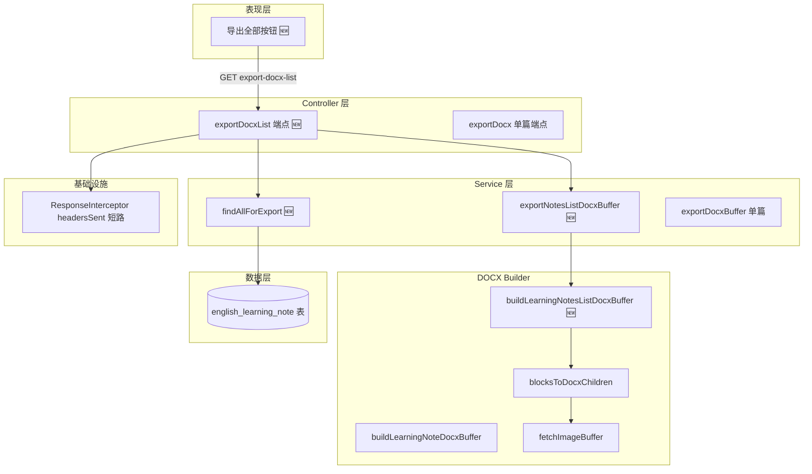
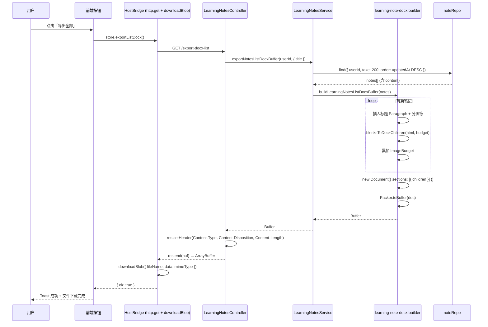

# 学习笔记列表导出 Word — 实现思路

> **状态**：规划  
> **日期**：2026-07-27  
> **需求摘要**：用户在英语学习笔记列表页点击「导出全部」，后端拉取当前用户全量笔记并合成单个 .docx 文件下载，每篇笔记作为一个章节（标题 + 正文富文本 + 图片）。

## 延伸阅读

- [docs/english/学习笔记导出性能.md](../../english/学习笔记导出性能.md) — 单篇导出已落地的实现归档（含 `buildLearningNoteDocxBuffer` 全链路）
- [docs/english/学习笔记富文本编辑.md](../../english/学习笔记富文本编辑.md) — 富文本编辑器与 Tiptap HTML 结构

---

## 0. 读本文你将得到什么

- **要解决什么问题**：用户已能导出单篇笔记，但想一次性导出全部笔记为一个 Word 文档
- **一句话方案**：复用已有 `buildLearningNoteDocxBuffer` 的 HTML→DOCX 管线，新增 `buildLearningNotesListDocxBuffer` 合成多笔记，后端新增 `export-docx-list` 端点拉全量后一次性生成
- **改哪些层**：仅后端（Controller + Service + Builder），前端仅加一个下载按钮调用新端点
- **分两阶段落地**：M1 基础导出（全量合成）→ M2 边界保护（数量上限、超时、分块策略）
- **最大风险**：笔记数 × 图片数导致内存峰值过高或生成耗时超长

---

## 1. 需求与边界

### 1.1 用户故事

| 角色 | 场景 | 行为 | 期望结果 |
|------|------|------|----------|
| 英语学习者 | 笔记列表页 | 点击「导出全部笔记」按钮 | 下载一个 .docx 文件，包含所有笔记，每篇有标题分隔 |
| 英语学习者 | 搜索筛选后（后续支持） | 在标题搜索结果中点击「导出」 | 仅导出筛选匹配的笔记 |

### 1.2 范围

| 在范围内 | 不在范围内（非目标） |
|----------|----------------------|
| 后端新增 `export-docx-list` 端点 | 笔记编辑器内导出 |
| 复用已有 DOCX builder 的 HTML→DOCX 转换 | 导出为 PDF / Markdown |
| 后端端点支持 `?title=` 查询参数筛选（前端暂不暴露） | 批量打包为 ZIP（每篇一个文件） |
| 笔记数 / 图片数 / 总体积上限保护 | 异步任务队列 + 邮件通知 |
| 每篇笔记以标题 + 分页符分隔 | 前端选勾特定笔记 ID 导出 |

### 1.3 约束与依赖

- 须登录（`JwtGuard`），只能导出自己的笔记
- 复用 `buildLearningNoteDocxBuffer` 中已有的 `blocksToDocxChildren` / `splitTopBlocks` / `ImageBudget` 等内部函数
- 笔记正文为 TipTap HTML（`longtext`），图片为外链或 base64
- 性能底线：50 篇笔记 × 平均 10 张图，须在 30s 内完成

---

## 2. 方案总览（一句话 + 要点）

**一句话方案**：在后端新增 `GET /english-learning/notes/export-docx-list` 端点，Service 层拉取当前用户全量笔记（带数量上限），调用新增的 `buildLearningNotesListDocxBuffer` 将多篇笔记的 HTML 依次转换为 DOCX 段落并合入单个 Document。

| # | 设计要点 | 理由 |
|---|----------|------|
| 1 | 新增 `buildLearningNotesListDocxBuffer(notes[])`，内部循环复用 `buildLearningNoteDocxBuffer` 的 HTML→DOCX 块转换逻辑 | 避免重写已验证的 HTML 解析 + 图片下载 + 表格转换管线 |
| 2 | 每篇笔记前插入大标题 Paragraph + 分页符，正文紧随其后 | 与单篇导出视觉一致，Word 中可快速跳转 |
| 3 | 上限保护：最多 200 篇笔记、总 HTML 50M 字符、总图片 200 张 | 与单篇 `NOTE_DOCX_HTML_MAX_CHARS` 同量级，防止内存溢出 |
| 4 | 支持 `title` query 复用搜索筛选 | 用户筛选后可仅导出匹配项，无需新增筛选参数 |
| 5 | 复用 `ResponseInterceptor` 的 `headersSent` 短路逻辑 | 二进制响应不包 JSON，已有模式 |
| 6 | 不走异步队列，同步生成后直接 `res.end(buf)` | 与单词收藏 / 经典句收藏导出一致，简单可靠 |

---

## 3. 现状与复用

| 能力 | 仓库中已有位置 | 本需求用法 |
|------|---------------|-----------|
| 单篇 DOCX 导出端点 | `apps/backend/src/services/learning-notes/learning-notes.controller.ts` `exportDocx()` | 扩展：新增并列端点 `exportDocxList()` |
| 单篇 DOCX 生成 | `apps/backend/src/services/learning-notes/learning-note-docx.builder.ts` `buildLearningNoteDocxBuffer()` | 同文件内新增 `buildLearningNotesListDocxBuffer()`，直接调用文件内私有函数 `splitTopBlocks` / `blocksToDocxChildren`（无需导出） |
| 列表查询 | `apps/backend/src/services/learning-notes/learning-notes.service.ts` `findPage()` | 不适用（分页查询不含 `content` 字段）；新增 `findAllForExport()` 拉全量含 `content` |
| 列表导出模式参考 | `apps/backend/src/services/english-learning/english-learning.service.ts` `exportVocabularyFavoritesDocxBuffer()` | 直接复用模式：`find({ take: MAX })` 拉全量 → builder 生成 |
| 二进制响应短路 | `apps/backend/src/interceptors/response.interceptor.ts` `headersSent` 判断 | 直接复用 |
| 笔记实体 | `apps/backend/src/services/learning-notes/english-learning-note.entity.ts` | 直接复用，`content` 字段为 `longtext` HTML |
| 查询 DTO | `apps/backend/src/services/learning-notes/dto/query-learning-note.dto.ts` | 直接复用 `title` 字段做筛选 |

**调研结论**：HTML→DOCX 转换管线（`splitTopBlocks` → `blocksToDocxChildren` → 图片下载 + 预算管理）已在 `learning-note-docx.builder.ts` 中完整实现，无需重写。列表导出的端点模式在 `english-learning` 中已有两个先例（单词收藏 / 经典句收藏）。**唯一新增**的是将多篇笔记的 HTML 块合入单个 `Document` 的编排逻辑。

---

## 4. 架构图



**图内方法说明**：

| 方法 / 模块入口 | 功能 |
|-----------------|------|
| `exportDocxList()` | Controller 新增端点：接收 `title` 查询参数 → 调 Service 生成 Buffer → 设置响应头 → `res.end(buf)` |
| `findAllForExport()` | Service 新增方法：按 `userId` + 可选 `title` 拉取全量笔记（含 `content` 字段），带数量上限 |
| `exportNotesListDocxBuffer()` | Service 新增方法：调用 `findAllForExport` 获取笔记列表 → 校验总量 → 调用 Builder 生成 DOCX Buffer |
| `buildLearningNotesListDocxBuffer()` | Builder 新增方法：循环每篇笔记，复用 `blocksToDocxChildren` 转换 HTML → 插入标题段 + 分页符 → 合入单个 `Document` |
| `blocksToDocxChildren()` | 已有：将 TipTap HTML 顶层块（p/ul/ol/blockquote/pre/table/img）转为 docx `ParagraphChild[]`，含图片下载与预算管理 |
| `fetchImageBuffer()` | 已有：按外链 URL 拉取图片 buffer，带超时与软上限 |
| `exportDocxBuffer()` | 已有单篇方法，列表导出不直接调用但作为对照参考 |

**读图要点**：

- 分层清晰：Controller 仅做 HTTP 编排，Service 做数据拉取 + 校验，Builder 做 HTML→DOCX 转换
- 新增模块（🆕）集中在 Controller 一处端点、Service 两个方法、Builder 一个函数，改动面小
- `buildLearningNotesListDocxBuffer` 直接复用 `blocksToDocxChildren`（不调 `buildLearningNoteDocxBuffer`），避免每篇创建独立 `Document` 再合并的开销

---

## 5. 主流程图

```mermaid
flowchart TD
  Start([用户点击「导出全部」]) --> Auth{已登录?}
  Auth -->|否| Login[跳转登录]
  Auth -->|是| Hit[前端发起 GET export-docx-list]
  Hit --> Fetch[Service: findAllForExport 拉全量笔记]
  Fetch --> Empty{笔记列表为空?}
  Empty -->|是| NoContent[返回提示：无笔记可导出]
  Empty -->|否| Limit{超过 200 篇?}
  Limit -->|是| Truncate[截取前 200 篇，日志告警]
  Limit -->|否| Build[Builder: 逐篇转换 HTML→DOCX 块]
  Truncate --> Build
  Build --> ImgBudget{图片预算超限?}
  ImgBudget -->|是| SkipImg[跳过超额图片，末尾标注]
  ImgBudget -->|否| Pack[Packer.toBuffer 生成最终 Buffer]
  SkipImg --> Pack
  Pack --> Res[设置 Content-Type / Content-Disposition]
  Res --> End([res.end(buf) → 浏览器下载])
  NoContent --> EndErr([返回 400 提示])
  Login --> EndErr
```

**图内方法说明**：

| 方法 | 功能 |
|------|------|
| `findAllForExport()` | 按 `userId` + 可选 `title` Like 查询，`select` 含 `content` 字段，`take: 200`，按 `updatedAt DESC` 排序 |
| `buildLearningNotesListDocxBuffer()` | 遍历笔记列表：每篇先插入标题 Paragraph（Heading 1）+ 分页符 → 调 `blocksToDocxChildren` 转换正文 → 累加图片预算 → 超额图片记入 `skipped` |
| `Packer.toBuffer()` | docx 库提供：将 `Document` 对象序列化为 .docx 二进制 Buffer |

**读图要点**：

- 入口须登录检查，未登录直接拒绝
- 空列表短路返回 400，避免生成空文档
- 200 篇上限是硬截断，超限不报错但截取并记录告警日志
- 图片预算（`ImageBudget`）在所有笔记间共享，总额超限后跳过后续图片并在文末标注

---

## 6. 核心时序图



**图内方法说明**：

| 方法 | 功能 |
|------|------|
| `store.exportListDocx()` | 前端 store 方法：校验 api/downloadBlob → 调 `api.exportDocxList()` 拿 ArrayBuffer → 调 `downloadBlob` 落盘 → Toast 反馈 |
| `api.exportDocxList()` | 远程插件 API 方法：经 HostBridge `http.get('/export-docx-list')` 拉取 DOCX 二进制，`unwrapData` + `ArrayBuffer.isView` 兜底返回 `ArrayBuffer` |
| `HostBridge http.get` | Host 侧 RPC：将插件的 HTTP 请求转发到后端同源端点，返回 `ArrayBuffer`（二进制响应经 `ResponseInterceptor` 短路，不包 JSON） |
| `HostBridge downloadBlob` | Host 侧 RPC：接收 `{ fileName, data, mimeType }`，Web 端创建 Blob + `<a download>`，Tauri 端写文件系统；返回 `{ ok, hostToasted, message? }` |
| `exportNotesListDocxBuffer()` | Service 编排：拉数据 → 校验 → 调 Builder → 返回 Buffer |
| `buildLearningNotesListDocxBuffer()` | Builder 核心：循环每篇笔记，复用 `blocksToDocxChildren` 转换正文，标题作为 Heading 1，篇间插入分页符 |
| `blocksToDocxChildren()` | 已有（私有）：将 HTML 顶层块（段落 / 列表 / 引用 / 代码块 / 表格 / 图片）转为 docx 段落子元素数组 |
| `find()` | TypeORM Repository 方法：按 `userId` 条件查询，`take` 限制条数，返回含 `content` 字段的全量笔记 |

**读图要点**：

- 远程插件在 iframe 内运行，须经 HostBridge RPC 转发 HTTP 请求和文件下载（与单篇导出完全一致）
- Service 一次性拉全量数据（不分页），`take: 200` 做硬上限
- Builder 循环每篇笔记时共享同一个 `ImageBudget`，全局控制图片总数与字节总量
- 后端响应直接走 `res.end(buf)`，`ResponseInterceptor` 检测到 `headersSent` 自动短路 JSON 包裹
- `downloadBlob` 在 Tauri 端已内部 Toast，Web 端由插件自行 Toast

---

## 8. 模块职责与接口草图

### 8.1 模块一览

| 模块 | 职责 | 新增/改动 | 预估路径 |
|------|------|-----------|----------|
| LearningNotesController | 新增 `export-docx-list` GET 端点 | 改动 | `apps/backend/src/services/learning-notes/learning-notes.controller.ts` |
| LearningNotesService | 新增 `findAllForExport` + `exportNotesListDocxBuffer` | 改动 | `apps/backend/src/services/learning-notes/learning-notes.service.ts` |
| learning-note-docx.builder | 同文件内新增 `buildLearningNotesListDocxBuffer`（直接调用私有 `splitTopBlocks` / `blocksToDocxChildren`，无需导出） | 改动 | `apps/backend/src/services/learning-notes/learning-note-docx.builder.ts` |

### 8.2 后端实现代码

#### 8.2.1 `learning-note-docx.builder.ts` — 新增常量与 `buildLearningNotesListDocxBuffer`

文件：`apps/backend/src/services/learning-notes/learning-note-docx.builder.ts`

在已有的 `buildLearningNoteDocxBuffer` 函数下方新增以下代码。核心思路：**不调用 `buildLearningNoteDocxBuffer` 逐篇生成再合并**，而是直接复用同文件内已有的 `splitTopBlocks` + `blocksToDocxChildren` + `ImageBudget` 等内部函数，在单个 `Document` 内循环插入每篇笔记的段落，共享一个图片预算。

```typescript
// 列表导出最多笔记条数
export const NOTES_LIST_DOCX_MAX_COUNT = 200;
// 列表导出全部笔记 HTML 字符总量上限
export const NOTES_LIST_DOCX_TOTAL_HTML_MAX_CHARS = 50_000_000;

/**
 * 将多篇学习笔记合成单个 DOCX Buffer。
 * 每篇笔记以大标题 + 分页符开头，正文紧随其后；
 * 所有笔记共享同一个 ImageBudget，超额图片在文末统一标注。
 */
export async function buildLearningNotesListDocxBuffer(
	notes: ReadonlyArray<{ title: string | null; html: string }>,
): Promise<Buffer> {
	// 所有笔记共享一个图片预算（count / bytes / skipped）
	const budget: ImageBudget = { count: 0, bytes: 0, skipped: 0 };
	// 最终合入 Document 的段落/表格数组
	const children: DocxChild[] = [];

	// 首页：文档大标题 + 统计信息
	children.push(
		new Paragraph({
			spacing: { before: 0, after: 200, line: 312, lineRule: LineRuleType.AUTO },
			children: [
				new TextRun({
					text: `学习笔记合集（共 ${notes.length} 篇）`,
					bold: true,
					size: 48,
					color: '1A1A1A',
				}),
			],
		}),
	);
	children.push(new Paragraph({ text: '' }));

	let totalHtmlChars = 0;

	// 逐篇处理：标题 + 分页符 + 正文
	for (let i = 0; i < notes.length; i++) {
		const note = notes[i];
		const title = note.title?.trim() || '无标题笔记';
		const html = note.html ?? '';

		// 全局 HTML 字符总量校验
		totalHtmlChars += html.length;
		if (totalHtmlChars > NOTES_LIST_DOCX_TOTAL_HTML_MAX_CHARS) {
			// 超限：跳过该篇，文末标注
			budget.skipped += 0; // 不计入图片跳过
			children.push(
				new Paragraph({
					children: [
						new TextRun({
							text: `（第 ${i + 1} 篇「${clip(title, 50)}」内容过大，已跳过）`,
							italics: true,
							color: '888888',
							size: 18,
						}),
					],
				}),
			);
			continue;
		}

		// 单篇 HTML 字符上限校验（复用单篇常量）
		if (html.length > NOTE_DOCX_HTML_MAX_CHARS) {
			children.push(
				new Paragraph({
					children: [
						new TextRun({
							text: `（第 ${i + 1} 篇「${clip(title, 50)}」超过 ${NOTE_DOCX_HTML_MAX_CHARS} 字符，已跳过）`,
							italics: true,
							color: '888888',
							size: 18,
						}),
					],
				}),
			);
			continue;
		}

		// 篇间分页符（第一篇前不插）
		if (i > 0) {
			children.push(
				new Paragraph({
					pageBreakBefore: true,
					children: [],
				}),
			);
		}

		// 笔记标题（Heading 风格，非 Word 内置 Heading 以避免蓝字）
		children.push(
			new Paragraph({
				spacing: { before: 0, after: 160, line: 312, lineRule: LineRuleType.AUTO },
				children: [
					new TextRun({
						text: clip(title, 200),
						bold: true,
						size: 44,
						color: '1A1A1A',
					}),
				],
			}),
		);

		// 去掉 TipTap 的 note-title div（与单篇导出一致）
		const body = html.replace(
			/<div[^>]*data-type=["']note-title["'][^>]*>[\s\S]*?<\/div>/gi,
			'',
		);

		// 复用已有的 blocksToDocxChildren 转换正文 HTML → docx 段落/表格
		const paras = await blocksToDocxChildren(splitTopBlocks(body), budget);
		children.push(...paras);
	}

	// 图片跳过提示（与单篇导出一致）
	if (budget.skipped > 0) {
		children.push(new Paragraph({ text: '' }));
		children.push(
			new Paragraph({
				children: [
					new TextRun({
						text: `（有 ${budget.skipped} 张图片未能嵌入：格式不支持或文件过大）`,
						italics: true,
						color: '888888',
						size: 18,
					}),
				],
			}),
		);
	}

	// 构建 Document（样式与单篇导出完全一致）
	const doc = new Document({
		styles: {
			default: {
				document: {
					run: { font: 'Calibri', size: BODY_SIZE, color: '1A1A1A' },
					paragraph: {
						spacing: { line: BODY_LINE, lineRule: LineRuleType.AUTO },
					},
				},
			},
		},
		sections: [
			{
				properties: {
					page: {
						margin: { top: 720, right: 720, bottom: 720, left: 720 },
					},
				},
				children,
			},
		],
	});
	return Buffer.from(await Packer.toBuffer(doc));
}
```

#### 8.2.2 `learning-notes.service.ts` — 新增 `findAllForExport` 与 `exportNotesListDocxBuffer`

文件：`apps/backend/src/services/learning-notes/learning-notes.service.ts`

在已有的 `exportDocxBuffer` 方法下方新增。`findAllForExport` 拉取全量笔记（含 `content` 字段），与 `findPage` 的区别是**不分页、select 含 content**。`exportNotesListDocxBuffer` 做编排：拉数据 → 空列表校验 → 调 Builder → 异常包装。

需要新增的 import（在文件头部已有的 import 块中追加）：

```typescript
// 第 1-5 行已有：import { BadRequestException, Injectable, NotFoundException } from '@nestjs/common';
// 改为（新增 Logger）：
import {
	BadRequestException,
	Injectable,
	Logger,
	NotFoundException,
} from '@nestjs/common';

// 第 12-15 行已有：import { buildLearningNoteDocxBuffer, NOTE_DOCX_HTML_MAX_CHARS } from './learning-note-docx.builder';
// 改为（新增 buildLearningNotesListDocxBuffer / NOTES_LIST_DOCX_MAX_COUNT）：
import {
	buildLearningNoteDocxBuffer,
	buildLearningNotesListDocxBuffer,
	NOTE_DOCX_HTML_MAX_CHARS,
	NOTES_LIST_DOCX_MAX_COUNT,
} from './learning-note-docx.builder';
```

```typescript
	// 类属性：日志器（与 EnglishLearningService 模式一致）
	private readonly logger = new Logger(LearningNotesService.name);

	/**
	 * 拉取当前用户全量笔记（含 content），用于列表导出。
	 * 与 findPage 的区别：不分页、select 含 content、take 上限 200。
	 */
	async findAllForExport(
		userId: number,
		title?: string,
	): Promise<EnglishLearningNote[]> {
		const where: Record<string, unknown> = { userId };
		const t = title?.trim();
		if (t) where.title = Like(`%${t}%`);

		return this.noteRepo.find({
			where,
			order: { updatedAt: 'DESC' },
			take: NOTES_LIST_DOCX_MAX_COUNT,
		});
	}

	/**
	 * 导出当前用户全部笔记为单个 DOCX（按 updatedAt DESC，最多 200 篇）。
	 * 可选 title 参数：仅导出标题匹配的笔记（与列表搜索一致）。
	 */
	async exportNotesListDocxBuffer(
		userId: number,
		query: { title?: string },
	): Promise<Buffer> {
		const notes = await this.findAllForExport(userId, query.title);
		if (!notes.length) {
			throw new BadRequestException('暂无笔记可导出');
		}
		if (notes.length > NOTES_LIST_DOCX_MAX_COUNT) {
			// 理论上不会触发（take 已限制），但防御性日志
			this.logger.warn(
				`用户 ${userId} 笔记数 ${notes.length} 超过上限 ${NOTES_LIST_DOCX_MAX_COUNT}，已截取`,
			);
		}
		try {
			return await buildLearningNotesListDocxBuffer(
				notes.map((n) => ({
					title: n.title,
					html: n.content ?? '',
				})),
			);
		} catch (e) {
			const msg = e instanceof Error ? e.message : String(e);
			throw new BadRequestException(msg || '导出失败');
		}
	}
```

#### 8.2.3 `learning-notes.controller.ts` — 新增 `export-docx-list` 端点

文件：`apps/backend/src/services/learning-notes/learning-notes.controller.ts`

在已有的 `exportDocx`（单篇导出）方法下方新增。与单篇端点的区别：**不需要 `:id` 路径参数**，改为可选 `title` 查询参数做筛选。

```typescript
	/** 导出全部笔记 DOCX（原始二进制；与列表分页无关，最多 200 篇） */
	@Get('export-docx-list')
	async exportDocxList(
		@Req() req: AuthedRequest,
		@Query('title') title: string | undefined,
		@Res() res: Response,
	): Promise<void> {
		const buf = await this.notesService.exportNotesListDocxBuffer(
			this.userId(req),
			{ title },
		);
		res.setHeader(
			'Content-Type',
			'application/vnd.openxmlformats-officedocument.wordprocessingml.document',
		);
		res.setHeader(
			'Content-Disposition',
			'attachment; filename="learning-notes.docx"',
		);
		res.setHeader('Content-Length', String(buf.length));
		res.end(buf);
	}
```

### 8.3 前端实现代码

#### 8.3.1 `api.ts` — 新增 `exportDocxList` 方法

文件：`apps/remote-plugins/src/views/learning-notes/api.ts`

在已有的 `exportDocx`（单篇导出）方法下方新增。与单篇的区别：**不需要 `id` 参数**，后端端点为 `export-docx-list`。返回 `ArrayBuffer` 的逻辑与单篇完全一致（`unwrapData` + `ArrayBuffer.isView` 兜底）。

> 后端端点支持可选 `?title=` 查询参数做筛选，但当前列表页未实现标题搜索，因此 API 方法暂不暴露 `title` 参数。后续若增加搜索功能可扩展签名为 `exportDocxList(title?: string)`。

```typescript
		/** 拉取全部笔记 DOCX 二进制（服务端生成，最多 200 篇） */
		async exportDocxList(): Promise<ArrayBuffer> {
			const res = await http.get(`${BASE}/export-docx-list`);
			const data = unwrapData<unknown>(res);
			if (data instanceof ArrayBuffer) return data;
			if (ArrayBuffer.isView(data)) {
				const v = data as ArrayBufferView;
				return v.buffer.slice(
					v.byteOffset,
					v.byteOffset + v.byteLength,
				) as ArrayBuffer;
			}
			throw new Error(translateSync('learningNotes.toast.exportInvalid'));
		},
```

#### 8.3.2 `store/learningNotes.ts` — 新增 `exportingListDocx` 状态与 `exportListDocx` 方法

文件：`apps/remote-plugins/src/store/learningNotes.ts`

在已有的 `exportPreviewDocx`（单篇导出）方法下方新增。与单篇导出的区别：**不需要 `preview.id`**，直接调用 `api.exportDocxList`；文件名使用 `learning-notes-{日期}.docx`。

> 当前 store 无 `searchTitle` 字段（列表页未实现标题搜索），因此 `exportListDocx` 暂不传 `title` 参数。后续若列表页增加搜索功能，可改为 `exportListDocx(title?: string)` 透传。

需新增的 observable 状态（在 `exportingDocx = false;` 下方）：

```typescript
	/** 列表导出 loading */
	exportingListDocx = false;
```

```typescript
	/** 导出全部笔记为 DOCX（服务端生成 + Host downloadBlob 落盘） */
	async exportListDocx(): Promise<void> {
		if (!this.api) {
			this.toast(this.t('learningNotes.toast.httpDeniedExport'), 'error');
			return;
		}
		if (!this.downloadBlob) {
			this.toast(this.t('learningNotes.toast.exportNoDownload'), 'error');
			return;
		}
		if (this.exportingListDocx) return;
		this.exportingListDocx = true;
		try {
			// 拉取全部笔记 DOCX 二进制（服务端生成，最多 200 篇）
			const buf = await this.api.exportDocxList();
			// 文件名：learning-notes-YYYYMMDD-HHmmss.docx
			const now = new Date();
			const stamp = `${now.getFullYear()}${String(now.getMonth() + 1).padStart(2, '0')}${String(now.getDate()).padStart(2, '0')}-${String(now.getHours()).padStart(2, '0')}${String(now.getMinutes()).padStart(2, '0')}${String(now.getSeconds()).padStart(2, '0')}`;
			const result = await this.downloadBlob({
				fileName: `learning-notes-${stamp}.docx`,
				data: buf,
				mimeType: DOCX_MIME,
			});
			if (!result.ok) {
				// 对齐收藏导出：Tauri 失败时 Host 已 Toast
				if (!result.hostToasted) {
					this.toast(
						result.message || this.t('learningNotes.toast.exportFail'),
						'error',
					);
				}
				return;
			}
			// Tauri：downloadBlob 内已成功 Toast；Web：由插件提示
			if (!result.hostToasted) {
				this.toast(this.t('learningNotes.toast.exportOk'), 'success');
			}
		} catch (e) {
			this.toast(errMsg(e, this.t), 'error');
		} finally {
			runInAction(() => {
				this.exportingListDocx = false;
			});
		}
	}
```

#### 8.3.3 `views/learning-notes/index.tsx` — 新增导出全部按钮

文件：`apps/remote-plugins/src/views/learning-notes/index.tsx`

在已有的单篇导出按钮（位于 `previewHeaderExtra` useMemo 内，`<Btn onClick={() => void store.exportPreviewDocx()}>`）旁新增一个列表导出按钮。按钮文案与单篇导出做区分，避免用户混淆。

当前已有的单篇导出按钮代码（`index.tsx` 约第 188–198 行）：

```tsx
<Btn
	title={
		store.exportingDocx
			? t('learningNotes.exportingDocx')
			: t('learningNotes.exportDocx')
	}
	disabled={store.exportingDocx || store.loadingDetail}
	onClick={() => void store.exportPreviewDocx()}
>
	<FileDown size={15} />
</Btn>
```

在其后新增列表导出按钮：

```tsx
{/* 列表导出按钮（新增） */}
<Btn
	title={
		store.exportingListDocx
			? t('learningNotes.exportingListDocx')
			: t('learningNotes.exportListDocx')
	}
	disabled={store.exportingListDocx}
	onClick={() => void store.exportListDocx()}
>
	<Files size={15} />
</Btn>
```

同时需更新 `previewHeaderExtra` 的 `useMemo` deps 数组，追加 `store.exportingListDocx`：

```tsx
		[
			listToggleBtn,
			store,
			store.exportingDocx,
			store.exportingListDocx,
			store.loadingDetail,
			store.preview,
			t,
		],
```

并在文件头部 `lucide-react` 导入中新增 `Files`（当前导入为 `FileDown, FilePenLine, NotebookText, Save, SquarePen, Trash2`）：

```typescript
import {
	FileDown,
	FilePenLine,
	Files,
	NotebookText,
	Save,
	SquarePen,
	Trash2,
} from 'lucide-react';
```

#### 8.3.4 i18n 新增 key

当前已有的导出相关 key（`zh-CN.ts` 第 37–38 行 / `en-US.ts` 第 38–39 行）：

```typescript
// zh-CN.ts（已有）
'learningNotes.exportDocx': '导出 Word',
'learningNotes.exportingDocx': '导出中…',
// en-US.ts（已有）
'learningNotes.exportDocx': 'Export Word',
'learningNotes.exportingDocx': 'Exporting…',
```

需在以上 key 下方新增：

```typescript
// zh-CN.ts（新增）
'learningNotes.exportListDocx': '导出全部笔记',
'learningNotes.exportingListDocx': '导出全部中…',
```

```typescript
// en-US.ts（新增）
'learningNotes.exportListDocx': 'Export all notes',
'learningNotes.exportingListDocx': 'Exporting all…',
```

### 8.4 数据模型

| 字段/实体 | 来源 | 存储 | 说明 |
|-----------|------|------|------|
| `EnglishLearningNote.id` | DB | `english_learning_note.id` | UUID 主键 |
| `EnglishLearningNote.title` | DB | `varchar(200)` | 笔记标题，可空 |
| `EnglishLearningNote.content` | DB | `longtext` | TipTap HTML 正文 |
| `EnglishLearningNote.updatedAt` | DB | `timestamp` | 排序依据（DESC） |

---

## 9. 分阶段实现步骤

| 阶段 | 目标 | 交付物 | 依赖 |
|------|------|--------|------|
| M1 | 最小可用：全量合成 + 下载 | 新端点 + Builder + Service | 已有单篇 Builder |
| M2 | 边界保护 + 自检 | 上限校验 + 单元自检脚本 | M1 |

### M1：基础导出

- [ ] 在 `learning-note-docx.builder.ts` 中导出 `blocksToDocxChildren`（如尚未导出）
- [ ] 新增 `buildLearningNotesListDocxBuffer(notes[])` 函数
- [ ] 在 `learning-notes.service.ts` 新增 `findAllForExport()` 方法
- [ ] 在 `learning-notes.service.ts` 新增 `exportNotesListDocxBuffer()` 方法
- [ ] 在 `learning-notes.controller.ts` 新增 `export-docx-list` GET 端点
- [ ] 手动验证：3 篇笔记（含图片 + 表格）导出后 Word 打开正常

### M2：边界保护与自检

- [ ] 在 Builder 中增加 `NOTES_LIST_DOCX_MAX_COUNT` / `NOTES_LIST_DOCX_TOTAL_HTML_MAX_CHARS` 常量
- [ ] Service 层超限时截取 + 日志告警
- [ ] ImageBudget 在多篇间共享，超额图片跳过 + 文末标注
- [ ] 新增 `learning-note-docx.list.selfcheck.ts` 自检脚本（多笔记含嵌套列表 / 图片 / 表格）
- [ ] 空列表返回 400 而非生成空文档
- [ ] 性能压测：50 篇 × 10 张图，验证 30s 内完成

---

## 10. 关键决策与备选方案

| 决策 | 选用 | 备选 | 为何不选备选 |
|------|------|------|--------------|
| 单篇转换 vs 整体 Document | 在一个 `Document` 内循环每篇插入 children | 每篇独立生成 Buffer 再合并 | 合并多个 .docx 需额外库（如 docx-merger），且图片/样式可能丢失；单 Document 方式天然共享样式表 |
| 同步生成 vs 异步队列 | 同步生成后直接返回 | 异步任务 + 邮件通知 | 与已有单词收藏 / 经典句收藏导出一致（同步 `take: 3000`）；200 篇笔记在 30s 内可完成，无需引入队列复杂度 |
| 分页拉取 vs 全量拉取 | 一次性 `find({ take: 200 })` | 分页 `skip/take` 循环 | 200 条 longtext 查询一次完成，DB 连接占用短；分页循环增加 RTT 且 `skip` 深翻性能差 |
| 前端下载方式 | 经 HostBridge `http.get` 拉取 ArrayBuffer + `downloadBlob` 落盘 | 浏览器原生 GET 下载（`window.location.href`） | 远程插件在 iframe 内运行，无法直接发同源 HTTP 请求；须经 HostBridge RPC 转发。与单篇导出完全一致 |
| 图片预算共享 vs 独立 | 所有笔记共享一个 `ImageBudget` | 每篇独立预算后累加 | 共享预算简单且全局控制总量；独立预算需额外累加逻辑且无法防全局超限 |

---

## 11. 风险、边界与待确认

| 项 | 等级 | 说明 | 缓解 |
|----|------|------|------|
| 内存峰值 | 高 | 200 篇 longtext + 图片 buffer 同时在内存 | `NOTES_LIST_DOCX_TOTAL_HTML_MAX_CHARS` 上限 50M；图片全局预算 40M（复用 `NOTE_DOCX_IMAGES_TOTAL_SOFT_MAX_BYTES`） |
| 生成耗时 | 中 | HTML 解析 + 图片下载（每张 20s 超时） | 图片数上限复用 `NOTE_DOCX_IMAGE_MAX_COUNT`（120 张）；超时图片跳过不阻塞 |
| 空标题笔记 | 低 | `title` 为 null 的笔记在 Word 中无标题 | Builder 内 `title?.trim() \|\| '无标题笔记'` 兜底 |
| 并发导出 | 低 | 同一用户多次点击导出 | 后端无状态，每次独立生成；前端按钮加 loading 防抖 |
| 超大单篇 | 中 | 单篇 HTML 超过 `NOTE_DOCX_HTML_MAX_CHARS`（5M） | 列表导出时每篇单独校验，超限跳过该篇并在文末标注 |

**待确认**：

- [x] 前端列表页是否已有「导出」按钮的 UI 位置 — **已确认**：单篇导出按钮位于 `index.tsx` 的 `previewHeaderExtra` useMemo 内（约 L188–L198），列表导出按钮应紧随其后
- [ ] 后端 NestJS 默认请求超时是否影响大文件生成（验证方式：检查 `main.ts` 中是否设置 `server.timeout`）

---

## 12. 验收清单

| # | 用例 | 步骤 | 期望 |
|---|------|------|------|
| AC1 | 空笔记列表导出 | 用户无笔记时点击导出 | 返回 400 + 错误提示「暂无笔记可导出」 |
| AC2 | 3 篇笔记导出 | 创建 3 篇笔记（含图片 + 表格 + 列表），点击导出 | 下载 .docx，Word 打开后有 3 个章节，每章标题 + 正文格式正确 |
| AC3 | 标题筛选导出 | 搜索关键词后点击导出 | 仅导出标题匹配的笔记 |
| AC4 | 超过 200 篇 | 创建 201 篇笔记后导出 | 仅导出前 200 篇（按 updatedAt DESC），无报错 |
| AC5 | 图片超限跳过 | 笔记含超过 120 张图片 | 超额图片跳过，文末出现「有 N 张图片未能嵌入」提示 |
| AC6 | 无标题笔记 | 创建一篇无标题笔记后导出 | 该篇在 Word 中标题显示「无标题笔记」 |
| AC7 | 未登录访问 | 直接 GET `/export-docx-list` 无 token | 返回 401 |

---

## 13. 预估改动面（实现阶段参考）

| 类型 | 路径（预估） |
|------|--------------|
| 后端 | `apps/backend/src/services/learning-notes/learning-notes.controller.ts`（+15 行） |
| 后端 | `apps/backend/src/services/learning-notes/learning-notes.service.ts`（+30 行） |
| 后端 | `apps/backend/src/services/learning-notes/learning-note-docx.builder.ts`（+80 行） |
| 后端（自检） | `apps/backend/src/services/learning-notes/learning-note-docx.list.selfcheck.ts`（新建） |
| 前端 | `apps/remote-plugins/src/views/learning-notes/index.tsx`（+1 按钮调用端点） |
| 文档（实现后） | `docs/english/学习笔记列表导出.md` |

---

（本文档为规划态实现思路；落地后以源码与 `docs/english/` 专题为准）