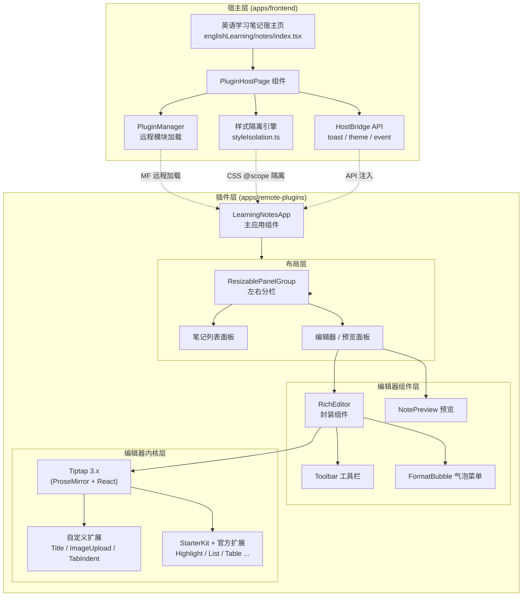
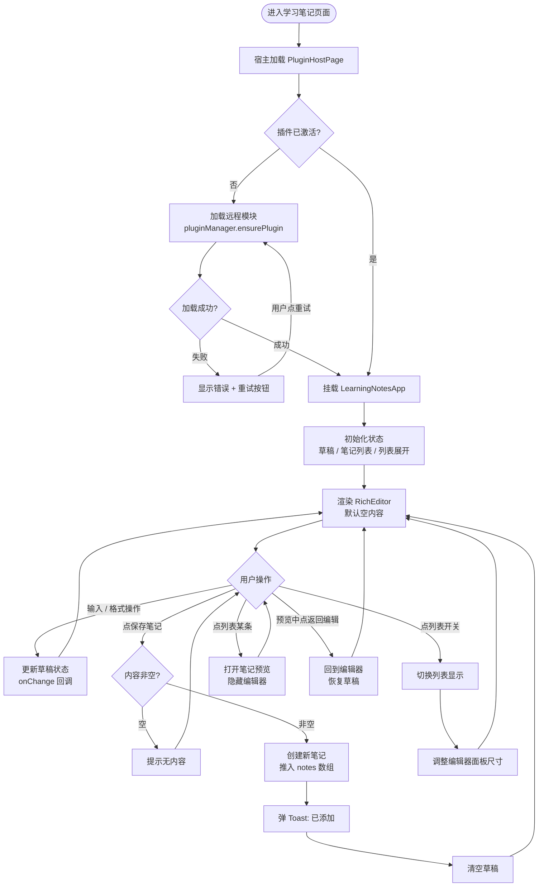
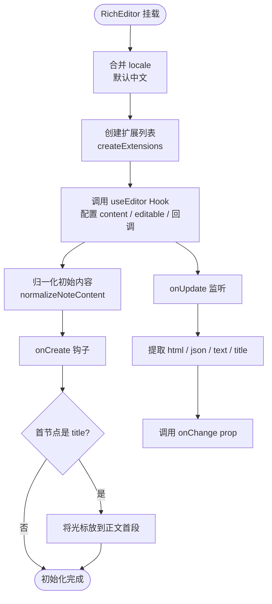
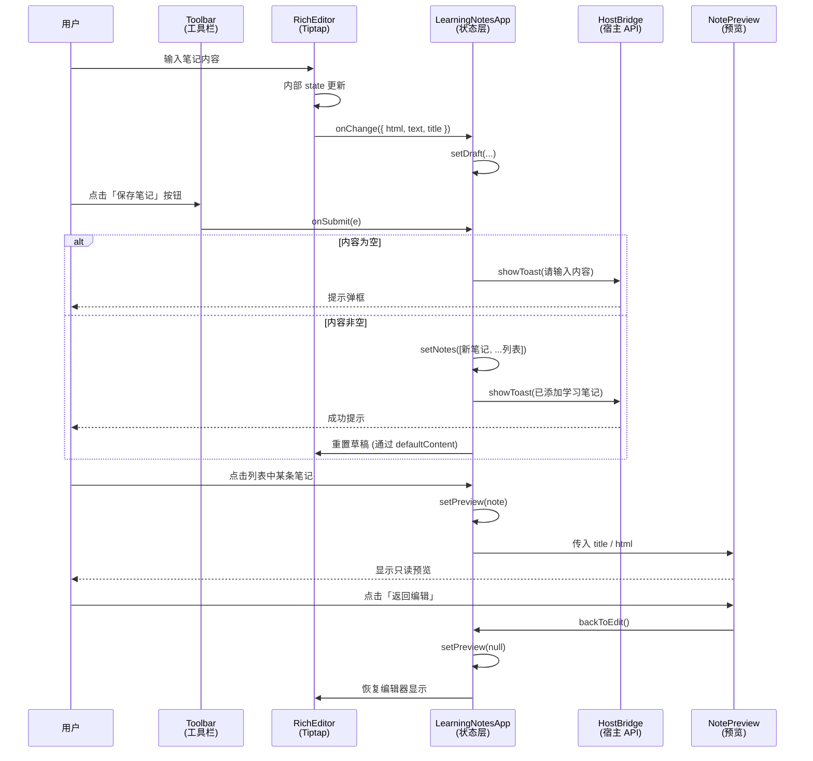
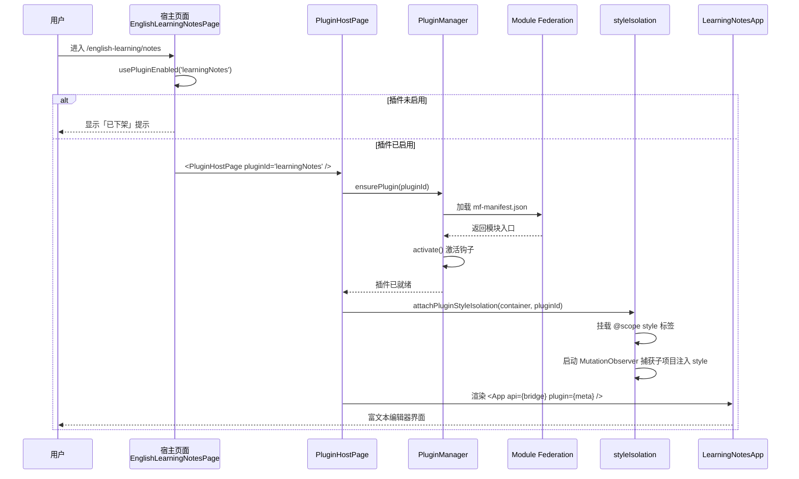

# 学习笔记富文本编辑器 — 实现思路

> **状态**：规划 | **日期**：2026-07-24 | **需求摘要**：在英语学习模块的学习笔记功能中，将原有纯文本 textarea 升级为基于 Tiptap 的富文本编辑器，支持格式化文本、高亮标记、列表、代码块等能力，配合左右分栏布局与笔记列表，提供类 Notion 的轻量笔记体验。

## 0. 读本文你将得到什么

- **一句话方案**：以 Tiptap 3.x（ProseMirror + React）为编辑器内核，封装为可复用的 `RichEditor` 设计系统组件，在 `remote-plugins` 子应用中组装「编辑器 + 预览 + 笔记列表」三栏布局，通过 Module Federation 动态加载到英语学习宿主页面。
- **3 张核心图**：分层架构图、用户主流程图、保存/加载时序图。
- **模块拆分**：编辑器内核层、UI 组件层、业务逻辑层、插件宿主层，共 4 层 12 个模块。
- **分阶段落地**：M1 编辑器基础封装 → M2 工具栏与气泡菜单 → M3 笔记列表与分栏 → M4 图片与表格 → M5 后端持久化与同步。
- **风险与权衡**：HTML 存储 vs JSON 存储、样式隔离、CORS 与跨域图片、性能与大数据量。

---

## 1. 背景与目标

### 1.1 为什么做

英语学习模块已有「学习笔记」入口（`/english-learning/notes`），但初始版本为纯 textarea，存在以下体验缺口：

1. **排版能力弱**：无法区分标题/正文/代码，长笔记可读性差。
2. **标记手段少**：学习重点无法用高亮、加粗、列表等方式标注，不利于复习。
3. **列表管理缺失**：多条笔记混在一个输入框中，无法按条目检索与回顾。
4. **预览不直观**：纯文本无法直观呈现格式化效果。

### 1.2 目标（MVP）

| 维度 | 目标 |
|------|------|
| **编辑能力** | 支持标题（H1–H5）、加粗、斜体、删除线、下划线、行内代码、代码块、有序/无序列表、任务列表、高亮（多色）、引用、对齐、链接、图片、表格 |
| **交互体验** | 顶部工具栏 + 选中气泡菜单 + 快捷键；字数统计；占位提示；中文 UI |
| **笔记管理** | 左侧笔记列表、右侧编辑器/预览；列表可拖拽宽度、可收起；新建/切换/预览 |
| **数据存储** | HTML 字符串为主要存储格式，附带纯文本与标题；M1–M3 用 localStorage 演示，M5 接后端 |
| **技术约束** | 以 MF 远程插件形式交付，样式由 Host 侧自动隔离，子项目零侵入 |

### 1.3 非目标（YAGNI）

- 多人实时协作（OT / CRDT）
- 离线优先 / PWA
- Markdown 源码模式切换
- 笔记标签 / 文件夹分类（M5+ 再考虑）
- 导出 PDF / DOCX
- 全文搜索
- 音视频嵌入

---

## 2. 现状与复用

### 2.1 可复用能力盘点

| 能力 | 已有位置 | 本需求用法 | 状态 |
|------|---------|-----------|------|
| **MF 插件宿主** | `apps/frontend/src/plugins/host/PluginHostPage.tsx` | 直接承载学习笔记插件页面 | 已有 |
| **PluginManager** | `apps/frontend/src/plugins/core/PluginManager.ts` | 远程模块加载、激活、错误重试 | 已有 |
| **样式隔离** | `apps/frontend/src/plugins/host/styleIsolation.ts` | CSS @scope + DOM 劫持自动隔离子项目样式 | 已有 |
| **HostBridge API** | `apps/frontend/src/plugins/core/createHostBridge.ts` | 提供 toast、theme、navigate、event 等宿主能力 | 已有 |
| **插件注册表** | `apps/frontend/src/plugins/core/registry.ts` | 配置 learningNotes 插件入口与路由 | 已有 |
| **UI 组件库** | `apps/remote-plugins/src/components/ui/` | Button、ScrollArea、DropdownMenu、ResizablePanels | 已有 |
| **Tailwind 主题变量** | `apps/remote-plugins/src/styles.css` | 复用 `--theme-background` 等 CSS 变量 | 已有 |
| **Lucide React 图标** | `apps/remote-plugins/package.json` | 工具栏与气泡菜单图标 | 已有 |
| **英语学习笔记宿主页** | `apps/frontend/src/views/englishLearning/notes/index.tsx` | 作为 PluginHostPage 的容器 | 已有，需精简 |

### 2.2 需新增能力

| 能力 | 说明 | 建议位置 |
|------|------|---------|
| **Tiptap 编辑器封装** | RichEditor 组件，含 toolbar、bubble menu、image upload | `apps/remote-plugins/src/components/design/RichEditor/` |
| **笔记预览组件** | NotePreview，渲染 HTML 正文 + 顶栏标题 | `apps/remote-plugins/src/components/design/NotePreview/` |
| **学习笔记主应用** | LearningNotesApp，组装编辑器+列表+分栏 | `apps/remote-plugins/src/views/learning-notes/index.tsx` |
| **Tiptap 扩展** | Title 自定义节点、TabIndent、图片上传、代码高亮 | RichEditor/extensions.ts |
| **国际化** | 编辑器工具栏中文字典 | RichEditor/locale.ts |

---

## 3. 总体架构

### 3.1 分层架构图



**图内方法说明**

| 节点 / 方法 | 做什么 | 输入 / 输出要点 |
|------------|--------|----------------|
| `PluginHostPage` | 承载远程插件页面，处理加载态 / 错误态 / 重试 | 输入：pluginId；输出：React 组件（已激活插件的根节点） |
| `pluginManager.ensurePlugin()` | 确保插件已加载并激活，失败抛错 | 输入：pluginId, force?；输出：Promise<void> |
| `attachPluginStyleIsolation()` | 为子项目 DOM 根节点挂载 @scope 样式隔离 | 输入：container, pluginId；输出：cleanup 函数 |
| `createHostBridge()` | 创建宿主 API 桥接对象 | 输入：plugin 元信息；输出：HostBridgeProps |
| `LearningNotesApp` | 学习笔记插件主入口，组装布局与状态 | 输入：HostBridgeProps；输出：React 组件 |
| `RichEditor` | Tiptap 二次封装富文本编辑器 | 输入：content / onChange / toolbarExtra / ...；输出：React 组件 |
| `createExtensions()` | 组装 Tiptap 扩展列表 | 输入：CreateExtensionsOptions；输出：Extensions 数组 |
| `NotePreview` | 笔记只读预览组件 | 输入：title / html / headerExtra；输出：React 组件 |

**读图要点**：
- 采用 **宿主 + 远程插件** 两层架构，编辑器作为插件内部能力，不侵入主站代码。
- 编辑器内部再分 **内核层 → 组件层 → 布局层 → 应用层** 四层，层层封装，便于复用。
- 样式与能力均通过宿主注入，插件只需关注业务逻辑与 UI 组装。

### 3.2 模块职责总览

| 层级 | 模块 | 职责 | 关键文件 |
|------|------|------|---------|
| 宿主层 | PluginHostPage | 加载、错误重试、样式隔离挂载 | `apps/frontend/src/plugins/host/PluginHostPage.tsx` |
| 宿主层 | PluginManager | 远程模块生命周期管理 | `apps/frontend/src/plugins/core/PluginManager.ts` |
| 宿主层 | styleIsolation | CSS @scope + DOM 劫持双层捕获 | `apps/frontend/src/plugins/host/styleIsolation.ts` |
| 插件应用层 | LearningNotesApp | 状态管理、布局组装、业务逻辑 | `apps/remote-plugins/src/views/learning-notes/index.tsx` |
| 编辑器组件层 | RichEditor | Tiptap 封装、统一接口 | `apps/remote-plugins/src/components/design/RichEditor/index.tsx` |
| 编辑器组件层 | Toolbar | 顶部工具栏（分组、更多菜单、响应式） | `apps/remote-plugins/src/components/design/RichEditor/Toolbar.tsx` |
| 编辑器组件层 | FormatBubble | 选中后气泡格式菜单 | `apps/remote-plugins/src/components/design/RichEditor/FormatBubble.tsx` |
| 编辑器组件层 | NotePreview | 只读预览渲染 | `apps/remote-plugins/src/components/design/NotePreview/index.tsx` |
| 编辑器内核层 | extensions | Tiptap 扩展组装 | `apps/remote-plugins/src/components/design/RichEditor/extensions.ts` |
| 编辑器内核层 | createNode | Title 自定义节点、内容归一化 | `apps/remote-plugins/src/components/design/RichEditor/createNode.ts` |
| 编辑器内核层 | image / ImageUpload | 图片上传扩展 | `apps/remote-plugins/src/components/design/RichEditor/image.ts` |
| 编辑器内核层 | locale | 中文字典 | `apps/remote-plugins/src/components/design/RichEditor/locale.ts` |

---

## 4. 核心流程图

### 4.1 用户主流程



**图内方法说明**

| 方法 / 节点 | 做什么 | 输入 / 输出要点 |
|------------|--------|----------------|
| `pluginManager.ensurePlugin()` | 确保插件已加载激活 | 输入：pluginId, force?；输出：Promise<void>，失败抛错 |
| `LearningNotesApp` | 主组件，管理所有状态与布局 | 输入：HostBridgeProps；输出：ReactNode |
| `RichEditor onChange` | 编辑器内容变化回调 | 输入：{ html, json, text, title }；输出：void |
| `onSubmit` | 保存笔记处理函数 | 输入：MouseEvent；输出：void，内部调用 setNotes 与 showToast |
| `toggleNotesList` | 切换笔记列表显示 | 输入：无；输出：void，更新 listOpen 状态 |
| `setPreview` | 打开/切换笔记预览 | 输入：Note \| null；输出：void |

**读图要点**：
- 主流程围绕 **「编辑 → 保存 → 列表管理 → 预览」** 四条路径展开，均在单个组件内完成。
- 插件加载失败有明确的错误态与重试入口，不阻塞其它英语学习功能。
- 编辑器与预览通过 CSS `hidden` 切换而非条件挂载，避免草稿丢失。

### 4.2 编辑器初始化流程



---

## 5. 关键时序图

### 5.1 笔记保存与预览时序



**图内方法说明**

| 参与者 / 方法 | 做什么 | 输入 / 输出要点 |
|--------------|--------|----------------|
| `RichEditor onChange` | 内容变化时向上通知 | 输入：{ html, json, text, title }；输出：void |
| `onSubmit` | 保存笔记事件处理 | 输入：MouseEvent；输出：void，内部 setNotes + showToast |
| `api.ui.showToast` | 宿主提供的提示能力 | 输入：{ message, type? }；输出：void |
| `setPreview` | 切换到预览模式 | 输入：Note \| null；输出：void |
| `backToEdit` | 返回编辑模式 | 输入：无；输出：void，setPreview(null) |

**读图要点**：
- 数据流为**单向**：编辑器 → App 状态 → 预览，没有双向绑定。
- 保存操作完全在前端内存完成（MVP 阶段），后端持久化在 M5 引入。
- HostBridge 是宿主与插件的唯一通信通道，插件不直接访问宿主 DOM。

### 5.2 插件加载与样式隔离时序



---

## 6. 数据模型与状态设计

### 6.1 Note 数据结构

```typescript
// 单条笔记
type Note = {
    // 唯一 ID（时间戳即可，M5 接后端后改用 UUID）
    id: string;
    // 笔记标题（从编辑器 title 节点提取）
    title: string;
    // 正文内容（HTML 字符串，Tiptap 输出）
    html: string;
    // 创建时间戳（毫秒）
    at: number;
    // —— 可选扩展字段（M5+） ——
    // 更新时间
    updatedAt?: number;
    // 纯文本摘要（列表搜索用）
    excerpt?: string;
    // 标签
    tags?: string[];
};
```

### 6.2 草稿状态

```typescript
// 编辑器草稿
type DraftState = {
    // HTML 内容
    html: string;
    // 纯文本（用于空值判断）
    text: string;
    // 标题
    title: string;
};
```

### 6.3 UI 状态

| 状态 | 类型 | 初始值 | 说明 |
|------|------|--------|------|
| `draft` | `DraftState` | `{ html: '', text: '', title: '' }` | 当前编辑器草稿 |
| `notes` | `Note[]` | 1 条示例笔记 | 全部笔记列表 |
| `listOpen` | `boolean` | `false` | 笔记列表是否展开 |
| `preview` | `Note \| null` | `null` | 当前预览的笔记（null = 编辑态） |

### 6.4 存储方案演进

| 阶段 | 存储方式 | 说明 |
|------|---------|------|
| M1–M3 | 内存（useState） | 刷新丢失，仅演示 |
| M4 | localStorage | 持久化到浏览器，跨刷新保持 |
| M5 | 后端 API + 账号同步 | 服务端存储，多端同步 |

---

## 7. 编辑器内核设计

### 7.1 为什么选 Tiptap

| 方案 | 优点 | 缺点 | 结论 |
|------|------|------|------|
| **Tiptap 3.x** | ProseMirror 内核稳定、React 友好、扩展生态丰富、TypeScript 支持好 | 包体积较大（~150KB gzip）、学习曲线中等 | ✅ 选用 |
| Slate.js | 数据模型灵活、React 原生 | 稳定性不如 ProseMirror、表格等复杂扩展弱 | 备选 |
| Quill | 上手快、API 简单 | 定制能力有限、表格支持差 | 不选 |
| contenteditable 自研 | 完全可控 | 成本极高、bug 多 | 不选 |

### 7.2 扩展清单

| 扩展 | 来源 | 作用 |
|------|------|------|
| **CustomDocument** | 自定义 | 文档结构：`title block+`，首位固定标题节点 |
| **TitleNode** | 自定义 | 标题节点（NodeView），独立样式，首行即标题 |
| **TabIndent** | 自定义 | Tab 键列表下沉 / 正文缩进，覆盖默认焦点切换 |
| **StarterKit** | 官方 | 基础节点（paragraph, heading, bold, italic, ...） |
| **CodeBlockLowlight** | 官方 | 代码块 + lowlight 语法高亮 |
| **Placeholder** | 官方 | 占位提示（标题 / 正文 / 各级标题分别提示） |
| **Highlight** | 官方 | 文字高亮标记，支持多色 |
| **TextAlign** | 官方 | 文本对齐（左/中/右/两端） |
| **Image** | 官方 | 图片插入，支持调整大小 |
| **ImageUpload** | 自定义 | 粘贴 / 拖放 / 工具栏选图，统一走 resolveImageSrc |
| **TableKit** | 官方 | 表格插入与编辑，列宽可拖拽 |
| **TaskList / TaskItem** | 官方 | 任务列表（复选框） |
| **CharacterCount** | 官方 | 字数统计，支持中文按字素计数 |

### 7.3 自定义 Title 节点设计

**为什么需要自定义 Title？**

- 默认 Tiptap 文档以 heading 开头，但用户容易不小心删掉标题或在标题前插空行。
- 固定 title 节点保证每条笔记必有标题，且可从 doc.firstChild 直接提取。

**节点规格**：

```typescript
// 伪代码
const TitleNode = Node.create({
    name: 'title',
    group: 'block',
    content: 'inline*',
    parseHTML() { return [{ tag: 'h1[data-type="note-title"]' }]; },
    renderHTML() { return ['h1', { 'data-type': 'note-title' }, 0]; },
    addNodeView() { 
        // 自定义 NodeView：placeholder 处理、Enter 跳到正文
    },
    addKeyboardShortcuts() {
        return {
            Enter: () => {
                // 在 title 中按 Enter → 跳到正文首段
            },
            Backspace: () => {
                // 空标题按 Backspace → 不删除，保持 title 存在
            },
        };
    },
});
```

### 7.4 图片上传设计

**三种触发方式统一处理**：

1. **工具栏按钮** → 弹出文件选择器
2. **粘贴图片** → 拦截 paste 事件
3. **拖放图片** → 拦截 drop 事件

**统一流程**：

```
用户动作 → 获取 File 对象 → 调用 resolveImageSrc(file) 
    → 有 onUploadImage prop → 业务上传 → 返回 URL
    → 无 → FileReader 读成 base64 data URL
→ 插入 image 节点到编辑器
```

**MVP 默认策略**：读成 base64 存到 HTML 中。优点是零后端依赖、Tauri 桌面端可用；缺点是体积大、不适合长文。M5 接 COS 后切换为 URL 存储。

---

## 8. 工具栏与气泡菜单设计

### 8.1 工具栏分组

| 分组 | 按钮 |
|------|------|
| **撤销 / 重做** | Undo、Redo |
| **标题** | Heading 下拉（H1–H5、正文） |
| **格式** | Bold、Italic、Underline、Strikethrough、Code、Highlight（多色） |
| **列表** | Bullet List、Ordered List、Task List |
| **块级** | Quote、Code Block、Table |
| **对齐** | Align 下拉（左/中/右/两端） |
| **插入** | Image、Link |
| **清除格式** | Remove Formatting |
| **更多** | 放不下的工具折叠到「更多」菜单 |
| **业务扩展** | toolbarExtra prop 注入（保存、列表开关等） |

### 8.2 响应式策略

- 工具栏使用 `useLayoutEffect` + `ResizeObserver` 测量可用宽度。
- 每个工具项有固定宽度，从左到右依次放入。
- 空间不足时，从右向左把工具移入「更多」下拉菜单。
- **More 按钮预留宽度**，确保不会溢出。

### 8.3 气泡菜单（选中文本时浮动出现）

| 按钮 | 说明 |
|------|------|
| Bold | 加粗 |
| Italic | 斜体 |
| Underline | 下划线 |
| Strikethrough | 删除线 |
| Highlight | 高亮颜色选择 |
| Link | 插入/编辑链接 |
| Code | 行内代码 |

**显示条件**：
- 有选区（非空）
- 不在图片节点
- 不在代码块
- 链接编辑表单未打开

---

## 9. 分栏布局设计

### 9.1 布局结构

```
┌──────────────────────────────────────────────────────┐
│  LearningNotesApp (flex-col, h-full)                 │
│  ┌─────────────────────────────────────────────────┐ │
│  │  ResizablePanelGroup (horizontal)               │ │
│  │  ┌──────────────────┬──┬──────────────────────┐ │ │
│  │  │  编辑器/预览面板  │  │   笔记列表面板        │ │ │
│  │  │  (default 58%)   │Handle│ (default 42%)      │ │ │
│  │  │                  │  │                      │ │ │
│  │  │  ┌────────────┐  │  │  ┌────────────────┐  │ │ │
│  │  │  │ RichEditor │  │  │  │ 笔记列表        │  │ │ │
│  │  │  │  Toolbar   │  │  │  │  (ScrollArea)   │  │ │ │
│  │  │  │  正文       │  │  │  │                 │  │ │ │
│  │  │  └────────────┘  │  │  │  • 笔记 1        │  │ │ │
│  │  │                  │  │  │  • 笔记 2        │  │ │ │
│  │  │  或 NotePreview   │  │  │  • ...          │  │ │ │
│  │  └──────────────────┴──┴──────────────────────┘ │ │
│  └─────────────────────────────────────────────────┘ │
└──────────────────────────────────────────────────────┘
```

### 9.2 关键交互

| 交互 | 实现方式 |
|------|---------|
| **列表展开/收起** | `listOpen` 状态控制，列表关闭时编辑器面板 defaultSize = 100% |
| **拖拽调整宽度** | `react-resizable-panels` 的 ResizableHandle withHandle |
| **编辑器 ↔ 预览切换** | CSS `hidden` 类切换（保留挂载，草稿不丢失） |
| **最小宽度保护** | 编辑器 minSize = 30%，列表 minSize = 0%（可完全收窄） |

### 9.3 为什么用 react-resizable-panels

- **原生支持**：与 React 生态契合，API 简洁。
- **性能好**：使用 CSS `flex-basis` + `ResizeObserver`，不触发重排。
- **持久化**：支持 `autoSaveId` 将面板尺寸存到 localStorage。
- **可访问性**：键盘可操作，符合 ARIA 规范。

---

## 10. 分阶段落地计划（M1 → M5）

### M1：编辑器基础封装（第 1 周）

**目标**：可用的 Tiptap 基础编辑器，能输入、能输出 HTML。

**任务**：

| # | 任务 | 预估工作量 | 交付物 |
|---|------|-----------|--------|
| 1.1 | 安装 Tiptap 3.x 及 starter-kit 依赖 | 0.5d | package.json 更新 |
| 1.2 | 创建 RichEditor 组件骨架（useEditor 封装） | 1d | RichEditor/index.tsx |
| 1.3 | 实现自定义 Title 节点 + CustomDocument | 1d | RichEditor/createNode.ts |
| 1.4 | 实现 onChange 回调（html/json/text/title） | 0.5d | 类型定义 + 实现 |
| 1.5 | 基础样式（.tiptap 编辑器样式） | 0.5d | RichEditor/styles.css |
| 1.6 | 编写 LearningNotesApp 最小化 Demo | 0.5d | views/learning-notes/index.tsx |

**验收标准**：
- 编辑器可正常输入文本
- 首行是标题、回车跳到正文
- onChange 能正确返回 html / text / title
- 在 remote-plugins dev 环境可预览

### M2：工具栏与气泡菜单（第 2 周）

**目标**：完整的格式化能力，工具栏 + 气泡菜单 + 快捷键。

**任务**：

| # | 任务 | 预估工作量 | 交付物 |
|---|------|-----------|--------|
| 2.1 | 实现 Toolbar 组件（分组 + 图标） | 2d | RichEditor/Toolbar.tsx |
| 2.2 | 实现工具栏响应式（「更多」折叠菜单） | 1d | Toolbar.tsx 内逻辑 |
| 2.3 | 实现 FormatBubble 气泡菜单 | 1d | RichEditor/FormatBubble.tsx |
| 2.4 | 集成 Highlight、List、TextAlign 等扩展 | 1d | extensions.ts 更新 |
| 2.5 | 实现 Link 编辑表单 | 1d | RichEditor/LinkForm.tsx |
| 2.6 | 中文字典 locale 配置 | 0.5d | RichEditor/locale.ts |
| 2.7 | 字数统计 CharacterCount | 0.5d | CharCount 子组件 |

**验收标准**：
- 工具栏所有按钮可正常工作（加粗、斜体、列表、标题、对齐...）
- 选中文本出现气泡菜单
- 按钮 active 状态正确
- 中文 UI 正确

### M3：笔记列表与分栏布局（第 3 周）

**目标**：完整的笔记应用体验，多笔记管理、分栏、预览。

**任务**：

| # | 任务 | 预估工作量 | 交付物 |
|---|------|-----------|--------|
| 3.1 | 集成 react-resizable-panels 分栏 | 1d | LearningNotesApp 布局 |
| 3.2 | 实现笔记列表面板（ScrollArea + 列表项） | 1d | 列表 UI 组件 |
| 3.3 | 实现 NotePreview 预览组件 | 1d | NotePreview/index.tsx |
| 3.4 | 实现新建 / 保存 / 切换笔记逻辑 | 1d | App 状态管理 |
| 3.5 | 工具栏注入「保存」「列表开关」业务按钮 | 0.5d | toolbarExtra 用法 |
| 3.6 | localStorage 持久化（刷新不丢） | 0.5d | useLocalStorage hook |
| 3.7 | 空状态 / 占位提示优化 | 0.5d | UI 打磨 |

**验收标准**：
- 可创建多条笔记
- 列表可展开 / 收起，宽度可拖拽
- 点击列表项可预览，返回可继续编辑
- 刷新页面后笔记不丢失
- 与宿主样式不冲突（样式隔离验证）

### M4：图片、表格与高级功能（第 4 周）

**目标**：增强编辑能力，支持图片、表格、代码高亮。

**任务**：

| # | 任务 | 预估工作量 | 交付物 |
|---|------|-----------|--------|
| 4.1 | 实现图片上传扩展（工具栏 / 粘贴 / 拖放） | 2d | RichEditor/image.ts + ImageUpload.ts |
| 4.2 | 集成 CodeBlockLowlight 代码高亮 | 1d | extensions.ts + languages.ts |
| 4.3 | 集成 TableKit 表格功能 | 1d | extensions.ts + 表格工具栏 |
| 4.4 | 任务列表（TaskList）支持 | 0.5d | extensions.ts |
| 4.5 | 快捷键文档 / 帮助提示 | 0.5d | Toolbar 帮助按钮 |
| 4.6 | 性能优化（大文档卡顿排查） | 1d | 性能调优 |

**验收标准**：
- 可插入本地图片（base64）
- 代码块有语法高亮
- 可插入/编辑表格
- 长文本（~5000 字）输入不卡顿

### M5：后端持久化与同步（第 5–6 周）

**目标**：接入后端 API，笔记按账号同步，多端一致。

**任务**：

| # | 任务 | 预估工作量 | 交付物 |
|---|------|-----------|--------|
| 5.1 | 后端：设计 notes 数据表（TypeORM Entity） | 1d | entity + migration |
| 5.2 | 后端：CRUD API（列表 / 详情 / 创建 / 更新 / 删除） | 2d | Controller + Service |
| 5.3 | 后端：图片上传到 COS + 返回 URL | 2d | 上传接口 + COS SDK |
| 5.4 | 前端：通过 HostBridge 扩展 API 调用后端 | 1d | hostApi.notes 命名空间 |
| 5.5 | 前端：自动保存（防抖） | 1d | debounce + 保存状态指示 |
| 5.6 | 前端：冲突处理（乐观锁 / 最后写入胜出） | 1d | 冲突策略 |
| 5.7 | 联调与端到端测试 | 2d | 测试用例 |

**验收标准**：
- 登录后笔记自动同步到服务端
- 换设备登录可看到历史笔记
- 编辑后自动保存，有保存状态提示（保存中 / 已保存）
- 图片上传走 COS，HTML 中存 URL
- 并发编辑（同账号两端）不丢数据

---

## 11. 接口设计

### 11.1 RichEditor Props

```typescript
type RichEditorProps = {
    // 受控内容（HTML 或 JSONContent）
    content?: string | JSONContent;
    // 非受控初始内容
    defaultContent?: string | JSONContent;
    // 内容变化回调
    onChange?: (payload: {
        html: string;
        json: JSONContent;
        text: string;
        title: string;
    }) => void;
    // 是否可编辑
    editable?: boolean;
    // 自动聚焦
    autofocus?: boolean | 'start' | 'end' | 'all' | number;
    // 占位提示文本
    placeholder?: string;
    // 容器类名
    className?: string;
    // 编辑器正文类名
    editorClassName?: string;
    // 字数上限（不传则只统计不限制）
    maxLength?: number;
    // 文本方向（默认 auto，支持 RTL）
    textDirection?: 'ltr' | 'rtl' | 'auto';
    // 是否显示工具栏
    showToolbar?: boolean;
    // 是否显示气泡菜单
    showBubbleMenu?: boolean;
    // 是否显示字数统计
    showCharCount?: boolean;
    // 中文字典覆盖
    locale?: Partial<RichEditorLocale>;
    // 完全替换默认扩展
    extensions?: Extensions;
    // 在默认扩展后追加
    extraExtensions?: Extensions;
    // 工具栏尾部扩展（业务按钮注入点）
    toolbarExtra?: ReactNode | ((editor: Editor) => ReactNode);
    // 自定义图片上传（返回 Promise<string> URL）
    onUploadImage?: (file: File) => Promise<string>;
    // 编辑器创建完成回调
    onCreate?: (editor: Editor) => void;
};
```

### 11.2 HostBridge API（插件可调用）

```typescript
type HostBridgeProps = {
    api: {
        // 当前主题
        theme: 'light' | 'dark';
        // UI 工具
        ui?: {
            showToast: (options: {
                message: string;
                type?: 'success' | 'error' | 'info';
            }) => void;
        };
        // —— M5 新增：笔记后端 API ——
        notes?: {
            list: () => Promise<Note[]>;
            get: (id: string) => Promise<Note>;
            create: (note: Omit<Note, 'id' | 'at'>) => Promise<Note>;
            update: (id: string, note: Partial<Note>) => Promise<Note>;
            remove: (id: string) => Promise<void>;
            uploadImage: (file: File) => Promise<string>;
        };
    };
    plugin: {
        id: string;
        version: string;
        routePath: string;
    };
};
```

---

## 12. 样式与主题

### 12.1 样式隔离机制

由宿主侧的 `styleIsolation.ts` 自动处理，子项目零侵入：

1. **外层 CSS @scope**：将子项目根节点作为 scope 根，限制子项目 CSS 的影响范围。
2. **DOM 劫持 + MutationObserver**：捕获子项目动态注入的 `<style>` 标签，自动包裹 @scope。
3. **Tailwind 前缀**：子项目使用标准 Tailwind，由宿主自动 scoped，无需手动前缀。

**子项目约定**：
- 根节点使用 `plugin-${pluginId}` 类名作为标识。
- 不使用 `!important`（除非必要，且需测试隔离效果）。
- 全局 reset 由宿主统一处理，子项目不重复 reset。

### 12.2 编辑器样式设计

| 部分 | 样式策略 |
|------|---------|
| **工具栏** | 毛玻璃背景 + 细边框 + 圆角，与主站设计语言一致 |
| **编辑器正文** | 继承宿主 `--text-color` / `--background` 等 CSS 变量 |
| **代码块** | 使用 hljs 主题，适配明/暗模式 |
| **图片** | 最大宽度 100%，圆角，可拖拽调整大小 |
| **表格** | 边框折叠，表头浅灰背景，列宽可拖拽 |
| **高亮** | 5 种预设颜色（黄/绿/蓝/紫/红），半透明 |

---

## 13. 风险与应对

### 13.1 技术风险

| 风险 | 影响 | 概率 | 应对策略 |
|------|------|------|---------|
| **Tiptap 包体积大** | 首屏加载慢 | 中 | 1) MF 远程加载，不占主站包体；2) 按需导入扩展，不用的不打包；3) 预加载（用户进入英语学习页时预拉取） |
| **大文档卡顿** | 输入延迟 | 中 | 1) ProseMirror 本身性能好，5000 字内无压力；2) M4 做性能调优；3) 必要时开启 `editorProps.attributes.suppressContentEditableWarning` |
| **粘贴格式混乱** | 从 Word / 网页粘贴样式爆炸 | 高 | 1) 默认 paste 规则过滤冗余样式；2) 提供「粘贴为纯文本」选项；3) 只保留基础格式（加粗、列表、链接） |
| **样式隔离失效** | 子项目样式污染主站 | 低 | 1) 双层捕获机制（@scope + MutationObserver）；2) E2E 测试覆盖样式隔离；3) 提供 untrusted iframe 模式作为兜底 |
| **图片 base64 体积大** | localStorage 超限 | 中 | M4 先提示单张图片限制（如 2MB），M5 接 COS 后改为 URL 存储 |

### 13.2 产品风险

| 风险 | 影响 | 概率 | 应对策略 |
|------|------|------|---------|
| **功能太多导致复杂** | 用户学不会 | 中 | MVP 只保留核心功能，高级功能藏在「更多」菜单；参考 Notion / 飞书文档的简洁设计 |
| **与知识库编辑器重复** | 两个编辑器维护成本高 | 中 | 1) RichEditor 封装为通用设计系统组件，知识库也可复用；2) 远期统一为同一个编辑器内核 |
| **数据丢失** | 用户信任受损 | 低 | 1) localStorage + 后端双重存储；2) 自动保存防抖；3) 编辑前拉取最新；4) 冲突时保留两方版本 |

### 13.3 兼容性

| 环境 | 兼容性 | 备注 |
|------|--------|------|
| **Chrome / Edge** | ✅ 完美支持 | 主要测试目标 |
| **Safari** | ✅ 支持 | 注意 contenteditable 差异，测试空行 / 输入法 |
| **Tauri 桌面端** | ✅ 支持 | WebKit 内核，同 Safari 级别验证 |
| **Firefox** | ⚠️ 基本支持 | 不做重点测试，大问题修复 |
| **移动端** | ❌ 不做适配 | 当前是桌面端产品，暂不考虑移动端 |

---

## 14. 验收清单

### M1 验收

- [ ] 可在 remote-plugins 开发环境看到编辑器
- [ ] 首行是标题，回车自动跳到正文
- [ ] 输入内容后，onChange 能正确返回 { html, text, title }
- [ ] 标题内容可从 title 字段正确提取
- [ ] 空文档不报错

### M2 验收

- [ ] 工具栏包含：撤销/重做、标题下拉、加粗、斜体、下划线、删除线、行内代码、高亮、列表、引用、代码块、表格、对齐、图片、链接、清除格式
- [ ] 每个工具栏按钮点击后生效，active 状态正确
- [ ] 选中文本后出现气泡菜单，包含常用格式按钮
- [ ] 工具栏宽度不足时，右侧按钮自动折叠到「更多」菜单
- [ ] 所有 UI 文字为中文
- [ ] 右下角显示字数统计（字符数 + 词数）

### M3 验收

- [ ] 点击保存笔记可新建一条笔记
- [ ] 笔记列表按时间倒序展示
- [ ] 列表可展开/收起，展开后占约 42% 宽度
- [ ] 拖拽分隔条可调整两栏宽度
- [ ] 点击列表项进入预览模式，显示标题与正文
- [ ] 预览中点「返回编辑」回到编辑器
- [ ] 刷新页面后笔记不丢失（localStorage）
- [ ] 编辑器样式不溢出到宿主页面（样式隔离验证）

### M4 验收

- [ ] 工具栏点图片按钮可选择本地图片并插入
- [ ] 粘贴图片可自动插入编辑器
- [ ] 拖拽图片文件到编辑器可插入
- [ ] 代码块有语法高亮（JavaScript / Python / ...）
- [ ] 可插入表格，支持增删行列、拖拽列宽
- [ ] 任务列表（复选框）可正常勾选
- [ ] 5000 字文档输入无明显卡顿（< 50ms 延迟）

### M5 验收

- [ ] 登录后笔记自动保存到后端
- [ ] 换设备登录可拉取历史笔记
- [ ] 编辑时右下角显示「保存中 / 已保存 / 保存失败」状态
- [ ] 图片上传到 COS，HTML 中为 URL 而非 base64
- [ ] 两端同时编辑同一笔记，不丢数据（按策略处理）
- [ ] 网络断开时可继续编辑，恢复后自动同步

---

## 15. 相关源码路径

| 说明 | 路径 |
|------|------|
| 学习笔记插件主组件 | `apps/remote-plugins/src/views/learning-notes/index.tsx` |
| RichEditor 封装组件 | `apps/remote-plugins/src/components/design/RichEditor/index.tsx` |
| Tiptap 扩展配置 | `apps/remote-plugins/src/components/design/RichEditor/extensions.ts` |
| 自定义 Title 节点 | `apps/remote-plugins/src/components/design/RichEditor/createNode.ts` |
| 工具栏组件 | `apps/remote-plugins/src/components/design/RichEditor/Toolbar.tsx` |
| 气泡菜单 | `apps/remote-plugins/src/components/design/RichEditor/FormatBubble.tsx` |
| 图片上传扩展 | `apps/remote-plugins/src/components/design/RichEditor/image.ts` |
| 笔记预览组件 | `apps/remote-plugins/src/components/design/NotePreview/index.tsx` |
| 英语学习笔记宿主页 | `apps/frontend/src/views/englishLearning/notes/index.tsx` |
| 插件宿主组件 | `apps/frontend/src/plugins/host/PluginHostPage.tsx` |
| 样式隔离引擎 | `apps/frontend/src/plugins/host/styleIsolation.ts` |
| 插件管理器 | `apps/frontend/src/plugins/core/PluginManager.ts` |

---

## 16. 延伸阅读

- [学习笔记富文本编辑器（实现归档）](../../english/学习笔记富文本编辑.md) — 已落地实现的详细代码对照与逐行注释
- [动态插件系统核心实现](../../plugins/动态插件系统.md) — Module Federation 插件系统架构
- [主子项目样式隔离实现手册](../../style/样式隔离实现.md) — CSS @scope + DOM 劫持双层隔离机制
- [插件开发手册](../../plugins/插件开发指南.md) — 子项目开发规范与 HostBridge API
- [第三方 MF 插件接入配置](../plugins/第三方联邦插件接入.md) — 远程插件跨域接入契约

---

（若与仓库最新源码不一致，以源码为准）
