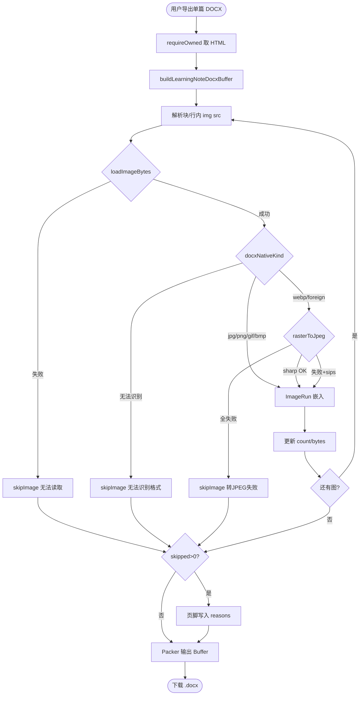
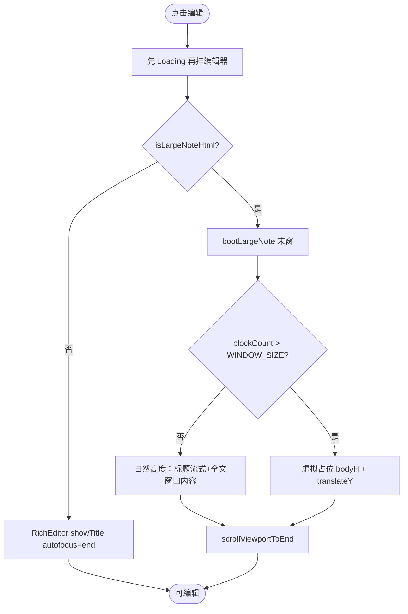
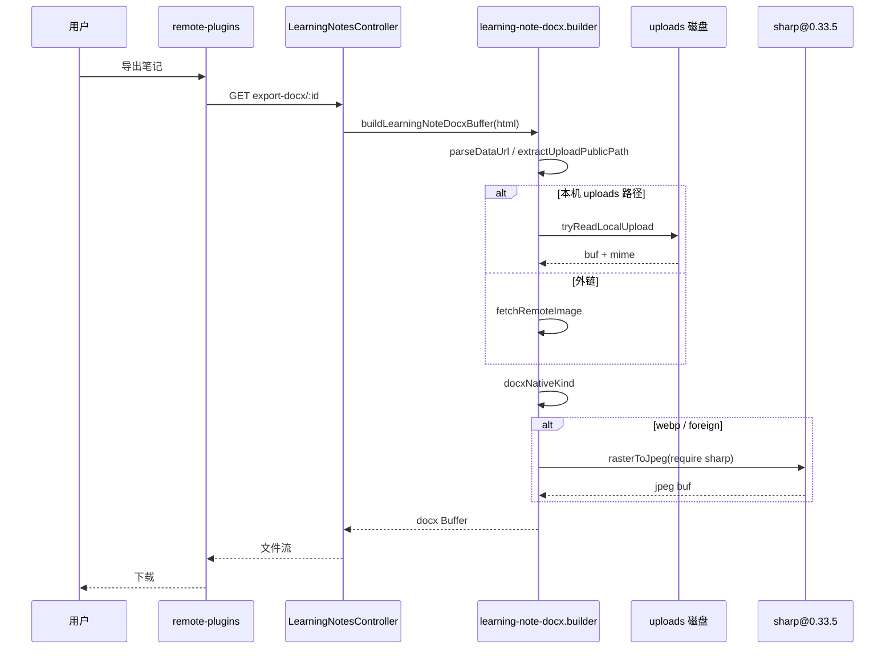
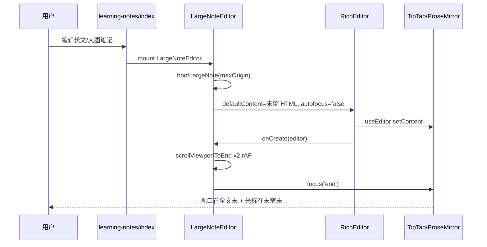
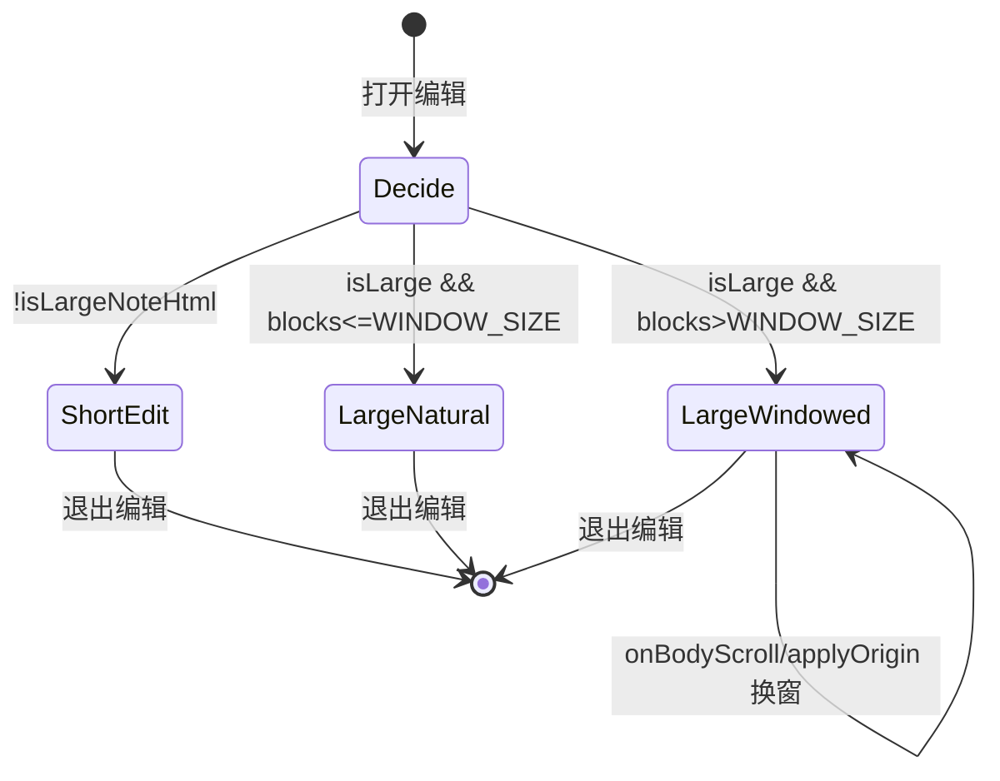

# 学习笔记：DOCX 插图导出可靠化 + 长文编辑体验打磨 — 实现思路

> **状态**：核心已落地（工作区已合入；线上需部署后端 + 安装 `sharp@0.33.5`）  
> **日期**：2026-07-27  
> **需求摘要**：线上导出笔记 Word 时图片「无法嵌入」、本地正常；带图/长文进入编辑时标题间距、文末空白、光标落点、图前空行删除等与短文不一致——在**不引入虚拟列表 / 手动翻页 / iframe 预览**的既有约束下，把导出管线与长文编辑器体验对齐短文。

## 延伸阅读

- [学习笔记编辑器预览卡顿.md](../notes/学习笔记编辑器预览卡顿.md) — 长文窗口化编辑/预览性能（S1–S8）
- [学习笔记列表导出.md](../notes/学习笔记列表导出.md) — 列表批量导出 Word
- [学习笔记富文本编辑.md](../notes/学习笔记富文本编辑.md) — RichEditor / Title 基线
- 归档参考：[english/学习笔记导出性能.md](../../english/学习笔记导出性能.md)

---

## 0. 读本文你将得到什么

- **问题**：导出插图失败（WebP/AVIF + 生产 Node18/`sips`）；长文/带图编辑标题缝过大、文末巨空白、光标停在「第一窗中段」、图前空行删不掉。
- **一句话方案**：后端用 **懒加载 `sharp@0.33.5`** 把非 Word 格式光栅成 JPEG，并优先读本机 uploads；前端长文编辑器 **标题文档流化 + 按块数决定是否窗口占位**，进编辑挂最后一窗并滚到底，修正 GapCursor/空段删除。
- **改动层**：后端 DOCX builder + `sharp` 依赖；remote-plugins `LargeNoteEditor` / `PreviewBody` / `RichEditor`（Title、图片、快捷键、样式）。
- **阶段**：M1 导出可靠 → M2 长文布局/光标 → M3 图前交互 → M4 运维验收。
- **最大风险**：生产仍装 `sharp@0.35` 或顶层 `import sharp` 会导致 **整个 Nest 进程起不来**（Node 18）。

---

## 1. 需求与边界

### 1.1 用户故事

| 角色 | 场景 | 行为 | 期望结果 |
|------|------|------|----------|
| 笔记用户 | 线上导出含图笔记 | 点导出 Word | 图嵌入文档；失败时页脚写出**具体原因** |
| 笔记用户 | 本地 Mac 导出 | 同上 | 与线上一致可导出（不依赖 `sips` 作为主路径） |
| 笔记用户 | 打开「块少但含大图 base64」笔记编辑 | 进入编辑 | 标题与短文同距；文末无数千 px 假空白 |
| 笔记用户 | 打开真正超长文 | 进入编辑 | 光标在**全文末**，可继续向上滚换窗 |
| 笔记用户 | 正文以图片开头 | 在图前输入 / 删图上空行 | 能落点输入；空行 Backspace 可删 |

### 1.2 范围

| 在范围内 | 不在范围内（非目标） |
|----------|----------------------|
| 单篇 DOCX 插图加载/转码/跳过原因 | 列表批量导出算法重做（见 list-export 文） |
| 长文编辑器标题/占位/进编辑落点 | 虚拟列表、手动翻页、iframe 预览 |
| GapCursor / 空段删除 / 插图 MIME 归一 | 升级生产 Node 到 20+（可选运维，非代码必选项） |
| 前端 `fileToDataUrl` 非 jpeg/png/gif → JPEG | 把笔记图全部改为 COS URL（仍允许 data URL） |

### 1.3 约束与依赖

- 产品约束与 jank 文一致：**不要虚拟列表、不要手动翻页、不要 iframe 预览**；长文 title UI 与短文共用 `NoteTitleField`。
- 生产：**Node 18.20.x**；部署 `installDeps: false`，依赖需在服务器显式安装。
- Word/`docx` 库稳吃：**jpg / png / gif / bmp**；不吃 webp/avif/heic。
- Ponytail：最少必要代码；sharp 失败不得拖垮启动。

---

## 2. 方案总览（一句话 + 要点）

**一句话方案**：导出侧「读得到 + 转得动 + 挂不掉」；编辑侧「少块自然高、多块才窗口化，进编辑直达文末，GapCursor/空段删除可预期」。

| # | 设计要点 | 理由 |
|---|----------|------|
| 1 | `rasterToJpeg` 懒 `require('sharp')`，钉死 `0.33.5` | 0.35 要 Node≥20.9；顶层 import 启动即崩 |
| 2 | `foreign`（avif 等）与 webp 一律转 JPEG | 仅转 webp 时线上 AVIF 仍显示「无法嵌入」 |
| 3 | 优先 `tryReadLocalUpload` | 生产自拉公网易 hairpin/反代失败 |
| 4 | `windowed = blockCount > WINDOW_SIZE` | 大图触发 80KB 长文路径但块很少时，禁止按 100×44 垫高 |
| 5 | 标题改为文档流，取消固定 `TITLE_SLOT_H=108` | 固定槽高 > 真实标题高 → 标题与正文大缝 |
| 6 | `bootLargeNote` 初始挂最后一窗 + `scrollViewportToEnd` | `focus('end')` 只到第一窗末＝全文中段 |
| 7 | Title 插件不再把正文 GapCursor 钉到 `atEnd` | 否则无法在图前落点 |
| 8 | `EmptyParagraphDelete` | 空段贴 atom 时原生 Backspace 无法 joinBackward |
| 9 | 前端插图非安全 MIME 先转 JPEG data URL | 减少服务端转码负担与失败面 |

---

## 3. 现状与复用

| 能力 | 仓库中已有 | 本需求中的用法 |
|------|------------|----------------|
| HTML→DOCX | `apps/backend/.../learning-note-docx.builder.ts` | **扩展** 读图/转码/跳过原因 |
| 上传路径解析 | `apps/backend/src/utils/upload-paths.ts` | **直接复用** `decodeUploadPublicPath` / `resolveUploadPublicPathToAbsolute` |
| 单篇导出 API | `learning-notes.controller.ts` `export-docx/:id` | **复用**；builder 行为变更即可 |
| 长文判定/窗口 | `views/learning-notes/utils/doc.ts` | **复用** `isLargeNoteHtml` / `WINDOW_SIZE`；布局条件改前端 |
| 长文编辑器 | `views/learning-notes/components/Editor.tsx` | **大改** 布局/boot/落点 |
| 长文预览 | `components/PreviewBody.tsx` | **对齐** windowed 条件 |
| 标题 UI | `RichEditor/title/NoteTitleField.tsx` | **复用**；长文放文档流 |
| Title 选区守卫 | `TitleNode.ts` `singleNoteTitle` plugin | **修正** GapCursor / `bodyEmpty` 判定 |
| 插图默认 data URL | `RichEditor/image/image.ts` `fileToDataUrl` | **扩展** MIME 归一 |
| 性能基线 | `docs/ideas/学习笔记编辑器预览卡顿.md` | **不回退** S1–S8 产品约束 |

**调研结论**：导出失败主因不是「没装 sharp」本身，而是 **版本与加载方式** 不匹配 Node18，以及 **只转 webp、不转 avif**；编辑体验问题集中在 **用「HTML 体积」进长文路径后仍按「满窗占位」布局**，以及 **进编辑只 focus 第一窗**、**Title 守卫误伤 GapCursor**。

---

## 4. 架构图

```mermaid
flowchart TB
  subgraph FE [remote-plugins 表现/逻辑]
    Page[learning-notes/index.tsx]
    Short[RichEditor 短文]
    Large[LargeNoteEditor 🆕打磨]
    Prev[WindowedPreviewBody]
    ImgIn[fileToDataUrl MIME 归一 🆕]
    EmptyDel[EmptyParagraphDelete 🆕]
    TitleFix[TitleNode GapCursor 修正 🆕]
  end
  subgraph BE [backend]
    Ctrl[LearningNotesController.exportDocx]
    Svc[LearningNotesService.exportDocxBuffer]
    Builder[buildLearningNoteDocxBuffer]
    Load[loadImageBytes 🆕]
    Raster[rasterToJpeg 懒加载 sharp 🆕]
    Disk[upload-paths 读盘]
  end
  subgraph Ops [生产]
    Node18[Node 18.20.x]
    Sharp335[sharp@0.33.5]
  end
  Page --> Short
  Page --> Large
  Page --> Prev
  Short --> ImgIn
  Short --> EmptyDel
  Short --> TitleFix
  Large --> ImgIn
  Large --> EmptyDel
  Page -->|export-docx| Ctrl
  Ctrl --> Svc
  Svc --> Builder
  Builder --> Load
  Load --> Disk
  Load --> Raster
  Raster --> Sharp335
  Node18 --> Sharp335
```

**图内方法说明**：

| 方法 / 模块入口 | 功能 |
|-----------------|------|
| `isLargeNoteHtml(content)` | 按块数≥80 或 HTML≥80KB 决定短/长文路径；大图 base64 常走长文 |
| `LargeNoteEditor` | 长文连续滚动编辑：标题流式、按 `windowed` 决定是否虚拟占位、进编辑挂末窗 |
| `bootLargeNote(html)` | `createLargeNoteDoc` 后若 `maxOrigin>0` 则切到最后一窗 HTML |
| `scrollViewportToEnd(editor)` | 找 `scroll-area-viewport`，`scrollTop=scrollHeight` 并 `focus('end')` |
| `fileToDataUrl(file)` | jpeg/png/gif 直读；其它 MIME 尽量 canvas→JPEG data URL |
| `EmptyParagraphDelete` | 空段开头 Backspace / 末尾 Delete 时删段（绕过 atom join 失败） |
| `TitleNode` / `singleNoteTitle` | 保证单 title、空笔记补段；**正文 GapCursor 不再强制 atEnd** |
| `exportDocx` / `exportDocxBuffer` | 取库 HTML → `buildLearningNoteDocxBuffer` → 二进制响应 |
| `loadImageBytes(src)` | data URL → 本机 uploads → HTTP fetch |
| `extractUploadPublicPath` / `tryReadLocalUpload` | 从 `/images`、`/api/upload/serve?path=` 等抽出公开路径并读盘 |
| `docxNativeKind` / `toDocxImage` | 判定 jpg/png/gif/bmp/webp/foreign；非原生则 `rasterToJpeg` |
| `rasterToJpeg(buf)` | 懒 `require('sharp')`→JPEG；失败再试 macOS `sips` |
| `buildLearningNoteDocxBuffer` | 组装 Document；`budget.skipped` 时页脚写具体 `reasons` |

**读图要点**：

- 前端打磨与后端导出解耦；插图 MIME 归一在两端都做，服务端仍是最后防线。
- 🆕 集中在 builder 读图链、LargeNote 布局/boot、Title/空段快捷键。
- 运维节点与代码同级：错装 sharp 会直接让 BE 子图不可用。

---

## 5. 主流程图

### 5.1 导出插图



**图内方法说明**：

| 方法 | 功能 |
|------|------|
| `requireOwned` | 校验笔记归属并返回行 |
| `buildLearningNoteDocxBuffer` | HTML→DOCX 主入口 |
| `loadImageBytes` | 统一取字节 |
| `docxNativeKind` | MIME/魔数 → 类型或 foreign |
| `rasterToJpeg` | 非 Word 格式转 JPEG |
| `skipImage` | `skipped++` 并记录 reason（最多 6 条） |
| `toDocxImage` | 预算校验 + 嵌入或跳过 |

**读图要点**：任何失败都走「跳过 + 文内占位/页脚」，不整单失败；页脚原因用于线上排障。

### 5.2 进入编辑（含长文）



**图内方法说明**：

| 方法 | 功能 |
|------|------|
| `isLargeNoteHtml` | 短/长路径分流 |
| `bootLargeNote` | 初始 origin=maxOrigin |
| `createLargeNoteDoc` / `windowBodyHtml` | 切块与取窗 HTML |
| `scrollViewportToEnd` | 滚到底 + focus 文末 |

**读图要点**：关键分支是「长文但块数不足一窗」→ 仍走 LargeNoteEditor（卸 TipTap title、省大 HTML 一次挂满），但**禁止**按 `WINDOW_SIZE` 垫高。

---

## 6. 核心时序图

### 6.1 线上导出含 WebP/AVIF



**图内方法说明**：

| 方法 | 功能 |
|------|------|
| `export-docx/:id` | 鉴权后导出入口 |
| `buildLearningNoteDocxBuffer` | 构建 DOCX |
| `tryReadLocalUpload` | 读本机附件 |
| `fetchRemoteImage` | HTTP 拉图（超时） |
| `docxNativeKind` | 类型判定 |
| `rasterToJpeg` | sharp 转码 |

**读图要点**：优先磁盘，避免生产回环；sharp 仅在转码路径加载。

### 6.2 长文进编辑落文末



**图内方法说明**：

| 方法 | 功能 |
|------|------|
| `bootLargeNote` | 预切末窗，避免先渲染第一窗再跳 |
| `RichEditor.onCreate` | 回调业务落点逻辑 |
| `scrollViewportToEnd` | 双 rAF 等布局后再滚 |

**读图要点**：`autofocus={false}` 避免 TipTap 先 focus 第一窗内容再被业务纠正造成「卡在中段」体感。

---

## 7. 状态机（短文 / 长文 / 窗口化）



**图内方法说明**：

| 方法 | 功能 |
|------|------|
| `isLargeNoteHtml` | 进入 Decide 的判定 |
| `applyOrigin` | Windowed 态下按滚动换窗 `setContent` |
| `onBodyScroll` | 扣标题高度后算 origin |

---

## 8. 模块职责与接口草图

### 8.1 模块一览（改动点清单）

| ID | 模块 | 职责 | 新增/改动 | 路径 |
|----|------|------|-----------|------|
| C1 | DOCX 读图链 | data/本地/HTTP 统一取字节 | **改动** | `learning-note-docx.builder.ts` |
| C2 | DOCX 转码 | webp/foreign→JPEG；懒加载 sharp | **改动** | 同上 `rasterToJpeg` |
| C3 | DOCX 跳过原因 | `ImageBudget.reasons` 写入页脚 | **改动** | 同上 |
| C4 | sharp 依赖 | 钉死 `0.33.5`（兼容 Node18） | **改动** | `apps/backend/package.json` |
| C5 | 长文标题布局 | 取消 108px 槽；文档流 + ResizeObserver 测高 | **改动** | `components/Editor.tsx` |
| C6 | 长文占位 | `windowed` 条件；去掉 `WINDOW_SIZE` 最小垫高 | **改动** | `Editor.tsx` + `PreviewBody.tsx` |
| C7 | 进编辑落点 | `bootLargeNote` + `scrollViewportToEnd` | **改动** | `Editor.tsx` |
| C8 | RichEditor focus | `autofocus==='end'` 时强制文末 | **改动** | `RichEditor/index.tsx` |
| C9 | Title GapCursor | 正文 GapCursor 合法；`bodyEmpty` 仅真·空段落 | **改动** | `TitleNode.ts` |
| C10 | 空段删除 | Backspace/Delete 删贴 atom 的空段 | **新增** | `EmptyParagraphDelete.ts` + extensions |
| C11 | GapCursor 样式 | 可见闪烁线 | **改动** | `RichEditor/styles.css` |
| C12 | 插图 MIME | 非安全类型转 JPEG data URL | **改动** | `image/image.ts` |
| C13 | （否决）LeadingAtomParagraph | 强制图前补段导致空行删不掉 | **删除** | 已移除 |

### 8.2 关键接口草图

```typescript
// 后端：跳过预算
type ImageBudget = {
  count: number;
  bytes: number;
  skipped: number;
  reasons: string[]; // 最多约 6 条，写入页脚
};

async function loadImageBytes(src: string): Promise<{ mime: string; buf: Buffer } | null>;
async function rasterToJpeg(buf: Buffer): Promise<Buffer | null>;

// 前端：长文
function bootLargeNote(html: string): ReturnType<typeof createLargeNoteDoc>;
const windowed = blockCount > WINDOW_SIZE;
const bodyH = Math.max(blockCount, 1) * EST_BLOCK_H;
```

### 8.3 数据模型

| 字段/实体 | 来源 | 存储 | 说明 |
|-----------|------|------|------|
| `english_learning_note.content` | TipTap HTML | MySQL longtext | 常含 `data:image/...;base64` |
| img `src` | 编辑器 | 同上 | data URL / `/images/...` / serve URL / https |
| DOCX media | 导出时生成 | 临时 Buffer | jpeg/png/gif/bmp |

---

## 9. 分阶段实现步骤

| 阶段 | 目标 | 交付物 | 依赖 |
|------|------|--------|------|
| M1 | 导出插图可靠 + 进程可启动 | C1–C4 | 无 |
| M2 | 长文布局/文末空白/落点 | C5–C8 | M1 可并行 |
| M3 | 图前落点与空行删除 | C9–C12，确认 C13 已删 | M2 |
| M4 | 生产验收 | Node18 + sharp0.33.5 安装说明执行 | M1 |

### M1

- [x] `loadImageBytes` / 本地 uploads / foreign→JPEG
- [x] 懒加载 sharp；`package.json` 钉 `0.33.5`
- [x] 页脚 `reasons`
- [ ] 生产：`pnpm remove sharp && pnpm add sharp@0.33.5` 后 `pm2 restart`

### M2

- [x] 标题文档流；去掉 `TITLE_SLOT_H`
- [x] `windowed`；预览对齐
- [x] `bootLargeNote` + 双 rAF 滚到底

### M3

- [x] Title GapCursor / bodyEmpty 修正
- [x] `EmptyParagraphDelete`
- [x] GapCursor CSS；`fileToDataUrl` MIME 归一
- [x] 移除 LeadingAtomParagraph

### M4

- [ ] 线上导出 WebP/AVIF/PNG 各一篇
- [ ] 带图少块笔记：无文末空白、标题间距≈短文
- [ ] 真·超长文：进编辑在文末，上滚可换窗
- [ ] 图前空行可删；删后可用 GapCursor 再输入

---

## 10. 关键决策与备选方案

| 决策 | 选用 | 备选 | 为何不选备选 |
|------|------|------|--------------|
| 转码库 | sharp 0.33.5 懒加载 | 升 Node20 + sharp0.35 | 升 Node 运维面大；先兼容现网 |
| 转码库 | sharp | 纯 WASM / 仅前端转 | WASM 体积与冷启动；前端无法修已存 webp |
| 少块长文路径 | 仍 LargeNote，但自然高度 | 强制回短文 RichEditor | 80KB+ HTML 挂满 TipTap 易卡 |
| 图前可输入 | GapCursor + 空段删除 | 持久前置空段插件 | 已验证导致「空行删不掉」 |
| 文末落点 | boot 末窗 | 仅 `focus('end')` | 只 focus 第一窗＝中段 |

---

## 11. 风险、边界与待确认

| 项 | 等级 | 说明 | 缓解 |
|----|------|------|------|
| sharp 版本错误 | **高** | 0.35 + Node18 → 服务崩溃循环 | 钉版本 + 懒加载 + 运维清单 |
| `EST_BLOCK_H=44` | 中 | 真超长文+超大图时滚动估算偏差 | 可后续按块类型估高；非本轮必做 |
| JSON body 6mb | 中 | 极大 data URL 保存可能失败 | 与导出正交；另开需求 |
| hairpin | 低 | 外链公网自拉失败 | 已优先读盘 |
| GapCursor 点击面积 | 低 | 删光图前空段后需点间隙 | CSS 已加；可再教育「图上边缘点一下」 |

**待确认**：

- [ ] 生产当前 `sharp` 版本与 Node 主版本（验证：`node -v`；`pnpm list sharp`）
- [ ] 失败笔记页脚 `reasons` 原文（验证：再导出一篇失败样例）

---

## 12. 验收清单

| # | 用例 | 步骤 | 期望 |
|---|------|------|------|
| AC1 | 线上 WebP/AVIF 导出 | 插入对应格式图→保存→导出 | 图在 Word 中；进程不崩 |
| AC2 | PNG/JPEG 导出 | 同上 | 正常嵌入 |
| AC3 | 导出失败可读 | 故意坏 src | 文内「图片无法嵌入」+ 页脚具体原因 |
| AC4 | 少块大图编辑 | 含大图、块数≪100 进编辑 | 标题距正文≈短文；文末无大片空白 |
| AC5 | 真长文落点 | ≥100 块进编辑 | 视口与光标在文末 |
| AC6 | 长文上滚 | AC5 后向上滚 | 可换窗，内容连续 |
| AC7 | 图前输入 | 正文以图开头 | GapCursor 或空段可输入 |
| AC8 | 删图上空行 | 空行+图，空行首 Backspace | 空行消失且不回弹 |

---

## 13. 预估改动面（实现阶段参考）

| 类型 | 路径 |
|------|------|
| 后端 | `apps/backend/src/services/learning-notes/learning-note-docx.builder.ts` |
| 后端依赖 | `apps/backend/package.json`（`sharp: 0.33.5`） |
| 前端长文 | `apps/remote-plugins/src/views/learning-notes/components/Editor.tsx` |
| 前端预览 | `.../components/PreviewBody.tsx` |
| RichEditor | `.../RichEditor/index.tsx`、`title/TitleNode.ts`、`styles.css` |
| 扩展 | `.../extensions/EmptyParagraphDelete.ts`、`extensions/index.ts` |
| 插图 | `.../RichEditor/image/image.ts` |
| 规划文档 | 本文 `docs/ideas/学习笔记导出与编辑打磨.md` |
| 实现后归档建议 | `docs/english/` 下可再出 diff 专题（`implementation-doc-from-diff`） |

---

## 14. 改动点详解（逐条「改前 → 改后」）

### C1–C3 导出读图与转码

| | 改前 | 改后 |
|--|------|------|
| 取图 | 仅 data URL / `https?` fetch | + 本机 `/images`、`/api/upload/serve` |
| 转码 | 仅 webp，且调 **macOS `sips`** | webp/**foreign** → **sharp**（懒加载）→ 失败再 sips |
| 失败信息 | 笼统「格式不支持或过大」 | `reasons`：`无法读取` / `转JPEG失败(mime)` 等 |

### C4 sharp 与进程安全

| | 改前 | 改后 |
|--|------|------|
| 版本 | 曾引入 `^0.35.3` | **钉死 `0.33.5`** |
| 加载 | 顶层 `import sharp` | **函数内 `require('sharp')`**，失败不阻启动 |

**生产命令（运维）**：

```bash
cd /usr/local/dnhyxc-ai/server
pnpm remove sharp
pnpm add sharp@0.33.5
# 部署含懒加载的新 dist 后：
pm2 restart server
```

### C5–C6 长文布局与空白

| | 改前 | 改后 |
|--|------|------|
| 标题 | `absolute` + `height:108` + 正文 `translateY(108+offset)` | 标题**文档流**；正文仅在 `windowed` 时绝对定位 |
| 占位高 | `max(blocks*44, 100*44)` | `blocks*44`；且仅 `blocks>WINDOW_SIZE` 启用占位 |

### C7–C8 光标与视口

| | 改前 | 改后 |
|--|------|------|
| 初始窗 | 总是第一窗 + `focus('end')` | **末窗** + 滚到底 |
| RichEditor | 仅 title 存在时钉文末 | `autofocus==='end'` 也钉文末 |

### C9–C11 图前交互

| | 改前 | 改后 |
|--|------|------|
| GapCursor | Title 插件 → `Selection.atEnd` | 正文 GapCursor **保留** |
| bodyEmpty | `child(1).content.size===0` 把 **image** 当空 | 仅 **textblock 且空** |
| 空段删除 | 原生 Backspace 对 atom 无效 | `EmptyParagraphDelete` |
| 强制补段 | LeadingAtomParagraph 删了又补 | **已删除该扩展** |

### C12 前端插图

| | 改前 | 改后 |
|--|------|------|
| `fileToDataUrl` | 原样 FileReader | 非 jpeg/png/gif → canvas JPEG（失败再原样） |

---

## 15. 与性能文（jank）的关系

本文 **不改变** jank 文中的产品否决项与窗口算法常量含义（`WINDOW_SIZE` / `ORIGIN_HYSTERESIS` / `EST_BLOCK_H`），只修正：

1. **误用满窗最小高度** 造成的 UX 回归；  
2. **进编辑落点** 与 **导出插图** 两条正交链路。

长文性能仍依赖「只挂一窗 TipTap」；少块大图笔记享受同一外壳但自然高度。

---

（本文档为规划态实现思路 + 本轮改动点全集；线上以部署产物与运维安装的 `sharp@0.33.5` 为准。落地归档可用 `implementation-doc-from-diff` 写入 `docs/english/`。）
