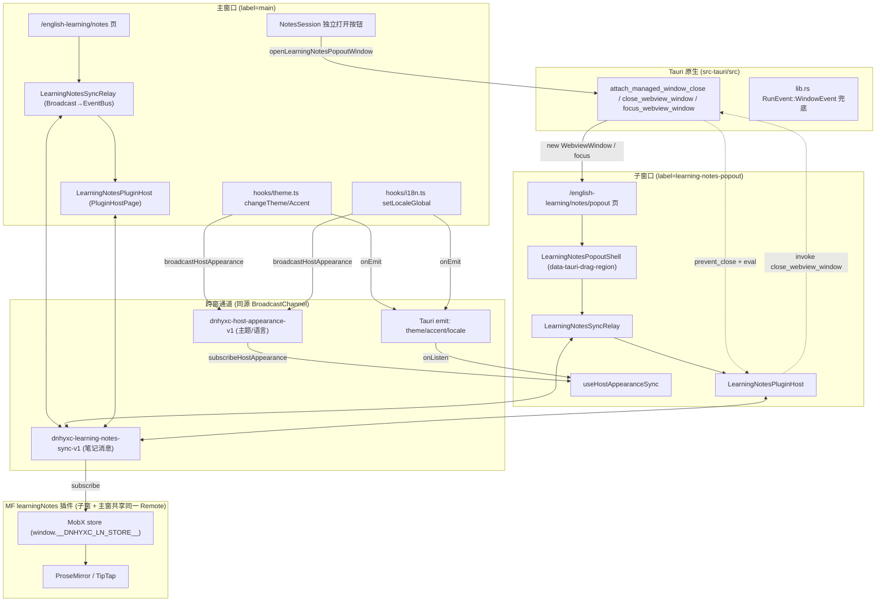
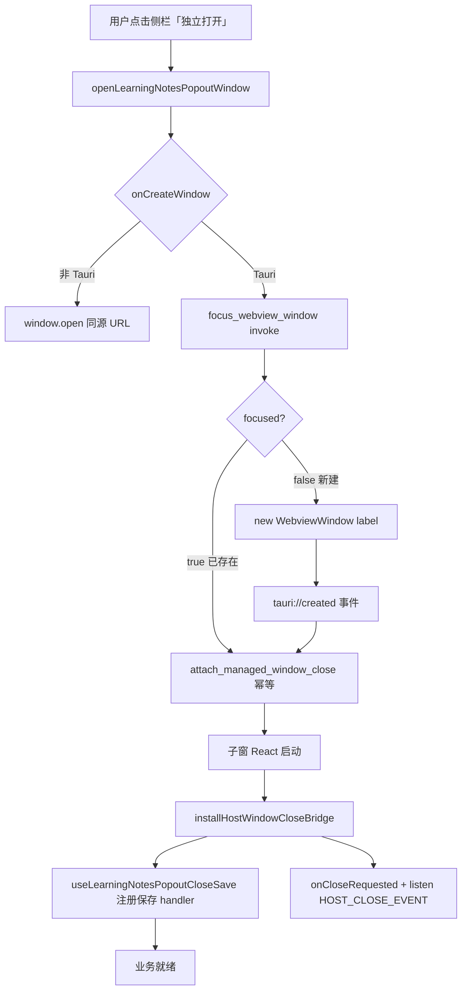
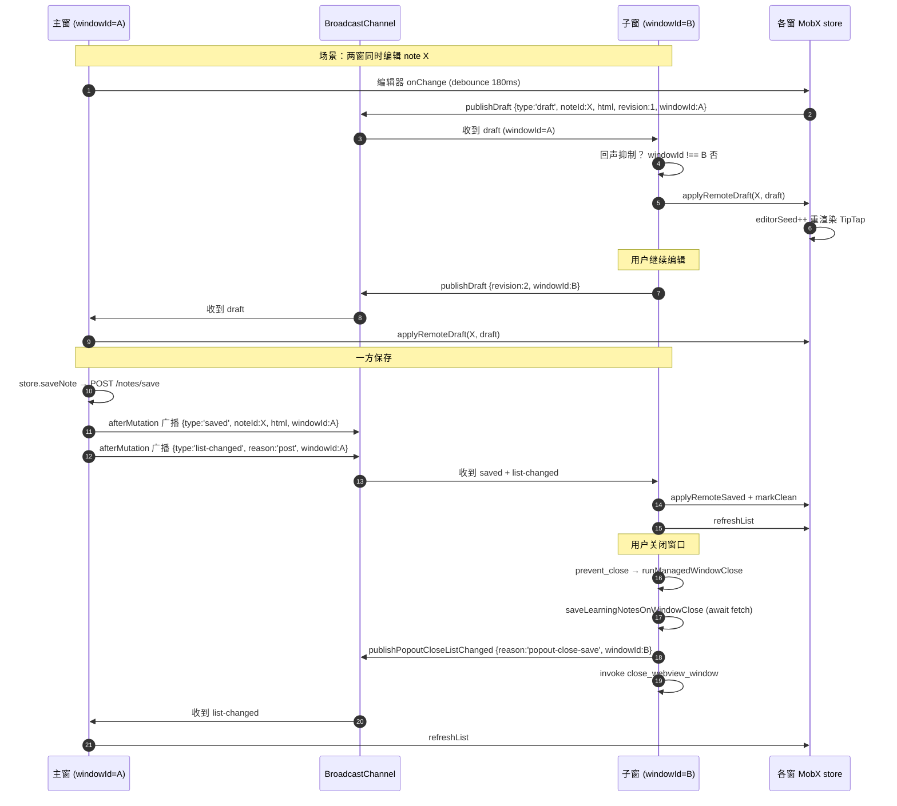
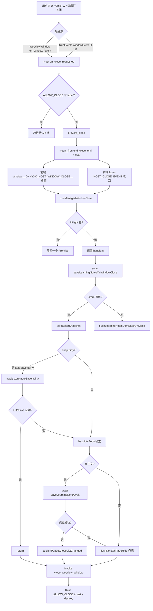

# 学习笔记独立弹窗与多窗口同步 — 实现思路

> **状态**：核心能力已上线（M1） | **日期**：2026-08-25 | **需求摘要**：为学习笔记提供 Tauri 独立弹窗，建立主子窗口双向数据同步总线，并实现托管关窗自动保存。
>
> **延伸阅读**：归档型改动前后对比与文件清单见姊妹稿 [docs/english/学习笔记独立弹窗.md](../../english/学习笔记独立弹窗.md)；SPEC 验收要点见 [apps/frontend/specs/learning-notes-popout-window.md](../../../apps/frontend/specs/learning-notes-popout-window.md)。本文聚焦「为什么这么实现 + 完整源码 + 实现原理」，让开发者能在其他项目中复刻同类多窗口 + 跨窗同步 + 托管关窗能力。

## 0. 读本文你将得到什么

- 一套 **Tauri 多窗口 + 同源 BroadcastChannel** 的端到端实现范式，可复用到任何 MF 插件页独立成窗的场景。
- **托管关窗保存**的 Rust ↔ 前端协同原理：为什么必须 `prevent_close` → `eval` → `await` → `destroy`，以及为什么传统 `beforeunload` + `keepalive` 在 WebView 里不可靠。
- **主子数据同步**的三层兜底设计：MobX store 路径 → DOM 级 ponyfill → HTTP 包装自动广播，理解每一层要解决的失败场景。
- **回声抑制 / 重复请求 / 并发关窗** 等边界问题的工程对策。
- 全部关键文件的 **完整源码 + 逐段中文注释 + 实现意图**，照抄即可在新项目中落地。

## 1. 一句话方案

> **Rust 拦截 `CloseRequested` 阻止默认关闭 → 通过 `eval` 注入全局函数回调前端 → 前端按「store 快照 → autoSave → DOM 兜底 → keepalive」四重保障 await 保存 → invoke `close_webview_window` 销毁窗口；同步则用同源 `BroadcastChannel` 在主子窗之间广播 `selection / draft / saved / deleted / list-changed / request-state / state-snapshot` 七类消息，配合 `windowId` 回声抑制与 `revision` 单调版本号做 LWW（Last-Write-Wins）覆盖。**

要点：

1. **窗口创建复用 `WebviewWindow` + label 复用**：相同 label 二次打开会先 `focus_webview_window`，避免叠多个窗。
2. **关窗托管有两条触发路径**：用户点 ❌（`onCloseRequested`）与 Rust `eval` 主动触发（macOS 红绿灯关闭也走 Rust）。
3. **`prevent_close` 期间 WebView 仍存活**，可以安全 `await fetch`；只有 `destroy()` 才真正销毁 WebView。
4. **HTTP 包装层自动广播**：插件无需手动埋点，任何 `post/put/delete` 命中笔记 API 即自动发 `saved / deleted / list-changed`。
5. **store 不可用时退化到 DOM**：`MutationObserver` 钩住 `.ProseMirror`，`input` 事件 debounce 后广播；远端到达用 `execCommand('insertHTML')` 应用。
6. **外观跟随双通道**：Tauri 全局 `emit('theme'/'accent'/'locale')` 给 WebView，BroadcastChannel 镜像给 Web 端/同源标签。

## 2. 现状与复用

| 能力 | 已有位置 | 本需求用法 |
|------|----------|------------|
| 创建 Tauri WebView 窗口 | [apps/frontend/src/utils/tauri.ts](../../../apps/frontend/src/utils/tauri.ts) `onCreateWindow` | 扩展：托管 label 时调 `attach_managed_window_close` |
| 聚焦已存在窗口 | `command/common.rs::focus_webview_window` | 复用：弹窗二次点击 |
| MF 插件宿主页 | `federation/runtime/index.ts::PluginHostPage` | 复用：弹窗内渲染同一插件 |
| 主题/语言 EventBus | `hooks/theme.ts` / `hooks/i18n.ts` | 扩展：`changeAccent` 加 `emit` + `broadcastHostAppearance` |
| HostHttpClient 包装 | `federation-kit` | 扩展：`wrapLearningNotesHttp` 自动广播 |
| 插件管理器 | `federation-kit::PluginManager` | 扩展：`patchLearningNotesPluginManager` monkey-patch 插件 `default` |

## 3. 总体架构



### 图内方法说明

| 节点 / 函数 | 做什么 | 输入 / 输出要点 |
|------------|--------|----------------|
| `openLearningNotesPopoutWindow` | 入口：调 `onCreateWindow` 打开/聚焦弹窗 | 无入参；返回 `Promise<void>` |
| `onCreateWindow` | Tauri 创建 `WebviewWindow`，已存在则 `focus_webview_window` | `WindowOptions`；副作用：window label 复用 |
| `attach_managed_window_close` (Rust) | 子窗 `tauri://created` 后前端 invoke，绑定 `on_window_event` | `label: string`；幂等（`ATTACHED` Set 去重） |
| `handle_close_requested` (Rust) | `RunEvent::WindowEvent` 兜底，托管的 label 走 `on_close_requested` | `(label, event, app)` |
| `on_close_requested` (Rust) | `prevent_close` + `notify_frontend_close` | 改 `ALLOW_CLOSE` HashSet 决定放行 |
| `notify_frontend_close` (Rust) | `emit(HOST_CLOSE_EVENT)` + `eval` 注入 JS 回调 | label 字符串 |
| `installHostWindowCloseBridge` | 启动时安装 `window.__DNHYXC_HOST_WINDOW_CLOSE__` + `onCloseRequested` + `listen(HOST_CLOSE_EVENT)` | 无；幂等 `bridgeInstalled` |
| `runManagedWindowClose` | 遍历 handler await → `invoke('close_webview_window')` | label；并发去重 `inflight` Map |
| `registerHostWindowCloseHandler` | 业务侧注册关窗保存 handler | `(label, handler)`；返回卸载函数 |
| `saveLearningNotesOnWindowClose` | 编排：store 快照 → autoSave → DOM 兜底 → keepalive → 广播 list-changed | 无；返回 `Promise<void>` |
| `publishLearningNotesSync` | 向 BroadcastChannel 发消息 + 本窗 handler 同步触发 | `LearningNotesSyncMessage` |
| `subscribeLearningNotesSync` | 订阅 BroadcastChannel 消息 | `handler`；返回卸载函数 |
| `wrapLearningNotesHttp` | 包装 `HostHttpClient`，笔记增删改后自动 `publishLearningNotesSync` | `http`；返回代理 |
| `attachLearningNotesStoreSync` | 用 binding 把 store 接到同步总线 | `binding`；返回卸载函数 |
| `attachLearningNotesDomSync` | 无 store 时 DOM 级 `MutationObserver + execCommand` 兜底 | 无；返回卸载函数 |
| `patchLearningNotesPluginManager` | monkey-patch 插件 `default` 组件，注入上述两个 attach | `manager` |
| `useHostAppearanceSync` | 弹窗订阅 `theme/accent/locale` 并应用 | 无 |

### 读图要点

- **三条独立通道**：笔记内容同步（`dnhyxc-learning-notes-sync-v1`）、外观同步（`dnhyxc-host-appearance-v1`）、Tauri 全局事件（`emit`）。前两条同源 BroadcastChannel 天然跨 WebView，第三条覆盖 Tauri 标题栏 chrome 与首帧 bootstrap。
- **关窗链路双向**：用户点 ❌ 走前端 `onCloseRequested`；macOS 红绿灯 / `Cmd+W` 走 Rust `CloseRequested` → `eval` 回调前端。两条都汇到 `runManagedWindowClose`，避免漏保存。
- **插件零侵入**：`patchLearningNotesPluginManager` 在 Host 侧包装插件 `default` 组件，挂载 store/DOM 同步；插件代码本身不必改一行即可获得跨窗同步能力（接入 `sync` API 后体验更好，但不接入也有 DOM 兜底）。

## 4. 核心流程一：窗口创建与托管关窗绑定

### 4.1 主流程图



### 4.2 入口按钮与窗口打开

入口在侧栏学习笔记卡片，第二个 action 即「独立打开」：

```typescript
// apps/frontend/src/views/englishLearning/sidebar/components/NotesSession.tsx
import { NotebookPen } from 'lucide-react';
import { useNavigate } from 'react-router';
import { usePluginEnabled } from '@/federation';
import { useI18n } from '@/hooks';
import { openLearningNotesPopoutWindow } from '../../notes/openPopoutWindow';
import { ENGLISH_SIDEBAR_ICON_GRADIENT } from '../sidebarAccents';
import { EnglishSidebarCard } from './EnglishSidebarCard';

/** 首页侧栏：学习笔记（MF 插件入口；下架后不展示） */
export function NotesSession() {
	const { t } = useI18n();
	const navigate = useNavigate();
	// 插件未上架时整块隐藏，与「打开学习笔记」一致
	const enabled = usePluginEnabled('learningNotes');
	if (!enabled) return null;

	return (
		<EnglishSidebarCard
			className="@container min-w-0"
			icon={NotebookPen}
			iconGradient={ENGLISH_SIDEBAR_ICON_GRADIENT.notes}
			headerClassName="mb-5.5"
			title={t('route.englishLearning.notes.title')}
			description={t('englishLearning.notes.desc')}
			actions={[
				{
					label: t('englishLearning.notes.nav'),
					// 主窗内打开：走路由跳转
					onClick: () => navigate('/english-learning/notes'),
					gradientKey: 'notes',
				},
				{
					label: t('englishLearning.notes.popout'),
					// 独立窗打开：走 Tauri 多窗口
					onClick: () => void openLearningNotesPopoutWindow(),
					gradientKey: 'notes',
				},
			]}
		/>
	);
}
```

打开窗口的纯函数（尺寸略小于主窗，主题跟随当前 chrome）：

```typescript
// apps/frontend/src/views/englishLearning/notes/openPopoutWindow.ts
import { readWindowChromeThemeSync } from '@/hooks/theme';
import { onCreateWindow } from '@/utils';
import {
	LEARNING_NOTES_POPOUT_LABEL,
	LEARNING_NOTES_POPOUT_PATH,
} from './labels';

export { LEARNING_NOTES_POPOUT_LABEL, LEARNING_NOTES_POPOUT_PATH };

/** 打开或聚焦学习笔记独立窗口（尺寸略小于当前主窗） */
export async function openLearningNotesPopoutWindow(): Promise<void> {
	await onCreateWindow({
		// label 决定窗口复用：相同 label 二次打开会先尝试 focus
		label: LEARNING_NOTES_POPOUT_LABEL,
		url: LEARNING_NOTES_POPOUT_PATH,
		title: '学习笔记',
		width: 942,
		height: 664,
		minWidth: 720,
		minHeight: 510,
		// 创建时写入主题，避免首帧白闪
		theme: readWindowChromeThemeSync(),
	});
}
```

零依赖的 label/path 常量（被 `hostWindowClose` 等冷启模块引用，避免循环依赖）：

```typescript
// apps/frontend/src/views/englishLearning/notes/labels.ts
/** 学习笔记独立窗 label / 路由（零依赖，供 hostWindowClose 等冷启模块引用） */
export const LEARNING_NOTES_POPOUT_LABEL = 'learning-notes-popout';
export const LEARNING_NOTES_POPOUT_PATH = '/english-learning/notes/popout';
```

`onCreateWindow` 的托管分支（节选自 `apps/frontend/src/utils/tauri.ts`）：

```typescript
// 已有窗口优先 focus；托管 label 同时重新 attach（幂等）
const focused = await invoke<boolean>('focus_webview_window', { label });
if (focused) {
	if (MANAGED_HOST_WINDOW_LABELS.has(label)) {
		// 托管窗：已存在也要重新绑定（防止 attach 因窗口重建丢失）
		void invoke('attach_managed_window_close', { label });
	}
	if (theme) {
		const win = await getWindowByLabel(label);
		try { await win?.setTheme(theme); } catch { /* 主题失败不影响置顶 */ }
	}
	createdCallback?.();
	return;
}

// 新建窗口
const { WebviewWindow } = await import('@tauri-apps/api/webviewWindow');
const webview = new WebviewWindow(label, { url, width, height, /* ... */ theme, x, y });
webview.once('tauri://created', () => {
	if (MANAGED_HOST_WINDOW_LABELS.has(label)) {
		// 创建成功后立刻 attach，确保 CloseRequested 被拦截
		void invoke('attach_managed_window_close', { label });
	}
	createdCallback?.();
});
webview.once('tauri://error', (e) => { errorCallback?.(e); });
```

**实现意图**：

- **label 复用机制**是 Tauri 多窗口的天然契约——同名 label 不能并存，因此「二次点击独立打开」会走 `focus_webview_window` 分支而非新建，避免叠多个窗。
- **`attach_managed_window_close` 必须在 `tauri://created` 后调**：此时 Rust 侧 `get_webview_window(label)` 才能取到窗口句柄；`ATTACHED` HashSet 保证幂等，重复 attach 不会重复绑定 `on_window_event`。
- **`theme` 写入时机**：构造时传入而非创建后 `setTheme`，避免首帧标题栏 chrome 与正文不一致的白闪。

### 4.3 Rust 托管关窗核心

完整 Rust 实现（这是整个托管关窗的「心脏」）：

```rust
// apps/frontend/src-tauri/src/system/learning_notes_popout.rs
//! 托管关窗：创建时 attach on_window_event；❌ → prevent → 通知前端 → destroy。

use std::collections::HashSet;
use std::sync::{LazyLock, Mutex};

use tauri::{Emitter, Manager, WindowEvent};

pub const LEARNING_NOTES_POPOUT_LABEL: &str = "learning-notes-popout";

/// 前端注入的全局回调符号：Rust eval 这段 JS 主动触发前端保存流程
const HOST_CLOSE_HOOK: &str = "globalThis.__DNHYXC_HOST_WINDOW_CLOSE__";
/// 前端也监听这条 Tauri 事件，作为 eval 失败时的备份通道
pub const HOST_CLOSE_EVENT: &str = "host://host-window-close";

/// 允许放行关闭的 label 集合：前端 invoke close_webview_window 时写入
static ALLOW_CLOSE: LazyLock<Mutex<HashSet<String>>> =
	LazyLock::new(|| Mutex::new(HashSet::new()));
/// 已 attach 过的 label 集合：幂等保护，防止重复绑定 on_window_event
static ATTACHED: LazyLock<Mutex<HashSet<String>>> = LazyLock::new(|| Mutex::new(HashSet::new()));

/// 仅这个 label 走托管流程（白名单）
pub fn managed_label(label: &str) -> bool {
	label == LEARNING_NOTES_POPOUT_LABEL
}

/// 通知前端：窗口要关了，赶紧保存
fn notify_frontend_close(app: &tauri::AppHandle, label: &str) {
	let Some(win) = app.get_webview_window(label) else {
		return;
	};
	// 通道 1：Tauri emit，前端 listen(HOST_CLOSE_EVENT) 收
	let _ = win.emit(HOST_CLOSE_EVENT, label);
	// 通道 2：eval 注入 JS，直接调 window.__DNHYXC_HOST_WINDOW_CLOSE__(label)
	// 双通道是因为 listen 可能在冷启早期未挂载，eval 更可靠
	let script = format!(
		"try{{const f={HOST_CLOSE_HOOK};if(typeof f==='function')f({label:?});}}catch(e){{console.error('[hostWindowClose]',e)}}"
	);
	let _ = win.eval(&script);
}

/// 单次关闭请求的核心决策
fn on_close_requested(label: &str, event: &WindowEvent, app: &tauri::AppHandle) {
	let WindowEvent::CloseRequested { api, .. } = event else {
		return;
	};
	// 若前端已 invoke close_webview_window 把 label 放进 ALLOW_CLOSE，则放行
	let allow = ALLOW_CLOSE
		.lock()
		.ok()
		.and_then(|mut g| g.remove(label).then_some(()))  // remove 返回 bool，仅当存在时返回 Some
		.is_some();
	if allow {
		return;  // 放行：Tauri 走默认关闭流程
	}
	// 否则：阻止默认关闭，转交前端处理
	api.prevent_close();
	notify_frontend_close(app, label);
}

/// RunEvent 全局兜底：lib.rs 的事件循环里调用
/// 为什么需要兜底？on_window_event 是 WebviewWindow 级监听，理论上 attach 后就够；
/// 但 macOS Cmd+W / 红绿灯关闭可能不触发 WebviewWindow 的 on_window_event，
/// 因此在 lib.rs run 回调的 RunEvent::WindowEvent 里再兜一次
pub fn handle_close_requested(
	label: &str,
	event: &WindowEvent,
	app: &tauri::AppHandle,
) {
	if !managed_label(label) {
		return;  // 非托管 label 直接放行
	}
	on_close_requested(label, event, app);
}

/// 子窗 tauri://created 后由前端 invoke，绑定该 WebviewWindow 的 CloseRequested
#[tauri::command]
pub fn attach_managed_window_close(app: tauri::AppHandle, label: String) -> Result<(), String> {
	if !managed_label(&label) {
		return Ok(());  // 非白名单 label 忽略，避免误托管
	}
	{
		let mut attached = ATTACHED.lock().map_err(|e| e.to_string())?;
		if !attached.insert(label.clone()) {
			// 已 attach 过，幂等返回
			return Ok(());
		}
	}

	let win = app
		.get_webview_window(&label)
		.ok_or_else(|| format!("window not found: {label}"))?;

	let app_handle = app.clone();
	let label_for = label;
	// 绑定 WebviewWindow 级事件：用户点 ❌ 触发
	win.on_window_event(move |event| {
		on_close_requested(&label_for, event, &app_handle);
	});

	Ok(())
}

/// 前端保存完成后 invoke：写入 ALLOW_CLOSE 放行标记 + 原生 destroy
#[tauri::command]
pub fn close_webview_window(app: tauri::AppHandle, label: String) -> Result<(), String> {
	let win = app
		.get_webview_window(&label)
		.ok_or_else(|| format!("window not found: {label}"))?;
	if let Ok(mut g) = ALLOW_CLOSE.lock() {
		g.insert(label);  // 下次 CloseRequested 看到 label 在集合里就放行
	}
	// 用 destroy 而非 close：destroy 绕过 CloseRequested，避免再次触发 prevent_close 循环
	win.destroy().map_err(|e| e.to_string())
}
```

**实现意图与原理**：

- **为什么 `prevent_close` 而不是 `beforeunload`**：WebView 的 `beforeunload` 在 Tauri 里不可靠——macOS WKWebView 经常不触发，且 `beforeunload` 只能给用户一个「确认离开」提示，无法 await 一个异步保存完成。Rust 侧 `prevent_close` 则真正阻止了窗口销毁，WebView 保持存活，前端可以稳稳 `await fetch`。
- **为什么用 `ALLOW_CLOSE` HashSet 而非 boolean**：多窗口场景下，每窗 label 独立，必须按 label 区分；`close_webview_window` 写入 label 后，下次 `CloseRequested` 命中该 label 才放行，避免误放行其他窗口。
- **为什么 `destroy` 而非 `close`**：`close` 会再次触发 `CloseRequested`，导致死循环；`destroy` 直接销毁 WebView，绕过事件。
- **`eval` 注入 JS 的格式化 `{label:?}`**：Rust 的 `:?` Debug 格式给字符串加引号并转义，正好是合法的 JS 字符串字面量，省去手动 JSON.stringify。
- **双通道（emit + eval）通知前端**：`listen` 在冷启早期可能尚未挂载（main.tsx 里 `installHostWindowCloseBridge` 是异步 import 后才执行），`eval` 直接执行全局函数更稳；但 `eval` 也可能因 CSP 或 WebView 状态失败，因此双保险。

### 4.4 Rust 集成与命令注册

模块声明：

```rust
// apps/frontend/src-tauri/src/system/mod.rs
pub mod dock;
pub mod event;
pub mod learning_notes_popout;  // 新增子模块
#[cfg(target_os = "macos")]
pub mod fullscreen_watch;
#[cfg(target_os = "macos")]
pub mod zoom;
pub mod menu;
pub mod shortcut;
pub mod tray;
```

`lib.rs` 注册三个命令 + RunEvent 兜底（节选）：

```rust
// apps/frontend/src-tauri/src/lib.rs
use system::learning_notes_popout::{
    attach_managed_window_close, close_webview_window,
};

pub fn run() {
    tauri::Builder::default()
        .setup(|app| { /* ... 略 ... */ Ok(()) })
        .init_plugin()
        .invoke_handler(tauri::generate_handler![
            // ... 已有命令 ...
            focus_webview_window,            // 子窗已打开时原生置顶聚焦
            attach_managed_window_close,    // 子窗创建后绑定 CloseRequested
            close_webview_window,           // 学习笔记 popout 保存完成后原生关窗
            // ... 其他命令 ...
        ])
        .build(tauri::generate_context!())
        .expect("error while running tauri application")
        // 启动后的事件循环处理：兜底所有窗口的 CloseRequested
        .run(|app_handle, event| {
            if let tauri::RunEvent::WindowEvent {
                label,
                event: window_event,
                ..
            } = &event
            {
                // 仅托管 label 走拦截；非托管 label 直接放行
                system::learning_notes_popout::handle_close_requested(
                    label,
                    window_event,
                    &app_handle,
                );
            }
            // ... 其他 RunEvent 处理略 ...
        })
}
```

**实现意图**：

- 三个命令都注册进 `invoke_handler!`，前端通过 `@tauri-apps/api/core` 的 `invoke` 调用。
- `RunEvent::WindowEvent` 是 Tauri 全局事件循环，所有窗口的所有事件都会流经这里；用它做兜底，确保即使用户从 Dock 关闭、`Cmd+W`、红绿灯关闭都能拦截。
- `handle_close_requested` 内部先判 `managed_label`，非白名单直接 `return`，不影响其他窗口。

## 5. 核心流程二：跨窗口通信总线

### 5.1 为什么选 BroadcastChannel

| 选项 | 适合场景 | 本需求是否选 |
|------|----------|--------------|
| `window.opener.postMessage` | Web 弹窗单工通信 | ❌ Tauri 多 WebView 无 opener |
| `localStorage` `storage` 事件 | 简单状态广播 | ❌ 笔记草稿体积大，序列化慢 |
| Tauri `emit` / `listen` | Tauri 跨 WebView | ✅ 但仅 Tauri，Web 端无法用 |
| **`BroadcastChannel`** | **同源任意页面/标签/iframe/WebView 双工** | **✅ Web + Tauri 通吃，零适配** |

`BroadcastChannel` 的关键特性：**同一浏览器进程中，同源的所有页面（标签页、`window.open`、iframe、Tauri 多 WebView）共享同一个 channel 实例**，`postMessage` 即广播，本窗的 handler 不触发（避免回声）。Tauri 多 WebView 虽然每个 WebView 是独立 JS realm，但它们共享同一个浏览器进程，因此 BroadcastChannel 天然可用。

### 5.2 同步总线完整实现

```typescript
// apps/frontend/src/federation/capabilities/learningNotesSyncBus.ts
/** 学习笔记跨窗同步：BroadcastChannel + 类型（Web / Tauri 多 WebView 同源） */

export const LEARNING_NOTES_SYNC_CHANNEL = 'dnhyxc-learning-notes-sync-v1';

export type LearningNotesSyncMode = 'edit' | 'preview' | null;

/**
 * 七类同步消息：用 type 字段做判别联合（discriminated union）
 * 每条都带 windowId，方便收件方做回声抑制
 */
export type LearningNotesSyncMessage =
	| { type: 'selection'; noteId: string | null; mode: LearningNotesSyncMode; windowId: string }
	| {
		type: 'draft';
		noteId: string;
		html: string;
		text: string;
		title: string;
		revision: number;
		/** 上传会话：跨窗删图时 settle 须打到上传方会话 */
		uploadSessionId?: string | null;
		/** 对端是否仍有未保存变更；false 时应收端清脏标记 */
		dirty?: boolean;
		windowId: string;
		ts: number;
	  }
	| { type: 'saved'; noteId: string; html: string; title: string; updatedAt?: string; windowId: string }
	| { type: 'deleted'; noteId: string; windowId: string }
	| { type: 'list-changed'; reason?: string; windowId: string }
	| { type: 'request-state'; noteId: string; windowId: string }
	| {
		type: 'state-snapshot';
		noteId: string;
		windowId: string;
		draft?: {
			html: string; text: string; title: string; revision: number;
			dirty?: boolean; uploadSessionId?: string | null;
		};
		preview?: { html: string; title: string };
	  };

export type LearningNotesSyncHandler = (msg: LearningNotesSyncMessage) => void;

const WINDOW_ID_KEY = 'dnhyxc_ln_window_id';

let channel: BroadcastChannel | null = null;
const handlers = new Set<LearningNotesSyncHandler>();

function getChannel(): BroadcastChannel | null {
	if (typeof BroadcastChannel === 'undefined') return null;
	if (!channel) {
		// BroadcastChannel 同一浏览器中不同页面（标签页/窗口/iframe）之间的通信
		channel = new BroadcastChannel(LEARNING_NOTES_SYNC_CHANNEL);
		channel.onmessage = (ev: MessageEvent<LearningNotesSyncMessage>) => {
			const msg = ev.data;
			if (!msg || typeof msg !== 'object' || !('type' in msg)) return;
			// 广播消息到达：分发给所有订阅者
			for (const h of handlers) {
				try { h(msg); } catch (e) { console.error('[learningNotesSync]', e); }
			}
		};
	}
	return channel;
}

/** 每窗一个稳定 ID：sessionStorage 保证刷新不变，关窗释放 */
export function getLearningNotesWindowId(): string {
	if (typeof sessionStorage === 'undefined') return 'ssr';
	let id = sessionStorage.getItem(WINDOW_ID_KEY);
	if (!id) {
		id =
			typeof crypto !== 'undefined' && 'randomUUID' in crypto
				? crypto.randomUUID()
				: `w-${Date.now()}-${Math.random().toString(36).slice(2)}`;
		sessionStorage.setItem(WINDOW_ID_KEY, id);
	}
	return id;
}

/**
 * 发布消息：广播到所有其他窗 + 同步触发本窗 handler
 * 关键设计：本窗 handler 也触发，便于「store 应用远端草稿」与「广播本窗草稿」走同一管道
 * 但订阅方需要用 msg.windowId === getLearningNotesWindowId() 做回声抑制避免编辑器二次更新
 */
export function publishLearningNotesSync(msg: LearningNotesSyncMessage): void {
	const ch = getChannel();
	ch?.postMessage(msg);
	// 同步触发本窗 handler：让本窗订阅者也收到（不依赖 BroadcastChannel 异步往返）
	for (const h of handlers) {
		try { h(msg); } catch (e) { console.error('[learningNotesSync] local', e); }
	}
}

export function subscribeLearningNotesSync(
	handler: LearningNotesSyncHandler,
): () => void {
	getChannel();  // 懒初始化 channel
	handlers.add(handler);
	return () => handlers.delete(handler);
}
```

**实现意图**：

- **判别联合 `type` 字段**：TypeScript 自动收窄类型，`switch (msg.type)` 后每个 case 里访问 `msg.noteId` 等字段无需断言，类型安全。
- **`windowId` 用 `sessionStorage` 而非 `localStorage`**：每个窗口/标签独立 sessionStorage，刷新不变；关窗后自然释放，避免「同一机器多个标签页共享 ID」的混淆。
- **`publishLearningNotesSync` 同步触发本窗 handler**：这是关键决策——本窗的 handler 也调用一次，让「我发出 draft」和「收到对端 draft」走同一应用逻辑；但订阅方必须显式判断 `msg.windowId === getWindowId()` 跳过自己，否则编辑器会被自己的输入触发二次更新（回声循环）。
- **懒初始化 + 全局单例 channel**：第一次 `getChannel` 才创建，SSR 环境返回 null。

### 5.3 Host 模块 API：插件的统一入口

插件侧通过 `api.modules.learningNotes` 拿到一组方法，所有同步都走这条管道：

```typescript
// apps/frontend/src/federation/capabilities/learningNotesHostApi.ts
import {
	getLearningNotesWindowId,
	publishLearningNotesSync,
	subscribeLearningNotesSync,
	type LearningNotesSyncMessage,
} from './learningNotesSyncBus';
import {
	attachLearningNotesStoreSync,
	createLearningNotesSyncBinding,
	tryGetLearningNotesStoreFromGlobal,
	type LearningNotesSyncStoreBinding,
} from './learningNotesStoreSync';
import { isLearningNotesPopoutPath } from './learningNotesPopout';

export { isLearningNotesPopoutPath };

function readEditorSnapshot(store: NonNullable<
	ReturnType<typeof tryGetLearningNotesStoreFromGlobal>
>) {
	// 优先用 takeEditorSnapshot（即时快照，不触发响应式追踪）
	return store.takeEditorSnapshot?.() ?? store.getEditorSnapshot?.() ?? null;
}

/** 本窗正在看 noteId 时，把未保存草稿/预览推给对端 */
function publishLocalStateSnapshot(noteId: string, windowId: string) {
	const store = tryGetLearningNotesStoreFromGlobal();
	if (!store) return;
	const binding = createLearningNotesSyncBinding(store);
	// 仅当本窗确实在编辑/预览这篇时才推
	if (
		binding.getEditingId() !== noteId &&
		binding.getPreviewId() !== noteId
	) {
		return;
	}

	const snap = binding.getEditingId() === noteId ? readEditorSnapshot(store) : null;
	const draft =
		snap && (snap.html.trim() || snap.dirty)
			? {
					html: snap.html, text: snap.text, title: snap.title,
					revision: Date.now(),  // 用时间戳做 revision，简单粗暴但够用
					dirty: snap.dirty,
					uploadSessionId: store.uploadSessionId ?? null,
				}
			: undefined;

	publishLearningNotesSync({
		type: 'state-snapshot',
		noteId, windowId,
		draft,
		preview:
			binding.getPreviewId() === noteId
				? { html: store.preview?.html ?? '', title: store.preview?.title ?? '' }
				: undefined,
	});
}

/** 模块工厂：federation/runtime/index.ts 的 buildModules 调用 */
export function createLearningNotesModulesApi() {
	const windowId = getLearningNotesWindowId();
	let storeDispose: (() => void) | null = null;

	// 插件挂载 store 后调 connectStore 接入总线
	const connectStore = (binding: LearningNotesSyncStoreBinding) => {
		storeDispose?.();
		storeDispose = attachLearningNotesStoreSync(binding);
		return () => {
			storeDispose?.();
			storeDispose = null;
		};
	};

	// 订阅总线消息：处理 request-state 与对端的 selection
	subscribeLearningNotesSync((msg) => {
		// 回声抑制
		if (msg.windowId === windowId) return;
		if (msg.type === 'request-state') {
			// 对端新打开这篇，请求当前草稿 → 本窗有未保存编辑时主动推
			publishLocalStateSnapshot(msg.noteId, windowId);
			return;
		}
		// 对端点开同一篇：仅当本窗有未保存编辑时主动推，避免用干净副本盖掉对端草稿
		if (msg.type === 'selection' && msg.noteId) {
			const store = tryGetLearningNotesStoreFromGlobal();
			if (!store) return;
			const binding = createLearningNotesSyncBinding(store);
			if (binding.getEditingId() !== msg.noteId) return;
			const snap = readEditorSnapshot(store);
			if (snap?.dirty) publishLocalStateSnapshot(msg.noteId, windowId);
		}
	});

	// Object.freeze 防止插件意外修改
	return Object.freeze({
		isPopoutWindow: () => isLearningNotesPopoutPath(),
		getWindowId: () => windowId,
		connectStore,
		// 从 sessionStorage 取初始 noteId（主窗跳转时写入），首屏打开指定笔记
		consumeInitialNoteId: (): string | null => {
			try {
				const id = sessionStorage.getItem('dnhyxc_ln_popout_note_id');
				if (id) sessionStorage.removeItem('dnhyxc_ln_popout_note_id');
				return id;
			} catch { return null; }
		},
		// sync 子模块：插件调用的所有 publish / subscribe
		sync: Object.freeze({
			publishSelection: (payload) => publishLearningNotesSync({
				type: 'selection', ...payload, windowId,
			}),
			publishDraft: (payload) => publishLearningNotesSync({
				type: 'draft', ...payload, windowId, ts: Date.now(),
			}),
			publishSaved: (payload) => publishLearningNotesSync({
				type: 'saved', ...payload, windowId,
			}),
			publishDeleted: (noteId) => publishLearningNotesSync({
				type: 'deleted', noteId, windowId,
			}),
			publishListChanged: (reason) => publishLearningNotesSync({
				type: 'list-changed', reason, windowId,
			}),
			requestState: (noteId) => publishLearningNotesSync({
				type: 'request-state', noteId, windowId,
			}),
			publishStateSnapshot: (payload) => publishLearningNotesSync({
				type: 'state-snapshot', ...payload, windowId,
			}),
			subscribe: (handler) => subscribeLearningNotesSync(handler),
		}),
	});
}

export type LearningNotesHostModule = ReturnType<typeof createLearningNotesModulesApi>;
```

**实现意图**：

- **`Object.freeze` 双层冻结**：模块本身和 `sync` 子对象都冻结，插件无法意外覆写 `publishDraft` 等 API。
- **`consumeInitialNoteId` 一次性消费**：从 sessionStorage 取出后立刻删除，避免刷新重复打开同一篇；主窗跳转前可写入 `dnhyxc_ln_popout_note_id` 实现「在独立窗口打开当前笔记」。
- **`request-state` / `state-snapshot` 握手**：新窗打开某篇时不知道对端是否在编辑，先广播 `request-state`，对端若在编辑且 dirty 则回 `state-snapshot`，避免用对端的旧副本覆盖本地新草稿。
- **`selection` 主动推送 dirty 草稿**：对端打开同篇时，本窗若有未保存编辑，主动把 draft 推过去——比 `request-state` 更早一步同步。

## 6. 核心流程三：主子数据同步（三条路径）

### 6.1 时序图：跨窗编辑同篇笔记



### 6.2 路径一：MobX store 同步（插件已挂载 store）

binding 接口定义 + 默认 binding 工厂 + 远端消息分发：

```typescript
// apps/frontend/src/federation/capabilities/learningNotesStoreSync.ts
import type { HostBridgeProps } from '@dnhyxc-ai/federation-kit';
import {
	getLearningNotesWindowId,
	publishLearningNotesSync,
	subscribeLearningNotesSync,
	type LearningNotesSyncMessage,
} from './learningNotesSyncBus';

/** 插件 store 必须实现的 binding 接口 */
export type LearningNotesSyncStoreBinding = {
	getEditingId(): string | null;
	getPreviewId(): string | null;
	refreshList(): Promise<void>;
	applyRemoteDraft(noteId: string, draft: {
		html: string; text: string; title: string; revision: number;
		uploadSessionId?: string | null; dirty?: boolean;
	}): void;
	applyRemoteSaved(noteId: string, payload: { html: string; title: string }): void;
	applyRemoteDeleted(noteId: string): void;
};

/** 全局 store 挂载点：插件 store 实例化时 window.__DNHYXC_LN_STORE__ = store */
const GLOBAL_STORE_KEY = '__DNHYXC_LN_STORE__';

type GlobalStoreCarrier = {
	editingId: string | null;
	boundNoteId?: string | null;
	saveTargetId?: string | null;
	preview: { id: string; html?: string; title?: string } | null;
	listOpen?: boolean;
	uploadSessionId?: string | null;
	editorSeed: number;
	editorInitial: unknown;
	refreshList(): Promise<void>;
	refreshListFromSync?(): Promise<void>;
	openNew(): void;
	flushNoteOnPageHide?(): void;
	autoSaveIfDirty?(opts?: { silent?: boolean }): Promise<boolean>;
	getEditorSnapshot?(): { title: string; html: string; text: string; dirty: boolean } | null;
	takeEditorSnapshot?(): { title: string; html: string; text: string; dirty: boolean } | null;
	applyRemoteDraft?(noteId: string, draft: { html: string; title: string; uploadSessionId?: string | null; dirty?: boolean }): void;
	applyRemoteSaved?(noteId: string, payload: { html: string; title: string }): void;
	applyRemoteDeleted?(noteId: string): void;
};

/** 子窗/关页前：keepalive 保存（防 await 被掐断的兜底） */
export function flushLearningNotesBeforeWindowClose(): Promise<void> {
	return import('./learningNotesCloseSave').then((m) =>
		m.saveLearningNotesOnWindowClose(),
	);
}

/** 插件侧可一行挂载：window.__DNHYXC_LN_STORE__ = store */
export function tryGetLearningNotesStoreFromGlobal(): GlobalStoreCarrier | null {
	if (typeof window === 'undefined') return null;
	const store = (window as unknown as Record<string, unknown>)[
		GLOBAL_STORE_KEY
	] as GlobalStoreCarrier | undefined;
	// 校验：refreshList 必须是函数，否则视为未挂载
	if (!store || typeof store.refreshList !== 'function') return null;
	return store;
}

/** 主窗左侧列表已展开时才刷新（跨窗 list-changed 用） */
export function refreshLearningNotesListIfOpen(): void {
	const store = tryGetLearningNotesStoreFromGlobal();
	if (!store?.listOpen) return;  // 列表未展开不刷新，节省请求
	void store.refreshList();
}

/** 从 MobX store 生成默认 binding：插件 connectStore 时可直接传入 */
export function createLearningNotesSyncBinding(
	store: GlobalStoreCarrier,
): LearningNotesSyncStoreBinding {
	return {
		getEditingId: () => store.editingId,
		getPreviewId: () => store.preview?.id ?? null,
		refreshList: () => {
			if (!store.listOpen) return Promise.resolve();
			return store.refreshList();
		},
		applyRemoteDraft: (noteId, draft) => {
			// 优先调插件自定义实现（更精准）
			if (store.applyRemoteDraft) {
				store.applyRemoteDraft(noteId, {
					html: draft.html, title: draft.title,
					uploadSessionId: draft.uploadSessionId, dirty: draft.dirty,
				});
				return;
			}
			// 兜底：用 editorSeed 强制重渲染 TipTap（editorInitial 作为新初始值）
			if (store.editingId === noteId && draft.html.trim()) {
				store.editorInitial = draft.html;
				store.editorSeed += 1;
			}
			// 预览也同步更新
			if (store.preview?.id === noteId) {
				store.preview = { ...store.preview, html: draft.html, title: draft.title };
			}
		},
		applyRemoteSaved: (noteId, payload) => {
			if (store.applyRemoteSaved) {
				store.applyRemoteSaved(noteId, payload);
				return;
			}
			// 兜底：预览更新，编辑器不重载（避免空 html 清空内容）
			if (store.preview?.id === noteId) {
				store.preview = {
					...store.preview,
					title: payload.title || store.preview.title,
					...(payload.html.trim() ? { html: payload.html } : {}),
				};
			}
		},
		applyRemoteDeleted: (noteId) => {
			if (store.applyRemoteDeleted) {
				store.applyRemoteDeleted(noteId);
				return;
			}
			if (store.preview?.id === noteId) store.preview = null;
			if (store.editingId === noteId) {
				store.editingId = null;
				store.editorSeed += 1;  // 退出编辑
			}
		},
	};
}

/** 远端消息分发到 binding */
function handleRemoteMessage(
	msg: LearningNotesSyncMessage,
	binding: LearningNotesSyncStoreBinding | null,
	localWindowId: string,
) {
	// 回声抑制：本窗发出的消息不再处理
	if ('windowId' in msg && msg.windowId === localWindowId) return;

	switch (msg.type) {
		case 'list-changed':
			void binding?.refreshList();
			break;
		case 'deleted':
			binding?.applyRemoteDeleted(msg.noteId);
			void binding?.refreshList();
			break;
		case 'saved':
			// 仅当本窗在预览这篇 / 编辑这篇且有 html 时才应用
			if (
				binding &&
				(binding.getPreviewId() === msg.noteId ||
					(msg.html.trim() && binding.getEditingId() === msg.noteId))
			) {
				binding.applyRemoteSaved(msg.noteId, { html: msg.html, title: msg.title });
			}
			void binding?.refreshList();
			break;
		case 'draft':
			// 仅当本窗在编辑/预览这篇时应用 draft
			if (
				binding &&
				(binding.getEditingId() === msg.noteId ||
					binding.getPreviewId() === msg.noteId)
			) {
				binding.applyRemoteDraft(msg.noteId, msg);
			}
			break;
		case 'state-snapshot':
			// 响应 request-state 的快照：仅当本窗正在看这篇时应用
			if (
				!binding ||
				(binding.getEditingId() !== msg.noteId &&
					binding.getPreviewId() !== msg.noteId)
			) break;
			if (msg.draft?.html.trim()) {
				binding.applyRemoteDraft(msg.noteId, {
					html: msg.draft.html, text: msg.draft.text, title: msg.draft.title,
					revision: msg.draft.revision, uploadSessionId: msg.draft.uploadSessionId,
					dirty: msg.draft.dirty,
				});
			} else if (msg.preview?.html.trim()) {
				binding.applyRemoteDraft(msg.noteId, {
					html: msg.preview.html, text: '', title: msg.preview.title, revision: 0,
				});
			}
			break;
		default: break;
	}
}

/** 接入总线：插件 connectStore 调用 */
export function attachLearningNotesStoreSync(
	binding: LearningNotesSyncStoreBinding,
): () => void {
	const windowId = getLearningNotesWindowId();
	return subscribeLearningNotesSync((msg) =>
		handleRemoteMessage(msg, binding, windowId),
	);
}

let draftRevision = 0;

/** 编辑器 onChange 时由插件调用（或 connectStore 后通过返回的 publishDraft） */
export function publishLocalLearningNotesDraft(payload: {
	noteId: string; html: string; text: string; title: string;
	uploadSessionId?: string | null;
}) {
	draftRevision += 1;  // 单调递增 revision，用于 LWW
	publishLearningNotesSync({
		type: 'draft', ...payload,
		revision: draftRevision,
		windowId: getLearningNotesWindowId(),
		ts: Date.now(),
	});
}

/**
 * 安装 API 同步：在 patchLearningNotesPlugin 注入的 useEffect 中调
 * 关键设计：插件 store 是异步挂载的，因此用 300ms 轮询等待 store 就绪
 */
export function installLearningNotesApiSync(
	api: HostBridgeProps['api'],
): () => void {
	const mod = api.modules?.learningNotes as LearningNotesSyncModule | undefined;
	if (!mod?.connectStore) return () => {};

	const disposers: Array<() => void> = [];
	let attached = false;

	const tryAttach = () => {
		if (attached) return;
		const store = tryGetLearningNotesStoreFromGlobal();
		if (!store) return;  // store 还没挂载到 window
		const binding = createLearningNotesSyncBinding(store);
		disposers.push(mod.connectStore(binding));
		attached = true;
	};

	tryAttach();  // 立即试一次
	const poll = window.setInterval(tryAttach, 300);  // 轮询兜底
	disposers.push(() => window.clearInterval(poll));

	return () => { for (const d of disposers) d(); };
}
```

**实现意图**：

- **binding 接口抽象**：让 Host 不直接依赖插件的 store 类型，只通过 `getEditingId / applyRemoteDraft` 等方法交互；插件可自定义实现（更精准）或用默认 factory（基于 `editorSeed` 强制重渲染 TipTap）。
- **`editorSeed` 强制重渲染 TipTap**：TipTap 编辑器用 `editorInitial` 作 props，改 `editorSeed` 作为 React `key` 让组件卸载重建，避免直接 `setContent` 的 cursor 跳变。
- **轮询 300ms 等 store 挂载**：插件是 MF 远程模块，store 在 React useEffect 中实例化，时机不确定；轮询是最简单的等法，挂载后 `attached = true` 停止。
- **`saved` 不重载正在编辑的编辑器**：注释 `// 远端 saved 不重载正在编辑的编辑器，避免空 html 清空内容` —— 后端可能返回空 html，若强行覆盖编辑器会清空用户输入，因此仅更新预览。
- **回声抑制在两处**：`handleRemoteMessage` 开头 + `LearningNotesHostApi` 订阅开头，双重保险避免本窗消息回流。

### 6.3 路径二：HTTP 包装自动广播（插件无需手动埋点）

```typescript
// apps/frontend/src/federation/capabilities/learningNotesHttpSync.ts
import type { HostHttpClient } from '@dnhyxc-ai/federation-kit';
import { BASE_URL } from '@/constants';
import {
	getLearningNotesWindowId,
	publishLearningNotesSync,
} from './learningNotesSyncBus';

const NOTES_API_PREFIX = '/english-learning/notes';
const NOTES_BASE = `${NOTES_API_PREFIX}`;

let trackedNoteId: string | null = null;

export function getTrackedLearningNotesNoteId(): string | null {
	return trackedNoteId;
}

export function setTrackedLearningNotesNoteId(noteId: string | null): void {
	trackedNoteId = noteId;
}

/** 关窗/刷新：keepalive 保存（async http 会被 WebView 销毁掐断） */
export function saveLearningNoteKeepalive(input: {
	id?: string | null;
	title: string;
	html: string;
	uploadSessionId?: string | null;
}): void {
	if (typeof window === 'undefined') return;
	const token = localStorage.getItem('token')?.trim();
	const base = BASE_URL?.trim();
	if (!token || !base) return;  // 未登录不保存
	const title = input.title.trim() || '未命名笔记';
	const payload: Record<string, string> = { title, content: input.html };
	const sid = input.uploadSessionId?.trim();
	if (sid) payload.uploadSessionId = sid;
	const headers = {
		Authorization: `Bearer ${token}`,
		'Content-Type': 'application/json',
	};
	const id = input.id?.trim();
	if (id) {
		// 已有笔记：PUT 更新
		void fetch(`${base}${NOTES_BASE}/update/${encodeURIComponent(id)}`, {
			method: 'PUT', headers,
			body: JSON.stringify({ id, ...payload }),
			keepalive: true,  // 关键：keepalive 让请求在页面卸载后仍能完成
		});
		return;
	}
	// 新笔记：POST 创建
	void fetch(`${base}${NOTES_BASE}/save`, {
		method: 'POST', headers,
		body: JSON.stringify(payload),
		keepalive: true,
	});
}

function noteIdFromSaveResponse(body: unknown, fallbackId?: string | null): string | null {
	if (!body || typeof body !== 'object') return fallbackId?.trim() || null;
	const row = 'data' in (body as object) && (body as { data?: unknown }).data
		? (body as { data: unknown }).data : body;
	if (!row || typeof row !== 'object') return fallbackId?.trim() || null;
	const id = (row as { id?: unknown }).id;
	return typeof id === 'string' ? id : fallbackId?.trim() || null;
}

/** 托管关窗：await 保存成功（窗口 prevent_close 期间 WebView 仍存活） */
export async function saveLearningNoteAwait(input: {
	id?: string | null;
	title: string;
	html: string;
	uploadSessionId?: string | null;
}): Promise<boolean> {
	if (typeof window === 'undefined') return false;
	const token = localStorage.getItem('token')?.trim();
	const base = BASE_URL?.trim();
	if (!token || !base) return false;
	const title = input.title.trim() || '未命名笔记';
	const payload: Record<string, string> = { title, content: input.html };
	const sid = input.uploadSessionId?.trim();
	if (sid) payload.uploadSessionId = sid;
	const headers = {
		Authorization: `Bearer ${token}`,
		'Content-Type': 'application/json',
	};
	const id = input.id?.trim();
	try {
		const res = await fetch(
			id ? `${base}${NOTES_BASE}/update/${encodeURIComponent(id)}` : `${base}${NOTES_BASE}/save`,
			{ method: id ? 'PUT' : 'POST', headers, body: JSON.stringify(id ? { id, ...payload } : payload) },
		);
		if (!res.ok) return false;
		const body = await res.json().catch(() => null);
		const savedId = noteIdFromSaveResponse(body, id);
		if (savedId) trackedNoteId = savedId;  // 跟踪最新 noteId
		return true;
	} catch {
		return false;
	}
}

function isNotesMutation(method: string, url: string): boolean {
	if (!url.includes(NOTES_API_PREFIX)) return false;
	return method === 'post' || method === 'put' || method === 'delete';
}

function noteIdFromUrl(url: string): string | null {
	// 从 URL 提取 noteId：/english-learning/notes/delete/:id 等
	const m = url.match(
		/\/english-learning\/notes\/(?:delete|detail|update|export-docx)\/([0-9a-f-]{36})/i,
	);
	return m?.[1] ?? null;
}

function unwrapBody(body: unknown): Record<string, unknown> | null {
	if (!body || typeof body !== 'object') return null;
	return body as Record<string, unknown>;
}

/**
 * 包装 HostHttpClient：笔记增删改成功后自动广播跨窗同步
 * 关键设计：插件代码完全不用改，任何 fetch 走 http.post/put/delete 都自动同步
 */
export function wrapLearningNotesHttp(
	http: HostHttpClient | undefined,
): HostHttpClient | undefined {
	if (!http) return http;
	const windowId = getLearningNotesWindowId();

	const afterMutation = (
		method: string,
		url: string,
		body: unknown,
		result: unknown,
	) => {
		if (!isNotesMutation(method, url)) return;
		const id = noteIdFromUrl(url);
		const payload = unwrapBody(body);

		if (method === 'delete' && id) {
			publishLearningNotesSync({ type: 'deleted', noteId: id, windowId });
			publishLearningNotesSync({ type: 'list-changed', reason: 'delete', windowId });
			return;
		}

		// 从响应里提取 noteId 与 html
		const data = result && typeof result === 'object' && 'data' in (result as object)
			? (result as { data?: unknown }).data : result;
		const row = data && typeof data === 'object' ? (data as Record<string, unknown>) : null;
		const noteId =
			(typeof row?.id === 'string' ? row.id : null) ?? id ??
			(typeof payload?.id === 'string' ? payload.id : null);

		if (noteId) {
			trackedNoteId = noteId;
			// 多来源兜底拿 html：响应 row.html > row.content > 请求 payload.html > payload.content
			const html =
				(typeof row?.html === 'string' ? row.html : null) ??
				(typeof row?.content === 'string' ? row.content : null) ??
				(typeof payload?.html === 'string' ? payload.html : null) ??
				(typeof payload?.content === 'string' ? payload.content : '');
			const title =
				(typeof row?.title === 'string' ? row.title : null) ??
				(typeof payload?.title === 'string' ? payload.title : '');
			publishLearningNotesSync({
				type: 'saved', noteId, html, title, windowId,
				updatedAt: typeof row?.updatedAt === 'string' ? row.updatedAt : undefined,
			});
		}
		publishLearningNotesSync({ type: 'list-changed', reason: method, windowId });
	};

	const trackDetail = (url: string) => {
		// GET 详情页时跟踪 noteId，便于后续保存时定位
		const id = noteIdFromUrl(url);
		if (id && url.includes(NOTES_API_PREFIX) && !url.includes('?')) {
			trackedNoteId = id;
		}
	};

	// 返回代理：每个方法调用原始 http 后调 afterMutation
	return {
		get: (async (url: string) => {
			const res = await http.get(url);
			trackDetail(url);
			return res;
		}) as HostHttpClient['get'],
		post: (async (url: string, body?: unknown) => {
			const res = await http.post(url, body);
			afterMutation('post', url, body, res);
			return res;
		}) as HostHttpClient['post'],
		put: (async (url: string, body?: unknown) => {
			const res = await http.put(url, body);
			afterMutation('put', url, body, res);
			return res;
		}) as HostHttpClient['put'],
		delete: (async (url: string) => {
			const res = await http.delete(url);
			afterMutation('delete', url, undefined, res);
			return res;
		}) as HostHttpClient['delete'],
	};
}
```

**实现意图**：

- **`keepalive: true` vs 普通 `fetch`**：`keepalive` 是浏览器原生属性，允许请求在页面卸载后继续完成（≤64KB），是 `beforeunload` 兜底场景的标准做法；但 Tauri 托管关窗里我们用了更可靠的 `await fetch`（`saveLearningNoteAwait`），keepalive 仅作最后兜底。
- **`afterMutation` 多来源提取 html**：后端响应有时返回 `html` 字段，有时返回 `content`，请求体也可能用 `html` 或 `content`，四重兜底确保总能拿到内容广播给对端。
- **`trackDetail` 跟踪 noteId**：GET 详情页时记录当前 noteId，后续关窗保存时若 store 不可用，可从 `trackedNoteId` 拿到 ID 走 DOM 兜底保存。
- **包装层零侵入**：插件完全感知不到 http 被包装，所有 `http.post('/english-learning/notes/save', {...})` 自动触发广播。

### 6.4 路径三：DOM 兜底同步（插件未挂载 store 时）

```typescript
// apps/frontend/src/federation/capabilities/learningNotesDomSync.ts
import {
	getLearningNotesWindowId,
	publishLearningNotesSync,
	subscribeLearningNotesSync,
	type LearningNotesSyncMessage,
} from './learningNotesSyncBus';
import {
	getTrackedLearningNotesNoteId,
	saveLearningNoteAwait,
	saveLearningNoteKeepalive,
	setTrackedLearningNotesNoteId,
} from './learningNotesHttpSync';
import { tryGetLearningNotesStoreFromGlobal } from './learningNotesStoreSync';

const PLUGIN_SELECTOR = '[data-mf-plugin="learningNotes"]';
const DEBOUNCE_MS = 180;

let draftRevision = 0;
let lastLocalInputAt = 0;
let applyingRemote = false;  // 应用远端草稿时置 true，防止 input 事件回流

function findPluginRoot(): HTMLElement | null {
	return document.querySelector(PLUGIN_SELECTOR);
}

function findProseMirror(root: HTMLElement): HTMLElement | null {
	return root.querySelector('.ProseMirror');
}

function findPreviewBodies(root: HTMLElement): HTMLElement[] {
	return Array.from(
		root.querySelectorAll(
			'.note-preview .tiptap, .note-preview .prose, .note-preview [class*="preview-body"]',
		),
	) as HTMLElement[];
}

function readTitle(root: HTMLElement): string {
	// 优先从 ProseMirror 的 h1 读，其次从预览区
	const h1 = root.querySelector('.ProseMirror h1');
	if (h1?.textContent?.trim()) return h1.textContent.trim();
	const badge = root.querySelector('.note-preview h1, .note-preview [class*="title"]');
	return badge?.textContent?.trim() ?? '';
}

function collectDraft(root: HTMLElement) {
	const noteId = getTrackedLearningNotesNoteId();
	const pm = findProseMirror(root);
	if (!noteId || !pm) return null;
	const html = pm.innerHTML;
	const text = pm.textContent?.trim() ?? '';
	return { noteId, html, text, title: readTitle(root) };
}

/**
 * 用 execCommand insertHTML 把 html 写入 ProseMirror
 * 为什么用 execCommand 而非 innerHTML = html？
 * 1) execCommand 触发 input 事件，TipTap/ProseMirror 能感知变更走自身状态机
 * 2) innerHTML = html 会破坏 ProseMirror 内部状态，导致后续输入异常
 */
function applyHtmlToProseMirror(pm: HTMLElement, html: string) {
	if (pm.innerHTML === html) return;
	pm.focus();
	const range = document.createRange();
	range.selectNodeContents(pm);
	const sel = window.getSelection();
	sel?.removeAllRanges();
	sel?.addRange(range);
	document.execCommand('insertHTML', false, html);
	// 手动派发 input 事件，确保 TipTap onChange 触发
	pm.dispatchEvent(
		new InputEvent('input', { bubbles: true, cancelable: true }),
	);
}

function applyRemoteDraft(root: HTMLElement, msg: Extract<LearningNotesSyncMessage, { type: 'draft' }>) {
	const pm = findProseMirror(root);
	if (pm) {
		applyHtmlToProseMirror(pm, msg.html);
		return;
	}
	// 无编辑器时更新预览区
	for (const body of findPreviewBodies(root)) {
		if (body.innerHTML !== msg.html) body.innerHTML = msg.html;
	}
	const titleEl = root.querySelector('.note-preview h1');
	if (titleEl && msg.title) titleEl.textContent = msg.title;
}

function applyRemoteSaved(root: HTMLElement, msg: Extract<LearningNotesSyncMessage, { type: 'saved' }>) {
	const pm = findProseMirror(root);
	if (pm && getTrackedLearningNotesNoteId() === msg.noteId) {
		applyHtmlToProseMirror(pm, msg.html);
	}
	for (const body of findPreviewBodies(root)) {
		if (body.innerHTML !== msg.html) body.innerHTML = msg.html;
	}
	const titleEl = root.querySelector('.note-preview h1');
	if (titleEl && msg.title) titleEl.textContent = msg.title;
}

function handleRemote(msg: LearningNotesSyncMessage) {
	// 回声抑制
	if ('windowId' in msg && msg.windowId === getLearningNotesWindowId()) return;
	const root = findPluginRoot();
	if (!root) return;

	if (msg.type === 'selection' && msg.noteId) {
		setTrackedLearningNotesNoteId(msg.noteId);
		return;
	}

	// 有插件 store 时由 TipTap setContent / MobX 应用，避免 execCommand 漏删空行
	if (tryGetLearningNotesStoreFromGlobal()) return;

	if (msg.type === 'draft' && msg.noteId === getTrackedLearningNotesNoteId()) {
		applyingRemote = true;  // 防止下方 input 事件触发本地 publish
		try { applyRemoteDraft(root, msg); } finally { applyingRemote = false; }
		return;
	}
	if (msg.type === 'saved' && msg.noteId === getTrackedLearningNotesNoteId()) {
		if (!msg.html.trim()) return;  // 空 html 不应用
		applyingRemote = true;
		try { applyRemoteSaved(root, msg); } finally { applyingRemote = false; }
	}
}

/** ponytail: 无插件 store 时的 DOM 草稿同步；升级路径为 connectStore + 编辑器 API */
export function attachLearningNotesDomSync(): () => void {
	let debounceTimer: ReturnType<typeof setTimeout> | null = null;
	const localWindowId = getLearningNotesWindowId();

	// 本地草稿广播：debounce 180ms
	const flushDraft = () => {
		if (applyingRemote) return;  // 应用远端时不要回广播
		// store 路径由插件 scheduleLearningNotesDraftPublish 负责
		if (tryGetLearningNotesStoreFromGlobal()) return;
		const root = findPluginRoot();
		if (!root) return;
		const draft = collectDraft(root);
		if (!draft) return;
		draftRevision += 1;
		publishLearningNotesSync({
			type: 'draft', ...draft,
			revision: draftRevision,
			windowId: localWindowId,
			ts: Date.now(),
		});
	};

	const onEditorInput = () => {
		if (applyingRemote) return;
		lastLocalInputAt = Date.now();
		if (debounceTimer) clearTimeout(debounceTimer);
		debounceTimer = setTimeout(flushDraft, DEBOUNCE_MS);
	};

	// 点击列表项时跟踪 noteId（DOM 路径下没有 store 告诉我们当前选了哪篇）
	const onClick = (ev: MouseEvent) => {
		const root = findPluginRoot();
		if (!root?.contains(ev.target as Node)) return;
		const card = (ev.target as HTMLElement).closest('.grid > div');
		if (!card) return;
		const idx = Array.from(card.parentElement?.children ?? []).indexOf(card);
		if (idx < 0) return;
		const titles = root.querySelectorAll('.grid > div .truncate.text-base');
		const title = titles[idx]?.textContent?.trim();
		if (!title) return;
		const listItem = root.querySelectorAll('.grid > div')[idx];
		const idAttr = listItem?.getAttribute('data-note-id');
		if (idAttr) setTrackedLearningNotesNoteId(idAttr);
	};

	// ProseMirror 是异步挂载的，用 MutationObserver 等
	const observer = new MutationObserver(() => {
		const root = findPluginRoot();
		const pm = root ? findProseMirror(root) : null;
		if (!pm || pm.dataset.lnDomSync === '1') return;  // 已绑定跳过
		pm.dataset.lnDomSync = '1';
		pm.addEventListener('input', onEditorInput);
	});

	observer.observe(document.body, { childList: true, subtree: true });
	document.addEventListener('click', onClick, true);
	const unsub = subscribeLearningNotesSync(handleRemote);

	// 立即尝试绑定一次（避免 MutationObserver 等下一次变更）
	const root = findPluginRoot();
	const pm = root ? findProseMirror(root) : null;
	if (pm && pm.dataset.lnDomSync !== '1') {
		pm.dataset.lnDomSync = '1';
		pm.addEventListener('input', onEditorInput);
	}

	return () => {
		if (debounceTimer) clearTimeout(debounceTimer);
		observer.disconnect();
		document.removeEventListener('click', onClick, true);
		unsub();
		const r = findPluginRoot();
		const editor = r ? findProseMirror(r) : null;
		editor?.removeEventListener('input', onEditorInput);
	};
}

/** 列表变更时是否安全 remount：用户正在编辑时不要 remount */
export function shouldRemountLearningNotesOnListChange(): boolean {
	if (document.activeElement?.closest('.ProseMirror')) return false;
	return Date.now() - lastLocalInputAt > 1500;  // 1.5s 内有输入不 remount
}

function hasNoteBody(html: string, text: string): boolean {
	if (text.trim()) return true;
	const plain = html.replace(/<[^>]+>/g, '').replace(/&nbsp;/gi, ' ').trim();
	return plain.length > 0;
}

/** 关窗前从 DOM 读当前正文并 keepalive 保存（不依赖 dirty 标记） */
export function flushLearningNotesDomKeepaliveOnClose(
	noteIdOverride?: string | null,
): boolean {
	const root = findPluginRoot();
	if (!root) return false;
	const noteId = noteIdOverride ?? getTrackedLearningNotesNoteId();
	const pm = findProseMirror(root);
	if (!pm) return false;
	const html = pm.innerHTML;
	const text = pm.textContent?.trim() ?? '';
	if (!hasNoteBody(html, text)) return false;
	saveLearningNoteKeepalive({ id: noteId, title: readTitle(root), html });
	return true;
}

/** 托管关窗：await DOM 快照保存 */
export async function flushLearningNotesDomSaveOnClose(
	noteIdOverride?: string | null,
): Promise<boolean> {
	const root = findPluginRoot();
	if (!root) return false;
	const noteId = noteIdOverride ?? getTrackedLearningNotesNoteId();
	const pm = findProseMirror(root);
	if (!pm) return false;
	const html = pm.innerHTML;
	const text = pm.textContent?.trim() ?? '';
	if (!hasNoteBody(html, text)) return false;
	return saveLearningNoteAwait({ id: noteId, title: readTitle(root), html });
}
```

**实现意图**：

- **`applyingRemote` 全局标志**：应用远端 draft 时置 true，`onEditorInput` 检查此标志跳过 `flushDraft`，否则会形成「收到 draft → 写编辑器 → 触发 input → 广播 draft → 对端再写...」的死循环。
- **`MutationObserver` 钩 ProseMirror**：TipTap 编辑器是异步挂载的，DOM 兜底无法用 React 生命周期挂钩，只能用 MutationObserver 等 `.ProseMirror` 出现后绑 `input` 事件。
- **`pm.dataset.lnDomSync = '1'` 去重**：MutationObserver 会在每次变更都触发，用 dataset 标记已绑定的 ProseMirror，避免重复绑事件。
- **`shouldRemountLearningNotesOnListChange` 防止编辑中 remount**：列表刷新会触发 React `key` 变化导致组件卸载重建，编辑中光标丢失；1.5s 内有输入或焦点在编辑器时跳过 remount，改走 store 路径精准更新。
- **`execCommand('insertHTML')` 而非 `innerHTML =`**：前者触发 input 事件让 TipTap 走自身状态机，后者直接覆写 DOM 会破坏 ProseMirror 内部 schema 状态。

## 7. 核心流程四：子窗口关闭自动保存

### 7.1 主流程图



### 7.2 关窗保存编排器

```typescript
// apps/frontend/src/federation/capabilities/learningNotesCloseSave.ts
/**
 * 学习笔记子窗关闭保存：await 保存成功后再广播 list-changed（窗口 prevent_close 期间可安全 await）。
 */
import {
	flushLearningNotesDomKeepaliveOnClose,
	flushLearningNotesDomSaveOnClose,
} from './learningNotesDomSync';
import {
	getTrackedLearningNotesNoteId,
	saveLearningNoteAwait,
} from './learningNotesHttpSync';
import {
	getLearningNotesWindowId,
	publishLearningNotesSync,
} from './learningNotesSyncBus';
import { tryGetLearningNotesStoreFromGlobal } from './learningNotesStoreSync';

type StoreRuntime = ReturnType<typeof tryGetLearningNotesStoreFromGlobal> & {
	takeEditorSnapshot?: () => { title: string; html: string; text: string; dirty: boolean } | null;
	getEditorSnapshot?: (() => { title: string; html: string; text: string; dirty: boolean } | null) | null;
	editingId?: string | null;
	boundNoteId?: string | null;
	saveTargetId?: string | null;
	uploadSessionId?: string | null;
	flushNoteOnPageHide?: () => void;
	autoSaveIfDirty?: (opts?: { silent?: boolean }) => Promise<boolean>;
};

function hasNoteBody(html: string, text: string): boolean {
	if (text.trim()) return true;
	const plain = html.replace(/<[^>]+>/g, '').replace(/&nbsp;/gi, ' ').trim();
	return plain.length > 0;
}

function readEditorSnapshot(store: StoreRuntime | null) {
	// 优先 takeEditorSnapshot（即时快照，不触发响应式追踪）
	if (typeof store?.takeEditorSnapshot === 'function') {
		return store.takeEditorSnapshot();
	}
	const snapFn = store?.getEditorSnapshot;
	if (typeof snapFn === 'function') return snapFn();
	return null;
}

/** 解析当前要保存哪篇：saveTargetId > editingId > boundNoteId > trackedNoteId */
function resolveCloseSaveNoteId(store: StoreRuntime | null): string | null {
	return (
		store?.saveTargetId ??
		store?.editingId ??
		store?.boundNoteId ??
		getTrackedLearningNotesNoteId()
	);
}

function publishPopoutCloseListChanged(): void {
	publishLearningNotesSync({
		type: 'list-changed',
		reason: 'popout-close-save',
		windowId: getLearningNotesWindowId(),
	});
}

/**
 * 关窗保存：await 接口成功后再通知主窗刷新列表
 * 关键顺序：保存 → 广播 list-changed → destroy
 * 若先 destroy 再广播，WebView 已销毁，BroadcastChannel 也随之失效
 */
export async function saveLearningNotesOnWindowClose(): Promise<void> {
	// 1. 先 blur 当前焦点：触发编辑器 onBlur 同步 latest content 到 store
	(document.activeElement as HTMLElement | null)?.blur?.();

	const store = tryGetLearningNotesStoreFromGlobal() as StoreRuntime | null;
	// 预览模式不保存
	if (store?.preview) return;

	const snap = readEditorSnapshot(store);
	const noteId = resolveCloseSaveNoteId(store);
	const uploadSessionId = store?.uploadSessionId ?? null;

	// 2. 若有 dirty 且 store 提供 autoSaveIfDirty，优先用插件的 autoSave（含图片 settle 等）
	if (snap?.dirty && typeof store?.autoSaveIfDirty === 'function') {
		const ok = await store.autoSaveIfDirty({ silent: true });
		if (ok) {
			publishPopoutCloseListChanged();  // 仍要广播 list-changed
			return;
		}
	}

	// 3. store 不可用 / autoSave 失败时，走 DOM + http await 兜底
	let saved = false;
	if (snap && hasNoteBody(snap.html, snap.text)) {
		saved = await saveLearningNoteAwait({
			id: noteId,
			title: snap.title,
			html: snap.html,
			uploadSessionId,
		});
	} else {
		// snap 为空时从 DOM 读
		saved = await flushLearningNotesDomSaveOnClose(noteId);
	}

	// 4. 仍失败：尝试 store.flushNoteOnPageHide（同步 keepalive 兜底）
	if (!saved && typeof store?.flushNoteOnPageHide === 'function') {
		store.flushNoteOnPageHide();
		saved = Boolean(snap?.dirty);  // 若有 dirty 标记就算保存了
	}

	if (saved) publishPopoutCloseListChanged();
}

/** @deprecated 关窗请用 async 版；同步 keepalive 仅作兜底 */
export function saveLearningNotesOnWindowCloseSync(): void {
	void saveLearningNotesOnWindowClose().catch(() => {
		// async 失败时退回 keepalive 同步保存
		const store = tryGetLearningNotesStoreFromGlobal() as StoreRuntime | null;
		const snap = readEditorSnapshot(store);
		const noteId = resolveCloseSaveNoteId(store);
		if (typeof store?.flushNoteOnPageHide === 'function') {
			store.flushNoteOnPageHide();
		} else if (snap && hasNoteBody(snap.html, snap.text)) {
			flushLearningNotesDomKeepaliveOnClose(noteId);
		}
	});
}
```

**实现意图与原理**：

- **四重保存保障**（按优先级）：
  1. `store.autoSaveIfDirty`：插件自带的 autoSave，能处理图片 settle 等复杂场景；
  2. `saveLearningNoteAwait`：从 store snapshot 直发 PUT/POST，可 await；
  3. `flushLearningNotesDomSaveOnClose`：store 不可用时从 DOM 读再 await；
  4. `store.flushNoteOnPageHide` / `saveLearningNoteKeepalive`：最后兜底，用 `keepalive: true` 同步发请求，不保证成功但总比丢数据强。
- **`blur()` 优先**：TipTap 编辑器用 onBlur 同步最新内容到 store，关窗前先 blur 确保 `takeEditorSnapshot` 拿到的是最新内容而非上一次 onChange 的快照。
- **保存 → 广播 → destroy 的顺序**：必须先 await 保存成功，再广播 `list-changed`，再 invoke `close_webview_window` 销毁窗口。若先销毁，BroadcastChannel 也随之失效，主窗收不到刷新信号。
- **`uploadSessionId` 透传**：跨窗删图时 settle 必须打到上传方会话，否则图片云端清理会错乱。

### 7.3 前端关窗桥（统一关窗流程）

```typescript
// apps/frontend/src/utils/hostWindowClose.ts
/**
 * Tauri 托管关窗：Rust prevent_close → eval / emit → await 保存 → destroy。
 */
import { LEARNING_NOTES_POPOUT_LABEL } from '@/views/englishLearning/notes/labels';
import { isTauriRuntime } from './runtime';

export type HostWindowCloseHandler = () => void | Promise<void>;

export const HOST_WINDOW_CLOSE_EVENT = 'host://host-window-close';

declare global {
	interface Window {
		// Rust eval 注入的全局函数：Rust 检测到关闭请求时调它
		__DNHYXC_HOST_WINDOW_CLOSE__?: (label: string) => void;
	}
}

/** 所有走托管关窗的 label 集合 */
export const MANAGED_HOST_WINDOW_LABELS = new Set<string>([
	LEARNING_NOTES_POPOUT_LABEL,
]);

const handlers = new Map<string, Set<HostWindowCloseHandler>>();
/** 并发关窗去重：同一 label 同时多次触发只跑一次 */
const inflight = new Map<string, Promise<void>>();

let bridgeInstalled = false;

/** 业务侧注册关窗保存 handler */
export function registerHostWindowCloseHandler(
	label: string,
	handler: HostWindowCloseHandler,
): () => void {
	if (!handlers.has(label)) handlers.set(label, new Set());
	handlers.get(label)!.add(handler);
	return () => { handlers.get(label)?.delete(handler); };
}

/** 托管关窗主流程：遍历 handler await → invoke close_webview_window */
async function runManagedWindowClose(label: string): Promise<void> {
	if (!MANAGED_HOST_WINDOW_LABELS.has(label)) return;
	// 并发去重：macOS 可能 Cmd+W + 点 ❌ 同时触发两次
	const existing = inflight.get(label);
	if (existing) return existing;

	const job = (async () => {
		for (const fn of handlers.get(label) ?? []) {
			try {
				await fn();  // await 保存完成
			} catch (e) {
				console.warn('[hostWindowClose] handler failed', label, e);
			}
		}
		// 保存完成后销毁窗口
		const { invoke } = await import('@tauri-apps/api/core');
		await invoke('close_webview_window', { label });
	})();

	inflight.set(label, job);
	try { await job; } finally { inflight.delete(label); }
}

/** 启动时安装：注入全局函数 + onCloseRequested + listen HOST_CLOSE_EVENT */
export function installHostWindowCloseBridge(): void {
	if (!isTauriRuntime() || bridgeInstalled) return;
	bridgeInstalled = true;

	// 通道 1：Rust eval 调这个全局函数
	window.__DNHYXC_HOST_WINDOW_CLOSE__ = (label: string) => {
		void runManagedWindowClose(label);
	};

	// 通道 2：onCloseRequested + listen HOST_CLOSE_EVENT
	void (async () => {
		const { getCurrentWebviewWindow } = await import('@tauri-apps/api/webviewWindow');
		const { listen } = await import('@tauri-apps/api/event');
		const win = getCurrentWebviewWindow();
		const label = win.label;
		if (!MANAGED_HOST_WINDOW_LABELS.has(label)) return;  // 非托管窗口不装

		const onClose = () => runManagedWindowClose(label);

		// 用户点 ❌ 触发
		await win.onCloseRequested(async (event) => {
			event.preventDefault();  // 前端也阻止一次，双保险
			await onClose();
		});

		// Rust emit 触发（macOS 红绿灯关闭等）
		await listen<string>(HOST_WINDOW_CLOSE_EVENT, (ev) => {
			if (ev.payload === label) void onClose();
		});
	})();
}
```

**实现意图**：

- **`inflight` Map 并发去重**：macOS 上 `Cmd+W` 与 `onCloseRequested` 可能几乎同时触发，若不去重会跑两次保存 + 两次 `close_webview_window`，第二次 `get_webview_window` 取不到已销毁的窗口报错。
- **`bridgeInstalled` 幂等**：HMR 下 main.tsx 可能多次执行，避免重复注入全局函数与监听。
- **三条触发路径都汇聚到 `runManagedWindowClose`**：`onCloseRequested`（点 ❌）、`listen HOST_CLOSE_EVENT`（Rust emit）、`window.__DNHYXC_HOST_WINDOW_CLOSE__`（Rust eval），确保任何关闭路径都不漏。

### 7.4 业务注册与启动挂载

业务侧在 popout chunk 加载时即注册 handler，避免 useEffect 慢加载导致用户早点击 ❌ 漏保存：

```typescript
// apps/frontend/src/views/englishLearning/notes/useLearningNotesPopoutCloseSave.ts
import { saveLearningNotesOnWindowClose } from '@/federation/capabilities/learningNotesCloseSave';
import { registerHostWindowCloseHandler } from '@/utils/hostWindowClose';
import { isTauriRuntime } from '@/utils/runtime';
import { LEARNING_NOTES_POPOUT_LABEL, LEARNING_NOTES_POPOUT_PATH } from './labels';

let registered = false;

/** Popout chunk 加载时即注册，避免 useEffect 前用户点 ❌ */
function ensurePopoutCloseSaveHandler(): void {
	if (registered || !isTauriRuntime()) return;
	const path = window.location.pathname.replace(/\/+$/, '') || '/';
	if (path !== LEARNING_NOTES_POPOUT_PATH) return;  // 仅 popout 路径注册
	registered = true;
	registerHostWindowCloseHandler(LEARNING_NOTES_POPOUT_LABEL, async () => {
		await saveLearningNotesOnWindowClose();
	});
}

// chunk 加载即执行：比 React useEffect 早
ensurePopoutCloseSaveHandler();

/** Popout 页再调一次，防止路由懒加载边界 */
export function useLearningNotesPopoutCloseSave(): void {
	ensurePopoutCloseSaveHandler();
}
```

main.tsx 启动时安装桥 + 懒加载 popout 保存模块：

```typescript
// apps/frontend/src/main.tsx
import ReactDOM from 'react-dom/client';
import { installHostWindowCloseBridge } from './utils/hostWindowClose';
import { bindLucideStrokePathLength } from './utils/lucideStrokePathLength';
import { isTauriRuntime } from './utils/runtime';

const el = document.getElementById('root') as HTMLElement;
const path = window.location.pathname.replace(/\/+$/, '') || '/';
const isAboutWindow = path === '/about';
const isLearningNotesPopout = path === '/english-learning/notes/popout';

// Tauri + dragDropEnabled:false：未 preventDefault 时 WKWebView 会把落盘文件当导航打开。
if (isTauriRuntime()) {
	const blockFileNav = (e: DragEvent) => {
		if (e.dataTransfer?.types.includes('Files')) e.preventDefault();
	};
	window.addEventListener('dragover', blockFileNav);
	window.addEventListener('drop', blockFileNav);
	// 全局安装关窗桥
	installHostWindowCloseBridge();
	if (isLearningNotesPopout) {
		// 提前 import popout 关窗保存模块，让 ensurePopoutCloseSaveHandler 尽早执行
		void import('./views/englishLearning/notes/useLearningNotesPopoutCloseSave');
	}
}

// 关于窗只拉轻量 chunk，避免冷启整站路由/插件
if (isAboutWindow) {
	void import('./about').then((m) => m.mount(el));
} else {
	bindLucideStrokePathLength();
	void import('./router').then((m) => {
		ReactDOM.createRoot(el).render(<m.default />);
	});
}
```

**实现意图**：

- **`ensurePopoutCloseSaveHandler` 在 chunk 顶层执行**：不依赖 React useEffect，chunk 一加载就注册，覆盖用户在 React 挂载前点 ❌ 的边界。
- **`useLearningNotesPopoutCloseSave` 是 React hook 但实际只调 ensure**：让 popout.tsx 在组件树里再调一次，防止路由懒加载边界导致 chunk 未执行。
- **main.tsx 提前 import**：路由懒加载会延迟 popout chunk，main.tsx 探测到 popout 路径时主动 `import()`，让注册更早发生。

## 8. 核心流程五：外观跟随（主题/强调色/语言）

### 8.1 外观广播总线

```typescript
// apps/frontend/src/utils/hostAppearanceSync.ts
import type { AccentId, ThemeName } from '@/hooks/theme';
import type { Locale } from '@/i18n';

export const HOST_APPEARANCE_CHANNEL = 'dnhyxc-host-appearance-v1';

export type HostAppearancePayload =
	| { kind: 'theme'; value: ThemeName }
	| { kind: 'accent'; value: AccentId }
	| { kind: 'locale'; value: Locale };

let appearanceChannel: BroadcastChannel | null = null;

function getAppearanceChannel(): BroadcastChannel | null {
	if (typeof BroadcastChannel === 'undefined') return null;
	if (!appearanceChannel) {
		appearanceChannel = new BroadcastChannel(HOST_APPEARANCE_CHANNEL);
	}
	return appearanceChannel;
}

/** 主窗调：广播主题/强调色/语言变更 */
export function broadcastHostAppearance(payload: HostAppearancePayload): void {
	getAppearanceChannel()?.postMessage(payload);
}

/** 子窗调：订阅外观变更 */
export function subscribeHostAppearance(
	handler: (payload: HostAppearancePayload) => void,
): () => void {
	const ch = getAppearanceChannel();
	if (!ch) return () => {};
	const fn = (ev: MessageEvent<HostAppearancePayload>) => {
		const data = ev.data;
		if (!data || typeof data !== 'object' || !('kind' in data)) return;
		handler(data);
	};
	ch.addEventListener('message', fn);
	return () => ch.removeEventListener('message', fn);
}
```

### 8.2 子窗订阅并应用

```typescript
// apps/frontend/src/hooks/useHostAppearanceSync.ts
import { useEffect } from 'react';
import { useI18n } from '@/hooks/i18n';
import { onListen } from '@/utils';
import { subscribeHostAppearance, type HostAppearancePayload } from '@/utils/hostAppearanceSync';
import { type AccentId, type ThemeName, useTheme } from './theme';

/** Popout 等独立窗：跟随主窗主题 / 强调色 / 语言 */
export function useHostAppearanceSync() {
	const { changeTheme, changeAccent } = useTheme();
	const { setLocale } = useI18n();

	useEffect(() => {
		const apply = (payload: HostAppearancePayload) => {
			if (payload.kind === 'theme') {
				// false: 不再二次广播，避免回声
				void changeTheme(payload.value as ThemeName, false);
			} else if (payload.kind === 'accent') {
				void changeAccent(payload.value as AccentId, false);
			} else if (payload.kind === 'locale') {
				void setLocale(payload.value, { emitEvent: false });
			}
		};

		const unsubs: Array<() => void> = [];
		// 通道 1：BroadcastChannel（Web + Tauri 通吃）
		unsubs.push(subscribeHostAppearance(apply));

		// 通道 2：Tauri 全局事件（主窗 changeTheme 调 onEmit）
		void (async () => {
			const themeUn = await onListen<ThemeName>('theme', (value) => {
				if (typeof value === 'string') apply({ kind: 'theme', value });
			});
			const accentUn = await onListen<AccentId>('accent', (value) => {
				if (typeof value === 'string') apply({ kind: 'accent', value });
			});
			const localeUn = await onListen('locale', (value) => {
				if (value === 'zh-CN' || value === 'en-US') apply({ kind: 'locale', value });
			});
			unsubs.push(themeUn, accentUn, localeUn);
		})();

		return () => { for (const u of unsubs) u(); };
	}, [changeAccent, changeTheme, setLocale]);
}
```

**实现意图**：

- **`changeTheme(value, false)` 第二参数 false**：阻止 `changeTheme` 再次 `broadcastHostAppearance`，否则子窗收到广播 → 应用 → 又广播 → 主窗又收到 → 死循环。
- **双通道**：BroadcastChannel 覆盖 Web 与 Tauri 同源；Tauri `onListen` 覆盖主窗 `changeTheme` 内的 `emit`（与已有「登出统一主题同步」机制一致）。
- **首帧 bootstrap**：popout 路由的 `useTheme()` 会从 localStorage / Tauri `window.__theme__` 读初始主题，避免首帧白闪。

## 9. React 组件层：Popout 页与插件宿主

### 9.1 Popout 页入口

```typescript
// apps/frontend/src/views/englishLearning/notes/popout.tsx
/**
 * 学习笔记独立窗口（无宿主侧栏，主题与主窗同步）
 */
import { useEffect, useState } from 'react';
import { Navigate } from 'react-router';
import { ensurePluginEnabledPrefsLoaded, usePluginEnabled } from '@/federation';
import { useHostAppearanceSync, useI18n, useTheme } from '@/hooks';
import { hasValidAuthToken } from '@/router/authPaths';
import { LearningNotesPluginHost } from './LearningNotesPluginHost';
import { LearningNotesPopoutShell } from './LearningNotesPopoutShell';
import { LearningNotesSyncRelay } from './LearningNotesSyncRelay';
import { useLearningNotesPopoutCloseSave } from './useLearningNotesPopoutCloseSave';

export default function EnglishLearningNotesPopoutPage() {
	const { t } = useI18n();
	useTheme();  // 首帧 bootstrap 主题
	useHostAppearanceSync();  // 订阅主窗外观变更
	useLearningNotesPopoutCloseSave();  // 注册关窗保存 handler
	const enabled = usePluginEnabled('learningNotes');
	const [prefsReady, setPrefsReady] = useState(false);

	useEffect(() => {
		let cancelled = false;
		void ensurePluginEnabledPrefsLoaded().finally(() => {
			if (!cancelled) setPrefsReady(true);
		});
		return () => { cancelled = true; };
	}, []);

	// 未登录跳转 /login
	if (!hasValidAuthToken()) {
		return <Navigate to="/login" replace />;
	}

	return (
		<LearningNotesPopoutShell>
			{/* 桥接 BroadcastChannel → MF EventBus，供插件 api.event 订阅 */}
			<LearningNotesSyncRelay />
			<div className="flex min-h-0 min-w-0 flex-1 flex-col overflow-hidden rounded-md bg-theme-background">
				{prefsReady && !enabled ? (
					// 插件下架时显示文案
					<p className="text-textcolor/55 p-4.5">{t('plugins.host.delisted')}</p>
				) : (
					// 复用主窗同一 PluginHostPage，视觉一致
					<LearningNotesPluginHost className="h-full min-h-0 p-0" />
				)}
			</div>
		</LearningNotesPopoutShell>
	);
}
```

### 9.2 Popout 壳：与主窗 layout 一致的拖动区

```typescript
// apps/frontend/src/views/englishLearning/notes/LearningNotesPopoutShell.tsx
import type { ReactNode } from 'react';
import { cn } from '@/lib/utils';

type Props = { children: ReactNode; className?: string };

/** 独立窗口壳：与主窗 layout 一致的 py-7/pr-7 + 内容区 p-5.5，顶栏可拖动 */
export function LearningNotesPopoutShell({ children, className }: Props) {
	return (
		<div className={cn(
			'flex h-dvh min-h-0 w-full flex-col overflow-hidden bg-theme-background',
			className,
		)}>
			{/* data-tauri-drag-region 让这块区域可拖动窗口 */}
			<div data-tauri-drag-region className="box-border shrink-0 pt-6" aria-hidden />
			<div className="box-border flex min-h-0 flex-1 flex-col overflow-hidden pb-7">
				<div className="box-border flex h-full min-h-0 w-full min-w-0 flex-col pt-0">
					{children}
				</div>
			</div>
		</div>
	);
}
```

### 9.3 插件宿主页：列表变更时刷新或安全 remount

```typescript
// apps/frontend/src/views/englishLearning/notes/LearningNotesPluginHost.tsx
import { useEffect, useState } from 'react';
import { PluginHostPage } from '@/federation';
import {
	getLearningNotesWindowId,
	subscribeLearningNotesSync,
} from '@/federation/capabilities/learningNotesSyncBus';
import { shouldRemountLearningNotesOnListChange } from '@/federation/capabilities/learningNotesDomSync';
import {
	createLearningNotesSyncBinding,
	refreshLearningNotesListIfOpen,
	tryGetLearningNotesStoreFromGlobal,
} from '@/federation/capabilities/learningNotesStoreSync';

type Props = { className?: string };

/**
 * 学习笔记插件宿主页：列表变更时尝试 refreshList；
 * 无 store 时安全 remount 拉新列表（避免编辑中 remount 丢光标）。
 */
export function LearningNotesPluginHost({ className }: Props) {
	const [remountKey, setRemountKey] = useState(0);

	useEffect(() => {
		return subscribeLearningNotesSync((msg) => {
			// 回声抑制
			if ('windowId' in msg && msg.windowId === getLearningNotesWindowId()) return;
			// 仅关心列表/删除/保存三类
			if (msg.type !== 'list-changed' && msg.type !== 'deleted' && msg.type !== 'saved') return;

			const store = tryGetLearningNotesStoreFromGlobal();
			if (store) {
				// store 路径：精准更新
				const binding = createLearningNotesSyncBinding(store);
				if (msg.type === 'deleted') {
					binding.applyRemoteDeleted(msg.noteId);
				} else if (
					msg.type === 'saved' &&
					(store.preview?.id === msg.noteId ||
						(msg.html.trim() && store.editingId === msg.noteId))
				) {
					binding.applyRemoteSaved(msg.noteId, { html: msg.html, title: msg.title });
				}
				refreshLearningNotesListIfOpen();
				return;
			}

			// 无 store：判断是否安全 remount
			if (shouldRemountLearningNotesOnListChange()) {
				setRemountKey((k) => k + 1);
			}
		});
	}, []);

	// key 变化时 PluginHostPage 卸载重建，重新拉列表
	return <PluginHostPage key={remountKey} pluginId="learningNotes" className={className} />;
}
```

### 9.4 同步中继：BroadcastChannel → MF EventBus

```typescript
// apps/frontend/src/views/englishLearning/notes/LearningNotesSyncRelay.tsx
import { useEffect } from 'react';
import { eventBus } from '@dnhyxc-ai/federation-kit';
import {
	publishLearningNotesSync,
	subscribeLearningNotesSync,
	type LearningNotesSyncMessage,
} from '@/federation/capabilities/learningNotesSyncBus';

const PLUGIN_ID = 'learningNotes';

/** 将 BroadcastChannel 消息桥接到 MF EventBus，供插件 api.event 订阅 */
export function LearningNotesSyncRelay() {
	useEffect(() => {
		return subscribeLearningNotesSync((msg) => {
			// 注意：这里不过滤本窗 windowId，让插件自行决定是否处理
			if (msg.windowId && 'windowId' in msg) {
				// 转发到 MF EventBus：插件可通过 api.event.on('learningNotes', 'sync:draft', fn) 订阅
				eventBus.emit(PLUGIN_ID, `sync:${msg.type}`, msg);
			}
		});
	}, []);
	return null;  // 纯逻辑组件，不渲染 UI
}

export { publishLearningNotesSync, type LearningNotesSyncMessage };
```

### 9.5 路由注册（与 /share 同级顶层，无宿主 Layout）

```typescript
// apps/frontend/src/router/routes.ts 节选
const EnglishLearningNotesPopoutPage = lazy(
	() => import('@/views/englishLearning/notes/popout'),
);

const routes: RouteConfig[] = [
	{ Component: Layout, children: [ /* ...带 Layout 的页面... */ ] },
	{ path: '/login', Component: Login },
	{ path: '/win', Component: ChildWindow },
	// popout 在顶层（无 Layout），与 /share、/about 同级
	{
		path: '/english-learning/notes/popout',
		Component: EnglishLearningNotesPopoutPage,
		meta: { titleKey: 'route.englishLearning.notes.title' },
	},
	{ path: '/about', Component: About },
	// ...
];
```

### 9.6 路径判定与 Federation runtime 集成

```typescript
// apps/frontend/src/federation/capabilities/learningNotesPopout.ts
export function isLearningNotesPopoutPath(): boolean {
	if (typeof window === 'undefined') return false;
	return window.location.pathname === '/english-learning/notes/popout';
}
```

Federation runtime 注入 `learningNotes` 模块 + 包装 http + patch 插件管理器：

```typescript
// apps/frontend/src/federation/runtime/index.ts 节选
import { createLearningNotesModulesApi } from '../capabilities/learningNotesHostApi';
import { wrapLearningNotesHttp } from '../capabilities/learningNotesHttpSync';
import { patchLearningNotesPluginManager } from '../capabilities/patchLearningNotesPlugin';

const baseHostHttp: HostHttpClient = { /* ... */ };
// 包装：笔记 API 增删改后自动广播
const hostHttp = wrapLearningNotesHttp(baseHostHttp) ?? baseHostHttp;

export const mf = createFederation<RouteConfig>({
	// ... 其他配置 ...
	capabilities: {
		// ... http, toast, etc. ...
		buildModules: (allow) => {
			const modules: Record<string, unknown> = {};
			if (allow.has('http:plugin-api')) {
				// 注入 learningNotes 模块给插件 api.modules.learningNotes
				modules.learningNotes = createLearningNotesModulesApi();
			}
			// ... 其他 modules ...
			return Object.keys(modules).length > 0 ? modules : undefined;
		},
		onLocaleChange: (handler) => { /* ... */ },
	},
});

// patch 插件管理器：learningNotes 插件加载时包装 default 组件
patchLearningNotesPluginManager(mf.manager);
```

### 9.7 插件 monkey-patch：注入 store + DOM 同步

```typescript
// apps/frontend/src/federation/capabilities/patchLearningNotesPlugin.ts
import type { HostBridgeProps } from '@dnhyxc-ai/federation-kit';
import type { PluginManager } from '@dnhyxc-ai/federation-kit';
import { createElement, useEffect, type ComponentType } from 'react';
import { attachLearningNotesDomSync } from './learningNotesDomSync';
import { installLearningNotesApiSync } from './learningNotesStoreSync';

const PATCHED = Symbol('lnHostPatched');

type PluginMod = { default: ComponentType<HostBridgeProps> } & Record<symbol | string, unknown>;

function patchModDefault(mod: PluginMod) {
	if (mod[PATCHED]) return;  // 幂等
	const Original = mod.default;
	if (typeof Original !== 'function') return;

	// 高阶组件：在原插件外层包一层 useEffect 装同步
	function LearningNotesWithHostSync(props: HostBridgeProps) {
		useEffect(() => {
			// store 路径：轮询等 store 挂载，再 connectStore
			const disposeStore = installLearningNotesApiSync(props.api);
			// DOM 兜底路径：MutationObserver 等 ProseMirror
			const disposeDom = attachLearningNotesDomSync();
			return () => {
				disposeStore();
				disposeDom();
			};
		}, [props.api]);

		return createElement(Original, props);
	}

	mod.default = LearningNotesWithHostSync;
	mod[PATCHED] = true;  // 标记已 patch，防止重复
}

/** 包装 learningNotes 插件入口，注入跨窗同步 */
export function patchLearningNotesPluginManager(manager: PluginManager) {
	// 包装 ensurePlugin：插件加载后立刻 patch
	const original = manager.ensurePlugin.bind(manager);
	manager.ensurePlugin = async (id, opts) => {
		const result = await original(id, opts);
		if (id === 'learningNotes' && result.status === 'activated') {
			patchModDefault(result.mod as PluginMod);
		}
		return result;
	};

	// 已加载的也 patch（HMR 场景）
	const loaded = manager.get('learningNotes');
	if (loaded?.status === 'activated') {
		patchModDefault(loaded.mod as PluginMod);
	}
}
```

**实现意图**：

- **`Symbol('lnHostPatched')` 幂等标记**：HMR 下 `ensurePlugin` 可能多次返回同一 mod，Symbol 防止重复包装导致层层嵌套的高阶组件。
- **HOC 而非直接改插件源码**：插件是远程 MF 模块，Host 不能改其源码；用 HOC 包装 `default` 导出，挂载 useEffect 装同步逻辑，对插件透明。
- **`installLearningNotesApiSync` + `attachLearningNotesDomSync` 双装**：前者优先走 store 路径，后者作 DOM 兜底；两者都有回声抑制，不会打架。

## 10. 模块职责矩阵

| 文件 | 职责 | 依赖 |
|------|------|------|
| `src-tauri/src/system/learning_notes_popout.rs` | Rust 托管关窗：prevent_close → eval → destroy | tauri::Emitter/Manager |
| `src/utils/tauri.ts::onCreateWindow` | 创建/聚焦窗口 + attach 托管 | `hostWindowClose` 常量 |
| `src/utils/hostWindowClose.ts` | 前端关窗桥：handler 注册 + await 保存 + invoke close | `learningNotesCloseSave` |
| `src/utils/hostAppearanceSync.ts` | BroadcastChannel 外观广播 | `hooks/theme`, `i18n` |
| `src/hooks/useHostAppearanceSync.ts` | 弹窗订阅外观并应用 | `hostAppearanceSync`, `theme`, `i18n` |
| `federation/capabilities/learningNotesSyncBus.ts` | BroadcastChannel 同步总线 + 类型 | 无 |
| `federation/capabilities/learningNotesHttpSync.ts` | 包装 HostHttpClient 自动广播 + 保存函数 | `learningNotesSyncBus` |
| `federation/capabilities/learningNotesStoreSync.ts` | store binding + 远端消息分发 + 轮询挂载 | `learningNotesSyncBus` |
| `federation/capabilities/learningNotesDomSync.ts` | DOM 级 ponyfill 同步 + 关窗 DOM 读取 | `learningNotesSyncBus`, `learningNotesHttpSync` |
| `federation/capabilities/learningNotesCloseSave.ts` | 关窗保存编排（四重保障） | 上述四个 |
| `federation/capabilities/learningNotesHostApi.ts` | `modules.learningNotes` Host API | `learningNotesSyncBus`, `learningNotesStoreSync` |
| `federation/capabilities/learningNotesPopout.ts` | `isLearningNotesPopoutPath` 判定 | 无 |
| `federation/capabilities/patchLearningNotesPlugin.ts` | monkey-patch 插件 default 注入同步 | `learningNotesStoreSync`, `learningNotesDomSync` |
| `views/englishLearning/notes/popout.tsx` | Popout 页入口 | Shell, Relay, PluginHost, hooks |
| `views/englishLearning/notes/LearningNotesPopoutShell.tsx` | 拖动区 + 布局壳 | `lib/utils` |
| `views/englishLearning/notes/LearningNotesPluginHost.tsx` | 插件宿主页 + 列表刷新 | `federation`, `learningNotesSyncBus` |
| `views/englishLearning/notes/LearningNotesSyncRelay.tsx` | BroadcastChannel → MF EventBus 桥 | `federation-kit`, `learningNotesSyncBus` |
| `views/englishLearning/notes/useLearningNotesPopoutCloseSave.ts` | 注册关窗保存 handler | `learningNotesCloseSave`, `hostWindowClose` |
| `views/englishLearning/notes/openPopoutWindow.ts` | 打开/聚焦弹窗 | `utils/tauri`, `labels` |
| `views/englishLearning/notes/labels.ts` | label/path 常量 | 无 |
| `federation/runtime/index.ts` | buildModules 注入 + http 包装 + patch 插件 | 全部 capabilities |
| `router/routes.ts` | popout 路由 | `popout.tsx` |
| `main.tsx` | 启动安装关窗桥 + 懒加载 popout | `hostWindowClose` |
| `views/englishLearning/sidebar/components/NotesSession.tsx` | 入口按钮 | `openPopoutWindow` |

## 11. 分阶段落地

| 阶段 | 内容 | 验收 |
|------|------|------|
| **M1（本次落地）** | Rust 托管关窗 + 前端关窗桥 + BroadcastChannel 同步总线 + HTTP 包装 + DOM 兜底 + 外观跟随 + Popout 页 + 插件 monkey-patch | 侧栏「独立打开」可新建/聚焦 popout；点 ❌ 弹窗能 await 保存后关闭；主窗改主题/语言弹窗跟随；插件未接入 sync 时 DOM 兜底草稿同步 |
| **M2** | `apps/remote-plugins` 插件接入 `api.modules.learningNotes.sync`；registry 增加 `modules:learningNotes` 权限 | 两窗编辑同篇 200ms 内同步；保存/删除跨窗一致 |
| **M3（可选）** | 主窗「在独立窗口打开当前笔记」：写入 `sessionStorage['dnhyxc_ln_popout_note_id']` 后调 `openLearningNotesPopoutWindow`；popout 首屏 `consumeInitialNoteId` 打开指定笔记 | 主窗列表项右键「在独立窗口打开」直接打开该篇 |

## 12. 风险与边界

| 场景 | 当前行为 | 风险 / 改进点 |
|------|----------|--------------|
| 两窗同时编辑同篇 | `revision` 大者覆盖；相等则 `ts` 大者 | LWW 可能丢一方编辑；M3+ 可考虑 OT/CRDT |
| 一窗编辑一窗预览 | `draft` 同步后预览 HTML 更新 | 预览无光标，无问题 |
| 关窗时保存请求失败 | `flushNoteOnPageHide` keepalive 兜底，但不保证成功 | 极端情况丢草稿；可在 `prevent_close` 期间给用户「保存失败，是否仍关闭」对话框 |
| 插件未接入 sync API | DOM ponyfill 兜底（execCommand insertHTML） | `execCommand` 已废弃，未来 TipTap 升级可能失效；M2 推动插件接入 sync API 后可移除 DOM 兜底 |
| 跨账号同机 | sessionStorage / localStorage 隔离 | 无影响 |
| 登出 | 各窗 `performLogout` 跳转登录；popout 随 token 失效 | 已有机制覆盖 |
| HMR 下重复 patch | `PATCHED` Symbol + `bridgeInstalled` 双重幂等 | 已防 |
| 用户在 1.5s 内连续输入时收到 list-changed | `shouldRemountLearningNotesOnListChange` 返回 false，跳过 remount | 1.5s 阈值经验值，可调 |
| macOS `Cmd+W` 与点 ❌ 同时触发 | `inflight` Map 去重，同一 label 只跑一次保存 | 已防 |
| BroadcastChannel 不可用（旧浏览器/SSR） | `getChannel` 返回 null，所有 publish 静默失败 | 仅影响同步，不阻塞主功能；Tauri WebView 支持 BroadcastChannel |

## 13. 验收清单

- [ ] 侧栏「打开学习笔记」右侧可见「独立打开」；插件未上架时整块卡片隐藏
- [ ] Tauri：点击后新建或聚焦 `learning-notes-popout` 窗；Web：`window.open` 同源 popout URL
- [ ] Popout 路由 `/english-learning/notes/popout` 需登录；未登录跳转 `/login`
- [ ] Popout 内渲染 `<PluginHostPage pluginId="learningNotes" />`，视觉与 `/english-learning/notes` 一致
- [ ] 主窗口设置 → 切换主题色/强调色后，子窗口 ≤300ms 内同步
- [ ] 主窗口切换中/英后，子窗口插件 locale 同步
- [ ] 插件接入 sync API 后：A 窗编辑笔记 X，B 窗同篇编辑/预览在 ≤200ms（debounce 后）看到相同 HTML/标题
- [ ] A 窗保存笔记 X 后，B 窗列表项与预览内容更新；A 窗删除后 B 窗退出该篇编辑态
- [ ] 关闭任一窗口不影响另一窗口；重复点击「独立打开」聚焦已有 popout，不叠多个窗
- [ ] 回声抑制：本窗发出的 sync 消息不会导致编辑器无限循环
- [ ] 关闭弹窗时未保存草稿能保存成功（store.autoSaveIfDirty 或 saveLearningNoteAwait）
- [ ] macOS 红绿灯关闭、`Cmd+W`、点 ❌ 三条路径都能触发保存流程
- [ ] 并发关窗（双触发）只跑一次保存 + 一次 destroy
- [ ] 主窗 listOpen 时收到 list-changed 刷新列表；未展开不刷

## 14. 自检

- [x] 落盘路径 `docs/ideas/notes/学习笔记独立弹窗.md`，文件名简体中文、语义明确
- [x] 文首 3+ 要点 + 一句话方案
- [x] 架构图 + 主流程图（窗口创建、关窗保存）+ 时序图（跨窗编辑）+ 图内方法说明表
- [x] 现状与复用表
- [x] 模块职责矩阵
- [x] 分阶段 M1–M3 + 验收
- [x] 风险与边界
- [x] 互链姊妹稿 [docs/english/学习笔记独立弹窗.md](../../english/学习笔记独立弹窗.md)
- [x] 完整源码 + 逐段中文注释（用户明确要求，覆盖 skill 默认「≤30 行/块」限制）
- [x] 实现意图与原理说明（prevent_close vs beforeunload、keepalive vs await、execCommand vs innerHTML、回声抑制、并发去重等）
- [x] 不臆造 API；所有代码均来自仓库现有实现
