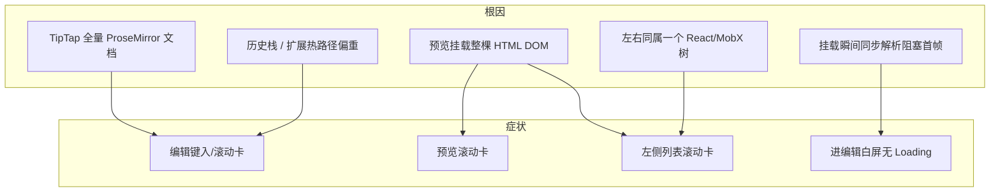
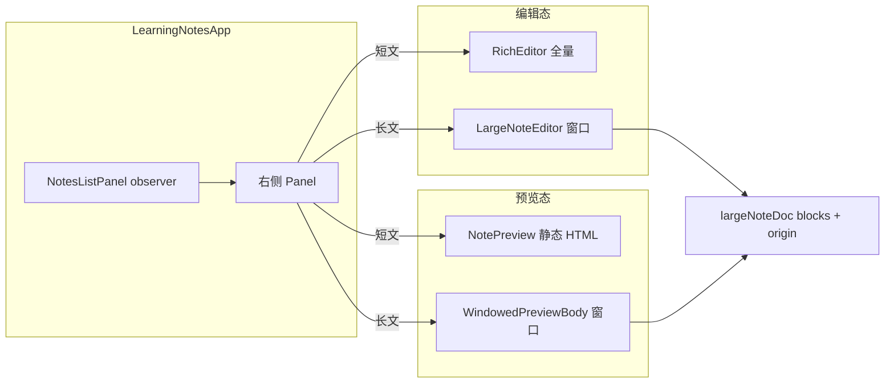
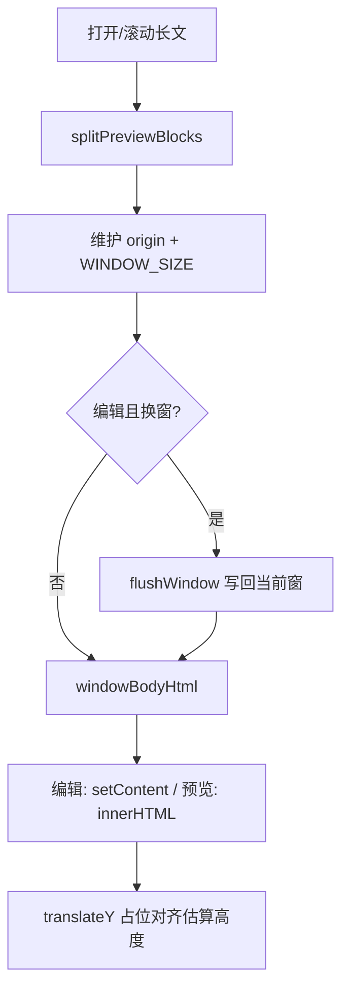
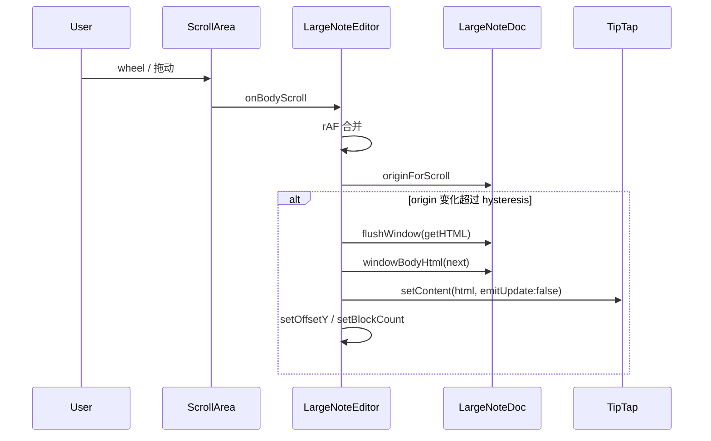

# 学习笔记富文本编辑 / 预览卡顿 — 详细解决步骤

> **状态**：已落地（2026-07）  
> **日期**：2026-07-27  
> **需求摘要**：学习笔记在长文场景下，编辑、预览与左侧列表滚动整页卡顿；在**不要虚拟列表、不要手动翻页、预览样式与编辑一致**的约束下，用「模式拆分 + 滚动窗口 + 渲染隔离」把主线程争用压到可接受范围。

## 延伸阅读

| 文档 | 角色 |
|------|------|
| [学习笔记富文本编辑.md](../notes/学习笔记富文本编辑.md) | 富文本能力规划 → 归档 [english/学习笔记富文本编辑.md](../../english/学习笔记富文本编辑.md) |
| [知识库滚动卡顿修复.md](../knowledge/知识库滚动卡顿修复.md) | 知识库预览卡顿同类方法论（对照） |
| [english/学习笔记MobX存储.md](../../english/学习笔记MobX存储.md) | 列表分页 / Store |

---

## 0. 读本文你将得到什么

- **卡顿根因拆解**：不是单一 bug，而是「TipTap 全量文档」「预览挂满 DOM」「左右同树重渲 / 绘制连锁」叠加。
- **一句话方案**：预览卸掉 TipTap；长文编辑/预览只挂「滚动窗口」内的块；列表独立 observer + `contain`，避免右侧大树拖死左侧滚动。
- **怎么落地**：按下方 **S1→S8** 顺序理解；每步含 **问题 → 思路 → 代码（含详细注释）→ 原理**。
- **明确否决**：虚拟列表、iframe 预览、`content-visibility:auto`、分帧挂满全文、手动翻页条。
- **天花板**：超长文 + 大量 base64 图时，窗口内仍可能偶发卡顿；完整消除需虚拟化或离屏文档，与产品约束互斥。

---

## 1. 需求与边界

### 1.1 用户故事

| 角色 | 场景 | 行为 | 期望 |
|------|------|------|------|
| 笔记用户 | 短文 | 编辑 / 预览 / 滚列表 | 跟手，与改前体验一致 |
| 笔记用户 | 长文（百段+ / 大 HTML） | 连续滚动编辑 | 无翻页条；标题 UI 与短文一致 |
| 笔记用户 | 长文预览 | 滚预览、再滚左侧列表 | 预览可读；列表不因右侧 DOM 卡死 |
| 笔记用户 | 预览 vs 编辑 | 对比空行与样式 | 空行与主题样式一致 |

### 1.2 范围

| 在范围内 | 不在范围内 |
|----------|------------|
| `apps/remote-plugins` 学习笔记页、RichEditor、NotePreview | 后端笔记 API 性能 |
| 长文窗口化编辑 / 预览、列表隔离、挂载遮罩 | 全文虚拟列表、iframe 预览（已试后放弃） |
| TipTap `undoRedo` 深度、字数统计开关 | 换编辑器内核 |

### 1.3 约束

- **不要**虚拟列表（曾导致抖动、快滚空屏、底部大空白）。
- **不要**手动翻页条（要连续滚动）。
- 长文 title 与短文同一套 `NoteTitleField` UI。
- 预览样式跟编辑态一致（同一套 CSS token / `.tiptap` 规则）；曾用 iframe 导致字色/白底，已回退。
- Ponytail：少抽象、少依赖、修根因。

---

## 2. 卡顿根因总览



| 根因 | 机制 | 典型症状 |
|------|------|----------|
| TipTap 全量文档 | 节点数 ≈ 段落数；每次事务/layout 扫整棵树 | 长文编辑卡、内存高 |
| 预览全文 DOM | `dangerouslySetInnerHTML` 一次挂数千节点；与列表同文档 | 预览滚卡；**列表滚也卡** |
| 左右未隔离 | 列表 `setState` / MobX 通知牵动右侧；无 `contain` 时绘制连锁 | 仅预览态列表卡、编辑态相对好（窗口化后右侧轻） |
| 同步挂载 | `useEditor` + `setContent` 阻塞主线程 | Loading 来不及画 |
| 扩展过重 | 默认 history 深、字数统计、可拖表格列等 | 额外事务与 layout |

---

## 3. 方案总览

**一句话方案**：短文走全量 TipTap / 静态 HTML；长文走「估算高度占位 + 仅窗口内 `setContent` / 切片 HTML」；列表独立 observer + CSS contain；进编辑先画 Loading 再下一帧挂编辑器。

| # | 步骤 | 解决什么 | 主要文件 |
|---|------|----------|----------|
| S1 | 预览卸 TipTap | 预览不再跑 ProseMirror | `NotePreview`、`index.tsx` |
| S2 | 列表独立 observer + rAF + contain | 列表滚动不重渲右侧 | `NotesListPanel.tsx` |
| S3 | 长文判定 + 块切分 | 何时走窗口化 | `utils/doc.ts`、`previewHtml.ts` |
| S4 | 长文窗口化编辑 | 编辑 DOM/文档有上限 | `components/Editor.tsx` |
| S5 | 长文窗口化预览 | 预览 DOM 有上限，列表不被拖死 | `components/PreviewBody.tsx` |
| S6 | 延迟挂载编辑器 | 先 Loading 再解析 | `index.tsx` |
| S7 | TipTap 减负 | undo 深度、关字数等 | `extensions/index.ts`、调用处 |
| S8 | 预览 HTML 轻处理 | 懒加载图、空行高度、剥 title | `previewHtml.ts` |

### 3.1 架构图



**图内方法说明**

| 符号 | 做什么 | 输入 / 输出要点 |
|------|--------|-----------------|
| `NotesListPanel` | 独立 observer 渲染列表与滚动 FAB | 读 Store 列表字段；滚动只更新本组件 state |
| `isLargeNoteHtml` | 判断是否走长文路径 | HTML 字符串 → boolean（块数或长度阈值） |
| `createLargeNoteDoc` | 切块并初始化窗口 | HTML → `{ doc, title, editorHtml }` |
| `LargeNoteEditor` | 长文连续滚动编辑 | 滚动 → `originForScroll` → `setContent` 窗口 |
| `WindowedPreviewBody` | 长文只读窗口预览 | 同套 origin 算法；输出切片 HTML |
| `NotePreview` | 短文静态预览壳 | `preparePreviewBody(html)` → ScrollArea |

### 3.2 长文窗口主流程



**图内方法说明**

| 符号 | 做什么 | 输入 / 输出要点 |
|------|--------|-----------------|
| `splitPreviewBlocks` | 顶层块切分数组 | HTML → `string[]` |
| `flushWindow` | 把编辑器当前 HTML 写回 `doc.blocks` | 防空覆盖 |
| `windowBodyHtml` | 取 `[origin, origin+count)` 拼接 | → 窗口 HTML |
| `originForScroll` | 按 scrollTop 估算窗口起点 | 居中可视区，夹紧边界 |

### 3.3 时序：长文编辑换窗



---

## 4. 现状与复用

| 能力 | 已有位置 | 本方案用法 |
|------|----------|------------|
| TipTap RichEditor | `components/design/RichEditor` | 短文全量；长文只承载窗口 HTML |
| NoteTitleField | `RichEditor/title` | 长文标题在滚动区顶部，不进 TipTap 窗 |
| NotePreview | `components/design/NotePreview` | 短文静态预览；长文 children 插 WindowedPreviewBody |
| ScrollArea | `@/components/ui/scroll-area` | 列表 / 编辑 / 预览统一滚动条 |
| MobX Store | `store/learningNotes.ts` | 列表数据；列表面板独立 observer |

---

## 5. 逐步解决（问题 → 思路 → 代码 → 原理）

### S1. 预览卸掉 TipTap

#### 问题

预览若继续挂 `RichEditor` / ProseMirror：只读场景仍承担完整文档模型、选区、插件、历史，DOM 与事务成本与编辑同级。

#### 思路

`store.preview` 为真时**完全不挂** TipTap；只读用静态 HTML + 同一套 `.tiptap` CSS。

#### 代码（页面分支）

路径：`apps/remote-plugins/src/views/learning-notes/index.tsx`（结构示意）

```tsx
{!store.preview ? (
  // 编辑态：短文 RichEditor / 长文 LargeNoteEditor
  // mountEditor 为 true 时才创建，配合 S6 延迟挂载
  mountEditor ? (useLarge ? <LargeNoteEditor ... /> : <RichEditor ... />) : null
) : (
  // 预览态：绝不挂 TipTap
  <div className="... contain-[layout_paint]">
    {isLargeNoteHtml(store.preview.html) ? (
      // 长文：窗口化静态预览（S5）
      <NotePreview title={...} headerExtra={...}>
        <WindowedPreviewBody key={store.preview.id} html={store.preview.html} />
      </NotePreview>
    ) : (
      // 短文：全文静态 HTML 即可
      <NotePreview title={...} html={store.preview.html} headerExtra={...} />
    )}
  </div>
)}
```

短文预览正文（`NotePreview`）：

```tsx
// 去掉内嵌 title，空段补 br，图片 lazy —— 不做 TipTap 解析
const bodyHtml = useMemo(
  () => (html ? preparePreviewBody(html) : ''),
  [html],
);

<ScrollArea className="rich-editor-body note-preview-static text-textcolor ...">
  <div
    className="tiptap note-preview-tiptap ProseMirror"
    // 只读静态树；样式复用 RichEditor/styles.css
    dangerouslySetInnerHTML={{ __html: bodyHtml }}
  />
</ScrollArea>
```

#### 原理

- **编辑成本**来自 ProseMirror 文档模型与插件，不只是「有没有 DOM」。
- 只读场景用静态 HTML，主线程省掉：事务、选区、decoration、input 规则。
- 样式仍走同一套 `.rich-editor-body .tiptap …`，视觉与编辑一致（相对 iframe 拷变量方案更稳）。

---

### S2. 左侧列表独立 observer + 滚动 rAF + contain

#### 问题

列表滚动时若整页是一个大 `observer`，或滚动回调里频繁 `setState`，会连带右侧 TipTap/大预览 reconcile；即便右侧未改 props，同树 layout/paint 仍可能被拖累。预览挂满 DOM 时尤甚。

#### 思路

1. `NotesListPanel` 单独 `observer`，只订阅列表相关字段。  
2. `scroll` → `requestAnimationFrame` 合并后再算 edge / `loadMore`。  
3. 列表 / 预览容器加 `contain: layout paint`，限制绘制连锁。

#### 代码

路径：`apps/remote-plugins/src/views/learning-notes/components/NotesListPanel.tsx`

```tsx
/**
 * 列表独立 observer：滚动 / loadMore / scrollEdge 只重渲左侧，
 * 避免牵动右侧 TipTap/大 HTML 预览（长文时滚动卡顿主因）。
 */
export const NotesListPanel = observer(function NotesListPanel({
  locale,
}: {
  locale: string;
}) {
  const { learningNotesStore: store } = useStore();
  // 滚动相关 UI 状态留在本组件，不要抬到 LearningNotesApp
  const scrollViewportRef = useRef<HTMLDivElement>(null);
  const scrollRafRef = useRef(0);
  const [scrollEdge, setScrollEdge] = useState<'top' | 'bottom' | null>(null);

  const syncScrollEdge = useCallback(() => {
    const el = scrollViewportRef.current;
    if (!el) return;
    const { scrollTop, scrollHeight, clientHeight } = el;
    let edge: 'top' | 'bottom' | null = null;
    if (scrollTop <= SCROLL_EDGE_PX) edge = 'top';
    else if (scrollTop + clientHeight >= scrollHeight - SCROLL_EDGE_PX)
      edge = 'bottom';
    // 值不变不 setState → 避免每帧空渲染
    setScrollEdge((prev) => (prev === edge ? prev : edge));
    // 近底加载更多（仍只影响本 observer 订阅的 list 字段）
    if (scrollTop + clientHeight >= scrollHeight - SCROLL_EDGE_PX * 3) {
      void store.loadMore();
    }
  }, [store]);

  const onViewportScroll = useCallback(() => {
    // 一帧最多同步一次 edge / loadMore
    if (scrollRafRef.current) return;
    scrollRafRef.current = requestAnimationFrame(() => {
      scrollRafRef.current = 0;
      syncScrollEdge();
    });
  }, [syncScrollEdge]);

  return (
    // contain：内部滚动/绘制尽量不迫使外侧大树参与
    <aside className="... contain-[layout_paint]">
      <ScrollArea
        ref={scrollViewportRef}
        onScroll={onViewportScroll}
        className="min-h-0 flex-1 p-3"
      >
        {/* 列表项 map ... */}
      </ScrollArea>
    </aside>
  );
});
```

#### 原理

- **MobX observer 粒度**：子树订阅越窄，store 无关字段变化越不容易误伤。  
- **rAF 合并**：输入事件频率 ≫ 帧率；合并后主线程把时间留给合成滚动。  
- **CSS `contain`**：告诉浏览器本区域 layout/paint 独立，降低「滚左侧 → 重绘右侧巨 DOM」的概率（配合 S5 减小右侧 DOM 更有效）。

---

### S3. 长文判定与块模型

#### 问题

所有笔记都走全量 TipTap / 全文预览，短文浪费优化，长文必卡。需要稳定阈值。

#### 思路

按**顶层块数**或 **HTML 长度**判定；正文切成 `blocks[]`，窗口用 `origin + count` 描述。

#### 代码

路径：`apps/remote-plugins/src/views/learning-notes/utils/doc.ts`  
辅助：`apps/remote-plugins/src/components/design/NotePreview/previewHtml.ts`

```ts
/** 超过该块数启用长文滚动窗口 */
export const LARGE_MIN_BLOCKS = 80;
/** 编辑器/预览内同时存在的正文块数上限 */
export const WINDOW_SIZE = 100;
/** origin 至少变化这么多块才换窗，减少边界抖动 */
export const ORIGIN_HYSTERESIS = 24;
/** 单块估算高度（px），用于占位总高与 scroll→index */
export const EST_BLOCK_H = 44;

export type LargeNoteDoc = {
  /** 全文按顶层块切开后的 HTML 片段 */
  blocks: string[];
  /** 当前窗口起点（块下标） */
  origin: number;
  /** 当前窗口块数 */
  count: number;
};

export function isLargeNoteHtml(content: unknown): content is string {
  if (typeof content !== 'string' || !content) return false;
  const body = stripNoteTitleHtml(content);
  // 超大字符串（常含 base64 图）直接长文路径，避免先 split 卡死
  if (content.length >= 80_000) return true;
  return splitPreviewBlocks(body).length >= LARGE_MIN_BLOCKS;
}

/**
 * 按顶层开闭标签切开（笔记多为扁平 p/h/ul/table）。
 * ponytail: 嵌套同名标签可能切不准；失败时调用方回退整段。
 */
export function splitPreviewBlocks(html: string): string[] {
  if (!html) return [];
  const blocks: string[] = [];
  // 匹配成对顶层标签或自闭合
  const re = /<([a-z][a-z0-9]*)\b[^>]*(?:\/>|>[\s\S]*?<\/\1>)/gi;
  let last = 0;
  let m: RegExpExecArray | null;
  while ((m = re.exec(html))) {
    // 标签之间的裸文本碎片也保留
    if (m.index > last) {
      const gap = html.slice(last, m.index).trim();
      if (gap) blocks.push(gap);
    }
    blocks.push(m[0]);
    last = m.index + m[0].length;
  }
  if (last < html.length) {
    const tail = html.slice(last).trim();
    if (tail) blocks.push(tail);
  }
  return blocks.length ? blocks : [html];
}

export function createLargeNoteDoc(html: string) {
  // 标题单独抽出：长文编辑用 NoteTitleField，不进 TipTap 窗口
  const title = extractTitleText(html);
  const body = stripNoteTitleHtml(html);
  const parts = splitPreviewBlocks(body);
  const blocks = parts.length ? parts : ['<p></p>'];
  const count = Math.min(WINDOW_SIZE, blocks.length);
  const doc: LargeNoteDoc = { blocks, origin: 0, count };
  return {
    doc,
    title,
    // 初始只把第一窗喂给 TipTap，而不是全文
    editorHtml: blocks.slice(0, count).join('') || '<p></p>',
  };
}

/** 由滚动位置算窗口 origin（居中可视区） */
export function originForScroll(
  scrollTop: number,
  viewH: number,
  blockCount: number,
  estH: number,
): number {
  // 可视区垂直中心对应的「估算块下标」
  const center = scrollTop + viewH / 2;
  const centerIdx = Math.max(
    0,
    Math.min(blockCount - 1, Math.floor(center / estH)),
  );
  const maxOrigin = Math.max(0, blockCount - WINDOW_SIZE);
  // 让窗口大致盖住可视中心，而不是永远贴顶
  return Math.max(
    0,
    Math.min(maxOrigin, centerIdx - Math.floor(WINDOW_SIZE / 2)),
  );
}

/** 取窗口 HTML */
export function windowBodyHtml(doc: LargeNoteDoc, origin: number) {
  const count = Math.min(WINDOW_SIZE, Math.max(0, doc.blocks.length - origin));
  const html =
    count > 0 ? doc.blocks.slice(origin, origin + count).join('') : '<p></p>';
  return { html, count: count > 0 ? count : 1 };
}

/** 写回当前窗口；拒绝「空内容覆盖已有大窗」（防误清空） */
export function flushWindow(doc: LargeNoteDoc, editorHtml: string): boolean {
  const bodyBlocks = splitPreviewBlocks(stripNoteTitleHtml(editorHtml));
  if (isEffectivelyEmptyBody(bodyBlocks) && doc.count > 3) return false;
  const next = bodyBlocks.length ? bodyBlocks : ['<p></p>'];
  doc.blocks.splice(doc.origin, doc.count, ...next);
  doc.count = next.length;
  return true;
}
```

#### 原理

- **复杂度从 O(全文)** 降到 **O(窗口)**：TipTap 节点数、预览 DOM 数有硬顶 `WINDOW_SIZE`。  
- **估算高度**换连续滚动：真实块高不一致会有轻微跳动，用 `ORIGIN_HYSTERESIS` 换稳定；不引入虚拟列表测量。  
- **正则切块**避免对大 base64 HTML 做 `DOMParser`（主线程友好）。

---

### S4. 长文窗口化编辑（连续滚动，无翻页条）

#### 问题

长文全量 `setContent` / 全量 ProseMirror：内存与每次滚动/输入的成本随文档线性恶化。手动翻页能减负但不符合产品。

#### 思路

- 外层用 `height = 标题槽 + blocks.length * EST_BLOCK_H` 撑出可滚轨道。  
- TipTap 只渲染当前窗口；`transform: translateY` 对齐窗口在文档中的位置。  
- 换窗前 `flushWindow` 写回，保存时 `stitchFullHtml` 拼全文。  
- 标题用 `NoteTitleField` 钉在文档顶部，**不进入**窗口 TipTap。

#### 代码

路径：`apps/remote-plugins/src/views/learning-notes/components/Editor.tsx`

```tsx
/** 与短文 Title 块大致同高；换窗时标题不进 TipTap，零开销 */
const TITLE_SLOT_H = 108;

export function LargeNoteEditor({ defaultContent, onReady, ... }: Props) {
  // 启动时切块；doc 放 ref，换窗改数组不重建整页
  const boot = useRef(createLargeNoteDoc(defaultContent));
  const docRef = useRef<LargeNoteDoc>(boot.current.doc);
  const editorRef = useRef<Editor | null>(null);
  const originRef = useRef(0);
  const shiftingRef = useRef(false); // 换窗中忽略滚动，防重入
  const scrollRafRef = useRef(0);

  const [title, setTitle] = useState(boot.current.title);
  const titleRef = useRef(title);
  titleRef.current = title;

  const [offsetY, setOffsetY] = useState(0);
  const [blockCount, setBlockCount] = useState(boot.current.doc.blocks.length);
  // 占位总高：决定滚动条可滚范围（估算，非实测）
  const bodyH = Math.max(blockCount * EST_BLOCK_H, EST_BLOCK_H * WINDOW_SIZE);
  const totalH = TITLE_SLOT_H + bodyH;

  // 保存时拼回全文（含 title）
  const saveApi = useCallback((): LargeNoteSaveApi => {
    return {
      getHTML: () => {
        const e = editorRef.current;
        const html = e && !e.isDestroyed ? e.getHTML() : '';
        return stitchFullHtml(docRef.current, titleRef.current, html);
      },
      getText: () => {
        const e = editorRef.current;
        const html = e && !e.isDestroyed ? e.getHTML() : '';
        return stitchFullText(docRef.current, titleRef.current, html);
      },
      getTitle: () => titleRef.current.trim(),
    };
  }, []);

  const applyOrigin = useCallback((editor: Editor, nextOrigin: number) => {
    const doc = docRef.current;
    if (shiftingRef.current) return;
    if (nextOrigin === originRef.current) return;

    const maxOrigin = Math.max(0, doc.blocks.length - WINDOW_SIZE);
    const snapEdge =
      (nextOrigin === 0 && originRef.current !== 0) ||
      (nextOrigin === maxOrigin && originRef.current !== maxOrigin);
    // 非贴边时要求位移够大，避免估算误差导致来回换窗抖动
    if (
      !snapEdge &&
      Math.abs(nextOrigin - originRef.current) < ORIGIN_HYSTERESIS
    ) {
      return;
    }

    shiftingRef.current = true;
    try {
      // 1) 把当前窗编辑结果写回 blocks
      flushWindow(doc, editor.getHTML());
      // 2) 取新窗 HTML
      const { html, count } = windowBodyHtml(doc, nextOrigin);
      // 3) 静默替换，避免写入历史栈炸开
      const ok = editor.commands.setContent(html, { emitUpdate: false });
      if (ok === false) return;
      doc.origin = nextOrigin;
      doc.count = count;
      originRef.current = nextOrigin;
      // 4) 视觉上把窗口平移到估算位置
      setOffsetY(nextOrigin * EST_BLOCK_H);
      setBlockCount(doc.blocks.length);
    } finally {
      // 下一帧再允许滚动换窗，避开 setContent 同步回流期
      requestAnimationFrame(() => {
        shiftingRef.current = false;
      });
    }
  }, []);

  const onBodyScroll = useCallback(
    (e: UIEvent<HTMLDivElement>) => {
      const editor = editorRef.current;
      if (!editor || editor.isDestroyed || shiftingRef.current) return;
      const vp = e.currentTarget;
      // 标题槽不计入正文滚动进度
      const top = Math.max(0, vp.scrollTop - TITLE_SLOT_H);
      const viewH = vp.clientHeight || 600;
      if (scrollRafRef.current) return;
      scrollRafRef.current = requestAnimationFrame(() => {
        scrollRafRef.current = 0;
        if (shiftingRef.current) return;
        applyOrigin(
          editor,
          originForScroll(top, viewH, docRef.current.blocks.length, EST_BLOCK_H),
        );
      });
    },
    [applyOrigin],
  );

  const renderBody = useCallback(
    (editorContent: ReactNode) => (
      <div className="relative w-full" style={{ height: totalH }}>
        {/* 与短文同一套标题 UI；钉在文档顶部，随滚动离开视口 */}
        <div
          className="absolute top-0 right-0 left-0 z-1"
          style={{ height: TITLE_SLOT_H }}
        >
          <NoteTitleField
            value={title}
            onChange={setTitle}
            onContinue={focusBody}
          />
        </div>
        {/* TipTap 只占窗口高度；用 translateY 对齐到「全文坐标系」 */}
        <div
          className="absolute top-0 right-0 left-0"
          style={{
            transform: `translateY(${TITLE_SLOT_H + offsetY}px)`,
          }}
        >
          {editorContent}
        </div>
      </div>
    ),
    [focusBody, offsetY, title, totalH],
  );

  return (
    <RichEditor
      defaultContent={boot.current.editorHtml}
      showTitle={false}
      onBodyScroll={onBodyScroll}
      renderBody={renderBody}
      showCharCount={false}
      showBubbleMenu={false}
      onCreate={(e) => {
        editorRef.current = e;
        docRef.current.origin = 0;
        originRef.current = 0;
        onReadyRef.current(e, saveApi());
      }}
      ...
    />
  );
}
```

保存拼全文：

```ts
export function stitchFullHtml(
  doc: LargeNoteDoc,
  title: string,
  editorHtml: string,
): string {
  // 先把当前窗刷进 blocks，再拼 title + 全部块
  flushWindow(doc, editorHtml);
  return `${titleToHtml(title)}${doc.blocks.join('')}`;
}
```

#### 原理

- **空间局部性**：用户同时只看见约一屏内容；窗口略大于视口即可。  
- **`emitUpdate: false`**：换窗不是用户编辑，不应进 undo 栈。  
- **`flush` 再切**：防止未保存的窗口编辑在换窗时丢失。  
- **标题外置**：换窗 `setContent` 不会毁掉 title 节点；UI 与短文一致且零窗口成本。

---

### S5. 长文窗口化预览（解决「预览态列表卡、编辑态不卡」）

#### 问题

编辑长文已窗口化 → 右侧 DOM 轻 → 列表滚得动。  
预览若挂**全文**静态 HTML → 右侧仍是数千节点 → **同文档**下滚列表仍卡（即使用了 S2）。

#### 思路

预览复用同一套 `LargeNoteDoc` / `originForScroll`；只把窗口 HTML 填进绝对定位层；`ScrollArea` 滚的是估算总高。

#### 代码

路径：`apps/remote-plugins/src/views/learning-notes/components/PreviewBody.tsx`

```tsx
/**
 * 长文只读预览：与 LargeNoteEditor 同一套滚动窗口，
 * 避免全文 DOM 拖垮左侧列表滚动。
 */
export function WindowedPreviewBody({ html, className }: Props) {
  const boot = useMemo(() => createLargeNoteDoc(html), [html]);
  const docRef = useRef<LargeNoteDoc>(boot.doc);
  const originRef = useRef(0);
  const shiftingRef = useRef(false);
  const scrollRafRef = useRef(0);

  const [origin, setOrigin] = useState(0);
  const [offsetY, setOffsetY] = useState(0);
  const blockCount = boot.doc.blocks.length;
  const bodyH = Math.max(blockCount * EST_BLOCK_H, EST_BLOCK_H * WINDOW_SIZE);

  docRef.current = boot.doc;

  const windowHtml = useMemo(() => {
    const { html: slice } = windowBodyHtml(boot.doc, origin);
    // 懒加载图 + 空段补 br（与编辑态空行高度一致）
    return decoratePreviewHtml(preserveEmptyParagraphs(slice));
  }, [boot.doc, origin]);

  const applyOrigin = useCallback((nextOrigin: number) => {
    const doc = docRef.current;
    if (shiftingRef.current) return;
    if (nextOrigin === originRef.current) return;

    const maxOrigin = Math.max(0, doc.blocks.length - WINDOW_SIZE);
    const snapEdge =
      (nextOrigin === 0 && originRef.current !== 0) ||
      (nextOrigin === maxOrigin && originRef.current !== maxOrigin);
    if (
      !snapEdge &&
      Math.abs(nextOrigin - originRef.current) < ORIGIN_HYSTERESIS
    ) {
      return;
    }

    shiftingRef.current = true;
    originRef.current = nextOrigin;
    doc.origin = nextOrigin;
    doc.count = Math.min(
      WINDOW_SIZE,
      Math.max(0, doc.blocks.length - nextOrigin),
    );
    setOrigin(nextOrigin);
    setOffsetY(nextOrigin * EST_BLOCK_H);
    requestAnimationFrame(() => {
      shiftingRef.current = false;
    });
  }, []);

  const onScroll = useCallback(
    (e: UIEvent<HTMLDivElement>) => {
      if (shiftingRef.current) return;
      const vp = e.currentTarget;
      const top = Math.max(0, vp.scrollTop);
      const viewH = vp.clientHeight || 600;
      if (scrollRafRef.current) return;
      scrollRafRef.current = requestAnimationFrame(() => {
        scrollRafRef.current = 0;
        if (shiftingRef.current) return;
        applyOrigin(
          originForScroll(
            top,
            viewH,
            docRef.current.blocks.length,
            EST_BLOCK_H,
          ),
        );
      });
    },
    [applyOrigin],
  );

  return (
    <ScrollArea
      className={cn(
        'rich-editor-body note-preview-static text-textcolor min-h-0 flex-1',
        className,
      )}
      onScroll={onScroll}
    >
      {/* 估算总高：决定滚动条长度 */}
      <div className="relative w-full" style={{ height: bodyH }}>
        <div
          className="tiptap note-preview-tiptap ProseMirror absolute top-0 right-0 left-0"
          style={{ transform: `translateY(${offsetY}px)` }}
          dangerouslySetInnerHTML={{ __html: windowHtml }}
        />
      </div>
    </ScrollArea>
  );
}
```

#### 原理

- 列表卡顿的主因往往是**同页巨型 DOM**，不是列表自身 item 数。  
- 把预览 DOM 压到与编辑同量级后，S2 的 isolation 才真正「够用」。  
- 算法与编辑共用，行为可预期；无虚拟列表的空屏/抖动问题（代价是估算高度带来的轻微位置误差）。

---

### S6. 进编辑：先 Loading，下一帧再挂 TipTap

#### 问题

长文 `useEditor` + 解析在同一同步回合执行时，React 来不及先提交 Loading，用户感觉「点编辑后卡住、没有反馈」。

#### 思路

`mountEditor` 默认 false → effect 里 `rAF` 再置 true；遮罩用 `readyKey === editorKey`。

#### 代码

路径：`apps/remote-plugins/src/views/learning-notes/index.tsx`

```tsx
const [readyKey, setReadyKey] = useState<string | null>(null);
const [mountEditor, setMountEditor] = useState(false);
const editorKey = `${store.editorSeed}:${locale}`;
const editorReady = readyKey === editorKey;

// 先画 Loading，下一帧再挂 TipTap，避免长文解析时连遮罩都刷不出来
useEffect(() => {
  if (store.preview) {
    setMountEditor(false);
    return;
  }
  // 先卸掉旧实例，让出一帧给 Loading
  setMountEditor(false);
  pagedSaveRef.current = null;
  const id = requestAnimationFrame(() => setMountEditor(true));
  return () => cancelAnimationFrame(id);
}, [editorKey, store.preview]);

// 渲染：
{mountEditor ? (
  // LargeNoteEditor.onReady / RichEditor.onCreate → setReadyKey(editorKey)
  ...
) : null}
{!editorReady ? (
  <div className="bg-background/60 absolute inset-0 z-10 flex items-center justify-center">
    <Loading />
  </div>
) : null}
```

#### 原理

- 浏览器一帧内：先 paint Loading，再在下一帧做重活。  
- **不减少**解析总耗时，但改善**可感知响应**；与窗口化叠加后，重活本身也更短。

---

### S7. TipTap 减负

#### 问题

默认历史过深、字数统计插件、可拖表格列等，在长文事务路径上增加内存与 layout。

#### 思路

- TipTap 3 使用 `undoRedo: { depth: 50 }`（不是旧 `history`）。  
- 学习笔记场景 `showCharCount={false}`。  
- 默认关图片 resize / 表格列拖（按需再开）。

#### 代码

路径：`apps/remote-plugins/src/components/design/RichEditor/extensions/index.ts`

```ts
StarterKit.configure({
  // ...
  // TipTap 3：undoRedo（非 history）；长文降低深度，减轻内存与事务
  undoRedo: { depth: 50 },
  // ...
}),
```

调用处：

```tsx
<RichEditor showCharCount={false} ... />
<LargeNoteEditor ... /> // 内部同样 showCharCount={false}
```

#### 原理

- Undo 栈按深度保存步骤；深度与内存近似线性。  
- CharacterCount 等插件订阅每次文档变更；只读预览已卸编辑器，编辑侧能关则关。

---

### S8. 预览 HTML 轻处理（性能 + 与编辑一致）

#### 问题

1. 大图同步解码抢主线程。  
2. 静态 `<p></p>` 无 TipTap 的 `<br>` 占位 → 空行「消失」，看起来像预览丢了空行。  
3. 内嵌 title 节点与顶栏标题重复。

#### 思路

`preparePreviewBody`：剥 title → 空段补 br → 图片 `loading=lazy` / `decoding=async`。  
**不再**折叠连续空段（曾为减 DOM，但破坏与编辑一致性；长文 DOM 上限改由窗口化保证）。

#### 代码

路径：`apps/remote-plugins/src/components/design/NotePreview/previewHtml.ts`

```ts
/**
 * 去掉文档内嵌的 title 节点。
 * ponytail: 大文档（含 base64 图）用正则，避免 DOMParser 整树解析卡死主线程。
 */
export function stripNoteTitleHtml(html: string): string {
  if (!html) return '';
  return html.replace(
    /<div\b[^>]*\bdata-type=["']note-title["'][^>]*>[\s\S]*?<\/div>/i,
    '',
  );
}

/**
 * 空段落补 <br>，与 TipTap 编辑态占位一致
 *（纯 <p></p> 在静态 HTML 高度会塌掉）。
 */
export function preserveEmptyParagraphs(html: string): string {
  if (!html) return '';
  return html.replace(
    /<p(\b[^>]*)>(?:\s|&nbsp;|\u00a0)*<\/p>/gi,
    '<p$1><br></p>',
  );
}

/** 预览图异步解码；已有对应属性则不改 */
export function decoratePreviewHtml(html: string): string {
  if (!html) return '';
  return html.replace(/]*)>/gi, (_full, attrs: string) => {
    let next = attrs;
    if (!/\bloading\s*=/i.test(next)) next += ' loading="lazy"';
    if (!/\bdecoding\s*=/i.test(next)) next += ' decoding="async"';
    return ``;
  });
}

/** 预览正文：去 title、保留空行、图懒加载 —— 不折叠空段 */
export function preparePreviewBody(html: string): string {
  return decoratePreviewHtml(
    preserveEmptyParagraphs(stripNoteTitleHtml(html)),
  );
}
```

CSS 兜底（`NotePreview/styles.css`）：

```css
/* 空段兜底高度（与编辑态 line-height: 1.9 对齐） */
.note-preview-static .tiptap p:empty {
  min-height: 1.9em;
}
```

#### 原理

- **lazy/async**：解码推迟到进入视口附近，降低首屏与滚动尖峰。  
- **空段 br**：CSS 空块常无高度；编辑态 ProseMirror 视图里有 br 撑开行盒，静态预览必须显式对齐。  
- **不折叠空段**：性能让位给「预览 ≡ 编辑」的产品约束；长文 DOM 上限改由窗口化保证。

---

## 6. 明确否决的方案（及原因）

| 方案 | 为何否决 |
|------|----------|
| **虚拟列表** | 块高难测准 → 抖动、快滚空屏、底部大空白；用户明确不要 |
| **iframe 预览** | 主题变量在 `body.theme-*`，iframe 易字色不对、露白底；为样式一致已回退 |
| **`content-visibility: auto`** | 知识库侧实测加重 layout thrashing；同类问题禁止照搬 |
| **分帧挂满全文** | 最终 DOM 仍在，列表/滚动仍被拖死；「看起来加载完了」但根因还在 |
| **手动翻页条** | 能减负但产品要求连续滚动 |

---

## 7. 目录结构（落地后）

```
apps/remote-plugins/src/views/learning-notes/
  index.tsx                 # 页面壳：编辑/预览分支、延迟挂载
  api.ts
  components/
    NotesListPanel.tsx      # S2
    Editor.tsx              # S4 LargeNoteEditor
    PreviewBody.tsx         # S5 WindowedPreviewBody
  utils/
    doc.ts                  # S3 窗口模型
    index.ts
```

---

## 8. 验收清单

- [ ] 短文：编辑 / 预览切换流畅，样式与空行一致  
- [ ] 长文编辑：无翻页条，连续滚动可写；标题 UI 与短文一致；保存后全文完整  
- [ ] 长文预览：可滚读；**此时滚左侧列表**明显轻于「全文预览」时代  
- [ ] 进编辑先见 Loading，再出编辑器  
- [ ] 未引入虚拟列表 / iframe 预览 / 手动翻页  
- [ ] 含多图笔记：预览图为 lazy（网络面板可见）  

---

## 9. 性能天花板（如实说明）

| 场景 | 预期 |
|------|------|
| 窗口内仍含巨型 base64 图 | 换窗 `setContent` / 解码仍可能卡一下 |
| 块高与 `EST_BLOCK_H` 偏差大 | 滚动位置有轻微误差或偶发多换一次窗 |
| 短文但单段极大（一张超大图） | 不一定触发长文路径，仍可能卡 |

升级路径（若产品允许）：窗口内再对图片做占位与可视解码；或对表格等重块单独惰性挂载——仍避免整页虚拟列表。

---

## 10. 相关代码索引

| 主题 | 路径 |
|------|------|
| 页面编排 | `apps/remote-plugins/src/views/learning-notes/index.tsx` |
| 列表隔离 | `apps/remote-plugins/src/views/learning-notes/components/NotesListPanel.tsx` |
| 长文编辑 | `apps/remote-plugins/src/views/learning-notes/components/Editor.tsx` |
| 长文预览 | `apps/remote-plugins/src/views/learning-notes/components/PreviewBody.tsx` |
| 窗口模型 | `apps/remote-plugins/src/views/learning-notes/utils/doc.ts` |
| 预览 HTML | `apps/remote-plugins/src/components/design/NotePreview/previewHtml.ts` |
| TipTap 扩展 | `apps/remote-plugins/src/components/design/RichEditor/extensions/index.ts` |
