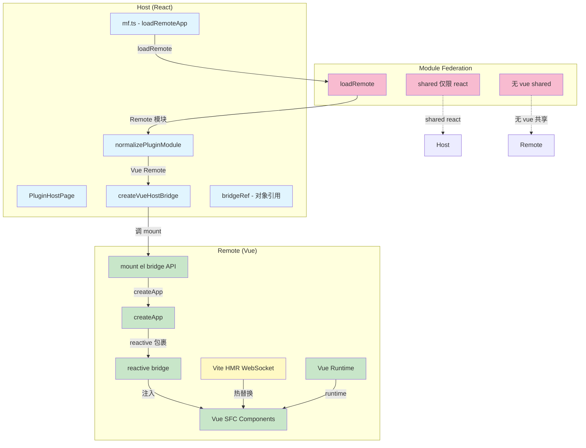
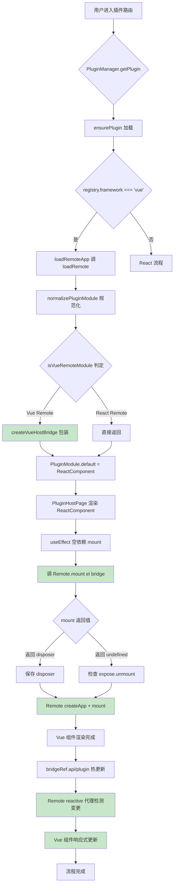
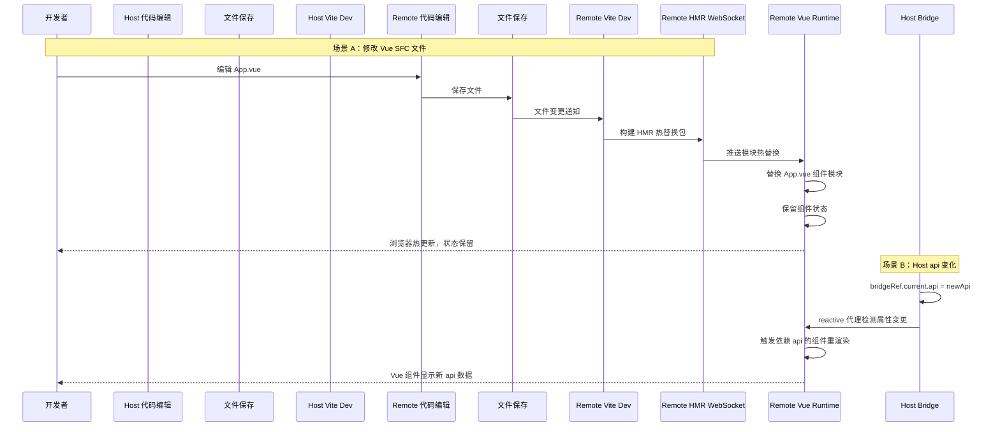

# Vue 插件桥接与 HMR 保障 — 实现思路

> **状态**：规划 | **日期**：2026-08-09 | **需求摘要**：React Host 加载 Vue Remote 插件，Host 零 Vue 依赖，Remote 自管生命周期，保障 Module Federation 下的 HMR 稳定可靠

## 0. 读本文你将得到什么

- Vue 子应用在 React Host 中加载的完整架构设计
- 旧架构 HMR 失效的根因分析与解决方案
- Host / Remote 各自的职责边界与交互协议
- 完整的 Mermaid 架构图 + 主流程图 + HMR 时序图
- 分阶段落地步骤与验收清单

## 1. 需求概述

### 1.1 功能一句话

React Host 主站通过 Module Federation 动态加载 Vue 构建的 Remote 插件，Host 不引入 Vue 运行时，Remote 自管 `createApp` 生命周期，保障开发态 HMR 热更新通道独立且稳定。

### 1.2 范围

- **前端**：Host（React）+ Remote（Vue SFC）
- **不含**：后端、桌面端原生层改动
- **约束**：Host 零 Vue 依赖、HMR 独立通道、样式隔离兼容

### 1.3 非目标（YAGNI）

- 不在 Host 内做 Vue 组件的 SSR
- 不支持 Vue 2 插件
- 不实现跨插件的 Vue 全局状态共享

## 2. 现状与痛点

### 2.1 旧架构

| 维度 | 旧方案 |
|------|--------|
| Host 依赖 | `vue@^3.5.41` in `dependencies` |
| Host 配置 | `vue` 加入 `federation.shared` 单例 |
| 桥接方式 | Host `createApp(VueRoot, { bridge }).mount(el)` |
| Remote 导出 | `export default App from './App.vue'`（SFC 组件） |

### 2.2 HMR 失效的三大根因

**根因 1：`optimizeDeps` 预打包冲突**

Host 配置 `shared.vue` 后，Vite 会尝试将 Vue 预打包为 CJS 格式。Remote 的 HMR WebSocket 需要 ESM 链路才能正确拦截模块变更，预打包版本切断了这条链路。

```
Host shared: vue (singleton)
    → Vite optimizeDeps 预打包 vue
    → Remote loadShared('vue') 获取 CJS 版本
    → HMR WebSocket 推送 ESM 模块变更
    → CJS 版本的 Vue 不支持 HMR 热替换
    → 结果：Remote 代码修改不触发热更新
```

**根因 2：双实例导致 HMR 实例不统一**

Host shared 要求 Remote 使用同一 Vue 实例，但由于 `optimizeDeps` 缓存、版本微差等因素，实际运行中可能出现两个 Vue 实例：一个来自 Host 的 shared，一个来自 Remote 自身的依赖。HMR 事件只在 Remote 自有的 Vue 实例中派发，Host shared 的 Vue 实例无法收到更新。

**根因 3：React 重渲染劫持 Vue 生命周期**

Host 在 `useEffect` 中管理 `createApp`，当 `api`/`plugin` 变化触发 React 重渲染时，如果 `useEffect` 依赖处理不当，可能导致 Vue 应用被意外销毁重建：

```
React render (api changed)
    → useEffect([api]) cleanup → app.unmount()
    → useEffect([api]) setup   → createApp(VueRoot).mount(el)
    → Vue 组件状态丢失
    → HMR 状态保留机制失效
```

### 2.3 已有的可复用能力

| 能力 | 已有位置 | 本需求用法 |
|------|----------|-----------|
| `PluginHostPage` | `apps/frontend/src/plugins/host/PluginHostPage.tsx` | Vue 插件的 React 外壳容器 |
| `PluginManager` | `apps/frontend/src/plugins/core/PluginManager.ts` | 插件生命周期管理 |
| `loadRemoteApp` | `apps/frontend/src/plugins/core/mf.ts` | Remote 动态加载入口 |
| `normalizePluginModule` | `apps/frontend/src/plugins/core/normalizePluginModule.ts` | React / Vue 模块自动识别与规范化 |
| `PluginPageShell` | `apps/frontend/src/plugins/host/PluginPageShell.tsx` | 插件页面统一外壳 + `overflow-auto` |
| `attachPluginStyleIsolation` | `apps/frontend/src/plugins/host/styleIsolation.ts` | 样式隔离兼容 |

## 3. 实现思路

### 3.1 一句话方案

Host **零 Vue 依赖**，Remote 自管 `createApp` 生命周期，通过 `mount(el, bridge)` API 向 Host 暴露挂载能力，Host 仅负责 DOM 容器分配和 bridge 属性同步。

### 3.2 核心设计决策

1. **Host 不 install Vue，不 shared Vue** — Remote 拥有独立 Vue runtime
2. **Remote 导出 `mount(el, bridge)` 而非 SFC** — Host 调函数而非组件，Remote 内部 `createApp`
3. **`useEffect` 空依赖 `[]`** — mount 只做一次，React 重渲染不触发 Vue 重建
4. **Remote `optimizeDeps.exclude: ['vue']`** — 防止 Remote 侧也预打包 Vue
5. **`reactive(bridge)` 在 Remote 侧包裹** — Host 传递对象引用，Remote 做响应式代理

### 3.3 架构图



#### 图内方法说明

| 方法 / 节点 | 说明 |
|-------------|------|
| `loadRemoteApp` | Host 入口，通过 MF 加载 Remote 模块原始产物 |
| `normalizePluginModule` | 自动识别 React / Vue Remote，Vue 时调 `createVueHostBridge` 包装 |
| `createVueHostBridge` | React 工厂组件，渲染 DOM 容器 div，调 Remote.mount |
| `bridgeRef` | Host 侧普通对象引用，Remote `reactive` 包裹后可响应属性变化 |
| `mount(el, bridge)` | Remote 导出的挂载函数，内部 `createApp` + `mount` + 返回 disposer |
| `createApp` | Vue 3 应用创建 API，仅在 Remote 侧调用 |
| `reactive(bridge)` | Vue 响应式代理，包裹 Host 传入的 bridge 对象 |
| `Vite HMR WebSocket` | Remote 专属 HMR 通道，Host 不参与 |
| `无 vue shared` | MF 配置：Host 与 Remote 不共享 Vue，各自独立 runtime |

#### 读图要点

- **蓝色区域**：Host（React）层，不含任何 Vue 引用
- **绿色区域**：Remote（Vue）层，自管全部 Vue 生命周期
- **黄色节点**：HMR 通道，完全在 Remote 侧闭合
- **粉色区域**：MF 层，仅 shared `react`，不 shared `vue`
- 核心边界：Host 与 Remote 的唯一交互是 `mount(el, bridge)` 函数调用和 bridge 对象属性同步

## 4. 主流程图

### 4.1 插件加载与挂载流程



#### 图内方法说明

| 方法 / 节点 | 说明 |
|-------------|------|
| `isVueRemoteModule` | 三级判定：registry `framework` > expose tag > `looksLikeVueMount` 启发式 |
| `createVueHostBridge` | 将 Remote mount API 包装为 React 组件 |
| `normalizePluginModule` | RawRemoteModule → PluginModule（Vue 时走 createVueHostBridge） |
| `mount(el, bridge)` | Remote 导出函数，内部 `createApp` + `app.mount(el)` |
| `bridgeRef` | Host 侧 ref 对象，属性变更通过同一引用传递给 Remote reactive |
| `reactive` | Vue 响应式 API，包裹 bridge 后可检测 Host 属性写入 |

#### 读图要点

1. 判定链路：`registry.framework` > `expose.framework/mfFramework` > `looksLikeVueMount`
2. 包装链路：`normalizePluginModule` → `createVueHostBridge` → 返回 React 组件
3. 挂载链路：`useEffect([])` 空依赖确保 mount 只执行一次
4. 热更新链路：Host 改 `bridgeRef` 属性 → Remote `reactive` 代理检测 → Vue 自动重渲染

### 4.2 HMR 时序图



#### 图内方法说明

| 方法 / 节点 | 说明 |
|-------------|------|
| `Remote Vite Dev` | Remote 的 Vite 开发服务器，独立于 Host |
| `Remote HMR WebSocket` | Remote 专属 HMR 通道，Host 不参与 |
| `Remote Vue Runtime` | Remote 自有的 Vue 实例，处理 HMR 热替换 |
| `Host Bridge` | Host 侧 bridgeRef 引用，属性写入触发 Remote 响应式更新 |
| `reactive 代理` | Remote 内部 `reactive(bridge)` 生成的代理对象 |

#### 读图要点

- **场景 A**：Vue SFC 修改完全在 Remote 侧闭环，Host 零参与
- **场景 B**：Host api 变化通过对象引用传递到 Remote，reactive 代理触发 Vue 重渲染
- **两条链路独立**：HMR 链路与 Host-Remote 通信链路互不干扰

## 5. 分阶段落地步骤

### M1：Host 架构调整

**目标**：Host 移除 Vue 依赖，建立桥接框架

**改动文件**：

| 文件 | 操作 | 说明 |
|------|------|------|
| `apps/frontend/package.json` | 修改 | 移除 `vue` 依赖 |
| `apps/frontend/vite.config.ts` | 修改 | 移除 `vue` 的 `shared` 和 `MF_SHARED_EXCLUDE` |
| `apps/frontend/src/plugins/core/createVueHostBridge.tsx` | 重写 | 改为调用 Remote `mount` API，不再 `createApp` |
| `apps/frontend/src/plugins/core/normalizePluginModule.ts` | 重写 | `looksLikeVueComponent` → `looksLikeVueMount` |
| `apps/frontend/src/plugins/core/mf.ts` | 修改 | `loadRemoteApp` 接入 `normalizePluginModule` |
| `apps/frontend/src/plugins/core/types.ts` | 修改 | `PluginDescriptor.framework` 字段 |
| `apps/frontend/src/plugins/index.ts` | 修改 | barrel 导出新类型 |
| `apps/frontend/src/plugins/host/PluginPageShell.tsx` | 修改 | 追加 `overflow-auto` |

**验收**：Host 构建成功，无任何 Vue import 残留

### M2：Remote 适配

**目标**：Remote 按新约定导出 `mount(el, bridge)` 并配置 HMR

**Remote 侧需做**：

1. `pnpm add vue`（Remote 自管版本）
2. `vite.config.ts` 配置：
   ```typescript
   // 必须
   shared: { vue: { singleton: true } }
   dev: { remoteHmr: true }
   resolve: { dedupe: ['vue'] }
   optimizeDeps: { exclude: ['vue'] }
   ```
3. expose 入口：
   ```typescript
   export function mount(el: HTMLElement, bridge: HostBridgeProps) {
     const app = createApp(App, { bridge: reactive(bridge) });
     app.mount(el);
     return () => app.unmount();
   }
   export default mount;
   ```
4. Registry 声明：`"framework": "vue"`

**验收**：Remote 独立构建成功，`pnpm dev` 可在 `http://localhost:9008` 访问

### M3：联调与验收

**目标**：Host + Remote 联调，验证 HMR 和热更新

**验收清单**：

| # | 验收项 | 操作 | 预期结果 |
|---|--------|------|----------|
| 1 | Vue 插件加载 | 进入 Vue 插件路由 | 页面正常渲染，`data-mf-framework="vue"` |
| 2 | React 插件不受影响 | 进入 React 插件路由 | 与改动前完全一致 |
| 3 | HMR 正常 | Remote 修改 App.vue 保存 | 浏览器热更新，组件状态保留 |
| 4 | Bridge 热更新 | Host 切换 api/locale | Vue 组件通过 reactive 自动响应 |
| 5 | 切换插件 | 从 Vue 插件切到其他路由 | Vue `app.unmount()` 正确执行 |
| 6 | 混合场景 | React + Vue 插件共存 | 互不干扰，各自独立生命周期 |
| 7 | 样式隔离 | Vue 插件内 Tailwind 样式 | 不泄漏到其他插件 |
| 8 | `PluginPageShell` 滚动 | Vue 插件长内容 | 可正常滚动 |

## 6. 风险与回归

### 6.1 风险清单

| 风险 | 影响 | 缓解措施 |
|------|------|----------|
| Remote 忘记 `optimizeDeps.exclude: ['vue']` | HMR 失效 | 文档 + 构建时检测 |
| Remote 未声明 `framework: 'vue'` | 被当 React 处理，挂载失败 | `isVueRemoteModule` 三级判定兜底 |
| Remote 导出 SFC 组件（而非 mount） | `resolveMount` 抛错 | 错误信息含正确的导出约定 |
| `trust: untrusted` Vue 插件 | iframe 隔离，HMR 走 iframe 通道 | 单独验证 iframe HMR |
| 函数形态 mount 与 React FC 混淆 | 误判为 React 组件 | 函数形态必须靠 `framework` 声明 |

### 6.2 回滚方案

- 若新架构出现不可接受的问题，可在 Host 侧保留旧版 `createVueHostBridge` 作为降级路径
- 通过 registry `framework` 字段切换新旧架构

## 7. 相关文档

| 文档 | 说明 |
|------|------|
| [插件Vue桥接.md](../../plugins/插件Vue桥接.md) | 实现归档文档（改动前后对比 + 逐行注释） |
| [模块联邦实现指南.md](../../plugins/模块联邦实现指南.md) | MF 实现细节总览 |
| [插件开发指南.md](../../plugins/插件开发指南.md) | 插件开发者手册 |
| [第三方联邦插件接入.md](./第三方联邦插件接入.md) | 第三方 MF 插件接入配置 |
| [模块联邦CSS隔离.md](./模块联邦CSS隔离.md) | MF 主/子样式隔离 |

---

（若与仓库最新源码不一致，以源码为准）