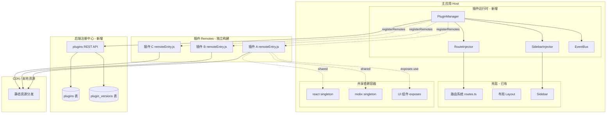
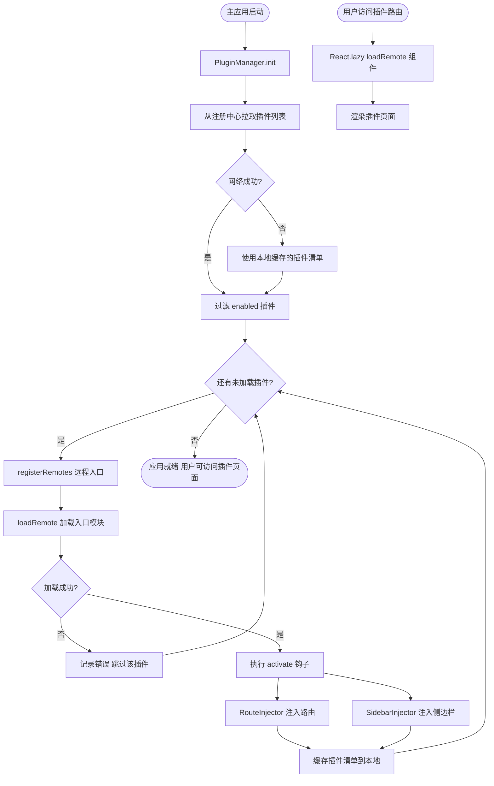
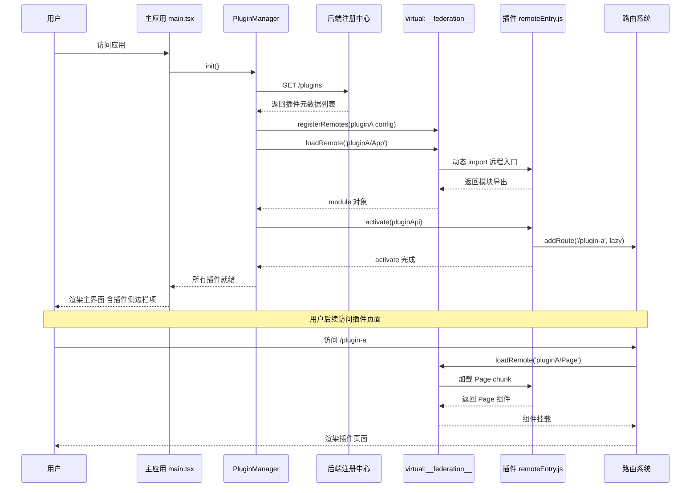
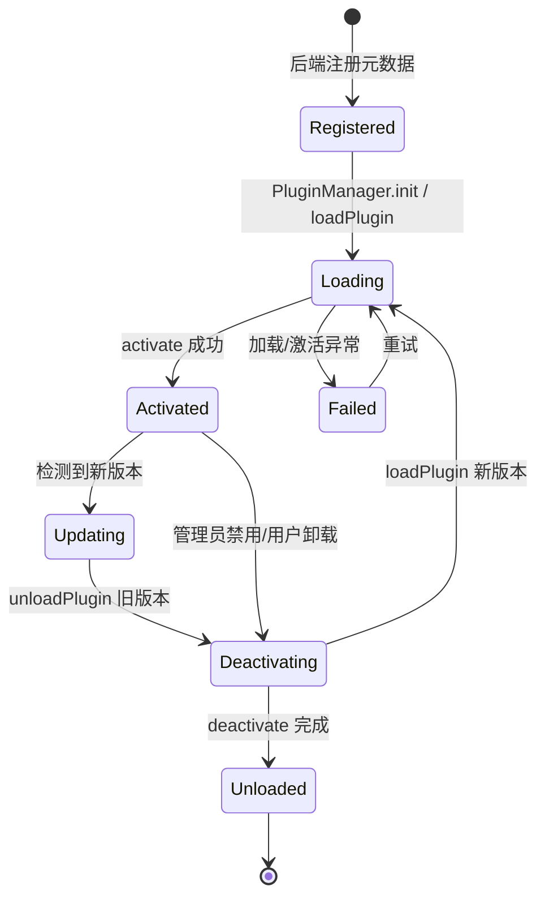

# 动态模块联邦实时可插拔微前端 — 实现思路

> **状态**：规划（未实现；现有单页应用能力可复用）  
> **日期**：2026-07-19  
> **需求摘要**：在 dnhyxc-ai 前端引入 `@originjs/vite-plugin-federation`，通过 `virtual:__federation__` 运行时动态注册 API，使子应用/插件发布新版本后主应用无需重新构建发布即可在运行时动态加载、卸载、热更新插件。

## 延伸阅读

- 现有路由与布局：[`apps/frontend/src/router/routes.ts`](../../apps/frontend/src/router/routes.ts)、[`apps/frontend/src/layout/index.tsx`](../../apps/frontend/src/layout/index.tsx)
- 现有 HTTP 客户端：[`apps/frontend/src/utils/fetch.ts`](../../apps/frontend/src/utils/fetch.ts)
- 现有 Store：[`apps/frontend/src/store/index.ts`](../../apps/frontend/src/store/index.ts)
- Vite 构建配置：[`apps/frontend/vite.config.ts`](../../apps/frontend/vite.config.ts)
- 小程序 EPUB 解析规划（同为规划态、含 M1–Mn 分阶段参考）：[小程序EPUB解析逻辑.md](../miniprogram/小程序EPUB解析逻辑.md)

---

## 0. 读本文你将得到什么

- **要解决的问题**：当前所有业务模块（聊天、知识库、电子书、英语学习等）编译进同一个前端 bundle，任一模块迭代都需要主应用重新构建发布。
- **一句话方案**：用 `@originjs/vite-plugin-federation` + `virtual:__federation__` 运行时动态注册 API，把独立构建的子应用/插件在主应用运行期加载、卸载、热更新。
- **主要改动层**：前端构建配置（Vite）、新增插件运行时层（PluginManager / RouteInjector / EventBus）、后端新增插件注册中心模块、路由与侧边栏改为动态注入。
- **分阶段落地**：M1 基础框架 → M2 插件系统完善 → M3 生产就绪 → M4 现有模块按需迁移。
- **最大风险**：vite-plugin-federation 在 React 19 + Vite 7 下的稳定性，以及 Tauri 桌面端远程模块加载的安全策略限制。

---

## 1. 需求与边界

### 1.1 用户故事

| 角色 | 场景 | 行为 | 期望结果 |
|------|------|------|----------|
| 插件开发者 | 独立仓库开发功能模块 | 构建产出 `remoteEntry.js` 并发布到 CDN | 主应用运行时自动拉取加载，无需主应用发版 |
| 平台管理员 | 后台管理插件 | 发布新版本/启用/禁用/回滚 | 用户端实时生效，无需刷新整个应用 |
| 终端用户 | 使用应用 | 访问插件提供的页面 | 与原生模块体验一致（路由、侧边栏、UI 风格） |
| 主应用维护者 | 维护核心壳层 | 升级共享依赖（React/MobX） | 已发布插件能通过 singleton 共享，避免重复加载 |

### 1.2 范围

| 在范围内 | 不在范围内（非目标） |
|----------|----------------------|
| 前端模块联邦运行时框架 | 不做跨技术栈混合（Vue/Angular 插件） |
| 后端插件注册中心（元数据 + 版本） | 不做可视化插件编辑器 |
| 动态路由 / 侧边栏注入 | 不做插件市场付费分发 |
| 插件生命周期（加载/卸载/热更新） | 不迁移所有现有模块（按需迁移） |
| 共享依赖管理 | 不做沙箱级 JS 隔离（用规范 + 命名约束） |
| Tauri 桌面端本地插件方案 | 不做 Service Worker 离线缓存 |

### 1.3 约束与依赖

- **构建工具**：Vite ^7.0.4，必须使用 `@originjs/vite-plugin-federation`（Vite 原生支持）
- **框架版本**：React ^19.1.0、react-router ^7.10.1、MobX ^6.15.0（共享依赖须 singleton）
- **平台**：Web + Tauri 桌面端双端兼容；Tauri 默认禁止远程代码执行，需本地插件方案
- **复用能力**：现有 `HttpClient`、`RootStore`、UI 组件库（Radix + Tailwind v4）
- **性能底线**：插件首屏加载 ≤1s（CDN 命中），主应用启动不因插件框架增加超过 200ms

---

## 2. 方案总览（一句话 + 要点）

**一句话方案**：在主应用 Vite 配置中启用 `vite-plugin-federation`，通过 `virtual:__federation__` 的 `registerRemotes` / `loadRemote` 在运行时按后端注册中心下发的插件元数据动态注册并加载远程模块，由 PluginManager 编排路由注入、侧边栏注入、生命周期钩子与事件总线。

| # | 设计要点 | 理由 |
|---|----------|------|
| 1 | 选用 `@originjs/vite-plugin-federation` 而非 Webpack MF | Vite 原生集成、构建性能最优、支持 `virtual:__federation__` 运行时动态注册 |
| 2 | 插件元数据由后端注册中心下发，不在主应用静态配置 | 实现"主应用不发版即可加载新插件"的核心目标 |
| 3 | 共享依赖用 `singleton: true` | React/MobX/ReactDOM 等只能有一个实例，否则 hooks 与状态管理会崩溃 |
| 4 | 插件入口规范：`activate(api)` / `deactivate()` 钩子 | 提供统一生命周期，支持热更新时干净卸载旧版本 |
| 5 | 动态路由用 `React.lazy` + `loadRemote` | 进入插件页面才加载远程 chunk，按需加载降低首屏 |
| 6 | Tauri 桌面端走本地插件包方案 | 规避远程代码加载的安全策略限制，同时支持离线 |
| 7 | 样式隔离用 CSS Modules + 根元素 `plugin-{id}` 前缀 | 与现有 Tailwind 体系兼容，零运行时开销 |

---

## 3. 现状与复用

| 能力 | 仓库中已有 | 本需求中的用法 |
|------|------------|----------------|
| 路由系统 | `apps/frontend/src/router/routes.ts`（静态路由表） | 扩展为"静态 + 动态注入"双轨 |
| 路由创建 | `apps/frontend/src/router/index.tsx`（`createBrowserRouter`） | 改造为监听 RouteInjector 变化重建 router |
| 布局壳层 | `apps/frontend/src/layout/index.tsx`（Sidebar + Header + Outlet） | 直接复用，Sidebar 改为读取动态菜单 |
| HTTP 客户端 | `apps/frontend/src/utils/fetch.ts`（`HttpClient` 类） | 直接复用，插件 API 通过 `createPluginHttpClient` 注入插件身份标识 |
| 状态管理 | `apps/frontend/src/store/index.ts`（MobX RootStore） | 直接复用，插件内部状态独立；需要全局共享时通过 API 注入 |
| UI 组件库 | `apps/frontend/src/components/ui/*`（Radix + Tailwind v4） | 通过主应用 `exposes` 暴露给插件复用，保证 UI 一致 |
| 后端模块化 | `apps/backend/src/services/*`（NestJS 模块化） | 新增 `plugins` 模块，复用现有 Module/Controller/Entity 模式 |
| pnpm workspace | 根 `package.json` + `pnpm-workspace.yaml` | 插件可作为独立 workspace 包，也可独立仓库 |
| Vite 构建配置 | `apps/frontend/vite.config.ts` | 扩展加入 federation 插件配置 |

**调研结论**：

- 路由、布局、HTTP、Store、UI 组件库 **无需重写**，只需在调用点接入动态注入机制。
- **缺失**：① 插件运行时框架（PluginManager/RouteInjector/EventBus）；② 后端插件注册中心；③ 插件开发脚手架与规范文档；④ vite-plugin-federation 与 React 19/Vite 7 的兼容性验证。

---

## 4. 架构图



**图内方法说明**：

| 方法 / 模块入口 | 功能 |
|-----------------|------|
| `PluginManager.init()` | 应用启动时调用：从注册中心拉取启用插件列表，逐个 `loadPlugin` |
| `PluginManager.loadPlugin(meta)` | 单插件加载编排：registerRemotes → loadRemote → activate → 注入路由/侧边栏 |
| `PluginManager.unloadPlugin(id)` | 单插件卸载：deactivate → 移除路由 → 移除侧边栏 → 清理状态 |
| `registerRemotes(config)` | `virtual:__federation__` 提供，运行时注册远程模块入口地址与格式 |
| `loadRemote(name)` | `virtual:__federation__` 提供，按需加载远程模块代码并返回模块导出 |
| `RouteInjector.injectRoutes(id, routes)` | 把插件路由转为懒加载 RouteObject 并刷新 router |
| `SidebarInjector.addItem(id, item)` | 向 MobX 可观察侧边栏列表追加插件菜单项 |
| `EventBus.emit/on/off(event, data)` | 插件间通信总线，支持跨插件解耦事件订阅与发布 |

**读图要点**：

- 分三层：主应用壳层（已有，扩展接入点）、插件运行时（新增，核心编排）、后端注册中心（新增，元数据源）。
- 插件运行时是唯一与后端注册中心、远程模块、主应用壳层三方面交互的中介，壳层不直接接触远程模块。
- 共享依赖容器通过 singleton 模式保证 React/MobX 全局唯一实例，避免 hooks 崩溃与状态不一致。

---

## 5. 主流程图



**图内方法说明**：

| 方法 | 功能 |
|------|------|
| `PluginManager.init()` | 启动入口：拉取清单 → 遍历加载 → 失败兜底用本地缓存 |
| `fetchPluginList()` | 调用后端 `/plugins` 接口获取启用插件元数据列表 |
| `registerRemotes({name: config})` | 向模块联邦运行时注册远程入口地址与格式 |
| `loadRemote('name/App')` | 异步加载远程入口模块并返回导出对象 |
| `activate(api)` | 插件提供：注册路由、监听事件、初始化插件内部状态 |
| `RouteInjector.injectRoutes(id, routes)` | 把插件路由配置转为 `React.lazy` RouteObject 注入主路由表 |
| `SidebarInjector.addItem(id, item)` | 追加 MobX 可观察侧边栏项，触发 UI 自动更新 |

**读图要点**：

- 入口是 `PluginManager.init`，失败兜底用本地缓存保证离线可用。
- 每个插件加载失败不影响其他插件（Skip 分支），实现故障隔离。
- 路由组件用 `React.lazy` 包裹 `loadRemote`，只有用户真正访问插件页面时才加载该插件的业务 chunk。

---

## 6. 核心时序图



**图内方法说明**：

| 方法 | 功能 |
|------|------|
| `init()` | PM 启动入口：拉取清单 → 遍历 registerRemotes/loadRemote → 触发 activate |
| `registerRemotes(config)` | 向联邦运行时注册远程模块入口地址，后续 `loadRemote` 才能解析名称 |
| `loadRemote('name/App')` | 按需加载远程模块代码，返回 Promise 解析为模块导出对象 |
| `activate(pluginApi)` | 插件激活钩子：插件用注入的 API 注册路由、监听事件、初始化状态 |
| `addRoute(path, lazy)` | 插件通过 `api.router.addRoute` 向主应用注入懒加载路由 |

**读图要点**：

- 主应用启动阶段只加载插件入口模块（`App`），业务页面 chunk 延迟到用户访问时加载。
- `registerRemotes` 与 `loadRemote` 都是异步操作，主应用启动会等待所有启用插件 activate 完成。
- 插件与主应用解耦：插件只通过 `pluginApi` 与主应用交互，不直接 import 主应用内部模块。

---

## 7. 状态机（插件生命周期）



**图内方法说明**（迁移触发函数）：

| 方法 | 功能 |
|------|------|
| `loadPlugin(meta)` | 触发 `Registered → Loading`，编排注册与加载全流程 |
| `activate(api)` | 插件提供，触发 `Loading → Activated`，失败则转入 `Failed` |
| `unloadPlugin(id)` | 触发 `Activated/Updating → Deactivating`，清理路由与侧边栏 |
| `deactivate()` | 插件提供，触发 `Deactivating → Unloaded`，释放插件持有的资源 |

**读图要点**：

- 插件有 5 个稳定态：`Registered`、`Loading`、`Activated`、`Deactivating`、`Unloaded`，外加 `Failed` 异常态。
- 热更新走 `Activated → Updating → Deactivating → Loading` 闭环，新旧版本切换不中断用户使用。
- `Failed` 态可重试，避免一次网络抖动导致插件永久不可用。

---

## 8. 模块职责与接口草图

### 8.1 模块一览

| 模块 | 职责 | 新增/改动 | 预估路径 |
|------|------|-----------|----------|
| PluginManager | 插件生命周期编排、API 注入、错误隔离 | 新增 | `apps/frontend/src/plugin/PluginManager.ts` |
| RouteInjector | 动态路由注入与移除、懒加载包装 | 新增 | `apps/frontend/src/plugin/RouteInjector.ts` |
| SidebarInjector | 侧边栏菜单项动态注入（MobX 可观察） | 新增 | `apps/frontend/src/plugin/SidebarInjector.ts` |
| EventBus | 插件间事件总线、订阅发布 | 新增 | `apps/frontend/src/plugin/EventBus.ts` |
| 类型定义 | PluginMeta / PluginApi / PluginRoute 类型 | 新增 | `apps/frontend/src/plugin/types.ts` |
| vite 配置 | federation 插件配置、shared、exposes | 改动 | `apps/frontend/vite.config.ts` |
| 路由入口 | 监听 RouteInjector 变化重建 router | 改动 | `apps/frontend/src/router/index.tsx` |
| 侧边栏组件 | 读取 SidebarInjector.items 渲染动态菜单 | 改动 | `apps/frontend/src/components/design/Sidebar` |
| main.tsx | 启动前 await pluginManager.init() | 改动 | `apps/frontend/src/main.tsx` |
| 后端 plugins 模块 | 插件元数据 CRUD、版本管理、灰度 | 新增 | `apps/backend/src/services/plugins/` |

### 8.2 关键接口（TypeScript 草图）

```typescript
// 插件元数据 - 由后端注册中心下发
interface PluginMeta {
  id: string;
  name: string;
  version: string;
  description: string;
  remoteEntry: string;
  remoteName: string;
  format?: 'esm' | 'systemjs' | 'var';
  from?: 'vite' | 'webpack';
  exposes: string[];
  routes: PluginRoute[];
  sidebar?: PluginSidebarItem;
  shared?: string[];
  permissions?: string[];
  enabled: boolean;
  createdAt: string;
  updatedAt: string;
}

interface PluginRoute {
  path: string;
  component: string;
  meta?: Record<string, any>;
  children?: PluginRoute[];
}

interface PluginSidebarItem {
  icon: string;
  label: string;
  path: string;
  order?: number;
  group?: string;
}

// 插件入口必须导出的生命周期钩子
interface PluginModule {
  activate(api: PluginApi): Promise<void>;
  deactivate?(): Promise<void>;
  default?: React.ComponentType;
}

// 注入给插件使用的 API
interface PluginApi {
  pluginId: string;
  router: { addRoute(route: PluginRoute): void };
  event: { on(e: string, h: Function): () => void; off(e: string, h: Function): void; emit(e: string, d?: any): void };
  http: HttpClient;
  ui: { showToast: typeof Toast; showDialog: (opts: any) => void };
  store: { get(key: string): any; set(key: string, val: any): void };
}
```

### 8.3 数据模型

| 字段/实体 | 来源 | 存储 | 说明 |
|-----------|------|------|------|
| `plugins` | 后端注册中心 | MySQL | 插件元数据：id、name、version、remoteEntry、routes 等 |
| `plugin_versions` | 后端注册中心 | MySQL | 插件版本历史：版本号、changelog、灰度百分比、状态 |
| 插件清单缓存 | 前端 | localStorage | 离线兜底用，记录上次成功的插件列表 |
| SidebarInjector.items | 前端 | 内存（MobX） | 动态侧边栏项，observable 自动驱动渲染 |
| PluginManager.plugins | 前端 | 内存（Map） | 已加载插件实例缓存，key 为 pluginId |

---

## 9. 分阶段实现步骤

| 阶段 | 目标 | 交付物 | 依赖 |
|------|------|--------|------|
| M1 | 基础框架跑通最小闭环 | 示例插件可动态加载并显示页面 | vite-plugin-federation 集成 |
| M2 | 插件系统完善 | 生命周期、侧边栏注入、插件 API | M1 |
| M3 | 生产就绪 | 灰度、权限、监控、Tauri 适配 | M2 |
| M4 | 现有模块按需迁移 | 英语学习/电子书等模块独立成插件 | M3 |

### M1：基础框架搭建

- [ ] 安装 `@originjs/vite-plugin-federation` 并配置主应用 `shared` / `exposes`
- [ ] 验证 vite-plugin-federation 与 Vite 7 + React 19 兼容性
- [ ] 实现 `PluginManager` 基础骨架（init / loadPlugin / unloadPlugin）
- [ ] 实现 `RouteInjector`（injectRoutes / removeRoutes + 监听机制）
- [ ] 实现 `EventBus`（on / off / emit）
- [ ] 后端新增 `plugins` 模块基础 CRUD（Entity + Controller + Service）
- [ ] 编写一个示例插件验证 loadRemote → activate → 路由注入闭环
- [ ] 修改 `main.tsx` 启动前 `await pluginManager.init()`

**验收**：主应用启动后能动态加载示例插件并访问其页面。

### M2：插件系统完善

- [ ] 实现 `SidebarInjector`（MobX 可观察 items，Sidebar 组件接入）
- [ ] 完善插件 `PluginApi`（router / event / http / ui / store 注入）
- [ ] 实现插件生命周期 `activate` / `deactivate` 钩子调用
- [ ] 样式隔离方案落地（CSS Modules + `plugin-{id}` 根前缀）
- [ ] 后端插件版本管理（`plugin_versions` 表 + 发布/回滚 API）
- [ ] 插件管理后台页面（启用/禁用/发布/回滚）
- [ ] 插件加载失败兜底（错误边界 + 本地缓存清单）
- [ ] 插件间通信验证（EventBus 跨插件收发事件）

**验收**：可通过后台发布、启用、禁用插件，用户端实时生效。

### M3：生产就绪

- [ ] 灰度发布（按用户百分比/标签路由到不同版本）
- [ ] 插件权限控制（插件申请权限，用户授权）
- [ ] 插件错误监控与上报（Sentry 或自建错误收集）
- [ ] 插件加载性能监控（耗时、失败率、埋点）
- [ ] Tauri 桌面端本地插件方案（本地文件 + 内嵌 HTTP 服务）
- [ ] 单元测试覆盖核心运行时模块（PluginManager、RouteInjector、EventBus）
- [ ] 插件开发脚手架与规范文档
- [ ] 主应用启动性能验证（插件框架开销 ≤ 200ms）

**验收**：完整的插件生态系统，可生产使用，双端兼容。

### M4：现有模块按需迁移（可选）

- [ ] 英语学习模块拆分为独立插件
- [ ] 电子书模块拆分为独立插件
- [ ] 知识库模块拆分为独立插件
- [ ] 其他模块按迭代节奏逐步迁移

**验收**：目标模块独立构建部署，主应用不再包含其代码。

---

## 10. 关键决策与备选方案

| 决策 | 选用 | 备选 | 为何不选备选 |
|------|------|------|--------------|
| 模块联邦实现 | `@originjs/vite-plugin-federation` | Webpack Module Federation | 主应用是 Vite，Webpack MF 不适用；且 originjs 支持 `virtual:__federation__`