# 微前端架构完整实现解析 — 实现思路

> **状态**：已落地详解 | **日期**：2026-08-09 | **需求摘要**：基于 `@module-federation/enhanced/runtime` 的动态可插拔微前端架构，支持 React/Vue 子应用无缝接入，实现样式隔离、桥接通信、动态路由注入等核心能力

## 0. 读本文你将得到什么

- **完整架构图谱**：从主应用启动到子应用渲染的全链路流程图 + 时序图
- **核心实现原理**：Module Federation 运行时、样式隔离、Bridge 桥接、事件通信的底层机制
- **React/Vue 接入指南**：子应用需要做什么才能成功接入主应用
- **完整实现代码**：关键代码片段 + 逐行中文注释 + 设计思路说明
- **设计决策解释**：为什么这样做、有什么替代方案、权衡取舍是什么

## 延伸阅读

- 动态模块联邦规划文档：[动态模块联邦微前端.md](./动态模块联邦微前端.md)
- 第三方插件接入配置：[第三方联邦插件接入.md](./第三方联邦插件接入.md)
- 样式隔离专题：[模块联邦CSS隔离.md](./模块联邦CSS隔离.md)
- Vue 插件桥接与 HMR：[Vue插件HMR桥接.md](./Vue插件HMR桥接.md)
- 插件运行时实现指南：[模块联邦实现指南.md](../../plugins/模块联邦实现指南.md)
- 核心源码入口：[plugins/index.ts](../../apps/frontend/src/plugins/index.ts)

---

## 1. 架构总览

### 1.1 一句话架构

主应用（Host）通过 `@module-federation/enhanced/runtime` 的运行时 API，从远端插件注册表动态拉取插件元数据，按信任级别（trusted/untrusted）分别采用 Module Federation 远程加载或 iframe 沙箱隔离的方式，将 React/Vue 子应用以微前端形式嵌入主文档，同时通过 CSS `@scope` 选择器前缀、Portal 重定向、Bridge 桥接、EventBus 消息总线等机制实现样式隔离、API 通信和生命周期管理。

### 1.2 架构分层图

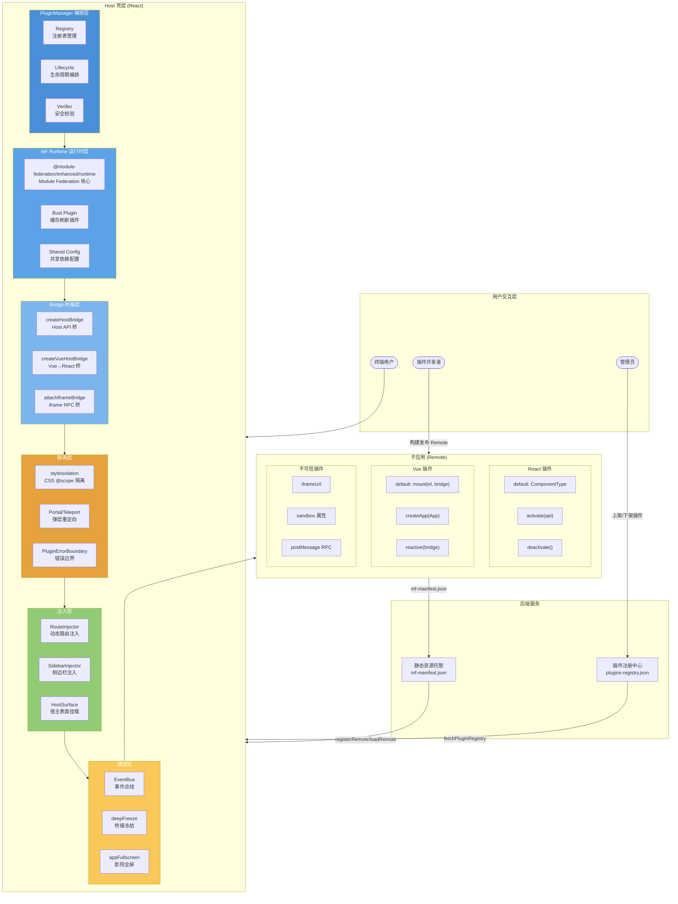

### 1.3 架构图方法说明

| 方法/模块 | 所属层 | 做什么 | 输入 → 输出 |
|-----------|--------|--------|-------------|
| `PluginManager.init()` | 编排层 | 启动时拉注册表、挂路由壳、预加载 eager 插件 | registry.json → 已挂载壳 |
| `PluginManager.ensurePlugin(id)` | 编排层 | 确保指定插件已加载激活 | pluginId → LoadedPlugin |
| `verifyPlugin(meta)` | 编排层 | 校验信任、origin、hostApiRange、完整性 | PluginDescriptor → void/throw |
| `registerRemote(d, bust)` | 运行时层 | 向 MF Runtime 注册 Remote 入口 | PluginDescriptor → void |
| `loadRemoteApp(d)` | 运行时层 | 通过 MF Runtime 加载 Remote 的 expose 模块 | PluginDescriptor → PluginModule |
| `createHostBridge(d, nav)` | 桥接层 | 按权限组装并冻结 Host API Bridge | PluginDescriptor → HostBridgeProps |
| `createVueHostBridge(expose)` | 桥接层 | 将 Vue mount API 包装成 React 组件 | VueRemoteExpose → ComponentType |
| `attachIframeBridge(el, bridge, origin)` | 桥接层 | 与 iframe 建立 postMessage RPC 通道 | iframe+bridge → dispose 函数 |
| `beginPluginStyleCapture(id, entry)` | 隔离层 | 开启样式捕获窗口，劫持 head 注入 | pluginId → dispose 函数 |
| `attachPluginStyleIsolation(id, entry)` | 隔离层 | 挂载时收回同域样式到当前 realm | pluginId → void |
| `routeInjector.inject(id, routes)` | 注入层 | 向路由表动态追加插件路由 | pluginId+RouteConfig[] → void |
| `sidebarInjector.add(item)` | 注入层 | 向侧边栏动态追加插件入口 | PluginSidebarItem → void |
| `eventBus.on/off/emit` | 通信层 | 插件级事件订阅与发布 | event+handler → void |
| `deepFreeze(obj)` | 通信层 | 深度冻结 Bridge 对象防止改写 | object → frozen object |

### 1.4 核心设计决策

| # | 决策 | 理由 |
|---|------|------|
| 1 | 选用 `@module-federation/enhanced/runtime` 而非 Webpack MF | Vite 原生集成、运行时可动态 `registerRemotes`、无需预构建 |
| 2 | Registry 由后端 JSON 下发，不在主应用静态配置 | 实现"主应用不发版即可加载新插件"的核心目标 |
| 3 | 信任分级：`first-party`/`partner`（MF）vs `untrusted`（iframe） | 平衡可用性与安全：可信插件共享主文档，不可信插件沙箱隔离 |
| 4 | Host 零 Vue 依赖 | 通过 `createVueHostBridge` 将 Vue mount API 包装为 React 组件，Host 不需要安装 Vue |
| 5 | CSS `@scope` + 选择器前缀隔离 | 比 Shadow DOM 兼容性好，与 Tailwind/Ant Design 等 CSS-in-JS 方案兼容 |
| 6 | Bridge 深度冻结 | 防止插件恶意修改 API 结构，保证桥接契约稳定 |
| 7 | Bust 缓存刷新机制 | 通过 `mf-manifest.json` 内容指纹实现发布后主应用自动感知更新 |
| 8 | 样式捕获窗口（Capture Stack） | 支持嵌套加载多个 Remote 时正确分配样式归属 |

---

## 2. 核心数据模型

### 2.1 插件描述符 PluginDescriptor

插件的完整元数据定义，由后端注册中心下发，决定了插件的加载方式、权限、行为等所有属性。

```typescript
// types.ts — 插件注册表核心类型

/** 插件信任等级：决定加载方式 */
type PluginTrust = 'first-party' | 'partner' | 'untrusted';

/** 插件权限声明：Host 按此裁剪 API */
type PluginPermission =
    | 'ui:toast'           // 弹窗提示
    | 'nav:subtree'        // 子路由导航
    | 'http:plugin-api'    // HTTP 请求
    | 'modules:chat'       // 聊天模块能力
    | 'modules:ebook'      // 电子书模块能力
    | (string & {});       // 可扩展自定义权限

/** 插件完整描述符 */
interface PluginDescriptor {
    /** 唯一标识，如 'reading-notes' */
    id: string;
    /** 多语言标题（插件中心/路由标题） */
    title?: PluginLocaleMap;
    /** 多语言说明 */
    description?: string | PluginLocaleMap;
    /** 路由路径，如 '/plugins/reading-notes' */
    routePath: string;
    /** Remote 入口（mf-manifest.json 或 remoteEntry.js URL） */
    entry: string;
    /** 插件版本号，用于缓存刷新 */
    version: string;
    /** 兼容的 Host API 版本范围，如 '^1.0.0' */
    hostApiRange: string;
    /** 侧边栏配置 */
    menu?: { order: number; icon?: string };
    /** 是否由 PluginManager 注入顶层路由 */
    injectRoute?: boolean;
    /** 宿主表面声明（嵌入 Drawer/Toolbar 等） */
    host?: {
        surface: 'ebook.read';
        slot: 'drawer' | 'toolbar';
        icon?: string;
        order?: number;
    };
    /** MF registerRemotes.name；默认 id */
    remoteName?: string;
    /** MF expose 路径；默认 './App' */
    expose?: string;
    /** 子应用 UI 框架类型 */
    framework?: 'react' | 'vue';
    /** 权限列表 */
    permissions: PluginPermission[];
    /** 加载时机 */
    preload?: 'eager' | 'route' | 'idle';
    /** 是否启用 */
    enabled: boolean;
    /** 完整性校验（SHA-384） */
    integrity?: string;
    /** 签名 */
    signature?: string;
    /** 信任等级 */
    trust: PluginTrust;
    /** 不可信插件必填：iframe URL */
    iframeUrl?: string;
}
```

### 2.2 Bridge 与插件模块接口

```typescript
// types.ts — Bridge 与插件模块类型

/** Host 桥接属性：传递给子应用的 API 和元信息 */
interface HostBridgeProps {
    /** 冻结的 API 对象，按权限裁剪 */
    api: Readonly<{
        theme: 'light' | 'dark';           // 当前主题
        locale: HostLocale;                  // 当前语言
        navigate?: (to: string) => void;    // 导航（需 nav:subtree 权限）
        event: {                            // 事件总线
            on: (event: string, handler: (data?: unknown) => void) => void;
            off: (event: string, handler: (data?: unknown) => void) => void;
            emit: (event: string, data?: unknown) => void;
        };
        http?: {                            // HTTP 客户端（需 http:plugin-api 权限）
            get: <T>(url: string) => Promise<T>;
            post: <T>(url: string, body?: unknown) => Promise<T>;
            put: <T>(url: string, body?: unknown) => Promise<T>;
            delete: <T>(url: string) => Promise<T>;
        };
        ui?: {                              // UI 能力（需 ui:toast 权限）
            showToast: (options: { message: string; type?: 'success' | 'error' | 'info' }) => void;
            setAppFullscreen?: (full: boolean) => Promise<void>;
            downloadBlob?: (options: { fileName: string; data: ArrayBuffer | Uint8Array; mimeType?: string }) => Promise<{ ok: boolean; hostToasted: boolean; message?: string }>;
        };
        modules?: Readonly<Record<string, (...args: unknown[]) => unknown>>;
    }>;
    /** 插件自身元信息（冻结） */
    plugin: Readonly<Pick<PluginDescriptor, 'id' | 'version' | 'routePath'>>;
}

/** React 插件模块标准接口 */
interface PluginModule {
    /** default 导出：React 组件，接收 HostBridgeProps */
    default: React.ComponentType<HostBridgeProps>;
    /** 激活钩子：插件加载完成后调用一次 */
    activate?: (api: HostBridgeProps['api']) => Promise<void> | void;
    /** 停用钩子：插件卸载前调用一次 */
    deactivate?: () => Promise<void> | void;
}

/** 已加载插件运行时状态 */
interface LoadedPlugin {
    meta: PluginDescriptor;
    bridge: HostBridgeProps;
    mod: PluginModule;
    status: 'registered' | 'loading' | 'activated' | 'failed' | 'unloaded';
    error?: string;
    /** version@manifestHash，用于判断是否需重载 */
    bust?: string;
}
```

### 2.3 插件状态机

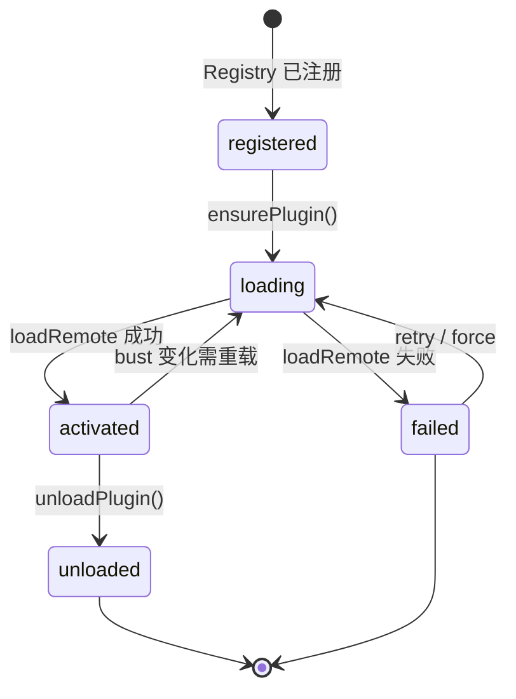

---

## 3. 插件注册中心

### 3.1 架构图

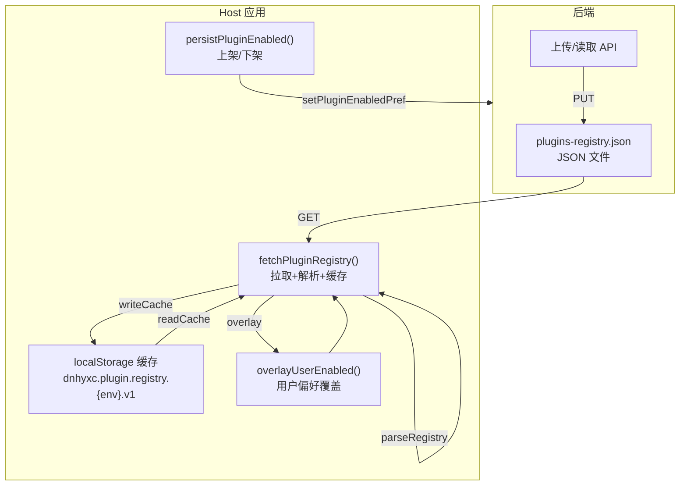

### 3.2 核心实现解析

#### 3.2.1 Registry URL 解析

```typescript
// registry.ts — URL 解析策略

/**
 * 根据环境和覆盖配置决定 registry URL
 * 
 * 优先级：
 * 1. VITE_PROD_PLUGIN_REGISTRY_URL / VITE_DEV_PLUGIN_REGISTRY_URL 环境变量覆盖
 * 2. resolveUploadedFileUrl() 推导的默认路径
 *    - Web DEV: 同源 /remotes/...（Vite 代理）
 *    - Web PROD: /api/upload/serve?path=...
 *    - Tauri DEV: 静态源站 /remotes/...
 *    - Tauri PROD: /api/upload/serve?path=...
 */
function registryUrl(): string {
    const override = (
        import.meta.env.PROD
            ? import.meta.env.VITE_PROD_PLUGIN_REGISTRY_URL
            : import.meta.env.VITE_DEV_PLUGIN_REGISTRY_URL
    )?.trim();
    if (override) return override;
    return resolveUploadedFileUrl(PLUGIN_REGISTRY_STATIC_PATH);
}
```

**为什么这样设计？** 将插件注册中心部署为静态文件（JSON），可以：
- 利用 CDN/静态托管的缓存能力
- 减少后端 API 压力
- 离线场景可用 localStorage 缓存兜底
- 发布新插件只需更新静态文件，无需发版 Host

#### 3.2.2 拉取与缓存策略

```typescript
// registry.ts — fetchPluginRegistry 核心逻辑

/**
 * 拉取插件注册表，带缓存与降级策略
 * 
 * 流程：
 * 1. 解析 registry URL
 * 2. fetch 拉取（带 cache: no-store 避免浏览器缓存）
 * 3. 解析 JSON 并校验结构
 * 4. 写入 localStorage 缓存
 * 5. 失败时回退到缓存
 */
async function fetchPluginRegistry(opts?: { force?: boolean }): Promise<PluginRegistry> {
    // 1. 解析 URL
    let url: string;
    try {
        url = registryUrl();
    } catch (e) {
        console.warn('[plugins] registry url missing', e);
        return readCache() ?? { updatedAt: new Date(0).toISOString(), plugins: [] };
    }

    try {
        // 2. 拉取（force 时加时间戳破坏缓存）
        const text = await fetchRegistryText(url, opts?.force);
        // 3. 解析校验
        const data = parseRegistry(text, url);
        // 4. 写缓存
        writeCache(data);
        return data;
    } catch (e) {
        // 5. 降级：使用缓存
        console.warn('[plugins] registry fetch failed, using cache', e);
        return readCache() ?? { updatedAt: new Date(0).toISOString(), plugins: [] };
    }
}
```

**降级策略详解：**
- 拉取失败 → 使用 localStorage 缓存
- 缓存也没有 → 返回空注册表（安全降级，不加载任何插件）
- 生产/开发环境使用不同缓存 key（`prod`/`dev` 后缀），避免环境串扰

#### 3.2.3 用户偏好覆盖

```typescript
// registry.ts — overlayUserEnabled

/**
 * 用当前账号偏好覆盖 registry 中的 enabled 字段
 * 
 * 场景：管理员上架了插件（registry.enabled = true），
 * 但用户在插件中心手动下架了 → 该用户看到的是 enabled = false
 * 
 * 实现：仅在展示/运行时覆盖，不写回服务端 registry
 */
function overlayUserEnabled(data: PluginRegistry): PluginRegistry {
    return {
        ...data,
        plugins: data.plugins.map((p) => ({
            ...p,
            enabled: isPluginEnabled(p.id),  // 读用户级偏好
        })),
    };
}
```

#### 3.2.4 版本兼容性校验

```typescript
// PluginVerifier.ts — satisfiesRange

/**
 * 语义化版本范围校验
 * 
 * 支持格式：
 * - ^x.y.z：兼容主版本号内的次版本更新
 * - >=x.y.z：大于等于指定版本
 * - x.y.z：精确版本匹配
 * 
 * 用途：校验插件的 hostApiRange 是否覆盖当前 Host API 版本
 * 例：Host API = 1.2.0，插件 hostApiRange = ^1.0.0 → 兼容
 */
function satisfiesRange(version: string, range: string): boolean {
    const ver = parseSemver(version);
    if (!ver) return false;
    const r = range.trim();
    
    if (r.startsWith('^')) {
        const base = parseSemver(r.slice(1));
        if (!base) return false;
        if (ver[0] !== base[0]) return false;  // 主版本号必须相同
        if (ver[0] === 0) {
            // 0.x.y 版本：次版本号必须相同，补丁号 >=
            return ver[1] === base[1] && ver[2] >= base[2];
        }
        // ^1.2.0 → >=1.2.0 <2.0.0
        return ver[1] > base[1] || (ver[1] === base[1] && ver[2] >= base[2]);
    }
    // ... >= 和精确匹配逻辑
}
```

---

## 4. PluginManager — 插件生命周期编排

### 4.1 核心流程图

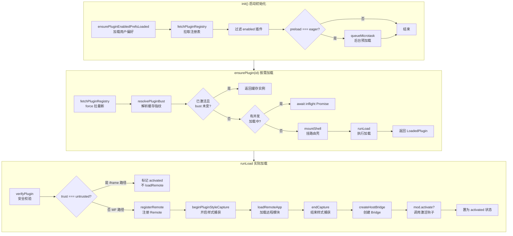

### 4.2 方法说明

| 方法 | 做什么 | 输入 | 输出 |
|------|--------|------|------|
| `init()` | 启动时拉注册表、挂壳、预加载 | 无 | Promise<void> |
| `ensurePlugin(id, opts)` | 确保插件已激活 | pluginId+force | LoadedPlugin |
| `loadPlugin(meta, opts, bust)` | 执行加载（含并发去重） | PluginDescriptor | void |
| `runLoad(meta, bust)` | 单次加载流程 | PluginDescriptor | void |
| `mountShell(meta)` | 注入路由+侧边栏壳 | PluginDescriptor | void |
| `unloadPlugin(id)` | 卸载插件、清理资源 | pluginId | void |
| `setEnabled(id, enabled)` | 上架/下架并即时生效 | pluginId+boolean | Promise<void> |

### 4.3 核心实现解析

#### 4.3.1 并发加载去重

```typescript
// PluginManager.ts — inflight 并发控制

class PluginManagerImpl {
    /** 同一插件并发 load 共用一个 Promise，避免失败重入闪烁 */
    private inflight = new Map<string, Promise<void>>();

    async loadPlugin(meta: PluginDescriptor, opts?, bustToken?) {
        // ...
        // 关键：复用已有加载中的 Promise
        const existing = this.inflight.get(meta.id);
        if (existing) {
            if (!opts?.force) return existing;  // 复用，不重复加载
            await existing.catch(() => {});    // force 时等完再重新加载
        }

        const run = this.runLoad(meta, bust);
        this.inflight.set(meta.id, run);
        try {
            await run;
        } finally {
            if (this.inflight.get(meta.id) === run) {
                this.inflight.delete(meta.id);  // 清理 inflight 记录
            }
        }
    }
}
```

**为什么需要并发去重？**
- 用户快速切换路由可能多次触发同一插件加载
- 并发加载会导致重复 `registerRemote`、重复 `loadRemote`、重复 `activate`
- `inflight` Map 确保同一时刻只有一个加载请求，后续请求等待同一个 Promise

#### 4.3.2 壳层挂载（Route + Sidebar 注入）

```typescript
// PluginManager.ts — mountShell

private mountShell(meta: PluginDescriptor) {
    // 1. 路由注入：在主应用路由表中追加插件路由
    if (meta.injectRoute !== false) {
        routeInjector.inject(meta.id, [createPluginRoute(meta)]);
    }
    // 2. 侧边栏注入：在导航栏中添加插件入口
    if (meta.menu) {
        sidebarInjector.add({
            pluginId: meta.id,
            path: meta.routePath,
            nameKey: meta.id,
            icon: meta.menu.icon ?? 'Puzzle',
            order: meta.menu.order,
        });
    }
}
```

**"壳"的含义：**
- 壳 = 路由注册 + 侧边栏入口 + 侧边栏图标
- 壳挂载不等于插件已加载（不下载 Remote chunk）
- 壳让路由系统知道这个路径存在，但只有实际访问时才会 `loadRemote`
- 实现了"按需加载"——首屏不加载任何插件代码

#### 4.3.3 runLoad — 单次加载完整实现

```typescript
// PluginManager.ts — runLoad 完整加载流程

/**
 * 单次插件加载流程（由 loadPlugin 调用）
 *
 * 执行顺序：
 * ┌────────────────────────────────────────────────────────────────┐
 * │ Step 1: 安全校验（verifyPlugin）                               │
 * │   - 检查 trust 等级、origin 合法性、hostApiRange 兼容性        │
 * │   - 可选：SHA-384 完整性校验                                   │
 * ├────────────────────────────────────────────────────────────────┤
 * │ Step 2: 信任分支判断                                           │
 * │   - untrusted: 直接标记 activated，后续由 iframe 渲染          │
 * │   - trusted:   继续 MF 加载流程                               │
 * ├────────────────────────────────────────────────────────────────┤
 * │ Step 3: Module Federation 加载                                │
 * │   a. registerRemote  → 注册 Remote 到 MF Runtime              │
 * │   b. beginPluginStyleCapture → 开启样式捕获窗口               │
 * │   c. loadRemoteApp → 通过 MF Runtime 加载 expose 模块         │
 * │   d. endCapture → 关闭样式捕获窗口，已捕获样式进入隔离          │
 * ├────────────────────────────────────────────────────────────────┤
 * │ Step 4: 激活 Bridge 与钩子                                    │
 * │   a. createHostBridge → 按权限创建 Host Bridge                │
 * │   b. mod.activate? → 调用插件可选的激活钩子                    │
 * ├────────────────────────────────────────────────────────────────┤
 * │ Step 5: 更新状态                                               │
 * │   - status = 'activated'                                      │
 * │   - 等待 PluginHostPage 组件渲染                               │
 * └────────────────────────────────────────────────────────────────┘
 *
 * 错误处理：
 * - try/catch 包裹整个流程
 * - 失败时 status = 'failed'，error 记录错误信息
 * - inflight 记录在 finally 中清理
 */
private async runLoad(meta: PluginDescriptor, bust: string) {
    const nav = (to: string) => this.navigateImpl(to);

    // 先设为 loading 状态（让 UI 可以显示加载中）
    const loading: LoadedPlugin = {
        meta,
        bridge: createHostBridge(meta, nav),
        mod: { default: () => null },
        status: 'loading',
        bust,
    };
    this.plugins.set(meta.id, loading);

    try {
        // Step 1: 安全校验
        await verifyPlugin(meta);

        // Step 2: untrusted 插件走 iframe 路径，不做 MF 加载
        if (meta.trust === 'untrusted') {
            this.plugins.set(meta.id, {
                meta,
                bridge: createHostBridge(meta, nav),
                mod: { default: () => null },
                status: 'activated',
                bust,
            });
            return;
        }

        // Step 3a: 注册 Remote 到 MF Runtime
        registerRemote(meta, bust);

        // Step 3b: 开启样式捕获窗口
        // - 劫持 head.appendChild / CSSStyleSheet.insertRule
        // - Remote chunk 执行时注入的 <style> 被捕获并隔离
        const endCapture = beginPluginStyleCapture(meta.id, meta.entry, meta.remoteName);

        // Step 3c: 加载 Remote expose 模块（React/Vue 组件）
        // - MF Runtime 通过 ESM import 异步加载
        // - 自动处理 shared 依赖（React/ReactDOM singleton）
        let mod: Awaited<ReturnType<typeof loadRemoteApp>>;
        try {
            mod = await loadRemoteApp(meta);
        } finally {
            // Step 3d: 无论成功失败都结束捕获窗口
            endCapture();
        }

        // Step 4: 激活 Bridge
        const bridge = createHostBridge(meta, nav);

        // 调用插件的 activate 钩子（可选）
        if (mod.activate) {
            await mod.activate(bridge.api);
        }

        // Step 5: 标记为 activated
        this.plugins.set(meta.id, {
            meta,
            bridge,
            mod,
            status: 'activated',
            bust,
        });
    } catch (e) {
        const message = e instanceof Error ? e.message : String(e);
        console.error(`[PluginManager] load ${meta.id} failed`, e);
        this.plugins.set(meta.id, {
            ...loading,
            status: 'failed',
            error: message,
        });
    }
}
```

#### 4.3.4 Bust 缓存刷新机制

```typescript
// mf.ts — bust 机制详解

/**
 * 解析插件缓存刷新标识
 * 
 * bust = version@manifestHash
 * - version: 插件版本号（来自 registry）
 * - manifestHash: mf-manifest.json 内容的 FNV-1a 哈希
 * 
 * 工作原理：
 * 1. 发布者更新 Remote 代码 → 构建生成新的 mf-manifest.json
 * 2. Host 下次 ensurePlugin 时拉 mf-manifest.json → hash 变化
 * 3. bust 变化 → Host 自动重新 loadRemote，加载新版本
 * 
 * 优势：
 * - 发布者无需通知 Host 管理员
 * - Host 无需改 registry 即可感知更新
 * - 基于内容指纹，精确判断是否有新版本
 */
async function resolvePluginBust(meta): Promise<string> {
    if (meta.trust === 'untrusted') {
        return pluginBust(meta);  // untrusted 不走 MF，只用 version
    }
    const { buildId } = await fetchManifestMeta(meta.entry);
    return pluginBust(meta, buildId);
}

/** 从 mf-manifest.json 计算内容指纹 */
async function fetchManifestMeta(entry): Promise<{ buildId: string; remoteEntryUrl: string }> {
    const url = withBust(entry, `t${Date.now()}`);  // 加时间戳破坏缓存
    const res = await fetch(url, { cache: 'no-store' });
    const text = await res.text();
    const remoteEntryUrl = resolveRemoteEntryUrl(entry, text);
    remoteEntryByManifest.set(entryKey(entry), remoteEntryUrl);
    return { buildId: hashText(text), remoteEntryUrl };
}

/** FNV-1a 32-bit 哈希（非安全哈希，仅作缓存 bust） */
function hashText(text: string): string {
    let h = 2166136261;
    for (let i = 0; i < text.length; i++) {
        h ^= text.charCodeAt(i);
        h = Math.imul(h, 16777619);
    }
    return (h >>> 0).toString(16);
}
```

---

## 5. Module Federation 运行时

### 5.1 架构图

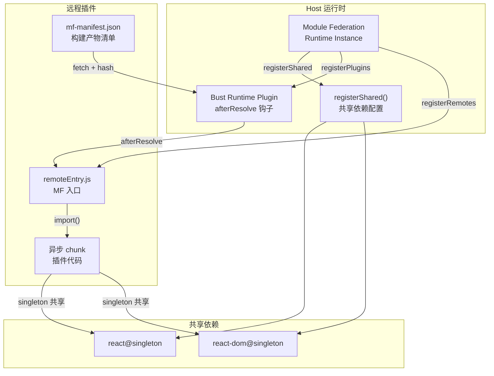

### 5.2 方法说明

| 方法 | 做什么 | 说明 |
|------|--------|------|
| `createInstance({name:'host'})` | 创建 MF Runtime 实例 | Host 只创建一个实例 |
| `instance.registerShared(...)` | 注册共享依赖 | React/ReactDOM 设为 singleton |
| `instance.registerRemotes(...)` | 注册远程模块入口 | 动态注册，支持 force=true 覆盖 |
| `instance.loadRemote(name/expose)` | 加载远程模块的 expose | 返回 Remote 暴露的原始模块 |
| `RuntimePlugin.afterResolve` | 拦截 Remote URL 解析 | 注入 bust 参数实现缓存刷新 |

### 5.3 核心实现解析

#### 5.3.1 MF Runtime 初始化

```typescript
// mf.ts — Runtime 单例

/**
 * 获取 Module Federation Runtime 单例
 * 
 * 为什么用单例？
 * - 整个 Host 只需一个 Runtime 实例管理所有 Remote
 * - 避免多实例导致的共享依赖重复注册
 * - 简化生命周期管理
 * 
 * 初始化流程：
 * 1. 尝试获取已存在的实例（getInstance）
 * 2. 不存在则创建新实例（createInstance）
 * 3. 返回实例，后续所有操作复用
 */
function getMf(): ModuleFederation {
    if (mf) return mf;
    try {
        const existing = getInstance();
        if (existing) {
            mf = existing;
            return mf;
        }
    } catch {
        /* no default instance yet */
    }
    mf = createInstance({ name: 'host', remotes: [] });
    return mf;
}
```

#### 5.3.2 共享依赖配置

```typescript
// mf.ts — ensureShared

/**
 * 注册 Host 与 Remote 之间的共享依赖
 * 
 * 关键设计：
 * - react / react-dom: singleton = true
 *   → 所有插件共用同一 React 实例，避免 Hooks 崩溃
 * - vue: 故意不共享
 *   → Host 不安装 Vue，Vue Remote 自带 runtime + createApp
 *   → 通过 createVueHostBridge 桥接到 React
 * 
 * singleton 的必要性：
 * React Hooks 依赖 React 实例的内部状态（__SECRET_INTERNALS）
 * 如果有两个 React 实例，同一组件内的 Hooks 会指向不同的 Dispatcher，
 * 导致 "Invalid hook call" 错误
 */
function ensureShared() {
    if (sharedReady) return;
    const instance = getMf();
    instance.registerShared({
        react: {
            version: React.version,
            scope: 'default',
            get: async () => () => React,
            shareConfig: {
                singleton: true,           // 全局唯一实例
                requiredVersion: `^${React.version}`,  // 版本兼容范围
            },
        },
        'react-dom': {
            version: ReactDOM.version || React.version,
            scope: 'default',
            get: async () => () => ReactDOM,
            shareConfig: {
                singleton: true,
                requiredVersion: `^${ReactDOM.version || React.version}`,
            },
        },
        // 故意不共享 vue：Host 不安装 Vue
    });
    sharedReady = true;
}
```

#### 5.3.3 Bust Runtime Plugin

```typescript
// mf.ts — bust 插件

/**
 * Module Federation Runtime Plugin：
 * 在 Remote URL 解析后注入 ?v=bust 参数
 * 
 * 工作原理：
 * 1. registerRemote 时记录 bust token
 * 2. MF Runtime 解析 remoteEntry URL 后触发 afterResolve
 * 3. 插件在 URL 上追加 ?v=bust
 * 4. 浏览器因 URL 不同而跳过缓存，重新请求
 * 
 * 为什么用 Runtime Plugin 而不是直接改 URL？
 * - MF Runtime 内部会缓存 remoteEntry URL
 * - 直接改 registerRemotes 的 entry 参数会被 MF 覆盖
 * - Runtime Plugin 在 afterResolve 阶段改写是正确的拦截点
 */
const bustRemoteEntryPlugin: ModuleFederationRuntimePlugin = {
    name: 'bust-remote-entry',
    async afterResolve(args) {
        const name = args.remoteInfo?.name;
        const bust = name ? bustByRemote.get(name) : undefined;
        if (bust && args.remoteInfo?.entry) {
            // 给 remoteEntry.js 加上 ?v=1.2.0@abc123
            args.remoteInfo.entry = withBust(args.remoteInfo.entry, bust);
        }
        return args;
    },
};
```

#### 5.3.4 注册与加载 Remote

```typescript
// mf.ts — registerRemote + loadRemoteApp

/**
 * 注册远程模块到 MF Runtime
 * 
 * 关键优化：跳过二次 manifest 请求
 * - resolvePluginBust 已经解析了 mf-manifest.json 得到 remoteEntry URL
 * - registerRemote 直接用已解析的 remoteEntry，避免 MF 再拉一次 manifest
 * 
 * force: true 的含义：
 * - MF Runtime 默认不覆盖已注册的 Remote
 * - force=true 允许重新注册（插件更新时）
 */
function registerRemote(d: PluginDescriptor, bust?: string) {
    ensureShared();
    ensureBustPlugin();
    const token = (bust ?? d.version).trim();
    const name = remoteNameOf(d);
    if (token) bustByRemote.set(name, token);
    
    // 优先用已解析的 remoteEntry，跳过 MF 的二次 manifest 请求
    const remoteEntry =
        remoteEntryByManifest.get(entryKey(d.entry)) ??
        resolveRemoteEntryUrl(d.entry, '');
    
    getMf().registerRemotes(
        [{
            name,
            entry: withBust(remoteEntry, token),
            type: 'module',
        }],
        { force: true },
    );
}

/**
 * 加载远程插件模块
 * 
 * 流程：
 * 1. ensureShared + ensureBustPlugin
 * 2. loadRemote(name/expose) 获取 Remote 暴露的原始模块
 * 3. 校验 default export 存在
 * 4. normalizePluginModule：识别 React/Vue 并规范化
 */
async function loadRemoteApp(d: PluginDescriptor): Promise<PluginModule> {
    ensureShared();
    ensureBustPlugin();
    const name = remoteNameOf(d);
    const expose = exposeBaseOf(d);
    
    // 从 MF Runtime 加载 expose 模块
    const raw = await getMf().loadRemote<RawRemoteModule>(`${name}/${expose}`);
    if (!raw?.default) {
        throw new Error(`plugin ${d.id}: expose ./${expose} missing default export`);
    }
    
    // 关键：规范化模块（Vue mount → React bridge）
    return normalizePluginModule(raw, d);
}
```

---

## 6. React 子应用加载

### 6.1 流程图

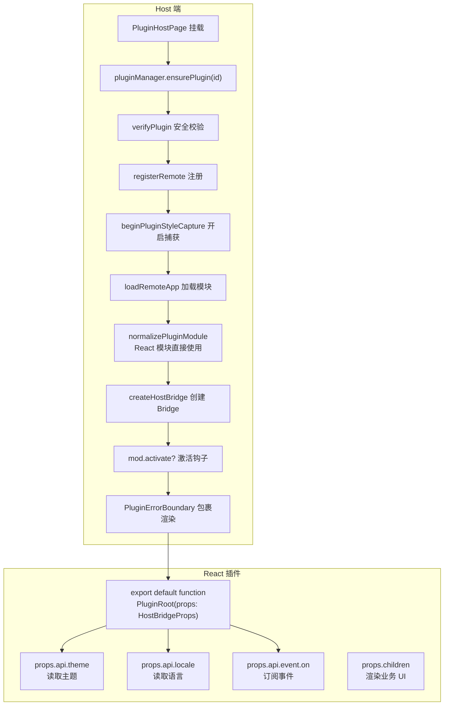

### 6.2 React 插件接入规范

React 插件需要做的事情非常简单——只需导出一个符合接口约定的 React 组件：

```typescript
/**
 * React 插件标准模板
 * 
 * 必须导出：
 * - default: React.ComponentType<HostBridgeProps>  // 主组件
 * 
 * 可选导出：
 * - activate(api) => void | Promise<void>        // 激活钩子
 * - deactivate() => void | Promise<void>         // 停用钩子
 * 
 * 从 HostBridgeProps 能获取：
 * - api.theme: 当前主题
 * - api.locale: 当前语言
 * - api.navigate: 导航函数（需权限）
 * - api.event: 事件总线
 * - api.http: HTTP 客户端（需权限）
 * - api.ui: UI 能力（需权限）
 * - plugin: 插件元信息
 */

// plugins/my-react-plugin/src/App.tsx
import type { HostBridgeProps } from '@/types';  // 类型可自维护

/**
 * default 导出：主组件
 * 接收 HostBridgeProps 作为 props
 */
export default function App({ api, plugin }: HostBridgeProps) {
    // 1. 读取主题（跟随 Host 主题变化）
    const theme = api.theme;
    
    // 2. 订阅语言变化
    // api.event.on('locale', (locale) => { ... });
    
    // 3. 使用 HTTP 客户端
    // const data = await api.http.get('/api/plugin-data');
    
    // 4. 显示 Toast
    // api.ui?.showToast({ message: '操作成功', type: 'success' });
    
    return (
        <div className="h-full w-full">
            <h1>我的插件 - {plugin.id} v{plugin.version}</h1>
            {/* 业务 UI */}
        </div>
    );
}

/**
 * 可选：激活钩子
 * 在插件加载完成、组件渲染前调用一次
 * 适合做数据预加载、全局初始化等
 */
export async function activate(api: HostBridgeProps['api']) {
    console.log(`Plugin activated with theme: ${api.theme}`);
    // 预加载数据
    // const data = await api.http?.get('/api/init');
}

/**
 * 可选：停用钩子
 * 在插件卸载前调用一次
 * 适合清理定时器、取消订阅等
 */
export async function deactivate() {
    console.log('Plugin deactivated');
    // cleanup
}
```

### 6.3 Host 渲染插件 — PluginHostPage 完整实现

```typescript
// PluginHostPage.tsx — 完整的插件页面渲染组件

/**
 * 插件页面渲染组件（核心调度中心）
 *
 * 完整渲染链路：
 *
 * Phase 1: 加载调度（useEffect）
 *   - 首次挂载 / pluginId 变化 → 调用 pluginManager.ensurePlugin(pluginId)
 *   - 监听 retryKey 变化 → 强制重新加载（用于失败后的重试）
 *   - 加载完成后 bump 状态 → 触发重渲染
 *
 * Phase 2: 样式隔离挂载（useLayoutEffect）
 *   - 仅在 status==='activated' 且 trust!=='untrusted' 时执行
 *   - attachPluginStyleIsolation 做两件事：
 *     a) 回收捕获窗口期间收集的样式，应用 @scope 前缀
 *     b) 安装 Portal 重定向桥，将 React/Vue 弹层重定向到 scope 容器
 *   - 必须在 useLayoutEffect 中执行（早于 paint），且早于子组件的 useEffect
 *     原因：Element Plus onBeforeMount 就会在 body 上创建 popper 容器，
 *     如果此时 Portal 桥尚未安装，弹层会落到真实 body 上丢失样式
 *
 * Phase 3: 桥接 locale 热更新（useEffect）
 *   - 监听 locale 变化 → 通过 eventBus 广播给插件
 *   - withLiveLocale 用新的 locale 覆盖 bridge.api.locale
 *
 * Phase 4: 条件渲染
 *   - untrusted → <UntrustedIframe> 组件（带 sandbox 属性）
 *   - trusted → <Comp {...liveBridge} /> 直接渲染
 *     包裹层带 data-mf-plugin + data-mf-style-realm + data-plugin-root 属性
 *     供样式隔离系统识别和命中
 */
export function PluginHostPage({
    pluginId, className, part, pageShell,
}: Props) {
    const { locale, t } = useI18n();
    const [retryKey, setRetryKey] = useState(0);
    const [busy, setBusy] = useState(
        () => pluginManager.get(pluginId)?.status === 'loading',
    );
    const [error, setError] = useState<string | null>(() => {
        const cur = pluginManager.get(pluginId);
        return cur?.status === 'failed' ? (cur.error ?? null) : null;
    });
    const [, bump] = useState(0);

    // Phase 1: 加载调度
    useEffect(() => {
        let cancelled = false;
        (async () => {
            const cur = pluginManager.get(pluginId);
            if (cur?.status === 'activated') { bump((n) => n + 1); return; }
            if (cur?.status === 'failed' && retryKey === 0) {
                setError(cur.error ?? null); setBusy(false); return;
            }
            setBusy(true); setError(null);
            try {
                await pluginManager.ensurePlugin(pluginId, { force: retryKey > 0 });
            } catch (e) {
                if (!cancelled) setError(e instanceof Error ? e.message : String(e));
            } finally {
                if (!cancelled) { setBusy(false); bump((n) => n + 1); }
            }
        })();
        return () => { cancelled = true; };
    }, [pluginId, retryKey]);

    const loaded = pluginManager.get(pluginId);

    // Phase 2: 样式隔离挂载（useLayoutEffect 保证在 paint 前执行）
    useLayoutEffect(() => {
        if (loaded?.status !== 'activated' || loaded.meta.trust === 'untrusted' || !loaded.meta.entry) return;
        // 关键：attachPluginStyleIsolation 必须在子组件 mount 之前完成
        // - 回收捕获窗口的样式 + 安装 Portal 重定向
        return attachPluginStyleIsolation(pluginId, loaded.meta.entry, loaded.meta.remoteName);
    }, [pluginId, loaded?.status, loaded?.meta.entry, loaded?.meta.trust, loaded?.meta.remoteName]);

    // Phase 3: locale 热更新
    useEffect(() => {
        if (loaded?.status !== 'activated') return;
        eventBus.emit(pluginId, 'locale', locale);
    }, [pluginId, loaded?.status, locale]);

    const liveBridge = useMemo(
        () => (loaded?.bridge ? { ...loaded.bridge, api: { ...loaded.bridge.api, locale } } : null),
        [loaded?.bridge, locale],
    );

    // Phase 4: 条件渲染
    if (loaded?.status === 'activated') {
        // untrusted → iframe 沙箱渲染
        if (loaded.meta.trust === 'untrusted') {
            const src = loaded.meta.iframeUrl?.trim();
            if (!src) return <div>插件缺少 iframeUrl</div>;
            return wrap(
                <PluginErrorBoundary pluginId={pluginId}>
                    <iframe
                        ref={(el) => el && attachIframeBridge(el, loaded.bridge, new URL(src).origin)}
                        title={pluginId} src={src}
                        className="h-full w-full border-0"
                        sandbox="allow-scripts allow-same-origin allow-forms allow-popups"
                    />
                </PluginErrorBoundary>,
            );
        }

        // trusted → 直接渲染（React 组件 或 Vue 桥接组件）
        if (!liveBridge) return null;
        const Comp = loaded.mod.default;
        const realm = styleRealmKey(loaded.meta.entry, loaded.meta.remoteName, pluginId);
        return wrap(
            <PluginErrorBoundary pluginId={pluginId}>
                {/* 
                    关键 data 属性：
                    - data-mf-plugin: 标识所属插件（Portal 认领时使用）
                    - data-mf-style-realm: CSS @scope 隔离域标识
                    - data-plugin-root: 文档根布局规则只命中此容器（避免弹层受影响）
                */}
                <div
                    className={`plugin-${pluginId} h-full w-full min-h-0`}
                    data-mf-plugin={pluginId}
                    data-mf-style-realm={realm}
                    data-plugin-root
                >
                    <Comp {...liveBridge} />
                </div>
            </PluginErrorBoundary>,
        );
    }

    // 加载中 / 错误状态 → 显示占位 UI
    return <div>{busy ? '加载中...' : error ? `加载失败: ${error}` : '插件未加载'}</div>;
}
```

**`data-mf-style-realm` 与 `data-plugin-root` 的区别：**
- `data-mf-style-realm`：CSS 隔离域标识，所有同域（同 Remote）的样式都会命中带此属性的元素
  - 插件根容器带此属性 → 插件内样式正常生效
  - Portal 重定向的弹层也带此属性 → 弹层样式不会丢失
- `data-plugin-root`：限制 html/body 选择器只命中插件根容器
  - 避免 `height:100%`、`display:flex` 等布局规则影响弹层
  - 弹层容器（虽然带 style-realm）不带 plugin-root，所以不会被这些规则影响

---

## 7. Vue 子应用加载

### 7.1 架构图

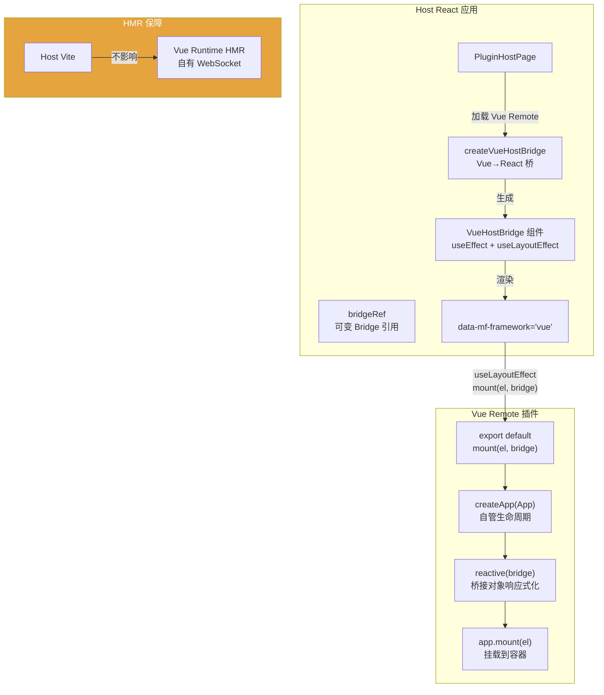

### 7.2 方法说明

| 方法 | 做什么 | 说明 |
|------|--------|------|
| `resolveMount(expose, id)` | 从 expose 解析 mount 函数 | 支持直接函数或 `{mount}` 对象 |
| `createVueHostBridge(expose, id)` | 将 Vue mount API 包装为 React 组件 | Host 零 Vue 依赖 |
| `VueHostBridge(props)` | React 包装组件 | 管理挂载/卸载生命周期 |
| `bridgeRef` | 可变 Bridge 引用 | 支持 locale 等字段热更新 |

### 7.3 核心实现解析

#### 7.3.1 桥接器创建

```typescript
// createVueHostBridge.tsx — 核心桥接逻辑

/**
 * 将 Vue Remote 的 mount API 包装成 Host 可用的 React 组件
 * 
 * 设计原则：
 * - Host 不依赖 Vue（零 Vue 安装）
 * - Vue Remote 自己 createApp，自管生命周期
 * - Host 只需提供 DOM 容器和 Bridge
 * 
 * 为什么不直接在 Host 渲染 Vue 组件？
 * - Host 用 React，渲染 Vue 组件需要 Vue runtime
 * - Vue SFC 组件需要 Vue 的渲染引擎
 * - 通过 mount(el, bridge) 抽象，Host 不需要知道 Vue 的存在
 */
function resolveMount(expose: unknown, pluginId: string): VueRemoteMount {
    // 情况1：expose 是函数 → 直接作为 mount
    if (typeof expose === 'function') return expose as VueRemoteMount;
    
    // 情况2：expose 是对象且有 mount 方法
    if (expose && typeof expose === 'object' && 
        typeof (expose as { mount?: unknown }).mount === 'function') {
        return (expose as { mount: VueRemoteMount }).mount;
    }
    
    // 不合法的 expose
    throw new Error(
        `plugin ${pluginId}: framework "vue" 须 default 导出 mount(el, bridge) 或 { mount }`
    );
}

/**
 * 创建 Vue→React 桥接组件
 * 
 * React 组件行为：
 * 1. 创建一个空 <div> 作为 Vue 挂载容器
 * 2. useLayoutEffect（空依赖）调用 mount(el, bridge)
 *    - 空依赖：只挂载一次，不随 props 变化重挂载
 *    - useLayoutEffect：在 paint 之前执行，确保 Element Plus 等库的
 *      onBeforeMount 钩子能正确工作
 * 3. useEffect 同步 bridge.api/plugin 到 bridgeRef
 *    - bridgeRef 是可变引用，Vue 侧 reactive(bridgeRef.current) 后
 *      可以收到 api.locale 等字段的热更新
 * 4. cleanup 时调用 disposer 或 expose.unmount
 */
export function createVueHostBridge(
    expose: VueRemoteExpose,
    pluginId = 'unknown',
): ComponentType<HostBridgeProps> {
    const mount = resolveMount(expose, pluginId);

    function VueHostBridge(props: HostBridgeProps) {
        const elRef = useRef<HTMLDivElement | null>(null);
        
        // 可变 Bridge 引用：Vue 侧做 reactive(bridgeRef.current)
        // 当 props.api 变化时同步更新 ref.current
        const bridgeRef = useRef<HostBridgeProps>({
            api: props.api,
            plugin: props.plugin,
        });

        // Bridge 热更新：locale 等字段变化时同步到 bridgeRef
        useEffect(() => {
            bridgeRef.current.api = props.api;
            bridgeRef.current.plugin = props.plugin;
        }, [props.api, props.plugin]);

        // useLayoutEffect（空依赖）：挂载 Vue 应用
        // 空 deps = 只执行一次挂载，不随 props 变化重挂载
        // HMR 由 Remote 自有 Vue runtime 处理
        useLayoutEffect(() => {
            const el = elRef.current;
            if (!el) return;

            // 调用 Remote 暴露的 mount 函数
            const dispose = mount(el, bridgeRef.current);
            
            // 支持两种卸载方式：返回函数 或 expose.unmount
            const explicitUnmount =
                typeof expose === 'object' && expose && 'unmount' in expose
                    ? expose.unmount
                    : undefined;

            return () => {
                if (typeof dispose === 'function') dispose();
                else explicitUnmount?.();
            };
        }, []);  // 空依赖：只挂载一次

        // 返回容器 div
        return createElement('div', {
            ref: elRef,
            className: 'h-full w-full min-h-0',
            'data-plugin-root': true,
            'data-mf-framework': 'vue',  // 标记框架类型
        });
    }

    VueHostBridge.displayName = 'VueHostBridge';
    return VueHostBridge;
}
```

#### 7.3.2 模块规范化

```typescript
// normalizePluginModule.ts — 识别并规范化模块

/**
 * 判断 Remote 是否为 Vue 模块
 * 
 * 识别策略（按优先级）：
 * 1. meta.framework === 'vue'        → 明确声明
 * 2. meta.framework === 'react'      → 明确排除
 * 3. raw.framework === 'vue'         → expose 上的标记
 * 4. raw.mfFramework === 'vue'       → 另一种标记
 * 5. default 是 { mount: function }  → 推断为 Vue mount API
 * 
 * 为什么需要多种识别方式？
 * - 兼容不同版本的插件开发规范
 * - 允许不显式声明 framework 而通过形态推断
 */
function isVueRemoteModule(raw, meta): boolean {
    if (meta.framework === 'vue') return true;
    if (meta.framework === 'react') return false;
    const tag = raw.framework ?? raw.mfFramework;
    if (tag === 'vue') return true;
    if (tag === 'react') return false;
    return looksLikeVueMount(raw.default);  // 兜底：检查是否 { mount }
}

/**
 * 规范化 Remote 模块为 Host 可用的 PluginModule
 * 
 * React 插件：直接使用 default 导出的组件
 * Vue 插件：通过 createVueHostBridge 包装为 React 组件
 */
function normalizePluginModule(raw, meta): PluginModule {
    if (!raw?.default) {
        throw new Error(`plugin ${meta.id}: expose missing default export`);
    }

    if (isVueRemoteModule(raw, meta)) {
        // Vue Remote → 创建桥接组件
        return {
            default: createVueHostBridge(raw.default as VueRemoteExpose, meta.id),
            activate: raw.activate,
            deactivate: raw.deactivate,
        };
    }

    // React Remote → 直接使用
    return {
        default: raw.default as ComponentType<HostBridgeProps>,
        activate: raw.activate,
        deactivate: raw.deactivate,
    };
}
```

### 7.4 Vue 插件接入规范

Vue 插件需要遵循的接入约定：

```typescript
/**
 * Vue 插件标准模板
 * 
 * 必须导出：
 * - default: mount(el, bridge) 或 { mount }
 *   参数：
 *     - el: HTMLElement，Host 提供的挂载容器
 *     - bridge: HostBridgeProps，桥接 API 对象
 * 
 * 可选导出：
 * - activate(api) => void | Promise<void>
 * - deactivate() => void | Promise<void>
 * 
 * 关键约束：
 * - 不要 export default SFC 组件（Host 不内置 Vue）
 * - 在 mount 内部自行 createApp + mount
 * - 使用 reactive(bridge) 让 API 变化响应式
 */

// plugins/my-vue-plugin/src/bootstrap.ts
import { createApp, reactive } from 'vue';
import App from './App.vue';
import type { HostBridgeProps } from './types';  // 自维护类型

/**
 * mount 函数：由 Host 调用
 * 
 * 做什么：
 * 1. 创建 Vue 应用实例
 * 2. 将 bridge 包装为 reactive 对象（可选，用于响应式访问）
 * 3. 挂载到 Host 提供的 DOM 容器
 * 4. 返回卸载函数
 */
export function mount(el: HTMLElement, bridge: HostBridgeProps) {
    // 1. 创建 Vue 应用
    const app = createApp(App);
    
    // 2. 将 bridge 转为响应式（可选，使 api.locale 等变化能触发组件更新）
    // 注意：不要 reactive 整个 bridge（含 plugin 元信息），只 reactive api
    const reactiveBridge = reactive(bridge);
    
    // 3. 通过 provide/inject 或 props 传递 bridge
    app.provide('hostBridge', reactiveBridge);
    app.mount(el);
    
    // 4. 返回卸载函数
    return () => {
        app.unmount();
    };
}

/**
 * 也可以导出对象形式
 */
export default { mount };

/**
 * 可选 activate/deactivate
 */
export async function activate(api: HostBridgeProps['api']) {
    // 预加载数据等
}

export async function deactivate() {
    // 清理工作
}
```

---

## 8. 样式隔离实现

### 8.1 架构图

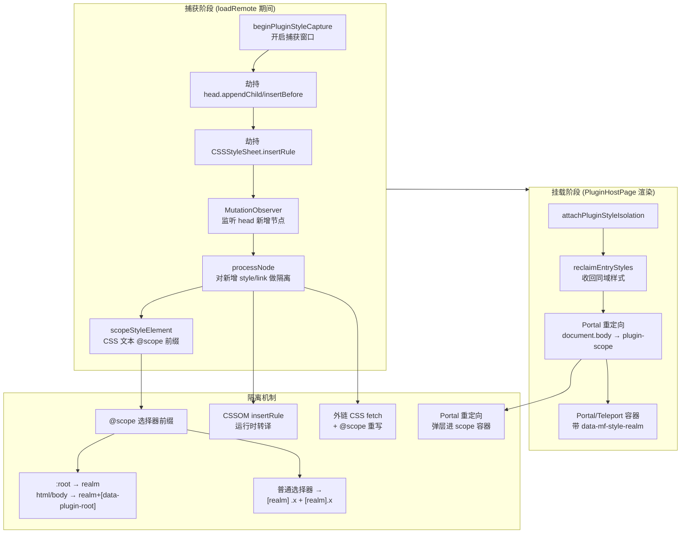

### 8.2 方法说明

| 方法 | 做什么 | 说明 |
|------|--------|------|
| `beginPluginStyleCapture(id, entry)` | 开启样式捕获窗口 | 返回 dispose 函数 |
| `scopeStyleElement(el, realm, origin)` | 隔离单个 style 元素 | @scope 前缀 + 标记 |
| `scopeLinkElement(el, realm, origin)` | 隔离外链 stylesheet | fetch + 替换 |
| `processNode(node, ctx)` | 处理新增 DOM 节点 | style/link 分流处理 |
| `reclaimEntryStyles(ctx)` | 挂载时收回同域样式 | 跨插件切换恢复样式 |
| `ensureHeadPatch()` | 劫持 head.appendChild/insertBefore | 引用计数嵌套安全 |
| `ensureCssomPatch()` | 劫持 CSSStyleSheet.insertRule | 处理 CSS-in-JS |
| `styleRealmKey(entry, remoteName, pluginId)` | 计算样式域键 | 同 Remote 共享 realm |
| `prefixCssRules(css, sel)` | CSS 文本选择器前缀 | 递归处理 at-rule |

### 8.3 核心实现解析

#### 8.3.1 样式域（Realm）计算

```typescript
// styleIsolation.ts — styleRealmKey

/**
 * 计算 Remote 的样式域标识
 * 
 * 规则：
 * 1. 优先用 entry URL 推导：entry:origin/path（同目录同 Remote 共享）
 * 2. 其次用 remoteName：remote:name（多插件共享同一 Remote 时）
 * 3. 兜底用 pluginId：plugin:id
 * 
 * 为什么同 Remote 要共享 realm？
 * - 一个 Remote 可能包含多个插件（共享 Remote 部署）
 * - 共享 realm 可避免样式归属冲突
 * - 同一 realm 的 @scope CSS 互vis（可见），保证 Remote 内部样式一致
 */
function styleRealmKey(entry: string, remoteName?: string, pluginId?: string): string {
    try {
        const u = new URL(entry);
        u.search = '';   // 去掉 query
        u.hash = '';     // 去掉 hash
        // 剥掉末尾 manifest/remoteEntry 文件名，得到 Remote 根路径
        let path = u.pathname.replace(/\/(?:mf-manifest\.json|remoteEntry\.json)\/?$/i, '');
        if (!path.endsWith('/')) path += '/';
        return `entry:${u.origin}${path}`;  // 如 "entry:http://localhost:9008/"
    } catch {
        // URL 非法时的回退
        const named = remoteName?.trim();
        if (named && named !== pluginId) return `remote:${named}`;
        return `plugin:${pluginId || 'unknown'}`;
    }
}
```

#### 8.3.2 选择器前缀隔离

```typescript
// styleIsolation.ts — prefixOneSelector

/**
 * 单个选择器加前缀（对齐 qiankun experimentalStyleIsolation）
 * 
 * 规则：
 * - :root → [data-mf-style-realm="..."]  （CSS 变量可打在浮层根）
 * - html/body → [realm][data-plugin-root]  （布局规则只命中插件根，不命中浮层）
 * - 其余 → [realm] .x, [realm].x  （后代 + 同元素双选择器）
 * 
 * 为什么 html/body 要特殊处理？
 * - 如果用通用前缀 [realm] html，会把浮层（如 Toast）的 html 也改掉
 * - 用 [realm][data-plugin-root] 只会命中带 data-plugin-root 的容器
 * - 浮层不带 data-plugin-root，所以不会被 height:100% 等布局规则影响
 */
function prefixOneSelector(selector: string, sel: string): string {
    const s = selector.trim();
    if (!s || s.includes(sel)) return s;  // 已含 realm 跳过
    
    // 检测 :root / html / body 开头
    const lead = s.match(/^(?::root|html|body)(?=[\s.:#[\]>|+~*,]|$)/i);
    if (lead) {
        // :root→realm；html/body→realm+[data-plugin-root]
        return mapDocRootToken(lead[0], sel) + s.slice(lead[0].length);
    }
    
    // 普通选择器：双选择器策略
    // [realm] .x  → 后代匹配（组件在 realm 内）
    // [realm].x   → 同元素匹配（浮层根自身带 realm）
    return `${sel} ${s},${sel}${s}`;
}
```

#### 8.3.3 CSS 文本转译

```typescript
// styleIsolation.ts — 选择器前缀完整实现（节选）

/**
 * 选择器加前缀的核心策略（对齐 qiankun experimentalStyleIsolation）：
 * ┌─────────────────────────┬──────────────────────────────────────────────┐
 * │ 选择器开头               │ 处理方式                                      │
 * ├─────────────────────────┼──────────────────────────────────────────────┤
 * │ :root                   │ → [data-mf-style-realm="..."]                 │
 * │ html / body             │ → [realm][data-plugin-root]                   │
 * │ 普通选择器 .x           │ → [realm] .x, [realm].x  （后代 + 同元素）    │
 * │ :is(html, body) ...     │ 识别参数内的文档根令牌，避免双前缀失效         │
 * └─────────────────────────┴──────────────────────────────────────────────┘
 *
 * 为什么 html/body 要双属性？
 * - 如果仅 [realm] html，会把打了 Portal 重定向后的弹层（如 antd Modal）
 *   里的 html/body 选择器也命中，导致 height:100% 把弹层拉成竖条
 * - [realm][data-plugin-root] 只命中显式标记为"插件根"的容器
 * - 弹层容器带 [data-mf-style-realm] 但不带 [data-plugin-root]，不会误命中
 */
function prefixOneSelector(selector: string, sel: string): string {
    const s = selector.trim();
    if (!s || s.includes(sel)) return s;   // 已含 realm 跳过，防重复包装

    // 检测选择器开头是否为 :root / html / body（后跟空白、组合符、伪类等）
    const lead = s.match(/^(?::root|html|body)(?=[\s.:#[\]>|+~*,]|$)/i);
    if (lead) {
        // :root → realm 选择器；html/body → realm + [data-plugin-root]
        return mapDocRootToken(lead[0], sel) + s.slice(lead[0].length);
    }

    // 非开头位置的文档根令牌也要替换（如「div > body .x」「:is(html, body) ol」）
    // 边界字符 ( [ > + ~ , 保证只替换独立令牌，不替换字符串内的子串
    const rooted = s.replace(
        /(^|[\s>+~,(])(?::root|html|body)(?=[\s.:#[\]>|+~*,)]|$)/gi,
        (full: string, p: string) => `${p}${mapDocRootToken(full.slice(p.length), sel)}`,
    );
    if (rooted !== s) return rooted;   // 发生过文档根映射，直接返回

    // 普通选择器：双选择器策略
    // [realm] .x  → 后代匹配（组件 DOM 在 realm 容器内）
    // [realm].x   → 同元素匹配（弹层根自身带 data-mf-style-realm 属性）
    return `${sel} ${s},${sel}${s}`;
}

/**
 * 按顶层逗号拆分选择器列表（括号/方括号/字符串内的逗号不拆）
 * 为什么需要手写拆分？
 * - 伪类参数 :is(.a, .b) ol 内的逗号不能拆，否则 .a 和 .b 会被误处理
 * - 属性选择器 input[type="text,email"] 内的逗号也不能拆
 * - 字符串 'hello,world' 内的逗号同理
 * - 必须跟踪 ( ) 和 [ ] 的嵌套深度，只有 depth===0 时的逗号才是顶层分隔符
 */
function splitSelectorList(list: string): string[] {
    const parts: string[] = [];
    let start = 0;
    let depth = 0;   // 跟踪括号嵌套深度
    for (let i = 0; i < list.length; i++) {
        const ch = list[i];
        // 跳过转义字符（如 Tailwind content-[\"\"] 中的 \"）
        if (ch === '\\') { i++; continue; }
        // 字符串内：跳过到配对引号
        if (ch === '"' || ch === "'") {
            const q = ch;
            i++;
            while (i < list.length) {
                if (list[i] === '\\') { i += 2; continue; }
                if (list[i] === q) break;
                i++;
            }
            continue;
        }
        if (ch === '(' || ch === '[') depth++;
        else if (ch === ')' || ch === ']') depth = Math.max(0, depth - 1);
        else if (ch === ',' && depth === 0) {
            parts.push(list.slice(start, i));
            start = i + 1;
        }
    }
    parts.push(list.slice(start));
    return parts;
}

/**
 * CSS 文本扫描器完整示意：按 token 遍历，对选择器加前缀，保留 at-rule 结构
 *
 * 处理的 at-rule 分类：
 * ┌──────────────────────────┬────────────────────────────────────────────┐
 * │ 类型                     │ 处理方式                                    │
 * ├──────────────────────────┼────────────────────────────────────────────┤
 * │ @keyframes / @font-face │ 原样不动（内部是描述符，不是选择器）          │
 * │ @media / @supports       │ 保留 prelude，递归处理内部规则               │
 * │ @layer / @container      │ 同 @media，内部仍是普通 CSS                 │
 * │ @import / @namespace     │ hoist 到文件最前（提取后放开头）             │
 * └──────────────────────────┴────────────────────────────────────────────┘
 *
 * 为什么手写扫描器而非正则替换？
 * - 正则无法正确处理 CSS 中的嵌套大括号（at-rule 内含 at-rule）
 * - 需要识别字符串内的转义和引号，避免误匹配
 * - 性能更优：O(n) 单次遍历，无需回溯
 */
function prefixCssRules(css: string, sel: string): string {
    // 1) 先抽出 @import / @namespace（hoist 到文件最前）
    const hoisted = new Map<string, string[]>();
    const rest = css
        .replace(NAMESPACE_RE, (m) => {
            const arr = hoisted.get('namespace') ?? [];
            arr.push(m); hoisted.set('namespace', arr); return '';
        })
        .replace(IMPORT_RE, (m) => {
            const arr = hoisted.get('import') ?? [];
            arr.push(m); hoisted.set('import', arr); return '';
        });

    // 2) 按大括号深度扫描，处理 @keyframes / @font-face 的花括号嵌套
    const out: string[] = [];
    let i = 0;
    const n = rest.length;
    while (i < n) {
        // 注释原样拷贝
        if (rest.startsWith('/*', i)) {
            const end = rest.indexOf('*/', i + 2);
            const j = end < 0 ? n : end + 2;
            out.push(rest.slice(i, j)); i = j; continue;
        }
        // at-rule：解析 prelude，找到匹配的 { }
        if (rest[i] === '@') {
            const preludeEnd = findPreludeEnd(rest, i);   // 跳过 prelude 到 {
            const openBrace = rest.indexOf('{', preludeEnd);
            if (openBrace < 0) { out.push(rest.slice(i)); break; }
            const closeBrace = findMatchingBrace(rest, openBrace);
            const prelude = rest.slice(i, preludeEnd);
            const name = prelude.match(/^@[\w-]+/i)?.[0]?.toLowerCase() ?? '';

            // @keyframes / @font-face / @property / @page：内部是描述符，原样保留
            if (name.startsWith('@keyframes') || name === '@font-face' ||
                name === '@property' || name === '@page') {
                out.push(rest.slice(i, closeBrace + 1));
            }
            // @media / @supports / @layer / @container：内部是规则，递归加前缀
            else {
                const inner = rest.slice(openBrace + 1, closeBrace);
                out.push(`${prelude}{${prefixCssRules(inner, sel)}}`);
            }
            i = closeBrace + 1;
        }
        // 普通规则：选择器 + { 声明 }
        else {
            const brace = findMatchingBrace(rest, rest.indexOf('{', i));
            const selectors = rest.slice(i, rest.indexOf('{', i));
            const declBlock = rest.slice(rest.indexOf('{', i), brace + 1);
            out.push(`${prefixSelectorList(selectors, sel)}${declBlock}`);
            i = brace + 1;
        }
    }

    // 3) 拼接：hoist 的 import/namespace 在前，处理后的正文在后
    const hoistParts: string[] = [];
    hoisted.get('namespace')?.forEach((x) => hoistParts.push(x));
    hoisted.get('import')?.forEach((x) => hoistParts.push(x));
    return `${hoistParts.join('\n')}${hoistParts.length ? '\n' : ''}${out.join('')}`;
}

/** 对选择器列表（可能含逗号分隔多选择器）整体加前缀 */
function prefixSelectorList(list: string, sel: string): string {
    return splitSelectorList(list)
        .map((part) => prefixOneSelector(part, sel))
        .join(',');
}
```

#### 8.3.4 CSSOM 劫持（CSS-in-JS 支持）

```typescript
// styleIsolation.ts — ensureCssomPatch

/**
 * 劫持 CSSStyleSheet.prototype.insertRule
 * 
 * 为什么需要？
 * - Ant Design、Element Plus 等组件库使用 CSS-in-JS
 * - 它们通过 stylesheet.insertRule() 动态注入样式
 * - 这些样式不会经过 head.appendChild 路径
 * - 必须劫持 insertRule 才能隔离
 * 
 * 工作原理：
 * 1. 检查 stylesheet 的 ownerNode 上是否有 mfStyleOwner 标记
 * 2. 如果有（属于某插件 realm），对 rule 文本做前缀转译
 * 3. 调用原生 insertRule 插入转译后的规则
 * 
 * 引用计数：
 * - 多个捕获窗口嵌套时，只 patch 一次
 * - 所有窗口释放后才恢复原生实现
 */
function ensureCssomPatch() {
    if (cssomPatchDepth > 0) {
        cssomPatchDepth += 1;  // 嵌套引用 +1
        return;
    }
    origInsertRule = CSSStyleSheet.prototype.insertRule;
    
    CSSStyleSheet.prototype.insertRule = function mfInsertRule(rule, index) {
        const realm = sheetOwnerRealm(this);
        if (realm) {
            const sel = scopeSelector(realm);
            rule = transpileStyleRule(rule, sel, realm);  // 单条规则转译
        }
        return origInsertRule!.call(this, rule, index);
    };
    cssomPatchDepth = 1;
}
```

#### 8.3.5 Portal/Teleport 重定向

```typescript
// styleIsolation.ts — Portal 部分

/**
 * 将 React Portal / Vue Teleport 创建的弹层重定向到插件 scope 容器
 * 
 * 问题背景：
 * - Ant Design Modal、Element Plus ElDialog 等使用 Portal/Teleport
 * - Portal 将弹层渲染到 document.body 上
 * - 弹层不在插件 DOM 树内，@scope CSS 命不中
 * - 导致弹层样式丢失（背景色、字体、间距等）
 * 
 * 解决方案：
 * - 劫持 document.body.appendChild/insertBefore
 * - 检测被插入的节点是否为 Portal 弹层
 * - 如果是，将其重定向到带 @scope 的插件容器内
 * 
 * 重定向后的效果：
 * - 弹层仍在 DOM 顶层（保证 z-index 正确）
 * - 但拥有 [data-mf-style-realm] 属性
 * - @scope CSS 可以命中弹层样式
 */

// 伪代码示意
const origBodyAppend = document.body.appendChild.bind(document.body);
document.body.appendChild = function(node) {
    const ctx = findPortalContext(node);  // 查找节点属于哪个插件
    if (ctx && shouldRedirect(node)) {
        // 重定向到插件 scope 容器
        const target = getPortalContainer(ctx.pluginId);
        target.appendChild(node);
        return node;
    }
    return origBodyAppend(node);
};
```

---

## 9. Host Bridge — 主子应用通信桥

### 9.1 架构图

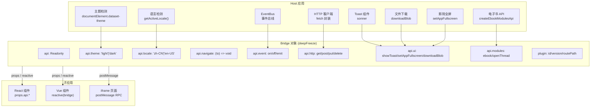

### 9.2 核心实现解析

#### 9.2.1 Bridge 创建

```typescript
// createHostBridge.ts — createHostBridge 完整实现

/**
 * 按插件权限组装并冻结 Host Bridge
 *
 * 设计原则与实现原理：
 *
 * 1. 【最小权限原则】每个插件在 Registry 中声明自己需要的权限（如 'ui:toast'），
 *    Host 只暴露对应权限的 API。没有声明的能力根本不存在于 Bridge 中。
 *    这类似"能力令牌"模型——插件无法越权使用未授权的 API。
 *
 * 2. 【按需裁剪】基础 API（theme/locale/event）所有插件都有，其他 API 根据权限
 *    条件添加。这样做的好处：
 *    - 减少 Bridge 体积，节省内存
 *    - 防止插件意外依赖未授权的 API（TypeScript 层面报错）
 *    - 权限变更时只需修改 Registry，Host 无需发版
 *
 * 3. 【深度冻结】deepFreeze 递归冻结 Bridge 所有嵌套属性：
 *    - Object.freeze 是浅冻结，必须递归处理 api.event、api.http 等嵌套对象
 *    - 防止插件在运行时修改 Bridge 结构（如删掉 http、替换 showToast 实现）
 *    - 保证所有插件看到的 Bridge 是稳定的、不可变的契约
 *
 * 4. 【导航作用域限制】navigate 函数被限制在插件自己的路由路径内：
 *    - if (!to.startsWith(d.routePath)) throw new Error(`NAV_OUT_OF_SCOPE`)
 *    - 防止插件跳到其他插件的路由或系统路由
 *    - 这是"沙箱式导航"——插件只能在自己的路由子树内导航
 */
export function createHostBridge(
    d: PluginDescriptor,
    navigate: (to: string) => void,
): HostBridgeProps {
    const allow = new Set(d.permissions);

    // ① 基础 API：所有插件都能拿到（theme/locale/event）
    const api: Record<string, unknown> = {
        // 读取 Host 当前主题：依次检查 data-theme 属性、class="dark"、body.theme-black
        theme: readTheme(),
        // 读取 Host 当前语言：从 i18n 模块获取，仅暴露 zh-CN / en-US 两种
        locale: readLocale(),
        // 事件总线：以 pluginId:event 为 key 隔离，防止插件事件冲突
        event: {
            on: (event: string, handler: (data?: unknown) => void) =>
                eventBus.on(d.id, event, handler),
            off: (event: string, handler: (data?: unknown) => void) =>
                eventBus.off(d.id, event, handler),
            emit: (event: string, data?: unknown) => eventBus.emit(d.id, event, data),
        },
    };

    // ② ui:toast 权限 → Toast + 全屏 + 文件下载
    if (allow.has('ui:toast')) {
        api.ui = Object.freeze({
            // 封装 sonner Toast 组件，插件只需传 message 即可
            showToast: (options: { message: string; type?: 'success' | 'error' | 'info' }) => {
                Toast({ type: options.type ?? 'info', title: options.message });
            },
            // 应用级全屏（Tauri 窗口全屏 / Web document 全屏）
            setAppFullscreen,
            // 统一文件下载：Web 走 blob URL 下载，Tauri 走原生落盘
            downloadBlob: async (options: {
                fileName: string;
                data: ArrayBuffer | Uint8Array;
                mimeType?: string;
            }) => {
                const mime = options.mimeType?.trim() || DOCX_MIME;
                const raw = options.data;
                const bytes = raw instanceof ArrayBuffer ? new Uint8Array(raw) : new Uint8Array(raw);
                const blob = new Blob([bytes], { type: mime });
                const result = await downloadBlob(
                    { file_name: options.fileName || 'download', id: `plugin-${d.id}-${Date.now()}`, overwrite: true },
                    blob,
                );
                const hostToasted = isTauriRuntime();
                if (result.success !== 'success') {
                    return { ok: false as const, hostToasted, message: result.message || '下载失败' };
                }
                return { ok: true as const, hostToasted };
            },
        });
    }

    // ③ nav:subtree 权限 → 导航（限制在插件路由子树内）
    if (allow.has('nav:subtree')) {
        api.navigate = (to: string) => {
            // 安全检查：只能跳转到以插件 routePath 为前缀的路径
            if (!to.startsWith(d.routePath)) {
                throw new Error(`NAV_OUT_OF_SCOPE: ${to}`);
            }
            navigate(to);
        };
    }

    // ④ http:plugin-api 权限 → HTTP 客户端（复用 Host 的 fetch 封装）
    if (allow.has('http:plugin-api')) {
        api.http = Object.freeze({
            get: <T = unknown>(url: string) => http.get<T>(url),
            post: <T = unknown>(url: string, body?: unknown) => http.post<T>(url, body),
            put: <T = unknown>(url: string, body?: unknown) => http.put<T>(url, body),
            delete: <T = unknown>(url: string) => http.delete<T>(url),
        });
    }

    // ⑤ 模块特定 API：按 modules:* 权限暴露
    const modules: Record<string, unknown> = {};
    if (allow.has('modules:chat')) {
        // 聊天模块：打开指定会话
        modules.openThread = (id: unknown) => {
            if (typeof id !== 'string') throw new Error('INVALID_THREAD_ID');
            navigate(`/chat/c/${id}`);
        };
    }
    if (allow.has('modules:ebook')) {
        // 电子书模块：获取当前书籍信息、跳转位置、打开想法等
        modules.ebook = createEbookModulesApi();
    }
    if (Object.keys(modules).length > 0) {
        api.modules = Object.freeze(modules);
    }

    // ⑥ 深度冻结：递归冻结 Bridge，防止插件修改 API 结构
    return deepFreeze({
        api,
        // 插件元信息（id/version/routePath）也冻结，防止伪造
        plugin: { id: d.id, version: d.version, routePath: d.routePath },
    }) as HostBridgeProps;
}
```

#### 9.2.2 深度冻结

```typescript
// deepFreeze.ts

/**
 * 深度冻结对象，防止插件改写 Bridge 结构
 * 
 * 为什么需要？
 * - Bridge 是 Host 暴露给插件的唯一 API 入口
 * - 如果插件能修改 Bridge 结构（如删掉 http、改成自己的实现），
 *   会导致安全问题和不可预期的行为
 * - deepFreeze 递归冻结所有嵌套属性，包括 api.event、api.http 等
 */
function deepFreeze<T>(value: T): T {
    // null / 基本类型 / 已冻结 → 直接返回
    if (value === null || typeof value !== 'object' || Object.isFrozen(value)) {
        return value;
    }
    // 递归冻结所有自有属性
    for (const key of Reflect.ownKeys(value as object)) {
        const child = (value as Record<PropertyKey, unknown>)[key];
        if (child && typeof child === 'object') {
            deepFreeze(child);  // 递归
        }
    }
    return Object.freeze(value);  // 冻结自身
}
```

---

## 10. 事件通信与 iframe 桥接

### 10.1 EventBus 事件总线

```typescript
// EventBus.ts

/**
 * 插件级事件总线
 * 
 * 设计要点：
 * - 以 pluginId:event 为 key 隔离各插件事件空间
 * - 支持 on/off/emit 标准发布订阅
 * - clearPlugin(id) 在插件卸载时清理所有监听
 * - 错误隔离：单个 handler 异常不影响其他 handler
 */
class EventBusImpl {
    private listeners = new Map<string, Set<Handler>>();  // "pluginId:event" → handlers
    private byPlugin = new Map<string, Set<string>>();      // pluginId → event 集合

    on(pluginId: string, event: string, handler: Handler) {
        const key = `${pluginId}:${event}`;
        let set = this.listeners.get(key);
        if (!set) { set = new Set(); this.listeners.set(key, set); }
        set.add(handler);
        // 记录插件订阅了哪些事件，便于 clearPlugin 清理
        let events = this.byPlugin.get(pluginId);
        if (!events) { events = new Set(); this.byPlugin.set(pluginId, events); }
        events.add(event);
    }

    emit(pluginId: string, event: string, data?: unknown) {
        const set = this.listeners.get(`${pluginId}:${event}`);
        if (!set) return;
        for (const h of set) {
            try { h(data); } catch (e) { console.error('[EventBus]', e); }
        }
    }

    clearPlugin(pluginId: string) {
        const events = this.byPlugin.get(pluginId);
        if (!events) return;
        for (const event of events) this.listeners.delete(`${pluginId}:${event}`);
        this.byPlugin.delete(pluginId);
    }
}
```

### 10.2 iframe RPC 桥接（不可信插件）

```typescript
// attachIframeBridge.ts — 完整实现

/**
 * 为不可信（untrusted）插件建立 iframe ↔ Host 的 postMessage RPC 通道
 *
 * 为什么不可信插件需要 iframe？
 * - 不可信插件不受信任（第三方开发或未审计），不能共享主文档
 * - 如果让不可信插件直接在主文档运行，它可以：
 *   - 修改 DOM（删除、篡改其他插件的 UI）
 *   - 窃取 localStorage / sessionStorage 中的敏感数据
 *   - 发起任意 HTTP 请求（CSRF 风险）
 *   - 监听所有键盘、鼠标事件
 * - iframe 天然提供 JS 沙箱隔离：不同 origin 的 iframe 无法访问父页面的 DOM / JS
 *
 * iframe 不是万能的——它解决了 JS 隔离，但没有解决：
 * - 样式隔离：iframe 内部样式天然隔离（因为是独立文档）
 * - 通信：需要 postMessage 显式传递
 * - 权限控制：需要在 Host 侧做 RPC 方法白名单
 *
 * 通信协议设计：
 *
 *   Host ←postMessage({channel:'dnhyxc-mf-iframe', type:'ready'})→ iframe
 *   Host →postMessage({type:'init', theme, locale, plugin})→ iframe
 *   iframe ←postMessage({type:'rpc', id, method, args})→ Host
 *   Host →postMessage({type:'rpc-result', id, ok, value})→ iframe
 *
 * 安全措施：
 * - targetOrigin 校验：只接受指定 origin 的消息（ev.origin === targetOrigin）
 * - 白名单 RPC 方法：dispatchRpc 用 switch-case 限制可调用的方法集
 * - iframe sandbox 属性：allow-scripts allow-same-origin allow-forms allow-popups
 *   注意：不使用 allow-top-navigation，防止 iframe 跳转主应用
 */

/** 支持的 RPC 方法分发表 */
async function dispatchRpc(
    bridge: HostBridgeProps,
    method: string,
    args: unknown[],
): Promise<unknown> {
    const { api } = bridge;
    const ebook = api.modules?.ebook as {
        getBookId: () => string | null;
        getBookTitle: () => string | null;
        navigateToCfi: (cfi: string) => void | Promise<void>;
        openThought: (t: unknown) => void;
        closeIdeasList?: () => void;
    } | undefined;

    switch (method) {
        // HTTP 代理：转发到 Host HTTP 客户端，绕过插件域名的 CORS 限制
        case 'http.get':
            if (!api.http) throw new Error('HTTP_DENIED');
            return api.http.get(String(args[0] ?? ''));
        case 'http.post':
            if (!api.http) throw new Error('HTTP_DENIED');
            return api.http.post(String(args[0] ?? ''), args[1]);
        case 'http.put':
            if (!api.http) throw new Error('HTTP_DENIED');
            return api.http.put(String(args[0] ?? ''), args[1]);
        case 'http.delete':
            if (!api.http) throw new Error('HTTP_DENIED');
            return api.http.delete(String(args[0] ?? ''));

        // UI 代理：Toast 和下载
        case 'ui.showToast':
            if (!api.ui) throw new Error('UI_DENIED');
            api.ui.showToast(args[0] as { message: string; type?: string });
            return null;
        case 'ui.downloadBlob': {
            if (!api.ui?.downloadBlob) throw new Error('UI_DENIED');
            const opt = args[0] as { fileName?: string; data?: ArrayBuffer | Uint8Array; mimeType?: string };
            if (!opt?.fileName || opt.data == null) throw new Error('INVALID_DOWNLOAD_ARGS');
            return api.ui.downloadBlob({ fileName: String(opt.fileName), data: opt.data, mimeType: opt.mimeType });
        }

        // 电子书模块代理
        case 'ebook.getBookId':     return ebook?.getBookId() ?? null;
        case 'ebook.getBookTitle':  return ebook?.getBookTitle() ?? null;
        case 'ebook.navigateToCfi': {
            await ebook?.navigateToCfi(String(args[0] ?? ''));
            return null;
        }
        case 'ebook.openThought': { ebook?.openThought(args[0]); return null; }
        case 'ebook.closeIdeasList': { ebook?.closeIdeasList?.(); return null; }

        default:
            throw new Error(`UNKNOWN_RPC: ${method}`);  // 未知方法直接拒绝
    }
}

/**
 * 建立 iframe ↔ Host 的 postMessage RPC 通道
 *
 * 生命周期：
 * 1. iframe load → 发送 ready 消息 → Host 收到后发送 init（theme/locale/plugin）
 * 2. iframe 可随时发送 rpc 消息 → Host dispatchRpc 处理 → 发送 rpc-result
 * 3. Host 监听 locale 变化 → 主动推送 locale 消息给 iframe
 * 4. 返回 dispose 函数 → 卸载时移除所有监听器
 */
export function attachIframeBridge(
    iframe: HTMLIFrameElement,
    bridge: HostBridgeProps,
    targetOrigin: string,
): () => void {
    const win = () => iframe.contentWindow;

    // 推送初始状态给 iframe
    const sendInit = () => {
        const w = win();
        if (!w) return;
        w.postMessage(
            { channel: MF_IFRAME_CHANNEL, type: 'init', theme: bridge.api.theme, locale: getActiveLocale(), plugin: bridge.plugin },
            targetOrigin,
        );
    };

    // 推送语言变化（Host 监听 locale 变化后主动推给 iframe）
    const pushLocale = (locale: Locale) => {
        const w = win();
        if (!w) return;
        w.postMessage({ channel: MF_IFRAME_CHANNEL, type: 'locale', locale }, targetOrigin);
    };

    // 监听 Host 语言变化
    let unlistenLocale: (() => void) | undefined;
    void onListen<Locale>('locale', (next) => {
        if (next === 'zh-CN' || next === 'en-US') pushLocale(next);
    }).then((fn) => { unlistenLocale = fn; });

    // 处理来自 iframe 的消息
    const onMessage = (ev: MessageEvent) => {
        if (ev.source !== win()) return;              // 只接受当前 iframe 的消息
        if (targetOrigin !== '*' && ev.origin !== targetOrigin) return;  // origin 校验
        const data = ev.data;
        if (!isRecord(data) || data.channel !== MF_IFRAME_CHANNEL) return;

        if (data.type === 'ready') {
            // iframe 准备就绪，发送初始化数据
            const ready = data as ReadyMsg;
            if (ready.pluginId && ready.pluginId !== bridge.plugin.id) return;  // 插件 ID 校验
            sendInit();
            return;
        }

        if (data.type !== 'rpc') return;

        // RPC 调用处理
        const rpc = data as RpcMsg;
        if (typeof rpc.id !== 'string' || typeof rpc.method !== 'string') return;
        const args = Array.isArray(rpc.args) ? rpc.args : [];

        void (async () => {
            try {
                const value = await dispatchRpc(bridge, rpc.method, args);
                win()?.postMessage({ channel: MF_IFRAME_CHANNEL, type: 'rpc-result', id: rpc.id, ok: true, value }, targetOrigin);
            } catch (e) {
                win()?.postMessage({
                    channel: MF_IFRAME_CHANNEL, type: 'rpc-result', id: rpc.id, ok: false,
                    error: e instanceof Error ? e.message : String(e),
                }, targetOrigin);
            }
        })();
    };

    window.addEventListener('message', onMessage);

    // iframe 加载完成后发送 init
    const onLoad = () => sendInit();
    iframe.addEventListener('load', onLoad);
    if (iframe.contentDocument?.readyState === 'complete') sendInit();

    // 返回清理函数
    return () => {
        window.removeEventListener('message', onMessage);
        iframe.removeEventListener('load', onLoad);
        unlistenLocale?.();
    };
}
```

---

## 11. 路由与侧边栏注入

### 11.1 RouteInjector — 动态路由注入

```typescript
// RouteInjector.ts

/**
 * 动态路由注入器
 * 
 * 工作模式：
 * 1. 插件注册时调用 inject(pluginId, routes) 追加路由到内部表
 * 2. 路由系统通过 getRoutes() 获取全量路由（静态+动态合并）
 * 3. subscribe(fn) 订阅路由变化，路由系统重建 router
 * 
 * 优化：相同 path 的重复注入不触发 notify，避免无意义的 router 重建
 */
class RouteInjectorImpl {
    private byPlugin = new Map<string, RouteConfig[]>();
    private listeners = new Set<Listener>();

    inject(pluginId: string, routes: RouteConfig[]) {
        const prev = this.byPlugin.get(pluginId);
        // 相同 path 不 notify，避免路由重建导致 PluginHostPage 反复挂载闪烁
        if (prev && prev.length === routes.length &&
            prev.every((r, i) => r.path === routes[i]?.path)) {
            return;
        }
        this.byPlugin.set(pluginId, routes);
        this.notify();
    }

    getRoutes(): RouteConfig[] {
        return [...this.byPlugin.values()].flat();  // 扁平化所有插件路由
    }

    subscribe(fn: Listener) {
        this.listeners.add(fn);
        return () => { this.listeners.delete(fn); };
    }

    private notify() {
        for (const fn of this.listeners) fn();
    }
}
```

### 11.2 SidebarInjector — 侧边栏注入

```typescript
// SidebarInjector.ts

/**
 * 动态侧边栏注入器
 * 
 * 工作模式：
 * 1. 插件注册时调用 add(item) 追加侧边栏项
 * 2. items getter 返回排序后的侧边栏列表
 * 3. subscribe(fn) 订阅变化
 * 
 * 去重规则：同一 pluginId 的侧边栏项只保留最新的
 */
class SidebarInjectorImpl {
    private _items: PluginSidebarItem[] = [];
    private listeners = new Set<Listener>();

    get items() { return this._items; }

    add(item: PluginSidebarItem) {
        const prev = this._items.find(x => x.pluginId === item.pluginId);
        // 相同内容不重复添加
        if (prev && prev.path === item.path && prev.icon === item.icon && ...) return;
        this._items = [
            ...this._items.filter(x => x.pluginId !== item.pluginId),  // 移除旧的
            item,
        ].sort((a, b) => a.order - b.order);  // 按 order 排序
        this.notify();
    }

    remove(pluginId: string) {
        const next = this._items.filter(x => x.pluginId !== pluginId);
        if (next.length === this._items.length) return;
        this._items = next;
        this.notify();
    }
}
```

---

## 12. 安全验证体系

### 12.1 验证流程图

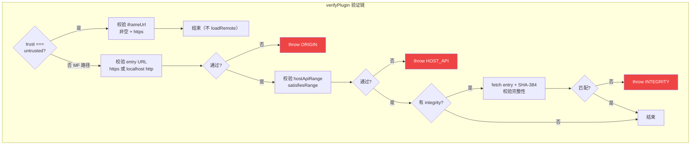

### 12.2 核心实现

```typescript
// PluginVerifier.ts — verifyPlugin

/**
 * 插件安全验证
 * 
 * 验证项（按顺序，短路失败）：
 * 1. origin 校验：entry 必须是 https 或开发态 localhost http
 * 2. hostApiRange 校验：插件声明的 API 兼容范围必须覆盖当前 Host 版本
 * 3. integrity 校验（可选）：SHA-384 哈希匹配，防止 entry 被篡改
 * 4. signature 校验（预留）：发布流水线验签
 * 
 * untrusted 特殊路径：
 * - 只校验 iframeUrl 有效性
 * - 不进入 MF 加载路径
 * - 由浏览器 sandbox 提供隔离
 */
async function verifyPlugin(d: PluginDescriptor): Promise<void> {
    // untrusted：只校验 iframeUrl
    if (d.trust === 'untrusted') {
        if (!d.iframeUrl?.trim()) throw new PluginVerifyError('需要 iframeUrl', 'IFRAME');
        if (!entryUrlAllowed(d.iframeUrl)) throw new PluginVerifyError('iframeUrl 必须 https', 'ORIGIN');
        return;
    }

    // trusted / partner：完整验证链
    if (!entryUrlAllowed(d.entry)) throw new PluginVerifyError('entry 必须 https', 'ORIGIN');
    if (!satisfiesRange(HOST_API_VERSION, d.hostApiRange)) {
        throw new PluginVerifyError('Host API 版本不兼容', 'HOST_API');
    }
    // integrity 校验（有声明且未跳过）
    if (d.integrity && !skipIntegrity()) {
        const res = await fetch(d.entry, { cache: 'no-store' });
        const hash = await sha384Base64(await res.arrayBuffer());
        if (hash !== d.integrity) throw new PluginVerifyError('完整性校验失败', 'INTEGRITY');
    }
    // signature 预留钩子
    if (d.signature === 'invalid') throw new PluginVerifyError('签名无效', 'SIGNATURE');
}

/** URL 协议白名单：生产只允许 https，开发额外允许 localhost http */
function entryUrlAllowed(entry: string, opts?: { prod?: boolean }): boolean {
    const url = new URL(entry);
    if (url.protocol === 'https:') return true;
    if (opts?.prod ?? import.meta.env.PROD) return false;
    return url.protocol === 'http:' &&
        (url.hostname === 'localhost' || url.hostname === '127.0.0.1');
}
```

---

## 13. 主链路时序图

### 13.1 插件加载完整时序

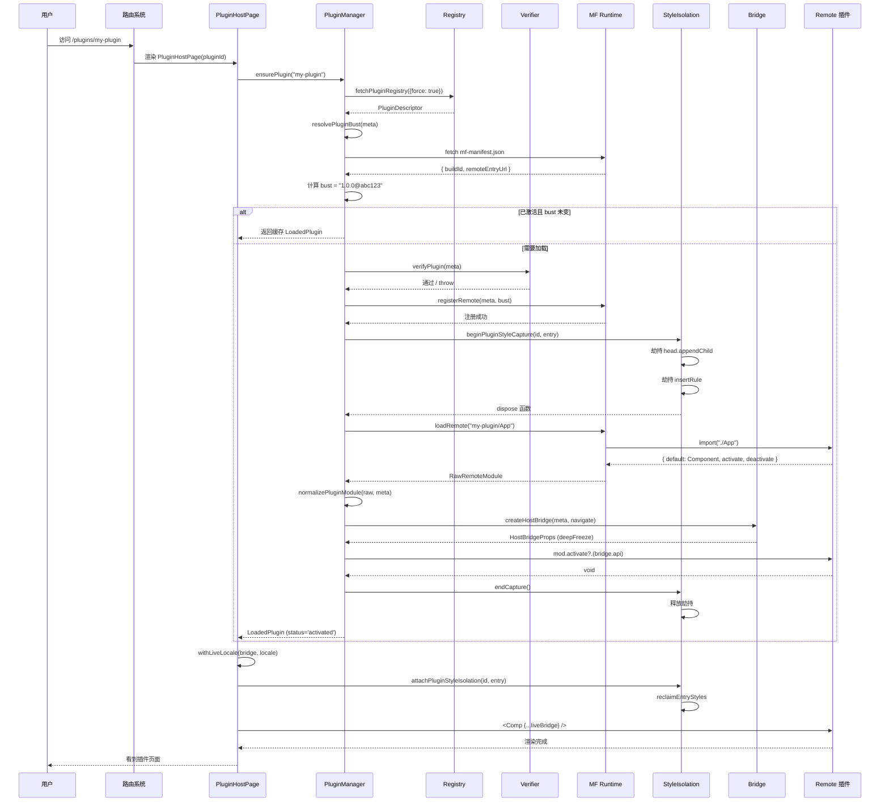

### 13.2 时序图方法说明

| 参与者 | 角色 | 职责 |
|--------|------|------|
| `PluginHostPage` | 渲染组件 | 加载状态管理、Bridge 实时更新、错误边界 |
| `PluginManager` | 编排器 | 生命周期编排、并发去重、bust 检查 |
| `Registry` | 数据源 | 插件元数据拉取、缓存、用户偏好覆盖 |
| `Verifier` | 安全守卫 | origin、版本、完整性校验 |
| `MF Runtime` | 加载引擎 | Remote 注册、模块加载、共享依赖管理 |
| `StyleIsolation` | 隔离层 | 样式捕获、@scope 前缀、Portal 重定向 |
| `Bridge` | API 提供者 | 权限裁剪、deepFreeze、Host 能力桥接 |
| `Remote` | 子应用 | 渲染业务 UI、消费 Bridge API |

---

## 14. 插件完整接入指南

### 14.1 React 插件 Checklist

| 步骤 | 操作 | 说明 |
|------|------|------|
| 1 | 创建 Vite + React 项目 | 标准 Vite 模板即可 |
| 2 | 安装 `@originjs/vite-plugin-federation` | MF Vite 插件 |
| 3 | 配置 `vite.config.ts` | `federation` 插件：name、exposes、shared |
| 4 | 导出 `default` 组件 | 接收 `HostBridgeProps` 作为 props |
| 5 | 可选导出 `activate/deactivate` | 生命周期钩子 |
| 6 | 构建产物发布到 HTTPS | 需要 mf-manifest.json + remoteEntry.js |
| 7 | 写入 `plugins-registry.json` | 配置 entry、permissions、trust 等 |

### 14.2 Vue 插件 Checklist

| 步骤 | 操作 | 说明 |
|------|------|------|
| 1 | 创建 Vite + Vue 项目 | 标准 Vite 模板即可 |
| 2 | 安装 `@originjs/vite-plugin-federation` | MF Vite 插件 |
| 3 | 配置 `vite.config.ts` | `federation` 插件，**不**共享 vue |
| 4 | 导出 `mount(el, bridge)` 函数 | 或 `{ mount }` 对象 |
| 5 | mount 内部 `createApp` + `app.mount(el)` | 自管生命周期 |
| 6 | `reactive(bridge)` 使 API 响应式 | 可选，用于接收 locale 变化 |
| 7 | 返回卸载函数 | 调用 `app.unmount()` |
| 8 | 构建产物发布到 HTTPS | 同 React 插件 |
| 9 | 写入 `plugins-registry.json` | `framework: 'vue'` |

### 14.3 Registry 配置示例

```json
{
  "updatedAt": "2026/08/09 12:00:00",
  "plugins": [
    {
      "id": "my-react-plugin",
      "title": { "zh-CN": "我的 React 插件", "en-US": "My React Plugin" },
      "routePath": "/plugins/my-react",
      "entry": "https://cdn.example.com/my-plugin/mf-manifest.json",
      "version": "1.0.0",
      "hostApiRange": "^1.0.0",
      "framework": "react",
      "expose": "./App",
      "permissions": ["ui:toast", "http:plugin-api"],
      "trust": "partner",
      "enabled": true,
      "menu": { "order": 10, "icon": "Puzzle" },
      "preload": "route"
    },
    {
      "id": "my-vue-plugin",
      "title": { "zh-CN": "我的 Vue 插件", "en-US": "My Vue Plugin" },
      "routePath": "/plugins/my-vue",
      "entry": "https://cdn.example.com/my-vue/mf-manifest.json",
      "version": "1.0.0",
      "hostApiRange": "^1.0.0",
      "framework": "vue",
      "remoteName": "my-vue-remote",
      "permissions": ["ui:toast"],
      "trust": "first-party",
      "enabled": true,
      "menu": { "order": 20, "icon": "Sparkles" }
    }
  ]
}
```

### 14.4 常见问题排查

| 问题 | 排查方向 |
|------|----------|
| 插件加载失败 `ORIGIN` | 检查 entry URL 是否 https；开发态是否 localhost |
| 插件加载失败 `HOST_API` | 检查插件 hostApiRange 是否兼容当前 Host API 版本 |
| 样式丢失 | 检查是否正确通过 mount(el, bridge) 挂载；是否在捕获窗口内注入样式 |
| React 插件 Hooks 报错 | 检查 shared 配置中 react 是否 singleton |
| Vue 插件 HMR 失效 | 检查 Remote Vite 是否将 vue 排除在 `optimizeDeps` 预打包之外 |
| 弹层（Modal）样式丢失 | 检查 Portal 重定向是否生效；弹层容器是否带 data-mf-style-realm |
| 插件更新不生效 | 检查 mf-manifest.json 内容是否变化；bust 是否正确计算 |

---

## 15. 技术决策总结与权衡

### 15.1 方案对比

| 维度 | 本方案（MF + @scope） | qiankun（JS 沙箱 + Shadow DOM） | Web Components | iframe |
|------|----------------------|--------------------------------|----------------|--------|
| 样式隔离 | @scope 前缀 | Shadow DOM | Shadow DOM | 天然隔离 |
| JS 隔离 | 无（信任前提下共享） | Proxy 沙箱 | 天然隔离 | 天然隔离 |
| 框架兼容 | React/Vue 桥接 | 多框架支持 | 需 Web Components | 任意框架 |
| 通信效率 | 直接 Bridge 对象 | 事件总线 | Custom Events | postMessage |
| 生态兼容 | Ant Design / Tailwind 兼容 | 部分组件库冲突 | 组件库支持度低 | 完全兼容 |
| 性能 | 高（无额外开销） | 中（沙箱代理开销） | 中 | 低（跨域通信） |

### 15.2 本方案取舍

| 选择 | 理由 | 代价 |
|------|------|------|
| Module Federation 而非 qiankun | 原生 ESM、Vite 集成好、无 Proxy 开销 | 需处理 CSS-in-JS 隔离 |
| @scope 而非 Shadow DOM | CSS 变量穿透、组件库兼容好 | 需手写 CSS 扫描器 |
| Bridge 对象而非 postMessage | 性能高、类型安全 | 需要 deepFreeze 保证安全 |
| 注册表 JSON 而非后端 API | 静态托管、CDN 缓存、离线可用 | 缺乏实时推送 |
| Bust 机制而非 WebSocket | 简单可靠、无需额外基础设施 | 非实时（下次访问时更新） |
| Vue mount API 而非共享 Vue | Host 零依赖、各自独立 | 需要 createVueHostBridge 桥接 |

---

## 16. 核心实现原理深度解析

> 本章提炼各模块的底层实现原理，帮助读者理解"为什么要这样做"以及"这样做为什么能达到目的"。

### 16.1 Module Federation 动态加载原理

**传统做法（Webpack MF 静态配置）：**
- Host 在编译时 `remotes: { marketing: 'marketing@http://cdn/mf.json' }`
- 插件列表硬编码在 `vite.config.ts` 或 `webpack.config.js`
- 新增插件需要 Host 重新编译部署

**本方案做法（运行时动态注册）：**

```
                    ┌──────────────────────┐
                    │  plugins-registry.json │
                    │  (后端 JSON 下发)      │
                    └──────────┬───────────┘
                               │ fetch 拉取
                               ▼
┌──────────────────────────────────────────────────────┐
│ PluginManager.init()                                  │
│   解析 Registry → 遍历 enabled 插件                    │
│   调用 registerRemote(meta) 逐个注册到 MF Runtime      │
└──────────────────────────────────────────────────────┘
                               │
                               ▼
┌──────────────────────────────────────────────────────┐
│ MF Runtime (运行时实例)                                 │
│   registerRemote({ name, entry, type })               │
│   内部创建 remoteContainer → 建立 ESM 动态 import 通道  │
└──────────────────────────────────────────────────────┘
                               │
                               ▼
┌──────────────────────────────────────────────────────┐
│ loadRemote("plugin-id/App")                           │
│   → 从 remoteContainer 获取 expose 模块               │
│   → 触发 ESM import('./App')                         │
│   → Remote 的 Vite 构建产物被浏览器加载执行             │
└──────────────────────────────────────────────────────┘
```

**原理要点：**
1. `@module-federation/enhanced/runtime` 提供了运行时的 `registerRemote` 和 `loadRemote` API，不需要编译时静态配置
2. Host 通过 `fetch` 拉取 `plugins-registry.json`（通常托管在后端静态存储），获得插件的 `entry` URL
3. 注册时指定 `type: 'module'`，告诉 MF Runtime 使用原生 ESM `import()` 加载 remoteEntry.js
4. 加载时通过 `loadRemote` 触发动态 import，浏览器下载 remoteEntry.js 及其依赖 chunk

**为什么选择 ESM 而非传统 MF 的 Script 标签？**
- ESM 天然支持浏览器原生异步加载
- Vite 构建产物就是 ESM，无需额外转换
- 共享依赖（React/ReactDOM）通过 `registerShared` 在 ESM 层面去重
- 更好的 Tree-shaking：只加载用到的 chunk

### 16.2 样式隔离原理

**核心矛盾：**
- 子应用的 CSS 会影响整个文档（全局选择器如 `.btn {}`、`body {}`）
- 需要让子应用的 CSS 只在自己的 DOM 子树内生效
- 同时需要兼容 Ant Design、Tailwind CSS 等现代 CSS 方案

**解决方案：@scope 选择器前缀**

```
原始 CSS:                    隔离后 CSS:
.btn { color: red; }     →   [data-mf-style-realm="x"] .x,
                            [data-mf-style-realm="x"].x { color: red; }

body { height: 100%; }   →   [data-mf-style-realm="x"][data-plugin-root]
                            { height: 100%; }

:root { --primary: #fff } →  [data-mf-style-realm="x"]
                            { --primary: #fff; }
```

**工作原理：**
1. **捕获阶段**：劫持 `head.appendChild`、`CSSStyleSheet.insertRule`、MutationObserver
2. **转译阶段**：对捕获到的 CSS 文本做选择器前缀处理
3. **挂载阶段**：回收已转译的样式到当前 realm，安装 Portal 重定向

**为什么 `:root` 映射到 `[data-mf-style-realm]` 而非 `[data-plugin-root]`？**
- `:root` 常用于定义 CSS 变量（如 `--primary-color`）
- CSS 变量具有继承性，从父元素传递到子元素
- 如果映射到 `[data-plugin-root]`，只有插件根容器的子元素能访问变量
- 但 Portal 重定向的弹层也是插件的一部分，需要访问这些变量
- 所以 `:root` 映射到 `[data-mf-style-realm]`，让所有带此属性的元素（包括弹层）都能使用变量

**为什么需要 Portal 重定向？**
- Ant Design Modal、Element Plus Dialog 等组件使用 `createPortal` 将弹层渲染到 `document.body`
- 如果弹层留在 `body` 上，@scope CSS 选择器无法命中
- 解决方案：劫持 `document.body.appendChild`，检测到 Portal 弹层时重定向到带 `data-mf-style-realm` 的容器
- 重定向后弹层仍然位于 DOM 顶层（保证 z-index 正确），但拥有正确的 scope 属性

### 16.3 Host Bridge 通信原理

**设计哲学：能力即权限**

```
插件声明的权限：
{ permissions: ['ui:toast', 'http:plugin-api', 'nav:subtree'] }
         │
         ▼
┌──────────────────────────────┐
│ createHostBridge(meta, nav)   │
│                               │
│ 基础 API（所有插件都有）：      │
│   api.theme  ← readTheme()   │
│   api.locale ← readLocale()  │
│   api.event  ← EventBus      │
│                               │
│ 权限裁剪 API：                │
│   if ('ui:toast')  → api.ui  │
│   if ('http:...')  → api.http│
│   if ('nav:subtree') → api.navigate │
└──────────────────────────────┘
         │
         ▼
    deepFreeze(bridge)
         │
         ▼
  HostBridgeProps (只读对象)
```

**deepFreeze 的安全性：**
- `Object.freeze` 只做浅冻结，嵌套对象仍可修改
- 递归 deepFreeze 确保所有嵌套属性都被冻结
- 插件无法替换 `api.http` 的实现为恶意请求
- 插件无法删除 `api.event` 的 `emit` 方法

**导航沙箱原理：**
```typescript
api.navigate = (to: string) => {
    if (!to.startsWith(d.routePath)) {
        throw new Error(`NAV_OUT_OF_SCOPE: ${to}`);
    }
    navigate(to);
};
```
- 插件只能在自己的路由子树内导航
- 如果尝试跳转到 `/admin/dashboard`（其他插件的路由），会被拒绝
- 这是"最小权限"原则在导航领域的具体体现

### 16.4 Vue/React 桥接原理

**为什么 Host 不需要安装 Vue？**

传统微前端方案中，如果要支持 Vue 子应用，Host 通常需要：
1. 安装 Vue 依赖
2. 实现 Vue 的渲染容器
3. 处理 Vue 和 React 的生命周期冲突

**本方案的巧妙之处：**

```
Vue Remote 构建时:
  - Vue 作为 shared 依赖，Remote 自己打包
  - expose 导出 mount(el, bridge) 函数
  - Remote 内部自己 createApp + mount

Host 侧:
  - createVueHostBridge 将 mount 函数包装成 React 组件
  - React 组件只负责：
    a) 创建 <div> 容器
    b) useLayoutEffect 调用 mount(el, bridge)
    c) cleanup 时调用 unmount
  - Host 完全不知道 Vue 的存在
```

**bridgeRef 的热更新原理：**
```typescript
const bridgeRef = useRef<HostBridgeProps>(initial);

// props 变化时（如 locale 改变）
useEffect(() => {
    bridgeRef.current.api = props.api;
    bridgeRef.current.plugin = props.plugin;
}, [props.api, props.plugin]);
```

- Vue 侧通过 `reactive(bridgeRef.current)` 获得响应式对象
- 当 Host 的 locale 变化时，`bridgeRef.current.api` 被新对象替换
- Vue 的 reactive 系统检测到变化，自动触发视图更新
- 这个设计让 Vue 插件可以响应 Host 的主题/语言变化，而不需要重新 mount

### 16.5 信任分级与安全原理

```
┌─────────────────────────────────────────────────────────────┐
│                    信任分级架构                               │
├──────────────────┬──────────────────────────────────────────┤
│ trusted/partner  │ untrusted                                │
│ (MF 加载路径)    │ (iframe 沙箱路径)                         │
├──────────────────┼──────────────────────────────────────────┤
│ 共享主文档       │ 独立文档（iframe）                        │
│ 直接函数调用     │ postMessage RPC 通信                      │
│ 性能高、类型安全 │ 性能低、需序列化                          │
│ 需要样式隔离     │ 天然样式/JS隔离                           │
│ 深度冻结 Bridge  │ RPC 方法白名单                            │
└──────────────────┴──────────────────────────────────────────┘
```

**为什么信任分级很重要？**
1. **可信插件**（第一方/合作伙伴）：代码经过审计，可以安全地在主文档运行。享受更高性能和更好的开发体验。
2. **不可信插件**（第三方/用户提交）：代码未经审计，必须在 iframe 沙箱中运行。通过 RPC 白名单限制可调用的 Host API。

**iframe sandbox 安全配置：**
```html
<iframe sandbox="allow-scripts allow-same-origin allow-forms allow-popups">
```
- `allow-scripts`：允许执行 JS（否则插件无法运行）
- `allow-same-origin`：允许 iframe 访问自身 origin（某些场景需要）
- **不**使用 `allow-top-navigation`：防止 iframe 跳转到主应用的其他页面
- **不**使用 `allow-pointer-lock`：防止获取鼠标锁定权限

### 16.6 缓存刷新（Bust）原理

**发布-感知时序：**
```
时间线 →

T0: 插件发布者更新代码，构建出新的 mf-manifest.json
T1: Host 用户访问 → ensurePlugin(pluginId)
T2: Host fetch mf-manifest.json（带时间戳破坏缓存）
T3: 解析 manifest 内容 → 计算 FNV-1a 哈希
T4: 哈希变化 → bust = "1.0.0@newHash"（与旧 bust 不同）
T5: 触发重新 loadRemote → 下载新版本代码

关键：发布者只需更新自己的静态资源，Host 无需任何操作。
```

**为什么用 FNV-1a 而非 SHA-256？**
- FNV-1a 是 32-bit 非加密哈希，计算速度快
- 用于缓存 bust 只需"检测内容变化"，不需要安全性
- SHA-384 留给完整性校验（`integrity` 字段），用于检测恶意篡改
- 两者职责分离：FNV 做效率，SHA-384 做安全

### 16.7 事件总线隔离原理

**插件级事件命名空间：**
```
EventBus key 格式: "${pluginId}:${event}"

例:
  "my-chat-plugin:message-received"  → 只有 my-chat-plugin 能收到
  "my-chat-plugin:typing"            → 同上
  
  不会与其他插件冲突:
  "my-ebook-plugin:page-change"     → ebook 插件的事件
```

**清理机制：**
```typescript
clearPlugin(pluginId) {
    const events = this.byPlugin.get(pluginId);
    for (const event of events) {
        this.listeners.delete(`${pluginId}:${event}`);
    }
    this.byPlugin.delete(pluginId);
}
```
- 插件卸载时自动清理所有订阅
- 防止内存泄漏（插件卸载后仍有监听占着内存）

### 16.8 完整原理总结表

| 模块 | 核心原理 | 关键技术 | 解决的问题 |
|------|----------|----------|------------|
| 插件发现 | 远程 JSON 注册表 | fetch + localStorage 缓存 | 动态发现可用插件 |
| 插件加载 | Module Federation 运行时 | registerRemote + loadRemote | 按需加载远程模块 |
| 依赖共享 | MF Shared + singleton | registerShared({singleton:true}) | React/ReactDOM 单实例 |
| 样式隔离 | CSS @scope 前缀 + Portal 重定向 | 手写 CSS 扫描器、DOM 劫持 | 插件样式不污染全局 |
| Bridge 通信 | 能力令牌 + 深度冻结 | 权限裁剪 + deepFreeze | 安全的 API 暴露 |
| 事件通信 | 插件级命名空间 EventBus | pluginId:event 键隔离 | 插件间低耦合通信 |
| 框架兼容 | Vue mount → React 桥 | createVueHostBridge | Host 零 Vue 依赖 |
| 安全校验 | 多层验证链 | origin/version/integrity | 防止恶意插件接入 |
| 信任分级 | iframe 沙箱 + RPC | sandbox + postMessage | 不可信插件隔离 |
| 缓存刷新 | 内容指纹 Bust | FNV-1a + Runtime Plugin | 无感发布新插件版本 |
| 路由注入 | 动态路由注册 | RouteInjector + 订阅机制 | 插件路由不重启主应用 |