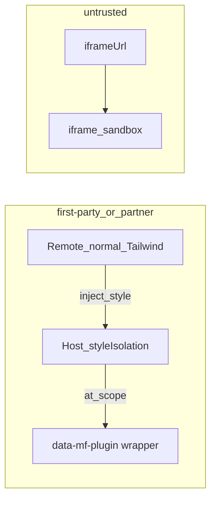

# MF 主/子样式互不影响

> **状态**：已落地（**Host 运行时 @scope 隔离** + untrusted iframe；含 realm / Portal·Teleport / qiankun 式 transpile·CSSOM）  
> **日期**：2026-07-22（Host 侧接管；子应用恢复正常 Tailwind；2026-08 第三轮加固）  
> **关联**：[`模块联邦插件宿主.md`](../../plugins/模块联邦插件宿主.md)、[`样式隔离实现.md`](../../style/样式隔离实现.md)、[`样式隔离技术概述.md`](../../style/样式隔离技术概述.md)、[`样式隔离乾坤加固.md`](../../style/样式隔离乾坤加固.md)、**实现指南详解** [`模块联邦实现指南.md` §2.10.2](../../plugins/模块联邦实现指南.md)、[`styleIsolation.ts`](../../apps/frontend/src/plugins/host/styleIsolation.ts)

---

## 1. 问题

Host 与 Remote 同页共享全局 CSS。若要求 Remote 禁用 Preflight、手动 `[data-plugin-root]` 套 utilities，会**污染子应用工程配置**，无法按普通 Vite + Tailwind 项目开发。

目标：**隔离责任在 Host**；Remote 可用正常 `@import "tailwindcss"`；主↔子互不破坏。

---

## 2. 选定模型

### 2.1 `first-party` / `partner`（MF 嵌入）

- [`PluginHostPage`](../../apps/frontend/src/plugins/host/PluginHostPage.tsx) 包装 `data-mf-plugin={id}`（兼 `data-plugin-root` 兼容旧选择器）。
- [`beginPluginStyleCapture`](../../apps/frontend/src/plugins/host/styleIsolation.ts) 在 `loadRemote` 期间劫持 `head.appendChild`，把 Remote 注入的 `style`/`link` 用 `@scope ([data-mf-plugin="id"])` 包裹。
- 插件页挂载期间继续 observe，覆盖 HMR。
- Remote：**无需** scoped 特殊 CSS；独立预览仍用本包 `styles.css`。

### 2.2 `untrusted`

- registry `iframeUrl` + iframe；不共享主文档 CSS（不变）。

---

## 3. 明确不做

- 不要求 Remote 构建期去掉 Preflight / 嵌套 `@tailwind utilities`。
- 不恢复「半套 Shadow + 只搬 head」（子应用无样式）。
- 不把全体第一方改成 iframe。

---

## 4. 验收清单

1. 英语学习 → 学习笔记：Button 有主题样式。
2. 打开笔记后再进设置：主站字体/标签未被 Preflight 改坏。
3. `apps/remote-plugins` 可用标准 `@import "tailwindcss"` 独立预览（:9008）。
