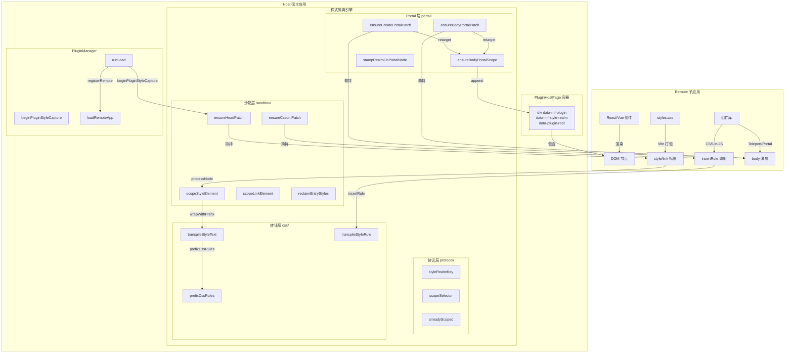
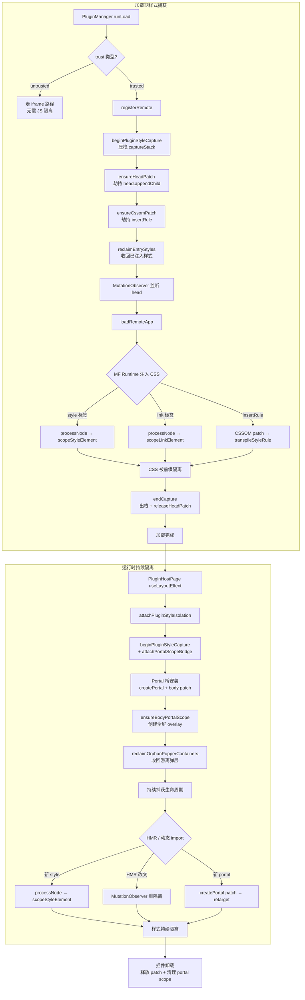
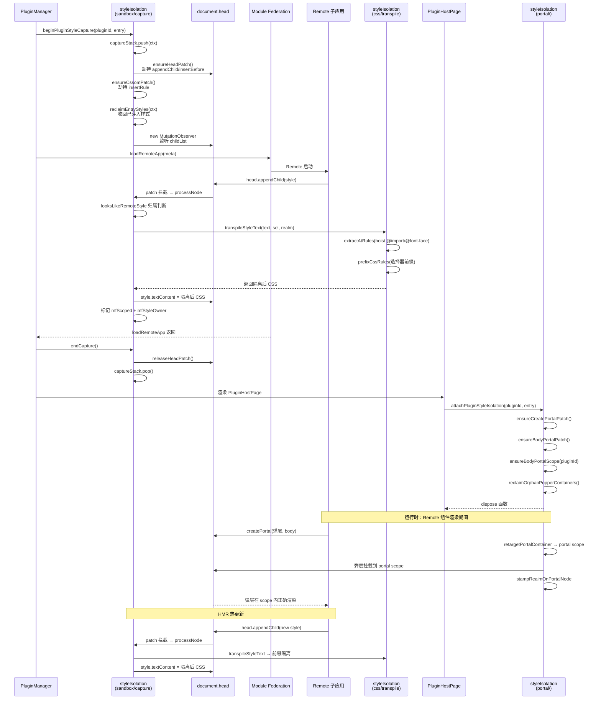

# 微前端样式隔离 — 实现思路

> **状态**：已落地（Host 运行时选择器前缀隔离 + CSSOM patch + Portal 收编 + iframe 兜底）  
> **日期**：2026-08-10  
> **需求摘要**：在 Module Federation 微前端架构中，Host 侧自动拦截并隔离 Remote 注入的所有样式，实现零侵入的主子应用样式隔离，Remote 可正常使用 Tailwind、CSS-in-JS、全局样式等

## 延伸阅读

- [样式隔离技术概述.md](../../style/样式隔离技术概述.md)（技术速览）
- [样式隔离实现.md](../../style/样式隔离实现.md)（初始实现记录）
- [样式隔离乾坤加固.md](../../style/样式隔离乾坤加固.md)（第三轮加固：transpile/CSSOM/Portal）
- [模块联邦CSS隔离.md](./模块联邦CSS隔离.md)（规划态初始思路）
- [模块联邦实现指南.md](../../plugins/模块联邦实现指南.md)（MF 实现总览）

---

## 0. 读本文你将得到什么

- 微前端样式隔离的**完整分层架构**与设计哲学
- **选择器前缀隔离方案**的原理、实现细节与 qiankun 对齐
- **CSSOM insertRule patch** 如何覆盖 CSS-in-JS 场景
- **Portal/Teleport 收编**如何解决 body 弹层溢出问题
- **HMR 热更新**场景下的样式重隔离机制
- 完整可复用的 TypeScript 代码实现与详细注释
- 读者读完后可**独立实现**一套微前端样式隔离系统

---

## 1. 需求与边界

### 1.1 用户故事

| 角色 | 场景 | 行为 | 期望结果 |
|------|------|------|----------|
| Remote 开发者 | 开发子应用 | 正常使用 Tailwind、全局样式、CSS-in-JS | 无需任何改造，样式自动被隔离 |
| Host 开发者 | 加载插件 | 通过 MF 动态加载 Remote | Remote 样式不污染 Host |
| 终端用户 | 使用插件 | 打开 Drawer/Dialog 等弹层组件 | 弹层在插件容器内正确渲染，不溢出 |
| 第三方集成 | 使用 Element Plus / Ant Design | 组件库注入 body 弹层 | 弹层被收编进插件 portal scope |

### 1.2 范围

| 在范围内 | 不在范围内（非目标） |
|----------|----------------------|
| style/link 标签样式隔离 | Remote JS 执行环境隔离（trusted 模式不做） |
| CSS-in-JS（insertRule）隔离 | Remote 内部组件样式冲突（属于 Remote 自身问题） |
| Portal/Teleport body 弹层收编 | Shadow DOM 方案（已评估否决） |
| HMR 热更新重隔离 | 浏览器不支持 @scope 的降级方案 |
| iframe 完全隔离（untrusted） | iframe 内的 JS/样式跨域通信 |

### 1.3 约束与依赖

- **框架依赖**：Host 使用 React + Module Federation（`@module-federation/enhanced`）
- **浏览器兼容**：Chrome 118+ / Firefox 125+ / Safari 17.4+（原生支持 `@scope`）
- **Remote 框架无关**：支持 React / Vue / 任意框架
- **性能底线**：样式转译在运行时同步完成，不阻塞渲染主线程
- **必须复用**：`PluginManager` 的生命周期钩子、`PluginHostPage` 的容器约定

---

## 2. 方案总览（一句话 + 要点）

**一句话方案**：Host 在 Remote 加载/挂载期间，通过劫持 `head.appendChild`、`CSSStyleSheet.insertRule` 和 `ReactDOM.createPortal`，将所有注入的 CSS 选择器前缀化（`[data-mf-style-realm="…"]`），使 Remote 样式只在带有对应 `data-mf-style-realm` 属性的容器内生效。

| # | 设计要点 | 理由 |
|---|----------|------|
| 1 | **选择器前缀隔离**（非 `@scope` 包裹） | 前缀方案可覆盖 body 弹层（Portal 不在 `@scope` 子树内），且与 CSS-in-JS 的 insertRule 路径天然兼容 |
| 2 | **realm 键粒度**（同 Remote 多插件共享） | 同一 MF Remote 的多个 expose 共享 CSS 域，避免样式被重复隔离 |
| 3 | **两阶段捕获**（加载期 + 运行时） | 加载期捕获入口 CSS，运行时持续捕获 HMR/动态 import |
| 4 | **CSSOM insertRule patch** | antd cssinjs 等通过 `insertRule` 注入，必须拦截才能隔离 |
| 5 | **Portal 收编** | Element Plus/Ant Design 等将弹层挂到 body，需重定向到插件 portal scope |
| 6 | **Host 关键样式保护** | sonner 等 Host 关键弹层组件的样式不能被隔离改写 |
| 7 | **引用计数嵌套管理** | 支持插件嵌套加载，patch 只装一次、末次释放 |

---

## 3. 现状与复用

| 能力 | 仓库中已有 | 本需求中的用法 |
|------|------------|----------------|
| Module Federation Runtime | `apps/frontend/src/plugins/core/mf.ts` | 通过 `beginPluginStyleCapture` 在 `loadRemoteApp` 前后开启/关闭捕获 |
| PluginManager 生命周期 | `apps/frontend/src/plugins/core/PluginManager.ts` | `runLoad` 方法中接入初始捕获 |
| PluginHostPage 容器 | `apps/frontend/src/plugins/host/PluginHostPage.tsx` | 提供 `data-mf-plugin` + `data-mf-style-realm` 容器，useLayoutEffect 中开启运行时隔离 |
| HostBridge 通信 | `apps/frontend/src/plugins/core/types.ts` | 无需改动，样式隔离完全在 Host 侧完成 |

**调研结论**：样式隔离为纯 Host 侧新增模块，Remote 零改造。核心实现分为 `protocol`（协议/选择器）、`css`（转译引擎）、`sandbox`（head/CSSOM 劫持）、`portal`（body/Portal 收编）四层。

---

## 4. 架构图



**图内方法说明**：

| 方法 / 模块入口 | 功能 |
|-----------------|------|
| `styleRealmKey(entry, remoteName, pluginId)` | 从 Remote entry URL 推导共享 realm 键（同 Remote 多插件共享 `entry:origin/path`） |
| `scopeSelector(realm)` | 生成 `[data-mf-style-realm="…"]` 属性选择器 |
| `alreadyScoped(text, sel)` | 幂等检测：CSS 文本是否已带当前协议标记 + realm 前缀 |
| `transpileStyleText(cssText, sel, realm)` | 整段 CSS 转译：hoist @import/@font-face/@namespace → keyframes 前缀 → 选择器前缀 |
| `prefixCssRules(css, sel)` | 手写轻量 CSS 扫描器：遍历规则、at-rule 递归、选择器前缀 |
| `transpileStyleRule(ruleText, sel, realm)` | 单条 insertRule 转译：只做选择器前缀，保留 keyframes 原名 |
| `ensureHeadPatch()` | 劫持 `head.appendChild`/`insertBefore`，安装引用计数 |
| `ensureCssomPatch()` | 劫持 `CSSStyleSheet.prototype.insertRule`，按 owner realm 转译 |
| `scopeStyleElement(el, realm, entryOrigin)` | 处理 style 标签：文本转译 + 标记 + HMR 监听 |
| `scopeLinkElement(el, realm, entryOrigin)` | 处理 link 标签：fetch CSS → 转译 → 替换为 style 标签 |
| `reclaimEntryStyles(ctx)` | 挂载时收回同 entry 已注入的样式到当前 realm |
| `ensureCreatePortalPatch()` | 劫持 `ReactDOM.createPortal`，将 body 目标重定向到 portal scope |
| `ensureBodyPortalPatch()` | 劫持 `Node.prototype.appendChild/insertBefore` 等，将 body 挂载重定向 |
| `ensureBodyPortalScope(pluginId)` | 创建/获取 body 上的全屏 overlay 容器（`data-mf-portal-scope`） |
| `stampRealmOnPortalNode(node)` | 给 portal 节点打上 `data-mf-style-realm` + `data-mf-plugin` 标记 |

**读图要点**：

- 分层关系：Protocol（协议定义）→ CSS（文本转译）→ Sandbox（DOM 劫持 + 样式处理）→ Portal（body 弹层收编），四层自底向上依赖
- 新增模块：整个 `style-isolation/` 目录为纯新增，不修改 Remote 任何代码
- 与现有模块边界：`PluginManager.runLoad` 中 `beginPluginStyleCapture` 在 `loadRemoteApp` 前后包裹；`PluginHostPage` 的 `useLayoutEffect` 中调用 `attachPluginStyleIsolation`

---

## 5. 主流程图



**图内方法说明**：

| 方法 | 功能 |
|------|------|
| `beginPluginStyleCapture(pluginId, entry, remoteName)` | 开启样式捕获窗口：压栈上下文、劫持 head/CSSOM、回收旧样式、监听新增 |
| `ensureHeadPatch()` | 首次调用时装载 `head.appendChild/insertBefore` 劫持，引用计数管理嵌套 |
| `ensureCssomPatch()` | 装载 `CSSStyleSheet.prototype.insertRule` 劫持 |
| `reclaimEntryStyles(ctx)` | 挂载时遍历 head 已有 style/link，将同 entry 的收编到当前 realm |
| `processNode(node, ctx)` | 单节点处理分发：style → `scopeStyleElement`，link → `scopeLinkElement` |
| `scopeStyleElement(el, realm, entryOrigin)` | style 标签隔离：检测空内容→MO 等待、检测 Host 关键→跳过、文本转译→标记→HMR 监听 |
| `scopeLinkElement(el, realm, entryOrigin)` | link 标签隔离：fetch CSS→转译→创建 scoped style→禁用原 link |
| `attachPluginStyleIsolation(pluginId, entry, remoteName)` | 组合入口：beginPluginStyleCapture + attachPortalScopeBridge |
| `attachPortalScopeBridge(pluginId, realm)` | 安装 Portal 桥：touch 监听 + createPortal patch + body patch + 创建 portal scope |
| `reclaimOrphanPopperContainers(pluginId)` | 将 body 上游离的 `*-popper-container-*` 收编进 portal scope |

**读图要点**：

- 入口：`PluginManager.runLoad` 触发加载期捕获，`PluginHostPage` 的 `useLayoutEffect` 触发运行时隔离
- 关键分支：untrusted 插件走 iframe 路径完全跳过 JS 隔离；空 style 标签需 MutationObserver 等待内容填充
- 终止条件：加载期捕获在 `loadRemoteApp` 返回后立即结束；运行时隔离持续到 `PluginHostPage` 卸载

---

## 6. 核心时序图



**图内方法说明**：

| 方法 | 功能 |
|------|------|
| `beginPluginStyleCapture(pluginId, entry)` | 加载期开启捕获：压栈、劫持 head/CSSOM、回收旧样式、启动 MO 监听 |
| `ensureHeadPatch()` | 劫持 `head.appendChild/insertBefore` 为 scoped 版本，引用计数嵌套管理 |
| `ensureCssomPatch()` | 劫持 `CSSStyleSheet.prototype.insertRule`，对已有 owner 的 sheet 转译单条规则 |
| `reclaimEntryStyles(ctx)` | 遍历 head 现有 style/link，将同 entryOrigin 的收编到当前 realm |
| `processNode(node, ctx)` | patch 拦截后的处理分发：style→scopeStyleElement，link→scopeLinkElement |
| `transpileStyleText(text, sel, realm)` | 整段 CSS 转译：hoist 全局 at-rule → 选择器前缀化 → 协议标记 |
| `prefixCssRules(css, sel)` | 手写 CSS 扫描器：按注释/at-rule/规则分段，递归改写选择器 |
| `attachPluginStyleIsolation(pluginId, entry)` | 运行时入口：beginPluginStyleCapture + attachPortalScopeBridge 组合 |
| `ensureCreatePortalPatch()` | 劫持 `ReactDOM.createPortal`，将 body/documentElement 目标重定向到 portal scope |
| `ensureBodyPortalPatch()` | 劫持 `Node.prototype.appendChild` 等，body 挂载自动重定向 |
| `ensureBodyPortalScope(pluginId)` | 创建全屏 fixed overlay 容器（`position:fixed;inset:0;z-index:2147503646`） |
| `stampRealmOnPortalNode(node)` | 给 portal 节点打上 `data-mf-style-realm` + `data-mf-plugin`，使其样式可被 `[realm]` 选择器匹配 |

**读图要点**：

- 谁发起、谁响应：`PluginManager` 发起加载期捕获，`PluginHostPage` 发起运行时隔离，样式隔离引擎被动响应所有 DOM 操作
- 异步点：`scopeLinkElement` 是异步（fetch CSS），通过 `void` 不阻塞主路径；MutationObserver 异步回调处理 HMR
- 关键设计：`captureStack`（栈而非单 active）支持嵌套；`portalClaimOverride` 支持首帧 portal 正确认领

---

## 7. 模块职责与接口草图

### 7.1 模块一览

| 模块 | 职责 | 新增/改动 | 预估路径 |
|------|------|-----------|----------|
| Protocol（协议层） | realm 键生成、选择器构造、幂等判定 | 新增 | `apps/frontend/src/plugins/style-isolation/protocol/index.ts` |
| CSS Transpile（转译层） | CSS 文本扫描、选择器前缀、at-rule hoist、keyframes 处理 | 新增 | `apps/frontend/src/plugins/style-isolation/css/transpile.ts` |
| CSS Theme Strip | :root html/body 语义 token 剥离、文档根选择器映射 | 新增 | `apps/frontend/src/plugins/style-isolation/css/themeStrip.ts` |
| Sandbox Context | 捕获上下文栈、realm/entryOrigin 管理 | 新增 | `apps/frontend/src/plugins/style-isolation/sandbox/context.ts` |
| Sandbox HeadPatch | head.appendChild/insertBefore 劫持、引用计数 | 新增 | `apps/frontend/src/plugins/style-isolation/sandbox/headPatch.ts` |
| Sandbox CSSOMPatch | CSSStyleSheet.insertRule 劫持、owner realm 转译 | 新增 | `apps/frontend/src/plugins/style-isolation/sandbox/cssomPatch.ts` |
| Sandbox Reclaim | 样式归属判断、style/link 隔离、HMR 监听、回收 | 新增 | `apps/frontend/src/plugins/style-isolation/sandbox/reclaim.ts` |
| Sandbox Capture | 加载期捕获窗口、MO 监听、回收逻辑编排 | 新增 | `apps/frontend/src/plugins/style-isolation/sandbox/capture.ts` |
| Sandbox Attach | 运行时隔离入口：CSS 捕获 + Portal 桥组合 | 新增 | `apps/frontend/src/plugins/style-isolation/sandbox/attach.ts` |
| Portal State | Portal 共享状态（plugins 集合、realm 映射、flags） | 新增 | `apps/frontend/src/plugins/style-isolation/portal/state.ts` |
| Portal BodyPatch | createPortal/Node.prototype 劫持、body 挂载重定向 | 新增 | `apps/frontend/src/plugins/style-isolation/portal/bodyPatch.ts` |
| Portal ScopeDom | body overlay 容器创建、realm 打标、pointer-events 恢复 | 新增 | `apps/frontend/src/plugins/style-isolation/portal/scopeDom.ts` |
| Portal Claim | pointer/focus 桥（touch 跟踪）、claim 解析 | 新增 | `apps/frontend/src/plugins/style-isolation/portal/claim.ts` |
| Portal Attach | Portal 桥总入口、游离 popper 收编 | 新增 | `apps/frontend/src/plugins/style-isolation/portal/attachPortal.ts` |
| PluginManager.runLoad | 接入 beginPluginStyleCapture | 修改 | `apps/frontend/src/plugins/core/PluginManager.ts` |
| PluginHostPage | useLayoutEffect 中接入 attachPluginStyleIsolation | 修改 | `apps/frontend/src/plugins/host/PluginHostPage.tsx` |

### 7.2 关键接口（TypeScript 草图）

```typescript
// ===== 协议层 =====
// 生成共享 realm 键：同 Remote 多插件共用
function styleRealmKey(
  entry: string,           // Remote entry URL（如 http://localhost:9008/mf-manifest.json）
  remoteName?: string,     // 可选 MF remote 名
  pluginId?: string,       // 插件 ID（URL 解析失败时回退）
): string;                 // 返回 "entry:origin/path" 或 "remote:name" 或 "plugin:id"

// 生成 CSS 属性选择器
function scopeSelector(realm: string): string;
// 返回 "[data-mf-style-realm=\"entry:http://localhost:9008/\"]"

// 幂等检测：是否已带当前协议标记
function alreadyScoped(text: string, sel: string): boolean;

// ===== 转译层 =====
// 整段 CSS 转译（style 标签用）
function transpileStyleText(cssText: string, sel: string, realm: string): string;
// 流程：hoist @import/@font-face/@namespace → keyframes 改名 → 选择器前缀 → 打协议标记

// 单条规则转译（CSSOM insertRule 用）
function transpileStyleRule(ruleText: string, sel: string, realm: string): string;
// 仅做选择器前缀，保留 keyframes 原名

// ===== 沙箱层 =====
// 开启加载期样式捕获
function beginPluginStyleCapture(
  pluginId: string, entry: string, remoteName?: string,
): () => void;  // 返回 dispose 函数

// 开启运行时样式隔离
function attachPluginStyleIsolation(
  pluginId: string, entry: string, remoteName?: string,
): () => void;  // 返回 dispose 函数

// ===== Portal 层 =====
// 注册插件到 Portal 系统，创建 body overlay
function attachPortalScopeBridge(
  pluginId: string, realm: string,
): () => void;  // 返回 dispose 函数
```

### 7.3 数据模型

| 字段/实体 | 来源 | 存储 | 说明 |
|-----------|------|------|------|
| `captureStack: CaptureCtx[]` | 内存 | 运行时内存 | 捕获上下文栈，支持嵌套 |
| `portalPlugins: Set<string>` | 内存 | 运行时内存 | 已注册 Portal 桥的插件 ID 集合 |
| `portalRealmByPlugin: Map<string, string>` | 内存 | 运行时内存 | 插件 ID → realm 映射 |
| `data-mf-plugin` | DOM 属性 | DOM 节点 | 插件根容器标识 |
| `data-mf-style-realm` | DOM 属性 | DOM 节点 | 样式域标识，供选择器前缀匹配 |
| `data-mf-style-owner` | DOM 属性 | style 标签 | style 归属标记（realm 值） |
| `data-mf-portal-scope` | DOM 属性 | body overlay | Portal scope 容器标识 |
| `data-mf-host-style` | DOM 属性 | style 标签 | Host 关键样式保护标记 |

---

## 8. 核心实现代码与详细注释

### 8.1 协议层：realm 键与选择器

**协议层核心**：[protocol/index.ts](file:///Users/dnhyxc/Documents/code/dnhyxc-ai/apps/frontend/src/plugins/style-isolation/protocol/index.ts)

```typescript
/**
 * 协议版本标记：每次转译的 CSS 正文前都会插入此标记
 * 升级协议时（如 html/body→plugin-root 改造），旧 CSS 可被识别并重写
 */
export const MF_ISO_MARK = '/*mf-iso:3*/';

/**
 * 生成共享 realm 键——这是整个隔离系统的"身份证"
 * 
 * 设计意图：
 * - 同一 MF Remote 的多个插件（同 entry origin+path）共享一个 realm
 * - 避免同 Remote 多 expose 被重复隔离、选择器前缀膨胀
 * - 键格式：entry:origin/path （例："entry:http://localhost:9008/apps/micro/"）
 * 
 * 回退策略：
 * - URL 解析失败 → remote:<name> → plugin:<id>
 */
export function styleRealmKey(
  entry: string,        // Remote 的 entry URL
  remoteName?: string,  // MF registerRemotes 的 name
  pluginId?: string,    // 插件 ID（兜底用）
): string {
  try {
    const u = new URL(entry);
    u.search = '';   // 去掉 query
    u.hash = '';     // 去掉 hash
    // 剥掉 mf-manifest.json / remoteEntry.js 文件名，得到 Remote 根目录
    let path = u.pathname.replace(
      /\/(?:mf-manifest\.json|remoteEntry\.js)\/?$/i, ''
    );
    if (!path.endsWith('/')) path += '/';
    return `entry:${u.origin}${path}`;  // 例: "entry:http://localhost:9008/apps/micro/"
  } catch {
    const named = remoteName?.trim();
    if (named && named !== pluginId) return `remote:${named}`;
    return `plugin:${pluginId || 'unknown'}`;
  }
}

/**
 * 生成 CSS 属性选择器——与 DOM 上 data-mf-style-realm 对应
 * 
 * 关键：realm 值含 : / 等特殊字符时必须用 CSS.escape 转义
 * 但属性选择器引号内的值不能用 CSS.escape，需手工转义 \\ 和 "
 */
export function scopeSelector(realm: string): string {
  const v = realm.replace(/\\/g, '\\\\').replace(/"/g, '\\"');
  return `[data-mf-style-realm="${v}"]`;
}

/**
 * 幂等检测：CSS 文本是否已被当前协议版本 + realm 前缀处理过
 * 防止重复转译导致选择器双重前缀
 */
export function alreadyScoped(text: string, sel: string): boolean {
  return (
    text.includes(MF_ISO_MARK) &&           // 有协议标记
    text.includes('data-mf-style-realm=') && // 有 realm 属性
    text.includes(sel)                       // 有当前 realm 的选择器
  );
}
```

### 8.2 转译层：选择器前缀引擎

**转译层核心**：[css/transpile.ts](file:///Users/dnhyxc/Documents/code/dnhyxc-ai/apps/frontend/src/plugins/style-isolation/css/transpile.ts)

```typescript
/**
 * 选择器前缀化：qiankun experimentalStyleIsolation 的核心算法
 * 
 * 原理：将每条 CSS 规则的选择器从 `.btn` 改写为
 *   [data-mf-style-realm="…"] .btn,[data-mf-style-realm="…"].btn
 * 即同时覆盖"后代匹配"和"自身匹配"两种场景
 * 
 * 特殊处理：
 * - :root → 只保留 realm（CSS 变量写在浮层根）
 * - html/body → realm + [data-plugin-root]（避免 Toast 弹层吃到 height:100%）
 * - @keyframes → 名加 realm 前缀（避免跨 Remote 撞名）
 * - @media/@supports/@layer → 递归改写内部规则
 * - @font-face/@namespace/@import → hoist 到全局（不能被选择器包裹）
 */
export function prefixCssRules(css: string, sel: string): string {
  let out = '';    // 累积改写后的 CSS
  let i = 0;       // 当前扫描位置
  const n = css.length;

  while (i < n) {
    // 1. 块注释 /* ... */：原样拷贝，防止注释内文本被误处理
    if (css.startsWith('/*', i)) {
      const end = css.indexOf('*/', i + 2);
      const j = end < 0 ? n : end + 2;
      out += css.slice(i, j);
      i = j;
      continue;
    }

    const ch = css[i];
    if (/\s/.test(ch)) { out += ch; i++; continue; }

    // 2. at-rule（@media, @keyframes, @font-face 等）
    if (ch === '@') {
      const preludeStart = i;
      let j = i + 1;
      while (j < n && css[j] !== '{' && css[j] !== ';') j++;
      const name = css.slice(i, j).match(/^@[\w-]+/i)?.[0]?.toLowerCase() ?? '';

      // @import / @charset：无块体，整句原样
      if (css[j] === ';') { out += css.slice(preludeStart, j + 1); i = j + 1; continue; }
      if (css[j] !== '{') { out += css[i++]; continue; }

      const close = findMatchingBrace(css, j);
      if (close < 0) { out += css.slice(i); break; }
      const inner = css.slice(j + 1, close);
      const prelude = css.slice(preludeStart, j);

      // 关键帧/字体/属性/页面：内部不是选择器，整块保留
      if (name.startsWith('@keyframes') || name === '@font-face' ||
          name === '@property' || name === '@page') {
        out += css.slice(preludeStart, close + 1);
      }
      // 条件/分组 at-rule：内部是普通规则，递归前缀
      else if (name === '@media' || name === '@supports' ||
               name === '@layer' || name === '@container') {
        out += `${prelude}{${prefixCssRules(inner, sel)}}`;
      } else {
        out += css.slice(preludeStart, close + 1);
      }
      i = close + 1;
      continue;
    }

    // 3. 普通规则：selector { declarations }
    const open = css.indexOf('{', i);
    if (open < 0) { out += css.slice(i); break; }
    const close = findMatchingBrace(css, open);
    if (close < 0) { out += css.slice(i); break; }

    const selectors = css.slice(i, open);
    let body = css.slice(open, close + 1);

    // :root 上的 Host 语义变量剥掉（嵌入后继承主站）
    if (isDocRootOnlySelectors(selectors)) {
      body = stripHostThemeDecls(body);
    }

    // 选择器前缀化
    out += `${prefixSelectorList(selectors, sel)}${body}`;
    i = close + 1;
  }
  return out;
}

/**
 * 单个选择器前缀化
 * 
 * 三种情况：
 * 1. :root → sel（CSS 变量只打在浮层根）
 * 2. html/body → sel + [data-plugin-root]（避免影响 Host Toast）
 * 3. 普通 → sel + " " + s + "," + sel + s（双选择器覆盖自身和后代）
 */
function prefixOneSelector(selector: string, sel: string): string {
  const s = selector.trim();
  if (!s || s.includes(sel)) return s;  // 已前缀过，跳过

  // 检测 :root / html / body 开头
  const lead = s.match(/^(?::root|html|body)(?=[\s.:#[\]>|+~*,]|$)/i);
  if (lead) {
    // :root → sel；html/body → sel + [data-plugin-root]
    return mapDocRootToken(lead[0], sel) + s.slice(lead[0].length);
  }

  // 组合符内的 :root/html/body 也要映射
  const rooted = s.replace(
    /(^|[\s>+~,(])(?::root|html|body)(?=[\s.:#[\]>|+~*,)]|$)/gi,
    (full, p: string) => `${p}${mapDocRootToken(full.slice(p.length), sel)}`,
  );
  if (rooted !== s) return rooted;

  // 普通选择器：双写覆盖自身 + 后代
  return `${sel} ${s},${sel}${s}`;
}
```

### 8.3 沙箱层：head/CSSOM 劫持

**沙箱层核心**：[sandbox/headPatch.ts](file:///Users/dnhyxc/Documents/code/dnhyxc-ai/apps/frontend/src/plugins/style-isolation/sandbox/headPatch.ts)

```typescript
/**
 * head.appendChild / insertBefore 劫持
 * 
 * 核心思路：先让 DOM 操作真正发生，再同步处理插入的节点
 * 这样确保后续读取 textContent / sheet 属性时已就绪
 * 
 * 引用计数：patchDepth 支持嵌套（插件内加载子插件），
 * 只有深度归零时才恢复原生方法
 */
let patchDepth = 0;
let origAppend: typeof document.head.appendChild;
let origInsert: typeof document.head.insertBefore;

export function ensureHeadPatch() {
  // 嵌套场景：只加深度，不重复替换
  if (patchDepth > 0) { patchDepth += 1; return; }

  const head = document.head;
  // 保存原生方法
  origAppend = head.appendChild.bind(head) as typeof origAppend;
  origInsert = head.insertBefore.bind(head) as typeof origInsert;

  // 劫持 head.appendChild：插入后处理
  head.appendChild = function appendScoped<T extends Node>(node: T): T {
    const ret = origAppend(node);       // 先真正插入 DOM
    const ctx = activeCtx();            // 取当前捕获栈顶
    if (ctx) processNode(node, ctx);    // 在捕获窗口内隔离
    return ret;
  };

  // 劫持 head.insertBefore：同样策略
  head.insertBefore = function insertScoped<T extends Node>(node: T, ref: Node | null): T {
    const ret = origInsert(node, ref);
    const ctx = activeCtx();
    if (ctx) processNode(node, ctx);
    return ret;
  };

  patchDepth = 1;
  ensureCssomPatch();  // 同步装 CSSOM patch
}

export function releaseHeadPatch() {
  if (patchDepth <= 0) return;
  patchDepth -= 1;
  if (patchDepth > 0) return;  // 仍有嵌套持有者
  // 恢复原生方法
  document.head.appendChild = origAppend as typeof document.head.appendChild;
  document.head.insertBefore = origInsert as typeof document.head.insertBefore;
  releaseCssomPatch();
}
```

**CSSOM insertRule patch**：[sandbox/cssomPatch.ts](file:///Users/dnhyxc/Documents/code/dnhyxc-ai/apps/frontend/src/plugins/style-isolation/sandbox/cssomPatch.ts)

```typescript
/**
 * CSSStyleSheet.prototype.insertRule 劫持
 * 
 * 覆盖场景：antd cssinjs 等通过 insertRule 动态注入样式
 * 
 * 工作方式：
 * 1. 从 sheet.ownerNode 读 mfStyleOwner 获取 realm
 * 2. 有 realm 则用 transpileStyleRule 转译规则文本
 * 3. 转译后的规则再走原生 insertRule
 * 
 * 关键：CSSOM 路径只做选择器前缀，不改 keyframes 名
 * 因为 antd 把 keyframes 定义和 animation-name 分两次 insertRule，
 * 改 keyframes 名会导致动画永不触发
 */
let cssomPatchDepth = 0;
let origInsertRule: typeof CSSStyleSheet.prototype.insertRule | null = null;

export function ensureCssomPatch() {
  if (cssomPatchDepth > 0) { cssomPatchDepth += 1; return; }

  origInsertRule = CSSStyleSheet.prototype.insertRule;
  CSSStyleSheet.prototype.insertRule = function mfInsertRule(rule: string, index?: number): number {
    const realm = sheetOwnerRealm(this);  // 从 ownerNode 读归属
    if (realm) {
      const sel = scopeSelector(realm);
      rule = transpileStyleRule(rule, sel, realm);  // 单条规则转译
    }
    return origInsertRule!.call(this, rule, index);
  };
  cssomPatchDepth = 1;
}

/**
 * 从 CSSStyleSheet 读归属 realm
 * 依据：sheet.ownerNode（HTMLStyleElement）上的 data-mf-style-owner
 */
export function sheetOwnerRealm(sheet: CSSStyleSheet): string | null {
  const owner = sheet.ownerNode;
  if (!(owner instanceof HTMLStyleElement)) return null;
  if (owner.dataset.mfHostStyle === '1') return null;  // Host 关键样式不改
  return owner.dataset.mfStyleOwner || null;
}
```

### 8.4 沙箱层：样式认领与处理

**样式处理核心**：[sandbox/reclaim.ts](file:///Users/dnhyxc/Documents/code/dnhyxc-ai/apps/frontend/src/plugins/style-isolation/sandbox/reclaim.ts)

```typescript
/**
 * style 标签隔离——核心处理函数
 * 
 * 处理流程：
 * 1. Host 关键样式检测 → 标记跳过
 * 2. 空 style → 打标记 + MutationObserver 等待内容
 * 3. 已隔离 → 幂等检查 + 协议升级 + HMR 监听
 * 4. 未隔离 → wrapWithPrefix 转译 + 打标 + HMR 监听
 * 
 * HMR 策略：仅对 Vite dev style（有 data-vite-dev-id）挂载 MO，
 * antd cssinjs 等靠 insertRule patch，textContent 再 wrap 会互殴卡死
 */
export function scopeStyleElement(
  el: HTMLStyleElement,
  realm: string,
  entryOrigin?: string,
) {
  // 1. Host 关键样式保护（如 sonner Toaster）
  const text0 = el.textContent ?? '';
  if (isHostCriticalCss(text0)) {
    el.dataset.mfHostStyle = '1';
    return;
  }

  const sel = scopeSelector(realm);
  const text = el.textContent ?? '';

  // 2. 空 style：先打标，等内容填充
  if (!text.trim()) {
    el.dataset.mfStyleOwner = realm;   // 先设 owner（CSSOM patch 需要）
    el.dataset.mfScoped = '1';
    if (entryOrigin) el.dataset.mfStyleOrigin = entryOrigin;

    // MO 等待 Vite 填充内容
    const mo = new MutationObserver(() => {
      if ((el.textContent ?? '').trim()) {
        mo.disconnect();
        scopeStyleElement(el, realm, entryOrigin);  // 递归正式隔离
      }
    });
    mo.observe(el, { childList: true, characterData: true, subtree: true });
    return;
  }

  // 3. 已隔离 + 无需重写
  if (el.dataset.mfScoped === '1' && el.dataset.mfStyleOwner === realm && !styleNeedsRescope(text, sel)) {
    if (!alreadyScoped(text, sel)) {
      el.textContent = wrapWithPrefix(text, sel, realm);  // 协议升级
    }
    if (entryOrigin) el.dataset.mfStyleOrigin = entryOrigin;
    watchScopedStyleHmr(el, realm, entryOrigin, sel);
    return;
  }

  // 4. 正式隔离：转译 + 打标
  el.textContent = wrapWithPrefix(text, sel, realm);
  el.dataset.mfScoped = '1';
  el.dataset.mfStyleOwner = realm;
  if (entryOrigin) el.dataset.mfStyleOrigin = entryOrigin;
  watchScopedStyleHmr(el, realm, entryOrigin, sel);
}

/**
 * 识别 style/link 归属——判断是否属于当前 Remote
 * 
 * 多级策略（优先级从高到低）：
 * 1. mfHostStyle=1 → 永不认领（Host 关键）
 * 2. mfStyleOrigin 已标记 → 比对 origin
 * 3. mfStyleOwner 已标记 → 比对 realm/pluginId
 * 4. link → 比对 href origin
 * 5. style → Host 关键检测 → viteId 排除 Host → live 窗口认领
 */
export function looksLikeRemoteStyle(
  el: HTMLStyleElement | HTMLLinkElement,
  ctx: CaptureCtx,
  mode: 'live' | 'reclaim' = 'live',
): boolean {
  if (el.dataset.mfHostStyle === '1') return false;

  // 已有 origin 标记
  const origin = el.dataset.mfStyleOrigin;
  if (origin) return origin === ctx.entryOrigin;

  // 已有 owner 标记
  const owner = el.dataset.mfStyleOwner;
  if (owner === ctx.realm || owner === ctx.pluginId) return true;
  if (owner?.startsWith('entry:') || owner?.startsWith('remote:') || owner?.startsWith('plugin:')) return false;

  // link → href origin 比对
  if (el instanceof HTMLLinkElement) {
    if (el.rel !== 'stylesheet' || !el.href) return false;
    try { return new URL(el.href).origin === ctx.entryOrigin; }
    catch { return false; }
  }

  // style → Host 关键检测
  const text = el.textContent ?? '';
  if (isHostCriticalCss(text)) {
    el.dataset.mfHostStyle = '1';
    return false;
  }

  // style → viteId 排除 Host
  const viteId = el.getAttribute('data-vite-dev-id') || '';
  if (viteId) {
    if (isHostViteDevStyle(viteId)) return false;
    return activeCtx()?.realm === ctx.realm;
  }

  // 无标记 + reclaim 模式 → 不碰（避免收走 Host 全局样式）
  if (mode === 'reclaim') return false;
  return activeCtx()?.realm === ctx.realm;
}
```

### 8.5 沙箱层：两阶段捕获编排

**加载期捕获**：[sandbox/capture.ts](file:///Users/dnhyxc/Documents/code/dnhyxc-ai/apps/frontend/src/plugins/style-isolation/sandbox/capture.ts)

```typescript
/**
 * 加载期样式捕获——在 loadRemote 前后包裹
 * 
 * 执行顺序：
 * 1. 计算 realm 键
 * 2. 压入 captureStack（支持嵌套）
 * 3. 安装 head/CSSOM 劫持
 * 4. 修复被误隔离的 Host 关键样式
 * 5. 回收已注入的同 entry 样式（防止切换插件后丢失样式）
 * 6. 启动 MutationObserver 监听 head childList
 * 7. 返回 dispose → 供 try-finally 调用
 */
export function beginPluginStyleCapture(
  pluginId: string, entry: string, remoteName?: string,
): () => void {
  const realm = styleRealmKey(entry, remoteName, pluginId);
  const ctx: CaptureCtx = { pluginId, realm, entryOrigin: entryOriginOf(entry) };
  
  captureStack.push(ctx);          // 压栈，activeCtx() 指向当前捕获
  ensureHeadPatch();               // 装 head + CSSOM 劫持
  repairHostCriticalStyles();      // 修 Host 关键样式（sonner 等）
  reclaimEntryStyles(ctx);         // 回收旧样式到本 realm

  // MO 监听 head 直系子节点（空 style/HMR 由节点级 MO 负责）
  const obs = new MutationObserver((mutations) => {
    if (activeCtx()?.realm !== realm) return;
    for (const m of mutations) {
      for (const n of m.addedNodes) processNode(n, ctx);
    }
  });
  obs.observe(document.head, { childList: true });

  // dispose：停止监听 → 出栈 → 释放 patch
  return () => {
    obs.disconnect();
    const idx = captureStack.lastIndexOf(ctx);
    if (idx >= 0) captureStack.splice(idx, 1);
    releaseHeadPatch();
  };
}
```

**运行时持续隔离**：[sandbox/attach.ts](file:///Users/dnhyxc/Documents/code/dnhyxc-ai/apps/frontend/src/plugins/style-isolation/sandbox/attach.ts)

```typescript
/**
 * 运行时隔离入口——组合 CSS 捕获 + Portal 收编
 * 
 * 在 PluginHostPage 的 useLayoutEffect 中调用
 * useLayoutEffect 选择理由：早于子树 useEffect（Vue mount），
 * 确保 Element Plus 在 onBeforeMount 阶段 append 到 body 的
 * #el-popper-container-* 能被 Portal 桥正确收编
 */
export function attachPluginStyleIsolation(
  pluginId: string, entry: string, remoteName?: string,
): () => void {
  const realm = styleRealmKey(entry, remoteName, pluginId);
  const endCss = beginPluginStyleCapture(pluginId, entry, remoteName);
  const endPortal = attachPortalScopeBridge(pluginId, realm);
  return () => { endPortal(); endCss(); };  // 先关 Portal 再关 CSS
}
```

### 8.6 Portal 层：body 弹层收编

**Portal 总入口**：[portal/attachPortal.ts](file:///Users/dnhyxc/Documents/code/dnhyxc-ai/apps/frontend/src/plugins/style-isolation/portal/attachPortal.ts)

```typescript
/**
 * Portal 范围桥——将 body 弹层（Dialog/Drawer/Tooltip）收编进插件 scope
 * 
 * 设计哲学：
 * - Element Plus / Ant Design 等组件库将弹层 teleport 到 document.body
 * - 若不拦截，弹层会脱离 [data-mf-style-realm] 容器，样式全局泄漏
 * - 解决方案：劫持 createPortal + Node.prototype，将 body 挂载重定向
 *   到各插件的全屏 overlay 容器（data-mf-portal-scope）
 */
export function attachPortalScopeBridge(pluginId: string, realm: string): () => void {
  ensureTouchBridge();         // 安装 pointer/focus 桥（追踪最近交互的插件）
  ensureCreatePortalPatch();  // 劫持 ReactDOM.createPortal
  ensureBodyPortalPatch();    // 劫持 Node.prototype.appendChild 等

  portalPlugins.add(pluginId);
  portalRealmByPlugin.set(pluginId, realm);
  portalState.lastTouchedPluginId = pluginId;

  ensureBodyPortalScope(pluginId);        // 创建/获取 body overlay
  reclaimOrphanPopperContainers(pluginId); // 收编游离的 popper 容器

  return () => {
    portalPlugins.delete(pluginId);
    portalRealmByPlugin.delete(pluginId);
    removeBodyPortalScope(pluginId);
    if (portalState.lastTouchedPluginId === pluginId) {
      portalState.lastTouchedPluginId = null;
    }
    maybeReleaseBodyPortalPatch();
  };
}
```

**body patch 核心**：[portal/bodyPatch.ts](file:///Users/dnhyxc/Documents/code/dnhyxc-ai/apps/frontend/src/plugins/style-isolation/portal/bodyPatch.ts)

```typescript
/**
 * ReactDOM.createPortal 劫持
 * 
 * 关键逻辑：当 portal 目标是 body/documentElement 时，
 * 重定向到当前插件的 portal scope 容器
 * 
 * 保护：sonner Toaster 等 Host 关键 portal 不受影响
 * 通过检查 children 的 data-sonner-toaster 属性判断
 */
export function ensureCreatePortalPatch() {
  if (portalState.createPortalPatched) return;
  portalState.createPortalPatched = true;
  origCreatePortal = ReactDOM.createPortal.bind(ReactDOM);

  ReactDOM.createPortal = ((children, container, key) => {
    // Host 关键 portal（sonner Toaster 等）直接放行
    if (isHostProtectedPortalChildren(children)) {
      return origCreatePortal!(children, container as Element, key);
    }
    // 有活跃插件或 override → 重定向
    const next =
      portalPlugins.size > 0 || portalState.portalClaimOverride
        ? retargetPortalContainer(container as Element | DocumentFragment)
        : container;
    return origCreatePortal!(children, next as Element, key);
  }) as typeof ReactDOM.createPortal;
}

/**
 * Node.prototype.appendChild 劫持
 * 
 * 覆盖所有 body 挂载场景（非 React 组件库、第三方 JS 等）
 * 被重定向的节点会打上 data-mf-style-realm + data-mf-plugin 标记，
 * 使其能被 [realm] 选择器正确匹配
 */
export function ensureBodyPortalPatch() {
  if (portalState.bodyPortalPatched) return;
  portalState.bodyPortalPatched = true;

  origBodyAppend = Node.prototype.appendChild;
  origBodyInsert = Node.prototype.insertBefore;

  Node.prototype.appendChild = function mfAppendChild<T extends Node>(node: T): T {
    // 仅当 parent 是 body/html 且有活跃插件时才重定向
    if (portalState.bodyPatchBusy ||
        (this !== document.body && this !== document.documentElement) ||
        (portalPlugins.size === 0 && !portalState.portalClaimOverride)) {
      return origBodyAppend!.call(this, node) as T;
    }
    const parent = retargetBodyMount(this, node);
    const ret = origBodyAppend!.call(parent, node) as T;
    if (parent !== this) stampRealmOnPortalNode(node);
    return ret;
  };
  // insertBefore / removeChild / replaceChild / append / prepend 同理...
}
```

**body overlay 容器**：[portal/scopeDom.ts](file:///Users/dnhyxc/Documents/code/dnhyxc-ai/apps/frontend/src/plugins/style-isolation/portal/scopeDom.ts)

```typescript
/**
 * 插件 body overlay 容器——全屏 fixed + pointer-events:none
 * 
 * 为什么用 pointer-events:none？
 * - overlay 覆盖全屏（z-index:2147503646），若有 pointer-events:auto 会阻断 Host 交互
 * - 子节点通过 [data-mf-portal-scope]>*{pointer-events:auto} 恢复事件
 * - 实现"透明遮罩"：弹层在 scope 内，Host 其他部分仍可交互
 */
const PORTAL_SCOPE_STYLE =
  'position:fixed;inset:0;width:100%;height:100%;' +
  'margin:0;padding:0;overflow:visible;pointer-events:none;' +
  'z-index:2147503646;';

export function ensureBodyPortalScope(pluginId: string): HTMLElement {
  ensurePortalPointerCss();  // 注入 pointer-events 恢复样式
  const sel = `[data-mf-portal-scope="${cssEscapeIdent(pluginId)}"]`;
  let el = document.querySelector(sel) as HTMLElement | null;
  const realm = portalRealmByPlugin.get(pluginId);

  if (el) {
    if (realm && el.getAttribute('data-mf-style-realm') !== realm) {
      el.setAttribute('data-mf-style-realm', realm);
    }
    el.style.cssText = PORTAL_SCOPE_STYLE;
    return el;
  }

  // 创建新 overlay
  el = document.createElement('div');
  el.setAttribute('data-mf-plugin', pluginId);
  if (realm) el.setAttribute('data-mf-style-realm', realm);
  el.setAttribute('data-mf-portal-scope', pluginId);
  el.dataset.mfPortalStamp = '1';
  el.style.cssText = PORTAL_SCOPE_STYLE;

  // portal scope 自己也走 body patch（busy 防递归）
  portalState.bodyPatchBusy = true;
  try { document.body.appendChild(el); }
  finally { portalState.bodyPatchBusy = false; }

  return el;
}
```

### 8.7 Host 侧接入

**PluginManager.runLoad**：[core/PluginManager.ts](file:///Users/dnhyxc/Documents/code/dnhyxc-ai/apps/frontend/src/plugins/core/PluginManager.ts)

```typescript
private async runLoad(meta: PluginDescriptor, bust: string) {
  // ... loading 状态设置 ...

  try {
    await verifyPlugin(meta);

    // untrusted：走 iframe，不需要 JS 样式隔离
    if (meta.trust === 'untrusted') { /* ... */ return; }

    registerRemote(meta, bust);
    
    // ★ 关键：在 loadRemoteApp 前后包裹样式捕获
    const endCapture = beginPluginStyleCapture(meta.id, meta.entry, meta.remoteName);
    let mod: Awaited<ReturnType<typeof loadRemoteApp>>;
    try {
      mod = await loadRemoteApp(meta);  // MF 注入 CSS 在此期间被捕获
    } finally {
      endCapture();  // 无论成功失败都结束捕获，防止 patch 泄漏
    }

    const bridge = createHostBridge(meta, nav);
    await mod.activate?.(bridge.api);
    // ... 激活完成 ...
  } catch (e) { /* ... */ }
}
```

**PluginHostPage**：[host/PluginHostPage.tsx](file:///Users/dnhyxc/Documents/code/dnhyxc-ai/apps/frontend/src/plugins/host/PluginHostPage.tsx)

```typescript
export function PluginHostPage({ pluginId, className, part, pageShell }: Props) {
  // ... 加载状态管理 ...

  const loaded = pluginManager.get(pluginId);
  const entry = loaded?.meta.entry;
  const trust = loaded?.meta.trust;
  const status = loaded?.status;

  // ★ 关键：useLayoutEffect 早于子树 mount，确保 Portal 桥先装
  useLayoutEffect(() => {
    if (status !== 'activated' || trust === 'untrusted' || !entry) return;
    // attachPluginStyleIsolation = 样式捕获 + Portal 桥
    return attachPluginStyleIsolation(pluginId, entry, loaded?.meta.remoteName);
  }, [pluginId, status, entry, trust, loaded?.meta.remoteName]);

  // ... iframe 分支 / 渲染分支 ...

  // trusted 模式渲染容器——三个关键 data 属性
  const realm = styleRealmKey(loaded.meta.entry, loaded.meta.remoteName, pluginId);
  return (
    <div
      className={cn(`plugin-${pluginId} h-full w-full min-h-0`, className)}
      data-mf-plugin={pluginId}           // 插件标识
      data-mf-style-realm={realm}         // 样式域标识
      data-plugin-root                   // 插件根标识（html/body→realm+[data-plugin-root]）
    >
      <Comp {...liveBridge} />
    </div>
  );
}
```

---

## 9. 分阶段实现步骤

| 阶段 | 目标 | 交付物 | 依赖 |
|------|------|--------|------|
| M1 | 协议层 + CSS 转译引擎 | `protocol/index.ts` + `css/transpile.ts` + `css/themeStrip.ts` | 无 |
| M2 | 沙箱层：head/CSSOM 劫持 + 样式处理 | `sandbox/context.ts` + `sandbox/headPatch.ts` + `sandbox/cssomPatch.ts` + `sandbox/reclaim.ts` | M1 |
| M3 | 沙箱层：两阶段捕获编排 | `sandbox/capture.ts` + `sandbox/attach.ts` | M2 |
| M4 | Portal 层：body 弹层收编 | `portal/state.ts` + `portal/bodyPatch.ts` + `portal/scopeDom.ts` + `portal/claim.ts` + `portal/attachPortal.ts` | M3 |
| M5 | Host 侧接入 + 集成测试 | PluginManager/PluginHostPage 接入 + smoke 测试 | M4 |

### M1 详细任务
- [ ] 实现 `styleRealmKey`：URL 解析 + 回退策略
- [ ] 实现 `scopeSelector`：属性选择器生成 + 特殊字符转义
- [ ] 实现 `prefixCssRules`：手写 CSS 扫描器（注释/at-rule/规则）
- [ ] 实现 `prefixOneSelector`：:root/html/body 映射 + 双选择器
- [ ] 实现 `transpileStyleText`：hoist → 前缀 → 协议标记
- [ ] 实现 `transpileStyleRule`：单条规则前缀 + keyframes 保护

### M2 详细任务
- [ ] 实现 `CaptureCtx` + `captureStack` 栈管理
- [ ] 实现 `ensureHeadPatch` / `releaseHeadPatch`：引用计数嵌套
- [ ] 实现 `ensureCssomPatch` / `releaseCssomPatch`
- [ ] 实现 `sheetOwnerRealm`：从 ownerNode 读归属
- [ ] 实现 `looksLikeRemoteStyle`：多级归属判断
- [ ] 实现 `scopeStyleElement`：空 style/HMR/幂等
- [ ] 实现 `scopeLinkElement`：fetch + 替换
- [ ] 实现 Host 关键样式保护（sonner 等）

### M3 详细任务
- [ ] 实现 `beginPluginStyleCapture`：压栈 → patch → reclaim → MO
- [ ] 实现 `reclaimEntryStyles`：挂载时回收旧样式
- [ ] 实现 `repairHostCriticalStyles`：修复误隔离的 Host 样式
- [ ] 实现 `attachPluginStyleIsolation`：组合入口

### M4 详细任务
- [ ] 实现 `portalState` 共享状态
- [ ] 实现 `ensureTouchBridge`：pointerover/focusin 跟踪
- [ ] 实现 `ensureCreatePortalPatch`：ReactDOM.createPortal 劫持
- [ ] 实现 `ensureBodyPortalPatch`：Node.prototype 全方法劫持
- [ ] 实现 `ensureBodyPortalScope`：全屏 overlay 容器
- [ ] 实现 `stampRealmOnPortalNode`：realm 打标
- [ ] 实现 `attachPortalScopeBridge`：Portal 桥总入口
- [ ] 实现 `reclaimOrphanPopperContainers`：游离 popper 收编

### M5 详细任务
- [ ] PluginManager.runLoad 接入 beginPluginStyleCapture
- [ ] PluginHostPage useLayoutEffect 接入 attachPluginStyleIsolation
- [ ] PluginHostPage 容器添加 data-mf-plugin + data-mf-style-realm + data-plugin-root
- [ ] untrusted 插件走 iframe 路径验证
- [ ] HMR 热更新场景验证
- [ ] Element Plus / Ant Design 弹层验证
- [ ] sonner Toaster 不受影响验证

---

## 10. 关键决策与备选方案

| 决策 | 选用 | 备选 | 为何不选备选 |
|------|------|------|--------------|
| 隔离技术 | 选择器前缀 `[realm] .x,[realm].x` | CSS `@scope` 包裹 | `@scope` 无法覆盖 body 弹层（Portal 不在子树内）；前缀方案天然兼容 |
| 劫持目标 | head.appendChild + CSSStyleSheet.insertRule | 仅劫持 head.appendChild | CSS-in-JS（antd cssinjs）通过 insertRule 注入，必须覆盖 |
| 容器范围 | 全屏 fixed overlay（z-index 2147503646） | 插件根容器内 overlay | Dialog/Tooltip 需要覆盖全屏，根容器内 overlay 无法超出 |
| 嵌套管理 | captureStack 栈 + patchDepth 引用计数 | 单 active + 全局 patchDepth | 插件嵌套加载时需独立捕获窗口，栈支持乱序结束 |
| 空 style 处理 | MutationObserver 等待 textContent | 直接跳过 | Vite 模式：先插空 style 再写 textContent，跳过会丢失样式 |
| HMR 策略 | 仅 Vite dev style 挂 MO | 所有 style 挂 MO | antd cssinjs 靠 insertRule，textContent 再 wrap 会互殴卡死 |
| Host 保护 | data-mf-host-style 标记 + sonner 关键字检测 | 白名单 URI | sonner 是动态注入，白名单 URI 无法覆盖 |
| Realm 粒度 | 同 Remote entry 共享 | 每插件独立 | 同 Remote 多 expose 共用 CSS 域，避免重复前缀膨胀 |

---

## 11. 风险、边界与待确认

| 项 | 等级 | 说明 | 缓解 |
|----|------|------|------|
| CSS 转译性能 | 低 | 大段 CSS 扫描 O(n)，但 style 文本通常 <100KB | 幂等检测避免重复转译；空 style 路径快速跳过 |
| Portal 劫持兼容性 | 中 | 劫持 Node.prototype 可能影响第三方库 | busy flag 防递归；skip tags 排除 SCRIPT/STYLE 等 |
| @scope 浏览器兼容 | 低 | 部分旧浏览器不支持 | 降级为全局样式（功能正常，隔离失效）；目标浏览器均已支持 |
| insertRule 递归 | 低 | CSSOM patch 内调用 origInsertRule 不会再触发 | 原生方法已保存，包装函数不会再进 patch |
| body patch 递归 | 中 | ensureBodyPortalScope 自身 append 到 body | portalState.bodyPatchBusy 防递归 |

**待确认**：
- [ ] 是否需要支持 IE11？（不需要，@scope 本身就不支持）
- [ ] 大型 CSS（>500KB）转译耗时评估（验证方式：Chrome DevTools Performance 面板）
- [ ] 多插件同时挂载时 z-index 冲突解决（当前按插件注册顺序，可扩展 order 配置）

---

## 12. 验收清单

| # | 用例 | 步骤 | 期望 |
|---|------|------|------|
| AC1 | Tailwind 类名隔离 | Remote 写 `.btn { background: blue }`，Host 有同名 `.btn` | Remote 的 .btn 只在插件容器内生效，Host 的 .btn 不受影响 |
| AC2 | 全局样式隔离 | Remote 写 `body { margin: 0 }` | body 只在插件容器内（portal scope）生效，Host body 不受影响 |
| AC3 | CSS-in-JS 隔离 | Remote 使用 antd cssinjs 动态注入样式 | 注入的样式被前缀隔离，不影响 Host |
| AC4 | 跨域 link 样式 | Remote 用 `<link rel="stylesheet" href="跨域URL">` | CORS 可达时 fetch 转译为 style 标签；不可达时优雅降级 |
| AC5 | HMR 热更新 | Vite dev 模式修改 Remote 样式 | HMR 注入的新 style 被立即重新隔离，不泄漏到 Host |
| AC6 | Dialog/Tooltip 弹层 | Remote 使用 Element Plus Dialog | 弹层在全屏 overlay 内正确渲染，不溢出到 Host |
| AC7 | sonner Toaster | Host 打开插件时触发 Toast | sonner 样式不受影响，Toast 正常显示 |
| AC8 | 多插件并存 | 同时打开两个插件页面 | 样式互不干扰，各插件弹层正确渲染 |
| AC9 | iframe 隔离 | untrusted 插件加载 | iframe 完全隔离，JS/样式互不影响 |
| AC10 | 插件嵌套 | 插件内加载子插件 | captureStack 正确嵌套，样式归属正确 |
| AC11 | 插件卸载 | 关闭插件页面 | patch 正确释放，无内存泄漏 |

---

## 13. 预估改动面

| 文件 / 路径 | 类型 | 行数（约） | 说明 |
|-------------|------|------------|------|
| `apps/frontend/src/plugins/style-isolation/protocol/index.ts` | 新增 | ~60 | 协议层：realm 键 / 选择器 / 幂等检测 |
| `apps/frontend/src/plugins/style-isolation/css/transpile.ts` | 新增 | ~350 | CSS 转译引擎：手写扫描器、选择器前缀、at-rule 递归 |
| `apps/frontend/src/plugins/style-isolation/css/themeStrip.ts` | 新增 | ~120 | Host 语义 token 剥离、html/body 映射 |
| `apps/frontend/src/plugins/style-isolation/sandbox/context.ts` | 新增 | ~80 | CaptureCtx + captureStack 栈 |
| `apps/frontend/src/plugins/style-isolation/sandbox/headPatch.ts` | 新增 | ~70 | head.appendChild / insertBefore 劫持 + 引用计数 |
| `apps/frontend/src/plugins/style-isolation/sandbox/cssomPatch.ts` | 新增 | ~70 | CSSStyleSheet.insertRule 劫持 |
| `apps/frontend/src/plugins/style-isolation/sandbox/reclaim.ts` | 新增 | ~260 | 样式归属判断、style/link 隔离、HMR 监听 |
| `apps/frontend/src/plugins/style-isolation/sandbox/capture.ts` | 新增 | ~90 | 两阶段捕获编排 |
| `apps/frontend/src/plugins/style-isolation/sandbox/attach.ts` | 新增 | ~30 | 运行时隔离入口 |
| `apps/frontend/src/plugins/style-isolation/portal/state.ts` | 新增 | ~30 | Portal 共享状态 |
| `apps/frontend/src/plugins/style-isolation/portal/bodyPatch.ts` | 新增 | ~220 | createPortal / Node.prototype 劫持 |
| `apps/frontend/src/plugins/style-isolation/portal/scopeDom.ts` | 新增 | ~90 | body overlay 容器创建、realm 打标 |
| `apps/frontend/src/plugins/style-isolation/portal/claim.ts` | 新增 | ~80 | pointer/focus 桥、claim 解析 |
| `apps/frontend/src/plugins/style-isolation/portal/attachPortal.ts` | 新增 | ~40 | Portal 总入口、popper 收编 |
| `apps/frontend/src/plugins/style-isolation/index.ts` | 新增 | ~30 | 模块总导出 |
| `apps/frontend/src/plugins/core/PluginManager.ts` | 修改 | ~15 | runLoad 中接入 beginPluginStyleCapture |
| `apps/frontend/src/plugins/host/PluginHostPage.tsx` | 修改 | ~15 | useLayoutEffect 中接入 attachPluginStyleIsolation + 容器 data 属性 |

**合计**：新增约 1560 行 TypeScript，修改约 30 行。

---

## 14. 读者如何复用这套方案

读完本文后，在任意 React + Module Federation 项目中复用这套样式隔离，只需五步：

### Step 1：拷入 style-isolation 目录

复制 `apps/frontend/src/plugins/style-isolation/` 整个目录到目标项目对应位置。

### Step 2：在插件根容器加三个 data 属性

```tsx
<div
  data-mf-plugin={pluginId}
  data-mf-style-realm={realm}   // realm = styleRealmKey(entry, remoteName, pluginId)
  data-plugin-root
>
  <RemoteComponent />
</div>
```

### Step 3：在插件加载前后包裹捕获

```ts
const endCapture = beginPluginStyleCapture(pluginId, entry, remoteName);
try {
  await loadRemoteApp(meta);
} finally {
  endCapture();
}
```

### Step 4：在 `useLayoutEffect` 中开启运行时隔离

```ts
useLayoutEffect(() => {
  return attachPluginStyleIsolation(pluginId, entry, remoteName);
}, [pluginId, entry]);
```

### Step 5：确认 Host 关键样式加标记

对 Host 中不能被隔离的弹层（如 Toaster/Toast）的 style 标签，在注入后打上 `data-mf-host-style="1"`；或在文本中包含关键特征字符串（如 `@keyframes sonner`）让 `isHostCriticalCss` 自动识别。

**五个接口**即可复用整套能力：
- `styleRealmKey` → 计算 realm
- `beginPluginStyleCapture` → 加载期捕获
- `attachPluginStyleIsolation` → 运行时隔离
- `scopeSelector` / `alreadyScoped` → 辅助工具
- 容器三个 data 属性 → 让 CSS 选择器前缀能匹配到目标子树

---

## 15. 总结

本文档给出了一套 **"选择器前缀 + CSSOM patch + Portal 收编"** 三层组合的微前端样式隔离方案，完整覆盖：

| 场景 | 覆盖手段 |
|------|----------|
| Remote 入口静态 CSS（style/link） | head.appendChild 劫持 + 选择器前缀转译 |
| CSS-in-JS 动态样式（antd cssinjs 等） | CSSStyleSheet.insertRule 劫持 |
| body 弹层（Dialog/Drawer/Tooltip） | createPortal + Node.prototype 劫持 → body overlay |
| HMR 热更新 | MutationObserver 监听 Vite dev style 内容变化 |
| 同 Remote 多插件 | 共享 realm 键，避免重复前缀 |
| 嵌套插件 | captureStack 栈 + patchDepth 引用计数 |
| Host 关键样式（sonner 等） | `data-mf-host-style` 标记 + 特征关键字保护 |
| 不可信插件 | iframe 完全隔离，跳过 JS 隔离链路 |

读者若按「第 14 节 5 步复用方案」落地，即可在任意 React + MF 项目中实现同等能力，Remote 应用零改造。

---

**参考文件**：

- [样式隔离技术概述.md](../../style/样式隔离技术概述.md)（技术速览）
- [样式隔离乾坤加固.md](../../style/样式隔离乾坤加固.md)（第三轮加固）
- [模块联邦CSS隔离.md](./模块联邦CSS隔离.md)（规划态初始思路）
- [模块联邦实现指南.md](../../plugins/模块联邦实现指南.md)（MF 实现总览）