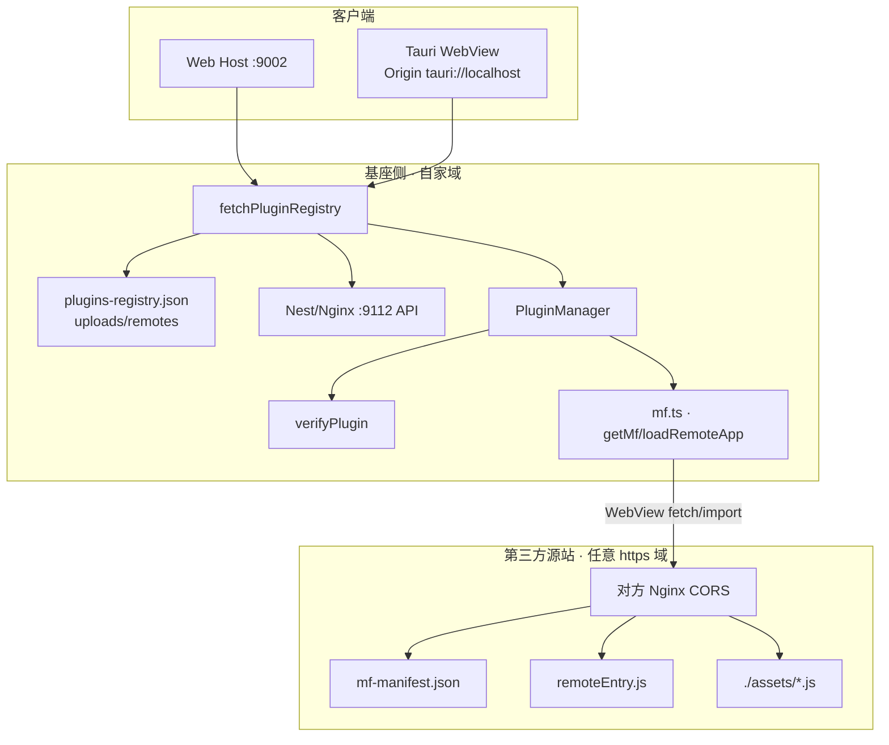
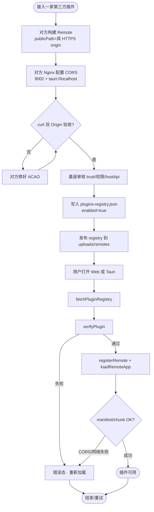
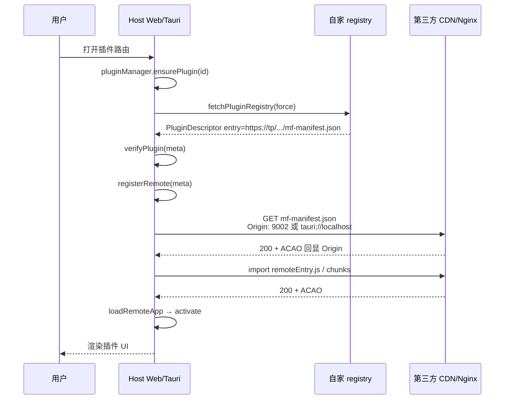
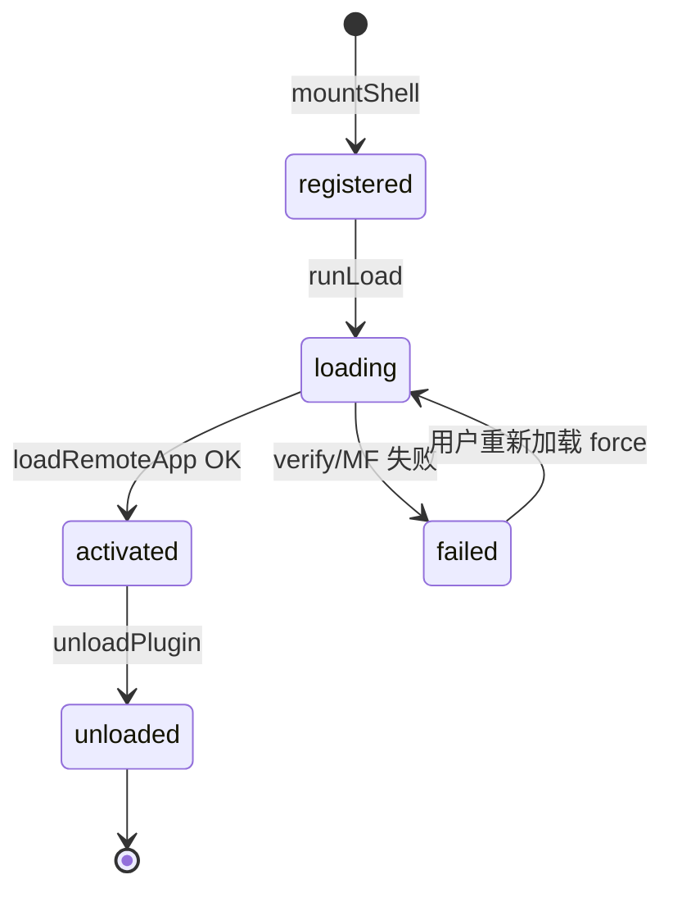

# 第三方 MF 插件接入配置 — 实现思路

> **状态**：规划（核心加载链路已上线；本文聚焦「接入者 / 基座维护者」配置契约）  
> **日期**：2026-07-20  
> **需求摘要**：任意 HTTPS 域名上的第三方 Module Federation（MF）插件，在对方开好 CORS 后，仅通过更新自家 registry 即可被 Web 与 Tauri 桌面加载，**不必**改 Tauri `capabilities` allow URL、**不必**为每家插件发桌面版。

## 延伸阅读

- Host 运行时：[../plugins/模块联邦插件宿主.md](../../plugins/模块联邦插件宿主.md)
- Registry 静态分发：[../ops/远程注册静态.md](../../ops/远程注册静态.md)
- Nginx 片段：[../ops/Nginx配置.md](../../ops/Nginx配置.md)
- 自建学习笔记 Remote：[../english/学习笔记远程.md](../../english/学习笔记远程.md)
- 基座插件包 / CORS / **样式契约**：[../plugins/插件开发指南.md](../../plugins/插件开发指南.md)
- **主/子样式隔离**：[./模块联邦CSS隔离.md](./模块联邦CSS隔离.md)

---

## 0. 读本文你将得到什么

- **问题**：第三方插件不在 `dnhyxc.cn` 时，如何接入 Web + Tauri，且加插件不发桌面版。
- **一句话方案**：**MF 走 WebView 原生网络**；对方 Nginx 放行 Host Origin；你们只改 `plugins-registry.json`；`plugin-http` capabilities **只服务 API**，不加第三方域名。
- **两套角色清单**：§14 接入者 checklist、§15 基座维护者 checklist。
- **兜底**：对方无法开 CORS 时用 `/mf-proxy/<id>/`（改运维 Nginx，仍可不发 Host）。
- **最大风险**：对方 CORS 只配了 Web（9002）却漏了 `tauri://localhost` → 桌面 `#RUNTIME-003`。

---

## 1. 需求与边界

### 1.1 用户故事

| 角色         | 场景                       | 行为                            | 期望结果                                 |
| ------------ | -------------------------- | ------------------------------- | ---------------------------------------- |
| 第三方插件方 | 自有 CDN / 域名部署 Remote | 按契约配置 CORS 与 `publicPath` | Web + Tauri 均可拉 `mf-manifest` / chunk |
| 基座运维     | 审核通过一家插件           | 写入 registry `entry`           | 用户刷新即可用，不发桌面版               |
| 终端用户     | Web `:9002` 或 Tauri 壳    | 打开插件路由                    | 正常渲染；失败有可理解错误态             |

### 1.2 范围

| 在范围内                                                               | 不在范围内（非目标）                                |
| ---------------------------------------------------------------------- | --------------------------------------------------- |
| 受信第三方（`trust: first-party \| partner`）直连任意 `https://` entry | 不可信脚本进 MF shared（应用 `untrusted` + iframe） |
| 对方 CORS 契约与自测命令                                               | 开放代理（`proxy_pass $arg_url`）                   |
| Registry 字段与上架流程                                                | 插件商店 UI / 计费                                  |
| Tauri capabilities 与 MF 职责分离说明                                  | 自动替第三方改他们的 Nginx                          |
| 可选 `/mf-proxy` 兜底                                                  | 每个插件强制反代进自家域                            |

### 1.3 约束与依赖

- **平台**：Web（`https://dnhyxc.cn:9002`）、Tauri 2（WebView Origin = `tauri://localhost`）。
- **复用**：`PluginManager` / `registry.ts` / `mf.ts` / `PluginVerifier` / uploads `plugins-registry.json`。
- **安全**：生产 entry 须 HTTPS；准入以「写入自家 registry」为准（勿再维护逐域名 allowlist 驱动发版）。
- **Ponytail**：加插件 = 改 registry（+ 对方 CORS），不扩 capabilities、不发壳。

---

## 2. 方案总览（一句话 + 要点）

**一句话方案**：第三方在**自己的**源站对 Host Origin 开 CORS；Host 用 WebView 原生加载 MF；registry 上架即放行；Tauri `plugin-http` 白名单只覆盖自家 API。

| #   | 设计要点                                   | 理由                                                                       |
| --- | ------------------------------------------ | -------------------------------------------------------------------------- |
| 1   | MF **不走** `@tauri-apps/plugin-http`      | capabilities 编译进包，无法运行时加未知域名；WebView + CORS 可跨任意 HTTPS |
| 2   | 对方必须放行 **两个** Origin               | Web 与 Tauri Origin 不同；只配 9002 时桌面必挂                             |
| 3   | 准入 = registry 上架                       | 避免 `VITE_*_PLUGIN_ENTRY_ORIGINS` / allow URL 每家改一次                  |
| 4   | `/mf-proxy` 仅兜底                         | 对方无法改 CORS 时，用运维反代换「不发 Host」                              |
| 5   | `publicPath` 必须指向对方真实可访问 origin | 否则 chunk 404 / 跨域错乱                                                  |
| 6   | **样式**：`partner` 须 scoped（无 Preflight）；不遵守 → `untrusted` + `iframeUrl` | 见 [模块联邦CSS隔离.md](./模块联邦CSS隔离.md) |

---

## 3. 现状与复用

| 能力             | 仓库中已有                                                 | 本需求中的用法                                                          |
| ---------------- | ---------------------------------------------------------- | ----------------------------------------------------------------------- |
| Registry 拉取    | `apps/frontend/src/plugins/registry.ts`                    | Web：`/remotes/...`；Tauri：`{API}/upload/remotes/...`                  |
| 校验             | `apps/frontend/src/plugins/PluginVerifier.ts`              | `entryUrlAllowed`：生产 https；开发 localhost http                      |
| MF Runtime       | `apps/frontend/src/plugins/mf.ts`                          | WebView `registerRemotes` + `loadRemote`，无 plugin-http                |
| 编排             | `apps/frontend/src/plugins/PluginManager.ts`               | `init` / `ensurePlugin` → verify → register → load                      |
| 清单数据         | `apps/backend/uploads/remotes/plugins-registry.json`       | 上架第三方时改 `entry` / `trust` / `enabled`                            |
| Tauri HTTP 范围  | `apps/frontend/src-tauri/capabilities/default.json`        | **仅** API/COS/GitHub 等；**不加**第三方插件域                          |
| 自建 Remote 示例 | `apps/remote-plugins/`                                | CORS / `VITE_REMOTE_PUBLIC_ORIGIN` 参考（含 LearningNotes / IdeasList） |
| Nginx 文档       | `docs/ops/Nginx配置.md`、`docs/ops/远程注册静态.md` | `$mf_cors_origin` map；可选 `/mf-proxy`                                 |

**调研结论**：加载链路已具备「任意 HTTPS + 对方 CORS」条件；本文把角色职责、配置模板与验收命令写死，避免再误走「每家加 capabilities」或「每家反代」。

---

## 4. 架构图



**图内方法说明**：

| 方法 / 模块入口                             | 功能                                                                                        |
| ------------------------------------------- | ------------------------------------------------------------------------------------------- |
| `fetchPluginRegistry(opts?)`                | 拉取并缓存插件清单；Web 用同源 `/remotes/...`，Tauri 用 API 备用口；失败可回落 localStorage |
| `pluginManager.init()` / `ensurePlugin(id)` | 上架启用项挂壳并触发加载；失败写入 `status: failed` 供 UI 重试                              |
| `verifyPlugin(d)`                           | `untrusted`：必填并校验 `iframeUrl`；其余：校验 entry / hostApi / 可选 integrity           |
| `entryUrlAllowed(entry)`                    | 生产仅 https；开发额外允许 localhost/127.0.0.1 的 http                                      |
| `registerRemote(d)`                         | 向 MF Runtime 注册 `name` + `entry` + `type: 'module'`                                      |
| `loadRemoteApp(d)`                          | `loadRemote(\`${id}/App\`)`，要求 default 导出组件                                          |
| `getMf()`                                   | 复用 Vite federation 默认实例或 `createInstance({ name: 'host' })`                          |

**读图要点**：

- 第三方流量 **不经过** Tauri `plugin-http` allow 列表，只碰对方 CORS。
- 基座侧「改配置」常态只动 registry（及对方源站）；capabilities 保持静态。
- 自建 9008（remotePlugins）与外部 CDN 在架构上等价：都是「HTTPS Remote + CORS」。

---

## 5. 主流程图



**图内方法说明**：

| 方法                  | 功能                                                                      |
| --------------------- | ------------------------------------------------------------------------- |
| `fetchPluginRegistry` | 取最新启用列表；`force: true` 时绕过短缓存意图仍受 HTTP/localStorage 影响 |
| `verifyPlugin`        | 上架后运行时闸门：trust / URL / hostApiRange / integrity                  |
| `registerRemote`      | 把 registry 的 `entry` 交给 MF Runtime                                    |
| `loadRemoteApp`       | 拉 manifest → remoteEntry → expose `./App`                                |

**读图要点**：

- **对方改 Nginx** 在「写入 registry」之前完成；基座不替对方改站。
- 桌面失败优先查 `Origin tauri://localhost is not allowed`，不是再加 capabilities。
- 成功标准：双端加载同一 `https://对方域/.../mf-manifest.json`。

---

## 6. 核心时序图



**图内方法说明**：

| 方法                   | 功能                                                  |
| ---------------------- | ----------------------------------------------------- |
| `ensurePlugin(id)`     | 查缓存/inflight；拉 registry；挂壳；调用 `loadPlugin` |
| `fetchPluginRegistry`  | 获取含第三方 `entry` 的清单                           |
| `verifyPlugin(meta)`   | 运行时准入                                            |
| `registerRemote(meta)` | 注册 MF remote                                        |
| `loadRemoteApp(meta)`  | Runtime 拉 manifest 与模块图并返回 `PluginModule`     |
| `mod.activate?(api)`   | 可选生命周期；注入 HostBridge API                     |

**读图要点**：

- 请求第三方时带的 Origin **不是** `dnhyxc.cn:9112`，而是页面/壳 Origin。
- Registry 永远在自家域；第三方只服务 MF 静态资源。
- 任一步 ACAO 不匹配 → Safari/WKWebView 报 `Load failed` / RUNTIME-003。

---

## 7. 状态机（插件加载态）



**图内方法说明**：

| 方法               | 功能                                      |
| ------------------ | ----------------------------------------- |
| `mountShell(meta)` | 按需 `injectRoute` / 侧栏项               |
| `runLoad(meta)`    | verify → register → loadRemote → activate |
| `unloadPlugin(id)` | deactivate、清事件/路由/侧栏              |

---

## 8. 模块职责与接口草图

### 8.1 模块一览

| 模块                | 职责                    | 新增/改动               | 路径                                                 |
| ------------------- | ----------------------- | ----------------------- | ---------------------------------------------------- |
| Registry 数据       | 上架第三方 entry        | **扩展**（运维改 JSON） | `apps/backend/uploads/remotes/plugins-registry.json` |
| `registry.ts`       | 拉清单                  | 已有                    | `apps/frontend/src/plugins/registry.ts`              |
| `PluginVerifier.ts` | https / trust / hostApi | 已有（registry 准入）   | `apps/frontend/src/plugins/PluginVerifier.ts`        |
| `mf.ts`             | WebView MF              | 已有                    | `apps/frontend/src/plugins/mf.ts`                    |
| capabilities        | 仅 API                  | 已有（不加第三方域）    | `apps/frontend/src-tauri/capabilities/default.json`  |
| 对方 Nginx          | CORS                    | **对方新增**            | 对方仓库/运维                                        |
| `/mf-proxy`         | 兜底反代                | 可选运维                | `docs/ops/Nginx配置.md`                                  |

### 8.2 Registry 字段（接入时必填）

```typescript
// 草图：第三方上架最小集
type ThirdPartyPluginRow = {
	id: string;
	routePath: string;
	entry: string; // partner：https://对方域/.../mf-manifest.json
	version: string;
	hostApiRange: string; // 如 ^1.0.0
	enabled: true;
	trust: "partner" | "first-party" | "untrusted";
	/** untrusted 必填：独立页，Host iframe 打开，不 loadRemote */
	iframeUrl?: string;
	injectRoute?: boolean; // 业务内嵌页常用 false
	permissions: string[];
	preload?: "eager" | "route" | "idle";
};
```

**样式**：Host 侧自动 `@scope` 隔离，`partner` / `first-party` 无需手动 scoped（子项目零侵入），详见 [样式隔离实现.md](../../style/样式隔离实现.md)。无法保证样式安全 → `trust: untrusted` + `iframeUrl`。

### 8.3 Host Origin 常量（契约）

| 客户端       | Origin（请求第三方时）                              |
| ------------ | --------------------------------------------------- |
| Web 生产     | `https://dnhyxc.cn:9002`                            |
| Tauri 2 生产 | `tauri://localhost`                                 |
| 可选兼容     | `http://tauri.localhost`、`https://tauri.localhost` |

---

## 9. 分阶段实现步骤

| 阶段 | 目标             | 交付物                     | 依赖                    |
| ---- | ---------------- | -------------------------- | ----------------------- |
| M1   | 契约与文档       | 本文 + 对方 CORS 模板      | —                       |
| M2   | 首家第三方试点   | registry 一条 + 双端验收   | M1、对方 CORS           |
| M3   | 兜底反代（可选） | `/mf-proxy/<id>/` 运维手册 | M2 中无法开 CORS 的个案 |
| M4   | 硬化             | integrity/签名流水线       | M2                      |

### M1

- [ ] 向第三方发送 Origin 表与 curl 验收命令（§14）
- [ ] 基座确认 capabilities **不含**第三方域（§15）

### M2

- [ ] 对方 `publicPath` / `VITE_REMOTE_PUBLIC_ORIGIN` = 其 HTTPS 根
- [ ] 对方 Nginx `$map` + OPTIONS + GET `always`
- [ ] curl 双 Origin 通过
- [ ] 写入 registry 并发布 `uploads/remotes`
- [ ] Web + Tauri 打开路由验收

### M3（仅必要时）

- [ ] 9112 增加固定 upstream `/mf-proxy/<id>/` + `sub_filter`
- [ ] registry `entry` 改为代理 URL

### M4

- [ ] 上架流程要求 `integrity`（可选强制）
- [ ] 签名钩子从 `signature === 'invalid'` 演进为验签

---

## 10. 关键决策与备选方案

| 决策                 | 选用                | 备选                               | 为何不选备选                   |
| -------------------- | ------------------- | ---------------------------------- | ------------------------------ |
| 第三方域名如何进桌面 | WebView + 对方 CORS | capabilities 逐域 allow            | 每家发版，违背「加插件不发壳」 |
| 准入控制             | registry 上架       | `VITE_*_PLUGIN_ENTRY_ORIGINS` 穷举 | 与发版绑定，难热更             |
| 对方无法 CORS        | 可选 `/mf-proxy`    | `https://*:*` 放开 plugin-http     | 桌面 SSRF/任意外连面过大       |
| MF fetch             | 原生 WebView        | plugin-http 拉 manifest            | 又逼 capabilities 列第三方域   |

---

## 11. 风险、边界与待确认

| 项                           | 等级 | 说明               | 缓解                         |
| ---------------------------- | ---- | ------------------ | ---------------------------- |
| 漏配 `tauri://localhost`     | 高   | 仅 Web 正常        | 接入验收强制双 curl          |
| `publicPath` 仍指向旧域/http | 高   | chunk 打错域       | 构建 env 与 curl 看 manifest |
| registry 被篡改              | 中   | 任意 https 可进 MF | 仅运维可写 uploads；后续签名 |
| `untrusted` 误上架为 partner | 高   | 共享 React 上下文  | 审核 checklist + trust 字段  |
| Nginx `if` 丢掉 ACAO         | 中   | GET 无 CORS 头     | `always` + OPTIONS 内重写头  |

**待确认**：

- [ ] 生产 registry 最终以哪台机 `uploads/remotes` 为准（验证：`curl` 9112/9002 `/remotes/plugins-registry.json`）
- [ ] 第三方是否允许 `ACAO: *`（无 cookie 时可简化）

---

## 12. 验收清单

| #   | 用例              | 步骤                                                 | 期望                                            |
| --- | ----------------- | ---------------------------------------------------- | ----------------------------------------------- |
| AC1 | 对方 CORS · Web   | `curl -sI ENTRY -H 'Origin: https://dnhyxc.cn:9002'` | ACAO 为该 Origin 或 `*`                         |
| AC2 | 对方 CORS · Tauri | 同上，`Origin: tauri://localhost`                    | ACAO 为该 Origin 或 `*`                         |
| AC3 | Registry          | 生产 JSON 含该插件 `enabled: true`、`entry` 为 https | curl 自家 `/remotes/plugins-registry.json` 可见 |
| AC4 | Web 加载          | 浏览器打开 Host 插件路由                             | 无 CORS / RUNTIME-003；UI 正常                  |
| AC5 | Tauri 加载        | 桌面打开同一路由                                     | 同上；**不**要求改 capabilities                 |
| AC6 | 加第二家插件      | 只改对方 CORS + registry                             | **无** desktop 发版、**无** allow URL 变更      |

---

## 13. 预估改动面（实现阶段参考）

| 类型           | 路径（预估）                                                         |
| -------------- | -------------------------------------------------------------------- |
| 运维数据       | `apps/backend/uploads/remotes/plugins-registry.json`（或线上同路径） |
| 对方运维       | 对方 Nginx / CDN CORS                                                |
| 前端（已具备） | `apps/frontend/src/plugins/*`                                        |
| 可选 Nginx     | `docs/ops/Nginx配置.md` 中 `/mf-proxy/<id>/`                             |
| 文档           | 本文；落地后可沉淀到 `docs/ops/` 或 `docs/app/` 正式专题             |

---

## 14. 第三方接入者配置手册（复制即用）

### 14.1 构建

- Remote `name` 与 registry `id` **一致**。
- 暴露 `./App`（Host `loadRemote('${id}/App')`）。
- 生产 `publicPath` / `base` = **你们站点的 HTTPS 根**（例：`https://cdn.partner.com/`），不要写成 Host 的 9002。
- React / react-dom 与 Host 对齐 singleton（参见 `apps/remote-plugins/vite.config.ts`）。

### 14.2 Nginx CORS（推荐 map）

```nginx
map $http_origin $dnhyxc_mf_cors {
  default "";
  "https://dnhyxc.cn:9002"  $http_origin;
  "tauri://localhost"       $http_origin;
  "http://tauri.localhost"  $http_origin;
  "https://tauri.localhost" $http_origin;
}

server {
  # listen / ssl / root … 按你们环境

  add_header Access-Control-Allow-Origin $dnhyxc_mf_cors always;
  add_header Access-Control-Allow-Methods "GET, HEAD, OPTIONS" always;
  add_header Access-Control-Allow-Headers "Content-Type, Range" always;
  add_header Cross-Origin-Resource-Policy "cross-origin" always;
  add_header Vary "Origin" always;

  location / {
    if ($request_method = OPTIONS) {
      add_header Access-Control-Allow-Origin $dnhyxc_mf_cors;
      add_header Access-Control-Allow-Methods "GET, HEAD, OPTIONS";
      add_header Access-Control-Allow-Headers "Content-Type, Range";
      add_header Access-Control-Max-Age 86400;
      add_header Content-Length 0;
      add_header Vary "Origin";
      return 204;
    }
    # root / try_files =404 …
  }
}
```

无 cookie 的纯静态也可：`Access-Control-Allow-Origin: *`。

### 14.3 自测（必须两条都过）

```bash
ENTRY=https://cdn.partner.com/mf-manifest.json

curl -sI "$ENTRY" -H "Origin: https://dnhyxc.cn:9002" \
  | grep -i access-control-allow-origin

curl -sI "$ENTRY" -H "Origin: tauri://localhost" \
  | grep -i access-control-allow-origin

# 抽查 publicPath
curl -s "$ENTRY" | head -c 400
```

### 14.4 交给基座的材料

| 项                         | 示例                                       |
| -------------------------- | ------------------------------------------ |
| plugin `id`                | `partnerNotes`                             |
| `entry`                    | `https://cdn.partner.com/mf-manifest.json` |
| `version` / `hostApiRange` | `1.0.0` / `^1.0.0`                         |
| 建议 `routePath`           | 与产品约定                                 |
| `trust` 申请               | `partner`（Host 自动隔离，零侵入）或 `untrusted` + `iframeUrl` |
| CORS 自测截图或 curl 输出  | AC1/AC2                                    |
| 样式契约确认               | Host 侧 `@scope` 自动隔离，子项目无需特殊配置（partner） |

---

## 15. 基座维护者配置手册

### 15.1 常态：加插件 **只做这些**

1. 收齐 §14.4 材料，确认双 curl 通过；确认样式契约或改为 untrusted+iframeUrl。
2. 编辑生产 `plugins-registry.json`（磁盘：`uploads/remotes/`，经 `/remotes/` 或 `/api/upload/remotes/` 对外）。
3. 示例条目（partner / MF）：

```json
{
	"id": "partnerNotes",
	"titleKey": "route.partner.notes.title",
	"routePath": "/partner/notes",
	"entry": "https://cdn.partner.com/mf-manifest.json",
	"version": "1.0.0",
	"hostApiRange": "^1.0.0",
	"injectRoute": true,
	"permissions": ["ui:toast"],
	"preload": "eager",
	"enabled": true,
	"trust": "partner"
}
```

4. 发布 registry（短缓存约 60s；桌面/Web 可能还有 localStorage 缓存，必要时强制刷新或清键）。
5. **不要**改 `capabilities/default.json` 为对方域名。
6. **不要**发桌面版（除非 Host 契约 `HOST_API_VERSION` 破坏性变更）。

### 15.2 明确 **不要** 做的事

| 错误做法                                 | 后果                     |
| ---------------------------------------- | ------------------------ |
| 每家第三方加 `http:default` allow URL    | 被迫发桌面版             |
| 把 MF 改回 plugin-http 拉对方域名        | 又回到 capabilities 地狱 |
| 只测 Web 不测 Tauri                      | 上线后桌面 RUNTIME-003   |
| registry `entry` 仍写 `http://` 生产地址 | `entryUrlAllowed` 拒绝   |
| 对不可信插件设 `trust: partner`          | 共享 React 上下文风险    |

### 15.3 职责对照

| 配置项                      | 谁改     | 频率                              |
| --------------------------- | -------- | --------------------------------- |
| 对方 CORS                   | 第三方   | 接入时一次（Origin 表变更时再改） |
| `plugins-registry.json`     | 基座运维 | 每上架/下架/改 entry              |
| `capabilities/default.json` | 基座     | **几乎不变**（仅 API/COS 等）     |
| Host 桌面包                 | 基座     | 仅 Host 功能/契约变更             |
| `/mf-proxy/<id>/`           | 基座运维 | **仅**对方无法 CORS 时            |

### 15.4 故障速查

| 现象                                          | 先查                                               |
| --------------------------------------------- | -------------------------------------------------- |
| `Origin tauri://localhost is not allowed`     | 对方 ACAO，不是 capabilities                       |
| `registry not JSON` / HTML                    | 自家 `/remotes` 或 Tauri API 路径                  |
| `Module name './assets/...' does not resolve` | 勿用 blob 加载 remoteEntry；检查 publicPath        |
| `origin not allowlisted`（旧包）              | 升级含 `entryUrlAllowed` 的 Host；或清旧白名单逻辑 |
| Web 好桌面不好                                | 99% 漏了 `tauri://localhost`                       |

### 15.5 兜底：`/mf-proxy`（对方无法开 CORS）

- 在 **9112** 为该插件增加 **固定 upstream** location（禁止开放代理）。
- `sub_filter` 把上游绝对 URL 改写到 `https://dnhyxc.cn:9112/mf-proxy/<id>/`。
- registry `entry` 改为代理后的 manifest URL。
- 详见 [../ops/Nginx配置.md](../../ops/Nginx配置.md)。
- 此路径改的是 **运维 Nginx**，仍可不发桌面版。

---

## 16. 自建（first-party）与第三方对照

| 项             | 自建（如 :9008）             | 第三方 CDN           |
| -------------- | ---------------------------- | -------------------- |
| 域名           | `https://dnhyxc.cn:9008` 等  | `https://任意方.com` |
| CORS           | 你们 Nginx `$mf_cors_origin` | 对方 Nginx 同等契约  |
| registry entry | 直连 9008 或日后统一代理     | 直连对方 https       |
| capabilities   | 不需要为 MF 加域             | 同样不需要           |
| 加插件是否发版 | 否（改 registry）            | 否（改 registry）    |

---

（本文档为规划态接入思路；运行时细节以 `apps/frontend/src/plugins/*` 与线上 Nginx/registry 为准。）
