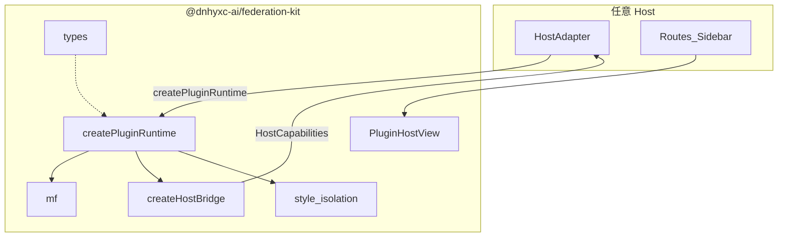
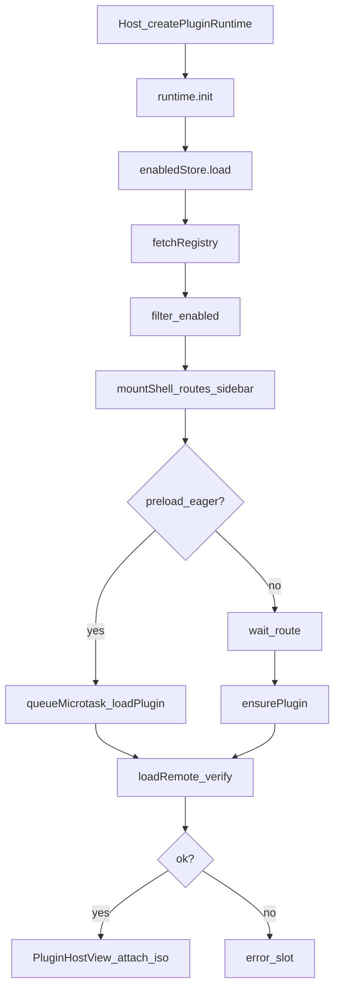
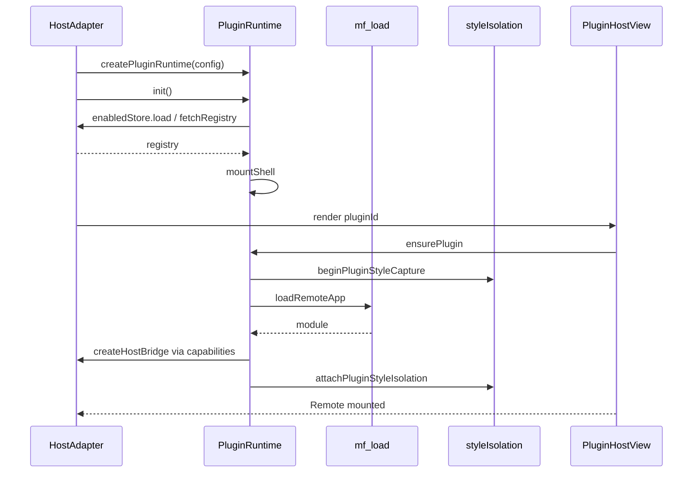

# 微前端通用包 federation-kit — 实现思路

> **状态**：已落地（`packages/federation-kit` + 本仓薄适配 `apps/frontend/src/federation`；原 `plugins/` 已移除）  
> **日期**：2026-08-10  
> **需求摘要**：将 Host 内微前端抽成可在任意项目接入的 `@dnhyxc-ai/federation-kit`，主项目用 slots 接 UI，仅保留产品适配层。

## 延伸阅读

- [模块联邦样式隔离实现.md](./模块联邦样式隔离实现.md)
- [docs/app/样式隔离分层重构.md](../../style/样式隔离分层重构.md)
- [apps/frontend/src/plugins/docs/模块联邦实现指南.md](../../plugins/模块联邦实现指南.md)

---

## 0. 读本文你将得到什么

- 为何不能整目录搬家，以及通用/宿主边界怎么切
- `@dnhyxc-ai/federation-kit` 的分层、exports 与 `createPluginRuntime` DI 契约
- 本仓适配层保留 ebook / COS / design / 用户偏好的原因
- M0→M5 分阶段迁移与验收清单
- 任意 React Host 的最小接入示例

---

## 1. 需求与边界

### 1.1 用户故事

| 角色 | 场景 | 行为 | 期望结果 |
|------|------|------|----------|
| Host 开发者 | 新项目要接 MF 插件 | `pnpm add @dnhyxc-ai/federation-kit` + 实现 config | 无需复制本仓 plugins 目录 |
| 本仓维护者 | 继续跑现有插件中心/ebook surface | 仍从 `@/plugins` import | API 与行为不变 |
| Remote 开发者 | 发 React/Vue 插件 | 按既有 registry 契约 | 协议不变（`mf-iso:3` / permissions） |

### 1.2 范围

| 在范围内 | 不在范围内 |
|----------|------------|
| runtime / mf / bridge 工厂 / style-isolation / 泛型 inject | ebook 业务 API、COS 上传、Tauri 全屏实现 |
| `createPluginRuntime` + HostCapabilities DI | 第二套 MF 协议 |
| React `PluginHostView`（slots） | 绑定本仓 design 系统 |
| 本仓兼容 barrel | 强制 Vue Host |

### 1.3 约束

- peer：`react` / `react-dom` / `@module-federation/enhanced`
- 包内禁止 `@/` 与业务 `surface` 字面量硬编码
- 对外 `@/plugins` 符号保持稳定

---

## 2. 方案总览

**一句话方案**：抽出「通用运行时内核 + Host 能力注入」；本仓用 adapter 注入 Toast/http/i18n/ebook/COS/偏好，再 re-export 原 barrel。

| # | 设计要点 | 理由 |
|---|----------|------|
| 1 | 单入口 `createPluginRuntime(config)` | 避免多层 IoC |
| 2 | `capabilities` / `fetchRegistry` / `enabledStore` 注入 | 去掉 Vite/COS/store 硬编码 |
| 3 | `surface` / permissions 开放字符串 | 任意业务域可扩展 |
| 4 | style-isolation 独立子路径 | 可单独复用 |
| 5 | 兼容 barrel | 迁移期零碎 import |

---

## 3. 现状与复用

| 能力 | 仓库中已有 | 本需求中的用法 |
|------|------------|----------------|
| style-isolation 分层 | `apps/frontend/src/plugins/style-isolation/` | 迁入 kit，theme 名单改 config |
| MF load/register | `plugins/core/mf/` | 迁入；shared 仍 react 单例 |
| HostBridge | `createHostBridge.ts` | 改为 capabilities 工厂；业务留 adapter |
| PluginManager | `PluginManager.ts` | DI 版；Route 泛型化 |
| 包形态 | `packages/markdown-kit` | 对齐 tsup + `./react` exports |

**调研结论**：约一半代码已通用；耦合集中在 bridge / registry / prefs / Host UI。先迁 isolation 与纯逻辑，再上 DI runtime。

---

## 4. 架构图



**图内方法说明**：

| 方法 / 节点 | 做什么 | 输入 / 输出要点 |
|-------------|--------|-----------------|
| `createPluginRuntime` | 组装 Manager / injectors / bridge 工厂 | `PluginHostConfig` → `PluginRuntime` |
| `mf` `registerRemote` / `loadRemoteApp` | MF 注册与加载 | entry/bust → Remote module |
| `createHostBridge` | 按 permissions ∩ capabilities 密封 API | descriptor + caps → `HostBridgeProps` |
| `style_isolation` | 选择器前缀 + CSSOM + Portal | realm 键 / DOM 容器 |
| `PluginHostView` | 挂载 Remote / iframe | `pluginId` + slots |
| `HostAdapter` | 本仓 Toast/COS/ebook 等 | 实现 config 回调 |

**读图要点**：kit 不依赖产品；Host 只实现 config；UI 可选走 `/react`。

---

## 5. 主流程图



**图内方法说明**：

| 方法 | 做什么 | 输入 / 输出 |
|------|--------|-------------|
| `runtime.init` | 拉偏好 + registry，挂壳 | void |
| `enabledStore.load` | 宿主持久化偏好 | 可选 Promise |
| `fetchRegistry` | 宿主提供的 registry I/O | → `PluginRegistry` |
| `mountShell` | 注入路由/侧栏 | descriptor |
| `loadPlugin` / `ensurePlugin` | verify + loadRemote | pluginId |
| `PluginHostView` | 渲染 + style isolation | loaded plugin |

---

## 6. 时序图



**图内方法说明**：

| 方法 | 做什么 |
|------|--------|
| `createPluginRuntime` | 绑定 config |
| `init` | 壳层就绪 |
| `ensurePlugin` | 懒加载入口 |
| `beginPluginStyleCapture` / `attachPluginStyleIsolation` | 隔离窗口 |
| `createHostBridge` | 权限化 API（回调 Host） |

---

## 7. 模块职责

| 模块 | 职责 | 新建/迁入 |
|------|------|-----------|
| `packages/federation-kit` | 通用内核 | 新建 |
| `./style-isolation` | CSS/Portal 隔离 | 迁入 |
| `./react` | HostView / hooks / Vue 桥 | 迁入+slots |
| `apps/frontend/src/plugins` | ebook/COS/prefs/UI 适配 + 兼容导出 | 变薄 |

---

## 8. 分阶段

| 阶段 | 内容 | 验收 |
|------|------|------|
| M0 | 本文 + ideas 索引 | 可评审 |
| M1 | 包骨架 + style-isolation | smoke 绿 |
| M2 | types/mf/EventBus/verifier/vue | Remote 可加载 |
| M3 | createPluginRuntime + adapter | init/开关/registry 一致 |
| M4 | PluginHostView + 本仓壳 | iframe/ebook/iso |
| M5 | 删重复 + README/docs | 兼容无回退 |

---

## 9. 任意项目接入

```ts
import { createPluginRuntime } from '@dnhyxc-ai/federation-kit';
import { PluginHostView } from '@dnhyxc-ai/federation-kit/react';

const runtime = createPluginRuntime({
  hostApiVersion: '1.0.0',
  fetchRegistry: async () => (await fetch('/plugins-registry.json')).json(),
  capabilities: {
    getTheme: () => 'light',
    getLocale: () => 'zh-CN',
    navigate: (to) => history.pushState({}, '', to),
  },
});
await runtime.init();
```

---

## 10. 风险

| 风险 | 对策 |
|------|------|
| import 大爆炸 | `@/plugins` 兼容 barrel |
| theme 名单漂移 | adapter 显式传入本仓 token |
| DI 过度 | 仅一个 `PluginHostConfig` |
