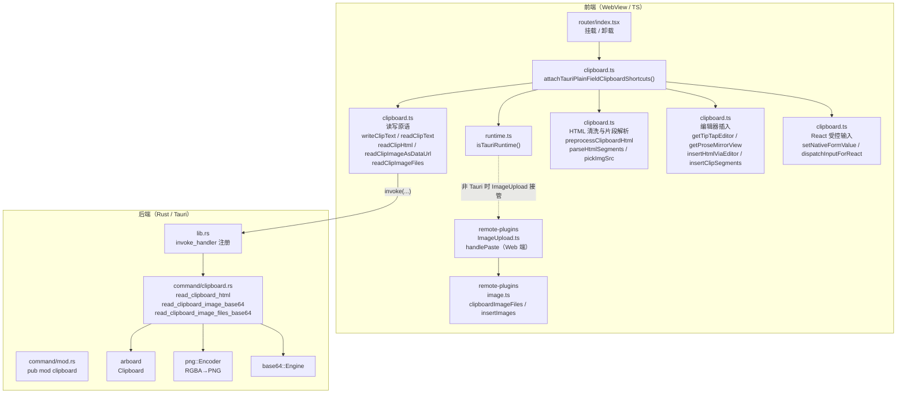
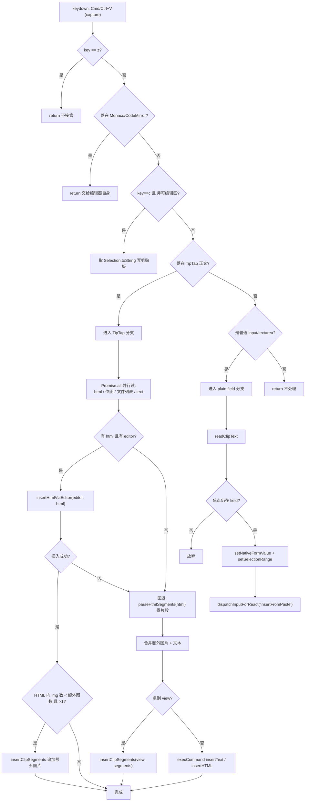
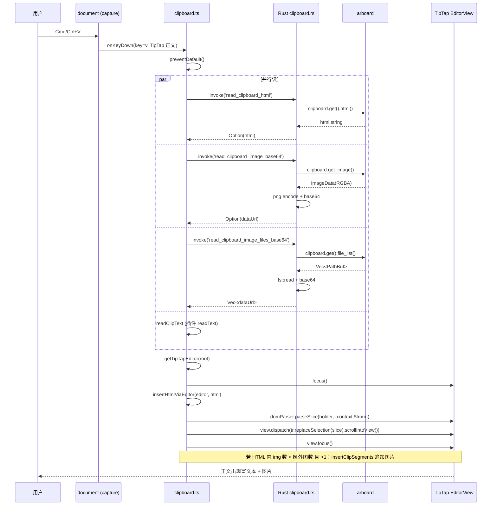

# Tauri 桌面端剪贴板（文本 / 图文混合 / 图片 / 文件列表）— 实现思路

> **状态**：核心能力已上线 | **日期**：2026-07-30 | **需求摘要**：在 Tauri WebView 中接管 Cmd/Ctrl+C/V/X/A，让普通 input/textarea、TipTap 富文本正文都能正确复制、粘贴纯文本、富文本 HTML 与图片（含截图、多图文件）。

## 0. 读本文你将得到什么

- 一套**可照抄到任何 Tauri + TipTap 项目**的剪贴板实现：前端 TS + Rust 后端 + Tauri 命令注册 + 权限配置。
- 每一段代码都带**逐行中文注释**，并解释「为什么这么写、不这么写会怎样」。
- 三张 Mermaid 图（架构 / 粘贴主流程 / 跨模块时序）把端到端链路讲清楚。
- 一个「图文混合粘贴」「截图单独粘贴」「Finder 多图复制」三类场景的统一处理模型。

## 1. 一句话方案

> Tauri WebView 的系统级 Cmd+C/V 经常到不了 ProseMirror / 普通 input，所以在 `document` 捕获阶段全局拦截这组快捷键；粘贴时**并行**读取「HTML / 位图 / 文件列表 / 纯文本」四种 flavor，有 HTML 就走 TipTap `parseSlice` 整段插入（对齐 web 原生行为），没有 HTML 就回退到「文本 + 图片片段」按序插入；图片读取用自定义 Rust 命令（`arboard`）绕开 Tauri 插件的 canvas 转换问题。

## 2. 背景：为什么 Tauri 下粘贴会失效

1. Tauri 把 Web 前端跑在系统 WebView（macOS WKWebView / Windows WebView2）里，`paste` 事件和 `execCommand` 在 contenteditable 上经常**不被分发**或**不触发 ProseMirror 的 transaction**。
2. `navigator.clipboard.read()` 在非 HTTPS、非用户手势、或 WebView 安全策略下会 reject；`navigator.clipboard.readText()` 也未必能拿到。
3. Tauri 官方 `@tauri-apps/plugin-clipboard-manager` 的 `readImage()` 返回 `Image` 对象，前端要再走 canvas 转 data URL，部分平台存在**色彩/尺寸异常**；而且它**读不到 HTML flavor**，图文混合粘贴时图片 URL 会丢。
4. 富文本应用（浏览器、Word、Notion）复制时剪贴板里是 `public.html`（macOS）/ `HTML Format`（Windows），内含 ``；截图则是**独立位图** flavor；从 Finder 选中多个图片文件复制则是**文件列表** flavor。三者互斥又可能并存，必须分别读、再合并。

因此方案必须满足：① 显式接管快捷键；② 用 Rust 直读系统剪贴板的 HTML / 位图 / 文件列表；③ 在 TS 侧清洗、合并、按 DOM 顺序插入。

## 3. 现状与复用

| 能力 | 已有位置 | 本需求用法 |
| ---- | ---- | ---- |
| Tauri 运行时判定 | `apps/frontend/src/utils/runtime.ts` `isTauriRuntime()` | 所有剪贴板分支的入口闸门 |
| Tauri 剪贴板插件 | `@tauri-apps/plugin-clipboard-manager`（`Cargo.toml` 已引入） | 纯文本 `readText/writeText`、图片 `writeImage` |
| Rust 剪贴板库 | `arboard`（`Cargo.toml` 已引入） | 读 HTML flavor / 位图 / 文件列表，绕开插件限制 |
| PNG 编码 | `png` crate（`Cargo.toml` 已引入） | 位图 RGBA → PNG → base64 data URL |
| base64 | `base64` crate | PNG / 文件 bytes → data URL |
| TipTap 编辑器视图 | `apps/remote-plugins/.../RichEditor`（富文本笔记编辑器） | 粘贴落点；`editor.view` / `pmViewDesc.view` 拿 EditorView |
| TipTap 原生粘贴扩展 | `apps/remote-plugins/.../RichEditor/image/ImageUpload.ts` | Web 端 `handlePaste` 走 `clipboardData`，桌面端由全局快捷键接管 |
| 全局快捷键挂载点 | `apps/frontend/src/router/index.tsx` `App` 组件 `useEffect` | 应用启动挂载，卸载时 detach |
| 权限清单 | `apps/frontend/src-tauri/capabilities/default.json` | 已开 `clipboard-manager` 的 read/write 系列 |

> 延伸阅读：早期「仅纯文本粘贴」版本见 [english/Tauri剪贴板富文本.md](../../english/Tauri剪贴板富文本.md)（改动前后对比）；Monaco/CodeMirror 绕过逻辑见 [monaco/剪贴板全局处理绕过.md](../../monaco/剪贴板全局处理绕过.md)。本文是当前**完整图文方案**的总文档。

## 4. 架构图



### 图内方法说明

| 模块 | 方法 | 做什么 | 输入 / 输出要点 |
| ---- | ---- | ---- | ---- |
| runtime.ts | `isTauriRuntime()` | 判断是否在 Tauri WebView | 读 `window.__TAURI_INTERNALS__`；返回 `boolean` |
| clipboard.ts | `attachTauriPlainFieldClipboardShortcuts()` | 在 `document` 捕获阶段挂 `keydown`，接管 C/V/X/A | 无入参；返回卸载函数 |
| clipboard.ts | `writeClipText` / `readClipText` | 纯文本读写 | Tauri 走插件，Web 走 `navigator.clipboard`；返回 `Promise<string>` |
| clipboard.ts | `readClipHtml()` | 读系统剪贴板 HTML flavor | `invoke('read_clipboard_html')`；返回 `string \| null` |
| clipboard.ts | `readClipImageAsDataUrl()` | 读剪贴板位图 | `invoke('read_clipboard_image_base64')`；返回 data URL `\| null` |
| clipboard.ts | `readClipImageFiles()` | 读剪贴板文件列表中的图片 | `invoke('read_clipboard_image_files_base64')`；返回 `string[]` |
| clipboard.ts | `preprocessClipboardHtml()` | 清洗 HTML：去脚本、改写 img src、剥裸标签 | 入 HTML 字符串；出 innerHTML |
| clipboard.ts | `parseHtmlSegments()` | HTML → 文本/图片片段序列 | 入 HTML；出 `ClipSegment[]` |
| clipboard.ts | `getTipTapEditor()` / `getProseMirrorView()` | 从 DOM 向上取编辑器实例 / EditorView | 入 HTMLElement；出 editor/view 或 null |
| clipboard.ts | `insertHtmlViaEditor()` | 用 schema 的 `domParser.parseSlice` 整段插 HTML | 返回处理后的 HTML 或 null |
| clipboard.ts | `insertClipSegments()` | 文本/图片片段按序插入 | 入 view、segments |
| clipboard.ts | `setNativeFormValue()` / `dispatchInputForReact()` | 受控 input 改值需走原型 setter + 派发 input | 入 el、next、inputType |
| ImageUpload.ts | `handlePaste` | Web 端原生粘贴：纯图片阻断默认、图文混合让默认先落 | ProseMirror `Plugin` props |
| image.ts | `clipboardImageFiles()` / `insertImages()` | 从 ClipboardEvent 取图 / 逐张 `setImage` | event / editor+files |
| lib.rs | `invoke_handler!` | 把 Rust 命令暴露给前端 | 注册三个 clipboard 命令 |
| clipboard.rs | `read_clipboard_html` | `arboard` 读 HTML flavor | 返回 `Option<String>` |
| clipboard.rs | `read_clipboard_image_base64` | 位图 → PNG → base64 data URL | 返回 `Option<String>` |
| clipboard.rs | `read_clipboard_image_files_base64` | 文件列表逐个读图 → data URL | 返回 `Vec<String>` |

**读图要点**：前端分三层（原语 / 清洗 / 插入），后端只做「读系统剪贴板 + 编码」，前后端用 `invoke` 解耦。`isTauriRuntime()` 是唯一开关：Web 环境整套逻辑短路，回到 TipTap 原生 `handlePaste`（ImageUpload.ts）。

## 5. 粘贴主流程图



### 图内方法说明

| 方法 | 做什么 | 输入 / 输出要点 |
| ---- | ---- | ---- |
| `monacoOrCodeMirrorInEventPath` | 检测事件路径是否在代码编辑器 | 入 KeyboardEvent；出 boolean |
| `editableInEventPath` | 检测是否落在 input/textarea/contenteditable | 入 KeyboardEvent；出 boolean |
| `tipTapBodyInEventPath` | 检测 TipTap 正文 contenteditable | 入 KeyboardEvent；出 HTMLElement \| null |
| `isPlainTextField` | 判断是否普通 input/textarea | 入 EventTarget；出类型守卫 boolean |
| `readClipHtml` / `readClipImageAsDataUrl` / `readClipImageFiles` / `readClipText` | 并行读四种 flavor | 各自 Promise |
| `insertHtmlViaEditor` | schema parseSlice 整段插 HTML | 返回 HTML 或 null |
| `parseHtmlSegments` | HTML → 片段 | 返回 ClipSegment[] |
| `insertClipSegments` | 按序插入文本/图片 | 无返回 |
| `setNativeFormValue` / `dispatchInputForReact` | 受控输入同步 | 无返回 |

**读图要点**：粘贴链路是「优先 HTML 整段 → 失败回退片段 → 再失败回退 execCommand」三级降级；图片的「补差」逻辑（`htmlImageCount < extraImages.length && >1`）保证截图/多图场景下 HTML 里没有的图也能插进来。普通 input 走完全独立的分支，自己改 value 并派发 React input 事件。

## 6. 跨模块时序图（图文混合粘贴 Happy Path）



**读图要点**：四种 flavor **并行**读取（`Promise.all`）是性能关键——串行读会让用户感知到粘贴延迟。Rust 侧每个命令都用同一把 `CLIPBOARD_LOCK` 串行化 arboard 访问（arboard 非 Send），但四条 invoke 是四个独立命令调用，锁粒度足够细。最终落点统一是 `view.dispatch(tr)`，保证 ProseMirror 事务栈一致。

## 7. 数据流

```
系统剪贴板
  ├─ public.html / HTML Format / text/html  ─→ arboard.get().html()  ─→ read_clipboard_html      ─→ readClipHtml()
  ├─ 位图 (TIFF/PNG)                         ─→ arboard.get_image()    ─→ read_clipboard_image_base64 ─→ readClipImageAsDataUrl()
  ├─ 文件列表 (Finder 多选)                  ─→ arboard.get().file_list() ─→ read_clipboard_image_files_base64 ─→ readClipImageFiles()
  └─ text/plain                              ─→ plugin readText()       ─→ readClipText()

        ↓ Promise.all 合并

  html ?  ─是─→ preprocessClipboardHtml → insertHtmlViaEditor(parseSlice) ─→ view.dispatch
                                                              │
                                                              └─ 图片补差 ─→ insertClipSegments(图片)

  html ✗  ─→ parseHtmlSegments → 合并 extraImages + text ─→ insertClipSegments / execCommand

  普通 input ─→ readClipText → setNativeFormValue + dispatchInputForReact
```

## 8. 核心实现（完整源码 + 逐行注释）

> 本章每个代码块均标注来源文件。注释为讲解用，非仓库原注释的全部，但覆盖每一行业务逻辑。

### 8.1 运行时检测 — `apps/frontend/src/utils/runtime.ts`

为什么单独抽一个函数：剪贴板逻辑在 Web 和 Tauri 下走完全不同的分支，用一个稳定开关避免散落的 `if`。

```typescript
/**
 * 是否在 Tauri WebView（桌面壳）内运行。
 * 纯浏览器 / Vite dev 下为 false，可安全走 Web API 回退逻辑。
 */
export function isTauriRuntime(): boolean {
	// SSR / 非 window 环境直接判 false，避免访问 window 报错
	if (typeof window === 'undefined') {
		return false;
	}
	// Tauri 注入的全局标记：只有跑在桌面壳里才有这个内部对象
	return '__TAURI_INTERNALS__' in window;
}
```

**为什么这么写能实现功能**：Tauri 在 WebView 启动时会把 `window.__TAURI_INTERNALS__` 作为 IPC 桥注入，这是官方推荐的判定方式，比嗅探 UA 更稳。

### 8.2 Rust 后端命令 — `apps/frontend/src-tauri/src/command/clipboard.rs`

为什么不用 Tauri 插件而自己写：插件读不到 HTML flavor、读不到文件列表、位图转 canvas 有问题。`arboard` 是跨平台系统剪贴板库，能直读三种 flavor。

```rust
use std::io::Cursor;
use std::path::Path;
use std::sync::Mutex;
use base64::Engine as _;

/// 全局剪贴板锁。
/// arboard 的 Clipboard 不是 Send（内部持有平台句柄），
/// 跨 Tauri 命令线程访问必须串行化，否则会数据竞争 / 崩溃。
static CLIPBOARD_LOCK: Mutex<()> = Mutex::new(());

/// 读取剪贴板 HTML 内容（含  等富文本结构）。
/// 用于桌面端图文混合粘贴：前端拿到 HTML 后解析 img 标签插入编辑器。
/// macOS 下读 public.html flavor，Windows 下读 HTML Format，Linux 下读 text/html。
#[tauri::command]
pub fn read_clipboard_html() -> Result<Option<String>, String> {
	// 加锁：保护 arboard 的非 Send 内部状态
	let _guard = CLIPBOARD_LOCK.lock().map_err(|e| e.to_string())?;
	let mut clipboard = arboard::Clipboard::new().map_err(|e| e.to_string())?;
	// arboard 公共 API：get().html() 读 HTML flavor，无 HTML 时抛错，返回 None
	match clipboard.get().html() {
		Ok(html) if !html.is_empty() => Ok(Some(html)),
		Ok(_) => Ok(None),
		Err(_) => Ok(None),
	}
}

/// 读取剪贴板图片位图，编码为 PNG 并返回 base64 字符串（含 data URL 前缀）。
/// 用于单独复制图片/截图场景：arboard 读 ImageData → png crate 编码 → base64。
/// 剪贴板无图片时 readImage 抛错，返回 None。
#[tauri::command]
pub fn read_clipboard_image_base64() -> Result<Option<String>, String> {
	let _guard = CLIPBOARD_LOCK.lock().map_err(|e| e.to_string())?;
	let mut clipboard = arboard::Clipboard::new().map_err(|e| e.to_string())?;
	let img = match clipboard.get_image() {
		Ok(img) => img,
		Err(_) => return Ok(None),
	};
	let width = img.width;
	let height = img.height;
	// 0 尺寸 / 空字节直接放弃，避免 png 编码失败
	if width == 0 || height == 0 || img.bytes.is_empty() {
		return Ok(None);
	}
	// RGBA 字节编码为 PNG（Cursor 把 Vec 当可写流）
	let mut png_buf = Cursor::new(Vec::new());
	{
		let mut encoder = png::Encoder::new(&mut png_buf, width as u32, height as u32);
		encoder.set_color(png::ColorType::Rgba);
		encoder.set_depth(png::BitDepth::Eight);
		let mut writer = encoder
			.write_header()
			.map_err(|e| format!("png header: {}", e))?;
		writer
			.write_image_data(&img.bytes)
			.map_err(|e| format!("png write: {}", e))?;
	}
	let png_bytes = png_buf.into_inner();
	// base64 编码后拼成 data URL，前端  直接可用
	let b64 = base64::engine::general_purpose::STANDARD.encode(&png_bytes);
	Ok(Some(format!("data:image/png;base64,{}", b64)))
}

/// 判断文件扩展名是否为常见图片格式。
fn is_image_ext(path: &Path) -> bool {
	let ext = path
		.extension()
		.and_then(|e| e.to_str())
		.map(|e| e.to_ascii_lowercase())
		.unwrap_or_default();
	matches!(
		ext.as_str(),
		"png" | "jpg" | "jpeg" | "gif" | "bmp" | "webp" | "ico" | "tiff" | "tif"
	)
}

/// 根据扩展名猜测 MIME 类型，用于 data URL 前缀。
fn mime_of(path: &Path) -> &'static str {
	let ext = path
		.extension()
		.and_then(|e| e.to_str())
		.map(|e| e.to_ascii_lowercase())
		.unwrap_or_default();
	match ext.as_str() {
		"png" => "image/png",
		"jpg" | "jpeg" => "image/jpeg",
		"gif" => "image/gif",
		"bmp" => "image/bmp",
		"webp" => "image/webp",
		"ico" => "image/x-icon",
		"tiff" | "tif" => "image/tiff",
		_ => "application/octet-stream",
	}
}

/// 读取剪贴板文件列表中的图片文件，逐个编码为 data URL 返回。
/// 用于多图粘贴场景（如从 Finder 选中多个图片文件复制、从富文本应用复制多图）：
/// arboard get_image 只能读单张位图，file_list 能拿到所有文件路径。
/// 非图片文件、读取失败的单项会被跳过，不影响其他图片。
#[tauri::command]
pub fn read_clipboard_image_files_base64() -> Result<Vec<String>, String> {
	let _guard = CLIPBOARD_LOCK.lock().map_err(|e| e.to_string())?;
	let mut clipboard = arboard::Clipboard::new().map_err(|e| e.to_string())?;
	let paths = match clipboard.get().file_list() {
		Ok(paths) if !paths.is_empty() => paths,
		_ => return Ok(Vec::new()),
	};
	let mut result: Vec<String> = Vec::new();
	for path in paths {
		// 跳过非图片文件（用户可能混选了文档）
		if !is_image_ext(&path) {
			continue;
		}
		// 单文件读取失败不中断整批，保证其余图片仍能粘贴
		let bytes = match std::fs::read(&path) {
			Ok(b) => b,
			Err(_) => continue,
		};
		let mime = mime_of(&path);
		let b64 = base64::engine::general_purpose::STANDARD.encode(&bytes);
		result.push(format!("data:{};base64,{}", mime, b64));
	}
	Ok(result)
}
```

**为什么这么写能实现功能**：

- `Mutex<()>` 锁的是「空类型」，只用作串行化令牌——不持有数据，零成本。
- HTML/位图/文件列表三个命令各自独立，前端可以 `Promise.all` 并行 `invoke`，Rust 侧靠锁保证 arboard 不会并发访问崩溃。
- 位图走 `png` crate 编码而非前端 canvas，绕开 WebView canvas 在某些平台的色彩/尺寸 bug。
- 文件列表逐个 `fs::read` + 容错 `continue`，保证一张读失败不影响其他张。
- 返回 data URL 而非裸 bytes，前端 `` / TipTap `image` 节点直接消费，无需二次编码。

### 8.3 Tauri 命令注册 — `apps/frontend/src-tauri/src/lib.rs`

只贴剪贴板相关片段。完整文件见源码。

```rust
mod command; // 声明模块，内部 pub mod clipboard;
// ...
use command::clipboard::{
	read_clipboard_html, read_clipboard_image_base64, read_clipboard_image_files_base64,
};

pub fn run() {
	tauri::Builder::default()
		.setup(|app| { /* 窗口居中、托盘、菜单、快捷键、事件 */ Ok(()) })
		.init_plugin()
		// 注册命令处理器：把 Rust 函数暴露给前端 invoke()
		.invoke_handler(tauri::generate_handler![
			// ... 其他命令 ...
			read_clipboard_html,                  // 读取剪贴板 HTML（图文混合粘贴）
			read_clipboard_image_base64,          // 读取剪贴板图片位图（单独复制图片）
			read_clipboard_image_files_base64,    // 读取剪贴板文件列表中的图片（多图粘贴）
		])
		.build(tauri::generate_context!())
		.expect("error while running tauri application")
		.run(|app_handle, event| { /* 退出清理 token、dock 事件 */ });
}
```

`command/mod.rs`：

```rust
// 文件夹中需要建立 mod.rs 文件，用来导出该文件夹下的文件
pub mod clipboard;
pub mod common;
pub mod download;
pub mod ebook;
pub mod knowledge;
```

**为什么这么写能实现功能**：`#[tauri::command]` 标记的函数必须通过 `generate_handler!` 注册才能被前端 `invoke('read_clipboard_html')` 调到；`mod.rs` 的 `pub mod clipboard` 让 `lib.rs` 能 `use command::clipboard::*`。

### 8.4 权限配置 — `apps/frontend/src-tauri/capabilities/default.json`

只贴剪贴板相关权限。Rust 自定义命令不需要单独权限（`#[tauri::command]` 默认允许），但前端调用的 Tauri 插件 API（`writeText/readText/writeImage`）需要在 capability 里放行。

```json
{
	"permissions": [
		"core:default",
		"clipboard-manager:allow-clear",
		"clipboard-manager:allow-read-image",
		"clipboard-manager:allow-read-text",
		"clipboard-manager:allow-write-html",
		"clipboard-manager:allow-write-image",
		"clipboard-manager:allow-write-text"
	]
}
```

**为什么这么写能实现功能**：Tauri 2.x 用 capability 控权，未放行的插件 API 在前端 `invoke` 时会被拒绝。`read-html` 未放行是因为我们走自定义 Rust 命令而非插件读 HTML。

### 8.5 Cargo 依赖 — `apps/frontend/src-tauri/Cargo.toml`

```toml
[dependencies]
tauri = { version = "2", features = ["tray-icon", "image-png"] }
tauri-plugin-clipboard-manager = "2"   # 纯文本 / 图片写入
arboard = "3"                          # 系统剪贴板：HTML / 位图 / 文件列表
base64 = "0.22"                        # 编码 PNG / 文件 bytes
png = "0.17"                           # RGBA → PNG
```

**为什么这么写能实现功能**：`arboard` 是核心，`png` + `base64` 是位图编码链，`tauri-plugin-clipboard-manager` 只用于写剪贴板（复制场景）。

### 8.6 前端剪贴板原语 — `apps/frontend/src/utils/clipboard.ts`（第一部分：读写 flavor）

```typescript
import { isTauriRuntime } from './runtime';

/**
 * Tauri WebView 内系统级复制/粘贴有时无法作用到普通 input/textarea / TipTap contenteditable，
 * 通过剪贴板插件 + selectionStart/End（或 insertText）显式处理。
 * Monaco/CodeMirror 有各自实现或内部模型，此处一律跳过；Cmd/Ctrl+Z 不拦截，保留原生撤销栈。
 */

// ─── 纯文本写入 ───────────────────────────────────────────────
async function writeClipText(text: string): Promise<void> {
	if (isTauriRuntime()) {
		// Tauri：用插件 writeText，绕开 WebView 的安全策略
		const { writeText } = await import('@tauri-apps/plugin-clipboard-manager');
		await writeText(text);
		return;
	}
	if (navigator.clipboard?.writeText) {
		await navigator.clipboard.writeText(text);
		return;
	}
	throw new Error('剪贴板不可用');
}

// ─── 纯文本读取 ───────────────────────────────────────────────
async function readClipText(): Promise<string> {
	if (isTauriRuntime()) {
		try {
			const { readText } = await import('@tauri-apps/plugin-clipboard-manager');
			return await readText();
		} catch {
			// 剪贴板无文本 flavor（如纯图片/截图）：返回空串，不阻断 Promise.all
			// 这是关键修复点：早期没 try-catch 导致纯图片粘贴时整个 Promise.all reject
			return '';
		}
	}
	if (navigator.clipboard?.readText) {
		try {
			return await navigator.clipboard.readText();
		} catch {
			return '';
		}
	}
	return '';
}

/**
 * Tauri 桌面端：读取系统剪贴板 HTML flavor（macOS public.html）。
 * 图文混合复制时 HTML 里含 ，弥补 readText 只拿纯文本、readImage 拿不到远程 URL 图片的缺陷。
 * 走自定义 Rust 命令 read_clipboard_html（arboard），非 Tauri 环境返回 null。
 */
async function readClipHtml(): Promise<string | null> {
	if (!isTauriRuntime()) return null;
	try {
		const { invoke } = await import('@tauri-apps/api/core');
		const html = await invoke<string | null>('read_clipboard_html');
		// trim 防止只有空白字符的 HTML 被误判为「有内容」
		return html?.trim() ? html : null;
	} catch {
		return null;
	}
}

type ClipSegment =
	| { type: 'text'; value: string }
	| { type: 'image'; src: string };

// ─── 位图读取 ─────────────────────────────────────────────────
/**
 * Tauri 桌面端：读取系统剪贴板图片位图，Rust 侧用 arboard 读取并编码为 PNG base64 data URL。
 * 走自定义 Rust 命令 read_clipboard_image_base64，避免 Tauri plugin readImage 的 canvas 转换问题。
 * 剪贴板无图片位图时返回 null。覆盖截图、从图片应用复制等"独立位图"场景。
 */
async function readClipImageAsDataUrl(): Promise<string | null> {
	if (!isTauriRuntime()) return null;
	try {
		const { invoke } = await import('@tauri-apps/api/core');
		const dataUrl = await invoke<string | null>('read_clipboard_image_base64');
		// 校验前缀，防止 Rust 侧返回异常字符串被当 data URL
		return dataUrl?.startsWith('data:image/') ? dataUrl : null;
	} catch {
		return null;
	}
}

/**
 * Tauri 桌面端：读取剪贴板文件列表中的所有图片文件，逐个返回 data URL。
 * 走自定义 Rust 命令 read_clipboard_image_files_base64（arboard file_list + fs::read）。
 * 覆盖从 Finder 选中多个图片文件复制、从富文本应用复制多图等场景（arboard get_image 只能读单张）。
 * 非图片文件、读取失败的单项在 Rust 侧已跳过。
 */
async function readClipImageFiles(): Promise<string[]> {
	if (!isTauriRuntime()) return [];
	try {
		const { invoke } = await import('@tauri-apps/api/core');
		const list = await invoke<string[]>('read_clipboard_image_files_base64');
		// 二次过滤，确保前端只拿到合法 data URL
		return (list ?? []).filter((s) => s.startsWith('data:image/'));
	} catch {
		return [];
	}
}
```

**为什么这么写能实现功能**：

- 每个读函数都包 `try-catch` 返回安全默认值（`''` / `null` / `[]`），让 `Promise.all` 任何一个失败都不会拖垮整个粘贴——这是「纯图片粘贴不报错」的核心。
- `readClipText` 的 try-catch 是踩过的坑：剪贴板只有图片时 `readText()` 抛错，早期没捕获导致整个粘贴链路 reject。
- `readClipImageAsDataUrl` 校验 `data:image/` 前缀，防止 Rust 侧异常返回污染前端。
- `readClipHtml` 走自定义命令而非插件，因为插件不暴露 HTML flavor。

### 8.7 HTML 清洗与片段解析 — `clipboard.ts`（第二部分）

为什么需要清洗：富文本应用复制的 HTML 常带 `<noscript>`（知乎）、`<script>`、懒加载占位图（1x1 GIF）、`srcset`、转义的裸 `` 文本。直接交给 TipTap 会插入垃圾节点。

```typescript
const LITERAL_IMG_RE = /]*>/gi;

/** 1x1 占位图（知乎等懒加载）：通过 data URL 长度识别 */
function isPlaceholderSrc(src: string): boolean {
	const s = src.trim();
	// SVG 占位通常很短
	if (s.startsWith('data:image/svg+xml;base64,') && s.length < 250) return true;
	// 1x1 GIF 透明占位
	if (s.startsWith('data:image/gif;base64,') && s.length < 100) return true;
	// 1x1 PNG 占位
	if (s.startsWith('data:image/png;base64,') && s.length < 200) return true;
	return false;
}

function isImgSrc(src: string): boolean {
	const s = src.trim();
	// 过滤空 src 和 javascript: 协议（XSS 防护）
	if (!s || /^javascript:/i.test(s)) return false;
	return true;
}

/** 懒加载属性优先，拿真实图 URL */
function pickImgSrc(el: Element): string | null {
	// 顺序：自定义懒加载属性 > 标准 src > srcset
	const candidates = [
		el.getAttribute('data-rawsrc'),
		el.getAttribute('data-src'),
		el.getAttribute('data-original'),
		el.getAttribute('src'),
	].filter(Boolean) as string[];
	for (const src of candidates) {
		// 优先返回非占位图的真实地址
		if (isImgSrc(src) && !isPlaceholderSrc(src)) return src;
	}
	// srcset 兜底：取第一个候选
	const srcset = el.getAttribute('srcset');
	if (srcset) {
		const first = srcset.split(',')[0]?.trim().split(' ')[0];
		if (first && isImgSrc(first)) return first;
	}
	// 全是占位图时退回第一个非空（聊胜于无）
	for (const src of candidates) {
		if (src.trim()) return src.trim();
	}
	return null;
}

/**
 * 清洗剪贴板 HTML，交给 TipTap insertContent（对齐 web 原生粘贴：保留 <a>、段落，不人造空行）。
 * - 去掉 noscript/script 等重复源码
 * - img 的 src 改写为 data-original 等真实地址
 * - 剥掉文本里转义的裸  标签
 */
function preprocessClipboardHtml(html: string): string {
	const tmp = document.createElement('div');
	tmp.innerHTML = html;
	// 1) 移除脚本/样式/模板：防止执行 + 避免插入无关节点
	tmp
		.querySelectorAll('noscript, script, style, template')
		.forEach((el) => {
			el.remove();
		});
	// 2) 改写 img src 为真实地址（处理懒加载）
	tmp.querySelectorAll('img').forEach((img) => {
		const src = pickImgSrc(img);
		if (src) img.setAttribute('src', src);
		else img.remove();
	});
	// 3) 剥掉文本节点里转义的裸  字符串（某些应用会把标签当文本复制）
	const walk = document.createTreeWalker(tmp, NodeFilter.SHOW_TEXT);
	const texts: Text[] = [];
	while (walk.nextNode()) texts.push(walk.currentNode as Text);
	for (const t of texts) {
		const v = t.textContent ?? '';
		if (!LITERAL_IMG_RE.test(v)) continue;
		// lastIndex 必须重置：全局正则 test 后指针会前移
		LITERAL_IMG_RE.lastIndex = 0;
		t.textContent = v.replace(LITERAL_IMG_RE, '');
	}
	return tmp.innerHTML;
}

/**
 * 按原始 DOM 顺序解析剪贴板 HTML → 文本/图片片段（无 TipTap 时的回退路径）。
 */
function parseHtmlSegments(html: string): ClipSegment[] {
	const tmp = document.createElement('div');
	// 先复用清洗逻辑，保证 img src 已被改写
	tmp.innerHTML = preprocessClipboardHtml(html);
	// <br> → \n：保证换行不丢
	tmp.querySelectorAll('br').forEach((br) => {
		br.replaceWith('\n');
	});
	const segments: ClipSegment[] = [];
	// 块级标签前后补 \n，避免相邻段落粘连
	const blockTags = new Set([
		'p', 'div', 'li', 'h1', 'h2', 'h3', 'h4', 'h5', 'h6', 'tr', 'blockquote',
	]);

	const walk = (node: Node) => {
		if (node.nodeType === Node.ELEMENT_NODE) {
			const el = node as Element;
			const tag = el.tagName.toLowerCase();
			// 图片节点：直接收片段，不递归子节点
			if (tag === 'img') {
				const src = pickImgSrc(el);
				if (src) segments.push({ type: 'image', src });
				return;
			}
			// 块级标签开头补换行
			if (blockTags.has(tag)) segments.push({ type: 'text', value: '\n' });
		}
		if (node.nodeType === Node.TEXT_NODE) {
			const value = node.textContent ?? '';
			if (value) segments.push({ type: 'text', value });
			return;
		}
		// 元素节点递归子节点
		node.childNodes.forEach(walk);
		// 块级标签结尾再补换行
		if (node.nodeType === Node.ELEMENT_NODE) {
			const tag = (node as Element).tagName.toLowerCase();
			if (blockTags.has(tag)) segments.push({ type: 'text', value: '\n' });
		}
	};
	walk(tmp);

	// 合并相邻文本片段，图片片段保持独立
	const merged: ClipSegment[] = [];
	let buf = '';
	for (const seg of segments) {
		if (seg.type === 'text') {
			buf += seg.value;
		} else {
			if (buf) {
				merged.push({ type: 'text', value: buf });
				buf = '';
			}
			merged.push(seg);
		}
	}
	if (buf) merged.push({ type: 'text', value: buf });
	// 压缩 3+ 连续换行为 2 个，并去掉首尾空文本片段
	return merged
		.map((seg) =>
			seg.type === 'text'
				? { ...seg, value: seg.value.replace(/\n{3,}/g, '\n\n') }
				: seg,
		)
		.filter((seg, i, arr) => {
			if (seg.type === 'text' && seg.value.trim() === '') {
				// 首尾的空文本片段丢弃，中间的保留（隔行）
				return i !== 0 && i !== arr.length - 1;
			}
			return true;
		});
}
```

**为什么这么写能实现功能**：

- 用 `document.createElement('div')` + `innerHTML` 让浏览器做 HTML 解析，再 `TreeWalker` 遍历——比正则解析 HTML 稳健得多，能处理嵌套、实体、属性引号。
- `pickImgSrc` 的多属性优先级（`data-rawsrc` > `data-src` > `data-original` > `src`）适配知乎、掘金、CSDN 等常见懒加载方案。
- `isPlaceholderSrc` 用 data URL 长度识别 1x1 占位图，避免插入透明图。
- 块级标签前后补 `\n`、3+ 换行压缩为 2，对齐 web 原生粘贴的段落间距。
- 全局正则 `LITERAL_IMG_RE` 用完必须 `lastIndex = 0`，否则下一次 `test` 会从错位位置开始——这是正则陷阱。

### 8.8 编辑器插入 — `clipboard.ts`（第三部分）

为什么从 DOM 向上找 editor 而不是从全局拿：富文本编辑器可能多个实例共存（笔记、对话、想法），必须定位到事件触发的那个。

```typescript
/**
 * 从 DOM 向上取 TipTap Editor / ProseMirror EditorView。
 * TipTap：view.dom.editor；原生 PM：pmViewDesc.view。
 */
function getTipTapEditor(el: HTMLElement): any | null {
	let node: Element | null = el;
	while (node) {
		// TipTap 在 dom 上挂了 editor 引用
		const editor = (node as any).editor;
		// 校验 commands 存在且未销毁
		if (editor?.commands && !editor.isDestroyed) return editor;
		node = node.parentElement;
	}
	return null;
}

function getProseMirrorView(el: HTMLElement): any | null {
	// 优先走 TipTap editor.view（最可靠）
	const editor = getTipTapEditor(el);
	if (editor?.view) return editor.view;
	// 回退：原生 ProseMirror 在节点上挂 pmViewDesc.view
	// 注意：pmViewDesc 上没有 view 属性（早期踩坑点），所以这只是兜底
	let node: Element | null = el;
	while (node) {
		const desc = (node as any).pmViewDesc;
		if (desc?.view) return desc.view;
		node = node.parentElement;
	}
	return null;
}

/**
 * 有 HTML 时优先用 schema 缓存的 DOMParser.parseSlice（贴近 web 原生粘贴），
 * 否则 TipTap insertContent；保留 <a> / 段落。成功返回处理后的 HTML，失败 null。
 */
function insertHtmlViaEditor(editor: any, html: string): string | null {
	const processed = preprocessClipboardHtml(html);
	if (!processed.trim()) return null;
	const view = editor.view;
	// schema.cached.domParser 是 ProseMirror 内部缓存，parseSlice 比 insertContent 更贴原生
	const parser = view?.state?.schema?.cached?.domParser;
	if (parser?.parseSlice) {
		try {
			const holder = document.createElement('div');
			holder.innerHTML = processed;
			// parseSlice 保留上下文（光标位置），preserveWhitespace 保空白
			const slice = parser.parseSlice(holder, {
				preserveWhitespace: true,
				context: view.state.selection.$from,
			});
			if (slice?.content?.size) {
				// replaceSelection + scrollIntoView：对齐 web paste 的默认行为
				view.dispatch(view.state.tr.replaceSelection(slice).scrollIntoView());
				view.focus();
				return processed;
			}
		} catch {
			// fall through 到 insertContent
		}
	}
	// 回退：TipTap chain insertContent（会走 schema 转换）
	try {
		const ok = !!editor.chain().focus().insertContent(processed).run();
		return ok ? processed : null;
	} catch {
		return null;
	}
}

/**
 * 块级图片插入后若仍停在 NodeSelection，下一段会盖掉上一张；near 把光标挪到节点后。
 */
function moveSelectionAfter(tr: any): any {
	const sel = tr.selection;
	const Sel = sel?.constructor;
	// ProseMirror Selection.near：在给定位置附近找最近的合法选区
	if (typeof Sel?.near !== 'function') return tr;
	// sel.to + 1：向后找
	const next = Sel.near(tr.doc.resolve(sel.to), 1);
	return next ? tr.setSelection(next) : tr;
}

/** 无 HTML / insertContent 失败时的回退：纯文本 + 图片片段 */
function insertClipSegments(view: any, segments: ClipSegment[]): void {
	const imageType = view.state.schema.nodes.image;
	for (const seg of segments) {
		if (seg.type === 'text') {
			if (!seg.value) continue;
			// 若当前停在节点选区（如刚插完图），先挪走，否则 insertText 会替换节点
			if (view.state.selection.node) {
				view.dispatch(moveSelectionAfter(view.state.tr));
			}
			view.dispatch(view.state.tr.insertText(seg.value));
		} else if (imageType) {
			// 创建 image 节点并替换选区
			const node = imageType.create({ src: seg.src });
			view.dispatch(moveSelectionAfter(view.state.tr.replaceSelectionWith(node)));
		}
	}
	view.focus();
}
```

**为什么这么写能实现功能**：

- `getTipTapEditor` 从 DOM 向上找 `editor` 引用——TipTap 把 editor 挂在 `view.dom` 上，事件 target 在正文内时一定能向上找到。
- `getProseMirrorView` 优先 `editor.view`（可靠），`pmViewDesc.view` 是兜底——但 `ViewDesc` 实际没有 `view` 属性，这是历史踩坑点，保留兜底以防其他 PM 变种。
- `parseSlice` + `context: $from` 比 `insertContent` 更贴近 web 原生粘贴：保留 `<a>`、段落结构、不人造空行。
- `moveSelectionAfter` 用 `Selection.near` 把光标挪到图片节点之后——否则连续插两张图时，第二张会 `replaceSelectionWith` 替换掉第一张（停在 NodeSelection）。
- `insertClipSegments` 在每次插文本前检查 `selection.node`，避免 `insertText` 误删刚插入的图片节点。

### 8.9 复制 Canvas / 图片 — `clipboard.ts`（第四部分）

为什么单独一套：Canvas 导出 PNG 写剪贴板在 Safari 必须在用户手势同步调用 `write`，Blob 要用 `ClipboardItem` 包 Promise 延迟。

```typescript
export const copyToClipboard = async (text: string): Promise<void> => {
	await writeClipText(text);
};

/** 将 Canvas 生成的 PNG 写入剪贴板（Safari 须在点击回调内同步调用 write，Blob 用 ClipboardItem Promise 延迟） */
export function copyCanvasToClipboard(
	canvas: HTMLCanvasElement,
): Promise<void> {
	if (isTauriRuntime()) {
		// Tauri：转 bytes 走插件 writeImage
		return copyCanvasToClipboardTauri(canvas);
	}
	if (!navigator.clipboard?.write || typeof ClipboardItem === 'undefined') {
		return Promise.reject(new Error('剪贴板不可用'));
	}
	// 关键：同步调用 write，不在此前 await；toBlob 放进 ClipboardItem Promise
	// Safari 要求 write 必须在用户手势栈内同步触发，await 会脱离手势
	return navigator.clipboard.write([
		new ClipboardItem({
			'image/png': canvasToPngBlob(canvas),
		}),
	]);
}

async function copyCanvasToClipboardTauri(
	canvas: HTMLCanvasElement,
): Promise<void> {
	const blob = await canvasToPngBlob(canvas);
	const { Image } = await import('@tauri-apps/api/image');
	const { writeImage } = await import('@tauri-apps/plugin-clipboard-manager');
	const image = await Image.fromBytes(await blob.arrayBuffer());
	await writeImage(image);
}

/** 将已有图片 Blob 写入剪贴板 */
export async function copyImageToClipboard(blob: Blob): Promise<void> {
	if (isTauriRuntime()) {
		const { Image } = await import('@tauri-apps/api/image');
		const { writeImage } = await import('@tauri-apps/plugin-clipboard-manager');
		const image = await Image.fromBytes(await blob.arrayBuffer());
		await writeImage(image);
		return;
	}
	if (!navigator.clipboard?.write || typeof ClipboardItem === 'undefined') {
		throw new Error('剪贴板不可用');
	}
	await navigator.clipboard.write([
		new ClipboardItem({
			'image/png': Promise.resolve(blob),
		}),
	]);
}

function canvasToPngBlob(canvas: HTMLCanvasElement): Promise<Blob> {
	return new Promise((resolve, reject) => {
		canvas.toBlob((result) => {
			if (result) resolve(result);
			else reject(new Error('剪贴板不可用'));
		}, 'image/png');
	});
}

export const pasteFromClipboard = async (): Promise<string> => {
	return readClipText();
};
```

**为什么这么写能实现功能**：

- Web 下 `new ClipboardItem({ 'image/png': canvasToPngBlob(canvas) })`——传 Promise 而非 Blob，让浏览器在真正写入时才 resolve Blob，绕开「同步拿 Blob」的限制。
- Tauri 下走 `Image.fromBytes` + `writeImage`，因为 Tauri 的剪贴板插件不接受 Blob。
- `copyImageToClipboard` 直接传 `Promise.resolve(blob)`，因为已经是 Blob 了。

### 8.10 React 受控输入同步 — `clipboard.ts`（第五部分）

为什么需要这套：React 重写了 input/textarea 的 value setter，直接 `el.value = x` 不会触发 React 的 onChange。必须走原型 setter + 派发 input 事件。

```typescript
/** 受控组件下直接改 .value 需走原型 setter，React 才能收到更新 */
function setNativeFormValue(
	el: HTMLInputElement | HTMLTextAreaElement,
	next: string,
): void {
	// 取 React 重写前的原生 setter
	const proto =
		el instanceof HTMLTextAreaElement
			? HTMLTextAreaElement.prototype
			: HTMLInputElement.prototype;
	const setter = Object.getOwnPropertyDescriptor(proto, 'value')?.set;
	setter?.call(el, next);
}

function dispatchInputForReact(
	el: HTMLInputElement | HTMLTextAreaElement,
	inputType: string,
	data: string | null = null,
): void {
	try {
		// InputEvent 带 inputType，让 React 识别为「粘贴插入」
		el.dispatchEvent(
			new InputEvent('input', {
				bubbles: true,
				cancelable: true,
				inputType,
				data: data ?? undefined,
			}),
		);
	} catch {
		// 旧环境降级为普通 input 事件
		el.dispatchEvent(new Event('input', { bubbles: true }));
	}
}
```

**为什么这么写能实现功能**：React 在初始化时用 `Object.defineProperty` 替换了 input 的 value setter，直接赋值会被 React 拦截。`Object.getOwnPropertyDescriptor(HTMLInputElement.prototype, 'value').set` 拿到的是原生 setter，绕开 React 重写；再派发 `input` 事件让 React 的 onChange 触发。`inputType: 'insertFromPaste'` 让 React 识别为粘贴（部分逻辑会据此跳过组合输入处理）。

### 8.11 事件路径判定 — `clipboard.ts`（第六部分）

为什么用 `composedPath` 而非 `event.target`：Shadow DOM / 事件委托下 `target` 可能是内部节点，`composedPath` 能拿到完整冒泡链。

```typescript
/** 事件路径是否落在 Monaco / CodeMirror（自有剪贴板方案，此处不接管） */
function monacoOrCodeMirrorInEventPath(event: KeyboardEvent): boolean {
	for (const n of event.composedPath()) {
		if (!(n instanceof Element)) continue;
		if (n.closest?.('.monaco-editor, .monaco-diff-editor, .cm-editor')) {
			return true;
		}
		// Monaco 的原生编辑上下文
		if (n.classList.contains('native-edit-context')) return true;
		// Monaco 隐藏的 textarea.inputarea
		if (n instanceof HTMLTextAreaElement && n.classList.contains('inputarea')) {
			return true;
		}
	}
	return false;
}

/**
 * TipTap / ProseMirror 正文 contenteditable（非标题原生 input）。
 * Tauri WebView 下系统 Cmd+C/V 往往无法作用到该类节点。
 */
function tipTapBodyInEventPath(event: KeyboardEvent): HTMLElement | null {
	for (const n of event.composedPath()) {
		if (!(n instanceof Element)) continue;
		// 三种选择器覆盖 TipTap 不同挂载方式
		const el = n.closest?.(
			'.tiptap.ProseMirror, .ProseMirror.tiptap, .rich-editor .tiptap[contenteditable="true"]',
		);
		// 必须是 HTMLElement 且可编辑，排除只读模式
		if (el instanceof HTMLElement && el.isContentEditable) return el;
	}
	return null;
}

function isPlainTextField(
	el: EventTarget | null,
): el is HTMLInputElement | HTMLTextAreaElement {
	if (
		!(el instanceof HTMLInputElement) &&
		!(el instanceof HTMLTextAreaElement)
	) {
		return false;
	}
	if (el instanceof HTMLInputElement) {
		// 排除按钮类、复选框、文件选择
		if (el.type === 'button' || el.type === 'submit' || el.type === 'reset') {
			return false;
		}
		if (el.type === 'checkbox' || el.type === 'radio' || el.type === 'file') {
			return false;
		}
	}
	return true;
}

/** 事件路径是否落在可编辑区域（input/textarea/contenteditable）内 */
function editableInEventPath(event: KeyboardEvent): boolean {
	for (const n of event.composedPath()) {
		if (!(n instanceof Element)) continue;
		const tag = n.tagName?.toUpperCase?.() ?? '';
		if (tag === 'INPUT' || tag === 'TEXTAREA') return true;
		if ((n as HTMLElement).isContentEditable) return true;
	}
	return false;
}
```

**为什么这么写能实现功能**：

- `monacoOrCodeMirrorInEventPath` 让代码编辑器走自己的剪贴板方案（Monaco 内部有 Tauri 适配），避免双重接管导致光标错乱。
- `tipTapBodyInEventPath` 三种选择器覆盖 TipTap 的 `.tiptap.ProseMirror`（标准）、`.ProseMirror.tiptap`（类名顺序不同）、`.rich-editor .tiptap[contenteditable]`（封装组件）；`isContentEditable` 排除只读预览。
- `isPlainTextField` 排除按钮/复选框/文件选择，避免误接管。
- `editableInEventPath` 用于「页面选区复制」兜底：只有非可编辑区才走 `window.getSelection` 复制。

### 8.12 全局快捷键挂载 — `clipboard.ts`（第七部分：主函数）

这是整个方案的入口。在 `document` 捕获阶段挂 `keydown`，比冒泡阶段更早，能在编辑器自身处理前拦截。

```typescript
/**
 * 仅在 Tauri 下挂载：为普通 input/textarea 与 TipTap 正文接管 Cmd/Ctrl+C/V/X（走插件剪贴板），不拦截 Z。
 * Monaco / CodeMirror 有各自实现，此处跳过。
 * @returns 卸载函数
 */
export function attachTauriPlainFieldClipboardShortcuts(): () => void {
	// 非 Tauri 环境直接返回空函数，零开销
	if (!isTauriRuntime()) {
		return () => {};
	}

	const onKeyDown = (event: KeyboardEvent) => {
		// 只处理带 Ctrl/Meta 的组合键
		if (!event.ctrlKey && !event.metaKey) return;

		const key = event.key.toLowerCase();
		if (!['a', 'c', 'v', 'x', 'z'].includes(key)) return;

		// 撤销交给 WebView 原生，避免破坏输入栈
		if (key === 'z') return;

		// Monaco / CodeMirror：自有 Tauri 剪贴板扩展
		if (monacoOrCodeMirrorInEventPath(event)) return;

		/**
		 * 兜底：普通页面文本（非输入框/非富编辑器）选区复制
		 * - 修复 Tauri WebView 中"选中文本但无法复制"的问题
		 * - 不影响 input/textarea/contenteditable 的原生行为
		 */
		if (key === 'c' && !editableInEventPath(event)) {
			const selection = window.getSelection?.();
			const text = selection?.toString?.() ?? '';
			if (selection && !selection.isCollapsed && text.trim()) {
				event.preventDefault();
				void writeClipText(text);
				return;
			}
		}

		const active = document.activeElement;

		// ─── TipTap 正文分支 ───────────────────────────────
		// 标题区是原生 input，走下方 plain field 分支
		const tipTapBody = tipTapBodyInEventPath(event);
		if (tipTapBody && !isPlainTextField(active)) {
			// 全选由编辑器自身快捷键处理
			if (key === 'a') return;

			if (key === 'c') {
				const text = window.getSelection()?.toString() ?? '';
				if (!text) return;
				event.preventDefault();
				void writeClipText(text);
				return;
			}

			if (key === 'x') {
				const text = window.getSelection()?.toString() ?? '';
				if (!text) return;
				event.preventDefault();
				void writeClipText(text);
				tipTapBody.focus();
				// execCommand('delete') 让 ProseMirror 内部响应删除
				document.execCommand('delete');
				return;
			}

			if (key === 'v') {
				// Tauri WebView 原生 paste 往往到不了 ProseMirror：
				// 有 HTML → 预处理后 insertContent（对齐 web：保留链接/段落）
				// 无 HTML → 纯文本 + 文件列表/位图图片
				event.preventDefault();
				const root = tipTapBody;
				void (async () => {
					// 卸载后异步回调可能仍触发，校验连接性
					if (!root.isConnected) return;
					// 并行读四种 flavor：任一失败不影响其余
					const [html, imageDataUrl, imageFiles, text] = await Promise.all([
						readClipHtml(),
						readClipImageAsDataUrl(),
						readClipImageFiles(),
						readClipText(),
					]);

					root.focus();
					const editor = getTipTapEditor(root);
					// 优先 editor.view，兜底 pmViewDesc
					const view = editor?.view ?? getProseMirrorView(root);

					// ── 优先：整段 HTML 一次插入（链接、换行与 web 一致） ──
					if (html && editor) {
						const inserted = insertHtmlViaEditor(editor, html);
						if (inserted != null) {
							// 统计 HTML 里已有多少张图
							const htmlImageCount = (inserted.match(/1
							// 避免单张截图（imageDataUrl）与 HTML 内图重复插入
							const needExtra =
								htmlImageCount === 0 ||
								(htmlImageCount < extraImages.length &&
									extraImages.length > 1);
							if (needExtra && extraImages.length > 0 && view) {
								insertClipSegments(
									view,
									extraImages.map((src) => ({
										type: 'image' as const,
										src,
									})),
								);
							}
							return;
						}
					}

					// ── 回退：文本/图片片段 ──
					let segments: ClipSegment[] = [];
					if (html) segments = parseHtmlSegments(html);

					const htmlImageCount = segments.filter(
						(s) => s.type === 'image',
					).length;
					const extraImages: string[] = [
						...imageFiles,
						...(imageDataUrl ? [imageDataUrl] : []),
					];
					const needExtraImages =
						htmlImageCount === 0 ||
						(htmlImageCount < extraImages.length && extraImages.length > 1);

					if (needExtraImages && extraImages.length > 0) {
						// 片段为空但有纯文本时，先把文本塞进去
						if (segments.length === 0 && text) {
							segments.push({ type: 'text', value: text });
						}
						for (const src of extraImages) {
							segments.push({ type: 'image', src });
						}
					}
					// 仍无片段但有纯文本：用纯文本
					if (segments.length === 0 && text) {
						segments.push({ type: 'text', value: text });
					}
					if (segments.length === 0) return;

					if (view) {
						insertClipSegments(view, segments);
					} else {
						// 最后兜底：execCommand（ProseMirror 仍响应）
						for (const seg of segments) {
							if (seg.type === 'text') {
								if (seg.value)
									document.execCommand('insertText', false, seg.value);
							} else {
								document.execCommand(
									'insertHTML',
									false,
									``,
								);
							}
						}
					}
				})();
			}
			return;
		}

		// ─── 普通 input/textarea 分支 ─────────────────────
		const el = active;
		if (!isPlainTextField(el)) return;
		if (el.disabled) return;

		if (key === 'a') {
			event.preventDefault();
			el.focus();
			el.select();
			return;
		}

		// number/date 等部分类型无 selection API，不拦截
		const start = el.selectionStart;
		const end = el.selectionEnd;
		if (start === null || end === null) return;

		if (key === 'c') {
			event.preventDefault();
			const slice = el.value.slice(start, end);
			if (slice) void writeClipText(slice);
			return;
		}

		if (key === 'x') {
			if (el.readOnly) return;
			event.preventDefault();
			if (start === end) return;
			const slice = el.value.slice(start, end);
			void writeClipText(slice);
			const next = el.value.slice(0, start) + el.value.slice(end);
			setNativeFormValue(el, next);
			el.setSelectionRange(start, start);
			dispatchInputForReact(el, 'deleteByCut', null);
			return;
		}

		if (key === 'v') {
			if (el.readOnly) return;
			event.preventDefault();
			const field = el;
			void (async () => {
				const text = await readClipText();
				// 异步期间焦点可能已转移，校验
				if (document.activeElement !== field) return;
				const s = field.selectionStart ?? 0;
				const e = field.selectionEnd ?? 0;
				const next = field.value.slice(0, s) + text + field.value.slice(e);
				setNativeFormValue(field, next);
				const pos = s + text.length;
				field.setSelectionRange(pos, pos);
				dispatchInputForReact(field, 'insertFromPaste', text);
			})();
		}
	};

	// 捕获阶段（true）：在编辑器自身 keydown 之前拦截
	document.addEventListener('keydown', onKeyDown, true);
	return () => document.removeEventListener('keydown', onKeyDown, true);
}
```

**为什么这么写能实现功能**：

- **捕获阶段**（`addEventListener(..., true)`）：比 TipTap 自身的 keydown 早，能 `preventDefault` 阻止原生 paste 事件分发。
- **分支顺序**：`z` → Monaco/CM → 页面选区复制 → TipTap 正文 → 普通 input。每个分支 `return` 隔离，互不干扰。
- **粘贴四级降级**：HTML 整段（parseSlice）→ HTML 片段（parseHtmlSegments）→ 纯文本 + 图片片段 → execCommand。任何一级失败自动降级。
- **图片补差逻辑** `needExtra`：HTML 里已有图时不重复插单张截图（`imageDataUrl`）；但 HTML 图数 < 额外图数且额外图 >1 时（Finder 多图）才补——避免「HTML 1 图 + 截图 1 图」被误判为需要补差。
- **`root.isConnected` 校验**：异步回调时组件可能已卸载，避免对脱离 DOM 的编辑器操作。
- **普通 input 粘贴**：异步读剪贴板后校验焦点仍在原 field（用户可能已切走），再走 React 原型 setter + input 事件。

### 8.13 挂载点 — `apps/frontend/src/router/index.tsx`

为什么挂在 App 组件而不是 main.tsx：需要在 React 树内、且能随路由生命周期卸载。

```typescript
import { useEffect, useMemo, useState } from 'react';
import {
	attachTauriPlainFieldClipboardShortcuts,
	getValue,
	onCreateWindow,
	removeStorage,
} from '@/utils';
import { isTauriRuntime } from '@/utils/runtime';

const App = () => {
	useEffect(() => {
		// ... 其他 Tauri 事件监听 ...

		// 挂载剪贴板全局快捷键（内部已判 isTauriRuntime）
		const detachPlainFieldClipboard = attachTauriPlainFieldClipboardShortcuts();

		return () => {
			// 卸载时移除监听，防止热更新/路由切换重复挂载
			detachPlainFieldClipboard();
			// ... 其他 unlisten ...
		};
	}, []);

	return (
		<div className="h-full w-full bg-theme-background">
			<Toaster />
			<RouterProvider router={router} />
		</div>
	);
};

export default App;
```

**为什么这么写能实现功能**：`useEffect` 在组件挂载后执行（DOM 就绪），返回的清理函数在卸载时调用——保证 HMR 或路由切换时不会重复挂监听导致「一次粘贴触发两次」。

### 8.14 TipTap 原生粘贴扩展（Web 端）— `apps/remote-plugins/.../RichEditor/image/ImageUpload.ts`

为什么桌面端用了全局快捷键还要这套：Web 浏览器环境下全局快捷键分支不生效（`isTauriRuntime()` false），Web 端靠 TipTap 的 `handlePaste` 插件处理图片粘贴。

```typescript
import { Extension } from '@tiptap/core';
import { Plugin, PluginKey } from '@tiptap/pm/state';
import {
	clipboardHasTextContent,
	clipboardImageFiles,
	dataTransferImageFiles,
	fileToDataUrl,
	insertImages,
	type ResolveImageSrc,
} from './image';

export type ImageUploadOptions = {
	/** 可变引用：始终读最新上传实现（默认 FileReader → data URL） */
	resolveSrcRef: { current: ResolveImageSrc };
};

/**
 * 粘贴 / 拖放本地图片到编辑器。
 * ponytail: 通过 ref 读上传函数，避免 useEditor 扩展不随 props 重建。
 */
export const ImageUpload = Extension.create<ImageUploadOptions>({
	name: 'imageUpload',

	addOptions() {
		return {
			resolveSrcRef: { current: fileToDataUrl },
		};
	},

	addProseMirrorPlugins() {
		const editor = this.editor;
		const { resolveSrcRef } = this.options;

		return [
			new Plugin({
				key: new PluginKey('imageUpload'),
				props: {
					handlePaste(_view, event) {
						const files = clipboardImageFiles(event);
						if (!files.length) return false;
						// 剪贴板同时含图片与文本/HTML：让 ProseMirror 先完成默认文本粘贴，
						// 再异步插入图片（insertImages 读图是异步的，会在默认粘贴落盘后执行）
						if (clipboardHasTextContent(event)) {
							void insertImages(editor, files, (f) => resolveSrcRef.current(f));
							return false; // 不阻止默认，让文本先落
						}
						// 仅有图片（如截图）：阻止默认行为，只插入图片
						event.preventDefault();
						void insertImages(editor, files, (f) => resolveSrcRef.current(f));
						return true;
					},
					handleDrop(_view, event, _slice, moved) {
						if (moved) return false; // 内部拖动不接管
						const files = dataTransferImageFiles(event.dataTransfer);
						if (!files.length) return false;
						event.preventDefault();
						void insertImages(editor, files, (f) => resolveSrcRef.current(f));
						return true;
					},
				},
			}),
		];
	},
});
```

**为什么这么写能实现功能**：

- `handlePaste` 返回 `false` 表示「不阻止默认」，让 ProseMirror 继续处理文本/HTML；返回 `true` 表示「已处理，阻止默认」。
- 图文混合时先让默认文本粘贴落盘，再异步插图——`insertImages` 是异步的（读 File），会在同步粘贴之后执行，顺序天然正确。
- `resolveSrcRef` 用 ref 而非闭包变量：TipTap 的 `Extension.create` 在 `useEditor` 时只初始化一次，后续 props 变化不会重建扩展，ref 能读到最新上传实现。
- `handleDrop` 检查 `moved`（内部拖动重排）不接管，只处理外部文件拖入。

### 8.15 图片辅助函数 — `apps/remote-plugins/.../RichEditor/image/image.ts`

```typescript
import type { Editor } from '@tiptap/react';

// DOCX 导出安全格式：避免 webp/avif 在 sharp 转换时失败
const DOCX_SAFE = new Set(['image/jpeg', 'image/jpg', 'image/png', 'image/gif']);

/** 把浏览器能解码的图统一成 JPEG data URL（避免 webp/avif 线上导出失败） */
function bitmapToJpegDataUrl(
	source: ImageBitmap | HTMLImageElement,
	quality = 0.9,
): string {
	const canvas = document.createElement('canvas');
	canvas.width = Math.max(1, source.width);
	canvas.height = Math.max(1, source.height);
	const ctx = canvas.getContext('2d');
	if (!ctx) throw new Error('canvas unsupported');
	ctx.drawImage(source, 0, 0);
	return canvas.toDataURL('image/jpeg', quality);
}

async function fileToJpegDataUrl(file: File): Promise<string> {
	if (typeof createImageBitmap === 'function') {
		const bmp = await createImageBitmap(file);
		try {
			return bitmapToJpegDataUrl(bmp);
		} finally {
			bmp.close(); // 释放位图内存
		}
	}
	// 降级：Image 元素 + objectURL
	const objectUrl = URL.createObjectURL(file);
	try {
		const img = await new Promise<HTMLImageElement>((resolve, reject) => {
			const el = new Image();
			el.onload = () => resolve(el);
			el.onerror = () => reject(new Error('image decode failed'));
			el.src = objectUrl;
		});
		return bitmapToJpegDataUrl(img);
	} finally {
		URL.revokeObjectURL(objectUrl);
	}
}

/** 本地文件 → data URL；非 jpeg/png/gif 先转 JPEG，兼容 DOCX 导出 */
export function fileToDataUrl(file: File): Promise<string> {
	const type = (file.type || '').toLowerCase();
	if (DOCX_SAFE.has(type)) {
		// 安全格式直接读，零损耗
		return new Promise((resolve, reject) => {
			const reader = new FileReader();
			reader.onload = () => resolve(String(reader.result));
			reader.onerror = () => reject(reader.error ?? new Error('read failed'));
			reader.readAsDataURL(file);
		});
	}
	// 非安全格式转 JPEG，失败再退回原始 data URL（交给服务端 sharp）
	return fileToJpegDataUrl(file).catch(() => {
		return new Promise((resolve, reject) => {
			const reader = new FileReader();
			reader.onload = () => resolve(String(reader.result));
			reader.onerror = () => reject(reader.error ?? new Error('read failed'));
			reader.readAsDataURL(file);
		});
	});
}

/** 系统文件选择器选本地图片（不用 window.prompt） */
export function pickImageFile(accept = 'image/*'): Promise<File | null> {
	return new Promise((resolve) => {
		const input = document.createElement('input');
		input.type = 'file';
		input.accept = accept;
		input.multiple = false;
		let settled = false;
		const done = (file: File | null) => {
			if (settled) return;
			settled = true;
			resolve(file);
		};
		input.onchange = () => done(input.files?.[0] ?? null);
		// Chromium / Tauri WebView 支持 cancel 事件
		input.addEventListener('cancel', () => done(null));
		input.click();
	});
}

export function isImageFile(file: File): boolean {
	return file.type.startsWith('image/');
}

/** 从 ClipboardEvent 提取图片文件 */
export function clipboardImageFiles(event: ClipboardEvent): File[] {
	const items = event.clipboardData?.items;
	if (!items) return [];
	const out: File[] = [];
	for (let i = 0; i < items.length; i++) {
		const item = items[i];
		if (!item?.type.startsWith('image/')) continue;
		const file = item.getAsFile();
		if (file) out.push(file);
	}
	return out;
}

/** 剪贴板是否同时携带文本/HTML 内容（用于判断图片+文本混合粘贴） */
export function clipboardHasTextContent(event: ClipboardEvent): boolean {
	const data = event.clipboardData;
	if (!data) return false;
	const html = data.getData('text/html');
	if (html?.trim()) return true;
	const text = data.getData('text/plain');
	if (text?.trim()) return true;
	return false;
}

/** 从 DataTransfer（拖放）提取图片文件 */
export function dataTransferImageFiles(dt: DataTransfer | null): File[] {
	if (!dt?.files?.length) return [];
	return [...dt.files].filter(isImageFile);
}

export type ResolveImageSrc = (
	file: File,
) => string | Promise<string | null | undefined>;

/** 逐张读图 → setImage 插入 */
export async function insertImages(
	editor: Editor,
	files: File[],
	resolveSrc: ResolveImageSrc,
): Promise<void> {
	for (const file of files) {
		if (!isImageFile(file)) continue;
		const src = await resolveSrc(file);
		if (!src?.trim()) continue;
		// alt 用文件名，便于无障碍
		editor.chain().focus().setImage({ src: src.trim(), alt: file.name }).run();
	}
}
```

**为什么这么写能实现功能**：

- `fileToDataUrl` 把非安全格式转 JPEG：webp/avif 在服务端 sharp 处理 DOCX 时可能失败，统一转 JPEG 保证导出链路。
- `clipboardImageFiles` 遍历 `clipboardData.items`：截图粘贴时 items 里有 `image/png` 项，`getAsFile()` 拿到 File。
- `insertImages` 用 `editor.chain().focus().setImage()`——TipTap 的命令式 API，比直接 dispatch tr 更安全（自动处理选区、focus）。

## 9. 关键设计决策与权衡

### 9.1 为什么用全局 keydown 而非 paste 事件

| 方案 | 优点 | 缺点 | 选择 |
| ---- | ---- | ---- | ---- |
| 全局 keydown 捕获 | 能 preventDefault 阻止原生 paste；统一处理 C/V/X/A | 需自己读剪贴板；异步 | ✅ Tauri 下选这个 |
| paste 事件 | 拿 clipboardData 同步 | Tauri WebView 下 paste 不分发到 ProseMirror | ❌ 桌面不可靠 |
| TipTap handlePaste | 编辑器原生 | 拿不到系统剪贴板 HTML flavor（Tauri 限制） | ✅ Web 端用 |

### 9.2 为什么读四种 flavor 而非只读 text

- 纯文本 `readText`：丢格式、丢远程图片 URL。
- HTML flavor：含 ``，能保留链接和远程图。
- 位图：截图是独立位图，HTML 里没有。
- 文件列表：Finder 多图复制，HTML 和位图都拿不全。

四种并行读 + 合并，才能覆盖所有粘贴场景。

### 9.3 为什么图片补差有 `extraImages.length > 1` 条件

防止「HTML 已有 1 图 + 截图 1 图」被误判为需要补差（`1 < 2`）。只有 HTML 完全没图，或额外图明显更多（Finder 多图）才补。这是踩坑后的修正：早期没这个条件会导致截图被插两次。

### 9.4 为什么用 `parseSlice` 而非 `insertContent`

- `insertContent` 会走 TipTap 的内容转换，某些 schema 下会丢 `<a>` 或人造空行。
- `parseSlice` + `context: $from` 是 ProseMirror 内部解析，最贴近 web 原生 paste 行为。
- 失败时降级到 `insertContent`，再失败降级到 `insertClipSegments`，最后 `execCommand`。

### 9.5 为什么撤销（Z）不接管

ProseMirror / React 表单的撤销栈由各自内部维护，外部 `execCommand('undo')` 会破坏事务栈。保留原生 Z 是最安全的。

### 9.6 为什么 `readClipText` 要 try-catch

剪贴板只有图片时 `readText()` 抛错（无 text flavor）。早期没捕获导致 `Promise.all` reject，整个粘贴失败。返回空串让链路继续。

## 10. 边界与风险

| 风险 | 说明 | 缓解 |
| ---- | ---- | ---- |
| `execCommand` 废弃 | `insertText`/`delete` 已标记 deprecated | ProseMirror 内部仍依赖；持续关注 WebView 版本 |
| 异步期间焦点转移 | 用户粘贴后立即点击别处 | `document.activeElement !== field` 校验放弃 |
| 大图 base64 膨胀 | data URL 比 bytes 大 33% | 当前可接受；超大图可改走 COS 上传 |
| arboard 非 Send | 跨线程访问崩溃 | `CLIPBOARD_LOCK` 串行化 |
| HTML XSS | 剪贴板 HTML 含 `<script>` | `preprocessClipboardHtml` 移除 script；TipTap schema 过滤 |
| 多编辑器实例 | 事件 target 定位错编辑器 | 从 DOM 向上找 `editor`，非全局单例 |

## 11. 验收清单

### 11.1 普通文本

- [ ] TipTap 正文选中文字 Cmd+C，粘贴到其他应用有内容
- [ ] 其他应用复制文字，TipTap 正文 Cmd+V 出现文字
- [ ] TipTap 正文选中 Cmd+X，文字消失且剪贴板有内容
- [ ] TipTap 正文 Cmd+A 全选由编辑器自身处理
- [ ] 普通 input Cmd+C/V/X 正常，React onChange 触发
- [ ] 页面选中文本 Cmd+C 能复制（非输入框）

### 11.2 图文混合

- [ ] 从浏览器复制带图文章，TipTap Cmd+V 出现文字 + 图片（保留链接）
- [ ] 截图后 TipTap Cmd+V 出现截图
- [ ] Finder 选多张图片 Cmd+C，TipTap Cmd+V 全部出现
- [ ] 图文混合（浏览器复制含 `` 的段落）图片和文字顺序正确

### 11.3 兼容性

- [ ] Web 浏览器环境粘贴不受影响（走 ImageUpload handlePaste）
- [ ] Monaco/CodeMirror 粘贴走自身方案不受影响
- [ ] TipTap 标题区（原生 input）走 plain field 分支
- [ ] 应用卸载/路由切换不重复挂监听

### 11.4 失败降级

- [ ] Rust 命令报错时前端返回默认值不崩
- [ ] HTML 解析失败降级到片段插入
- [ ] view 拿不到时降级到 execCommand

## 12. 相关源码路径

| 说明 | 路径 |
| ---- | ---- |
| 前端剪贴板主文件 | [apps/frontend/src/utils/clipboard.ts](../../apps/frontend/src/utils/clipboard.ts) |
| Tauri 运行时检测 | [apps/frontend/src/utils/runtime.ts](../../apps/frontend/src/utils/runtime.ts) |
| 全局快捷键挂载点 | [apps/frontend/src/router/index.tsx](../../apps/frontend/src/router/index.tsx) |
| Rust 剪贴板命令 | [apps/frontend/src-tauri/src/command/clipboard.rs](../../apps/frontend/src-tauri/src/command/clipboard.rs) |
| Tauri 命令注册 | [apps/frontend/src-tauri/src/lib.rs](../../apps/frontend/src-tauri/src/lib.rs) |
| 命令模块导出 | [apps/frontend/src-tauri/src/command/mod.rs](../../apps/frontend/src-tauri/src/command/mod.rs) |
| Cargo 依赖 | [apps/frontend/src-tauri/Cargo.toml](../../apps/frontend/src-tauri/Cargo.toml) |
| 权限配置 | [apps/frontend/src-tauri/capabilities/default.json](../../apps/frontend/src-tauri/capabilities/default.json) |
| TipTap 粘贴扩展 | [apps/remote-plugins/src/components/design/RichEditor/image/ImageUpload.ts](../../apps/remote-plugins/src/components/design/RichEditor/image/ImageUpload.ts) |
| 图片辅助函数 | [apps/remote-plugins/src/components/design/RichEditor/image/image.ts](../../apps/remote-plugins/src/components/design/RichEditor/image/image.ts) |

---

**延伸阅读**：

- 早期纯文本版本改动对比：[english/Tauri剪贴板富文本.md](../../english/Tauri剪贴板富文本.md)
- Monaco/CodeMirror 绕过逻辑：[monaco/剪贴板全局处理绕过.md](../../monaco/剪贴板全局处理绕过.md)

若与仓库最新源码不一致，以源码为准。
