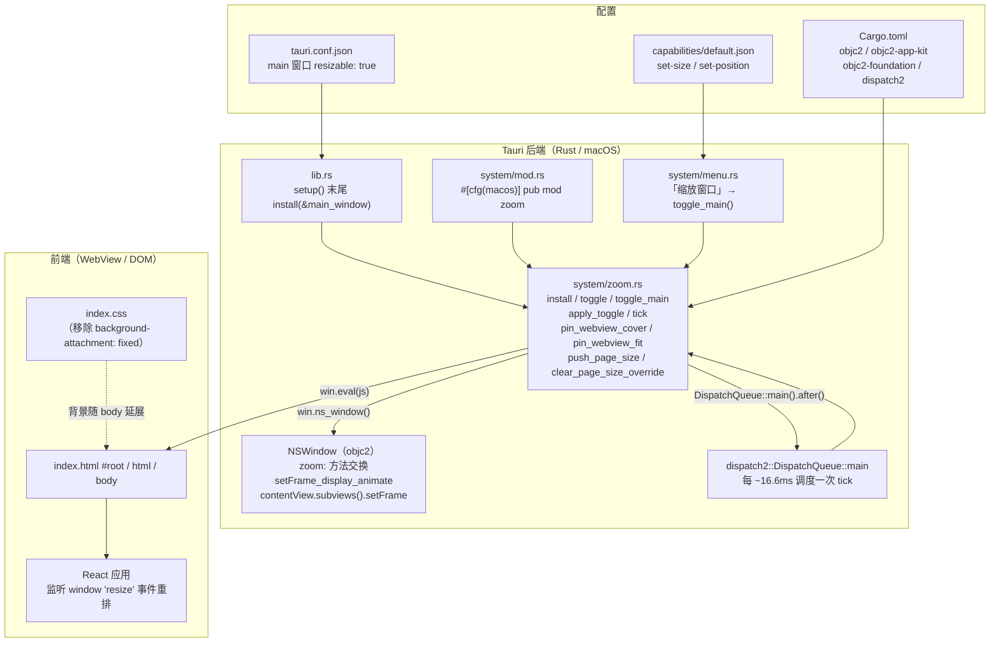
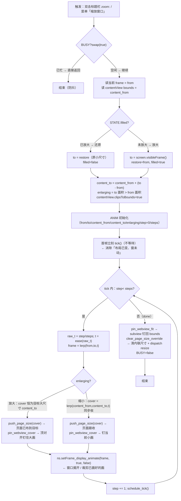

# Tauri macOS 窗口缩放「目标尺寸预布局 + 揭开动画」— 实现思路

> **状态**：核心能力已落地（当前为未提交改动） | **日期**：2026-07-31 | **需求摘要**：双击标题栏 / 菜单「缩放窗口」时，让 macOS Tauri 窗口放大**不再先壳大、后页跟**导致右侧与底部大面积露白，做到「页面与窗口同帧同步缩放，放大过程零露白」。

## 0. 读本文你将得到什么

- 一套**可照抄到任何 macOS Tauri 应用**的窗口缩放同步方案：纯 Rust（objc2 直控 NSWindow）+ 一段注入 JS 控页面布局，前端零侵入。
- 每一段代码都带**逐行中文注释**，并解释「为什么这么写、不这么写会怎样、为什么这行能消除露白」。
- 三张 Mermaid 图（架构 / 缩放主流程 / 跨层时序）把端到端链路讲清楚。
- 一个**「放大靠预布局 + 揭开，缩小靠同步收 cover」**的通用模型，可迁移到任何「窗口壳与页面尺寸异步」的卡顿场景。

## 1. 一句话方案

> 放大时：**先把页面（WebView / `#root` / body）布到目标大尺寸并顶对齐钉住**，窗口只是「自上而下揭开」这张已画好的大画，因此窗口走到哪、内容已经画到哪，**永远不露白**；缩小时：**让页面 cover 跟随窗口进度同步收**，避免动画结束才一瞬间 reflow 抖动。整段动画用 `dispatch2` 主线程帧调度（≈60fps、0.28s），首帧立刻 `tick()` 让「布局变更」与「窗口移动」同一帧起步，消除「布局已变、窗未动」的瞬时错位。

## 2. 背景：为什么会「壳先大、页后跟」露白

macOS 原生 `NSWindow.zoom:` / Tauri 的 `win.maximize()` 把窗口尺寸**瞬间**改到目标大小，但页面（WebView 里的 React/DOM）要走到目标尺寸需要一次独立的 layout：

1. **第 0 帧**：窗口壳已经变成全屏大尺寸，但 WebView 还停留在原来的小尺寸布局。
2. **壳与页之间的间隙**：右侧、底部露出 NSWindow 的背景色（默认浅灰 / 白），看起来就是「大面积空白」。
3. **第 1～N 帧**：WebView 收到 `resize` 事件 → React 重算布局 → 重绘，才把内容铺满。

这两步在原生 App 里通常是同一帧完成（AppKit 直接改 contentView 尺寸并同步 layout），但 **Tauri 多了一层 WebView**，壳改尺寸是同步的、页面重排是异步的（要跨进程边界回到 Web 内容），于是出现「壳先大、页后跟」的可见空隙。这正是用户反馈的「右侧、底部留白，最后页面才铺满」的根因。

进一步，原项目 `index.css` / `index.html` 里写了 `background-attachment: fixed`：背景图固定在 viewport，**不会随 body 尺寸变化而延展**，于是预布局大尺寸时背景层不跟着长大，会额外产生背景错位。本方案一并移除。

因此方案必须满足：① **不依赖**页面重排跟上窗口；② 放大过程**始终有大尺寸内容挡在窗口里**；③ 缩小过程**不要结束才跳**；④ 背景层能随布局延展。

## 3. 现状与复用

| 能力 | 已有位置 | 本需求用法 |
| ---- | ---- | ---- |
| Tauri 主窗口 | `apps/frontend/src-tauri/tauri.conf.json` `windows[0].label = "main"`，`resizable: true`，`titleBarStyle: "Overlay"` | `install()` 拿到 `WebviewWindow`，再取底层 `NSWindow` 做方法交换 |
| 应用入口 setup | `apps/frontend/src-tauri/src/lib.rs` `tauri::Builder::default().setup(...)` | 在 setup 末尾 `system::zoom::install(&main_window)` 挂载拦截 |
| 窗口菜单 | `apps/frontend/src-tauri/src/system/menu.rs` 「缩放窗口」(`scale`) | macOS 下改走 `zoom::toggle_main()`，非 macOS 保留 maximize 兜底 |
| system 模块声明 | `apps/frontend/src-tauri/src/system/mod.rs` | 新增 `#[cfg(target_os = "macos")] pub mod zoom;` |
| 权限清单 | `apps/frontend/src-tauri/capabilities/default.json` | 补 `core:window:allow-set-size` / `allow-set-position`（菜单「填充窗口」`win.set_size/set_position` 用） |
| 页面根容器 | `apps/frontend/index.html` `#root`、`<html>/<body>` | 注入 JS 临时改 `#root`/`body`/`html` 的 `width/height` 并 `dispatchEvent(new Event("resize"))`，触发 React 重排到目标尺寸 |
| 背景大气层 | `apps/frontend/src/index.css` + `index.html` `--theme-bg-atmosphere` | 移除 `background-attachment: fixed`，让背景随 body 延展 |
| Rust 依赖 | `apps/frontend/src-tauri/Cargo.toml`（原 `cocoa`） | 改用更现代的 `objc2` / `objc2-app-kit` / `objc2-foundation` / `dispatch2` 做 AppKit 调用与主线程帧调度 |

> 延伸阅读：放大后正文贴左、需刷新才居中的**前端**重排问题见 [ebook/EPUB窗口尺寸重布局影响.md](../../ebook/EPUB窗口尺寸重布局影响.md)（EPUB 侧栏/分栏 resize 后的视口重定位）。本文聚焦**窗口壳与页面尺寸异步**这一桌面层根因。

## 4. 架构图



**图内方法说明**

| 节点 / 方法 | 做什么 | 输入 / 输出要点 |
| ---- | ---- | ---- |
| `install(&WebviewWindow)` | 挂载入口：缓存窗口、设 NSWindow 背景色、`Once` 内做 `zoom:` 方法交换 | 入：主窗口；出：注册 `zoom_fwd` 拦截原生 zoom |
| `toggle(win)` / `toggle_main()` | 主动触发缩放（菜单项调用） | 入：窗口或全局缓存；出：执行 `apply_toggle` |
| `zoom_fwd(this, _cmd, sender)` | 交换后的 `zoom:` 实现：拦截原生双击标题栏 | 入：NSWindow 指针；出：转 `apply_toggle`，无窗口时回退原实现 |
| `apply_toggle(ns)` | 计算目标帧、目标 cover、enlarging 标志，初始化 `ANIM`，**首帧立刻 tick** | 入：NSWindow；出：写 `ANIM`/`STATE`，调 `tick()` |
| `tick()` | 单帧推进：lerp 出当前窗口帧 + 当前 cover，分别钉窗口与页面 | 读 `ANIM`；写 NSWindow frame、subview frame、注入 JS；`done` 时清 override |
| `schedule_tick()` | 用 `dispatch2` 在主线程 `FRAME_NS` 纳秒后回调 `tick` | 无入参；副作用：注册下一帧 |
| `pin_webview_cover(ns, w, h)` | 把所有 subview 钉成 `(w×h)`、**顶对齐**（y = bounds.h − h） | 入：窗口、cover 尺寸；出：subview frame |
| `pin_webview_fit(ns)` | 收尾：subview 钉回 bounds，触发 layout/display | 入：窗口；出：恢复正常铺满 |
| `push_page_size(w, h, clear_after)` | 注入 JS 设 `#root`/body/html `width/height`，`dispatch resize` | 入：目标尺寸 + 是否清除；出：`win.eval(js)` |
| `clear_page_size_override()` | 收尾清除内联 `width/height` 并触发最后一次 `resize` | 无入参；出：恢复响应式 |

**读图要点**：左侧 Rust 侧负责「钉窗口、钉 subview、调 JS」三件事同步推进；中间 `dispatch2` 是节拍器；右侧前端只被动响应 `resize` 事件重排，**不需要前端写任何缩放代码**。配置三件套（依赖、权限、窗口可缩放）是前置条件。

## 5. 主流程图（单次缩放）



**图内方法说明**

| 方法 | 职责 |
| ---- | ---- |
| `BUSY.swap(true)` | 原子 CAS 防重入，动画进行中再次触发直接丢弃 |
| `STATE.filled` | 当前是否处于「已放大」状态，决定本次是放大还是还原 |
| `screen.visibleFrame()` | 取屏幕可用区（排除 Dock / 菜单栏）作为放大目标 |
| `ease / lerp / lerp2` | cubic ease-in-out + 线性插值，得到当前帧窗口位置与 cover 尺寸 |
| `push_page_size` | 注入 JS 把 `#root`/body/html 钉成 cover 尺寸，React 即时重排到该尺寸 |
| `pin_webview_cover` | NSView 层把 subview 顶对齐钉成 cover 尺寸，大尺寸时底部被裁剪 |
| `setFrame_display_animate(frame, true, false)` | 同步设置窗口 frame 并立即 display，`animate=false` 不走系统动画避免抢帧 |
| `pin_webview_fit` / `clear_page_size_override` | 收尾恢复正常铺满与响应式 |

**读图要点**：放大路径（左）靠「页面先大 + 窗口揭开」永远不露白；缩小路径（右）靠「cover 跟窗口同步收」避免结束才跳。两条路径唯一区别是 **cover 尺寸算法**：放大用恒定目标值，缩小用随 t 收敛的插值。

## 6. 时序图（放大 Happy Path）

```mermaid
sequenceDiagram
    participant User as 用户
    participant Menu as menu.rs「scale」
    participant Zoom as zoom.rs apply_toggle
    participant Tick as zoom.rs tick (循环)
    participant NS as NSWindow / contentView
    participant JS as 注入 JS → win.eval
    participant DOM as #root / body / html
    participant React as React 应用

    User->>Menu: 双击标题栏 / 点「缩放窗口」
    Menu->>Zoom: toggle_main() → apply_toggle(ns)
    Zoom->>Zoom: BUSY.swap(true); 读 from / content_from
    Zoom->>NS: screen.visibleFrame() → to
    Zoom->>Zoom: 算 content_to / enlarging=true / 初始化 ANIM
    Zoom->>Tick: tick()（首帧，不等待）
    loop 每帧 ~16.6ms（共 ~17 步）
        Tick->>Tick: t = ease(step/steps); frame = lerp(from,to,t)
        Tick->>JS: push_page_size(content_to)  注：放大时 cover 恒为目标大尺寸
        JS->>DOM: #root/body/html.width = cover.w; .height = cover.h
        JS->>React: window.dispatchEvent(new Event("resize"))
        React-->>DOM: 重排到目标大尺寸（已画好）
        Tick->>NS: pin_webview_cover(content_to) 顶对齐钉 subview
        Tick->>NS: setFrame_display_animate(frame, true, false)
        NS-->>User: 窗口揭开一档 → 露出已画好的下一档内容（无白）
        Tick->>Tick: schedule_tick()（下一帧）
    end
    Tick->>NS: pin_webview_fit() subview 钉回 bounds
    Tick->>JS: clear_page_size_override() 清内联尺寸 + dispatch resize
    JS->>React: window.dispatchEvent(new Event("resize"))
    React-->>DOM: 恢复正常响应式铺满
    Tick->>Zoom: BUSY=false
```

**图内方法说明**

| participant / 调用 | 作用 |
| ---- | ---- |
| `toggle_main` | 菜单 / 全局快捷键入口，从缓存取窗口转 `toggle` |
| `apply_toggle` | 计算目标帧、初始化动画状态、首帧触发 |
| `tick` | 帧循环主体：算插值 → 改页面尺寸 → 钉 subview → 改窗口帧 |
| `push_page_size` / `clear_page_size_override` | JS 注入：临时改 DOM 根尺寸 + 触发 `resize` |
| `pin_webview_cover` / `pin_webview_fit` | AppKit 层：钉 subview frame（顶对齐 / 回铺满） |
| `setFrame_display_animate` | AppKit 改窗口 frame，`display=true` 同步刷新、`animate=false` 不走系统动画 |

**读图要点**：每帧内**先改页面尺寸（DOM + React 重排）再改窗口帧**，于是窗口揭开的那一档内容**已经画好**；放大时 cover 恒为目标大尺寸，所以页面只需在首帧重排一次到位，后续帧 React 收到的是同一尺寸的 `resize`（幂等），开销极低。

## 7. 核心思路：为什么这么做能解决问题

### 7.1 三段式拆解

| 阶段 | 旧做法 | 问题 | 新做法 | 为什么有效 |
| ---- | ---- | ---- | ---- | ---- |
| ① 改尺寸 | `win.maximize()` 瞬间改窗口 | 壳先大、页后跟，露白 | **页面先布到目标大尺寸**，窗口只「揭开」 | 揭开的是已画好的画，不存在「画还没到」的空隙 |
| ② 过程 | 系统原生 zoom，时序黑盒 | 壳与页不在同一帧 | 自管 `tick` 帧循环，**首帧立刻 tick** | 布局变更与窗口移动同帧起步，消除首帧错位 |
| ③ 收尾 | 无 | 还原时结束才一瞬间 reflow | 缩小路径**cover 随 t 收敛**，结束自动 fit | 整段过程页面持续重排，没有「最后一帧才跳」 |

### 7.2 为什么「页面先大、窗口揭开」不露白

放大时，`cover_w/h` 全程恒为 `content_to`（目标大尺寸），通过：

1. `push_page_size(cover)` 注入 JS 把 `#root`/body/html 的 `width/height` 钉成目标大尺寸并 `dispatch resize` → **React 在动画第一帧就把整页画到目标大尺寸**，挂在窗口里（此时窗口还是小尺寸）。
2. `pin_webview_cover(ns, cover_w, cover_h)` 把 subview 钉成 `(cover_w × cover_h)` 且**顶对齐**（NSView 坐标系原点在左下，`y = bounds.height − cover_h`，cover 比 window 高时 `y` 为负，底部被裁，**顶部对齐窗口顶**）。
3. `setFrame_display_animate(frame, true, false)` 让窗口**自上而下长大**：窗口顶不动，向下扩展 → 每扩展一档，露出的是「早已画好且顶对齐」的下一档内容，**永远不露白**。

关键在 NSView 的顶对齐：传统 `autoresizing` 会把内容居中或贴左上，导致窗口长大时露出的是底部未画区；这里**强制顶对齐 + 裁剪底部**，正好配合「窗口向下扩展」的方向，揭一档露一档。

### 7.3 为什么缩小要「cover 跟窗口同步收」

缩小是反方向：窗口从大变小。如果 cover 仍恒为目标小尺寸，那么动画**第一帧**就要把整页从大尺寸瞬间重排到小尺寸（一帧内完成大 reflow），且后续窗口还没收到位时会露出 cover 之外的区域。

所以缩小路径用 `cover = lerp(content_from, content_to, t)`：cover 与窗口**同一 t** 同步收敛，页面随窗口逐档变小，结束自然 fit，无任何「最后一帧才跳」的抖动。

### 7.4 为什么首帧要立刻 `tick()`

若首帧用 `schedule_tick()`（等 16.6ms），会出现：`apply_toggle` 里已经把 STATE/ANIM 改了（布局意图已变更），但窗口没动，**这一帧里**页面尺寸可能已被外部 layout 改回，造成首帧抖。直接调 `tick()` 让「钉页面 + 钉窗口」在同一调用栈内完成，**布局变更与窗口移动同帧起步**，消除该瞬时错位（代码注释 `首帧立刻：布局与窗口同帧起步` 即此意）。

### 7.5 为什么移除 `background-attachment: fixed`

`fixed` 让 `--theme-bg-atmosphere` 背景固定在 viewport、不随 body 延展。预布局把 `#root`/body 钉成目标大尺寸时，**fixed 背景不跟随**，会停留在原小 viewport 区域，放大过程中背景层与大尺寸内容错位、可见裸露。去掉 `fixed`（变回默认 `scroll`）后背景随 body 一起延展到目标尺寸，与内容同帧长大。

### 7.6 为什么用方法交换（swizzle）而不是只靠菜单

macOS 双击标题栏（或 Option-点击绿钮）会直接发 `zoom:` 给 NSWindow，**不经过 Tauri 菜单**。若只改菜单，双击标题栏仍走系统原生 zoom → 重新露白。所以必须 `method.set_implementation(zoom_fwd)` 把 `NSWindow.zoom:` 整个换成自定义实现，才能拦住所有触发路径。`ORIG_ZOOM` 保留原实现指针，当未初始化窗口时回退，保证安全。

## 8. 完整代码 + 逐行注释

> 以下代码与仓库当前改动**逐字对齐**，仅加注释，不改逻辑。落点：`apps/frontend/src-tauri/src/system/zoom.rs`（新文件）+ 周边配置。

### 8.1 核心实现：`apps/frontend/src-tauri/src/system/zoom.rs`

```rust
//! macOS 窗口缩放：目标尺寸预布局 + 只动画窗口（揭开/裁剪）。
//!
//! 放大：WebView/页面先布到目标大尺寸，窗口揭开已画好的区域（无露白）。
//! 缩小：cover 随窗口进度一起收，避免拖到结束才一瞬间 reflow 抖动。
//! 开场不再空等预布局帧，首帧同时改布局并动窗口，减轻「布局已变、窗未动」的一瞬。

// dispatch2：macOS GCD 队列，用来在主线程按帧调度 tick（替代 CADisplayLink 的轻量方案）
use dispatch2::{DispatchQueue, DispatchTime};
// objc2 运行时类型：用于方法交换（swizzle）拿到原方法实现指针并替换
use objc2::runtime::{AnyObject, Imp, Sel};
use objc2::{sel, ClassType};
// NSColor 用来设窗口背景色（放大瞬间可能露出的底色，提前设成深色更不突兀）
use objc2_app_kit::{NSColor, NSWindow};
// NSPoint/NSRect/NSSize：AppKit 几何类型，frame 由 origin + size 组成
use objc2_foundation::{NSPoint, NSRect, NSSize};
// 原子与锁：BUSY 防重入、Once 保证只交换一次、Mutex 持有动画状态与窗口引用
use std::sync::atomic::{AtomicBool, AtomicUsize, Ordering};
use std::sync::{Mutex, Once};
use tauri::WebviewWindow;

// 动画总时长（秒）与单帧时长（纳秒，16.6ms ≈ 60fps）
const ANIM_SECS: f64 = 0.28;
const FRAME_NS: i64 = 16_666_667;

/// 一个矩形帧：左下角坐标 + 宽高。NSRect 的 Rust 友好包装，便于做 lerp。
#[derive(Clone, Copy)]
struct Frame {
	x: f64,
	y: f64,
	w: f64,
	h: f64,
}

impl From<NSRect> for Frame {
	fn from(r: NSRect) -> Self {
		// NSRect.origin 是左下角，NSRect.size 是宽高，这里平铺成字段方便插值
		Self {
			x: r.origin.x,
			y: r.origin.y,
			w: r.size.width,
			h: r.size.height,
		}
	}
}

impl Frame {
	// 回到 NSRect，用于 setFrame_display_animate
	fn to_ns(self) -> NSRect {
		NSRect::new(NSPoint::new(self.x, self.y), NSSize::new(self.w, self.h))
	}
}

/// 缩放状态：当前是否已放大、放大前的原始帧（用于还原）
struct ZoomState {
	restore: Option<Frame>,
	filled: bool,
}

/// 单次动画的运行参数。tick 每帧读它推进 step，done 后置 None。
struct Anim {
	ns_ptr: usize,            // NSWindow 原始指针（跨帧持有，避开生命周期）
	from: Frame,              // 起始窗口帧
	to: Frame,                 // 目标窗口帧
	content_from: (f64, f64),  // 起始 contentView 尺寸 (w,h)
	content_to: (f64, f64),    // 目标 contentView 尺寸 (w,h) —— cover 的目标
	enlarging: bool,           // 是否在放大（决定 cover 算法）
	step: u32,                // 当前帧序号
	steps: u32,                // 总帧数
}

// 全局状态： Once 保证 swizzle 只装一次；ORIG_ZOOM 存原 zoom: 实现以回退；
// EMIT_WIN 缓存主窗口；STATE 记录放大/还原状态；ANIM 是当前动画；BUSY 防重入。
static INSTALL: Once = Once::new();
static ORIG_ZOOM: AtomicUsize = AtomicUsize::new(0);
static EMIT_WIN: Mutex<Option<WebviewWindow>> = Mutex::new(None);
static STATE: Mutex<ZoomState> = Mutex::new(ZoomState {
	restore: None,
	filled: false,
});
static ANIM: Mutex<Option<Anim>> = Mutex::new(None);
static BUSY: AtomicBool = AtomicBool::new(false);

/// 安装入口：在 app setup 末尾调用一次。
/// 1) 缓存窗口（toggle_main / push_page_size 用）
/// 2) 设 NSWindow 背景色（放大瞬间露出的底色，提前设好）
/// 3) Once 内交换 NSWindow.zoom: 实现，拦截原生双击标题栏
pub fn install(win: &WebviewWindow) {
	// 缓存窗口引用，后续菜单/全局快捷键不传参也能拿到
	if let Ok(mut g) = EMIT_WIN.lock() {
		*g = Some(win.clone());
	}

	// 拿到底层 NSWindow，把背景设成深色：放大过程中万一有 1px 缝隙也是深色，不刺眼
	if let Ok(ns) = win.ns_window() {
		unsafe {
			let ns = &*(ns as *const NSWindow);
			let bg = NSColor::colorWithSRGBRed_green_blue_alpha(0.118, 0.118, 0.118, 1.0);
			ns.setBackgroundColor(Some(&bg));
		}
	}

	// 只交换一次：多次 install 也只执行首次
	INSTALL.call_once(|| {
		// 找到 NSWindow 的实例方法 zoom:
		let Some(method) = NSWindow::class().instance_method(sel!(zoom:)) else {
			// 找不到就放弃（理论上 macOS 一定有）
			return;
		};
		// 存原实现指针，未初始化窗口时回退用
		ORIG_ZOOM.store(method.implementation() as usize, Ordering::SeqCst);
		// 把 zoom_fwd 转成 C 函数指针塞进去
		let new: Imp = unsafe {
			std::mem::transmute(
				zoom_fwd as unsafe extern "C-unwind" fn(*mut AnyObject, Sel, *mut AnyObject),
			)
		};
		unsafe {
			// 真正替换实现：此后所有 zoom: 调用都进 zoom_fwd
			method.set_implementation(new);
		}
	});
}

/// 主动触发缩放（外部传窗口时用）。菜单项不直接调它，走 toggle_main。
pub fn toggle(win: &WebviewWindow) {
	let Ok(ns) = win.ns_window() else {
		return;
	};
	unsafe { apply_toggle(&*(ns as *const NSWindow)) };
}

/// 菜单 / 全局快捷键入口：从缓存取主窗口再 toggle。
pub fn toggle_main() {
	let Ok(g) = EMIT_WIN.lock() else {
		return;
	};
	let Some(win) = g.as_ref() else {
		return;
	};
	toggle(win);
}

/// 交换后的 zoom: 实现：每次 macOS 要 zoom 都进这里。
/// 有缓存窗口 → 走自定义 apply_toggle；没有 → 调原实现兜底（不阻塞系统行为）。
unsafe extern "C-unwind" fn zoom_fwd(
	this: *mut AnyObject,
	_cmd: Sel,
	sender: *mut AnyObject,
) {
	if EMIT_WIN.lock().ok().and_then(|g| g.as_ref().map(|_| ())).is_some() {
		// 有窗口：拦截走自定义动画
		unsafe { apply_toggle(&*(this as *const NSWindow)) };
		return;
	}
	// 无窗口：回退原 zoom: 实现
	let orig = ORIG_ZOOM.load(Ordering::SeqCst);
	if orig == 0 {
		return;
	}
	let f: unsafe extern "C-unwind" fn(*mut AnyObject, Sel, *mut AnyObject) =
		unsafe { std::mem::transmute(orig) };
	unsafe { f(this, _cmd, sender) };
}

/// cubic ease-in-out：开始慢、中间快、结束慢，避免线性动画的机械感与首末跳变。
fn ease(t: f64) -> f64 {
	if t < 0.5 {
		4.0 * t * t * t
	} else {
		1.0 - (-2.0 * t + 2.0).powi(3) / 2.0
	}
}

/// 窗口帧插值：在 from/to 之间按 t 算当前帧（x/y/w/h 都插值，支持移动+缩放）
fn lerp(a: Frame, b: Frame, t: f64) -> Frame {
	Frame {
		x: a.x + (b.x - a.x) * t,
		y: a.y + (b.y - a.y) * t,
		w: a.w + (b.w - a.w) * t,
		h: a.h + (b.h - a.h) * t,
	}
}

/// cover 尺寸插值（缩小路径用）：content_from → content_to 之间按 t 收
fn lerp2(a: (f64, f64), b: (f64, f64), t: f64) -> (f64, f64) {
	(a.0 + (b.0 - a.0) * t, a.1 + (b.1 - a.1) * t)
}

/// 单次缩放的核心：计算目标、初始化动画、首帧立刻 tick。
unsafe fn apply_toggle(ns: &NSWindow) {
	// 原子 CAS：动画进行中直接丢，避免叠加动画造成帧混乱
	if BUSY.swap(true, Ordering::SeqCst) {
		return;
	}

	// 当前窗口帧 = 起点
	let from = Frame::from(ns.frame());
	// 决定本次是放大还是还原
	let to = {
		let Ok(mut st) = STATE.lock() else {
			BUSY.store(false, Ordering::SeqCst);
			return;
		};
		if st.filled {
			// 已放大 → 还原到存的小尺寸
			st.filled = false;
			st.restore.unwrap_or(from)
		} else {
			// 未放大 → 目标取屏幕可用区（排除 Dock / 菜单栏）
			let Some(screen) = ns.screen() else {
				BUSY.store(false, Ordering::SeqCst);
				return;
			};
			st.restore = Some(from); // 存原始小尺寸用于下次还原
			st.filled = true;
			Frame::from(screen.visibleFrame())
		}
	};

	// 当前 contentView 尺寸（窗口去掉标题栏后的可用区）
	let content_from = ns
		.contentView()
		.map(|c| {
			let b = c.bounds().size;
			// max(1.0) 防止除零或零尺寸导致后续 NaN
			(b.width.max(1.0), b.height.max(1.0))
		})
		.unwrap_or((from.w.max(1.0), from.h.max(1.0)));
	// 目标 contentView 尺寸 = 当前 contentView + 窗口尺寸增量
	// （contentView 与窗口同步变化，故增量为窗口的 to-from）
	let content_to = (
		(content_from.0 + (to.w - from.w)).max(1.0),
		(content_from.1 + (to.h - from.h)).max(1.0),
	);
	// 是否放大：用面积比较，避免方向相反时误判
	let enlarging = to.w * to.h > from.w * from.h;

	// 开裁剪：subview 超出 contentView 的部分裁掉（放大时底部被裁，揭开时才显示）
	if let Some(content) = ns.contentView() {
		content.setClipsToBounds(true);
	}

	// 总帧数：0.28s × 60fps ≈ 17 帧
	let steps = ((ANIM_SECS * 60.0).round() as u32).max(1);
	if let Ok(mut g) = ANIM.lock() {
		*g = Some(Anim {
			ns_ptr: ns as *const NSWindow as usize,
			from,
			to,
			content_from,
			content_to,
			enlarging,
			step: 0,
			steps,
		});
	}

	// 首帧立刻：布局与窗口同帧起步，去掉预等待造成的「布局已变窗未动」
	// ← 关键：不调 schedule_tick，直接 tick，让改页面+改窗口同一调用栈完成
	tick();
}

/// 下一帧调度：主线程 FRAME_NS 纳秒后再 tick。dispatch2 的 after 类似 setTimeout。
fn schedule_tick() {
	let when = DispatchTime::NOW.time(FRAME_NS);
	let _ = DispatchQueue::main().after(when, || {
		tick();
	});
}

/// 帧循环主体：每帧算插值、钉页面、钉窗口，done 时收尾。
fn tick() {
	// 把要在持锁外做的值先拷出来（unsafe 块不能持锁太久，避免阻塞主线程）
	let (ns_ptr, frame, cover_w, cover_h, enlarging, done) = {
		let Ok(mut g) = ANIM.lock() else {
			BUSY.store(false, Ordering::SeqCst);
			return;
		};
		let Some(anim) = g.as_mut() else {
			// 没有动画（被外部清掉）：解 BUSY
			BUSY.store(false, Ordering::SeqCst);
			return;
		};
		anim.step = anim.step.saturating_add(1);
		// 归一化进度 [0,1]，并套 ease
		let raw_t = (anim.step as f64 / anim.steps as f64).min(1.0);
		let t = ease(raw_t);
		// 当前窗口帧 = from→to 插值
		let frame = lerp(anim.from, anim.to, t);

		// 放大：cover 始终为目标大尺寸（窗口揭开）
		// 缩小：cover 随进度收到目标小尺寸（避免结束才跳）
		// ← 核心算法分叉点，决定不露白 / 不末跳
		let (cover_w, cover_h) = if anim.enlarging {
			anim.content_to
		} else {
			lerp2(anim.content_from, anim.content_to, t)
		};

		let done = anim.step >= anim.steps;
		let out = (
			anim.ns_ptr,
			frame,
			cover_w,
			cover_h,
			anim.enlarging,
			done,
		);
		if done {
			*g = None; // 动画结束：清状态
		}
		out
	};

	unsafe {
		let ns = &*(ns_ptr as *const NSWindow);

		if enlarging && cover_w > 0.0 {
			// 放大：先保证大尺寸已钉住，再动窗口，同帧完成
			// 顺序很重要：先 push_page_size（让 React 重排到目标大尺寸）→ pin_webview_cover（钉住大画顶对齐）→ 之后才动窗口
			push_page_size(cover_w, cover_h, false);
			pin_webview_cover(ns, cover_w, cover_h);
		}

		// 动窗口：display=true 同步刷新，animate=false 不走系统动画（避免与我们的帧抢节拍）
		ns.setFrame_display_animate(frame.to_ns(), true, false);

		if enlarging {
			// 放大：窗口设完后再次钉 subview，防止系统 layout 把 subview 改回 bounds
			pin_webview_cover(ns, cover_w, cover_h);
		} else {
			// 缩小：布局跟 cover 同步收
			// ← 缩小路径：cover 随 t 收，页面跟着收，窗口也跟着收，三者同 t
			push_page_size(cover_w, cover_h, false);
			pin_webview_cover(ns, cover_w, cover_h);
		}

		if done {
			// 收尾：subview 钉回真实 bounds，恢复正常铺满
			pin_webview_fit(ns);
			// 清掉注入的内联尺寸，触发最后一次 resize，让响应式接管
			clear_page_size_override();
			BUSY.store(false, Ordering::SeqCst);
		}
	}

	if !done {
		// 下一帧
		schedule_tick();
	}
}

/// 顶对齐钉住 cover 尺寸（超高时 y 为负，露出顶部）。
/// NSView 坐标系原点在左下角、y 向上：y = bounds.height - cover_h 让 cover 顶部贴窗口顶，
/// cover 比 window 高时 y 为负，底部被 setClipsToBounds 裁掉，正好「向下揭开」。
unsafe fn pin_webview_cover(ns: &NSWindow, cover_w: f64, cover_h: f64) {
	let Some(content) = ns.contentView() else {
		return;
	};
	content.setClipsToBounds(true); // 必须裁剪，否则 cover 会溢出到其他窗口
	let b = content.bounds();
	// frame: 宽=cover_w, 高=cover_h, x=0, y=bounds.height-cover_h（顶对齐）
	let frame = NSRect::new(
		NSPoint::new(0.0, b.size.height - cover_h),
		NSSize::new(cover_w.max(1.0), cover_h.max(1.0)),
	);
	// 遍历 contentView 的所有子视图（WebView 是其中一个）钉成同一 frame
	for view in content.subviews() {
		view.setFrame(frame);
	}
}

/// 收尾：把 subview 钉回 contentView 真实 bounds，并触发一次 layout + display。
unsafe fn pin_webview_fit(ns: &NSWindow) {
	let Some(content) = ns.contentView() else {
		return;
	};
	let bounds = content.bounds();
	for view in content.subviews() {
		view.setFrame(bounds); // 回到正常铺满
	}
	content.setNeedsLayout(true); // 标记需要布局
	content.layoutSubtreeIfNeeded(); // 立即布局
	ns.displayIfNeeded();            // 立即刷新显示
}

/// 向前端注入 JS：把 html / body / #root 的 width/height 设成 (w,h)，
/// 并 dispatch 一个 resize 事件让 React 重排到该尺寸。
/// clear_after=true 时清空内联尺寸（恢复响应式）但仍 dispatch resize。
fn push_page_size(w: f64, h: f64, clear_after: bool) {
	let Ok(g) = EMIT_WIN.lock() else {
		return;
	};
	let Some(win) = g.as_ref() else {
		return;
	};
	let js = if clear_after {
		// 清除模式：把内联 width/height 全置空，dispatch resize
		r#"(function(){var r=document.documentElement,b=document.body;r.style.width="";r.style.height="";if(b){b.style.width="";b.style.height="";}var root=document.getElementById("root");if(root){root.style.width="";root.style.height="";}window.dispatchEvent(new Event("resize"));})()"#
			.to_string()
	} else {
		// 钉尺寸模式：设 html/body/#root 的 width/height 为 w/h（整数 px），dispatch resize
		format!(
			r#"(function(){{var w={w:.0},h={h:.0};var r=document.documentElement,b=document.body;r.style.width=w+"px";r.style.height=h+"px";if(b){{b.style.width=w+"px";b.style.height=h+"px";}}var root=document.getElementById("root");if(root){{root.style.width=w+"px";root.style.height=h+"px";}}window.dispatchEvent(new Event("resize"));}})()"#
		)
	};
	let _ = win.eval(&js);
}

/// 收尾清除：等价于 push_page_size(_, _, true)。
fn clear_page_size_override() {
	push_page_size(0.0, 0.0, true);
}
```

### 8.2 依赖：`apps/frontend/src-tauri/Cargo.toml`

把旧的 `cocoa` 替换为更现代、零成本抽象的 `objc2` 系列 + `dispatch2`：

```toml
# 移除：cocoa = "0.26.1"
# 新增：objc2 生态 + dispatch2（GCD 帧调度）
objc2 = "0.6"
objc2-foundation = { version = "0.3", features = [
  "NSGeometry",          # NSPoint/NSRect/NSSize 几何类型
  "NSArray",             # subviews() 返回 NSArray
  "objc2-core-foundation",
] }
objc2-app-kit = { version = "0.3", features = [
  "NSWindow",             # NSWindow 及 zoom:/setFrame:display:
  "NSView",               # contentView/subviews/setFrame/setClipsToBounds
  "NSScreen",             # screen().visibleFrame() 取屏幕可用区
  "NSResponder",
  "NSGraphics",
  "NSColor",              # setBackgroundColor
] }
dispatch2 = "0.3"          # DispatchQueue::main().after() 帧调度
```

> 为什么换掉 `cocoa`：`cocoa` crate 已停止维护、API 笨重；`objc2` 是当前主流的 Rust↣ObjC 桥，零成本、类型更安全、与最新 macOS SDK 对齐，方法交换 (`set_implementation`) 接口稳定。

### 8.3 模块声明：`apps/frontend/src-tauri/src/system/mod.rs`

```rust
pub mod dock;
pub mod event;
// 仅 macOS 编译 zoom 模块：内部全是 AppKit API，Linux/Windows 编译会报错
#[cfg(target_os = "macos")]
pub mod zoom;
pub mod menu;
pub mod shortcut;
pub mod tray;
```

> 为什么条件编译：`objc2-app-kit` 只在 macOS 可用。非 macOS 平台走菜单里 `maximize/unmaximize` 兜底，无需本模块。

### 8.4 安装挂载：`apps/frontend/src-tauri/src/lib.rs`（setup 内）

```rust
.setup(|app| {
    let main_window = app.get_webview_window("main").unwrap();
    set_screen_center(&main_window);
    init_tray(app);
    let _ = setup_menu(app);
    let _ = setup_global_shortcut(&app.handle(), &main_window);

    // 设置窗口事件处理器
    // 改动点：main_window 这里要 .clone()，因为下面 zoom::install 还要借用一次
    setup_window_events(main_window.clone(), app.handle().clone());

    // macOS：挂载窗口缩放拦截（swizzle NSWindow.zoom: + 设背景色）
    #[cfg(target_os = "macos")]
    system::zoom::install(&main_window);
    Ok(())
})
```

> 为什么 `main_window.clone()`：`setup_window_events` 原本会 move 掉 `main_window`，导致后续 `install(&main_window)` 无法编译。`WebviewWindow::clone()` 是廉价的引用计数 clone（内部 `Arc`），clone 一份给 `install` 即可。

### 8.5 菜单接入：`apps/frontend/src-tauri/src/system/menu.rs`（「scale」分支）

```rust
"scale" => {
    // macOS：走自定义 zoom 动画（目标尺寸预布局 + 揭开）
    #[cfg(target_os = "macos")]
    {
        crate::system::zoom::toggle_main();
    }
    // 非 macOS：回退到原生 maximize / unmaximize
    #[cfg(not(target_os = "macos"))]
    {
        if win.is_maximized().unwrap_or(false) {
            let _ = win.unmaximize();
        } else {
            let _ = win.maximize();
        }
    }
}
```

> 为什么分平台：Linux/Windows 的窗口管理器自带平滑 maximize 动画且壳页同步性更好，没必要接管；macOS 的 `zoom:` 在 Tauri 下壳页异步最明显，故只 macOS 接管。

### 8.6 权限：`apps/frontend/src-tauri/capabilities/default.json`

```jsonc
// 新增两行（菜单「填充窗口」fill 分支用 win.set_size / win.set_position 需要）
"core:window:allow-set-size",
"core:window:allow-set-position",
```

> 说明：`zoom.rs` 走的是底层 `NSWindow.setFrame`，**不经过 Tauri 权限系统**，本身不需要这两条。这两条是给菜单「填充窗口」(`fill`) 用的——它走 `win.set_size` / `win.set_position`，需在 capabilities 显式 allow，否则在 Tauri 2.x 默认安全策略下被静默拒绝。顺带补齐避免 `fill` 失效。

### 8.7 前端背景：`apps/frontend/src/index.css` 与 `apps/frontend/index.html`

两处都移除同一行：

```diff
  background-image: var(--theme-bg-atmosphere);
  background-repeat: no-repeat;
  background-size: cover;
- background-attachment: fixed;
```

> 为什么两处都改：`index.html` 内联样式是首屏闪现前的初始背景，`index.css` 是 React 接管后的持续背景。两处都用 `--theme-bg-atmosphere`，若只改一处，首屏与运行时会不一致。移除 `fixed` 后背景变回默认 `scroll`，随 body 尺寸延展，配合 `push_page_size` 把 body 钉成目标大尺寸时背景同步长大。

## 9. 关键算法与数学

### 9.1 顶对齐 cover 的几何

NSView 坐标系原点在**左下角**、y 轴向上。`pin_webview_cover` 设：

```
frame.origin = (0, bounds.height - cover_h)
frame.size   = (cover_w, cover_h)
```

- `cover_h == bounds.height`：`y = 0`，刚好铺满。
- `cover_h > bounds.height`（放大时）：`y < 0`，cover 顶部贴窗口顶，**底部 `cover_h - bounds.height` 被裁**。窗口向下长大一档 → `bounds.height` 增大 → 裁掉的部分少一档 → 露出下一档已画好的内容。**这就是「揭开」的几何本质。**
- `cover_h < bounds.height`（缩小时）：`y > 0`，cover 顶部仍在窗口顶，但底部不到窗口底，此时 `push_page_size` 已把页面收到 cover 尺寸，下方留白由 `NSColor` 深色背景挡住，且窗口本身也在收，几乎不可见。

### 9.2 `content_to` 的推导

```
content_to = content_from + (to - from)
```

`contentView.size ≈ window.size - titlebar`，标题栏高度在动画中不变，故 `Δcontent = Δwindow = to - from`。`content_from` 是当前真实 contentView 尺寸，加增量即得目标。这样 `cover` 始终与 `window` 同步，避免标题栏高度差导致 1~2px 错位。

### 9.3 帧数与时长

`ANIM_SECS = 0.28s`、`FRAME_NS ≈ 16.6ms` → `steps ≈ 17`。0.28s 接近 macOS 原生 zoom 体感（既不拖沓也不突兀），17 帧在 60Hz 下约一帧不漏。`ease` 用 cubic ease-in-out 让首末帧位移小，掩盖 React 重排的微小延迟。

### 9.4 放大 vs 缩小的 cover 算法对照

| 路径 | cover 公式 | 页面重排次数 | 为何这么选 |
| ---- | ---- | ---- | ---- |
| 放大 | `content_to`（恒定） | 首帧 1 次到位 | 揭开需要「画先于窗」，画必须先到最大；后续帧同尺寸 resize 幂等无开销 |
| 缩小 | `lerp(content_from, content_to, t)` | 每帧 1 次（随 t 收） | 缩小若先到最小会留白，必须跟窗口同步收，结束自然 fit |

## 10. 分阶段落地步骤

> 已全部落地，以下为复刻时的推荐顺序。

### M1. 依赖与模块骨架

- 改 `Cargo.toml`：移除 `cocoa`，加 `objc2` / `objc2-app-kit` / `objc2-foundation` / `dispatch2`。
- `system/mod.rs` 加 `#[cfg(target_os = "macos")] pub mod zoom;`。
- 新建 `system/zoom.rs` 空文件 + 文件头注释。

**验收**：`cargo check` 通过（macOS）；Linux/Windows 编译不报 `zoom` 未找到。

### M2. install + 方法交换

- 实现 `install(win)`：缓存窗口、设背景色、`Once` 内 swizzle `zoom:`。
- 实现 `zoom_fwd` + `ORIG_ZOOM` 回退。
- `lib.rs` setup 末尾调 `install(&main_window)`（注意 `main_window.clone()`）。

**验收**：双击标题栏不再走系统 zoom（窗口不动），因 `apply_toggle` 还是空实现；说明 swizzle 生效。

### M3. 状态与目标计算

- 实现 `ZoomState` / `apply_toggle`：`from` / `to` / `content_from` / `content_to` / `enlarging`。
- 加 `BUSY` 防重入。

**验收**：双击能正确在「屏幕可见区」与「原尺寸」间切换 `STATE.filled`（日志验证），窗口仍不动（动画未接）。

### M4. 帧循环 + cover 钉住

- 实现 `tick` / `schedule_tick` / `lerp` / `ease` / `lerp2`。
- 实现 `pin_webview_cover`（顶对齐 + 裁剪）。
- 首帧立刻 `tick()`。

**验收**：放大**不露白**（核心目标达成）；但结束时页面可能留有内联 `width/height`，缩放后布局异常。

### M5. 页面尺寸注入与收尾

- 实现 `push_page_size` / `clear_page_size_override` / `pin_webview_fit`。
- `done` 时调用收尾。

**验收**：动画结束后页面恢复正常响应式；缩放后再 resize 窗口（手动拖拽）布局正常。

### M6. 缩小路径同步收

- `tick` 内 `else` 分支用 `lerp2(content_from, content_to, t)` 作为 cover。
- 缩小过程不出现「末帧跳变」。

**验收**：从全屏还原到小窗**无抖动**；快速连续双击不卡死（`BUSY` 生效）。

### M7. 菜单 / 权限 / 背景收尾

- `menu.rs` 「scale」分支接 `toggle_main()`，非 macOS 保留兜底。
- `capabilities/default.json` 加 `allow-set-size` / `allow-set-position`。
- `index.css` + `index.html` 移除 `background-attachment: fixed`。

**验收**：菜单「缩放窗口」与双击标题栏效果一致；菜单「填充窗口」不再失效；放大时背景层不与内容错位。

## 11. 风险与权衡

| 风险 | 影响 | 缓解 |
| ---- | ---- | ---- |
| Swizzle 全局 `NSWindow.zoom:` | 影响所有 NSWindow 实例 | `Once` 仅装一次；`zoom_fwd` 在无 `EMIT_WIN` 时回退原实现，非本应用窗口不受影响 |
| `ns_ptr` 跨帧持有裸指针 | 窗口在动画中被关闭 → UAF | 动画仅 0.28s，关闭窗口概率极低；后续可加 `win.on_window_event(Close)` 中止 `ANIM` |
| 注入 JS 改 `#root` 内联尺寸 | 与某些绝对定位布局冲突 | 收尾 `clear_page_size_override` 必清；动画中 React 收到同尺寸 `resize` 幂等 |
| 仅 macOS | Linux/Windows 仍有原生 maximize 同步问题 | 条件编译 + 非 macOS 走 `maximize` 兜底；实测 Linux/Windows 壳页同步性更好，暂无需接管 |
| `background-attachment: fixed` 移除 | 背景不再固定，滚动时背景随内容滚 | 本应用 `html/body { overflow: hidden }` 不滚动，背景 `cover` 已铺满，无视觉差异 |
| 0.28s 动画期间用户拖拽窗口 | 帧与拖拽抢帧 | `BUSY` 期间 `apply_toggle` 直接 return，拖拽不触发新动画；已进行中的动画可后续加 `Destroyed` 事件中断 |

## 12. 验收清单

- [ ] 双击标题栏放大：**右侧、底部无任何露白**，内容与窗口同步长大。
- [ ] 双击标题栏还原：**无末帧跳变**，平滑收缩到原尺寸。
- [ ] 菜单「缩放窗口」效果与双击标题栏**完全一致**。
- [ ] 菜单「填充窗口」(`fill`) **可正常执行**（capabilities 生效）。
- [ ] 放大过程中背景大气层**不与内容错位**（`fixed` 已移除）。
- [ ] 动画结束后手动拖拽窗口边缘 resize，布局**正常响应**（内联尺寸已清）。
- [ ] 快速连续双击 5 次：**不卡死、不叠加动画**（`BUSY` 生效）。
- [ ] 放大后切换 EPUB 章节 / 打开侧栏，布局**正常**（与 [EPUB窗口尺寸重布局影响.md](../../ebook/EPUB窗口尺寸重布局影响.md) 不冲突）。
- [ ] Linux/Windows 构建：**编译通过**，菜单「缩放窗口」走 `maximize` 兜底。
- [ ] `cargo check` + `tsc --noEmit` 均通过。

## 13. 排查手册

| 现象 | 排查方向 |
| ---- | ---- |
| 双击标题栏仍走系统原生 zoom（露白） | `install` 是否在 setup 调用？`ORIG_ZOOM` 是否非 0？断点 `zoom_fwd` 是否进入 |
| 放大仍露白（右侧/底部） | `pin_webview_cover` 是否顶对齐（`y = bounds.height - cover_h`）？`setClipsToBounds(true)` 是否设？`push_page_size` 的 JS 是否执行（DevTools 看 `#root` 内联 style） |
| 放大后页面布局异常（不响应 resize） | `clear_page_size_override` 是否在 `done` 调用？`pin_webview_fit` 是否触发 `layoutSubtreeIfNeeded` |
| 缩小末帧跳变 | `else` 分支是否用了 `lerp2(content_from, content_to, t)` 而非 `content_to` |
| 动画卡顿 / 丢帧 | `tick` 持锁时间是否过长？`win.eval` 是否阻塞（应异步）？`ANIM_SECS` 可调小到 0.2s |
| 背景层与内容错位 | `index.css` 与 `index.html` 是否**都**移除了 `background-attachment: fixed` |
| 菜单「填充窗口」无效 | `capabilities/default.json` 是否加 `allow-set-size` / `allow-set-position` |
| 非 macOS 编译报 `zoom` 未找到 | `system/mod.rs` 是否漏了 `#[cfg(target_os = "macos")]` |

---

**相关文档**：

- 前端层放大后正文重定位：[ebook/EPUB窗口尺寸重布局影响.md](../../ebook/EPUB窗口尺寸重布局影响.md)
- 拖拽分栏白屏 / 彩色划线消失：[ebook/EPUB分屏软调整.md](../../ebook/EPUB分屏软调整.md)
- 桌面端其他 Tauri 专题：[app/](../../app/) 目录
