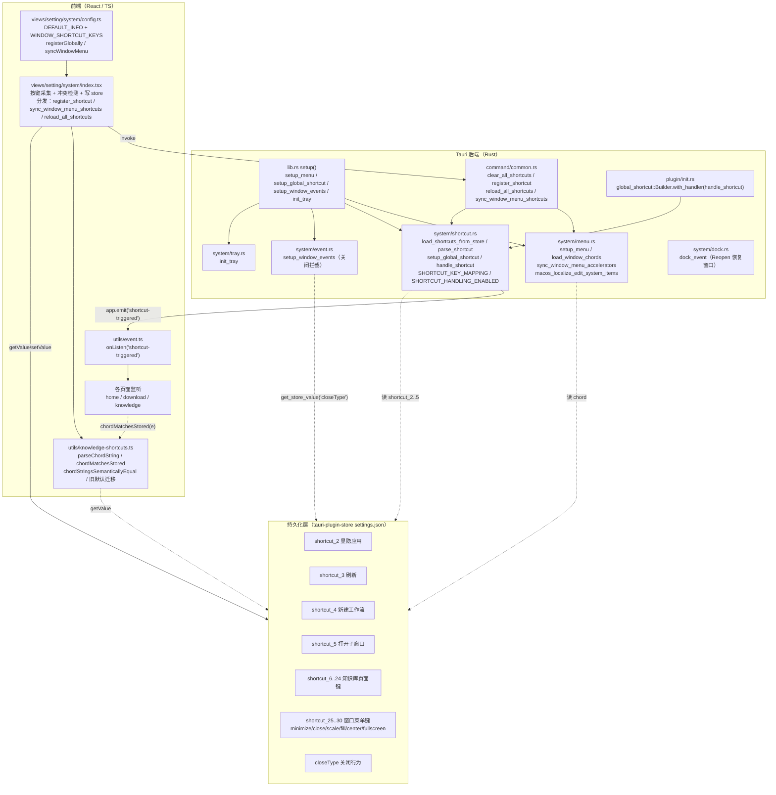
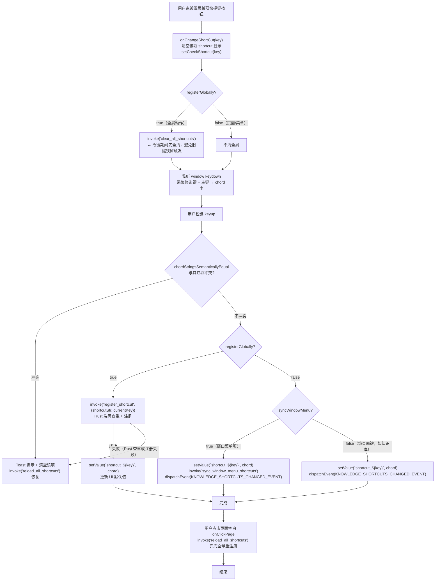
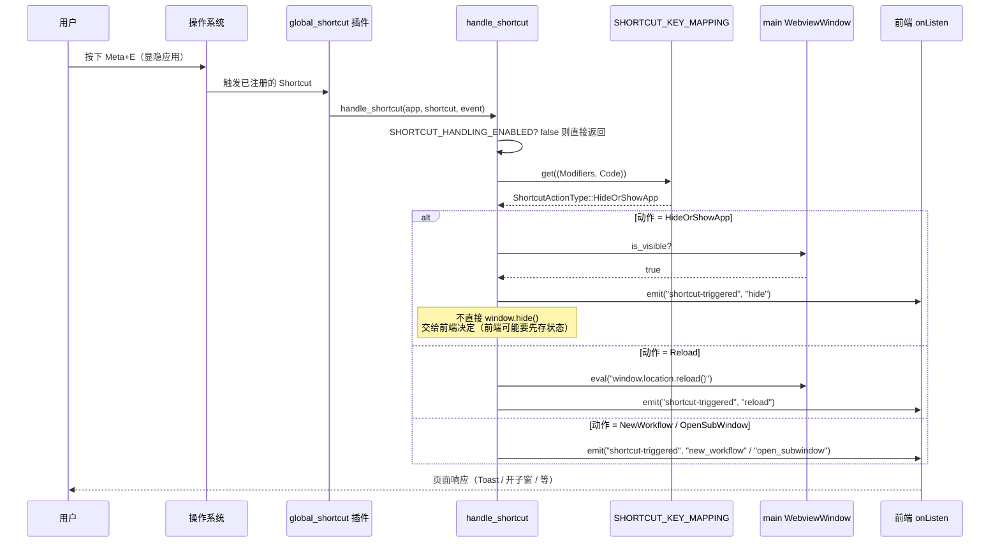
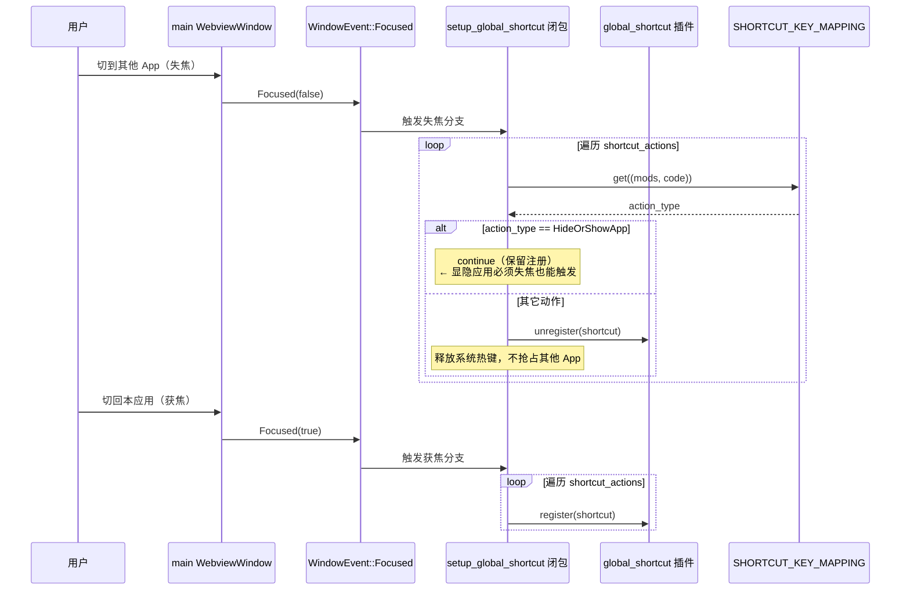

# Tauri 桌面端系统菜单 + 全局/页面快捷键体系 — 实现思路

> **状态**：核心能力已上线 | **日期**：2026-07-31 | **需求摘要**：构建一套**可配置、可分组、跨平台**的系统菜单与快捷键方案——菜单项右侧显示加速键、用户可在设置页改键、改键后菜单与全局注册同步刷新；快捷键分**全局（窗口失焦自动反注册）**与**页面内（仅 store + DOM 监听）**两类，知识库类快捷键还做了**旧默认迁移**与**写法归一化**。

## 0. 读本文你将得到什么

- 一套**菜单 + 快捷键联动**的完整模型：菜单项右侧加速键从 store 读取、改键后通过 `sync_window_menu_shortcuts` 命令回写菜单；全局快捷键在窗口失焦时自动反注册（除「显隐应用」外），避免抢占系统快捷键。
- 一套**两类快捷键**的设计：`registerGlobally: true` 走 Rust 全局注册 + `shortcut-triggered` 事件回前端；`registerGlobally: false` 仅写 store + 前端 DOM 监听，按页面需要自行匹配（知识库、窗口菜单项都属此类）。
- 一套**冲突检测 + 写法归一化**的方案：前端 `chordStringsSemanticallyEqual` 忽略 `Meta/Command`、`Ctrl/Control` 写法差异做语义比对；Rust `register_shortcut` 在改键前先比对同表查重。
- 一套**键 ID 编排约定**：`shortcut_{n}` 既是 store key 也是菜单 / 页面快捷键的统一身份；窗口菜单项 ID 25–30、知识库 6–24、全局动作 2–5，互不重叠。
- macOS 编辑菜单系统项**中文化**的兜底（`AutoFill / Start Dictation / Emoji & Symbols` 三项在三个延迟点重试本地化）。
- 每段代码带**逐行中文注释**，解释「为什么这么写、不这么写会怎样」。

## 1. 一句话方案

> 用 **store 作为唯一真相源**（`shortcut_{n}`）串起「菜单加速键 / 全局快捷键 / 页面快捷键」三个消费方；**改键流程**统一为「设置页按键采集 → 写法归一化 → 冲突检测 → 写 store → 按类型分发（全局重注册 / 菜单同步 / 页面 CustomEvent）」；**全局快捷键**在窗口失焦时自动反注册（显隐应用除外）避免抢占系统；**页面快捷键**只写 store + 前端 DOM 匹配，Rust 不参与，降低跨进程开销。

## 2. 背景：为什么需要这套方案

桌面端有三类「键盘触发动作」需求，但默认能力各自割裂：

1. **系统菜单项**（关闭/缩放/填充/居中/全屏/最小化）——Tauri `MenuBuilder` 能构建，但**右侧加速键是构造时写死的**，用户改键后菜单不会自动更新。
2. **全局快捷键**（显隐应用 / 刷新 / 新建工作流 / 打开子窗口）——`tauri-plugin-global-shortcut` 注册的是**系统级**热键，应用未聚焦时也会触发，**会抢占其他 App 的同组合键**。
3. **页面内快捷键**（知识库保存/导入/分享/操作栏 0–9 等 20+ 项）——这些只在特定页面生效，**不该注册成全局热键**（否则别的页面也会触发，且抢占系统）。

三者如果各做各的，会出现：菜单右侧加速键和实际生效快捷键不一致；全局热键在应用失焦后仍抢占系统；页面快捷键改键后 Rust 不知道；同一组合键被多个动作重复绑定。

本方案用一个 `shortcut_{n}` 编号 + 一个 `registerGlobally` 标志把三者统一编排，并补齐 macOS 编辑菜单系统项中文化与旧默认迁移。

## 3. 现状与复用

| 能力 | 已有位置 | 本需求用法 |
| ---- | ---- | ---- |
| 菜单构建 | `tauri::menu::{MenuBuilder, SubmenuBuilder, IconMenuItemBuilder}` | `setup_menu` 构造 File / 窗口 / 编辑三组菜单，窗口组用 `IconMenuItem` 以便后续 `set_accelerator` 改键 |
| 全局快捷键插件 | `tauri-plugin-global-shortcut` + `plugin/init.rs` `with_handler(handle_shortcut)` | 单一 handler + `SHORTCUT_KEY_MAPPING` 映射表分发 |
| 持久化 | `tauri-plugin-store` + `utils/common.rs::get_store_value` | `shortcut_{n}` 存用户改键；`closeType` 存关闭行为 |
| 前端 store 封装 | `apps/frontend/src/utils/store.ts` `getValue/setValue` | 设置页读写快捷键、关闭类型 |
| 前端事件桥 | `apps/frontend/src/utils/event.ts` `onListen/onEmit` | Rust `app.emit("shortcut-triggered", ...)` → 前端 `onListen` |
| 托盘菜单 | `system/tray.rs` `init_tray` | 显示/设置/退出三入口，与主菜单解耦 |
| 窗口事件 | `system/event.rs::setup_window_events` | 关闭拦截 + `closeType` 分流（最小化到托盘 / 直接退出） |
| Dock 重开 | `system/dock.rs::dock_event` | macOS 点 Dock 图标恢复主窗口 |
| 键码映射 | `constant/common.rs::get_key_code` | store 字符串 → `tauri_plugin_global_shortcut::Code` |
| 知识库快捷键 | `utils/knowledge-shortcuts.ts` | 页面内快捷键的解析、匹配、旧默认迁移 |

## 4. 架构图



**图内方法说明**

| 节点 / 方法 | 做什么 | 输入 / 输出要点 |
| ---- | ---- | ---- |
| `setup_menu(app)` | 构造三组菜单 + 注册 `on_menu_event` 分发 + 管理 `WindowMenuHandles` 状态 | 入：`&mut App`；出：`set_menu` + `app.manage(WindowMenuHandles)` |
| `load_window_chords(app)` | 从 store 读 6 个窗口菜单 chord，缺省给默认 | 入：`&AppHandle`；出：`WindowChords` |
| `chord_or_default(app, key, default)` | 单条 chord 读取 + 空值兜底 | 入：key、默认串；出：归一化后的 chord |
| `store_chord_to_accel(chord)` | store 格式 `Meta + Shift + S` → muda 加速键 `Command+Shift+S` | 入：chord 串；出：accelerator 串 |
| `sync_window_menu_accelerators(app)` | 改键后从 store 重读并 `set_accelerator` 刷新菜单右侧 | 入：`&AppHandle`；出：6 个菜单项 accelerator 更新 |
| `macos_localize_edit_system_items` | 在 0/50ms/250ms 三个延迟点把 `AutoFill/Dictation/Emoji` 中文化 | 无入参；副作用：改 NSMenuItem title |
| `load_shortcuts_from_store(app)` | 读 `shortcut_1..5` 解析成 `ShortcutAction` 并建 `SHORTCUT_KEY_MAPPING` | 入：`&AppHandle`；出：`Vec<ShortcutAction>` + 映射表 |
| `parse_shortcut(str)` | `Meta + Shift + S` → `Shortcut{Modifiers, Code}` | 入：chord 串；出：`Option<Shortcut>` |
| `setup_global_shortcut(app, win)` | 注册全局热键 + 监听 `Focused` 失焦反注册 | 入：app、window；出：`on_window_event` 闭包 |
| `handle_shortcut(app, shortcut, event)` | 全局热键回调：查映射表分发 4 种动作 | 入：app、shortcut；出：`emit("shortcut-triggered")` 或 `window.reload` |
| `clear_all_shortcuts` / `register_shortcut` / `reload_all_shortcuts` / `sync_window_menu_shortcuts` | 4 个 `#[tauri::command]`，前端改键流程调用 | 入：app、shortcut_str、current_key；出：`Result<(), String>` |
| `parseChordString` / `chordMatchesStored` / `chordStringsSemanticallyEqual` | 前端 chord 解析 + 事件匹配 + 语义比对 | 入：stored 串、KeyboardEvent；出：bool / ParsedChord |
| `onChangeShortCut` / `onKeyup` | 设置页按键采集 + 冲突检测 + 分发 | 入：key 编号；出：写 store + invoke 命令 |

**读图要点**：store 是唯一真相源，Rust 三处（menu / shortcut / command）和前端两处（设置页 / 知识库）都从它读。改键只在设置页发生，写 store 后按 `registerGlobally` / `syncWindowMenu` 标志分发到 Rust 命令；全局热键触发经 `handle_shortcut` → `emit("shortcut-triggered")` → 前端 `onListen`，页面快捷键则完全在 DOM 层用 `chordMatchesStored` 匹配。

## 5. 主流程图：改键（设置页）



**图内方法说明**

| 方法 | 职责 |
| ---- | ---- |
| `onChangeShortCut(key)` | 进入改键态：清显示、`setCheckShortcut` 标记当前编辑项；全局动作先 `clear_all_shortcuts` 避免改键过程中旧键触发 |
| `onKeydown` | 采集：`metaKey/ctrlKey/altKey/shiftKey` + 主键，拼 `Meta + Shift + S` 形式 |
| `onKeyup` | 落键：先 `chordStringsSemanticallyEqual` 前端查重，再按 `registerGlobally`/`syncWindowMenu` 分发 |
| `chordStringsSemanticallyEqual(a, b)` | 归一化后逐位比对修饰键 + 主键，忽略 `Meta/Command`、`Ctrl/Control` 写法差异 |
| `register_shortcut` (Rust) | 改键期 `SHORTCUT_HANDLING_ENABLED=false` 屏蔽触发；查 `load_shortcuts_from_store` 同表查重；注册新键 |
| `sync_window_menu_shortcuts` (Rust) | 调 `sync_window_menu_accelerators` 刷新 6 个菜单项 accelerator |
| `reload_all_shortcuts` (Rust) | 全清 + 重注册 + 同步菜单；改键结束兜底用 |
| `KNOWLEDGE_SHORTCUTS_CHANGED_EVENT` | 前端 CustomEvent，通知知识库页面重读 chord 重新绑定 DOM 监听 |

**读图要点**：改键流程的**核心设计**是「先全清再恢复」——全局动作改键前先 `clear_all_shortcuts` 避免编辑过程中旧组合键触发；改完点击空白时再 `reload_all_shortcuts` 兜底全量重注册。冲突检测在**前端和 Rust 各做一次**：前端先拦（更友好提示），Rust 再兜底（防前端漏判）。

## 6. 时序图：全局快捷键触发



**图内方法说明**

| participant / 调用 | 作用 |
| ---- | ---- |
| `handle_shortcut` | 插件唯一 handler，查映射表分发 |
| `SHORTCUT_KEY_MAPPING` | `(Modifiers, Code) → ShortcutActionType` 的全局映射表，`load_shortcuts_from_store` 构建 |
| `SHORTCUT_HANDLING_ENABLED` | `AtomicBool` 开关，改键期间置 false 屏蔽触发，避免改键过程误触 |
| `emit("shortcut-triggered", payload)` | 把动作名传给前端，前端按 payload 分流（reload / new_workflow / open_subwindow / hide / show） |
| `win.eval("window.location.reload()")` | Reload 动作直接刷页面（不走前端事件，更快） |

**读图要点**：全局热键的**触发链路是单向的**——OS → 插件 → handle → emit → 前端响应。`HideOrShowApp` 故意不直接 `window.hide()`，而是 emit `"hide"` 给前端，让前端有机会先存状态（如未保存内容提示），决定权交前端。

## 7. 时序图：窗口失焦自动反注册



**图内方法说明**

| 调用 | 作用 |
| ---- | ---- |
| `on_window_event(Focused)` | 窗口焦点变化事件，获焦注册、失焦反注册 |
| `unregister` / `register` | 全局热键的系统级注册/反注册 |
| `HideOrShowApp` 特判 | 失焦时跳过反注册，保证应用隐藏后仍能用热键唤回 |

**读图要点**：**失焦反注册是防抢占系统的关键**——`tauri-plugin-global-shortcut` 注册的是系统级热键，应用没聚焦也会触发，会抢占其他 App 的同组合键。获焦时重新注册，失焦时反注册（显隐应用例外），既保证应用内可用又不污染系统。这是比「一直挂着」更文明的做法。

## 8. 完整代码 + 逐行注释

### 8.1 菜单构建与加速键同步：`apps/frontend/src-tauri/src/system/menu.rs`

```rust
use tauri::Emitter;
use tauri::Manager;
use tauri::menu::{IconMenuItem, IconMenuItemBuilder, MenuBuilder, NativeIcon, SubmenuBuilder};
use tauri::{AppHandle, Runtime, async_runtime};

use crate::utils::common::{get_store_value, set_screen_center};

/// 与前端 `WINDOW_SHORTCUT_KEYS` / `shortcut_{n}` 对齐
/// 这些编号是 store key 的后缀，也是菜单项的身份；前端 config.ts 用同一组数字
pub const WIN_SHORTCUT_MINIMIZE: i32 = 25;
pub const WIN_SHORTCUT_CLOSE: i32 = 26;
pub const WIN_SHORTCUT_SCALE: i32 = 27;
pub const WIN_SHORTCUT_FILL: i32 = 28;
pub const WIN_SHORTCUT_CENTER: i32 = 29;
pub const WIN_SHORTCUT_FULLSCREEN: i32 = 30;

// 默认加速键：store 没有值时用这些
// 用 "Meta + Shift + S" 形式（带空格 +），与前端存储格式一致，由 store_chord_to_accel 转成 muda 格式
const DEFAULT_MINIMIZE: &str = "Meta + M";
const DEFAULT_CLOSE: &str = "Meta + W";
const DEFAULT_SCALE: &str = "Meta + Shift + S";
const DEFAULT_FILL: &str = "Meta + Shift + F";
const DEFAULT_CENTER: &str = "Meta + Shift + C";
const DEFAULT_FULLSCREEN: &str = "Control + Meta + F";

/// 持有 6 个窗口菜单项的句柄，改键后用来 set_accelerator 刷新右侧加速键
/// 必须在 setup 时 app.manage() 存进 State，否则 sync 时拿不到
pub struct WindowMenuHandles<R: Runtime> {
	minimize: IconMenuItem<R>,
	close: IconMenuItem<R>,
	scale: IconMenuItem<R>,
	fill: IconMenuItem<R>,
	center: IconMenuItem<R>,
	fullscreen: IconMenuItem<R>,
}

/// 构建并设置应用主菜单
/// 三组：File（关于/登出/退出）/ 窗口（关闭/最小化/缩放/填充/居中/全屏）/ 编辑（撤销/剪切/复制/粘贴/全选）
pub fn setup_menu<R: tauri::Runtime>(app: &mut tauri::App<R>) -> tauri::Result<()> {
	// File 菜单：纯文本项，走 on_menu_event 的 emit 给前端
	let file_menu = SubmenuBuilder::new(app, "File")
		.text("about", "关于应用")
		.separator()
		.text("logout", "退出登录")
		.text("quit", "退出应用")
		.build()?;

	// 从 store 读 6 个窗口菜单 chord（缺省给默认）
	// ← 关键：菜单右侧加速键不是写死的，而是从 store 读，这样用户改键后能同步
	let chords = load_window_chords(app.handle());

	// 窗口菜单项用 IconMenuItem（而不是普通 MenuItem），因为 IconMenuItem 支持 set_accelerator
	// ← 普通 MenuItem 构造后无法改加速键；IconMenuItem 才能在运行时刷新
	let minimize = IconMenuItemBuilder::with_id("minimize", "隐藏窗口")
		.accelerator(store_chord_to_accel(&chords.minimize)) // 转 muda 格式
		.native_icon(NativeIcon::Remove)
		.build(app)?;
	let close = IconMenuItemBuilder::with_id("close", "关闭窗口")
		.accelerator(store_chord_to_accel(&chords.close))
		.native_icon(NativeIcon::StopProgress)
		.build(app)?;
	let scale = IconMenuItemBuilder::with_id("scale", "缩放窗口")
		.accelerator(store_chord_to_accel(&chords.scale))
		.native_icon(NativeIcon::IconView)
		.build(app)?;
	let fill = IconMenuItemBuilder::with_id("fill", "填充窗口")
		.accelerator(store_chord_to_accel(&chords.fill))
		.native_icon(NativeIcon::EnterFullScreen)
		.build(app)?;
	let center = IconMenuItemBuilder::with_id("center", "居中窗口")
		.accelerator(store_chord_to_accel(&chords.center))
		.native_icon(NativeIcon::Computer)
		.build(app)?;
	let fullscreen = IconMenuItemBuilder::with_id("fullscreen", "全屏窗口")
		.accelerator(store_chord_to_accel(&chords.fullscreen))
		.native_icon(NativeIcon::EnterFullScreen)
		.build(app)?;

	// 窗口子菜单：把上面 6 个 IconMenuItem 组装进来
	let window_menu = SubmenuBuilder::new(app, "窗口")
		.item(&close)
		.separator()
		.item(&minimize)
		.item(&scale)
		.item(&fill)
		.item(&center)
		.separator()
		.item(&fullscreen)
		.build()?;

	// 编辑菜单：用 with_text 系列构造，这些项会触发系统标准编辑行为（撤销/复制等）
	// macOS 上还会自动注入 AutoFill/Dictation/Emoji 等系统项，需后面本地化
	let edit_menu = SubmenuBuilder::new(app, "编辑")
		.undo_with_text("撤回")
		.separator()
		.cut_with_text("剪切")
		.copy_with_text("复制")
		.paste_with_text("粘贴")
		.separator()
		.select_all_with_text("全选")
		.build()?;

	// 组装主菜单
	let menu = MenuBuilder::new(app)
		.items(&[&file_menu, &window_menu, &edit_menu])
		.build()?;

	app.set_menu(menu)?;

	// 把 6 个句柄存进 State，sync_window_menu_accelerators 时取出来
	// ← 必须 clone，因为句柄还要在 on_menu_event 闭包里用（虽然这里没直接用）
	app.manage(WindowMenuHandles {
		minimize: minimize.clone(),
		close: close.clone(),
		scale: scale.clone(),
		fill: fill.clone(),
		center: center.clone(),
		fullscreen: fullscreen.clone(),
	});

	// macOS：本地化编辑菜单里的系统项（AutoFill/Dictation/Emoji）
	// 这些项是 macOS 在 set_menu 后异步注入的，所以需要延迟重试
	#[cfg(target_os = "macos")]
	macos_localize_edit_system_items();

	// 菜单事件分发：每个菜单项 ID 对应一个动作
	app.on_menu_event(move |app_handle: &tauri::AppHandle<R>, event| {
		let win = app_handle.get_webview_window("main").unwrap();

		match event.id().0.as_str() {
			"minimize" => {
				let _ = win.minimize();
			}
			"close" => {
				// close 走 event.rs 的 CloseRequested 拦截，这里直接 close 会触发它
				let _ = win.close();
			}
			"scale" => {
				// macOS：走自定义 zoom 动画（零露白）；其它平台走 maximize 兜底
				// ← 详见 docs/ideas/Tauri窗口缩放揭示.md
				#[cfg(target_os = "macos")]
				{
					crate::system::zoom::toggle_main();
				}
				#[cfg(not(target_os = "macos"))]
				{
					if win.is_maximized().unwrap_or(false) {
						let _ = win.unmaximize();
					} else {
						let _ = win.maximize();
					}
				}
			}
			"center" => {
				set_screen_center(&win);
			}
			"fill" => {
				// 填充窗口：取当前显示器尺寸，set_size + set_position(0,0)
				// ← 需要 capabilities 里的 allow-set-size / allow-set-position
				if let Ok(Some(monitor)) = win.current_monitor() {
					let size = monitor.size();
					let _ = win.set_size(tauri::Size::Physical(tauri::PhysicalSize {
						width: size.width,
						height: size.height,
					}));
					let _ = win.set_position(tauri::Position::Physical(tauri::PhysicalPosition {
						x: 0,
						y: 0,
					}));
				}
			}
			"fullscreen" => {
				let next = !win.is_fullscreen().unwrap_or(false);
				let _ = win.set_fullscreen(next);
			}
			"quit" => {
				let _ = app_handle.exit(0);
			}
			"logout" => {
				// 退出登录交给前端处理（清 token / 跳登录页）
				let _ = win.emit("logout", ());
			}
			"about" => {
				// 关于：把版本号 emit 给前端，前端弹关于框
				let app_version = app_handle.package_info().version.to_string();
				let _ = win.emit("about", serde_json::json!({"version": app_version}));
			}
			_ => {}
		}
	});

	Ok(())
}

/// 从 store 读取 6 个窗口菜单的 chord
struct WindowChords {
	minimize: String,
	close: String,
	scale: String,
	fill: String,
	center: String,
	fullscreen: String,
}

fn load_window_chords<R: Runtime>(app: &AppHandle<R>) -> WindowChords {
	// block_on：setup 是同步上下文，但 get_store_value 是 async，这里阻塞等
	async_runtime::block_on(async {
		WindowChords {
			minimize: chord_or_default(app, WIN_SHORTCUT_MINIMIZE, DEFAULT_MINIMIZE).await,
			close: chord_or_default(app, WIN_SHORTCUT_CLOSE, DEFAULT_CLOSE).await,
			scale: chord_or_default(app, WIN_SHORTCUT_SCALE, DEFAULT_SCALE).await,
			fill: chord_or_default(app, WIN_SHORTCUT_FILL, DEFAULT_FILL).await,
			center: chord_or_default(app, WIN_SHORTCUT_CENTER, DEFAULT_CENTER).await,
			fullscreen: chord_or_default(app, WIN_SHORTCUT_FULLSCREEN, DEFAULT_FULLSCREEN).await,
		}
	})
}

/// 单条 chord 读取：store 有非空值用之，否则用默认
async fn chord_or_default<R: Runtime>(app: &AppHandle<R>, key: i32, default: &str) -> String {
	let store_key = format!("shortcut_{key}");
	match get_store_value(app, &store_key).await {
		Ok(v) if !v.trim().is_empty() => v.trim().to_string(),
		_ => default.to_string(),
	}
}

/// store 格式 "Command + Shift + S" → muda accelerator 格式 "Command+Shift+S"
/// 区别：muda 用 + 连接无空格，且修饰键名要规范（Command/Control/Alt/Shift）
/// ← 必须转换，否则 muda 解析失败，菜单加速键不显示
fn store_chord_to_accel(chord: &str) -> String {
	chord
		.split(" + ")
		.map(str::trim)
		.filter(|s| !s.is_empty())
		.map(|s| {
			let lower = s.to_lowercase();
			match lower.as_str() {
				// 归一化修饰键名：Meta/Super/Command/Cmd → Command
				"meta" | "super" | "command" | "cmd" => "Command".to_string(),
				"control" | "ctrl" => "Control".to_string(),
				"alt" | "option" => "Alt".to_string(),
				"shift" => "Shift".to_string(),
				_ => s.to_string(), // 主键原样（S、F、1 等）
			}
		})
		.collect::<Vec<_>>()
		.join("+")
}

/// 从 store 刷新窗口菜单右侧加速键（设置页改键后调用）
/// ← 这是「菜单加速键可改」的核心：改完 store 调这个命令，菜单右侧立刻更新
pub fn sync_window_menu_accelerators<R: Runtime>(app: &AppHandle<R>) {
	// 从 State 取出 6 个句柄；取不到说明 setup_menu 没跑，直接返回
	let Some(handles) = app.try_state::<WindowMenuHandles<R>>() else {
		return;
	};
	let chords = load_window_chords(app);
	// 逐个 set_accelerator，Some 表示设置，None 表示清除
	let _ = handles
		.minimize
		.set_accelerator(Some(store_chord_to_accel(&chords.minimize)));
	let _ = handles
		.close
		.set_accelerator(Some(store_chord_to_accel(&chords.close)));
	let _ = handles
		.scale
		.set_accelerator(Some(store_chord_to_accel(&chords.scale)));
	let _ = handles
		.fill
		.set_accelerator(Some(store_chord_to_accel(&chords.fill)));
	let _ = handles
		.center
		.set_accelerator(Some(store_chord_to_accel(&chords.center)));
	let _ = handles
		.fullscreen
		.set_accelerator(Some(store_chord_to_accel(&chords.fullscreen)));
}

/// macOS：在 3 个延迟点重试本地化编辑菜单系统项
/// ← 为什么重试：set_menu 后 macOS 异步注入 AutoFill/Dictation/Emoji，具体时机不定
///   0ms 立即试一次（多数情况够）；50ms 兜底；250ms 最后兜底
#[cfg(target_os = "macos")]
fn macos_localize_edit_system_items() {
	use dispatch2::{DispatchQueue, DispatchTime};

	for delay_ns in [0_i64, 50_000_000, 250_000_000] {
		let when = DispatchTime::NOW.time(delay_ns);
		let _ = DispatchQueue::main().after(when, || {
			localize_edit_system_items_now();
		});
	}
}

/// 实际执行本地化：遍历主菜单找「编辑」子菜单，把三项英文系统项改成中文
#[cfg(target_os = "macos")]
fn localize_edit_system_items_now() {
	use objc2::MainThreadMarker;
	use objc2_app_kit::NSApplication;
	use objc2_foundation::NSString;

	//必须在主线程操作 NSApplication
	let Some(mtm) = MainThreadMarker::new() else {
		return;
	};
	let app = NSApplication::sharedApplication(mtm);
	let Some(main_menu) = app.mainMenu() else {
		return;
	};

	// 遍历顶栏菜单找「编辑」
	for top in main_menu.itemArray() {
		if top.title().to_string() != "编辑" {
			continue;
		}
		let Some(edit) = top.submenu() else {
			continue;
		};
		// 遍历编辑菜单项，匹配英文系统项改成中文
		for item in edit.itemArray() {
			let title = item.title().to_string();
			let zh = match title.as_str() {
				"AutoFill" | "Autofill" | "Auto Fill" => Some("自动填充"),
				"Start Dictation..." | "Start Dictation…" => Some("开始听写…"),
				"Emoji & Symbols" => Some("表情与符号"),
				_ => None,
			};
			if let Some(zh) = zh {
				item.setTitle(&NSString::from_str(zh));
			}
		}
	}
}
```

### 8.2 全局快捷键：`apps/frontend/src-tauri/src/system/shortcut.rs`

```rust
use crate::constant::common::get_key_code;
use crate::utils::common::get_store_value;
use std::collections::HashMap;
use std::sync::atomic::{AtomicBool, Ordering};
use std::sync::{LazyLock, Mutex};
use tauri::{AppHandle, Emitter, Manager, Runtime, WebviewWindow, async_runtime};
use tauri_plugin_global_shortcut::{Code, GlobalShortcutExt, Modifiers, Shortcut, ShortcutEvent};

/// 快捷键动作类型枚举（只覆盖全局注册的 4 种）
/// ← 页面内快捷键（知识库等）不走这里，由前端 DOM 自行匹配
#[derive(Debug, Clone, Copy, PartialEq)]
pub enum ShortcutActionType {
    Reload,
    NewWorkflow,
    OpenSubWindow,
    HideOrShowApp,
}

/// 一条快捷键配置：Shortcut（Modifiers+Code）+ key（store 编号）
#[derive(Debug, Clone)]
pub struct ShortcutAction {
    pub shortcut: Shortcut,
    pub key: i32,
}

impl ShortcutActionType {
    /// store key 编号 → 动作类型
    /// ← 与前端 config.ts 的 key 字段对齐：2=显隐、3=刷新、4=新建工作流、5=子窗口
    fn from_key(key: i32) -> Option<Self> {
        match key {
            2 => Some(ShortcutActionType::HideOrShowApp),
            3 => Some(ShortcutActionType::Reload),
            4 => Some(ShortcutActionType::NewWorkflow),
            5 => Some(ShortcutActionType::OpenSubWindow),
            _ => None,
        }
    }
}

/// 全局映射表：(Modifiers, Code) → 动作类型
/// handle_shortcut 触发时查这张表决定执行什么
/// ← LazyLock + Mutex：懒初始化 + 线程安全
pub static SHORTCUT_KEY_MAPPING: LazyLock<Mutex<HashMap<(Modifiers, Code), ShortcutActionType>>> =
    LazyLock::new(|| Mutex::new(HashMap::new()));

/// 最大快捷键编号（遍历 store 用）
pub const MAX_SHORTCUT_KEY: i32 = 5;

/// 改键期间置 false，屏蔽 handle_shortcut 触发
/// ← 避免 register_shortcut 过程中旧键残留触发造成误操作
pub static SHORTCUT_HANDLING_ENABLED: AtomicBool = AtomicBool::new(true);

/// 调试用：把快捷键转成字符串（未知快捷键触发时 emit 给前端排查）
fn shortcut_to_string(modifiers: Modifiers, key: Code) -> String {
    let mut parts = Vec::new();

    if modifiers.contains(Modifiers::CONTROL) {
        parts.push("Control");
    }
    if modifiers.contains(Modifiers::SUPER) {
        parts.push("SUPER");
    }
    if modifiers.contains(Modifiers::META) {
        parts.push("META");
    }
    if modifiers.contains(Modifiers::ALT) {
        parts.push("Alt");
    }
    if modifiers.contains(Modifiers::SHIFT) {
        parts.push("Shift");
    }

    let key_str = format!("{:?}", key);
    parts.push(&key_str);

    parts.join(" + ")
}

/// 把 store 字符串解析成 Shortcut
/// "Meta + Shift + S" → Shortcut{Modifiers::META|SHIFT, Code::KeyS}
pub fn parse_shortcut(shortcut_str: &str) -> Option<Shortcut> {
    let parts: Vec<&str> = shortcut_str.split(" + ").collect();
    if parts.is_empty() {
        return None;
    }
    // 最后一段是主键，前面都是修饰键
    let key_code = get_key_code(parts.last()?)?;
    let mut modifiers = Modifiers::empty();
    for part in &parts[..parts.len() - 1] {
        match part.to_lowercase().as_str() {
            "control" => modifiers |= Modifiers::CONTROL,
            // Meta 和 Super 都映射到 META（macOS Command 键）
            "meta" | "super" => modifiers |= Modifiers::META,
            "alt" => modifiers |= Modifiers::ALT,
            "shift" => modifiers |= Modifiers::SHIFT,
            _ => continue,
        }
    }
    // 至少要有一个修饰键，否则裸字母键会被注册成全局热键，太危险
    if modifiers.is_empty() {
        return None;
    }
    Some(Shortcut::new(Some(modifiers), key_code))
}

/// 从 store 读取并解析快捷键配置（编号 1..5）
/// 同时重建 SHORTCUT_KEY_MAPPING 映射表
pub fn load_shortcuts_from_store(app_handle: &AppHandle) -> Vec<ShortcutAction> {
    async_runtime::block_on(async move {
        let mut shortcut_actions = Vec::new();
        let mut mapping = SHORTCUT_KEY_MAPPING.lock().unwrap();
        mapping.clear(); // 先清空，避免旧映射残留

        for i in 1..=MAX_SHORTCUT_KEY {
            let key = format!("shortcut_{}", i);
            match get_store_value(app_handle, &key).await {
                Ok(shortcut_str) => {
                    if shortcut_str.is_empty() {
                        continue;
                    }
                    // 只处理 2/3/4/5 这 4 种全局动作
                    if let Some(action_type) = ShortcutActionType::from_key(i) {
                        if let Some(shortcut) = parse_shortcut(&shortcut_str) {
                            let modifiers = shortcut.mods;
                            let code = shortcut.key;
                            // 建映射：触发时 (Modifiers, Code) → 动作
                            mapping.insert((modifiers, code), action_type);
                            shortcut_actions.push(ShortcutAction { shortcut, key: i });
                        }
                    }
                }
                Err(_) => continue,
            }
        }

        shortcut_actions
    })
}

/// 注册全局快捷键 + 监听窗口焦点（失焦反注册）
pub fn setup_global_shortcut(
    app: &AppHandle,
    window: &WebviewWindow,
) -> Result<(), Box<dyn std::error::Error>> {
    let app_handle = app.clone();

    // 从 store 读快捷键配置
    let shortcut_actions = load_shortcuts_from_store(app);

    window.on_window_event(move |event| match event {
        tauri::WindowEvent::Focused(focused) => {
            if *focused {
                // 获焦：全部重新注册
                for shortcut_action in &shortcut_actions {
                    let _ = app_handle
                        .global_shortcut()
                        .register(shortcut_action.shortcut.clone());
                }
            } else {
                // 失焦：反注册（除显隐应用外）
                // ← 显隐应用必须保留：应用隐藏后还要能靠热键唤回
                for shortcut_action in &shortcut_actions {
                    let modifiers = shortcut_action.shortcut.mods;
                    let code = shortcut_action.shortcut.key;

                    if let Ok(mapping) = SHORTCUT_KEY_MAPPING.lock() {
                        if let Some(&action_type) = mapping.get(&(modifiers, code)) {
                            if action_type == ShortcutActionType::HideOrShowApp {
                                continue; // 显隐应用：跳过反注册
                            }
                        }
                    }

                    let owned_shortcut = shortcut_action.shortcut.clone();
                    let _ = app_handle.global_shortcut().unregister(owned_shortcut);
                }
            }
        }
        _ => {}
    });
    Ok(())
}

/// 全局快捷键处理函数（插件 handler）
/// 所有注册的快捷键触发都进这里，查映射表分发
pub fn handle_shortcut<R: Runtime>(
    app: &tauri::AppHandle<R>,
    shortcut: &tauri_plugin_global_shortcut::Shortcut,
    _event: ShortcutEvent,
) {
    // 改键期间屏蔽，避免误触
    if !SHORTCUT_HANDLING_ENABLED.load(Ordering::SeqCst) {
        return;
    }

    let modifiers = shortcut.mods;
    let code = shortcut.key;

    if let Ok(mapping) = SHORTCUT_KEY_MAPPING.lock() {
        if let Some(&action_type) = mapping.get(&(modifiers, code)) {
            match action_type {
                ShortcutActionType::Reload => {
                    if let Some(window) = app.get_webview_window("main") {
                        // Reload 直接刷页面，不走前端事件（更快）
                        let _ = window.eval("window.location.reload()");
                        let _ = app.emit("shortcut-triggered", "reload");
                    }
                }
                ShortcutActionType::NewWorkflow => {
                    // 新建工作流交给前端处理（前端开新窗口/新标签）
                    let _ = app.emit("shortcut-triggered", "new_workflow");
                }
                ShortcutActionType::OpenSubWindow => {
                    let _ = app.emit("shortcut-triggered", "open_subwindow");
                }
                ShortcutActionType::HideOrShowApp => {
                    if let Some(window) = app.get_webview_window("main") {
                        if window.is_visible().unwrap_or(true) {
                            // 不直接 hide，emit "hide" 给前端决定
                            // ← 前端可能要先存状态/提示未保存
                            let _ = app.emit("shortcut-triggered", "hide");
                        } else {
                            // 显示：直接 show + focus
                            let _ = window.show();
                            let _ = window.set_focus();
                            let _ = app.emit("shortcut-triggered", "show");
                        }
                    }
                }
            }
        } else {
            // 未知快捷键触发：把信息 emit 给前端排查
            let shortcut_str = shortcut_to_string(shortcut.mods, shortcut.key);
            let modifiers_str = format!("{:?}", shortcut.mods);
            let shortcut_info = serde_json::json!({
                "shortcut": shortcut_str,
                "modifiers": modifiers_str,
                "key": format!("{:?}", shortcut.key),
            });
            let _ = app.emit("shortcut-triggered", shortcut_info);
        }
    }
}
```

### 8.3 命令层：`apps/frontend/src-tauri/src/command/common.rs`（快捷键相关命令）

```rust
use crate::system::shortcut::{
    SHORTCUT_HANDLING_ENABLED, load_shortcuts_from_store, parse_shortcut,
};
use std::sync::atomic::Ordering;
use tauri::Manager;
use tauri_plugin_global_shortcut::GlobalShortcutExt;

/// 清空所有已注册的全局快捷键
/// ← 改键开始时调，避免改键过程旧键残留触发
#[tauri::command]
pub fn clear_all_shortcuts(app: tauri::AppHandle) -> Result<(), String> {
    if let Err(e) = app.global_shortcut().unregister_all() {
        return Err(format!("Failed to clear all shortcuts: {:?}", e));
    }
    Ok(())
}

/// 注册单个快捷键（改键时用）
/// current_key：当前正在改的项编号，查重时跳过自己
#[tauri::command]
pub fn register_shortcut(
    app: tauri::AppHandle,
    shortcut_str: String,
    current_key: Option<i32>,
) -> Result<(), String> {
    // 改键期间屏蔽触发
    SHORTCUT_HANDLING_ENABLED.store(false, Ordering::SeqCst);

    let shortcut = parse_shortcut(&shortcut_str)
        .ok_or_else(|| format!("Invalid shortcut format: {}", shortcut_str))?;

    // 从 store 读所有快捷键，查重
    let shortcut_actions = load_shortcuts_from_store(&app);

    for shortcut_action in &shortcut_actions {
        // 跳过自己（current_key），只查其它项是否已占用
        if Some(shortcut_action.key) != current_key && shortcut_action.shortcut == shortcut {
            SHORTCUT_HANDLING_ENABLED.store(true, Ordering::SeqCst);
            return Err(format!("快捷键 '{}' 已被使用", shortcut_str));
        }
    }

    // 注册新快捷键
    if let Err(_e) = app.global_shortcut().register(shortcut.clone()) {
        SHORTCUT_HANDLING_ENABLED.store(true, Ordering::SeqCst);
        // 注册失败不返回错误，因为 store 已经写了，下次 reload 会重试
    }

    SHORTCUT_HANDLING_ENABLED.store(true, Ordering::SeqCst);
    Ok(())
}

/// 同步窗口菜单加速键（前端改完窗口菜单快捷键后调）
#[tauri::command]
pub fn sync_window_menu_shortcuts(app: tauri::AppHandle) -> Result<(), String> {
	crate::system::menu::sync_window_menu_accelerators(&app);
	Ok(())
}

/// 重新加载所有快捷键配置（从 store 全量重读 + 重注册 + 同步菜单）
/// ← 改键结束兜底用，确保最终状态一致
#[tauri::command]
pub fn reload_all_shortcuts(app: tauri::AppHandle) -> Result<(), String> {
	SHORTCUT_HANDLING_ENABLED.store(false, Ordering::SeqCst);

	// 全清
	let _ = app.global_shortcut().unregister_all();

	// 重读 store + 重注册
	let shortcut_actions = load_shortcuts_from_store(&app);

	for shortcut_action in &shortcut_actions {
		let _ = app
			.global_shortcut()
			.register(shortcut_action.shortcut.clone());
	}

	// 同步菜单加速键
	crate::system::menu::sync_window_menu_accelerators(&app);

	SHORTCUT_HANDLING_ENABLED.store(true, Ordering::SeqCst);
	Ok(())
}
```

### 8.4 插件初始化：`apps/frontend/src-tauri/src/plugin/init.rs`

```rust
use tauri::Runtime;

use crate::system::shortcut::handle_shortcut;

pub trait CustomInit {
    fn init_plugin(self) -> Self;
}

impl<R: Runtime> CustomInit for tauri::Builder<R> {
    fn init_plugin(self) -> Self {
        let builder = self
            .plugin(tauri_plugin_http::init())
            .plugin(tauri_plugin_opener::init())
            .plugin(tauri_plugin_store::Builder::default().build())
            .plugin(tauri_plugin_autostart::Builder::new().build())
            .plugin(tauri_plugin_process::init())
            .plugin(tauri_plugin_updater::Builder::new().build())
            .plugin(tauri_plugin_clipboard_manager::init())
            .plugin(tauri_plugin_fs::init())
            // 全局快捷键插件：单一 handler，所有注册的快捷键都进 handle_shortcut
            // ← 优点：集中分发，配合 SHORTCUT_KEY_MAPPING 映射表，加新动作只改映射不改编译
            .plugin(
                tauri_plugin_global_shortcut::Builder::new()
                    .with_handler(handle_shortcut)
                    .build(),
            );

        builder
    }
}
```

### 8.5 入口装配：`apps/frontend/src-tauri/src/lib.rs`（setup）

```rust
.setup(|app| {
    let main_window = app.get_webview_window("main").unwrap();
    set_screen_center(&main_window);
    init_tray(app);
    let _ = setup_menu(app);
    let _ = setup_global_shortcut(&app.handle(), &main_window);

    // 窗口事件（关闭拦截）
    setup_window_events(main_window.clone(), app.handle().clone());

    Ok(())
})
```

### 8.6 前端配置：`apps/frontend/src/views/setting/system/config.ts`

```ts
export type ShortcutSettingItem = {
	/** i18n key；用于在 System 设置页展示 label */
	labelKey: string;
	label: string;
	/** store 编号：与 Rust WIN_SHORTCUT_* / ShortcutActionType::from_key 对齐 */
	key: number;
	id: string;
	shortcut: string;
	defaultShortcut: string;
	placeholder: string;
	action: string;
	/**
	 * true（默认）：绑定后调用 Tauri 注册全局快捷键；
	 * false：仅写入 store，由具体页面（如知识库）在窗口内监听。
	 * ← 核心分流标志：决定改键后走 register_shortcut 还是只写 store
	 */
	registerGlobally?: boolean;
	/** 写入 store 后同步到窗口菜单右侧加速键 */
	syncWindowMenu?: boolean;
};

/** 与 Rust menu.rs 中 WIN_SHORTCUT_* 对齐 */
export const WINDOW_SHORTCUT_KEYS = {
	minimize: 25,
	close: 26,
	scale: 27,
	fill: 28,
	center: 29,
	fullscreen: 30,
} as const;

export const DEFAULT_INFO: ShortcutSettingItem[] = [
	// ─── 窗口菜单项（registerGlobally=false, syncWindowMenu=true）───
	{
		labelKey: 'setting.system.shortcuts.item.window.close',
		label: '关闭窗口',
		key: WINDOW_SHORTCUT_KEYS.close,
		id: 'shortcut',
		shortcut: '',
		defaultShortcut: 'Meta + W',
		placeholder: '按键盘输入快捷键',
		action: 'window_close',
		registerGlobally: false, // 不走全局注册
		syncWindowMenu: true,   // 改键后同步菜单加速键
	},
	// ... scale / minimize / fill / center / fullscreen 同结构 ...

	// ─── 全局动作（registerGlobally=true）───
	{
		labelKey: 'setting.system.shortcuts.item.hideOrShowApp',
		label: '显示隐藏应用',
		key: 2,
		id: 'shortcut',
		shortcut: '',
		defaultShortcut: 'Meta + E',
		placeholder: '按键盘输入快捷键',
		action: 'hideOrShowApp',
		registerGlobally: true, // 走全局注册 + 失焦保留
	},
	// reload / newWorkflow / openSubwindow 同结构 ...

	// ─── 知识库页面键（registerGlobally=false, syncWindowMenu 未设）───
	{
		labelKey: 'setting.system.shortcuts.item.knowledge.save',
		label: '知识库：保存',
		key: KNOWLEDGE_SHORTCUT_KEY_IDS.save, // 6
		id: 'shortcut',
		shortcut: '',
		defaultShortcut: KNOWLEDGE_SHORTCUT_DEFAULT_CHORDS.save, // 'Meta + S'
		placeholder: '按键盘输入快捷键',
		action: 'knowledge_save',
		registerGlobally: false, // 只写 store，知识库页面 DOM 监听
	},
	// ... 其余知识库键同结构 ...
];
```

### 8.7 前端设置页改键：`apps/frontend/src/views/setting/system/index.tsx`（核心片段）

```tsx
const onKeydown = useCallback(
	(e: KeyboardEvent) => {
		const info = shortcutInfo.find((item) => item.key === checkShortcut);
		if (!info?.key) return;
		let shortcuts = info.shortcut;

		// 采集修饰键
		const modifiers: string[] = [];
		if (e.metaKey) modifiers.push('Meta');
		if (e.ctrlKey) modifiers.push('Control');
		if (e.altKey) modifiers.push('Alt');
		if (e.shiftKey) modifiers.push('Shift');

		const key = e.key;
		// 修饰键本身不作为主键
		if (!['Control', 'Alt', 'Shift', 'Meta'].includes(key)) {
			modifiers.push(capitalizeWords(key));
		}

		shortcuts = modifiers.join(' + ');

		// 实时显示采集到的组合
		setShortcutInfo((prev) =>
			prev.map((item) =>
				item.key === checkShortcut ? { ...item, shortcut: shortcuts } : item,
			),
		);
	},
	[shortcutInfo, checkShortcut],
);

const onKeyup = useCallback((_e: KeyboardEvent) => {
	const activeKey = checkShortcutRef.current;
	const info = shortcutInfoRef.current.find((item) => item.key === activeKey);
	if (!info?.key || !info.shortcut) return;

	const shortcuts = info.shortcut;
	const pageOnly = info.registerGlobally === false;

	// 前端冲突检测：忽略 Meta/Command、Ctrl/Control 写法差异
	const list = shortcutInfoRef.current;
	const conflict = list.find(
		(item) =>
			item.key !== activeKey &&
			chordStringsSemanticallyEqual(
				shortcuts,
				item.shortcut.trim() || item.defaultShortcut,
			),
	);
	if (conflict) {
		Toast({ /* 冲突提示 */ });
		setShortcutInfo((prev) =>
			prev.map((item) =>
				item.key === activeKey ? { ...item, shortcut: '' } : item,
			),
		);
		setCheckShortcut(null);
		// 冲突时 reload 恢复
		if (!pageOnly && isTauriRuntime()) {
			void desktopInvoke('reload_all_shortcuts');
		}
		return;
	}

	// 分流：页面 only（含窗口菜单项 + 知识库）
	if (pageOnly) {
		void (async () => {
			await setValue(`shortcut_${info.key}`, shortcuts);
			// 更新 UI
			setShortcutInfo((prev) =>
				prev.map((item) =>
					item.key === activeKey
						? { ...item, shortcut: shortcuts, defaultShortcut: shortcuts }
						: item,
				),
			);
			// 通知知识库页面重读 chord
			window.dispatchEvent(
				new CustomEvent(KNOWLEDGE_SHORTCUTS_CHANGED_EVENT),
			);
			// 窗口菜单项：同步菜单加速键
			if (info.syncWindowMenu && isTauriRuntime()) {
				void desktopInvoke('sync_window_menu_shortcuts');
			}
		})();
		return;
	}

	// 全局动作：走 Rust register_shortcut（Rust 端再查重 + 注册）
	desktopInvoke('register_shortcut', {
		shortcutStr: shortcuts,
		currentKey: activeKey,
	})
		.then(() => {
			setShortcutInfo((prev) =>
				prev.map((item) => {
					if (item.key === activeKey) {
						void setValue(`shortcut_${item.key}`, shortcuts);
						return { ...item, shortcut: shortcuts, defaultShortcut: shortcuts };
					}
					return item;
				}),
			);
		})
		.catch((error: string) => {
			/* Rust 查重或注册失败提示 */
		});
}, []);

// 进入改键态：全局动作先 clear_all_shortcuts
const onChangeShortCut = async (value: number) => {
	setShortcutInfo((prev) =>
		prev.map((item) =>
			item.key === value ? { ...item, shortcut: '' } : item,
		),
	);
	setCheckShortcut(value);
	const item = DEFAULT_INFO.find((i) => i.key === value);
	const isGlobal = item?.registerGlobally !== false;
	// ← 全局动作改键前先全清：避免采集期间旧键仍能触发
	if (isGlobal && isTauriRuntime()) {
		await desktopInvoke('clear_all_shortcuts');
	}
};

// 点击空白：兜底 reload
const onClickPage = (e: { target: EventTarget | null }) => {
	const target = e.target as HTMLElement | null;
	if (target?.id !== 'shortcut') {
		setCheckShortcut(null);
		if (isTauriRuntime()) {
			void desktopInvoke('reload_all_shortcuts');
		}
	}
};
```

### 8.8 前端 chord 解析与匹配：`apps/frontend/src/utils/knowledge-shortcuts.ts`（核心片段）

```ts
type ParsedChord = {
	meta: boolean;
	control: boolean;
	alt: boolean;
	shift: boolean;
	/** 主键小写 */
	key: string;
};

/** 解析存储串：归一化 Meta/Command/Cmd、Ctrl/Control 等写法差异 */
function parseChordString(raw: string | undefined | null): ParsedChord | null {
	if (raw == null || !raw.trim()) return null;
	let meta = false;
	let control = false;
	let alt = false;
	let shift = false;
	const keyTokens: string[] = [];
	for (const part of raw.split(' + ').map((p) => p.trim())) {
		if (!part) continue;
		const low = part.toLowerCase();
		// ← 归一化：Meta/Super/Command/Cmd 都算 meta
		if (['meta', 'super', 'command', 'cmd'].includes(low)) {
			meta = true;
			continue;
		}
		if (['control', 'ctrl'].includes(low)) {
			control = true;
			continue;
		}
		if (low === 'alt') { alt = true; continue; }
		if (low === 'shift') { shift = true; continue; }
		keyTokens.push(part);
	}
	if (keyTokens.length !== 1) return null;
	const keyNorm = keyTokens[0].toLowerCase();
	// 至少一个修饰键（与 Rust parse_shortcut 规则一致）
	if (!meta && !control && !alt && !shift) return null;
	return { meta, control, alt, shift, key: keyNorm };
}

/** 两条存储串语义是否相同（忽略写法差异） */
export function chordStringsSemanticallyEqual(
	a: string | undefined | null,
	b: string | undefined | null,
): boolean {
	const pa = parseChordString(a);
	const pb = parseChordString(b);
	if (!pa || !pb) return false;
	return (
		pa.meta === pb.meta &&
		pa.control === pb.control &&
		pa.alt === pb.alt &&
		pa.shift === pb.shift &&
		pa.key === pb.key
	);
}

/** 判断当前 KeyboardEvent 是否匹配存储的 chord */
export function chordMatchesStored(
	stored: string | undefined,
	e: KeyboardEvent,
): boolean {
	const parsed = parseChordString(stored);
	if (!parsed) return false;
	if (e.metaKey !== parsed.meta) return false;
	if (e.ctrlKey !== parsed.control) return false;
	if (e.altKey !== parsed.alt) return false;
	if (e.shiftKey !== parsed.shift) return false;
	return eventKeyMatchesChord(e, parsed.key);
}

/** 主键匹配：优先 e.key，异常时用 e.code 兜底 */
function eventKeyMatchesChord(e: KeyboardEvent, expectedKey: string): boolean {
	const fromKey = eventPrimaryKeyNormalized(e);
	if (fromKey != null && fromKey === expectedKey) return true;

	// e.code 兜底：KeyA–KeyZ / Digit0–9 / Numpad0–9 / Minus
	const code = e.code;
	const letter = /^Key([A-Z])$/.exec(code);
	if (letter && expectedKey.length === 1 && /[a-z]/.test(expectedKey)) {
		return letter[1].toLowerCase() === expectedKey;
	}
	const digit = /^Digit([0-9])$/.exec(code);
	if (digit && expectedKey === digit[1]) return true;
	const numpad = /^Numpad([0-9])$/.exec(code);
	if (numpad && expectedKey === numpad[1]) return true;
	if (expectedKey === '-' && (code === 'Minus' || code === 'NumpadSubtract'))
		return true;

	return false;
}
```

### 8.9 权限：`apps/frontend/src-tauri/capabilities/default.json`（相关行）

```jsonc
{
	"permissions": [
		"core:default",
		"core:window:default",
		"core:window:allow-start-dragging",
		"core:window:allow-set-focus",
		"core:window:allow-set-theme",
		// ← 窗口菜单「填充窗口」需要：set_size / set_position
		"core:window:allow-set-size",
		"core:window:allow-set-position",
		// ... 其它权限
	]
}
```

> 说明：`core:window:allow-set-size` / `allow-set-position` 是给菜单「填充窗口」(`fill`) 用的——它走 `win.set_size` / `win.set_position`，需在 capabilities 显式 allow。全局快捷键插件本身不需要单独权限（插件自管理）。

## 9. 核心思路：为什么这么做能解决问题

### 9.1 为什么用 store 作为唯一真相源

三类快捷键（菜单加速键 / 全局热键 / 页面快捷键）的消费方不同，但**改键入口只有一个**（设置页）。如果各自存配置，会出现菜单加速键和实际生效快捷键不一致。用 `shortcut_{n}` 统一存储：

- **菜单** `load_window_chords` 读 `shortcut_25..30`；
- **全局** `load_shortcuts_from_store` 读 `shortcut_2..5`；
- **页面** 知识库 `getValue('shortcut_6')` 读自己的编号。

改键时只写 store 一处，按标志分发同步，保证三处一致。

### 9.2 为什么菜单项用 `IconMenuItem` 而不是 `MenuItem`

`MenuItem` 构造后**无法改加速键**；`IconMenuItem` 提供 `set_accelerator(Some(...))`，运行时可刷新。用户改键后调 `sync_window_menu_accelerators`，菜单右侧加速键立刻更新。`WindowMenuHandles` 把 6 个句柄存进 `app.manage(State)`，sync 时取出来逐个 `set_accelerator`。

### 9.3 为什么 `store_chord_to_accel` 要归一化

store 里用户可能存 `Command + Shift + S`、`Meta + Shift + S`、`Cmd + Shift + S` 等不同写法（都来自历史采集或手动迁移）。muda 的 accelerator 解析器只认 `Command`，不认 `Meta/Super/Cmd`。`store_chord_to_accel` 把所有修饰键别名归一化到 muda 认可的名字，**避免解析失败导致菜单加速键不显示**。

### 9.4 为什么全局快捷键失焦要反注册

`tauri-plugin-global-shortcut` 注册的是**系统级**热键，应用没聚焦也会触发。如果不反注册，用户切到别的 App 时，本应用的 `Meta+E` 会抢占那个 App 的同组合键。失焦反注册（显隐应用例外）既保证应用内可用又不污染系统。显隐应用必须保留：应用隐藏后还要能靠热键唤回。

### 9.5 为什么改键前要 `clear_all_shortcuts`

采集按键时用户会按各种组合键试，如果旧快捷键还挂着，采集过程中可能误触发旧动作（如 `Meta+E` 还在注册，用户按 `Meta+E` 采集时就把应用隐藏了）。改键前先全清，改完（点击空白时）`reload_all_shortcuts` 兜底全量重注册。

### 9.6 为什么 `SHORTCUT_HANDLING_ENABLED` 改键期间置 false

`clear_all_shortcuts` 后到 `reload_all_shortcuts` 之间，如果有残留注册（反注册失败的极端情况），改键过程仍可能触发。`handle_shortcut` 入口检查 `SHORTCUT_HANDLING_ENABLED`，改键期间直接 return，**双保险**。

### 9.7 为什么页面快捷键不走全局注册

知识库有 20+ 快捷键（保存/导入/分享/操作栏 0–9 等），如果都注册成全局热键：

1. 会抢占系统大量组合键（`Meta+1`..`Meta+9` 几乎全是浏览器的）；
2. 别的页面也会触发（知识库没打开时按 `Meta+S` 也会触发保存）；
3. 跨进程开销大（每次触发都经 Rust → emit → 前端）。

所以页面快捷键 `registerGlobally: false`，**只写 store + 前端 DOM 监听**：页面挂载时 `getValue` 读 chord，`addEventListener('keydown')` + `chordMatchesStored(e, chord)` 匹配。Rust 完全不参与，零跨进程开销。

### 9.8 为什么冲突检测前端和 Rust 各做一次

**前端 `chordStringsSemanticallyEqual`**：归一化后逐位比对，能识别 `Command+Shift+S` 和 `Meta+Shift+S` 是同一个键（写法差异）。好处：提示更友好（Toast 告诉用户和哪项冲突）。

**Rust `register_shortcut`**：再查一次 `load_shortcuts_from_store` 同表。好处：防前端漏判（如前端 state 没刷新就提交），且 Rust 是最终注册方，注册前必须确认无冲突。

### 9.9 为什么 macOS 编辑菜单系统项要本地化

macOS 在 `set_menu` 后会**异步注入** `AutoFill / Start Dictation / Emoji & Symbols` 三项英文系统项。这三项具体注入时机不定（与系统语言、输入法有关），所以用 `dispatch2` 在 `0ms / 50ms / 250ms` 三个延迟点重试 `localize_edit_system_items_now`，遍历主菜单找「编辑」子菜单，把这三项的 title 改成中文。这是**用户体验细节**，避免英文系统项混在中文菜单里突兀。

### 9.10 为什么 `HideOrShowApp` 不直接 `window.hide()`

`handle_shortcut` 里 `HideOrShowApp` 分支不直接调 `window.hide()`，而是 `emit("shortcut-triggered", "hide")` 给前端。**决定权交前端**：前端可能要先检查是否有未保存内容、提示用户确认，再决定是否真的隐藏。如果 Rust 直接 hide，前端没机会介入。`show` 分支则直接 show+focus（显示不需要前端确认）。

## 10. 键 ID 编排约定

| 编号范围 | 用途 | 消费方 |
| ---- | ---- | ---- |
| 2 | 显隐应用（全局，失焦保留） | `handle_shortcut` + 前端 `onListen` |
| 3 | 刷新应用（全局） | `handle_shortcut` → `window.eval(reload)` |
| 4 | 新建工作流（全局） | `handle_shortcut` → 前端开新窗口 |
| 5 | 打开子窗口（全局） | `handle_shortcut` → 前端 `onCreateWindow` |
| 6–24 | 知识库页面键（仅 store + DOM） | 前端 `chordMatchesStored` |
| 25–30 | 窗口菜单项（仅 store + 菜单加速键） | `load_window_chords` + `sync_window_menu_accelerators` |

> 编号 1 留空（历史预留）。新增动作时按范围归类，**避免与现有编号冲突**。

## 11. 分阶段落地步骤

### M1. 依赖与插件注册

- `Cargo.toml` 加 `tauri-plugin-global-shortcut`、`tauri-plugin-store`、`tauri-plugin-autostart`。
- `plugin/init.rs` 注册 global_shortcut 插件 + `with_handler(handle_shortcut)`。

**验收**：`cargo check` 通过；插件加载无报错。

### M2. 菜单构建

- `system/menu.rs` 实现 `setup_menu`：三组菜单 + `on_menu_event` 分发。
- `lib.rs` setup 调 `setup_menu(app)`。
- `capabilities/default.json` 加 `allow-set-size` / `allow-set-position`。

**验收**：菜单显示，点「关于/退出/最小化/全屏」等都能生效；「填充窗口」不报权限错。

### M3. 全局快捷键注册

- `system/shortcut.rs` 实现 `parse_shortcut` / `load_shortcuts_from_store` / `setup_global_shortcut` / `handle_shortcut`。
- `constant/common.rs` 实现 `get_key_code`。
- `lib.rs` setup 调 `setup_global_shortcut`。

**验收**：store 写 `shortcut_2=Meta+E`，按 `Meta+E` 能触发 `emit("shortcut-triggered", "hide")`。

### M4. 失焦反注册

- `setup_global_shortcut` 的 `on_window_event(Focused)` 分支实现获焦注册 / 失焦反注册（显隐应用例外）。

**验收**：切到别的 App，本应用全局热键不再触发；切回恢复。

### M5. 菜单加速键可改

- `sync_window_menu_accelerators` 实现。
- `command/common.rs` 加 `sync_window_menu_shortcuts` / `reload_all_shortcuts` / `register_shortcut` / `clear_all_shortcuts` 命令。
- `lib.rs` 注册命令到 `invoke_handler`。

**验收**：设置页改「缩放窗口」快捷键，菜单右侧加速键立刻更新。

### M6. 前端设置页

- `config.ts` 定义 `DEFAULT_INFO` + `WINDOW_SHORTCUT_KEYS` + `registerGlobally` / `syncWindowMenu` 标志。
- `index.tsx` 实现按键采集 + 冲突检测 + 分发。

**验收**：设置页能采集按键、提示冲突、改键后菜单/全局/页面三处同步。

### M7. 知识库页面快捷键

- `utils/knowledge-shortcuts.ts` 实现 `parseChordString` / `chordMatchesStored` / `chordStringsSemanticallyEqual` + 旧默认迁移。
- 知识库页面挂载时读 chord + `addEventListener('keydown')` 匹配 + 监听 `KNOWLEDGE_SHORTCUTS_CHANGED_EVENT` 重绑。

**验收**：知识库页面按 `Meta+S` 保存、`Meta+1`..`Meta+9` 触发操作栏；改键后页面无需刷新即可生效。

### M8. macOS 编辑菜单中文化

- `macos_localize_edit_system_items` + `localize_edit_system_items_now` 实现。
- `setup_menu` 末尾 `#[cfg(target_os="macos")]` 调用。

**验收**：macOS 编辑菜单里 `AutoFill/Dictation/Emoji` 显示中文。

## 12. 风险与权衡

| 风险 | 影响 | 缓解 |
| ---- | ---- | ---- |
| 全局热键抢占系统组合键 | 用户切到别的 App 无法用同组合键 | 失焦反注册（显隐应用例外） |
| 改键过程误触旧键 | 采集时旧键仍触发 | `clear_all_shortcuts` + `SHORTCUT_HANDLING_ENABLED=false` 双保险 |
| 前端冲突检测漏判 | 重复绑定 | Rust `register_shortcut` 再查一次 |
| `IconMenuItem` 句柄丢失 | `sync_window_menu_accelerators` 失败 | `try_state` 取不到直接 return，不崩 |
| macOS 系统项注入时机不定 | 本地化偶尔失败 | `0/50/250ms` 三次重试 |
| 页面快捷键与浏览器冲突 | `Meta+S` 浏览器会保存网页 | 页面内 `e.preventDefault()`；知识库默认 `Meta+S` 是用户预期行为 |
| 编号冲突 | 新增动作误用已占用编号 | §10 编排约定表，新增前查表 |
| `block_on` 阻塞 setup | 启动稍慢 | store 读取很快（本地 JSON），可接受；如变慢可改 lazy 加载 |

## 13. 验收清单

- [ ] 菜单显示「File / 窗口 / 编辑」三组，窗口组 6 项各有图标。
- [ ] 菜单右侧加速键与 store `shortcut_25..30` 一致。
- [ ] 点菜单「关于」弹出关于框；「退出登录」emit `logout`；「退出应用」退出。
- [ ] 点「最小化/关闭/缩放/填充/居中/全屏」各自生效（macOS 缩放走 `zoom::toggle_main`）。
- [ ] 设置页点某项按钮能采集按键，松键后写 store 并更新 UI。
- [ ] 改「缩放窗口」快捷键后，菜单右侧加速键立刻更新。
- [ ] 改全局动作快捷键后，旧键不再触发，新键生效。
- [ ] 改键过程不会误触旧键（`clear_all_shortcuts` 生效）。
- [ ] 切到别的 App，全局热键不再触发（除显隐应用）；切回恢复。
- [ ] 显隐应用热键在应用隐藏后仍能唤回。
- [ ] 冲突检测：设置相同组合键给两项，第二次提示冲突并清空。
- [ ] 知识库页面 `Meta+S` 保存、`Meta+1`..`Meta+9` 触发操作栏。
- [ ] 知识库改键后无需刷新页面即可生效（`KNOWLEDGE_SHORTCUTS_CHANGED_EVENT`）。
- [ ] macOS 编辑菜单 `AutoFill/Dictation/Emoji` 显示中文。
- [ ] `cargo check` + `tsc --noEmit` 通过。

## 14. 排查手册

| 现象 | 排查方向 |
| ---- | ---- |
| 菜单右侧加速键不显示 | `store_chord_to_accel` 是否归一化（`Meta→Command`）？store 值是否非空？`load_window_chords` 是否读到？ |
| 改键后菜单加速键不更新 | `sync_window_menu_shortcuts` 命令是否注册到 `invoke_handler`？`WindowMenuHandles` 是否 `app.manage`？`try_state` 是否取到？ |
| 全局热键不触发 | `SHORTCUT_HANDLING_ENABLED` 是否 true？`SHORTCUT_KEY_MAPPING` 是否有对应项？窗口是否聚焦（失焦已反注册）？ |
| 全局热键切到别的 App 仍触发 | 失焦反注册分支是否执行？该项是否 `HideOrShowApp`（例外保留）？ |
| 改键过程误触旧键 | `clear_all_shortcuts` 是否在 `onChangeShortCut` 调？`SHORTCUT_HANDLING_ENABLED` 改键期间是否 false？ |
| 冲突检测不生效 | 前端 `chordStringsSemanticallyEqual` 是否归一化？Rust `register_shortcut` 是否查 `load_shortcuts_from_store`？ |
| 知识库快捷键不生效 | `chordMatchesStored` 是否匹配？chord 是否读到 store？`KNOWLEDGE_SHORTCUTS_CHANGED_EVENT` 是否监听？ |
| 知识库 `Meta+Control+D` 无效 | macOS 系统拦截；`normalizeLegacyClearChord` 是否迁移到 `Meta+Shift+D`？ |
| macOS 编辑菜单仍有英文项 | `macos_localize_edit_system_items` 是否调用？三个延迟点是否都试过？系统语言是否中文？ |
| 「填充窗口」无效 | `capabilities` 是否有 `allow-set-size` / `allow-set-position`？`current_monitor` 是否返回？ |
| 关闭窗口直接退出而非最小化 | `closeType` store 值是否正确？`setup_window_events` 是否挂载？ |

---

**相关文档**：

- 窗口缩放零露白（菜单「缩放窗口」接入点）：[ideas/Tauri窗口缩放揭示.md](../tauri/Tauri窗口缩放揭示.md)
- 剪贴板快捷键（C/V/X/A 全局接管）：[ideas/Tauri剪贴板富文本粘贴.md](../tauri/Tauri剪贴板富文本粘贴.md)
- 关闭行为与托盘：[app/](../../app/) 目录
