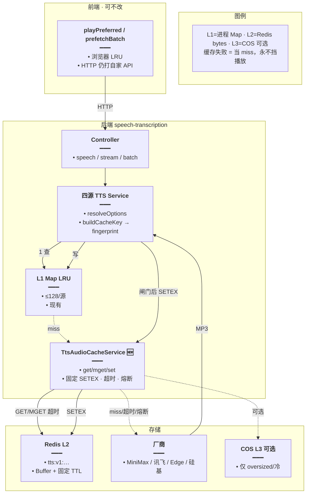
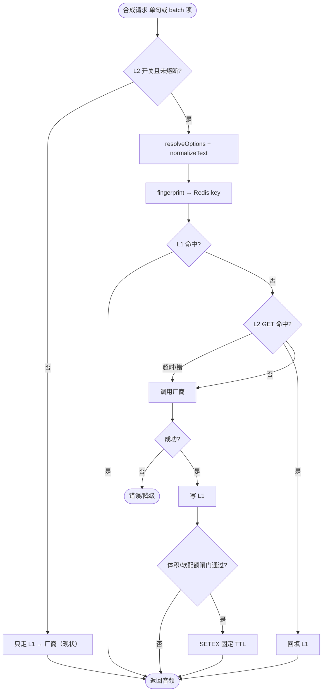
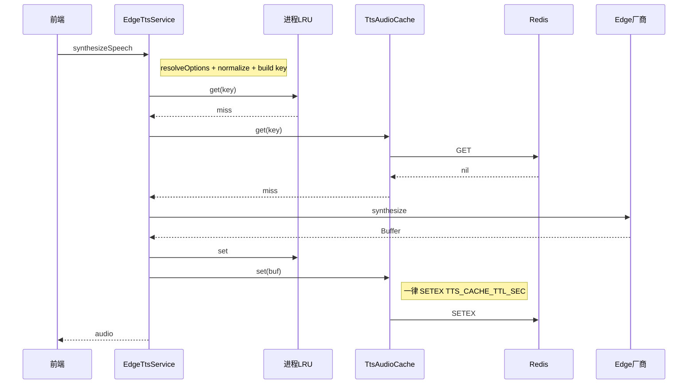
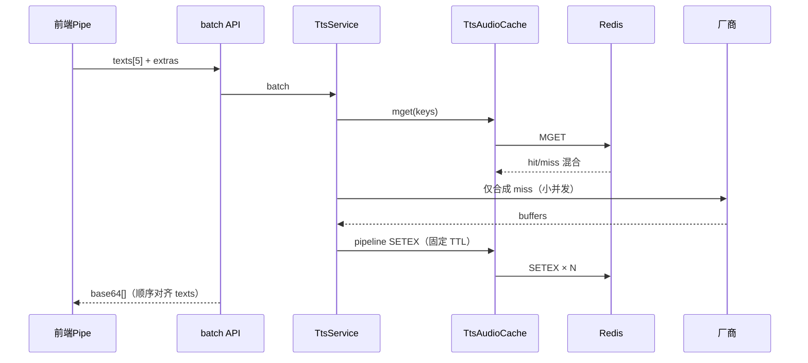
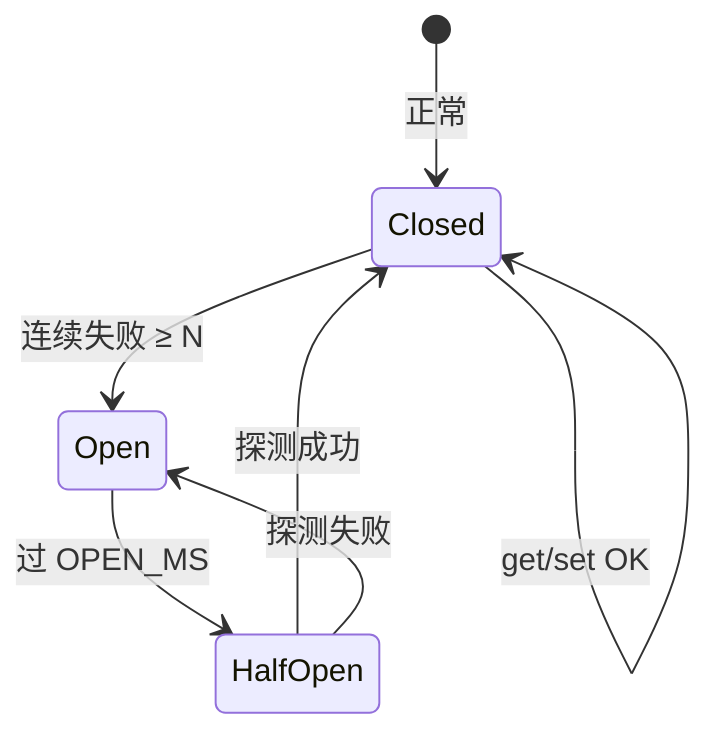

# TTS 合成结果缓存 — 实现思路

> **状态**：M0–M2 曾按 Redis bytes 落地；**若用海外/高延迟 Redis，推荐改用** [TTS本地文件缓存.md](./TTS本地文件缓存.md)（盘存音频 + Redis 仅存路径）  
> **日期**：2026-09-24（方案修订：去掉按 Redis 内存设 TTL；代码已对齐）  
> **需求摘要**：服务端对云端 TTS 音频做跨实例共享缓存，同文案+同音色参数少打厂商；改参自动换键；热路径不被缓存拖垮；内存靠固定过期 + Redis 淘汰兜底。

## 延伸阅读

- 练习侧预取（客户端 batch）：[听写TTS分批预取.md](../english/听写TTS分批预取.md)
- 讯飞/三源选路：`[tts/讯飞云TTS.md](./讯飞云TTS.md)`
- 现有进程内 LRU：`minimax-tts.service.ts` / `xfyun-tts.service.ts` / `edge-tts.service.ts` / `siliconflow-transcription.service.ts`
- 前端会话 LRU：`apps/frontend/src/utils/speech.ts`
- Nest Cache（JSON/Keyv，**不可直接存 MP3**）：`factorys/redis-config.factory.ts`
- Bull 独立 Redis 连接工厂（可仿造 ioredis 选项）：`factorys/bull-redis-connection.factory.ts`
- COS（现无 TTS 前缀）：`upload/cos.config.ts`

---

## 0. 读本文你将得到什么

- **问题**：同句同参反复合成费时费钱；进程 LRU 重启即空、多实例不共享；前端 LRU 不减服务端厂商调用。
- **一句话方案**：**L1 → L2 Redis 原始 bytes → miss 再打厂商**；key 含参数指纹；**一律 `SETEX` 固定 TTL（默认 7 天）**；实例侧配 `maxmemory`+`allkeys-lru`；读写短超时 + 熔断。
- **改动层**：后端 `TtsAudioCacheService` + 四源挂钩；前端可不改。
- **阶段**：M0 基建 → M1 单句 L2 → M2 batch MGET + 指标 → M3 可选 COS；**过期不做水位分档**。
- **最大风险**：Redis 内存被撑爆（用固定 TTL + maxmemory + 单条上限化解）；key 漏参；L2 阻塞听感。

---

## 1. 需求与边界

### 1.1 用户故事


| 角色  | 场景           | 行为       | 期望结果                                   |
| --- | ------------ | -------- | -------------------------------------- |
| 学习者 | 昨天听过的句子，今天再练 | 听写/听书再播  | 服务端命中 L2，几乎不调厂商                        |
| 学习者 | 设置里换发音人/语速   | 再播同一句    | 新参数新音频，绝不播旧音色                          |
| 运维  | 多副本 Nest     | 实例 A 合成过 | 实例 B 从 Redis 命中                        |
| 运维  | Redis 接近满    | 持续有写     | **LRU 淘汰旧键**；应用侧固定 TTL 自然回收；不拖死登录/Bull |
| 开发  | Redis 抖动或挂起  | 用户仍点播放   | 接口成功走厂商，无 5xx 洪峰                       |


### 1.2 范围


| 在范围内                                   | 不在范围内                   |
| -------------------------------------- | ----------------------- |
| MiniMax / 讯飞 / Edge / 硅基 合成结果服务端 L2    | 本机 Web Speech           |
| 参数指纹 key + **固定 TTL** + Redis LRU 兜底   | **按 Redis 内存水位动态改 TTL** |
| 与现有 L1 Map、前端 LRU、练习 `speech/batch` 共存 | 业务表存音频 BLOB；改 batch 协议  |


### 1.3 约束与依赖

- Redis 已服务 Cache / Bull 等：**独立前缀 `tts:v1:`**；TTS 可丢。
- L2 用独立 ioredis 存 bytes，**禁止** CacheManager。
- 上线前运维配好 `maxmemory` + `allkeys-lru`（见 §2.4）。

---

## 2. 方案总览（修订定稿）

**一句话方案**：统一 `TtsAudioCacheService`；读 **L1 → L2(超时) → 厂商**；写 **闸门通过后一律 `SETEX(固定 TTL)`**；改参换键；内存顶满交给 Redis LRU；前端零改。

### 2.0 为何「固定 TTL」优于「按内存设过期」


| 维度   | **固定 TTL（选用）**                 | 水位自适应 TTL（否决）                   |
| ---- | ------------------------------ | ------------------------------- |
| 性能   | 写路径无 `INFO memory`、无分档分支       | 需采样/缓存 ratio，写路径更重、行为随水位抖动      |
| 逻辑   | 一条规则：键活 N 天；运维可预期              | 同句不同时刻 TTL 不同，难排查、难验收           |
| 命中率  | 7 天窗口够练习/听书复用                  | 空闲无 TTL 看似更高，但顶满时行为依赖 LRU，收益不稳定 |
| 内存安全 | TTL 回收 + **maxmemory+LRU** 硬兜底 | 仍必须配 maxmemory；自适应只是软策略，复杂度不值   |
| 符合需求 | 少打厂商、改参换键、不拖垮热路径               | 需求未要求「内存空就永不过期」                 |


**职责拆分（最佳）**：


| 层     | 只管什么                             |
| ----- | -------------------------------- |
| 应用    | 固定 `SETEX`；单条体积闸；超时/熔断；可选软配额拒写   |
| Redis | `maxmemory` + `allkeys-lru` 顶满淘汰 |


应用**不要**根据 `used/maxmemory` 去改每条 key 的 TTL。

### 2.1 设计要点


| #   | 要点                                               | 理由                         |
| --- | ------------------------------------------------ | -------------------------- |
| 1   | 独立 ioredis 存原始 bytes                             | 禁 CacheManager/JSON/base64 |
| 2   | key = `tts:v1:{provider}:{paramHash}:{textHash}` | 改音色自然 miss                 |
| 3   | L1 优先                                            | 热点零网络                      |
| 4   | **固定 TTL（默认 7d）**                                | 简单、可预期、写路径轻                |
| 5   | 单条 ≤256KB                                        | 防单 key 吃爆                  |
| 6   | 读写超时 + 熔断                                        | 缓存非 SPOF                   |
| 7   | batch MGET + 返回前 pipeline SETEX                  | 少 RTT、同批可命中                |
| 8   | `TTS_CACHE_L2_ENABLED`                           | 可回滚                        |


### 2.2 方案对比（结论已锁）


| 方案                             | 结论                            |
| ------------------------------ | ----------------------------- |
| 仅进程 LRU                        | 保留为 L1                        |
| Redis bytes + **固定 TTL** + LRU | **L2 定稿**                     |
| Redis + 水位自适应 TTL              | **否决**（复杂、写路径重、难运维）           |
| 永久无 TTL + 仅 LRU                | 不推荐作默认（旧参键堆积；无 maxmemory 时危险） |
| DB / 仅 COS / CacheManager      | 禁止作热路径主存                      |


### 2.3 参数变更：换键，不更新

```text
L2 key = tts:v1:{provider}:{sha256(paramParts)}:{sha256(normalizedText)}
```

旧键靠 **固定 TTL** 与 **LRU** 回收，禁止业务扫删。

### 2.4 内存 · 过期 · 性能

#### 2.4.1 内存


| 层级         | 上限                          | 说明                       |
| ---------- | --------------------------- | ------------------------ |
| L1         | ≤128/源                      | 防 Nest 堆膨胀               |
| L2 单 value | ≤256KB                      | 超限不写 L2                  |
| Redis      | **maxmemory + allkeys-lru** | 硬顶满淘汰                    |
| 序列化        | 原始 bytes                    | 禁止 base64 / CacheManager |


**写入闸门**：

1. 开关关 / 熔断 → 跳过
2. 空 buffer → 跳过
3. 超 `MAX_VALUE` → 跳过
4. 可选：软配额（应用侧 approx bytes）满 → 跳过
5. 通过 → `**SETEX key TTL_SEC`**

**不要**：写前读 `INFO memory` 决定 TTL 或拒写（拒写若需要，用软配额计数，仍不改 TTL）。

#### 2.4.2 过期（定稿：固定绝对 TTL）


| 策略         | 选用                                     |
| ---------- | -------------------------------------- |
| **绝对 TTL** | **默认 7 天**（`TTS_CACHE_TTL_SEC=604800`） |
| 滑动续期       | **不做**（防热点永驻）                          |
| 按内存改 TTL   | **不做**                                 |
| 顶满         | Redis `allkeys-lru`                    |


可选按 provider 微调固定值（仍是常数，不是水位）：Edge 14d；MiniMax/讯飞 7d——首发可全体 7d，YAGNI。

#### 2.4.3 性能


| 路径    | 做法                            |
| ----- | ----------------------------- |
| L1 命中 | 不同 Redis                      |
| L2    | GET；超时当 miss                  |
| 写     | 固定 SETEX；batch pipeline；失败只打点 |
| 熔断    | 连续失败打开 N 秒                    |


写路径**无内存采样** → 延迟更稳、逻辑更短。

#### 2.4.4 推荐默认配置


| 配置项                            | 默认                          | 作用           |
| ------------------------------ | --------------------------- | ------------ |
| `TTS_CACHE_L2_ENABLED`         | `false`→启用时 `true`          | 总开关          |
| `TTS_CACHE_TTL_SEC`            | `604800`（7d）                | **唯一过期策略**   |
| `TTS_CACHE_MAX_VALUE_BYTES`    | `262144`                    | 单条闸          |
| `TTS_CACHE_REDIS_SOFT_MB`      | `512`（可选）                   | 应用侧拒写，不改 TTL |
| `TTS_CACHE_GET/SET_TIMEOUT_MS` | `50`                        | 超时降级         |
| `TTS_CACHE_CIRCUIT_`*          | `5` / `30000`               | 熔断           |
| Redis                          | `maxmemory` + `allkeys-lru` | 运维强制         |


**废弃配置（方案层）**：`TTS_CACHE_TTL_MODE=pressure`、`PRESSURE_`*、`TTL_MID/HIGH`、`MEM_SAMPLE_MS`——后续实现应删除或忽略，统一走固定 TTL。

---

## 3. 现状与复用


| 能力                       | 仓库中已有                                   | 本需求用法                      |
| ------------------------ | --------------------------------------- | -------------------------- |
| L1 Map + `buildCacheKey` | 三源 + 硅基 TTS service                     | **保留 L1**；字段表对齐后 hash 进 L2 |
| 前端 LRU + batch           | `speech.ts` / `practiceTtsPrefetchPipe` | **不改协议**；服务端命中后自然更快        |
| Nest `CACHE_MANAGER`     | Keyv Redis，TTL 默认 120s                  | **不用于**音频 L2               |
| Bull Redis 选项            | `createBullRedisConnectionOptions`      | **复用连接参数**建 TTS 专用 client  |
| COS                      | `assets/chat/ebooks/notes`              | M3 可选新前缀 `tts/`            |
| `maxmemory`              | 仓库无 compose 配置                          | 上线清单强制项                    |


**调研结论**：缺跨进程 L2 与 raw Redis 客户端；key 语义已在 L1 成型；CacheManager 路径必须绕开。

---

## 4. 架构图




**图内方法说明**：


| 方法 / 模块                           | 功能                                 |
| --------------------------------- | ---------------------------------- |
| `resolveOptions`                  | 解析用户偏好，保证指纹输入完整                    |
| `buildCacheKey` / `toFingerprint` | L1 原串 → paramParts；sha256 成 L2 key |
| `normalizeTtsText`                | trim/空白/NFC                        |
| `TtsAudioCacheService.get/mget`   | 读 L2；超时/熔断返回 null                  |
| `TtsAudioCacheService.set`        | 闸门通过后固定 TTL SETEX；失败吞掉             |
| `synthesizeSpeech` / batch        | L1→L2→厂商→回填                        |


**读图要点**：

- 加速全在服务端；前端无感知。  
- L2 故障与未开开关行为一致：退化为今日现状（仅 L1）。  
- COS 不在热路径默认链上。

---

## 5. 主流程图




**图内方法说明**：


| 方法            | 功能                     |
| ------------- | ---------------------- |
| `set` / `get` | L2 读写；写用固定 TTL；内部超时    |
| 厂商合成          | 仅 L1+L2 皆未命中（或 L2 不可用） |


**读图要点**：读路径短；写失败不影响本次响应；**无内存水位分支**。

---

## 6. 核心时序图

### 6.1 单句 miss → 合成 → 固定 TTL 写入




### 6.2 练习 batch（最佳路径）




**图内方法说明**：


| 方法                 | 功能                    |
| ------------------ | --------------------- |
| `mget`             | 一次取齐 batch keys，降 RTT |
| `pipeline set`     | 返回前写齐，保证紧随播放可命中       |
| `synthesizeSpeech` | 仅对 miss；命中项直接用 Buffer |


**读图要点**：与前端 `ahead=5` 叠加——HTTP 一次、厂商按 miss 数、Redis 一次往返级。

---

## 7. 状态机（L2 客户端）




**图内方法说明**：熔断打开期间 `get/set` 直接 no-op（当 miss / 跳过写），保护 Redis 与接口延迟。

---

## 8. 模块职责与接口草图

### 8.1 模块一览


| 模块                       | 职责                                | 新增/改动     | 路径（预估）                                            |
| ------------------------ | --------------------------------- | --------- | ------------------------------------------------- |
| `TtsAudioCacheService`   | raw Redis、**固定 SETEX**、超时、熔断、mget | **新增**    | `speech-transcription/tts-audio-cache.service.ts` |
| `TtsAudioCacheModule`    | 注入专用 Redis 连接                     | **新增**    | 同目录 module                                        |
| 四源 `*-tts` / siliconflow | L1 后查 L2；成功回填；batch 走 mget        | **扩展**    | 现有 service                                        |
| 配置 / Joi                 | §2.4.4 env（无 pressure 项）          | **扩展**    | `app-config` / `.env`                             |
| 运维                       | maxmemory + allkeys-lru           | **文档+环境** | 部署说明                                              |


### 8.2 关键接口（草图）

```typescript
// L2 键：版本隔离 + 短 hash；禁止把整段英文原文塞进 key
function buildTtsRedisKey(input: {
	provider: 'minimax' | 'xfyun' | 'edge' | 'siliconflow';
	// 与现 buildCacheKey 同序、同字段；Edge 跨用户共享时去掉 userId
	paramParts: string[];
	// 已 normalize 的播报文本
	normalizedText: string;
}): string {
	// return `tts:v1:${provider}:${paramHash}:${textHash}`
	return '';
}

// 唯一 L2 门面：二进制、固定 TTL、超时、熔断；禁止经 CacheManager
interface TtsAudioCacheService {
	get(key: string): Promise<Buffer | null>;
	mget(keys: string[]): Promise<(Buffer | null)[]>;
	// 内部一律 SETEX(TTS_CACHE_TTL_SEC)；过大/配额满则跳过
	set(key: string, audio: Buffer): Promise<void>;
}
```

### 8.3 Fingerprint 字段清单（须单测锁死）


| Provider | 进入 paramParts 的字段                                                                                       | 共享策略       |
| -------- | ------------------------------------------------------------------------------------------------------- | ---------- |
| MiniMax  | userId, model, voiceId, speed, vol, pitch, emotion, sampleRate, bitrate, format, channel, languageBoost | **按用户**    |
| 讯飞       | userId, credTag, vcn, speed, volume, pitch                                                              | **按用户+凭证** |
| Edge     | voice, rate, volume, pitch（**L2 不含 userId**）                                                            | **跨用户共享**  |
| 硅基       | model, voice, 与现 L1 一致的标志位                                                                              | 与现 L1 对齐   |


`text` **不进** paramHash，单独 `textHash`。  
凭证明文禁止进 Redis key 与日志；`credTag` 用 `'env'` / 用户 appId 摘要即可（与现讯飞一致）。

### 8.4 Edge boundaries 特例

Edge `timed` 接口除 MP3 外有 boundaries。最佳策略：

- **音频 L2**：只缓存 MP3 Buffer（与其它源一致）。  
- **boundaries**：继续 L1 进程缓存；或 L2 旁路键 `tts:v1:edge:meta:{paramHash}:{textHash}` 存 JSON（体积小）。  
- **不要**把 boundaries 塞进音频 value 做自定义容器（解析脆、难通用）。

### 8.5 与练习 batch / 前端缓存关系


| 层        | 作用             |
| -------- | -------------- |
| 前端 LRU   | 同会话少打自家 API    |
| 前端 batch | 少 HTTP 往返      |
| 服务端 L1   | 同进程少打 Redis/厂商 |
| 服务端 L2   | 跨实例少打厂商        |


四层互补，**不要删前端 batch** 指望只靠 L2。

---

## 9. 分阶段实现步骤


| 阶段     | 目标       | 交付                                           | 依赖  |
| ------ | -------- | -------------------------------------------- | --- |
| **M0** | 基建可回滚    | 专用 Redis client、env、开关默认 off、运维 maxmemory 清单 | —   |
| **M1** | 单句 L2 正确 | key 单测、L1→L2→厂商、**固定 SETEX**、超时降级            | M0  |
| **M2** | 批处理 + 稳态 | batch MGET/pipeline、metrics、熔断、可选软配额         | M1  |
| **M3** | 可选冷层     | COS 仅 oversized；非默认                          | M2  |


### M0

- `TTS_CACHE_L2_ENABLED`；连接失败不影响启动  
- 部署：`maxmemory` + `allkeys-lru`  
- 不用 `CACHE_MANAGER` 存音频

### M1

- `buildTtsRedisKey` + 四源字段  
- Edge L2 去 userId  
- **一律固定 TTL SETEX**（无 pressure）  
- 单条 max / 超时 / 原始 bytes

### M2

- `mget` + batch 返回前写齐  
- metrics 计数；熔断；软配额可选（**不做水位 TTL**）  
- 验收路径已具备（AC1–AC12）

### M3

- COS 可选

---

## 10. 关键决策与备选


| 决策      | **选用（最佳）**                      | 备选                | 为何不选备选                 |
| ------- | ------------------------------- | ----------------- | ---------------------- |
| L2 客户端  | 独立 ioredis Buffer               | CacheManager      | JSON 不适合音频             |
| 主存      | Redis                           | DB / 仅 COS        | 热读不合适                  |
| 改参      | 换 key                           | 扫删                | 贵且易漏                   |
| **过期**  | **固定 7d SETEX + maxmemory/LRU** | 水位自适应 TTL；永久无 TTL | 自适应复杂且写路径重；无 TTL 依赖运维强 |
| 顶满      | Redis LRU                       | 应用按 INFO 拒写/改 TTL | 职责交给 Redis，应用保持简单      |
| Edge 共享 | L2 无 userId                     | 按用户拆              | 命中率差                   |
| 写 batch | 返回前 pipeline SETEX              | 纯异步               | 同批下句易 miss             |
| 前端      | 不改                              | 改协议               | 无必要                    |


---

## 11. 风险、边界与待确认


| 项                 | 等级  | 说明            | 缓解                      |
| ----------------- | --- | ------------- | ----------------------- |
| 共享 Redis 被 TTS 挤占 | 高   | 长句×多用户        | 单条闸、固定 TTL、LRU、软配额、前缀隔离 |
| L2 变慢             | 高   | 拖垮播放          | 超时、熔断、开关                |
| key 漏字段           | 高   | 改 pitch 仍旧声   | 单测锁表                    |
| 无 maxmemory       | 高   | 内存可无限涨        | 部署清单强制配置                |
| 异步写竞态             | 低   | batch 下句 miss | 返回前写齐                   |


**待确认**：

- 生产 / 本机 Redis 已设 `maxmemory` + `allkeys-lru`  
- Edge 跨用户共享是否产品接受  
- TTL 7d 是否够用（不够只改常数，不引入水位逻辑）

---

## 12. 验收清单


| #    | 用例       | 步骤                 | 期望                      |
| ---- | -------- | ------------------ | ----------------------- |
| AC1  | 冷→热      | 同句同参两次             | 第二次无厂商调用                |
| AC2  | 改音色      | 改 voice 再播         | 必打厂商；新音色                |
| AC3  | 多实例      | A 合成后 B 播          | B 命中 Redis              |
| AC4  | 重启 Nest  | 清 L1               | L2 仍命中                  |
| AC5  | 练习 batch | 预取后重进              | 厂商次数显著下降                |
| AC6  | 内存闸      | >256KB             | 不进 L2；接口成功              |
| AC7  | 过期       | 短 TTL / EXPIRE     | 过期后重新打厂商                |
| AC8  | Redis 挂  | 断连/超时              | 走厂商；无 5xx 洪峰            |
| AC9  | L1 性能    | 同进程热句              | 延迟不明显差于上线前              |
| AC10 | 顶满淘汰     | maxmemory 较小并灌满    | 仍可播放；旧 TTS key 可被 LRU 掉 |
| AC11 | 开关       | `L2_ENABLED=false` | 行为同仅 L1                 |
| AC12 | Edge 共享  | 两 user 同参同句        | 共用同一 L2 key（若产品确认）      |


---

## 13. 预估改动面


| 类型   | 路径                                                       |
| ---- | -------------------------------------------------------- |
| 已有实现 | `tts-audio-cache.service.ts` 等（**待去掉 pressure 逻辑以贴合本文**） |
| 配置   | `TTS_CACHE_TTL_SEC` 等；废弃 pressure 相关 env                 |
| 运维   | Redis `maxmemory` + `allkeys-lru`                        |
| 文档   | 本文                                                       |


---

## 14. 全局结论

1. L2：独立 Redis 客户端存原始 MP3；不进 DB；不用 CacheManager。
2. Key 带参数指纹；改音色只换键。
3. **过期 = 固定绝对 TTL（默认 7 天）**；**内存顶满 = Redis maxmemory + allkeys-lru**；**不做按内存设 TTL**。
4. 读：L1 → L2（超时/熔断）→ 厂商；写：闸门后 SETEX；batch：MGET + pipeline。
5. 前端与协议不动；开关可关。

（修订定稿：高性能靠短路径与固定 SETEX；逻辑最佳靠职责分离；需求满足靠命中减厂商 + 换键改参 + 不挡播放。）