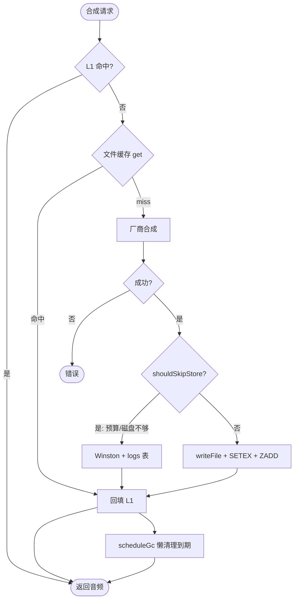
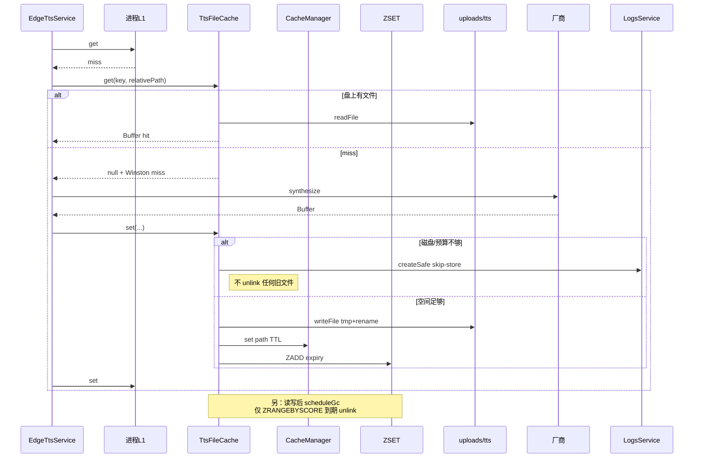
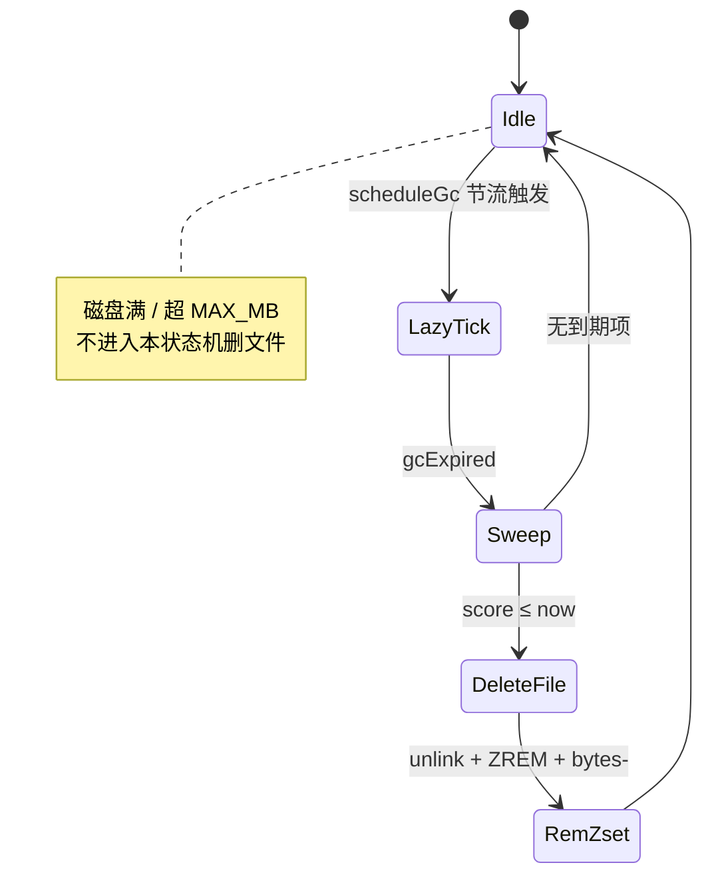

# TTS 本地文件缓存 — 实现思路

> **状态**：M0–M2 已落地（定稿含删除策略修订）  
> **日期**：2026-09-25  
> **需求摘要**：合成音频落盘 `uploads/tts/`，Redis 只存「指纹 → 相对路径」+ TTL；命中读盘不调厂商；改参换新文件；**仅 TTL 到期才删盘**；磁盘/预算不够则**跳过落盘（不删旧文件）**并记库。

## 延伸阅读

- 前一版「Redis 存 MP3 bytes」：[TTS合成结果缓存.md](./TTS合成结果缓存.md)
- 练习 batch 预取：[听写TTS分批预取.md](../english/听写TTS分批预取.md)
- 讯飞/三源：[讯飞云TTS.md](./讯飞云TTS.md)
- 实现：`apps/backend/src/services/speech-transcription/tts-file-cache.service.ts`
- 操作日志：`apps/backend/src/services/logs/logs.service.ts`（管理端「日志管理」读同一 `logs` 表）

---

## 0. 读本文你将得到什么

- **问题**：同参反复打厂商贵且慢；整段 MP3 进云 Redis 延迟/内存差。
- **一句话方案**：盘存 MP3 + CacheManager 存路径 + ZSET 到期表；**懒 GC 只删过期**；空间不够只跳过写入。
- **改动层**：后端 `TtsFileCacheService` + 四源 TTS；前端零改。
- **阶段**：M0–M2 已落地；M3 多实例共享盘/metrics 可选。
- **最大风险**：多副本不共享 `uploads`；预算打满后新句暂不落盘（仍返回内存音频）。

---

## 1. 需求与边界

### 1.1 用户故事

| 角色 | 场景 | 行为 | 期望结果 |
|------|------|------|----------|
| 学习者 | 同句同音色再播 | 听写/听书 | 读盘命中，不调厂商 |
| 学习者 | 改发音人/语速 | 再播同句 | 新指纹新文件 |
| 运维 | TTL 到期 | — | ZSET 懒 GC 删过期文件 |
| 运维 | 磁盘紧 / 超 `MAX_MB` | 新合成 | **不删旧文件**；跳过落盘；`logs` 表可查 |
| 开发 | Redis/盘 miss | 点播放 | 厂商合成；接口仍成功；Winston 打 miss 日志 |

### 1.2 范围

| 在范围内 | 不在范围内 |
|----------|------------|
| MiniMax / 讯飞 / Edge / 硅基 落盘缓存 | 本机 Web Speech |
| 路径索引 + TTL + ZSET 到期删除 | Redis/DB 存音频 BLOB |
| 预算/磁盘不足 → 跳过落盘 + 记库 | 磁盘紧张时 LRU 删最早一批 |
| 单机或共享盘多实例 | 改前端 batch 协议 |

### 1.3 约束与依赖

- `getUploadTtsDir()` → `uploads/tts/`；API 内读盘，默认不公开静态 `/tts`。
- 路径走全局 **CACHE_MANAGER**；ZSET 用 Bull 同款 ioredis（仅 GC/计数）。
- 业务日志统一 `@Inject(WINSTON_MODULE_NEST_PROVIDER)`；跳过落盘另写 `LogsService.createSafe`。

---

## 2. 方案总览

**一句话方案**：`L1 → 文件缓存 get → 厂商`；成功后 `set`（预算+磁盘检查通过才写盘）；删除 **仅** `gcExpired` 处理 ZSET 已到期 member。

### 2.1 定稿要点

| # | 要点 | 理由 |
|---|------|------|
| 1 | Redis **只存路径**（CacheManager） | 云 Redis 友好 |
| 2 | 指纹换文件 | 改参不播错声 |
| 3 | TTL 默认 7d | 可预期 |
| 4 | **删除 = 仅 TTL 到期** | 禁止因磁盘/预算主动删旧文件 |
| 5 | 空间不够 → **skip store** | 宁可不缓存，不打爆盘；音频仍在内存返回 |
| 6 | 懒 GC（有读写时节流触发） | 无后台 `setInterval`；有流量摊销清理 |
| 7 | `MAX_MB` 预算（默认 2048） | 限制 `tts/` 体积，超则跳过写入 |

### 2.2 删除逻辑（定稿 · 重点）

| 场景 | 是否删盘上旧文件 | 行为 |
|------|------------------|------|
| Redis/ZSET **TTL 到期** | **是** | `gcExpired`：`ZRANGEBYSCORE` → `unlink` mp3/json → `ZREM`；扣减 `tts:file:v1:bytes` |
| **超 `TTS_FILE_CACHE_MAX_MB`** | **否** | `shouldSkipStore` → 不 `writeFile`；Winston warn + **DB logs** |
| **磁盘可用 &lt; 新文件 + 64MB** | **否** | 同上 `reason=disk_insufficient` |
| **单文件 &gt; 整个预算** | **否** | `reason=over_budget_file` |
| 读盘 miss / 索引丢但盘上有文件 | 不删对方 | miss 打厂商；盘上命中则回填索引 |

**禁止**（曾评估后废弃）：

- 磁盘快满时按「最早一批」ZRANGE/mtime 淘汰  
- 超预算时删旧腾地方再写入  

写库跳过落盘字段约定：

| 字段 | 值 |
|------|-----|
| path | `/internal/tts-file-cache/skip-store` |
| method | `SYSTEM` |
| result | `507` |
| data.reason | `disk_insufficient` / `over_budget_file` / `over_budget_total` |

管理端 **日志管理**（`dnhyxc-ai-admin` → `/ai-logs`）可读到。

### 2.3 指纹与文件名

```text
Redis key = tts:file:v1:{provider}:{paramHash64}:{textHash64}
磁盘文件 = uploads/tts/{provider}_{paramHash12}_{textHash12}.mp3
ZSET     = tts:file:v1:expiry   score=过期 unix 秒  member=相对路径
BYTES    = tts:file:v1:bytes    近似占用计数
```

---

## 3. 现状与复用

| 能力 | 仓库中已有 | 本需求用法 |
|------|------------|------------|
| uploads | `getUploadsRoot` / `getUploadTtsDir` | `uploads/tts/` |
| 四源 L1 | `*-tts.service.ts` 等 | 保留；后接文件缓存 |
| CacheManager | 全局 Redis 短串 | 路径 SETEX |
| ioredis（经 Bull） | `createBullRedisConnectionOptions` | 仅 ZSET + bytes |
| LogsService | `logs` 表 | skip-store 记库 |
| Winston | `WINSTON_MODULE_NEST_PROVIDER` | 业务日志 |

**调研结论**：实现已落在 `tts-file-cache.service.ts`；删除策略以本节 2.2 为准（覆盖早期「磁盘满删最早」草案）。

---

## 4. 架构图

```mermaid
flowchart TB
  subgraph Legend["图例"]
    Lg["删盘：仅 TTL 到期<br/>空间不够：跳过落盘+记库<br/>不挡播放"]
  end

  subgraph FE["前端"]
    Play["<b>play / batch</b><br/>━━━<br/>• 现有 speech API"]
  end

  subgraph BE["speech-transcription"]
    Svc["<b>四源 TTS</b><br/>━━━<br/>• L1 Map<br/>• fingerprint"]
    FC["<b>TtsFileCacheService</b><br/>━━━<br/>• get / set<br/>• shouldSkipStore<br/>• gcExpired 懒触发"]
    Logs["<b>LogsService</b><br/>━━━<br/>• createSafe"]
  end

  subgraph Store["存储"]
    CM["CacheManager<br/>key→path"]
    Z["ZSET expiry"]
    Disk["uploads/tts"]
    Vendor["厂商 TTS"]
  end

  Play --> Svc
  Svc --> FC
  FC --> CM
  FC --> Disk
  FC -. miss .-> Vendor
  Vendor --> Svc
  Svc --> FC
  FC -->| "空间 OK" --> Disk
  FC -->| "空间不够" --> Logs
  FC --> Z
  FC -. "仅到期" .-> Disk
```

**图内方法说明**：

| 方法 / 模块 | 功能 |
|-------------|------|
| `get` | 索引/盘命中返回 Buffer；miss/error 打 Winston「未走文件缓存」 |
| `set` | `shouldSkipStore` 通过才写盘+索引+ZADD；否则记库 |
| `shouldSkipStore` | 预算/磁盘检查；**不删旧文件** |
| `gcExpired` | 只删 ZSET 已到期 member |
| `scheduleGc` | 读写后节流（≥60s）触发 `gcExpired` |
| `LogsService.createSafe` | 跳过落盘写入 `logs` 表 |

**读图要点**：播放热路径与删除解耦；删除通道只有到期 GC。

---

## 5. 主流程图



**图内方法说明**：

| 方法 | 功能 |
|------|------|
| `shouldSkipStore` | true → 不落盘；音频仍 FillL1 返回 |
| `scheduleGc` | 顺带清到期，不因空间删 |

**读图要点**：Skip 分支**零删除**；只有 Sched→`gcExpired` 会 unlink。

---

## 6. 核心时序图



**图内方法说明**：

| 方法 | 功能 |
|------|------|
| `get` / `set` | 读命中与条件写盘 |
| `createSafe` | 跳过落盘持久化到业务 `logs` |
| `gcExpired` | 到期批删（与 set 失败路径无关） |

---

## 7. GC / 删除状态



**图内方法说明**：`gcExpired` 单次默认批大小 32；只处理已到期。

---

## 8. 模块与配置

### 8.1 模块

| 模块 | 路径 | 状态 |
|------|------|------|
| `TtsFileCacheService` | `speech-transcription/tts-file-cache.service.ts` | 已落地 |
| `tts-file-cache.keys` | 同目录 | 指纹/ZSET/BYTES 常量 |
| 四源 TTS | `edge/minimax/xfyun/siliconflow-*.ts` | L1→文件缓存→厂商 |
| `getUploadTtsDir` | `utils/upload-paths.ts` | 已落地 |

### 8.2 接口草图

```typescript
// 生成 Redis key 与相对路径（禁止仅用原文当文件名）
function buildTtsFileIds(input: {
	provider: 'minimax' | 'xfyun' | 'edge' | 'siliconflow';
	paramParts: string[];
	normalizedText: string;
}): { redisKey: string; relativePath: string; filename: string };

// 文件缓存门面：空间不够只跳过写入，绝不因空间删旧文件
type TtsFileCacheService = {
	// 命中读盘；miss 打「未走文件缓存」日志
	get(redisKey: string, relativePath: string): Promise<Buffer | null>;
	// 预算/磁盘检查通过才落盘；否则 createSafe 记库
	set(redisKey: string, relativePath: string, audio: Buffer, jsonSide?: unknown): Promise<void>;
	// 仅删除 ZSET 中已到期的 member
	gcExpired(limit?: number): Promise<number>;
};
```

### 8.3 配置

| 项 | 默认 | 说明 |
|----|------|------|
| `TTS_FILE_CACHE_ENABLED` | `false`（开发可 true） | 总开关 |
| `TTS_FILE_CACHE_TTL_SEC` | `604800` | 路径 TTL + ZSET 到期；0=不限制 TTL（以实现为准） |
| `TTS_FILE_CACHE_MAX_MB` | `2048` | `tts/` 预算；超出**跳过落盘不删旧**；0=不限制体积 |

建议（约 59G 盘 / 3.6G 内存机器）：`MAX_MB=2048`。

---

## 9. 分阶段

| 阶段 | 状态 | 交付 |
|------|------|------|
| M0 | ✅ | `getUploadTtsDir`、env 开关 |
| M1 | ✅ | get/set、四源挂钩、盘兜底、miss 日志 |
| M2 | ✅ | ZSET + **懒** `gcExpired`；skip-store 记库；**无磁盘满删旧** |
| M3 | 可选 | 共享盘、metrics |

---

## 10. 关键决策

| 决策 | 选用 | 废弃/备选 | 为何 |
|------|------|-----------|------|
| 到期删盘 | ZSET + 懒 GC | 仅 keyspace | 云 Redis 常关 notify |
| 磁盘/预算压力 | **跳过落盘 + 记库** | 删最早一批腾地方 | 避免误删；不打爆盘靠不写入 |
| 路径索引 | CacheManager | 专用 ioredis GET/SET | 与业务缓存统一 |
| ZSET 连接 | Bull 同款 options | 新依赖包 | 少声明、命令仅 Z* |
| GC 触发 | 读写节流懒触发 | 固定 setInterval | 无空转定时器 |
| 日志 | Winston + skip 时 LogsService | 仅 console | 管理端可查 |

---

## 11. 风险

| 项 | 等级 | 说明 | 缓解 |
|----|------|------|------|
| 预算打满 | 中 | 新句暂不落盘，反复打厂商 | 监控 skip-store 日志；调大 MAX_MB / 等 TTL |
| 多实例本地盘 | 高 | 缓存不共享 | 共享 UPLOAD_ROOT |
| bytes 计数漂移 | 低 | 近似配额 | 钳到 ≥0；极端可重算 |
| 无流量时到期文件滞留 | 低 | 懒 GC 依赖读写 | 可接受；或后续加运维 Cron |

---

## 12. 验收清单

| # | 用例 | 期望 |
|---|------|------|
| AC1 | 同句同参两次（冷进程） | 第二次 hit；无厂商 |
| AC2 | 改 voice | 新文件；新音色 |
| AC3 | Redis value | 相对路径短串 |
| AC4 | TTL 缩短 + 触发懒 GC | 到期文件被删 |
| AC5 | 盘满或超 MAX_MB 写新文件 | **旧文件仍在**；新文件不落盘；`logs` 有 skip-store |
| AC6 | miss | Winston「未走文件缓存」；仍返回合成音频 |
| AC7 | 关开关 | 仅 L1+厂商 |

---

## 13. 改动面（已落地）

| 类型 | 路径 |
|------|------|
| 核心 | `tts-file-cache.service.ts` / `tts-file-cache.keys.ts` / `tts-file-cache.enum.ts` |
| 挂钩 | `edge/minimax/xfyun/siliconflow` TTS services |
| 工具 | `upload-paths.ts`（`getUploadTtsDir`） |
| 配置 | `.env.development`：`ENABLED` + `MAX_MB=2048` |

---

## 14. 全局结论

1. 盘 + 路径索引适合当前远程 Redis。  
2. **删除只认 TTL 到期**；空间问题只 **跳过落盘并记库**，禁止因磁盘/预算主动删旧缓存。  
3. 改参 = 新指纹新文件。  
4. 多实例须共享 uploads 才能跨机命中。

（完：文档已与现行删除/跳过落盘定稿对齐。）
