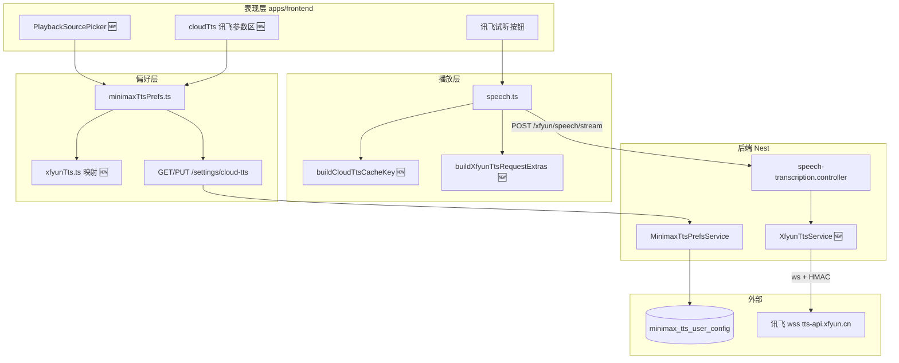
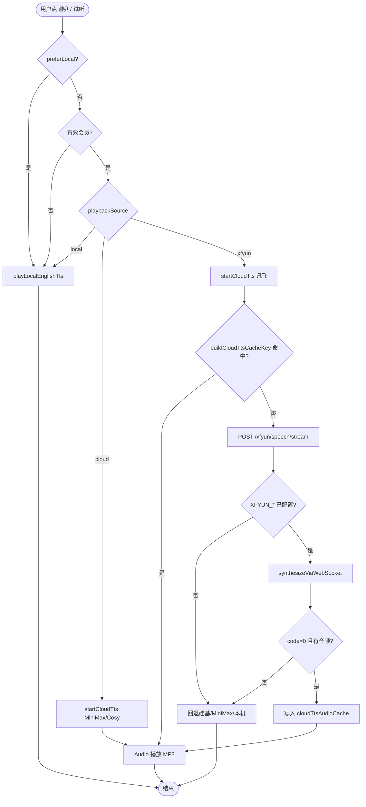
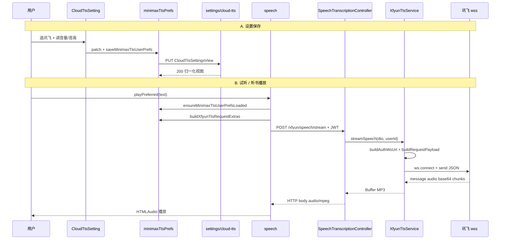
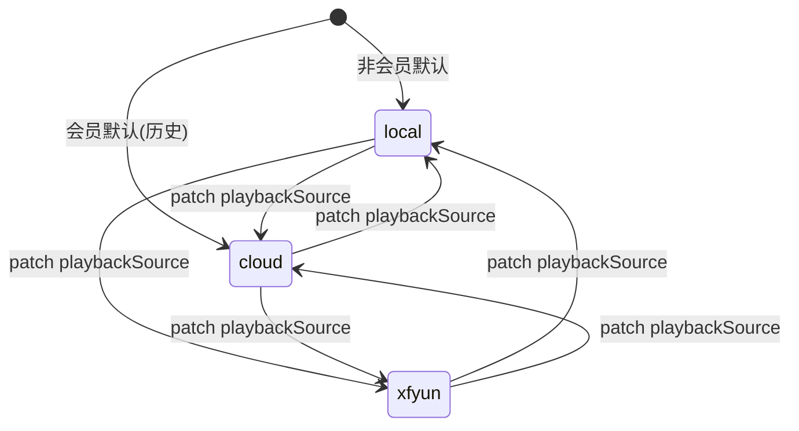

# 讯飞在线云端 TTS — 实现思路

> **状态**：核心能力已上线（2026-06）；本文为 **前后端复刻/onboarding 用规划稿**  
> **日期**：2026-06-27  
> **需求摘要**：有效会员在语音设置增加第三种朗读来源「讯飞云端」，Nest 代理讯飞 WebSocket 合成 MP3，前端与 MiniMax 共用偏好表与 `speech` 选路，适合中文听书。

## 延伸阅读

- 实现归档（改动对比 + 逐行注释）：[`docs/english/讯飞云TTS.md`](../../english/讯飞云TTS.md)
- 选路字段与三选一 UI：[`docs/english/TTS播放源.md`](../../english/TTS播放源.md)
- TTS 端到端全景：[`docs/english/TTS端到端指南.md`](../../english/TTS端到端指南.md)

---

## 0. 读本文你将得到什么

- **问题**：MiniMax/硅基对中文听书体验一般；会员需要第三条云端链路，且生产 Node 18 不能依赖浏览器式全局 `WebSocket`。
- **一句话方案**：扩展 `playbackSource='xfyun'`，前端 `speech` 改 POST 目标与 body；后端 `XfyunTtsService` 用 `ws` 连 `wss://tts-api.xfyun.cn/v2/tts`，HTTP 仍输出 MP3 流。
- **改动层**：设置页 UI + 偏好 API + `speech` 选路/缓存 + Nest Controller/Service + env 配置。
- **落地阶段**：M1 后端通路 → M2 前端选路与设置 → M3 音量/音高与 Node 18 兼容。
- **最大风险**：讯飞 vcn 未授权（11200）、Node 18 误用 `undici@8` 导致进程启动失败、与 MiniMax 共用 `vol/pitch` 量纲切换时数值语义漂移。

---

## 1. 需求与边界

### 1.1 用户故事

| 角色 | 场景 | 行为 | 期望结果 |
|------|------|------|----------|
| 有效会员 | 设置 → 语音设置 | 朗读来源选「讯飞云端」，配置发音人/语速/音量/音高并试听 | 听到中文 MP3；偏好账号同步 |
| 有效会员 | EPUB 听书 / 听当前 | 已选讯飞来源后点播放 | 走讯飞 API；长文仍分段预取 |
| 有效会员 | 讯飞不可用 | 服务端未配密钥或合成失败 | 回退硅基/MiniMax/本机，不白屏 |
| 运维 | 生产 Node v18 | 部署后端 | `ws` 依赖就绪，进程正常启动 |

### 1.2 范围

| 在范围内 | 不在范围内（非目标） |
|----------|----------------------|
| `playbackSource` 三选一（local / cloud / xfyun） | 浏览器直连讯飞 wss（密钥暴露） |
| 讯飞 vcn 列表、0–100 语速/音量/音高 | 独立讯飞偏好表 / 迁移脚本（复用 `minimax_tts_user_config`） |
| `POST .../xfyun/speech/stream` HTTP MP3 | 讯飞 WS 真·逐帧推送到前端（当前 Nest 收齐后整段写回） |
| 与 `speech` 分段预取、LRU 缓存兼容 | 非会员开放讯飞（仍仅本机） |
| Node 18 使用 `ws` 包 | 强制升级 Node 22 才可用 |

### 1.3 约束与依赖

- **会员**：云端选路 UI 仅有效会员；非会员无 `PlaybackSourcePicker`。
- **登录**：TTS 请求带 JWT；偏好 `GET/PUT /settings/cloud-tts`。
- **环境变量**：`XFYUN_APP_ID`、`XFYUN_API_KEY`、`XFYUN_API_SECRET`；可选 `XFYUN_TTS_VCN`。
- **互斥**：听书 vs 听当前（既有）；本机试听 `preferLocal: true` 不受 `playbackSource` 影响。
- **Ponytail**：不新建表；参数映射函数集中 `xfyunTts.ts`；Node 18 用 `ws` 而非 `undici@8`。

---

## 2. 方案总览（一句话 + 要点）

**一句话方案**：在既有 MiniMax 云端 TTS 链路上增加 **并行 HTTP 端点 + 前端选路分支**，Nest 内用 **HMAC 鉴权 WebSocket** 向讯飞要 MP3，对外形态与 MiniMax 流式接口一致。

| # | 设计要点 | 理由 |
|---|----------|------|
| 1 | `playbackSource` 扩 `'xfyun'`，不拆第二套 prefs | 账号同步、迁移成本最低 |
| 2 | `voiceId` 存 vcn；切换来源时 `voiceIdForPlaybackSource` 纠偏 | 避免 vcn 发给 MiniMax |
| 3 | `vol`/`pitch` 入库，UI 0–100 经线性映射 | 后端 DTO 仍校验 MiniMax 量纲 |
| 4 | Nest WS 收齐 → HTTP `res.write` 整段 MP3 | 前端 `fetch` + Blob 播放链零改动 |
| 5 | `buildCloudTtsCacheKey` 按 source 分后缀 | MiniMax/讯飞参数变更不混缓存 |
| 6 | 依赖 `ws@8` 而非全局/undici WebSocket | Node 18.20 生产已验证 |

---

## 3. 现状与复用

| 能力 | 仓库中已有 | 本需求中的用法 |
|------|------------|----------------|
| 会员选路 `playbackSource` | `minimax_tts_user_config.playback_source` | **扩展** 枚举含 `xfyun` |
| 云端 TTS 播放 | `apps/frontend/src/utils/speech.ts` | **扩展** URL/body/cache 分支 |
| 偏好读写 | `minimaxTtsPrefs.ts` + `cloudTtsSettings.ts` | **扩展** 归一化、extras、映射 |
| MiniMax 流式 HTTP | `speech-transcription.controller` | **对照** 讯飞 endpoint 同形态 |
| 设置页分区 | `cloudTts/index.tsx` | **扩展** 讯飞区块 + `PlaybackSourcePicker` |
| 长文分段预取 | `cloud-tts-segment-pipeline` 链路 | **直接复用**（source 无关） |
| 硅基回退 | `SPEECH_TTS` + catch 逻辑 | **复用** 讯飞失败时仍可用 |

**调研结论**：无需新路由模块；核心是 **一个 Service + 一个 DTO + 前端 extras 构建 + 选路三处**（shouldUseCloud、startCloudTts、设置页）。缺的是讯飞鉴权 WS 与 0–100 参数映射。

---

## 4. 架构图



**图内方法说明**：

| 方法 / 模块入口 | 功能 |
|-----------------|------|
| `PlaybackSourcePicker` | 渲染 local/cloud/xfyun 单选；`onChange` 触发 `patch({ playbackSource })` |
| `buildXfyunTtsRequestExtras()` | 从内存 prefs 生成 `{ vcn, speed, volume, pitch }`（0–100）；供 POST body 与缓存 suffix |
| `buildCloudTtsCacheKey(plain)` | 按 `playbackSource` 拼接 LRU key；讯飞路径含 `\u0000xfyun` + extras JSON |
| `ensureMinimaxTtsUserPrefsLoaded()` | 登录后拉取 `/settings/cloud-tts` 填内存缓存；TTS 前必 await |
| `voiceIdForPlaybackSource(source, id)` | 切来源时把 `voiceId` 在 MiniMax id 与讯飞 vcn 间纠偏 |
| `xfyunVolumeFromVol` / `volFromXfyunVolume` | MiniMax `vol` ↔ 讯飞 UI 音量 0–100 双向映射 |
| `xfyunPitchFromPitch` / `pitchFromXfyunPitch` | MiniMax `pitch` ↔ 讯飞 UI 音高 0–100 双向映射 |
| `XfyunTtsService.synthesizeViaWebSocket()` | `ws` 连鉴权 URL，单帧 status=2 发全文，拼 MP3 Buffer |
| `XfyunTtsService.buildAuthWsUrl()` | RFC1123 + HMAC-SHA256 生成讯飞 wss 查询参数 |
| `xfyunSpeechStream()` | Controller：校验 DTO → `streamSpeech` → `res.write` MP3 chunks |
| `MinimaxTtsPrefsService.upsert()` | 持久化含 `playbackSource: xfyun` 的整行偏好 |

**读图要点**：

- 前端 **不直连** 讯飞；密钥仅在后端 `.env`。
- 新增块标 🆕：Picker、映射 util、Service、cache/extras 分支。
- 偏好表名历史原因仍叫 `minimax_tts_user_config`，语义已是「云端朗读总偏好」。

---

## 5. 主流程图



**图内方法说明**：

| 方法 | 功能 |
|------|------|
| `shouldUseCloudTts(options)` | 非 `preferLocal` 且会员且 `playbackSource !== 'local'` 时走云端 |
| `playPreferred(text, options)` | 统一入口：选 local/cloud/xfyun 路径并处理 abort/世代 |
| `startCloudTts(plain)` | 组 headers/body/url；fetch 流式读 body 为 Blob；写 LRU |
| `getCloudTtsFromCache(plain)` | 用 `buildCloudTtsCacheKey` 查内存 LRU |
| `XfyunTtsService.resolveOptions(dto)` | 校验 text 字节上限；默认 speed/volume/pitch=50 |
| `XfyunTtsService.assertXfyunOk(msg)` | 11200 等错误转 HttpException 可读文案 |
| `playLocalEnglishTts` | Web Speech；本机设置页试听固定走此路径 |

**读图要点**：

- **失败不阻塞全局**：讯飞单请求失败进入既有回退链，与 MiniMax 502 一致。
- 缓存 key **必须**含 source + 参数 JSON，否则切讯飞后仍播 MiniMax 旧 MP3。
- 长文场景：`firstCloudTtsChunkPlain` + `prefetchCloudTts` 对 xfyun 同样生效。

---

## 6. 核心时序图



**图内方法说明**：

| 方法 | 功能 |
|------|------|
| `saveMinimaxTtsUserPrefs(next, userId)` | 内存缓存 + 异步 PUT；失败仍保留本地内存态 |
| `buildXfyunTtsRequestExtras()` | 合成 POST 业务字段（不含 text） |
| `streamSpeech(dto, userId)` | 先查 Service LRU；未命中则 `synthesizeViaWebSocket` 后 yield |
| `buildRequestPayload(resolved, appId)` | 讯飞 business：aue=lame, vcn, speed, volume, pitch；data.status=2 单帧 |
| `synthesizeViaWebSocket(resolved)` | Promise 封装 ws 生命周期；90s 超时 |
| `playPreferred` | 云端 Blob 就绪后创建 Object URL 或 MSE cadence 播放 |

**读图要点**：

- 设置链路与播放链路 **解耦**：播放只读内存 prefs，不每次 GET settings。
- 讯飞 WS 在 **Nest 进程内** 完成，对前端仍是单次 HTTP 请求。
- `userId` 参与 Service 侧 LRU key，避免同文不同账号混缓存。

---

## 7. 状态机（playbackSource）



**图内方法说明**：

| 方法 | 功能 |
|------|------|
| `patch(partial)` | 更新 React state；含 `playbackSource` 时调用 `voiceIdForPlaybackSource` 修正 voiceId |
| `normalizePlaybackSource(raw)` | 非法值回落 `cloud`；保证 DB 与内存一致 |

**读图要点**：

- 三态 **互斥**，无「同时开讯飞和 MiniMax」组合态。
- 切换来源 **不自动** 改 speed/vol/pitch 数值（已知语义漂移，与 speed 共用字段策略一致）。

---

## 8. 模块职责与接口草图

### 8.1 模块一览

| 模块 | 职责 | 新增/改动 | 路径 |
|------|------|-----------|------|
| `XfyunTtsService` | WS 合成、鉴权、LRU | 新增 | `apps/backend/.../xfyun-tts.service.ts` |
| `XfyunTtsDto` | 请求校验 | 新增 | `apps/backend/.../dto/xfyun-tts.dto.ts` |
| `SpeechTranscriptionController` | HTTP 路由 | 扩展 | `.../speech-transcription.controller.ts` |
| `xfyunTts.ts` | vcn 白名单、参数映射 | 新增 | `apps/frontend/src/constants/xfyunTts.ts` |
| `minimaxTtsPrefs.ts` | extras、选路归一化 | 扩展 | `apps/frontend/src/utils/minimaxTtsPrefs.ts` |
| `speech.ts` | fetch 分支、cache key | 扩展 | `apps/frontend/src/utils/speech.ts` |
| `PlaybackSourcePicker` | 三选一 UI | 新增 | `cloudTts/PlaybackSourcePicker.tsx` |
| `cloudTts/index.tsx` | 讯飞表单字段 | 扩展 | `views/setting/cloudTts/index.tsx` |

### 8.2 关键接口（草图）

```typescript
// 前端 POST body（讯飞）
type XfyunTtsRequest = {
  text: string;
  vcn?: string;
  speed?: number;   // 0–100
  volume?: number;  // 0–100
  pitch?: number;   // 0–100
};

// 偏好（共用表）
type TtsPlaybackSource = 'local' | 'cloud' | 'xfyun';

function buildXfyunTtsRequestExtras(): Record<string, unknown>;
function buildCloudTtsCacheKey(plain: string): string;
```

```typescript
// 后端 Service 入口
class XfyunTtsService {
  resolveOptions(dto: XfyunTtsDto): XfyunTtsResolved;
  async *streamSpeech(dto: XfyunTtsDto, userId?: number): AsyncGenerator<Buffer>;
  isConfigured(): boolean;
}
```

### 8.3 数据模型

| 字段/实体 | 来源 | 存储 | 说明 |
|-----------|------|------|------|
| `playback_source` | 设置页 Picker | MySQL `minimax_tts_user_config` | `local` / `cloud` / `xfyun` |
| `voice_id` | 发音人下拉 | 同上 | MiniMax voiceId 或讯飞 vcn |
| `speed`, `vol`, `pitch` | 各来源滑块 | 同上 | 讯飞 UI 经映射写入 vol/pitch |
| `XFYUN_*` | 运维 env | 服务端 `.env` | 不入库 |
| MP3 LRU | 合成结果 | 前端内存 Map | key 含 source + extras |

---

## 9. 分阶段实现步骤

| 阶段 | 目标 | 交付物 | 依赖 |
|------|------|--------|------|
| M1 | 后端讯飞 MP3 通路 | Service + DTO + Controller + env | 讯飞控制台密钥 |
| M2 | 前端选路与播放 | Picker、speech 分支、试听 | M1 可联调 |
| M3 | 参数完善与生产兼容 | 音量/音高 UI、映射、`ws` 依赖 | M2 |

### M1 任务

- [ ] `config.enum` 增加 `XfyunEnum` 与 `DEFAULT_XFYUN_TTS_VCN`
- [ ] 实现 `buildAuthWsUrl` / `buildRequestPayload`（单帧 status=2，避免 10163）
- [ ] `POST xfyun/speech/stream` 与 MiniMax 同 Header 策略
- [ ] `package.json` 添加 **`ws`**（勿用 undici@8 作 WS）

### M2 任务

- [ ] `TtsPlaybackSource` 扩 `'xfyun'`；DTO `@IsIn` 同步
- [ ] `PlaybackSourcePicker` + 设置页讯飞区块（发音人、语速）
- [ ] `buildXfyunTtsRequestExtras` + `buildCloudTtsCacheKey`
- [ ] `playPreferred` / `prefetchCloudTts` 走新 URL

### M3 任务

- [ ] 讯飞 **音量/音高** 0–100 滑块 + `volFromXfyunVolume` 等映射
- [ ] i18n `xfyunVolume` / `xfyunPitch`
- [ ] 生产 Node 18 验证：`require('ws')`、无 `File is not defined`
- [ ] 文档：`docs/english/讯飞云TTS.md`

---

## 10. 关键决策与备选方案

| 决策 | 选用 | 备选 | 为何不选备选 |
|------|------|------|--------------|
| WebSocket 客户端 | **`ws` 包** | 全局 WebSocket (Node 22+) | 生产 Node 18 无全局 WS |
| WebSocket 客户端 | **`ws` 包** | `undici` WebSocket | undici@8 在 Node 18 启动报 `File is not defined` |
| 偏好存储 | **复用 minimax 表** | 新表 `xfyun_tts_user_config` | YAGNI；playbackSource 已表达来源 |
| 音量/音高 | **映射到 vol/pitch** | 新列 xfyun_volume | 避免 migration；接受切换来源时量纲共享 |
| 对外协议 | **HTTP MP3 整段** | 浏览器直连 wss | 密钥安全；复用 fetch/Blob 链 |
| 讯飞 WS 帧策略 | **单帧 status=2** | 分帧 + 空结束帧 | 官方在线流式版空结束帧易 10163 |

---

## 11. 风险、边界与待确认

| 项 | 等级 | 说明 | 缓解 |
|----|------|------|------|
| vcn 11200 | 高 | 发音人未开通 | `assertXfyunOk` 友好文案 + 默认 vcn |
| 文本 8000 字节上限 | 中 | 讯飞单次限制 | `resolveOptions` 校验；长文靠前端分段 |
| vol/pitch 语义漂移 | 低 | 切换 MiniMax↔讯飞 | 文档说明；恢复默认 |
| deploy 漏装 ws | 高 | MODULE_NOT_FOUND | 部署 checklist + `installDeps` |
| 讯飞额度/计费 | 中 | 线上成本 | 控制台监控；未配置则回退 |

**待确认**：

- [ ] 是否需 DB migration 显式改 `playback_source` 默认值（当前 varchar 已可容纳 `xfyun`）— 验证：现有列长度 ≥16
- [ ] 讯飞 speed UI 是否改为原生 0–100（当前仍用 MiniMax 0.5–2 滑块 + 映射）— 产品可选 polish

---

## 12. 验收清单

| # | 用例 | 步骤 | 期望 |
|---|------|------|------|
| AC1 | 设置保存 | 会员选讯飞 → 改 vcn → 刷新 | PUT 200；playbackSource=xfyun |
| AC2 | 讯飞试听 | 点「讯飞试听」 | 听到中文 MP3 |
| AC3 | 音量音高 | 调 volume/pitch 再试听 | 听感变化；请求体含 volume/pitch |
| AC4 | 听书 | EPUB 听书 + 讯飞来源 | 逐句播放；分段预取正常 |
| AC5 | 未配置 | 清空 XFYUN_* | 回退其它云端/本机，不 crash |
| AC6 | Node 18 | 生产启动 + 合成 | 无 WebSocket/File ReferenceError |
| AC7 | 缓存隔离 | 同句先 MiniMax 后讯飞 | 不同 MP3，不命中错缓存 |

---

## 13. 预估改动面（实现阶段参考）

| 类型 | 路径 |
|------|------|
| 后端 | `xfyun-tts.service.ts`, `xfyun-tts.dto.ts`, `speech-transcription.controller.ts`, `config.enum.ts`, `package.json`（ws） |
| 前端 | `xfyunTts.ts`, `minimaxTtsPrefs.ts`, `speech.ts`, `cloudTts/index.tsx`, `PlaybackSourcePicker.tsx`, `api.ts`, i18n |
| 偏好 | `minimax-tts-user-config.entity.ts`, `upsert-minimax-tts-prefs.dto.ts`, `minimax-tts-prefs.service.ts` |
| 文档（实现后） | `docs/english/讯飞云TTS.md`, `TTS播放源.md`, 产品姊妹稿 §8.4 / update-info |

---

（本文档为规划态实现思路；落地后以源码与 [`docs/english/讯飞云TTS.md`](../../english/讯飞云TTS.md) 为准）
