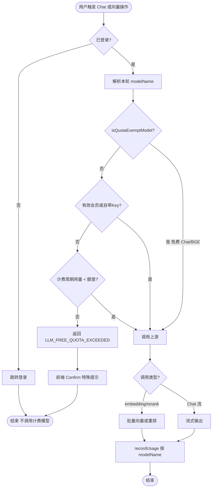
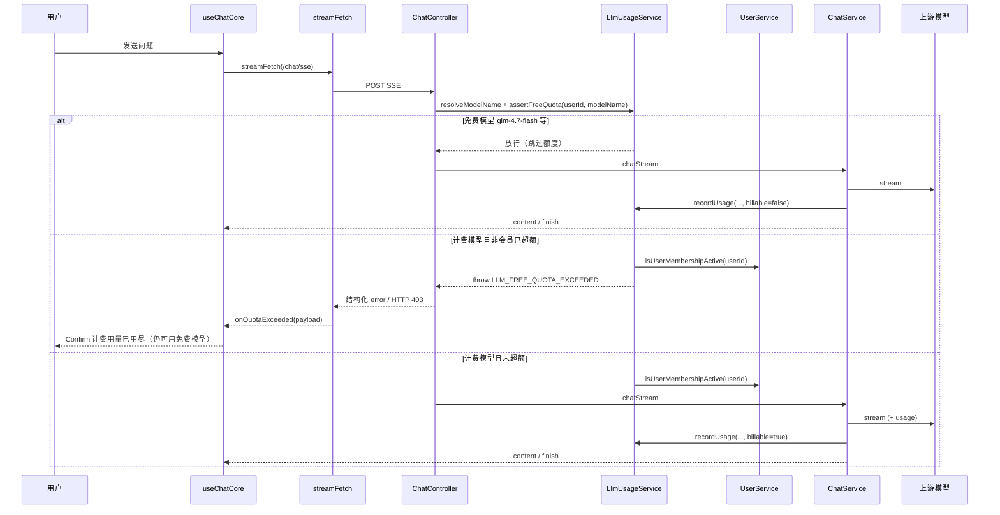
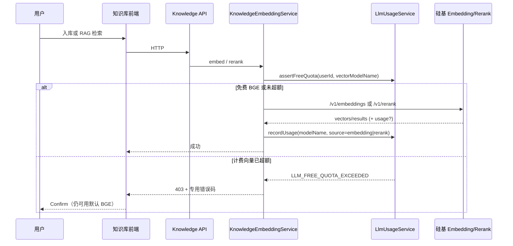

# 非会员 Token 用量限制 — 实现思路

> **状态**：规划（未实现；会员判定与 LLM 工厂可复用）  
> **日期**：2026-09-03  
> **需求摘要**：后端按**模型**统计 token 用量（含 **Chat 与向量 embedding/rerank**）；**免费模型**（如 `glm-4.7-flash`、默认 BGE）不计入额度、非会员可一直用；仅**计费模型**消耗免费额度，超额后给出**专用提示**并阻止继续调用该计费模型。

## 延伸阅读

- [创建LLM.md](../llm/创建LLM.md) — `createLlm` 统一入口与会员/非会员凭证分档  
- [会员单用户LLM.md](../llm/会员单用户LLM.md) — 设置页自定义 Key 与会员档位  
- [Stripe会员计费.md](../pay/Stripe会员计费.md) — 会员开通与到期  
- 前端超额 UI 可对照电子书上传会员拦截：`EBOOK_UPLOAD_MEMBERSHIP_REQUIRED`（`apps/frontend/src/store/ebook.ts`）

---

## 0. 读本文你将得到什么

- 解决什么：非会员用**计费 Chat / 向量模型**无限消耗平台成本；免费档应放行；需要按模型账本 + 超额拦截。
- 一句话方案：Chat 与 **embedding/rerank** 统一按 `modelName` 落库；命中免费白名单则**不计额度**；计费模型流前/入库前门禁，超额 Confirm → `/pay`。
- 主要改动层：后端 `LlmUsage` + 白名单、Chat SSE、`KnowledgeEmbeddingService` 记量；前端超额 Confirm。
- 分阶段：M1 主站 Chat → M2 向量 embedding/rerank + 其它 LLM 入口 → M3 查询展示。
- 最大风险：模型名归一化漏免；向量 API 不回 usage 需估算；大批量入库记量漏批。

---

## 1. 需求与边界

### 1.1 用户故事

| 角色 | 场景 | 行为 | 期望结果 |
|------|------|------|----------|
| 非会员 | 使用免费 Chat（如 `glm-4.7-flash`）或免费向量（如默认 BGE） | 对话 / 知识库入库与检索 | **始终可用**；明细可记但 `billable=false`，**不计入**限额 |
| 非会员 | 使用计费 Chat 或计费向量（如会员档 Qwen3 Embedding/Rerank），未超限 | 发送问题 / 向量化 / 重排 | 正常执行；usage **按对应 modelName 计入**额度 |
| 非会员 | 计费用量已超限 | 再调计费 Chat 或计费向量 | **不调用**该计费模型；专用提示；**免费 Chat/BGE 仍可用** |
| 有效会员 | 任意 Chat / 向量模型 | 对话或知识库 | 不拦；可记量供运营 |
| 自带 Key 用户 | 设置页自定义大模型/向量 | 调用 | **待确认**：默认不计入平台额度、也不拦截 |

### 1.2 范围

| 在范围内 | 不在范围内（非目标） |
|----------|----------------------|
| 平台 Key 的 Chat / 助手 / Agent / 英语 / 知识问答 Chat | 按消息条数限流（可另做） |
| **向量 embedding + rerank** 按模型记量（入库、查询、RAG 重排） | 按美元计费、供应商账单对账 |
| 按 **modelName** 明细；限额只汇总 **计费模型**（Chat+向量同一账本） | 向量与 Chat 拆两套额度（首期不做） |
| **免费模型白名单**（默认 Chat：`glm-4.7-flash`；向量：`BAAI/bge-large-zh-v1.5`、`BAAI/bge-reranker-v2-m3`） | 按模型单价加权（首期不做） |
| 超额专用错误码 + Confirm（计费路径） | 管理后台可视化改额度（可后置） |

### 1.3 约束与依赖

- 须登录（现有 `JwtGuard`）；会员判定复用 `UserService.isUserMembershipActive`。
- Chat 走 `createLlm`；向量走 `KnowledgeEmbeddingService` + `resolveKnowledgeVectorApiConfigForUser`；记量/门禁一律挂**解析后的 `modelName`**。
- 非会员默认 Chat=`glm-4.7-flash`、向量=`BAAI/bge-*`，均须在免费白名单内。
- 主站 Chat SSE 须扩展超额协议；向量接口多为普通 HTTP，可直接 `ForbiddenException`。
- Ponytail：**一张账本**覆盖 Chat + embedding + rerank；`source` 区分场景，禁止各业务复制记量。

---

## 2. 方案总览（一句话 + 要点）

**一句话方案**：Chat 与向量（embedding/rerank）统一按 `modelName` 记账；免费白名单不计额度；计费模型在调用前按「仅 billable」周期用量门禁，调用后落库；超额专用错误码 + Confirm。

| # | 设计要点 | 理由 |
|---|----------|------|
| 1 | **免费模型不计额度**（已确认：`glm-4.7-flash`、`BAAI/bge-large-zh-v1.5`、`BAAI/bge-reranker-v2-m3`） | 非会员默认 Chat/向量档应能一直用 |
| 2 | **同一账本**覆盖 Chat + embedding + rerank；`source`/`kind` 区分 | 向量也是平台成本，且按模型可审计 |
| 3 | 限额 = 周期内 **`billable=true` 的 totalTokens 求和**（Chat+向量合计） | 一张额度简单；避免两套配额 |
| 4 | **流前/入库前拦截须带 modelName**；免费模型跳过 assert | 超额后切回免费 Chat/BGE 仍可用 |
| 5 | Chat 开 `include_usage`；向量读上游 `usage` 或按文本估算 | 现网 embedding 响应未消费 usage |
| 6 | 自带 Key / 会员默认跳过拦截 | 平台只限制「平台 Key + 计费模型」 |

---

## 3. 现状与复用

| 能力 | 仓库中已有 | 本需求中的用法 |
|------|------------|----------------|
| 会员有效判定 | `apps/backend/src/services/user/user.service.ts` → `isUserMembershipActive` | **直接复用**：会员跳过限额 |
| 会员开通/到期 | `pay/membership.service.ts`、`user.entity` 的 `isMember` / `memberExpiresAt` | **直接复用**：开通后立即恢复可用 |
| LLM 统一工厂 | `create-llm.ts` → `createLlm`；`DEFAULT_GLM_MODEL_NAME` | **扩展**：暴露 Chat `modelName`；白名单默认对齐 |
| 向量 embedding/rerank | `knowledge-embedding.service.ts`；默认 `DEFAULT_KNOWLEDGE_EMBEDDING_MODEL` / `DEFAULT_KNOWLEDGE_RERANK_MODEL`；会员档 Qwen3 | **扩展**：每次 `embed*` / `rerank` 后按模型 `recordUsage`；计费模型调用前 `assertFreeQuota` |
| 向量凭证解析 | `llm-config.service.ts` → `resolveKnowledgeVectorApiConfigForUser` | **直接复用**：记账用解析后的真实 embedding/rerank 模型名 |
| 非会员/会员凭证分档 | `resolveSiliconFlowCredentials`（Chat）+ 向量档位 | **直接复用**：默认免费档 vs 会员计费档 |
| 流式 usage 协议雏形 | `glm.service.ts` 解析 `data.usage`；`ZhipuStreamData.type = 'usage'` | **扩展**：主路径已是 LangChain，需在 chunk 上取 `usage_metadata`；前端 `assistantSse` 目前 **忽略** usage |
| Token 估算 | `assistant-context.util.ts` → `estimateTokenCount` | **直接复用**：上游无 usage 时的降级记量 |
| SSE 入口 | `chat.controller.ts` `/chat/sse`；`useChatCore` + `utils/sse.ts` | **扩展**：预检抛错 / 结构化 error；前端识别错误码弹 Confirm |
| 会员拦截 UI 先例 | ebook `EBOOK_UPLOAD_MEMBERSHIP_REQUIRED` + Confirm | **扩展**：同等交互，文案改为「计费模型免费用量已用尽」 |
| Token 用量表 / 配额服务 | **无** | **新建** |

**调研结论**：Chat 与向量分档已就绪（非会员默认 `glm-4.7-flash` + BGE），但**均无持久化用量**；embedding/rerank 请求当前忽略上游 `usage`。缺口 =「统一白名单账本 + Chat/向量双入口预检记量 + 超额协议」。

---

## 4. 架构图

```mermaid
flowchart TB
  subgraph UI [前端]
    Chat[ChatBot / useChatCore]
    Know[知识库入库 / RAG]
    SseUtil[streamFetch]
    ConfirmUI[Confirm 超额提示 🆕]
    Pay[/pay 支付页]
  end
  subgraph API [后端 API]
    ChatCtl[ChatController.chatStream]
    EmbSvc[KnowledgeEmbeddingService 🆕记量]
    OtherCtl[assistant/agent/… SSE]
  end
  subgraph Domain [领域 🆕]
    Exempt[isQuotaExemptModel]
    Guard[assertFreeQuota]
    Record[recordUsage]
    Sum[sumBillableUsageInPeriod]
  end
  subgraph Exist [已有]
    Member[UserService.isUserMembershipActive]
    Factory[createLlm / resolveSiliconFlowCredentials]
    VecCfg[resolveKnowledgeVectorApiConfigForUser]
  end
  subgraph Data [数据]
    UsageTbl[(llm_token_usage 🆕)]
    UserTbl[(user)]
    Upstream[上游 LLM / Embedding / Rerank]
  end
  Chat --> SseUtil
  SseUtil --> ChatCtl
  Know --> EmbSvc
  ChatCtl --> Factory
  EmbSvc --> VecCfg
  Factory --> Exempt
  VecCfg --> Exempt
  Exempt --> Guard
  Guard --> Member
  Guard --> Sum
  Sum --> UsageTbl
  Member --> UserTbl
  Factory --> Upstream
  VecCfg --> Upstream
  ChatCtl --> Record
  EmbSvc --> Record
  Record --> UsageTbl
  SseUtil --> ConfirmUI
  EmbSvc -.->|计费超额 HTTP 403| ConfirmUI
  ConfirmUI --> Pay
  OtherCtl --> Exempt
  OtherCtl --> Guard
  OtherCtl --> Record
```

**图内方法说明**：

| 方法 / 模块入口 | 功能 |
|-----------------|------|
| `ChatController.chatStream` | 主站对话 SSE；先解析 Chat `modelName`，再决定是否预检 |
| `KnowledgeEmbeddingService` embed / `rerank` | 知识库向量化与重排；解析向量 `modelName` 后预检，成功后按批 `recordUsage` |
| `resolveKnowledgeVectorApiConfigForUser` | 解析 embedding/rerank 的 apiKey/baseURL/**model** |
| `isQuotaExemptModel(modelName)` | 免费白名单（Chat + BGE 向量等）；命中则本轮不计额度、不拦截 |
| `assertFreeQuota(userId, modelName)` | 免费模型/会员/自带 Key 放行；否则查 **billable** 周期用量（含历史向量用量） |
| `sumBillableUsageInPeriod(userId, period)` | `SUM(total_tokens) WHERE billable=true`（Chat+向量合计） |
| `recordUsage(...)` | 写入明细；`source` 可为 chat / embedding / rerank 等；`billable` 由白名单决定 |
| `UserService.isUserMembershipActive(userId)` | 会员不参与免费额度拦截 |
| `createLlm(...)` / `resolveSiliconFlowCredentials` | Chat 最终 modelName |
| `streamFetch(...)` | Chat 超额错误码 → Confirm |
| Confirm 超额组件 | 专用文案 + 「开通会员」；可提示仍可用免费 Chat/BGE |

**读图要点**：

- Chat 与向量共用同一 `LlmUsageService` / 同一张表，限额合计。
- 向量入口是同步 HTTP，超额可直接 403，不必走 SSE。
- 免费 BGE 与免费 Chat 一样走 Exempt 短路径。

---

## 5. 主流程图



**图内方法说明**：

| 方法 | 功能 |
|------|------|
| 解析 `modelName` | Chat 用 `createLlm` 结果；向量用 `resolveKnowledgeVectorApiConfigForUser` 的 embedding/rerank model |
| `isQuotaExemptModel(modelName)` | 免费白名单命中 → 跳过额度预检（含默认 BGE） |
| `assertFreeQuota(userId, modelName)` | 仅对计费模型做周期 billable 汇总比较 |
| `createLlm(...)` / embed / `rerank` | 实际上游调用 |
| `recordUsage(...)` | 持久化；向量可将 `promptTokens≈totalTokens`、`completionTokens=0`；`billable` 由白名单决定 |
| `estimateTokenCount(text)` | 向量无 usage 时按输入文本估算（可按批累加） |

**读图要点**：

- Chat 与向量共用同一预检/记账分支，只是调用形态不同。
- 超额只阻断计费模型；免费 Chat/BGE 仍可用。
- 知识库大批量入库：按批 record，避免只记最后一包。

---

## 6. 核心时序图

### 6.1 Chat（主路径）



### 6.2 向量 embedding / rerank



**图内方法说明**：

| 方法 | 功能 |
|------|------|
| `streamFetch` | Chat SSE；解析超额码并走 `onQuotaExceeded` |
| `assertFreeQuota(userId, modelName)` | 先 `isQuotaExemptModel`；再会员；再 billable 汇总（含历史向量用量） |
| `isUserMembershipActive(userId)` | 会员放行 |
| `chatStream(dto, userId)` | 主站流式对话 |
| `KnowledgeEmbeddingService` embed / `rerank` | 向量化与重排；按批记量 |
| `createLlm(...)` | Chat 上游；需启用 include_usage |
| `recordUsage(...)` | 按模型写入；向量 `source` 为 embedding/rerank |
| `onQuotaExceeded(payload)` | Chat：回滚乐观消息并弹 Confirm |

**读图要点**：

- Chat 与向量共用 `LlmUsageService`；限额合计。
- 向量为同步 HTTP，超额直接 403，前端走知识库错误处理即可。
- Confirm 应暗示「开通会员可用高级模型」，而非「完全不能用知识库」。

---

## 7. （可选）状态机

额度仅针对计费模型：`billable_under_quota` →（累计）→ `billable_exceeded` →（开通会员或改用免费模型）→ 可继续。免费模型路径无额度状态。

---

## 8. 模块职责与接口草图

### 8.1 模块一览

| 模块 | 职责 | 新增/改动 | 预估路径 |
|------|------|-----------|----------|
| `LlmUsage` 实体 | 按模型明细账（含 `billable`） | 新增 | `apps/backend/src/services/llm-usage/` |
| `LlmUsageService` | 白名单、预检、汇总、记账 | 新增 | 同上 |
| `Chat / Assistant / Agent…` | 解析 Chat model → 预检 → 流末记账 | 改动 | `services/chat|assistant|agent|…` |
| `KnowledgeEmbeddingService` | embedding/rerank 预检 + 按模型记量 | **改动** | `services/knowledge-embedding/` |
| `create-llm` / 向量默认常量 | 暴露 modelName；白名单默认值 | 扩展 | `utils/create-llm.ts` |
| `streamFetch` / `useChatCore` | 识别错误码 + Confirm | 改动 | `apps/frontend/src/utils/sse.ts`、`hooks/useChatCore.tsx` |
| i18n | 超额文案（区分免费模型仍可用） | 改动 | `zh-CN.ts` / `en-US.ts` |
| 配置 | 额度、周期、**免费模型列表** | 扩展 | `config.enum` + `.env` |

### 8.2 关键接口（草图）

```typescript
const LLM_FREE_QUOTA_EXCEEDED = 'LLM_FREE_QUOTA_EXCEEDED';
// FREE_LLM_MODELS 默认（已确认免费）：
// glm-4.7-flash,BAAI/bge-large-zh-v1.5,BAAI/bge-reranker-v2-m3

type UsageSource =
  | 'chat'
  | 'assistant'
  | 'agent'
  | 'english'
  | 'knowledgeQa'
  | 'ebookAssistant'
  | 'embedding' // 知识库向量化 / 查询向量
  | 'rerank';

type RecordUsageInput = {
  userId: number;
  modelName: string;
  promptTokens: number;
  completionTokens: number; // 向量场景可为 0
  totalTokens: number;
  source: UsageSource;
  sessionId?: string;
  estimated?: boolean;
};

type QuotaSnapshot = {
  used: number; // 仅 billable（Chat+向量合计）
  limit: number;
  periodStart: string;
  byModel: Array<{ modelName: string; totalTokens: number; billable: boolean }>;
};

declare class LlmUsageService {
  isQuotaExemptModel(modelName: string): boolean;
  assertFreeQuota(userId: number, modelName: string): Promise<QuotaSnapshot>;
  recordUsage(input: RecordUsageInput): Promise<void>;
  getQuotaSnapshot(userId: number): Promise<QuotaSnapshot>;
}
```

**SSE/HTTP 超额载荷建议**（`byModel` 只列计费模型，可含向量）：

```json
{
  "code": "LLM_FREE_QUOTA_EXCEEDED",
  "message": "高级模型免费用量已用尽，开通会员可继续；或改用免费模型",
  "used": 120000,
  "limit": 100000,
  "modelName": "Qwen/Qwen3-Embedding-4B",
  "byModel": [
    { "modelName": "Pro/zai-org/GLM-5.1", "totalTokens": 80000 },
    { "modelName": "Qwen/Qwen3-Embedding-4B", "totalTokens": 40000 }
  ]
}
```

推荐实现方式（二选一，优先 A）：

| 方案 | 做法 | 优点 |
|------|------|------|
| **A** | 预检失败时 **先抛 `ForbiddenException`**（body 含 code），`streamFetch` 解析非 2xx JSON | 流未开始，语义清晰 |
| B | 仍 200 SSE，首包 `{ error, code, … }` | 改动面小，但需改 `sse.ts` 读 `code` 字段 |

### 8.3 数据模型

| 字段/实体 | 来源 | 存储 | 说明 |
|-----------|------|------|------|
| `llm_token_usage.id` | 自增 | DB | PK |
| `user_id` | JWT | DB | 索引 |
| `model_name` | Chat / 向量凭证 | DB | **必填**；含 embedding、rerank 真实模型名 |
| `billable` | `!isQuotaExemptModel` | DB | **限额汇总只计 true**（Chat+向量共用） |
| `prompt_tokens` / `completion_tokens` / `total_tokens` | 上游 usage 或估算 | DB | 向量通常 completion=0，total≈输入 token |
| `source` | 业务入口 | DB | chat / embedding / rerank / … |
| `session_id` | 可选 | DB | 排障；向量可用 knowledgeId 等业务 id 代替（或另加 `ref_id`） |
| `estimated` | 布尔 | DB | 是否估算 |
| `created_at` | 服务器时间 | DB | 周期汇总用 |
| `FREE_LLM_TOKEN_LIMIT` | env | 配置 | 非会员计费模型周期上限 |
| `FREE_LLM_TOKEN_PERIOD` | env | 配置 | `calendar_month` 或 `rolling_30d`（待确认） |
| `FREE_LLM_MODELS` | env | 配置 | **已确认免费**：`glm-4.7-flash`、`BAAI/bge-large-zh-v1.5`、`BAAI/bge-reranker-v2-m3` |

索引建议：`(user_id, created_at)`、`(user_id, billable, created_at)`；报表用 `(user_id, model_name, created_at)`。

**模型名归一化**：比较白名单前对 `modelName` 做 `trim` + 小写（或保留官方大小写但白名单配置与 resolver 输出完全一致）；避免 `GLM-4.7-Flash` vs `glm-4.7-flash` 漏免。

---

## 9. 分阶段实现步骤

| 阶段 | 目标 | 交付物 | 依赖 |
|------|------|--------|------|
| M1 | 主站 Chat：免费放行 + 计费可拦可记 | 表（含 billable）+ Service + `/chat/sse` + Confirm | — |
| M2 | **向量 embedding/rerank 记量与预检** + 其它 LLM 入口 | `KnowledgeEmbeddingService` 挂钩；assistant/agent/… | M1 |
| M3 | 可查用量 | `GET /llm-usage/me`；按模型展示（标 Chat/向量、免费/计费） | M1 |

### M1

- [ ] 新建 `llm_token_usage` 迁移与 Entity（含 `billable`）
- [ ] 实现 `isQuotaExemptModel` / `assertFreeQuota` / `recordUsage` / `sumBillableUsageInPeriod`
- [ ] `FREE_LLM_MODELS` 默认含 Chat `glm-4.7-flash`（向量模型名可先写入，M2 生效）
- [ ] Chat 开启 `include_usage`，流末按模型记账
- [ ] `/chat/sse` 预检 + 前端 Confirm
- [ ] 验收：免费 Chat 不拦；计费 Chat 可拦

### M2

- [ ] 在 `KnowledgeEmbeddingService` 的 embed 批处理与 `rerank` 成功路径调用 `recordUsage`（`source: embedding|rerank`，`modelName` 用实际模型）
- [ ] 优先读硅基响应 `usage.total_tokens`；无则按输入文本 `estimateTokenCount` 累加
- [ ] 计费向量模型（如 Qwen3 Embedding/Rerank）调用前 `assertFreeQuota`
- [ ] `FREE_LLM_MODELS` 默认写入已确认三项：`glm-4.7-flash`、`BAAI/bge-large-zh-v1.5`、`BAAI/bge-reranker-v2-m3`（`billable=false`，非会员默认路径不拦）
- [ ] 其它 Chat SSE 入口复用同一 Service
- [ ] 验收：入库/检索后 DB 有对应向量 `model_name` 行

### M3

- [ ] 只读查询 API；前端展示计费已用/上限与按模型列表（含向量）

---

## 10. 关键决策与备选方案

| 决策 | 选用 | 备选 | 为何不选备选 |
|------|------|------|--------------|
| 免费模型 | **已确认白名单**：`glm-4.7-flash`、`BAAI/bge-large-zh-v1.5`、`BAAI/bge-reranker-v2-m3` | 仅 Chat 免计、向量全计 | 与产品「这两项向量免费」一致 |
| 限额维度 | Chat + 向量 **billable 合计**同一额度 | Chat/向量两套额度 | 首期简单；避免用户搞不清两套数字 |
| 向量记量粒度 | **按上游一次请求/一批**记一条（带 modelName） | 按文档篇汇总 | 批级更贴近真实计费、易对账 |
| 免费模型是否落库 | **落库且 `billable=false`** | 完全不 INSERT | 审计需要（含向量滥用排查） |
| 记量来源 | 上游 usage 优先，估算兜底 | 仅估算 | 现网向量代码未读 usage，需补解析 |
| 拦截时机 | 调用前 assert（带 modelName） | 仅调用后拒绝下一轮 | 入库前/流前可立刻提示且省成本 |
| 自带 Key | 跳过平台限额（待确认） | 仍计入 | 用户自费再拦体验差 |
| 并发超限 | 可接受轻微超打；后续 Redis 预扣 | 首期分布式锁 | MVP 先观察 |

---

## 11. 风险、边界与待确认

| 项 | 等级 | 说明 | 缓解 |
|----|------|------|------|
| 模型名不一致漏免/误计 | 高 | Chat 与 `BAAI/...` 大小写/路径不一致 | 归一化 + 单测覆盖默认 Chat/BGE |
| 向量大批量漏记 | 高 | 分批 embed 只记最后一批 | 每批成功后 `recordUsage`，或累加后一次写但 token 求和正确 |
| 上游不返回 usage | 高 | Chat 流式 / embedding 响应可能无 usage | `include_usage`；向量解析 `usage`；否则估算 |
| 并发双请求 | 中 | 两次预检都通过后超额 | M1 接受；后续 Redis 预扣 |
| 续写 / 停止 | 中 | continue、stop 半截流 | continue 同样带 model 预检 |
| 摘要副模型 | 低 | Agent summary 另一次调用 | 按副模型白名单分别处理 |
| 自定义 Key / 自定义向量 | 中 | 自带 Key 边界 | 对照 llm-config 快照 |

**待确认**：

- [x] 免费 Chat：`glm-4.7-flash` 不计额度 — **已确认**
- [x] **向量也需按模型记录用量** — **已确认**
- [x] 免费向量：`BAAI/bge-large-zh-v1.5`、`BAAI/bge-reranker-v2-m3` 不计额度、非会员可一直用 — **已确认**
- [ ] 会员档 Qwen3 Embedding/Rerank 是否计入同一 billable 额度 — 验证：建议计入
- [ ] 计费额度数字与周期 — 验证：产品定数值
- [ ] 自带 Key / 自带向量配置是否免检 — 验证：设置页逻辑
- [ ] 超额 Confirm 文案（是否写明仍可用免费 Chat/BGE）— 验证：对照 ebook 弹窗

---

## 12. 验收清单

| # | 用例 | 步骤 | 期望 |
|---|------|------|------|
| AC1 | 免费 Chat 不拦 | 非会员持续使用 `glm-4.7-flash` | 始终成功；`billable=false`，计费 used 不增 |
| AC2 | 免费向量记量不占额度 | 非会员用 `BAAI/bge-large-zh-v1.5` / `BAAI/bge-reranker-v2-m3` 入库/检索多轮 | DB 有对应 `model_name` 且 `billable=false`；不触发超额 |
| AC3 | 计费 Chat 记量 | 调用计费 Chat 一轮 | `model_name` 正确且 `billable=true` |
| AC4 | 计费向量记量 | 用 Qwen3 Embedding 或 Rerank 一轮 | 独立 `model_name` 行；`source` 为 embedding/rerank |
| AC5 | 超额拦计费 Chat/向量 | billable used ≥ limit 后再调计费模型 | 403/专用错误；Confirm；免费 Chat/BGE 仍可用 |
| AC6 | 会员不拦截 | 有效会员大量 Chat+向量 | 始终可执行 |
| AC7 | 开通后恢复 | 超额用户开通会员后再调计费模型 | 立即成功 |
| AC8 | 前端回滚 | Chat 计费超额时乐观气泡 | 恢复 snapshot |

---

## 13. 预估改动面（实现阶段参考）

| 类型 | 路径（预估） |
|------|--------------|
| 后端 | `services/llm-usage/**`、`migrations/*llm_token_usage*`、`chat.*`、`knowledge-embedding.service.ts`、`create-llm.ts`、`config.enum.ts`；M2 扩到 assistant/agent/english/knowledge-qa/ebook-assistant |
| 前端 | `utils/sse.ts`、`hooks/useChatCore.tsx`、知识库错误处理、Confirm、`i18n`；可选 profile 用量 |
| 文档（实现后） | `docs/llm/` 或 `docs/knowledge/`；本稿保留规划脉络 |

---

（本文档为规划态实现思路；落地后以源码与 `docs/<功能域>/` 专题为准）
