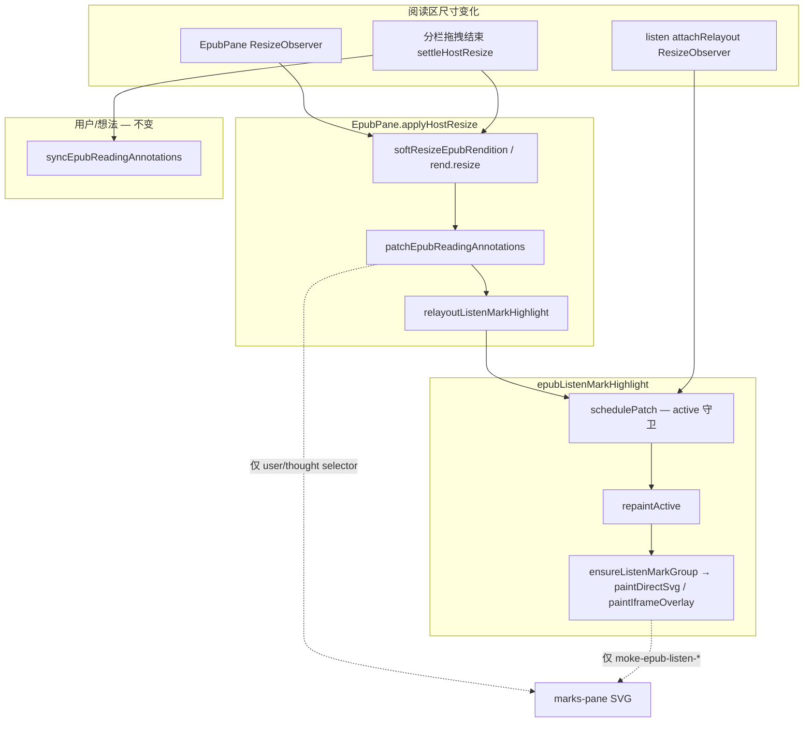

# EPUB 听书播放背景 — 阅读区 resize 重绘改动影响点分析

## 延伸阅读

- [EPUB听书背景重布局.md](../ebook/EPUB听书背景重布局.md) — **实现思路**与改动前后代码对比
- [EPUB听书背景与注释影响.md](./EPUB听书背景与注释影响.md) — 播放背景与用户划线 / 想法虚线隔离

## 1. 分析目的

评估 **阅读区宽度变化时播放背景重绘** 相关改动，是否改变或破坏已有功能：

- **听当前** / **听书** 播放背景（`moke-epub-listen-bg`）
- **用户划线** / **想法虚线**（marks-pane 批注层）
- **EpubPane** 分栏 / 侧栏 / 窗口 resize 链路
- 非听书状态下的阅读、划线、批注 sync

**改动范围（当前 diff）**：

| 文件 | 变更 |
|------|------|
| `apps/frontend/src/views/ebook/utils/epubListenMarkHighlight.ts` | `repaintActive` 重挂载 SVG group；`attachRelayout` 增加 `ResizeObserver`；新增导出 `relayoutListenMarkHighlight` |
| `apps/frontend/src/views/ebook/components/EpubPane.tsx` | `applyHostResize` 末尾调用 `relayoutListenMarkHighlight(rend)` |

**结论摘要**：

| 维度 | 是否影响原有功能 | 说明 |
|------|------------------|------|
| 用户/想法数据与 sync | **否** | 重绘只动 listen 层 selector，不接入 `syncEpubReadingAnnotations` |
| 非听书时阅读/划线 | **否** | `schedulePatch` 在 `active === null` 时立即 return，无副作用 |
| 听书/听当前换句、停止 | **否** | `showListenMarkHighlight` / `clearListenMarkHighlight` 路径未改 |
| 播放背景对齐（修复目标） | **是（正向）** | 分栏拖拽、想法侧栏开关、soft resize 后背景可重算 rect |
| 听书活跃期性能 | **轻微** | resize 时可能多帧重复 `repaintActive`，已 rAF 合并，可接受 |
| `repaintActive` 绘制模式 | **有条件变化** | 重绘时 **优先 SVG**，marks-pane 晚就绪时可能从 iframe 切回 SVG |

---

## 2. 改动要点（相对改前行为）

### 2.1 `repaintActive` — 不再复用 stale `active.group`

**改前**：

```text
若 active.mode === 'svg' 且 active.group.isConnected → paintDirectSvg(旧 group)
否则 → paintIframeOverlay(active.doc)
```

**改后**：

```text
每次从 Range 取 doc → ensureListenMarkGroup(doc) → 优先 paintDirectSvg
失败则 paintIframeOverlay，并更新 active.mode / active.group / active.doc
```

**动机**：`softResizeEpubRendition` 后 marks-pane SVG 常被重建，旧 `g` 已 `isConnected === false`，改前会误走 iframe 兜底或坐标错位。

### 2.2 `attachRelayout` — 增加 ResizeObserver

**改前**：仅 `rend.on('relocated' | 'rendered')` → `schedulePatch`。

**改后**：在上述事件之外，对 `getEpubScrollContainer(rend)` 及其 **父节点** 各挂一个 `ResizeObserver`，尺寸变化同样 `schedulePatch`。

**生命周期**：仅在 `showListenMarkHighlight` → `attachRelayout` 后存在；`clearListenMarkHighlight` → `detachRelayout` 时 disconnect。

### 2.3 `relayoutListenMarkHighlight(rend)` — 新导出 + EpubPane 接线

```typescript
export function relayoutListenMarkHighlight(rend: Rendition): void {
  schedulePatch(rend);
  requestAnimationFrame(() => schedulePatch(rend)); // marks-pane 偶发晚一帧
}
```

**调用点**：`EpubPane.applyHostResize`（含 `ResizeObserver` 防抖路径与 `settleHostResize` 分栏拖拽结束路径）。

**守卫**：内部 `schedulePatch` 要求 `active && active.rend === rend`，无活跃听书 session 时为 **空操作**。

---

## 3. 影响点矩阵

### 3.1 无功能影响（可认为安全）

| # | 影响点 | 原因 |
|---|--------|------|
| A1 | 用户 highlight / 想法 thought 持久化 | 改动不触 API / DB |
| A2 | `syncEpubReadingAnnotations` 逻辑 | 未改 sync 流水线；listen 仍不接入 |
| A3 | `patchEpubReadingAnnotations` | EpubPane 仍先 patch 用户/想法，**再** relayout listen；顺序不变且 listen 不删 user/thought selector |
| A4 | `clearListenMarkHighlight` / 换句 / 停止 | 清除路径未改；`detachRelayout` 仍 disconnect 新增 observer |
| A5 | 听当前 `paintSentence` / TTS cadence | 仍经 `showListenMarkHighlight`，仅 relayout 行为增强 |
| A6 | 听书 `showEpubListenDomRange` | 同上 |
| A7 | PopBar / 划线点击 | listen 层仍 `pointer-events: none` |
| A8 | 未听书时的 EpubPane resize | `relayoutListenMarkHighlight` → `schedulePatch` 因 `!active` 立即返回 |
| A9 | 导出 API 破坏性 | 仅 **新增** `relayoutListenMarkHighlight`，原有 export 签名不变 |

### 3.2 行为变化（预期内 / 需知晓）

| # | 影响点 | 改前 | 改后 | 风险 |
|---|--------|------|------|------|
| B1 | 分栏 / 想法侧栏开关后播放背景 | 易错位或消失 | 重算 rect 并重挂 group | **低（修复）** |
| B2 | soft resize 不触发 `relocated`/`rendered` | 背景不更新 | RO + EpubPane 双路径触发重绘 | **低（修复）** |
| B3 | `repaintActive` 绘制模式 | iframe 模式下 relayout 仍走 iframe | **每次 relayout 先尝试 SVG** | **低**：与 `showListenMarkHighlight` 初次绘制策略一致；marks-pane 可用时更优 |
| B4 | marks-pane 重建后 group 引用 | 可能持有 disconnected `g` | `ensureListenMarkGroup` 取新 group | **低（修复）** |
| B5 | 同一次 resize 触发次数 | 0～1 次（仅 epub 事件） | EpubPane RO + listen RO（2 节点）+ 双 rAF，可能 2～3 帧内多次 `repaintActive` | **低**：`schedulePatch` 同帧合并；多帧为刻意 retry |

### 3.3 仅有视觉 / 性能影响

| # | 影响点 | 表现 |
|---|--------|------|
| C1 | 播放中同区域用户色块 / 想法虚线 | 与 [epub-listen-bg-vs-annotations](./EPUB听书背景与注释影响.md) 相同：淡黄底 **临时叠层**，不删 DOM |
| C2 | resize 拖拽过程中 | 背景可能每帧跟随重绘（略闪），停止后 `settleHostResize` 再 sync 批注 |
| C3 | 听书长会话 + 频繁调窗口 | 活跃 session 下多 2 个 ResizeObserver；停止后释放 |

### 3.4 维护约束（勿回退）

| # | 约束 |
|---|------|
| D1 | `relayoutListenMarkHighlight` / `repaintActive` **不得**调用 `clearListenMarkHighlight` 或 `purgeListenAnnotations` 全量清 listen（除非换句/停止既有路径） |
| D2 | `repaintActive` 重挂 group 时 **不得**改用全量 `querySelectorAll('g')` 删除 |
| D3 | EpubPane 中 listen relayout 应保持在 `patchEpubReadingAnnotations` **之后**，避免与 patch 竞态 |

---

## 4. 交汇点与调用链



**与批注层关系**：与用户划线、想法虚线 **仍三层分离**（详见 [EPUB听书背景与注释影响.md](./EPUB听书背景与注释影响.md)）。本次改动 **只增加 listen 层在 resize 后的重绘频率与 group 重新解析**，不扩大 purge 范围。

---

## 5. 相对「未改代码」的功能对照

| 场景 | 改前 | 改后 |
|------|------|------|
| 正常听书换句 | `showListenMarkHighlight` 清旧句、画新句 | **相同** |
| 翻页 `relocated` / `rendered` | `schedulePatch` 重绘 | **相同**，另加 RO 覆盖更多 resize 源 |
| 关闭听书 | `clearListenMarkHighlight` + detach | **相同**，RO 一并清理 |
| 仅阅读、不听书，拖动分栏 | 仅 patch/sync 批注 | **相同** + 两次 noop `schedulePatch`（可忽略） |
| 听书中开关想法列表 | 背景常错位/丢失 | **应恢复** 当前句淡黄底 |
| soft resize 不重排 epub 事件 | 背景 stale | **应触发** RO 或 EpubPane 重绘 |
| iframe 兜底长期 session | 若 marks-pane 后出现，可能一直 iframe | **可能** 某次 relayout 切到 SVG（一般更稳） |

---

## 6. 改动评审清单

改 `epubListenMarkHighlight` 或 `EpubPane.applyHostResize` 时确认：

- [ ] `schedulePatch` 仍校验 `active && active.rend === rend`
- [ ] `repaintActive` 不调用 `clearListenMarkHighlight`（避免换句外全量清）
- [ ] `purgeListenAnnotations` / selector 仍 **仅** `moke-epub-listen*`
- [ ] `detachRelayout` 仍 disconnect 全部 ResizeObserver
- [ ] EpubPane 中 `relayoutListenMarkHighlight` 仍在 `patchEpubReadingAnnotations` 之后
- [ ] 播放层仍 `pointer-events: none`
- [ ] 听书停止路径仍 `clearEpubListenSegmentOverlay` → `clearListenMarkHighlight`

---

## 7. 建议回归用例

| 用例 | 步骤 | 期望 |
|------|------|------|
| R1 听书中开关想法侧栏 | 听书播放 → 开/关想法列表 | 当前句淡黄底位置正确，不残留旧宽度 rect |
| R2 听书中拖分栏 | 拖动左右分栏 → 松开 | 背景与文字对齐；用户/想法线仍正常（`settleHostResize` sync） |
| R3 非听书拖分栏 | 未播放，仅拖动分栏 | 用户/想法线正常；无 console 报错；无多余 listen DOM |
| R4 听当前 + resize | 听当前长选区 → 调侧栏 | 背景跟随；停止后划线完整 |
| R5 换句 / 停止 | 听书中下一句、停止 | 与改前一致，无双层黄、无 listen 残留 |
| R6 用户线 + 听书 + resize | 有粉高亮段落 → 听书 → resize | 播放时叠色；resize 后粉线 DOM 仍在；停止后正常 |
| R7 窗口仅高度变化 | 听书中改变视口高度 | 背景重绘；无 crash |
| R8 全书 soft resize 路径 | 连续快速拖分栏 | 无白屏；背景最终对齐（允许拖拽中短暂偏差） |

---

## 8. 相关源码索引

| 说明 | 路径 |
|------|------|
| 播放背景绘制 / relayout | `apps/frontend/src/views/ebook/utils/epubListenMarkHighlight.ts` |
| resize 主路径 | `apps/frontend/src/views/ebook/components/EpubPane.tsx` — `applyHostResize` |
| soft resize | `apps/frontend/src/views/ebook/utils/epubSoftResize.ts` |
| 分栏结束通知 | `apps/frontend/src/views/ebook/utils/ebookSplitResize.ts` |
| 听书 session | `apps/frontend/src/views/ebook/utils/epubListenSegmentOverlay.ts` |
| 播放层 vs 批注隔离 | [EPUB听书背景与注释影响.md](./EPUB听书背景与注释影响.md) |

---

## 9. 总结

本次改动 **仅增强听书播放背景在布局变化后的重绘能力**，不改变换句、停止、清除边界，不接入用户/想法 sync，不修改持久化数据。

**对原有功能的主要影响**：

1. **正向**：修复分栏 / 侧栏 / soft resize 导致的背景错位或丢失。
2. **中性**：非听书 resize 多一次 guarded noop，可忽略。
3. **需知晓**：`repaintActive` 在 relayout 时统一 **优先 SVG**，与初次 `showListenMarkHighlight` 一致，可能使长期 iframe 兜底 session 在 marks-pane 就绪后切到 SVG。
4. **需知晓**：resize 时 listen 与 EpubPane 可能 **多源触发** 重绘，属冗余保险，性能影响限于听书活跃期。

**不影响**：用户划线 apply/delete、想法虚线 patch、PopBar、听书 TTS 流程、章节索引。

---

（若与仓库最新源码不一致，以源码为准）
