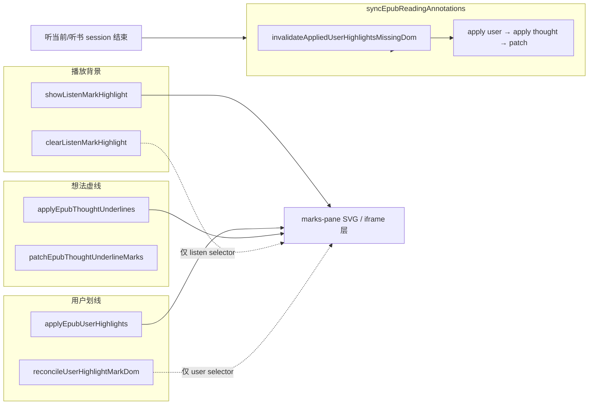

# EPUB 播放背景色 vs 用户划线 / 想法划线 — 影响点分析

## 1. 分析目的

评估 **听当前**、**听书** 中的 **播放背景色**（当前句淡黄底 `rgba(251, 231, 128, 0.28)`）实现，是否会改变或破坏：

- **用户划线**（粉/紫/蓝/绿/黄 高亮 / 下划线 / 波浪线，持久化于 `ebook_highlight`）
- **想法划线**（琥珀色虚线下划线，持久化于 `ebook_thought`，`moke-epub-thought-ul`）

**结论摘要**：

| 维度 | 是否影响用户/想法 **数据与 apply 逻辑** | 说明 |
|------|----------------------------------------|------|
| 数据库 / API | **否** | 播放层不写 highlight/thought 表 |
| epub.js 批注槽位 | **否（现行）** | 播放层与用户/想法使用 **不同 class + 不同清除选择器**；用户用 `highlight` 槽、想法用 `underline` 槽 |
| DOM mark 删除 | **否（现行）** | 清除播放背景 **仅** 删 `moke-epub-listen-*`，不扫用户/想法 selector |
| `syncEpubReadingAnnotations` 顺序 | **否** | 播放层 **不接入** sync 流水线 |
| 点击 / PopBar | **否** | 播放层 `pointer-events: none` |
| 视觉叠层 | **是（仅 UI）** | 淡黄底可能 **盖住** 同区域用户色块或想法虚线的 **视觉效果**，DOM 仍在 |
| 播完 / 停止后恢复 | **间接（正向）** | 听当前结束、听书 `stopInternal` 会触发 `syncReadingAnnotations`，**修复** 若 DOM 曾被误伤的划线 |

---

## 2. 播放背景色 — 现行实现要点

### 2.1 职责边界

| 模块 | 路径 | 职责 |
|------|------|------|
| 绘制 | `apps/frontend/src/views/ebook/utils/epubListenMarkHighlight.ts` | 单例浮层：SVG `g.moke-epub-listen-bg` 或 iframe `#moke-epub-listen-iframe-layer` |
| 编排（听当前） | `epubListenSegmentOverlay.ts` | session、`paintSentence`、`onCadenceChunk` 驱动换句 |
| 编排（听书） | `epubListenChapter.ts` → `syncChapterListenScrollSession`（`epubListenSegmentOverlay`） | 每句 `showEpubListenDomRange` |
| 滚动 / FAB | `epubListenSegmentOverlay.ts` | `autoFollow`、`activeDomRange`，与用户/想法无关 |

### 2.2 绘制与清除规则

**显示**（`showListenMarkHighlight`）：

1. 先调用 **`clearListenMarkHighlight(rend)`**（只清播放层）。
2. 在 marks-pane SVG 追加 `g.moke-epub-listen-bg`（内填 `rect`），或在不走 SVG 时在 iframe 文档挂绝对定位 div 层。
3. 监听 `relocated` / `rendered` 仅 **重绘播放层**（`schedulePatch` → `repaintActive`）。

**清除**（`clearListenMarkHighlight`）：

1. **`purgeListenAnnotations(rend)`**：遍历 `rend.annotations._annotations`，**仅** `className` 含 `moke-epub-listen` 的项才 `remove(..., 'highlight')`。
2. **`purgeDocListenLayers(doc)`**：删 `g.moke-epub-listen-bg`、legacy CSS Highlight、`#moke-epub-listen-iframe-layer`。
3. 清空 host overlay 容器 `#moke-epub-listen-host-overlay` 子节点（若有遗留）。

**关键常量**：

```text
播放：  moke-epub-listen-bg / moke-epub-listen-iframe-layer
用户：  moke-epub-user-hl
想法：  moke-epub-thought-ul
```

三者 **selector 互不包含**。

### 2.3 听当前 vs 听书对背景层的调用差异

|  | 听当前 | 听书 |
|--|--------|------|
| 换句触发 | TTS `onCadenceChunk` → `paintSentence` | 每句 `playPreferred` 前 `showChapterListenSentenceHighlight` |
| 句末 | `clearActiveListenHighlight`（仅 mark + session 索引） | `clearChapterListenSentenceHighlight` |
| session 停止 | `clearEpubListenSegmentOverlay` | `stopInternal` → `clearEpubListenSegmentOverlay` |
| 与用户/想法关系 | **相同绘制模块** | **相同绘制模块** |

---

## 3. 用户划线 / 想法划线 — 相关实现要点

### 3.1 用户划线

| 项 | 实现 |
|----|------|
| 持久化 | `read.tsx` → API `ebook_highlight` |
| 批注 | `rend.annotations.highlight(cfi, …, className=moke-epub-user-hl, …)` |
| 删除 | `rend.annotations.remove(cfi, 'highlight')` + **`removeUserHighlightMarkGroupsByCfi`**（按 CFI 删 DOM `g`） |
| 同步入口 | `syncEpubReadingAnnotations` → **`applyEpubUserHighlights` 先于想法** |
| DOM 对齐 | `reconcileUserHighlightMarkDom`、`invalidateAppliedUserHighlightsMissingDom` |
| 层叠 | `restackUserHighlightMarkGroups` 将用户 `g` append 到 marks-pane **最上**（盖住想法虚线） |

### 3.2 想法划线

| 项 | 实现 |
|----|------|
| 持久化 | `ebook_thought` |
| 批注 | `rend.annotations.underline(cfi, …, EPUB_THOUGHT_UNDERLINE_CLASS)` |
| 删除 | `rend.annotations.remove(cfi, 'underline')` |
| 同步 | `applyEpubThoughtUnderlines`（在 user apply **之后**） |
| 与用户重叠 | `collectUserHighlightBlockerSources` → `patchEpubThoughtUnderlineMarks` 扣减被用户线挡住的虚线段 |
| 层叠 | `restackThoughtMarkGroups`（短 CFI 在上，便于点击） |

### 3.3 二者与播放层的刻意隔离（用户侧代码注释）

```typescript
// epubUserHighlights.ts — removeUserHighlightAnnotation
// 用户划线统一用 highlight 类型，避免 remove(underline) 误删想法虚线
rend.annotations.remove(cfiRange, 'highlight');
```

想法与用户 **槽位分离**；播放层 **第三类**，按 class 过滤清除。

---

## 4. 影响点矩阵（逐项）

### 4.1 无逻辑影响（可认为安全）

| # | 影响点 | 原因 |
|---|--------|------|
| A1 | 用户 highlight 的 `appliedRef` / DB | 播放模块不读写 |
| A2 | 想法 `appliedThoughtsRef` | 同上 |
| A3 | `remove(cfi, 'highlight')` 误删用户线 | `purgeListenAnnotations` **先判断** `isListenAnnotationClass`，非 listen class 跳过 |
| A4 | `remove(cfi, 'underline')` 误删想法 | 播放清除 **从不** 调用 underline 槽 remove |
| A5 | `reconcileUserHighlightMarkDom` 误删 | selector 仅 `USER_HIGHLIGHT_SELECTOR`，不含 listen |
| A6 | 想法 patch / blocker 计算 | 输入仅 **用户** mark 源，不含 listen |
| A7 | 用户/想法 restack | 只移动 `moke-epub-user-hl` / `moke-epub-thought-ul` 的 `g` |
| A8 | PopBar / 点划线改色删 | listen 层 `pointer-events: none`，不拦截 mark 点击 |
| A9 | 想法聚合点击 | 同上；listen iframe 层 `z-index: 2` 但仍 none 指针事件 |
| A10 | 听书 `indexChapterSentenceRanges` | TreeWalker **只读** DOM，不改 mark |
| A11 | 听当前 `buildDomSentenceIndex` | 只读选区字符流 |

### 4.2 仅有视觉/UX 影响（DOM 与数据仍在）

| # | 影响点 | 表现 | 播放停止后 |
|---|--------|------|------------|
| B1 | 同句同时有用户色块 + 播放淡黄底 | 淡黄半透明叠在彩色 fill 上，**颜色混合** | 清除播放层后用户色块恢复「原样」 |
| B2 | 同句有想法虚线 + 播放底 | 虚线可能被淡黄 rect **部分遮住** | 清除播放层后虚线完整可见 |
| B3 | marks-pane 内 SVG 绘制顺序 | listen `g` append 在 SVG 末尾时可能 **绘在用户/想法之上** | 清除 listen `g` 后 restack 不变 |
| B4 | 连续滚动时 listen `relayout` | 播放底随滚动重绘，**不触发** user/thought patch | — |

### 4.3 间接 / 时序相关（需知晓，非破坏性）

| # | 影响点 | 机制 | 风险等级 |
|---|--------|------|----------|
| C1 | 听当前播完 `onListenSessionEnd` | `read.tsx` → `syncReadingAnnotations()` | 低：全量 re-apply user + thought，**正向修复** DOM 不一致 |
| C2 | 听书 `stopInternal` → `onSessionEnd` | 同上 | 低 |
| C3 | 听书长会话播放中 **不** sync | 依赖播放清除 **不破坏** 用户 DOM；若未来有人改错 purge 逻辑，问题会拖到 stop 才暴露 | 中（维护约束） |
| C4 | 用户 **播放中** 新增/修改划线 | `EpubPane` effect 仍会 `syncEpubReadingAnnotations`；与活跃 listen session **并行** | 低：apply 只动 user/thought selector |
| C5 | `invalidateAppliedUserHighlightsMissingDom` | 仅在 **sync 入口** 执行；若 DOM mark 被误删会删 appliedRef 以便重 apply | 低：listen 现行不误删则不会误触发 |

### 4.4 历史风险（旧实现 / 错误改法 — 现行已规避）

| # | 曾出现问题 | 根因 | 现行规避 |
|---|-------------|------|----------|
| D1 | 听完后用户线消失、删不掉 | 播放清除对 **任意 CFI** `annotations.remove(cfi,'highlight')` | 仅删 `moke-epub-listen` class；详见 [EPUB听书用户划线对账.md](../ebook/EPUB听书用户划线对账.md) |
| D2 | 同 CFI 重复 mark / appliedRef 脏 | 误删 DOM 但 ref 仍在 | sync 前 `invalidate…` + `reconcileUserHighlightMarkDom` |
| D3 | 听书走 overlay + `window.find` | 与 innerText 句表失配，曾伴随错误 DOM 操作 | 已改 mark 层 + 节级 Range 索引 |
| D4 | 用 CSS Highlight API 作播放层 | 与用户/legacy listen 名冲突 | 已弃用主路径，purge 仍清 legacy 名 |

**维护红线**：勿在播放清除中恢复「按 CFI 全局 remove highlight」或共用 `moke-epub-user-hl` class。

---

## 5. 数据流与交汇点（仅两处）



**交汇点 1 — 同一 marks-pane SVG**：不同 `g` class，**不共享**清除函数。

**交汇点 2 — session 结束回调**：`useEbookQuoteListen` / `useEpubChapterListen` 的 `onSessionEnd` → `epubNavRef.syncReadingAnnotations()`，**不**调用 `clearListenMarkHighlight` 以外的用户/想法 API；listen 已在 `clearEpubListenSegmentOverlay` 中清完。

---

## 6. 听当前 vs 听书：对用户/想法影响是否不同？

| 对比项 | 听当前 | 听书 | 对用户/想法差异 |
|--------|--------|------|-----------------|
| 背景绘制模块 | `epubListenMarkHighlight` | 同左 | **无** |
| 清除边界 | listen class only | 同左 | **无** |
| sync 触发频率 | 每次 `toggleListen` 结束 | `stopInternal` / 全书播完 / 错误停止 | 听书 **播放过程中** 更久不 sync，更依赖清除不误伤 |
| overlay session | 含 DOM 句表 + `paintSentence` | 空 plain session + `activeDomRange` | 对用户/想法 **无额外** remove 路径 |
| 自动滚动 | `scrollEpubRangeIntoView` | 同左 | 只滚容器，不改批注 |

---

## 7. 改动评审清单（改播放背景时必查）

在 PR / 重构播放背景或 `epubListenSegmentOverlay` 时，逐项确认：

- [ ] `purgeListenAnnotations` 仍 **仅** 匹配 `moke-epub-listen` / `className.includes('moke-epub-listen')`
- [ ] 未新增对 `rend.annotations.remove(cfi, 'highlight')` 的 **无 class 过滤** 批量调用
- [ ] 未将播放层 class 改为 `moke-epub-user-hl` 或 `moke-epub-thought-ul`
- [ ] `clearListenMarkHighlight` 未改为 `querySelectorAll('g')` 等全量删 mark
- [ ] 播放层元素保持 **`pointer-events: none`**
- [ ] 听当前/听书停止路径仍调用 `clearEpubListenSegmentOverlay`
- [ ] `onSessionEnd` / `syncReadingAnnotations` 链路未删（用户线恢复保障）
- [ ] 若改 marks-pane 结构，确认 `ensureListenMarkGroup` 与 user/thought patch **selector 仍有效**

---

## 8. 建议回归用例

| 用例 | 步骤 | 期望 |
|------|------|------|
| R1 用户线 + 听当前 | 段落 A 设粉高亮 → 对 A 听当前 → 停止 | A 粉线仍在；无重复 mark；PopBar 可删 |
| R2 用户线 + 听书 | A 粉高亮 → 听书经过 A | 播放时淡黄叠色；停止后粉线正常 |
| R3 想法 + 听当前 | A 有想法虚线 → 听当前含 A | 停止后虚线可点、侧栏可开 |
| R4 想法 + 听书 | 同 R3 听书 | 停止后虚线完整 |
| R5 播放中改划线 | 听书中对用户线改色 | 改色成功；播放继续；停止后 sync 一致 |
| R6 长选区听当前 + 手动滚 | 滚动打断 → FAB 回位 | 用户/想法 mark 不丢 |
| R7 目录跳转听书 | 听书中 TOC 跳转 | `syncToCurrentView` 后用户/想法 mark 仍由 EpubPane sync 维护 |

---

## 9. 相关源码索引

| 说明 | 路径 |
|------|------|
| 播放背景绘制/清除 | `apps/frontend/src/views/ebook/utils/epubListenMarkHighlight.ts` |
| 听当前/听书 session + 滚动 | `apps/frontend/src/views/ebook/utils/epubListenSegmentOverlay.ts` |
| 听书句 Range → 背景 | `apps/frontend/src/views/ebook/utils/epubListenChapter.ts` + `epubListenSegmentOverlay.ts` |
| 用户划线 sync | `apps/frontend/src/views/ebook/utils/epubUserHighlights.ts` |
| 想法虚线 sync | `apps/frontend/src/views/ebook/utils/epubThoughtAnnotations.ts` |
| 统一 sync 入口 | `syncEpubReadingAnnotations`（`epubUserHighlights.ts`） |
| 听当前 Hook | `apps/frontend/src/views/ebook/hooks/useEbookQuoteListen.ts` |
| 听书 Hook | `apps/frontend/src/views/ebook/hooks/useEpubChapterListen.ts` |
| 历史 reconcile 专题 | `docs/ebook/EPUB听书用户划线对账.md` |
| 开发者总手册 | `docs/ebook/developer/EPUB听书开发.md` |

---

## 10. 总结

**现行听当前/听书播放背景色实现，在架构上与用户划线、想法划线三层分离**：不同 class、不同清除选择器、不同 epub.js 批注槽位（listen 遗留 annotation 走 highlight 槽但 **带 listen 专用 class 过滤**；用户 highlight 槽；想法 underline 槽）。

**不会**改变用户/想法的保存、apply、删除、点击、重叠合并逻辑。**会**在同区域产生 **临时视觉叠层**，停止播放并清除 listen 层后恢复。

**唯一需要持续警惕的**，是维护播放清除逻辑时不退回「按 CFI 无差别 remove highlight」的旧路径——那是历史上真实影响用户划线的根因，现行代码已通过 class 过滤与 reconcile/sync 兜底规避。

## 延伸阅读

- [EPUB 听读 utils 文件合并影响点](./EPUB听书工具整合影响.md) — 7→3 文件重构、import 路径对照（与播放背景隔离分析无关）

---

（若与仓库最新源码不一致，以源码为准）
