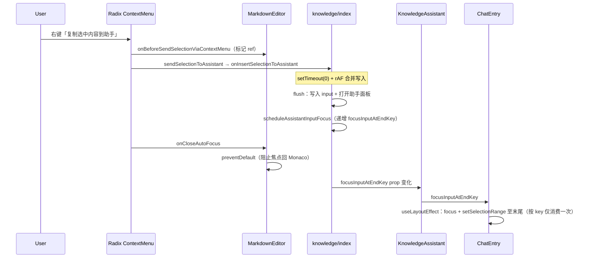

# 知识库：复制选中到助手后自动聚焦输入框

**延伸阅读**（同链路其它专题，避免重复维护）：

- 写入 AI / RAG 双输入框：`知识库助手插入选区AI检索.md`
- rAF 合并与重复写入防护：`知识编辑器发送选区助手去重.md`
- Monaco 右键菜单与快捷键同源：`docs/monaco/Markdown编辑器右键菜单.md`
- 电子书 MOKE 问书同类聚焦机制（`focusInputAtEndKey`）：`../ebook/电子书Mock助手.md` §3.7、`../ebook/` 阅读页助手

---

## 1. 背景与目标

**用户诉求**：在知识库 Markdown 编辑器中，通过**右键「复制选中内容到助手」**或 **⌘/Ctrl+Shift+V** 将选区写入底部文档助手输入框后，光标应**自动落在输入框末尾**，便于继续补问，无需再手动点击输入框。

**现象（修复前）**：

| 入口 | 内容写入 | 自动聚焦 |
|------|----------|----------|
| 快捷键 ⌘/Ctrl+Shift+V | 正常 | 正常 |
| 右键菜单 | 正常 | **失败**（焦点仍留在 Monaco） |

**聚焦上线后的回归（已修复）**：

| 场景 | 现象 |
|------|------|
| 自动聚焦后继续键入（中文 IME / 英文） | 输入错乱，如「你好」→ `nnini hni hani hao你好` |
| 根因 | `ChatEntry` 聚焦 effect 在每次 `input` 变化时重复 `setSelectionRange`，破坏 IME 合成 |

**核心结论**：快捷键与右键菜单最终都调用同一个宿主回调 `onInsertSelectionToAssistant`，差异不在「写入逻辑」，而在 **Radix ContextMenu 关闭时的焦点归还（`onCloseAutoFocus`）** 会把焦点强制还给编辑器 Trigger，覆盖我们在内容写入后发起的 `textarea.focus()`。

---

## 2. 改动范围

| 路径 | 角色 |
|------|------|
| `apps/frontend/src/views/knowledge/index.tsx` | 写入助手输入、`focusInputAtEndKey` 调度 |
| `apps/frontend/src/views/knowledge/KnowledgeAssistant.tsx` | 透传 `focusInputAtEndKey`，放宽 `disableTextInput` / `loading` |
| `apps/frontend/src/components/design/ChatEntry/index.tsx` | 通用 `focusInputAtEndKey` → 聚焦 + 光标置尾 |
| `apps/frontend/src/components/design/Monaco/index.tsx` | 拦截右键菜单 `onCloseAutoFocus` |
| `apps/frontend/src/components/design/Monaco/contextMenu.ts` | 右键项单独 `onBeforeSendSelectionViaContextMenu` |
| `apps/frontend/src/components/design/ContextMenu/QuickContextMenu.tsx` | 透传 `onCloseAutoFocus` 至 Radix Content |

---

## 3. 实现思路

### 3.1 数据流总览



### 3.2 关键决策

1. **复用电子书已验证的 `focusInputAtEndKey` 模式**  
   不在知识库页直接操作 DOM ref，而是递增 nonce，由 `ChatEntry` 在 `input` 同步后的 `useLayoutEffect` 内聚焦并将选区置于末尾（与 `EbookAssistant` 一致）。

2. **聚焦必须在「内容 flush 完成之后」调度**  
   若在 Radix 菜单关闭回调里提前 `focusInputAtEndKey++`，此时受控 `input` 可能尚未更新，`useLayoutEffect` 会因 `el.value.length === 0` 直接返回。因此：**只在 `flushAssistantInsertFromEditor` 末尾调用 `scheduleAssistantInputFocus()`**。

3. **右键路径必须 `preventDefault` Radix `onCloseAutoFocus`**  
   这是与快捷键路径的本质差异。快捷键无 ContextMenu，不存在「关闭菜单还把焦点还给 Trigger」；右键必须在 Monaco 层拦截，否则 Monaco 会在我们聚焦之后再次抢焦点。

4. **右键与快捷键分流标记，而非两套写入逻辑**  
   - 右键菜单项 `onSelect` 先调 `onBeforeSendSelectionViaContextMenu`（置 `sendSelectionViaContextMenuRef`）  
   - 快捷键仍直接调 `sendSelectionToAssistant`，不置 ref，`onCloseAutoFocus` 不拦截

5. **`KnowledgeAssistant` 输入框禁用策略对齐电子书**  
   - `loading` 仅用 `isSending`，不用 `isHistoryLoading`（历史加载不禁用输入，避免 focus 时 textarea 为 disabled）  
   - AI 模式下：已有粘贴草稿（`activeInput.trim()`）时允许输入，即使 store 正文尚未同步

6. **保留既有 rAF 合并 + 160ms 去重**  
   聚焦改动不替换 `知识编辑器发送选区助手去重.md` 中的写入防护；`onInsertSelectionToAssistant` 仍 `setTimeout(0)` 再 `requestAnimationFrame(flush)`，与菜单关闭时序解耦。

7. **`focusInputAtEndKey` 聚焦 effect 必须「按 key 消费一次」**  
   `useLayoutEffect` 需要依赖 `input`，以便预填草稿写入 DOM 后再聚焦；但若**无 guard 地在每次 `input` 变化时**执行 `setSelectionRange(len, len)`，用户正常打字时也会反复把光标强拉到末尾，打断 IME 合成与选区编辑，出现乱码。  
   **正解**：用 `consumedFocusAtEndKeyRef` 记录已处理的 key，仅当 `focusInputAtEndKey > consumedFocusAtEndKeyRef.current` 且 `input` 非空时聚焦一次并标记已消费。

---

## 4. 关键代码与注释

### 4.1 知识库页：写入完成后调度聚焦

**来源**：`apps/frontend/src/views/knowledge/index.tsx`（约 L119–L121、L244–L269）

```typescript
// 说明：递增 focusInputAtEndKey；ChatEntry 在 input 同步后的 layout 阶段聚焦
const scheduleAssistantInputFocus = useCallback(() => {
  window.setTimeout(() => setFocusInputAtEndKey((n) => n + 1), 0);
}, []);

// flushAssistantInsertFromEditor 末尾（摘录）
if (knowledgeAssistantModeRef.current === 'rag') {
  setRagAssistantInput((prev) => appendBlock(prev));
} else {
  setAssistantInput((prev) => appendBlock(prev));
}
// 同步打开助手面板（对齐 ebook openAssistant，不用 queueMicrotask 延迟开面板）
setMarkdownAssistantOpen(true);
// 内容已 schedule 到 state 后再触发聚焦
scheduleAssistantInputFocus();

// onInsertSelectionToAssistant：先同步 Monaco 正文，再延迟一帧合并 flush
getMarkdownFromEditorRef.current?.();
const next = (text ?? '').trim();
if (!next) return;
window.setTimeout(() => {
  pendingAssistantInsertRef.current = next;
  cancelAnimationFrame(assistantInsertFlushRafRef.current);
  assistantInsertFlushRafRef.current = requestAnimationFrame(() => {
    flushAssistantInsertFromEditor();
  });
}, 0);
```

### 4.2 KnowledgeAssistant：透传 focus key 并放宽禁用

**来源**：`apps/frontend/src/views/knowledge/KnowledgeAssistant.tsx`（约 L509–L532）

```typescript
const activeInput = isRagMode ? ragInput : input;

<ChatEntry
  focusInputAtEndKey={focusInputAtEndKey}
  input={isRagMode ? ragInput : input}
  // 说明：从编辑器写入草稿后应可编辑/聚焦，即使 editorHasBody 尚未从 store 同步
  disableTextInput={
    isRagMode ? false : !editorHasBody && !activeInput.trim()
  }
  // 说明：对齐 ebook——历史 loading 不禁用输入框，否则 focus() 无效
  loading={
    isRagMode
      ? knowledgeRagQaStore.isSending
      : assistantStore.isSending
  }
  // ...
/>
```

### 4.3 ChatEntry：通用聚焦 + 光标置尾（含 IME 乱码修复）

**来源**：`apps/frontend/src/components/design/ChatEntry/index.tsx`（约 L200–L216）

**问题（初版实现）**：effect 依赖 `[focusInputAtEndKey, input, textareaRef]`，但缺少「按 key 消费」守卫。预填后用户继续输入时，每敲一个字 `input` 变化 → effect 重跑 → `setSelectionRange(len, len)` → IME 合成被打断，表现为重复字母/拼音与最终汉字混杂。

```typescript
const consumedFocusAtEndKeyRef = useRef(0);

// 仅在 focusInputAtEndKey 递增时聚焦一次；不可在每次 input 变化时 setSelectionRange
useLayoutEffect(() => {
  if (!focusInputAtEndKey) return;
  // 已消费过的 key 不再重复聚焦/置尾（避免破坏正常输入与 IME）
  if (focusInputAtEndKey <= consumedFocusAtEndKeyRef.current) return;
  if (!input.length) return; // 受控 value 尚未到达，等下一轮 effect

  const el = textareaRef.current;
  if (!el?.value.length) return; // 等待 DOM value 与 React state 同步

  consumedFocusAtEndKeyRef.current = focusInputAtEndKey; // 标记本 key 已处理
  const len = el.value.length;
  el.focus({ preventScroll: true });
  el.setSelectionRange(len, len); // 光标在摘录/草稿末尾
  el.scrollTop = el.scrollHeight;
}, [focusInputAtEndKey, input, textareaRef]);
```

**为何仍保留 `input` 在依赖数组**：`focusInputAtEndKey++` 往往早于受控 `input` 更新；若 effect 只依赖 key，可能在空 value 时执行一次并错误地「消费」key。保留 `input` 并在有内容时再消费，可保证预填到达后再聚焦；配合 `consumedFocusAtEndKeyRef` 则用户后续键入不会再次触发置尾。

### 4.4 Monaco 右键菜单：标记 + 拦截 onCloseAutoFocus

**来源**：`apps/frontend/src/components/design/Monaco/contextMenu.ts`（约 L93–L104）

```typescript
// 说明：仅右键菜单项走 onBefore；快捷键 addCommand 直接调 sendSelectionToAssistant
onSelect: () => {
  actionsRef.current?.onBeforeSendSelectionViaContextMenu?.();
  actionsRef.current?.sendSelectionToAssistant?.();
},
```

**来源**：`apps/frontend/src/components/design/Monaco/index.tsx`（约 L319–L320、L497–L503、L1192–L1194）

```typescript
const sendSelectionViaContextMenuRef = useRef(false);

const handleEditorContextMenuCloseAutoFocus = useCallback((event: Event) => {
  if (!sendSelectionViaContextMenuRef.current) return;
  event.preventDefault(); // 核心：阻止 Radix 把焦点还给 Monaco Trigger
  sendSelectionViaContextMenuRef.current = false;
}, []);

// injectMonacoEditorContextActions 内
onBeforeSendSelectionViaContextMenu: () => {
  sendSelectionViaContextMenuRef.current = true;
},
```

**来源**：`apps/frontend/src/components/design/ContextMenu/QuickContextMenu.tsx`（约 L87–L90）

```typescript
<ContextMenuContent
  className={contentClassName}
  onCloseAutoFocus={onCloseAutoFocus} // 透传至 Radix Content
>
```

---

## 5. 为何此前「延迟 onOpenChange / 多次 retry」仍失败

| 尝试 | 失败原因 |
|------|----------|
| 菜单关闭后再 `focusInputAtEndKey++` | 常在 **flush 写入 input 之前** 触发，ChatEntry 因空 value 跳过聚焦 |
| 仅 `setTimeout(0)` 聚焦 | Radix **`onCloseAutoFocus` 晚于或覆盖**我们的 focus |
| 用 `onOpenChange(false)` 调度 | 与 flush 时序竞态；且无法阻止 Radix 默认 focus restore |
| 在 ChatEntry 内 rAF 重试 | 未阻止 Monaco 抢焦点，表面「曾聚焦」仍被立刻打回 |

**正解组合**：`preventDefault(onCloseAutoFocus)` + **flush 完成后** `focusInputAtEndKey++`。

### 5.1 聚焦后输入乱码（IME / 正常键入）

| 尝试 | 失败原因 |
|------|----------|
| effect 依赖 `input` 且无消费 guard | 用户每输入一字 effect 重跑，`setSelectionRange` 打断 IME 与选区 |
| 从依赖中移除 `input` | `focusInputAtEndKey++` 时 draft 未到，空 value 下误消费 key，预填后不再聚焦 |
| 仅在 `focusInputAtEndKey` 变化时 effect 内读 `input`（不列入 deps） | 违反 exhaustive-deps；且 draft 晚到仍可能 miss 聚焦 |

**正解**：`consumedFocusAtEndKeyRef` + 依赖 `[focusInputAtEndKey, input]`——**key 递增时最多消费一次**，**input 到达后补跑 effect 直至可聚焦**，消费后用户键入不再触发 `setSelectionRange`。

---

## 6. 兼容性与影响

- **快捷键路径**：行为不变（不置 `sendSelectionViaContextMenuRef`，不拦截 `onCloseAutoFocus`）。
- **AI / RAG 模式**：写入与聚焦均走当前模式对应输入框（见 `知识库助手插入选区AI检索.md`）。
- **助手面板未打开**：`flush` 内同步 `setMarkdownAssistantOpen(true)`，与写入、`focusInputAtEndKey` 同批更新；助手挂载后 ChatEntry effect 可读到非空 `input`。
- **分享态**：若助手 footer 被分享条替换而无 `ChatEntry`，聚焦逻辑自然 no-op（与修复前一致）。
- **知识库 / 电子书助手**：共用 `ChatEntry` 的 `focusInputAtEndKey` 实现；IME 修复对两场景同时生效。

---

## 7. 建议回归

1. 编辑器有选区 → 右键「复制选中内容到助手」→ 助手输入框聚焦、光标在末尾、可立即键入。
2. 同上流程用 **⌘/Ctrl+Shift+V** → 行为与右键一致。
3. 助手面板关闭时发送选区 → 面板自动打开 + 聚焦。
4. AI 模式 / RAG 模式各测一次，确认写入目标输入框正确。
5. 助手历史 loading 过程中发送选区 → 输入框仍可聚焦（非 disabled）。
6. 自动聚焦后中文 IME 输入「你好」、英文连续输入 → 无重复字母/拼音，无光标被强拉末尾。
7. 电子书 MOKE 问书预填后同上验证（共用 `ChatEntry`）。

---

## 8. 相关源码路径

| 说明 | 路径 |
|------|------|
| 宿主写入与 focus 调度 | `apps/frontend/src/views/knowledge/index.tsx` |
| 助手 UI 透传 | `apps/frontend/src/views/knowledge/KnowledgeAssistant.tsx` |
| 输入框聚焦实现 | `apps/frontend/src/components/design/ChatEntry/index.tsx` |
| 菜单关闭焦点拦截 | `apps/frontend/src/components/design/Monaco/index.tsx` |
| 右键项 onBefore | `apps/frontend/src/components/design/Monaco/contextMenu.ts` |
| QuickContextMenu 透传 | `apps/frontend/src/components/design/ContextMenu/QuickContextMenu.tsx` |
| 电子书参考实现 | `apps/frontend/src/views/ebook/read.tsx`、`EbookAssistant.tsx` |

若与仓库最新源码不一致，以源码为准。
