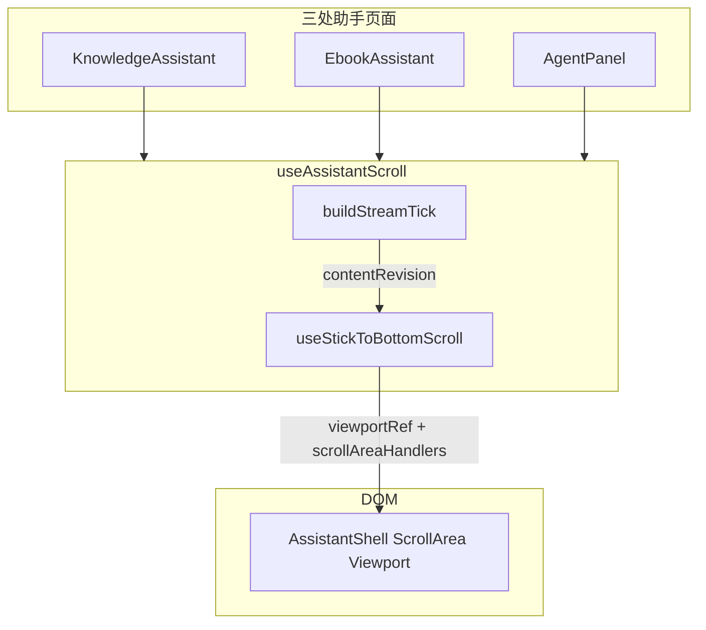

# 助手流式结束后误滚底：排查与修复（知识库 / 电子书 MOKE / 英语学习）

## 延伸阅读

- 助手滚动总览与 `idleFlushKey` 历史设计：[知识库助手完成.md](./知识库助手完成.md) §8.3
- 流式代码块横滚与贴底协同（`useStickToBottomScroll` 滚轮分支）：[../chat/流式代码块滚动.md](../chat/流式代码块滚动.md) §7
- 电子书 MOKE 助手接入 `useAssistantScroll`：[../ebook/EPUB助手右键菜单.md](../ebook/EPUB助手右键菜单.md)

---

## 1. 背景与目标

### 1.1 用户可见问题

在以下三类**侧栏智能助手**中，用户于**流式输出过程中**上滑（或滚轮向上）打断「自动贴底」后，**流式刚结束**时列表仍会被**拽回物理底部**，仿佛「自动贴底」被悄悄恢复：

| 入口 | 组件 | Store |
|------|------|-------|
| 知识库文档助手（AI / RAG） | `KnowledgeAssistant.tsx` | `assistantStore` / `knowledgeRagQaStore` |
| 电子书 MOKE 智能助手 | `EbookAssistant.tsx` | `ebookAssistantStore` |
| 英语学习 Agent | `englishLearning/agent/index.tsx` | `englishAgentStore` |

三者共用 **`useAssistantScroll` → `useStickToBottomScroll`**，故根因与修复集中在同一 Hook，页面层仅调整 `idleFlushKey` 签名与知识库条带补滚的调用语义。

### 1.2 修复目标

- 用户**主动打断贴底**后，流式结束及紧随其后的 UI 增高（操作条、联网区等）**不得**再强制 `scrollTop = scrollHeight`。
- 用户**仍在跟底**（未打断）时，流式结束后因尾部 UI 撑高导致的「看起来没贴底」仍应能补滚（知识库 `showPostStreamActions` 等）。
- **切换会话 / 历史首次就绪**等明确「应贴底」场景不受影响（`idleFlush` 仍 `force`）。

---

## 2. 滚动架构（修复前）



| 状态 / 函数 | 职责 |
|-------------|------|
| `stickToBottomRef` | 流式时 `contentRevision` 变化是否跟底 |
| `contentRevision` | `buildStreamTick(messages)`，含尾条 `isStreaming` 位 |
| `idleFlushKey` | 非流式「列表形态就绪」时补滚（历史加载、新会话条数变化） |
| `flushScrollToBottom()` | 单次 `vp.scrollTop = vp.scrollHeight`（修复前**无条件**） |

---

## 3. 根因分析（逐条）

### 3.1 根因 A：`idleFlushKey` 含 `chatId`，换 id 误触发 `idleFlush`

**现象链路**

1. 英语 / 电子书 SSE 在**流式开头**下发 `messageIds`（见 `agent.service.ts` 占位入库后立即 `subscriber.next({ type: 'messageIds' })`）。
2. Store `onMessageIds` 将 UI 层临时 `chatId` 替换为库内 id（`englishAgent.ts` / `ebookAssistant.ts`）。
3. 各页面 `idleFlushKey` **原签名**含 `first.chatId` 与 `last.chatId`：

```text
${sessionId}-${messages.length}-${first.chatId}-${last.chatId}
```

4. `useStickToBottomScroll` 中 `idleFlush` 的 `useLayoutEffect` 在 key **变化且与上次不同**时执行：

- `stickToBottomRef.current = true`（**强制恢复跟底**）
- 连续多次 `flushScrollToBottom()`（含 `setTimeout(0)`）

**为何用户感知为「流式结束」**

- `messageIds` 多在流式早期到达；若用户**之后**才上滑打断，key 已变过，不再触发。
- 但知识库 **非 ephemeral** 会话在 `onComplete` 后会 `getAssistantSessionDetail` **整表替换** `messages`（`assistant.ts`），`chatId` 再次变化 → **流式结束后数百毫秒内**再次 `idleFlush` → 滚底。
- 英语 / 电子书若 `messageIds` 到达较晚、或与 `isStreaming=false` 同一 MobX 批次相邻，用户也会把它归因于「刚结束」。

**结论**：`idleFlushKey` 应描述「会话 + 列表条数」就绪，**不应**把单条消息的 `chatId` 替换算作「新列表形态」。

---

### 3.2 根因 B：知识库 `showPostStreamActions` / `showRagNewConversation` 无条件 `flush`

`KnowledgeAssistant.tsx` 在流式结束、尾部条带挂载后：

```typescript
useLayoutEffect(() => {
  if (!showPostStreamActions) return;
  flushScrollToBottom(); // 修复前：不读 stick / 用户是否上滑
  requestAnimationFrame(() => flushScrollToBottom());
}, [showPostStreamActions, flushScrollToBottom]);
```

RAG「新对话」条带同理。设计意图是「条带撑高 `scrollHeight`，跟底用户需补一次滚底」；但未区分**用户已上滑阅读**的场景。

---

### 3.3 根因 C：流式结束 → `isStreaming=false` 后 `onScroll` 误恢复 `stickToBottomRef`

`useStickToBottomScroll` 的 `onScroll` 在距底 ≤ `resumeWithinBottomPx`（默认 48px）时：

```typescript
if (!isStreaming) {
  stickToBottomRef.current = true; // 修复前：不区分用户是否曾打断
}
```

流式结束瞬间会发生多处 **布局高度变化**：

| 变化 | 影响 |
|------|------|
| 去掉「正在生成中…」Spinner | `scrollHeight` 减小，等效「更靠近底部」 |
| `ChatMessageActions` 由 `absolute` 露出（`!message.isStreaming`） | 行 `pb-10` 已预留，但联网区、免责声明等可能出现 |
| `StreamingMarkdownBody` 去掉 `streaming-md-body--streaming`（flex gap） | 段落间距变化 |

用户上滑后 `scrollTop` 不变、`scrollHeight` 减小 → `distanceFromBottom` 可能从 >48px **落入** ≤48px 带 → **非流式分支把 `stickToBottomRef` 设回 `true`**。单独这一步不滚底，但与根因 B 或后续 `flush` 组合即表现为「结束就跳底」。

---

### 3.4 根因 D：`flushScrollToBottom` 修复前无条件写 `scrollTop`

任何调用方（条带 effect、`HistoryDrawer` 切换会话、RAG 进模式等）都直接：

```typescript
vp.scrollTop = vp.scrollHeight;
```

缺少「用户已打断贴底」的统一门禁。

---

### 3.5 排除项（修复验证时确认无责）

| 触点 | 结论 |
|------|------|
| 流式 `useLayoutEffect([contentRevision])` | `isStreaming=false` 时 `return`，结束帧不滚 |
| `useChatCodeFloatingToolbar` / `layoutChatCodeToolbars` | 不改 `scrollTop` |
| 主站 `ChatBotView` | 不用 `useStickToBottomScroll`，与本 bug 无关 |

---

## 4. 修复方案（逐点）

### 4.1 新增 `userPinnedAwayRef`（用户主动打断记忆）

与 `stickToBottomRef` 并列：

- **置位 `true`**：流式中上滑、`onWheelCapture` 向上、代码块横滚/上滚、`onPointerDownCapture`（代码块外）、`disableStickToBottom()`。
- **清除 `false`**：`enableStickToBottom()`、`resetKey` 变化（切会话）、流式中用户下滚回物理底（`userScrolledDown || distanceFromBottom <= 8`）、`idleFlush` 强制就绪（切历史）。

非流式下距底 ≤48px **不再**自动 `stickToBottomRef=true`，若 `userPinnedAwayRef` 仍为真。

### 4.2 `flushScrollToBottom(options?: { force?: boolean })`

```typescript
if (!options?.force && (userPinnedAwayRef.current || !stickToBottomRef.current)) {
  return;
}
vp.scrollTop = vp.scrollHeight;
```

| 调用场景 | 参数 |
|----------|------|
| 流式跟底 layoutEffect | 默认（尊重打断） |
| 知识库条带 `showPostStreamActions` | 默认（用户打断则不滚） |
| `idleFlush` 历史就绪 | `{ force: true }` |
| `HistoryDrawer` 切会话 | 先 `enableStickToBottom()`，再 `flush`（默认即可） |

### 4.3 收窄三处 `idleFlushKey`（去掉 `chatId`）

| 页面 | 新 key |
|------|--------|
| 知识库 AI | `${documentKey}-${activeSessionId}-${aiMessages.length}` |
| 电子书 | `${bookId}-${activeSessionId}-${aiMessages.length}` |
| 英语学习 | `${sessionId}-${messages.length}` |

仍在「进助手 / 历史加载完成 / 新消息对增加条数」时触发 `idleFlush`；**不再**因单条 id 替换触发。

### 4.4 知识库条带 effect

保留 `showPostStreamActions` / `showRagNewConversation` 的 `useLayoutEffect`，但 `flushScrollToBottom()` 已带门禁：**跟底用户**仍补滚，**上滑用户**跳过。

---

## 5. 关键代码与注释

### 5.1 `userPinnedAwayRef` 与 guarded `flush`

**来源**：`apps/frontend/src/hooks/useStickToBottomScroll.ts`（约 L90–L126）

```typescript
const stickToBottomRef = useRef(true);
/** 用户于流式中主动上滑/滚轮打断后置位；恢复贴底前不再因 idleFlush / 流式结束布局变化自动滚底 */
const userPinnedAwayRef = useRef(false);

const flushScrollToBottom = useCallback((options?: { force?: boolean }) => {
  const vp = viewportRef.current;
  if (!vp) return;
  // 说明：默认 flush 尊重用户打断；仅 idleFlush / 明确 force 时无视
  if (
    !options?.force &&
    (userPinnedAwayRef.current || !stickToBottomRef.current)
  ) {
    return;
  }
  vp.scrollTop = vp.scrollHeight;
}, []);

const enableStickToBottom = useCallback(() => {
  stickToBottomRef.current = true;
  userPinnedAwayRef.current = false; // 说明：用户点「滚到底」或发送新消息时恢复跟底
}, []);

const disableStickToBottom = useCallback(() => {
  stickToBottomRef.current = false;
  userPinnedAwayRef.current = true;
}, []);
```

### 5.2 非流式 `onScroll` 不再误恢复跟底

**来源**：`apps/frontend/src/hooks/useStickToBottomScroll.ts`（约 L144–L160）

```typescript
if (isStreaming && userScrolledUp) {
  stickToBottomRef.current = false;
  userPinnedAwayRef.current = true; // 说明：记录「用户主动上滑」
  return;
}

if (distanceFromBottom <= resumeWithinBottomPx) {
  if (!isStreaming) {
    // 说明：流式结束后布局变矮导致「伪触底」时，若用户曾打断，不恢复 stick
    if (!userPinnedAwayRef.current) {
      stickToBottomRef.current = true;
    }
  } else if (userScrolledDown || distanceFromBottom <= 8) {
    stickToBottomRef.current = true;
    userPinnedAwayRef.current = false; // 说明：流式中主动滚回物理底 → 允许再跟底
  }
  return;
}
```

### 5.3 `idleFlush` 仍强制贴底（切换会话 / 历史就绪）

**来源**：`apps/frontend/src/hooks/useStickToBottomScroll.ts`（约 L227–L248）

```typescript
stickToBottomRef.current = true;
userPinnedAwayRef.current = false; // 说明：新会话/历史列表就绪视为用户期望从底部看最新
flushScrollToBottom({ force: true });
requestAnimationFrame(() => {
  flushScrollToBottom({ force: true });
  // ... 双 rAF + setTimeout(0) 覆盖 MdPreview/图片晚一拍撑高
});
```

### 5.4 知识库 `aiIdleFlushKey` 去 `chatId`

**来源**：`apps/frontend/src/views/knowledge/KnowledgeAssistant.tsx`（约 L209–L220）

```typescript
const aiIdleFlushKey = useMemo((): string | null => {
  if (isRagMode) return null;
  if (assistantStore.isHistoryLoading) return null;
  if (aiMessages.length === 0) return null;
  // 说明：仅「文档 + 会话 + 条数」标识列表就绪，避免 SSE/详情刷新换 chatId 误触发 idleFlush
  return `${documentKey}-${assistantStore.activeSessionId ?? ''}-${aiMessages.length}`;
}, [
  isRagMode,
  documentKey,
  assistantStore.activeSessionId,
  assistantStore.isHistoryLoading,
  aiMessages.length,
]);
```

### 5.5 电子书 / 英语学习同款 key

**来源**：`apps/frontend/src/views/ebook/components/EbookAssistant.tsx`（约 L91–L99）

```typescript
return `${bookId}-${ebookAssistantStore.activeSessionId ?? ''}-${aiMessages.length}`;
```

**来源**：`apps/frontend/src/views/englishLearning/agent/index.tsx`（约 L104–L107）

```typescript
return `${englishAgentStore.sessionId ?? 'none'}-${messages.length}`;
```

### 5.6 知识库流式结束条带（调用方无需改代码，依赖 guarded flush）

**来源**：`apps/frontend/src/views/knowledge/KnowledgeAssistant.tsx`（约 L278–L290）

```typescript
// 说明：showPostStreamActions 由 false→true 时执行；flush 内部已尊重 userPinnedAway
useLayoutEffect(() => {
  if (!showPostStreamActions) return;
  flushScrollToBottom();
  requestAnimationFrame(() => flushScrollToBottom());
}, [showPostStreamActions, flushScrollToBottom]);
```

---

## 6. 修复后行为矩阵

| 场景 | 流式中 | 流式结束 | 条带出现（知识库） | 切会话 |
|------|--------|----------|-------------------|--------|
| 一直跟底 | 跟底 | 保持底部附近 | 补滚到底 | 强制贴底 |
| 上滑打断 | 不跟底 | **保持阅读位置** | **不滚** | 强制贴底 |
| 打断后滚回物理底 | 恢复跟底 | 跟底 | 补滚 | 强制贴底 |
| 点 FAB「滚到底」 | `enable` + 滚 | 跟底 | 补滚 | 强制贴底 |

---

## 7. 兼容性与影响面

| 模块 | 影响 |
|------|------|
| 主站 Chat | 无（`ChatBotView` 自研 `autoScroll`） |
| 分享页只读 | 无助手 Shell |
| `HistoryDrawer` 切会话 | 仍 `enable` + `flush`，行为不变 |
| `idleFlush` 新消息条数 +1 | 发送时已 `enableStickToBottom`，仍贴底 |

类型签名：`flushScrollToBottom` 增加可选参数，原有无参调用均兼容。

---

## 8. 建议回归

1. **知识库 AI**：长回复流式中上滑 → 等结束 → 位置不变；再点「滚动到底」→ 继续跟底；出现「重新总结」条带时不跳底。
2. **知识库 RAG**：流式结束出现「新对话」条带，上滑用户不跳底。
3. **电子书 MOKE**：同 1；换书会话仍贴底。
4. **英语学习 Agent**：同 1；历史抽屉切会话仍贴底。
5. **跟底用户**：流式结束 + 知识库条带，仍应在底部。

---

## 9. 相关源码路径

| 说明 | 路径 |
|------|------|
| 贴底 Hook | `apps/frontend/src/hooks/useStickToBottomScroll.ts` |
| 助手组合 Hook | `apps/frontend/src/hooks/useAssistantScroll.ts` |
| 知识库助手 | `apps/frontend/src/views/knowledge/KnowledgeAssistant.tsx` |
| 电子书助手 | `apps/frontend/src/views/ebook/components/EbookAssistant.tsx` |
| 英语学习 Agent | `apps/frontend/src/views/englishLearning/agent/index.tsx` |
| SSE messageIds | `apps/backend/src/services/agent/agent.service.ts` |
| 英语 onMessageIds | `apps/frontend/src/store/englishAgent.ts` |

若与仓库最新源码不一致，以源码为准。
