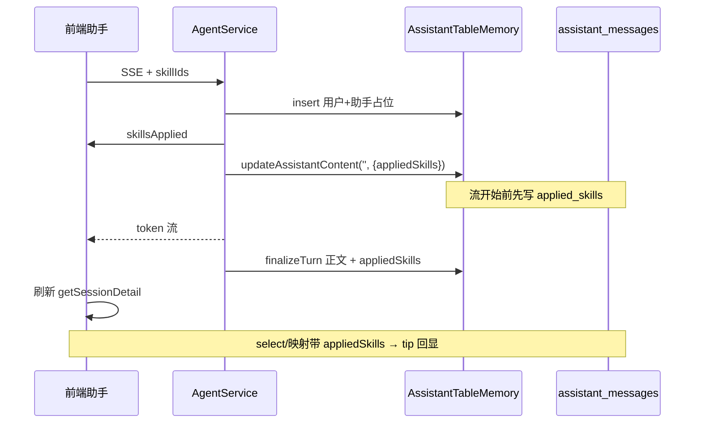

# 已应用 Skill 落库

> **文档角色**：实现思路专题  
> **日期**：2026-09-16  
> **需求摘要**：知识库助手在 SSE 流中可展示「已应用 Skill」，但刷新后提示消失；本轮补齐 `assistant_messages.applied_skills` 列、Agent 流中提前落库、会话详情回读与草稿 `import-transcript` 透传，使刷新/迁入后 UI 仍能回显。

## 延伸阅读

- [docs/knowledge/知识库Skill对话.md](./知识库Skill对话.md) — Skill `/` 多选、Agent SSE、`memorySource`、前端 `appliedSkills` 展示入口
- [docs/agent/Agent记忆分表.md](../agent/Agent记忆分表.md) — `AgentTurnMemory` / `AssistantTableMemory` 与业务表分源
- [docs/knowledge/Skill编辑试跑.md](./Skill编辑试跑.md) — 独立 Skill 试跑（非本文落库路径）

---

## 1. 背景与目标

知识库助手选用 Skill 后，Agent SSE 会推送 `skillsApplied`，前端把 `{ id, title }[]` 挂到当前助手消息的 `appliedSkills`，气泡上方显示「已应用 Skill」。但刷新或草稿迁入正式会话后提示消失，根因是：

1. **库表无列 / 详情未回读**：`assistant_messages` 原先没有 `applied_skills`；即便 Agent 收尾想写，也无处落库；`getSessionDetail` 的 `select` / 映射也不带该字段。
2. **草稿迁入丢字段**：`import-transcript` 的 DTO 与落库只认 `role` + `content`；前端 `buildImportTranscriptLinesFromMessages` 也不带 `appliedSkills`，保存文档时把内存里已有的 Skill 快照丢掉。
3. **仅 finalize 一次写入偏晚**：占位行插入后、流开始前前端已能看到 tip；若只等 `finalizeTurn` 再写列，流中崩溃或只依赖库字段刷新时会丢快照。需要在 `skillBodies.length` 分支里**提前** `updateAssistantContent(..., { appliedSkills })`，流结束再带同一快照 + 正文更新。

**目标**：已保存会话刷新、历史切换、草稿 import 后，「已应用 Skill」与流式当时一致；无 Skill 的普通助手路径行为不变。

---

## 2. 改动范围

| 路径                                                                            | 角色                                                         |
| ------------------------------------------------------------------------------- | ------------------------------------------------------------ |
| `apps/backend/src/migrations/1789485490097-assistant-message-applied-skills.ts` | 新增列 `applied_skills` json NULL                            |
| `apps/backend/src/services/assistant/assistant-message.entity.ts`               | 实体字段 `appliedSkills`                                     |
| `apps/backend/src/services/assistant/dto/import-assistant-transcript.dto.ts`    | 迁入行可选 `appliedSkills`                                   |
| `apps/backend/src/services/agent/agent-turn-memory.ts`                          | `UpdateAssistantContentOpts.appliedSkills`（纯新增端口文件） |
| `apps/backend/src/services/assistant/assistant-table-memory.ts`                 | `updateAssistantContent` 落库 appliedSkills（纯新增）        |
| `apps/backend/src/services/agent/agent.service.ts`                              | 流前早写 + `finalizeTurn` / `cleanupTurnOnFailure` 收尾透传  |
| `apps/backend/src/services/assistant/assistant.service.ts`                      | `getSessionDetail` 回读；`importTranscript` 助手行写入       |
| `apps/frontend/src/types/chat.ts`                                               | `Message.appliedSkills`                                      |
| `apps/frontend/src/store/assistant.ts`                                          | API→UI 映射；import 行构造                                   |
| `apps/frontend/src/components/design/ChatAssistantMessage/index.tsx`            | 气泡 tip 渲染                                                |

---

## 3. 实现思路



要点：

1. **快照形态**：只存 `{ id, title }[]`（json），不存 Skill 正文，避免消息行膨胀与权限泄漏。
2. **写列策略**：`AssistantTableMemory.updateAssistantContent` 仅在 `opts.appliedSkills?.length` 时写入，**不用 null 清空**，避免收尾未带 Skill 时误清早写结果。
3. **双写时点**：流前早写（空正文 + 元数据）+ finalize/cleanup 再写（完整正文 + 同一快照）。
4. **迁入链路**：SSE → 前端 Message → `buildImportTranscriptLinesFromMessages` → DTO → `importTranscript` 助手 `create`，与已保存路径同源字段。

---

## 4. 关键实现（改动前 / 改动后）

### 4.1 Migration：`applied_skills` 列（纯新增）

基线中不存在该 migration；只展示改动后。Migration `1789485490097` 向 `assistant_messages` 增加 **`applied_skills` json NULL**。

**改动后** · `apps/backend/src/migrations/1789485490097-assistant-message-applied-skills.ts`（新增，约 L1–L14，符号 `AssistantMessageAppliedSkills1789485490097`）

```typescript
// 从 TypeORM 引入迁移接口与查询运行器类型
import { MigrationInterface, QueryRunner } from "typeorm";
// 空行分隔 import 与类声明

// 定义本轮 applied_skills 列迁移类（类名含时间戳）
export class AssistantMessageAppliedSkills1789485490097 implements MigrationInterface {
	// TypeORM 迁移登记名，与文件/类语义一致
	name = "AssistantMessageAppliedSkills1789485490097";
	// 空行分隔 name 与 up

	// up：向前演进数据库 schema
	public async up(queryRunner: QueryRunner): Promise<void> {
		// 新增可空 json 列 applied_skills；旧消息行为 NULL
		await queryRunner.query(
			`ALTER TABLE \`assistant_messages\` ADD \`applied_skills\` json NULL`,
		);
		// 结束 up
	}
	// 空行分隔 up 与 down

	// down：回滚删除该列
	public async down(queryRunner: QueryRunner): Promise<void> {
		// DROP COLUMN 恢复无 applied_skills 的基线表
		await queryRunner.query(
			`ALTER TABLE \`assistant_messages\` DROP COLUMN \`applied_skills\``,
		);
		// 结束 down
	}
	// 空行（类结束前）

	// 迁移类闭合
}
```

**变更摘要**：纯新增 migration；运行后助手消息表具备可空 Skill 快照列。

### 4.2 `AssistantMessage` 实体整类

**对比范围**：整个 `AssistantMessage` 类（含 import / enum）；基线无 `appliedSkills` 列映射。

**改动前** · `apps/backend/src/services/assistant/assistant-message.entity.ts`（基线 HEAD，约 L1–L53）

```typescript
// 从 typeorm 引入列/实体/关系装饰器与生成列
import {
	// 列装饰器
	Column,
	// 创建时间装饰器
	CreateDateColumn,
	// 实体装饰器
	Entity,
	// 索引装饰器
	Index,
	// 外键连接列装饰器
	JoinColumn,
	// 多对一关系装饰器
	ManyToOne,
	// 主键 UUID 生成装饰器
	PrimaryGeneratedColumn,
	// 从 typeorm 包导入上述符号
} from "typeorm";
// 引入会话实体以便 ManyToOne
import { AssistantSession } from "./assistant-session.entity";
// 空行

// 导出消息角色枚举
export enum AssistantMessageRole {
	// 系统角色取值
	SYSTEM = "system",
	// 用户角色取值
	USER = "user",
	// 助手角色取值
	ASSISTANT = "assistant",
	// 枚举结束
}
// 空行

// 映射表 assistant_messages
@Entity("assistant_messages")
// 按会话+创建时间索引，便于按时间拉历史
@Index("idx_assistant_msg_session_created", ["session", "createdAt"])
// 按会话+turnId 索引，便于成对删轮次
@Index("idx_assistant_msg_session_turn", ["session", "turnId"])
// 助手消息实体类声明
export class AssistantMessage {
	// UUID 主键
	@PrimaryGeneratedColumn("uuid")
	// 主键字段 id
	id: string;
	// 空行

	// 多对一：消息属于某个会话
	@ManyToOne(
		// 懒加载目标实体为 AssistantSession
		() => AssistantSession,
		// 反向：会话侧 messages 集合
		(s) => s.messages,
		// 关系选项对象开始
		{
			// 会话删除时级联删消息
			onDelete: "CASCADE",
			// 关系选项结束
		},
		// ManyToOne 调用结束
	)
	// 外键列名 session_id
	@JoinColumn({ name: "session_id" })
	// 会话关联属性
	session: AssistantSession;
	// 空行

	// 角色列：枚举类型
	@Column({
		// 数据库枚举类型
		type: "enum",
		// 枚举取值来自 AssistantMessageRole
		enum: AssistantMessageRole,
		// Column 选项结束
	})
	// 角色字段
	role: AssistantMessageRole;
	// 空行

	// 块注释开始：说明 turnId 成对语义
	/**
// 同一轮问答用户与助手共用 turnId
	 * 同一轮问答：用户消息与助手消息共用同一 turnId，禁止只存一侧。
// 助手可先占位空正文再 UPDATE
	 * 助手行可先占位（content 为空），流式结束后再 UPDATE 正文。
// 块注释结束
	 */
	// turn_id 可空 varchar(36)
	@Column({ name: "turn_id", type: "varchar", length: 36, nullable: true })
	// turnId 字段类型
	turnId: string | null;
	// 空行

	// 正文 longtext 列
	@Column({ type: "longtext" })
	// 正文内容字段
	content: string;
	// 空行

	// 创建时间戳列
	@CreateDateColumn({ name: "created_at", type: "timestamp" })
	// 创建时间字段
	createdAt: Date;
	// 实体类结束（基线无 appliedSkills）
}
```

**改动后** · `apps/backend/src/services/assistant/assistant-message.entity.ts`（当前，约 L1–L60）

```typescript
// 从 typeorm 引入列/实体/关系装饰器与生成列
import {
	// 列装饰器
	Column,
	// 创建时间装饰器
	CreateDateColumn,
	// 实体装饰器
	Entity,
	// 索引装饰器
	Index,
	// 外键连接列装饰器
	JoinColumn,
	// 多对一关系装饰器
	ManyToOne,
	// 主键 UUID 生成装饰器
	PrimaryGeneratedColumn,
	// 从 typeorm 包导入上述符号
} from "typeorm";
// 引入会话实体以便 ManyToOne
import { AssistantSession } from "./assistant-session.entity";
// 空行

// 导出消息角色枚举
export enum AssistantMessageRole {
	// 系统角色取值
	SYSTEM = "system",
	// 用户角色取值
	USER = "user",
	// 助手角色取值
	ASSISTANT = "assistant",
	// 枚举结束
}
// 空行

// 映射表 assistant_messages
@Entity("assistant_messages")
// 按会话+创建时间索引
@Index("idx_assistant_msg_session_created", ["session", "createdAt"])
// 按会话+turnId 索引
@Index("idx_assistant_msg_session_turn", ["session", "turnId"])
// 助手消息实体类声明
export class AssistantMessage {
	// UUID 主键
	@PrimaryGeneratedColumn("uuid")
	// 主键字段 id
	id: string;
	// 空行

	// 多对一：消息属于某个会话
	@ManyToOne(
		// 懒加载目标实体为 AssistantSession
		() => AssistantSession,
		// 反向：会话侧 messages 集合
		(s) => s.messages,
		// 关系选项对象开始
		{
			// 会话删除时级联删消息
			onDelete: "CASCADE",
			// 关系选项结束
		},
		// ManyToOne 调用结束
	)
	// 外键列名 session_id
	@JoinColumn({ name: "session_id" })
	// 会话关联属性
	session: AssistantSession;
	// 空行

	// 角色列：枚举类型
	@Column({
		// 数据库枚举类型
		type: "enum",
		// 枚举取值来自 AssistantMessageRole
		enum: AssistantMessageRole,
		// Column 选项结束
	})
	// 角色字段
	role: AssistantMessageRole;
	// 空行

	// 块注释开始：turnId 成对语义
	/**
// 同一轮问答用户与助手共用 turnId
	 * 同一轮问答：用户消息与助手消息共用同一 turnId，禁止只存一侧。
// 助手可先占位空正文再 UPDATE
	 * 助手行可先占位（content 为空），流式结束后再 UPDATE 正文。
// 块注释结束
	 */
	// turn_id 可空 varchar(36)
	@Column({ name: "turn_id", type: "varchar", length: 36, nullable: true })
	// turnId 字段类型
	turnId: string | null;
	// 空行

	// 正文 longtext 列
	@Column({ type: "longtext" })
	// 正文内容字段
	content: string;
	// 空行

	// 块注释开始：说明 appliedSkills 用途
	/**
// 本轮强制 Skill 快照供刷新后 UI 展示
	 * 本轮 Agent 强制应用的 Skill 快照（id + title），供刷新后 UI 展示；
// 仅助手行有意义，用户行一般为 null
	 * 仅助手行有意义，用户行一般为 null。
// 块注释结束
	 */
	// 映射列 applied_skills，json 可空
	@Column({ name: "applied_skills", type: "json", nullable: true })
	// TS 类型：id+title 数组或 null
	appliedSkills: Array<{ id: string; title: string }> | null;
	// 空行

	// 创建时间戳列
	@CreateDateColumn({ name: "created_at", type: "timestamp" })
	// 创建时间字段
	createdAt: Date;
	// 实体类结束
}
```

**变更摘要**：在 `content` 与 `createdAt` 之间新增可空 `appliedSkills`，与 migration 列名 `applied_skills` 对齐。

### 4.3 Import DTO：`AssistantTranscriptAppliedSkillDto` / `AssistantTranscriptLineDto`

**对比范围**：迁入契约文件整体（含新增 Skill DTO 与 line 上可选字段）；`ImportAssistantTranscriptDto` 外壳未改语义。

**改动前** · `apps/backend/src/services/assistant/dto/import-assistant-transcript.dto.ts`（基线 HEAD，约 L1–L72）

```typescript
// 文件头块注释开始
/**
// 说明本 DTO 对应草稿迁入正式条目的 API
 * 知识库「草稿阶段」助手对话迁入正式条目后的落库契约（对应 `POST assistant/session/import-transcript`）。
// 指向旧版设计文档路径
 * 设计说明见：`docs/knowledge/knowledge-assistant-complete.md`（总览）、`knowledge-assistant-ephemeral-persistence.md`（持久化专题）。
// 空注释行
 *
// lines 上限 200 的客户端截断约定
 * `lines` 上限 200：客户端在草稿轮次超过上限时应发送 **按时间升序排列的最近 200 条**（`slice(-200)`），避免校验失败并保证落库为「当前可见」尾部对话。
// 块注释结束
 */
// class-transformer 的 Type 用于嵌套转换
import { Type } from "class-transformer";
// 从 class-validator 引入校验装饰器
import {
	// 数组最大长度
	ArrayMaxSize,
	// 必须是数组
	IsArray,
	// 枚举取值校验
	IsIn,
	// 非空
	IsNotEmpty,
	// 可选字段
	IsOptional,
	// 字符串
	IsString,
	// 最大长度
	MaxLength,
	// 嵌套对象校验
	ValidateNested,
	// 从 class-validator 导入
} from "class-validator";
// 空行

// 单行迁入 DTO：仅 role + content（基线）
export class AssistantTranscriptLineDto {
	// 角色只能是 user 或 assistant
	@IsIn(["user", "assistant"])
	// 角色字段
	role!: "user" | "assistant";
	// 空行

	// 内容为字符串
	@IsString()
	// 单条内容最长 10 万字符
	@MaxLength(100_000)
	// 内容字段
	content!: string;
	// 类结束：基线无线上 appliedSkills
}
// 空行

// 整包迁入 DTO 注释
/** 将客户端草稿阶段的对话迁入已保存知识条目对应的助手会话（落库） */
// 导出入参根 DTO
export class ImportAssistantTranscriptDto {
	// 文章 id 字符串
	@IsString()
	// 文章 id 非空
	@IsNotEmpty()
	// 文章 id 最长 1024
	@MaxLength(1024)
	// 知识条目 id 字段
	knowledgeArticleId!: string;
	// 空行

	// sessionId 可选说明块注释开始
	/**
// 目标会话可选
	 * 目标会话 id（可选）：
// 传入则迁入该 session
	 * - 传入：迁入到该 session（会校验归属与 knowledgeArticleId 绑定）
// 不传则取文章最近会话
	 * - 不传：兼容旧行为，迁入到该文章最近会话（不存在则新建）
// 块注释结束
	 */
	// 可选
	@IsOptional()
	// 字符串
	@IsString()
	// 最长 128
	@MaxLength(128)
	// 可选 sessionId
	sessionId?: string;
	// 空行

	// lines 数组注释
	/** 按时间从早到晚；条数 ≤200；超长草稿由客户端截断为最近 200 条再提交 */
	// 必须是数组
	@IsArray()
	// 最多 200 条
	@ArrayMaxSize(200)
	// 每项嵌套校验
	@ValidateNested({ each: true })
	// 转换元素类型为 AssistantTranscriptLineDto
	@Type(() => AssistantTranscriptLineDto)
	// lines 字段
	lines!: AssistantTranscriptLineDto[];
	// 根 DTO 结束
}
```

**改动后** · `apps/backend/src/services/assistant/dto/import-assistant-transcript.dto.ts`（当前，约 L1–L72）

```typescript
// 文件头块注释开始
/**
// 说明本 DTO 对应草稿迁入正式条目的 API
 * 知识库「草稿阶段」助手对话迁入正式条目后的落库契约（对应 `POST assistant/session/import-transcript`）。
// 指向设计文档路径
 * 设计说明见：`docs/knowledge/knowledge-assistant-complete.md`（总览）、`knowledge-assistant-ephemeral-persistence.md`（持久化专题）。
// 空注释行
 *
// lines 上限 200 的客户端截断约定
 * `lines` 上限 200：客户端在草稿轮次超过上限时应发送 **按时间升序排列的最近 200 条**（`slice(-200)`），避免校验失败并保证落库为「当前可见」尾部对话。
// 块注释结束
 */
// class-transformer 的 Type 用于嵌套转换
import { Type } from "class-transformer";
// 从 class-validator 引入校验装饰器
import {
	// 数组最大长度
	ArrayMaxSize,
	// 必须是数组
	IsArray,
	// 枚举取值校验
	IsIn,
	// 非空
	IsNotEmpty,
	// 可选字段
	IsOptional,
	// 字符串
	IsString,
	// 最大长度
	MaxLength,
	// 嵌套对象校验
	ValidateNested,
	// 从 class-validator 导入
} from "class-validator";
// 空行

// 助手行可选 Skill 快照 DTO 的注释
/** 助手行可选：迁入时保留「已应用 Skill」快照 */
// 新增：单条 Skill 引用校验类
export class AssistantTranscriptAppliedSkillDto {
	// id 必须是字符串
	@IsString()
	// id 非空
	@IsNotEmpty()
	// id 最长 64
	@MaxLength(64)
	// Skill id 字段
	id!: string;
	// 空行

	// title 必须是字符串
	@IsString()
	// title 非空
	@IsNotEmpty()
	// title 最长 255
	@MaxLength(255)
	// Skill 标题字段
	title!: string;
	// Skill DTO 类结束
}
// 空行

// 单行迁入 DTO
export class AssistantTranscriptLineDto {
	// 角色只能是 user 或 assistant
	@IsIn(["user", "assistant"])
	// 角色字段
	role!: "user" | "assistant";
	// 空行

	// 内容为字符串
	@IsString()
	// 单条内容最长 10 万字符
	@MaxLength(100_000)
	// 内容字段
	content!: string;
	// 空行

	// appliedSkills 字段说明注释
	/** 仅 assistant 行有意义；草稿阶段 SSE 已带到前端的 Skill 快照 */
	// 可选：旧客户端可不传
	@IsOptional()
	// 必须是数组（若传入）
	@IsArray()
	// 单行最多 8 个 Skill 快照
	@ArrayMaxSize(8)
	// 数组元素嵌套校验
	@ValidateNested({ each: true })
	// 元素类型转为 AssistantTranscriptAppliedSkillDto
	@Type(() => AssistantTranscriptAppliedSkillDto)
	// 可选 appliedSkills 字段
	appliedSkills?: AssistantTranscriptAppliedSkillDto[];
	// Line DTO 结束
}
// 空行

// 整包迁入 DTO 注释
/** 将客户端草稿阶段的对话迁入已保存知识条目对应的助手会话（落库） */
// 导出入参根 DTO
export class ImportAssistantTranscriptDto {
	// 文章 id 字符串
	@IsString()
	// 文章 id 非空
	@IsNotEmpty()
	// 文章 id 最长 1024
	@MaxLength(1024)
	// 知识条目 id 字段
	knowledgeArticleId!: string;
	// 空行

	// sessionId 可选说明块注释开始
	/**
// 目标会话可选
	 * 目标会话 id（可选）：
// 传入则迁入该 session
	 * - 传入：迁入到该 session（会校验归属与 knowledgeArticleId 绑定）
// 不传则取文章最近会话
	 * - 不传：兼容旧行为，迁入到该文章最近会话（不存在则新建）
// 块注释结束
	 */
	// 可选
	@IsOptional()
	// 字符串
	@IsString()
	// 最长 128
	@MaxLength(128)
	// 可选 sessionId
	sessionId?: string;
	// 空行

	// lines 数组注释
	/** 按时间从早到晚；条数 ≤200；超长草稿由客户端截断为最近 200 条再提交 */
	// 必须是数组
	@IsArray()
	// 最多 200 条
	@ArrayMaxSize(200)
	// 每项嵌套校验
	@ValidateNested({ each: true })
	// 转换元素类型
	@Type(() => AssistantTranscriptLineDto)
	// lines 字段
	lines!: AssistantTranscriptLineDto[];
	// 根 DTO 结束
}
```

**变更摘要**：新增 `AssistantTranscriptAppliedSkillDto`；`AssistantTranscriptLineDto` 增加可选 `appliedSkills`，旧客户端不传仍可通过校验。

### 4.4 `UpdateAssistantContentOpts` / `AppliedSkillRef`（纯新增文件）

基线 HEAD 中不存在 `agent-turn-memory.ts`；只展示改动后（含端口上 `updateAssistantContent` 的 opts 形参）。

**改动后** · `apps/backend/src/services/agent/agent-turn-memory.ts`（新增，约 L1–L40，符号 `AppliedSkillRef` + `UpdateAssistantContentOpts` + `AgentTurnMemory`）

```typescript
// 引入 LangChain BaseMessage 类型供历史构建返回
import type { BaseMessage } from "@langchain/core/messages";
// 引入联网 organic 条目类型供 searchOrganic 选项
import type { SerperOrganicItem } from "../web-search/web-search.types";
// 空行

// Skill 快照类型注释
/** 本轮强制应用的 Skill 快照（落库 / SSE） */
// 导出 id+title 结构别名
export type AppliedSkillRef = { id: string; title: string };
// 空行

// updateAssistantContent 可选字段注释
/** updateAssistantContent 可选落库字段；各 Memory 实现只读自己需要的键 */
// 导出可选 opts 对象类型
export type UpdateAssistantContentOpts = {
	// searchOrganic 三态语义注释
	/** undefined：不改列；null：清空；数组：落库（agent / english / skill_try） */
	// 联网 organic 可选键
	searchOrganic?: SerperOrganicItem[] | null;
	// appliedSkills 三态语义注释（助手表用）
	/** undefined：不改列；null：清空；数组：落库（assistant_*） */
	// Skill 快照可选键
	appliedSkills?: AppliedSkillRef[] | null;
	// opts 类型结束
};
// 空行

// 端口接口块注释开始
/**
// Agent 流式一轮业务记忆端口说明
 * Agent 流式一轮的业务记忆端口：读写与 LangChain 历史必须同源。
// 缺省写 agent_*，知识库 Skill 写 assistant_*
 * 缺省实现写 `agent_*`；知识库 Skill 用 `assistant_*`（见 Agent业务消息分表方案）。
// 块注释结束
 */
// 导出记忆端口接口
export interface AgentTurnMemory {
	// 按需压缩会话摘要
	compactSessionIfNeeded(businessSessionId: string): Promise<void>;
	// 空行

	// 插入用户行与助手占位行
	insertUserAndAssistantPlaceholder(
		// 业务会话 id
		businessSessionId: string,
		// 本轮 turnId
		turnId: string,
		// 用户正文
		userContent: string,
		// 返回两侧消息 id
	): Promise<{ userMessageId: string; assistantMessageId: string }>;
	// 空行

	// 从 DB 构建 LangChain 消息列表
	buildLangChainMessagesFromDb(
		// 业务会话 id
		businessSessionId: string,
		// 返回 BaseMessage 数组
	): Promise<BaseMessage[]>;
	// 空行

	// 更新助手正文及可选元数据
	updateAssistantContent(
		// 业务会话 id
		businessSessionId: string,
		// 助手消息 id
		assistantMessageId: string,
		// 正文内容
		content: string,
		// 可选 opts（含 appliedSkills）
		opts?: UpdateAssistantContentOpts,
		// 无返回值 Promise
	): Promise<void>;
	// 空行

	// 按 turnId 删除成对消息
	deleteTurnPair(businessSessionId: string, turnId: string): Promise<void>;
	// 接口结束
}
```

**变更摘要**：端口把 `appliedSkills` 收进统一 opts，助手表适配器只消费该键。

### 4.5 `AssistantTableMemory.updateAssistantContent`（纯新增方法/文件）

基线 HEAD 无 `assistant-table-memory.ts`；只展示改动后完整方法。

**改动后** · `apps/backend/src/services/assistant/assistant-table-memory.ts`（新增，约 L211–L234，符号 `updateAssistantContent`）

```typescript
// 实现端口：更新助手行正文与可选 Skill 快照
	async updateAssistantContent(
// 业务侧会话 id（assistant_sessions.id）
		businessSessionId: string,
// 待更新的助手消息主键
		assistantMessageId: string,
// 新的助手正文（早写阶段可传空串）
		content: string,
// 可选落库字段（本实现只认 appliedSkills）
		opts?: UpdateAssistantContentOpts,
// 异步无返回值
	): Promise<void> {
// 源码注释：本表无 search_organic，只落正文与 appliedSkills
		// assistant_messages 无 search_organic；联网胶囊经 SSE 推前端，此处只落正文与 appliedSkills
// 取当前时间用于刷新 session.updatedAt
		const now = new Date();
// 构造 TypeORM update patch 的局部类型
		const patch: {
// 正文必更新
			content: string;
// appliedSkills 仅在有值时附带
			appliedSkills?: NonNullable<UpdateAssistantContentOpts['appliedSkills']>;
// 用 content 初始化 patch
		} = { content };
// 源码注释：仅在有 Skill 时写入，勿用 null 覆盖
		// 仅在有 Skill 时写入；勿用 null 覆盖（避免误清）
// 若 opts 带来非空 appliedSkills 数组则写入 patch
		if (opts?.appliedSkills?.length) {
// 把快照赋给 patch.appliedSkills
			patch.appliedSkills = opts.appliedSkills;
// 结束 if
		}
// 并行更新消息行与会话 updatedAt
		await Promise.all([
// 按助手消息 id 执行 update
			this.messageRepo.update({ id: assistantMessageId }, patch),
// 同步刷新会话 updatedAt
			this.sessionRepo.update(
// 按业务会话 id 定位
				{ id: businessSessionId },
// 写入新的 updatedAt
				{ updatedAt: now },
// sessionRepo.update 结束
			),
// Promise.all 结束
		]);
// 方法结束
	}
```

**变更摘要**：助手表适配器忽略 `searchOrganic`；仅当 `appliedSkills.length > 0` 时写列，保护早写结果不被误清。

### 4.6 `finalizeTurn`：收尾透传 `appliedSkills`

**对比范围**：`runChatStream` 内局部函数 `finalizeTurn` 完整闭包（声明→`};`）。

**改动前** · `apps/backend/src/services/agent/agent.service.ts`（基线 HEAD，约 L403–L428）

```typescript
// 定义流结束时的收尾闭包
const finalizeTurn = async () => {
	// 守卫条件：缺会话/turn/助手消息则直接返回
	if (
		// 旧版用 streamSessionId 作为记忆会话键
		!streamSessionId ||
		// 缺本轮 turnId 则跳过
		!activeTurnId ||
		// 缺助手消息 id 则跳过
		!assistantMessageId ||
		// 缺 AgentSession 实体则跳过
		!session
		// 条件结束
	) {
		// 无足够上下文则 no-op
		return;
		// 守卫结束
	}
	// 若累积正文为空
	if (!accumulated.trim()) {
		// 源码注释：空回复删本轮成对消息
		// 若assistant回复为空，删掉本轮消息
		// 旧版直接调 this.memory.deleteTurnPair
		await this.memory.deleteTurnPair(streamSessionId, activeTurnId);
		// 删完返回
		return;
		// 空正文分支结束
	}
	// 源码注释：补全正文与联网胶囊
	// 正常则补全 assistant 正文与联网胶囊数据源
	// 计算待落库 organic
	const organicToSave =
		// 有 organic 则补 position
		turnSearchOrganic.length > 0
			? // 调用 withAgentOrganicPositions
				withAgentOrganicPositions(turnSearchOrganic)
			: // 否则传 null
				null;
	// 旧版 updateAssistantContent 第四参直接传 organic 数组/null
	await this.memory.updateAssistantContent(
		// 会话 id
		streamSessionId,
		// 助手消息 id
		assistantMessageId,
		// 完整累积正文
		accumulated,
		// 仅 organic，无 appliedSkills
		organicToSave,
		// 调用结束
	);
	// finalizeTurn 闭包结束
};
```

**改动后** · `apps/backend/src/services/agent/agent.service.ts`（当前，约 L648–L678）

```typescript
// 定义流结束时的收尾闭包
const finalizeTurn = async () => {
	// 守卫：缺业务会话/turn/助手消息则返回
	if (
		// 改用 businessSessionId（与 turnMemory 同源）
		!businessSessionId ||
		// 缺本轮 turnId 则跳过
		!activeTurnId ||
		// 缺助手消息 id 则跳过
		!assistantMessageId ||
		// 缺 AgentSession 实体则跳过
		!session
		// 条件结束
	) {
		// 无足够上下文则 no-op
		return;
		// 守卫结束
	}
	// 若累积正文为空
	if (!accumulated.trim()) {
		// 源码注释：空回复删本轮
		// 若assistant回复为空，删掉本轮消息
		// 经 turnMemory 删除成对消息
		await turnMemory.deleteTurnPair(businessSessionId, activeTurnId);
		// 删完返回
		return;
		// 空正文分支结束
	}
	// 源码注释：补全正文与联网胶囊
	// 正常则补全 assistant 正文与联网胶囊数据源
	// 计算待落库 organic
	const organicToSave =
		// 有 organic 则补 position
		turnSearchOrganic.length > 0
			? // 调用 withAgentOrganicPositions
				withAgentOrganicPositions(turnSearchOrganic)
			: // 否则 null
				null;
	// 经 turnMemory 更新助手行（opts 对象）
	await turnMemory.updateAssistantContent(
		// 业务会话 id
		businessSessionId,
		// 助手消息 id
		assistantMessageId,
		// 完整累积正文
		accumulated,
		// opts 对象开始
		{
			// 始终带上 searchOrganic（可为 null）
			searchOrganic: organicToSave,
			// 若本轮有强制 Skill 则展开 appliedSkills
			...(turnAppliedSkills?.length
				? // 把 turnAppliedSkills 写入 opts
					{ appliedSkills: turnAppliedSkills }
				: // 无 Skill 则不展开该键（避免误清）
					{}),
			// opts 对象结束
		},
		// 调用结束
	);
	// finalizeTurn 闭包结束
};
```

**变更摘要**：第四参改为 `UpdateAssistantContentOpts`；在有 `turnAppliedSkills` 时 spread `appliedSkills`。`cleanupTurnOnFailure` 对称同样透传（略，逻辑同构）。

### 4.7 流前早写：`skillBodies.length` + `updateAssistantContent`

**对比范围**：意图注入结束到「（5）流式并发控制」之间的区间；基线无 Skill 分支，改动后插入早写。

**改动前** · `apps/backend/src/services/agent/agent.service.ts`（基线 HEAD，约 L560–L580 附近：意图注入结束后直接进入 epoch）

```typescript
// 省略：上方意图注入 for 循环未改动
			// ...（意图注入 HumanMessage 循环未改动）
// 意图相关 if 块结束
			}
// 空行：基线此处无 skillBodies / 早写

// 源码注释：进入流式并发控制
			// （5）流式并发控制（epoch机制），每次流式启动+1，高并发终止旧流
// 创建 AbortController
			const abortController = new AbortController();
// 省略：后续 epoch/cache 未在本对比展开
			// ...（incrementStreamEpoch / cache.set 等未改动）
```

**改动后** · `apps/backend/src/services/agent/agent.service.ts`（当前，约 L773–L812，含早写；其后 force/preseed 用 `// ...` 对称省略）

```typescript
// 省略：上方意图注入 for 循环未改动
			// ...（意图注入 HumanMessage 循环未改动）
// 意图相关 if 块结束
			}
// 空行

// 按 dto.skillIds 拉取用户可见 Skill 正文
			const skillBodies = await this.skillService.findByIdsForUser(
// 请求里的 Skill id 列表
				dto.skillIds,
// 当前用户 id 做归属过滤
				userId,
// findByIdsForUser 调用结束
			);
// 仅当确实加载到 Skill 时进入强制分支
			if (skillBodies.length) {
// 把 id+title 映射为本轮落库/SSE 快照
				turnAppliedSkills = skillBodies.map((s) => ({
// Skill 主键
					id: s.id,
// Skill 标题
					title: s.title,
// map 回调结束
				}));
// 向 SSE 订阅者推送 skillsApplied
				subscriber.next({
// 事件类型 skillsApplied
					type: 'skillsApplied',
// data 载荷开始
					data: {
// skills 数组即 turnAppliedSkills
						skills: turnAppliedSkills,
// data 结束
					},
// next 调用结束
				});
// 块注释开始：解释为何流前早写
				/**
// 立刻写入 applied_skills
				 * 立刻把本轮强制 Skill 快照写入业务助手行（applied_skills）。
// 空注释行
				 *
// 为何不只等 finalize
				 * 为何在这里、而不是只等流结束 finalizeTurn：
// 占位行 content 仍空
				 * - 上文 insertUserAndAssistantPlaceholder 已插入助手占位行，此时 content 仍是空串；
// 正文要等流完
				 *   正文要等模型流完才由 finalizeTurn / cleanupTurnOnFailure 补全。
// 前端已展示 tip，崩溃会丢
				 * - 前端此时已通过 SSE `skillsApplied` 展示「已应用 Skill」；若进程在流中崩溃、
// 仅 finalize 一次可能丢快照
				 *   或客户端只依赖落库字段做刷新回读，仅 finalize 一次写入会丢快照。
// 早写 + finalize 再写同一快照
				 * - 此处先写 appliedSkills，流结束后 finalize 会再带同一快照 + 完整正文更新同一行
// Memory 仅 length>0 写列
				 *   （AssistantTableMemory 仅在 appliedSkills.length>0 时写列，不会被 null 清掉）。
// 空注释行
				 *
// 第三参传空串的原因
				 * 第三个参数传 ''：与占位行现状一致，只借 updateAssistantContent 通道改元数据，
// 不写半成品正文
				 * 不提前写入半成品正文；真正正文仍由后续 finalize 用 accumulated 覆盖。
// 块注释结束
				 */
// 流前早写调用 updateAssistantContent
				await turnMemory.updateAssistantContent(
// 源码注释：业务会话 id
					// 业务会话 id（assistant_* / english_* / skill_try_* 与 memorySource 对齐）
// 传入 businessSessionId
					businessSessionId,
// 源码注释：助手占位行 id
					// 本轮助手占位行 id（与 messageIds SSE 下发的一致）
// 传入 assistantMessageId
					assistantMessageId,
// 源码注释：保持空正文
					// 保持空正文：流尚未开始，避免把半成品写进库
// 传空字符串正文
					'',
// 源码注释：仅落库 Skill 快照
					// 仅落库本轮 Skill 的 {id,title}[]，供刷新后 UI 回显
// opts 仅含 appliedSkills
					{ appliedSkills: turnAppliedSkills },
// 早写调用结束
				);
// 其后 force 前缀与 preseed 工具消息对称省略
				// ...（formatSkillsUserForcePrefix / preseedApplySkillMessages 等未在本对比展开）
// skillBodies.length 分支结束
			}
// 空行

// 源码注释：进入流式并发控制
			// （5）流式并发控制（epoch机制），每次流式启动+1，高并发终止旧流
// 创建 AbortController
			const abortController = new AbortController();
// 省略后续
			// ...（incrementStreamEpoch / cache.set 等未改动）
```

**变更摘要**：在流开始前 SSE 推送 + 早写 `applied_skills`；正文仍由 finalize 用 `accumulated` 覆盖。

### 4.8 `getSessionDetail`：回读 `appliedSkills`

**对比范围**：`AssistantService.getSessionDetail` 完整方法。

**改动前** · `apps/backend/src/services/assistant/assistant.service.ts`（基线 HEAD，约 L491–L520）

```typescript
// 按用户与会话 id 拉详情
	async getSessionDetail(userId: number, sessionId: string) {
// 查会话元数据
		const session = await this.sessionRepo.findOne({
// 归属条件
			where: { id: sessionId, userId },
// 只选需要的会话列
			select: ['id', 'userId', 'title', 'createdAt', 'updatedAt'],
// findOne 结束
		});
// 源码注释：知识删除后勿 404 打扰
		// 知识删除会级联清理助手会话；前端可能仍持旧 sessionId 拉取详情，勿抛 404 以免全局 Toast 打扰用户
// 会话不存在则返回空壳
		if (!session) {
// session null + 空 messages
			return { session: null, messages: [] };
// 空会话分支结束
		}
// 按会话拉消息列表
		const messages = await this.messageRepo.find({
// 按 session 关系过滤
			where: { session: { id: sessionId } },
// 按创建时间升序
			order: { createdAt: 'ASC' },
// 基线 select 不含 appliedSkills
			select: ['id', 'turnId', 'role', 'content', 'createdAt'],
// find 结束
		});
// 组装返回对象
		return {
// 会话摘要对象
			session: {
// 对外字段名 sessionId
				sessionId: session.id,
// 标题
				title: session.title,
// 创建时间
				createdAt: session.createdAt,
// 更新时间
				updatedAt: session.updatedAt,
// session 对象结束
			},
// 映射消息列表
			messages: messages.map((m) => ({
// 消息 id
				id: m.id,
// turnId
				turnId: m.turnId,
// 角色
				role: m.role,
// 正文
				content: m.content,
// 创建时间（无 appliedSkills）
				createdAt: m.createdAt,
// map 回调结束
			})),
// return 结束
		};
// 方法结束
	}
```

**改动后** · `apps/backend/src/services/assistant/assistant.service.ts`（当前，约 L550–L580）

```typescript
// 按用户与会话 id 拉详情
	async getSessionDetail(userId: number, sessionId: string) {
// 查会话元数据
		const session = await this.sessionRepo.findOne({
// 归属条件
			where: { id: sessionId, userId },
// 只选需要的会话列
			select: ['id', 'userId', 'title', 'createdAt', 'updatedAt'],
// findOne 结束
		});
// 源码注释：知识删除后勿 404
		// 知识删除会级联清理助手会话；前端可能仍持旧 sessionId 拉取详情，勿抛 404 以免全局 Toast 打扰用户
// 会话不存在则返回空壳
		if (!session) {
// session null + 空 messages
			return { session: null, messages: [] };
// 空会话分支结束
		}
// 按会话拉消息列表
		const messages = await this.messageRepo.find({
// 按 session 关系过滤
			where: { session: { id: sessionId } },
// 按创建时间升序
			order: { createdAt: 'ASC' },
// select 增加 appliedSkills 列
			select: ['id', 'turnId', 'role', 'content', 'appliedSkills', 'createdAt'],
// find 结束
		});
// 组装返回对象
		return {
// 会话摘要对象
			session: {
// 对外字段名 sessionId
				sessionId: session.id,
// 标题
				title: session.title,
// 创建时间
				createdAt: session.createdAt,
// 更新时间
				updatedAt: session.updatedAt,
// session 对象结束
			},
// 映射消息列表
			messages: messages.map((m) => ({
// 消息 id
				id: m.id,
// turnId
				turnId: m.turnId,
// 角色
				role: m.role,
// 正文
				content: m.content,
// 回传 appliedSkills，缺省 null
				appliedSkills: m.appliedSkills ?? null,
// 创建时间
				createdAt: m.createdAt,
// map 回调结束
			})),
// return 结束
		};
// 方法结束
	}
```

**变更摘要**：`select` 与 map 均带上 `appliedSkills`，刷新后前端可还原 tip。

### 4.9 `importTranscript`：助手行写入 `appliedSkills`

**对比范围**：`importTranscript` 内「成对写入 user/assistant」循环核心（方法外壳对称 `// ...`）。

**改动前** · `apps/backend/src/services/assistant/assistant.service.ts`（基线 HEAD，`importTranscript` 内 while 成对保存，约 L820–L870）

```typescript
// 方法签名：迁入草稿对话
	async importTranscript(
// 当前用户 id
		userId: number,
// 迁入 DTO
		dto: ImportAssistantTranscriptDto,
// 返回 sessionId 与插入条数
	): Promise<{ sessionId: string; inserted: number }> {
// 省略：解析文章/会话、必要时清空旧消息
		// ...（文章 id 校验、session 解析或新建、清空旧消息等未改动）
// 取得归属校验后的 session 实体
		const session = await this.assertSessionOwned(userId, sessionId);
// 已插入条数计数器
		let inserted = 0;
// 首条用户内容截断作标题候选
		let titleFromFirstUser: string | null = null;
// 行游标
		let i = 0;
// 遍历 dto.lines
		while (i < dto.lines.length) {
// 取当前行（期望 user）
			const u = dto.lines[i];
// 游标前进
			i++;
// 非 user 行跳过
			if (u.role !== 'user') {
// continue
				continue;
// 非 user 分支结束
			}
// 尚无标题且用户正文非空
			if (!titleFromFirstUser && (u.content ?? '').trim()) {
// 截取前 60 字作标题
				titleFromFirstUser = (u.content ?? '').trim().slice(0, 60);
// 标题分支结束
			}
// 为本轮生成 turnId
			const turnId = randomUUID();
// 保存用户消息
			await this.messageRepo.save(
// create 用户行
				this.messageRepo.create({
// 绑定 session
					session,
// 角色 USER
					role: AssistantMessageRole.USER,
// 用户正文
					content: u.content ?? '',
// 共享 turnId
					turnId,
// create 结束
				}),
// save 结束
			);
// 插入计数 +1
			inserted++;
// 窥视下一行是否 assistant
			const next = dto.lines[i];
// 助手正文：有则取 content，否则空串
			const assistantContent =
// 下一行是 assistant 才取 content
				next?.role === 'assistant' ? (next.content ?? '') : '';
// 若下一行是 assistant 则消费该行
			if (next?.role === 'assistant') {
// 游标再前进
				i++;
// 消费 assistant 行结束
			}
// 保存助手消息（基线无 appliedSkills）
			await this.messageRepo.save(
// create 助手行
				this.messageRepo.create({
// 绑定同一 session
					session,
// 角色 ASSISTANT
					role: AssistantMessageRole.ASSISTANT,
// 助手正文
					content: assistantContent,
// 同一 turnId
					turnId,
// create 结束
				}),
// save 结束
			);
// 插入计数 +1
			inserted++;
// while 结束
		}
// 省略：更新 session 标题与返回
		// ...（更新 title/updatedAt 与 return { sessionId, inserted } 未在本对比展开）
// 方法结束
	}
```

**改动后** · `apps/backend/src/services/assistant/assistant.service.ts`（当前，约 L801–L916，成对保存段约 L860–L902）

```typescript
// 方法签名：迁入草稿对话
	async importTranscript(
// 当前用户 id
		userId: number,
// 迁入 DTO（lines 可含 appliedSkills）
		dto: ImportAssistantTranscriptDto,
// 返回 sessionId 与插入条数
	): Promise<{ sessionId: string; inserted: number }> {
// 省略：解析文章/会话、必要时清空旧消息
		// ...（文章 id 校验、session 解析或新建、清空旧消息等未改动）
// 取得归属校验后的 session 实体
		const session = await this.assertSessionOwned(userId, sessionId);
// 已插入条数计数器
		let inserted = 0;
// 首条用户内容截断作标题候选
		let titleFromFirstUser: string | null = null;
// 行游标
		let i = 0;
// 遍历 dto.lines
		while (i < dto.lines.length) {
// 取当前行（期望 user）
			const u = dto.lines[i];
// 游标前进
			i++;
// 非 user 行跳过
			if (u.role !== 'user') {
// continue
				continue;
// 非 user 分支结束
			}
// 尚无标题且用户正文非空
			if (!titleFromFirstUser && (u.content ?? '').trim()) {
// 截取前 60 字作标题
				titleFromFirstUser = (u.content ?? '').trim().slice(0, 60);
// 标题分支结束
			}
// 为本轮生成 turnId
			const turnId = randomUUID();
// 保存用户消息
			await this.messageRepo.save(
// create 用户行
				this.messageRepo.create({
// 绑定 session
					session,
// 角色 USER
					role: AssistantMessageRole.USER,
// 用户正文
					content: u.content ?? '',
// 共享 turnId
					turnId,
// create 结束
				}),
// save 结束
			);
// 插入计数 +1
			inserted++;
// 窥视下一行是否 assistant
			const next = dto.lines[i];
// 助手正文：有则取 content，否则空串
			const assistantContent =
// 下一行是 assistant 才取 content
				next?.role === 'assistant' ? (next.content ?? '') : '';
// 从 assistant 行提取 Skill 快照
			const appliedSkills =
// 仅 assistant 且数组非空时映射
				next?.role === 'assistant' && next.appliedSkills?.length
// 映射为 {id,title}[]
					? next.appliedSkills.map((s) => ({
// 保留 Skill id
							id: s.id,
// 保留 Skill title
							title: s.title,
// map 结束
						}))
// 否则落库 null
					: null;
// 若下一行是 assistant 则消费该行
			if (next?.role === 'assistant') {
// 游标再前进
				i++;
// 消费 assistant 行结束
			}
// 保存助手消息（含 appliedSkills）
			await this.messageRepo.save(
// create 助手行
				this.messageRepo.create({
// 绑定同一 session
					session,
// 角色 ASSISTANT
					role: AssistantMessageRole.ASSISTANT,
// 助手正文
					content: assistantContent,
// 同一 turnId
					turnId,
// 写入 Skill 快照列（可为 null）
					appliedSkills,
// create 结束
				}),
// save 结束
			);
// 插入计数 +1
			inserted++;
// while 结束
		}
// 省略：标题保留策略与 return
		// ...（保留已有 title、更新 updatedAt 与 return 未在本对比展开）
// 方法结束
	}
```

**变更摘要**：迁入助手行时把 DTO 上的 `appliedSkills` 写入实体，修复草稿保存后 tip 丢失。

### 4.10 `Message.appliedSkills` 类型字段

**对比范围**：`Message` 接口尾部字段区（含 `searchOrganic` 邻域）。

**改动前** · `apps/frontend/src/types/chat.ts`（基线 HEAD，约 L48–L73）

```typescript
// 导出聊天消息接口
export interface Message {
	// 省略：id/role/content 等既有字段
	// ...（id、role、content、timestamp、流式与分支字段等未改动）
	// 联网 organic 字段注释
	/** 联网搜索 Serper organic 热点（助手消息） */
	// 可选 searchOrganic
	searchOrganic?: SearchOrganicItem[] | null;
	// 接口结束（基线无 appliedSkills）
}
```

**改动后** · `apps/frontend/src/types/chat.ts`（当前，约 L48–L74）

```typescript
// 导出聊天消息接口
export interface Message {
	// 省略：id/role/content 等既有字段
	// ...（id、role、content、timestamp、流式与分支字段等未改动）
	// 联网 organic 字段注释
	/** 联网搜索 Serper organic 热点（助手消息） */
	// 可选 searchOrganic
	searchOrganic?: SearchOrganicItem[] | null;
	// appliedSkills 字段注释
	/** 本轮 Agent 强制应用的 Skill（SSE skillsApplied） */
	// 可选 Skill 快照数组
	appliedSkills?: Array<{ id: string; title: string }> | null;
	// 接口结束
}
```

**变更摘要**：UI `Message` 增加与后端/SSE 对齐的 `appliedSkills`。

### 4.11 `mapApiMessagesToUi`

**对比范围**：完整函数 `mapApiMessagesToUi`。

**改动前** · `apps/frontend/src/store/assistant.ts`（基线 HEAD，约 L145–L167）

```typescript
// 把后端详情消息行映射为前端 Message[]
function mapApiMessagesToUi(
	// 入参行结构开始
	rows: Array<{
		// 消息 id
		id: string;
		// 角色字符串
		role: string;
		// 正文
		content: string;
		// 创建时间字符串
		createdAt: string;
		// 行类型结束（无 appliedSkills）
	}>,
	// 返回 Message 数组
): Message[] {
	// 输出累加器
	const out: Message[] = [];
	// 遍历每一行
	for (const m of rows) {
		// 只保留 user/assistant
		if (m.role !== "user" && m.role !== "assistant") continue;
		// 推入 UI 消息对象
		out.push({
			// 用后端 id
			id: m.id,
			// chatId 与 id 同值
			chatId: m.id,
			// 收窄角色联合类型
			role: m.role as "user" | "assistant",
			// 正文缺省空串
			content: m.content ?? "",
			// timestamp 由 createdAt 构造
			timestamp: new Date(m.createdAt),
			// createdAt Date
			createdAt: new Date(m.createdAt),
			// 历史消息非流式
			isStreaming: false,
			// 对象结束
		});
		// for 结束
	}
	// 返回映射结果
	return out;
	// 函数结束
}
```

**改动后** · `apps/frontend/src/store/assistant.ts`（当前，约 L159–L187）

```typescript
// 把后端详情消息行映射为前端 Message[]
function mapApiMessagesToUi(
	// 入参行结构开始
	rows: Array<{
		// 消息 id
		id: string;
		// 角色字符串
		role: string;
		// 正文
		content: string;
		// 创建时间字符串
		createdAt: string;
		// 可选 appliedSkills（详情 API 新增）
		appliedSkills?: Array<{ id: string; title: string }> | null;
		// 行类型结束
	}>,
	// 返回 Message 数组
): Message[] {
	// 输出累加器
	const out: Message[] = [];
	// 遍历每一行
	for (const m of rows) {
		// 只保留 user/assistant
		if (m.role !== "user" && m.role !== "assistant") continue;
		// 仅助手且非空数组时提取快照
		const applied =
			// 角色与 length 双条件
			m.role === "assistant" && m.appliedSkills?.length
				? // 沿用后端数组
					m.appliedSkills
				: // 否则 undefined 以便不写字段
					undefined;
		// 推入 UI 消息对象
		out.push({
			// 用后端 id
			id: m.id,
			// chatId 与 id 同值
			chatId: m.id,
			// 收窄角色联合类型
			role: m.role as "user" | "assistant",
			// 正文缺省空串
			content: m.content ?? "",
			// timestamp 由 createdAt 构造
			timestamp: new Date(m.createdAt),
			// createdAt Date
			createdAt: new Date(m.createdAt),
			// 历史消息非流式
			isStreaming: false,
			// 有快照则展开 appliedSkills 字段
			...(applied ? { appliedSkills: applied } : {}),
			// 对象结束
		});
		// for 结束
	}
	// 返回映射结果
	return out;
	// 函数结束
}
```

**变更摘要**：详情回读路径把 `appliedSkills` 带进 UI Message。

### 4.12 `buildImportTranscriptLinesFromMessages`

**对比范围**：完整函数。

**改动前** · `apps/frontend/src/store/assistant.ts`（基线 HEAD，约 L177–L190）

```typescript
// 函数注释：转 import-transcript 行序列
/** 将当前内存消息转为后端 `import-transcript` 所需的行序列（含未结束流式时的已生成片段） */
// 从 Message[] 构造迁入行
function buildImportTranscriptLinesFromMessages(
	// 入参为当前内存消息
	messages: Message[],
	// 返回仅 role+content 的行数组
): Array<{ role: "user" | "assistant"; content: string }> {
	// 局部 lines 累加器
	const lines: Array<{ role: "user" | "assistant"; content: string }> = [];
	// 遍历消息
	for (const m of messages) {
		// 过滤非 user/assistant
		if (m.role !== "user" && m.role !== "assistant") continue;
		// 只推 role+content（丢掉 appliedSkills）
		lines.push({ role: m.role, content: m.content ?? "" });
		// for 结束
	}
	// 源码注释：与后端 ArrayMaxSize(200) 对齐
	// 与后端 `ImportAssistantTranscriptDto` 的 `@ArrayMaxSize(200)` 对齐；超出时只迁入「最近」200 条（时间顺序保留，即末尾窗口）
	// 截取最近 200 条
	return lines.slice(-200);
	// 函数结束
}
```

**改动后** · `apps/frontend/src/store/assistant.ts`（当前，约 L197–L223）

```typescript
// 函数注释：转 import-transcript 行序列
/** 将当前内存消息转为后端 `import-transcript` 所需的行序列（含未结束流式时的已生成片段） */
// 从 Message[] 构造迁入行
function buildImportTranscriptLinesFromMessages(
	// 入参为当前内存消息
	messages: Message[],
	// 返回类型开始
): Array<{
	// 角色
	role: "user" | "assistant";
	// 正文
	content: string;
	// 可选 appliedSkills
	appliedSkills?: Array<{ id: string; title: string }>;
	// 返回类型结束
}> {
	// 局部 lines 类型与累加器
	const lines: Array<{
		// 角色
		role: "user" | "assistant";
		// 正文
		content: string;
		// 可选 appliedSkills
		appliedSkills?: Array<{ id: string; title: string }>;
		// 累加器初始化为空数组
	}> = [];
	// 遍历消息
	for (const m of messages) {
		// 过滤非 user/assistant
		if (m.role !== "user" && m.role !== "assistant") continue;
		// 提取助手非空 Skill 快照
		const applied =
			// 助手且 length>0
			m.role === "assistant" && m.appliedSkills?.length
				? // 沿用内存数组
					m.appliedSkills
				: // 否则 undefined
					undefined;
		// 推入迁入行
		lines.push({
			// 角色
			role: m.role,
			// 正文
			content: m.content ?? "",
			// 有快照则带上 appliedSkills
			...(applied ? { appliedSkills: applied } : {}),
			// push 对象结束
		});
		// for 结束
	}
	// 源码注释：与后端 200 上限对齐
	// 与后端 `ImportAssistantTranscriptDto` 的 `@ArrayMaxSize(200)` 对齐；超出时只迁入「最近」200 条（时间顺序保留，即末尾窗口）
	// 截取最近 200 条
	return lines.slice(-200);
	// 函数结束
}
```

**变更摘要**：草稿迁入不再丢弃 SSE 已写入内存的 Skill 快照。

### 4.13 `ChatAssistantMessageInner`：已应用 Skill tip 渲染

**对比范围**：组件函数外壳 + `return` 顶部 tip 区；hooks/正文用对称 `// ...` 省略。

**改动前** · `apps/frontend/src/components/design/ChatAssistantMessage/index.tsx`（基线 HEAD，约 L162 起 return 顶部）

```tsx
// 助手气泡内部组件函数签名开始
function ChatAssistantMessageInner({
	// 当前消息（含 searchOrganic 等）
	message,
	// 省略其余 props
	// ...（isShowThinkContent、回调、t、scrollViewportRef 等 props 未改动）
	// 解构结束
}: AssistantMessageProps) {
	// 省略 hooks 与有机预览状态逻辑
	// ...（hooks、有机预览、IntersectionObserver 等未改动）
	// 主 JSX return
	return (
		// 外壳 div 开始
		<div
			// IO 观察目标 ref
			ref={shellRef} // IO 观察目标：整条气泡（思考区+正文+操作区），进视口判定与此一致
			// 宽度样式
			className="w-full h-auto"
			// 壳标记属性
			data-chat-assistant-shell
			// 选区右键捕获
			onContextMenuCapture={onSelectionContextMenuCapture}
			// 选区 pointerdown 捕获
			onPointerDownCapture={onSelectionPointerDownCapture}
			// 外壳开标签结束
		>
			{message?.searchOrganic && message.searchOrganic?.length > 0 && (
				// 联网 tip 容器
				<div
					// 联网 tip 样式
					className="flex items-center text-[13px] text-textcolor/50 mb-3 bg-theme/5 hover:bg-theme/10 w-fit py-2 px-3 rounded-md cursor-pointer select-none"
					// 点击打开 organic 列表
					onClick={() => setOpen(true)}
					// div 开标签结束
				>
					{/* ...（SearchIcon 与已阅读网页文案未改动） */}
				</div>
				// 联网条件结束
			)}
			{/* ...（thinkContent、StreamingMarkdownBody、操作条等未改动） */}
		</div>
		// return 结束
	);
	// 组件函数结束
}
```

**改动后** · `apps/frontend/src/components/design/ChatAssistantMessage/index.tsx`（当前，约 L162 / return 约 L502–L525）

```tsx
// 助手气泡内部组件函数签名开始
function ChatAssistantMessageInner({
	// 当前消息（可含 appliedSkills）
	message,
	// 省略其余 props
	// ...（isShowThinkContent、回调、t、scrollViewportRef 等 props 未改动）
	// 解构结束
}: AssistantMessageProps) {
	// 省略 hooks 与有机预览状态逻辑
	// ...（hooks、有机预览、IntersectionObserver 等未改动）
	// 主 JSX return
	return (
		// 外壳 div 开始
		<div
			// IO 观察目标 ref
			ref={shellRef} // IO 观察目标：整条气泡（思考区+正文+操作区），进视口判定与此一致
			// 宽度样式
			className="w-full h-auto"
			// 壳标记属性
			data-chat-assistant-shell
			// 选区右键捕获
			onContextMenuCapture={onSelectionContextMenuCapture}
			// 选区 pointerdown 捕获
			onPointerDownCapture={onSelectionPointerDownCapture}
			// 外壳开标签结束
		>
			{message?.appliedSkills && message.appliedSkills.length > 0 ? (
				// Skill tip 容器
				<div className="border border-theme/10 bg-theme/5 w-fit mb-3 px-2 pt-0.5 pb-1 rounded-md flex flex-wrap items-center gap-1.5 text-sm text-textcolor/60">
					<span className="shrink-0">
						{t?.("skill.applied.label") ?? "已应用 Skill"}：
					</span>
					{message.appliedSkills.map((s) => (
						// 单个 Skill 展示 span
						<span
							// key 用 Skill id
							key={s.id}
							// 截断样式
							className="inline-flex max-w-full items-center text-textcolor"
							// 完整标题作原生 title
							title={s.title}
							// span 开标签结束
						>
							<span className="truncate">{s.title}</span>
						</span>
						// map 结束
					))}
				</div>
			) : // 无 Skill 时渲染 null
			null}
			{message?.searchOrganic && message.searchOrganic?.length > 0 && (
				// 联网 tip 容器
				<div
					// 联网 tip 样式
					className="flex items-center text-[13px] text-textcolor/50 mb-3 bg-theme/5 hover:bg-theme/10 w-fit py-2 px-3 rounded-md cursor-pointer select-none"
					// 点击打开 organic 列表
					onClick={() => setOpen(true)}
					// div 开标签结束
				>
					{/* ...（SearchIcon 与已阅读网页文案未改动） */}
				</div>
				// 联网条件结束
			)}
			{/* ...（thinkContent、StreamingMarkdownBody、操作条等未改动） */}
		</div>
		// return 结束
	);
	// 组件函数结束
}
```

**变更摘要**：在联网 tip 之上增加「已应用 Skill」条；数据来自消息字段，刷新后依赖落库回读。

---

## 5. 兼容性

- **DB**：`applied_skills` 可空；旧消息为 NULL，UI 不展示 tip，无破坏性。
- **API**：`getSessionDetail` 多返回字段；旧前端忽略即可。`import-transcript` 的 `appliedSkills` 可选，旧客户端不传行为与从前一致。
- **Memory**：`UpdateAssistantContentOpts.appliedSkills` 仅助手表消费；agent/english 表可忽略该键。
- **写列语义**：未带非空 `appliedSkills` 时不改列，避免 finalize 漏传时清空早写。
- **用户可见**：刷新、切会话、草稿保存迁入后，Skill tip 应与流式当时一致。

---

## 6. 测试回归

1. 已保存文档：`/` 选 Skill → 发送 → 流中见 tip → **刷新页面** → tip 仍在。
2. 流中途停止（有部分正文）：tip 仍在；空回复被删轮时无残留孤儿。
3. 未保存草稿：选 Skill 对话 → 保存文档触发 `import-transcript` → 打开正式会话 → tip 仍在。
4. 无 Skill 的普通 AI / RAG 助手：气泡无 tip，历史与迁入无回归。
5. 跑 migration `1789485490097` 后确认列存在且可空。

---

## 7. 相关路径

| 说明           | 路径                                                                            |
| -------------- | ------------------------------------------------------------------------------- |
| 本专题         | `docs/knowledge/已应用Skill落库.md`                                             |
| Skill 对话总览 | `docs/knowledge/知识库Skill对话.md`                                             |
| Agent 记忆分表 | `docs/agent/Agent记忆分表.md`                                                   |
| Migration      | `apps/backend/src/migrations/1789485490097-assistant-message-applied-skills.ts` |
| 实体           | `apps/backend/src/services/assistant/assistant-message.entity.ts`               |
| 迁入 DTO       | `apps/backend/src/services/assistant/dto/import-assistant-transcript.dto.ts`    |
| Memory 端口    | `apps/backend/src/services/agent/agent-turn-memory.ts`                          |
| 助手表 Memory  | `apps/backend/src/services/assistant/assistant-table-memory.ts`                 |
| Agent 流       | `apps/backend/src/services/agent/agent.service.ts`                              |
| 助手 Service   | `apps/backend/src/services/assistant/assistant.service.ts`                      |
| Store 映射     | `apps/frontend/src/store/assistant.ts`                                          |
| Message 类型   | `apps/frontend/src/types/chat.ts`                                               |
| 气泡 tip       | `apps/frontend/src/components/design/ChatAssistantMessage/index.tsx`            |

---

（若与仓库最新源码不一致，以源码为准）
