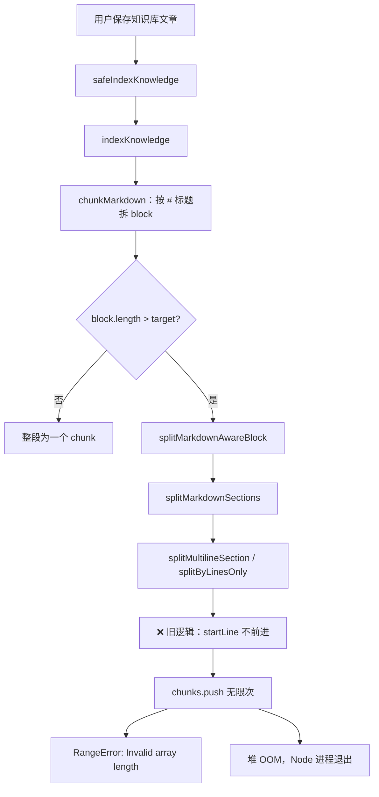

# 知识库分片死循环与 OOM 修复

> **文档角色**：`splitByLinesOnly` overlap 窗口不前进导致 **无限分片 → Invalid array length → Node 堆 OOM** 的专项修复说明。  
> **延伸阅读**：[知识分块边界.md](./知识分块边界.md)（分片语义边界主文档）、[知识RAG后端实现.md](./知识RAG后端实现.md)（RAG 入库链路）。

若与仓库最新源码不一致，**以源码为准**。

---

## 1. 背景与目标

### 1.1 现象

保存知识库文章后，后端在 **向量化入库**（`indexKnowledge`）阶段崩溃或报错，典型日志如下：

```text
[KnowledgeEmbeddingService] indexKnowledge failed: knowledgeId=... err=Invalid array length
    at Array.push (<anonymous>)
    at splitByLinesOnly (.../knowledge-chunk.ts:196:10)
    at splitMultilineSection (.../knowledge-chunk.ts:300:9)
    at splitMarkdownAwareBlock (.../knowledge-chunk.ts:322:19)
    at KnowledgeEmbeddingService.chunkMarkdown (.../knowledge-embedding.service.ts:764:42)
    at KnowledgeEmbeddingService.indexKnowledge (.../knowledge-embedding.service.ts:782:23)
```

持续触发后，Node 进程堆内存涨到约 4GB 上限，最终：

```text
FATAL ERROR: Reached heap limit Allocation failed - JavaScript heap out of memory
```

### 1.2 目标

| 目标 | 说明 |
|------|------|
| **消除死循环** | `splitByLinesOnly` 每次迭代必须保证 `startLine` 严格前进 |
| **兜底上限** | 即使未来出现新的边界条件，分片总数不得超过安全阈值 |
| **不改变产品语义** | 正常 Markdown 的分片边界、overlap 策略与 [知识分块边界.md](./知识分块边界.md) 一致 |
| **最小改动面** | 仅修改 `apps/backend/src/utils/knowledge-chunk.ts`，不引入 embedding pipeline 重构 |

---

## 2. 改动范围

| 路径 | 变更类型 | 说明 |
|------|----------|------|
| `apps/backend/src/utils/knowledge-chunk.ts` | **修复 + 防护** | 三处：`startLine` 前进条件、`KNOWLEDGE_CHUNK_MAX_PIECES` 上限、避免 `push(...array)` 瞬时扩容 |

**未改**（本轮刻意不动）：

- `knowledge-embedding.service.ts` 的 `indexKnowledge` / `chunkMarkdown` 编排
- Qdrant upsert、embedding 分批、会员档位参数
- 前端知识库保存流程

---

## 3. 根因分析（按调用链）

### 3.1 端到端路径



### 3.2 死循环的精确条件

`splitByLinesOnly(text, target, overlap)` 按 **行** 累加长度，直到超过 `target` 切出一窗，再用 **overlap 字符数** 决定下一窗起点 `startLine`。

当同时满足以下条件时会陷入死循环：

1. 当前窗口 **只包含一行**（`endLine - startLine === 1`），且该行长度 **小于 `target`**；
2. overlap 回退计算后 `nextStart === startLine`（回退 0 行或回退后仍落在同一行起点）；
3. 旧代码使用 `startLine = nextStart >= startLine ? nextStart : endLine` —— 当 `nextStart === startLine` 时条件为真，**`startLine` 不变**；
4. `while (startLine < lines.length)` 永远为真 → 无限 `chunks.push(...)`。

**典型触发内容**（任意一种即可）：

- 单行短段落（无换行、长度 < target，例如 BGE 档 target=200 时一行 80 字）；
- 多行文档中，某一 **section 在按行切分后** 反复产出「仅含一行的 chunk」且 overlap 无法让窗口越过该行；
- Markdown 正文区经 `splitMarkdownSections` 拆出的小段 prose/code，再进入 `splitByLinesOnly`。

### 3.3 为何先报 `Invalid array length` 再 OOM

JavaScript 数组有最大长度上限（约 `2^32 - 1`，且受可用堆限制）。死循环中：

1. `chunks` 数组长度指数级/线性暴涨；
2. 某次 `Array.push` 触发 `RangeError: Invalid array length`；
3. 若异常被上层捕获或并发任务继续分配，堆中已积累大量字符串与数组 backing store，GC 来不及回收 → **heap out of memory**。

这与「embedding 一次加载全文」导致的 OOM 是 **不同根因**；本修复针对 **分片算法 bug**，而非向量 API 内存策略。

---

## 4. 实现思路（三个修复点）

| # | 问题点 | 策略 | 效果 |
|---|--------|------|------|
| **①** | overlap 后 `nextStart === startLine` | 改为 `nextStart > startLine ? nextStart : endLine`，无法 overlap 回退时 **跳到 `endLine`** | 保证每轮至少消费一行，死循环根因消除 |
| **②** | 极端大文档或未知边界 | 导出 `KNOWLEDGE_CHUNK_MAX_PIECES = 5000`，在三个出口函数内检查 | 即使逻辑再有漏洞，也不会无限分配 |
| **③** | `chunks.push(...splitLongTextBlock(...))` | 改为 `for` 循环逐条 `push` 并在循环内检查上限 | 避免 spread 一次性展开超大数组；与 ② 一致地截断 |

**为何不用「增大 Node 堆」作为方案**：堆上限只能推迟崩溃，不能修复不前进的循环；且生产 PM2 单进程默认堆约 1.4–2GB，与开发机 `--max-old-space-size` 不一致。

**为何不在 `indexKnowledge` 里 try/catch 吞掉**：`safeIndexKnowledge` 已捕获并打日志，但死循环在 catch 前就可能拖垮整个进程；必须在分片层保证终止。

---

## 5. 关键代码与注释

### 5.1 修复点 ①：`startLine` 必须严格前进

**来源**：`apps/backend/src/utils/knowledge-chunk.ts`（约 L205–L217，`splitByLinesOnly` 尾部 overlap 窗口）

```typescript
// 将 [startLine, endLine) 之间的行拼成一个 chunk 文本
chunks.push(lines.slice(startLine, endLine).join('\n'));

// 已到达最后一行，正常结束
if (endLine >= lines.length) break;

// --- overlap：从 endLine 向前数若干行，使下一窗与上一窗有字符重叠 ---
let back = 0;       // 回退的行数
let olen = 0;       // 已累计的重叠字符数（含换行符）
while (back < endLine - startLine && olen < overlap) {
	back++;
	olen += lines[endLine - back]!.length + 1;
}
const nextStart = endLine - back;

// 【修复核心】
// 旧：startLine = nextStart >= startLine ? nextStart : endLine
// 当 chunk 只有一行时，back 往往为 0 → nextStart === startLine → 永不前进 → 死循环
//
// 新：仅当 nextStart 严格大于 startLine 时才 overlap 回退；
//     否则说明无法在 overlap 约束下前进，直接跳到 endLine（至少跳过当前窗口的最后一行）
startLine = nextStart > startLine ? nextStart : endLine;
```

**行为对比**（单行 `"hello"`，`target=1000`，`overlap=200`）：

| 轮次 | 旧 `startLine` | 新 `startLine` |
|------|----------------|----------------|
| 第 1 次 push 后 | 0 | 0 → **1**（`endLine=1`，nextStart=0，走 `endLine` 分支） |
| 第 2 次 | 仍为 0，无限循环 | `1 >= lines.length`，退出 |

---

### 5.2 修复点 ②：分片总数硬上限

**来源**：`apps/backend/src/utils/knowledge-chunk.ts`（约 L161–L162，常量定义）

```typescript
/**
 * 单次 split 调用允许产出的最大 chunk 数。
 * - 正常长文：数百～两千片量级（取决于 target/overlap）
 * - 5000 片 × 约 200–2000 字/片，已远超单篇合理上限，足够 RAG 使用
 * - 若触顶，后续正文被截断不入库 —— 优于拖垮 Node 进程
 */
export const KNOWLEDGE_CHUNK_MAX_PIECES = 5000;
```

**来源**：`apps/backend/src/utils/knowledge-chunk.ts`（约 L176–L177，`splitByLinesOnly` 主循环入口）

```typescript
while (startLine < lines.length) {
	// 兜底：任何路径在 push 前/后都应有机会 break
	if (chunks.length >= KNOWLEDGE_CHUNK_MAX_PIECES) break;

	// ... 正常分片逻辑 ...
}
```

**来源**：`apps/backend/src/utils/knowledge-chunk.ts`（约 L137，`splitLongTextBlock` 滑动窗口）

```typescript
while (i < text.length && chunks.length < KNOWLEDGE_CHUNK_MAX_PIECES) {
	// 超长单行 / 无换行大段：按字符滑动切分
	// 与 splitByLinesOnly 共用同一上限，防止「一行 10MB 无换行」产出万级片段
}
```

**来源**：`apps/backend/src/utils/knowledge-chunk.ts`（约 L323–L337，`splitMarkdownAwareBlock` 编排层）

```typescript
for (const section of splitMarkdownSections(text)) {
	// section 循环级上限：多 section 文档不会在某一 section 耗尽后再 silently 继续爆炸
	if (chunks.length >= KNOWLEDGE_CHUNK_MAX_PIECES) break;

	if (!section.text) continue;
	if (section.text.length <= target) {
		chunks.push(section.text);
		continue;
	}

	const parts =
		section.kind === 'code'
			? splitByLinesOnly(section.text, target, overlap)
			: splitMultilineSection(section.text, target, overlap);

	// 子结果合并时也检查上限（子函数可能已触顶，此处双保险）
	for (const p of parts) {
		if (chunks.length >= KNOWLEDGE_CHUNK_MAX_PIECES) break;
		chunks.push(p);
	}
}
```

**触顶后的产品影响**：单篇文章 **最多 5000 个向量点** 入库，超出部分 **不再分片、不再 embedding**。对绝大多数笔记无影响；若用户粘贴超大 dump，应提示「内容过长」—— 可作为后续产品改进，本轮以 **进程存活** 为优先。

---

### 5.3 修复点 ③：避免 `push(...大数组)` 的瞬时内存峰值

**来源**：`apps/backend/src/utils/knowledge-chunk.ts`（约 L190–L200，超长单行 fallback）

```typescript
if (endLine === startLine) {
	const lone = lines[startLine]!;

	if (lone.length > target) {
		// 旧：chunks.push(...splitLongTextBlock(lone, target, overlap));
		// spread 会先把子数组所有元素作为参数压栈，子数组极大时额外占内存

		const parts = splitLongTextBlock(lone, target, overlap);
		for (const p of parts) {
			if (chunks.length >= KNOWLEDGE_CHUNK_MAX_PIECES) break;
			chunks.push(p); // 逐条 push，随时可因上限停止
		}
	} else if (lone) {
		chunks.push(lone);
	}
	startLine++;
	continue;
}
```

**来源**：`apps/backend/src/utils/knowledge-chunk.ts`（约 L330–337，`splitMarkdownAwareBlock` 合并子结果）

```typescript
// 旧：chunks.push(...splitByLinesOnly(...)) / chunks.push(...splitMultilineSection(...))
// 新：统一先取 parts 再 for-push，与 5.2 上限检查一致
const parts =
	section.kind === 'code'
		? splitByLinesOnly(section.text, target, overlap)
		: splitMultilineSection(section.text, target, overlap);
for (const p of parts) {
	if (chunks.length >= KNOWLEDGE_CHUNK_MAX_PIECES) break;
	chunks.push(p);
}
```

---

### 5.4 上游入口：`chunkMarkdown` 如何触发本模块

**来源**：`apps/backend/src/services/knowledge-embedding/knowledge-embedding.service.ts`（约 L757–L767，`chunkMarkdown`）

```typescript
const chunks: string[] = [];
for (const b of blocks) {
	if (!b) continue;

	// 标题块本身未超长：整段作为一个 chunk，不进入 splitMarkdownAwareBlock
	if (b.length <= target) {
		chunks.push(b);
		continue;
	}

	// 超长 block 才进入 Markdown 感知分片 —— 死循环发生在此调用链内部
	chunks.push(...splitMarkdownAwareBlock(b, target, overlap));
}

return chunks.map((text, idx) => ({ chunkIndex: idx, text }));
```

**说明**：`chunkMarkdown` 仍使用 `chunks.push(...splitMarkdownAwareBlock(...))`；修复后 `splitMarkdownAwareBlock` 最多返回 5000 片，spread 安全。若需进一步降低峰值，可改为与 5.3 相同的 for-push 模式（**非本轮必需**）。

**来源**：`apps/backend/src/services/knowledge-embedding/knowledge-embedding.service.ts`（约 L782–L786，`indexKnowledge`）

```typescript
const chunkTier = await this.resolveChunkTierForAuthor(input.authorId);
const chunks = this.chunkMarkdown({
	title,
	content: input.content ?? '',
	tier: chunkTier,
});
// chunks 为空则删向量；否则 embedDocuments → delete + upsert Qdrant
```

---

## 6. 分片参数与触发概率

**来源**：`apps/backend/src/services/knowledge-embedding/knowledge-embedding.service.ts`（约 L738–L742）

| 向量档位 | `target`（字符） | `overlap` | 单行短段触发 ① 的概率 |
|----------|------------------|-----------|------------------------|
| `default`（BGE） | 200 | 32 | **高**：大量单行 <200 字的列表项、标题下短句 |
| `member`（Qwen3） | 2000 | 128 | 中：单行 <2000 仍常见 |

因此该 bug 在 **默认 BGE 档** 下更容易复现，与线上报错「保存知识库后进程挂掉」的时间线一致。

---

## 7. 兼容性与影响

| 维度 | 说明 |
|------|------|
| API | 无 REST / DTO 变更 |
| 已入库向量 | **不会自动重算**；需对受影响文章重新保存 |
| 正常长文 | overlap 行为与修复前一致（`nextStart > startLine` 时仍回退） |
| 触顶 5000 片 | 极少数超大文档尾部不再入库；日志中 `chunkCount` 为 5000 |
| 破坏性 | 无 |

---

## 8. 回归建议

1. **单行短文本**：一行 50 字、无换行，保存后 `indexKnowledge` 成功，`chunkCount >= 1`，无 `Invalid array length`。
2. **多行短行列表**：100 行 ×「短行」，BGE 档，`chunkCount` 为有限值（约 `(100 * 行宽) / (target - overlap)` 量级）。
3. **含代码围栏长文**：与 [知识分块边界.md](./知识分块边界.md) §7 相同用例，`console.log` 不被截断。
4. **进程稳定性**：连续保存 10 篇曾失败的知识库，`pnpm server:dev` 堆内存不应持续线性上涨至 OOM。
5. **可选单测**（本地 tsx 烟测）：

```bash
cd apps/backend && npx tsx -e "
import { splitByLinesOnly, splitMarkdownAwareBlock } from './src/utils/knowledge-chunk.ts';
splitByLinesOnly('hello world', 1000, 200);
splitByLinesOnly(Array(100).fill('short line').join('\n'), 50, 20);
splitMarkdownAwareBlock('## t\n\n' + Array(50).fill('para').join('\n'), 80, 20);
console.log('OK');
"
```

---

## 9. 风险与后续可做

| 项 | 说明 |
|----|------|
| 5000 片上限制 | 若业务需要更长 PDF 级全文入库，应改为 **流式分片 + 分批 embed**，而非单纯提高上限 |
| `chunkMarkdown` spread | 可将 `chunks.push(...splitMarkdownAwareBlock)` 改为 for-push，与 5.3 对齐 |
| 触顶告警 | `splitMarkdownAwareBlock` 触顶时打 `warn` 日志，便于发现异常大文档 |
| 常量位置 | `KNOWLEDGE_CHUNK_MAX_PIECES` 可移到文件顶部，便于阅读（当前因在函数后定义，依赖运行时初始化顺序，行为正确） |

---

## 10. 相关源码路径

| 说明 | 路径 |
|------|------|
| **本次修复** | `apps/backend/src/utils/knowledge-chunk.ts` |
| 分片语义边界（主文档） | `docs/knowledge/知识分块边界.md` |
| 标题分块 + 入库 | `apps/backend/src/services/knowledge-embedding/knowledge-embedding.service.ts` |
| 分片长度常量 | `apps/backend/src/utils/create-llm.ts` |
| 安全入库（catch 日志） | `KnowledgeEmbeddingService.safeIndexKnowledge` |
