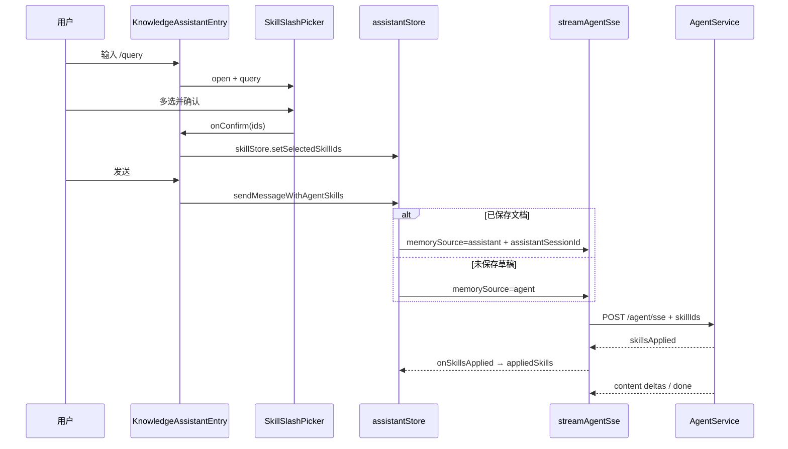

# 知识库 Skill 对话接入

> **文档角色**：实现思路专题（落地归档）  
> **日期**：2026-09-15  
> **需求摘要**：知识库助手通过 `/` 多选 Skill，走 Agent SSE + `skillIds` 强制加载；消息写入助手 UI；已保存文档 `memorySource=assistant` 单写 `assistant_*`，未保存草稿显式 `memorySource=agent`；展示 `appliedSkills`；会话标题与 Agent 停流链接对齐；**不再** `append-turn` 双写。

## 延伸阅读

- [docs/knowledge/已应用Skill落库.md](./已应用Skill落库.md) — `applied_skills` 落库、流前早写、详情回读与草稿迁入透传（刷新后 tip）
- [docs/agent/Agent记忆分表.md](../agent/Agent记忆分表.md) — Agent 业务记忆分表（MemoryPort / 各表适配器）
- [docs/knowledge/Skill编辑试跑.md](./Skill编辑试跑.md) — 独立 `/skills` 管理与试跑（`memorySource=skill_try`，非本文助手路径）
- [docs/ideas/knowledge/知识库Skill编辑与Agent接入.md](../ideas/knowledge/知识库Skill编辑与Agent接入.md) — Skill 编辑与 Agent 接入规划
- [docs/agent/Agent业务消息分表落地.md](../agent/Agent业务消息分表落地.md) — 分表落地要点与回归

---

## 1. 背景与目标

知识库右侧助手原先只有「无 Skill」路径（`sendMessage` → `/assistant/sse` → `assistant_*`）。引入 Skill 后需要：

1. 输入框 `/` 唤起多选浮层（`SkillSlashPicker`），选中后发送带 `skillIds`。
2. 生成能力走通用 Agent（工具 / 强制 Skill），但知识库 UI / 历史抽屉仍复用助手壳。
3. **已保存文档**：消息与多轮记忆落 `assistant_*`（`memorySource=assistant`），去掉早期 `append-turn` 双写。
4. **未保存草稿（ephemeral）**：不能缺省 `memorySource`——后端 `inferMemorySource` 会探测 `english_agent_sessions` 等业务表；表未建时会报错。须显式 `memorySource=agent`。
5. SSE `skillsApplied` → 消息 `appliedSkills` 胶囊；首条无标题时 PATCH 会话标题；`stopGenerating` 通过本地 Agent 链接停流。

## 2. 改动范围

- `apps/frontend/src/components/design/SkillSlashPicker/index.tsx`（新增）
- `apps/frontend/src/views/knowledge/KnowledgeAssistantEntry.tsx`（`/` 同步与 Portal 挂载）
- `apps/frontend/src/views/knowledge/KnowledgeAssistantChatFooter.tsx` / `KnowledgeAssistant.tsx`（有 Skill 分支）
- `apps/frontend/src/store/assistant.ts`（`sendMessageWithAgentSkills`、Agent 链接、停流、标题）
- `apps/frontend/src/utils/agentSse.ts`（`onSkillsApplied` / `skillsApplied` 解析）
- `apps/frontend/src/components/design/ChatAssistantMessage/index.tsx`（`appliedSkills` 展示）
- `apps/frontend/src/store/skill.ts`、`types/chat.ts`（选中态 / 消息字段）
- `apps/backend/src/services/agent/agent-skill-tools.ts`（强制加载工具与提示）
- `apps/backend/src/services/agent/agent.service.ts` / `dto/agent-chat.dto.ts`（`skillIds` + `memorySource`）

## 3. 实现思路

### 3.1 调用链



### 3.2 关键决策

| 决策 | 理由 |
|------|------|
| UI 仍写 `assistantStore.messages` | 复用 KnowledgeAssistant 壳与历史抽屉 |
| 已保存：`memorySource=assistant` | 单写 `assistant_*`，与无 Skill 历史同源；删双写 |
| 草稿：显式 `memorySource=agent` | 避免缺省推断查询未建/无关业务表（如 `english_agent_sessions`） |
| Agent session 仅作停流句柄 | `agentSessionByScope` + `localStorage` 链接；按会话隔离 |
| 标题显式 PATCH | Skill 不走 assistant SSE，不会自动用首问作标题 |
| 后端 `skillIds` 强制加载 | system 追加 + Human 前缀 + preseed tool 消息 |

### 3.3 不再双写

过渡态曾在 Agent 写 `agent_*` 后调用 `POST /assistant/session/append-turn`。M1 后由 `AssistantTableMemory` 在流内直接写助手表，前端 **不再** 调用 `appendAssistantSessionTurn`。

## 4. 关键实现（改动前 / 改动后对比 + 注释）

### 4.1 `memorySource` 请求体构造（`sendMessageWithAgentSkills` 内）

**对比范围**：`streamAgentSse` 的 `body` 中 `memorySource` 展开分支（同一切口）。

**改动前** · `apps/frontend/src/store/assistant.ts`（会话内基线：ephemeral 展开 `{}`，约 body 构造处）

```typescript
// 请求 body 对象开始（改动前）
body: {
	// Agent 运行 sessionId
	sessionId: agentSid,
	// 用户正文
	content: text,
	// skillIds
	skillIds: ids,
	// 可选 intentPrefix
	...(intentPrefix ? { intentPrefix } : {}),
	// 源码意图：只在持久化路径带 memorySource
	// 仅已保存文档传 assistant；ephemeral 展开为空对象 → 请求体无 memorySource
	// 条件：非 ephemeral 且有 assistantSid
	...(!ephemeral && assistantSid
		// 展开 assistant 绑定
		? {
				// memorySource=assistant
				memorySource: 'assistant' as const,
				// assistantSessionId
				assistantSessionId: assistantSid,
			// 对象结束
			}
		// 否则展开空对象 → 请求里没有 memorySource 字段
		: {}),
// body 结束
},
```

**改动后** · `apps/frontend/src/store/assistant.ts`（当前，约 L1943–L1955）

```typescript
// 请求 body 对象开始（改动后）
body: {
	// Agent 运行 sessionId
	sessionId: agentSid,
	// 用户正文
	content: text,
	// skillIds
	skillIds: ids,
	// 可选 intentPrefix
	...(intentPrefix ? { intentPrefix } : {}),
	// 源码注释：草稿必须显式 agent
	// 已保存：落 assistant_*；草稿 ephemeral：显式 agent，避免未传 source 时误查业务表
	// 条件：非 ephemeral 且有 assistantSid
	...(!ephemeral && assistantSid
		// 展开 assistant 绑定
		? {
				// memorySource=assistant
				memorySource: 'assistant' as const,
				// assistantSessionId
				assistantSessionId: assistantSid,
			// 对象结束
			}
		// 否则显式 memorySource=agent（关键修复）
		: { memorySource: 'agent' as const }),
// body 结束
},
```

**变更摘要**：草稿路径从「省略 `memorySource`」改为「始终传 `agent`」，避免 `resolveTurnMemory` 缺省推断时访问 `english_agent_sessions` 等表导致失败。

### 4.2 删除的 `append-turn` 双写（纯删除）

**对比范围**：旧 `persistSkillTurnToAssistant` 闭包（已从 `assistant.ts` 删除）。

**改动前** · `apps/frontend/src/store/assistant.ts`（双写过渡态，符号已删除）

```typescript
// 旧注释：生成写 agent_*，再用 append-turn 双写助手表
/** 生成仍写 agent_*；历史追加到 assistant_*（每轮只落一次） */
// 防重入标志：同一轮只追加一次
let skillTurnPersisted = false;
// 定义持久化闭包
const persistSkillTurnToAssistant = () => {
	// 已持久化 / 草稿 / 无助手会话则跳过
	if (skillTurnPersisted || ephemeral || !assistantSid) return;
	// 置位，后续调用直接 return
	skillTurnPersisted = true;
	// 取当前助手正文
	const assistantContent =
		// 优先消息列表 content，否则用缓冲
		state.messages.find((m) => m.chatId === assistantRowId)?.content ??
		// accumulated 回退
		accumulated;
	// 调用已删除的 append-turn API
	void appendAssistantSessionTurn({
		// 助手 sessionId
		sessionId: assistantSid,
		// 用户正文
		userContent: text,
		// 助手正文
		assistantContent: assistantContent ?? '',
	// 请求对象结束
	})
		// 成功后刷列表
		.then(() => this.refreshSessionListForCurrentDocument())
		// 失败忽略
		.catch(() => undefined);
// 闭包结束
};
// 省略说明：完成/停止时调用该闭包（已删除）
// …在 onComplete / 停止等路径调用 persistSkillTurnToAssistant()
```

**改动后**：无对等符号——持久会话由后端 `AssistantTableMemory` 在 Agent SSE 内写入 `assistant_*`；前端只传 `memorySource` / `assistantSessionId`。

**变更摘要**：去掉前端双写与 `appendAssistantSessionTurn` 依赖，消除两套真相源漂移。

### 4.3 `sendMessageWithAgentSkills` 完整方法（纯新增 · 改动后）

**对比范围**：`AssistantStore.sendMessageWithAgentSkills` 全方法（含 JSDoc）。相对 git HEAD 为新增符号，故仅「改动后」。

**改动后** · `apps/frontend/src/store/assistant.ts`（当前，约 L1796–L2052）

```typescript
	// JSDoc 块开始：标注本方法是 Skill 发送入口
	/**
	 // 说明：已选 Skill 时走 Agent SSE，消息仍进助手 store 列表以复用壳
	 * 已选 Skill：Agent SSE + skillIds；消息仍写入助手列表以复用 KnowledgeAssistant 壳。
	 // 约束：无 skillIds 时应走普通 sendMessage，勿误入本方法
	 * 无 skillIds 时不应调用本方法（走 sendMessage）。
	 // JSDoc 块结束
	 */
	// 异步方法声明：带 Skill 的知识库助手发送
	async sendMessageWithAgentSkills(
		// 参数 raw：用户输入原文（可能含空白）
		raw: string,
		// 参数 skillIds：本轮要强制加载的 Skill UUID 列表
		skillIds: string[],
		// 可选 options：可带 intentPrefix（文档上下文/强制语前缀）
		options?: { intentPrefix?: string },
	// 方法体开始，无返回值（副作用写 UI + 拉流）
	): Promise<void> {
		// 规范化 skillIds：去空白、滤空串，得到真正要发的 id 列表
		const ids = (skillIds ?? []).map((x) => x.trim()).filter(Boolean);
		// 若规范化后没有任何 Skill，回退无 Skill 路径
		if (ids.length === 0) {
			// 委托普通助手 SSE 发送，保持与未选 Skill 行为一致
			await this.sendMessage(raw);
			// 提前返回，避免继续创建 Agent 会话
			return;
		// 闭合「无 Skill」分支
		}
// 空行：分隔校验与文档上下文准备

		// 读取当前激活文档 key 并 trim；空则文档未就绪
		const documentKey = (this.activeDocumentKey ?? '').trim();
		// 无文档 key 时无法绑定会话/ephemeral 作用域
		if (!documentKey) {
			// Toast 提示用户文档未就绪
			Toast({ type: 'warning', title: '文档未就绪' });
			// 提前返回，不发起请求
			return;
		// 闭合文档未就绪分支
		}
		// 把文档 key 规范成 canonical，用于索引 stateByDocument
		const canonical = this.canonicalKey(documentKey);
		// ephemeral=true 表示未保存草稿：不允许持久化到 assistant_*
		const ephemeral = !this.knowledgeAssistantPersistenceAllowed;
		// 用户可见正文：trim 后的 raw
		const text = (raw ?? '').trim();
		// 空内容不发送（静默 return）
		if (!text) return;
// 空行：分隔登录校验

		// 未登录则无法调需鉴权的 Agent SSE
		if (!readToken()) {
			// 提示先登录
			Toast({ type: 'warning', title: '请先登录后再使用助手' });
			// 提前返回
			return;
		// 闭合未登录分支
		}
// 空行：准备助手会话 id

		// assistantSid 初值 null；仅持久化路径会赋值
		let assistantSid: string | null = null;
		// 非 ephemeral：必须确保当前文档有助手会话
		if (!ephemeral) {
			// ensureSessionForCurrentDocument：复用或创建 assistant session
			assistantSid = await this.ensureSessionForCurrentDocument();
			// 拿不到会话 id 则中止（ensure 内部通常已 Toast）
			if (!assistantSid) return;
		// 闭合非 ephemeral 分支
		}
// 空行：解析本轮写入的消息 state

		// 拿到文档级 state（ephemeral 最终用它）
		const docState = this.ensureState(canonical);
		// 持久化用 session state；草稿用文档 state
		const state = ephemeral ? docState : this.ensureSessionState(assistantSid!);
		// 发送中或拉历史中则拒绝重入
		if (state.isSending || state.isHistoryLoading) return;
// 空行：标题对齐逻辑

		// 源码自带注释：Skill 不走 assistant SSE，需显式写标题
		// Skill 不走 assistant SSE，不会自动写首条用户问题为标题；无标题时显式对齐无 Skill 行为
		// 仅持久化且有 assistantSid 时处理会话标题/列表刷新
		if (!ephemeral && assistantSid) {
			// 取当前文档下会话列表（可能为空数组）
			const list = this.sessionsByDocument[canonical] ?? [];
			// 在列表中找本轮助手会话行
			const row = list.find((s) => s.sessionId === assistantSid);
			// 若尚无标题（新占位会话），用首条用户问题预览作标题
			if (!row?.title?.trim()) {
				// 标题预览截取前 60 字符，对齐无 Skill 行为
				const titlePreview = text.slice(0, 60);
				// 在 MobX action 内同步改本地会话列表
				runInAction(() => {
					// 记录更新时间 ISO 字符串
					const now = new Date().toISOString();
					// 列表里已有该行：就地 map 更新 title
					if (row) {
						// 按 sessionId 映射生成新列表
						this.sessionsByDocument[canonical] = list.map((s) =>
							// 命中本会话则写入 title 与 updatedAt
							s.sessionId === assistantSid
								// 展开旧行并覆盖 title/updatedAt
								? { ...s, title: titlePreview, updatedAt: now }
								// 非本会话保持原样
								: s,
						// map 回调与赋值语句闭合
						);
					// 列表里没有该行：头部插入新会话摘要
					} else {
						// 用新数组替换 sessionsByDocument[canonical]
						this.sessionsByDocument[canonical] = [
							// 新会话摘要对象开始
							{
								// sessionId 使用当前助手会话
								sessionId: assistantSid!,
								// title 为用户问题预览
								title: titlePreview,
								// createdAt 用 now
								createdAt: now,
								// updatedAt 用 now
								updatedAt: now,
							// 对象字面量结束
							},
							// 其后拼接原列表
							...list,
						// 数组字面量结束
						];
					// 闭合 else（列表无行）
					}
				// 闭合 runInAction
				});
				// 异步 PATCH 后端标题（不 await，失败吞掉）
				void updateAssistantSessionTitle(assistantSid, titlePreview)
					// 成功后刷新会话列表以对齐服务端
					.then(() => this.refreshSessionListForCurrentDocument())
					// 失败忽略，本地已乐观更新
					.catch(() => undefined);
			// 已有标题：只刷新列表（更新排序/updatedAt）
			} else {
				// 刷新列表；catch 空函数吞错
				void this.refreshSessionListForCurrentDocument().catch(() => {});
			// 闭合「已有标题」分支
			}
		// 闭合标题处理外层 if
		}
// 空行：解析/创建 Agent 运行句柄

		// 按助手会话或文档生成 Agent scope key，避免跨会话串流
		const agentScope = this.agentScopeKey(assistantSid, canonical);
		// 优先内存中的 agentSid
		let agentSid =
			// 回退读 localStorage 链接（刷新后仍能续同一 Agent）
			this.agentSessionByScope[agentScope] ??
			// 无助手会话时链接为 null（纯 ephemeral）
			(assistantSid ? readLinkedAgentSessionId(assistantSid) : null);
		// 尚无 Agent 会话则创建
		if (!agentSid) {
			// 创建可能失败，用 try/catch
			try {
				// 调用 createAgentSession API
				const res = await createAgentSession({
					// 标题用用户问题前 40 字或默认「知识库 Skill」
					title: text.slice(0, 40) || '知识库 Skill',
				// createAgentSession 调用结束
				});
				// 从响应取 sessionId
				agentSid = res.data?.sessionId ?? null;
				// 创建结果无 id 视为失败
				if (!agentSid) {
					// 错误 Toast
					Toast({ type: 'error', title: '创建 Agent 会话失败' });
					// 提前返回
					return;
				// 闭合无 id 分支
				}
			// 网络/业务异常
			} catch {
				// 同样提示创建失败
				Toast({ type: 'error', title: '创建 Agent 会话失败' });
				// 提前返回
				return;
			// 闭合 catch
			}
		// 闭合「无 agentSid」分支
		}
		// 写入内存映射，供 stopGenerating 查找
		runInAction(() => {
			// scope → agentSid
			this.agentSessionByScope[agentScope] = agentSid!;
		// 闭合 runInAction
		});
		// 有助手会话时持久化链接到 localStorage
		if (assistantSid) {
			// writeLinkedAgentSessionId：刷新后可复用
			writeLinkedAgentSessionId(assistantSid, agentSid);
		// 闭合写链接 if
		}
// 空行：开始流式前清理旧 abort

		// 源码块注释：持久会话 memorySource=assistant，单写助手表
		/** 生成走 Agent SSE；持久会话时 memorySource=assistant，消息只写 assistant_* */
		// 若有上一轮 abort 函数则先断开
		state.abortStream?.();
		// 清空 abortStream 引用，避免误用旧句柄
		runInAction(() => {
			// 置 null
			state.abortStream = null;
		// 闭合 runInAction
		});
// 空行：准备占位消息 id

		// 前端临时 user chatId（UUID）
		const userChatId = uuidv4();
		// 前端临时 assistant chatId
		const assistantChatId = uuidv4();
		// 可变引用：收到 messageIds 事件后会替换为服务端 id
		let userRowId = userChatId;
		// 可变引用：助手行 id，流式 patch/complete 都靠它定位
		let assistantRowId = assistantChatId;
// 空行：乐观插入用户+助手占位

		// MobX 批量更新 UI
		runInAction(() => {
			// 标记发送中，禁用重复发送
			state.isSending = true;
			// 压入用户消息
			state.messages.push({
				// 用户行 chatId
				chatId: userRowId,
				// 角色 user
				role: 'user',
				// 正文为发送文本
				content: text,
				// 时间戳 now
				timestamp: new Date(),
			// 用户消息对象结束
			});
			// 压入助手占位（流式中）
			state.messages.push({
				// 助手行 chatId
				chatId: assistantRowId,
				// 角色 assistant
				role: 'assistant',
				// 正文先空，等 delta 填充
				content: '',
				// 时间戳
				timestamp: new Date(),
				// isStreaming=true 驱动打字机/停止按钮
				isStreaming: true,
				// 思考链字段置空字符串
				thinkContent: '',
			// 助手占位对象结束
			});
		// 闭合 runInAction
		});
// 空行：流式累积与调度

		// 取出 intentPrefix 并 trim；无则空串
		const intentPrefix = (options?.intentPrefix ?? '').trim();
		// 累积助手正文的本地缓冲
		let accumulated = '';
		// 定义 flush：把 accumulated 写回 MobX 消息
		const flushAssistantPatch = () => {
			// 在 action 内改 messages
			runInAction(() => {
				// 按当前 assistantRowId 找下标
				const idx = state.messages.findIndex(
					// 匹配 chatId
					(m) => m.chatId === assistantRowId,
				// findIndex 结束
				);
				// 找不到则直接返回（可能已被替换）
				if (idx < 0) return;
				// 取出原 Message 引用
				const prev = state.messages[idx] as Message;
				// 内容未变则跳过，减少无意义触发
				if (prev.content === accumulated) return;
				// 原地写 content（流式热路径）
				prev.content = accumulated;
			// 闭合 runInAction
			});
		// 闭合 flushAssistantPatch 函数
		};
		// 创建 rAF 合并调度器，避免每 token 都触发反应
		const assistantPatchScheduler =
			// 传入 flush 回调
			createStreamingMobxPatchScheduler(flushAssistantPatch);
// 空行：发起 SSE

		// try：streamAgentSse 或后续赋值可能抛错
		try {
			// await 拿到 abort 函数；内部已开读循环
			const abort = await streamAgentSse({
				// 请求体对象开始
				body: {
					// Agent 运行会话 id（停流/epoch 用）
					sessionId: agentSid,
					// 用户本轮正文
					content: text,
					// 强制加载的 skillIds
					skillIds: ids,
					// 有 intentPrefix 才展开进 body
					...(intentPrefix ? { intentPrefix } : {}),
					// 源码自带注释：已保存走 assistant；草稿显式 agent
					// 已保存：落 assistant_*；草稿 ephemeral：显式 agent，避免未传 source 时误查业务表
					// 非 ephemeral 且有 assistantSid → assistant 记忆
					...(!ephemeral && assistantSid
						// 展开 assistant 绑定字段
						? {
								// memorySource=assistant：读写 assistant_*
								memorySource: 'assistant' as const,
								// 业务会话 id 即助手 sessionId
								assistantSessionId: assistantSid,
							// assistant 绑定对象结束
							}
						// 否则显式 memorySource=agent，禁止缺省推断误查业务表
						: { memorySource: 'agent' as const }),
				// body 对象结束
				},
				// callbacks 对象开始
				callbacks: {
					// 服务端占位落库后下发真实 id
					onMessageIds: ({ userMessageId, assistantMessageId }) => {
						// 在 action 内替换 UI chatId
						runInAction(() => {
							// 找用户行下标
							const ui = state.messages.findIndex(
								// 按旧 userRowId 匹配
								(m) => m.chatId === userRowId,
							// findIndex 结束
							);
							// 找助手行下标
							const ai = state.messages.findIndex(
								// 按旧 assistantRowId 匹配
								(m) => m.chatId === assistantRowId,
							// findIndex 结束
							);
							// 用户行存在则替换 chatId
							if (ui >= 0) {
								// 拷贝旧消息
								const prev = state.messages[ui] as Message;
								// 用服务端 userMessageId 覆盖 chatId
								state.messages[ui] = { ...prev, chatId: userMessageId };
							// 闭合用户行 if
							}
							// 助手行存在则替换 chatId
							if (ai >= 0) {
								// 拷贝旧消息
								const prev = state.messages[ai] as Message;
								// 展开并覆盖 chatId
								state.messages[ai] = {
									// 保留其余字段
									...prev,
									// 写入服务端 assistantMessageId
									chatId: assistantMessageId,
								// 对象结束
								};
							// 闭合助手行 if
							}
							// 同步可变 userRowId，后续 patch 用新 id
							userRowId = userMessageId;
							// 同步可变 assistantRowId
							assistantRowId = assistantMessageId;
						// 闭合 runInAction
						});
					// 闭合 onMessageIds 回调
					},
					// 正文增量回调
					onDelta: (d) => {
						// 非空 delta 追加到缓冲
						if (d) accumulated += d;
						// 调度合并 flush，而不是立刻写 store
						assistantPatchScheduler.schedule();
					// 闭合 onDelta
					},
					// skillsApplied 事件：本轮强制 Skill 元数据
					onSkillsApplied: (skills) => {
						// 写 appliedSkills 到助手消息，供 UI 胶囊展示
						runInAction(() => {
							// 定位助手消息
							const idx = state.messages.findIndex(
								// 按 assistantRowId
								(m) => m.chatId === assistantRowId,
							// findIndex 结束
							);
							// 找不到则忽略事件
							if (idx < 0) return;
							// 拷贝旧消息
							const prev = state.messages[idx] as Message;
							// 不可变更新 appliedSkills 字段
							state.messages[idx] = { ...prev, appliedSkills: skills };
						// 闭合 runInAction
						});
					// 闭合 onSkillsApplied
					},
					// 流结束回调（含错误字符串）
					onComplete: (err) => {
						// 先 flush 调度器，保证最后一段正文落 UI
						assistantPatchScheduler.flush();
						// 区分用户主动 abort 与真实错误
						const userAborted = err === AGENT_SSE_USER_ABORT_MARKER;
						// 更新发送态与消息终态
						runInAction(() => {
							// 结束 isSending
							state.isSending = false;
							// 找助手消息
							const idx = state.messages.findIndex(
								// 按 assistantRowId
								(m) => m.chatId === assistantRowId,
							// findIndex 结束
							);
							// 存在则收尾
							if (idx >= 0) {
								// 读旧消息
								const prev = state.messages[idx] as Message;
								// 构造下一版 Message
								const next: Message = {
									// 展开旧字段
									...prev,
									// 关闭流式标记
									isStreaming: false,
								// next 对象中间
								};
								// 非用户中止的错误：补失败文案并标记停止
								if (err && !userAborted) {
									// 无正文时写入「生成失败：…」
									next.content = next.content || `生成失败：${err}`;
									// isStopped 供 UI 展示停止态
									next.isStopped = true;
								// 闭合错误 if
								}
								// 写回 messages
								state.messages[idx] = next;
							// 闭合 idx>=0
							}
							// 清空 abortStream
							state.abortStream = null;
						// 闭合 runInAction
						});
					// 闭合 onComplete
					},
					// 传输层/解析错误回调
					onError: (e) => {
						// 同样先 flush 缓冲
						assistantPatchScheduler.flush();
						// 更新 UI 错误态
						runInAction(() => {
							// 结束发送
							state.isSending = false;
							// 找助手消息
							const idx = state.messages.findIndex(
								// 按 id
								(m) => m.chatId === assistantRowId,
							// findIndex 结束
							);
							// 存在则写入错误内容
							if (idx >= 0) {
								// 读旧消息
								const prev = state.messages[idx] as Message;
								// 替换为非流式消息
								state.messages[idx] = {
									// 保留旧字段
									...prev,
									// 关闭流式
									isStreaming: false,
									// 无正文时用 Error.message
									content: prev.content || e.message,
								// 对象结束
								};
							// 闭合 idx if
							}
							// 清空 abort
							state.abortStream = null;
						// 闭合 runInAction
						});
					// 闭合 onError
					},
				// callbacks 对象结束
				},
			// streamAgentSse 调用结束
			});
			// 保存 abort 到 state，供停止按钮调用
			state.abortStream = abort;
		// 外层 catch：建立流失败等
		} catch {
			// 尽量 flush 已有缓冲
			assistantPatchScheduler.flush();
			// 回滚发送态
			runInAction(() => {
				// isSending=false
				state.isSending = false;
				// 找助手占位
				const idx = state.messages.findIndex(
					// 按 id
					(m) => m.chatId === assistantRowId,
				// findIndex 结束
				);
				// 存在则结束流式标记（保留已有 content）
				if (idx >= 0) {
					// 读旧消息
					const prev = state.messages[idx] as Message;
					// 仅关 isStreaming
					state.messages[idx] = { ...prev, isStreaming: false };
				// 闭合 idx if
				}
				// 清空 abort
				state.abortStream = null;
			// 闭合 runInAction
			});
		// 闭合 catch
		}
	// 方法 sendMessageWithAgentSkills 闭合
	}
```

**变更摘要**：完整覆盖 Skill 发送：校验 → 标题 → Agent 句柄链接 → 乐观消息 → SSE（含 `appliedSkills` / `messageIds`）→ 收尾。

### 4.4 Agent 会话链接与 scope（纯新增）

**改动后** · `apps/frontend/src/store/assistant.ts`（当前，约 L199–L230）

```typescript
// 源码自带注释：助手↔Agent 本地链接用途
/** 助手会话 ↔ Agent 会话本地链接（Skill 路径多轮续聊；刷新后仍能复用同一 Agent session） */
// localStorage key 前缀
const AGENT_LINK_LS_PREFIX = 'ka:agentSid:';
// 空行

// 读取链接的 Agent sessionId
function readLinkedAgentSessionId(assistantSid: string): string | null {
	// 非浏览器返回 null
	if (typeof window === 'undefined') return null;
	// try 防隐私模式抛错
	try {
		// getItem 拼前缀+助手 sid
		return localStorage.getItem(AGENT_LINK_LS_PREFIX + assistantSid);
	// catch
	} catch {
		// 失败当无链接
		return null;
	// catch 结束
	}
// 函数结束
}
// 空行

// 写入链接
function writeLinkedAgentSessionId(
	// 助手 sid
	assistantSid: string,
	// Agent sid
	agentSid: string,
// 无返回值
): void {
	// 非浏览器跳过
	if (typeof window === 'undefined') return;
	// try
	try {
		// setItem
		localStorage.setItem(AGENT_LINK_LS_PREFIX + assistantSid, agentSid);
	// catch
	} catch {
		// 源码自带注释：忽略配额/隐私模式
		// ignore quota / private mode
	// catch 结束
	}
// 函数结束
}
// 空行

// 删除链接（删助手会话时）
function clearLinkedAgentSessionId(assistantSid: string): void {
	// 非浏览器跳过
	if (typeof window === 'undefined') return;
	// try
	try {
		// removeItem
		localStorage.removeItem(AGENT_LINK_LS_PREFIX + assistantSid);
	// catch
	} catch {
		// 忽略错误
		// ignore
	// catch 结束
	}
// 函数结束
}
```

**改动后** · `apps/frontend/src/store/assistant.ts`（当前，约 L355–L369）

```typescript
	// 字段注释块开始
	/**
	 // 说明 Agent session 与 Assistant session 分离
	 * Skill 发送用的 Agent sessionId（与 Assistant session 分离）。
	 // key 规则：持久化用助手 id；草稿用 doc:canonical
	 * key：持久化为 assistantSessionId；ephemeral 为 `doc:${canonical}`。
	 // 禁止按文档共用 Agent，避免 stop/epoch 串台
	 * 禁止按文档共用一个 Agent：否则切历史后误触 stop、或另一会话开 Skill，会 epoch 杀掉后台流。
	 // 注释结束
	 */
	// 内存映射 scope→agentSid
	private agentSessionByScope: Record<string, string> = {};
// 空行

	// 计算 scope key
	private agentScopeKey(
		// 助手 sid 或 null
		assistantSid: string | null,
		// 文档 canonical
		canonical: string,
	// 返回 string
	): string {
		// trim 助手 sid
		const sid = (assistantSid ?? '').trim();
		// 有 sid 则直接用助手会话 id 作 scope
		if (sid) return sid;
		// 否则用 doc:canonical（ephemeral）
		return `doc:${canonical}`;
	// 函数结束
	}
```

### 4.5 `stopGenerating` 中的 Agent 停流（摘录）

**对比范围**：在原有 assistant 停流前新增按 scope 解析 `agentSid` 并 `stopAgentStream`。

**改动后** · `apps/frontend/src/store/assistant.ts`（当前，约 L2054–L2092）

```typescript
	// 停止生成：只停当前展示会话
	async stopGenerating(): Promise<void> {
		// 源码自带注释：切历史后误触不得杀后台流
		// 只停「当前展示会话」：切到其它历史后误触停止，不得杀掉后台仍在流式的会话
		// 取当前 activeState
		const state = this.activeState;
		// 是否存在 abort 或流式消息
		const activeStreaming =
			// abortStream 或任一条 isStreaming
			Boolean(state.abortStream) ||
			// find some 结束
			state.messages.some((m) => m.isStreaming);
		// 当前未在流式则直接返回
		if (!activeStreaming) return;
// 空行

		// 源码自带注释：先断 SSE 再调网关
		// 先断 SSE：若先 await 网关，期间 delta 仍会 apply，`...prev` 会保持 isStreaming=true
		// 调用 abort 断开 fetch
		state.abortStream?.();
		// MobX 更新停止态
		runInAction(() => {
			// 清空 abortStream
			state.abortStream = null;
			// 结束 isSending
			state.isSending = false;
			// 源码自带注释：替换对象保证刷新
			// 用“替换对象”而不是原地 mutate：保证 UI 在文档切换/映射迁移时也能稳定刷新停止态
			// map 所有消息
			state.messages = state.messages.map((m) => {
				// 非流式原样返回
				if (!m.isStreaming) return m;
				// 流式行改为停止态
				return { ...m, isStreaming: false, isStopped: true };
			// map 结束
			});
		// runInAction 结束
		});
// 空行

		// 当前文档 canonical
		const canonical = this.canonicalKey(this.activeDocumentKey);
		// 计算 Agent scope（持久化用 activeSessionId，草稿用 null→doc:）
		const agentScope = this.agentScopeKey(
			// 若允许持久化则传 activeSessionId
			this.knowledgeAssistantPersistenceAllowed
				// 否则 null（ephemeral）
				? this.activeSessionId
				// 三元结束
				: null,
			// canonical 参数
			canonical,
		// agentScopeKey 调用结束
		);
		// 解析 agentSid
		const agentSid =
			// 内存优先
			this.agentSessionByScope[agentScope] ??
			// 否则读 localStorage 链接
			(this.activeSessionId
				// 有 activeSessionId 才读链接
				? readLinkedAgentSessionId(this.activeSessionId)
				// 三元结束
				: null);
		// 若存在 Agent 会话则请求停流
		if (agentSid) {
			// try
			try {
				// POST stopAgentStream
				await stopAgentStream({ sessionId: agentSid });
			// catch
			} catch {
				// 无进行中时后端失败可忽略
				// 无进行中时后端返回失败，忽略
			// catch 结束
			}
		// 闭合 if agentSid
		}
```

**变更摘要**：Skill 流必须停 Agent epoch；仅 `stopAssistantStream` 停不到 Agent 侧。

### 4.6 `agentSse.ts`：`onSkillsApplied` / `skillsApplied`

**对比范围**：回调接口字段、解构、解析分支（相对 HEAD 为新增）。

**改动后** · `apps/frontend/src/utils/agentSse.ts`（当前，约 L41–L57）

```typescript
// 导出回调接口：Agent SSE 消费者可订阅的事件集合
export interface AgentSseCallbacks {
	// 必选：正文增量
	onDelta: (text: string) => void;
	// 可选：工具开始/结束（状态条）
	/** 工具开始/结束（用于轻量状态条） */
	// onTool 回调类型：phase + 可选 name
	onTool?: (ev: { phase: 'start' | 'end'; name?: string }) => void;
	// 可选：流开始
	onStart?: () => void;
	// 可选：流完成；error 字符串表示失败原因
	onComplete?: (error?: string) => void;
	// 可选：硬错误（Error 对象）
	onError?: (err: Error) => void;
	// 可选：联网检索 organic 列表
	/** 联网检索 organic（与 Chat SSE searchOrganic 对齐，用于正文胶囊） */
	// onSearchOrganic 参数类型
	onSearchOrganic?: (organic: SearchOrganicItem[]) => void;
	// 本轮强制加载的 Skill（新增）：id + title
	/** 本轮强制加载的 Skill（id + title） */
	// onSkillsApplied 签名：技能数组回调
	onSkillsApplied?: (skills: Array<{ id: string; title: string }>) => void;
	// 占位落库后真实消息 ID（分享等对齐）
	/** 占位落库后服务端下发的真实消息 ID，用于分享等与库内 id 对齐 */
	// onMessageIds 参数对象开始
	onMessageIds?: (ids: {
		// 用户消息服务端 id
		userMessageId: string;
		// 助手消息服务端 id
		assistantMessageId: string;
	// 参数对象结束
	}) => void;
// 接口结束
}
```

**改动后** · `apps/frontend/src/utils/agentSse.ts`（当前，约 L68–L77）

```typescript
	// 从 callbacks 解构出各处理器，便于下方直接调用
	const {
		// 正文增量
		onDelta,
		// 工具事件
		onTool,
		// 开始
		onStart,
		// 完成
		onComplete,
		// 错误
		onError,
		// 联网 organic
		onSearchOrganic,
		// 新增：技能已应用事件回调（可能为 undefined）
		onSkillsApplied,
		// 消息 id 对齐
		onMessageIds,
	// 解构结束
	} = callbacks;
```

**改动后** · `apps/frontend/src/utils/agentSse.ts`（当前，约 L169–L189）

```typescript
						// 判断是否 skillsApplied 事件
						if (
							// type 必须为 skillsApplied
							parsed.type === 'skillsApplied' &&
							// skills 字段须为数组
							Array.isArray(parsed.skills)
						// 条件成立则解析
						) {
							// 声明规范化后的 skills 数组
							const skills = (
								// 先按宽松类型断言原始元素
								parsed.skills as Array<{ id?: unknown; title?: unknown }>
							// 断言结束
							)
								// 过滤非法元素：必须同时有非空 string id 与 title
								.filter(
									// filter 回调开始
									(s) =>
										// id 为 string
										typeof s?.id === 'string' &&
										// title 为 string
										typeof s?.title === 'string' &&
										// id 非空
										s.id &&
										// title 非空
										s.title,
								// filter 条件闭合
								)
								// map 成严格 {id,title}
								.map((s) => ({
									// 强制断言 id 为 string
									id: s.id as string,
									// 强制断言 title 为 string
									title: s.title as string,
								// map 对象结束
								}));
							// 非空才回调，避免空数组刷 UI
							if (skills.length) onSkillsApplied?.(skills);
							// 继续处理下一行 SSE
							continue;
						// 闭合 skillsApplied 分支
						}
```

**变更摘要**：把后端 `type: 'skillsApplied'` 规范化为 `{id,title}[]` 后回调；空数组不触发。

### 4.7 `SkillSlashPicker` 完整组件（纯新增）

**改动后** · `apps/frontend/src/components/design/SkillSlashPicker/index.tsx`（当前，全文约 L1–L244）

```tsx
// 文件头块注释：说明本组件是 `/` 唤起的多选浮层
/**
 // 块注释续：过滤词来自消息框，不抢焦点（对齐 Cursor）
 * `/` 唤起的 Skill 多选浮层：过滤词来自消息框 `/` 后内容，不抢焦点（对齐 Cursor）。
 // 块注释结束
 */
// 从 ui 包导入按钮、复选框、滚动区
import { Button, Checkbox, ScrollArea } from '@ui/index';
// Plus 图标用于「新建 Skill」入口
import { Plus } from 'lucide-react';
// MobX observer 包装
import { observer } from 'mobx-react';
// React 类型与 hooks 导入开始
import {
	// RefObject 类型
	type RefObject,
	// useEffect
	useEffect,
	// useLayoutEffect：测量锚点位置
	useLayoutEffect,
	// useMemo
	useMemo,
	// useState
	useState,
// 从 react 导入结束
} from 'react';
// createPortal：挂到 document.body，避免被父级 overflow 裁切
import { createPortal } from 'react-dom';
// 路由跳转：去 Skill 管理页
import { useNavigate } from 'react-router';
// i18n
import { useI18n } from '@/hooks';
// cn：合并 className
import { cn } from '@/lib/utils';
// skillStore：列表与已选 id
import skillStore from '@/store/skill';
// 空行：分隔 import 与类型导出

// 导出 Props 类型
export type SkillSlashPickerProps = {
	// 是否打开浮层
	open: boolean;
	// 打开状态变更回调
	onOpenChange: (open: boolean) => void;
	// 源码自带注释：过滤词由消息框驱动
	/** `/` 后已输入的过滤词（由消息框驱动） */
	// query 可选，默认空
	query?: string;
	// 确认选中 ids
	onConfirm: (ids: string[]) => void;
	// 源码自带注释：锚定输入框容器
	/** 锚定输入框容器，用于 fixed 定位 */
	// anchorRef 可选
	anchorRef?: RefObject<HTMLElement | null>;
	// 额外 className
	className?: string;
// 类型结束
};
// 空行

// observer 包裹的函数组件声明开始
const SkillSlashPicker = observer(function SkillSlashPicker({
	// 解构 props：open
	open,
	// onOpenChange
	onOpenChange,
	// query 默认空串
	query = '',
	// onConfirm
	onConfirm,
	// anchorRef
	anchorRef,
	// className
	className,
// 组件参数列表结束，函数体开始
}: SkillSlashPickerProps) {
	// 取翻译函数 t
	const { t } = useI18n();
	// 导航器
	const navigate = useNavigate();
	// 草稿选中 ids（确认前可改）
	const [draftIds, setDraftIds] = useState<string[]>([]);
	// 浮层定位 state 类型开始
	const [pos, setPos] = useState<{
		// 距视口底边距离
		bottom: number;
		// 左边距
		left: number;
		// 宽度
		width: number;
		// 列表可视高度
		listHeight: number;
	// 类型结束；初始 bottom/left/width/listHeight
	}>({ bottom: 0, left: 0, width: 288, listHeight: 224 });
// 空行

	// 布局 effect：打开时根据锚点算 fixed 坐标
	useLayoutEffect(() => {
		// 未打开则不测
		if (!open) return;
		// 定义 update：读取 getBoundingClientRect
		const update = () => {
			// 取锚点 DOM
			const el = anchorRef?.current;
			// 无锚点则跳过
			if (!el) return;
			// 矩形
			const r = el.getBoundingClientRect();
			// bottom：浮层贴在输入框上方（innerHeight - top + 8）
			const bottom = Math.max(8, window.innerHeight - r.top + 8);
			// 源码自带注释：向上展开时预留 hint/footer
			// 浮层向上展开：hint≈28 + footer≈48 + padding，剩余给列表
			// 面板最大高度受视口约束
			const panelMax = Math.max(160, window.innerHeight - bottom - 12);
			// 列表高度夹在 96–224，并减去 footer 约 84
			const listHeight = Math.min(224, Math.max(96, panelMax - 84));
			// 写入定位 state
			setPos({
				// bottom
				bottom,
				// left 对齐锚点左边
				left: r.left,
				// 宽度夹在 240–320，且不超过锚点宽
				width: Math.min(320, Math.max(240, r.width)),
				// listHeight
				listHeight,
			// setPos 结束
			});
		// update 函数结束
		};
		// 立即算一次
		update();
		// 监听 resize
		window.addEventListener('resize', update);
		// 监听 scroll（捕获）以跟随滚动容器
		window.addEventListener('scroll', update, true);
		// 清理函数
		return () => {
			// 移除 resize
			window.removeEventListener('resize', update);
			// 移除 scroll
			window.removeEventListener('scroll', update, true);
		// 清理结束
		};
	// 依赖 open 与 anchorRef
	}, [open, anchorRef]);
// 空行

	// 用 join 生成依赖键，selectedSkillIds 变化时重同步草稿
	const selectedKey = skillStore.selectedSkillIds.join('\0');
// 空行

	// 打开时把 store 已选拷进草稿，并按需拉列表
	useEffect(() => {
		// 未打开跳过
		if (!open) return;
		// 草稿 = 当前已选浅拷贝
		setDraftIds([...skillStore.selectedSkillIds]);
		// 列表空则异步 loadList
		if (skillStore.list.length === 0) void skillStore.loadList();
	// 依赖 open 与 selectedKey
	}, [open, selectedKey]);
// 空行

	// Escape 关闭浮层（捕获阶段）
	useEffect(() => {
		// 未打开不绑
		if (!open) return;
		// 键盘处理函数
		const onKey = (e: KeyboardEvent) => {
			// 仅处理 Escape
			if (e.key === 'Escape') {
				// 阻止默认
				e.preventDefault();
				// 阻止冒泡，避免外层也关
				e.stopPropagation();
				// 关闭浮层
				onOpenChange(false);
			// Escape 分支结束
			}
		// onKey 结束
		};
		// 注册 keydown 捕获
		window.addEventListener('keydown', onKey, true);
		// 清理监听
		return () => window.removeEventListener('keydown', onKey, true);
	// 依赖 open/onOpenChange
	}, [open, onOpenChange]);
// 空行

	// 过滤词小写 trim
	const filterQ = query.trim().toLowerCase();
	// 按标题过滤列表（MobX list 进 deps）
	const filtered = useMemo(() => {
		// 无过滤词则返回全量
		if (!filterQ) return skillStore.list;
		// 有过滤则 includes
		return skillStore.list.filter((s) =>
			// 标题小写包含 filterQ
			s.title.toLowerCase().includes(filterQ),
		// filter 结束
		);
	// deps：filterQ 与 list
	}, [filterQ, skillStore.list]);
// 空行

	// 切换单个 id 选中（checkbox）
	const toggle = (id: string) => {
		// 基于 prev 计算 next
		setDraftIds((prev) => {
			// 已选则取消
			if (prev.includes(id)) return prev.filter((x) => x !== id);
			// 最多 8 个，满则忽略新增
			if (prev.length >= 8) return prev;
			// 追加 id
			return [...prev, id];
		// setDraftIds 结束
		});
	// toggle 结束
	};
// 空行

	// 源码自带注释：点行等同确认并关闭
	/** 点行（非 checkbox）：确保选中该项后确认并关闭，等同点「确认」 */
	// 点行：确保含该 id 后确认
	const pickAndConfirm = (id: string) => {
		// 若已在草稿中则沿用；否则尝试加入
		const next = draftIds.includes(id)
			// 已包含则 next=draftIds
			? draftIds
			// 未满 8 则追加
			: draftIds.length < 8
				// 已满则替换最后一位为当前 id
				? [...draftIds, id]
				// 三元结束
				: [...draftIds.slice(0, 7), id];
		// 回调确认 ids
		onConfirm(next);
		// 关闭浮层
		onOpenChange(false);
	// pickAndConfirm 结束
	};
// 空行

	// 跳转创建 Skill
	const goCreateSkill = () => {
		// 先关浮层
		onOpenChange(false);
		// store 进入新建草稿态
		skillStore.createNew();
		// 导航到 /skills
		navigate('/skills');
	// goCreateSkill 结束
	};
// 空行

	// 未打开或无 document（SSR）则不渲染
	if (!open || typeof document === 'undefined') return null;
// 空行

	// Portal 到 body
	return createPortal(
		// 外层容器 div
		<div
			// 合并 className
			className={cn(
				// 源码自带注释：四向均匀阴影
				// 四向均匀阴影（无偏置），避免向上展开时顶/底不一致
				// 层级/圆角/边框/背景/阴影工具类
				'z-100 flex flex-col overflow-hidden rounded-md border border-theme/10 bg-theme-background shadow-[0_0_16px_rgba(15,23,42,0.14)]',
				// 传入的 className
				className,
			// cn 结束
			)}
			// fixed 定位样式
			style={{
				// position fixed
				position: 'fixed',
				// bottom
				bottom: pos.bottom,
				// left
				left: pos.left,
				// width
				width: pos.width,
			// style 结束
			}}
			// role=dialog 无障碍
			role="dialog"
			// aria-label 用 i18n placeholder
			aria-label={t('skill.slash.placeholder')}
			// 非模态：不抢焦点
			aria-modal={false}
			// 源码自带注释：保消息框焦点
			// 保消息框焦点；滚动条拖动除外
			// mousedown：默认 preventDefault 以免抢焦点
			onMouseDown={(e) => {
				// 事件 target
				const t = e.target as HTMLElement | null;
				// 点在滚动条上则放行（允许拖动）
				if (t?.closest?.('[data-slot="scroll-area-scrollbar"]')) return;
				// 其它区域 preventDefault 保 textarea 焦点
				e.preventDefault();
			// onMouseDown 结束
			}}
		// 外层 div 开始标签结束
		>
			// 标题栏
			<div className="flex items-center gap-3 px-2 py-3 mb-1 border-b border-theme/10">
				// 「Skills」标题文案
				<div className="text-sm text-textcolor">{t('route.skills.title')}</div>
				// 有过滤词时显示 filtering 提示
				{filterQ ? (
					// 过滤提示容器
					<div className="shrink-0 truncate text-xs text-textcolor/55">
						// 展示当前 q
						{t('skill.slash.filtering', { q: query.trim() })}
					// 过滤提示结束
					</div>
				// 无过滤词显示通用 hint
				) : (
					// hint 容器
					<div className="shrink-0 text-xs text-textcolor/55">
						// hint 文案
						{t('skill.slash.hint')}
					// hint 结束
					</div>
				// 标题栏三元结束
				)}
			// 标题栏闭合
			</div>
			// 源码自带 JSX 注释：显式 height 才能滚动
			{/* 显式 height：Radix ScrollArea 仅 max-h 时视口常无法形成滚动 */}
			// ScrollArea 列表区
			<ScrollArea
				// 宽度 100%
				className="w-full"
				// 高度用算出的 listHeight
				style={{ height: pos.listHeight }}
				// 细滚动条样式
				scrollbarClassName="right-0 w-1.5 border-l-0"
				// viewport 不进 Tab 序列，避免抢焦点
				viewportTabIndex={-1}
				// 仅纵向滚动条
				scrollbars="vertical"
			// ScrollArea 开始标签结束
			>
				// 空列表占位
				{filtered.length === 0 ? (
					// empty 文案容器
					<div className="px-2.5 py-3 text-sm text-textcolor/60">
						// empty i18n
						{t('skill.slash.empty')}
					// 占位结束
					</div>
				// 有数据：渲染行
				) : (
					// 列布局
					<div className="flex flex-col gap-1 px-2">
						// 遍历 filtered
						{filtered.map((item) => {
							// 当前行是否在草稿选中
							const checked = draftIds.includes(item.id);
							// return 行节点
							return (
								// 外层 key=item.id
								<div key={item.id}>
									// 源码自带 JSX 注释：用 div 避免 button 嵌套 Checkbox
									{/* div 而非 button：Checkbox 内部已是 button，避免嵌套 */}
									// 可点击行
									<div
										// 行 className
										className={cn(
											// 基础样式 + hover
											'flex w-full cursor-pointer items-center gap-2 rounded-md px-2 py-2 text-left text-sm hover:bg-theme/5',
											// 选中时加深背景
											checked && 'bg-theme/8',
										// cn 结束
										)}
										// 点击行 → pickAndConfirm
										onClick={() => pickAndConfirm(item.id)}
									// 行开始标签结束
									>
										// Checkbox
										<Checkbox
											// 受控 checked
											checked={checked}
											// 不进 Tab
											tabIndex={-1}
											// 点击 checkbox 不冒泡到行（避免立刻 confirm）
											onClick={(e) => e.stopPropagation()}
											// 切换选中
											onCheckedChange={() => toggle(item.id)}
										// Checkbox 结束
										/>
										// 标题文本
										<span className="min-w-0 flex-1 truncate">
											// 截断显示 title
											{item.title}
										// span 结束
										</span>
									// 行 div 闭合
									</div>
								// key 包裹闭合
								</div>
							// map 回调闭合
							);
						// 列布局闭合
						})}
					// 空/有数据三元结束
					</div>
				// ScrollArea 闭合
				)}
			// 底栏：新建 + 取消/确认
			</ScrollArea>
			// 底栏容器
			<div className="mt-1 flex shrink-0 items-center justify-between gap-2 border-t border-theme/10 px-2 py-1.5">
				// 新建按钮
				<Button
					// 小号
					size="sm"
					// link 变体
					variant="link"
					// 样式：高度/间距/颜色
					className="h-8 shrink-0 gap-1 px-0! text-textcolor/80 hover:text-teal-500"
					// 点击跳转创建
					onClick={goCreateSkill}
				// Button 开始结束
				>
					// Plus 图标
					<Plus className="size-4.5 -ml-0.5" aria-hidden />
					// 「添加」文案
					{t('skill.slash.add')}
				// 新建 Button 闭合
				</Button>
				// 右侧按钮组
				<div className="flex shrink-0 gap-2">
					// 取消
					<Button
						// 小号
						size="sm"
						// 固定宽
						className="w-18"
						// 描边
						variant="outline"
						// 关闭浮层
						onClick={() => onOpenChange(false)}
					// Button 开始结束
					>
						// 取消文案
						{t('common.cancel')}
					// 取消 Button 闭合
					</Button>
					// 确认
					<Button
						// 小号
						size="sm"
						// 固定宽
						className="w-18"
						// 点击：确认草稿并关闭
						onClick={() => {
							// 把 draftIds 交给父组件
							onConfirm(draftIds);
							// 关闭
							onOpenChange(false);
						// onClick 结束
						}}
					// Button 开始结束
					>
						// 确认文案
						{t('skill.slash.confirm')}
					// 确认 Button 闭合
					</Button>
				// 右侧按钮组闭合
				</div>
			// 底栏闭合
			</div>
		// 外层浮层 div 闭合
		</div>,
		// Portal 挂载点 document.body
		document.body,
	// createPortal 调用结束
	);
// observer 组件闭合
});
// 空行

// 默认导出组件
export default SkillSlashPicker;
```

### 4.8 入口：`/` 同步与发送分支（摘录）

**改动后** · `apps/frontend/src/views/knowledge/KnowledgeAssistantEntry.tsx`（当前，约 L147–L163）

```typescript
	// 从 DOM 同步 `/` 过滤状态
	const syncSlashFromDom = useCallback(() => {
		// 未启用或正在组合输入则关闭浮层
		if (!skillSlashEnabled || composingRef.current) {
			// 已打开则 closeSlash
			if (slashOpen) closeSlash();
			// 提前返回
			return;
		// 闭合禁用分支
		}
		// 取 textarea
		const el = textareaRef.current;
		// 无元素返回
		if (!el) return;
		// 光标位置
		const cursor = el.selectionStart ?? el.value.length;
		// 查找光标处 `/` 命中
		const hit = findSlashAtCursor(el.value, cursor);
		// 未命中则关闭
		if (!hit) {
			// 已打开则关
			if (slashOpen) closeSlash();
			// 返回
			return;
		// 闭合未命中
		}
		// 记录 slash 起始下标（确认后删除 `/query`）
		slashStartRef.current = hit.start;
		// 写入过滤词
		setSlashQuery(hit.query);
		// 未打开则打开
		if (!slashOpen) setSlashOpen(true);
	// 依赖项
	}, [skillSlashEnabled, slashOpen, closeSlash]);
```

**改动后** · `apps/frontend/src/views/knowledge/KnowledgeAssistantChatFooter.tsx`（当前，约 L355–L373）

```typescript
			// 读取当前选中的 skillIds
			const skillIds = skillStore.selectedSkillIds;
			// 无 Skill → 普通助手路径
			if (skillIds.length === 0) {
				// sendMessage（assistant SSE）
				await assistantStore.sendMessage(text);
			// else：有 Skill
			} else {
				// 把 id 映射为标题（拼强制语）
				const titles = skillIds
					// map 查找 title
					.map(
						// 找不到则空串
						(id) => skillStore.list.find((s) => s.id === id)?.title ?? '',
					// map 结束
					)
					// 滤掉空标题
					.filter(Boolean);
				// 有标题则拼前端强制前缀
				const skillForce = titles.length
					// 强制语模板
					? `【强制】必须严格按已启用 Skill（${titles.map((t) => `「${t}」`).join('、')}）执行；与用户一般表述冲突时以 Skill 为准。\n\n`
					// 无标题则空前缀
					: '';
				// 文档意图前缀（正文摘要等）
				const docPrefix = buildKnowledgeIntentPrefix(
					// 读知识库 markdown
					knowledgeStore.markdown ?? '',
				// 调用结束
				);
				// 走 Agent Skill 发送
				await assistantStore.sendMessageWithAgentSkills(text, skillIds, {
					// intentPrefix = 强制语 + 文档前缀
					intentPrefix: `${skillForce}${docPrefix}`,
				// options 结束
				});
			// 闭合 else
			}
```

### 4.9 `appliedSkills` UI 展示

**改动后** · `apps/frontend/src/components/design/ChatAssistantMessage/index.tsx`（当前，约 L510–L525）

```tsx
			// 若消息带 appliedSkills 且非空则展示胶囊条
			{message?.appliedSkills && message.appliedSkills.length > 0 ? (
				// 胶囊容器样式
				<div className="border border-theme/10 bg-theme/5 w-fit mb-3 px-2 pt-0.5 pb-1 rounded-md flex flex-wrap items-center gap-1.5 text-sm text-textcolor/60">
					// 前缀文案 span
					<span className="shrink-0">
						// i18n「已应用 Skill」，缺省中文回退
						{t?.('skill.applied.label') ?? '已应用 Skill'}：
					// 前缀闭合
					</span>
					// 遍历每个已应用 Skill
					{message.appliedSkills.map((s) => (
						// 单个 title 胶囊
						<span
							// key=id
							key={s.id}
							// 样式：截断
							className="inline-flex max-w-full items-center text-textcolor"
							// 完整 title 作 tooltip
							title={s.title}
						// 开始标签结束
						>
							// 截断显示标题
							<span className="truncate">{s.title}</span>
						// span 闭合
						</span>
					// map 结束
					))}
				// 容器闭合
				</div>
			// 无 appliedSkills 则不渲染
			) : null}
```

### 4.10 后端 `agent-skill-tools.ts`：强制加载（纯新增文件）

**对比范围**：全部导出函数（小文件全文）。

**改动后** · `apps/backend/src/services/agent/agent-skill-tools.ts`（当前，全文）

```typescript
// 导入 LangChain AIMessage / ToolMessage
import { AIMessage, ToolMessage } from '@langchain/core/messages';
// DynamicTool：把 Skill 暴露为可调工具
import { DynamicTool } from '@langchain/core/tools';
// randomUUID：预置 tool_call id
import { randomUUID } from 'node:crypto';
// SkillBody 类型（id/title/content）
import type { SkillBody } from '../skill/skill.service';
// 空行：分隔 import 与导出函数

// 导出：把 Skill 格式化为工具返回正文
export function formatSkillToolResult(skill: SkillBody): string {
	// Markdown 标题 + 正文
	return `### Skill: ${skill.title}\n${skill.content}`;
// 函数闭合
}
// 空行：分隔 formatSkillToolResult 与下一导出

// 源码自带注释：仅允许对本轮已加载 ID 调用
/** 仅允许对本轮已加载 ID 调用；返回该 Skill 正文 */
// 导出函数 buildAgentSkillTools
export function buildAgentSkillTools(skills: SkillBody[]): DynamicTool[] {
	// 无 Skill 则返回空工具列表
	if (!skills.length) return [];
	// id→Skill 映射，供 func 查找
	const byId = new Map(skills.map((s) => [s.id, s]));
	// 目录字符串：列出本轮可用 id:title
	const catalog = skills.map((s) => `- ${s.id}: ${s.title}`).join('\n');
	// 返回仅含一个 DynamicTool 的数组
	return [
		// 构造 DynamicTool
		new DynamicTool({
			// 工具名 apply_skill
			name: 'apply_skill',
			// description 开始：说明用途
			description:
				// 拼接本轮可用目录
				'应用本轮已启用的 Skill 指令正文。' +
				// 说明通常无需再调；可重读
				`本轮可用 Skill：\n${catalog}\n` +
				// description 字段结束
				'入参为 skill id（UUID）。系统已预置加载时通常无需再调；若需重读可再调。',
			// 工具实现：解析入参 id
			func: async (input: string) => {
				// 入参转字符串并 trim
				let id = String(input ?? '').trim();
				// 尝试 JSON 解析（模型可能传对象）
				try {
					// 解析为 input/id 字段
					const parsed = JSON.parse(id) as { input?: string; id?: string };
					// 优先 input 或 id，否则保留原串
					id = String(parsed.input ?? parsed.id ?? id).trim();
				// JSON 解析失败则当作纯 id
				} catch {
					// 源码自带注释：plain id
					/* plain id */
				// catch 结束
				}
				// 按 id 取 Skill
				const skill = byId.get(id);
				// 不在本轮集合则返回错误文案
				if (!skill) {
					// 错误信息含非法 id
					return `错误：skill id 不在本轮已启用集合中：${id}`;
				// 闭合非法分支
				}
				// 合法则返回格式化正文
				return formatSkillToolResult(skill);
			// func 结束
			},
		// DynamicTool 配置结束
		}),
	// 数组结束
	];
// 函数结束
}
// 空行

// 源码自带注释：预置 AIMessage+ToolMessage 保证必加载
/** 为每个已加载 Skill 预置 AIMessage(tool_calls)+ToolMessage，保证指定必加载 */
// 导出 preseedApplySkillMessages
export function preseedApplySkillMessages(
	// 返回消息数组类型
	skills: SkillBody[],
// 函数体开始
): Array<AIMessage | ToolMessage> {
	// 输出缓冲
	const out: Array<AIMessage | ToolMessage> = [];
	// 遍历每个已加载 Skill
	for (const skill of skills) {
		// 生成唯一 tool_call_id
		const toolCallId = `skill_preseed_${randomUUID()}`;
		// 推入 AIMessage（模拟已发起 tool_calls）
		out.push(
			// AIMessage 构造
			new AIMessage({
				// content 空：纯工具调用
				content: '',
				// tool_calls 数组
				tool_calls: [
					// 单个 tool_call 对象
					{
						// id
						id: toolCallId,
						// name=apply_skill
						name: 'apply_skill',
						// args.input=skill.id
						args: { input: skill.id },
					// tool_call 结束
					},
				// tool_calls 数组结束
				],
			// AIMessage 结束
			}),
		// push 结束
		);
		// 紧跟 ToolMessage：工具结果
		out.push(
			// ToolMessage 构造
			new ToolMessage({
				// 关联同一 tool_call_id
				tool_call_id: toolCallId,
				// content 为 Skill 正文
				content: formatSkillToolResult(skill),
				// name 与工具名一致
				name: 'apply_skill',
			// ToolMessage 结束
			}),
		// push 结束
		);
	// for 结束
	}
	// 返回预置消息序列
	return out;
// 函数结束
}
// 空行

// 导出：拼系统提示追加段
export function formatSkillsSystemAppend(skills: SkillBody[]): string {
	// 无 Skill 返回空串
	if (!skills.length) return '';
	// 标题列表用顿号连接
	const titles = skills.map((s) => s.title).join('、');
	// 各 Skill 正文块
	const bodies = skills
		// ### 标题 + content
		.map((s) => `### Skill: ${s.title}\n${s.content}`)
		// 块之间空行拼接
		.join('\n\n');
	// 返回拼接字符串开始
	return (
		// 强制 Skills 头 + 已启用标题
		`\n\n【本轮强制 Skills — 必须执行】已启用：${titles}\n` +
		// 硬约束说明：与用户表述冲突以 Skill 为准
		'下列 Skill 正文为硬约束：润色、总结、扩写、闲聊等用户表述若与 Skill 冲突，一律以 Skill 为准；' +
		// 禁止忽略 Skill
		'禁止忽略 Skill 改用普通文风或通用模板。\n\n' +
		// 附上全部正文
		`${bodies}\n`
	// 字符串拼接结束
	);
// 函数结束
}
// 空行

// 源码自带注释：拼入 HumanMessage 前缀再钉死
/** 拼入本轮 HumanMessage，再次钉死「必须用 Skill」 */
// 导出 formatSkillsUserForcePrefix
export function formatSkillsUserForcePrefix(skills: SkillBody[]): string {
	// 无则空
	if (!skills.length) return '';
	// 标题加书名号后顿号连接
	const titles = skills.map((s) => `「${s.title}」`).join('、');
	// 返回强制前缀
	return (
		// 「必须严格执行」句
		`【强制】本轮必须严格执行已启用 Skill：${titles}。` +
		// 要求体现风格结构；禁止普通改写
		'完成用户任务时须体现 Skill 要求的风格、结构与约束；不得输出与 Skill 无关的普通改写。\n\n'
	// 字符串结束
	);
// 函数结束
}
```

服务端在 `runChatStream` 中：`findByIdsForUser(skillIds)` → 推送 `skillsApplied` → `formatSkillsUserForcePrefix` 钉 HumanMessage → `preseedApplySkillMessages` 插入 tool 轨迹 → `buildAgentSkillTools` + `formatSkillsSystemAppend` 进 Agent。

## 5. 行为变化与兼容性

| 路径 | 行为 |
|------|------|
| 未选 Skill | 仍 `sendMessage` → assistant SSE；本专题不改 |
| 已保存 + Skill | Agent SSE + `memorySource=assistant`；历史在助手表；无 `append-turn` |
| 未保存 + Skill | Agent SSE + `memorySource=agent`；仅内存 UI；不写助手会话 |
| 英语学习 | 独立 `memorySource=english_learning`；本专题不改其发送路径 |
| 停流 | 有 Agent 链接时额外 `stopAgentStream` |

## 6. 测试与回归建议

- [ ] **未保存文档 + Skill**：`/` 选 Skill 发送成功；网络面板 body 含 `memorySource: "agent"`；**不**出现 `english_agent_sessions` 缺失类错误；停止可中断。
- [ ] **已保存文档 + Skill**：多轮续聊有记忆；刷新/历史抽屉可见消息；body 含 `memorySource: "assistant"` + `assistantSessionId`；无 `append-turn` 请求；标题为首问预览；气泡显示「已应用 Skill」。
- [ ] **无 Skill 路径**：不选 Skill 时行为与改前一致（assistant SSE、历史、停流）。
- [ ] **英语学习不受影响**：英语侧会话列表 / 多轮 / 停流回归通过。

## 7. 相关文档与代码索引

| 说明 | 路径 |
|------|------|
| 本专题 | `docs/knowledge/知识库Skill对话.md` |
| Agent 记忆分表 | `docs/agent/Agent记忆分表.md` |
| Skill 规划 | `docs/ideas/knowledge/知识库Skill编辑与Agent接入.md` |
| 分表落地 | `docs/agent/Agent业务消息分表落地.md` |
| 发送实现 | `apps/frontend/src/store/assistant.ts` |
| SSE 解析 | `apps/frontend/src/utils/agentSse.ts` |
| `/` 浮层 | `apps/frontend/src/components/design/SkillSlashPicker/index.tsx` |
| 强制 Skill 工具 | `apps/backend/src/services/agent/agent-skill-tools.ts` |

---

若与仓库最新源码不一致，以源码为准。
