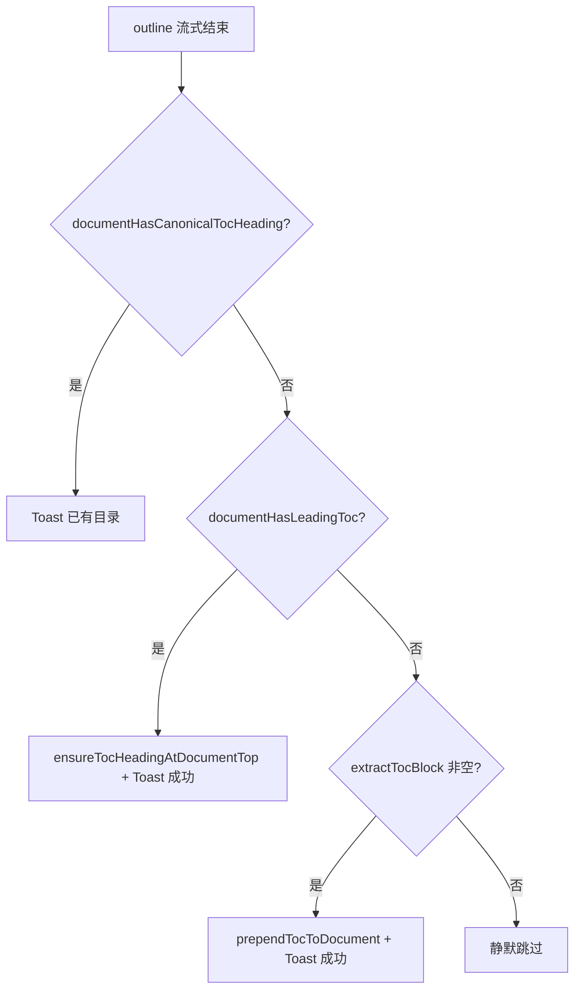
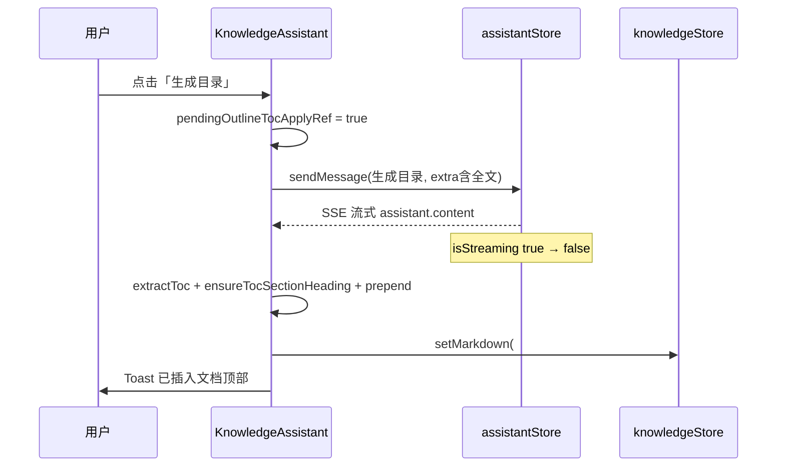

# 知识库助手：「生成目录」完成后自动写入编辑器文首

> **延伸阅读**  
> - 快捷卡片与 `extraUserContentForModel`：[知识库助手提示卡片.md](./知识库助手提示卡片.md)  
> - 助手流式 UI（思考链隐藏、Spinner）：[知识库助手流式体验.md](./知识库助手流式体验.md)  
> - 助手总览：[知识库助手完成.md](./知识库助手完成.md) §13

## 1. 背景与目标

### 1.1 用户视角

用户使用知识库 AI 模式点击 **「生成目录」** 快捷卡后，模型会在助手气泡中返回可粘贴的 Markdown 目录。原先需要用户手动复制并贴到左侧编辑器文首；若文档顶部已有目录，也不应重复插入。

### 1.2 技术目标

| 目标 | 做法 |
|------|------|
| 流式结束后自动写入 | 监听 `assistantStore.isStreaming` 由 true→false，且本轮为 outline 快捷卡 |
| 文首去重（精确） | `documentHasCanonicalTocHeading`：首条非空行已是 `## 目录` 则跳过 |
| 文首已有目录块 | `documentHasLeadingToc`：锚点列表或非规范目录标题 |
| 仅补标题 | `ensureTocHeadingAtDocumentTop`：已有列表/非 `##` 标题时只补 `## 目录`，不重复插入列表 |
| 解析助手回复 | `extractTocBlockFromAssistantReply` 抽取目录块（可剥掉外层 markdown 围栏） |
| 新目录块标题 | `ensureTocSectionHeading`：从助手插入的目录块首行规范为 `## 目录` |
| 合并正文 | `prependTocToDocument`：经规范化后的目录 + 空行 + 原正文 |
| 用户反馈 | Toast：已插入 / 已有规范目录跳过 |

若与仓库最新源码不一致，**以源码为准**。

---

## 2. 改动范围

| 路径 | 说明 |
|------|------|
| `apps/frontend/src/views/knowledge/utils.ts` | `documentHasCanonicalTocHeading`、`ensureTocHeadingAtDocumentTop`、`documentHasLeadingToc`、`ensureTocSectionHeading`、`prependTocToDocument` 等 |
| `apps/frontend/src/views/knowledge/KnowledgeAssistant.tsx` | `pendingOutlineTocApplyRef` + `useEffect` 写入逻辑 |
| `apps/frontend/src/i18n/locales/zh-CN.ts` | `tocAlreadyAtTop` / `tocPrependedToDoc` |
| `apps/frontend/src/i18n/locales/en-US.ts` | 英文 Toast |

**未改**：后端 API；`sendMessage` / `extraUserContentForModel` 契约；RAG 模式（不触发 outline 写入）。

---

## 3. 实现思路

### 3.1 为何在 `KnowledgeAssistant` 而非 Store

- 写入目标是 **`knowledgeStore.markdown`**（左侧 Monaco），属于知识页领域状态，不宜塞进通用 `assistantStore`。
- 需同时读 `knowledgeStore.markdown` 与 `assistantStore.messages`，放在已聚合两者的 `KnowledgeAssistant` 最直接。

### 3.2 触发条件（须同时满足）

1. 用户点击 **`kind === 'outline'`** 快捷卡且 `sendMessage` 真正入队（`messages.length` 有增长）。
2. **`pendingOutlineTocApplyRef`** 在发送前置 true，流式结束处置 false。
3. **`wasStreaming` → `!streaming`** 边沿（避免挂载时误触）。
4. **`findCompletedOutlineAssistantReply`** 找到 user 气泡为「生成目录」且下一条 assistant 已结束、未中断、有正文。
5. 按 **§3.6** 三分支写入或跳过（不再仅用 `documentHasLeadingToc` 一律跳过）。
6. 无文首目录时 **`extractTocBlockFromAssistantReply`** 非空；解析失败则静默跳过。

### 3.3 文首「已有目录块」判定（`documentHasLeadingToc`）

- 第一个非空块的首行匹配 `^#{1,6}\s*(目录|Table of Contents|TOC|Contents)`（不区分大小写），或  
- 首块内至少 2 行且均为 `- [text](#anchor)` 形式（无标题的纯锚点目录列表）。

### 3.4 写入前统一 `## 目录` 标题

模型在 outline 提示词下常只返回锚点列表，或使用 `# 目录` / `### Table of Contents` 等非标准标题。若直接 prepend，左侧编辑器文首缺少与 `documentHasLeadingToc` 一致的二级标题，预览 TOC 与人工维护习惯也不对齐。

因此在 `prependTocToDocument` 内先调用 **`ensureTocSectionHeading`**：

- 首行已是「目录类」标题（`TOC_HEADING_LINE_RE`）→ 规范为常量 **`## 目录`**（`KNOWLEDGE_TOC_SECTION_HEADING`）；
- 首行仅为列表项 → 在块前插入 `## 目录` 与空行；
- 空块 → 仅返回 `## 目录`（边界情况，正常流式路径不会走到）。

**不在** `extractTocBlockFromAssistantReply` 内改标题：助手气泡仍展示模型原文，仅**写入编辑器**时规范化。

### 3.5 文首已有目录但缺 `## 目录`（`ensureTocHeadingAtDocumentTop`）

早期逻辑：只要 `documentHasLeadingToc` 为 true 就 Toast「已有目录」并 return。用户手工粘贴了锚点列表、或用了 `# 目录` 时，无法再补规范标题。

现改为：

| 文首状态 | 行为 |
|----------|------|
| 首条非空行已是 **`## 目录`** | Toast 跳过，不改文档 |
| 有目录块（列表或 `# 目录` 等）但**不是** `## 目录` | `ensureTocHeadingAtDocumentTop`：列表前插入 `## 目录`，或将首行目录标题改为 `## 目录`；**不**再 prepend 助手回复中的整段列表 |
| 无目录块 | 从助手回复 `extract` + `prependTocToDocument` |

保留文首前导空白：`leadingWs = markdown.slice(0, len - body.length)`。

### 3.6 流式结束写入决策（`KnowledgeAssistant` useEffect）



### 3.7 与「保存到知识库」操作条的区别

| 能力 | 行为 |
|------|------|
| `onSaveToKnowledge`（消息操作条） | 将**整段**助手正文 **追加** 到文档末尾 |
| 本功能（outline 自动） | 仅 **目录块** **prepend** 到文首，且仅 outline 一轮 |

---

## 4. 关键代码与注释

### 4.1 常量与 outline 用户短句

**来源**：`apps/frontend/src/views/knowledge/utils.ts`（约 L1–L16）

```typescript
/** 与快捷卡 userMessageShort、i18n 标题「生成目录」一致 */
export const KNOWLEDGE_ASSISTANT_OUTLINE_USER_SHORT = '生成目录';

/** 写入编辑器文首时固定的目录小节标题（二级标题） */
export const KNOWLEDGE_TOC_SECTION_HEADING = '## 目录';

const TOC_HEADING_LINE_RE =
  /^#{1,6}\s*(目录|Table\s+of\s+Contents|TOC|Contents)\s*$/i;
const TOC_LIST_ITEM_RE = /^[-*+]\s+\[[^\]]+\]\([^)]+\)\s*$/;
```

### 4.2 规范 `## 目录` 检测与文首补标题

**来源**：`apps/frontend/src/views/knowledge/utils.ts`（`documentHasCanonicalTocHeading`、`ensureTocHeadingAtDocumentTop` 约 L96–L161）

```typescript
/** 文首首条非空行是否已是规范的 ## 目录 */
export function documentHasCanonicalTocHeading(markdown: string): boolean {
  return firstMeaningfulLine(markdown) === KNOWLEDGE_TOC_SECTION_HEADING;
}

/** 文首已有目录块但缺少 ## 目录 时补上或规范化标题行 */
export function ensureTocHeadingAtDocumentTop(markdown: string): string {
  const body = markdown.trimStart();
  const leadingWs = markdown.slice(0, markdown.length - body.length);
  const first = firstMeaningfulLine(markdown);

  // 说明：已是 ## 目录 → 不动
  if (first === KNOWLEDGE_TOC_SECTION_HEADING) return markdown;

  const firstTrimmed = lines[firstContentIdx].trim();
  // 说明：首行是 # 目录 / ### Contents 等 → 改为 ## 目录
  if (TOC_HEADING_LINE_RE.test(firstTrimmed)) {
    const next = [...lines];
    next[firstContentIdx] = KNOWLEDGE_TOC_SECTION_HEADING;
    return leadingWs + next.join('\n');
  }

  // 说明：文首是纯锚点列表（≥2 条）→ 在列表前插入 ## 目录
  if (documentHasLeadingToc(markdown)) {
    return `${leadingWs}${KNOWLEDGE_TOC_SECTION_HEADING}\n\n${body}`;
  }
  return markdown;
}
```

### 4.3 文首是否已有目录块

**来源**：`apps/frontend/src/views/knowledge/utils.ts`（`documentHasLeadingToc` 约 L111–L129）

```typescript
export function documentHasLeadingToc(markdown: string): boolean {
  const trimmed = markdown.trimStart();
  const firstBlock = trimmed.split(/\n{2,}/)[0] ?? '';
  // 说明：先看首块第一行是否为「目录」标题
  // 再看首块是否全是锚点列表项（至少 2 条）
  // ...
}
```

### 4.4 从助手回复提取目录块

**来源**：`apps/frontend/src/views/knowledge/utils.ts`（`extractTocBlockFromAssistantReply` 约 L113–L174）

```typescript
export function extractTocBlockFromAssistantReply(content: string): string | null {
  let text = content.trim();
  // 说明：若整段包在 ```markdown 围栏内，先剥围栏
  const wholeFence = text.match(/^```(?:markdown|md)?\s*\n([\s\S]*?)\n```\s*$/);
  if (wholeFence) text = wholeFence[1].trim();

  // 说明：从「## 目录」或首条锚点列表起扫描，遇非目录段落即截断
  // ...
}
```

### 4.5 目录标题规范化与 prepend

**来源**：`apps/frontend/src/views/knowledge/utils.ts`（`ensureTocSectionHeading`、`prependTocToDocument` 约 L179–L206）

```typescript
/** 保证目录块首行为 `## 目录`（助手若仅输出列表或用了其它级别标题则规范化） */
export function ensureTocSectionHeading(tocBlock: string): string {
  const trimmed = tocBlock.trim();
  if (!trimmed) return KNOWLEDGE_TOC_SECTION_HEADING;

  const lines = trimmed.split(/\r?\n/);
  const firstContentIdx = lines.findIndex((l) => l.trim().length > 0);
  if (firstContentIdx < 0) return KNOWLEDGE_TOC_SECTION_HEADING;

  // 说明：首行已是「目录 / TOC」类标题 → 替换为统一的 ## 目录
  if (TOC_HEADING_LINE_RE.test(lines[firstContentIdx].trim())) {
    const normalized = [...lines];
    normalized[firstContentIdx] = KNOWLEDGE_TOC_SECTION_HEADING;
    return normalized.join('\n').trim();
  }

  // 说明：首行是锚点列表 → 在列表前插入 ## 目录 与空行
  return `${KNOWLEDGE_TOC_SECTION_HEADING}\n\n${trimmed}`;
}

export function prependTocToDocument(markdown: string, tocBlock: string): string {
  const toc = ensureTocSectionHeading(tocBlock); // 说明：写入前必过一遍标题规范化
  const body = markdown.trimStart();
  if (!body) return `${toc}\n\n`;
  return `${toc}\n\n${body}`;
}
```

**写入后文首示例**（摘录）：

```markdown
## 目录

- [引言](#引言)
- [实现](#实现)

（空行）

# 正文一级标题
…
```

### 4.6 流式结束三分支写入

**来源**：`apps/frontend/src/views/knowledge/KnowledgeAssistant.tsx`（`useEffect` 约 L519–L565）

```typescript
const currentMd = knowledgeStore.markdown ?? '';

if (documentHasCanonicalTocHeading(currentMd)) {
  Toast({ type: 'info', title: t('knowledge.assistant.tocAlreadyAtTop') });
  return;
}

if (documentHasLeadingToc(currentMd)) {
  knowledgeStore.setMarkdown(ensureTocHeadingAtDocumentTop(currentMd));
  Toast({ type: 'success', title: t('knowledge.assistant.tocPrependedToDoc') });
  return;
}

const tocBlock = extractTocBlockFromAssistantReply(assistant.content ?? '');
if (!tocBlock) return;
knowledgeStore.setMarkdown(prependTocToDocument(currentMd, tocBlock));
```

### 4.7 匹配最近一轮「生成目录」助手消息

**来源**：`apps/frontend/src/views/knowledge/utils.ts`（`findCompletedOutlineAssistantReply` 约 L208–L230）

```typescript
export function findCompletedOutlineAssistantReply(messages: Message[]): Message | null {
  for (let i = messages.length - 1; i >= 0; i--) {
    if (messages[i].role !== 'user') continue;
    if (messages[i].content?.trim() !== KNOWLEDGE_ASSISTANT_OUTLINE_USER_SHORT) continue;
    const assistant = messages[i + 1];
    if (assistant?.role === 'assistant' && !assistant.isStreaming && !assistant.isStopped) {
      return assistant;
    }
    return null; // 说明：有 user 无有效 assistant 则本轮失败
  }
  return null;
}
```

### 4.8 发送 outline 时打标

**来源**：`apps/frontend/src/views/knowledge/KnowledgeAssistant.tsx`（`sendKnowledgePromptCard` 摘录约 L493–L509）

```typescript
const messagesLenBefore = assistantStore.messages.length;
if (kind === 'outline') {
  pendingOutlineTocApplyRef.current = true;
}
await assistantStore.sendMessage(userMessageShort, { extraUserContentForModel });
// 说明：发送未入队（长度不变）时清除标记，避免下次其它回复误触发
if (kind === 'outline' && assistantStore.messages.length === messagesLenBefore) {
  pendingOutlineTocApplyRef.current = false;
}
```

**来源**：`apps/frontend/src/views/knowledge/KnowledgeAssistant.tsx`（`useEffect` 约 L519–L561）

```typescript
useEffect(() => {
  if (isRagMode) return;
  const streaming = assistantStore.isStreaming;
  const wasStreaming = wasAssistantStreamingRef.current;
  wasAssistantStreamingRef.current = streaming;

  if (!wasStreaming || streaming || !pendingOutlineTocApplyRef.current) return;
  pendingOutlineTocApplyRef.current = false;

  const assistant = findCompletedOutlineAssistantReply(assistantStore.messages);
  if (!assistant) return;
  if (documentHasLeadingToc(knowledgeStore.markdown ?? '')) {
    Toast({ type: 'info', title: t('knowledge.assistant.tocAlreadyAtTop') });
    return;
  }
  const tocBlock = extractTocBlockFromAssistantReply(assistant.content ?? '');
  if (!tocBlock) return;

  knowledgeStore.setMarkdown(prependTocToDocument(knowledgeStore.markdown ?? '', tocBlock));
  Toast({ type: 'success', title: t('knowledge.assistant.tocPrependedToDoc') });
}, [/* isRagMode, isStreaming, messages, knowledgeStore, t */]);
```

---

## 5. 数据流



---

## 6. 兼容性与影响

| 项 | 说明 |
|----|------|
| 破坏性 | 无 API 变更；仅 outline 成功完成后可能改左侧 markdown |
| 撤销 | 未自动接入 undo；用户可用编辑器撤销 |
| 多轮 outline | 无文首目录块时 prepend；仅有列表/非规范标题时只补 `## 目录`；已有 `## 目录` 则跳过 |
| 持久化 | 与手动编辑相同，需用户保存条目后落库 |
| RAG 模式 | `isRagMode` 早退，不写入 |

---

## 7. 建议回归

1. 左侧有正文 → 点「生成目录」→ 流式结束 → 编辑器文首为 **`## 目录`** + 锚点列表 + 空行 + 原正文；助手区 Toast「已将生成的目录插入文档顶部」。若模型回复仅有列表无标题，写入后仍应出现 `## 目录`。
2. 模型返回 `# 目录` 或 `### Contents` → 写入后首行应为 `## 目录`，级别被规范化。
3. 文首已有 `## 目录` → 再点「生成目录」→ Toast「文档开头已有目录，未重复插入」，正文不变。
4. 文首仅有锚点列表（无 `## 目录`）→ 点「生成目录」→ 文首插入 `## 目录` + 空行，列表不重复。
5. 文首为 `# 目录` → 流式结束后首行变为 `## 目录`。
6. 流式中点停止 → 不应写入（`isStopped` 或找不到有效 assistant）。
7. 未登录 / 无正文 → 仍被 `sendKnowledgePromptCard` 前置校验拦截，不置 pending 标记。
8. 模型回复无目录结构（仅文字说明）→ 静默不写入，不 Toast 成功。

---

## 8. 相关源码路径

| 说明 | 路径 |
|------|------|
| 目录工具函数 | `apps/frontend/src/views/knowledge/utils.ts` |
| 写入时机 | `apps/frontend/src/views/knowledge/KnowledgeAssistant.tsx` |
| outline 快捷 prompt | `utils.ts` → `buildKnowledgeAssistantDocumentMessage` case `outline` |
| 快捷卡配置 | `apps/frontend/src/views/knowledge/constants.ts` |
| 中文文案 | `apps/frontend/src/i18n/locales/zh-CN.ts` |
