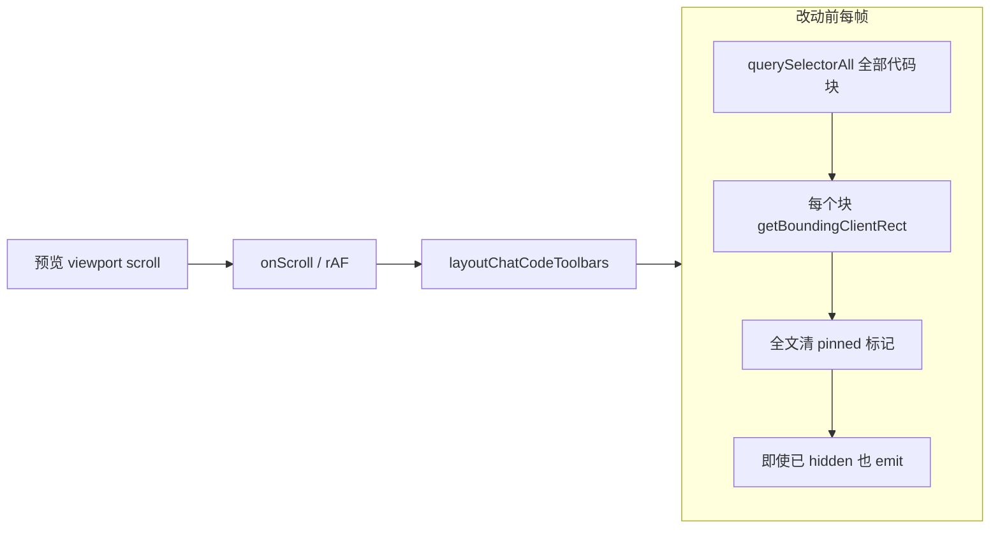

# 知识库预览页代码工具栏滚动修复

> **文档角色**：针对「知识库长文 + 多代码块预览滚动持续卡顿」的专项实现说明（改动前后成对对比 + 每行源码逐行中文注释）。
> **日期**：2026-07-28
> **延伸阅读**：[知识预览滚动卡顿.md](./知识预览滚动卡顿.md)（上一轮 FAB / 岛屿 memo / enabled / 贴底 rAF）、[../ideas/知识库滚动卡顿修复.md](../ideas/knowledge/知识库滚动卡顿修复.md)（步骤手册，含本轮 **S7**）、[../impact/知识预览代码工具条滚动.md](../impact/知识预览代码工具条滚动.md)（影响面）、[知识预览助手性能.md](../ideas/knowledge/知识预览助手性能.md)（预览+助手争用）。

---

## 1. 背景与目标

### 1.1 问题（本轮）

用户反馈：知识库 **纯预览** 下文档很长、结构复杂且 **存在大量代码块** 时，**滚动过程持续卡顿**（非仅首次打开瞬间）。

上一轮已收敛 FAB `setState`、岛屿 HTML memo、助手同开时关吸顶条、流式贴底 rAF；本轮根因落在 **`layoutChatCodeToolbars` 滚动热路径仍对全文代码块做 `querySelectorAll` + 全量 `getBoundingClientRect`，且隐藏态仍 `emit`**。

### 1.2 明确否决 / 已回退（勿再试）

| 方案 | 结果 |
|------|------|
| 预览 DOM **窗口化**挂载 | 影响目录锚点 / 滚动高度 / 既有预览逻辑，且未解决卡顿 → **已回退** |
| 纯预览一律 **卸载 Monaco**、超大围栏跳过 hljs | 实测 **更卡** 或收益不足 → **已回退** |
| `.markdown-body` 上 `content-visibility:auto` | 历史实测加重 thrashing → **禁止**（见滚动层归档 §5） |

### 1.3 目标

| 目标 | 说明 |
|------|------|
| 滚动帧工作量与代码块总数解耦 | 缓存块列表 + 二分定位顶附近 + 只测附近几何 |
| 隐藏/几何未变零订阅抖动 | 已隐藏不 `emit`；同一 winner 几何不变不写 DOM |
| 不改预览 DOM / 行内工具栏 / 吸顶语义 | 浮动条仍出现在「视口顶落在代码块内」时 |
| 正文变化仍正确 | `layoutDeps` 路径 `invalidate` + `refreshBlocks` |

---

## 2. 改动范围

| 路径 | 变更类型 |
|------|----------|
| `apps/frontend/src/utils/chatCodeFencePinSearch.ts` | **纯新增**：二分定位纯函数 |
| `apps/frontend/src/utils/chatCodeToolbar.ts` | `layoutChatCodeToolbars` 热路径重写；新增 `hideToolbar` / `clearLastPinnedMarkers` / `invalidateChatCodeFenceBlockCache` / `LayoutChatCodeToolbarsOptions` / 模块级缓存；删除 `resetFloatingMarkersInViewport` |
| `apps/frontend/src/hooks/useChatCodeFloatingToolbar.tsx` | `relayout` → `relayoutAfterContent`（invalidate + refresh）；`relayoutOnScroll` 复用缓存；ResizeObserver / 双帧 `useEffect` / `useLayoutEffect` 改用 `relayoutAfterContent` |

**未改**：`Markdown/index.tsx` 预览挂载结构、Monaco `enableCodeFloatingToolbar` 调用语义、目录 hash 滚动、行内 `bindMarkdownCodeFenceActions` / 下载链路。

---

## 3. 实现思路

### 3.1 根因



代码块数量 N 大时，滚动帧 Scripting 被 DOM 查询与强制布局占满，合成滚动掉帧。

### 3.2 对策

1. **WeakMap 缓存**代码块根列表：滚动帧复用；正文变化走 `refreshBlocks` / `invalidate`。
2. **二分** `findFirstBlockNotAboveViewportTop`：跳过视口顶上方块。
3. **自 start 向下扫**至 `br.top >= topY` 即停：只测顶附近。
4. **`clearLastPinnedMarkers` O(1)** 替代全文 `querySelectorAll` 清理。
5. **`hideToolbar` / 几何短路**：避免无意义 `emit` 与 DOM 写。

### 3.3 调用链

`ParserMarkdownPreviewPane` → `useChatCodeFloatingToolbar` → 滚动 `relayoutOnScroll` → `layoutChatCodeToolbars(vp)`（无 refresh）→ Portal 吸顶条。
正文 / `layoutDeps` 变化 → `relayoutAfterContent` → `invalidateChatCodeFenceBlockCache` + `layoutChatCodeToolbars(vp, { refreshBlocks: true })`。

---

## 4. 关键实现（改动前 / 改动后对比 + 逐行注释）

### 4.1 `findFirstBlockNotAboveViewportTop`（`apps/frontend/src/utils/chatCodeFencePinSearch.ts`）

**对比范围**：完整导出函数；**纯新增**，无改动前。

**改动后** · `apps/frontend/src/utils/chatCodeFencePinSearch.ts`（当前，约 L1–L18）

```typescript
// 文档序下，找第一个「底边不低于视口顶」的下标（二分）。
/**
 * 文档序下，找第一个「底边不低于视口顶」的下标（二分）。
 * ponytail: 假定代码块按文档流自上而下排列（Markdown 预览成立）。
 */
// 导出函数声明：按文档序二分定位第一个仍可能与视口顶相交的代码块
export function findFirstBlockNotAboveViewportTop(
// 入参：按索引取代码块底边 Y 坐标（调用方负责缓存以避免重复 getBoundingClientRect）
	getBottom: (index: number) => number,
// 入参：代码块总数（半开区间右端，初始 hi）
	length: number,
// 入参：视口顶 Y 坐标（已含亚像素容差）
	topY: number,
// 返回类型：找到的下标（可能等于 length，表示无候选）
): number {
// 二分下界，初始为 0
	let lo = 0;
// 二分上界，初始为 length（半开区间）
	let hi = length;
// 当区间非空时继续二分
	while (lo < hi) {
// 取中点（位运算整除，向下取整）
		const mid = (lo + hi) >> 1;
// 若 mid 块底边不超过视口顶：mid 及其左侧都在视口顶上方，丢弃左半区
		if (getBottom(mid) <= topY) lo = mid + 1;
// 否则 mid 本身可能就是答案，缩右端到 mid 继续向左找
		else hi = mid;
// 结束 while 循环块
	}
// lo == hi 即为第一个底边不低于视口顶的下标
	return lo;
// 结束函数体
}
```

**变更摘要**：纯新增二分纯函数，把滚动帧代码块定位从 O(n) 收敛到 O(log n)。

---

### 4.2 模块级缓存 `blockListCache` / `lastPinnedMarkers`（`apps/frontend/src/utils/chatCodeToolbar.ts`）

**对比范围**：模块顶部新增的两处状态；**纯新增**，无改动前。

**改动后** · `apps/frontend/src/utils/chatCodeToolbar.ts`（当前，约 L56–L64）

```typescript
// 行内注释：滚动帧复用块列表缓存，内容变化时由 invalidate / refreshBlocks 失效
/** 滚动帧复用：内容变化时 invalidate / refreshBlocks */
// WeakMap：key 为滚动视口 DOM，value 为该视口下的代码块根列表，避免滚动帧全文 query
const blockListCache = new WeakMap<HTMLElement, HTMLElement[]>();

// 行内注释：仅记录最近一次吸顶 winner，滚动热路径只清这一处即可
/** 上一次吸顶 winner；滚动热路径只清这一处 */
// 模块级可变变量：保存最近一次 pin 写入的三个 DOM 节点引用，供 O(1) 还原
let lastPinnedMarkers: {
// winner 代码块容器节点（用于移除 PIN_ATTR）
	block: HTMLElement;
// winner 行内工具栏节点（用于移除 replaced class）
	toolbar: HTMLElement;
// winner 工具栏占位槽节点（用于清空 minHeight）
	slot: HTMLElement;
// 联合类型尾：允许 null（无 pin 时为 null）
} | null = null;
```

**变更摘要**：新增滚动帧复用的两处模块级状态——块列表 WeakMap 缓存 + 最近 winner 标记。

---

### 4.3 `hideToolbar`（`apps/frontend/src/utils/chatCodeToolbar.ts`）

**对比范围**：完整导出内部函数；**纯新增**，无改动前。

**改动后** · `apps/frontend/src/utils/chatCodeToolbar.ts`（当前，约 L72–L77）

```typescript
// 隐藏吸顶条：先清最近 winner 的 DOM 标记，再在确实需要变化时 emit
function hideToolbar(emitIfChanged = true): void {
// 先清掉上一 winner 的 pin/class/minHeight（O(1)，不查全文）
	clearLastPinnedMarkers();
// 已是隐藏态（不可见且无 pinId）：无需写 state 也无需 emit，直接返回
	if (!state.visible && state.pinId < 0) return;
// 写入 HIDDEN 快照，覆盖上一次的可见几何
	state = HIDDEN;
// 仅在调用方要求广播变化时通知订阅方（Portal 工具栏随之卸载/隐藏）
	if (emitIfChanged) emit();
// 结束函数体
}
```

**变更摘要**：新增统一隐藏入口，已隐藏态短路 `emit`，避免滚动帧订阅方无意义重渲。

---

### 4.4 `invalidateChatCodeFenceBlockCache`（`apps/frontend/src/utils/chatCodeToolbar.ts`）

**对比范围**：完整导出函数；**纯新增**，无改动前。

**改动后** · `apps/frontend/src/utils/chatCodeToolbar.ts`（当前，约 L101–L106）

```typescript
// 行内注释：正文 DOM 变化后丢弃块列表缓存，由 hook 在 layoutDeps 变化时调用
/** 正文 DOM 变化后丢弃块列表缓存（由 hook 在 layoutDeps 变化时调用） */
// 导出函数声明：从 WeakMap 删除指定 viewport 的块列表缓存
export function invalidateChatCodeFenceBlockCache(
// 入参：滚动视口 DOM；允许 null/undefined，调用方传 ref.current 即可
	viewport?: HTMLElement | null,
// 返回类型：无返回值
): void {
// 仅在 viewport 真实存在时删除其缓存项；null 时无副作用
	if (viewport) blockListCache.delete(viewport);
// 结束函数体
}
```

**变更摘要**：新增外部可调用的缓存失效入口，供 Hook 在正文变化时显式失效。

---

### 4.5 `resetFloatingMarkersInViewport` → `clearLastPinnedMarkers`（`apps/frontend/src/utils/chatCodeToolbar.ts`）

**对比范围**：清理上一 winner 标记的内部函数，整体替换。

**改动前** · `apps/frontend/src/utils/chatCodeToolbar.ts`（基线，约 L87–L102）· `resetFloatingMarkersInViewport`

```typescript
// 清理 viewport 内上一次布局写入的标记，避免滚动时残留"旧 pinned"状态
function resetFloatingMarkersInViewport(viewport: HTMLElement): void {
// 全文 query 所有带 PIN_ATTR 的节点并逐个移除该属性
	viewport.querySelectorAll(`[${PIN_ATTR}]`).forEach((el) => {
// 移除当前节点的 pin 属性
		el.removeAttribute(PIN_ATTR);
// 结束 forEach 回调
	});
// 全文 query 所有行内工具栏节点
	viewport
		.querySelectorAll(MARKDOWN_CODE_FENCE_TOOLBAR_SELECTOR)
		.forEach((tb) => {
// 移除"已被浮动条替换"class，恢复行内工具栏可见性
			tb.classList.remove(MARKDOWN_CODE_FENCE_TOOLBAR_FLOAT_REPLACED_CLASS);
// 结束 forEach 回调
		});
// 全文 query 所有工具栏占位槽节点
	viewport
		.querySelectorAll(MARKDOWN_CODE_FENCE_TOOLBAR_SLOT_SELECTOR)
		.forEach((slot) => {
// 清空占位槽 minHeight，避免残留高度
			(slot as HTMLElement).style.minHeight = '';
// 结束 forEach 回调
		});
// 结束函数体
}
```

**改动后** · `apps/frontend/src/utils/chatCodeToolbar.ts`（当前，约 L108–L117）· `clearLastPinnedMarkers`

```typescript
// 仅清最近一次 winner 的三处 DOM 标记，O(1) 完成清理（替代全文 querySelectorAll）
function clearLastPinnedMarkers(): void {
// 取出上一 winner 引用
	const prev = lastPinnedMarkers;
// 立即把模块级 lastPinnedMarkers 置空，防止后续路径误读
	lastPinnedMarkers = null;
// 上一 winner 已脱离文档（被 React 卸载）则无需再写 DOM，直接返回
	if (!prev?.block.isConnected) return;
// 移除 winner 代码块上的 pin 属性
	prev.block.removeAttribute(PIN_ATTR);
// 移除 winner 行内工具栏上的"已被替换"class
	prev.toolbar.classList.remove(
// 工具包导出的 replaced class 常量
		MARKDOWN_CODE_FENCE_TOOLBAR_FLOAT_REPLACED_CLASS,
// 结束 classList.remove 调用
	);
// 清空 winner 占位槽的 minHeight
	prev.slot.style.minHeight = '';
// 结束函数体
}
```

**变更摘要**：清理策略从「全文三选 + 全部 forEach」改为「只动最近一次 winner 的三个 DOM 节点」，滚动热路径 O(1)。

---

### 4.6 `LayoutChatCodeToolbarsOptions`（`apps/frontend/src/utils/chatCodeToolbar.ts`）

**对比范围**：导出类型；**纯新增**，无改动前。

**改动后** · `apps/frontend/src/utils/chatCodeToolbar.ts`（当前，约 L144–L147）

```typescript
// 导出类型：layoutChatCodeToolbars 的可选配置
export type LayoutChatCodeToolbarsOptions = {
// 行内注释：true 表示强制重新 query 代码块根，仅正文变化后传；滚动帧勿传
	/** true：强制重新 query 代码块根（正文变化后）；滚动帧勿传 */
// refreshBlocks 字段：是否绕过缓存重查代码块根列表
	refreshBlocks?: boolean;
// 结束类型字面量
};
```

**变更摘要**：新增 options 类型，使同一函数可在「正文变化强刷」与「滚动复用」两种模式间切换。

---

### 4.7 `layoutChatCodeToolbars`（`apps/frontend/src/utils/chatCodeToolbar.ts`）

**对比范围**：完整 `export function layoutChatCodeToolbars`（不含前置 JSDoc）。

**改动前** · `apps/frontend/src/utils/chatCodeToolbar.ts`（基线，约 L144–L271）

```typescript
// 导出函数声明：在滚动视口内选出跨越视口顶边的代码块并固定浮动工具栏
export function layoutChatCodeToolbars(viewport: HTMLElement | null): void {
// 无 viewport：直接隐藏浮动条（例如组件卸载或 ref 为空）
	if (!viewport) {
// 写入隐藏状态
		state = HIDDEN;
// 通知订阅方刷新（Portal 工具栏会随之消失）
		emit();
// 提前返回，避免后续对 null 读几何
		return;
// 结束 if (!viewport) 块
	}

// 读取滚动视口矩形：用于判断"视口顶边"与代码块的相交关系，并计算浮动条 top
	const vpRect = viewport.getBoundingClientRect();
// 清掉上一次 pinned 标记与占位，避免滚动/重算后残留旧状态
	resetFloatingMarkersInViewport(viewport);

// 收集 viewport 内所有代码块容器（与 MarkdownParser.patchChatCodeFenceRenderer 输出一致）
	const blocks = queryMarkdownCodeFenceBlockRoots(viewport);
// 评分结构：把每个代码块参与决策所需信息一次性取齐（避免后面反复查询 DOM）
	type Scored = {
// 代码块容器节点
		block: HTMLElement;
// 代码块容器的几何快照（rect，矩形）
		br: DOMRect;
// "消息气泡壳"或回退到 viewport：用于计算浮动条的水平范围
		shell: HTMLElement;
// 原始工具栏节点（会被标记为 replaced-by-float）
		toolbar: HTMLElement;
// 工具栏占位槽节点（用于写 minHeight，防止布局跳动）
		slot: HTMLElement;
// 结束类型字面量
	};
// scored：所有满足结构要求的代码块集合
	const scored: Scored[] = [];

// 遍历每个代码块，抽取工具栏、占位槽、几何与壳节点
	for (const block of blocks) {
// 代码块内原始工具栏（与工具包契约一致）
		const toolbar = block.querySelector<HTMLElement>(
// 工具包导出的工具栏选择器常量
			MARKDOWN_CODE_FENCE_TOOLBAR_SELECTOR,
// 结束 querySelector 调用
		);
// 工具栏占位槽（与工具包契约一致）
		const slot = block.querySelector<HTMLElement>(
// 工具包导出的占位槽选择器常量
			MARKDOWN_CODE_FENCE_TOOLBAR_SLOT_SELECTOR,
// 结束 querySelector 调用
		);
// 聊天气泡壳（宿主布局）：知识库/独立 Markdown 预览无该节点，用滚动视口作水平参照
// shell：用于水平对齐的参照容器（优先消息气泡壳，否则用 viewport）
		const shell =
// 优先 closest 聊天气泡壳，回退到 viewport
			block.closest<HTMLElement>(CHAT_ASSISTANT_SHELL_SELECTOR) ?? viewport;
// 缺少关键节点则跳过（不参与吸顶）
		if (!toolbar || !slot) continue;
// 记录本代码块的评分信息
		scored.push({
// 原始代码块容器
			block,
// 代码块矩形：用于筛选"跨越视口顶边"的候选
			br: block.getBoundingClientRect(),
// 参照壳：用于计算 left/width
			shell,
// 原工具栏：用于写 class
			toolbar,
// 占位槽：用于写 minHeight
			slot,
// 结束 push 对象字面量
		});
// 结束 for (const block of blocks) 循环
	}

// 允许 1px 的误差：避免因为亚像素/滚动舍入导致候选集合抖动
	const PIN_EPS = 1;
// candidates：筛选出"视口顶边落在其内部"的代码块（跨越视口顶边）
	const candidates = scored.filter(
// 过滤谓词：代码块顶边在视口顶之上、底边在视口顶之下
		(s) =>
// 顶边在视口顶之上（含容差）且底边在视口顶之下（含容差）
			s.br.top < vpRect.top + PIN_EPS && s.br.bottom > vpRect.top + PIN_EPS,
// 结束 filter 调用
	);

// 没有候选：说明视口顶边不在任何代码块内部 → 隐藏浮动条
	if (candidates.length === 0) {
// 写入隐藏状态
		state = HIDDEN;
// 通知订阅方刷新
		emit();
// 提前返回
		return;
// 结束 if (candidates.length === 0) 块
	}

// winner：在所有候选里选择"顶边更靠下"的那个（更贴近当前阅读位置）
	const winner = candidates.reduce((a, b) => (a.br.top > b.br.top ? a : b));
// pinId：自增会话 id，用于在 DOM 上标记"当前 pinned 的代码块"
	const pinId = ++pinSession;
// 在 winner 代码块上打标：方便浮动工具栏通过 pinId 反查对应 block
	winner.block.setAttribute(PIN_ATTR, String(pinId));
// 标记原工具栏"已被浮动条替换"：通常用于样式隐藏/占位切换
	winner.toolbar.classList.add(
// 工具包导出的 replaced class 常量
		MARKDOWN_CODE_FENCE_TOOLBAR_FLOAT_REPLACED_CLASS,
// 结束 classList.add 调用
	);
// 读取原工具栏高度：用于设置 slot 的占位高度，避免内容突然上跳
	const th = winner.toolbar.offsetHeight || 36;
// 写入占位高度：原工具栏被"替换"后仍保持同等高度的空位
	winner.slot.style.minHeight = `${th}px`;

// 读取壳节点矩形：用于计算浮动条 left/width 的对齐区间
	const shellRect = winner.shell.getBoundingClientRect();
// 计算浮动条在视口内的水平位置与宽度（优先对齐代码块可见区间）
	const { left, width } = computePinnedBarBox(shellRect, winner.br, vpRect);
// 从代码块里读语言标签：用于浮动工具栏显示（不作为下载真实语言源）
	const langSpan = winner.block.querySelector(
// 工具包导出的语言标签选择器常量
		MARKDOWN_CODE_FENCE_TOOLBAR_LANG_SELECTOR,
// 结束 querySelector 调用
	);
// 语言文本：空值回退为 text
	const lang = langSpan?.textContent?.trim() || 'text';

// 写入浮动条状态：由 Portal 工具栏读取并渲染到 body
	state = {
// 可见
		visible: true,
// 顶部固定到 viewport 顶边（position:fixed 参照）
		top: vpRect.top,
// 水平位置
		left,
// 宽度
		width,
// 展示用语言标签
		lang,
// 用于反查 pinned block 的 id
		pinId,
// 结束 state 对象字面量
	};
// 通知订阅方刷新 UI
	emit();
// 结束函数体
}
```

**改动后** · `apps/frontend/src/utils/chatCodeToolbar.ts`（当前，约 L166–L294）

```typescript
// 导出函数声明：在滚动视口内选出跨越视口顶边的代码块并固定浮动工具栏；新增 options 控制缓存策略
export function layoutChatCodeToolbars(
// 入参：滚动视口 DOM；null 表示卸载并隐藏
	viewport: HTMLElement | null,
// 入参：可选配置，refreshBlocks=true 时绕过缓存重查代码块根
	options?: LayoutChatCodeToolbarsOptions,
// 返回类型：无返回值，副作用是写入全局 state 并可能 emit
): void {
// 无视口：走隐藏路径并返回
	if (!viewport) {
// O(1) 清 pinned 并仅在确实需要变化时 emit 隐藏态
		hideToolbar();
// 结束本次布局
		return;
// 结束 if (!viewport) 块
	}

// 读取视口矩形，供顶边相交判定与浮动条 top
	const vpRect = viewport.getBoundingClientRect();
// 亚像素容差 1px，减轻候选集合抖动
	const PIN_EPS = 1;
// 视口顶判定线（含容差），后续比较都基于 topY
	const topY = vpRect.top + PIN_EPS;

// 优先取本 viewport 缓存的代码块根列表
	let list = blockListCache.get(viewport);
// 无缓存或调用方要求刷新时全文 query 一次并写回 WeakMap
	if (!list || options?.refreshBlocks) {
// 全文 query 代码块根并转成数组
		list = Array.from(queryMarkdownCodeFenceBlockRoots(viewport));
// 写入缓存供后续滚动帧复用
		blockListCache.set(viewport, list);
// 结束 if (!list || refreshBlocks) 块
	}

// 过滤已卸节点：有失效则整表刷新（避免滚动中半残缓存）
	if (list.some((el) => !el.isConnected)) {
// 任一节点已脱离文档：重新 query 整表
		list = Array.from(queryMarkdownCodeFenceBlockRoots(viewport));
// 用整表覆盖缓存
		blockListCache.set(viewport, list);
// 结束 if (list.some(...)) 块
	}

// 无可参与吸顶的代码块：隐藏并返回
	if (list.length === 0) {
// 走隐藏路径
		hideToolbar();
// 结束本次布局
		return;
// 结束 if (list.length === 0) 块
	}

// 候选评分结构：块、几何、壳、原工具栏与占位槽
	type Scored = {
// 代码块容器节点
		block: HTMLElement;
// 代码块容器的几何快照（rect，矩形）
		br: DOMRect;
// 水平参照壳节点（聊天气泡壳或 viewport）
		shell: HTMLElement;
// 原始工具栏节点（会被标记为 replaced-by-float）
		toolbar: HTMLElement;
// 工具栏占位槽节点（用于写 minHeight，防止布局跳动）
		slot: HTMLElement;
// 结束类型字面量
	};

// 二分过程中复用已测 bottom，避免同一 mid 重复 getBoundingClientRect
	const midBottoms = new Map<number, number>();
// 按索引取块底边；未测则 getBoundingClientRect 并写入缓存
	const getBottom = (index: number) => {
// 先查缓存
		let b = midBottoms.get(index);
// 缓存未命中
		if (b == null) {
// 实测该索引代码块的底边 Y
			b = list[index].getBoundingClientRect().bottom;
// 写回缓存供二分后续步骤或本帧再次访问复用
			midBottoms.set(index, b);
// 结束 if (b == null) 块
		}
// 返回该索引代码块底边 Y
		return b;
// 结束 getBottom 箭头函数
	};

// 二分找第一个底边不低于视口顶的下标，跳过视口顶上方块
	const start = findFirstBlockNotAboveViewportTop(
// 底边取值回调（带缓存）
		getBottom,
// 代码块总数（半开区间右端）
		list.length,
// 视口顶判定线（去掉容差，避免漏选贴近视口顶的块）
		topY - PIN_EPS,
// 结束二分函数调用
	);

// 跨越视口顶的候选集合
	const candidates: Scored[] = [];
// 自 start 向文档下方扫描，直到块顶边低于视口顶
	for (let i = start; i < list.length; i++) {
// 当前扫描到的代码块
		const block = list[i];
// 取行内工具栏节点
		const toolbar = block.querySelector<HTMLElement>(
// 工具包导出的工具栏选择器常量
			MARKDOWN_CODE_FENCE_TOOLBAR_SELECTOR,
// 结束 querySelector 调用
		);
// 取工具栏占位槽节点
		const slot = block.querySelector<HTMLElement>(
// 工具包导出的占位槽选择器常量
			MARKDOWN_CODE_FENCE_TOOLBAR_SLOT_SELECTOR,
// 结束 querySelector 调用
		);
// 结构不完整则跳过，不参与吸顶
		if (!toolbar || !slot) continue;
// 仅对视口顶附近块测几何（热路径核心减负）
		const br = block.getBoundingClientRect();
// 顶边已低于视口顶：其后块更低，结束扫描
		if (br.top >= topY) break;
// 底边仍压过视口顶 → 视为跨越顶边的候选
		if (br.bottom > topY) {
// 收录候选及其 shell/toolbar/slot
			candidates.push({
// 代码块容器节点
				block,
// 代码块矩形
				br,
// 水平参照：优先聊天气泡壳，否则用 viewport
				shell:
// 优先 closest 聊天气泡壳，回退到 viewport
					block.closest<HTMLElement>(CHAT_ASSISTANT_SHELL_SELECTOR) ?? viewport,
// 行内工具栏节点
				toolbar,
// 占位槽节点
				slot,
// 结束 push 对象字面量
			});
// 结束 if (br.bottom > topY) 块
		}
// 结束 for 循环块
	}

// 无跨越顶边的块：隐藏吸顶条
	if (candidates.length === 0) {
// 走隐藏路径
		hideToolbar();
// 结束本次布局
		return;
// 结束 if (candidates.length === 0) 块
	}

// 多候选时取顶边更靠下者（更贴近阅读位置）
	const winner = candidates.reduce((a, b) => (a.br.top > b.br.top ? a : b));
// 壳矩形，用于计算浮动条 left/width
	const shellRect = winner.shell.getBoundingClientRect();
// 计算浮动条在视口内的水平位置与宽度
	const { left, width } = computePinnedBarBox(shellRect, winner.br, vpRect);
// 取语言标签 span 节点
	const langSpan = winner.block.querySelector(
// 工具包导出的语言标签选择器常量
		MARKDOWN_CODE_FENCE_TOOLBAR_LANG_SELECTOR,
// 结束 querySelector 调用
	);
// 语言空则回退 text
	const lang = langSpan?.textContent?.trim() || 'text';
// 浮动条 top 贴视口顶边
	const top = vpRect.top;

// 同一块且几何未变：跳过 setAttribute / emit，避免滚动帧订阅方重渲
	if (
// 同一 winner 且几何未变：跳过 DOM 写与 emit
		lastPinnedMarkers?.block === winner.block &&
// 须当前可见才做几何相等短路
		state.visible &&
// 比较浮动条 top 是否未变
		state.top === top &&
// 比较浮动条 left 是否未变
		state.left === left &&
// 比较浮动条 width 是否未变
		state.width === width &&
// 比较浮动条 lang 是否未变
		state.lang === lang
// 结束 if 条件
	) {
// 几何/语言均未变：直接结束本次布局
		return;
// 结束 if (几何未变) 块
	}

// 清掉上一 winner 的 pin/class/minHeight（O(1)）
	clearLastPinnedMarkers();
// 新会话 pinId，供 Portal 反查 DOM
	const pinId = ++pinSession;
// 在 winner 块上打 pin 标记
	winner.block.setAttribute(PIN_ATTR, String(pinId));
// 标记 winner 行内工具栏"已被浮动条替换"
	winner.toolbar.classList.add(
// 工具包导出的 replaced class 常量
		MARKDOWN_CODE_FENCE_TOOLBAR_FLOAT_REPLACED_CLASS,
// 结束 classList.add 调用
	);
// 原工具栏高度，缺省 36px
	const th = winner.toolbar.offsetHeight || 36;
// 占位槽写等高，防布局跳动
	winner.slot.style.minHeight = `${th}px`;
// 记录本次 winner，供下次 O(1) 清理
	lastPinnedMarkers = {
// 记录 winner 代码块容器
		block: winner.block,
// 记录 winner 行内工具栏
		toolbar: winner.toolbar,
// 记录 winner 占位槽
		slot: winner.slot,
// 结束 lastPinnedMarkers 对象字面量
	};

// 写入全局可见状态快照
	state = {
// 状态字段：visible 为 true
		visible: true,
// 状态字段：top 贴视口顶
		top,
// 状态字段：left 水平位置
		left,
// 状态字段：width 宽度
		width,
// 状态字段：lang 展示用语言标签
		lang,
// 状态字段：pinId 反查用 id
		pinId,
// 结束 state 对象字面量
	};
// 通知 useSyncExternalStore 订阅方刷新 Portal
	emit();
// 结束函数体
}
```

**变更摘要**：滚动帧复用块列表 + 二分定位 + 只测顶附近几何；同一 winner 几何/语言不变直接 return；无候选 / 空列表 / 无视口统一走 `hideToolbar`，已隐藏态不再 `emit`。

---

### 4.8 `useChatCodeFloatingToolbar` 顶部 import 与 JSDoc（`apps/frontend/src/hooks/useChatCodeFloatingToolbar.tsx`）

**对比范围**：顶部 import 块与 hook 的 JSDoc 末行。

**改动前** · `apps/frontend/src/hooks/useChatCodeFloatingToolbar.tsx`（基线，约 L11–L12、L48）

```typescript
// 从工具模块仅导入 layoutChatCodeToolbars
import { layoutChatCodeToolbars } from '@/utils/chatCodeToolbar';
```

**改动后** · 同文件（当前，约 L11–L14、L49）

```typescript
// 从工具模块同时导入 invalidate 与 layout
import {
// 缓存失效函数：正文变化时调用
	invalidateChatCodeFenceBlockCache,
// 主布局函数：options 控制是否 refreshBlocks
	layoutChatCodeToolbars,
// 结束 import 名字列表
} from '@/utils/chatCodeToolbar';
```

JSDoc 末行追加：`滚动热路径不 refresh 块列表；正文变化（layoutDeps）才 invalidate + refresh。`

**变更摘要**：Hook 侧引入 `invalidateChatCodeFenceBlockCache`，并在文档注释里写明两种路径的边界。

---

### 4.9 `relayout` → `relayoutAfterContent` + `relayoutOnScroll`（`apps/frontend/src/hooks/useChatCodeFloatingToolbar.tsx`）

**对比范围**：两个 `useCallback` 完整符号。

**改动前** · `apps/frontend/src/hooks/useChatCodeFloatingToolbar.tsx`（基线，约 L57–L70）

```typescript
// 改动前：内容与滚动共用同一 relayout（滚动也会触发全量 query 风险）
	const relayout = useCallback(() => {
// 未启用吸顶条则零工作
		if (!enabled) return;
// 调用主布局（无 options，改动前每帧都会全文 query）
		layoutChatCodeToolbars(viewportRef.current);
// useCallback 依赖：viewport 引用 + enabled
	}, [viewportRef, enabled]);

// 源码内既有 JSDoc：scroll 热路径合并到单帧，避免 React onScroll + passive 双通道同帧双测
	/** scroll 热路径合并到单帧，避免 React onScroll + passive 双通道同帧双测 */
// 改动前 relayoutOnScroll：与 relayout 共享同一布局函数
	const relayoutOnScroll = useCallback(() => {
// 未启用吸顶条则零工作
		if (!enabled) return;
// 本帧已挂起则跳过，避免双通道双测
		if (scrollLayoutRafRef.current) return;
// 合并到下一动画帧再测布局
		scrollLayoutRafRef.current = requestAnimationFrame(() => {
// 清空 rAF 句柄，允许下一帧再调度
			scrollLayoutRafRef.current = 0;
// 调用主布局（无 options，改动前每帧都会全文 query）
			layoutChatCodeToolbars(viewportRef.current);
// 结束 rAF 回调
		});
// useCallback 依赖：viewport 引用 + enabled
	}, [viewportRef, enabled]);
```

**改动后** · 同文件（当前，约 L61–L76）

```typescript
// 改动后：正文/layoutDeps 变化路径，invalidate 缓存并强制 refresh 块列表
	const relayoutAfterContent = useCallback(() => {
// 未启用吸顶条则零工作
		if (!enabled) return;
// 取当前 viewport 引用
		const vp = viewportRef.current;
// 丢弃该 viewport 的块列表缓存（正文已变，旧列表失效）
		invalidateChatCodeFenceBlockCache(vp);
// 强制重新 query 代码块根并重新布局
		layoutChatCodeToolbars(vp, { refreshBlocks: true });
// useCallback 依赖：viewport 引用 + enabled
	}, [viewportRef, enabled]);

// 源码内既有 JSDoc：scroll 热路径合并到单帧；复用块列表缓存，勿 refreshBlocks
	/** scroll 热路径合并到单帧；复用块列表缓存，勿 refreshBlocks */
// 改动后 relayoutOnScroll：不传 refreshBlocks，复用缓存列表 + 二分定位
	const relayoutOnScroll = useCallback(() => {
// 未启用吸顶条则零工作
		if (!enabled) return;
// 本帧已挂起则跳过，避免双通道双测
		if (scrollLayoutRafRef.current) return;
// 合并到下一动画帧再测布局
		scrollLayoutRafRef.current = requestAnimationFrame(() => {
// 清空 rAF 句柄，允许下一帧再调度
			scrollLayoutRafRef.current = 0;
// 调用主布局（无 options，复用缓存列表 + 二分测附近块）
			layoutChatCodeToolbars(viewportRef.current);
// 结束 rAF 回调
		});
// useCallback 依赖：viewport 引用 + enabled
	}, [viewportRef, enabled]);
```

**变更摘要**：把原 `relayout` 拆为 `relayoutAfterContent`（invalidate + refresh）和 `relayoutOnScroll`（复用缓存），从源头避免滚动帧触发全量 query。

---

### 4.10 ResizeObserver `useEffect`（`apps/frontend/src/hooks/useChatCodeFloatingToolbar.tsx`）

**对比范围**：ResizeObserver 的回调与依赖数组。

**改动前** · `apps/frontend/src/hooks/useChatCodeFloatingToolbar.tsx`（基线，约 L107–L137）

```typescript
// 改动前：ResizeObserver 回调直接调 relayout，会触发 refresh 风险（改动前 relayout 内部即全量 query）
			ro = new ResizeObserver(() => relayout());
// 改动前 useEffect 依赖数组：含 relayout
	}, [enabled, relayout, ...layoutDeps]);
```

**改动后** · 同文件（当前，约 L106–L138）

```typescript
// 改动后：ResizeObserver 回调直接调 layoutChatCodeToolbars，不强制 refresh（避免 reflow 误伤缓存）
			ro = new ResizeObserver(() =>
// 仅做几何重算，复用缓存块列表
				layoutChatCodeToolbars(viewportRef.current),
// 结束 ResizeObserver 回调
			);
// 改动后 useEffect 依赖数组：relayout → relayoutAfterContent
	}, [enabled, relayoutAfterContent, ...layoutDeps]);
```

**变更摘要**：ResizeObserver 不再走 `relayout`（避免意外 refresh）；依赖改为 `relayoutAfterContent`，仅 `attach` 流程依赖其稳定性。

---

### 4.11 `useEffect` 与 `useLayoutEffect` 双帧布局（`apps/frontend/src/hooks/useChatCodeFloatingToolbar.tsx`）

**对比范围**：`layoutDeps` 触发的 `useEffect` 与 `useLayoutEffect`。

**改动前** · `apps/frontend/src/hooks/useChatCodeFloatingToolbar.tsx`（基线，约 L139–L160）

```typescript
// 改动前 useEffect：layoutDeps 变化时双帧调 relayout
	useEffect(() => {
// 未启用则跳过
		if (!enabled) return;
// 第一帧调 relayout
		relayout();
// 第二帧再调一次 relayout，兜底字体/图片加载后的几何变化
		const id = requestAnimationFrame(() => relayout());
// 清理：取消挂起的 rAF
		return () => cancelAnimationFrame(id);
// eslint 关闭 exhaustive-deps：layoutDeps 由调用方传入
		// eslint-disable-next-line react-hooks/exhaustive-deps -- layoutDeps 由调用方传入
// 依赖：enabled + relayout + layoutDeps
	}, [enabled, relayout, ...layoutDeps]);

// 改动前 useLayoutEffect：layoutDeps 变化时双帧调 layoutChatCodeToolbars
	useLayoutEffect(() => {
// 未启用则跳过
		if (!enabled) return;
// 取 viewport DOM
		const el = viewportRef.current;
// 无 DOM 则跳过
		if (!el) return;
// 第一帧直接调 layoutChatCodeToolbars
		layoutChatCodeToolbars(el);
// 第二帧再调一次，兜底同步挂载后的几何
		const id = requestAnimationFrame(() => layoutChatCodeToolbars(el));
// 清理：取消挂起的 rAF
		return () => cancelAnimationFrame(id);
// eslint 关闭 exhaustive-deps
		// eslint-disable-next-line react-hooks/exhaustive-deps
// 依赖：enabled + relayout + layoutDeps
	}, [enabled, relayout, ...layoutDeps]);
```

**改动后** · 同文件（当前，约 L140–L159）

```typescript
// 改动后 useEffect：layoutDeps 变化时双帧调 relayoutAfterContent（invalidate + refresh）
	useEffect(() => {
// 未启用则跳过
		if (!enabled) return;
// 第一帧调 relayoutAfterContent
		relayoutAfterContent();
// 第二帧再调一次，兜底字体/图片加载后的几何变化
		const id = requestAnimationFrame(() => relayoutAfterContent());
// 清理：取消挂起的 rAF
		return () => cancelAnimationFrame(id);
// eslint 关闭 exhaustive-deps：layoutDeps 由调用方传入
		// eslint-disable-next-line react-hooks/exhaustive-deps -- layoutDeps 由调用方传入
// 依赖：enabled + relayoutAfterContent + layoutDeps
	}, [enabled, relayoutAfterContent, ...layoutDeps]);

// 改动后 useLayoutEffect：layoutDeps 变化时显式 invalidate + refreshBlocks 双帧布局
	useLayoutEffect(() => {
// 未启用则跳过
		if (!enabled) return;
// 取 viewport DOM
		const el = viewportRef.current;
// 无 DOM 则跳过
		if (!el) return;
// 先失效该 viewport 的块列表缓存
		invalidateChatCodeFenceBlockCache(el);
// 第一帧强制 refresh 重查代码块根并布局
		layoutChatCodeToolbars(el, { refreshBlocks: true });
// 第二帧再 refresh 一次，兜底同步挂载后的几何
		const id = requestAnimationFrame(() =>
// 强制 refresh 重查代码块根并布局
			layoutChatCodeToolbars(el, { refreshBlocks: true }),
// 结束 rAF 回调
		);
// 清理：取消挂起的 rAF
		return () => cancelAnimationFrame(id);
// eslint 关闭 exhaustive-deps
		// eslint-disable-next-line react-hooks/exhaustive-deps
// 依赖：enabled + relayoutAfterContent + layoutDeps
	}, [enabled, relayoutAfterContent, ...layoutDeps]);
```

**变更摘要**：`layoutDeps` 路径全部改走 `relayoutAfterContent` / `invalidate + refreshBlocks`，确保正文变化后块列表立即重建；滚动路径仍复用缓存。

---

## 5. 行为变化与兼容性

| 项 | 说明 |
|----|------|
| 吸顶条出现时机 | 仍为「视口顶边落在某代码块内部」；语义不变 |
| 行内复制/下载 | 未改 `bindMarkdownCodeFenceActions` / 行内工具栏 DOM |
| 助手同开关吸顶 | Monaco 仍传 `enableCodeFloatingToolbar={!assistantRightPaneActive}` |
| 聊天等其它调用方 | 共用同一 `layoutChatCodeToolbars`，长消息多代码块滚动同样受益 |
| 预览 DOM | **不变**（无窗口化） |
| 缓存失效语义 | `layoutDeps` 变化 / `useLayoutEffect` 双帧 / Hook 卸载（`layoutChatCodeToolbars(null)`）都会触发失效或重建 |
| 已卸节点兜底 | `layoutChatCodeToolbars` 检测到 `list` 中含 `!isConnected` 节点会整表重查 |
| 几何短路 | 同一 winner 且 `top/left/width/lang` 完全相等时跳过 `setAttribute` 与 `emit`，订阅方零重渲 |
| 隐藏态 emit | `hideToolbar` 在已隐藏（`!visible && pinId < 0`）时不再 `emit` |

---

## 6. 测试与回归建议

- [ ] 知识库打开 **长文 + 大量 ``` 代码块**，切预览，快速 flick 滚动：应明显跟手于改前。
- [ ] 滚到代码块跨越顶边时：吸顶浮动条仍出现，语言标签正确，复制/下载可用。
- [ ] 滚离代码块：浮动条消失，行内工具栏恢复。
- [ ] 预览中改主题/换文档：吸顶仍正确（缓存已 invalidate）。
- [ ] 预览 + 助手同开：左栏吸顶仍关闭；右侧助手不受影响。
- [ ] 目录 / hash 跳转、置顶置底 FAB：行为与改前一致。
- [ ] 聊天流多代码块消息滚动：无回归（共用工具栏 layout）。
- [ ] 同一 winner 滚动微小位移（亚像素）：浮动条不抖动、不重渲。
- [ ] 代码块被 React 重建（如换 markdown）：`!isConnected` 兜底应整表重查，吸顶正确。

---

## 7. 相关文档与代码索引

| 说明 | 路径 |
|------|------|
| 本专题 | `docs/knowledge/知识预览代码工具条滚动.md` |
| 上一轮滚动层归档 | `docs/knowledge/知识预览滚动卡顿.md` |
| 步骤手册（含 S7） | `docs/ideas/知识库滚动卡顿修复.md` |
| 影响点 | `docs/impact/知识预览代码工具条滚动.md` |
| 二分纯函数 | `apps/frontend/src/utils/chatCodeFencePinSearch.ts` |
| 布局实现 | `apps/frontend/src/utils/chatCodeToolbar.ts` |
| Hook | `apps/frontend/src/hooks/useChatCodeFloatingToolbar.tsx` |
| Portal 工具栏组件 | `apps/frontend/src/components/design/ChatCodeToolBar` |

---

（若与仓库最新源码不一致，以源码为准）
