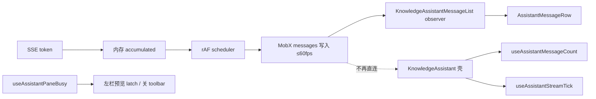

# 知识库预览 + 助手同开性能优化

> **文档角色**：本轮 diff 的**主实现文档**（写路径 + 改动前后对比 + 逐行注释）。  
> **延伸阅读**：[知识编辑器长文本性能.md](./知识编辑器长文本性能.md)（M1 长文 edit 隔离）、[知识预览滚动卡顿.md](./知识预览滚动卡顿.md)（预览滚动 FAB/memo/toolbar/贴底 rAF）、[../ideas/知识预览助手性能.md](../ideas/knowledge/知识预览助手性能.md)（规划态思路）、[../impact/知识库预览助手面板性能影响.md](../impact/知识库预览助手面板性能影响.md)（影响面与回归清单）、[知识库助手完成.md](./知识库助手完成.md)（助手总览）。

---

## 1. 背景与目标

### 1.1 问题

知识库在**左栏 Markdown 预览/分屏**与**右栏 AI/RAG 助手**同时开启、且助手**流式输出**时，主线程争用严重：SSE 每个 token 触发 MobX 通知 → `KnowledgeAssistant` observer 重渲染 → 连带左栏 `ParserMarkdownPreviewPane` reconcile，表现为输入迟滞、滚动卡顿、打字机不跟手。仅开一侧时不卡。

### 1.2 目标

| 目标 | 说明 |
|------|------|
| 写路径降频 | SSE 增量合并为**每帧最多一次** MobX 写入 |
| 读路径隔离 | 父级不再在 render 订阅 `messages` 数组；消息列独立 observer |
| 左栏降载 | `assistantPaneBusy` 时预览 latch / 关左栏 code toolbar |
| 体验兜底 | 预览 latch 追平帧显示「内容加载中…」，避免误报「预览为空」 |
| 功能不变 | 发送/停止、AI↔RAG、分享、保存、`documentKey` 会话绑定等行为与改前一致 |

---

## 2. 改动范围

| 路径 | 变更类型 |
|------|----------|
| `apps/frontend/src/utils/scheduleStreamingMobxPatch.ts` | **新增** rAF 合并调度器 |
| `apps/frontend/src/store/assistant.ts` | SSE patch 改经 scheduler |
| `apps/frontend/src/store/knowledgeRagQa.ts` | 同上 |
| `apps/frontend/src/hooks/useAssistantMessageCount.ts` | **新增** 条数 / streamTick reaction |
| `apps/frontend/src/hooks/useAssistantPaneBusy.ts` | **新增** busy 信号 reaction |
| `apps/frontend/src/hooks/useAssistantScroll.ts` | 支持 `contentRevision` + `messageCount` |
| `apps/frontend/src/hooks/index.ts` | 导出新 hook |
| `apps/frontend/src/views/knowledge/KnowledgeAssistantMessageList.tsx` | **新增** 消息列 observer 子树 |
| `apps/frontend/src/views/knowledge/KnowledgeAssistant.tsx` | 读路径隔离、消息列拆分 |
| `apps/frontend/src/views/knowledge/index.tsx` | `useAssistantPaneBusy` |
| `apps/frontend/src/components/design/Assistant/useAssistantShare.tsx` | `getAllMessages` 懒读 |
| `apps/frontend/src/components/design/Markdown/index.tsx` | `pendingSourceMarkdown` 加载态 |
| `apps/frontend/src/components/design/Monaco/index.tsx` | latch 追平、分屏 busy 冻结、关左栏 toolbar |
| `apps/frontend/src/i18n/locales/zh-CN.ts`、`en-US.ts` | `markdown.preview.loading` |

---

## 3. 实现思路



| # | 要点 | 理由 |
|---|------|------|
| 1 | `createStreamingMobxPatchScheduler` | 根因：MobX 通知频率 ≈ token 频率 |
| 2 | `useAssistantMessageCount` / `useAssistantStreamTick` | 父壳 render 不读 `messages`，仅 reaction 更新 count/tick |
| 3 | `KnowledgeAssistantMessageList` observer | 流式 chunk 重渲染局限在消息列 |
| 4 | `useAssistantPaneBusy` | 左栏 Markdown 树不在 render 订阅 `isStreaming` 链路上的 messages |
| 5 | Monaco latch + `pendingSourceMarkdown` | busy 降载 + 追平帧 UX 兜底 |
| 6 | `useAssistantShare({ getAllMessages })` | 分享弹窗打开时才读 messages，避免壳 render 订阅 |

**权衡**：助手 busy 期间左栏预览可能**短暂滞后**（latch/deferred）；流式结束或 busy 解除后追平。纯 preview + 助手时 Monaco 可卸载，保存仍走 TextModel 回退（见 monaco 影响点）。

---

## 4. 关键代码对比与注释

### 4.1 `createStreamingMobxPatchScheduler`（纯新增）

**对比范围**：完整模块 `scheduleStreamingMobxPatch.ts`。

**改动后** · `apps/frontend/src/utils/scheduleStreamingMobxPatch.ts`（当前，约 L1–L39）

```typescript
// 模块顶注释：说明 rAF 合并 SSE 写入 MobX 的目的
/** 流式 SSE 增量合并为每帧最多一次 MobX 写入，避免每 token 触发整页 observer */
// 导出调度器实例的类型形状
export type StreamingMobxPatchScheduler = {
	// schedule：登记一次待 flush（同一帧内多次调用合并）
	schedule: () => void;
	// flush：立即执行 flush 并取消待执行的 rAF
	/** 立即刷入并取消待执行的 rAF */
	flush: () => void;
	// cancel：丢弃待 flush，不写入
	cancel: () => void;
};

// 工厂函数：传入实际写入 MobX 的 flush 回调
export function createStreamingMobxPatchScheduler(
	flush: () => void,
): StreamingMobxPatchScheduler {
	// 当前挂起的 requestAnimationFrame id，0 表示无
	let rafId = 0;
	// 本帧是否已有待执行的 dirty 标记
	let dirty = false;

	// rAF 回调：清 dirty 后调用外部 flush
	const runFlush = () => {
		dirty = false;
		rafId = 0;
		flush();
	};

	// 返回对外 API 对象
	return {
		schedule: () => {
			// 同帧重复 schedule 直接返回，保证最多一帧一次 flush
			if (dirty) return;
			dirty = true;
			rafId = requestAnimationFrame(runFlush);
		},
		flush: () => {
			// 取消已登记的 rAF，避免 flush 后再执行一次
			if (rafId) cancelAnimationFrame(rafId);
			dirty = false;
			rafId = 0;
			flush();
		},
		cancel: () => {
			if (rafId) cancelAnimationFrame(rafId);
			dirty = false;
			rafId = 0;
		},
	};
}
```

**变更摘要**：纯新增；assistant / RAG store 在 `onComplete` / `onError` / `catch` 路径须 `flush()` 避免尾 token 丢失。

---

### 4.2 `assistant.ts` 流式 patch（`sendMessage` 内）

**对比范围**：`flushAssistantPatch` + `applyAssistantPatch` + scheduler 生命周期。

**改动前** · `apps/frontend/src/store/assistant.ts`（基线 `sendMessage` 内，约 L1541–L1554）

```typescript
		// 旧版：每个 SSE delta 直接 runInAction 写 messages[idx]
		const applyAssistantPatch = (delta: string, thinkDelta?: string) => {
			// 累加正文到闭包变量
			if (delta) accumulated += delta;
			// 累加思考区
			if (thinkDelta) thinkBuf += thinkDelta;
			// 每次 token 立即触发 MobX 通知
			runInAction(() => {
				const idx = state.messages.findIndex(
					(m) => m.chatId === assistantChatId,
				);
				if (idx < 0) return;
				const prev = state.messages[idx] as Message;
				state.messages[idx] = {
					...prev,
					content: accumulated,
					thinkContent: thinkBuf,
				};
			});
		};
```

**改动后** · `apps/frontend/src/store/assistant.ts`（当前，约 L1541–L1562）

```typescript
		// 实际写入 MobX 的逻辑，供 scheduler 每帧调用一次
		const flushAssistantPatch = () => {
			runInAction(() => {
				const idx = state.messages.findIndex(
					(m) => m.chatId === assistantChatId,
				);
				if (idx < 0) return;
				const prev = state.messages[idx] as Message;
				state.messages[idx] = {
					...prev,
					content: accumulated,
					thinkContent: thinkBuf,
				};
			});
		};
		// 创建 rAF 调度器，合并多次 patch 为每帧一次
		const assistantPatchScheduler =
			createStreamingMobxPatchScheduler(flushAssistantPatch);
		// SSE 回调：只累加内存，schedule 合并写入
		const applyAssistantPatch = (delta: string, thinkDelta?: string) => {
			if (delta) accumulated += delta;
			if (thinkDelta) thinkBuf += thinkDelta;
			assistantPatchScheduler.schedule();
		};
```

**变更摘要**：写入从「每 token」改为「每帧最多一次」；`onComplete` / `catch` 增加 `assistantPatchScheduler.flush()`（diff 中 L1592、L1701 附近）。

`knowledgeRagQa.ts` 对称：`flushRagAssistantPatch` + `ragPatchScheduler`，在 `onDone` / `onError` / `onComplete` / `catch` 处 `flush()`。

---

### 4.3 `useAssistantMessageCount` / `useAssistantStreamTick`（纯新增）

**对比范围**：完整 hook 文件。

**改动后** · `apps/frontend/src/hooks/useAssistantMessageCount.ts`（当前，约 L1–L43）

```typescript
import { reaction } from 'mobx';
import { useEffect, useState } from 'react';
import { buildStreamTick } from '@/components/design/Assistant';
import assistantStore from '@/store/assistant';
import knowledgeRagQaStore from '@/store/knowledgeRagQa';

// 按模式读取当前 messages 数组长度
function readAssistantMessageCount(isRagMode: boolean): number {
	return isRagMode
		? knowledgeRagQaStore.messages.length
		: assistantStore.messages.length;
}

// 按模式构建流式贴底 revision 字符串
function readAssistantStreamTick(isRagMode: boolean): string {
	return buildStreamTick(
		isRagMode ? knowledgeRagQaStore.messages : assistantStore.messages,
	);
}

/** 仅条数变化时更新，避免流式 chunk 替换数组元素导致父级 observer 重渲染 */
export function useAssistantMessageCount(isRagMode: boolean): number {
	const [count, setCount] = useState(0);

	useEffect(() => {
		return reaction(() => readAssistantMessageCount(isRagMode), setCount, {
			fireImmediately: true,
		});
	}, [isRagMode]);

	return count;
}

/** 流式贴底 revision：与 buildStreamTick 一致，经 reaction 隔离父级 render */
export function useAssistantStreamTick(isRagMode: boolean): string {
	const [tick, setTick] = useState('');

	useEffect(() => {
		return reaction(() => readAssistantStreamTick(isRagMode), setTick, {
			fireImmediately: true,
		});
	}, [isRagMode]);

	return tick;
}
```

**变更摘要**：纯新增；`KnowledgeAssistant` 用 count 替代 render 内读 `messages.length`，用 `streamTick` 喂 `useAssistantScroll`，避免 observer 因数组元素替换每帧重渲染整壳。

---

### 4.4 `useAssistantPaneBusy`（纯新增）

**改动后** · `apps/frontend/src/hooks/useAssistantPaneBusy.ts`（当前，约 L1–L31）

```typescript
import { reaction } from 'mobx';
import { useEffect, useState } from 'react';
import assistantStore from '@/store/assistant';
import knowledgeRagQaStore from '@/store/knowledgeRagQa';

// 聚合 AI / RAG 发送与流式 busy 状态
function readAssistantPaneBusy(): boolean {
	return (
		assistantStore.isStreaming ||
		assistantStore.isSending ||
		knowledgeRagQaStore.isStreaming ||
		knowledgeRagQaStore.isSending
	);
}

/**
 * 助手发送/流式 busy 信号：用 reaction 读 store，避免 observer 在 render 里订阅
 * messages 数组导致流式每 chunk 重渲染整棵 Markdown 树。
 */
export function useAssistantPaneBusy(active: boolean): boolean {
	const [busy, setBusy] = useState(false);

	useEffect(() => {
		if (!active) {
			setBusy(false);
			return;
		}
		return reaction(readAssistantPaneBusy, setBusy, { fireImmediately: true });
	}, [active]);

	return active && busy;
}
```

---

### 4.5 `KnowledgeAssistantMessageList`（纯新增）

**改动后** · `apps/frontend/src/views/knowledge/KnowledgeAssistantMessageList.tsx`（当前，约 L30–L67）

```typescript
/** 单独订阅 messages：流式 chunk 只重渲染消息列，不带动 Markdown 左栏 */
export const KnowledgeAssistantMessageList = observer(
	function KnowledgeAssistantMessageList({
		isRagMode,
		isCopyedId,
		onCopy,
		onSaveToKnowledge,
		allowAiShare,
		shareSelection,
		onShare,
		scrollViewportRef,
		t,
	}: KnowledgeAssistantMessageListProps) {
		const messages = isRagMode
			? knowledgeRagQaStore.messages
			: assistantStore.messages;

		return messages.map((message, index) => (
			<AssistantMessageRow
				key={message.chatId}
				selectMessageByChatId={
					isRagMode ? selectRagMessageByChatId : selectAssistantMessageByChatId
				}
				t={t}
				chatId={message.chatId}
				index={index}
				messagesLength={messages.length}
				isCopyedId={isCopyedId ?? ''}
				onCopy={onCopy}
				onSaveToKnowledge={onSaveToKnowledge}
				allowAiShare={allowAiShare}
				shareSelection={shareSelection}
				onShare={onShare}
				scrollViewportRef={scrollViewportRef}
			/>
		));
	},
);
```

**变更摘要**：从 `KnowledgeAssistant` 壳内 `messages.map` 拆出；MobX 流式更新仅 reconcile 消息列子树。

---

### 4.6 `KnowledgeAssistant` 读路径隔离

**对比范围**：消息来源与 `useAssistantScroll` 入参片段。

**改动前** · `apps/frontend/src/views/knowledge/KnowledgeAssistant.tsx`（基线，约 L203–L232）

```typescript
			const aiMessages = assistantStore.messages;
			const ragMessages = knowledgeRagQaStore.messages;
			const messages = isRagMode ? ragMessages : aiMessages;

			const {
				viewportRef: scrollViewportRef,
				scrollAreaHandlers,
				enableStickToBottom: enableStreamStickToBottom,
				flushScrollToBottom,
				scrollFabMode,
				onScrollFabClick,
			} = useAssistantScroll({
				messages,
				isStreaming: isRagMode
					? knowledgeRagQaStore.isStreaming
					: assistantStore.isStreaming,
				// ... resetKey / idleFlushKey 等
			});
```

**改动后** · `apps/frontend/src/views/knowledge/KnowledgeAssistant.tsx`（当前，约 L204–L243）

```typescript
			const aiMessageCount = useAssistantMessageCount(false);
			const ragMessageCount = useAssistantMessageCount(true);
			const messageCount = isRagMode ? ragMessageCount : aiMessageCount;
			const streamTick = useAssistantStreamTick(isRagMode);

			const {
				viewportRef: scrollViewportRef,
				scrollAreaHandlers,
				enableStickToBottom: enableStreamStickToBottom,
				flushScrollToBottom,
				scrollFabMode,
				onScrollFabClick,
			} = useAssistantScroll({
				contentRevision: streamTick,
				messageCount,
				isStreaming: isRagMode
					? knowledgeRagQaStore.isStreaming
					: assistantStore.isStreaming,
				resetKey: isRagMode
					? 'knowledge-rag-qa-global'
					: documentKey
						? `${documentKey}:session:${assistantStore.activeSessionId ?? 'none'}`
						: undefined,
				idleFlushKey: aiIdleFlushKey,
				codeToolbarLayoutDeps: [isRagMode, documentKey],
			});
```

**变更摘要**：壳 render 不再持有 `messages` 引用；`messageList` 改为 `<KnowledgeAssistantMessageList … />`；分享改 `getAllMessages: () => assistantStore.messages` 懒读。

---

### 4.7 `useAssistantScroll` 可选 `contentRevision`

**对比范围**：options 类型与 `streamTick` 推导。

**改动前** · `apps/frontend/src/hooks/useAssistantScroll.ts`（基线，约 L21–L57）

```typescript
export type UseAssistantScrollOptions = {
	messages: readonly Message[];
	isStreaming: boolean;
	// ... resetKey / idleFlushKey / codeToolbarLayoutDeps
};

export function useAssistantScroll({
	messages,
	isStreaming,
	// ...
}: UseAssistantScrollOptions): UseAssistantScrollResult {
	const streamTick = buildStreamTick(messages);
	// layoutDeps: [streamTick, messages.length, ...]
```

**改动后** · `apps/frontend/src/hooks/useAssistantScroll.ts`（当前，约 L21–L60）

```typescript
export type UseAssistantScrollOptions = {
	/** 流式贴底 revision；与 `messageCount` 联用时可不传 `messages` */
	contentRevision?: string;
	messageCount?: number;
	messages?: readonly Message[];
	isStreaming: boolean;
	// ... resetKey / idleFlushKey / codeToolbarLayoutDeps
};

export function useAssistantScroll({
	contentRevision: contentRevisionProp,
	messageCount: messageCountProp,
	messages,
	isStreaming,
	// ...
}: UseAssistantScrollOptions): UseAssistantScrollResult {
	const streamTick =
		contentRevisionProp ??
		(messages ? buildStreamTick(messages) : String(messageCountProp ?? 0));
	const messageCount = messageCountProp ?? messages?.length ?? 0;
```

**变更摘要**：调用方可只传 revision + count，hook 内部不再强制订阅完整 `messages` 数组。

---

### 4.8 `KnowledgeMarkdownPane` busy 信号

**对比范围**：`assistantPaneBusy` 计算。

**改动前** · `apps/frontend/src/views/knowledge/index.tsx`（基线 `KnowledgeMarkdownPane`，约 L149–L158）

```typescript
	const assistantPaneBusy =
		markdownAssistantOpen &&
		(assistantStore.isStreaming ||
			assistantStore.isSending ||
			knowledgeRagQaStore.isStreaming ||
			knowledgeRagQaStore.isSending);
```

**改动后** · `apps/frontend/src/views/knowledge/index.tsx`（当前，约 L149–L151）

```typescript
	const assistantPaneBusy = useAssistantPaneBusy(markdownAssistantOpen);
```

**变更摘要**：busy 经 reaction 更新；`KnowledgeMarkdownPane` observer render 不再因 messages 变化重跑 Markdown 树。

---

### 4.9 Monaco 预览 latch 追平 + 左栏 toolbar

**对比范围**：`latchedLeftPreviewRef` 追平分支与 `ParserMarkdownPreviewPane` props。

**改动前** · `apps/frontend/src/components/design/Monaco/index.tsx`（基线 latch，约 L657–L660）

```typescript
	const latchedLeftPreviewRef = useRef(leftPreviewMarkdownRaw);
	if (!assistantPaneBusy) {
		latchedLeftPreviewRef.current = leftPreviewMarkdownRaw;
	}
```

**改动后** · `apps/frontend/src/components/design/Monaco/index.tsx`（当前，约 L657–L663）

```typescript
	const latchedLeftPreviewRef = useRef(leftPreviewMarkdownRaw);
	if (!assistantPaneBusy) {
		latchedLeftPreviewRef.current = leftPreviewMarkdownRaw;
	} else if (latchedLeftPreviewRef.current !== leftPreviewMarkdownRaw) {
		// busy 中 edit→preview 时 raw 从 '' 变为全文，须追平 latch（否则预览一直为空）
		latchedLeftPreviewRef.current = leftPreviewMarkdownRaw;
	}
```

**变更摘要**：busy 中 edit→preview 不再长期空白；配合 `pendingSourceMarkdown` 在 deferred 追平前显示 Loading；`enableCodeFloatingToolbar={!assistantRightPaneActive}` 避免与助手侧全局 code toolbar layout 争用。

---

### 4.10 `ParserMarkdownPreviewPane` 加载态

**对比范围**：`previewPending` 分支。

**改动后** · `apps/frontend/src/components/design/Markdown/index.tsx`（当前，约 L423–L467）

```typescript
	const previewPending =
		!markdown.trim() && Boolean(pendingSourceMarkdown?.trim());

	return (
		<div
			ref={markdownRef}
			// ... className / style
		>
			{/* ... 有 markdown 时正常预览 */}
			) : previewPending ? (
				<div className="flex h-full min-h-0 items-center justify-center p-3">
					<Loading text={t?.('markdown.preview.loading') ?? '内容加载中…'} />
				</div>
			) : (
				// ... 预览为空占位
			)}
		</div>
	);
```

**变更摘要**：`markdown` 尚未追平但源正文已有内容时，展示加载中而非「预览内容为空」。

---

## 5. 兼容性与影响

| 项 | 说明 |
|----|------|
| 行为 | 发送/停止/分享/保存/会话切换语义不变 |
| 左栏预览 | busy 期间可能短暂 latch；流式结束追平 |
| 聊天页 | `useAssistantScroll({ messages })` 旧调用仍兼容 |
| 回归 | 见 [Influence-point 文档](../impact/知识库预览助手面板性能影响.md) |

---

## 6. 验收清单

- [ ] 左 preview + 右助手流式：输入跟手、历史消息滚动不卡
- [ ] 分屏 edit + 助手流式：编辑可用，预览不长期空白（加载中→正文）
- [ ] 仅左栏 / 仅助手：与改前一致
- [ ] 流式结束：末 token 不丢、贴底 / 用户上滑钉住行为与 [助手流式结束滚动定位.md](./助手流式结束滚动定位.md) 一致
- [ ] RAG / AI 切换、分享、保存目录快捷卡正常

---

## 7. 相关源码路径

| 说明 | 路径 |
|------|------|
| rAF 调度器 | `apps/frontend/src/utils/scheduleStreamingMobxPatch.ts` |
| AI 助手 store | `apps/frontend/src/store/assistant.ts` |
| RAG store | `apps/frontend/src/store/knowledgeRagQa.ts` |
| 消息列 | `apps/frontend/src/views/knowledge/KnowledgeAssistantMessageList.tsx` |
| 助手壳 | `apps/frontend/src/views/knowledge/KnowledgeAssistant.tsx` |
| 知识页左栏 | `apps/frontend/src/views/knowledge/index.tsx` |
| Monaco | `apps/frontend/src/components/design/Monaco/index.tsx` |
| 预览 | `apps/frontend/src/components/design/Markdown/index.tsx` |

---

（若与仓库最新源码不一致，以源码为准）
