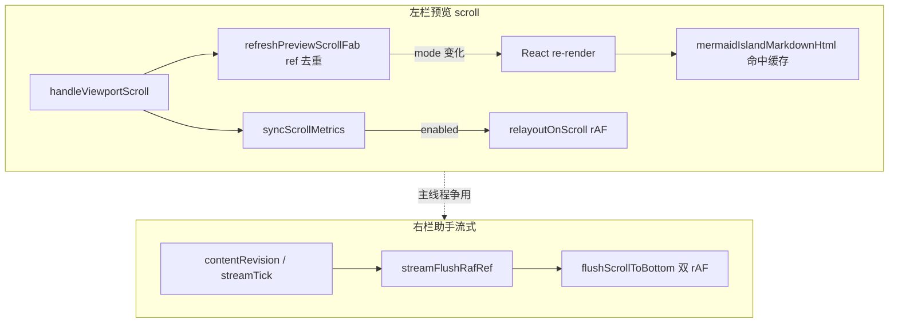

# 知识库长预览与助手同开滚动卡顿收敛

> **文档角色**：长/复杂 Markdown 预览滚动、预览+助手（尤其流式）主线程争用卡顿的**滚动层专项实现**（改动前后对比 + 逐行注释）。  
> **延伸阅读**：[../ideas/知识库滚动卡顿修复.md](../ideas/knowledge/知识库滚动卡顿修复.md)（**逐步解决手册**：问题→代码→意图→为何有效）、[知识预览代码工具条滚动.md](./知识预览代码工具条滚动.md)（**2026-07-28**：长文多代码块吸顶栏热路径减负）、[知识预览助手性能.md](../ideas/knowledge/知识预览助手性能.md)（SSE rAF 合并、消息列隔离、busy latch）、[../monaco/Markdown预览编辑滚动恢复.md](../monaco/Markdown预览编辑滚动恢复.md)（编辑↔预览滚动同步）、[知识编辑器长文本性能.md](./知识编辑器长文本性能.md)（长文 edit 停喂预览）。

---

## 1. 背景与目标

### 1.1 问题

知识库在**左栏 Markdown 预览**（含 Mermaid 岛屿布局的长文）与**右栏 AI/RAG 助手**同屏、且助手**流式输出**时，用户滚动预览或助手消息区会出现明显卡顿：

- 预览滚动时 FAB（置顶/置底角标）频繁 `setState`，触发整棵预览树 reconcile；
- Mermaid 岛屿布局下，每次 reconcile 会在 `fenceParts.map` 内**同步重跑** `parser.render`，主线程被 Markdown parse 占满；
- 助手侧 `useStickToBottomScroll` 每个 token（`contentRevision`）立即双 `rAF` 贴底，与预览 scroll 争用；
- 旧版 `useChatCodeFloatingToolbar` 在 `enableCodeFloatingToolbar=false` 时仍挂 resize/RO/layout effect，passive scroll 直调 `layoutChatCodeToolbars`，未真正「关闭」。

### 1.2 目标

| 目标 | 说明 |
|------|------|
| 滚动热路径零多余 render | FAB mode 不变时不 `setState` |
| 岛屿布局 parse 移出 render | 预计算 `mermaidIslandMarkdownHtml` |
| 助手贴底合并到每帧一次 | `streamFlushRafRef` 合并 `contentRevision` |
| 左栏 toolbar 可硬关 | hook `enabled` 门禁 + scroll rAF 合并 |
| 功能不变 | FAB、Mermaid、代码栏、贴底/打断、分屏开关行为与改前一致 |

---

## 2. 改动范围

| 路径 | 变更类型 |
|------|----------|
| `apps/frontend/src/components/design/Markdown/index.tsx` | FAB ref 去重、`mermaidIslandMarkdownHtml`、toolbar `enabled` 传参 |
| `apps/frontend/src/hooks/useChatCodeFloatingToolbar.tsx` | `enabled` 门禁、`relayoutOnScroll` rAF 合并、对外返回 scroll 版 relayout |
| `apps/frontend/src/hooks/useStickToBottomScroll.ts` | 流式 `contentRevision` rAF 合并贴底 |
| `apps/frontend/src/components/design/Monaco/index.tsx` | `enableCodeFloatingToolbar={!assistantRightPaneActive}`（调用方，未改 hook 语义） |
| `apps/frontend/src/components/design/Monaco/utils.ts` | `preferRatioWhenInvalid` 可选 API（热路径当前未强制启用） |

**未纳入本篇主 diff、但同主题相关**：[知识预览助手性能.md](../ideas/knowledge/知识预览助手性能.md) 中的 SSE MobX rAF、消息列 observer、busy latch 等。

---

## 3. 实现思路

### 3.1 根因对照

| # | 根因 | 表现 | 收敛手段 |
|---|------|------|----------|
| 1 | 预览 FAB 每次 scroll 都 `setPreviewScrollFabMode` | 滚动帧触发 React re-render；岛屿布局下 map 内重 parse | `previewScrollFabModeRef` 去重，mode 不变则跳过 setState |
| 1b | Mermaid 岛屿 `fenceParts.map` 内 inline `parser.render` | 任意父级 re-render（含 FAB）整篇重 parse | `useMemo` 预渲染 `mermaidIslandMarkdownHtml` |
| 2 | `useChatCodeFloatingToolbar` 无 `enabled`，仅调用方 early return | 助手同开时仍 RO/resize/layout 测 DOM | 全 effect `if (!enabled) return` |
| 2b | passive scroll + `onScroll` 同帧双调 `layoutChatCodeToolbars` | scroll 热路径布局翻倍 | `relayoutOnScroll` 单 rAF 合并 |
| 3 | 流式每个 token 触发 `useLayoutEffect` 双 rAF 贴底 | 与预览 scroll 抢主线程 | `streamFlushRafRef` 每帧最多一次 flush |
| 4 | **已回退** `content-visibility:auto` 于 `.markdown-body` 子节点 | 滚动时 `contain-intrinsic-size` 触发布局抖动，卡顿**加重** | 见 §5 |

### 3.2 架构（滚动层）



### 3.3 保留的有效优化（相对 FAILED 方案）

- FAB ref 去重 + 岛屿 HTML memo：**保留**（直接削减 render 与 parse）。
- Hook `enabled` + scroll rAF：**保留**（助手同开时左栏零 toolbar 布局）。
- 流式贴底 rAF 合并：**保留**（token 频率 → 帧频率）。
- Monaco `preferRatioWhenInvalid`：**保留为可选 API**，热路径未强制传参（曾尝试 scroll 路径强制比例跟滚，后简化为 FAB/memo 为主）。

---

## 4. 关键实现

### 4.1 `refreshPreviewScrollFab`（FAB mode 去重）

**对比范围**：`ParserMarkdownPreviewPane` 内 FAB 状态 + `refreshPreviewScrollFab` 回调（约 L119–144）。

**改动前** · `apps/frontend/src/components/design/Markdown/index.tsx`（基线，约 L119–141）

```typescript
	// 预览右下角置顶/置底 FAB 的展示模式（hidden / toTop / toBottom）
	const [previewScrollFabMode, setPreviewScrollFabMode] =
		useState<PreviewScrollCornerFabMode>('hidden');

	// 读取当前主题，供 Markdown 高亮与 Mermaid 暗色偏好使用
	const { theme } = useTheme();

	// 根据滚动视口位置刷新 FAB 应显示「置顶」还是「置底」
	const refreshPreviewScrollFab = useCallback(() => {
		// 功能关闭时直接隐藏 FAB
		if (!showPreviewScrollCornerFab) {
			// 每次调用都会 setState，即使已是 hidden 也会触发 re-render
			setPreviewScrollFabMode('hidden');
			// 提前返回，不再读 viewport 度量
			return;
		}
		// 取有效滚动容器（本地 ScrollArea 或父级嵌入 viewport）
		const vp = effectiveScrollViewportRef.current;
		// ref 尚未挂载到 DOM 时无法计算
		if (!vp) return;
		// 读取当前滚动位置与可滚范围
		const { scrollTop, scrollHeight, clientHeight } = vp;
		// 最大可滚距离 = 内容高 − 视口高
		const maxScroll = scrollHeight - clientHeight;
		// 几乎不可滚（≤4px）则隐藏 FAB
		if (maxScroll <= 4) {
			// 无条件 setState，滚动过程中可能反复触发 render
			setPreviewScrollFabMode('hidden');
			// 结束
			return;
		}
		// 距底 8px 内视为「已在底部」，显示「置顶」
		const threshold = 8;
		// 否则显示「置底」；每次 scroll 事件都会 setState（toTop/toBottom 间切换除外仍每帧可能 set）
		setPreviewScrollFabMode(
			scrollTop >= maxScroll - threshold ? 'toTop' : 'toBottom',
		);
	}, [showPreviewScrollCornerFab, effectiveScrollViewportRef]);
```

**改动后** · `apps/frontend/src/components/design/Markdown/index.tsx`（当前，约 L119–144）

```typescript
	// 预览右下角 FAB 模式；驱动 React 渲染的唯一 state
	const [previewScrollFabMode, setPreviewScrollFabMode] =
		useState<PreviewScrollCornerFabMode>('hidden');
	// 与 state 镜像的 ref：scroll 热路径先比对 ref，避免同 mode 重复 setState
	const previewScrollFabModeRef = useRef<PreviewScrollCornerFabMode>('hidden');

	// 主题上下文
	const { theme } = useTheme();

	// 刷新 FAB 模式；仅在 computed next !== ref 时 setState
	const refreshPreviewScrollFab = useCallback(() => {
		// 角标功能关闭
		if (!showPreviewScrollCornerFab) {
			// 仅当 ref 不是 hidden 时才写 state，避免无效 render
			if (previewScrollFabModeRef.current !== 'hidden') {
				// 同步 ref，后续 scroll 不再进入 setState 分支
				previewScrollFabModeRef.current = 'hidden';
				// 通知 React 隐藏 FAB
				setPreviewScrollFabMode('hidden');
			}
			// 结束
			return;
		}
		// 有效滚动 viewport
		const vp = effectiveScrollViewportRef.current;
		if (!vp) return;
		// 度量三元组
		const { scrollTop, scrollHeight, clientHeight } = vp;
		const maxScroll = scrollHeight - clientHeight;
		// 默认隐藏；可滚时再赋 toTop/toBottom
		let next: PreviewScrollCornerFabMode = 'hidden';
		// 可滚余量大于 4px 才展示 FAB
		if (maxScroll > 4) {
			// 贴底阈值 8px：近底 toTop，否则 toBottom
			next = scrollTop >= maxScroll - 8 ? 'toTop' : 'toBottom';
		}
		// mode 未变则直接返回，scroll 帧零 React 更新
		if (previewScrollFabModeRef.current === next) return;
		// 记录新 mode
		previewScrollFabModeRef.current = next;
		// 仅此一处触发 re-render
		setPreviewScrollFabMode(next);
	}, [showPreviewScrollCornerFab, effectiveScrollViewportRef]);
```

**变更摘要**：引入 `previewScrollFabModeRef` 做 mode 相等性短路；关闭 FAB 时亦避免重复 `hidden` setState。配合 §4.2，mode 变化触发的 re-render 不再连带 islands 重 parse。

---

### 4.2 `mermaidIslandMarkdownHtml`（纯新增 useMemo）

**对比范围**：岛屿布局下 markdown 段 HTML 预计算（约 L223–231）；纯新增，仅**改动后**块。

**改动后** · `apps/frontend/src/components/design/Markdown/index.tsx`（当前，约 L223–231）

```typescript
	/** 岛屿布局下预渲染 markdown 段 HTML，避免 scroll FAB setState 时整篇重 parse */
	const mermaidIslandMarkdownHtml = useMemo(() => {
		// 非岛屿布局（无 mermaid 段）走整篇 html useMemo，此处返回 null
		if (!hasMermaidIslandLayout) return null;
		// 与 fenceParts 同序：每段 markdown 预 render 一次
		return fenceParts.map((part) => {
			// mermaid 段由 MermaidFenceIsland 渲染，map 位填 null
			if (part.type !== 'markdown') return null;
			// 段内禁用 mermaid 占位，避免与岛组件重复
			const rawHtml = parser.render(part.text, { enableMermaid: false });
			// 校正 heading 行号属性（+ lineBase0）供目录/hash 跳转
			return shiftMarkdownPreviewHeadingLineAttrs(rawHtml, part.lineBase0);
		});
	}, [hasMermaidIslandLayout, fenceParts, parser]);
```

**渲染侧消费（改动后摘录）** · 同文件约 L408–420

```typescript
				fenceParts.map((part, i) => {
					if (part.type === 'markdown') {
						// 从 memo 数组按索引取 HTML，render 阶段零 parse
						const segmentHtml = mermaidIslandMarkdownHtml?.[i];
						// mermaid 位或空段跳过
						if (!segmentHtml) return null;
						return (
							<div
								key={`pv-${i}`}
								dangerouslySetInnerHTML={{
									// 注入预计算 HTML
									__html: segmentHtml,
								}}
							/>
						);
					}
					// ... mermaid 段 renderMermaidPreviewPart
				})
```

**改动前（render 内 inline parse，已删除）**：

```typescript
					if (part.type === 'markdown') {
						const rawHtml = parser.render(part.text, { enableMermaid: false });
						return (
							<div
								key={`pv-${i}`}
								dangerouslySetInnerHTML={{
									__html: shiftMarkdownPreviewHeadingLineAttrs(rawHtml, part.lineBase0),
								}}
							/>
						);
					}
```

**变更摘要**：parse 从 render 路径挪至 `useMemo`，依赖 `fenceParts`/`parser`；FAB 等触发的 re-render 仅复用缓存 HTML。

---

### 4.3 `useChatCodeFloatingToolbar` — `enabled` + scroll rAF 合并

**对比范围**：完整 `useChatCodeFloatingToolbar` 函数 + `UseChatCodeFloatingToolbarOptions` 新增字段。

**改动前** · `apps/frontend/src/hooks/useChatCodeFloatingToolbar.tsx`（基线，约 L17–137）

```typescript
export type UseChatCodeFloatingToolbarOptions = {
	/**
	 * Markdown / 消息等变化后补算吸顶条（`requestAnimationFrame` + `useLayoutEffect`）。
	 * 请传入稳定依赖（如 `[chatData]`、`[markdown]`），勿每次 render 新建数组。
	 */
	layoutDeps?: DependencyList;
	/**
	 * 为 true 时在滚动视口上额外挂 **passive** 的 `scroll` 监听，仅调用 `layoutChatCodeToolbars`。
	 * 与 React `onScroll` 互补（部分环境下需双通道才能保证跟手）；ChatBotView 等场景开启。
	 */
	passiveScrollLayout?: boolean;
	/** `passiveScrollLayout` 为 true 时，用于在会话切换等场景重绑 scroll 监听 */
	passiveScrollDeps?: DependencyList;
};

export function useChatCodeFloatingToolbar(
	viewportRef: RefObject<HTMLElement | null>,
	options?: UseChatCodeFloatingToolbarOptions,
): { relayout: () => void } {
	const layoutDeps = options?.layoutDeps ?? emptyDeps;
	const passiveScrollDeps = options?.passiveScrollDeps ?? emptyDeps;
	const passiveScrollLayout = options?.passiveScrollLayout ?? false;

	const relayout = useCallback(() => {
		layoutChatCodeToolbars(viewportRef.current);
	}, [viewportRef]);

	useEffect(() => {
		chatCodeFloatingToolbarHookMountCount += 1;
		return () => {
			chatCodeFloatingToolbarHookMountCount -= 1;
			if (chatCodeFloatingToolbarHookMountCount <= 0) {
				chatCodeFloatingToolbarHookMountCount = 0;
				layoutChatCodeToolbars(null);
			}
		};
	}, []);

	useEffect(() => {
		const onResize = () => layoutChatCodeToolbars(viewportRef.current);
		window.addEventListener('resize', onResize);
		return () => window.removeEventListener('resize', onResize);
	}, []);

	useEffect(() => {
		let ro: ResizeObserver | null = null;
		let cancelled = false;
		let raf = 0;

		const attach = () => {
			const el = viewportRef.current;
			if (!el || cancelled) return false;
			ro?.disconnect();
			ro = new ResizeObserver(() => relayout());
			ro.observe(el);
			return true;
		};

		if (!attach()) {
			let attempts = 0;
			const retry = () => {
				if (cancelled || attempts++ > 90) return;
				if (!attach()) raf = requestAnimationFrame(retry);
			};
			raf = requestAnimationFrame(retry);
		}

		return () => {
			cancelled = true;
			cancelAnimationFrame(raf);
			ro?.disconnect();
		};
		// eslint-disable-next-line react-hooks/exhaustive-deps
	}, [relayout, ...layoutDeps]);

	useEffect(() => {
		relayout();
		const id = requestAnimationFrame(() => relayout());
		return () => cancelAnimationFrame(id);
		// eslint-disable-next-line react-hooks/exhaustive-deps -- layoutDeps 由调用方传入
	}, [relayout, ...layoutDeps]);

	useLayoutEffect(() => {
		const el = viewportRef.current;
		if (!el) return;
		layoutChatCodeToolbars(el);
		const id = requestAnimationFrame(() => layoutChatCodeToolbars(el));
		return () => cancelAnimationFrame(id);
		// eslint-disable-next-line react-hooks/exhaustive-deps
	}, [relayout, ...layoutDeps]);

	useLayoutEffect(() => {
		if (!passiveScrollLayout) return;
		const vp = viewportRef.current;
		if (!vp) return;
		const onScroll = () => layoutChatCodeToolbars(vp);
		vp.addEventListener('scroll', onScroll, { passive: true });
		return () => vp.removeEventListener('scroll', onScroll);
		// eslint-disable-next-line react-hooks/exhaustive-deps
	}, [passiveScrollLayout, viewportRef, ...passiveScrollDeps]);

	return { relayout };
}
```

**改动后** · `apps/frontend/src/hooks/useChatCodeFloatingToolbar.tsx`（当前，约 L18–167）

```typescript
export type UseChatCodeFloatingToolbarOptions = {
	/**
	 * 为 false 时不挂监听、不测 layout（预览+助手等同屏争用场景关闭吸顶条）。
	 * 默认 true。
	 */
	enabled?: boolean;
	/**
	 * Markdown / 消息等变化后补算吸顶条（`requestAnimationFrame` + `useLayoutEffect`）。
	 * 请传入稳定依赖（如 `[chatData]`、`[markdown]`），勿每次 render 新建数组。
	 */
	layoutDeps?: DependencyList;
	/**
	 * 为 true 时在滚动视口上额外挂 **passive** 的 `scroll` 监听，仅调用 `layoutChatCodeToolbars`。
	 * 与 React `onScroll` 互补（部分环境下需双通道才能保证跟手）；ChatBotView 等场景开启。
	 */
	passiveScrollLayout?: boolean;
	/** `passiveScrollLayout` 为 true 时，用于在会话切换等场景重绑 scroll 监听 */
	passiveScrollDeps?: DependencyList;
};

export function useChatCodeFloatingToolbar(
	viewportRef: RefObject<HTMLElement | null>,
	options?: UseChatCodeFloatingToolbarOptions,
): { relayout: () => void } {
	const enabled = options?.enabled ?? true;
	const layoutDeps = options?.layoutDeps ?? emptyDeps;
	const passiveScrollDeps = options?.passiveScrollDeps ?? emptyDeps;
	const passiveScrollLayout = options?.passiveScrollLayout ?? false;
	const scrollLayoutRafRef = useRef(0);

	const relayout = useCallback(() => {
		if (!enabled) return;
		layoutChatCodeToolbars(viewportRef.current);
	}, [viewportRef, enabled]);

	/** scroll 热路径合并到单帧，避免 React onScroll + passive 双通道同帧双测 */
	const relayoutOnScroll = useCallback(() => {
		if (!enabled) return;
		if (scrollLayoutRafRef.current) return;
		scrollLayoutRafRef.current = requestAnimationFrame(() => {
			scrollLayoutRafRef.current = 0;
			layoutChatCodeToolbars(viewportRef.current);
		});
	}, [viewportRef, enabled]);

	useEffect(() => {
		return () => {
			if (scrollLayoutRafRef.current) {
				cancelAnimationFrame(scrollLayoutRafRef.current);
				scrollLayoutRafRef.current = 0;
			}
		};
	}, []);

	useEffect(() => {
		if (!enabled) return;
		chatCodeFloatingToolbarHookMountCount += 1;
		return () => {
			chatCodeFloatingToolbarHookMountCount -= 1;
			if (chatCodeFloatingToolbarHookMountCount <= 0) {
				chatCodeFloatingToolbarHookMountCount = 0;
				layoutChatCodeToolbars(null);
			}
		};
	}, [enabled]);

	useEffect(() => {
		if (!enabled) return;
		const onResize = () => layoutChatCodeToolbars(viewportRef.current);
		window.addEventListener('resize', onResize);
		return () => window.removeEventListener('resize', onResize);
	}, [enabled, viewportRef]);

	useEffect(() => {
		if (!enabled) return;
		let ro: ResizeObserver | null = null;
		let cancelled = false;
		let raf = 0;

		const attach = () => {
			const el = viewportRef.current;
			if (!el || cancelled) return false;
			ro?.disconnect();
			ro = new ResizeObserver(() => relayout());
			ro.observe(el);
			return true;
		};

		if (!attach()) {
			let attempts = 0;
			const retry = () => {
				if (cancelled || attempts++ > 90) return;
				if (!attach()) raf = requestAnimationFrame(retry);
			};
			raf = requestAnimationFrame(retry);
		}

		return () => {
			cancelled = true;
			cancelAnimationFrame(raf);
			ro?.disconnect();
		};
		// eslint-disable-next-line react-hooks/exhaustive-deps
	}, [enabled, relayout, ...layoutDeps]);

	useEffect(() => {
		if (!enabled) return;
		relayout();
		const id = requestAnimationFrame(() => relayout());
		return () => cancelAnimationFrame(id);
		// eslint-disable-next-line react-hooks/exhaustive-deps -- layoutDeps 由调用方传入
	}, [enabled, relayout, ...layoutDeps]);

	useLayoutEffect(() => {
		if (!enabled) return;
		const el = viewportRef.current;
		if (!el) return;
		layoutChatCodeToolbars(el);
		const id = requestAnimationFrame(() => layoutChatCodeToolbars(el));
		return () => cancelAnimationFrame(id);
		// eslint-disable-next-line react-hooks/exhaustive-deps
	}, [enabled, relayout, ...layoutDeps]);

	useLayoutEffect(() => {
		if (!enabled || !passiveScrollLayout) return;
		const vp = viewportRef.current;
		if (!vp) return;
		const onScroll = () => relayoutOnScroll();
		vp.addEventListener('scroll', onScroll, { passive: true });
		return () => vp.removeEventListener('scroll', onScroll);
		// eslint-disable-next-line react-hooks/exhaustive-deps
	}, [
		enabled,
		passiveScrollLayout,
		viewportRef,
		relayoutOnScroll,
		...passiveScrollDeps,
	]);

	return { relayout: relayoutOnScroll };
}
```

**Markdown 调用方（改动后）** · `apps/frontend/src/components/design/Markdown/index.tsx`（约 L300–306）

```typescript
	const { relayout: relayoutCodeToolbar } = useChatCodeFloatingToolbar(
		effectiveScrollViewportRef,
		{
			// 助手同开时 Monaco 传 false：hook 内零监听零 layout
			enabled: enableCodeFloatingToolbar,
			// 正文变化仍驱动非 scroll 路径 relayout（enabled 时）
			layoutDeps: [markdown],
		},
	);
```

**变更摘要**：`enabled=false` 时 hook 完全不工作；对外 `relayout` 改为 scroll 合并版 `relayoutOnScroll`，与 `syncScrollMetrics` 同帧最多 layout 一次。改动前 Markdown 用 `options ? { layoutDeps } : undefined` 传参，hook 仍挂载全局 effect。

---

### 4.4 `useStickToBottomScroll` 流式贴底合并

**对比范围**：`streamFlushRafRef` 声明 + 卸载清理 + 流式 `useLayoutEffect`（约 L97–115、L224–243）。

**改动前** · `apps/frontend/src/hooks/useStickToBottomScroll.ts`（基线，约 L224–236）

```typescript
	useLayoutEffect(() => {
		// 非流式不由此 effect 贴底
		if (!isStreaming) return;
		// 用户已打断跟底则跳过
		if (!stickToBottomRef.current) return;
		// 标记：随后 programmatic scroll 不应被 onScroll 误判为用户上滑
		suppressStickFromViewportScrollRef.current = true;
		// 立即滚到物理底部
		flushScrollToBottom();
		// 下一帧再滚一次，覆盖图片/Mermaid 晚一拍撑高
		requestAnimationFrame(() => {
			// 仍跟底才二次 flush
			if (stickToBottomRef.current) {
				flushScrollToBottom();
			}
			// 再下一帧恢复 onScroll 正常判距
			requestAnimationFrame(() => {
				suppressStickFromViewportScrollRef.current = false;
			});
		});
	}, [contentRevision, isStreaming, flushScrollToBottom]);
```

**改动后** · `apps/frontend/src/hooks/useStickToBottomScroll.ts`（当前，约 L97–115、L224–243）

```typescript
	/** 流式 contentRevision 高频变化时合并为每帧最多一次贴底 */
	const streamFlushRafRef = useRef(0);

	useEffect(() => {
		return () => {
			if (streamFlushRafRef.current) {
				cancelAnimationFrame(streamFlushRafRef.current);
				streamFlushRafRef.current = 0;
			}
		};
	}, []);

	useLayoutEffect(() => {
		if (!isStreaming) return;
		if (!stickToBottomRef.current) return;
		// 合并同帧多次 revision，避免每 token 双 rAF 贴底抢主线程
		if (streamFlushRafRef.current) return;
		streamFlushRafRef.current = requestAnimationFrame(() => {
			streamFlushRafRef.current = 0;
			if (!stickToBottomRef.current) return;
			suppressStickFromViewportScrollRef.current = true;
			flushScrollToBottom();
			requestAnimationFrame(() => {
				if (stickToBottomRef.current) {
					flushScrollToBottom();
				}
				requestAnimationFrame(() => {
					suppressStickFromViewportScrollRef.current = false;
				});
			});
		});
	}, [contentRevision, isStreaming, flushScrollToBottom]);
```

**变更摘要**：每个 token 触发的 effect 不再同步双 rAF，而是排队到下一 display frame；同帧内多次 `contentRevision` 仅执行一次贴底序列。`useAssistantScroll` 仍将 `streamTick` 作为 `contentRevision` 传入，行为语义不变。

---

## 5. 刻意不做 / 已回退

| 项 | 说明 |
|----|------|
| **`content-visibility: auto`** | 曾给 `.markdown-body` 子块加 `content-visibility` + `contain-intrinsic-size` 试图跳过屏外绘制；滚动时浏览器反复校验 intrinsic 尺寸 → **layout thrashing**，卡顿比改前更差，**已完全回退**，仓库无残留 CSS。 |
| **scroll 路径强制 `preferRatioWhenInvalid`** | `Monaco/utils.ts` 已暴露 `preferRatioWhenInvalid`，快照失效时仅比例跟滚；实测主瓶颈在 FAB parse 与 toolbar，热路径**未**默认开启，避免标题锚点同步精度回退。 |
| **debounce 重建 scroll 快照** | 曾考虑 scroll 时 debounce `buildMarkdownScrollSyncSnapshot`；与 edit↔preview 跟手冲突，未采用。 |
| **助手 busy 期间停更预览** | 属 [知识预览助手性能.md](../ideas/knowledge/知识预览助手性能.md) latch 范畴，本篇不重复。 |
| **预览 DOM 窗口化** | 2026-07-28 尝试：影响锚点/高度/既有预览逻辑且未解决卡顿 → **已回退**；长文多代码块改走吸顶栏热路径，见 [知识预览代码工具条滚动.md](./知识预览代码工具条滚动.md)。 |
| **纯预览一律卸 Monaco / 超大围栏跳过 hljs** | 同轮实测加重或收益不足 → **已回退**。 |

### 5.1 后续增量（2026-07-28）

长文 **持续滚动** 且含 **大量代码块** 时，瓶颈在 `layoutChatCodeToolbars` 每帧全文 query + 全量几何（本篇 S3/S4 已关助手侧左栏，但 **仅预览** 仍开吸顶）。专项实现见 **[知识预览代码工具条滚动.md](./知识预览代码工具条滚动.md)**（块列表缓存、二分定位、O(1) 清 pinned、隐藏态不 emit）。

---

## 6. 行为变化与兼容性

| 维度 | 变化 |
|------|------|
| FAB 展示 | 逻辑等价；滚动中 mode 不变时 UI 不变，**更少**中间帧闪烁 |
| Mermaid 岛屿 | HTML 与改前一致；仅计算时机从 render → memo |
| 左栏代码吸顶条 | 助手分屏时 `enableCodeFloatingToolbar=false`，**不显示**吸顶条（与 busy latch 意图一致） |
| 助手贴底 | 流式仍双 rAF 补滚，但频率降至 ≤60fps；用户上滑/滚轮打断语义不变 |
| 非流式 `idleFlushKey` | 未改 |
| API | `UseChatCodeFloatingToolbarOptions.enabled` 新增，默认 `true`，旧调用方无 breaking change |

---

## 7. 测试与回归建议

1. **长文 + Mermaid 预览滚动**：Knowledge 左栏 preview/split，含多个 mermaid 块；快速 flick 滚动，DevTools Performance 中 Scripting 应无连续 `MarkdownParser.render` 尖峰。
2. **FAB**：可滚文档底部/中部/顶部，角标 toTop/toBottom 切换正确；不可滚文档 FAB hidden。
3. **预览 + 助手同开 + 流式**：右栏 SSE 输出时长文左栏滚动，应明显优于改前；左栏无代码吸顶条。
4. **仅预览 / 分享页**：`enableCodeFloatingToolbar=true` 时代码块吸顶条仍跟 scroll；passive + onScroll 同帧仅一次 layout。
5. **助手贴底**：流式跟底、滚轮上滑打断、拖滚动条到底恢复；流式结束见 [助手流式结束滚动定位.md](./助手流式结束滚动定位.md)。
6. **edit↔preview 同步**：分屏滚动同步精度未因本篇退化（未启 `preferRatioWhenInvalid` 时与改前一致）。

---

## 8. 相关文档

| 文档 | 关系 |
|------|------|
| [知识预览助手性能.md](../ideas/knowledge/知识预览助手性能.md) | 同场景 **MobX/SSE/消息列/busy latch** 主文档 |
| [知识预览代码工具条滚动.md](./知识预览代码工具条滚动.md) | **长文多代码块**吸顶栏热路径（2026-07-28） |
| [../monaco/Markdown预览编辑滚动恢复.md](../monaco/Markdown预览编辑滚动恢复.md) | 编辑↔预览滚动快照与恢复 |
| [知识编辑器长文本性能.md](./知识编辑器长文本性能.md) | 长文纯 edit 停喂预览 |
| [助手流式结束滚动定位.md](./助手流式结束滚动定位.md) | 流式结束误滚底 |
| [知识库助手流式体验.md](./知识库助手流式体验.md) | 助手流式 UX |

---

若与仓库最新源码不一致，以源码为准。
