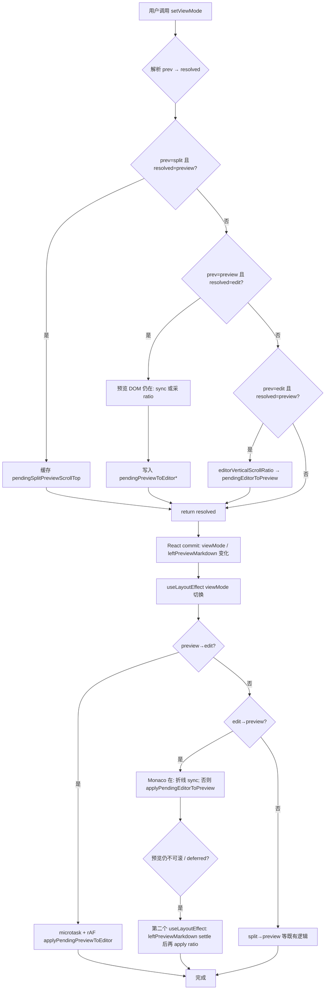

# Markdown 预览↔编辑滚动位置双向恢复

> **延伸阅读**：[Markdown视图面板滚动.md](./Markdown视图面板滚动.md)（全屏预览/编辑与助手 Panel 布局）、[Markdown分屏滚动同步.md](./Markdown分屏滚动同步.md)（分屏折线 sync 算法与工具函数）、[../knowledge/知识预览滚动卡顿.md](../knowledge/知识预览滚动卡顿.md)（知识库预览滚动卡顿与 deferred 策略）。

本文记录知识库 Markdown 编辑器在 **preview ↔ edit** 全屏切换时，如何 **双向恢复纵向阅读位置**，并在 **右侧 AI 助手同开**（Monaco 卸载、预览 deferred）时仍尽量对齐。

---

## 1. 背景与目标

### 1.1 场景

知识库左栏 Monaco 支持三种主视图：`edit`（纯编辑）、`preview`（纯预览）、`split`（分屏）。用户常在 **预览读完一段后切回编辑**，或 **编辑中途切到预览核对排版**。期望切换后视口仍停留在相近阅读位置，而非跳回文首。

### 1.2 根因一：preview → edit 在 layout 时预览已被清空

纯编辑态为性能将 `leftPreviewMarkdown` 设为 `''`，避免长文每键重解析：

```695:696:apps/frontend/src/components/design/Monaco/index.tsx
	const leftPreviewMarkdownRaw =
		viewMode === 'preview' || viewMode === 'split' ? (value ?? '') : '';
```

旧实现在 `useLayoutEffect` 里才调用 `syncEditorScrollFromMarkdownPreview(ed, vp, …)`。此时 React 已提交 `viewMode === 'edit'`，左栏预览 DOM **正文为空、高度坍缩**，sync 读到空 viewport，编辑器被 **`setScrollTop(0)` 顶到文首**。

### 1.3 根因二：edit → preview 在助手同开时 Monaco 已卸载 + 预览 deferred

当 `assistantRightPaneActive && viewMode === 'preview'` 时，`unmountEditorInPreviewWithAssistant` 为真，Monaco 不参与 layout；`leftPreviewMarkdown` 还可能走 `useDeferredValue`，**晚一帧**才有可滚高度。旧实现在 layout effect 里要求 `ed?.getModel()` 与可滚 `vp` 同时存在，条件不满足则 **完全不写 scroll**，预览落在文首。

### 1.4 目标

1. **preview → edit**：在 `setViewMode` **应用 state 之前**（预览 DOM 仍有内容）采样目标 scroll，layout/mount 后写回 Monaco。
2. **edit → preview**：切换前缓存 `editorVerticalScrollRatio`；layout 时优先标题折线 sync；Monaco 已卸或预览尚不可滚时，用 **pending ratio** + 二次 effect 在正文 settle 后补写。
3. 不破坏既有 **split → preview** 的 `scrollTop` 拷贝，以及 **split 模式** 下的双向跟滚。

---

## 2. 改动范围

| 文件 | 改动摘要 |
|------|----------|
| `apps/frontend/src/components/design/Monaco/index.tsx` | 新增 3 个 pending ref；扩展 `setViewMode` 采样；新增 `applyPendingPreviewToEditorScroll` / `applyPendingEditorToPreviewScroll`；重写 viewMode 切换 `useLayoutEffect`；新增 deferred settle `useLayoutEffect`；换篇时清空 pending ref |
| `apps/frontend/src/components/design/Monaco/utils.ts` | **无改动**（复用已有 `editorVerticalScrollRatio`、`setPreviewVerticalScrollRatio`、`sync*Scroll*`） |

**纯新增 ref**（约 L378–388，`index.tsx`）：

- `pendingPreviewToEditorScrollTopRef`：preview→edit 时 Monaco 仍挂载，存绝对 `scrollTop`。
- `pendingPreviewToEditorScrollRatioRef`：preview→edit 且 Monaco 已卸（助手+preview），仅存预览侧垂直比例。
- `pendingEditorToPreviewScrollRatioRef`：edit→preview 切换前编辑器垂直比例，供预览可滚后写入。

---

## 3. 实现思路

核心模式：**capture（切换前采样）→ apply（layout / rAF / deferred 后写回）**。



**时序要点**：

- **采样必须在 `setViewModeState` updater 内**，早于 `leftPreviewMarkdownRaw` 因 `viewMode` 变 `'edit'` 而变 `''`。
- **写回分多拍**：`queueMicrotask` 等 DOM 挂载，`requestAnimationFrame` 等 Monaco layout，`leftPreviewMarkdown` 依赖的 effect 消化 deferred 后的可滚高度。

---

## 4. 关键实现（改动前/改动后）

### 4.1 setViewMode

`apps/frontend/src/components/design/Monaco/index.tsx` **改动前**（git HEAD，约 L452–465）

```typescript
// 定义切换 Markdown 视图模式的稳定回调，供底部栏与快捷键调用
const setViewMode = useCallback(
	// next 可以是目标模式字面量，也可以是 (prev) => next 的函数式更新
	(
		next: MarkdownViewMode | ((prev: MarkdownViewMode) => MarkdownViewMode),
	) => {
		// 在 setState 的 functional updater 里读取 prev，保证与并发批处理一致
		setViewModeState((prev) => {
			// 若传入函数则执行得到目标模式，否则直接使用 next
			const resolved = typeof next === 'function' ? next(prev) : next;
			// 从分屏切到全屏预览时，右栏预览是另一 DOM 实例，需记住分屏侧 scrollTop
			if (prev === 'split' && resolved === 'preview') {
				// 读取当前左栏（分屏时）预览视口的 scrollTop，缺省为 null
				pendingSplitPreviewScrollTopRef.current =
					previewViewportRef.current?.scrollTop ?? null;
			}
			// 返回新模式；preview→edit / edit→preview 在此版本无额外采样
			return resolved;
		});
	},
	// 无外部依赖，回调引用稳定
	[],
);
```

`apps/frontend/src/components/design/Monaco/index.tsx` **改动后**（约 L465–507）

```typescript
// 定义切换 Markdown 视图模式的稳定回调，并在 state 提交前完成滚动采样
const setViewMode = useCallback(
	// next 支持直接值或 functional updater
	(
		next: MarkdownViewMode | ((prev: MarkdownViewMode) => MarkdownViewMode),
	) => {
		// functional updater：在本帧 React 仍认为 prev 为旧 mode 时运行采样逻辑
		setViewModeState((prev) => {
			// 解析本次目标 viewMode
			const resolved = typeof next === 'function' ? next(prev) : next;
			// split→preview：保留既有分屏预览 scrollTop 拷贝逻辑
			if (prev === 'split' && resolved === 'preview') {
				// 从分屏预览视口读取 scrollTop 供全屏 preview 恢复
				pendingSplitPreviewScrollTopRef.current =
					previewViewportRef.current?.scrollTop ?? null;
			}
			// 须在本帧清空 leftPreviewMarkdown 之前采样，否则 sync 读到空预览会把编辑器顶到顶
			// preview→edit：必须在 leftPreviewMarkdown 变 '' 之前采样
			if (prev === 'preview' && resolved === 'edit') {
				// 当前 Monaco 实例（纯 preview 时可能因助手同开而为 null）
				const ed = editorRef.current;
				// 左栏预览滚动容器（此时尚有 Markdown 正文）
				const vp = previewViewportRef.current;
				// Monaco 仍挂载：走标题折线 sync，再取编辑器 scrollTop
				if (vp && ed?.getModel()) {
					// 丢弃旧快照，强制 sync 函数按当前 DOM 重建折线
					markdownScrollSyncSnapshotRef.current = null;
					// 根据预览 scrollTop 反推编辑器 scrollTop 并写入 ed（同步调用）
					syncEditorScrollFromMarkdownPreview(
						ed,
						vp,
						markdownScrollSyncSnapshotRef,
					);
					// 缓存绝对 scrollTop，layout 后 applyPendingPreviewToEditorScroll 写回
					pendingPreviewToEditorScrollTopRef.current = ed.getScrollTop();
					// 已有绝对 top，不再使用比例回退
					pendingPreviewToEditorScrollRatioRef.current = null;
				// 仅有预览 DOM、Monaco 已卸（助手+preview）：只能存预览垂直比例
				} else if (vp) {
					// 预览可滚区间高度
					const maxP = Math.max(0, vp.scrollHeight - vp.clientHeight);
					// 无 Monaco，不使用 scrollTop
					pendingPreviewToEditorScrollTopRef.current = null;
					// 不可滚则比例 0，否则 scrollTop/maxP
					pendingPreviewToEditorScrollRatioRef.current =
						maxP <= 0 ? 0 : vp.scrollTop / maxP;
				}
			}
			// 须在卸载 Monaco / deferred 清空前采样；layout 时编辑器可能已没了
			// edit→preview：在 Monaco 卸载前记下垂直阅读比例
			if (prev === 'edit' && resolved === 'preview') {
				// 纯编辑态下 Monaco 一定挂载（除非异常）
				const ed = editorRef.current;
				// 有 model 才读 scroll
				if (ed?.getModel()) {
					// 存 [0,1] 比例，供预览 deferred 可滚后 setPreviewVerticalScrollRatio
					pendingEditorToPreviewScrollRatioRef.current =
						editorVerticalScrollRatio(ed);
				}
			}
			// 提交新 viewMode，触发 leftPreviewMarkdown / 挂载树变化
			return resolved;
		});
	},
	// 仅通过 ref 读写，依赖数组仍为空
	[],
);
```

### 4.2 applyPendingPreviewToEditorScroll（纯新增）

`apps/frontend/src/components/design/Monaco/index.tsx` **改动后**（纯新增，约 L990–1017）

```typescript
// 将 setViewMode 时缓存的 preview→edit 滚动目标写回 Monaco（layout 后可能需再刷一次）
const applyPendingPreviewToEditorScroll = useCallback(
	// clearPending 为 true 时在成功写入后清空 ref，避免重复应用
	(clearPending = false) => {
		// 取当前 Monaco 实例
		const ed = editorRef.current;
		// 无编辑器或无 model 则无法写 scroll，告知调用方失败
		if (!ed?.getModel()) return false;
		// 优先使用的绝对 scrollTop（Monaco 切换前曾挂载时才有）
		const top = pendingPreviewToEditorScrollTopRef.current;
		// 回退：预览侧比例（Monaco 曾卸载时）
		const ratio = pendingPreviewToEditorScrollRatioRef.current;
		// 两者皆空表示无 pending，直接返回
		if (top == null && ratio == null) return false;
		// 先触发布局，保证 getContentHeight / getLayoutInfo 与可见区域一致
		applyEditorLayoutRef.current?.();
		// 抑制编辑器 scroll 监听回写预览，避免回声振荡
		suppressEditorScrollEchoRef.current = true;
		// 确保 suppress 标志在异常时也能清除
		try {
			// 有绝对 top 则直接 setScrollTop
			if (top != null) {
				ed.setScrollTop(top);
			// 否则用比例 × 当前最大可滚距离
			} else if (ratio != null) {
				// 视口高度等布局信息
				const layout = ed.getLayoutInfo();
				// 内容总高减视口高即为 maxScroll
				const maxEditor = Math.max(0, ed.getContentHeight() - layout.height);
				// 按比例还原 scrollTop
				ed.setScrollTop(ratio * maxEditor);
			}
			// 调用方要求一次性应用时清空 pending
			if (clearPending) {
				pendingPreviewToEditorScrollTopRef.current = null;
				pendingPreviewToEditorScrollRatioRef.current = null;
			}
		// 无论成败都恢复 scroll 回声抑制调度
		} finally {
			scheduleClearSuppressEditorEcho();
		}
		// 已成功尝试写入（即使 top/ratio 算出来与当前相同）
		return true;
	},
	// 依赖 suppress 清除调度器
	[scheduleClearSuppressEditorEcho],
);
```

### 4.3 applyPendingEditorToPreviewScroll（纯新增）

`apps/frontend/src/components/design/Monaco/index.tsx` **改动后**（纯新增，约 L1020–1038）

```typescript
// 将 edit→preview 缓存的垂直比例写回预览（正文 deferred / 异步增高后可能需再试）
const applyPendingEditorToPreviewScroll = useCallback(
	// clearPending 控制是否在成功后清空 ratio ref
	(clearPending = false) => {
		// edit→preview 时在 setViewMode 存入的编辑器垂直比例
		const ratio = pendingEditorToPreviewScrollRatioRef.current;
		// 左栏预览滚动容器
		const vp = previewViewportRef.current;
		// 无比例或无 DOM 则无法应用
		if (ratio == null || !vp) return false;
		// scrollHeight 尚未超过 clientHeight 说明正文未 layout 完，defer 到下次
		if (vp.scrollHeight <= vp.clientHeight) return false;
		// 抑制预览 scroll 监听回写编辑器
		suppressPreviewScrollEchoRef.current = true;
		try {
			// 按整篇比例设置 preview scrollTop（utils 内带 deadband）
			setPreviewVerticalScrollRatio(vp, ratio);
			// 一次性应用则清空 pending
			if (clearPending) {
				pendingEditorToPreviewScrollRatioRef.current = null;
			}
		} finally {
			scheduleClearSuppressPreviewEcho();
		}
		return true;
	},
	[scheduleClearSuppressPreviewEcho],
);
```

### 4.4 viewMode 切换 useLayoutEffect（滚动 sync）

`apps/frontend/src/components/design/Monaco/index.tsx` **改动前**（git HEAD，约 L945–1005）

```typescript
// ponytail: 左栏双挂载 + 分屏同款 sync；preview→edit 须在 focusEditor microtask 之后再跑一次
useLayoutEffect(() => {
	// 上一帧记录的 viewMode（effect 末尾会更新 prevViewModeRef）
	const prev = prevViewModeRef.current;
	// 未发生模式变化则跳过（同 mode 重渲染）
	if (prev === viewMode) return;
	// 封装一次 sync 尝试，供 sync 与 rAF 复用
	const runSync = () => {
		// Monaco 实例
		const ed = editorRef.current;
		// 预览视口
		const vp = previewViewportRef.current;
		// 旧逻辑：无 ed 或无 vp 直接 return，preview→edit 时 vp 已空导致顶到顶部
		if (!ed?.getModel() || !vp) return;
		// 刷新 Monaco layout
		applyEditorLayoutRef.current?.();
		// 清空折线快照，强制按当前 DOM 测量
		markdownScrollSyncSnapshotRef.current = null;
		// preview→edit：在 layout 阶段才 sync（此时 leftPreviewMarkdown 往往已 ''）
		if (prev === 'preview' && viewMode === 'edit') {
			suppressEditorScrollEchoRef.current = true;
			try {
				syncEditorScrollFromMarkdownPreview(
					ed,
					vp,
					markdownScrollSyncSnapshotRef,
				);
			} finally {
				scheduleClearSuppressEditorEcho();
			}
			return;
		}
		// edit→preview：要求 ed 与 vp 同时存在；助手同开 Monaco 卸则整段跳过
		if (prev === 'edit' && viewMode === 'preview') {
			suppressPreviewScrollEchoRef.current = true;
			try {
				syncPreviewScrollFromMarkdownEditor(
					ed,
					vp,
					markdownScrollSyncSnapshotRef,
				);
			} finally {
				scheduleClearSuppressPreviewEcho();
			}
			return;
		}
		// split→preview：应用此前缓存的 scrollTop
		if (prev === 'split' && viewMode === 'preview') {
			const top = pendingSplitPreviewScrollTopRef.current;
			pendingSplitPreviewScrollTopRef.current = null;
			if (top == null) return;
			const max = Math.max(0, vp.scrollHeight - vp.clientHeight);
			vp.scrollTop = Math.min(max, Math.max(0, top));
		}
	};
	// preview→edit：microtask + rAF 双跑 runSync（仍依赖 vp 有内容，已失效）
	if (prev === 'preview' && viewMode === 'edit') {
		queueMicrotask(() => {
			runSync();
			requestAnimationFrame(runSync);
		});
		return;
	}
	// 其他切换：立即 sync + 下一帧再 sync 一次
	runSync();
	requestAnimationFrame(runSync);
}, [
	viewMode,
	leftPreviewMarkdown,
	scheduleClearSuppressEditorEcho,
	scheduleClearSuppressPreviewEcho,
]);
```

`apps/frontend/src/components/design/Monaco/index.tsx` **改动后**（约 L1040–1116）

```typescript
// ponytail: 左栏双挂载 + 分屏同款 sync；preview→edit 用切换前缓存，勿对已清空的预览再 sync
useLayoutEffect(() => {
	// 切换前的 viewMode
	const prev = prevViewModeRef.current;
	// 无 mode 变化则不处理
	if (prev === viewMode) return;
	// 按切换方向执行 sync 或 pending apply
	const runSync = () => {
		// Monaco 编辑器
		const ed = editorRef.current;
		// 预览滚动容器
		const vp = previewViewportRef.current;
		// preview→edit：不再对 vp 做 sync，只写回 setViewMode 时缓存的 scroll
		if (prev === 'preview' && viewMode === 'edit') {
			// clearPending=false，留给 rAF 再刷一次并清空
			applyPendingPreviewToEditorScroll(false);
			return;
		}
		// edit→preview：Monaco 仍在且预览已可滚时用折线 sync，否则 ratio 回退
		if (prev === 'edit' && viewMode === 'preview') {
			// 助手同开时 Monaco 已卸：只能用切换前 ratio；否则优先标题折线 sync
			if (ed?.getModel() && vp && vp.scrollHeight > vp.clientHeight) {
				applyEditorLayoutRef.current?.();
				markdownScrollSyncSnapshotRef.current = null;
				suppressPreviewScrollEchoRef.current = true;
				try {
					syncPreviewScrollFromMarkdownEditor(
						ed,
						vp,
						markdownScrollSyncSnapshotRef,
					);
					// 折线 sync 成功，不再需要 pending ratio
					pendingEditorToPreviewScrollRatioRef.current = null;
				} finally {
					scheduleClearSuppressPreviewEcho();
				}
			} else {
				// vp 未增高或 ed 不存在：尝试用 pending ratio（可能仍 false，等 deferred effect）
				applyPendingEditorToPreviewScroll(false);
			}
			return;
		}
		// 以下分支需要 ed 与 vp（split→preview 等）
		if (!ed?.getModel() || !vp) return;
		applyEditorLayoutRef.current?.();
		markdownScrollSyncSnapshotRef.current = null;
		// split→preview：与改动前相同，拷贝分屏预览 scrollTop
		if (prev === 'split' && viewMode === 'preview') {
			const top = pendingSplitPreviewScrollTopRef.current;
			pendingSplitPreviewScrollTopRef.current = null;
			if (top == null) return;
			const max = Math.max(0, vp.scrollHeight - vp.clientHeight);
			vp.scrollTop = Math.min(max, Math.max(0, top));
		}
	};
	// preview→edit：等 microtask 后 apply，再在 rAF 里 apply 并 clearPending
	if (prev === 'preview' && viewMode === 'edit') {
		queueMicrotask(() => {
			runSync();
			requestAnimationFrame(() => {
				applyPendingPreviewToEditorScroll(true);
			});
		});
		return;
	}
	// edit→preview：双帧 runSync + 最终 clearPending 的 ratio apply
	if (prev === 'edit' && viewMode === 'preview') {
		queueMicrotask(() => {
			runSync();
			requestAnimationFrame(() => {
				runSync();
				applyPendingEditorToPreviewScroll(true);
			});
		});
		return;
	}
	// 其他 mode 切换（如 split 相关）：立即 + rAF 各跑一次
	runSync();
	requestAnimationFrame(runSync);
}, [
	viewMode,
	leftPreviewMarkdown,
	applyPendingPreviewToEditorScroll,
	applyPendingEditorToPreviewScroll,
	scheduleClearSuppressPreviewEcho,
]);
```

### 4.5 deferred 消化 pending ratio 的 useLayoutEffect（纯新增）

`apps/frontend/src/components/design/Monaco/index.tsx` **改动后**（纯新增，约 L1118–1130）

```typescript
// deferred / 异步渲染后预览才可滚：mode 已是 preview 时仍需消化 pending ratio
useLayoutEffect(() => {
	// 仅全屏预览态需要把 edit 侧比例写到左栏预览
	if (viewMode !== 'preview') return;
	// 无 pending 说明已在主 effect 中通过折线 sync 完成
	if (pendingEditorToPreviewScrollRatioRef.current == null) return;
	// leftPreviewMarkdown 仍空表示 deferred 尚未提交正文，等待下次依赖变化
	if (!leftPreviewMarkdown) return;
	// 封装「尝试 apply，失败则下一帧再试」
	const tryApply = () => {
		// scrollHeight 已大于 clientHeight 时 apply 并 clearPending
		if (applyPendingEditorToPreviewScroll(true)) return;
		// 仍不可滚：等下一帧 layout 后再试一次
		requestAnimationFrame(() => {
			applyPendingEditorToPreviewScroll(true);
		});
	};
	// 让 DOM 先完成本轮 commit 再读 scrollHeight
	queueMicrotask(tryApply);
}, [viewMode, leftPreviewMarkdown, applyPendingEditorToPreviewScroll]);
```

**换篇清空 pending**（改动后 `index.tsx` 约 L845–851，与 ref 新增配套）：

```typescript
// 换篇时重置编辑器滚动与预览锚点缓存，避免 Monaco / 分屏跟滚沿用上一篇位置
useLayoutEffect(() => {
	markdownScrollSyncSnapshotRef.current = null;
	pendingSplitPreviewScrollTopRef.current = null;
	pendingPreviewToEditorScrollTopRef.current = null;
	pendingPreviewToEditorScrollRatioRef.current = null;
	pendingEditorToPreviewScrollRatioRef.current = null;
	// ... 其余 scrollTop 归零逻辑不变
}, [documentIdentity]);
```

---

## 5. 行为变化与兼容性

| 切换路径 | 改动前 | 改动后 |
|----------|--------|--------|
| preview → edit（无助手） | 常跳文首 | 切换前折线 sync + pending top，layout/rAF 写回 |
| preview → edit（助手+preview，Monaco 卸） | 同左或随机 | 存预览 ratio，edit 挂载后按比例写 Monaco |
| edit → preview（无助手） | 折线 sync，一般正常 | 仍优先折线 sync；失败时有 ratio 回退 |
| edit → preview（助手同开） | 常跳文首 | setViewMode 采 ratio；deferred 正文就绪后第二个 effect 写入 |
| split → preview | scrollTop 拷贝 | **无行为变化** |
| split 双向跟滚 | 独立 scroll 监听 | **无行为变化**（本改动不修改 split 热路径） |
| 换文档 `documentIdentity` | 清零 scroll | 额外清零三个 pending ref |

**兼容性**：对外 props / API 无变更；仅内部 scroll 恢复时序变化。依赖既有 `suppress*Echo` 与 `scheduleClearSuppress*`，与分屏 sync 共用抑制机制。

---

## 6. 测试与回归建议

### 6.1 手动用例

1. **长文 preview → edit（助手关闭）**：预览滚到中部 → 切编辑 → 编辑器应落在相近段落，而非 `#` 标题。
2. **preview → edit（助手打开且当前为 preview）**：左栏仅预览、Monaco 卸载 → 切编辑 → Monaco 出现后在相同相对位置。
3. **edit → preview（助手关闭）**：编辑器滚到文末 → 切预览 → 预览视口在文末附近。
4. **edit → preview（助手打开）**：编辑态滚到 50% → 开预览 → 等待 deferred 一帧 → 预览比例约 50%。
5. **split → preview**：分屏预览滚到特定标题 → 全屏预览 → scrollTop 与分屏一致。
6. **换篇**：切换文档后 preview/edit 均应从顶部开始，无上一篇 pending 泄漏。

### 6.2 回归

- 分屏 **预览跟编辑 / 编辑跟预览 / 双向** 跟随仍流畅，无振荡。
- Markdown **TOC 哈希跳转**（见 `Markdown预览目录哈希导航.md`）不受 pending 覆盖。
- 助手 **流式输出** 时左栏预览 deferred 不引发反复 jump（pending 应在首次成功后 clear）。

---

## 7. 相关文档与代码索引

| 主题 | 路径 |
|------|------|
| 本文 | `docs/monaco/Markdown预览编辑滚动恢复.md` |
| 分屏折线 sync | `docs/monaco/Markdown分屏滚动同步.md` |
| 视图/助手布局 | `docs/monaco/Markdown视图面板滚动.md` |
| 知识库预览卡顿 | `docs/knowledge/知识预览滚动卡顿.md` |
| 主组件 | `apps/frontend/src/components/design/Monaco/index.tsx` |
| scroll 工具 | `apps/frontend/src/components/design/Monaco/utils.ts`（`editorVerticalScrollRatio`、`setPreviewVerticalScrollRatio`、`syncEditorScrollFromMarkdownPreview`、`syncPreviewScrollFromMarkdownEditor`） |

---

若与仓库最新源码不一致，以源码为准。
