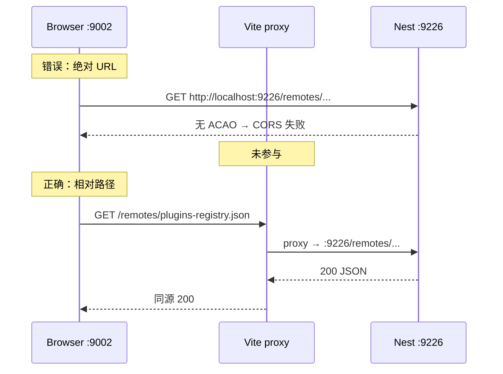

# 插件 Registry 静态分发（/remotes）与跨域策略

> **文档角色（主文档）**：本轮「插件注册表落在 `uploads/remotes`、经静态路径与 Vite/Nginx 同源代理对外、Web 避免 CORS」的实现说明。  
> **延伸阅读**：[../plugins/模块联邦插件宿主.md](../plugins/模块联邦插件宿主.md)（Host 动态加载）；[../english/学习笔记远程.md](../english/学习笔记远程.md)（学习笔记 Remote）；[上传存储路径.md](./上传存储路径.md)；[Nginx配置.md](./Nginx配置.md)；**第三方任意域名接入**：[../ideas/第三方联邦插件接入.md](../ideas/plugins/第三方联邦插件接入.md)。

---

## 1. 背景与目标

### 1.1 要解决什么问题

Module Federation Host（`:9002`）启动时需拉取插件清单（registry），再按清单里的 `entry`（如 `https://dnhyxc.cn:9008/mf-manifest.json`）加载 Remote。

早期若把 registry 写成**绝对地址**直连后端（如 `http://localhost:9226/remotes/plugins-registry.json`），在浏览器里会遇到：

1. **跨域**：页面 origin 是 `http://localhost:9002`（或 `https://dnhyxc.cn:9002`），资源在另一端口 → CORS。
2. **Vite proxy「不生效」**：proxy 只代理**打到 Vite 本机同源**的请求；浏览器直连 `9226` 时根本不会经过 `:9002` 的 proxy。
3. **运维一致性**：聊天附件已有 `/images`、`/files` 静态形态；registry 应对齐同一套「uploads 子目录 + 短路径」模型，便于 Nginx `alias` 与本地开发代理。

### 1.2 目标（逐点）

| #   | 目标                                                                      | 验收                                                      |
| --- | ------------------------------------------------------------------------- | --------------------------------------------------------- |
| 1   | 磁盘目录 `uploads/remotes/` 存放 `plugins-registry.json`                  | 文件存在且 JSON 合法                                      |
| 2   | Nest 在全局前缀前提供 `GET /remotes/:file`                                | `curl` 后端端口可取到 JSON                                |
| 3   | 备用 API：`GET /api/upload/remotes/:filename`（仅 `.json`）               | 非法名 / 非 json 返回 4xx                                 |
| 4   | Vite 开发：`proxy['/remotes']` → API 静态源站                             | `http://localhost:9002/remotes/plugins-registry.json` 200 |
| 5   | Web：fetch **相对路径** `/remotes/...`（同源）                            | DevTools Network 无跨域错误                               |
| 6   | Tauri：拼 `BASE_URL + /upload/remotes/...`（走已反代的 /api），平台 fetch | 桌面端可读 registry                                       |
| 7   | remotes **禁止缓存**（`no-store`）；images/files 仍 7d                     | 响应头 `Cache-Control` 符合预期；细节见 [远程无存储缓存.md](./远程无存储缓存.md) |
| 8   | Remote 的 `mf-manifest.json` **不**靠 Host 反代第三方                     | 各 Remote 源站自配 CORS（见 §7）                          |

---

## 2. 改动范围

| 路径                                                            | 说明                                                 |
| --------------------------------------------------------------- | ---------------------------------------------------- |
| `apps/backend/src/utils/upload-paths.ts`                        | 新增 `getUploadRemotesDir`                           |
| `apps/backend/src/main.ts`                                      | 启动时 `ensureUploadDir(remotes)`；注释含 `/remotes` |
| `apps/backend/src/middleware/serve-upload-static.middleware.ts` | 匹配 `/remotes`；`.json` MIME；`no-store`（见 [远程无存储缓存.md](./远程无存储缓存.md)） |
| `apps/backend/src/services/upload/upload-public.controller.ts`  | `GET remotes/:filename`                              |
| `apps/backend/uploads/remotes/plugins-registry.json`            | 清单数据（本机 entry 端口）                          |
| `apps/frontend/src/utils/upload-file-url.ts`                    | 导出 `getUploadStaticOrigin`                         |
| `apps/frontend/src/plugins/registry.ts`                         | **新增**：URL 策略 + fetch + localStorage 缓存       |
| `apps/frontend/vite.config.ts`                                  | `proxy['/remotes']`                                  |
| `apps/frontend/src/vite-env.d.ts`                               | registry / entry origins 环境变量类型                |
| `apps/frontend/.env`                                            | 可选 override 注释说明                               |

**非本篇**：Host `PluginManager` / MF Runtime → [../plugins/模块联邦插件宿主.md](../plugins/模块联邦插件宿主.md)。

---

## 3. 实现思路

### 3.1 目录与 URL 形态（对齐 /images）

```
磁盘：apps/backend/uploads/remotes/plugins-registry.json
URL ：{静态源站}/remotes/plugins-registry.json
备用：{API}/upload/remotes/plugins-registry.json   →  即 /api/upload/remotes/...
```

与图片相同：静态路径**不带** `/api` 前缀；由 `serveUploadStaticMiddleware` 在 `setGlobalPrefix('api')` **之前**挂载。

### 3.2 为何 Web 必须相对路径



生产 Web（Nginx `:9002`）同样应用：`location ^~ /remotes/ { alias .../uploads/remotes/; }`，前端仍请求同源 `/remotes/...`。

### 3.3 Registry 与 Remote entry 的职责分离

| 资源                                  | 谁提供                                        | CORS / 准入策略                                                                 |
| ------------------------------------- | --------------------------------------------- | ------------------------------------------------------------------------------- |
| `plugins-registry.json`               | 本站 uploads / Nginx alias                    | Web 同源代理 → **无需**跨域                                                     |
| `mf-manifest.json` / `remoteEntry.js` | **各 Remote 源站**（9005/9006/9008 或第三方） | 须放行 `https://dnhyxc.cn:9002` + **`tauri://localhost`**（见 §7）             |
| 第三方插件                            | 对方任意 HTTPS CDN/站点                       | **常规**：对方开 CORS；基座只改 registry。**勿**为每家改 Tauri capabilities   |

**不要**开放代理（`proxy_pass $arg_url`）。对方无法 CORS 时才用固定 upstream 的 `/mf-proxy/<id>/`（见 [Nginx配置.md](./Nginx配置.md)）。

### 3.4 安全边界（API 备用口）

`GET /api/upload/remotes/:filename`：

- 拒绝 `..`、`/`、`\`；
- **仅** `.json`（`ponytail:` 注释标明：避免 remotes 目录变成任意静态桶）；
- 短缓存 60s。

---

## 4. 关键实现（改动前 / 改动后对比 + 逐行注释）

### 4.1 `getUploadRemotesDir`（`apps/backend/src/utils/upload-paths.ts`）

**对比范围**：纯新增函数。基线中不存在。

**改动后** · `apps/backend/src/utils/upload-paths.ts`（新增，约 L99–L102）

```typescript
// JSDoc：说明磁盘子目录用途（插件 registry 等远程配置）
/** 插件 registry 等远程配置：uploads/remotes/ */
// 导出路径解析函数；默认 fromDirname 与其它 getUpload*Dir 一致
export function getUploadRemotesDir(fromDirname: string = __dirname): string {
	// 拼在 uploads 根下的 remotes 子目录，与 images/files/ebooks 并列
	return join(getUploadsRoot(fromDirname), "remotes");
}
```

**变更摘要**：新增 remotes 目录解析，供 `main.ts` 建目录与公开控制器读文件。

---

### 4.2 `bootstrap` 中 ensure remotes（`apps/backend/src/main.ts`）

**对比范围**：`bootstrap` 内 uploads 初始化片段（摘录，前后对称保留未改上下文切口）。

**改动前** · `apps/backend/src/main.ts`（基线）

```typescript
// 解析 uploads 根目录（本地 apps/backend/uploads 或线上 UPLOAD_ROOT）
const uploadsRoot = getUploadsRoot(__dirname);
// 旧注释：仅 images、files；须在 globalPrefix 之前挂载
// 须在 globalPrefix 之前：直接处理 /images、/files（解码中文文件名）
// 注册静态中间件，使 GET /images|/files 不进 Nest 全局前缀
app.use(serveUploadStaticMiddleware(uploadsRoot));
```

**改动后** · `apps/backend/src/main.ts`（当前）

```typescript
// 解析 uploads 根目录（与改动前相同）
const uploadsRoot = getUploadsRoot(__dirname);
// 启动时确保 remotes 目录存在，避免首次请求才 mkdir 的竞态
ensureUploadDir(getUploadRemotesDir(__dirname));
// 注释扩展：中间件同时处理 /remotes
// 须在 globalPrefix 之前：直接处理 /images、/files、/remotes（解码中文文件名）
// 注册同一静态中间件（现含 remotes 分支）
app.use(serveUploadStaticMiddleware(uploadsRoot));
```

**变更摘要**：启动建 `uploads/remotes`；中间件覆盖范围写入注释。

---

### 4.3 `serveUploadStaticMiddleware`（`apps/backend/src/middleware/serve-upload-static.middleware.ts`）

**对比范围**：全函数 `serveUploadStaticMiddleware`。

**改动前** · `apps/backend/src/middleware/serve-upload-static.middleware.ts`（基线）

```typescript
// MIME 映射：旧版无 .json（registry 尚未走此中间件）
const MIME_BY_EXT: Record<string, string> = {
	// JPEG
	".jpg": "image/jpeg",
	// JPEG 别名
	".jpeg": "image/jpeg",
	// PNG
	".png": "image/png",
	// GIF
	".gif": "image/gif",
	// WebP
	".webp": "image/webp",
	// PDF
	".pdf": "application/pdf",
};

// JSDoc：仅 images|files
/**
 * 在 Nest 全局前缀 / 其它中间件之前处理 GET /images|/files。
 * 解码 URL 中的中文文件名并与磁盘一致，避免 proxy+root 混配或仅编码路径导致 400/404。
 */
// 工厂：闭包绑定 uploadsRoot
export function serveUploadStaticMiddleware(uploadsRoot: string) {
	// 返回 Express 风格中间件
	return (req: Request, res: Response, next: NextFunction) => {
		// 仅处理读请求；POST 等交给后续
		if (req.method !== "GET" && req.method !== "HEAD") {
			// 非 GET/HEAD 继续管道
			return next();
		}

		// 仅匹配 /images|/files 下一层文件名
		const matched = req.path.match(/^\/(images|files)\/([^/]+)$/);
		// 不匹配则交给 Nest / 其它中间件
		if (!matched) {
			return next();
		}

		// 文件夹名收窄为 images | files
		const folder = matched[1] as "images" | "files";
		// 待解码文件名
		let filename: string;
		try {
			// URL 百分号解码，兼容中文名
			filename = decodeURIComponent(matched[2]);
		} catch {
			// 非法编码 → 400 空体结束
			res.status(400).end();
			return;
		}

		// 拒绝空名、路径穿越、嵌套路径
		if (!filename || filename.includes("..") || filename.includes("/")) {
			res.status(400).end();
			return;
		}

		// 拼绝对路径：uploadsRoot/folder/filename
		const absolutePath = join(uploadsRoot, folder, filename);
		// 文件不存在则 next（可落到 404 或其它处理器）
		if (!existsSync(absolutePath)) {
			return next();
		}

		// 按扩展名取 MIME
		const mime = MIME_BY_EXT[extname(absolutePath).toLowerCase()];
		if (mime) {
			// 设置 Content-Type
			res.setHeader("Content-Type", mime);
		}
		// CORP：允许跨源嵌入（图片场景）
		res.setHeader("Cross-Origin-Resource-Policy", "cross-origin");
		// 旧版统一 7 天长缓存
		res.setHeader("Cache-Control", "public, max-age=604800");
		// 发送文件；出错 next(err)
		res.sendFile(absolutePath, (err) => {
			if (err) {
				next(err);
			}
		});
	};
}
```

**改动后** · `apps/backend/src/middleware/serve-upload-static.middleware.ts`（当前，约 L5–L67）

```typescript
// MIME 映射：新增 .json 供 registry
const MIME_BY_EXT: Record<string, string> = {
	// JPEG
	".jpg": "image/jpeg",
	// JPEG 别名
	".jpeg": "image/jpeg",
	// PNG
	".png": "image/png",
	// GIF
	".gif": "image/gif",
	// WebP
	".webp": "image/webp",
	// PDF
	".pdf": "application/pdf",
	// JSON：registry 等，带 charset
	".json": "application/json; charset=utf-8",
};

// JSDoc：路径集合扩展为 images|files|remotes
/**
 * 在 Nest 全局前缀 / 其它中间件之前处理 GET /images|/files|/remotes。
 * 解码 URL 中的中文文件名并与磁盘一致，避免 proxy+root 混配或仅编码路径导致 400/404。
 */
// 工厂：闭包绑定 uploadsRoot
export function serveUploadStaticMiddleware(uploadsRoot: string) {
	// 返回 Express 风格中间件
	return (req: Request, res: Response, next: NextFunction) => {
		// 仅处理读请求
		if (req.method !== "GET" && req.method !== "HEAD") {
			return next();
		}

		// 正则增加 remotes 分支
		const matched = req.path.match(/^\/(images|files|remotes)\/([^/]+)$/);
		if (!matched) {
			return next();
		}

		// 类型联合含 remotes
		const folder = matched[1] as "images" | "files" | "remotes";
		let filename: string;
		try {
			filename = decodeURIComponent(matched[2]);
		} catch {
			res.status(400).end();
			return;
		}

		if (!filename || filename.includes("..") || filename.includes("/")) {
			res.status(400).end();
			return;
		}

		const absolutePath = join(uploadsRoot, folder, filename);
		if (!existsSync(absolutePath)) {
			return next();
		}

		const mime = MIME_BY_EXT[extname(absolutePath).toLowerCase()];
		if (mime) {
			res.setHeader("Content-Type", mime);
		}
		res.setHeader("Cross-Origin-Resource-Policy", "cross-origin");
		// remotes（registry）禁止缓存，避免桌面/代理继续吃旧版
		res.setHeader(
			// Cache-Control 头名
			"Cache-Control",
			// remotes：no-store（2026-07 起）；其余仍 7 天
			folder === "remotes"
				? "no-store, max-age=0, must-revalidate"
				: "public, max-age=604800",
		);
		res.sendFile(absolutePath, (err) => {
			if (err) {
				next(err);
			}
		});
	};
}
```

**变更摘要**：路径含 `/remotes`；JSON MIME；remotes 现为 `no-store`（完整对比见 [远程无存储缓存.md](./远程无存储缓存.md)）。

---

### 4.4 `UploadPublicController.serveRemote`（`apps/backend/src/services/upload/upload-public.controller.ts`）

**对比范围**：纯新增方法。基线中不存在。`serve` 方法仅扩展 MIME 表加 `.json`（与静态中间件一致）。

**改动后** · `apps/backend/src/services/upload/upload-public.controller.ts`（新增，约 L68–L102）

```typescript
// JSDoc：磁盘路径与双入口说明（静态优先、本接口备用）
/**
 * 插件 registry 等：磁盘 `uploads/remotes/:filename`
 * 首选静态：GET /remotes/plugins-registry.json（与 /images 同形态）
 * 本接口备用：GET /api/upload/remotes/plugins-registry.json
 */
// Nest 路由：GET upload/remotes/:filename（全局前缀后为 /api/upload/remotes/...）
@Get('remotes/:filename')
// 处理器：filename 来自路径参数；直接操作 Response
serveRemote(@Param('filename') filename: string, @Res() res: Response) {
	// 基础非法名校验（空、穿越、分隔符）
	if (
		!filename ||
		filename.includes('..') ||
		filename.includes('/') ||
		filename.includes('\\')
	) {
		// 统一中文错误文案 + 400
		throw new HttpException('非法文件名', HttpStatus.BAD_REQUEST);
	}
	// ponytail: 仅放行 json，避免 remote 目录被当成任意静态桶
	if (!filename.toLowerCase().endsWith('.json')) {
		throw new HttpException('仅支持 .json', HttpStatus.BAD_REQUEST);
	}

	// 解析 remotes 目录绝对路径
	const remotesDir = getUploadRemotesDir();
	// 不存在则创建
	ensureUploadDir(remotesDir);
	// 拼接目标文件
	const absolutePath = join(remotesDir, filename);
	// 缺失 → 404
	if (!existsSync(absolutePath)) {
		throw new HttpException('文件不存在', HttpStatus.NOT_FOUND);
	}

	// Content-Type：优先 MIME 表，否则默认 JSON UTF-8
	res.setHeader(
		'Content-Type',
		MIME_BY_EXT['.json'] ?? 'application/json; charset=utf-8',
	);
	// CORP 与静态中间件对齐
	res.setHeader('Cross-Origin-Resource-Policy', 'cross-origin');
	// 短缓存 60s
	res.setHeader('Cache-Control', 'no-store, max-age=0, must-revalidate');
	// 流式写出文件体
	createReadStream(absolutePath).pipe(res);
}
```

**变更摘要**：提供走 `/api` 反代的备用入口；强制 `.json`。

---

### 4.5 `getUploadStaticOrigin` 导出（`apps/frontend/src/utils/upload-file-url.ts`）

**对比范围**：函数声明可见性。

**改动前** · `apps/frontend/src/utils/upload-file-url.ts`（基线）

```typescript
// JSDoc：从 API 根推导静态源站
/** 从 API 根地址推导 uploads 静态资源源站（与 Nest useStaticAssets 同端口） */
// 模块内私有，仅本文件 resolveUploadedFileUrl 使用
function getUploadStaticOrigin(): string {
	// 去掉 BASE_URL 末尾 /api，得到 http://host:port
	return BASE_URL.replace(/\/api\/?$/, "");
}
```

**改动后** · `apps/frontend/src/utils/upload-file-url.ts`（当前，约 L5–L8）

```typescript
// JSDoc：不变
/** 从 API 根地址推导 uploads 静态资源源站（与 Nest useStaticAssets 同端口） */
// 导出：供 plugins/registry.ts（Tauri 拼绝对 registry URL）复用
export function getUploadStaticOrigin(): string {
	// 实现不变：剥离 /api 后缀
	return BASE_URL.replace(/\/api\/?$/, "");
}
```

**变更摘要**：导出供 registry 使用，避免重复解析 BASE_URL。

---

### 4.6 `registryUrl` / `fetchPluginRegistry`（`apps/frontend/src/plugins/registry.ts`）

**对比范围**：纯新增文件。基线中不存在整个 `src/plugins/` 目录。

**改动后** · `apps/frontend/src/plugins/registry.ts`（新增，全文逻辑单元）

```typescript
// API 根（含 /api），Tauri 拼备用口
import { BASE_URL } from "@/constants";
// 平台 fetch（Tauri 可走原生 HTTP）
import { getPlatformFetch } from "@/utils/fetch";
// 判断是否桌面壳
import { isTauriRuntime } from "@/utils/runtime";
// registry 类型
import type { PluginRegistry } from "./types";

// localStorage 键：按 prod/dev 分桶
const CACHE_KEY = `dnhyxc.plugin.registry.${import.meta.env.PROD ? "prod" : "dev"}.v1`;
// 统一相对路径常量
const REMOTE_REGISTRY_PATH = "/remotes/plugins-registry.json";

/**
 * - Web：相对路径 `/remotes/...`，走 Vite/Nginx 同源代理
 * - Tauri：`{API}/upload/remotes/...`（9112 已反代 /api；裸 /remotes 会落到 SPA HTML）
 */
// 解析最终请求 URL
function registryUrl(): string {
	// 环境变量覆盖：生产 / 开发各一把
	const override = (
		import.meta.env.PROD
			? import.meta.env.VITE_PROD_PLUGIN_REGISTRY_URL
			: import.meta.env.VITE_DEV_PLUGIN_REGISTRY_URL
	)?.trim();
	// 有覆盖则直接用（可为绝对 URL）
	if (override) return override;

	// 浏览器：相对路径 → Vite/Nginx 代理
	if (!isTauriRuntime()) {
		return REMOTE_REGISTRY_PATH;
	}

	// Tauri：走已反代的 /api/upload/remotes（勿直连 9112/remotes）
	const base = BASE_URL?.replace(/\/$/, "");
	if (!base) {
		throw new Error(
			"BASE_URL / VITE_*_API_DOMAIN 未配置，无法加载插件 registry",
		);
	}
	return `${base}/upload${REMOTE_REGISTRY_PATH}`;
}

// 读本地缓存；无效则 null
function readCache(): PluginRegistry | null {
	try {
		const cached = localStorage.getItem(CACHE_KEY);
		if (!cached) return null;
		const data = JSON.parse(cached) as PluginRegistry;
		// 空插件列表视为无效缓存
		if (!Array.isArray(data.plugins) || data.plugins.length === 0) return null;
		return data;
	} catch {
		return null;
	}
}

// 对外：拉取 registry，失败回退缓存或空表
export async function fetchPluginRegistry(opts?: {
	force?: boolean;
}): Promise<PluginRegistry> {
	let url: string;
	try {
		url = registryUrl();
	} catch (e) {
		console.warn("[plugins] registry url missing", e);
		return readCache() ?? { updatedAt: new Date(0).toISOString(), plugins: [] };
	}

	try {
		// 绝对 URL 用平台 fetch；相对路径用浏览器同源 fetch（走 proxy）
		const doFetch = /^https?:\/\//i.test(url)
			? await getPlatformFetch()
			: globalThis.fetch.bind(globalThis);
		const res = await doFetch(url, {
			cache: "no-store",
			...(opts?.force ? { headers: { "Cache-Control": "no-cache" } } : {}),
		});
		if (!res.ok) throw new Error(`registry ${res.status}`);
		const text = await res.text();
		let data: PluginRegistry;
		try {
			data = JSON.parse(text) as PluginRegistry;
		} catch {
			throw new Error(
				`registry not JSON (${url}): ${text.slice(0, 80).replace(/\s+/g, " ")}`,
			);
		}
		if (!Array.isArray(data.plugins)) {
			throw new Error("registry.plugins missing");
		}
		try {
			localStorage.setItem(CACHE_KEY, JSON.stringify(data));
		} catch {
			/* ignore */
		}
		return data;
	} catch (e) {
		console.warn("[plugins] registry fetch failed, using cache", e);
		return readCache() ?? { updatedAt: new Date(0).toISOString(), plugins: [] };
	}
}
```

**变更摘要**：Web 相对路径解决 CORS；Tauri 绝对地址；失败软降级缓存。

---

### 4.7 Vite `proxy['/remotes']`（`apps/frontend/vite.config.ts`）

**对比范围**：`server.proxy` 对象内新增键（与 `/images`、`/files` 并列）。

**改动前** · `apps/frontend/vite.config.ts`（基线 proxy 片段）

```typescript
// 开发服务器代理表
proxy: {
	// API 反代到 Nest
	'/api': {
		target: devApiProxyTarget,
		changeOrigin: true,
	},
	// 图片静态
	'/images': {
		target: devApiProxyTarget,
		changeOrigin: true,
	},
	// 文件静态
	'/files': {
		target: devApiProxyTarget,
		changeOrigin: true,
	},
	// COS 同源代理（未改逻辑，此处省略键体）
	// ...（未改动）cosProxyPathname
},
```

**改动后** · `apps/frontend/vite.config.ts`（当前，约 L109–L125）

```typescript
// 开发服务器代理表
proxy: {
	// API 反代到 Nest
	'/api': {
		target: devApiProxyTarget,
		changeOrigin: true,
	},
	// 图片静态
	'/images': {
		target: devApiProxyTarget,
		changeOrigin: true,
	},
	// 文件静态
	'/files': {
		target: devApiProxyTarget,
		changeOrigin: true,
	},
	// 插件 registry：与 images 同 target（去掉 /api 的 API 域名）
	'/remotes': {
		target: devApiProxyTarget,
		changeOrigin: true,
	},
	// COS 同源代理
	// ...（未改动）cosProxyPathname
},
```

**变更摘要**：仅当浏览器请求 `9002/remotes/...` 时代理生效。

---

## 5. 生产 Nginx（Host `:9002`）推荐片段

与 `/images/`、`/files/` 并列：

```nginx
location ^~ /remotes/ {
  alias /usr/local/dnhyxc-ai/server/uploads/remotes/;
  add_header Cross-Origin-Resource-Policy cross-origin;
  # 勿 expires 缓存；与后端一致禁止缓存 registry
  add_header Cache-Control "no-store, max-age=0, must-revalidate";
}
```

注意：`alias` 目录末尾 `/` 与 `location` 末尾 `/` 成对，避免路径拼接错误。

`proxy_pass` URL **禁止**写成 `https: //host`（冒号与 `//` 之间有空格会导致 `invalid number of arguments in "proxy_pass"`）。

---

## 6. 行为变化与兼容性

| 场景                   | 行为                                                                              |
| ---------------------- | --------------------------------------------------------------------------------- |
| Web Dev                | Network 见 `9002/remotes/plugins-registry.json`，经 Vite → Nest                   |
| Web Prod（已配 alias） | 同源 `/remotes/...` 由 Nginx 直出文件                                             |
| Tauri（含生产）        | `{VITE_*_API_DOMAIN}/upload/remotes/...`（9112 裸 `/remotes` 会落到 SPA，勿直连） |
| 旧绝对 URL 直连后端    | Web 会 CORS；勿再写死绝对地址（除非 override 且后端开 CORS）                      |
| images/files 缓存      | 仍 7 天，不受 remotes `no-store` 影响                                              |

---

## 7. Remote `mf-manifest.json` 跨域（与 registry 不同）

Host `:9002` fetch Remote `:9008/mf-manifest.json` **一定是跨 origin**（端口不同）。解决方式：

1. **推荐**：在 **各 Remote 源站**（如 9008）Nginx 用 `map` 放行 Host + Tauri 壳 origin（详见 [apps/remote-plugins/README.md](../plugins/插件开发指南.md)）：

```nginx
map $http_origin $mf_cors_origin {
  default "";
  "https://dnhyxc.cn:9002" $http_origin;
  "http://tauri.localhost"  $http_origin;  # Tauri 2 生产 WebView
  "https://tauri.localhost" $http_origin;
  "tauri://localhost"       $http_origin;
}
add_header Access-Control-Allow-Origin $mf_cors_origin always;
add_header Access-Control-Allow-Methods "GET, HEAD, OPTIONS" always;
# OPTIONS 预检 return 204 ...
```

只写 `9002` 时 Web 正常、桌面 `#RUNTIME-003` / `Origin tauri://localhost is not allowed`。

**策略优先级**（详见 [../ideas/第三方联邦插件接入.md](../ideas/plugins/第三方联邦插件接入.md)）：

| 优先级 | 场景 | 做法 |
|--------|------|------|
| 1（常规） | 受信第三方任意 HTTPS 域 | **对方** Nginx CORS（上表 Origin）+ registry 写对方 `entry`；Host **不发版**、**不加** capabilities |
| 2（兜底） | 对方无法开 CORS | 基座 Nginx `/mf-proxy/<id>/` 固定 upstream + `sub_filter`；registry 指代理 URL |
| 3 | 不可信 | `trust: 'untrusted'` → iframe，勿进 MF |

补充：

- Host MF 走 **WebView 原生** fetch/import，**不**用 `plugin-http` 拉第三方域 → capabilities 只服务 API/附件等。
- 准入以 **registry 上架** 为准（生产 entry 须 https）；`VITE_*_PLUGIN_ENTRY_ORIGINS` 已废弃，勿再按插件穷举。
- `/mf-proxy`：**禁止** `proxy_pass` 用户可控 URL。

本地 Vite Remote 可：`server: { cors: true }`。

**验收 curl（第三方与自建 Remote 均适用）**：

```bash
ENTRY=https://对方或自建域/mf-manifest.json
curl -sI "$ENTRY" -H "Origin: https://dnhyxc.cn:9002" | grep -i access-control-allow-origin
curl -sI "$ENTRY" -H "Origin: tauri://localhost" | grep -i access-control-allow-origin
```

---

## 8. 测试与回归建议

1. `curl -i http://localhost:9226/remotes/plugins-registry.json` → 200，`Content-Type` 含 json，`Cache-Control` 含 `no-store`。
2. 浏览器打开 Host Dev → Network 确认 registry 为 **9002** 同源，非 9226。
3. 改 registry 内容后约 1 分钟内或强制刷新可见（注意 localStorage 缓存键；`force: true` 仍可能先读网络）。
4. `curl` 备用：`/api/upload/remotes/plugins-registry.json`；请求 `foo.txt` → 400。
5. 生产：`https://dnhyxc.cn:9002/remotes/plugins-registry.json`；Remote CORS：双 Origin curl（§7）通过后，Web + Tauri 加载 `mf-manifest.json` 无 CORS 报错。
6. Nginx `-t`：确认无 `proxy_pass https: //` 空格笔误。
7. 第三方上架：只改 registry + 对方 CORS；确认未改 `capabilities/default.json`（见 ideas 接入文 §15）。

---

## 9. 相关源码路径

| 说明           | 路径                                                            |
| -------------- | --------------------------------------------------------------- |
| remotes 目录   | `apps/backend/uploads/remotes/`                                 |
| 路径工具       | `apps/backend/src/utils/upload-paths.ts`                        |
| 静态中间件     | `apps/backend/src/middleware/serve-upload-static.middleware.ts` |
| 公开 API       | `apps/backend/src/services/upload/upload-public.controller.ts`  |
| 前端拉取       | `apps/frontend/src/plugins/registry.ts`                         |
| Vite 代理      | `apps/frontend/vite.config.ts`                                  |
| 第三方接入手册 | `docs/ideas/第三方联邦插件接入.md`                |

---

（若与仓库最新源码不一致，以源码为准）
