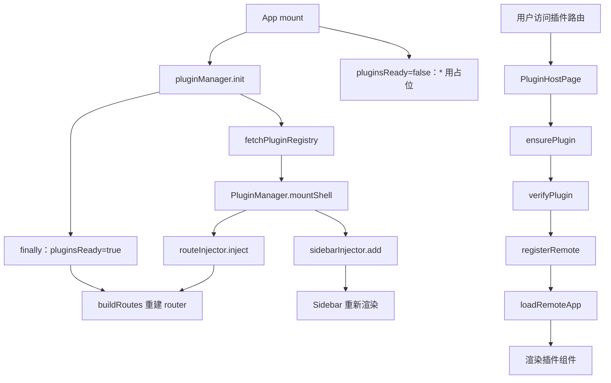
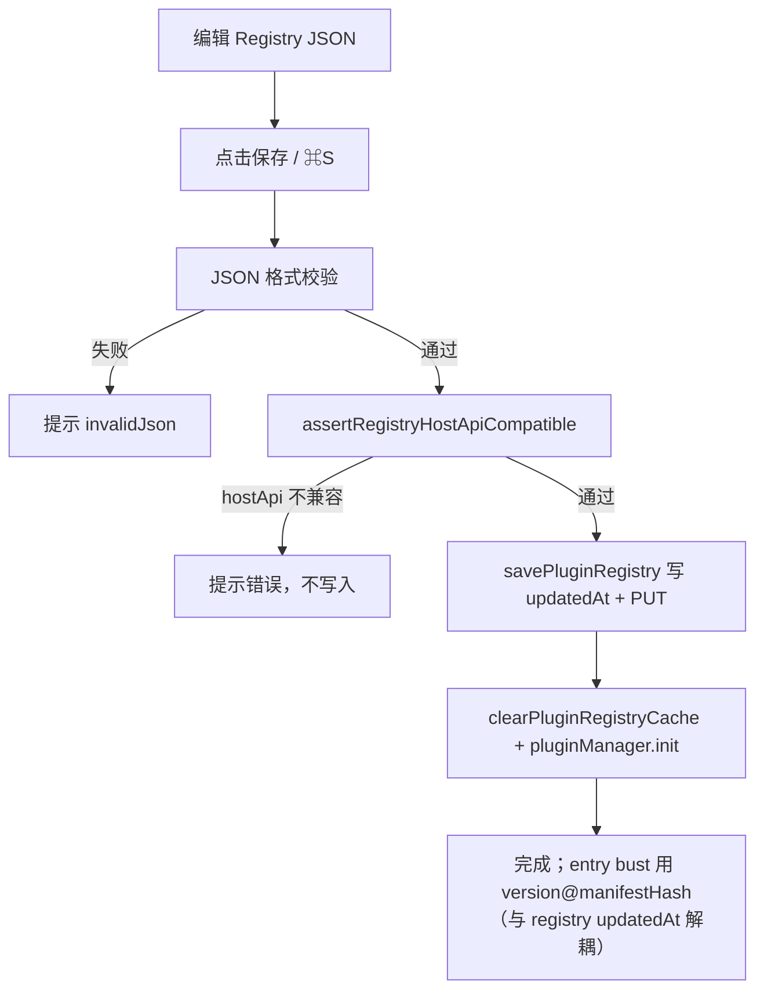
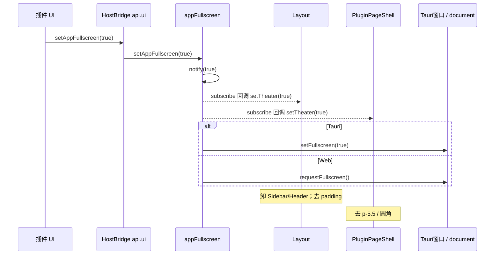

# 主项目接入子应用/插件使用手册

> **文档角色**：面向主项目开发者的插件接入实操手册，包含所有接入方式的具体代码和当前项目中的真实示例。
> **适用读者**：主项目前端开发者、需要在业务页面中接入插件的开发者。
> **目标**：帮助开发者清楚了解主项目如何接入、使用和管理插件。
> **同步说明**：与 `apps/frontend/src/plugins/**`、`apps/micro`（及 remote-demo 等）最新源码对齐（含 `api.locale`、iframe locale 推送、Host **`plugins/style-isolation/`（protocol/css/sandbox/portal）选择器前缀 `mf-iso:3`**——dev 认领排除 Host；**`data-mf-style-realm` + `data-plugin-root`；`html/body` 仅打插件根；全屏 portal-scope 打标；body remove/replace 镜像；HMR 仅 vite-id；`@/plugins` 自 `./style-isolation` 导出 realm/claim**；**Layout / `PluginPageShell` overflow 与 rounded 分层（backdrop-filter）**；Registry `title`/`description` locale map；**entry bust / afterResolve**；**勿 shared react-router**；保存 registry 校验 `hostApiRange`；remotes `no-store`；**应用级全屏 `api.ui.setAppFullscreen` + Layout 影院态**；**独立路由 `pageShell` / `PluginPageShell`**；侧栏 **`MENUS` + 动态项 + `PLUGINS`**；**刷新插件路由防闪 404（`pluginsReady` + catch-all 占位）**；App 根 **`data-mf-host-portal`**）。详解见本文 §11.3 / §15 / 附录 B；实现见 `模块联邦实现指南.md` §2.10.2 / §2.14。若不一致，以源码为准。

---

## 目录

1. [概述](#1-概述)
2. [插件系统核心架构](#2-插件系统核心架构)
3. [自动路由注入模式](#3-自动路由注入模式)
4. [业务内手动挂载模式](#4-业务内手动挂载模式)
5. [iframe 隔离模式接入](#5-iframe-隔离模式接入)
6. [电子书阅读页插件接入（完整示例）](#6-电子书阅读页插件接入完整示例)
7. [英语学习笔记页插件接入（完整示例）](#7-英语学习笔记页插件接入完整示例)
8. [插件中心管理页面](#8-插件中心管理页面)
9. [Registry 配置管理](#9-registry-配置管理)
10. [侧栏菜单动态注入](#10-侧栏菜单动态注入)
11. [路由系统与插件协同](#11-路由系统与插件协同)
    - 11.3 刷新子应用防闪 404
12. [插件状态管理](#12-插件状态管理)
13. [HostBridge API 提供](#13-hostbridge-api-提供)
14. [语言（locale）同步](#14-语言locale同步)
15. [应用级全屏与插件页外壳](#15-应用级全屏与插件页外壳)
16. [常见问题](#16-常见问题)

---

## 1. 概述

主项目（Host）通过 Module Federation 动态插件系统接入子应用/插件，支持三种接入模式：

| 接入模式           | 适用场景         | 特点                                        |
| ------------------ | ---------------- | ------------------------------------------- |
| **自动路由注入**   | 插件有独立页面   | PluginManager 自动注入路由和侧栏            |
| **业务内手动挂载** | 插件嵌入业务页面 | 开发者手动在业务页面中挂载 `PluginHostPage` |
| **iframe 隔离**    | 不可信插件       | 通过 iframe + postMessage 通信              |

---

## 2. 插件系统核心架构

### 2.1 核心模块关系

```
Host 应用
├── router/index.tsx          # App 组件：初始化插件系统
├── router/buildRoutes.ts     # 合并静态路由 + 动态插件路由
├── components/design/Sidebar # 侧栏：订阅插件菜单注入
├── plugins/
│   ├── index.ts              # 统一导出
│   ├── core/
│   │   ├── index.ts          # core 对内 barrel
│   │   ├── types/            # 类型 + locale 文案（HostLocale / PluginDescriptor…）
│   │   ├── runtime/          # PluginManager 生命周期 + PluginVerifier
│   │   ├── mf/               # Module Federation 加载 / normalize 模块
│   │   ├── bridge/           # HostBridge / Vue 桥 / iframe 桥
│   │   ├── registry/         # Registry 拉取/缓存/保存
│   │   └── enabled/          # 上架偏好、订阅、Host surface 列表
│   ├── inject/
│   │   ├── RouteInjector.ts     # 路由注入器
│   │   └── SidebarInjector.ts   # 侧栏注入器
│   ├── host/
│   │   ├── PluginHostPage.tsx   # 插件宿主（MF / iframe / locale；data-mf-style-realm；可选 pageShell）
│   │   ├── PluginPageShell.tsx  # 独立路由页统一边距；订阅影院态；圆角层无 overflow-hidden
│   │   └── PluginErrorBoundary.tsx # 错误边界
│   ├── style-isolation/         # 主子样式隔离（mf-iso:3；protocol/css/sandbox/portal 分层）
│   │   ├── index.ts             # 对外导出 + smoke 用 __styleIsolationTest
│   │   ├── protocol/            # realm 键、选择器契约、幂等判定
│   │   ├── css/                 # transpile + Host 主题 token 剥离
│   │   ├── sandbox/             # begin/attach 捕获、head/CSSOM、reclaim/HMR
│   │   └── portal/              # claim、scope DOM、body/createPortal 劫持
│   ├── host-api/
│   │   ├── EventBus.ts          # 事件总线
│   │   ├── ebookHostApi.ts      # 电子书模块 API
│   │   ├── appFullscreen.ts     # 应用级影院/全屏状态与 setAppFullscreen
│   │   └── deepFreeze.ts        # 深度冻结
│   ├── hooks/
│   │   └── usePluginEnabled.ts  # 插件启用状态 Hook
│   └── docs/                    # 本目录手册与专题
```

### 2.2 数据流



> **刷新防闪 404**：首屏在 `pluginsReady === false` 时，顶层 `*` 渲染占位而非 NotFound；init 注入动态路由并 `finally` 置 ready 后再决断真 404。详见 §11.3。

---

## 3. 自动路由注入模式

### 3.1 工作原理

当 Registry 中插件的 `injectRoute !== false` 时，PluginManager 会自动：

1. 注入顶层路由（`routePath`）
2. 注入侧栏菜单（如果有 `menu` 配置）
3. 用户访问路由时懒加载插件

### 3.2 Registry 配置示例

```json
{
	"id": "remoteDemo",
	"title": {
		"zh-CN": "插件演示",
		"en-US": "Plugin demo"
	},
	"description": {
		"zh-CN": "Module Federation 接入演示。",
		"en-US": "Module Federation demo."
	},
	"routePath": "/remote-demo",
	"entry": "http://127.0.0.1:9007/mf-manifest.json",
	"version": "1.0.0",
	"hostApiRange": "^1.0.0",
	"menu": {
		"order": 90,
		"icon": "Puzzle"
	},
	"permissions": ["ui:toast", "nav:subtree"],
	"enabled": true,
	"trust": "first-party"
}
```

> 插件中心标题、注入路由面包屑都读 `title` locale map；侧栏只显示 icon，不必也不应配置 `menu.nameKey` / Host i18n key。

**Vue Remote**：条目写 `"framework": "vue"`；Remote 导出 `mount(el, bridge)`（Host **不装 Vue**，只调 mount）；勿自建 React 桥、勿直接 export SFC。expose 须 `import '@/styles.css'`（见 [插件开发指南.md §4.3 / §5.2](./插件开发指南.md#43-vue-子应用)）。

### 3.3 自动注入的代码流程

**PluginManager.mountShell 方法**：

```typescript
private mountShell(meta: PluginDescriptor) {
	// 注入顶层路由（除非 injectRoute 显式设置为 false）
	if (meta.injectRoute !== false) {
		routeInjector.inject(meta.id, [createPluginRoute(meta)]);
	}

	// 如果有菜单配置，添加到侧栏
	if (meta.menu) {
		sidebarInjector.add({
			pluginId: meta.id,
			path: meta.routePath,
			nameKey: meta.id,
			icon: meta.menu.icon ?? 'Puzzle',
			order: meta.menu.order,
		});
	}
}
```

**PluginManager.createPluginRoute 方法**：

```typescript
function createPluginRoute(meta: PluginDescriptor): RouteConfig {
	const Page: ComponentType = () =>
		// pageShell: true → 套 PluginPageShell（统一边距）；业务内嵌挂载勿传
		createElement(PluginHostPage, { pluginId: meta.id, pageShell: true });
	return {
		path: meta.routePath,
		Component: Page,
		meta: {
			titleI18n: meta.title,
			title: meta.id,
		},
	};
}
```

### 3.4 路由合并

**buildRoutes.ts**：

```typescript
import { createElement } from 'react';
import { routeInjector } from '@/plugins';
import routes, { type RouteConfig } from './routes';

/** 插件壳未就绪时占住 `*`，避免刷新子项目路径先闪 404 */
function PluginRoutesPending() {
	return createElement('div', {
		className: 'h-full w-full bg-theme-background',
	});
}

/** @param pluginsReady - false：catch-all 用占位；true：真正 NotFound */
export function buildRoutes(pluginsReady = true): RouteConfig[] {
	const dynamic = routeInjector.getRoutes();
	const base = pluginsReady
		? routes
		: routes.map((route) =>
				route.path === '*'
					? { ...route, Component: PluginRoutesPending }
					: route,
			);

	if (dynamic.length === 0) return base;

	// 将动态路由挂到 Layout 壳的 children 末尾
	return base.map((route, index) => {
		if (index === 0 && route.children) {
			return {
				...route,
				children: [...route.children, ...dynamic],
			};
		}
		return route;
	});
}
```

> 刷新插件页闪 404 的完整思路见 §11.3；实现细节见 [模块联邦实现指南.md §2.11](./模块联邦实现指南.md#211-路由构建与初始化)。

### 3.5 不需要手动代码

自动路由注入模式下，**开发者无需在业务代码中写任何接入代码**，只需在 Registry 中配置插件即可。

---

## 4. 业务内手动挂载模式

### 4.1 适用场景

当插件需要嵌入到现有业务页面中时（如电子书阅读页中的想法列表、英语学习页中的笔记），使用此模式。

### 4.2 Registry 配置

```json
{
	"id": "ebookIdeas",
	"title": {
		"zh-CN": "全书想法",
		"en-US": "All ideas"
	},
	"description": {
		"zh-CN": "在 EPUB 阅读页浏览本书全部想法。",
		"en-US": "Browse all ideas for the current EPUB."
	},
	"routePath": "/ebook/plugins/ebook-ideas",
	"entry": "http://127.0.0.1:9008/mf-manifest.json",
	"version": "1.0.0",
	"hostApiRange": "^1.0.0",
	"remoteName": "remotePlugins",
	"expose": "./EbookIdeas",
	"injectRoute": false,
	"permissions": ["ui:toast", "http:plugin-api", "modules:ebook"],
	"enabled": true,
	"trust": "first-party"
}
```

### 4.3 业务页面接入代码

**关键：`injectRoute: false` + 在业务页面中手动挂载 `PluginHostPage`**

#### 4.3.1 使用 `PluginHostPage` 组件

```tsx
import { PluginHostPage, usePluginEnabled } from "@/plugins";

function MyBusinessPage() {
	// 检查插件是否上架（本地上架/下架覆盖 + Registry 缓存）
	const enabled = usePluginEnabled("myPlugin");

	return (
		<div>
			{/* 业务内容 */}
			{enabled ? <PluginHostPage pluginId="myPlugin" /> : <p>插件未上架</p>}
		</div>
	);
}
```

#### 4.3.2 `usePluginEnabled` Hook 实现

```typescript
import { useEffect, useState } from "react";
import {
	isPluginEnabled,
	subscribePluginEnabled,
} from "../core/enabled/enabledOverrides";

/** 订阅本地上架状态，用于业务入口条件渲染 */
export function usePluginEnabled(pluginId: string): boolean {
	const [enabled, setEnabled] = useState(() => isPluginEnabled(pluginId));

	useEffect(() => {
		const sync = () => setEnabled(isPluginEnabled(pluginId));
		sync();
		return subscribePluginEnabled(sync);
	}, [pluginId]);

	return enabled;
}
```

#### 4.3.3 `enabledOverrides.ts` 核心逻辑

```typescript
const OVERRIDES_KEY = "dnhyxc.plugin.enabledOverrides.v1";

/** 本地上架/下架覆盖（优先于 registry 磁盘 enabled） */
export function getEnabledOverrides(): Record<string, boolean> {
	try {
		const raw = localStorage.getItem(OVERRIDES_KEY);
		if (!raw) return {};
		const data = JSON.parse(raw) as Record<string, boolean>;
		return data && typeof data === "object" ? data : {};
	} catch {
		return {};
	}
}

export function setEnabledOverride(id: string, enabled: boolean) {
	const next = { ...getEnabledOverrides(), [id]: enabled };
	localStorage.setItem(OVERRIDES_KEY, JSON.stringify(next));
}

/** 同步判断插件是否上架：本地覆盖 > registry 缓存原始 enabled */
export function isPluginEnabled(id: string): boolean {
	const o = getEnabledOverrides();
	if (id in o) return o[id]!;
	try {
		const cacheKey = `dnhyxc.plugin.registry.${import.meta.env.PROD ? "prod" : "dev"}.v1`;
		const cached = localStorage.getItem(cacheKey);
		if (!cached) return false;
		const data = JSON.parse(cached) as PluginRegistry;
		const p = data.plugins?.find((x) => x.id === id);
		return p?.enabled ?? false;
	} catch {
		return false;
	}
}
```

---

## 5. iframe 隔离模式接入

### 5.1 适用场景

不可信插件（`trust: untrusted`），需要通过 iframe 隔离运行。

### 5.2 Registry 配置

```json
{
	"id": "thirdPartyPlugin",
	"title": {
		"zh-CN": "第三方插件",
		"en-US": "Third-party plugin"
	},
	"description": {
		"zh-CN": "第三方插件（iframe 隔离）",
		"en-US": "Third-party plugin (iframe isolation)"
	},
	"routePath": "/third-party",
	"entry": "https://example.com:9009/mf-manifest.json",
	"version": "1.0.0",
	"hostApiRange": "^1.0.0",
	"menu": {
		"order": 20,
		"icon": "ExternalLink"
	},
	"permissions": ["ui:toast", "http:plugin-api"],
	"enabled": true,
	"trust": "untrusted",
	"iframeUrl": "https://example.com:9009/embed/third-party"
}
```

### 5.3 Host 端 iframe 处理

**PluginManager.runLoad 方法中的 untrusted 处理**：

```typescript
private async runLoad(meta: PluginDescriptor) {
	// ...
	try {
		await verifyPlugin(meta);

		// untrusted：仅激活壳，由 PluginHostPage 渲染 iframe，不进 MF
		if (meta.trust === 'untrusted') {
			this.plugins.set(meta.id, {
				meta,
				bridge: createHostBridge(meta, nav),
				mod: { default: () => null },
				status: 'activated',
			});
			return;
		}
		// ...
	}
}
```

**PluginHostPage 中 iframe / MF 渲染**（与源码一致的关键路径）：

```tsx
// apps/frontend/src/plugins/host/PluginHostPage.tsx（摘录）
if (loaded?.status === 'activated') {
	if (loaded.meta.trust === 'untrusted') {
		const src = loaded.meta.iframeUrl?.trim();
		// 缺 iframeUrl → 展示 plugins.host.missingIframeUrl
		// iframe 语言靠 attachIframeBridge 的 init + onListen('locale')，勿传 liveBridge（避免重挂）
		return (
			<PluginErrorBoundary pluginId={pluginId}>
				<UntrustedIframe pluginId={pluginId} src={src} bridge={loaded.bridge} />
			</PluginErrorBoundary>
		);
	}
	// MF：withLiveLocale(bridge, locale) + data-mf-plugin 包装 + 样式隔离
	return (
		<PluginErrorBoundary pluginId={pluginId}>
			<div className={`plugin-${pluginId} h-full w-full`} data-mf-plugin={pluginId} data-plugin-root>
				<Comp {...liveBridge} />
			</div>
		</PluginErrorBoundary>
	);
}
```

`UntrustedIframe` 在 `useEffect` 里调用 `attachIframeBridge(el, bridge, origin)`；sandbox 为  
`allow-scripts allow-same-origin allow-forms allow-popups`。

### 5.4 iframe Bridge 通信

**协议 channel**：`dnhyxc-mf-iframe`

| type | 方向 | 载荷 | 用途 |
|------|------|------|------|
| `ready` | iframe → Host | `{ pluginId }` | 握手；Host 回 `init` |
| `init` | Host → iframe | `{ theme, locale, plugin }` | 初始上下文 |
| `locale` | Host → iframe | `{ locale }` | Host 顶栏语言热更新 |
| `rpc` | iframe → Host | `{ id, method, args }` | 能力调用 |
| `rpc-result` | Host → iframe | `{ id, ok, value?/error? }` | RPC 响应 |

**RPC 白名单**：`http.get|post|put|delete`、`ui.showToast`、`ebook.getBookId|getBookTitle|navigateToCfi|openThought|closeIdeasList`  
（是否真正可用仍取决于 bridge 上 permissions 是否注入了对应能力）

```typescript
// apps/frontend/src/plugins/core/bridge/attachIframeBridge.ts（摘录）
export function attachIframeBridge(
	iframe: HTMLIFrameElement,
	bridge: HostBridgeProps,
	targetOrigin: string,
): () => void {
	const sendInit = () => {
		iframe.contentWindow?.postMessage(
			{
				channel: MF_IFRAME_CHANNEL,
				type: 'init',
				theme: bridge.api.theme,
				locale: getActiveLocale(),
				plugin: bridge.plugin,
			},
			targetOrigin,
		);
	};
	// onListen('locale') → postMessage { type: 'locale', locale }
	// ready → sendInit；rpc → dispatchRpc → rpc-result
	// ...
}
```

---

## 6. 电子书阅读页插件接入（完整示例）

### 6.1 业务场景

在电子书阅读页（`/ebook/:bookId`）的右侧面板中，通过 Tab 切换显示插件内容（如想法列表）。

### 6.2 完整代码

**文件路径**：`apps/frontend/src/views/ebook/read.tsx`

```tsx
/**
 * 电子书阅读页（简化版）
 * - 左侧：电子书渲染区域
 * - 右侧：Tab 面板（目录/想法列表/AI 助手）
 * - 想法列表通过 PluginHostPage 接入 MF 插件
 */
import { useCallback, useEffect, useRef, useState } from "react";
import { useParams } from "react-router";
import { useI18n } from "@/hooks";
import { PluginHostPage, usePluginEnabled } from "@/plugins";
import { getEbookBook, saveEbookProgress } from "@/service";
import { setEbookHostHandlers } from "@/plugins/host-api/ebookHostApi";

export default function EbookReadPage() {
	const { t } = useI18n();
	const { bookId } = useParams<{ bookId: string }>();

	// 电子书相关状态
	const [book, setBook] = useState<EbookBookDetail | null>(null);
	const [activeTab, setActiveTab] = useState<"toc" | "ideas" | "ai">("toc");
	const [currentCfi, setCurrentCfi] = useState("");

	// 想法列表插件上架状态
	const ideasEnabled = usePluginEnabled("ebookIdeasList");

	// 加载书籍信息
	useEffect(() => {
		if (!bookId) return;
		getEbookBook(bookId).then(setBook);
	}, [bookId]);

	// 注册电子书 Host API（供插件调用）
	useEffect(() => {
		if (!bookId) return;
		setEbookHostHandlers({
			getBookId: () => bookId,
			getBookTitle: () => book?.title ?? null,
			navigateToCfi: (cfi: string) => {
				setCurrentCfi(cfi);
				// 实际导航到 CFI 位置...
			},
			openThought: (thought) => {
				// 打开想法详情...
				console.log("打开想法:", thought);
			},
			closeIdeasList: () => {
				setActiveTab("toc");
			},
		});
		return () => setEbookHostHandlers(null);
	}, [bookId, book]);

	// 保存阅读进度
	const handleProgressChange = useCallback(
		(cfi: string, percent: number) => {
			if (!bookId) return;
			saveEbookProgress({
				bookId,
				epubCfi: cfi,
				percent,
			});
		},
		[bookId],
	);

	return (
		<div className="flex h-full w-full">
			{/* 左侧：电子书渲染区域 */}
			<div className="flex-1 min-h-0">
				<EbookRenderer
					bookId={bookId}
					currentCfi={currentCfi}
					onProgressChange={handleProgressChange}
				/>
			</div>

			{/* 右侧：Tab 面板 */}
			<div className="w-80 border-l border-theme-border flex flex-col">
				{/* Tab 切换 */}
				<div className="flex border-b border-theme-border">
					<button
						className={cn(
							"flex-1 py-2 text-sm",
							activeTab === "toc" && "text-theme border-b-2 border-theme",
						)}
						onClick={() => setActiveTab("toc")}
					>
						{t("ebook.toc")}
					</button>
					<button
						className={cn(
							"flex-1 py-2 text-sm",
							activeTab === "ideas" && "text-theme border-b-2 border-theme",
						)}
						onClick={() => setActiveTab("ideas")}
					>
						{t("ebook.ideas")}
					</button>
					<button
						className={cn(
							"flex-1 py-2 text-sm",
							activeTab === "ai" && "text-theme border-b-2 border-theme",
						)}
						onClick={() => setActiveTab("ai")}
					>
						AI
					</button>
				</div>

				{/* Tab 内容 */}
				<div className="flex-1 min-h-0 overflow-auto">
					{activeTab === "toc" && <EbookToc bookId={bookId} />}

					{/* 想法列表：通过 PluginHostPage 接入 MF 插件 */}
					{activeTab === "ideas" &&
						(ideasEnabled ? (
							<PluginHostPage pluginId="ebookIdeasList" />
						) : (
							<div className="p-4 text-sm text-textcolor/55">
								{t("plugins.host.delisted")}
							</div>
						))}

					{activeTab === "ai" && <EbookAIAssistant bookId={bookId} />}
				</div>
			</div>
		</div>
	);
}
```

### 6.3 关键接入点

| 接入点        | 代码                                           | 说明               |
| ------------- | ---------------------------------------------- | ------------------ |
| 插件状态检查  | `usePluginEnabled('ebookIdeasList')`           | 检查插件是否上架   |
| 插件渲染      | `<PluginHostPage pluginId="ebookIdeasList" />` | 挂载插件组件       |
| Host API 注册 | `setEbookHostHandlers({...})`                  | 注册电子书相关 API |
| 权限配置      | `permissions: ["modules:ebook"]`               | 插件需要此权限     |

### 6.4 电子书 Host API 实现

**文件路径**：`apps/frontend/src/plugins/host-api/ebookHostApi.ts`

```typescript
export type EbookHostThought = {
	id: string;
	userId: number | string;
	cfiRange: string;
	quote: string;
	content: string;
	username?: string;
	avatar?: string;
	createdAt?: string;
	updatedAt?: string;
	isPublic?: boolean;
};

export type EbookHostHandlers = {
	getBookId: () => string | null;
	getBookTitle: () => string | null;
	navigateToCfi: (cfi: string) => void | Promise<void>;
	openThought: (thought: EbookHostThought) => void;
	closeIdeasList?: () => void;
};

let handlers: EbookHostHandlers | null = null;

export function setEbookHostHandlers(next: EbookHostHandlers | null) {
	handlers = next;
}

export function getEbookHostHandlers(): EbookHostHandlers | null {
	return handlers;
}

export function createEbookModulesApi() {
	return Object.freeze({
		getBookId: () => handlers?.getBookId() ?? null,
		getBookTitle: () => handlers?.getBookTitle() ?? null,
		navigateToCfi: (cfi: string) => {
			const fn = handlers?.navigateToCfi;
			if (!fn) throw new Error("EBOOK_API_UNBOUND");
			return fn(cfi);
		},
		openThought: (thought: EbookHostThought) => {
			const fn = handlers?.openThought;
			if (!fn) throw new Error("EBOOK_API_UNBOUND");
			fn(thought);
		},
		closeIdeasList: () => {
			handlers?.closeIdeasList?.();
		},
	});
}
```

### 6.5 插件端使用电子书 API

**文件路径**：`apps/remote-plugins/src/views/ebook/ideas/index.tsx`（简化版）

```typescript
export default function IdeasListApp({ api }: HostBridgeProps) {
	// 获取电子书模块 API
	const ebook = api.modules?.ebook as EbookModules | undefined;

	// 获取当前书籍 ID
	const bookId = ebook?.getBookId() ?? null;
	const bookTitle = ebook?.getBookTitle() ?? null;

	// 点击想法时导航到对应位置
	const onOpen = (thought: Thought) => {
		const cfi = thought.cfiRange?.trim();
		if (cfi) void ebook?.navigateToCfi(cfi);
		ebook?.openThought(thought);
		ebook?.closeIdeasList?.();
	};

	return (
		<div data-plugin-root className="...">
			{bookTitle ? <div>{bookTitle}</div> : null}
			{/* 想法列表渲染 */}
		</div>
	);
}
```

---

## 7. 英语学习笔记页插件接入（完整示例）

### 7.1 业务场景

英语学习页面的"学习笔记"Tab 中，通过 PluginHostPage 接入笔记插件。

### 7.2 完整代码

**文件路径**：`apps/frontend/src/views/englishLearning/notes/index.tsx`

```tsx
/**
 * 英语学习 · 学习笔记（MF 插件宿主页）
 */
import { useI18n } from "@/hooks";
import { PluginHostPage, usePluginEnabled } from "@/plugins";
import { EnglishLearningPanelHeader } from "../components/EnglishLearningPanelHeader";

export default function EnglishLearningNotesPage() {
	const { t } = useI18n();

	// 检查 learningNotes 插件是否上架
	const enabled = usePluginEnabled("learningNotes");

	return (
		<div className="flex min-h-0 h-full w-full flex-col">
			<div className="box-border flex h-full min-h-0 w-full min-w-0 flex-col p-5.5 pt-0">
				<div className="flex min-h-0 min-w-0 flex-1 flex-col overflow-hidden rounded-md bg-theme-background">
					<EnglishLearningPanelHeader
						title={t("route.englishLearning.notes.title")}
					/>
					<div className="min-h-0 flex-1 overflow-auto px-4 pb-4">
						{enabled ? (
							// 插件已上架：渲染插件内容
							<PluginHostPage pluginId="learningNotes" />
						) : (
							// 插件未上架：显示提示文案
							<p className="text-textcolor/55 text-sm">
								{t("plugins.host.delisted")}
							</p>
						)}
					</div>
				</div>
			</div>
		</div>
	);
}
```

### 7.3 接入要点

| 要点                                          | 说明                            |
| --------------------------------------------- | ------------------------------- |
| `usePluginEnabled('learningNotes')`           | 检查插件上架状态                |
| `<PluginHostPage pluginId="learningNotes" />` | 挂载插件                        |
| `injectRoute: false`                          | Registry 中配置为不自动注入路由 |
| 降级显示                                      | 插件未上架时显示提示文案        |

---

## 8. 插件中心管理页面

### 8.1 功能

- 展示所有已注册的插件
- 支持上架/下架插件（本地上架/下架覆盖）
- 显示插件信息（ID、版本、路由、信任等级等）
- 标题/说明只读 registry 的 `title` / `description` locale map（`pickPluginLocaleText`），**不**查 Host i18n

### 8.2 完整代码

**文件路径**：`apps/frontend/src/views/plugins/index.tsx`

```tsx
import { SquarePen } from "lucide-react";
import { useCallback, useEffect, useState } from "react";
import { useNavigate } from "react-router";
import { Button } from "@/components/ui/button";
import {
	Card,
	CardContent,
	CardDescription,
	CardHeader,
	CardTitle,
} from "@/components/ui/card";
import { Switch } from "@/components/ui/switch";
import { useI18n } from "@/hooks";
import { cn } from "@/lib/utils";
import {
	fetchPluginRegistry,
	type PluginDescriptor,
	pickPluginLocaleText,
	pluginManager,
} from "@/plugins";

/** 标题只认 registry.title[locale]，缺省回退 id */
function pluginTitle(p: PluginDescriptor, locale: string) {
	return pickPluginLocaleText(p.title, locale) || p.id;
}

/** 描述只认 registry.description，缺省占位文案 */
function pluginBlurb(
	p: PluginDescriptor,
	locale: string,
	t: (k: string) => string,
) {
	return (
		pickPluginLocaleText(p.description, locale) || t("plugins.card.noDesc")
	);
}

export default function PluginsPage() {
	const { t, locale } = useI18n();
	const navigate = useNavigate();
	const [plugins, setPlugins] = useState<PluginDescriptor[]>([]);
	const [busyId, setBusyId] = useState<string | null>(null);
	const [error, setError] = useState<string | null>(null);

	// 刷新插件列表
	const refresh = useCallback(async () => {
		try {
			const reg = await fetchPluginRegistry({ force: true });
			setPlugins(reg.plugins);
			setError(null);
		} catch (e) {
			setError(e instanceof Error ? e.message : String(e));
		}
	}, []);

	useEffect(() => {
		void refresh();
	}, [refresh]);

	// 上架/下架插件
	const onToggle = async (id: string, enabled: boolean) => {
		setBusyId(id);
		try {
			await pluginManager.setEnabled(id, enabled);
			await refresh();
		} catch (e) {
			setError(e instanceof Error ? e.message : String(e));
		} finally {
			setBusyId(null);
		}
	};

	return (
		<div className="box-border flex h-full min-h-0 w-full flex-col p-5.5 pt-0">
			<div className="p-4 pt-1.5 flex-1 bg-theme-background rounded-md">
				{/* 头部：描述 + 编辑 Registry 按钮 */}
				<div className="mb-2 flex shrink-0 items-center justify-between gap-3">
					<p className="text-textcolor/55 min-w-0 flex-1 text-sm leading-relaxed">
						{t("plugins.page.desc")}
					</p>
					<Button
						type="button"
						variant="link"
						size="sm"
						className="text-textcolor px-0! gap-1"
						onClick={() => navigate("/plugins/registry")}
					>
						<SquarePen className="size-4" />
						{t("plugins.page.editRegistry")}
					</Button>
				</div>

				{error ? (
					<p className="text-destructive mb-3 text-sm">{error}</p>
				) : null}

				{plugins.length === 0 ? (
					<p className="text-textcolor/55 text-sm">{t("plugins.page.empty")}</p>
				) : (
					<div className="grid min-h-0 grid-cols-1 gap-4 overflow-auto sm:grid-cols-2 xl:grid-cols-3">
						{plugins.map((p) => {
							const onShelf = p.enabled;
							const busy = busyId === p.id;
							return (
								<Card
									key={p.id}
									className={cn(
										"gap-2 py-4 flex flex-col justify-around border border-theme/5 bg-theme/5",
										!onShelf && "opacity-80",
									)}
								>
									<CardHeader className="grid-cols-1 gap-2 px-4">
										<div className="flex items-center justify-between gap-3">
											<CardTitle className="min-w-0 flex-1 text-base">
												{pluginTitle(p, locale)}
											</CardTitle>
											<div className="flex shrink-0 items-center gap-2">
												<span className="text-textcolor/55 text-xs">
													{onShelf
														? t("plugins.shelf.on")
														: t("plugins.shelf.off")}
												</span>
												<Switch
													checked={onShelf}
													disabled={busy}
													onCheckedChange={(v) => void onToggle(p.id, v)}
												/>
											</div>
										</div>
										<CardDescription className="text-textcolor/70 line-clamp-3 text-sm">
											{pluginBlurb(p, locale, t)}
										</CardDescription>
									</CardHeader>
									<CardContent className="px-4 text-xs text-textcolor/45">
										<p className="font-mono">
											{p.id} · v{p.version}
										</p>
										<p className="mt-1 truncate">
											{t("plugins.card.route")}: {p.routePath}
										</p>
										<p className="mt-1">
											{t("plugins.card.trust")}: {p.trust}
										</p>
									</CardContent>
								</Card>
							);
						})}
					</div>
				)}
			</div>
		</div>
	);
}
```

### 8.3 关键操作

| 操作          | 代码                                    | 说明                          |
| ------------- | --------------------------------------- | ----------------------------- |
| 拉取 Registry | `fetchPluginRegistry({ force: true })`  | 强制刷新插件列表              |
| 上架/下架     | `pluginManager.setEnabled(id, enabled)` | 写入本地覆盖并挂载/卸载       |
| 刷新后重载    | `pluginManager.init()`                  | Registry 编辑保存后重新初始化 |

---

## 9. Registry 配置管理

### 9.1 功能

提供一个 Monaco Editor 界面，用于直接编辑 Registry JSON 文件。

### 9.2 完整代码

**文件路径**：`apps/frontend/src/views/plugins/registry.tsx`

```tsx
import { Toast } from "@ui/sonner";
import { FileJson2, ListRestart, Save } from "lucide-react";
import { useCallback, useEffect, useMemo, useRef, useState } from "react";
import MarkdownEditor from "@/components/design/Monaco";
import { Button } from "@/components/ui/button";
import { useI18n, useTheme } from "@/hooks";
import {
	clearPluginRegistryCache,
	fetchPluginRegistryRawText,
	PLUGIN_REGISTRY_FILENAME,
	pluginManager,
} from "@/plugins";
import { putUploadRemoteJson } from "@/service";
import { copyToClipboard, pasteFromClipboard } from "@/utils/clipboard";

export default function PluginRegistryEditorPage() {
	const { t } = useI18n();
	const { theme } = useTheme();

	const monacoTheme = useMemo(
		() => (theme === "black" ? "vs-dark" : "vs"),
		[theme],
	);

	const [text, setText] = useState("");
	const [loading, setLoading] = useState(true);
	const [saving, setSaving] = useState(false);
	const [loadError, setLoadError] = useState<string | null>(null);
	const textRef = useRef<string>(text);

	// JSON 格式校验
	const jsonParseError = useMemo(() => {
		if (!text.trim()) return true;
		try {
			const data = JSON.parse(text) as { plugins?: unknown };
			return !Array.isArray(data.plugins);
		} catch {
			return true;
		}
	}, [text]);

	// 是否有修改
	const textDiff = useMemo(() => {
		return textRef.current !== text;
	}, [text, textRef.current]);

	// 加载 Registry 原文
	const load = useCallback(async () => {
		setLoading(true);
		setLoadError(null);
		try {
			const raw = await fetchPluginRegistryRawText();
			setText(raw);
			textRef.current = raw;
		} catch (e) {
			setLoadError(e instanceof Error ? e.message : String(e));
		} finally {
			setLoading(false);
		}
	}, []);

	useEffect(() => {
		void load();
	}, [load]);

	// 保存 Registry
	const onSave = async () => {
		if (!textDiff) {
			Toast({ type: "info", title: t("plugins.registry.noChanges") });
			return;
		}
		if (jsonParseError) {
			Toast({ type: "warning", title: t("plugins.registry.invalidJson") });
			return;
		}
		setSaving(true);
		try {
			const data = JSON.parse(text) as Record<string, unknown>;
			const now = new Date();
			const pad = (n: number) => String(n).padStart(2, "0");
			data.updatedAt = `${now.getFullYear()}/${pad(now.getMonth() + 1)}/${pad(now.getDate())} ${pad(now.getHours())}:${pad(now.getMinutes())}:${pad(now.getSeconds())}`;
			const payload = `${JSON.stringify(data, null, 2)}\n`;

			// 上传到服务器
			await putUploadRemoteJson(PLUGIN_REGISTRY_FILENAME, payload);
			setText(payload);
			textRef.current = payload;

			// 清除缓存并重新初始化插件系统
			clearPluginRegistryCache();
			await pluginManager.init();

			Toast({ type: "success", title: t("plugins.registry.saveOk") });
		} catch (e) {
			Toast({
				type: "error",
				title: e instanceof Error ? e.message : t("plugins.registry.saveFail"),
			});
		} finally {
			setSaving(false);
		}
	};

	return (
		<div className="box-border flex h-full min-h-0 w-full flex-col p-5.5 pt-0">
			{/* Monaco Editor 编辑 Registry JSON */}
			<MarkdownEditor
				value={text}
				readOnly={saving}
				onChange={setText}
				language="json"
				theme={monacoTheme}
				height="100%"
				title={
					<div className="flex flex-1 items-center justify-between">
						<span>{PLUGIN_REGISTRY_FILENAME}</span>
						<div className="flex gap-2">
							<Button onClick={() => void load()}>
								<ListRestart />
								{t("plugins.registry.reload")}
							</Button>
							<Button onClick={() => void onSave()}>
								<Save />
								{t("plugins.registry.save")}
							</Button>
						</div>
					</div>
				}
			/>
		</div>
	);
}
```

### 9.3 保存流程

> **现行实现（以源码为准）**：`apps/frontend/src/views/plugins/registry.tsx` 调用 `savePluginRegistry(data)`，内部会：
> 1. `assertRegistryHostApiCompatible`——每个插件 `hostApiRange` 须覆盖 `HOST_API_VERSION`（`VITE_HOST_API_VERSION`，默认 `1.0.0`）
> 2. 自动写入 `updatedAt`
> 3. PUT 到 remotes 并刷新本地缓存
>
> 编辑页另有：字段说明（`RegistryFieldsHelp`）、未保存橙点、⌘/Ctrl+S。勿把插件 **`version`** 误改成 **`hostApiRange`**。上文示例里「手写 `updatedAt` + `putUploadRemoteJson`」为早期示意，**请改用 `savePluginRegistry`**。



---

## 10. 侧栏菜单动态注入

> **图标**：动态项 `menu.icon` 为 SVG URL 时走 `PluginIcon`；静态项仍用 `ICON_MAP`。上传与规范化见 [插件宿主图标.md](../插件宿主图标.md)。

### 10.1 Sidebar 组件订阅插件菜单

**文件路径**：`apps/frontend/src/components/design/Sidebar/index.tsx`

```tsx
import { sidebarInjector } from "@/plugins";

const Sidebar = observer(() => {
	const navigate = useNavigate();
	const [pluginMenus, setPluginMenus] = useState(() => [
		...sidebarInjector.items,
	]);

	// 订阅侧栏注入变化
	useEffect(() => {
		const sync = () => setPluginMenus([...sidebarInjector.items]);
		sync();
		return sidebarInjector.subscribe(sync);
	}, []);

	// 合并：业务主菜单 + Registry 动态插件 + 固定「插件中心」等（PLUGINS）
	const visibleMenus = useMemo(() => {
		const loggedIn = hasValidAuthToken();
		const dynamic = pluginMenus.map((m) => ({
			nameKey: m.nameKey, // 稳定 id（插件 id），侧栏不展示文案
			icon: m.icon,
			path: m.path,
			requiresAuth: m.requiresAuth,
		}));
		return [...MENUS, ...dynamic, ...PLUGINS].filter(
			(menu) => !menu.requiresAuth || loggedIn,
		);
	}, [storageInfo, pluginMenus]);

	// 渲染菜单
	return (
		<div>
			{processedMenus.map((item) => (
				<div key={item.path} onClick={() => navigate(item.path)}>
					{item.icon}
				</div>
			))}
		</div>
	);
});
```

### 10.2 侧栏注入器

**文件路径**：`apps/frontend/src/plugins/inject/SidebarInjector.ts`

```typescript
class SidebarInjectorImpl {
	private _items: PluginSidebarItem[] = [];
	private listeners = new Set<() => void>();

	get items() {
		return this._items;
	}

	add(item: PluginSidebarItem) {
		const prev = this._items.find((x) => x.pluginId === item.pluginId);
		// 字段全相同则跳过（幂等）
		if (
			prev &&
			prev.path === item.path &&
			prev.nameKey === item.nameKey &&
			prev.icon === item.icon &&
			prev.order === item.order
		) {
			return;
		}
		this._items = [
			...this._items.filter((x) => x.pluginId !== item.pluginId),
			item,
		].sort((a, b) => a.order - b.order);
		this.notify();
	}

	remove(pluginId: string) {
		const next = this._items.filter((x) => x.pluginId !== pluginId);
		if (next.length === this._items.length) return;
		this._items = next;
		this.notify();
	}

	subscribe(fn: () => void) {
		this.listeners.add(fn);
		return () => this.listeners.delete(fn);
	}

	private notify() {
		for (const fn of this.listeners) fn();
	}
}

export const sidebarInjector = new SidebarInjectorImpl();
```

---

## 11. 路由系统与插件协同

### 11.1 App 组件初始化插件系统

**文件路径**：`apps/frontend/src/router/index.tsx`

```tsx
import { pluginManager, routeInjector } from "@/plugins";
import { buildRoutes } from "./buildRoutes";

const App = () => {
	const [routeEpoch, setRouteEpoch] = useState(0);
	/** false 时 catch-all 不渲染 404，等插件壳挂上后再决断 */
	const [pluginsReady, setPluginsReady] = useState(false);

	useEffect(() => {
		// 订阅路由注入变化
		const unsub = routeInjector.subscribe(() => {
			setRouteEpoch((n) => n + 1);
		});

		// 启动插件系统；finally 才 ready（失败也要，否则真 404 不出现）
		void pluginManager
			.init()
			.catch((e) => console.error("[plugins] init failed", e))
			.finally(() => {
				setPluginsReady(true);
				setRouteEpoch((n) => n + 1);
			});

		return unsub;
	}, []);

	// 根据 epoch + pluginsReady 重建 router
	const router = useMemo(() => {
		const r = createBrowserRouter(
			buildRoutes(pluginsReady) as RouteObject[],
		);

		// 把 SPA navigate 注入 Manager
		pluginManager.setNavigate((to) => {
			void r.navigate(to);
		});

		return r;
	}, [routeEpoch, pluginsReady]);

	return (
		<div className="h-full w-full bg-theme-background">
			<Toaster />
			<RouterProvider router={router} />
		</div>
	);
};
```

### 11.2 路由注入器

**文件路径**：`apps/frontend/src/plugins/inject/RouteInjector.ts`

```typescript
class RouteInjectorImpl {
	private byPlugin = new Map<string, RouteConfig[]>();
	private listeners = new Set<() => void>();

	inject(pluginId: string, routes: RouteConfig[]) {
		const prev = this.byPlugin.get(pluginId);
		// 相同 path 集合不 notify（幂等）
		if (
			prev &&
			prev.length === routes.length &&
			prev.every((r, i) => r.path === routes[i]?.path)
		) {
			return;
		}
		this.byPlugin.set(pluginId, routes);
		this.notify();
	}

	remove(pluginId: string) {
		if (!this.byPlugin.delete(pluginId)) return;
		this.notify();
	}

	getRoutes(): RouteConfig[] {
		return [...this.byPlugin.values()].flat();
	}

	subscribe(fn: () => void) {
		this.listeners.add(fn);
		return () => this.listeners.delete(fn);
	}

	private notify() {
		for (const fn of this.listeners) fn();
	}
}

export const routeInjector = new RouteInjectorImpl();
```

### 11.3 刷新子应用防闪 404

**现象**：硬刷新 `/video-player` 等自动注入路由时，先闪 Host「404 Not Found」，再出子应用页。

**根因**：`pluginManager.init()` 异步拉 registry / 挂壳；首屏静态路由表含顶层 `path: '*'` → `NotFound`。插件 `routePath` 尚未注入 Layout children 时，URL 命中 catch-all。

**做法**（源码：`router/index.tsx` + `buildRoutes.ts`）：

| 步骤 | 行为 |
|------|------|
| 1 | `pluginsReady` 初始 `false` |
| 2 | `buildRoutes(false)` 把 `*` 换成 `PluginRoutesPending`（主题色空白，不渲染 404） |
| 3 | init 过程中 `routeInjector.inject` → subscribe bump epoch → 动态路由进 Layout children |
| 4 | init **`finally`** 置 `pluginsReady=true` 并再 bump epoch；`*` 恢复为真正 `NotFound` |
| 5 | 假路径在 ready 后才显示 404；静态路由（`/`、`/chat`…）始终可首屏匹配 |

**不要**：等 init 完再挂 `RouterProvider`（会拖慢全部静态页）。

**详解 + 时序图**：见 [模块联邦实现指南.md §2.11](./模块联邦实现指南.md#211-路由构建与初始化)。

---

## 12. 插件状态管理

### 12.0 加载缓存破坏（必读）

发版后桌面仍显示旧插件，通常不是「没上传」，而是：

1. MF 把真正 `import()` 的地址改写成**无 query** 的 `remoteEntry.js`，WKWebView 强缓存；
2. 旧 Host「已 activated 就 return」，不比对 bust。

**现行方案（Host）**：

- bust = `version@manifestHash`（`resolvePluginBust` / `fetchManifestMeta` 拉 Remote 自有 `mf-manifest` 指纹；**不依赖**改 registry）
- **一次 GET manifest**：同时算指纹并解析 `remoteEntry` 绝对地址；`registerRemote` **直连** `remoteEntry.js?v=`，MF **不再二次**拉 `mf-manifest.json`
- Runtime `afterResolve` 若剥掉 query，再给 `remoteEntry.js` 补 `?v=`
- `ensurePlugin` / `loadPlugin` 用 `LoadedPlugin.bust` 决定是否重载
- force 拉 registry 加 `?t=`；服务端 `/remotes` 为 `no-store`（清单防缓存，与 entry bust 解耦）

**完整思路 + 全量代码**：见 [模块联邦实现指南.md §2.13](./模块联邦实现指南.md#213-插件子应用加载缓存破坏完整方案)（含 §2.13.3.1 双次请求优化说明）与仓库 [`docs/app/插件入口缓存失效.md`../../../app/插件入口缓存失效.md)。

**运维要点**：部署新 Remote 静态资源即可；**不要**为刷缓存让发布者改 Host registry；**桌面必须发含该逻辑的壳**。

### 12.1 PluginManager 状态机

```
registered -> loading -> activated
    |           |         |
    |           |         v
    |           |      failed (可重试)
    |           |
    +-----------+------> unloaded
```

### 12.2 状态查询

```typescript
// 获取插件状态
const plugin = pluginManager.get("myPlugin");
console.log(plugin?.status); // 'registered' | 'loading' | 'activated' | 'failed' | 'unloaded'

// 获取所有已加载插件
const allPlugins = pluginManager.list();

// 确保插件可用（按需加载；内部 force 拉 registry，按 version@manifestHash bust 判断是否重载）
await pluginManager.ensurePlugin("myPlugin");

// 强制重新加载
await pluginManager.ensurePlugin("myPlugin", { force: true });
```

> **注意**：仅 `status === 'activated'` **不再**跳过加载；须 `LoadedPlugin.bust` 与当前 `await resolvePluginBust(meta)`（`version@manifestHash`）一致才会复用。发新版时部署 Remote 静态资源即可，并确保桌面 Host 壳含 bust 逻辑。

### 12.3 上架/下架

```typescript
// 上架插件（挂载壳 + 允许加载）
await pluginManager.setEnabled("myPlugin", true);

// 下架插件（卸载 + 禁止加载）
await pluginManager.setEnabled("myPlugin", false);
```

---

## 13. HostBridge API 提供

### 13.1 Bridge 构建

**文件路径**：`apps/frontend/src/plugins/core/bridge/createHostBridge.ts`

```typescript
// apps/frontend/src/plugins/core/bridge/createHostBridge.ts（摘录）
export function createHostBridge(
	d: PluginDescriptor,
	navigate: (to: string) => void,
): HostBridgeProps {
	const allow = new Set(d.permissions);
	const api: Record<string, unknown> = {
		theme: readTheme(),           // 创建时快照；MF 无 theme 热推送
		locale: readLocale(),         // zh-CN | en-US；插件自维护文案，只跟 locale
		event: {
			on: (event, handler) => eventBus.on(d.id, event, handler),
			off: (event, handler) => eventBus.off(d.id, event, handler),
			emit: (event, data?) => eventBus.emit(d.id, event, data),
		},
	};
	// 按 permissions 注入 ui / navigate / http(get|post|put|delete) / modules.*
	// 未授权字段不存在；返回 deepFreeze(...)
}
```

**始终提供（无需 permission）**：`api.theme`、`api.locale`、`api.event`。

### 13.2 权限说明

| 权限 | 提供的 API | 说明 |
|------|-----------|------|
| （无） | `api.theme` / `api.locale` / `api.event` | 主题快照、语言、插件域事件总线 |
| `ui:toast` | `api.ui.showToast` | Toast |
| `ui:toast` | `api.ui.setAppFullscreen` | 应用级影院全屏（藏侧栏/顶栏 + Tauri 窗口 / Web document 全屏） |
| `ui:toast` | `api.ui.downloadBlob` | Web / Tauri 统一落盘 |
| `nav:subtree` | `api.navigate` | 仅允许 `to.startsWith(routePath)` |
| `http:plugin-api` | `api.http.get/post/put/delete` | 经 Host `@/utils/fetch` |
| `modules:chat` | `api.modules.openThread` | 打开 `/chat/c/:id` |
| `modules:ebook` | `api.modules.ebook.*` | 阅读页绑定的 ebook Host API |

> **注意**：Host **不再**注入 `api.t`。插件用自有 i18n 字典，只跟随 `api.locale`（见下一节）。
> **注意**：`setAppFullscreen` / `downloadBlob` 与 `showToast` 共用 `ui:toast` 门闩；无该权限则整个 `api.ui` 不存在。影院态详解见本文 §15。

---

## 14. 语言（locale）同步

设计原则：**Host 只同步 locale 枚举，不传翻译字符串**；插件维护自己的 `t()`。

| 模式 | 机制 |
|------|------|
| MF（first-party / partner） | `PluginHostPage` 用 `withLiveLocale` 覆盖 props；并 `eventBus.emit(pluginId, 'locale', locale)` |
| iframe（untrusted） | `attachIframeBridge`：`init.locale` + `onListen('locale')` → `postMessage type:'locale'` |
| Remote 侧 | `useHostLocale(api)`：读 `api.locale` + 订阅 `api.event.on('locale')` → `applyHostLocale` |

Host 语言切换入口：`apps/frontend/src/hooks/i18n.ts` → `setLocale` → `onEmit('locale', next)`。

**Theme**：仅 bridge 创建时快照（iframe 仅 `init` 一次）；**无** theme 热同步。

---

## 15. 应用级全屏与插件页外壳

独立路由注入的插件（例如视频播放器）需要「真正占满应用可视区域」的全屏体验。本节说明 Host 侧如何提供影院态、统一页壳，以及插件如何调用。实现细节另见 `模块联邦实现指南.md` §2.14；插件侧用法见 `插件开发指南.md` §16。

### 15.1 背景与要解决的问题

| 旧问题 | 新方案 |
|--------|--------|
| 插件只能对自身 DOM / `requestFullscreen(某节点)`，**侧栏、顶栏、外边距仍在** | Host 提供 **应用级影院态**：隐藏 Sidebar / Header / 备案 footer，并去掉 Layout / `PluginPageShell` 内边距与圆角 |
| Tauri 桌面端仅 CSS/元素全屏，**窗口本身未进系统全屏** | `setAppFullscreen(true)` 在 Tauri 调 `getCurrentWindow().setFullscreen(true)` |
| Web 端用户按 Esc 退出浏览器全屏后，**壳层可能仍藏着** | Layout 监听 `fullscreenchange`，在 Web 且无 `document.fullscreenElement` 时回写 `setAppFullscreen(false)` |
| 自动注入路由的插件页与业务内嵌挂载共用同一套外层 padding | `PluginHostPage` 增加 `pageShell`；**仅** `PluginManager.createPluginRoute` 传 `pageShell: true` |

设计原则：

- **插件不直接改 Layout**：只调 `api.ui.setAppFullscreen(boolean)`。
- **状态单源**：模块级 `full` + `subscribeAppFullscreen`；Layout 与 `PluginPageShell` 各自订阅。
- **业务内嵌挂载不加壳**：英语笔记 / 电子书 drawer 等仍 `<PluginHostPage pluginId=... />`，避免双层边距。

### 15.2 改动范围一览

| 路径 | 变更类型 | 作用 |
|------|----------|------|
| `apps/frontend/src/plugins/host-api/appFullscreen.ts` | **新增** | 影院态状态、订阅、`setAppFullscreen` |
| `apps/frontend/src/plugins/host/PluginPageShell.tsx` | **新增/续改** | 独立路由统一外边距/圆角；影院态收起；**圆角层勿 `overflow-hidden`**（backdrop-filter） |
| `apps/frontend/src/plugins/host/PluginHostPage.tsx` | 修改 | `pageShell?`；`data-mf-style-realm`；`attachPluginStyleIsolation(..., remoteName)` |
| `apps/frontend/src/plugins/core/runtime/PluginManager.ts` | 修改 | `createPluginRoute` → `pageShell: true`；`beginPluginStyleCapture(..., remoteName)` |
| `apps/frontend/src/plugins/core/bridge/createHostBridge.ts` | 修改 | `ui:toast` 权限下注入 `setAppFullscreen` |
| `apps/frontend/src/plugins/core/types/index.ts` | 修改 | `HostBridgeProps.api.ui.setAppFullscreen?` |
| `apps/frontend/src/layout/index.tsx` | 修改 | 订阅影院态；藏侧栏/顶栏/footer；Web Esc 同步；**overflow 与 rounded 分层** |
| `apps/frontend/src/components/design/Sidebar/enum.tsx` | 修改 | `/plugins` 迁入 `PLUGINS`；图标 `TvMinimalPlay` |
| `apps/frontend/src/components/design/Sidebar/index.tsx` | （已用） | 菜单顺序：`MENUS + dynamic + PLUGINS` |
| `apps/frontend/src-tauri/capabilities/default.json` | 修改 | `allow-set-fullscreen` / `allow-is-fullscreen` |
| `apps/frontend/src/plugins/style-isolation/` | **分层重写** | 自巨石拆出：`protocol` / `css` / `sandbox` / `portal`；`mf-iso:3`；Portal claim/body 劫持；smoke 迁此目录（详表见附录 B.0） |
| `apps/frontend/src/plugins/core/bridge/createVueHostBridge.tsx` | 续改 | Host 不依赖 vue；调用 Remote `mount(el, bridge)` |
| `apps/frontend/src/plugins/index.ts` | 修改 | 自 `./style-isolation` 导出 `styleRealmKey` / claim / clear |
| `apps/frontend/src/router/index.tsx` | 修改 | App 根 `data-mf-host-portal`（保护 Host Toaster） |
| `apps/frontend/src/views/ebook/.../EbookReadHostPlugins.tsx` | 修改 | Drawer 打开前 claim / 关闭 clear |
| `apps/micro/.../VideoPlayer.tsx` | 消费方 | 全屏优先 `hostUi.setAppFullscreen` |

### 15.3 整体架构与数据流

```
插件（如 VideoPlayer）
  └─ api.ui.setAppFullscreen(true|false)
        │
        ▼
host-api/appFullscreen.ts
  ├─ notify(next)  → 模块变量 full + listeners + CustomEvent('host:app-fullscreen')
  ├─ Tauri: getCurrentWindow().setFullscreen(next)
  └─ Web: documentElement.requestFullscreen / exitFullscreen
        │
        ├──────────────────────────────┐
        ▼                              ▼
Layout (theater)                PluginPageShell (theater)
  藏 Sidebar/Header/footer         p-0 / rounded-none
  Outlet 区 h-full overflow-hidden
  （rounded 与 overflow 不同层，保 backdrop-filter）
```



独立路由注入时的组件树（影院关）：

```
Layout
├── Sidebar
└── Header + Outlet
      └── PluginHostPage pageShell={true}
            └── PluginPageShell（p-5.5 + 圆角内容区）
                  └── PluginErrorBoundary
                        └── div[data-mf-plugin] → 插件 default 组件
```

影院开：`Sidebar`/`Header` 为 `null`；`PluginPageShell` 与 Layout 内边距为 0。

### 15.4 主项目要接什么

| 能力 | Host 落点 | 插件怎么用 |
|------|-----------|------------|
| 影院态状态机 | `host-api/appFullscreen.ts` | `await api.ui?.setAppFullscreen?.(true\|false)` |
| 藏侧栏/顶栏 | `layout/index.tsx` 订阅 `subscribeAppFullscreen` | 无需改 Layout |
| 独立路由统一边距 | `PluginPageShell`；`createPluginRoute` 传 `pageShell: true` | 勿在插件内再叠一层同等 `p-5.5` |
| 业务内嵌 | `<PluginHostPage pluginId="..." />` **不传** `pageShell` | 避免双层外壳 |
| Tauri 窗口全屏 | `capabilities/default.json` 已加 `allow-set-fullscreen` | 同 API |

`setAppFullscreen` / `downloadBlob` 与 `showToast` 共用 **`ui:toast`** 门闩；无该权限则整个 `api.ui` 不存在。

### 15.5 `appFullscreen.ts` 导出 API

**文件路径**：`apps/frontend/src/plugins/host-api/appFullscreen.ts`

| 符号 | 签名 | 说明 |
|------|------|------|
| `APP_FULLSCREEN_EVENT` | `'host:app-fullscreen'` | `window` CustomEvent，`detail: { full }` |
| `getAppFullscreen` | `() => boolean` | 同步读当前影院态 |
| `subscribeAppFullscreen` | `(fn) => unsubscribe` | React `useEffect` 订阅 |
| `setAppFullscreen` | `(next: boolean) => Promise<void>` | **唯一写入口** |

要点：先改布局态再调系统 API；Tauri 不走 `document` 全屏；`full === next` 时跳过 `notify` 但仍对齐系统 API。完整带注释源码见 `模块联邦实现指南.md` §2.14.1。

### 15.6 `PluginPageShell` + `pageShell`

`PluginPageShell` 订阅影院态：正常 `p-5.5 pt-0` + 圆角；影院 `p-0` / `rounded-none`。

| 调用方 | `pageShell` | 原因 |
|--------|-------------|------|
| `PluginManager.createPluginRoute` | `true` | 独立顶栏路由页 |
| 英语学习笔记 Tab / 电子书 drawer / 手动业务挂载 | 默认 `false` | 避免双层外壳 |

```tsx
{/* 业务内嵌：已有容器，禁止 pageShell */}
<PluginHostPage pluginId="learningNotes" />
```

MF 根增加 `min-h-0`，避免 flex 子项撑破 `h-full`。

**backdrop-filter**：圆角内容区**禁止** `overflow-hidden`（与 `border-radius` 同层会废掉子树毛玻璃采样）。源码文件头注释：

```tsx
/**
 * 勿在圆角容器上写 overflow-hidden：与 border-radius 同层时，
 * Chromium 会让子树 backdrop-filter 采不到更深的 video（本地独立跑正常、MF 嵌入失效）。
 */
```

实现见 `模块联邦实现指南.md` §2.10.0 / §2.14.3。

### 15.7 Layout 影院态

**文件路径**：`apps/frontend/src/layout/index.tsx`

```tsx
// 影院初值与 setAppFullscreen 模块态同步，避免首帧仍画出侧栏
const [theater, setTheater] = useState(getAppFullscreen);
// 订阅影院态；卸载退订；[] 只挂一次
useEffect(() => subscribeAppFullscreen(setTheater), []);

// theater === true：不渲染 Sidebar/Header；去掉 py-7 pr-7 / rounded-md；
// Outlet 内容区 h-full overflow-hidden；Web 备案 footer 隐藏
// 注意：main 可 rounded，但 overflow-hidden 必须在内层——
// 「overflow 不与 rounded 同层，避免废掉路由页内 backdrop-filter」

// Web：系统 Esc 退出 document 全屏时，把影院态一并关掉，防止壳层卡住
useEffect(() => {
	const onFs = () => {
		// 仍在系统全屏则忽略（进入全屏也会触发本事件）
		if (document.fullscreenElement) return;
		// 影院本就关着则无需回写
		if (!getAppFullscreen()) return;
		// Tauri 走窗口 API，不跟 document.fullscreenElement
		if (isTauriRuntime()) return;
		// 回写 false → Layout / PluginPageShell 恢复侧栏与边距
		void setAppFullscreen(false);
	};
	document.addEventListener('fullscreenchange', onFs);
	// 卸载时移除监听，避免泄漏到其它页
	return () => document.removeEventListener('fullscreenchange', onFs);
	// 监听器无闭包依赖，挂载一次即可
}, []);
```

插件退出全屏时应 **主动** `setAppFullscreen(false)`；本监听防止 Esc 后壳层卡住。分层结构全文见 `模块联邦实现指南.md` §2.14.4。

### 15.8 侧栏 `MENUS` 与 `PLUGINS`

`Sidebar/enum.tsx`：业务 `MENUS`（不含 `/plugins`）；固定 `PLUGINS`（插件中心）排在动态项之后。

合并顺序：`[...MENUS, ...sidebarInjector 动态项, ...PLUGINS]`。

`ICON_MAP` 含 `TvMinimalPlay` 等，仅供**静态** `MENUS` / `PLUGINS`（Lucide 导出名）。**动态插件**的 `menu.icon` / `host.icon` 现为 **SVG 图片 URL**，由 `PluginIcon` 拉取并内联渲染（不再维护 Host Lucide 白名单）。详见 [插件宿主图标.md](../插件宿主图标.md)。

### 15.9 Tauri capability

`apps/frontend/src-tauri/capabilities/default.json` 需：

```json
"core:window:allow-set-fullscreen",
"core:window:allow-is-fullscreen"
```

未加权限时布局影院态仍可切换，但窗口可能进不了系统全屏。

### 15.10 行为边界与回归

| 项 | 说明 |
|----|------|
| 权限 | 需 `ui:toast` 才有 `api.ui` |
| 业务内嵌 | 调 `setAppFullscreen` 仍会藏全局侧栏——drawer 内慎用 |
| 多插件 | 影院态全局唯一 |
| 破坏性 | 自动路由页多一层 `PluginPageShell`；插件勿再叠同等外间距 |

回归清单：

- [ ] `injectRoute` 页有统一边距；业务内嵌无双层壳
- [ ] `setAppFullscreen(true/false)` 壳层显隐正确
- [ ] Web Esc 后侧栏恢复
- [ ] Tauri 窗口全屏；侧栏顺序：业务 → 动态插件 → 插件中心
- [ ] 切路由后不残留无侧栏状态

---

## 16. 常见问题

### Q1：如何在新页面中接入插件？

**步骤**：

1. 在 Registry 中配置插件（`injectRoute: false`）
2. 在业务页面中导入 `PluginHostPage` 和 `usePluginEnabled`
3. 使用 `usePluginEnabled` 检查插件状态
4. 使用 `PluginHostPage` 渲染插件（**不要**传 `pageShell`，除非你确认需要 Host 统一外边距）

```tsx
import { PluginHostPage, usePluginEnabled } from "@/plugins";

function NewPage() {
	const enabled = usePluginEnabled("myPlugin");
	return enabled ? (
		<PluginHostPage pluginId="myPlugin" />
	) : (
		<div>插件未上架</div>
	);
}
```

### Q2：如何提供自定义 Host API 给插件？

**步骤**：

1. 在 `host-api/` 目录下创建 API 模块
2. 在 `createHostBridge.ts` 中根据权限注入
3. 在 Registry 中配置对应权限

```typescript
// host-api/myApi.ts
export function createMyModulesApi() {
	return Object.freeze({
		myMethod: () => {
			/* ... */
		},
	});
}

// createHostBridge.ts
if (allow.has("modules:my")) {
	api.modules = { ...api.modules, my: createMyModulesApi() };
}
```

### Q3：插件加载失败如何排查？

1. 检查 Console 错误信息
2. 检查 Network：`mf-manifest.json` 应成功且进入该插件时通常 **仅 1 条**；另有 `remoteEntry.js?v=…`
3. 检查 `pluginManager.get('pluginId')?.status`
4. 检查 Registry 配置是否正确
5. 检查 Remote 是否启动且 CORS 配置正确（Host 需 `fetch` manifest 算指纹）

### Q4：如何调试插件？

```javascript
// 查看插件状态
pluginManager
	.list()
	.map((p) => ({ id: p.meta.id, status: p.status, error: p.error }));

// 强制重新加载
await pluginManager.ensurePlugin("myPlugin", { force: true });

// 查看 Registry
await fetchPluginRegistry({ force: true });

// 清除缓存
localStorage.removeItem("dnhyxc.plugin.registry.dev.v1");
```

### Q5：插件版本更新后如何生效？

1. 部署新 Remote 静态资源（`mf-manifest.json` 正文须变化）
2. Host `resolvePluginBust` **GET 一次** manifest → `version@manifestHash`，并解析 `remoteEntry`；`registerRemote` **直连** `remoteEntry.js?v=`；`afterResolve` 再兜底补 bust
3. **不必**为刷缓存改 Host `plugins-registry.json`（上架 / 权限 / `entry` URL 等仍由管理员维护）
4. **桌面生产**：须发布含上述逻辑的 Host 壳；只发插件不发壳仍可能吃旧 entry
5. 后端 `/remotes` 为 `no-store`（清单本身）

细节与完整代码：[模块联邦实现指南.md §2.13](./模块联邦实现指南.md#213-插件子应用加载缓存破坏完整方案)（含 §2.13.3.1 单次 manifest）。

### Q5.1：`hostApi 1.0.0 not in ^1.0.1`？

`hostApiRange` 是 **Host 契约**兼容范围，不是插件 `version`。Host 默认 `VITE_HOST_API_VERSION=1.0.0`，range 须覆盖它（如 `^1.0.0`）。保存 registry 时会校验；勿把 bump 插件 version 误写成 `hostApiRange`。

### Q5.2：线上 `/plugins` 白屏 / `useLocation` 无 Router？

Host federation **不要** `shared` `react-router`（易双实例）。用 `resolve.dedupe` 即可。须重新构建部署 Host。

### Q6：新增/改名插件要改 Host 语言包吗？

**不必。** 在 Registry 里写 `title` / `description` 的 `zh-CN` / `en-US` 即可。插件中心与 `injectRoute` 注入页的面包屑都会用 `pickPluginLocaleText` 按当前 locale 解析。业务自有路由（如 `injectRoute: false` 的英语学习笔记）若 Header 标题来自 Host `routes.ts` 的 `titleKey`，那是业务路由配置，与插件 registry 无关。

### Q7：插件全屏后侧栏还在 / Esc 后壳层卡住？

1. Registry 是否声明 `ui:toast`（否则无 `api.ui.setAppFullscreen`）
2. 是否调用的是 **Host** `setAppFullscreen`，而非仅对某 DOM `requestFullscreen`
3. Web Esc：Layout 会监听 `fullscreenchange` 回写；插件退出时仍应主动 `setAppFullscreen(false)`
4. 详解与回归清单：见本文 §15

### Q8：刷新子应用页面先闪 404？

**原因**：插件路由异步注入，首屏 URL 先命中顶层 `*` → NotFound。

**现行修复**：`pluginsReady` + `buildRoutes` 在未就绪时用占位替换 catch-all。见本文 §11.3；实现细节见 [模块联邦实现指南.md §2.11](./模块联邦实现指南.md#211-路由构建与初始化)。

---

## 附录

### A. 当前已接入的插件清单

| 插件 ID          | 接入模式       | 所在页面                | Registry 配置               |
| ---------------- | -------------- | ----------------------- | --------------------------- |
| `ebookIdeas`     | 业务内手动挂载 | 电子书阅读页（右侧Tab） | `injectRoute: false`        |
| `learningNotes`  | 业务内手动挂载 | 英语学习笔记页          | `injectRoute: false`        |
| `remoteDemo`     | 自动路由注入   | 独立页面 `/remote-demo` | `injectRoute: true`（默认） |

### B. 样式隔离（Host 责任）

`first-party` / `partner`：Host [`plugins/style-isolation/`](../style-isolation/) 在 loadRemote / 挂载期间把 Remote 注入的 CSS **改写为选择器前缀协议 `/*mf-iso:3*/`**（**按 Remote entry 域** `data-mf-style-realm`，不是单个 `pluginId`）。  

要点：

- `:root` → `[data-mf-style-realm]`（变量可打在浮层根）
- `html` / `body` → `[realm][data-plugin-root]`（Toast 勿吃 `height:100%`）
- 其余 → `[realm] .x,[realm].x`
- Portal：全屏 `[data-mf-portal-scope]`（`pointer-events:none`）+ 子节点可点 + **打标**
- `PluginHostPage` 根：`data-mf-plugin` + `data-mf-style-realm` + **`data-plugin-root`**；隔离用 **`useLayoutEffect`**
- Remote 可正常 `@import "tailwindcss"`；`untrusted` 走 iframe
- **分层**：`protocol`（契约）→ `css`（转译）→ `sandbox`（捕获）→ `portal`（弹层收编）；组合入口 `sandbox/attach.ts`

详解：[模块联邦实现指南.md §2.10.2](./模块联邦实现指南.md#2102-主子样式隔离原理与完整实现)

#### B.0 改动点清单（与现行源码一一对应）

| # | 改动点 | 落点 | 说明 |
|---|--------|------|------|
| 1 | `styleRealmKey` | `style-isolation/protocol`；`@/plugins` | `entry:origin+path` / `remote:` / `plugin:` |
| 2 | 选择器前缀 `/*mf-iso:3*/` | `css/transpile.ts` | 取代整包 `@scope`；旧 scope 会 unwrap 升版 |
| 3 | `html`/`body` → `[realm][data-plugin-root]` | `css/themeStrip.ts` `mapDocRootToken` | 防 Message/Toast 竖条 |
| 4 | 双选择器 `[realm] .x,[realm].x` | `css/transpile.ts` | 浮层根自身 class 也能命中 |
| 5 | Host 主题 token 剥离 | `css/themeStrip.ts` | `:root` 上 `--brand-accent` / `--theme-*` 等不写入 realm |
| 6 | `beginPluginStyleCapture` | `sandbox/capture.ts` ← `PluginManager.runLoad` | load 窗口 + repair + reclaim |
| 7 | `attachPluginStyleIsolation` | `sandbox/attach.ts` ← `PluginHostPage` **useLayoutEffect** | 早于 Vue mount；CSS + Portal |
| 8 | `createVueHostBridge` **useLayoutEffect** mount | `core/createVueHostBridge.tsx` | EP popper 容器不抢跑 |
| 9 | HMR 仅 `data-vite-dev-id` | `sandbox/reclaim.ts` | 防 antd cssinjs 互殴卡死 |
| 10 | CSSOM `insertRule` | `sandbox/cssomPatch.ts` | cssinjs 主路径 |
| 11 | 全屏 portal-scope + 打标 | `portal/scopeDom.ts` | 穿透点击；浮层吃样式 |
| 12 | body / `createPortal` 劫持 + remove 镜像 | `portal/bodyPatch.ts` | antd `getScrollBarSize` |
| 13 | `claim` / `clear` | `portal/claim.ts`；Host Drawer 槽 | 首帧进 scope |
| 14 | `data-mf-host-portal` + Toaster 识别 | App 根 / `bodyPatch` | Host Toast 不收编 |
| 15 | `reclaimOrphanPopperContainers` | `portal/attachPortal.ts` | EP `#el-popper-container-*` 竞态 |
| 16 | `looksLikeRemoteStyle` live/reclaim | `sandbox/reclaim.ts` | reclaim 不碰无标记 style |
| 17 | barrel 导出 | `plugins/index.ts` → `./style-isolation` | realm / claim / clear |
| 18 | 圆角层勿 `overflow-hidden` | `PluginPageShell` + Layout | 保 `backdrop-filter`（B.1） |
| 19 | smoke | `style-isolation/styleIsolation.smoke.ts` | 前缀 / plugin-root / rescope 断言 |

#### B.1 overflow 与 `backdrop-filter`（Host 外壳）

| 位置 | 规则 |
|------|------|
| `PluginPageShell` 圆角内容区 | **不要** `overflow-hidden`（文件头注释已写明原因） |
| Layout `main` | 可有 `rounded-md`，**同层不要** `overflow-hidden`；裁切放到内层 |
| 业务新建外壳 | 需要圆角 + 裁切时拆两层：外层 rounded，内层 overflow |

独立预览正常、嵌入 Host 后毛玻璃变灰/失效 → 先查这两处，再查选择器前缀是否生效。

#### B.2 Portal / Drawer 接入模板

业务打开会 `createPortal` 到 `body` 的 Host 外壳（Drawer / Sheet）时：

```tsx
// 业务 Drawer/Sheet 槽：只从 barrel 取认领 API，勿深链 style-isolation 实现
import {
	claimPluginPortalTarget,
	clearPluginPortalClaim,
	PluginHostPage,
	styleRealmKey,
} from '@/plugins';

// 1) 打开前（点击）与 2) 渲染 Drawer 前各认领一次
claimPluginPortalTarget(
	meta.id,
	// realm 必须与插件根 data-mf-style-realm 一致
	styleRealmKey(meta.entry, meta.remoteName, meta.id),
);

// 关闭时释放 override（可传 pluginId，避免清掉别人的认领）
clearPluginPortalClaim(meta.id);
```

参考实现：`apps/frontend/src/views/ebook/components/plugins/EbookReadHostPlugins.tsx`（`drawer-triggers` 点击认领；`drawer` 渲染前认领；关闭 `clear`）。源码注释保留：

```tsx
// 与 createPortal 同一次渲染前认领，避免 Drawer 先挂 body 再搬进 scope 闪烁
claimPluginPortalTarget(
	// 当前打开的 drawer 插件 id
	openMeta.id,
	// entry/remoteName 算 realm，与 PluginHostPage 根属性对齐
	styleRealmKey(openMeta.entry, openMeta.remoteName, openMeta.id),
);
```

#### B.3 能力速查

| 能力 | 说明 |
| ---- | ---- |
| `/*mf-iso:3*/` 前缀 | `:root`→realm；`html/body`→`[realm][data-plugin-root]`；双选择器 |
| `reclaimEntryStyles` | 同 Remote 切换时按当前 realm 重写 head 已注入 CSS |
| Portal / Teleport | 全屏 portal-scope + 打标；`pointer-events` 穿透 |
| body remove/replace 镜像 | 修 antd `getScrollBarSize` |
| `claimPluginPortalTarget` | Drawer 打开前认领 |
| HMR / cssinjs | 仅 vite-id 换文重写；cssinjs 走 `insertRule` |
| Host 关键样式 | sonner / `data-mf-host-portal` |
| overflow 分层 | Layout / `PluginPageShell` 保 `backdrop-filter`（B.1） |

开发态认领排除 Host（`…/apps/frontend`）；不维护 remote 目录白名单。详解 [模块联邦实现指南.md §2.10.2](./模块联邦实现指南.md#2102-主子样式隔离原理与完整实现)。

### C. 参考文档

- [模块联邦实现指南.md](../模块联邦实现指南.md)：实现过程文档
- [`docs/app/样式隔离乾坤加固.md`../../../app/样式隔离乾坤加固.md)：transpile / CSSOM / Teleport 加固专题
- [插件开发指南.md](../插件开发指南.md)：插件开发手册
- 仓库归档副本：`docs/app/` 下同名文件（以本目录与源码为准）
