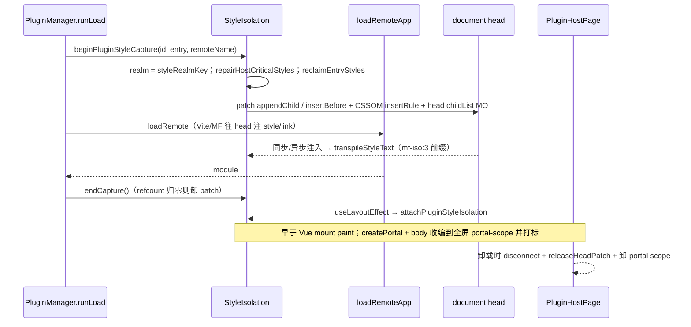
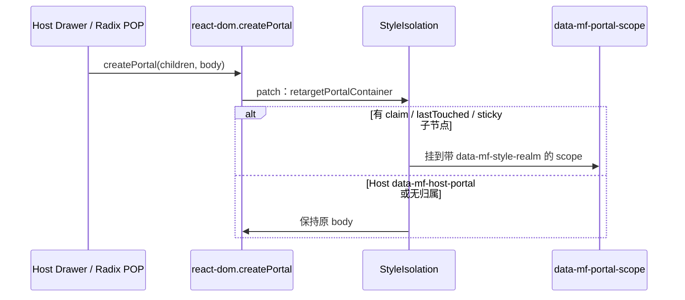
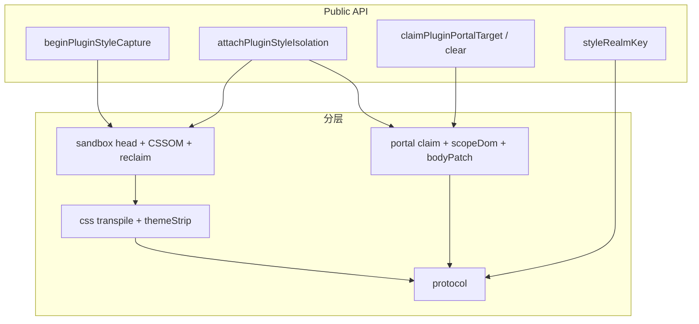
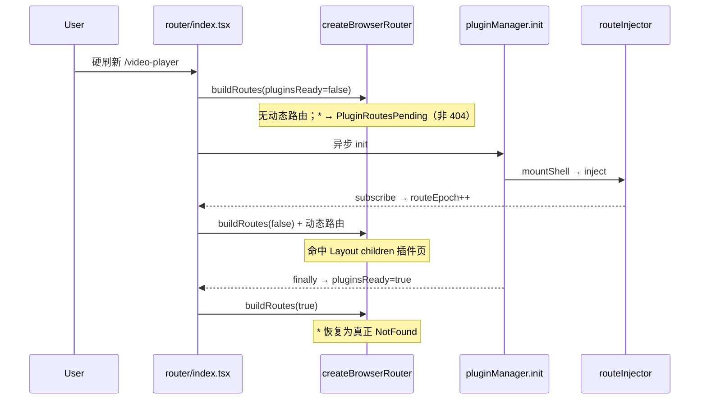
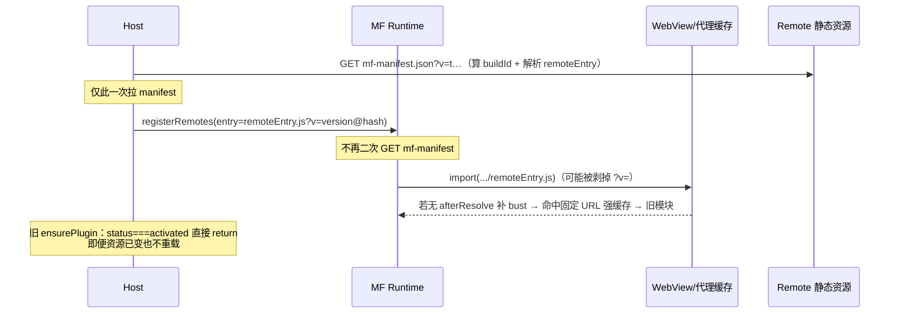
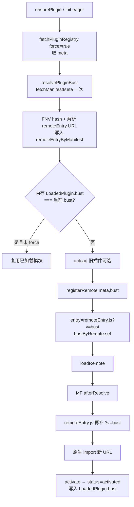
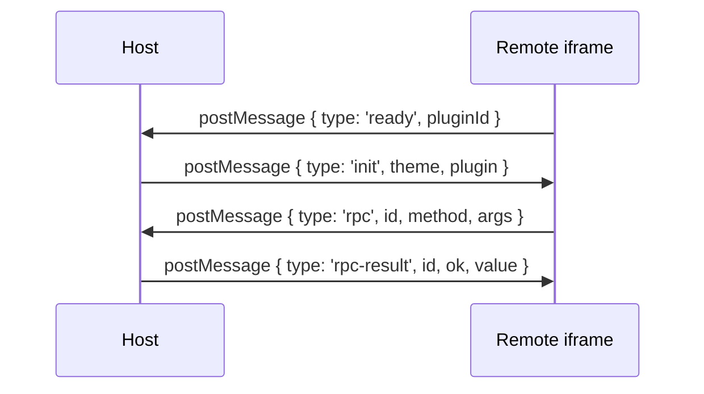
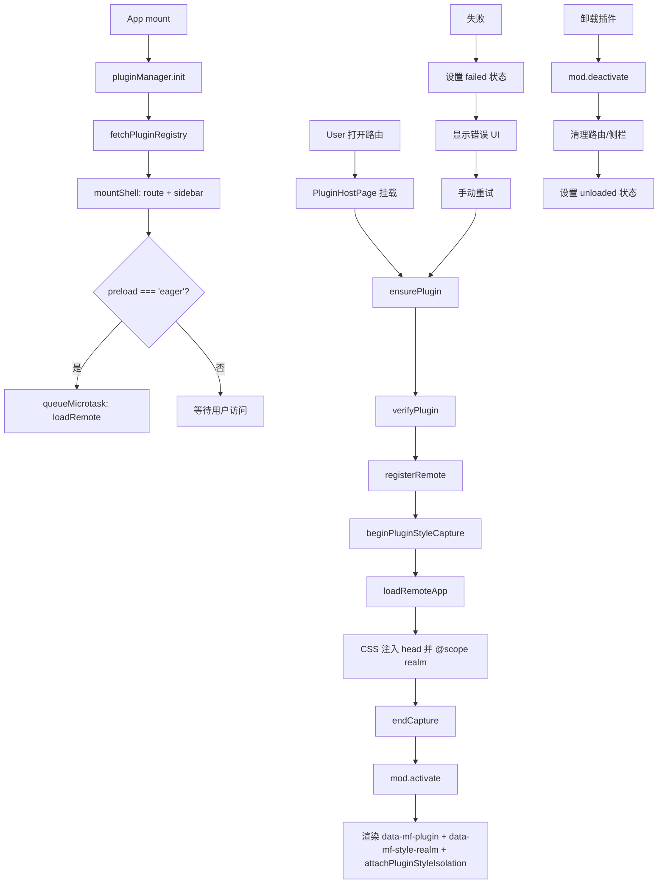

# Module Federation 动态插件实现指南

> **文档角色**：详细的实现过程文档，包含主项目具体实现方式和子项目/插件接入方式，代码含逐行注释。
> **适用读者**：主项目开发者、插件/子项目开发者。
> **同步说明**：已对齐最新 HostBridge（`api.locale`，无 `api.t`）、PluginHostPage locale 热更新、iframe `locale` 消息、**Host 样式隔离 §2.10.2（实现目录 `plugins/style-isolation/`：`protocol`/`css`/`sandbox`/`portal` 分层；`mf-iso:3` 选择器前缀；`html/body→[realm][data-plugin-root]`；全屏 portal + 打标；HMR 仅 vite-id；CSSOM；Vue useLayoutEffect；body remove 镜像；`@/plugins` 自 `./style-isolation` 导出 realm/claim）**；**Layout / `PluginPageShell`：overflow 与 `border-radius` 分层，避免废掉路由页内 `backdrop-filter`（§2.10.0 / §2.14）**；Registry `title`/`description` locale map；**Host 勿 shared `react-router`**；entry bust 用 **`version@manifestHash`**（`fetchManifestMeta` / `fetchEntryBuildId` + `resolvePluginBust`，**不依赖**改 registry `updatedAt`）——**进入插件只 GET 一次 `mf-manifest.json`**（指纹 + 解析 `remoteEntry`），`registerRemote` 直连 `remoteEntry.js?v=`，`afterResolve` 兜底补 `?v=`；`ensurePlugin` 按 bust 判断重载；保存 registry 校验 `hostApiRange`；remotes 静态 `no-store`；**`api.ui.setAppFullscreen` + `PluginPageShell` / `pageShell`（§2.7 / §2.10 / §2.14）**；**刷新插件路由防闪 404（`pluginsReady` + catch-all 占位，§2.11）**；App 根 **`data-mf-host-portal`**。若与源码不一致，以源码为准。

---

## 目录

1. [概述](#1-概述)
2. [主项目实现](#2-主项目实现)
   - 2.1 Vite 配置
   - 2.2 MF 核心运行时 (`mf.ts`)
   - 2.3 插件类型定义 (`types.ts`)
   - 2.4 插件管理器 (`PluginManager.ts`)
   - 2.5 路由注入器 (`RouteInjector.ts`)
   - 2.6 侧栏注入器 (`SidebarInjector.ts`)
   - 2.7 Host Bridge (`createHostBridge.ts`)
   - 2.8 插件验证器 (`PluginVerifier.ts`)
   - 2.9 Registry 管理 (`registry.ts`)
   - 2.10 插件宿主页面 (`PluginHostPage.tsx`)
   - 2.10.0 独立路由外壳 (`PluginPageShell.tsx`；**勿圆角同层 overflow-hidden**)
   - 2.10.1 错误边界
   - **2.10.2 主子样式隔离（原理与完整实现）**（`plugins/style-isolation/` 分层；`mf-iso:3` 选择器前缀；`html/body→[realm][data-plugin-root]`；全屏 portal-scope + 打标；HMR 仅 vite-id；body remove 镜像·antd；CSSOM；Vue useLayoutEffect）
   - **2.11 路由构建与初始化**（含刷新子应用防闪 404；`data-mf-host-portal`）
   - 2.12 语言（locale）同步
   - **2.13 插件/子应用加载缓存破坏（完整方案）**
   - **2.14 应用级全屏（影院态）**（含 Layout overflow 分层）
3. [子项目/插件接入](#3-子项目插件接入)
   - 3.1 Vite 配置
   - 3.2 组件实现规范
   - **3.3 全局样式处理（Remote 侧约定）**
   - 3.4 多插件共享 Remote
   - 3.5 不安全插件（untrusted）接入
   - 3.6 CORS 配置
   - 3.7 Registry 配置示例
4. [完整数据流](#4-完整数据流)
5. [常见问题与解决方案](#5-常见问题与解决方案)
   - 5.7 样式隔离相关（含 Portal / antd getScrollBarSize / sonner / **backdrop-filter**）
   - **5.9 刷新子应用先闪 404**

---

## 1. 概述

本项目采用 **@module-federation/vite** + **@module-federation/enhanced/runtime** 实现动态插件系统，核心特点：

- **运行时动态注册**：通过 `registerRemotes` 在运行时注册远程模块，无需预配置
- **懒加载策略**：插件默认懒加载，首次进入页面时才执行 `loadRemote`
- **共享 React 单例**：Host 和 Remote 共享同一个 React 实例，避免双 React 问题
- **安全验证**：包含信任等级、origin 白名单、hostApi 版本检查、可选 integrity 校验
- **幂等注入**：路由和侧栏注入支持幂等，避免重复注入导致闪烁
- **刷新防闪 404**：`pluginsReady` + catch-all 占位（§2.11）；静态路由仍可首屏匹配
- **失败重试**：失败态稳定，仅手动触发重试，避免自动死循环
- **语言同步**：Host 只推送 `locale`（`zh-CN` | `en-US`）；插件自维护文案字典
- **Registry 文案解耦**：插件中心标题/说明与注入路由面包屑读 registry 的 `title`/`description` locale map，改名不必改 Host 语言包
- **样式隔离**：Host 运行时 **选择器前缀 `/*mf-iso:3*/`**（`:root`→realm；`html/body`→`[realm][data-plugin-root]`；双选择器）+ transpile/CSSOM + head 劫持 + 全屏 portal-scope 打标 + body remove/replace 镜像（详解 §2.10.2）；`untrusted` 走 iframe
- **entry 缓存破坏**：`pluginBust = version@manifestHash`（指纹来自 Remote 自有 `mf-manifest`；发布者勿改 Host registry）；`resolvePluginBust` **只拉一次** manifest（算指纹并解析 `remoteEntry`），`registerRemote` **直连** `remoteEntry.js?v=`，`afterResolve` 再兜底补 `?v=`（WKWebView 固定名 ESM 强缓存）
- **Host shared**：只 shared `react` / `react-dom`；**不要** shared `react-router`（生产易双 Router，`useLocation` 白屏）
- **应用级全屏**：`api.ui.setAppFullscreen`（`ui:toast`）驱动 Layout 影院态 + Tauri/Web 系统全屏；独立路由页 `pageShell` → `PluginPageShell`（§2.14）
- **MF 内 backdrop-filter**：Layout / `PluginPageShell` 将 `overflow-hidden` 与 `border-radius` 分层，避免 Chromium 裁切导致毛玻璃采不到更深 video（§2.10.0 / §2.14.4）

---

## 2. 主项目实现

### 2.1 Vite 配置

**文件路径**：`apps/frontend/vite.config.ts`

```typescript
// 引入 Module Federation Vite 插件
import { federation } from "@module-federation/vite";
import tailwindcss from "@tailwindcss/vite";
import react from "@vitejs/plugin-react";
import { defineConfig, loadEnv } from "vite";
import {
	clearMfViteDepCachePlugin,
	copyPdfjsAssetsPlugin,
	removeDistMinMapsPlugin,
} from "./plugins";

// 定义需要排除优化的依赖（避免 React 被预打包写入 virtual:mf）
const MF_SHARED_EXCLUDE = [
	"react", // React 核心库
	"react/jsx-runtime", // JSX 运行时
	"react/jsx-dev-runtime", // 开发环境 JSX 运行时
	"react-dom", // React DOM
	"react-dom/client", // React DOM 客户端入口
];

export default defineConfig(({ mode }) => {
	const env = loadEnv(mode, process.cwd(), "");

	return {
		plugins: [
			// 关键：启动时清空 .vite/deps 缓存，避免 mf_owner 漂移导致解析失败
			clearMfViteDepCachePlugin(),
			react(),
			tailwindcss(),
			copyPdfjsAssetsPlugin(),
			removeDistMinMapsPlugin(),
			// Module Federation 核心配置
			federation({
				name: "host", // Host 名称，必须唯一
				filename: "remoteEntry.js", // Remote Entry 文件名
				remotes: {}, // 动态注册，初始为空
				shared: {
					// 共享依赖配置
					react: {
						// React 共享
						singleton: true, // 单例模式，确保只有一个 React 实例
						requiredVersion: "^19.1.0", // 要求版本范围
					},
					"react-dom": {
						// React DOM 共享
						singleton: true,
						requiredVersion: "^19.1.0",
					},
					// 勿 shared react-router：生产 loadShare 易与 react-router/dom 拆成双实例，
					// 导致 useLocation 找不到 Router context（线上 /plugins 白屏）。Remote 也未共享它。
					// 仍用 resolve.dedupe 收敛 react-router 单实例。
				},
				// 关键：避免默认 html 注入把任意 ts 打成无 export bootstrap
				hostInitInjectLocation: "entry",
				dts: false, // 关闭类型生成（Ctrl+C 后 IPC 易残留）
				dev: {
					remoteHmr: true, // 开发环境支持 Remote HMR
				},
			}),
		],
		resolve: {
			alias: {
				"@": "/src",
				"@ui": "/src/components/ui",
				"@design": "/src/components/design",
			},
			dedupe: ["react", "react-dom", "react-router"], // 去重（含 router，但不进 MF shared）
		},
		optimizeDeps: {
			// 禁止把 shared 依赖打进 .vite/deps（否则会 import virtual:mf 且解析失败）
			exclude: MF_SHARED_EXCLUDE,
			include: [
				// 其他需要预优化的依赖...
			],
		},
		server: {
			port: 9002,
			strictPort: true,
			host: "0.0.0.0",
			cors: true, // 允许跨域
			proxy: {
				"/api": {
					/* ... */
				},
				"/remotes": {
					// 代理插件 registry 和 entry
					target: devApiProxyTarget,
					changeOrigin: true,
				},
				// ...
			},
		},
	};
});
```

**关键点说明**：

| 配置项                            | 作用                                 | 为什么重要                                               |
| --------------------------------- | ------------------------------------ | -------------------------------------------------------- |
| `shared.singleton: true`          | 强制共享单例（仅 react / react-dom） | 避免 Host 和 Remote 各加载一份 React                     |
| **勿** `shared['react-router']`   | 不进 MF shared                       | 避免生产双 Router / `useLocation` 白屏；用 `dedupe` 即可 |
| `hostInitInjectLocation: 'entry'` | 注入位置改为 entry                   | 避免默认 html 注入导致 bootstrap 无 export               |
| `optimizeDeps.exclude`            | 排除 React 相关                      | 避免预打包写入 virtual:mf 后重启解析失败                 |
| `clearMfViteDepCachePlugin`       | 启动清缓存                           | 解决 mf_owner 递增后 .vite/deps 失效问题                 |

---

### 2.2 MF 核心运行时 (`mf.ts`)

**文件路径**：`apps/frontend/src/plugins/core/mf/mf.ts`

```typescript
// 引入 MF Runtime API
import {
	createInstance,
	getInstance,
	type ModuleFederation,
	type ModuleFederationRuntimePlugin,
} from "@module-federation/enhanced/runtime";

// 引入 React 和 ReactDOM，用于 registerShared（Host 不装 / 不 shared vue）
import React from "react";
import ReactDOM from "react-dom";

// 引入插件类型定义
import type { PluginDescriptor, PluginModule } from "./types";

// 进程内 MF 实例单例缓存
let mf: ModuleFederation | null = null;

// shared 是否已注册的标志位
let sharedReady = false;

// afterResolve 插件是否已注册
let bustPluginReady = false;

/** remoteName → bust token；afterResolve 给改写后的 remoteEntry.js 补上 */
const bustByRemote = new Map<string, string>();

/**
 * registry entry（通常 mf-manifest.json）→ 解析出的 remoteEntry.js 绝对地址。
 * resolvePluginBust 拉 manifest 时写入，registerRemote 直连 remoteEntry，避免 MF 再拉一次 manifest。
 * （完整符号与逐行注释见 §2.13.5）
 */
const remoteEntryByManifest = new Map<string, string>();

/** 去掉 search/hash 后作为 Map key（完整见 §2.13.5） */
function entryKey(entry: string): string {
	try {
		const u = new URL(entry);
		u.search = "";
		u.hash = "";
		return u.href;
	} catch {
		return entry;
	}
}

/** 从 manifest 正文 / entry URL 得到 remoteEntry.js 绝对地址（完整见 §2.13.5） */
function resolveRemoteEntryUrl(entry: string, manifestText: string): string {
	try {
		const json = JSON.parse(manifestText) as {
			metaData?: { publicPath?: string; remoteEntry?: { name?: string } };
		};
		const file = json.metaData?.remoteEntry?.name?.trim() || "remoteEntry.js";
		const publicPath = json.metaData?.publicPath?.trim();
		if (publicPath) return new URL(file, publicPath).href;
	} catch {
		/* 非 JSON 或结构异常：按 entry 路径回退 */
	}
	try {
		const u = new URL(entry);
		if (/remoteEntry\.js$/i.test(u.pathname)) {
			u.search = "";
			u.hash = "";
			return u.href;
		}
		u.pathname = u.pathname.replace(/[^/]*$/, "remoteEntry.js");
		u.search = "";
		u.hash = "";
		return u.href;
	} catch {
		return entry;
	}
}

/**
 * 获取或创建 Host MF 实例
 * - 优先复用 @module-federation/vite 创建的默认实例
 * - 无默认实例时手动创建空 remotes 的 Host 实例
 */
function getMf(): ModuleFederation {
	// 如果已存在实例，直接返回
	if (mf) return mf;

	// 尝试获取 @module-federation/vite 创建的默认实例
	try {
		const existing = getInstance();
		if (existing) {
			mf = existing;
			return mf;
		}
	} catch {
		// 没有默认实例时静默忽略
	}

	// 创建新的 Host 实例，名称为 'host'，初始 remotes 为空数组
	mf = createInstance({ name: "host", remotes: [] });
	return mf;
}

/**
 * 向 Runtime 注册共享依赖（React / ReactDOM）
 * - 确保 sharedReady 为 true 后不再重复注册
 * - 使用 singleton 模式保证全局只有一个实例
 */
function ensureShared() {
	// 如果已注册，直接返回
	if (sharedReady) return;

	// 获取 MF 实例
	const instance = getMf();

	// 注册共享依赖（仅 react / react-dom；Vue 由 Remote 自带 + mount API）
	instance.registerShared({
		// React 共享配置
		react: {
			version: React.version, // 当前 React 版本
			scope: "default", // 作用域
			get: async () => () => React, // 模块获取函数（双重包装）
			shareConfig: {
				singleton: true, // 单例模式
				requiredVersion: `^${React.version}`, // 版本要求
			},
		},
		// React DOM 共享配置
		"react-dom": {
			version: ReactDOM.version || React.version,
			scope: "default",
			get: async () => () => ReactDOM,
			shareConfig: {
				singleton: true,
				requiredVersion: `^${ReactDOM.version || React.version}`,
			},
		},
	});

	// 标记已注册
	sharedReady = true;
}

/**
 * 从 PluginDescriptor 提取 remoteName
 * - 优先使用 descriptor 中的 remoteName
 * - 若无则使用 id
 */
function remoteNameOf(d: PluginDescriptor) {
	return d.remoteName?.trim() || d.id;
}

/**
 * 从 PluginDescriptor 提取 expose 基础名称
 * - 去掉开头的 './'
 * - 默认值为 'App'
 * - 例如 './IdeasList' → 'IdeasList'
 */
function exposeBaseOf(d: PluginDescriptor) {
	const raw = (d.expose?.trim() || "./App").replace(/^\.\//, "");
	return raw || "App";
}

/**
 * 给任意 URL 写入/覆盖 `v=`（manifest 与 remoteEntry 共用）
 * - 空 bust 不改动 URL
 * - 绝对 URL 用 URLSearchParams；相对路径手工拼 query
 */
export function withBust(url: string, bust: string): string {
	// 去空白；空则不改 URL（完整逐行见 §2.13.5）
	const token = bust.trim();
	if (!token) return url;
	try {
		const u = new URL(url);
		u.searchParams.set("v", token);
		return u.href;
	} catch {
		const hashIdx = url.indexOf("#");
		const hash = hashIdx >= 0 ? url.slice(hashIdx) : "";
		const noHash = hashIdx >= 0 ? url.slice(0, hashIdx) : url;
		const qIdx = noHash.indexOf("?");
		const base = qIdx >= 0 ? noHash.slice(0, qIdx) : noHash;
		const params = new URLSearchParams(qIdx >= 0 ? noHash.slice(qIdx + 1) : "");
		params.set("v", token);
		return `${base}?${params.toString()}${hash}`;
	}
}

/** bust token：`version` 或 `version@manifestHash`（完整逐行注释见 §2.13.5） */
export function pluginBust(
	// 至少需要 registry 声明的 version
	meta: Pick<PluginDescriptor, "version">,
	// Remote mf-manifest 内容指纹；勿传 registry.updatedAt
	buildId?: string,
): string {
	// version 与 buildId 去空白后过滤空值，用 @ 连接
	return [meta.version.trim(), buildId?.trim()].filter(Boolean).join("@");
}

/** FNV-1a 32-bit；仅作 cache bust（完整注释见 §2.13.5） */
function hashText(text: string): string {
	// FNV offset basis
	let h = 2166136261;
	// 逐字符异或再乘 FNV prime
	for (let i = 0; i < text.length; i++) {
		h ^= text.charCodeAt(i);
		h = Math.imul(h, 16777619);
	}
	// 无符号 32 位十六进制
	return (h >>> 0).toString(16);
}

/**
 * 拉取 Remote 自有 mf-manifest（进入插件路径上对该 URL 的唯一次网络请求）：
 * - 内容指纹 → buildId
 * - 解析 remoteEntry → 写入 remoteEntryByManifest
 * （完整逐行注释见 §2.13.5）
 */
async function fetchManifestMeta(
	entry: string,
): Promise<{ buildId: string; remoteEntryUrl: string }> {
	const url = withBust(entry, `t${Date.now()}`);
	const res = await fetch(url, { cache: "no-store" });
	if (!res.ok) {
		throw new Error(`entry buildId ${res.status}: ${entry}`);
	}
	const text = await res.text();
	const remoteEntryUrl = resolveRemoteEntryUrl(entry, text);
	remoteEntryByManifest.set(entryKey(entry), remoteEntryUrl);
	return { buildId: hashText(text), remoteEntryUrl };
}

/** 对外 API：仅返回 buildId（内部走 fetchManifestMeta；完整见 §2.13.5） */
export async function fetchEntryBuildId(entry: string): Promise<string> {
	const { buildId } = await fetchManifestMeta(entry);
	return buildId;
}

/** trusted → version@hash；untrusted → 仅 version（完整注释见 §2.13.5） */
export async function resolvePluginBust(
	meta: Pick<PluginDescriptor, "version" | "entry" | "trust">,
): Promise<string> {
	if (meta.trust === "untrusted") {
		return pluginBust(meta);
	}
	const { buildId } = await fetchManifestMeta(meta.entry);
	return pluginBust(meta, buildId);
}

/**
 * MF snapshot 会把 entry 改写成无 query 的 `.../remoteEntry.js`，
 * WKWebView 对固定名 ESM 强缓存。本钩子在 afterResolve 再补 `?v=`。
 * （afterResolve 逐行注释见 §2.13.5）
 */
const bustRemoteEntryPlugin: ModuleFederationRuntimePlugin = {
	// 插件名（完整 afterResolve 逐行见 §2.13.5）
	name: "bust-remote-entry",
	async afterResolve(args) {
		// federation remote name
		const name = args.remoteInfo?.name;
		// registerRemote 写入的 token
		const bust = name ? bustByRemote.get(name) : undefined;
		// MF 改写后的 remoteEntry.js 再补 ?v=
		if (bust && args.remoteInfo?.entry) {
			args.remoteInfo.entry = withBust(args.remoteInfo.entry, bust);
		}
		return args;
	},
};

/**
 * 注册远程模块
 * @param d - 插件描述符
 * @param bust - 可选；默认用 version。通常传入 await resolvePluginBust(meta)
 * - 优先用 remoteEntryByManifest 直连 remoteEntry.js?v=（MF 不再二次拉 manifest）
 * - 写入 bustByRemote 供 afterResolve 兜底
 * - force: true 允许覆盖已注册的 remote
 */
export function registerRemote(d: PluginDescriptor, bust?: string) {
	ensureShared();
	ensureBustPlugin();
	const token = (bust ?? d.version).trim();
	const name = remoteNameOf(d);
	if (token) bustByRemote.set(name, token);
	/* 优先用 resolvePluginBust 已解析的 remoteEntry，跳过 MF 对 mf-manifest 的第二次请求 */
	const remoteEntry =
		remoteEntryByManifest.get(entryKey(d.entry)) ??
		resolveRemoteEntryUrl(d.entry, "");
	getMf().registerRemotes(
		[
			{
				name,
				// 直连 remoteEntry.js?v=token —— MF 不再 GET mf-manifest.json
				entry: withBust(remoteEntry, token),
				type: "module",
			},
		],
		{ force: true },
	);
}

/**
 * 加载远程应用
 * @param d - 插件描述符
 * @returns 加载的插件模块
 */
export async function loadRemoteApp(
	d: PluginDescriptor,
): Promise<PluginModule> {
	ensureShared();
	ensureBustPlugin();
	const name = remoteNameOf(d);
	const expose = exposeBaseOf(d);
	const mod = await getMf().loadRemote<PluginModule>(`${name}/${expose}`);
	if (!mod?.default) {
		throw new Error(
			`plugin ${d.id}: expose ./${expose} missing default export`,
		);
	}
	return mod;
}
```

> **说明**：文件顶部维护 `bustByRemote: Map<string, string>` 与 `ensureBustPlugin()`（只 `registerPlugins` 一次）。完整源码见 `apps/frontend/src/plugins/core/mf/mf.ts`。

---

### 2.3 插件类型定义 (`types.ts`)

**文件路径**：`apps/frontend/src/plugins/core/types/index.ts`

```typescript
import type React from "react";

/**
 * Host 插件契约 semver；破坏性变更才升 major。
 * 优先读 `VITE_HOST_API_VERSION`，缺省 `1.0.0`。
 */
export const HOST_API_VERSION =
	import.meta.env.VITE_HOST_API_VERSION?.trim() || "1.0.0";

/** 插件信任等级 */
export type PluginTrust = "first-party" | "partner" | "untrusted";

/** 插件权限声明 */
export type PluginPermission =
	| "ui:toast" // 允许使用 Toast
	| "nav:subtree" // 允许在子路由内导航
	| "http:plugin-api" // 允许使用插件 API
	| "modules:chat" // 允许使用聊天模块
	| "modules:ebook" // 允许使用电子书模块
	| (string & {}); // 扩展权限

/**
 * 插件描述符 - 定义插件在 registry 中的元数据
 * Host 通过此描述符加载和管理插件
 */
/** registry 内嵌多语言文案（与 Host `locale` 对齐）；见 `localeText.ts` */
export type PluginLocaleMap = Partial<Record<"zh-CN" | "en-US", string>>;

export interface PluginDescriptor {
	/** 插件唯一标识，与 MF remote name / loadRemote(`${id}/App`) 对齐 */
	id: string;

	/**
	 * 多语言插件名（插件中心 / 注入路由标题）。
	 * 新增或改名只改 registry，不必改 Host i18n。
	 */
	title?: PluginLocaleMap;

	/** 多语言说明，或旧版单语字符串 */
	description?: string | PluginLocaleMap;

	/** 路由 path（顶层注入或业务内路径） */
	routePath: string;

	/** MF entry：通常为 .../mf-manifest.json 绝对 URL */
	entry: string;

	/** 插件自身 semver 版本 */
	version: string;

	/** Host API 兼容范围，如 ^1.0.0 */
	hostApiRange: string;

	/** 可选侧栏菜单配置（仅 icon + order；文案不走 Host i18n） */
	menu?: { order: number; icon?: string };

	/**
	 * 是否由 PluginManager 注入顶层路由
	 * false：宿主已在业务路由树挂好 PluginHostPage，只负责 loadRemote
	 */
	injectRoute?: boolean;

	/**
	 * MF registerRemotes.name；默认使用 id
	 * 多插件共享同一 Remote 时填写 federation name
	 */
	remoteName?: string;

	/**
	 * MF expose 路径；默认 ./App
	 * 例如 ./IdeasList
	 */
	expose?: string;

	/** 权限声明（Bridge 按权限裁剪能力） */
	permissions: PluginPermission[];

	/**
	 * 加载时机（默认 route = 懒加载）：
	 * - route/idle/省略：仅首次进入插件页时 loadRemote
	 * - eager：init 后微任务后台预拉（不阻塞启动）
	 */
	preload?: "eager" | "route" | "idle";

	/** 插件总开关 */
	enabled: boolean;

	/** 可选 SRI 完整性校验 */
	integrity?: string;

	/** 可选签名钩子 */
	signature?: string;

	/** 信任等级；untrusted 走 iframe（不 loadRemote），须配 iframeUrl */
	trust: PluginTrust;

	/**
	 * trust: untrusted 必填：独立 HTTPS 页，Host 用 iframe 打开
	 * 生产须 https；开发可 localhost http
	 */
	iframeUrl?: string;
}

/** 插件注册表 */
export interface PluginRegistry {
	updatedAt: string; // 更新时间
	plugins: PluginDescriptor[]; // 插件列表
}

/**
 * HostBridge 属性 - Host 传递给 Remote 的 API 和插件信息
 * Remote 组件接收此属性作为 props
 */
export type HostLocale = "zh-CN" | "en-US";

export interface HostBridgeProps {
	/** Host 暴露给插件的 API（按 permissions 裁剪；未授权字段不存在） */
	api: Readonly<{
		/** 主题快照（创建时读取；MF/iframe 均无 theme 热推送） */
		theme: "light" | "dark";
		/**
		 * 与 Host 顶栏语言一致；插件自维护文案字典，仅跟随此 locale。
		 * 切换后由 PluginHostPage / iframe / eventBus 推送更新。
		 */
		locale: HostLocale;
		/** 导航函数（需 nav:subtree；须在 plugin.routePath 子树内） */
		navigate?: (to: string) => void;
		/** 插件域事件总线（始终可用） */
		event: {
			on: (event: string, handler: (data?: unknown) => void) => void;
			off: (event: string, handler: (data?: unknown) => void) => void;
			emit: (event: string, data?: unknown) => void;
		};
		/** HTTP（需 http:plugin-api） */
		http?: {
			get: <T = unknown>(url: string) => Promise<T>;
			post: <T = unknown>(url: string, body?: unknown) => Promise<T>;
			put: <T = unknown>(url: string, body?: unknown) => Promise<T>;
			delete: <T = unknown>(url: string) => Promise<T>;
		};
		/** UI（需 ui:toast）：Toast / 应用级全屏 / 统一落盘 */
		ui?: {
			showToast: (options: {
				message: string;
				type?: "success" | "error" | "info";
			}) => void;
			/**
			 * 应用级全屏：隐藏 Host 壳（侧栏/顶栏）并（Tauri）拉窗口全屏 /（Web）document 全屏。
			 * 实现见 host-api/appFullscreen.ts；Layout / PluginPageShell 订阅状态。
			 */
			setAppFullscreen?: (full: boolean) => Promise<void>;
			/**
			 * 统一落盘（Web `<a download>` / Tauri `download_blob`）。
			 * Tauri 成功/失败时 Host 已 Toast，`hostToasted: true` 时插件勿再弹成功提示。
			 */
			downloadBlob?: (options: {
				fileName: string;
				data: ArrayBuffer | Uint8Array;
				mimeType?: string;
			}) => Promise<{
				ok: boolean;
				hostToasted: boolean;
				message?: string;
			}>;
		};
		/** 模块 API（需 modules:chat / modules:ebook） */
		modules?: Readonly<Record<string, (...args: unknown[]) => unknown>>;
	}>;
	plugin: Readonly<Pick<PluginDescriptor, "id" | "version" | "routePath">>;
}

/**
 * 插件模块接口
 * Remote 必须导出 default 组件，可选导出 activate/deactivate 生命周期函数
 */
export interface PluginModule {
	/** 默认导出的 React 组件 */
	default: React.ComponentType<HostBridgeProps>;

	/** 激活钩子（可选）- 在模块加载后调用 */
	activate?: (api: HostBridgeProps["api"]) => Promise<void> | void;

	/** 停用钩子（可选）- 在模块卸载前调用 */
	deactivate?: () => Promise<void> | void;
}

/** 插件状态 */
export type PluginStatus =
	| "registered" // 已注册但未加载
	| "loading" // 正在加载
	| "activated" // 已激活
	| "failed" // 加载失败
	| "unloaded"; // 已卸载

/** 已加载的插件 */
export interface LoadedPlugin {
	meta: PluginDescriptor; // 插件描述符
	bridge: HostBridgeProps; // HostBridge 属性
	mod: PluginModule; // 插件模块
	status: PluginStatus; // 当前状态
	error?: string; // 错误信息（失败时）
	/** version@manifestHash；与 MF entry bust 一致，用于判断是否需重载 */
	bust?: string;
}

/** 插件侧栏菜单项（侧栏只渲染 icon；nameKey 为稳定 id，默认等于 pluginId） */
export interface PluginSidebarItem {
	pluginId: string; // 插件 ID
	path: string; // 路由路径
	nameKey: string; // 稳定标识（非 Host i18n key）
	icon: string; // 图标名称
	order: number; // 排序序号
	requiresAuth?: boolean; // 是否需要认证
}
```

**文案解析辅助**（`apps/frontend/src/plugins/core/types/localeText.ts`）：

```typescript
/** 优先当前 locale → zh-CN → en-US → 空串；纯字符串则原样返回 */
export function pickPluginLocaleText(
	value: PluginLocaleMap | string | undefined | null,
	locale: string,
): string;
```

---

### 2.4 插件管理器 (`PluginManager.ts`)

**文件路径**：`apps/frontend/src/plugins/core/runtime/PluginManager.ts`

```typescript
import { type ComponentType, createElement } from "react";
import type { RouteConfig } from "@/router/routes";
import { PluginHostPage } from "../host/PluginHostPage";
import { beginPluginStyleCapture } from "../style-isolation";
import { eventBus } from "../host-api/EventBus";
import { routeInjector } from "../inject/RouteInjector";
import { sidebarInjector } from "../inject/SidebarInjector";
import { createHostBridge } from "./createHostBridge";
import { loadRemoteApp, registerRemote, resolvePluginBust } from "./mf";
import { verifyPlugin } from "./PluginVerifier";
import { fetchPluginRegistry, persistPluginEnabled } from "./registry";
import type { LoadedPlugin, PluginDescriptor } from "./types";

/**
 * 创建插件路由配置
 * @param meta - 插件描述符
 * @returns 路由配置对象
 * - 使用 PluginHostPage 作为组件
 * - pageShell: true → 独立路由套 PluginPageShell（业务内嵌勿传）
 */
function createPluginRoute(meta: PluginDescriptor): RouteConfig {
	const Page: ComponentType = () =>
		createElement(PluginHostPage, { pluginId: meta.id, pageShell: true });
	return {
		path: meta.routePath,
		Component: Page,
		meta: {
			/** Header / 面包屑按 Host locale 从 title 解析，不绑 Host i18n key */
			titleI18n: meta.title,
			title: meta.id,
		},
	};
}

/**
 * 插件管理器核心类
 * 负责插件的生命周期管理：注册、加载、激活、停用、卸载
 */
class PluginManagerImpl {
	/** 插件 ID → 已加载插件状态映射 */
	private plugins = new Map<string, LoadedPlugin>();

	/** 同一插件并发 load 共用一个 Promise，避免失败重入闪烁 */
	private inflight = new Map<string, Promise<void>>();

	/** 默认导航实现：整页跳转；App 会注入 router.navigate */
	private navigateImpl: (to: string) => void = (to) => {
		window.location.assign(to);
	};

	/**
	 * 设置导航实现
	 * @param fn - 导航函数（由 App 注入 React Router navigate）
	 */
	setNavigate(fn: (to: string) => void) {
		this.navigateImpl = fn;
	}

	/**
	 * 获取插件状态
	 * @param id - 插件 ID
	 * @returns 已加载插件或 undefined
	 */
	get(id: string) {
		return this.plugins.get(id);
	}

	/**
	 * 获取所有已加载插件列表
	 * @returns 插件数组
	 */
	list() {
		return [...this.plugins.values()];
	}

	/**
	 * 初始化插件系统
	 * - 只拉 registry + 挂路由/侧栏壳，不下载 MF Remote
	 * - 实际 loadRemote 在首次 ensurePlugin / PluginHostPage 挂载时进行
	 * - preload: 'eager' 的插件在微任务中后台预拉（不阻塞启动）
	 */
	async init() {
		// 拉取插件注册表（强制刷新）
		const registry = await fetchPluginRegistry({ force: true });

		// 过滤出启用的插件
		const enabled = registry.plugins.filter((p) => p.enabled);

		// 为每个启用的插件挂载壳（路由 + 侧栏）
		for (const meta of enabled) {
			this.mountShell(meta);
		}

		// 处理 eager 预加载的插件
		const eager = enabled.filter((p) => p.preload === "eager");
		if (eager.length === 0) return;

		// 在微任务中后台预拉，不阻塞主应用启动
		queueMicrotask(() => {
			void Promise.all(eager.map((p) => this.loadPlugin(p)));
		});
	}

	/**
	 * 挂载插件壳（路由 + 侧栏菜单）
	 * @param meta - 插件描述符
	 */
	private mountShell(meta: PluginDescriptor) {
		// 注入顶层路由（除非 injectRoute 显式设置为 false）
		if (meta.injectRoute !== false) {
			routeInjector.inject(meta.id, [createPluginRoute(meta)]);
		}

		// 如果有菜单配置，添加到侧栏
		if (meta.menu) {
			sidebarInjector.add({
				pluginId: meta.id,
				path: meta.routePath,
				// 侧栏仅用 icon；nameKey 仅作稳定 id，不再指向 Host i18n
				nameKey: meta.id,
				icon: meta.menu.icon ?? "Puzzle",
				order: meta.menu.order,
			});
		}
	}

	/**
	 * 确保插件可用（按需加载）
	 * @param id - 插件 ID
	 * @param opts - 选项（force: 强制重新加载）
	 * @returns 已激活的插件
	 * - 先 force 拉 registry 取 meta，再 resolvePluginBust → version@manifestHash
	 * - 已激活且 bust 未变且未 force：直接返回
	 * - bust 已变：继续重载（即使 status 仍是 activated）
	 */
	async ensurePlugin(id: string, opts?: { force?: boolean }) {
		// 强制拉最新 registry（清单防缓存；与 entry bust 解耦）
		const registry = await fetchPluginRegistry({ force: true });
		// 找已启用的目标插件
		const meta = registry.plugins.find((p) => p.id === id && p.enabled);
		// 未启用或不存在则失败
		if (!meta) {
			throw new Error(`registry 中无启用插件 ${id}`);
		}
		// version@manifestHash（逐行细节见 §2.13.6）
		const bust = await resolvePluginBust(meta);
		// 读内存态
		const cur = this.plugins.get(id);

		// 已激活且 bust 未变且未 force → 复用
		if (cur?.status === "activated" && cur.bust === bust && !opts?.force) {
			return cur;
		}
		// 同 bust 失败且未 force → 抛旧错
		if (cur?.status === "failed" && !opts?.force && cur.bust === bust) {
			throw new Error(cur.error || `加载 ${id} 失败`);
		}

		// 并发加载 Promise
		const pending = this.inflight.get(id);
		// 非 force 时等待并发结果
		if (pending && !opts?.force) {
			await pending;
			const after = this.plugins.get(id);
			if (after?.status === "activated" && after.bust === bust) return after;
			if (after?.status !== "activated") {
				throw new Error(after?.error || `加载 ${id} 失败`);
			}
			/* bust 已变，继续往下重载 */
		}

		// 确保路由/侧栏壳
		this.mountShell(meta);
		// 传入 bust，避免 loadPlugin 重复 fetch manifest
		await this.loadPlugin(meta, opts, bust);
		const next = this.plugins.get(id);
		if (next?.status !== "activated") {
			throw new Error(next?.error || `加载 ${id} 失败`);
		}
		return next;
	}

	/**
	 * 加载插件
	 * @param meta - 插件描述符
	 * @param opts - 选项（force: 强制重新加载）
	 * @param bustToken - 可选；已算好的 bust，避免 ensurePlugin 重复 fetch
	 */
	async loadPlugin(
		// 插件描述符
		meta: PluginDescriptor,
		// force 时忽略 bust 相等短路
		opts?: { force?: boolean },
		// 已算好的 bust；缺省则内部 resolvePluginBust
		bustToken?: string,
	) {
		// 复用传入 token，或自行拉 manifest 指纹
		const bust = bustToken ?? (await resolvePluginBust(meta));
		const prev = this.plugins.get(meta.id);

		// bust 未变 → 短路
		if (prev?.status === "activated" && prev.bust === bust && !opts?.force) {
			return;
		}

		// bust 变了 → 先卸旧
		if (prev?.status === "activated") {
			await this.unloadPlugin(meta.id);
			this.mountShell(meta);
		}

		const existing = this.inflight.get(meta.id);
		if (existing) {
			if (!opts?.force) return existing;
			await existing.catch(() => {});
		}

		// 真正加载，写入 LoadedPlugin.bust
		const run = this.runLoad(meta, bust);
		this.inflight.set(meta.id, run);

		try {
			await run;
		} finally {
			if (this.inflight.get(meta.id) === run) {
				this.inflight.delete(meta.id);
			}
		}
	}

	/**
	 * 执行实际加载逻辑
	 * @param meta - 插件描述符
	 * @param bust - version@manifestHash，写入 LoadedPlugin 并传给 registerRemote
	 */
	private async runLoad(meta: PluginDescriptor, bust: string) {
		// navigate 绑定（完整逐行见 §2.13.6）
		const nav = (to: string) => this.navigateImpl(to);
		// loading 占位并带上本次 bust
		const loading: LoadedPlugin = {
			meta,
			bridge: createHostBridge(meta, nav),
			mod: { default: () => null },
			status: "loading",
			bust,
		};
		this.plugins.set(meta.id, loading);

		try {
			await verifyPlugin(meta);

			// iframe 插件不进 MF
			if (meta.trust === "untrusted") {
				this.plugins.set(meta.id, {
					meta,
					bridge: createHostBridge(meta, nav),
					mod: { default: () => null },
					status: "activated",
					bust,
				});
				return;
			}

			// entry ?v=bust + bustByRemote
			registerRemote(meta, bust);
			const endCapture = beginPluginStyleCapture(meta.id, meta.entry);
			let mod: Awaited<ReturnType<typeof loadRemoteApp>>;
			try {
				// afterResolve 会给 remoteEntry 再补 ?v=
				mod = await loadRemoteApp(meta);
			} finally {
				endCapture();
			}
			const bridge = createHostBridge(meta, nav);
			await mod.activate?.(bridge.api);

			this.plugins.set(meta.id, {
				meta,
				bridge,
				mod,
				status: "activated",
				bust,
			});
		} catch (e) {
			const message = e instanceof Error ? e.message : String(e);
			console.error(`[PluginManager] load ${meta.id} failed`, e);
			this.plugins.set(meta.id, {
				...loading,
				status: "failed",
				error: message,
			});
		}
	}

	/**
	 * 卸载插件
	 * @param id - 插件 ID
	 * - 调用 deactivate 钩子
	 * - 清理事件总线
	 * - 移除路由和侧栏
	 * - 更新状态为 unloaded
	 */
	async unloadPlugin(id: string) {
		const loaded = this.plugins.get(id);

		// 未加载：直接清理路由和侧栏
		if (!loaded) {
			routeInjector.remove(id);
			sidebarInjector.remove(id);
			return;
		}

		try {
			// 调用 deactivate 钩子（如果存在）
			await loaded.mod.deactivate?.();
		} catch (e) {
			console.error(`[PluginManager] deactivate ${id}`, e);
		}

		// 清理事件总线
		eventBus.clearPlugin(id);

		// 移除路由和侧栏
		routeInjector.remove(id);
		sidebarInjector.remove(id);

		// 更新状态为 unloaded
		this.plugins.set(id, {
			...loaded,
			status: "unloaded",
		});
	}

	/**
	 * 上架/下架插件
	 * @param id - 插件 ID
	 * @param enabled - 是否启用
	 * - 写入本地覆盖
	 * - 即时挂壳或卸载
	 * - 下架后 init/ensure 不再加载
	 */
	async setEnabled(id: string, enabled: boolean) {
		// 设置启用覆盖
		setEnabledOverride(id, enabled);

		// 下架：卸载插件
		if (!enabled) {
			await this.unloadPlugin(id);
			return;
		}

		// 上架：从 registry 获取元数据并挂载壳
		const registry = await fetchPluginRegistry({ force: true });
		const meta = registry.plugins.find((p) => p.id === id && p.enabled);
		if (!meta) return;
		this.mountShell(meta);
	}
}

/** 插件管理器单例实例 */
export const pluginManager = new PluginManagerImpl();
```

---

### 2.5 路由注入器 (`RouteInjector.ts`)

**文件路径**：`apps/frontend/src/plugins/inject/RouteInjector.ts`

```typescript
import type { RouteConfig } from "@/router/routes";

/** 监听函数类型 */
type Listener = () => void;

/**
 * 路由注入器
 * 管理插件路由的注入和移除，支持订阅变更通知
 * 相同 path 集合不触发 notify，避免重建 router 导致闪烁
 */
class RouteInjectorImpl {
	/** 插件 ID → 路由配置数组映射 */
	private byPlugin = new Map<string, RouteConfig[]>();

	/** 变更监听器集合 */
	private listeners = new Set<Listener>();

	/**
	 * 注入插件路由
	 * @param pluginId - 插件 ID
	 * @param routes - 路由配置数组
	 * - 相同 path 集合不 notify，避免闪烁
	 */
	inject(pluginId: string, routes: RouteConfig[]) {
		// 获取之前的路由配置
		const prev = this.byPlugin.get(pluginId);

		// 相同 path 集合：不触发通知（幂等）
		if (
			prev &&
			prev.length === routes.length &&
			prev.every((r, i) => r.path === routes[i]?.path)
		) {
			return;
		}

		// 更新路由配置
		this.byPlugin.set(pluginId, routes);

		// 通知所有监听器
		this.notify();
	}

	/**
	 * 移除插件路由
	 * @param pluginId - 插件 ID
	 * - 只有实际删除了才触发通知
	 */
	remove(pluginId: string) {
		if (!this.byPlugin.delete(pluginId)) return;
		this.notify();
	}

	/**
	 * 获取所有已注入的动态路由
	 * @returns 路由配置数组
	 */
	getRoutes(): RouteConfig[] {
		return [...this.byPlugin.values()].flat();
	}

	/**
	 * 订阅路由变更
	 * @param fn - 监听函数
	 * @returns 取消订阅函数
	 */
	subscribe(fn: Listener) {
		this.listeners.add(fn);
		return () => {
			this.listeners.delete(fn);
		};
	}

	/**
	 * 通知所有监听器路由已变更
	 */
	private notify() {
		for (const fn of this.listeners) fn();
	}
}

/** 路由注入器单例实例 */
export const routeInjector = new RouteInjectorImpl();
```

---

### 2.6 侧栏注入器 (`SidebarInjector.ts`)

**文件路径**：`apps/frontend/src/plugins/inject/SidebarInjector.ts`

```typescript
import type { PluginSidebarItem } from "../core/types";

/** 监听函数类型 */
type Listener = () => void;

/**
 * 侧栏注入器
 * 管理插件侧栏菜单的添加和移除，支持订阅变更通知
 * 字段全相同则跳过，避免不必要的重渲染
 */
class SidebarInjectorImpl {
	/** 侧栏菜单项数组 */
	private _items: PluginSidebarItem[] = [];

	/** 变更监听器集合 */
	private listeners = new Set<Listener>();

	/** 获取侧栏菜单项（只读） */
	get items() {
		return this._items;
	}

	/**
	 * 添加/更新侧栏菜单项
	 * @param item - 侧栏菜单项
	 * - 字段全相同则跳过（幂等）
	 * - 按 order 排序
	 */
	add(item: PluginSidebarItem) {
		// 查找之前的配置
		const prev = this._items.find((x) => x.pluginId === item.pluginId);

		// 字段全相同：跳过（幂等）
		if (
			prev &&
			prev.path === item.path &&
			prev.nameKey === item.nameKey &&
			prev.icon === item.icon &&
			prev.order === item.order
		) {
			return;
		}

		// 更新配置：移除旧项，添加新项，按 order 排序
		this._items = [
			...this._items.filter((x) => x.pluginId !== item.pluginId),
			item,
		].sort((a, b) => a.order - b.order);

		// 通知所有监听器
		this.notify();
	}

	/**
	 * 移除侧栏菜单项
	 * @param pluginId - 插件 ID
	 * - 只有实际删除了才触发通知
	 */
	remove(pluginId: string) {
		const next = this._items.filter((x) => x.pluginId !== pluginId);
		if (next.length === this._items.length) return;
		this._items = next;
		this.notify();
	}

	/**
	 * 订阅侧栏变更
	 * @param fn - 监听函数
	 * @returns 取消订阅函数
	 */
	subscribe(fn: Listener) {
		this.listeners.add(fn);
		return () => {
			this.listeners.delete(fn);
		};
	}

	/**
	 * 通知所有监听器侧栏已变更
	 */
	private notify() {
		for (const fn of this.listeners) fn();
	}
}

/** 侧栏注入器单例实例 */
export const sidebarInjector = new SidebarInjectorImpl();
```

---

### 2.7 Host Bridge (`createHostBridge.ts`)

**文件路径**：`apps/frontend/src/plugins/core/bridge/createHostBridge.ts`

```typescript
import { Toast } from "@ui/sonner";
import { http } from "@/utils/fetch";
import { setAppFullscreen } from "../host-api/appFullscreen";
import { deepFreeze } from "../host-api/deepFreeze";
import { createEbookModulesApi } from "../host-api/ebookHostApi";
import { eventBus } from "../host-api/EventBus";
import type { HostBridgeProps, PluginDescriptor } from "./types";

/**
 * 读取当前主题
 * - 优先从 html data-theme 属性读取
 * - 其次检查 html.dark class
 * - 最后检查 body.dark / body.theme-black
 * - 默认返回 light
 */
function readTheme(): "light" | "dark" {
	try {
		const t = document.documentElement.getAttribute("data-theme");
		if (t === "dark" || t === "light") return t;
		if (document.documentElement.classList.contains("dark")) return "dark";
		// Host 黑色主题挂在 body.theme-black（不是 html.dark）
		if (
			document.body.classList.contains("dark") ||
			document.body.classList.contains("theme-black")
		) {
			return "dark";
		}
	} catch {
		// 忽略错误
	}
	return "light";
}

/**
 * 创建 HostBridge（按权限组装 API 并密封）
 * @param d - 插件描述符
 * @param navigate - 导航函数
 * @returns HostBridgeProps
 * - 根据插件权限声明组装 API
 * - 未授权的能力不存在（undefined）
 * - 返回的对象被深度冻结，不可修改
 */
export function createHostBridge(
	d: PluginDescriptor,
	navigate: (to: string) => void,
): HostBridgeProps {
	// 创建权限集合
	const allow = new Set(d.permissions);

	// API 对象（逐步构建）—— 无 api.t；插件自维护字典
	const api: Record<string, unknown> = {
		theme: readTheme(),
		locale: readLocale(), // getActiveLocale() → zh-CN | en-US
		event: {
			on: (event: string, handler: (data?: unknown) => void) =>
				eventBus.on(d.id, event, handler),
			off: (event: string, handler: (data?: unknown) => void) =>
				eventBus.off(d.id, event, handler),
			emit: (event: string, data?: unknown) => eventBus.emit(d.id, event, data),
		},
	};

	// 如果有 ui:toast 权限，添加 UI API（Toast + 应用级全屏 + 统一落盘）
	if (allow.has("ui:toast")) {
		api.ui = Object.freeze({
			showToast: (options: {
				message: string;
				type?: "success" | "error" | "info";
			}) => {
				Toast({
					type: options.type ?? "info",
					title: options.message,
				});
			},
			/** 应用级全屏：藏壳 + Tauri 窗口 / Web document 全屏（见 §2.14） */
			setAppFullscreen,
			/** 与主站收藏导出同源：Web / Tauri2 统一落盘 */
			downloadBlob: async (options: {
				fileName: string;
				data: ArrayBuffer | Uint8Array;
				mimeType?: string;
			}) => {
				// ... 见源码 createHostBridge.ts：downloadBlob + hostToasted
			},
		});
	}

	// 如果有 nav:subtree 权限，添加导航 API（限制在子路由内）
	if (allow.has("nav:subtree")) {
		api.navigate = (to: string) => {
			// 限制导航范围：只能在插件自身的 routePath 下导航
			if (!to.startsWith(d.routePath)) {
				throw new Error(`NAV_OUT_OF_SCOPE: ${to}`);
			}
			navigate(to);
		};
	}

	// 如果有 http:plugin-api 权限，添加 HTTP API
	if (allow.has("http:plugin-api")) {
		api.http = Object.freeze({
			get: <T = unknown>(url: string) => http.get<T>(url),
			post: <T = unknown>(url: string, body?: unknown) =>
				http.post<T>(url, body),
			put: <T = unknown>(url: string, body?: unknown) => http.put<T>(url, body),
			delete: <T = unknown>(url: string) => http.delete<T>(url),
		});
	}

	const modules: Record<string, unknown> = {};
	if (allow.has("modules:chat")) {
		modules.openThread = (id: unknown) => {
			if (typeof id !== "string") throw new Error("INVALID_THREAD_ID");
			navigate(`/chat/c/${id}`);
		};
	}
	if (allow.has("modules:ebook")) {
		modules.ebook = createEbookModulesApi();
	}
	if (Object.keys(modules).length > 0) {
		api.modules = Object.freeze(modules);
	}

	return deepFreeze({
		api,
		plugin: {
			id: d.id,
			version: d.version,
			routePath: d.routePath,
		},
	}) as HostBridgeProps;
}

/** 归一化 Host 当前语言 */
function readLocale(): HostLocale {
	const locale = getActiveLocale();
	return locale === "en-US" ? "en-US" : "zh-CN";
}
```

---

### 2.8 插件验证器 (`PluginVerifier.ts`)

**文件路径**：`apps/frontend/src/plugins/core/runtime/PluginVerifier.ts`

```typescript
import { HOST_API_VERSION, type PluginDescriptor } from "./types";

/**
 * 解析 SemVer 版本号
 * @param v - 版本字符串
 * @returns [major, minor, patch] 数组或 null
 * - 支持 v 前缀（如 v1.0.0）
 * - 只匹配主版本.次版本.补丁版本
 */
function parseSemver(v: string): [number, number, number] | null {
	const m = v
		.trim()
		.replace(/^v/, "")
		.match(/^(\d+)\.(\d+)\.(\d+)/);
	if (!m) return null;
	return [Number(m[1]), Number(m[2]), Number(m[3])];
}

/**
 * 检查版本是否满足范围要求
 * @param version - 当前版本
 * @param range - 版本范围（支持 ^x.y.z / >=x.y.z / 精确版本）
 * @returns 是否满足
 */
export function satisfiesRange(version: string, range: string): boolean {
	const ver = parseSemver(version);
	if (!ver) return false;

	const r = range.trim();

	// 处理 ^x.y.z 范围
	if (r.startsWith("^")) {
		const base = parseSemver(r.slice(1));
		if (!base) return false;

		// major 必须相同
		if (ver[0] !== base[0]) return false;

		// 0.x.x：minor 必须相同，patch >= base
		if (ver[0] === 0) {
			return ver[1] === base[1] && ver[2] >= base[2];
		}

		// x.x.x (x > 0)：minor > base 或 minor == base && patch >= base
		return ver[1] > base[1] || (ver[1] === base[1] && ver[2] >= base[2]);
	}

	// 处理 >=x.y.z 范围
	if (r.startsWith(">=")) {
		const base = parseSemver(r.slice(2));
		if (!base) return false;

		return (
			ver[0] > base[0] ||
			(ver[0] === base[0] && ver[1] > base[1]) ||
			(ver[0] === base[0] && ver[1] === base[1] && ver[2] >= base[2])
		);
	}

	// 精确版本匹配
	const exact = parseSemver(r);
	return (
		!!exact && exact[0] === ver[0] && exact[1] === ver[1] && exact[2] === ver[2]
	);
}

/**
 * 检查 entry URL 是否允许
 * @param entry - entry URL
 * @param opts - 选项（prod: 是否生产环境）
 * @returns 是否允许
 * - 生产环境：只允许 https
 * - 开发环境：允许 https 或 localhost/127.0.0.1 的 http
 */
export function entryUrlAllowed(
	entry: string,
	opts?: { prod?: boolean },
): boolean {
	let url: URL;
	try {
		url = new URL(entry);
	} catch {
		return false;
	}

	// https 始终允许
	if (url.protocol === "https:") return true;

	// 判断是否生产环境
	const prod = opts?.prod ?? import.meta.env.PROD;

	// 生产环境：只允许 https
	if (prod) return false;

	// 开发环境：允许 localhost/127.0.0.1 的 http
	return (
		url.protocol === "http:" &&
		(url.hostname === "localhost" || url.hostname === "127.0.0.1")
	);
}

/**
 * 是否跳过 integrity 校验
 * @returns 是否跳过
 * - 默认跳过（VITE_PLUGIN_SKIP_INTEGRITY !== 'false' 即跳过）
 */
function skipIntegrity(): boolean {
	return import.meta.env.VITE_PLUGIN_SKIP_INTEGRITY !== "false";
}

/**
 * 计算 SHA-384 哈希并转为 base64
 * @param buf - ArrayBuffer
 * @returns sha384-xxx 格式的字符串
 */
async function sha384Base64(buf: ArrayBuffer): Promise<string> {
	const digest = await crypto.subtle.digest("SHA-384", buf);
	const bytes = new Uint8Array(digest);
	let bin = "";
	for (const b of bytes) bin += String.fromCharCode(b);
	return `sha384-${btoa(bin)}`;
}

/**
 * 插件验证错误类
 */
export class PluginVerifyError extends Error {
	constructor(
		message: string,
		readonly code:
			| "TRUST"
			| "ORIGIN"
			| "HOST_API"
			| "INTEGRITY"
			| "SIGNATURE"
			| "IFRAME",
	) {
		super(message);
		this.name = "PluginVerifyError";
	}
}

/**
 * 验证插件（加载前校验）
 * @param d - 插件描述符
 * @throws PluginVerifyError - 验证失败时抛出
 * - 信任等级验证
 * - entry URL 验证
 * - hostApi 版本验证
 * - integrity 校验（可选）
 * - signature 校验（预留）
 */
export async function verifyPlugin(d: PluginDescriptor): Promise<void> {
	// 不可信插件：只校验 iframeUrl，禁止 loadRemote 进主文档
	if (d.trust === "untrusted") {
		const src = d.iframeUrl?.trim();

		// 必须提供 iframeUrl
		if (!src) {
			throw new PluginVerifyError(
				`plugin ${d.id}: untrusted requires iframeUrl`,
				"IFRAME",
			);
		}

		// 验证 iframeUrl 是否合法
		if (!entryUrlAllowed(src)) {
			throw new PluginVerifyError(
				`plugin ${d.id}: iframeUrl must be https (or localhost http in dev)`,
				"ORIGIN",
			);
		}

		return;
	}

	// 验证 entry URL 是否合法
	if (!entryUrlAllowed(d.entry)) {
		throw new PluginVerifyError(
			`plugin ${d.id}: entry must be https (or localhost http in dev)`,
			"ORIGIN",
		);
	}

	// 验证 hostApi 版本是否兼容
	if (!satisfiesRange(HOST_API_VERSION, d.hostApiRange)) {
		throw new PluginVerifyError(
			`plugin ${d.id}: hostApi ${HOST_API_VERSION} not in ${d.hostApiRange}`,
			"HOST_API",
		);
	}

	// 验证 integrity（如果提供了且未跳过）
	if (d.integrity && !skipIntegrity()) {
		const res = await fetch(d.entry, { cache: "no-store" });

		if (!res.ok) {
			throw new PluginVerifyError(
				`plugin ${d.id}: fetch entry failed ${res.status}`,
				"INTEGRITY",
			);
		}

		// 计算 SHA-384 哈希并对比
		const hash = await sha384Base64(await res.arrayBuffer());
		if (hash !== d.integrity) {
			throw new PluginVerifyError(
				`plugin ${d.id}: integrity mismatch`,
				"INTEGRITY",
			);
		}
	}

	// signature 校验（预留钩子）
	// 实际验签由发布流水线完成，此处只检查标记
	if (d.signature === "invalid") {
		throw new PluginVerifyError(`plugin ${d.id}: bad signature`, "SIGNATURE");
	}
}
```

---

### 2.9 Registry 管理 (`registry.ts`)

**文件路径**：`apps/frontend/src/plugins/core/registry/registry.ts`

```typescript
import { getPlatformFetch } from "@/utils/fetch";
import { resolveUploadedFileUrl } from "@/utils/upload-file-url";
import { applyEnabledOverrides } from "./enabledOverrides";
import type { PluginRegistry } from "./types";

/** 缓存键（区分生产和开发环境） */
const CACHE_KEY = `dnhyxc.plugin.registry.${import.meta.env.PROD ? "prod" : "dev"}.v1`;

/** 导出缓存键（供外部使用） */
export const PLUGIN_REGISTRY_CACHE_KEY = CACHE_KEY;

/** Registry 文件名 */
export const PLUGIN_REGISTRY_FILENAME = "plugins-registry.json";

/** 落盘相对路径；展示/拉取用 resolveUploadedFileUrl（与图片一致） */
export const PLUGIN_REGISTRY_STATIC_PATH = `/remotes/${PLUGIN_REGISTRY_FILENAME}`;

/**
 * 获取 Registry URL
 * - 优先使用环境变量覆盖
 * - 否则使用 resolveUploadedFileUrl 解析
 * - 对齐 Web/Tauri 开发/生产环境路径
 */
function registryUrl(): string {
	// 优先使用环境变量覆盖
	const override = (
		import.meta.env.PROD
			? import.meta.env.VITE_PROD_PLUGIN_REGISTRY_URL
			: import.meta.env.VITE_DEV_PLUGIN_REGISTRY_URL
	)?.trim();
	if (override) return override;

	// 使用默认路径解析
	return resolveUploadedFileUrl(PLUGIN_REGISTRY_STATIC_PATH);
}

/**
 * 读取本地缓存
 * @returns 缓存的 Registry 或 null
 * - 从 localStorage 读取
 * - 验证格式是否正确
 */
function readCache(): PluginRegistry | null {
	try {
		const cached = localStorage.getItem(CACHE_KEY);
		if (!cached) return null;

		const data = JSON.parse(cached) as PluginRegistry;

		// 验证格式
		if (!Array.isArray(data.plugins) || data.plugins.length === 0) return null;

		return data;
	} catch {
		return null;
	}
}

/**
 * 应用启用覆盖（本地上架/下架）
 * @param data - 原始 Registry
 * @returns 应用覆盖后的 Registry
 */
function withOverrides(data: PluginRegistry): PluginRegistry {
	return applyEnabledOverrides(data);
}

/**
 * 获取适合当前平台的 fetch 函数
 * @param url - 请求 URL
 * @param force - 是否强制刷新
 * @returns 响应文本
 * - https URL：使用平台特定的 fetch
 * - 其他：使用全局 fetch
 */
async function fetchRegistryText(
	url: string,
	force?: boolean,
): Promise<string> {
	const doFetch = /^https?:\/\//i.test(url)
		? await getPlatformFetch()
		: globalThis.fetch.bind(globalThis);

	// force 时 URL 加 ?t= 时间戳，避免桌面/代理仍返回旧 registry
	const fetchUrl = force ? withCacheBust(url) : url;
	const res = await doFetch(fetchUrl, {
		cache: "no-store",
		...(force ? { headers: { "Cache-Control": "no-cache" } } : {}),
	});

	if (!res.ok) throw new Error(`registry ${res.status}`);

	return res.text();
}

/**
 * 拉取插件 Registry
 * @param opts - 选项（force: 强制刷新）
 * @returns Registry 对象
 * - 优先从网络拉取
 * - 网络失败时使用本地缓存
 * - 缓存也没有时返回空列表
 */
export async function fetchPluginRegistry(opts?: {
	force?: boolean;
}): Promise<PluginRegistry> {
	let url: string;

	try {
		url = registryUrl();
	} catch (e) {
		// URL 解析失败：使用缓存
		console.warn("[plugins] registry url missing", e);
		const fallback = readCache();
		return withOverrides(
			fallback ?? { updatedAt: new Date(0).toISOString(), plugins: [] },
		);
	}

	try {
		// 从网络拉取
		const text = await fetchRegistryText(url, opts?.force);

		let data: PluginRegistry;

		try {
			data = JSON.parse(text) as PluginRegistry;
		} catch {
			throw new Error(
				`registry not JSON (${url}): ${text.slice(0, 80).replace(/\s+/g, " ")}`,
			);
		}

		// 验证格式
		if (!Array.isArray(data.plugins)) {
			throw new Error("registry.plugins missing");
		}

		try {
			// 缓存远端原文（覆盖在返回前合并，不写回污染源）
			localStorage.setItem(CACHE_KEY, JSON.stringify(data));
		} catch {
			// 忽略缓存失败
		}

		// 应用覆盖并返回
		return withOverrides(data);
	} catch (e) {
		// 网络拉取失败：使用缓存
		console.warn("[plugins] registry fetch failed, using cache", e);
		const fallback = readCache();
		return withOverrides(
			fallback ?? { updatedAt: new Date(0).toISOString(), plugins: [] },
		);
	}
}

/**
 * 拉取远端原文（不合并本地上架覆盖；用于配置编辑页）
 * @returns Registry JSON 文本
 */
export async function fetchPluginRegistryRawText(): Promise<string> {
	const url = registryUrl();
	// 编辑页始终 force，避免读到缓存旧文
	const text = await fetchRegistryText(url, true);

	try {
		// 格式化输出
		return `${JSON.stringify(JSON.parse(text), null, 2)}\n`;
	} catch {
		return text;
	}
}

/**
 * 保存前校验：每个插件的 hostApiRange 必须覆盖当前 HOST_API_VERSION
 * （避免把插件 version bump 误写成 hostApiRange）
 */
export function assertRegistryHostApiCompatible(data: PluginRegistry): void {
	for (const p of data.plugins) {
		const range = p.hostApiRange?.trim();
		if (!range) {
			throw new Error(
				translateSync("plugins.registry.missingHostApiRange", { id: p.id }),
			);
		}
		if (!satisfiesRange(HOST_API_VERSION, range)) {
			throw new Error(
				translateSync("plugins.registry.hostApiIncompatible", {
					id: p.id,
					range,
					hostApi: HOST_API_VERSION,
				}),
			);
		}
	}
}

/** 将整份 registry 写回服务端 remotes，并刷新本地缓存 */
export async function savePluginRegistry(
	data: PluginRegistry,
): Promise<PluginRegistry> {
	assertRegistryHostApiCompatible(data);
	const next: PluginRegistry = {
		...data,
		updatedAt: formatRegistryUpdatedAt(),
		plugins: data.plugins,
	};
	const payload = `${JSON.stringify(next, null, 2)}\n`;
	await putUploadRemoteJson(PLUGIN_REGISTRY_FILENAME, payload);
	writeCache(next);
	return next;
}

/**
 * 清除插件 Registry 缓存
 */
export function clearPluginRegistryCache() {
	try {
		localStorage.removeItem(CACHE_KEY);
	} catch {
		// 忽略错误
	}
}
```

---

### 2.10 插件宿主页面 (`PluginHostPage.tsx`)

**文件路径**：`apps/frontend/src/plugins/host/PluginHostPage.tsx`

职责：

1. `ensurePlugin` 加载；失败仅手动重试（`retryKey`）
2. **MF**：`withLiveLocale` 覆盖 `api.locale` + `eventBus.emit(pluginId, 'locale')`；包装 `data-mf-plugin` + `data-mf-style-realm`；挂载期 `attachPluginStyleIsolation`（CSS 捕获 + Portal bridge）
3. **untrusted**：`<iframe sandbox=...>` + `attachIframeBridge`（用 `loaded.bridge`，**不用** liveBridge）
4. Loading / 失败文案走 Host i18n keys：`plugins.host.*`
5. **`pageShell?: boolean`**：为 `true` 时用 `PluginPageShell` 包裹激活态内容（**仅** `PluginManager.createPluginRoute` 传 true；业务内嵌勿开）

```typescript
// 摘录：pageShell + locale 热更新 + MF/iframe 双路径；下列为 Props 形状
type Props = {
	// Registry / 路由注入用的插件主键
	pluginId: string;
	// 宿主容器额外 class（业务槽可收窄高度等）
	className?: string;
	// 电子书 surface 槽位：toolbar / drawer 触发器 / drawer 本体
	part?: 'toolbar' | 'drawer-triggers' | 'drawer';
	/** 独立路由页：套 Host 统一容器。业务树内嵌勿开。 */
	pageShell?: boolean;
};

// 用 Host 当前 locale 覆盖 bridge.api.locale，供 props 热更新
function withLiveLocale(bridge: HostBridgeProps, locale: HostLocale): HostBridgeProps {
	// 浅拷贝 bridge 与 api，仅替换 locale，其它 API 引用不变
	return { ...bridge, api: { ...bridge.api, locale } };
}

// 插件宿主页：加载态 / MF 根 / iframe / 可选 pageShell
export function PluginHostPage({ pluginId, className, part, pageShell }: Props) {
	// Host i18n：locale 驱动热更新；t 用于 loading/失败文案
	const { locale, t } = useI18n();
	// … ensurePlugin(pluginId, { force: retryKey > 0 }) 省略：加载与失败重试 …

	// 激活且非 untrusted：挂载期持续 CSS 捕获 + Portal bridge
	useEffect(() => {
		// 未激活 / iframe / 无 entry 时不挂隔离（untrusted 靠独立 document）
		if (status !== 'activated' || trust === 'untrusted' || !entry) return;
		// remoteName 参与 styleRealmKey；同 Remote 多 expose 共享一份 CSS realm
		return attachPluginStyleIsolation(pluginId, entry, loaded?.meta.remoteName);
		// pluginId/entry/trust/remoteName 变则重绑隔离；status 变出 activated 时卸载
	}, [pluginId, status, entry, trust, loaded?.meta.remoteName]);

	// 已激活插件经 eventBus 再推一帧 locale（与 props 热更新互补）
	useEffect(() => {
		// 未激活时无订阅方，避免空发
		if (status !== 'activated') return;
		// 按 pluginId 频道广播，Remote useHostLocale 可重绘文案
		eventBus.emit(pluginId, 'locale', locale);
		// locale 切换或插件变为 activated 时重发
	}, [pluginId, status, locale]);

	// 把最新 locale 叠进 bridge，避免 Remote 只吃到加载瞬间的 props
	const liveBridge = useMemo(
		// bridge 未就绪则 null；就绪则 withLiveLocale
		() => (loaded?.bridge ? withLiveLocale(loaded.bridge, locale) : null),
		// bridge 引用或 Host locale 变则重算
		[loaded?.bridge, locale],
	);

	// 仅独立路由需要统一外边距；业务内嵌直接返回子树
	const wrap = (node: ReactNode) =>
		pageShell ? <PluginPageShell>{node}</PluginPageShell> : node;

	// 仅 activated 走内容；loading/failed 省略（见源码）
	if (loaded?.status === 'activated') {
		// untrusted：sandbox iframe + 原始 bridge（不用 liveBridge）
		if (loaded.meta.trust === 'untrusted') {
			// 套 pageShell（若开）后进入错误边界与 iframe
			return wrap(
				<PluginErrorBoundary pluginId={pluginId}>
					<UntrustedIframe
						pluginId={pluginId}
						src={loaded.meta.iframeUrl!}
						bridge={loaded.bridge}
					/>
				</PluginErrorBoundary>,
			);
		}
		// MF default 导出即插件根组件
		const Comp = loaded.mod.default;
		// 按 entry/remoteName 算样式域，供 data-mf-style-realm 与 @scope 对齐
		const realm = styleRealmKey(
			loaded.meta.entry,
			loaded.meta.remoteName,
			pluginId,
		);
		// 套壳后渲染带 data-mf-* 的插件根
		return wrap(
			<PluginErrorBoundary pluginId={pluginId}>
				<div
					className={cn(`plugin-${pluginId} h-full w-full min-h-0`, className)}
					data-mf-plugin={pluginId}
					data-mf-style-realm={realm}
					data-plugin-root
				>
					<Comp {...liveBridge!} />
				</div>
			</PluginErrorBoundary>,
		);
	}
	// Loading / failed + 手动重试（i18n）；loading 态当前未强制 wrap pageShell
}
```

`PluginManager.createPluginRoute`：

```typescript
// 独立路由注入：强制 pageShell，业务内嵌挂载切勿照抄 true
createElement(PluginHostPage, { pluginId: meta.id, pageShell: true });
```

#### 2.10.0 独立路由外壳 (`PluginPageShell.tsx`)

**文件路径**：`apps/frontend/src/plugins/host/PluginPageShell.tsx`

订阅 `subscribeAppFullscreen`：正常态 `p-5.5 pt-0` + 圆角内容区；影院态 `p-0` / `rounded-none`。完整影院说明见 §2.14。

**现行约束（backdrop-filter）**：圆角内容区**不要**写 `overflow-hidden`。与 `border-radius` 同层时，Chromium 会让子树 `backdrop-filter` 采不到更深的 video——Remote 独立预览正常，MF 嵌入后毛玻璃失效。裁切放到更内层（无圆角）或更外层（无圆角）即可。Layout 侧同样「overflow 不与 rounded 同层」，见 §2.14.4。

```tsx
/**
 * 插件独立路由页的 Host 统一外壳（边距 + 圆角内容区）。
 * 业务内嵌挂载不要用；影院全屏时收起边距以免挡画面。
 *
 * 勿在圆角容器上写 overflow-hidden：与 border-radius 同层时，
 * Chromium 会让子树 backdrop-filter 采不到更深的 video（本地独立跑正常、MF 嵌入失效）。
 */
// React：外壳订阅影院态所需 hooks；ReactNode 为 children 类型
import { type ReactNode, useEffect, useState } from 'react';
// 合并 className，影院开/关切换 padding 与圆角
import { cn } from '@/lib/utils';
// 影院态单源：同步读初值 + 订阅后续变更
import {
	getAppFullscreen,
	subscribeAppFullscreen,
} from '../host-api/appFullscreen';

// 独立路由页外壳；业务内嵌勿包一层以免双 padding
export function PluginPageShell({
	children,
	className,
}: {
	// 插件根或错误边界子树
	children: ReactNode;
	// 路由级额外布局 class（可选）
	className?: string;
}) {
	// 初值与 Layout 同源，避免首帧闪出带边距的壳
	const [theater, setTheater] = useState(getAppFullscreen);
	// 订阅影院态；卸载时退订；[] 仅挂载一次
	useEffect(() => subscribeAppFullscreen(setTheater), []);

	// 以下为 JSX 树（标记行不加讲解）；逻辑意图见 className 表达式
	return (
		<div
			className={cn(
				// 纵向占满；min-h-0 让 flex 子项可收缩滚动
				'mx-auto flex h-full min-h-0 flex-col',
				// 影院：去外边距；常态：与业务页一致的 p-5.5 pt-0
				theater ? 'p-0' : 'p-5.5 pt-0',
				className,
			)}
		>
			<div
				className={cn(
					// 无 overflow-hidden：保留圆角视觉，不裁切 backdrop-filter 采样
					'h-full min-h-0 bg-theme-background',
					// 影院去圆角；常态 rounded-md 与 Layout 内容区一致
					theater ? 'rounded-none p-0' : 'rounded-md',
				)}
			>
				{children}
			</div>
		</div>
	);
}
```

#### 2.10.1 错误边界

| 文件                           | 作用                                              |
| ------------------------------ | ------------------------------------------------- |
| `host/PluginErrorBoundary.tsx` | Class 边界；fallback 用 `plugins.host.loadFailed` |

#### 2.10.2 主子样式隔离（原理与完整实现）

> **源码**：`apps/frontend/src/plugins/style-isolation/`（协议标记 **`/*mf-iso:3*/`**；分层见 §10.0.2.5）  
> **自检**：`apps/frontend/src/plugins/style-isolation/styleIsolation.smoke.ts`（`pnpm --filter @dnhyxc-ai/frontend exec tsx src/plugins/style-isolation/styleIsolation.smoke.ts`）  
> **姊妹稿**：`docs/app/样式隔离乾坤加固.md`、`docs/ideas/模块联邦CSS隔离.md`（历史 `@scope` 叙述以**本文件 + 源码**为准）  
> **目标**：隔离责任在 **Host**；Remote 可按普通 Vite + Tailwind 工程开发（含 Preflight），主↔子样式互不破坏。  
> **现行协议（相对早期「整包 `@scope`」）**：**qiankun 式选择器前缀**——`:root` → `[data-mf-style-realm]`（CSS 变量可打在浮层根）；**`html`/`body` → `[realm][data-plugin-root]`**（布局规则只打插件根，避免 Message/Toast 吃到 `height:100%` 拉成竖条）；其余规则双选择器 **`[realm] .x,[realm].x`**（后代 + 浮层根自身打标）。旧 `@scope` 文本会 `unwrapScope` 后升到前缀协议。  
> **Portal**：全屏 `fixed;inset:0;pointer-events:none` 的 `[data-mf-portal-scope]` + 子节点 `pointer-events:auto`；`createPortal` / body 挂载收编；append 时 **`stampRealmOnPortalNode`**；body **`removeChild`/`replaceChild` 镜像**修 antd `getScrollBarSize`；`claimPluginPortalTarget` 防 Drawer 首帧闪烁。  
> **HMR / cssinjs**：**仅**带 `data-vite-dev-id` 的 style 挂换文重隔离；antd 等靠 `insertRule` patch——对其 `textContent` 再 wrap 会互殴卡死（见 FAQ）。  
> **Vue**：`PluginHostPage` 用 **`useLayoutEffect`** 挂 `attachPluginStyleIsolation`；`createVueHostBridge` 用 **`useLayoutEffect`** 调 `mount`，避免 EP 在 `onBeforeMount` 建 `#el-popper-container-*` 时 Portal 桥未就绪。

##### 172.16.0.5 问题与目标

Host 与 Remote **同页共享一个 `document`**：

| 风险                               | 表现                                                   |
| ---------------------------------- | ------------------------------------------------------ |
| Preflight / `body`/`html` 全局规则 | Remote Tailwind 改坏 Host 字体、边距、表单             |
| 同名 utility / 组件库类            | 后加载的 Remote 覆盖 Host，或反过来                    |
| 多插件同仓                         | 学习笔记 / 全书想法等共用 `remotePlugins` 时样式互相串 |
| 多 expose 共一份 CSS               | 若按 `pluginId` 包 `@scope`，先打开的插件「占走」样式，切换后另一插件匹配不到 |
| Radix / Drawer Portal → `body`     | 弹层逃出插件子树，utility / 组件样式丢失；或 `createPortal` 容器在 body↔scope 间切换导致闪烁 |
| Vue Teleport / 原生 append → `body` | 非 React 栈同样逃出 realm，仅 patch `createPortal` 不够 |
| antd Modal/Drawer `getScrollBarSize` | `body.appendChild(measure)` 被重定向到 portal-scope 后，仍 `body.removeChild` → WebKit `NotFoundError`，Portal 崩溃 |
| CSS-in-JS `insertRule`             | 绕过改写 `style.textContent`，规则仍全局泄漏 |
| 整包 `@scope`（历史） | `:root` 变量在 scope 内失效；浮层根自身带 realm 时后代选择器不够；旧文档仍见，**现行已改为选择器前缀** |
| 浮层根误吃 `html,body{height:100%}` | Message/Toast 被拉成竖条（`mf-iso:3` 用 `[data-plugin-root]` 限定） |
| CSSOM 单条改 keyframes 名 | `@keyframes` 与 `animation-name` 分条 insert → 离开动画永不触发，Message 挂住不消失 |
| cssinjs ↔ HMR 互殴 | 对 antd style `textContent` 反复 wrap → 卡死 + 全页样式错乱 |
| Host 全局 Toaster（sonner） | 被误隔离后 `position:fixed` 失效，顶开布局；或 sticky 误收进插件 portal-scope |

**目标**：

1. Remote **零侵入**：正常 `@import "tailwindcss"`，不必禁用 Preflight。
2. Host 运行时把 Remote CSS **改写成带 `[data-mf-style-realm]` 前缀的选择器**（同 Remote 多插件共享 realm；`data-mf-plugin` 仍作插件根标识）。
3. 仍能**继承** Host 主题 CSS 变量；`:root` 规则映射到 realm，浮层根打标后也能吃到 `--el-*` / token。
4. `untrusted` 继续走 **iframe**。
5. Portal / Teleport 弹层在 **不改 Remote 业务** 的前提下命中前缀选择器（portal-scope + 节点打标）。
6. Host 关键全局样式（sonner）永不被隔离改写，亦不被误收编进 portal-scope。
7. 转译对齐 qiankun：全局 at-rule hoist、选择器前缀（**不改 keyframes 名**）；CSSOM 与文本注入双路径；协议升版靠 `/*mf-iso:N*/`。

##### 192.168.1.2 方案选型（为何用选择器前缀）

| 方案 | Remote 改造 | 隔离 | 主题变量 | 本项目 |
| ---- | ----------- | ---- | -------- | ------ |
| **qiankun 式选择器前缀 + head/CSSOM 劫持**（现行 `mf-iso:3`） | 零 | 选择器级 | ✅（`:root`→realm） | ✅ 采用 |
| **+ 全屏 portal-scope + 浮层打标** | 零（Host 静默） | 同上 | ✅ | ✅ Portal/Teleport |
| 整包 CSS `@scope`（历史） | 零 | 选择器级 | ⚠️ `:root`/浮层易丢 | ❌ 已迁移走前缀 |
| Shadow DOM | 中 | 强 | ❌ | ❌ |
| 强制 Remote 关 Preflight | 高 | 弱～中 | ✅ | ❌ |
| 业务改 `getPopupContainer` | 中～高 | ✅ | ✅ | ❌ |
| iframe | 低 | 完全 | ❌ | ✅ 仅 `untrusted` |

一句话：**对齐 qiankun `experimentalStyleIsolation` 的选择器前缀 + hoist/keyframes/CSSOM；Portal 用全屏透明壳收编并打 realm；业务零改。**

##### 192.168.1.2 选择器前缀原理（`/*mf-iso:3*/`）

设 `sel = [data-mf-style-realm="entry:http://localhost:9008/"]`：

| 原选择器 | 转译后 | 用意 |
| -------- | ------ | ---- |
| `:root { --el-color-primary: … }` | `sel { --el-color-primary: … }` | 组件库变量打在插件根 / 浮层根 |
| `:root { --brand-accent / --theme-* / shadcn 底色 }` | **剥离**（不写入 realm） | 避免盖住主站主题；`--color-*` 别名保留，解析时继承 Host |
| `html, body { height: 100% }` | `sel[data-plugin-root] { height: 100% }` | **只**打插件根；勿让 Toast/Message 吃到 `height:100%` |
| `.el-button { … }` | `sel .el-button, sel.el-button { … }` | 插件子树内 + 浮层根自身 class |
| `@font-face` / `@import` / `@namespace` | **提升出**隔离正文（全局） | 字体/导入不被前缀破坏 |
| `@keyframes spin` | **原样保留**名（不改） | antd 把 keyframes 与 `animation-name` 分两个 `<style>`（updateCSS）；按单标签改名会对不上，Toast 不消失 |

```css
/*mf-iso:3*/
[data-mf-style-realm="entry:http://localhost:9008/"] {
	--el-color-primary: #409eff;
}
[data-mf-style-realm="entry:http://localhost:9008/"][data-plugin-root] {
	height: 100%;
	width: 100%;
}
[data-mf-style-realm="entry:http://localhost:9008/"] .el-button,
[data-mf-style-realm="entry:http://localhost:9008/"].el-button {
	color: var(--el-color-primary);
}
```

> **历史**：早期按 `pluginId` 包 `@scope`；后改为 realm + `@scope`；再改为 **选择器前缀**（旧 `@scope` 文本会 unwrap 升版）。`data-mf-plugin` 仍保留，用于 Portal 归属与调试。

要点：

- `alreadyScoped`：须含**当前** `/*mf-iso:3*/` + 本 `sel`（升版强制重写）。
- `styleNeedsRescope`：已有 realm 前缀且无旧 `@scope` → 不再 wrap（防死循环）；任意旧 `mf-iso:N`+sel 亦视为「已前缀」。
- `unwrapScope`：剥最外层历史 `@scope`，再走前缀。
- 宿主根（`PluginHostPage`）**必须**同时带 `data-mf-style-realm` + **`data-plugin-root`**（html/body 布局规则依赖后者）。

```html
<div
	data-mf-plugin="learningNotes"
	data-mf-style-realm="entry:http://localhost:9008/"
	data-plugin-root
	class="plugin-learningNotes h-full w-full min-h-0"
>
	<!-- Remote default / VueHostBridge -->
</div>
```

Portal scope：`data-mf-portal-scope` + 同 realm；**不要**加 `data-plugin-root`（避免全屏壳再吃一遍 `html,body` 布局规则以外的误伤——壳本身用 inline `PORTAL_SCOPE_STYLE`）。浮层子节点再 `stampRealmOnPortalNode`。

##### 10.20.0.1 样式域 `styleRealmKey`（多 expose 共 Remote）

| 项 | 说明 |
| -- | ---- |
| **为何需要** | 一个 federation 多 expose 时 CSS 往往只注入一份；前缀根必须是「这份 CSS」的 realm，不能是某一个 pluginId |
| **键算法** | 优先 `entry:` + origin + 去掉 `mf-manifest.json` / `remoteEntry.js` 后的目录 path；失败退 `remote:` / `plugin:` |
| **写入位置** | 选择器前缀、`data-mf-style-owner`、插件根 / portal-scope / 浮层节点的 `data-mf-style-realm` |
| **切换插件** | `reclaimEntryStyles`：同 entry 已隔离样式按当前 realm 重写（剥旧标记 + 再 `transpileStyleText`） |

##### 192.168.0.2 两阶段捕获（时序）



| 阶段         | API                                                              | 时机                                                         | 捕获什么                          |
| ------------ | ---------------------------------------------------------------- | ------------------------------------------------------------ | --------------------------------- |
| **初始加载** | `beginPluginStyleCapture(id, entry, remoteName?)`                | `registerRemote` 之后、`loadRemoteApp` 前后（`try/finally`） | 入口及依赖首次注入的 CSS；并 reclaim 同 entry |
| **挂载期**   | `attachPluginStyleIsolation`（CSS 捕获 + **Portal bridge**） | `PluginHostPage` **`useLayoutEffect`**（须早于子树 Vue `mount`） | HMR、延迟 CSS；Portal/Teleport 收编 + 打标 |

嵌套安全：`patchDepth` / `cssomPatchDepth` 引用计数；多次 begin 只 patch 一次 head/CSSOM，全部 end 后才恢复原生方法。捕获上下文用 **`captureStack` + `activeCtx()`**（替代单例 `active`），dispose 时按 ctx 引用 `splice`，避免并行加载互相覆盖。

##### 192.168.1.4 如何认出「这是 Remote 的样式」

`looksLikeRemoteStyle(el, ctx, mode)` 优先级（`mode`: `'live'` | `'reclaim'`）：

1. `data-mf-host-style === '1'` → **永不认领**（Host 关键，如已标记的 sonner）
2. `data-mf-style-origin === entryOrigin` → 同 Remote 源
3. `data-mf-style-owner === realm`（或遗留 `=== pluginId`）→ 已认领；若 owner 已是其它 `entry:`/`remote:`/`plugin:` 域则拒绝
4. `<link rel="stylesheet">`：`href` 的 **origin === entryOrigin**
5. 文本含 `[data-sonner-toaster]` → 标 Host 关键并拒绝（防 Toaster 失 `fixed`）
6. `<style data-vite-dev-id>`（**仅 dev / HMR**）：**排除 Host**（`import.meta.url` 推出的 `…/apps/frontend` 根、或 Host 相对 id `/src/*` `/@id/*`）；其余在当前 capture 窗口认领。**不**再维护 `micro|remote-demo|…` 目录白名单——新增/重命名 `apps/<remote>` 无需改此文件
7. 生产无 vite id、有遗留 owner=pluginId 且 CSS 仍包着该 plugin 的 `@scope` → 可升到当前 realm
8. **无任何标记**：`reclaim` 模式 **绝不碰**（避免收走 Host sonner 等）；`live` 捕获窗口内才认领新注入（`activeCtx()?.realm === ctx.realm`）

线上构建一般无 `data-vite-dev-id`，走 origin / owner / live 窗口；第 6 步只影响本地 Vite 同页注入。

处理策略：

- **style**：`transpileStyleText` → hoist 全局 at-rule + **选择器前缀**（打 `/*mf-iso:3*/`；**不改** `@keyframes` 名）；Vite 常先插空 style 再写内容 → **立刻打 `mfStyleOwner`**（供 CSSOM）并挂 pending MO；已隔离节点：**仅** `data-vite-dev-id` 挂 HMR 观察器（见下）。
- **link**：先 `disabled` 再 `fetch` → 新建隔离 `<style>`。CORS 失败则优雅降级。
- **CSSOM**：`insertRule` → `transpileStyleRule`（antd cssinjs 主路径）：**不**给单条 `@keyframes` 加 realm 前缀（与分条的 `animation-name` 对齐）；普通规则只做选择器前缀。
- **repairHostCriticalStyles**：捕获开始时扫描 head，纠正误隔离的 sonner。
- **HMR**：`watchScopedStyleHmr` **跳过**无 `data-vite-dev-id` 的 style；写回前 `disconnect`，且 `styleNeedsRescope===false` 时不写——避免与 cssinjs 互殴卡死。
- **观察器性能**：head 只听 **`childList`**；空 style / Vite HMR 由节点级 MO 负责。

##### 10.0.0.2 Portal → realm（全屏壳 + 打标）

Radix / antd / Vue `Teleport` 默认挂 `document.body`：子树若不在带 realm 的祖先下，且自身无 realm，则前缀选择器命中失败。Host 静默处理：

| 机制 | 作用 |
| ---- | ---- |
| `[data-mf-portal-scope]` 全屏壳 | `position:fixed;inset:0;pointer-events:none;z-index:…`（`PORTAL_SCOPE_STYLE`）；避免宽高为 0 把 absolute 下拉压成竖条；**点击穿透**到主界面 |
| `[data-mf-portal-scope]>*{pointer-events:auto}` | Host 注入一次（`data-mf-host-style`），恢复弹层可点 |
| 劫持 `createPortal` + body `append*` | 目标为 body/html 时改挂到该插件的 portal-scope（带同 realm） |
| `stampRealmOnPortalNode` | 收编进 scope 的节点写上 `data-mf-style-realm`（`[realm].el-popper` 自身选择器生效） |
| `removeChild` / `replaceChild` 镜像 | 修 antd `getScrollBarSize` 的 `NotFoundError` |
| `isHostProtectedPortalChildren` / `data-mf-host-portal` | Host Toaster 等永不收编 |
| `claimPluginPortalTarget` / `clearPluginPortalClaim` | Drawer 等打开前同步认领 |
| `reclaimOrphanPopperContainers` | attach 时把已落在真实 body 的 `#*-popper-container-*` 收回 scope（Vue EP 竞态） |



**闪烁两类根因（已修）**：

1. 指针进入 POP 时旧逻辑不认 portal-scope → 归属变 `null` → 容器 scope→body → 重挂。  
2. 电子书 Drawer：首帧无 claim 挂 body，插件激活/聚焦后再搬进 scope → 整树重挂。打开前 `claimPluginPortalTarget`（见 `EbookReadHostPlugins`）。

**antd Modal/Drawer 崩溃（已修）**：

`rc-util` 的 `getScrollBarSize` 在打开弹层时同步测量滚动条宽度：

```text
document.body.appendChild(measureEle)  →  测量 offsetWidth - clientWidth  →  document.body.removeChild(measureEle)
```

Host 把 `appendChild` 重定向进 `[data-mf-portal-scope]` 后，`measureEle.parentNode !== document.body`，再对 body 调 `removeChild` 会抛 `NotFoundError: The object can not be found here.`（WebKit），并被 `PluginErrorBoundary` 接住。  
修复：在 `ensureBodyPortalPatch` 中同步劫持 `removeChild` / `replaceChild`，经 `resolveRetargetedChildParent` 落到实际父节点后再原生卸载。自检：`styleIsolation.smoke.ts` 覆盖 `resolveRetargetedChildParent`。

##### 192.168.1.3 Host 接入点（调用方）

**① `PluginManager.runLoad`（初始窗口）** — `apps/frontend/src/plugins/core/runtime/PluginManager.ts`

```typescript
// untrusted 已提前 return；此处只走 MF：先登记 Remote 再开捕获窗
registerRemote(meta, bust);
// 开启捕获：劫持 head、repair sonner、reclaim 同 entry；remoteName → realm
const endCapture = beginPluginStyleCapture(
	// 插件 id：active.pluginId / 日志与遗留 owner 兼容
	meta.id,
	// entry URL：算 entryOrigin 与 styleRealmKey 主路径
	meta.entry,
	// federation 名：URL 非法时作 remote: 后备键
	meta.remoteName,
);
// 预声明模块变量，供 try 赋值、外层 activate 使用
let mod: Awaited<ReturnType<typeof loadRemoteApp>>;
try {
	// loadRemote 期间 Vite/MF 往 head 注 style/link → 选择器前缀隔离（mf-iso:3）
	mod = await loadRemoteApp(meta);
} finally {
	// 成功失败都结束本轮捕获（refcount -1，嵌套时不提前卸 patch）
	endCapture();
}
```

**② `PluginHostPage`（挂载期 + 容器属性）** — `apps/frontend/src/plugins/host/PluginHostPage.tsx`

```typescript
// useLayoutEffect：须早于子树 useEffect / Vue mount（EP onBeforeMount 会建 popper 容器）
useLayoutEffect(() => {
	if (status !== 'activated' || trust === 'untrusted' || !entry) return;
	return attachPluginStyleIsolation(
		pluginId,
		entry,
		loaded?.meta.remoteName,
	);
}, [pluginId, status, entry, trust, loaded?.meta.remoteName]);

// 插件根必须带 realm + data-plugin-root（html/body 布局前缀依赖后者）
const realm = styleRealmKey(
	loaded.meta.entry,
	loaded.meta.remoteName,
	pluginId,
);
// 以下 JSX：错误边界 + 带 data-mf-plugin / data-mf-style-realm 的根（标记行不注）
return (
	<PluginErrorBoundary pluginId={pluginId}>
		<div
			className={cn(`plugin-${pluginId} h-full w-full min-h-0`, className)}
			data-mf-plugin={pluginId}
			data-mf-style-realm={realm}
			data-plugin-root
		>
			<Comp {...liveBridge} />
		</div>
	</PluginErrorBoundary>
);
```

**②′ `createVueHostBridge`（Vue mount 时序）** — `apps/frontend/src/plugins/core/bridge/createVueHostBridge.tsx`

```typescript
// 排在父级 attachPluginStyleIsolation（useLayoutEffect）之后、浏览器 paint 之前
useLayoutEffect(() => {
	const el = elRef.current;
	if (!el) return;
	const dispose = mount(el, bridgeRef.current);
	return () => {
		if (typeof dispose === 'function') dispose();
	};
}, []); // ponytail: mount 一次；SFC HMR 由 Remote Vue runtime 处理
```

挂载点带 `data-plugin-root` + `data-mf-framework="vue"`（外层 `PluginHostPage` 已写 realm）。若用 `useEffect` mount，Element Plus 可能在 Portal 桥安装前就把 `#el-popper-container-*` 挂到真实 body。

**③ Host Drawer 插件槽（打开前认领 Portal）** — `views/ebook/components/plugins/EbookReadHostPlugins.tsx`

从 `@/plugins` 引入公开 API（`plugins/index.ts` barrel）：

```typescript
// 业务槽只从 barrel 取 Portal 认领 / 样式域 / 宿主页，勿深链 style-isolation 实现
import {
	// Drawer 打开前同步认领，首帧 createPortal 进 scope
	claimPluginPortalTarget,
	// 关闭时清 override，避免误收后续 Host portal
	clearPluginPortalClaim,
	// drawer 内挂载插件根
	PluginHostPage,
	// 与 PluginHostPage 同一套 realm 算法
	styleRealmKey,
	// 按 host.surface 列出已启用插件
	useHostSurfacePlugins,
} from '@/plugins';
```

要点（两处认领，缺一不可）：

| 时机 | 代码落点 | 作用 |
| ---- | -------- | ---- |
| 点击打开图标 | `drawer-triggers` 的 `onClick`：打开前 `claim`，关闭前 `clear` | 用户手势瞬间已有 override，不等 `attach` |
| Drawer 渲染 | `part === 'drawer'` 找到 `openMeta` 后、`return <Drawer>` **之前**同步 `claim` | 与 `createPortal` **同一次渲染前**认领，避免「先挂 body 再搬进 scope」整树重挂闪烁 |
| Drawer 关闭 | `onOpenChange(false)` → `clearPluginPortalClaim` + 清空 `openPluginId` | 释放 override，避免误收后续 Host portal |

```tsx
// drawer-triggers：点击瞬间认领或清除，再改 openPluginId
onClick={() => {
	// 即将打开：先 claim，保证 Drawer 首帧 portal 有归属
	if (!open) {
		claimPluginPortalTarget(
			// 认领目标插件 id
			p.id,
			// realm 与插件根 data-mf-style-realm 一致，弹层才能吃到 CSS
			styleRealmKey(p.entry, p.remoteName, p.id),
		);
	} else {
		// 即将关闭：清 override（不等 Drawer unmount）
		clearPluginPortalClaim(p.id);
	}
	// 切换受控 openPluginId；打开则设 id，关闭则 null
	onOpenPluginIdChange?.(open ? null : p.id);
}}

// drawer：与 createPortal 同一次渲染前认领，避免 Drawer 先挂 body 再搬进 scope 闪烁
claimPluginPortalTarget(
	openMeta.id,
	styleRealmKey(openMeta.entry, openMeta.remoteName, openMeta.id),
);

// 以下 JSX：Drawer 壳 + 关闭时 clear；标记行不注
return (
	<Drawer
		open={!!openPluginId}
		onOpenChange={(open) => {
			// 仅处理关闭：释放 claim 并清空受控 id
			if (!open) {
				clearPluginPortalClaim(openPluginId);
				onOpenPluginIdChange?.(null);
			}
		}}
	>
		{openPluginId ? (
			<PluginHostPage pluginId={openPluginId} part={part} />
		) : null}
	</Drawer>
);
```

**④ Host Toaster 防收编** — `router/index.tsx` App 根：

```tsx
// data-mf-host-portal：retargetPortalContainer 遇到该祖先则保持原 container
return (
	<div className="h-full w-full bg-theme-background" data-mf-host-portal>
		<Toaster />
		<RouterProvider router={router} />
	</div>
);
```

**⑤ 公开导出** — `apps/frontend/src/plugins/index.ts`：

```typescript
// 供业务 Host 槽（Drawer/Sheet）认领 Portal / 算 realm，勿深链 style-isolation 实现文件
export {
	// 打开会 portal 到 body 的外壳前同步认领
	claimPluginPortalTarget,
	// 关闭外壳时清除认领 override
	clearPluginPortalClaim,
	// 与选择器前缀 / data-mf-style-realm 同一套键
	styleRealmKey,
} from './style-isolation';
```

业务 Host 槽（Drawer / Sheet 等）应走 `@/plugins` barrel，勿深链 `style-isolation/**` 实现文件。

##### 10.0.2.5 目录分层与模块职责（`plugins/style-isolation/`）

**根目录**：`apps/frontend/src/plugins/style-isolation/`  
> 已从单文件巨石 `host/styleIsolation.ts` **按 qiankun experimentalStyleIsolation 分层拆分**；公开 API 与行为契约不变（协议仍为 **`/*mf-iso:3*/`**）。逐行实现以源码为准；历史 `@scope` / 巨石全文摘录见姊妹稿 [`样式隔离乾坤加固.md`../../../app/样式隔离乾坤加固.md)。

```text
apps/frontend/src/plugins/style-isolation/
  index.ts                 # 对外 barrel + __styleIsolationTest
  styleIsolation.smoke.ts  # 转译 / 协议自检
  protocol/
    index.ts               # MF_ISO_MARK、styleRealmKey、scopeSelector、alreadyScoped / styleNeedsRescope
  css/
    transpile.ts           # unwrapScope、prefixCssRules、transpileStyleText|Rule、wrapWithPrefix
    themeStrip.ts          # Host 语义 token 剥离（--brand-accent / --theme-* / shadcn 底色等）
  sandbox/
    context.ts             # CaptureCtx、captureStack、activeCtx
    capture.ts             # beginPluginStyleCapture（loadRemote 捕获窗）
    attach.ts              # attachPluginStyleIsolation（挂载期 = CSS 捕获 + Portal）
    headPatch.ts           # head append/insert 劫持 + refcount
    cssomPatch.ts          # CSSStyleSheet.insertRule 劫持
    reclaim.ts             # looksLikeRemoteStyle、scopeStyle/Link、HMR、reclaimEntryStyles
  portal/
    state.ts               # portalPlugins / portalRealmByPlugin / portalState
    claim.ts               # touch 桥、resolveClaimPluginId、claim/clear
    scopeDom.ts            # 全屏 portal-scope、stampRealm、pointer CSS
    bodyPatch.ts           # createPortal + body 原型劫持、remove/replace 镜像
    attachPortal.ts        # attachPortalScopeBridge、EP orphan reclaim
```



| 层 | 职责 | 关键导出 / 符号 |
| -- | ---- | ---------------- |
| **protocol** | realm 键、DOM 契约属性、选择器形状、幂等判定 | `styleRealmKey`、`scopeSelector`、`MF_ISO_MARK`、`alreadyScoped`、`styleNeedsRescope` |
| **css** | 纯函数转译；Host 主题 token 剥离 | `transpileStyleText`、`transpileStyleRule`、`unwrapScope`、`stripHostThemeDecls` |
| **sandbox** | 两阶段捕获、head/CSSOM patch、认领与 HMR | `beginPluginStyleCapture`、`attachPluginStyleIsolation`、`reclaimEntryStyles` |
| **portal** | Portal/Teleport 收编（认领 → scope DOM → 原型劫持） | `claimPluginPortalTarget`、`clearPluginPortalClaim`、`attachPortalScopeBridge`、`resolveRetargetedChildParent` |

**依赖方向**（避免循环）：`protocol ← css ← sandbox`；`portal` 依赖 `protocol` + 共享 `portal/state`；`sandbox/attach` 组合 sandbox 捕获与 `portal/attachPortal`。

**公开 API（`index.ts` / `@/plugins`）**：

| 导出 | 说明 |
| ---- | ---- |
| `styleRealmKey` | 同 Remote 共享样式域键 |
| `beginPluginStyleCapture` | loadRemote 前后捕获窗（`PluginManager`） |
| `attachPluginStyleIsolation` | 挂载期 CSS + Portal（`PluginHostPage` `useLayoutEffect`） |
| `claimPluginPortalTarget` / `clearPluginPortalClaim` | Host Drawer/Sheet 预认领 |
| `__styleIsolationTest` | 仅 smoke：transpile / unwrap / rescope / retarget parent |

**自检**：

```bash
pnpm --filter @dnhyxc-ai/frontend exec tsx src/plugins/style-isolation/styleIsolation.smoke.ts
```

##### 10.20.0.5 边界与验收

| 场景                  | 行为                                                              |
| --------------------- | ----------------------------------------------------------------- |
| 浏览器不支持 `@scope` | 规则被忽略 → 样式变全局（功能可用，隔离失效）；目标浏览器均已支持 |
| link CORS 失败        | 原 link 仍生效，可能泄漏全局；partner 应开 CORS 或把 CSS 打进 JS  |
| 忘记 `data-mf-style-realm` / `data-mf-plugin` | scoped 规则匹配不到插件 UI → **子应用看起来没样式**               |
| 同 Remote 多插件切换  | `reclaimEntryStyles` 后两插件应都能吃到同一份 CSS（同一 realm）   |
| Portal POP / Drawer 闪烁 | sticky 改为 scope `:hover` + Drawer 打开前 `claimPluginPortalTarget` |
| Host Toaster 顶开布局 / 误进 scope | critical CSS 检测 + `data-mf-host-portal` + Toaster children 识别永不收编 |
| Vue Teleport / 非 React 弹层无样式 | body 原型挂载劫持与 `createPortal` 同一套认领 |
| antd Modal/Drawer 打开崩溃（`getScrollBarSize` / `NotFoundError`） | body `removeChild`/`replaceChild` 镜像到实际父节点（`resolveRetargetedChildParent`） |
| CSS-in-JS 全局泄漏 | `insertRule` → `transpileStyleRule`（需 style 已打 `mfStyleOwner`） |
| `@font-face` / 动画异常 | hoist 全局 at-rule；**不改** keyframes 名（antd 分标签注入） |
| antd Message 嵌入 Host 不自动关闭 | 勿按单标签改 keyframes 名（effect style 与 animation-name 分离） |
| MF 内毛玻璃失效、独立预览正常 | 圆角容器同层 `overflow-hidden` 裁切了 `backdrop-filter` 采样；见 §2.10.0 / §2.14.4 |
| `untrusted`           | 不调用本模块；sandbox iframe                                      |
| 打开笔记后再进设置    | Host 字体/标签不应被 Remote Preflight 改坏                        |

验收（手工）：

1. 英语学习 → 学习笔记：按钮有主题样式。
2. 再进设置页：主站样式正常。
3. 学习笔记 ↔ 视频播放器（同 Remote）：切换后双方样式仍正常。
4. 视频底栏 POP：鼠标移入不闪；滤镜/音量轨道有色。
5. 电子书「全书划线」Drawer：首次打开不闪。
6. Host Toast：仍右上角 fixed，不顶开布局；插件弹层打开时 Toast 仍挂 Host。
7. Remote 内 antd Modal / Drawer：打开不抛 `NotFoundError`（`getScrollBarSize`）。
8. Remote（如 remote-react）antd Message：Host 内应按时自动关闭（离开动画能跑完）。
9. `apps/micro` 独立预览（:9008）仍用标准 Tailwind。
10. 视频播放器嵌入 Host：控制条 / POP 上 `backdrop-filter` 仍能模糊到画面（非纯灰底）。
11. 转译自检：`pnpm --filter @dnhyxc-ai/frontend exec tsx src/plugins/style-isolation/styleIsolation.smoke.ts`。

##### 10.10.0.5 明确不做

- 不要求 Remote 构建期去掉 Preflight / 嵌套 `@tailwind utilities`。
- 不恢复「半套 Shadow + 只搬 head」。
- 不把全体第一方改成 iframe。
- 不要求业务改 `getPopupContainer` / 传 portal `container`（由 Host `createPortal` + body 挂载收编）。
- 不在 reclaim 时认领无标记的裸 `<style>`（避免误伤 Host）。
- 不强制 Shadow DOM（会断主题变量继承）。

---

### 2.11 路由构建与初始化

**文件路径**：`apps/frontend/src/router/buildRoutes.ts`、`apps/frontend/src/router/index.tsx`

#### 2.11.1 问题：刷新子应用路径先闪 404

| 项                 | 说明                                                                                                                                                                                                                                                                            |
| ------------------ | ------------------------------------------------------------------------------------------------------------------------------------------------------------------------------------------------------------------------------------------------------------------------------- |
| **现象**           | 硬刷新 `/video-player` 等 `injectRoute` 插件路径时，先出现 Host「404 Not Found」，再渲染子应用页                                                                                                                                                                                |
| **根因**           | 插件路由由 `pluginManager.init()` **异步**注入；首屏 `createBrowserRouter(buildRoutes())` 只有静态表。静态表顶层有 `path: '*'` → `NotFound`。URL 尚未挂到 Layout children 时命中 catch-all，于是闪 404；init 完成后 `routeInjector` notify / epoch +1 重建 router，才命中插件页 |
| **为何不阻塞整站** | 若等 init 完再挂 `RouterProvider`，首页/聊天等静态路由也会被 registry/偏好网络拖慢。只改 catch-all：插件未就绪时用占位组件，静态路由照常首屏可用                                                                                                                                |



#### 2.11.2 方案要点

1. App 增加 `pluginsReady`（初始 `false`）；`pluginManager.init()` 在 **`finally`** 里置 `true` 并 bump `routeEpoch`（失败也要 ready，否则真 404 永远不出现）。
2. `buildRoutes(pluginsReady)`：未就绪时把静态表里 `path === '*'` 的 `Component` 换成 `PluginRoutesPending`（主题色空白占位）；就绪后仍用 `NotFound`。
3. 动态路由仍挂到 **Layout（routes[0]）的 children 末尾**；catch-all 仍是顶层兄弟路由。Header / `routeMeta` 调 `buildRoutes()` 默认 `pluginsReady=true`，只读 meta，不受占位影响。

#### 2.11.3 `buildRoutes.ts`（与源码对齐）

```typescript
// 无 JSX 文件：用 createElement 做占位组件
import { createElement } from "react";
// 读 PluginManager 已注入的动态 Route 配置
import { routeInjector } from "@/plugins";
// 静态壳路由表（含顶层 * → NotFound）
import routes, { type RouteConfig } from "./routes";

/** 插件壳未就绪时占住 `*`，避免刷新子项目路径先闪 404 */
function PluginRoutesPending() {
	// 顶层 * 无 Layout；主题色空白即可，不必 Loading 动画拖住首屏
	return createElement("div", {
		className: "h-full w-full bg-theme-background",
	});
}

/**
 * 静态壳路由 + PluginManager 注入的动态插件路由
 * @param pluginsReady - false：catch-all 用占位；true：真正 NotFound
 */
export function buildRoutes(pluginsReady = true): RouteConfig[] {
	// 当前已 inject 的插件路由（可能为空数组）
	const dynamic = routeInjector.getRoutes();
	// 未就绪：只替换 *，其它静态 path 不变，首页/聊天仍可立刻匹配
	const base = pluginsReady
		? routes
		: routes.map((route) =>
				// 仅顶层 catch-all 换成占位；其它路由原样
				route.path === "*"
					? { ...route, Component: PluginRoutesPending }
					: route,
			);

	// 尚无动态路由时直接返回 base（含占位或 NotFound）
	if (dynamic.length === 0) return base;

	// 把动态路由挂到 Layout（routes[0]）children 末尾
	return base.map((route, index) => {
		// Layout 壳：首条带 children 的路由
		if (index === 0 && route.children) {
			return {
				...route,
				// 静态业务 children 在前，插件路由在后
				children: [...route.children, ...dynamic],
			};
		}
		// 非 Layout 顶层路由（含 *）原样返回
		return route;
	});
}
```

#### 2.11.4 `router/index.tsx`（关键片段）

```typescript
// App 根：插件 init + 防闪 404 + Host portal 豁免标记
const App = () => {
	// 仅输入框显示 Tab 焦点环（全局 UX，与插件无关）
	useInputsOnlyTab();
	// 路由世代：inject / init 结束时 +1，触发重建 createBrowserRouter
	const [routeEpoch, setRouteEpoch] = useState(0);
	// false：catch-all 用占位，避免刷新子应用路径先闪 NotFound
	const [pluginsReady, setPluginsReady] = useState(false);

	// 挂载时订阅注入器 + 启动 pluginManager.init
	useEffect(() => {
		// 侧栏/路由注入完成时 bump epoch，立刻挂上新 path
		const unsub = routeInjector.subscribe(() => {
			setRouteEpoch((n) => n + 1);
		});
		// init 异步拉 registry、加载启用插件、注入路由
		void pluginManager
			.init()
			// 失败只打日志；仍须 finally ready，否则真 404 永不出现
			.catch((e) => console.error("[plugins] init failed", e))
			.finally(() => {
				// 成功或失败都 ready，占位改为真正 NotFound
				setPluginsReady(true);
				// 与 ready 同批重建 router，吃到已注入的动态路由
				setRouteEpoch((n) => n + 1);
			});
		// 卸载时取消 inject 订阅
		return unsub;
		// 仅挂载跑一次
	}, []);

	// pluginsReady / routeEpoch 变则重建 router，并回写 navigate 给 PluginManager
	const router = useMemo(() => {
		// 按 ready 决定 * 是占位还是 NotFound，并拼上动态插件路由
		const r = createBrowserRouter(buildRoutes(pluginsReady) as RouteObject[]);
		// 插件内跳转走同一 router 实例，避免双实例
		pluginManager.setNavigate((to) => {
			void r.navigate(to);
		});
		return r;
		// epoch：注入完成；pluginsReady：catch-all 策略切换
	}, [routeEpoch, pluginsReady]);

	// JSX：data-mf-host-portal 包住 Toaster，createPortal 收编时跳过（§2.10.2）
	return (
		<div className="h-full w-full bg-theme-background" data-mf-host-portal>
			<Toaster />
			<RouterProvider router={router} />
		</div>
	);
};
```

---

### 2.12 语言（locale）同步

| 路径          | 实现                                                                                                   |
| ------------- | ------------------------------------------------------------------------------------------------------ |
| Host 切换语言 | `hooks/i18n.ts` `setLocale` → `onEmit('locale')`                                                       |
| MF props      | `PluginHostPage` `withLiveLocale`                                                                      |
| MF event      | `eventBus.emit(pluginId, 'locale', locale)`；Remote `useHostLocale` 订阅                               |
| iframe        | `attachIframeBridge`：`init.locale` + `onListen('locale')` → `type:'locale'`；Remote `applyHostLocale` |

**不做**：Host 不向插件注入翻译函数 `api.t`；theme 无热同步。

---

### 2.13 插件/子应用加载缓存破坏（完整方案）

> **专题角色**：发版后桌面 / WebView 仍加载旧插件、或只发静态资源却仍吃旧 `remoteEntry.js`——根因与端到端修复。  
> **当前 bust**：`version@manifestHash`（Remote 自有 manifest 指纹）；**禁止**靠改 Host `plugins-registry.json` 刷缓存。  
> **网络**：进入插件时 Host **只 GET 一次** `mf-manifest.json`（算指纹并解析 `remoteEntry` 绝对地址）；随后 `registerRemotes(entry=remoteEntry.js?v=…)`，**不再**让 MF Runtime 二次拉 manifest。  
> 仓库归档副本：[`docs/app/插件入口缓存失效.md`../../../app/插件入口缓存失效.md)（与本节同步维护；若冲突以源码与该归档文为准）。

#### 2.13.1 问题现象

| 场景                                                   | 表现                                                                |
| ------------------------------------------------------ | ------------------------------------------------------------------- |
| 桌面端发了新版插件                                     | 打开仍是旧 UI / 旧逻辑                                              |
| 只改了 `mf-manifest.json` 的 query                     | 无效：真正 `import()` 的仍是无 query 的 `remoteEntry.js`            |
| 只 bump 了插件 `version`，Host 壳是旧逻辑              | 旧 Host「已 activated 就 return」，内存里不重载                     |
| 旧方案：依赖改 registry `updatedAt`                    | 发布者被迫写 Host 清单 → **不安全** / 运维重                        |
| registry 文件被代理 / WebView 缓存                     | Host 读到旧权限 / 旧 `entry`（与 entry bust 解耦后仍须 `no-store`） |
| （已优化前）进入插件 Network 见两次 `mf-manifest.json` | Host 算 bust 拉一次 + MF `registerRemotes(manifest)` 再拉一次       |

#### 2.13.2 根因（两层缓存 + 一层短路）



1. **HTTP / WebView 层**：固定路径的 ESM（`remoteEntry.js`）在 WKWebView 等环境会被强缓存；仅给 manifest 加 `?v=` 不够。
2. **MF 运行时层**：即便直连 `remoteEntry.js`，snapshot 仍可能把 `remoteInfo.entry` **改写成无 query** 的同路径文件。
3. **Host 业务层**：旧逻辑「已 `activated` 就短路」，不比对 bust，进程内永不重载。
4. **（历史）双次 manifest**：旧实现 `registerRemotes` 的 `entry` 仍是 `mf-manifest.json?v=`，MF 会再 GET 一次；现已改为直连 `remoteEntry.js`（见 §2.13.3 B / §2.13.5）。

#### 2.13.3 解决思路（协同）

| 层               | 手段                                                                                                         | 作用                                                         |
| ---------------- | ------------------------------------------------------------------------------------------------------------ | ------------------------------------------------------------ |
| A. bust token    | `resolvePluginBust` → `version@manifestHash`                                                                 | 只发 Remote 静态资源即可变 token；**不改 Host registry**     |
| B. 单次 manifest | `fetchManifestMeta`：一次 GET 同时拿到 **指纹** + **`remoteEntry` 绝对 URL**（写入 `remoteEntryByManifest`） | Network 里 `mf-manifest.json` **只出现一次**                 |
| C. register 时   | `registerRemote(meta, bust)` → `entry = withBust(remoteEntry.js, bust)` + `bustByRemote`                     | MF **不再**为解析 expose 再拉 manifest                       |
| D. resolve 后    | `afterResolve` 再对 `remoteEntry.js` `withBust`                                                              | **真正 import 的 URL 也带 `?v=`**（防 MF 剥 query）          |
| E. 是否重载      | `LoadedPlugin.bust`；仅 bust 相同才跳过                                                                      | 内存态与 Remote 构建对齐                                     |
| F. registry 拉取 | force 时 `?t=` + `no-store`                                                                                  | 少读到旧**清单**（权限 / entry URL）；与 entry bust **解耦** |
| G. 服务端        | `/remotes` → `Cache-Control: no-store`                                                                       | 代理少缓存清单                                               |

**发版 checklist**：

1. 部署新 Remote 静态资源（`mf-manifest.json` 正文须变化）。
2. **不要**为刷缓存改 `plugins-registry.json`；仅管理员改上架 / 权限 / `entry` URL 等。
3. **桌面生产必须发含本方案的 Host 壳**（`resolvePluginBust` + 直连 `remoteEntry` + `afterResolve`）。

#### 2.13.3.1 为何曾两次请求、如何收成一次

进入插件时旧路径：

1. Host `fetchEntryBuildId` → `GET mf-manifest.json?v=t{Date.now()}`（`cache: 'no-store'`）→ FNV 指纹
2. `registerRemotes({ entry: mf-manifest.json?v=version@hash })` → **MF Runtime 再 GET 一次** 同文件，才能知道 `remoteEntry.js` 路径

优化后（**功能等价**：仍用 manifest 内容指纹做 bust，仍给 `remoteEntry.js` 补 `?v=`）：

1. Host `fetchManifestMeta` → **仍只 GET 一次** manifest（`?v=t…`）
2. 从正文解析 `metaData.publicPath` + `metaData.remoteEntry.name` → 绝对 `remoteEntry.js` URL，缓存进 `remoteEntryByManifest`
3. `registerRemotes({ entry: remoteEntry.js?v=version@hash })` → MF **跳过**对 manifest 的二次请求，直接 `import` remoteEntry
4. `afterResolve` 若 MF 剥掉 query，再补一次 `?v=`

验收：DevTools → Network 过滤 `mf-manifest`，进入某一插件路由应 **仅 1 条**（另有 `remoteEntry.js?v=…` 属正常）。

#### 2.13.4 端到端数据流



#### 2.13.5 完整源码：`mf.ts`（缓存相关，逐行注释）

**改动后** · `apps/frontend/src/plugins/core/mf/mf.ts`（缓存相关符号完整定义；与源码同步）

```typescript
// remoteName → bust token 的内存表；afterResolve 按 remote 名取回同一 token
const bustByRemote = new Map<string, string>();

/**
 * registry entry（通常 …/mf-manifest.json）→ 已解析的 remoteEntry.js 绝对地址
 * resolvePluginBust / fetchManifestMeta 写入；registerRemote 读取后直连 remoteEntry
 */
const remoteEntryByManifest = new Map<string, string>();

// 是否已向 MF Runtime 注册过 bustRemoteEntryPlugin（只注册一次）
let bustPluginReady = false;

/**
 * 去掉 query/hash，作为 remoteEntryByManifest 的稳定键
 * @param entry - registry 中的 entry URL
 */
function entryKey(entry: string): string {
	try {
		// 标准 URL：清掉 search / hash 再比
		const u = new URL(entry);
		u.search = "";
		u.hash = "";
		return u.href;
	} catch {
		// 非法 URL：原样作键
		return entry;
	}
}

/**
 * 从 manifest 正文或 entry 路径得到 remoteEntry.js 绝对地址
 * @param entry - 原始 entry（多为 mf-manifest.json）
 * @param manifestText - GET 到的正文；空串时仅按路径回退
 */
function resolveRemoteEntryUrl(entry: string, manifestText: string): string {
	try {
		// 解析 MF manifest JSON
		const json = JSON.parse(manifestText) as {
			metaData?: { publicPath?: string; remoteEntry?: { name?: string } };
		};
		// 文件名默认 remoteEntry.js
		const file = json.metaData?.remoteEntry?.name?.trim() || "remoteEntry.js";
		// 构建时写入的 publicPath（如 https://dnhyxc.cn:9008/）
		const publicPath = json.metaData?.publicPath?.trim();
		// 有 publicPath 时用其拼绝对地址（与线上一致）
		if (publicPath) return new URL(file, publicPath).href;
	} catch {
		/* 非 JSON：走路径回退 */
	}
	try {
		const u = new URL(entry);
		// entry 本身已是 remoteEntry.js
		if (/remoteEntry\.js$/i.test(u.pathname)) {
			u.search = "";
			u.hash = "";
			return u.href;
		}
		// …/mf-manifest.json → 同目录 remoteEntry.js
		u.pathname = u.pathname.replace(/[^/]*$/, "remoteEntry.js");
		u.search = "";
		u.hash = "";
		return u.href;
	} catch {
		return entry;
	}
}

/**
 * 给任意 URL 写入/覆盖查询参数 v=（manifest 探测与 remoteEntry 共用 token）
 * @param url - 原始绝对或相对 URL，可已含 query / hash
 * @param bust - cache bust token；空串则原样返回
 */
export function withBust(url: string, bust: string): string {
	// 去掉首尾空白，避免写出 ?v=%20
	const token = bust.trim();
	// 无有效 token 时不改 URL，避免无意义的 ?v=
	if (!token) return url;
	try {
		// 标准绝对 URL：用 URL API 解析
		const u = new URL(url);
		// 写入或覆盖同名查询参数 v
		u.searchParams.set("v", token);
		// 返回带 bust 的完整 href（含 origin / path / query / hash）
		return u.href;
	} catch {
		// 相对路径或非法 URL：手工拼 query，并保留 hash
		const hashIdx = url.indexOf("#");
		const hash = hashIdx >= 0 ? url.slice(hashIdx) : "";
		const noHash = hashIdx >= 0 ? url.slice(0, hashIdx) : url;
		const qIdx = noHash.indexOf("?");
		const base = qIdx >= 0 ? noHash.slice(0, qIdx) : noHash;
		const params = new URLSearchParams(qIdx >= 0 ? noHash.slice(qIdx + 1) : "");
		params.set("v", token);
		return `${base}?${params.toString()}${hash}`;
	}
}

/**
 * 组装 bust 字符串：version 与可选 buildId 用 @ 连接
 * @param meta - 至少含 registry 声明的 version（展示/兼容用）
 * @param buildId - Remote mf-manifest 内容指纹；勿传 registry.updatedAt（避免发布者改 Host 清单）
 */
export function pluginBust(
	meta: Pick<PluginDescriptor, "version">,
	buildId?: string,
): string {
	// 去空白后过滤空段，再用 @ 拼接 → 如 1.0.0@a1b2c3d4
	return [meta.version.trim(), buildId?.trim()].filter(Boolean).join("@");
}

/**
 * FNV-1a 32-bit 内容指纹；仅作 cache bust，非安全哈希
 * @param text - mf-manifest.json 响应正文
 */
function hashText(text: string): string {
	let h = 2166136261;
	for (let i = 0; i < text.length; i++) {
		h ^= text.charCodeAt(i);
		h = Math.imul(h, 16777619);
	}
	return (h >>> 0).toString(16);
}

/**
 * 拉取 Remote 自有的 mf-manifest（进入插件路径上对该 URL 的唯一次网络请求）：
 * - 内容指纹 → buildId
 * - 解析 remoteEntry 绝对地址 → 写入 remoteEntryByManifest，供 registerRemote 直连
 * @param entry - registry 中的 entry，通常为 …/mf-manifest.json
 */
async function fetchManifestMeta(
	entry: string,
): Promise<{ buildId: string; remoteEntryUrl: string }> {
	// 一次性 t= 防 HTTP 中间层缓存旧 manifest（与最终 ?v=bust 不同用途）
	const url = withBust(entry, `t${Date.now()}`);
	// 原生 fetch；cache: no-store 要求浏览器勿复用磁盘缓存
	const res = await fetch(url, { cache: "no-store" });
	if (!res.ok) {
		throw new Error(`entry buildId ${res.status}: ${entry}`);
	}
	// 读全文：既哈希又解析
	const text = await res.text();
	// 从 publicPath + remoteEntry.name 得到绝对 remoteEntry.js
	const remoteEntryUrl = resolveRemoteEntryUrl(entry, text);
	// 供随后 registerRemote 读取，避免 MF 再 GET manifest
	remoteEntryByManifest.set(entryKey(entry), remoteEntryUrl);
	return { buildId: hashText(text), remoteEntryUrl };
}

/**
 * 拉取 Remote 自有的 mf-manifest，用内容指纹做 buildId（对外 API，内部走 fetchManifestMeta）
 * 发布者只更新自己域名静态资源即可；无需也不应改 Host registry
 */
export async function fetchEntryBuildId(entry: string): Promise<string> {
	const { buildId } = await fetchManifestMeta(entry);
	return buildId;
}

/**
 * 解析当前插件应使用的 bust token
 * trusted MF：version@manifestHash；untrusted：仅 version（iframe 不走 MF entry）
 */
export async function resolvePluginBust(
	// 需要 version / entry / trust 三分量
	meta: Pick<PluginDescriptor, "version" | "entry" | "trust">,
): Promise<string> {
	// iframe 插件无 mf-manifest，不拉 Remote 指纹
	if (meta.trust === "untrusted") {
		// 仅 version；上架变更仍靠管理员改 registry
		return pluginBust(meta);
	}
	// 一次 GET：指纹 + 缓存 remoteEntry URL
	const { buildId } = await fetchManifestMeta(meta.entry);
	// 拼成 version@hash，供 registerRemote / LoadedPlugin.bust 共用
	return pluginBust(meta, buildId);
}

/**
 * MF Runtime 插件：snapshot 常把 entry 改写成无 query 的 …/remoteEntry.js
 * WKWebView 对固定名 ESM 强缓存 → 必须在改写之后再补 ?v=
 */
const bustRemoteEntryPlugin: ModuleFederationRuntimePlugin = {
	// 插件名，便于调试与去重注册
	name: "bust-remote-entry",
	// MF 解析 remote 信息之后调用
	async afterResolve(args) {
		const name = args.remoteInfo?.name;
		const bust = name ? bustByRemote.get(name) : undefined;
		if (bust && args.remoteInfo?.entry) {
			// 真正 import() 的 URL 带 ?v=
			args.remoteInfo.entry = withBust(args.remoteInfo.entry, bust);
		}
		return args;
	},
};

/** 确保 bustRemoteEntryPlugin 只向 MF 注册一次 */
function ensureBustPlugin() {
	if (bustPluginReady) return;
	getMf().registerPlugins([bustRemoteEntryPlugin]);
	bustPluginReady = true;
}

/**
 * 注册远程模块：直连 remoteEntry.js?v=；写入 bustByRemote；force 覆盖同名 remote
 * @param d - 插件描述符（含 entry / remoteName / version）
 * @param bust - 通常为 await resolvePluginBust(meta)；缺省回退 d.version
 */
export function registerRemote(d: PluginDescriptor, bust?: string) {
	ensureShared();
	ensureBustPlugin();
	const token = (bust ?? d.version).trim();
	const name = remoteNameOf(d);
	// // 非空 token 写入 Map，供 afterResolve 按 name 读取
	if (token) bustByRemote.set(name, token);
	// 优先用 resolvePluginBust 已解析的地址；缺省则按路径猜测（无二次 manifest）
	const remoteEntry =
		remoteEntryByManifest.get(entryKey(d.entry)) ??
		resolveRemoteEntryUrl(d.entry, "");
	getMf().registerRemotes(
		[
			{
				name,
				// 直连 remoteEntry.js?v=token —— MF 不再 GET mf-manifest.json
				entry: withBust(remoteEntry, token),
				type: "module",
			},
		],
		{ force: true },
	);
}

/**
 * 加载 Remote expose 模块（default 导出为 React 组件）
 * 调用前须已 registerRemote（含正确 bust）
 */
export async function loadRemoteApp(
	d: PluginDescriptor,
): Promise<PluginModule> {
	ensureShared();
	ensureBustPlugin();
	const name = remoteNameOf(d);
	const expose = exposeBaseOf(d);
	const mod = await getMf().loadRemote<PluginModule>(`${name}/${expose}`);
	if (!mod?.default) {
		throw new Error(
			`plugin ${d.id}: expose ./${expose} missing default export`,
		);
	}
	return mod;
}
```

**变更摘要**：

1. bust 第二段为 Remote `mf-manifest` 的 FNV 指纹（`version@manifestHash`），**不依赖**改 Host registry。
2. 新增 `fetchManifestMeta` / `remoteEntryByManifest` / `resolveRemoteEntryUrl`：一次 GET 同时服务指纹与 `remoteEntry` 解析。
3. `registerRemote` **改为注册 `remoteEntry.js?v=`**，消除 MF 对 `mf-manifest.json` 的第二次请求。
4. `withBust` + `afterResolve` 仍保证真正 `import` 的 `remoteEntry.js` 带 `?v=`。

#### 2.13.6 完整源码：`PluginManager`（bust 重载路径，逐行注释）

**改动后** · `apps/frontend/src/plugins/core/runtime/PluginManager.ts`（`init` eager / `ensurePlugin` / `loadPlugin` / `runLoad`）

```typescript
// 从 mf 引入：加载 Remote、注册 entry、解析 version@manifestHash
import { loadRemoteApp, registerRemote, resolvePluginBust } from './mf';

/**
 * 启动：只挂壳；eager 插件在微任务里 loadPlugin（内部自己 resolvePluginBust）
 */
async init() {
	// 强制拉最新 registry（清单 ?t= / no-store；与 entry bust 解耦）
	const registry = await fetchPluginRegistry({ force: true });
	// 仅处理 enabled 插件
	const enabled = registry.plugins.filter((p) => p.enabled);
	// 先挂路由/侧栏壳，不下载 MF
	for (const meta of enabled) {
		// 注入路由与侧栏项
		this.mountShell(meta);
	}
	// 显式 opt-in 的 eager 预拉列表
	const eager = enabled.filter((p) => p.preload === 'eager');
	// 无 eager 则结束
	if (eager.length === 0) return;
	// 不阻塞 init：微任务后台拉
	queueMicrotask(() => {
		// 每个 eager 插件走完整 loadPlugin（会 fetch manifest 算 bust）
		void Promise.all(eager.map((p) => this.loadPlugin(p)));
	});
}

/**
 * 确保指定插件可用：按 bust 决定复用或重载
 * @param id - registry 插件 id
 * @param opts.force - true 时忽略 bust 相等短路
 */
async ensurePlugin(id: string, opts?: { force?: boolean }) {
	// 每次 ensure 强制读最新清单（权限 / entry URL / enabled）
	const registry = await fetchPluginRegistry({ force: true });
	// 在启用列表中找目标
	const meta = registry.plugins.find((p) => p.id === id && p.enabled);
	// 未启用或不存在
	if (!meta) {
		throw new Error(`registry 中无启用插件 ${id}`);
	}
	// bust = version@manifestHash（来自 Remote 自有 entry，不依赖改 registry）
	const bust = await resolvePluginBust(meta);
	// 读内存态
	const cur = this.plugins.get(id);
	// 已激活且 bust 未变且未 force → 复用，避免重复 import
	if (cur?.status === 'activated' && cur.bust === bust && !opts?.force) {
		return cur;
	}
	// 失败且 bust 未变且未 force → 仍抛旧错，避免无意义重试
	if (cur?.status === 'failed' && !opts?.force && cur.bust === bust) {
		throw new Error(cur.error || `加载 ${id} 失败`);
	}

	// 同 id 并发加载中的 Promise
	const pending = this.inflight.get(id);
	// 非 force 时等待已有加载完成
	if (pending && !opts?.force) {
		// 等并发 load 结束
		await pending;
		// 再读一次内存
		const after = this.plugins.get(id);
		// 并发结果已是目标 bust 的 activated → 直接返回
		if (after?.status === 'activated' && after.bust === bust) return after;
		// 并发结果失败 → 抛错
		if (after?.status !== 'activated') {
			throw new Error(after?.error || `加载 ${id} 失败`);
		}
		/* bust 已变（并发期间 Remote 又发了版），继续往下重载 */
	}

	// 确保壳（路由/侧栏）在位
	this.mountShell(meta);
	// 传入已算好的 bust，避免 loadPlugin 内再 fetch 一次 manifest
	await this.loadPlugin(meta, opts, bust);
	// 加载后取最终态
	const next = this.plugins.get(id);
	// 未激活则抛错给调用方
	if (next?.status !== 'activated') {
		throw new Error(next?.error || `加载 ${id} 失败`);
	}
	// 返回已激活的 LoadedPlugin
	return next;
}

/**
 * 执行加载；bust 变则先 unload 再 load
 * @param meta - 插件描述符
 * @param opts.force - 强制重载
 * @param bustToken - 可选；已算好的 bust，避免重复 fetchEntryBuildId
 */
async loadPlugin(
	meta: PluginDescriptor,
	opts?: { force?: boolean },
	bustToken?: string,
) {
	// 有传入则复用；否则自行 resolve（eager / 内部调用路径）
	const bust = bustToken ?? (await resolvePluginBust(meta));
	// 当前内存中的同 id 插件
	const prev = this.plugins.get(meta.id);
	// 已激活且 bust 相同且未 force → 短路
	if (prev?.status === 'activated' && prev.bust === bust && !opts?.force) {
		return;
	}
	// 已激活但 bust 变了（或 force）→ 先卸旧模块
	if (prev?.status === 'activated') {
		// deactivate + 清 eventBus + 卸路由壳
		await this.unloadPlugin(meta.id);
		// 卸完再挂壳（unload 会 remove 路由）
		this.mountShell(meta);
	}

	// 并发 inflight
	const existing = this.inflight.get(meta.id);
	if (existing) {
		// 非 force：直接复用同一个 Promise
		if (!opts?.force) return existing;
		// force：等旧的结束（忽略其失败）再开新 load
		await existing.catch(() => {});
	}

	// 启动真正的 runLoad，带上本次 bust
	const run = this.runLoad(meta, bust);
	// 记入 inflight，供并发 ensure 等待
	this.inflight.set(meta.id, run);
	try {
		// 等待加载完成
		await run;
	} finally {
		// 仅当 Map 里仍是本次 run 时删除，避免误删更新的 inflight
		if (this.inflight.get(meta.id) === run) {
			this.inflight.delete(meta.id);
		}
	}
}

/**
 * 校验 → registerRemote(bust) → loadRemote → activate；失败写 failed
 * @param bust - 写入 LoadedPlugin 并传给 registerRemote 的 token
 */
private async runLoad(meta: PluginDescriptor, bust: string) {
	// navigate 闭包绑定当前 PluginManager 的 navigateImpl
	const nav = (to: string) => this.navigateImpl(to);
	// loading 占位；提前带上 bust，便于并发比对
	const loading: LoadedPlugin = {
		// 描述符快照
		meta,
		// 按 permissions 组装的 HostBridge
		bridge: createHostBridge(meta, nav),
		// 占位组件，避免渲染期空 default
		mod: { default: () => null },
		// 加载中
		status: 'loading',
		// 本次目标 bust
		bust,
	};
	// 写入 Map，对外可见 loading
	this.plugins.set(meta.id, loading);

	try {
		// hostApiRange / integrity 等校验
		await verifyPlugin(meta);

		// untrusted：仅激活壳，由 PluginHostPage 渲染 iframe，不进 MF
		if (meta.trust === 'untrusted') {
			this.plugins.set(meta.id, {
				meta,
				bridge: createHostBridge(meta, nav),
				mod: { default: () => null },
				status: 'activated',
				// iframe 路径 bust 多为纯 version
				bust,
			});
			return;
		}

		// 注册 Remote：manifest ?v=bust，并写入 bustByRemote
		registerRemote(meta, bust);
		// 样式捕获窗口：包住 loadRemote 引入的 style/link
		const endCapture = beginPluginStyleCapture(meta.id, meta.entry);
		// loadRemote 返回的模块类型
		let mod: Awaited<ReturnType<typeof loadRemoteApp>>;
		try {
			// 真正 import Remote（afterResolve 会给 remoteEntry 补 ?v=）
			mod = await loadRemoteApp(meta);
		} finally {
			// 无论成败结束捕获窗口
			endCapture();
		}
		// 加载成功后再建一份 bridge（navigate 等最新）
		const bridge = createHostBridge(meta, nav);
		// 可选生命周期：有副作用插件的 activate
		await mod.activate?.(bridge.api);

		// 标记 activated，bust 与本次 token 一致
		this.plugins.set(meta.id, {
			meta,
			bridge,
			mod,
			status: 'activated',
			bust,
		});
	} catch (e) {
		// 统一错误文案
		const message = e instanceof Error ? e.message : String(e);
		// 控制台保留堆栈
		console.error(`[PluginManager] load ${meta.id} failed`, e);
		// 写 failed，保留 loading 上的 bust，便于「同 bust 失败不重试」
		this.plugins.set(meta.id, {
			...loading,
			status: 'failed',
			error: message,
		});
	}
}
```

**变更摘要**：`ensurePlugin` / `loadPlugin` 用 `await resolvePluginBust(meta)` 替代 `pluginBust(meta, registry.updatedAt)`；`runLoad` 把同一 bust 写入 `LoadedPlugin` 并传给 `registerRemote`。

#### 2.13.6.1 `LoadedPlugin.bust` 字段

**改动后** · `apps/frontend/src/plugins/core/types/index.ts`（约 L140–L148）

```typescript
// 内存中已加载（或加载中/失败）的插件运行时态
export interface LoadedPlugin {
	// registry 描述符快照
	meta: PluginDescriptor;
	// 按 permissions 密封的 HostBridge
	bridge: HostBridgeProps;
	// Remote 模块（default 组件 + 可选 activate/deactivate）
	mod: PluginModule;
	// registered | loading | activated | failed | unloaded
	status: PluginStatus;
	// failed 时的错误文案
	error?: string;
	// version@manifestHash；与 MF entry ?v= 一致，用于判断是否需重载
	bust?: string;
}
```

#### 2.13.7 registry `updatedAt` 说明

`savePluginRegistry` 仍会写 `updatedAt`（编辑审计 / 强制刷新本地清单缓存）。**它不再参与 MF entry bust**。发布者不得通过改 registry 刷插件缓存。

#### 2.13.8 后端 remotes `no-store`

仍适用于 Host 清单 `/remotes/plugins-registry.json`（见 `serve-upload-static.middleware.ts`）。与 Remote CDN 上的 `mf-manifest` 是两条线。生产 Nginx 若对 `/remotes/` 另设了 `expires`，须改为不缓存或与后端一致。

#### 2.13.9 验收与排障

| 步骤                                        | 期望                                                                                      |
| ------------------------------------------- | ----------------------------------------------------------------------------------------- |
| DevTools 过滤 `mf-manifest.json`            | 进入某一插件路由时 **仅 1 条**（Host `?v=t…`）；**不应**再出现 MF 发起的第二次 manifest   |
| DevTools 看 `remoteEntry.js`                | URL 含 `?v=version@<hash>`（register 直连和/或 afterResolve）                             |
| 只部署新 Remote、不改 registry 再进插件     | Host 重载；UI 为新版                                                                      |
| `curl -i .../remotes/plugins-registry.json` | `Cache-Control` 含 `no-store`                                                             |
| 桌面仍旧                                    | 确认已安装**含本方案的 Host 壳**，且 Remote 静态资源已部署、CORS 允许 Host fetch manifest |

| 误区                             | 正确做法                                |
| -------------------------------- | --------------------------------------- |
| 只给 manifest 加 query           | 必须 `afterResolve` 补 `remoteEntry.js` |
| 只发插件不发桌面壳               | 生产 Host 逻辑在壳内，必须发壳          |
| 发布者改 Host registry 刷缓存    | **禁止**；部署 Remote 即可              |
| 把 `version` 写成 `hostApiRange` | 保存失败或加载报 HOST_API 不兼容        |

---

### 2.14 应用级全屏（影院态）

接入手册视角与回归清单见 `宿主插件集成指南.md` §15；插件调用见 `插件开发指南.md` §16。

#### 2.14.1 模块 `host-api/appFullscreen.ts`（全文）

**文件路径**：`apps/frontend/src/plugins/host-api/appFullscreen.ts`

| API                          | 作用                                                     |
| ---------------------------- | -------------------------------------------------------- |
| `getAppFullscreen()`         | 同步读影院态                                             |
| `subscribeAppFullscreen(fn)` | Layout / `PluginPageShell` 订阅                          |
| `setAppFullscreen(next)`     | 写状态 + Tauri `setFullscreen` / Web `requestFullscreen` |
| `APP_FULLSCREEN_EVENT`       | `window` CustomEvent，`detail.full`                      |

状态为**模块单例**（非 React Context），保证 Bridge、Layout、Shell 同源。

```typescript
/**
 * Host 应用级影院/全屏状态。
 * 插件只调 bridge `api.ui.setAppFullscreen`；壳层显隐由 Layout 订阅。
 */
import { isTauriRuntime } from "@/utils/runtime";

export const APP_FULLSCREEN_EVENT = "host:app-fullscreen";

type Listener = (full: boolean) => void;

let full = false;
const listeners = new Set<Listener>();

export function getAppFullscreen(): boolean {
	return full;
}

export function subscribeAppFullscreen(fn: Listener): () => void {
	listeners.add(fn);
	return () => {
		listeners.delete(fn);
	};
}

function notify(next: boolean) {
	full = next;
	for (const fn of listeners) fn(next);
	window.dispatchEvent(
		new CustomEvent(APP_FULLSCREEN_EVENT, { detail: { full: next } }),
	);
}

/** Host / bridge 入口：改布局态 + 系统窗口全屏 */
export async function setAppFullscreen(next: boolean): Promise<void> {
	if (full !== next) notify(next);

	if (isTauriRuntime()) {
		try {
			const { getCurrentWindow } = await import("@tauri-apps/api/window");
			await getCurrentWindow().setFullscreen(next);
		} catch (err) {
			console.warn("[host] setFullscreen failed", err);
		}
		return;
	}

	try {
		if (next) {
			if (!document.fullscreenElement) {
				await document.documentElement.requestFullscreen();
			}
		} else if (document.fullscreenElement) {
			await document.exitFullscreen();
		}
	} catch {
		/* 布局态已切换即可 */
	}
}
```

要点：先 `notify` 布局态再调系统 API；Tauri 提前 `return` 不走 document 全屏；`full === next` 时跳过 notify 但仍执行系统对齐。

#### 2.14.2 Bridge 注入

`createHostBridge` 在 `ui:toast` 下：

```typescript
// 仅当 permissions 含 ui:toast 时注入整包 api.ui（否则插件侧为 undefined）
api.ui = Object.freeze({
	// Host Toast：类型/文案由插件传入
	showToast: (options) => {
		/* ... */
	},
	// 影院全屏：与 showToast 同门闩，供 VideoPlayer 等调用
	setAppFullscreen,
	// 受控下载：走 Host 能力，避免 Remote 直接碰文件系统策略
	downloadBlob: async (options) => {
		/* ... */
	},
	// 结束 Object.freeze 配置对象
});
```

#### 2.14.3 `PluginPageShell` + `pageShell`

全文与注释见 **§2.10.0**（含「勿在圆角容器写 `overflow-hidden`」）。要点：

```tsx
/**
 * 勿在圆角容器上写 overflow-hidden：与 border-radius 同层时，
 * Chromium 会让子树 backdrop-filter 采不到更深的 video（本地独立跑正常、MF 嵌入失效）。
 */
// 以下为圆角内容区要点（JSX 标记行不注）；className 逻辑：
// cn 合并：铺满 + 主题底，故意不含 overflow-hidden
// theater 时去圆角；否则 rounded-md 与 Layout 内容区一致
<div
	className={cn(
		'h-full min-h-0 bg-theme-background', // 无 overflow-hidden
		theater ? 'rounded-none p-0' : 'rounded-md',
	)}
>
	{children}
</div>
```

```typescript
// 独立路由才套壳；业务内嵌直接返回 node，避免双层 p-5.5
const wrap = (node: ReactNode) =>
	pageShell ? <PluginPageShell>{node}</PluginPageShell> : node;
```

仅 `createPluginRoute` 传 `pageShell: true`。

#### 2.14.4 Layout 行为（`apps/frontend/src/layout/index.tsx`）

影院态：

- `theater === true`：不渲染 Sidebar / Header / Web 备案 footer；去掉 `py-7 pr-7` 与圆角；Outlet 内容区 `h-full overflow-hidden`
- Web：`fullscreenchange` 且无 `document.fullscreenElement` 时 `setAppFullscreen(false)`
- Tauri：`capabilities/default.json` 含 `core:window:allow-set-fullscreen` / `allow-is-fullscreen`

**overflow 分层（与 `PluginPageShell` 同源约束）**：`main` 可带 `rounded-md`，但 **不要**在同一层写 `overflow-hidden`；裁切放到内层无圆角（或圆角已拆开）的容器，否则路由页内 `backdrop-filter` 失效。

```tsx
{/* JSX 结构示意：标记行不逐行注；下列 // 只解释 className / 条件表达式意图 */}
<main
	className={cn(
		// main 可带 rounded；同层绝不要 overflow-hidden
		'relative flex h-full w-full bg-theme-background',
		// 影院去圆角贴齐窗口；常态与窗口圆角一致
		theater ? 'rounded-none' : 'rounded-md',
	)}
>
	{/* overflow 不与 rounded 同层，避免废掉路由页内 backdrop-filter */}
	<div className="relative flex h-full w-full min-w-0 flex-1 overflow-hidden">
		{/* 影院隐藏侧栏；条件表达式本身是布局逻辑 */}
		{theater ? null : <Sidebar />}
		<TooltipProvider>
			<div
				data-tauri-drag-region
				className={cn(
					// 主内容列：拖拽区 + flex 占满
					'box-border flex h-full w-full min-w-0 max-w-full flex-1 flex-col',
					// 影院去内边距/圆角；常态 py-7 pr-7 给侧栏留视觉呼吸
					theater ? 'rounded-none p-0' : 'rounded-md py-7 pr-7',
				)}
			>
				<div
					className={cn(
						// 圆角在此层；overflow 再往内一层
						'relative h-full w-full min-w-0 max-w-full bg-theme-secondary',
						theater ? 'rounded-none' : 'rounded-md',
					)}
				>
					{/* 裁切层：无 rounded，专责 overflow-hidden */}
					<div className="relative h-full w-full min-w-0 max-w-full overflow-hidden">
						{theater ? null : <Header />}
						<div
							className={cn(
								'box-border min-h-0 min-w-0 w-full max-w-full',
								// 影院：Outlet 占满且裁切；常态：为 Header 留 3.25rem 并可纵向滚动
								theater
									? 'h-full overflow-hidden'
									: 'h-[calc(100%-3.25rem)] overflow-x-hidden overflow-y-auto',
							)}
						>
							{/* 鉴权未过不挂 Outlet，避免闪出需登录页 */}
							{needAuth && !authed ? null : <Outlet />}
						</div>
					</div>
				</div>
			</div>
		</TooltipProvider>
		{/* Web 备案 footer：非 theater 时 absolute 挂在 overflow 内层 */}
	</div>
</main>
```

#### 2.14.5 侧栏 `MENUS` / `PLUGINS`

`Sidebar/enum.tsx` 拆分；`Sidebar/index.tsx`：`[...MENUS, ...dynamic, ...PLUGINS]`。

#### 2.14.6 插件调用

```typescript
// 进入影院：藏侧栏/顶栏并请求系统全屏（需 permissions 含 ui:toast，否则 api.ui 不存在）
await api.ui?.setAppFullscreen?.(true);
// 退出 / 卸载时务必回写 false，避免壳层残留无侧栏状态
await api.ui?.setAppFullscreen?.(false);
```

参考：`apps/micro/src/views/video-player/VideoPlayer.tsx` 的 `onFull`。iframe untrusted 若 RPC 未登记则不可远程调用。

---

## 3. 子项目/插件接入

### 3.1 Vite 配置

**文件路径**：`apps/remote-demo/vite.config.ts`（单 expose 示例）

```typescript
import fs from "node:fs";
import path from "node:path";
import { federation } from "@module-federation/vite";
import react from "@vitejs/plugin-react";
import { defineConfig, loadEnv, type Plugin } from "vite";

/**
 * MF mf_owner id 递增后 .vite/deps 会失效，serve 时清缓存
 * 与 Host 端的 clearMfViteDepCachePlugin 功能相同
 */
function clearMfViteDepCache(): Plugin {
	return {
		name: "clear-mf-vite-dep-cache",
		enforce: "pre",
		config: (viteConfig, { command }) => {
			if (command !== "serve") return;
			const root = viteConfig.root
				? path.resolve(viteConfig.root)
				: process.cwd();
			fs.rmSync(path.join(root, "node_modules/.vite"), {
				recursive: true,
				force: true,
			});
		},
	};
}

// 开发环境配置
const host = "127.0.0.1";
// 参考端口：remote-demo=9007，remote-plugins=9008（下文示例沿用变量）
const port = Number(process.env.PORT) || 9008;
const devOrigin = `http://${host}:${port}`;

export default defineConfig(({ mode }) => {
	const env = loadEnv(mode, process.cwd(), "");

	/**
	 * 生产环境：.env.production 里配置 VITE_REMOTE_PUBLIC_ORIGIN
	 * 例如：VITE_REMOTE_PUBLIC_ORIGIN=https://dnhyxc.cn:9005
	 */
	const origin = env.VITE_REMOTE_PUBLIC_ORIGIN || devOrigin;

	/**
	 * React Refresh Host：指向 Host 开发服务器
	 * 确保 HMR 能正确连接到 Host
	 */
	const reactRefreshHost =
		env.VITE_REACT_REFRESH_HOST || "http://127.0.0.1:9002";

	return {
		// 关键：与 Host registry entry 一致，避免只绑 ::1 导致 127.0.0.1 连不上
		base: `${origin}/`,

		plugins: [
			// 清理 MF 缓存
			clearMfViteDepCache(),

			// React 插件（配置 reactRefreshHost）
			react({
				reactRefreshHost,
			}),

			// Module Federation 配置
			federation({
				name: "remoteDemo", // Remote 名称，必须唯一
				filename: "remoteEntry.js", // Remote Entry 文件名
				manifest: true, // 生成 manifest（支持多 expose）
				exposes: {
					// 暴露的模块
					"./App": "./src/App.tsx", // 暴露 App 组件
				},
				shared: {
					// 共享依赖
					react: {
						// React 共享
						singleton: true, // 单例模式
						requiredVersion: "^19.1.0", // 版本要求（与 Host 一致）
					},
					"react-dom": {
						// React DOM 共享
						singleton: true,
						requiredVersion: "^19.1.0",
					},
				},
				// 关键：避免默认 html 注入问题
				hostInitInjectLocation: "entry",
				dts: false, // 关闭类型生成
				dev: {
					remoteHmr: true, // 开发环境支持 HMR
				},
			}),
		],

		optimizeDeps: {
			// 排除 React，避免双实例；含 TipTap 等时建议 include 预打包，避免 HMR 二次 reload
			include: [
				// 按实际 import 补齐 '@tiptap/core'、'@tiptap/pm/model' 等
			],
			exclude: [
				"react",
				"react/jsx-runtime",
				"react/jsx-dev-runtime",
				"react-dom",
				"react-dom/client",
			],
		},

		server: {
			host,
			port,
			strictPort: true,
			origin: devOrigin,
			cors: true, // 关键：允许跨域
			headers: {
				"Access-Control-Allow-Origin": "*", // 允许所有来源
			},
		},

		preview: {
			host,
			port,
			strictPort: true,
			cors: true,
		},

		build: {
			target: "esnext", // 目标 ES 版本
			modulePreload: false, // 禁用 module preload
			minify: false, // 开发环境不压缩
		},
	};
});
```

**关键点说明**（Remote 端）：

| 配置项                                   | 作用               | 为什么重要                                           |
| ---------------------------------------- | ------------------ | ---------------------------------------------------- |
| `base: ${origin}/`                       | 设置基础路径       | 必须与 Host registry entry 一致                      |
| `reactRefreshHost`                       | React HMR 连接地址 | 确保开发时 HMR 能连到 Host                           |
| `cors: true`                             | 允许跨域           | Host 需要跨域加载 Remote                             |
| `headers['Access-Control-Allow-Origin']` | CORS 响应头        | 允许所有来源访问                                     |
| `optimizeDeps.exclude`                   | 排除 React         | 与 Host 保持一致，避免重复打包                       |
| `optimizeDeps.include`                   | 预打包重依赖       | 避免 HMR 中途发现 `@tiptap/pm/model` 等再整页 reload |

---

### 3.2 组件实现规范

**文件路径**：`apps/remote-demo/src/App.tsx`

```typescript
/**
 * HostBridge 属性类型定义
 * Remote 组件接收此属性作为 props
 * 与 Host 端的 HostBridgeProps 类型对齐
 */
type HostBridgeProps = {
	api: {
		theme: 'light' | 'dark';
		locale?: 'zh-CN' | 'en-US'; // Host 注入；插件自维护 t()
		navigate: (to: string) => void;
		event: {
			on: (event: string, handler: (data?: unknown) => void) => void;
			off: (event: string, handler: (data?: unknown) => void) => void;
			emit: (event: string, data?: unknown) => void;
		};
		ui?: { showToast: (options: { message: string }) => void };
	};
	plugin: { id: string; version: string; routePath: string };
};

/**
 * 默认导出的 React 组件
 * - 必须是 default 导出
 * - 接收 HostBridgeProps 作为 props
 * - 渲染插件内容
 */
export default function App({ api, plugin }: HostBridgeProps) {
	return (
		<div
			className={`plugin-${plugin.id}`}
			style={{
				padding: 24,
				minHeight: '100%',
				fontFamily: 'ui-sans-serif, system-ui, sans-serif',
			}}
		>
			<h1 style={{ fontSize: 28, marginBottom: 8 }}>Remote Demo</h1>
			<p style={{ opacity: 0.75, marginBottom: 16 }}>
				MF 插件页 · {plugin.id}@{plugin.version} · theme={api.theme}
			</p>
			<button
				type="button"
				onClick={() =>
					api.ui?.showToast({ message: `hello from ${plugin.id}` })
				}
				style={{
					padding: '8px 14px',
					borderRadius: 8,
					border: '1px solid #ccc',
					cursor: 'pointer',
				}}
			>
				通过 HostBridge 弹 Toast
			</button>
		</div>
	);
}

/**
 * 激活钩子（可选）
 * - 在模块加载后调用
 * - **不要**与 React 组件写在同一频繁改动的文件：否则 Fast Refresh 失败 → 整页 reload
 * - 无副作用时可省略；有副作用时放到 lifecycle.ts 再由入口 re-export
 */
export async function activate() {
	console.log('Remote Demo activated');
}

/**
 * 停用钩子（可选）
 * - 在模块卸载前调用
 * - 同样建议与组件分文件
 */
export async function deactivate() {
	console.log('Remote Demo deactivated');
}
```

**组件实现要点**：

| 要求                      | 说明                                             |
| ------------------------- | ------------------------------------------------ |
| `default` 导出            | **必须**有 default 导出，且是 React 组件         |
| `HostBridgeProps`         | 组件接收 `{ api, plugin }` 作为 props            |
| `activate` / `deactivate` | **可选**；勿与组件同文件空导出；有副作用则拆文件 |
| 样式隔离                  | Host 选择器前缀 `/*mf-iso:3*/`（`style-isolation/`）+ Portal 收编；可用正常 Tailwind |
| API 使用                  | 通过 `api` 对象调用 Host 提供的能力              |

---

### 3.3 全局样式处理（Remote 侧约定）

#### 3.3.1 隔离责任在 Host（Remote 零改造）

详细原理与 Host 源码见 **§2.10.2**。Remote 开发者只需记住：

| 信任等级                  | 隔离方式                                     | Remote 侧要求                                        |
| ------------------------- | -------------------------------------------- | ---------------------------------------------------- |
| `first-party` / `partner` | Host 运行时 `@scope ([data-mf-style-realm="…"])`（同 Remote 多插件共享 realm；另有 Portal 收编） | **可用**正常 `@import "tailwindcss"`（含 Preflight） |
| `untrusted`               | sandbox iframe                               | 天然隔离；`iframeUrl` 指向无壳 embed 页              |

**不要做**：

- 不要为了「防污染 Host」去关 Preflight、手写 `[data-plugin-root] { @import "tailwindcss/utilities" }` 等特殊构建。
- 不要假设能写「影响整个 Host 的全局 CSS」——嵌入后一律被 scope 住。

**可以做**：

- 正常 Tailwind / CSS Modules / CSS-in-JS / 第三方组件库。
- 使用 Host 主题 CSS 变量（自动继承）。
- 独立预览（:9008）继续用本包 `styles.css` 的 `:root` / `.dark`。

#### 3.3.2 Remote 样式文件（当前 `remote-plugins`）

**文件路径**：`apps/remote-plugins/src/styles.css`

```css
/*
 * 常规 Tailwind v4 + shadcn token。
 * 嵌入 Host 时主题变量由主站继承；独立预览 / iframe 用本文件 :root / .dark。
 * Host 会在注入时用 @scope([data-mf-style-realm]) 包住整段 CSS，不必在此文件手写 data-mf-plugin / realm。
 */
@import "tailwindcss";
@import "tw-animate-css";

@custom-variant dark (&:where(.dark, .dark *));
/* ... token / #root 等 ... */
```

#### 3.3.3 接入步骤与注意点

1. Remote 按普通 Vite + Tailwind 工程写样式即可。
2. Host 已在 `PluginManager.runLoad` / `PluginHostPage` 接入捕获；插件开发者**无需**调用 `beginPluginStyleCapture`。
3. 组件根仍可带 `data-plugin-root`（兼容旧选择器）；**宿主容器**上的 `data-mf-plugin` + `data-mf-style-realm` 由 Host 设置。
4. 外链 `<link rel="stylesheet">`：须对 Host 源开 **CORS**，否则无法改写成 scoped style（见 §5.7）。优先把 CSS 打进 JS（Vite 默认注入 `<style>`）。
5. `untrusted` 勿依赖 Host CSS；走 embed + iframe。
6. 勿在插件侧再改 `createPortal` / 强行传 portal container（Host 已静默收编，含 body remove 镜像）；antd Modal/Drawer 无需改 `getContainer`；Host Drawer 类外壳由宿主调用 `claimPluginPortalTarget`。
7. 独立预览正常、嵌入后 `backdrop-filter` 失效：属 Host `PluginPageShell` / Layout overflow 分层问题（§2.10.0 / §2.14.4），不是插件要关掉毛玻璃。

#### 3.3.4 嵌入后样式「看起来丢了」怎么查

1. DevTools 看插件根是否有 `data-mf-plugin="你的id"` **与** `data-mf-style-realm="entry:…"`。
2. 看 `document.head` 里 Remote 的 `<style>` 是否已含 `@scope ([data-mf-style-realm=...])`（早期文档曾写 `data-mf-plugin`，现行以 realm 为准）。
3. 若只有未禁用的跨域 `<link>`：检查 CORS / 改打进 bundle。
4. Host 是否走过 `beginPluginStyleCapture` / `attachPluginStyleIsolation`（untrusted 不会走）。
5. 弹层是否在 `[data-mf-portal-scope]` 下；同 Remote 切换后是否已 reclaim。
6. 毛玻璃失效：查圆角祖先是否同层带了 `overflow-hidden`（§5.7）。

---

### 3.4 多插件共享 Remote

**文件路径**：`apps/remote-plugins/vite.config.ts`（多 expose 示例）

```typescript
federation({
	name: 'remotePlugins',          // Remote 名称
	filename: 'remoteEntry.js',
	manifest: true,
	exposes: {                      // 暴露多个模块
		'./IdeasList': './src/views/ebook/ideas/index.tsx',
		'./LearningNotes': './src/views/learning-notes/index.tsx',
	},
	shared: {
		react: { singleton: true, requiredVersion: '^19.1.0' },
		'react-dom': { singleton: true, requiredVersion: '^19.1.0' },
	},
	hostInitInjectLocation: 'entry',
	dts: false,
	dev: {
		remoteHmr: true,
	},
}),
```

**Registry 配置示例**（多插件共享同一 Remote）：

```json
{
	"plugins": [
		{
			"id": "ideasList",
			"routePath": "/ideas",
			"entry": "https://dnhyxc.cn:9008/mf-manifest.json",
			"version": "1.0.0",
			"hostApiRange": "^1.0.0",
			"remoteName": "remotePlugins", // 指定 federation name
			"expose": "./IdeasList", // 指定 expose 路径
			"permissions": ["ui:toast"],
			"enabled": true,
			"trust": "first-party"
		},
		{
			"id": "learningNotes",
			"routePath": "/english/notes",
			"entry": "https://dnhyxc.cn:9008/mf-manifest.json", // 同一 entry
			"version": "1.0.0",
			"hostApiRange": "^1.0.0",
			"remoteName": "remotePlugins", // 同一 federation name
			"expose": "./LearningNotes", // 不同 expose
			"injectRoute": false, // 业务内挂载
			"permissions": ["ui:toast"],
			"enabled": true,
			"trust": "first-party"
		}
	]
}
```

**多插件共享 Remote 的优势**：

| 优势           | 说明                                  |
| -------------- | ------------------------------------- |
| 减少 HTTP 请求 | 多个插件只需要加载一次 remoteEntry.js |
| 共享依赖       | 同一 Remote 内的共享依赖只需加载一次  |
| 简化部署       | 一个构建产物对应多个插件              |

---

### 3.5 不安全插件（untrusted）接入

#### 3.5.1 适用场景

当插件不可信（`trust: untrusted`）时，Host 不会通过 `loadRemote` 加载插件代码，而是通过 iframe 隔离运行。适用场景：

| 场景                    | 说明                                                                        |
| ----------------------- | --------------------------------------------------------------------------- |
| 第三方插件              | 由外部开发者提供，无法完全信任其代码安全性                                  |
| 不可信 / 需强隔离的插件 | 不共享主文档 JS/CSS；走 iframe（样式已可由 Host @scope 覆盖多数第一方场景） |
| 需要独立 DOM 环境的插件 | 插件需要操作 `document`、`window` 等全局对象                                |
| 需要独立网络环境的插件  | 插件需要独立的网络请求环境                                                  |

#### 3.5.2 Host 端处理流程

**文件路径**：`apps/frontend/src/plugins/core/runtime/PluginManager.ts`（`runLoad` 方法中 untrusted 处理）

```typescript
private async runLoad(meta: PluginDescriptor, bust: string) {
	// bust = await resolvePluginBust(meta) 由 loadPlugin 传入（见 §2.13.6）
	const nav = (to: string) => this.navigateImpl(to);
	const loading: LoadedPlugin = {
		meta,
		bridge: createHostBridge(meta, nav),
		mod: { default: () => null },
		status: 'loading',
		bust,
	};
	this.plugins.set(meta.id, loading);

	try {
		await verifyPlugin(meta);

		// untrusted：仅激活壳，由 PluginHostPage 渲染 iframe，不进 MF
		if (meta.trust === 'untrusted') {
			this.plugins.set(meta.id, {
				meta,
				bridge: createHostBridge(meta, nav),
				mod: { default: () => null },
				status: 'activated',
				bust,
			});
			return;
		}

		// 正常 MF：registerRemote(meta, bust) 后 loadRemote（省略）
		registerRemote(meta, bust);
		// ...
	} catch (e) {
		// 错误处理（省略）
	}
}
```

**文件路径**：`apps/frontend/src/plugins/core/runtime/PluginVerifier.ts`（untrusted 验证）

```typescript
export async function verifyPlugin(d: PluginDescriptor): Promise<void> {
	// 不可信插件：只校验 iframeUrl，禁止 loadRemote 进主文档
	if (d.trust === "untrusted") {
		const src = d.iframeUrl?.trim();

		// 必须提供 iframeUrl
		if (!src) {
			throw new PluginVerifyError(
				`plugin ${d.id}: untrusted requires iframeUrl`,
				"IFRAME",
			);
		}

		// 验证 iframeUrl 是否合法（生产环境必须 https）
		if (!entryUrlAllowed(src)) {
			throw new PluginVerifyError(
				`plugin ${d.id}: iframeUrl must be https (or localhost http in dev)`,
				"ORIGIN",
			);
		}

		return;
	}

	// 正常插件验证流程（省略）
}
```

#### 3.5.3 Host iframe Bridge 通信

**文件路径**：`apps/frontend/src/plugins/core/bridge/attachIframeBridge.ts`

```typescript
import type { HostBridgeProps } from "./types";

export const MF_IFRAME_CHANNEL = "dnhyxc-mf-iframe";

/**
 * Host ↔ untrusted iframe：把 bridge 能力经 postMessage 暴露给 embed 页
 * @param iframe - iframe 元素
 * @param bridge - HostBridgeProps 对象
 * @param targetOrigin - iframe 目标 origin
 * @returns 清理函数
 */
export function attachIframeBridge(
	iframe: HTMLIFrameElement,
	bridge: HostBridgeProps,
	targetOrigin: string,
): () => void {
	const win = () => iframe.contentWindow;

	// 发送 init：theme 快照 + 当前 locale + plugin 元信息
	const sendInit = () => {
		const w = win();
		if (!w) return;
		w.postMessage(
			{
				channel: MF_IFRAME_CHANNEL,
				type: "init",
				theme: bridge.api.theme,
				locale: getActiveLocale(),
				plugin: bridge.plugin,
			},
			targetOrigin,
		);
	};

	// Host 顶栏语言变化 → 推送给 iframe（不重挂 iframe）
	const pushLocale = (locale: Locale) => {
		win()?.postMessage(
			{ channel: MF_IFRAME_CHANNEL, type: "locale", locale },
			targetOrigin,
		);
	};
	void onListen<Locale>("locale", (next) => {
		if (next === "zh-CN" || next === "en-US") pushLocale(next);
	});

	// 处理 iframe 发来的消息
	const onMessage = (ev: MessageEvent) => {
		// 验证消息来源
		if (ev.source !== win()) return;
		if (targetOrigin !== "*" && ev.origin !== targetOrigin) return;

		const data = ev.data;
		if (!isRecord(data) || data.channel !== MF_IFRAME_CHANNEL) return;

		// 处理 ready 消息：iframe 已准备好，发送 init
		if (data.type === "ready") {
			const ready = data as ReadyMsg;
			if (ready.pluginId && ready.pluginId !== bridge.plugin.id) return;
			sendInit();
			return;
		}

		// 处理 RPC 请求
		if (data.type !== "rpc") return;
		const rpc = data as RpcMsg;
		if (typeof rpc.id !== "string" || typeof rpc.method !== "string") return;
		const args = Array.isArray(rpc.args) ? rpc.args : [];

		// 异步处理 RPC 请求
		void (async () => {
			try {
				const value = await dispatchRpc(bridge, rpc.method, args);
				// 返回 RPC 结果
				win()?.postMessage(
					{
						channel: MF_IFRAME_CHANNEL,
						type: "rpc-result",
						id: rpc.id,
						ok: true,
						value,
					},
					targetOrigin,
				);
			} catch (e) {
				// 返回 RPC 错误
				win()?.postMessage(
					{
						channel: MF_IFRAME_CHANNEL,
						type: "rpc-result",
						id: rpc.id,
						ok: false,
						error: e instanceof Error ? e.message : String(e),
					},
					targetOrigin,
				);
			}
		})();
	};

	// 注册事件监听
	window.addEventListener("message", onMessage);
	iframe.addEventListener("load", onLoad);

	// 如果 iframe 已加载，立即发送 init
	if (iframe.contentDocument?.readyState === "complete") {
		sendInit();
	}

	// 返回清理函数
	return () => {
		window.removeEventListener("message", onMessage);
		iframe.removeEventListener("load", onLoad);
		unlistenLocale?.();
	};
}

/**
 * 分发 RPC 请求到对应的 bridge API
 */
async function dispatchRpc(
	bridge: HostBridgeProps,
	method: string,
	args: unknown[],
): Promise<unknown> {
	const { api } = bridge;

	switch (method) {
		case "http.get":
			if (!api.http) throw new Error("HTTP_DENIED");
			return api.http.get(String(args[0] ?? ""));
		case "http.post":
			if (!api.http) throw new Error("HTTP_DENIED");
			return api.http.post(String(args[0] ?? ""), args[1]);
		case "http.put":
			if (!api.http) throw new Error("HTTP_DENIED");
			return api.http.put(String(args[0] ?? ""), args[1]);
		case "http.delete":
			if (!api.http) throw new Error("HTTP_DENIED");
			return api.http.delete(String(args[0] ?? ""));
		case "ui.showToast":
			if (!api.ui) throw new Error("UI_DENIED");
			api.ui.showToast(
				args[0] as { message: string; type?: "success" | "error" | "info" },
			);
			return null;
		case "ebook.getBookId":
			return api.modules?.ebook?.getBookId?.() ?? null;
		case "ebook.getBookTitle":
			return api.modules?.ebook?.getBookTitle?.() ?? null;
		case "ebook.navigateToCfi":
			await api.modules?.ebook?.navigateToCfi?.(String(args[0] ?? ""));
			return null;
		case "ebook.openThought":
			api.modules?.ebook?.openThought?.(args[0]);
			return null;
		case "ebook.closeIdeasList":
			api.modules?.ebook?.closeIdeasList?.();
			return null;
		default:
			throw new Error(`UNKNOWN_RPC: ${method}`);
	}
}
```

#### 3.5.4 Remote 端 iframe 客户端

**文件路径**：`apps/remote-plugins/src/utils/iframeHostClient.ts`

```typescript
export const MF_IFRAME_CHANNEL = "dnhyxc-mf-iframe";

/**
 * 与 Host 建立 postMessage 通信连接
 * @param pluginId - 插件 ID
 * @returns HostBridgeProps Promise
 */
export function connectIframeHost(pluginId: string): Promise<HostBridgeProps> {
	// 检查是否在 iframe 内运行
	if (window.parent === window) {
		return Promise.reject(new Error("embed 页须在 Host iframe 内打开"));
	}

	// 存储待处理的 RPC 请求
	const pending = new Map<string, Pending>();
	let seq = 0;

	// RPC 调用函数
	const rpc = (method: string, args: unknown[] = []) =>
		new Promise<unknown>((resolve, reject) => {
			const id = `r${++seq}`;
			pending.set(id, { resolve, reject });
			window.parent.postMessage(
				{ channel: MF_IFRAME_CHANNEL, type: "rpc", id, method, args },
				"*",
			);
		});

	return new Promise((resolve, reject) => {
		let settled = false;

		// 超时处理：15秒未收到 init 则拒绝
		const timeout = window.setTimeout(() => {
			teardown();
			if (!settled) {
				settled = true;
				reject(new Error("等待 Host init 超时"));
			}
		}, 15_000);

		// 清理函数
		const teardown = () => {
			window.clearTimeout(timeout);
			window.clearInterval(retry);
			window.removeEventListener("message", onMessage);
		};

		// 消息处理函数
		const onMessage = (ev: MessageEvent) => {
			const data = ev.data;
			if (!isRecord(data) || data.channel !== MF_IFRAME_CHANNEL) return;

			// 语言热更新（Host onListen → postMessage）
			if (data.type === "locale" && isLocale(data.locale)) {
				applyHostLocale(data.locale);
				return;
			}

			// 处理 init 消息
			if (data.type === "init") {
				window.clearInterval(retry);
				window.clearTimeout(timeout);

				const theme =
					data.theme === "dark" || data.theme === "light"
						? data.theme
						: "light";
				const locale: Locale = isLocale(data.locale) ? data.locale : "zh-CN";

				const plugin =
					isRecord(data.plugin) && typeof data.plugin.id === "string"
						? {
								id: String(data.plugin.id),
								version: String(data.plugin.version ?? "0"),
								routePath: String(data.plugin.routePath ?? ""),
							}
						: { id: pluginId, version: "0", routePath: "" };

				document.documentElement.dataset.theme = theme;
				applyHostLocale(locale);

				// iframe：event 为 no-op；locale 靠 init + locale 消息
				const bridge: HostBridgeProps = {
					api: {
						theme,
						locale,
						event: {
							on: () => undefined,
							off: () => undefined,
							emit: () => undefined,
						},
						http: {
							get: (url) => rpc("http.get", [url]) as Promise<never>,
							post: (url, body) =>
								rpc("http.post", [url, body]) as Promise<never>,
							put: (url, body) =>
								rpc("http.put", [url, body]) as Promise<never>,
							delete: (url) => rpc("http.delete", [url]) as Promise<never>,
						},
						ui: {
							showToast: (options) => {
								void rpc("ui.showToast", [options]);
							},
						},
						modules: {
							ebook: {
								getBookId: () => null,
								getBookTitle: () => null,
								navigateToCfi: (cfi: string) =>
									rpc("ebook.navigateToCfi", [cfi]),
								openThought: (thought: unknown) =>
									rpc("ebook.openThought", [thought]),
								closeIdeasList: () => rpc("ebook.closeIdeasList"),
							},
						},
					},
					plugin,
				};

				// 预取 ebook 数据（同步读需要）
				void (async () => {
					try {
						const [bookId, bookTitle] = await Promise.all([
							rpc("ebook.getBookId"),
							rpc("ebook.getBookTitle"),
						]);
						const ebook = bridge.api.modules!.ebook as {
							getBookId: () => string | null;
							getBookTitle: () => string | null;
						};
						ebook.getBookId = () =>
							typeof bookId === "string" || bookId === null ? bookId : null;
						ebook.getBookTitle = () =>
							typeof bookTitle === "string" || bookTitle === null
								? bookTitle
								: null;
						if (!settled) {
							settled = true;
							resolve(bridge);
						}
					} catch (e) {
						teardown();
						if (!settled) {
							settled = true;
							reject(e instanceof Error ? e : new Error(String(e)));
						}
					}
				})();
				return;
			}

			// 处理 RPC 结果
			if (data.type === "rpc-result" && typeof data.id === "string") {
				const p = pending.get(data.id);
				if (!p) return;
				pending.delete(data.id);
				if (data.ok) p.resolve(data.value);
				else p.reject(new Error(String(data.error ?? "rpc failed")));
			}
		};

		// Ping 函数：向 Host 发送 ready 消息
		const ping = () =>
			window.parent.postMessage(
				{ channel: MF_IFRAME_CHANNEL, type: "ready", pluginId },
				"*",
			);

		// 注册事件监听并开始 ping
		window.addEventListener("message", onMessage);
		ping();
		const retry = window.setInterval(ping, 400); // 每 400ms 发送一次 ready
	});
}
```

#### 3.5.5 Remote 端 embed 页面实现

**文件路径**：`apps/remote-plugins/src/views/embed/index.tsx`

```typescript
import { useEffect, useState, type ComponentProps, type ComponentType } from 'react';
import IdeasListApp from '@/views/ebook/ideas';
import LearningNotesApp from '@/views/learning-notes';
import { connectIframeHost } from '@/utils/iframeHostClient';

type Bridge = {
	api: ComponentProps<typeof IdeasListApp>['api'];
	plugin: ComponentProps<typeof IdeasListApp>['plugin'];
};

/**
 * embed 壳组件：处理与 Host 的连接和错误状态
 * @param pluginId - 插件 ID
 * @param App - 实际插件组件
 */
function EmbedShell({ pluginId, App }: { pluginId: string; App: ComponentType<Bridge> }) {
	const [bridge, setBridge] = useState<Bridge | null>(null);
	const [error, setError] = useState<string | null>(null);

	useEffect(() => {
		let cancelled = false;

		// 连接 Host
		void connectIframeHost(pluginId)
			.then((b) => {
				if (!cancelled) setBridge(b as Bridge);
			})
			.catch((e) => {
				if (!cancelled) {
					setError(e instanceof Error ? e.message : String(e));
				}
			});

		return () => {
			cancelled = true;
		};
	}, [pluginId]);

	// 显示错误状态
	if (error) {
		return (
			<div
				className="plugin-standalone text-destructive h-full p-3 text-sm"
				data-plugin-root
			>
				{error}
			</div>
		);
	}

	// 显示加载状态
	if (!bridge) {
		return (
			<div
				className="plugin-standalone text-textcolor/55 h-full p-3 text-sm"
				data-plugin-root
			>
				连接 Host…
			</div>
		);
	}

	// 渲染实际插件组件
	return (
		<div
			className="plugin-standalone h-full min-h-0"
			data-plugin-root
			data-theme={bridge.api.theme}
		>
			<App {...bridge} />
		</div>
	);
}

/** IdeasList embed 页面 */
export function EmbedIdeasList() {
	return <EmbedShell pluginId="ebookIdeasList" App={IdeasListApp} />;
}

/** LearningNotes embed 页面 */
export function EmbedLearningNotes() {
	return <EmbedShell pluginId="learningNotes" App={LearningNotesApp} />;
}
```

#### 3.5.6 Remote 端路由配置

**文件路径**：`apps/remote-plugins/src/router/routes.tsx`

```typescript
import { EmbedIdeasList, EmbedLearningNotes } from '@/views/embed';

/** 独立预览路由；path 与主站 registry / 业务树对齐 */
export const routes: RouteObject[] = [
	{
		path: '/',
		element: <Layout />,
		children: [
			// 独立预览路由（带导航壳）
			{ index: true, element: <Home /> },
			{
				path: 'english-learning/notes',
				element: (
					<LearningNotesApp
						api={mockApi()}
						plugin={mockPlugin('learningNotes', '/english-learning/notes')}
					/>
				),
			},
			{
				path: 'ebook/plugins/ideas-list',
				element: (
					<IdeasListApp
						api={mockApi({ modules: { ebook: { /* ... */ } }})}
						plugin={mockPlugin('ebookIdeasList', '/ebook/plugins/ideas-list')}
					/>
				),
			},
		],
	},
	/** Host untrusted iframe：无预览壳，经 postMessage 接 Host bridge */
	{
		path: '/embed/ebook/plugins/ideas-list',
		element: <EmbedIdeasList />,
	},
	{
		path: '/embed/english-learning/notes',
		element: <EmbedLearningNotes />,
	},
];
```

#### 3.5.7 Registry 配置示例（untrusted）

```json
{
	"plugins": [
		{
			"id": "thirdPartyPlugin",
			"title": {
				"zh-CN": "第三方插件",
				"en-US": "Third-party plugin"
			},
			"description": {
				"zh-CN": "第三方插件（iframe 隔离）",
				"en-US": "Third-party plugin (iframe isolation)"
			},
			"routePath": "/third-party",
			"entry": "https://example.com:9009/mf-manifest.json",
			"version": "1.0.0",
			"hostApiRange": "^1.0.0",
			"menu": {
				"order": 20,
				"icon": "ExternalLink"
			},
			"permissions": ["ui:toast", "http:plugin-api"],
			"enabled": true,
			"trust": "untrusted",
			"iframeUrl": "https://example.com:9009/embed/third-party"
		}
	]
}
```

**untrusted 插件必须配置的字段**：

| 字段        | 说明                              | 必填 |
| ----------- | --------------------------------- | ---- |
| `trust`     | 必须设置为 `untrusted`            | ✅   |
| `iframeUrl` | iframe 嵌入地址（生产必须 https） | ✅   |
| `entry`     | 仍需填写（用于验证）              | ✅   |

#### 3.5.8 iframe 通信协议

**通信流程**：



**消息类型**：

| 类型         | 方向          | 说明                       |
| ------------ | ------------- | -------------------------- |
| `ready`      | Iframe → Host | iframe 已准备好，请求 init |
| `init`       | Host → Iframe | 发送 theme 和 plugin 信息  |
| `rpc`        | Iframe → Host | RPC 调用请求               |
| `rpc-result` | Host → Iframe | RPC 调用结果               |

**支持的 RPC 方法**：

| 方法                   | 说明         | 参数                  | 返回值   |
| ---------------------- | ------------ | --------------------- | -------- |
| `http.get`             | GET 请求     | `[url]`               | 响应数据 |
| `http.post`            | POST 请求    | `[url, body]`         | 响应数据 |
| `ui.showToast`         | 显示 Toast   | `[{ message, type }]` | null     |
| `ebook.getBookId`      | 获取书籍 ID  | `[]`                  | 书籍 ID  |
| `ebook.getBookTitle`   | 获取书籍标题 | `[]`                  | 书籍标题 |
| `ebook.navigateToCfi`  | 导航到 CFI   | `[cfi]`               | null     |
| `ebook.openThought`    | 打开想法     | `[thought]`           | null     |
| `ebook.closeIdeasList` | 关闭想法列表 | `[]`                  | null     |

---

### 3.6 CORS 配置

**开发环境**：

Remote 端 Vite 配置已包含 CORS 设置：

```typescript
server: {
	cors: true,
	headers: {
		'Access-Control-Allow-Origin': '*',
	},
},
```

**生产环境**（Nginx 示例）：

```nginx
server {
	listen 9005 ssl;
	server_name dnhyxc.cn;

	ssl_certificate /path/to/cert.pem;
	ssl_certificate_key /path/to/key.pem;

	location / {
		root /path/to/remote-demo/dist;
		try_files $uri $uri/ /index.html;

		# CORS 配置
		add_header Access-Control-Allow-Origin "*";
		add_header Access-Control-Allow-Methods "GET, POST, OPTIONS";
		add_header Access-Control-Allow-Headers "Content-Type";

		if ($request_method = OPTIONS) {
			return 204;
		}
	}
}
```

**Tauri 环境特殊配置**：

Tauri 桌面端需要额外处理 `tauri://localhost` 的 CORS：

```nginx
add_header Access-Control-Allow-Origin "$http_origin";
add_header Access-Control-Allow-Credentials "true";
```

---

### 3.7 Registry 配置示例

**文件路径**：`apps/backend/uploads/remotes/plugins-registry.json`

```json
{
	"updatedAt": "2026/07/27 15:45:00",
	"plugins": [
		{
			"id": "remoteDemo",
			"title": {
				"zh-CN": "插件演示",
				"en-US": "Plugin demo"
			},
			"description": {
				"zh-CN": "Module Federation 接入演示。",
				"en-US": "Module Federation demo."
			},
			"routePath": "/remote-demo",
			"entry": "http://127.0.0.1:9007/mf-manifest.json",
			"version": "1.0.0",
			"hostApiRange": "^1.0.0",
			"menu": {
				"order": 90,
				"icon": "Puzzle"
			},
			"permissions": ["ui:toast", "nav:subtree"],
			"preload": "route",
			"enabled": true,
			"trust": "first-party"
		},
		{
			"id": "ebookIdeas",
			"title": {
				"zh-CN": "全书想法",
				"en-US": "All ideas"
			},
			"description": {
				"zh-CN": "在 EPUB 阅读页浏览本书全部想法。",
				"en-US": "Browse all ideas for the current EPUB."
			},
			"routePath": "/ebook/plugins/ebook-ideas",
			"entry": "http://127.0.0.1:9008/mf-manifest.json",
			"version": "1.0.0",
			"hostApiRange": "^1.0.0",
			"remoteName": "remotePlugins",
			"expose": "./EbookIdeas",
			"injectRoute": false,
			"permissions": ["ui:toast", "http:plugin-api", "modules:ebook"],
			"enabled": true,
			"trust": "first-party"
		}
	]
}
```

**Registry 字段说明**：

| 字段           | 类型                        | 必填 | 说明                                      |
| -------------- | --------------------------- | ---- | ----------------------------------------- |
| `id`           | string                      | ✅   | 插件唯一标识                              |
| `routePath`    | string                      | ✅   | 路由路径                                  |
| `entry`        | string                      | ✅   | MF entry URL                              |
| `version`      | string                      | ✅   | 插件版本（semver）                        |
| `hostApiRange` | string                      | ✅   | Host API 兼容范围                         |
| `enabled`      | boolean                     | ✅   | 是否启用                                  |
| `trust`        | PluginTrust                 | ✅   | 信任等级                                  |
| `title`        | `PluginLocaleMap`           | ❌   | 多语言插件名（插件中心 / 注入路由面包屑） |
| `description`  | `string \| PluginLocaleMap` | ❌   | 多语言说明（或旧版单语字符串）            |
| `menu`         | `{ order, icon? }`          | ❌   | 侧栏入口（仅 icon；无 nameKey）           |
| `injectRoute`  | boolean                     | ❌   | 是否注入顶层路由                          |
| `remoteName`   | string                      | ❌   | MF remote name                            |
| `expose`       | string                      | ❌   | MF expose 路径                            |
| `permissions`  | array                       | ❌   | 权限声明                                  |
| `preload`      | string                      | ❌   | 加载时机                                  |
| `integrity`    | string                      | ❌   | SRI 校验                                  |
| `signature`    | string                      | ❌   | 签名                                      |

> **注意**：不要再写 `titleKey` / `descriptionKey` / `menu.nameKey`。业务 Host 路由（如英语学习笔记页）仍可用自己的 `route.*.titleKey`，那是业务路由 meta，不是 registry 字段。

---

## 4. 完整数据流



### 数据流详细说明

1. **应用启动**：App 组件挂载后调用 `pluginManager.init()`
2. **拉取 Registry**：从服务器拉取插件清单
3. **挂载壳**：为每个启用的插件注入路由和侧栏（不加载 Remote）
4. **懒加载**：用户首次访问插件路由时才执行 `loadRemote`
5. **验证**：检查信任等级、origin、hostApi 版本等
6. **注册 Remote**：`registerRemote(meta, bust)` 使用已解析的 **`remoteEntry.js?v=`**（manifest 已在 `resolvePluginBust` 拉过一次）；`afterResolve` 再给改写后的 `remoteEntry.js` 补 bust
7. **加载模块**：通过 `loadRemote` 加载远程组件
8. **激活**：调用 `activate` 钩子（如果存在）
9. **渲染**：将插件组件渲染到 `PluginHostPage` 中；`LoadedPlugin.bust` 供下次 ensure 比对

---

## 5. 常见问题与解决方案

### 5.1 双 React 问题

**现象**：Remote 组件无法正常渲染，控制台报错 `Invalid hook call`

**原因**：Host 和 Remote 各加载了一份 React

**解决方案**：

1. Host 和 Remote 都配置 `shared.singleton: true`（**仅** react / react-dom）
2. `optimizeDeps.exclude` 排除 React 相关依赖
3. 使用 `clearMfViteDepCachePlugin` 清理缓存

### 5.1.1 线上 `/plugins` `useLocation` 无 Router

**原因**：Host 把 `react-router` 放进 MF `shared`，生产易与 `react-router/dom` 拆成双实例。

**解决方案**：Host `shared` **不要**包含 `react-router`；用 `resolve.dedupe` 收敛。

### 5.2 `virtual:mf` 解析失败

**现象**：控制台报错 `Failed to resolve virtual:mf:...`

**原因**：`mf_owner` 递增后 `.vite/deps` 缓存失效

**解决方案**：

1. 使用 `clearMfViteDepCachePlugin` 插件
2. 手动删除 `node_modules/.vite` 目录

### 5.3 CORS 错误

**现象**：控制台报错 `Access-Control-Allow-Origin`

**原因**：Remote 未配置 CORS

**解决方案**：

1. Remote 端 Vite 配置 `cors: true`
2. 生产环境 Nginx 添加 CORS 响应头
3. Tauri 环境需允许 `tauri://localhost`

### 5.4 插件加载失败

**现象**：页面显示「插件不可用」

**排查步骤**：

1. 检查 Remote 是否启动
2. 检查 Registry entry URL 是否正确
3. 检查 CORS 配置
4. 检查 `hostApiRange` 是否覆盖 Host `VITE_HOST_API_VERSION`（勿把插件 `version` 误写成 range）
5. 检查信任等级配置
6. 桌面仍旧版：确认 Host 壳已更新（含 resolvePluginBust / afterResolve）；Remote 静态资源已部署且 manifest 有变；`/remotes` 为 `no-store`

### 5.5 HMR 不生效 / 连刷两次

**现象**：修改 Remote 代码后整页刷两次；Host 报 `Importing a module script failed`

**解决方案（React Remote）**：

1. 确保 Remote 配置 `dev.remoteHmr: true` 与 `reactRefreshHost`（指向 Host，如 `http://127.0.0.1:9002`）
2. **不要**在组件同文件导出空 `activate`/`deactivate`（Fast Refresh 整页 reload）
3. 重依赖（如 `@tiptap/*`）写入 `optimizeDeps.include` 并**重启** remote `pnpm dev`
4. 检查端口是否正确

#### Vue Remote 契约（Host 不安装 Vue）

**现行**：Host **不**依赖 `vue`、**不** `registerShared(vue)`。`framework: "vue"` 时 Remote 须导出 `mount(el, bridge)`（或 `{ mount }`）；Host `createVueHostBridge` 只提供挂载点并调用 mount。SFC / `createApp` 全部在 Remote。

若仍 `export { default } from './App.vue'`，Host 会报错提示改 mount API。

### 5.6 桌面发新版插件仍是旧模块

**原因**：MF 解析后把 entry 改写成无 query 的 `remoteEntry.js`，WKWebView 强缓存。

**解决方案**：Host 使用 `resolvePluginBust`（一次 GET manifest → `version@manifestHash` + 解析 `remoteEntry`）+ `registerRemote` 直连 `remoteEntry.js?v=` + `afterResolve` 兜底（见 §2.13）；**只部署 Remote 静态资源即可**（勿为刷缓存改 Host registry），并**发布含该逻辑的桌面壳**。验收进入插件时 Network 里 `mf-manifest.json` 应仅 **1 条**。

### 5.7 样式隔离相关

> 实现目录：`apps/frontend/src/plugins/style-isolation/`（`protocol` / `css` / `sandbox` / `portal`）。公开 API 经 `@/plugins` 或 `style-isolation/index.ts` 导出。

#### 打开插件后 Host 字体/布局被改坏

**原因**：捕获窗口未生效，或识别失败导致 Remote Preflight 仍全局生效。

**排查**：

1. `runLoad` 是否在 `loadRemoteApp` 外包了 `beginPluginStyleCapture` / `finally endCapture`
2. `PluginHostPage` 是否 **`useLayoutEffect`** 挂了 `attachPluginStyleIsolation`
3. head 里 Remote `<style>` 是否含 **`/*mf-iso:3*/`** 与 `[data-mf-style-realm="…"]` 前缀（旧 `@scope` / `mf-iso:2` 应被升版重写）
4. 是否存在未 `disabled` 的跨域 stylesheet link（CORS 失败降级）

#### 插件 UI 完全无样式

**原因**：有前缀 CSS，但页面上没有对应的 `data-mf-style-realm` 根；或 Teleport 浮层未打标 / 未进 portal-scope；或同 Remote 切换后未 `reclaim`。

**解决方案**：确认插件根有 `data-mf-plugin` + `data-mf-style-realm` + **`data-plugin-root`**；弹层在 `[data-mf-portal-scope]` 内且节点带 realm。Vue 确认 `createVueHostBridge` 用 `useLayoutEffect` mount。

#### Message / Notification 变成竖条占满高度

**原因**：Remote `html,body{height:100%}` 被映射到裸 `[data-mf-style-realm]`，Toast 浮层自身也打了 realm → 吃到 `height:100%`。

**解决方案（`mf-iso:3`）**：`html`/`body` 映射为 `[realm][data-plugin-root]`；浮层勿加 `data-plugin-root`。硬刷新后 head 样式应升到 `/*mf-iso:3*/`。

#### 点 antd Message「重置」等导致卡死 + 全页样式错乱

**原因**：HMR 观察器对 cssinjs 管理的 style 反复 `textContent = wrap(...)`，与运行时互殴。

**解决方案**：`watchScopedStyleHmr` 仅绑定 `data-vite-dev-id`；`styleNeedsRescope` 已前缀则跳过；写回前 disconnect。antd 样式只走 `insertRule` patch。

#### 打开插件后主站布局被 padding / 间距顶开（如知识库头栏与工具栏之间空一大块）

**原因**：Tailwind 选择器含转义引号（如 `.after\:content-\[\"\"\]:after`）。旧 `findMatchingBrace` 把选择器里的 `"` 当成字符串起点，`@layer utilities {…}` 配对失败，从该层起到文件末尾（含 `html,body` / `#root` / Radix）**未加前缀泄漏到 Host**。

**解决方案**：括号扫描在字符串外识别 `\` 转义；选择器按括号深度拆逗号；`:is(html, body)` 内的 `html`/`body` 映射到 `[realm][data-plugin-root]`。硬刷新后再进知识库验证。

#### 嵌入 Host 后 `bg-teal-500` / `bg-theme-background` 不是主站颜色

**原因**：Remote `styles.css` 的 `:root` 写死了 `--brand-accent` / `--theme-background` 等；隔离把 `:root` remap 到 `[data-mf-style-realm]`，在插件根上盖住 Host 从 `html`/`body` 继承下来的主题。独立预览没有 remap，看起来「正常」。默认 accent 同为 `#14b8a6` 时（如部分 micro 模板）不易察觉；`remote-vue` 写成 `#409eff` 时一眼假。

**解决方案（Host）**：对纯 `:root`/`:host` 规则剥离 Host 语义 token，保留 `--color-*`、`--el-*` 等。Remote 仍可在独立预览用完整 `:root`；嵌入后走主站主题。

#### antd Message / Toast 嵌入 Host 不自动消失（独立运行正常）

**原因**：antd cssinjs 用 `updateCSS`：`@keyframes …MessageMoveOut` 进 `_effect-*` 标签，含 `animation-name` 的规则进另一个标签。Host 若按**单标签**给 keyframes 加 `__mf…_` 前缀，引用侧仍是旧名 → 离开动画不跑 → CSSMotion 一直等 `animationend`。

**解决方案**：文本与 CSSOM 路径都**不改** `@keyframes` / `animation*` 名；隔离只靠选择器前缀。cssinjs 自身已带 hash，撞名风险可接受。防 Host 泄漏的括号/`\` 转义扫描与此正交，须同时保留。

#### Element Plus Dropdown 图标撑满视口

**原因**：`@element-plus/icons-vue` SVG 无宽高，靠 `.el-icon svg{width:1em}`；裸图标 + Host/Remote Tailwind `svg{display:block}` + 浮层未吃到 EP 样式 → 按视口宽度放大。

**解决方案**：Host 保证浮层 realm 打标 + EP CSS 在 expose 入口引入；Remote 下拉项图标包 `<el-icon>` / `<ElIcon>`。

#### 同 Remote 多插件：刷新正常、切换后样式乱

**原因**：CSS 只注入一份却按 `pluginId` 隔离，先打开者独占。

**解决方案**：`styleRealmKey(entry)` → 共享 `data-mf-style-realm`；挂载时 `reclaimEntryStyles`。

#### Portal POP / Drawer 瞬间闪一下

**原因**：`createPortal` 容器在 `body` 与 `[data-mf-portal-scope]` 间切换导致重挂。

**解决方案**：Drawer 打开前 `claimPluginPortalTarget`；portal-scope sticky hover 认领。

#### antd Modal / Drawer 打开即崩溃（`getScrollBarSize` / `NotFoundError`）

**现象**：`NotFoundError`（`getScrollBarSize.js`），`<Portal>` 被错误边界接住。

**原因**：`body.appendChild(measure)` 被重定向后仍 `body.removeChild`。

**解决方案**：`removeChild` / `replaceChild` 镜像到实际父节点。插件侧无需改 `getContainer`。

#### Host Toast 把整页往下顶

**原因**：sonner 被误隔离，`position:fixed` 失效。

**解决方案**：`isHostCriticalCss` / `repairHostCriticalStyles`；App 根 `data-mf-host-portal`。

#### 外链 CSS 隔离失败

**原因**：`scopeLinkElement` 需 CORS `fetch`。

**解决方案**：开 CORS；或把 CSS 打进 JS（推荐）。

#### HMR 后样式又污染 Host

**原因**：挂载期未持续捕获，或旧协议未升版。

**解决方案**：`attachPluginStyleIsolation` 必须挂上；Vite style 换文时 `styleNeedsRescope` 为真才重写。

#### MF 嵌入后 `backdrop-filter` 失效，Remote 独立预览正常

**原因**：Host 外壳（`PluginPageShell` / Layout）在带 `border-radius` 的同一节点写了 `overflow-hidden`。Chromium 会为此建立裁切上下文，子树毛玻璃采不到更深的 video / 背景。

**解决方案**：

1. `PluginPageShell` 圆角内容区去掉 `overflow-hidden`（见 §2.10.0 文件头注释）
2. Layout：`overflow-hidden` 下沉到**无圆角**或与 rounded **不同层**的节点（见 §2.14.4 注释「overflow 不与 rounded 同层」）
3. 勿在业务里用「给圆角父级加 overflow」当万能裁切；需要裁切时单独加一层无圆角容器

### 5.8 应用级全屏后侧栏仍在 / Esc 后壳卡住

**原因**：只对插件 DOM 调了 `requestFullscreen`，未走 Host `api.ui.setAppFullscreen`；或退出时未回写 `false`。

**解决方案**：

1. Registry 声明 `ui:toast`
2. 进入/退出调用 `await api.ui.setAppFullscreen(true|false)`
3. Web Esc：Layout 有 `fullscreenchange` 兜底；插件仍应主动退出
4. Tauri：确认 capability 含 `allow-set-fullscreen`
5. 详见 §2.14；接入手册见 `宿主插件集成指南.md` §15

### 5.9 刷新子应用路径先出现 404 再出插件页

**原因**：首屏 router 在 `pluginManager.init()` 完成前只有静态路由；插件 `routePath` 未注入时 URL 命中顶层 `*` → `NotFound`。

**解决方案**（详见 §2.11）：

1. `pluginsReady` 初始为 `false`；init 的 `finally` 置 `true` 并重建 router
2. `buildRoutes(false)` 将 `*` 换成 `PluginRoutesPending`，勿渲染 404
3. 注入完成后再匹配插件页；真假路径在 ready 后才显示 NotFound
4. **不要**整站等待 init 再挂 `RouterProvider`（会拖慢所有静态页）

---

## 6. 总结

本项目的 Module Federation 动态插件系统实现了：

- **运行时动态注册**：无需预配置，通过 registry 动态加载插件
- **懒加载策略**：优化启动性能，按需加载
- **刷新防闪 404**：`pluginsReady` + catch-all 占位（§2.11），静态路由仍可首屏匹配
- **entry 缓存破坏**：`version@manifestHash`；**一次** GET manifest + 直连 `remoteEntry.js?v=` + `afterResolve` 兜底（发布者勿改 Host registry）
- **应用级全屏**：`setAppFullscreen` + Layout 影院态 + 独立路由 `PluginPageShell`
- **MF 内毛玻璃**：Layout / `PluginPageShell` overflow 与 rounded 分层（§2.10.0 / §2.14.4）
- **Host shared 收敛**：仅 shared react / react-dom；勿 shared react-router
- **主子样式隔离**：Host `plugins/style-isolation/`（选择器前缀 `/*mf-iso:3*/`）+ transpile/CSSOM + head 劫持 + MutationObserver + `createPortal`/body Teleport 收编 + Drawer `claimPluginPortalTarget`（§2.10.2）；Remote 零侵入 Tailwind；`untrusted` 走 iframe
- **安全验证**：hostApiRange 运行时校验 + 保存 registry 前置校验
- **幂等注入**：避免重复注入导致的闪烁问题
- **失败重试**：稳定的失败态管理，支持手动重试
- **多插件共享**：支持一仓多 expose，减少资源消耗

主项目开发者可以参考第 2 章了解完整实现（样式隔离见 **§2.10.2**），插件开发者可以参考第 3 章与 `插件开发指南.md` 进行接入。
