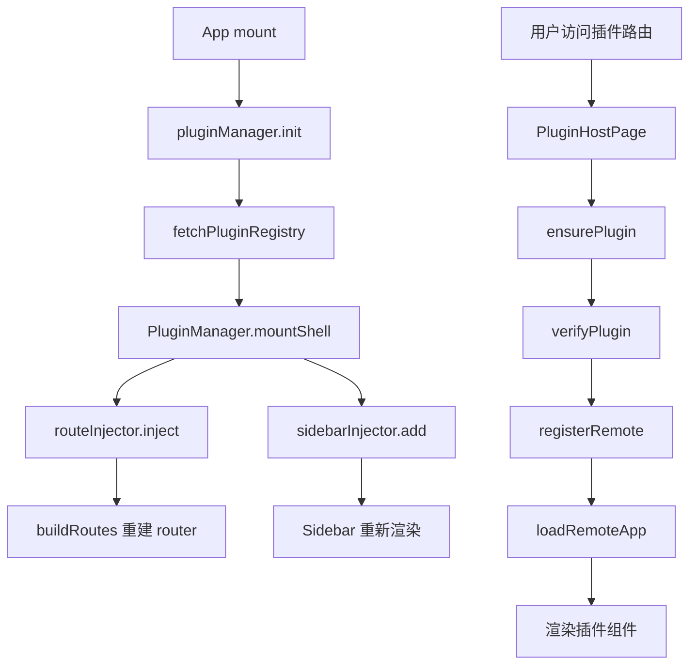
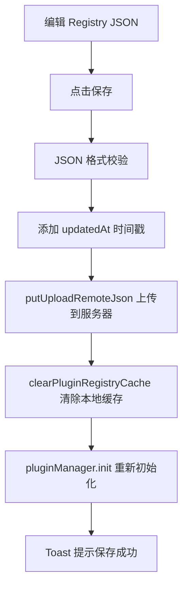

# 主项目接入子应用/插件使用手册

> **文档角色**：面向主项目开发者的插件接入实操手册，包含所有接入方式的具体代码和当前项目中的真实示例。
> **适用读者**：主项目前端开发者、需要在业务页面中接入插件的开发者。
> **目标**：帮助开发者清楚了解主项目如何接入、使用和管理插件。
> **同步说明**：与 `apps/frontend/src/plugins/**`、`apps/remote-plugins` 最新源码对齐（含 `api.locale`、iframe locale 推送、Host `@scope` 样式隔离）。若不一致，以源码为准。
> **插件图标**：动态 `menu.icon` / `host.icon` 现为 **SVG URL + `PluginIcon` 内联**，详见 [插件宿主图标.md](./插件宿主图标.md)（本手册中部分示例仍写旧 Lucide 名，以专题与源码为准）。

---

## 目录

1. [概述](#1-概述)
2. [插件系统核心架构](#2-插件系统核心架构)
3. [自动路由注入模式](#3-自动路由注入模式)
4. [业务内手动挂载模式](#4-业务内手动挂载模式)
5. [iframe 隔离模式接入](#5-iframe-隔离模式接入)
6. [电子书阅读页插件接入（完整示例）](#6-电子书阅读页插件接入完整示例)
7. [英语学习笔记页插件接入（完整示例）](#7-英语学习笔记页插件接入完整示例)
8. [插件中心管理页面](#8-插件中心管理页面)
9. [Registry 配置管理](#9-registry-配置管理)
10. [侧栏菜单动态注入](#10-侧栏菜单动态注入)
11. [路由系统与插件协同](#11-路由系统与插件协同)
12. [插件状态管理](#12-插件状态管理)
13. [HostBridge API 提供](#13-hostbridge-api-提供)
14. [语言（locale）同步](#14-语言locale同步)
15. [常见问题](#15-常见问题)

---

## 1. 概述

主项目（Host）通过 Module Federation 动态插件系统接入子应用/插件，支持三种接入模式：

| 接入模式           | 适用场景         | 特点                                        |
| ------------------ | ---------------- | ------------------------------------------- |
| **自动路由注入**   | 插件有独立页面   | PluginManager 自动注入路由和侧栏            |
| **业务内手动挂载** | 插件嵌入业务页面 | 开发者手动在业务页面中挂载 `PluginHostPage` |
| **iframe 隔离**    | 不可信插件       | 通过 iframe + postMessage 通信              |

---

## 2. 插件系统核心架构

### 2.1 核心模块关系

```
Host 应用
├── router/index.tsx          # App 组件：初始化插件系统
├── router/buildRoutes.ts     # 合并静态路由 + 动态插件路由
├── components/design/Sidebar # 侧栏：订阅插件菜单注入
├── plugins/
│   ├── index.ts              # 统一导出
│   ├── core/
│   │   ├── mf.ts             # MF Runtime API
│   │   ├── PluginManager.ts  # 插件生命周期管理
│   │   ├── types.ts          # 类型定义
│   │   ├── registry.ts       # Registry 拉取/缓存
│   │   ├── createHostBridge.ts  # HostBridge 构建
│   │   ├── PluginVerifier.ts    # 插件验证
│   │   ├── enabledOverrides.ts  # 本地上架/下架覆盖
│   │   └── attachIframeBridge.ts # iframe 通信桥
│   ├── inject/
│   │   ├── RouteInjector.ts     # 路由注入器
│   │   └── SidebarInjector.ts   # 侧栏注入器
│   ├── host/
│   │   ├── PluginHostPage.tsx   # 插件宿主页面（MF / iframe / locale 热更新）
│   │   ├── PluginErrorBoundary.tsx # 错误边界
│   │   └── styleIsolation.ts    # Remote CSS @scope 隔离
│   ├── host-api/
│   │   ├── EventBus.ts          # 事件总线
│   │   ├── ebookHostApi.ts      # 电子书模块 API
│   │   └── deepFreeze.ts        # 深度冻结
│   └── hooks/
│       └── usePluginEnabled.ts  # 插件启用状态 Hook
```

### 2.2 数据流



---

## 3. 自动路由注入模式

### 3.1 工作原理

当 Registry 中插件的 `injectRoute !== false` 时，PluginManager 会自动：

1. 注入顶层路由（`routePath`）
2. 注入侧栏菜单（如果有 `menu` 配置）
3. 用户访问路由时懒加载插件

### 3.2 Registry 配置示例

```json
{
	"id": "remoteDemo",
	"routePath": "/demo",
	"entry": "http://127.0.0.1:9005/mf-manifest.json",
	"version": "1.0.0",
	"hostApiRange": "^1.0.0",
	"menu": {
		"order": 10,
		"icon": "Sparkles",
		"nameKey": "plugin.demo.name"
	},
	"permissions": ["ui:toast", "nav:subtree"],
	"enabled": true,
	"trust": "first-party"
}
```

### 3.3 自动注入的代码流程

**PluginManager.mountShell 方法**：

```typescript
private mountShell(meta: PluginDescriptor) {
	// 注入顶层路由（除非 injectRoute 显式设置为 false）
	if (meta.injectRoute !== false) {
		routeInjector.inject(meta.id, [createPluginRoute(meta)]);
	}

	// 如果有菜单配置，添加到侧栏
	if (meta.menu) {
		sidebarInjector.add({
			pluginId: meta.id,
			path: meta.routePath,
			nameKey: meta.menu.nameKey ?? meta.titleKey ?? meta.id,
			icon: meta.menu.icon ?? 'Puzzle',
			order: meta.menu.order,
		});
	}
}
```

**PluginManager.createPluginRoute 方法**：

```typescript
function createPluginRoute(meta: PluginDescriptor): RouteConfig {
	const Page: ComponentType = () =>
		createElement(PluginHostPage, { pluginId: meta.id });
	return {
		path: meta.routePath,
		Component: Page,
		meta: {
			titleKey: meta.titleKey ?? meta.menu?.nameKey,
			title: meta.id,
		},
	};
}
```

### 3.4 路由合并

**buildRoutes.ts**：

```typescript
export function buildRoutes(): RouteConfig[] {
	const dynamic = routeInjector.getRoutes();
	if (dynamic.length === 0) return routes;

	// 将动态路由挂到 Layout 壳的 children 末尾
	return routes.map((route, index) => {
		if (index === 0 && route.children) {
			return {
				...route,
				children: [...route.children, ...dynamic],
			};
		}
		return route;
	});
}
```

### 3.5 不需要手动代码

自动路由注入模式下，**开发者无需在业务代码中写任何接入代码**，只需在 Registry 中配置插件即可。

---

## 4. 业务内手动挂载模式

### 4.1 适用场景

当插件需要嵌入到现有业务页面中时（如电子书阅读页中的想法列表、英语学习页中的笔记），使用此模式。

### 4.2 Registry 配置

```json
{
	"id": "ebookIdeasList",
	"routePath": "/ebook/plugins/ideas-list",
	"entry": "http://127.0.0.1:9008/mf-manifest.json",
	"version": "1.0.0",
	"hostApiRange": "^1.0.0",
	"remoteName": "remotePlugins",
	"expose": "./IdeasList",
	"injectRoute": false, // 不自动注入路由
	"permissions": ["ui:toast", "http:plugin-api", "modules:ebook"],
	"enabled": true,
	"trust": "first-party"
}
```

### 4.3 业务页面接入代码

**关键：`injectRoute: false` + 在业务页面中手动挂载 `PluginHostPage`**

#### 4.3.1 使用 `PluginHostPage` 组件

```tsx
import { PluginHostPage, usePluginEnabled } from "@/plugins";

function MyBusinessPage() {
	// 检查插件是否上架（本地上架/下架覆盖 + Registry 缓存）
	const enabled = usePluginEnabled("myPlugin");

	return (
		<div>
			{/* 业务内容 */}
			{enabled ? <PluginHostPage pluginId="myPlugin" /> : <p>插件未上架</p>}
		</div>
	);
}
```

#### 4.3.2 `usePluginEnabled` Hook 实现

```typescript
import { useEffect, useState } from "react";
import {
	isPluginEnabled,
	subscribePluginEnabled,
} from "../core/enabledOverrides";

/** 订阅本地上架状态，用于业务入口条件渲染 */
export function usePluginEnabled(pluginId: string): boolean {
	const [enabled, setEnabled] = useState(() => isPluginEnabled(pluginId));

	useEffect(() => {
		const sync = () => setEnabled(isPluginEnabled(pluginId));
		sync();
		return subscribePluginEnabled(sync);
	}, [pluginId]);

	return enabled;
}
```

#### 4.3.3 `enabledOverrides.ts` 核心逻辑

```typescript
const OVERRIDES_KEY = "dnhyxc.plugin.enabledOverrides.v1";

/** 本地上架/下架覆盖（优先于 registry 磁盘 enabled） */
export function getEnabledOverrides(): Record<string, boolean> {
	try {
		const raw = localStorage.getItem(OVERRIDES_KEY);
		if (!raw) return {};
		const data = JSON.parse(raw) as Record<string, boolean>;
		return data && typeof data === "object" ? data : {};
	} catch {
		return {};
	}
}

export function setEnabledOverride(id: string, enabled: boolean) {
	const next = { ...getEnabledOverrides(), [id]: enabled };
	localStorage.setItem(OVERRIDES_KEY, JSON.stringify(next));
}

/** 同步判断插件是否上架：本地覆盖 > registry 缓存原始 enabled */
export function isPluginEnabled(id: string): boolean {
	const o = getEnabledOverrides();
	if (id in o) return o[id]!;
	try {
		const cacheKey = `dnhyxc.plugin.registry.${import.meta.env.PROD ? "prod" : "dev"}.v1`;
		const cached = localStorage.getItem(cacheKey);
		if (!cached) return false;
		const data = JSON.parse(cached) as PluginRegistry;
		const p = data.plugins?.find((x) => x.id === id);
		return p?.enabled ?? false;
	} catch {
		return false;
	}
}
```

---

## 5. iframe 隔离模式接入

### 5.1 适用场景

不可信插件（`trust: untrusted`），需要通过 iframe 隔离运行。

### 5.2 Registry 配置

```json
{
	"id": "thirdPartyPlugin",
	"routePath": "/third-party",
	"entry": "https://example.com:9009/mf-manifest.json",
	"version": "1.0.0",
	"hostApiRange": "^1.0.0",
	"menu": {
		"order": 20,
		"icon": "ExternalLink",
		"nameKey": "plugin.thirdparty.name"
	},
	"permissions": ["ui:toast", "http:plugin-api"],
	"enabled": true,
	"trust": "untrusted",
	"iframeUrl": "https://example.com:9009/embed/third-party"
}
```

### 5.3 Host 端 iframe 处理

**PluginManager.runLoad 方法中的 untrusted 处理**：

```typescript
private async runLoad(meta: PluginDescriptor) {
	// ...
	try {
		await verifyPlugin(meta);

		// untrusted：仅激活壳，由 PluginHostPage 渲染 iframe，不进 MF
		if (meta.trust === 'untrusted') {
			this.plugins.set(meta.id, {
				meta,
				bridge: createHostBridge(meta, nav),
				mod: { default: () => null },
				status: 'activated',
			});
			return;
		}
		// ...
	}
}
```

**PluginHostPage 中 iframe / MF 渲染**（与源码一致的关键路径）：

```tsx
// apps/frontend/src/plugins/host/PluginHostPage.tsx（摘录）
if (loaded?.status === 'activated') {
	if (loaded.meta.trust === 'untrusted') {
		const src = loaded.meta.iframeUrl?.trim();
		// 缺 iframeUrl → 展示 plugins.host.missingIframeUrl
		// iframe 语言靠 attachIframeBridge 的 init + onListen('locale')，勿传 liveBridge（避免重挂）
		return (
			<PluginErrorBoundary pluginId={pluginId}>
				<UntrustedIframe pluginId={pluginId} src={src} bridge={loaded.bridge} />
			</PluginErrorBoundary>
		);
	}
	// MF：withLiveLocale(bridge, locale) + data-mf-plugin 包装 + 样式隔离
	return (
		<PluginErrorBoundary pluginId={pluginId}>
			<div className={`plugin-${pluginId} h-full w-full`} data-mf-plugin={pluginId} data-plugin-root>
				<Comp {...liveBridge} />
			</div>
		</PluginErrorBoundary>
	);
}
```

`UntrustedIframe` 在 `useEffect` 里调用 `attachIframeBridge(el, bridge, origin)`；sandbox 为  
`allow-scripts allow-same-origin allow-forms allow-popups`。

### 5.4 iframe Bridge 通信

**协议 channel**：`dnhyxc-mf-iframe`

| type | 方向 | 载荷 | 用途 |
|------|------|------|------|
| `ready` | iframe → Host | `{ pluginId }` | 握手；Host 回 `init` |
| `init` | Host → iframe | `{ theme, locale, plugin }` | 初始上下文 |
| `locale` | Host → iframe | `{ locale }` | Host 顶栏语言热更新 |
| `rpc` | iframe → Host | `{ id, method, args }` | 能力调用 |
| `rpc-result` | Host → iframe | `{ id, ok, value?/error? }` | RPC 响应 |

**RPC 白名单**：`http.get|post|put|delete`、`ui.showToast`、`ebook.getBookId|getBookTitle|navigateToCfi|openThought|closeIdeasList`  
（是否真正可用仍取决于 bridge 上 permissions 是否注入了对应能力）

```typescript
// apps/frontend/src/plugins/core/attachIframeBridge.ts（摘录）
export function attachIframeBridge(
	iframe: HTMLIFrameElement,
	bridge: HostBridgeProps,
	targetOrigin: string,
): () => void {
	const sendInit = () => {
		iframe.contentWindow?.postMessage(
			{
				channel: MF_IFRAME_CHANNEL,
				type: 'init',
				theme: bridge.api.theme,
				locale: getActiveLocale(),
				plugin: bridge.plugin,
			},
			targetOrigin,
		);
	};
	// onListen('locale') → postMessage { type: 'locale', locale }
	// ready → sendInit；rpc → dispatchRpc → rpc-result
	// ...
}
```

---

## 6. 电子书阅读页插件接入（完整示例）

### 6.1 业务场景

在电子书阅读页（`/ebook/:bookId`）的右侧面板中，通过 Tab 切换显示插件内容（如想法列表）。

### 6.2 完整代码

**文件路径**：`apps/frontend/src/views/ebook/read.tsx`

```tsx
/**
 * 电子书阅读页（简化版）
 * - 左侧：电子书渲染区域
 * - 右侧：Tab 面板（目录/想法列表/AI 助手）
 * - 想法列表通过 PluginHostPage 接入 MF 插件
 */
import { useCallback, useEffect, useRef, useState } from "react";
import { useParams } from "react-router";
import { useI18n } from "@/hooks";
import { PluginHostPage, usePluginEnabled } from "@/plugins";
import { getEbookBook, saveEbookProgress } from "@/service";
import { setEbookHostHandlers } from "@/plugins/host-api/ebookHostApi";

export default function EbookReadPage() {
	const { t } = useI18n();
	const { bookId } = useParams<{ bookId: string }>();

	// 电子书相关状态
	const [book, setBook] = useState<EbookBookDetail | null>(null);
	const [activeTab, setActiveTab] = useState<"toc" | "ideas" | "ai">("toc");
	const [currentCfi, setCurrentCfi] = useState("");

	// 想法列表插件上架状态
	const ideasEnabled = usePluginEnabled("ebookIdeasList");

	// 加载书籍信息
	useEffect(() => {
		if (!bookId) return;
		getEbookBook(bookId).then(setBook);
	}, [bookId]);

	// 注册电子书 Host API（供插件调用）
	useEffect(() => {
		if (!bookId) return;
		setEbookHostHandlers({
			getBookId: () => bookId,
			getBookTitle: () => book?.title ?? null,
			navigateToCfi: (cfi: string) => {
				setCurrentCfi(cfi);
				// 实际导航到 CFI 位置...
			},
			openThought: (thought) => {
				// 打开想法详情...
				console.log("打开想法:", thought);
			},
			closeIdeasList: () => {
				setActiveTab("toc");
			},
		});
		return () => setEbookHostHandlers(null);
	}, [bookId, book]);

	// 保存阅读进度
	const handleProgressChange = useCallback(
		(cfi: string, percent: number) => {
			if (!bookId) return;
			saveEbookProgress({
				bookId,
				epubCfi: cfi,
				percent,
			});
		},
		[bookId],
	);

	return (
		<div className="flex h-full w-full">
			{/* 左侧：电子书渲染区域 */}
			<div className="flex-1 min-h-0">
				<EbookRenderer
					bookId={bookId}
					currentCfi={currentCfi}
					onProgressChange={handleProgressChange}
				/>
			</div>

			{/* 右侧：Tab 面板 */}
			<div className="w-80 border-l border-theme-border flex flex-col">
				{/* Tab 切换 */}
				<div className="flex border-b border-theme-border">
					<button
						className={cn(
							"flex-1 py-2 text-sm",
							activeTab === "toc" && "text-theme border-b-2 border-theme",
						)}
						onClick={() => setActiveTab("toc")}
					>
						{t("ebook.toc")}
					</button>
					<button
						className={cn(
							"flex-1 py-2 text-sm",
							activeTab === "ideas" && "text-theme border-b-2 border-theme",
						)}
						onClick={() => setActiveTab("ideas")}
					>
						{t("ebook.ideas")}
					</button>
					<button
						className={cn(
							"flex-1 py-2 text-sm",
							activeTab === "ai" && "text-theme border-b-2 border-theme",
						)}
						onClick={() => setActiveTab("ai")}
					>
						AI
					</button>
				</div>

				{/* Tab 内容 */}
				<div className="flex-1 min-h-0 overflow-auto">
					{activeTab === "toc" && <EbookToc bookId={bookId} />}

					{/* 想法列表：通过 PluginHostPage 接入 MF 插件 */}
					{activeTab === "ideas" &&
						(ideasEnabled ? (
							<PluginHostPage pluginId="ebookIdeasList" />
						) : (
							<div className="p-4 text-sm text-textcolor/55">
								{t("plugins.host.delisted")}
							</div>
						))}

					{activeTab === "ai" && <EbookAIAssistant bookId={bookId} />}
				</div>
			</div>
		</div>
	);
}
```

### 6.3 关键接入点

| 接入点        | 代码                                           | 说明               |
| ------------- | ---------------------------------------------- | ------------------ |
| 插件状态检查  | `usePluginEnabled('ebookIdeasList')`           | 检查插件是否上架   |
| 插件渲染      | `<PluginHostPage pluginId="ebookIdeasList" />` | 挂载插件组件       |
| Host API 注册 | `setEbookHostHandlers({...})`                  | 注册电子书相关 API |
| 权限配置      | `permissions: ["modules:ebook"]`               | 插件需要此权限     |

### 6.4 电子书 Host API 实现

**文件路径**：`apps/frontend/src/plugins/host-api/ebookHostApi.ts`

```typescript
export type EbookHostThought = {
	id: string;
	userId: number | string;
	cfiRange: string;
	quote: string;
	content: string;
	username?: string;
	avatar?: string;
	createdAt?: string;
	updatedAt?: string;
	isPublic?: boolean;
};

export type EbookHostHandlers = {
	getBookId: () => string | null;
	getBookTitle: () => string | null;
	navigateToCfi: (cfi: string) => void | Promise<void>;
	openThought: (thought: EbookHostThought) => void;
	closeIdeasList?: () => void;
};

let handlers: EbookHostHandlers | null = null;

export function setEbookHostHandlers(next: EbookHostHandlers | null) {
	handlers = next;
}

export function getEbookHostHandlers(): EbookHostHandlers | null {
	return handlers;
}

export function createEbookModulesApi() {
	return Object.freeze({
		getBookId: () => handlers?.getBookId() ?? null,
		getBookTitle: () => handlers?.getBookTitle() ?? null,
		navigateToCfi: (cfi: string) => {
			const fn = handlers?.navigateToCfi;
			if (!fn) throw new Error("EBOOK_API_UNBOUND");
			return fn(cfi);
		},
		openThought: (thought: EbookHostThought) => {
			const fn = handlers?.openThought;
			if (!fn) throw new Error("EBOOK_API_UNBOUND");
			fn(thought);
		},
		closeIdeasList: () => {
			handlers?.closeIdeasList?.();
		},
	});
}
```

### 6.5 插件端使用电子书 API

**文件路径**：`apps/remote-plugins/src/views/ebook-ideas/index.tsx`（简化版）

```typescript
export default function IdeasListApp({ api }: HostBridgeProps) {
	// 获取电子书模块 API
	const ebook = api.modules?.ebook as EbookModules | undefined;

	// 获取当前书籍 ID
	const bookId = ebook?.getBookId() ?? null;
	const bookTitle = ebook?.getBookTitle() ?? null;

	// 点击想法时导航到对应位置
	const onOpen = (thought: Thought) => {
		const cfi = thought.cfiRange?.trim();
		if (cfi) void ebook?.navigateToCfi(cfi);
		ebook?.openThought(thought);
		ebook?.closeIdeasList?.();
	};

	return (
		<div data-plugin-root className="...">
			{bookTitle ? <div>{bookTitle}</div> : null}
			{/* 想法列表渲染 */}
		</div>
	);
}
```

---

## 7. 英语学习笔记页插件接入（完整示例）

### 7.1 业务场景

英语学习页面的"学习笔记"Tab 中，通过 PluginHostPage 接入笔记插件。

### 7.2 完整代码

**文件路径**：`apps/frontend/src/views/englishLearning/notes/index.tsx`

```tsx
/**
 * 英语学习 · 学习笔记（MF 插件宿主页）
 */
import { useI18n } from "@/hooks";
import { PluginHostPage, usePluginEnabled } from "@/plugins";
import { EnglishLearningPanelHeader } from "../components/EnglishLearningPanelHeader";

export default function EnglishLearningNotesPage() {
	const { t } = useI18n();

	// 检查 learningNotes 插件是否上架
	const enabled = usePluginEnabled("learningNotes");

	return (
		<div className="flex min-h-0 h-full w-full flex-col">
			<div className="box-border flex h-full min-h-0 w-full min-w-0 flex-col p-5.5 pt-0">
				<div className="flex min-h-0 min-w-0 flex-1 flex-col overflow-hidden rounded-md bg-theme-background">
					<EnglishLearningPanelHeader
						title={t("route.englishLearning.notes.title")}
					/>
					<div className="min-h-0 flex-1 overflow-auto px-4 pb-4">
						{enabled ? (
							// 插件已上架：渲染插件内容
							<PluginHostPage pluginId="learningNotes" />
						) : (
							// 插件未上架：显示提示文案
							<p className="text-textcolor/55 text-sm">
								{t("plugins.host.delisted")}
							</p>
						)}
					</div>
				</div>
			</div>
		</div>
	);
}
```

### 7.3 接入要点

| 要点                                          | 说明                            |
| --------------------------------------------- | ------------------------------- |
| `usePluginEnabled('learningNotes')`           | 检查插件上架状态                |
| `<PluginHostPage pluginId="learningNotes" />` | 挂载插件                        |
| `injectRoute: false`                          | Registry 中配置为不自动注入路由 |
| 降级显示                                      | 插件未上架时显示提示文案        |

---

## 8. 插件中心管理页面

### 8.1 功能

- 展示所有已注册的插件
- 支持上架/下架插件（本地上架/下架覆盖）
- 显示插件信息（ID、版本、路由、信任等级等）

### 8.2 完整代码

**文件路径**：`apps/frontend/src/views/plugins/index.tsx`

```tsx
import { SquarePen } from "lucide-react";
import { useCallback, useEffect, useState } from "react";
import { useNavigate } from "react-router";
import { Button } from "@/components/ui/button";
import {
	Card,
	CardContent,
	CardDescription,
	CardHeader,
	CardTitle,
} from "@/components/ui/card";
import { Switch } from "@/components/ui/switch";
import { useI18n } from "@/hooks";
import { cn } from "@/lib/utils";
import {
	fetchPluginRegistry,
	type PluginDescriptor,
	pluginManager,
} from "@/plugins";

/** 获取插件标题：优先 i18n， fallback 到 id */
function pluginTitle(p: PluginDescriptor, t: (k: string) => string) {
	const key = p.titleKey ?? p.menu?.nameKey;
	if (key) {
		const label = t(key);
		if (label && label !== key) return label;
	}
	return p.id;
}

/** 获取插件描述：优先 i18n，其次 description，最后默认文案 */
function pluginBlurb(p: PluginDescriptor, t: (k: string) => string) {
	if (p.descriptionKey) {
		const label = t(p.descriptionKey);
		if (label && label !== p.descriptionKey) return label;
	}
	if (p.description?.trim()) return p.description.trim();
	return t("plugins.card.noDesc");
}

export default function PluginsPage() {
	const { t } = useI18n();
	const navigate = useNavigate();
	const [plugins, setPlugins] = useState<PluginDescriptor[]>([]);
	const [busyId, setBusyId] = useState<string | null>(null);
	const [error, setError] = useState<string | null>(null);

	// 刷新插件列表
	const refresh = useCallback(async () => {
		try {
			const reg = await fetchPluginRegistry({ force: true });
			setPlugins(reg.plugins);
			setError(null);
		} catch (e) {
			setError(e instanceof Error ? e.message : String(e));
		}
	}, []);

	useEffect(() => {
		void refresh();
	}, [refresh]);

	// 上架/下架插件
	const onToggle = async (id: string, enabled: boolean) => {
		setBusyId(id);
		try {
			await pluginManager.setEnabled(id, enabled);
			await refresh();
		} catch (e) {
			setError(e instanceof Error ? e.message : String(e));
		} finally {
			setBusyId(null);
		}
	};

	return (
		<div className="box-border flex h-full min-h-0 w-full flex-col p-5.5 pt-0">
			<div className="p-4 pt-1.5 flex-1 bg-theme-background rounded-md">
				{/* 头部：描述 + 编辑 Registry 按钮 */}
				<div className="mb-2 flex shrink-0 items-center justify-between gap-3">
					<p className="text-textcolor/55 min-w-0 flex-1 text-sm leading-relaxed">
						{t("plugins.page.desc")}
					</p>
					<Button
						type="button"
						variant="link"
						size="sm"
						className="text-textcolor px-0! gap-1"
						onClick={() => navigate("/plugins/registry")}
					>
						<SquarePen className="size-4" />
						{t("plugins.page.editRegistry")}
					</Button>
				</div>

				{error ? (
					<p className="text-destructive mb-3 text-sm">{error}</p>
				) : null}

				{plugins.length === 0 ? (
					<p className="text-textcolor/55 text-sm">{t("plugins.page.empty")}</p>
				) : (
					<div className="grid min-h-0 grid-cols-1 gap-4 overflow-auto sm:grid-cols-2 xl:grid-cols-3">
						{plugins.map((p) => {
							const onShelf = p.enabled;
							const busy = busyId === p.id;
							return (
								<Card
									key={p.id}
									className={cn(
										"gap-2 py-4 flex flex-col justify-around border border-theme/5 bg-theme/5",
										!onShelf && "opacity-80",
									)}
								>
									<CardHeader className="grid-cols-1 gap-2 px-4">
										<div className="flex items-center justify-between gap-3">
											<CardTitle className="min-w-0 flex-1 text-base">
												{pluginTitle(p, t)}
											</CardTitle>
											<div className="flex shrink-0 items-center gap-2">
												<span className="text-textcolor/55 text-xs">
													{onShelf
														? t("plugins.shelf.on")
														: t("plugins.shelf.off")}
												</span>
												<Switch
													checked={onShelf}
													disabled={busy}
													onCheckedChange={(v) => void onToggle(p.id, v)}
												/>
											</div>
										</div>
										<CardDescription className="text-textcolor/70 line-clamp-3 text-sm">
											{pluginBlurb(p, t)}
										</CardDescription>
									</CardHeader>
									<CardContent className="px-4 text-xs text-textcolor/45">
										<p className="font-mono">
											{p.id} · v{p.version}
										</p>
										<p className="mt-1 truncate">
											{t("plugins.card.route")}: {p.routePath}
										</p>
										<p className="mt-1">
											{t("plugins.card.trust")}: {p.trust}
										</p>
									</CardContent>
								</Card>
							);
						})}
					</div>
				)}
			</div>
		</div>
	);
}
```

### 8.3 关键操作

| 操作          | 代码                                    | 说明                          |
| ------------- | --------------------------------------- | ----------------------------- |
| 拉取 Registry | `fetchPluginRegistry({ force: true })`  | 强制刷新插件列表              |
| 上架/下架     | `pluginManager.setEnabled(id, enabled)` | 写入本地覆盖并挂载/卸载       |
| 刷新后重载    | `pluginManager.init()`                  | Registry 编辑保存后重新初始化 |

---

## 9. Registry 配置管理

### 9.1 功能

提供一个 Monaco Editor 界面，用于直接编辑 Registry JSON 文件。

### 9.2 完整代码

**文件路径**：`apps/frontend/src/views/plugins/registry.tsx`

```tsx
import { Toast } from "@ui/sonner";
import { FileJson2, ListRestart, Save } from "lucide-react";
import { useCallback, useEffect, useMemo, useRef, useState } from "react";
import MarkdownEditor from "@/components/design/Monaco";
import { Button } from "@/components/ui/button";
import { useI18n, useTheme } from "@/hooks";
import {
	clearPluginRegistryCache,
	fetchPluginRegistryRawText,
	PLUGIN_REGISTRY_FILENAME,
	pluginManager,
} from "@/plugins";
import { putUploadRemoteJson } from "@/service";
import { copyToClipboard, pasteFromClipboard } from "@/utils/clipboard";

export default function PluginRegistryEditorPage() {
	const { t } = useI18n();
	const { theme } = useTheme();

	const monacoTheme = useMemo(
		() => (theme === "black" ? "vs-dark" : "vs"),
		[theme],
	);

	const [text, setText] = useState("");
	const [loading, setLoading] = useState(true);
	const [saving, setSaving] = useState(false);
	const [loadError, setLoadError] = useState<string | null>(null);
	const textRef = useRef<string>(text);

	// JSON 格式校验
	const jsonParseError = useMemo(() => {
		if (!text.trim()) return true;
		try {
			const data = JSON.parse(text) as { plugins?: unknown };
			return !Array.isArray(data.plugins);
		} catch {
			return true;
		}
	}, [text]);

	// 是否有修改
	const textDiff = useMemo(() => {
		return textRef.current !== text;
	}, [text, textRef.current]);

	// 加载 Registry 原文
	const load = useCallback(async () => {
		setLoading(true);
		setLoadError(null);
		try {
			const raw = await fetchPluginRegistryRawText();
			setText(raw);
			textRef.current = raw;
		} catch (e) {
			setLoadError(e instanceof Error ? e.message : String(e));
		} finally {
			setLoading(false);
		}
	}, []);

	useEffect(() => {
		void load();
	}, [load]);

	// 保存 Registry
	const onSave = async () => {
		if (!textDiff) {
			Toast({ type: "info", title: t("plugins.registry.noChanges") });
			return;
		}
		if (jsonParseError) {
			Toast({ type: "warning", title: t("plugins.registry.invalidJson") });
			return;
		}
		setSaving(true);
		try {
			const data = JSON.parse(text) as Record<string, unknown>;
			const now = new Date();
			const pad = (n: number) => String(n).padStart(2, "0");
			data.updatedAt = `${now.getFullYear()}/${pad(now.getMonth() + 1)}/${pad(now.getDate())} ${pad(now.getHours())}:${pad(now.getMinutes())}:${pad(now.getSeconds())}`;
			const payload = `${JSON.stringify(data, null, 2)}\n`;

			// 上传到服务器
			await putUploadRemoteJson(PLUGIN_REGISTRY_FILENAME, payload);
			setText(payload);
			textRef.current = payload;

			// 清除缓存并重新初始化插件系统
			clearPluginRegistryCache();
			await pluginManager.init();

			Toast({ type: "success", title: t("plugins.registry.saveOk") });
		} catch (e) {
			Toast({
				type: "error",
				title: e instanceof Error ? e.message : t("plugins.registry.saveFail"),
			});
		} finally {
			setSaving(false);
		}
	};

	return (
		<div className="box-border flex h-full min-h-0 w-full flex-col p-5.5 pt-0">
			{/* Monaco Editor 编辑 Registry JSON */}
			<MarkdownEditor
				value={text}
				readOnly={saving}
				onChange={setText}
				language="json"
				theme={monacoTheme}
				height="100%"
				title={
					<div className="flex flex-1 items-center justify-between">
						<span>{PLUGIN_REGISTRY_FILENAME}</span>
						<div className="flex gap-2">
							<Button onClick={() => void load()}>
								<ListRestart />
								{t("plugins.registry.reload")}
							</Button>
							<Button onClick={() => void onSave()}>
								<Save />
								{t("plugins.registry.save")}
							</Button>
						</div>
					</div>
				}
			/>
		</div>
	);
}
```

### 9.3 保存流程



---

## 10. 侧栏菜单动态注入

### 10.1 Sidebar 组件订阅插件菜单

**文件路径**：`apps/frontend/src/components/design/Sidebar/index.tsx`

```tsx
import { sidebarInjector } from "@/plugins";

const Sidebar = observer(() => {
	const navigate = useNavigate();
	const [pluginMenus, setPluginMenus] = useState(() => [
		...sidebarInjector.items,
	]);

	// 订阅侧栏注入变化
	useEffect(() => {
		const sync = () => setPluginMenus([...sidebarInjector.items]);
		sync();
		return sidebarInjector.subscribe(sync);
	}, []);

	// 合并静态菜单 + 动态插件菜单
	const visibleMenus = useMemo(() => {
		const loggedIn = hasValidAuthToken();
		const dynamic = pluginMenus.map((m) => ({
			nameKey: m.nameKey,
			icon: m.icon,
			path: m.path,
			requiresAuth: m.requiresAuth,
		}));
		return [...MENUS, ...dynamic].filter(
			(menu) => !menu.requiresAuth || loggedIn,
		);
	}, [storageInfo, pluginMenus]);

	// 渲染菜单
	return (
		<div>
			{processedMenus.map((item) => (
				<div key={item.path} onClick={() => navigate(item.path)}>
					{item.icon}
				</div>
			))}
		</div>
	);
});
```

### 10.2 侧栏注入器

**文件路径**：`apps/frontend/src/plugins/inject/SidebarInjector.ts`

```typescript
class SidebarInjectorImpl {
	private _items: PluginSidebarItem[] = [];
	private listeners = new Set<() => void>();

	get items() {
		return this._items;
	}

	add(item: PluginSidebarItem) {
		const prev = this._items.find((x) => x.pluginId === item.pluginId);
		// 字段全相同则跳过（幂等）
		if (
			prev &&
			prev.path === item.path &&
			prev.nameKey === item.nameKey &&
			prev.icon === item.icon &&
			prev.order === item.order
		) {
			return;
		}
		this._items = [
			...this._items.filter((x) => x.pluginId !== item.pluginId),
			item,
		].sort((a, b) => a.order - b.order);
		this.notify();
	}

	remove(pluginId: string) {
		const next = this._items.filter((x) => x.pluginId !== pluginId);
		if (next.length === this._items.length) return;
		this._items = next;
		this.notify();
	}

	subscribe(fn: () => void) {
		this.listeners.add(fn);
		return () => this.listeners.delete(fn);
	}

	private notify() {
		for (const fn of this.listeners) fn();
	}
}

export const sidebarInjector = new SidebarInjectorImpl();
```

---

## 11. 路由系统与插件协同

### 11.1 App 组件初始化插件系统

**文件路径**：`apps/frontend/src/router/index.tsx`

```tsx
import { pluginManager, routeInjector } from "@/plugins";
import { buildRoutes } from "./buildRoutes";

const App = () => {
	const [routeEpoch, setRouteEpoch] = useState(0);

	useEffect(() => {
		// 订阅路由注入变化
		const unsub = routeInjector.subscribe(() => {
			setRouteEpoch((n) => n + 1);
		});

		// 启动插件系统
		void pluginManager
			.init()
			.then(() => setRouteEpoch((n) => n + 1))
			.catch((e) => console.error("[plugins] init failed", e));

		return unsub;
	}, []);

	// 根据 epoch 重建 router
	const router = useMemo(() => {
		const r = createBrowserRouter(buildRoutes() as RouteObject[]);

		// 把 SPA navigate 注入 Manager
		pluginManager.setNavigate((to) => {
			void r.navigate(to);
		});

		return r;
	}, [routeEpoch]);

	return (
		<div className="h-full w-full bg-theme-background">
			<Toaster />
			<RouterProvider router={router} />
		</div>
	);
};
```

### 11.2 路由注入器

**文件路径**：`apps/frontend/src/plugins/inject/RouteInjector.ts`

```typescript
class RouteInjectorImpl {
	private byPlugin = new Map<string, RouteConfig[]>();
	private listeners = new Set<() => void>();

	inject(pluginId: string, routes: RouteConfig[]) {
		const prev = this.byPlugin.get(pluginId);
		// 相同 path 集合不 notify（幂等）
		if (
			prev &&
			prev.length === routes.length &&
			prev.every((r, i) => r.path === routes[i]?.path)
		) {
			return;
		}
		this.byPlugin.set(pluginId, routes);
		this.notify();
	}

	remove(pluginId: string) {
		if (!this.byPlugin.delete(pluginId)) return;
		this.notify();
	}

	getRoutes(): RouteConfig[] {
		return [...this.byPlugin.values()].flat();
	}

	subscribe(fn: () => void) {
		this.listeners.add(fn);
		return () => this.listeners.delete(fn);
	}

	private notify() {
		for (const fn of this.listeners) fn();
	}
}

export const routeInjector = new RouteInjectorImpl();
```

---

## 12. 插件状态管理

### 12.1 PluginManager 状态机

```
registered -> loading -> activated
    |           |         |
    |           |         v
    |           |      failed (可重试)
    |           |
    +-----------+------> unloaded
```

### 12.2 状态查询

```typescript
// 获取插件状态
const plugin = pluginManager.get("myPlugin");
console.log(plugin?.status); // 'registered' | 'loading' | 'activated' | 'failed' | 'unloaded'

// 获取所有已加载插件
const allPlugins = pluginManager.list();

// 确保插件可用（按需加载）
await pluginManager.ensurePlugin("myPlugin");

// 强制重新加载
await pluginManager.ensurePlugin("myPlugin", { force: true });
```

### 12.3 上架/下架

```typescript
// 上架插件（挂载壳 + 允许加载）
await pluginManager.setEnabled("myPlugin", true);

// 下架插件（卸载 + 禁止加载）
await pluginManager.setEnabled("myPlugin", false);
```

---

## 13. HostBridge API 提供

### 13.1 Bridge 构建

**文件路径**：`apps/frontend/src/plugins/core/createHostBridge.ts`

```typescript
// apps/frontend/src/plugins/core/createHostBridge.ts（摘录）
export function createHostBridge(
	d: PluginDescriptor,
	navigate: (to: string) => void,
): HostBridgeProps {
	const allow = new Set(d.permissions);
	const api: Record<string, unknown> = {
		theme: readTheme(),           // 创建时快照；MF 无 theme 热推送
		locale: readLocale(),         // zh-CN | en-US；插件自维护文案，只跟 locale
		event: {
			on: (event, handler) => eventBus.on(d.id, event, handler),
			off: (event, handler) => eventBus.off(d.id, event, handler),
			emit: (event, data?) => eventBus.emit(d.id, event, data),
		},
	};
	// 按 permissions 注入 ui / navigate / http(get|post|put|delete) / modules.*
	// 未授权字段不存在；返回 deepFreeze(...)
}
```

**始终提供（无需 permission）**：`api.theme`、`api.locale`、`api.event`。

### 13.2 权限说明

| 权限 | 提供的 API | 说明 |
|------|-----------|------|
| （无） | `api.theme` / `api.locale` / `api.event` | 主题快照、语言、插件域事件总线 |
| `ui:toast` | `api.ui.showToast` | Toast |
| `nav:subtree` | `api.navigate` | 仅允许 `to.startsWith(routePath)` |
| `http:plugin-api` | `api.http.get/post/put/delete` | 经 Host `@/utils/fetch` |
| `modules:chat` | `api.modules.openThread` | 打开 `/chat/c/:id` |
| `modules:ebook` | `api.modules.ebook.*` | 阅读页绑定的 ebook Host API |

> **注意**：Host **不再**注入 `api.t`。插件用自有 i18n 字典，只跟随 `api.locale`（见下一节）。

---

## 14. 语言（locale）同步

设计原则：**Host 只同步 locale 枚举，不传翻译字符串**；插件维护自己的 `t()`。

| 模式 | 机制 |
|------|------|
| MF（first-party / partner） | `PluginHostPage` 用 `withLiveLocale` 覆盖 props；并 `eventBus.emit(pluginId, 'locale', locale)` |
| iframe（untrusted） | `attachIframeBridge`：`init.locale` + `onListen('locale')` → `postMessage type:'locale'` |
| Remote 侧 | `useHostLocale(api)`：读 `api.locale` + 订阅 `api.event.on('locale')` → `applyHostLocale` |

Host 语言切换入口：`apps/frontend/src/hooks/i18n.ts` → `setLocale` → `onEmit('locale', next)`。

**Theme**：仅 bridge 创建时快照（iframe 仅 `init` 一次）；**无** theme 热同步。

---

## 15. 常见问题

### Q1：如何在新页面中接入插件？

**步骤**：

1. 在 Registry 中配置插件（`injectRoute: false`）
2. 在业务页面中导入 `PluginHostPage` 和 `usePluginEnabled`
3. 使用 `usePluginEnabled` 检查插件状态
4. 使用 `PluginHostPage` 渲染插件

```tsx
import { PluginHostPage, usePluginEnabled } from "@/plugins";

function NewPage() {
	const enabled = usePluginEnabled("myPlugin");
	return enabled ? (
		<PluginHostPage pluginId="myPlugin" />
	) : (
		<div>插件未上架</div>
	);
}
```

### Q2：如何提供自定义 Host API 给插件？

**步骤**：

1. 在 `host-api/` 目录下创建 API 模块
2. 在 `createHostBridge.ts` 中根据权限注入
3. 在 Registry 中配置对应权限

```typescript
// host-api/myApi.ts
export function createMyModulesApi() {
	return Object.freeze({
		myMethod: () => {
			/* ... */
		},
	});
}

// createHostBridge.ts
if (allow.has("modules:my")) {
	api.modules = { ...api.modules, my: createMyModulesApi() };
}
```

### Q3：插件加载失败如何排查？

1. 检查 Console 错误信息
2. 检查 Network 面板 `mf-manifest.json` 是否加载成功
3. 检查 `pluginManager.get('pluginId')?.status`
4. 检查 Registry 配置是否正确
5. 检查 Remote 是否启动且 CORS 配置正确

### Q4：如何调试插件？

```javascript
// 查看插件状态
pluginManager
	.list()
	.map((p) => ({ id: p.meta.id, status: p.status, error: p.error }));

// 强制重新加载
await pluginManager.ensurePlugin("myPlugin", { force: true });

// 查看 Registry
await fetchPluginRegistry({ force: true });

// 清除缓存
localStorage.removeItem("dnhyxc.plugin.registry.dev.v1");
```

### Q5：插件版本更新后如何生效？

1. 更新 Registry 中的 `version` 字段
2. 保存 Registry（会自动调用 `pluginManager.init()`）
3. PluginManager 会检测到版本变化并重新加载

---

## 附录

### A. 当前已接入的插件清单

| 插件 ID          | 接入模式       | 所在页面                | Registry 配置               |
| ---------------- | -------------- | ----------------------- | --------------------------- |
| `ebookIdeasList` | 业务内手动挂载 | 电子书阅读页（右侧Tab） | `injectRoute: false`        |
| `learningNotes`  | 业务内手动挂载 | 英语学习笔记页          | `injectRoute: false`        |
| `remoteDemo`     | 自动路由注入   | 独立页面 `/demo`        | `injectRoute: true`（默认） |

### B. 样式隔离（Host 责任）

`first-party` / `partner`：Host `styleIsolation.ts` 在 loadRemote / 挂载期间把 Remote 注入的 CSS 包进  
`@scope ([data-mf-plugin="id"])`。Remote **可用**正常 `@import "tailwindcss"`。  
`untrusted` 走 iframe，天然隔离。

### C. 参考文档

- [模块联邦实现指南.md](../plugins/模块联邦实现指南.md)：实现过程文档
- [插件开发指南.md](../plugins/插件开发指南.md)：插件开发手册
- 源码旁副本：`apps/frontend/src/plugins/docs/` 下同名文件（以源码为准）
